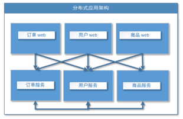
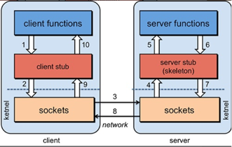

# 分布式基础理论
## 单一应用架构

当网站流量很小时，只需一个应用，将所有功能都部署在一起，以减少部署节点和成本。此时，用于简化增删改查工作量的数据访问框架(ORM)是关键。
## 垂直应用架构

当访问量逐渐增大，单一应用增加机器带来的加速度越来越小，将应用拆成互不相干的几个应用，以提升效率。
此时，用于加速前端页面开发的Web框架(MVC)是关键。
通过切分业务来实现各个模块独立部署，降低了维护和部署的难度，团队各司其职更易管理，性能扩展也更方便，更有针对性。
## 分布式服务架构

当垂直应用越来越多，应用之间交互不可避免，将核心业务抽取出来，作为独立的服务，逐渐形成稳定的服务中心，使前端应用能更快速的响应多变的市场需求。
此时，用于提高业务复用及整合的分布式服务框架(RPC)是关键。
## 流动计算架构

当服务越来越多，容量的评估，小服务资源的浪费等问题逐渐显现，此时需增加一个调度中心基于访问压力实时管理集群容量，提高集群利用率。
此时，用于提高机器利用率的资源调度和治理中心(SOA)[ Service Oriented Architecture]是关键。


# RPC
RPC【Remote Procedure Call】是指远程过程调用，是一种进程间通信方式，他是一种技术的思想，而不是规范。
它允许程序调用另一个地址空间（通常是共享网络的另一台机器上）的过程或函数，而不用程序员显式编码这个远程调用的细节。
即程序员无论是调用本地的还是远程的函数，本质上编写的调用代码基本相同。

RPC两个核心模块：**通讯，序列化**


# Dubbo架构简介
dubbo是一款高性能、轻量级的Java RPC框架。
RPC 框架的核心原理和设计都是相通的，阅读过 Dubbo 源码之后，你再去了解其他 RPC 框架的代码，就是一件非常简单的事情了
它提供了三大核心能力：
    **面向接口的远程方法调用**
    **智能容错和负载均衡**
    **以及服务自动注册和发现**


# Dubbo架构简介

Registry：
    注册中心。 负责服务地址的注册与查找，服务的 Provider 和 Consumer 只在启动时与注册中心交互。注册中心通过长连接感知 Provider 的存在，在 Provider 出现宕机的时候，注册中心会立即推送相关事件通知 Consumer。
Provider：
    服务提供者。 在它启动的时候，会向 Registry 进行注册操作，将自己服务的地址和相关配置信息封装成 URL 添加到 ZooKeeper 中。
Consumer：
    服务消费者。 在它启动的时候，会向 Registry 进行订阅操作。订阅操作会从 ZooKeeper 中获取 Provider 注册的 URL，并在 ZooKeeper 中添加相应的监听器。
    获取到 Provider URL 之后，Consumer 会根据负载均衡算法从多个 Provider 中选择一个 Provider 并与其建立连接，最后发起对 Provider 的 RPC 调用。 
    如果 Provider URL 发生变更，Consumer 将会通过之前订阅过程中在注册中心添加的监听器，获取到最新的 Provider URL 信息，进行相应的调整，比如断开与宕机 Provider 的连接，并与新的 Provider 建立连接。
    Consumer 与 Provider 建立的是长连接，且 Consumer 会缓存 Provider 信息，所以一旦连接建立，即使注册中心宕机，也不会影响已运行的 Provider 和 Consumer。
Monitor：
    监控中心。 用于统计服务的调用次数和调用时间。Provider 和 Consumer 在运行过程中，会在内存中统计调用次数和调用时间，定时每分钟发送一次统计数据到监控中心。
    监控中心在上面的架构图中并不是必要角色，监控中心宕机不会影响 Provider、Consumer 以及 Registry 的功能，只会丢失监控数据而已。


# Dubbo中的网络分层
主要网络分层：
    Proxy服务代理层，支持JDK动态代理，javassist代理机制。
    Registry注册中心，支持Zookeeper、Redis等作为注册中心
    Protocol远程调用，支持Dubbo、Http等调用协议
    Transport网络传输层，支持netty、mina等网络传输架构
    Serialize数据序列化，支持JSON、Hessian等序列化机制
所有网络分层
    接口服务层（service）：面向开发者，业务代码、接口、实现等
    配置层（Config）：对外配置接口，以ServiceConfig和ReferenceConfig为中心
    服务代理层（Proxy）：对生产者或者消费者，Dubbo都会产生一个代理类封装调用细节，业务层对远程调用无感
    服务注册层（Registry）：封装服务地址的注册发现，以服务URL为中心
    路由层（Cluster）：封装多个提供者的路由和负载均衡，并桥接注册中心
    监控层（Monitor）：RPC调用次数和调用时间监控
    远程调用层（Protocol）：封装RPC调用
    信息交换层（Transport）：抽象mina和netty为统一接口，统一网络传输接口
    数据序列化层（Serialize）：数据的序列化和反序列化（JSON，Hessian）


# Dubbo源码核心模块
1，dubbo-common 模块：
    Dubbo 的一个公共模块，其中有很多工具类以及公共逻辑，例如课程后面紧接着要介绍的 Dubbo SPI 实现、时间轮实现、动态编译器等。
    
2，dubbo-remoting 模块
    Dubbo 的远程通信模块，其中的子模块依赖各种开源组件实现远程通信。
    在 dubbo-remoting-api 子模块中定义该模块的抽象概念，在其他子模块中依赖其他开源组件进行实现
    例如，dubbo-remoting-netty4 子模块依赖 Netty 4 实现远程通信，dubbo-remoting-zookeeper 通过 Apache Curator 实现与 ZooKeeper 集群的交互。
    
3，dubbo-rpc 模块
    
    Dubbo 中对远程调用协议进行抽象的模块，其中抽象了各种协议，依赖于 dubbo-remoting 模块的远程调用功能。
    dubbo-rpc-api 子模块是核心抽象，其他子模块是针对具体协议的实现，
    例如，dubbo-rpc-dubbo 子模块是对 Dubbo 协议的实现，依赖了 dubbo-remoting-netty4 等 dubbo-remoting 子模块。
    dubbo-rpc 模块的实现中只包含一对一的调用，不关心集群的相关内容。
4，dubbo-cluster 模块
    Dubbo 中负责管理集群的模块，提供了负载均衡、容错、路由等一系列集群相关的功能
    最终的目的是将多个 Provider 伪装为一个 Provider，这样 Consumer 就可以像调用一个 Provider 那样调用 Provider 集群了。
5，dubbo-registry 模块
    Dubbo 中负责与多种开源注册中心进行交互的模块，提供注册中心的能力。
    其中， dubbo-registry-api 子模块是顶层抽象，其他子模块是针对具体开源注册中心组件的具体实现，例如，dubbo-registry-zookeeper 子模块是 Dubbo 接入 ZooKeeper 的具体实现。
6，dubbo-monitor 模块： 
    Dubbo 的监控模块，主要用于统计服务调用次数、调用时间以及实现调用链跟踪的服务。
7，dubbo-config 模块： 
    Dubbo 对外暴露的配置都是由该模块进行解析的。例如，dubbo-config-api 子模块负责处理 API 方式使用时的相关配置，dubbo-config-spring 子模块负责处理与 Spring 集成使用时的相关配置方式。有了 dubbo-config 模块，用户只需要了解 Dubbo 配置的规则即可，无须了解 Dubbo 内部的细节。
8，dubbo-metadata 模块： 
    Dubbo 的元数据模块（本课程后续会详细介绍元数据的内容）。dubbo-metadata 模块的实现套路也是有一个 api 子模块进行抽象，然后其他子模块进行具体实现。
9，dubbo-configcenter 模块： 
    Dubbo 的动态配置模块，主要负责外部化配置以及服务治理规则的存储与通知，提供了多个子模块用来接入多种开源的服务发现组件。


# Dubbo简单项目搭建
## common模块搭建
由于dubbo官网推荐将接口层单独作为一个独立模块使用。然后生产者和消费者均依赖此模块进行操作。
我们首先进行公共模块的开发，也就是common模块的开发。 新建一个实体类和一个service接口：

实体类：
```java
public class User implements Serializable {

    private String name;

    private Integer age;

    public User() {
    }

    public User(String name, Integer age) {
        this.name = name;
        this.age = age;
    }

    public String getName() {
        return name;
    }

    public void setName(String name) {
        this.name = name;
    }

    public Integer getAge() {
        return age;
    }

    public void setAge(Integer age) {
        this.age = age;
    }
}
```
service接口：
```java
public interface GetUserService {
    List<User> getUserList(String name);
}
```
因为希望将common模块作为模板，生产者和消费者模块都要继承它，所以在它的pom文件里面整合所有需要的包即可:
```xml
<dependencies>
    <!-- apache的springboot dubbo依赖 -->
    <dependency>
        <groupId>org.apache.dubbo</groupId>
        <artifactId>dubbo-spring-boot-starter</artifactId>
        <version>2.7.3</version>
    </dependency>

    <!-- zookeeper -->
    <dependency>
        <groupId>org.apache.zookeeper</groupId>
        <artifactId>zookeeper</artifactId>
        <version>3.4.14</version>
        <exclusions>
            <exclusion>
                <groupId>org.slf4j</groupId>
                <artifactId>slf4j-log4j12</artifactId>
            </exclusion>
            <exclusion>
                <groupId>log4j</groupId>
                <artifactId>log4j</artifactId>
            </exclusion>
            <exclusion>
                <groupId>io.netty</groupId>
                <artifactId>netty</artifactId>
            </exclusion>
        </exclusions>
    </dependency>

    <!-- Zookeeper客户端 -->
    <dependency>
        <groupId>org.apache.curator</groupId>
        <artifactId>curator-recipes</artifactId>
        <version>4.2.0</version>
    </dependency>
</dependencies>
```
## 生产者模块搭建
现在开发生产者模块，只需要继承common模块，然后实现service接口即可。

实现service接口：
```java
@Service
public class GetUserServiceImpl implements GetUserService {

    @Override
    public List<User> getUserList(String name) {
        //此处没有连接数据库，所以就先生成几条数据返回即可。
        System.out.println(name);
        List<User> list = new ArrayList<>();
        list.add(new User("小明",20));
        list.add(new User("小强",21));
        list.add(new User("小红",22));
        return list;
    }
}
```
配置yml
```yml
server:
  port: 8082 #端口号

dubbo:
  application:
    name: provider #当前服务/应用的名字
#  scan:
#    base-packages: com.zhouxiaoxi.provider.service.impl #开启包扫描，可替代 @EnableDubbo 注解

  monitor:
    protocol: registry #连接监控中心

  protocol:
    name: dubbo #通信协议
    port: 20880 #接口

  registry:
    address: 127.0.0.1:2181 #注册中心的地址
    protocol: zookeeper #注册中心的协议
```
启动类上添加@EnableDubbo注解
```java
@EnableDubbo
@SpringBootApplication
public class ProviderApplication {

    public static void main(String[] args) {
        SpringApplication.run(ProviderApplication.class, args);
    }

}
```
然后我们需要在pom文件里面继承common的模块：
```xml
<dependencies>
    <dependency>
        <groupId>org.springframework.boot</groupId>
        <artifactId>spring-boot-starter</artifactId>
    </dependency>

    <dependency>
        <groupId>org.springframework.boot</groupId>
        <artifactId>spring-boot-starter-test</artifactId>
        <scope>test</scope>
    </dependency>

    <!-- common模块 -->
    <dependency>
        <groupId>com.zhouxiaoxi</groupId>
        <artifactId>common</artifactId>
        <version>1.0-SNAPSHOT</version>
    </dependency>
</dependencies>
```
## 消费者模块

接下来我们继续开发消费者：这里我们只是需要写一个controller来调用一下这个接口就可以了
```java
@RestController
public class GetUserController {

    @Reference
    GetUserService getUserService;

    @RequestMapping("getUserList")
    public List<User> getUserList(@RequestParam("name") String name){
        return getUserService.getUserList(name);
    }

}
```
yml文件配置
```yml
server:
  port: 8081 #端口号

dubbo:
  application:
    name: consumer #当前服务/应用的名字
  #  scan:
  #    base-packages: com.zhouxiaoxi.provider.service.impl #开启包扫描，可替代 @EnableDubbo 注解

  monitor:
    protocol: registry #连接监控中心

  protocol:
    name: dubbo #通信协议
    port: 20880 #接口

  registry:
    address: 127.0.0.1:2181 #注册中心的地址
    protocol: zookeeper #注册中心的协议
```
在这里我们还是在启动类上添加 @EnableDubbo 注解，因为比较简便：
```java
@EnableDubbo
@SpringBootApplication
public class ConsumerApplication {

    public static void main(String[] args) {
        SpringApplication.run(ConsumerApplication.class, args);
    }

}
```
然后我们需要在pom文件里面继承common的模块并且添加web依赖：
```xml
<dependencies>
    <dependency>
        <groupId>org.springframework.boot</groupId>
        <artifactId>spring-boot-starter</artifactId>
    </dependency>

    <dependency>
        <groupId>org.springframework.boot</groupId>
        <artifactId>spring-boot-starter-test</artifactId>
        <scope>test</scope>
    </dependency>

    <!-- web依赖 -->
    <dependency>
        <groupId>org.springframework.boot</groupId>
        <artifactId>spring-boot-starter-web</artifactId>
        <version>2.1.9.RELEASE</version>
    </dependency>

    <!-- common模块 -->
    <dependency>
        <groupId>com.zhouxiaoxi</groupId>
        <artifactId>common</artifactId>
        <version>1.0-SNAPSHOT</version>
    </dependency>
</dependencies>
```


# Dubbo 的配置总线：抓住 URL，就理解了半个 Dubbo
URL 是整个 Dubbo 中非常基础，也是非常核心的一个组件，阅读源码的过程中你会发现很多方法都是以 URL 作为参数的
在方法内部解析传入的 URL 得到有用的参数，所以有人将 URL 称为Dubbo 的配置总线。

例如，在 Dubbo SPI 核心实现中，你会看到 URL 参与了扩展实现的确定；
在注册中心中，你还会看到 Provider 将自身的信息封装成 URL 注册到 ZooKeeper 中，从而暴露自己的服务， Consumer 也是通过 URL 来确定自己订阅了哪些 Provider 的。

## Dubbo 中的 URL
Dubbo 中任意的一个实现都可以抽象为一个 URL，Dubbo 使用 URL 来统一描述了所有对象和配置信息，并贯穿在整个 Dubbo 框架之中。
这里我们来看 Dubbo 中一个典型 URL 的示例，如下：
```dubbo://172.17.32.91:20880/org.apache.dubbo.demo.DemoService?anyhost=true&application=dubbo-demo-api-provider&dubbo=2.0.2&interface=org.apache.dubbo.demo.DemoService&methods=sayHello,sayHelloAsync&pid=32508&release=&side=provider&timestamp=1593253404714dubbo://172.17.32.91:20880/org.apache.dubbo.demo.DemoService?anyhost=true&application=dubbo-demo-api-provider&dubbo=2.0.2&interface=org.apache.dubbo.demo.DemoService&methods=sayHello,sayHelloAsync&pid=32508&release=&side=provider&timestamp=1593253404714```
这个 Demo Provider 注册到 ZooKeeper 上的 URL 信息，简单解析一下这个 URL 的各个部分：
- protocol：dubbo 协议。
- username/password：没有用户名和密码。
- host/port：172.17.32.91:20880。
- path：org.apache.dubbo.demo.DemoService。
- parameters：参数键值对，这里是问号后面的参数。

## Dubbo 中的 URL示例
1，URL 在 SPI 中的应用

Dubbo SPI 中有一个依赖 URL 的重要场景——适配器方法，是被 @Adaptive 注解标注的
URL 一个很重要的作用就是与 @Adaptive 注解一起选择合适的扩展实现类。

例如，在 dubbo-registry-api 模块中我们可以看到 RegistryFactory 这个接口，其中的 getRegistry() 方法上有 @Adaptive({"protocol"}) 注解，说明这是一个适配器方法
Dubbo 在运行时会为其动态生成相应的 “$Adaptive” 类型，如下所示：
我们会看到，在生成的 RegistryFactory$Adaptive 类中会自动实现 getRegistry() 方法
其中会根据 URL 的 Protocol 确定扩展名称，从而确定使用的具体扩展实现类。

2，URL 在服务暴露中的应用

Provider 在启动时，会将自身暴露的服务注册到 ZooKeeper 上，具体是注册哪些信息到 ZooKeeper 上呢？
传入的 URL 中包含了 Provider 的地址（172.18.112.15:20880）、暴露的接口（org.apache.dubbo.demo.DemoService）等信息
toUrlPath() 方法会根据传入的 URL 参数确定在 ZooKeeper 上创建的节点路径，还会通过 URL 中的 dynamic 参数值确定创建的 ZNode 是临时节点还是持久节点。

3，URL 在服务订阅中的应用

Consumer 启动后会向注册中心进行订阅操作，并监听自己关注的 Provider。那 Consumer 是如何告诉注册中心自己关注哪些 Provider 呢？
我们看到传入的 URL 参数如下：
其中 Protocol 为 consumer ，表示是 Consumer 的订阅协议
其中的 category 参数表示要订阅的分类，这里要订阅 providers、configurators 以及 routers 三个分类
interface 参数表示订阅哪个服务接口，这里要订阅的是暴露 org.apache.dubbo.demo.DemoService 实现的 Provider。


# dubbo的spi机制
Dubbo的成功离不开它采用微内核设计+SPI扩展，Dubbo依靠SPI机制实现了插件化功能，几乎所有的组件做成基于SPI实现
并且默认提供了很多可以直接使用的扩展点，实现了面向功能进行拆分的对扩展开放的架构。
什么是SPI？
    即Service Provider Interface**服务发现机制**，其实就是通过接口找其接口实现类的一个过程。
    主要在框架中使用，最常见莫过于我们访问数据库时用到的java.sql.Driver接口了
    首先市面上的数据库五花八门，不同的数据库底层协议的大不相同，所以首先需要定制一个接口，来约束一下这些数据库，使得 Java 语言的使用者在调用数据库的时候可以方便、统一的面向接口编程
    数据库厂商需要根据接口来开发他们对应的实现，那么问题来了，真正使用的时候到底用哪个实现呢？从哪里找到实现类呢？
    这时候Java SPI就派上用场了，不知道到底用哪个实现类和找不到实现类，我们告诉它不就完事了呗。
    大家都约定好将实现类的配置写在一个地方，然后到时候都去哪个地方查一下不就知道了吗？
Java SPI：
    约定在 Classpath 下的 META-INF/services/ 目录里创建一个以服务接口命名的文件
    然后文件里面记录的是此 jar 包提供的具体实现类的全限定名。
    这样当我们引用了某个 jar 包的时候就可以去找这个 jar 包的 META-INF/services/ 目录
    再根据接口名找到文件，然后读取文件里面的内容去进行实现类的加载与实例化。
Java SPI缺点：
    Java SPI 在查找扩展实现类的时候遍历 SPI 的配置文件并且将实现类全部实例化，假设一个实现类初始化过程比较消耗资源且耗时，但是你的代码里面又用不上它，这就产生了资源的浪费。
    所以说 Java SPI 无法按需加载实现类。
Dubbo SPI
    因此 Dubbo 就自己实现了一个 SPI，让我们想一下按需加载的话首先你得给个名字，
    通过名字去文件里面找到对应的实现类全限定名然后加载实例化即可，配置文件里面存放的是键值对
    
    并且Dubbo SPI除了可以按需加载实现类之外，还增加了IOC和AOP特性，还有个自适应扩展机制
Dubbo 对配置文件目录的约定：
    META-INF/services/ 目录：该目录下的 SPI 配置文件是为了用来兼容 Java SPI 。
    META-INF/dubbo/ 目录：该目录存放用户自定义的 SPI 配置文件。
    META-INF/dubbo/internal/ 目录：该目录存放 Dubbo 内部使用的 SPI 配置文件。
简单实例
    首先在 META-INF/dubbo 目录下按接口全限定名建立一个文件，内容如下：
        ```
        optimusPrime = org.apache.spi.OptimusPrime
        bumblebee = org.apache.spi.Bumblebee
        ```
    然后在接口上标注@SPI 注解，以表明它要用SPI机制。
        ```
        @SPI(FailoverCluster.NAME)
        public interface Robot {}
        ```
    接下来即可加载指定实现类
        ```java
        
        public class DubboSPITest {
            @Test
            public void sayHello() throws Exception {
                ExtensionLoader<Robot> extensionLoader = ExtensionLoader.getExtensionLoader(Robot.class);
                Robot optimusPrime = extensionLoader.getExtension("optimusPrime");
                optimusPrime.sayHello();
                Robot bumblebee = extensionLoader.getExtension("bumblebee");
                bumblebee.sayHello();
            }
        }
        ```
源码分析：
    
    上面的示例代码我们知道 ExtensionLoader 好像就是重点，可以看到大致流程就是先通过接口类找到一个 ExtensionLoader ，然后再通过 ExtensionLoader.getExtension(name) 得到指定名字的实现类实例
    那么我们先看看getExtensionLoader()做了什么？
        很简单，做了一些判断然后从缓存里面找是否已经存在这个类型的 ExtensionLoader ，如果没有就新建一个塞入缓存。最后返回接口类对应的 ExtensionLoader 。
    我们再来看一下 getExtension() 方法做了什么？
        先找实现类，判断缓存是否有实例，没有就反射创建实例，然后执行set方法依赖注入。
扩展：
    在Dubbo SPI加载类机制是比较简单的，加载完成后主要有两个扩展点Adaptive 、WrapperClass
        Adaptive 注解 - 自适应扩展
        WrapperClass - AOP
    Adaptive 注解 - 自适应扩展   
        有时候有些扩展并不想在框架启动阶段就被加载，而是希望在扩展方法被调用的时候，根据运行参数进行加载
        这有些矛盾，因为拓展未被加载，那么扩展方法就无法调用，那么拓展方法被调用时，拓展就没有被加载
        例如：
            dubbo提供了很多协议：dubbo、rmi、http、webservice等。但实际我们用的时候，可能只会选择一种协议，
            假设我们选择使用rmi协议，则dubbo会在运行的时候才去加载RMI的协议实现类（并在加载一次后缓存起来），
            其他http、webservice等协议实现类没有用到就不会加载。这就是自适应加载。
        简单来说就是为你想要扩展的接口生成一个代理类，可以通过JDK或者javassist编译你生成的代理代码，然后通过反射创建实例
        然后通过```ExtensionLoader.getExtensionLoader(type.class).getExtension(从参数得来的name)```获取真正的实例来调用
        
        自适应扩展是如何实现的？
            通过@Adaptive注解，在修饰类的时候不会生成代理类，因为这个类就是代理类直接返回即可，修饰在方法上的时候会生成代理类然后返回。
    WrapperClass - AOP
        因为是一个扩展接口，可能有多个扩展实现类，而这些扩展实现类会有一个相同的或者公共的逻辑，如果每个实现类都写一遍代码就重复了，并且比较不好维护。
        通过装饰者模式，使用包装类包装原始的扩展点实例。在扩展点实现前后插入其他逻辑，实现AOP功能


# Dubbo是如何完成服务暴露

1，服务的暴露起始于 Spring IOC 容器刷新完毕之后的onApplicationEvent方法。
2，会根据配置参数组装成 URL，然后根据 URL 的参数来进行本地或者远程暴露。
3，具体就是会通过javassist 来进行动态代理，封装真是的实现类，得到Invoker。
4，然后根据URL参数选择对应的协议来进行export，默认是Dubbo协议
5，第一次暴露的时候会调用 createServer 创建监听服务器，默认是 NettyServer。
6，然后将 export 得到的 exporter 存入一个 Map 中，供之后的远程调用查找
7，然后会向注册中心注册提供者的信息。
## 本地暴露服务
为什么要搞个本地暴露呢？
    因为可能存在同一个 JVM 内部引用自身服务的情况
    因此暴露的本地服务在内部调用的时候可以直接消费同一个 JVM 的服务避免了网络间的通信。
具体流程
    1，将URL协议改成injvm
    2，使用javassist生成代理invoker
    3，根据Dubbo spi会根据URL协议选择对应的expoter加入ServiceConfig的Exports缓存中
## 为什么要封装成invoker？
其实就是想屏蔽调用的细节，统一暴露出一个可执行体
这样调用者简单的使用它，向它发起 invoke 调用
它有可能是一个本地的实现，也可能是一个远程的实现，也可能一个集群实现。
## export 到底长什么样子

从图中可以看到实际上就是具体实现类层层封装
## dubbo 为什么用 javassist 而不用 jdk 动态代理？
是因为 javassist 快。而且生成字节码方便。


# Dubbo服务引用流程

1，服务的引入时机有两种，第一种是饿汉式，第二种是懒汉式。 饿汉式就是加载完毕就会引入，懒汉式是只有当这个服务被注入到其他类中时启动引入流程，默认是懒汉式。
2，首先会根据配置参数构建URL，然后向注册中心注册自己的信息。
3，订阅注册中心相关信息，得到远程 provider的 ip 等信息
4，接下来会根据提供者的信息之后会进入 Dubbo 协议的引入
5，然后会创建Invoker，期间会包含 NettyClient，来进行远程通信
6，最后通过cluster来包装Invoker，主要进行提供者屏蔽、容错、负载均衡等
7，最后将这个代理类返回给consumer，无感调用
## 服务引入的时机
服务的引入和服务的暴露一样，也是通过 spring 自定义标签机制解析生成对应的 Bean，
Provider Service 对应解析的是 ServiceBean 而 Consumer Reference 对应的是 ReferenceBean。
在 Spring 容器刷新完成之后开始暴露，而服务的引入时机有两种，第一种是饿汉式，第二种是懒汉式。
饿汉式是通过实现 Spring 的InitializingBean接口中的 afterPropertiesSet方法，
容器通过调用 ReferenceBean的 afterPropertiesSet方法时引入服务。
懒汉式是只有当这个服务被注入到其他类中时启动引入流程，也就是说用到了才会开始服务引入。
默认是懒汉式，如果需要使用饿汉式，可通过配置 dubbo:reference 的 init 属性开启。
## 服务引入的三种方式
服务的引入又分为了三种，第一种是本地引入、第二种是直接连接引入远程服务、第三种是通过注册中心引入远程服务。
本地引入：
    之前服务暴露的流程每个服务都会通过搞一个本地暴露，走 injvm 协议
    因为存在一个服务端既是 Provider 又是 Consumer 的情况，然后有可能自己会调用自己的服务
    因此就弄了一个本地引入，这样就避免了远程网络调用的开销。
直连远程引入服务：
    这个其实就是平日测试的情况下用用，不需要启动注册中心，由 Consumer 直接配置写死 Provider 的地址，然后直连即可。
注册中心引入远程服务
    这个就是重点了，Consumer 通过注册中心得知 Provider 的相关信息，然后进行服务的引入


# Dubbo服务调用流程
1，调用某个接口的方法会调用之前生成的代理类，然后会从 cluster 中经过路由的过滤、负载均衡机制选择一个 invoker 发起远程调用，此时会记录此请求和请求的 ID 等待服务端的响应。
2，服务端接受请求之后会通过参数找到之前暴露存储的 map，得到相应的 exporter ，然后最终调用真正的实现类，再组装好结果返回，这个响应会带上之前请求的 ID。
3，消费者收到这个响应之后会通过 ID 去找之前记录的请求，然后找到请求之后将响应塞到对应的 Future 中，唤醒等待的线程，最后消费者得到响应，一个流程完毕。


# Dubbo和SpringCloud对比
1，Dubbo由于是二进制传输，占用宽带会更少
2，SpringCloud是http协议传输，带宽比较多，同时使用http协议一般json报文，消耗比较大
3，Dubbo开发难度比较大，原因是dubbo的jar包依赖问题很多大型工程无法解决
4，SpringCloud接口协议约定比较自由松散，需要强有力的行政措施来限制接口无序升级
5，dubbo是SpringCloud是一个子集，解决的是分布式中的服务调用问题，而SpringCloud提供了全套的解决方案


# dubbo集群容错策略有哪些？
Failover Cluster失败自动切换：
    dubbo默认的容错方案，当失败时自动切换，当调用失败时自动切换到其他可用节点。
    具体的重视次数和间隔时间可以通过引用服务的时候配置，默认重试次数为1也就是只调用一次
Failback Cluster失败自动恢复：
    在调用失败，记录日志和调用信息，然后返回结果给consumer，并且通过定时任务每隔5秒对失败的调用重试
Failfast Cluster快速失败：
    只会调用一次，失败后立即抛出异常
Failsafe Cluster失败安全：
    调用出现异常，记录日志不抛出，返回空结果
Forking Cluster并行调用多个服务提供者
    通过线程池创建多个线程，并调用多个provider，结果保存到阻塞队列，只要有一个provider成功返回了结果，就会立即返回结果
    适用于实时性要求较高的场景
Broadcast Cluster广播模式：
    逐个调用每个provider，如果其中一台保存，在循环调用结束后，抛出异常
    使用更新缓存的场景。


# Dubbo支持的协议
Dubbo官方协议
    - 基于TCP长链接，使用Socket通信
    - 采用NIO复用单一长链接，并使用线程池并发处理请求，减少握手和加大并发效率，性能较好（推荐使用）
    - 大文件上传时，可能出现问题（不使用Dubbo文件上传）
RMI（Remote Method Invocation）协议
    JDK自带的能力。可以原生RMI互操作，基于TCP协议、短连接
    也是TCP的Socket，由于使用短连接，性能不太好。
    但是好处就是可以与原生的RMI互操作
Hessian协议
    本省其实是一个RPC框架，需要基于Servlet通信，基于Jetty（Dubbo自带）
    - 可与原生Hessian互操作，基于HTTP协议，对于数据包比较大的情况比较友好
    - 需要Hessian.jar支持，Http端连接的开销大，它的参数和返回值需要实现Serializable接口
http协议
Webservice：
    是一种SOAP协议，是基于xml进行传输的，在微服务火了之后使用http+json比较多。
    好处就是可以跨语言。
    基于CXF的Frontend-simple和Transports-http实现；基于WebService的远程协议
    - 序列化：SOAP文本序列化
    - 适用场景：系统集成，跨语言调用
Thrif：Thrift是Facebook捐给Apache的一个RPC框架
    是基于二进制的，可以跨语言，并且效率比较高
    语言中立
    平台中立


# Dubbo支持那些负载均衡策略
1，随机：多个服务提供者随机选择一个来处理本次请求，调用量越大则分布越均匀，并支持按权重设置随机概率
2，轮询：一次选择服务提供者来处理请求，并支持按权重进行轮询，底层采用的是平滑加权轮询算法
2，最小活跃调用数：统计服务提供者当前正在处理的请求，下次请求过来则交给活跃数最小的服务器来处理
4，一致性哈希：相同参数的请求总是发到同一个服务提供者


# Dubbo中zk集群挂掉，发布者和订阅者还能通信么？
可以。
因为当启动dubbo容器时，消费者会去zookeeper拉去注册的生产者地址列表，并将其缓存在本地。
每次发起调用时，都会按照本地地址列表，以负载均衡策略进行调用。但是zookeeper挂掉则后续新的生产者无法被消费者发现。
- 注册中心对等集群，任意一台宕机，自动切换另一台
- 注册中心全部宕机，服务提供者和消费者仍可以通过本地缓存通讯
- 服务提供者无状态，任一台宕机后，不影响使用
- 服务提供者全部宕机后，消费者无法使用，并无限次重连等待服务恢复


# Quorum、WRAO机制
waro：
一种简单的副本控制协议，写操作时只有所有的副本更新成功之后，写操作才会成功，否则为失败
优先保证读、任何节点读到的数据都是最新数据，牺牲了更新服务的可用性。
只要有一个副本宕机了，写服务就不会成功。但只要有一个节点存活、仍能提供服务

quorum机制：
如果有10个副本，规定最少3个节点更新成功，才算写入成功。
那么读取的时候，规定至少读取8个副本数据，这样就保证了其中必然有一个是最新的数据。
那么如何确定8个数据中哪一个是最新的呢？通过版本号来判断。

10个副本，一次成功更新了3个，那么至少需要读取8个副本的数据，可以保证读到了最新的数据。
无法保证强一致性，也就是无法实现任何时刻任何用户或节点都可以读到最近一次成功提交的副本数据。
需要配合一个获取最新成功提交的版本号的metadata服务，这样可以确定最新已经提交成功的版本号
然后从已读到的数据中就可以确认最新写入的数据。


# 海量定时任务，一个时间轮搞定
JDK 提供的 java.util.Timer 和 DelayedQueue 等工具类，可以帮助我们实现简单的定时任务管理，
其底层实现使用的是堆这种数据结构，存取操作的复杂度都是 O(nlog(n))，无法支持大量的定时任务。
在定时任务量比较大、性能要求比较高的场景中，为了将定时任务的存取操作以及取消操作的时间复杂度降为 O(1)，一般会使用时间轮的方式。

时间轮是一种高效的、批量管理定时任务的调度模型。
时间轮一般会实现成一个环形结构，类似一个时钟，分为很多槽，一个槽代表一个时间间隔
每个槽使用双向链表存储定时任务；指针周期性地跳动，跳动到一个槽位，就执行该槽位的定时任务。

需要注意的是，单层时间轮的容量和精度都是有限的，对于精度要求特别高、时间跨度特别大或是海量定时任务需要调度的场景
通常会使用多级时间轮以及持久化存储与时间轮结合的方案。

那在 Dubbo 中，时间轮的具体实现方式是怎样的呢？本课时我们就重点探讨下。
Dubbo 的时间轮实现位于 dubbo-common 模块的 org.apache.dubbo.common.timer 包中，下面我们就来分析时间轮涉及的核心接口和实现。
## Dubbo中如何使用定时任务
在 Dubbo 中，时间轮并不直接用于周期性操作，而是只向时间轮提交执行单次的定时任务
在上一次任务执行完成的时候，调用 newTimeout() 方法再次提交当前任务，这样就会在下个周期执行该任务。
即使在任务执行过程中出现了 GC、I/O 阻塞等情况，导致任务延迟或卡住，也不会有同样的任务源源不断地提交进来，导致任务堆积。
Dubbo 中对时间轮的应用主要体现在如下两个方面：
    1，**失败重试**， 例如，Provider 向注册中心进行注册失败时的重试操作，或是 Consumer 向注册中心订阅时的失败重试等。
    2，**周期性定时任务**， 例如，定期发送心跳请求，请求超时的处理，或是网络连接断开后的重连机制。


# Dubbo序列化算法
Dubbo默认使用Hessian2
常见的序列化算法
1，Apache Avro 是一种与编程语言无关的序列化格式。
    Avro 依赖于用户自定义的 Schema，在进行序列化数据的时候，无须多余的开销，就可以快速完成序列化，并且生成的序列化数据也较小。
    进行反序列化的时候，需要获取到写入数据时用到的 Schema。在 Kafka、Hadoop 以及 Dubbo 中都可以使用 Avro 作为序列化方案。
2，FastJson 是阿里开源的 JSON 解析库，可以解析 JSON 格式的字符串
    它支持将 Java 对象序列化为 JSON 字符串，反过来从 JSON 字符串也可以反序列化为 Java 对象
    FastJson 是 Java 程序员常用到的类库之一，正如其名，“快”是其主要卖点。从官方的测试结果来看，FastJson 确实是最快的，比 Jackson 快 20% 左右，但是近几年 FastJson 的安全漏洞比较多，所以你在选择版本的时候，还是需要谨慎一些
3，Fst（全称是 fast-serialization）是一款高性能 Java 对象序列化工具包
    100% 兼容 JDK 原生环境，序列化速度大概是JDK 原生序列化的 4~10 倍
    序列化后的数据大小是 JDK 原生序列化大小的 1/3 左右。目前，Fst 已经更新到 3.x 版本，支持 JDK 14。
4，Kryo 是一个高效的 Java 序列化/反序列化库
    目前 Twitter、Yahoo、Apache 等都在使用该序列化技术，特别是 Spark、Hive 等大数据领域用得较多。
    Kryo 提供了一套快速、高效和易用的序列化 API。无论是数据库存储，还是网络传输，都可以使用 Kryo 完成 Java 对象的序列化。
    Kryo 还可以执行自动深拷贝和浅拷贝，支持环形引用。Kryo 的特点是 API 代码简单，序列化速度快，并且序列化之后得到的数据比较小。
    另外，Kryo 还提供了 NIO 的网络通信库——KryoNet
5，Hessian2 序列化是一种支持动态类型、跨语言的序列化协议
    Java 对象序列化的二进制流可以被其他语言使用。Hessian2 序列化之后的数据可以进行自描述，不会像 Avro 那样依赖外部的 Schema 描述文件或者接口定义。
    Hessian2 可以用一个字节表示常用的基础类型，这极大缩短了序列化之后的二进制流。
    需要注意的是，在 Dubbo 中使用的 Hessian2 序列化并不是原生的 Hessian2 序列化，而是阿里修改过的 Hessian Lite，它是 Dubbo 默认使用的序列化方式。
    其序列化之后的二进制流大小大约是 Java 序列化的 50%，序列化耗时大约是 Java 序列化的 30%，反序列化耗时大约是 Java 序列化的 20%。
6，Protobuf（Google Protocol Buffers）是 Google 公司开发的一套灵活、高效、自动化的、用于对结构化数据进行序列化的协议
    但相比于常用的 JSON 格式，Protobuf 有更高的转化效率，时间效率和空间效率都是 JSON 的 5 倍左右。
    Protobuf 可用于通信协议、数据存储等领域，它本身是语言无关、平台无关、可扩展的序列化结构数据格式。
    目前 Protobuf提供了 C++、Java、Python、Go 等多种语言的 API，gRPC 底层就是使用 Protobuf 实现的序列化。


# dubbo协议和rmi协议
dubbo协议
1）才用单一长连接和NIO异步通讯
2）适用于小数据量大并发的服务调用
3）适用于消费者远大于服务提供者
rmi协议
1）才用同步BIO短链接
2）适用于大小数据包混合，消费者和提供者数量差不多


        
            


