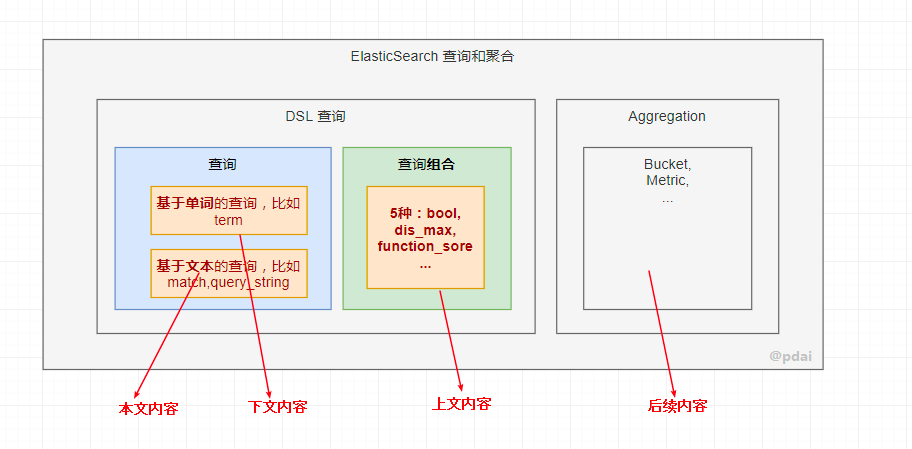

# 什么是ElasticSearch
ElasticSearch是一个基于Lucene的搜索以及分析引擎，它是一个分布式多用户能力的全文搜索引擎，基于RESTful接口
除了搜索，结合Kibana、Logstash、Beats开源产品，Elastic Stack（简称ELK）还被广泛运用在大数据近实时分析领域
包括：日志分析、指标监控、信息安全等。它可以帮助你探索海量结构化、非结构化数据，按需创建可视化报表，对监控数据设置报警阈值，通过使用机器学习，自动识别异常状况。


# 为什么不直接使用Lucene
Lucene 仅仅只是一个库。为了充分发挥其功能，你需要使用 Java 并将 Lucene 直接集成到应用程序中。
更糟糕的是，您可能需要获得信息检索学位才能了解其工作原理。Lucene 非常 复杂。
Elasticsearch 隐藏 Lucene 的复杂性，取而代之的提供一套简单一致的 RESTful API。
Elasticsearch 不仅仅是 Lucene，并且也不仅仅只是一个全文搜索引擎。 它可以被下面这样准确的形容：
1，一个分布式的实时文档存储，每个字段 可以被索引与搜索
2，一个分布式实时分析搜索引擎
3，能胜任上百个服务节点的扩展，并支持 PB 级别的结构化或者非结构化数据


# ElasticSearch的主要功能及应用场景
主要功能：
    1，海量数据的分布式存储以及集群管理，达到了服务与数据的高可用以及水平扩展；
    2，近实时搜索，性能卓越。对结构化、全文、地理位置等类型数据的处理；
    3，海量数据的近实时分析（聚合功能）
应用场景：
    网站搜索、垂直搜索、代码搜索；
    日志管理与分析、安全指标监控、应用性能监控、Web抓取舆情分析；


# 基础概念
看看ES的基础概念，为我们后面学习作铺垫。
Near Realtime（NRT）： 近实时。数据提交索引后，立马就可以搜索到。
Cluster 集群：一个集群由一个唯一的名字标识，默认为“elasticsearch”。集群名称非常重要，具有相同集群名的节点才会组成一个集群。集群名称可以在配置文件中指定。
Node 节点：存储集群的数据，参与集群的索引和搜索功能。
Index 索引: 一个索引是一个文档的集合（等同于solr中的集合）。
Type 类型：指在一个索引中，可以索引不同类型的文档，如用户数据、博客数据。从6.0.0 版本起已废弃，一个索引中只存放一类数据。
Document 文档：被索引的一条数据，索引的基本信息单元，以JSON格式来表示。
Shard 分片：在创建一个索引时可以指定分成多少个分片来存储。每个分片本身也是一个功能完善且独立的“索引”，可以被放置在集群的任意节点上。
Replication 备份: 一个分片可以有多个备份（副本）


# Elasticsearch自定义评分
## 要想使Elasticsearch搜索结果更准确，不可回避的三个问题。
问题一：用户真正的需求是什么？
    如果不能获得用户的搜索意图，搜索的准确性无从谈起。
    比如：同样输入“锤子”，工匠期望的是钉子对应的“锤子”，老罗的粉丝期望的是“锤子科技”、“锤子便签”、“锤子手机”等。
    即使同一用户发出的同一个查询，也可能因为用户所处场景不同，其期望结果也存在很大差异。
问题二：哪些信息是和用户需求真正相关的？
    搜索引擎本质是一个匹配过程，即从海量的数据中找到匹配用户需求的内容。
    
    判定内容与用户查询的相关性(relevance，如上图），一直是搜索引擎领域核心研究课题之一。
问题三：哪些信息是最值得用户信赖的？
    衡量信息满足用户需求的两个核心属性。
    其一：如前所述的相关性。
    其二：信息是否值得信赖。
    举例：疫情环境下，新华网、人民网发布文章的可信性远大于某公众号大V发布的。
## Elasticsearch相关性是如何控制的？
结构化数据库如Mysql，只能查询结果与数据库中的row的是否匹配？回答往往是“是”、“否”。
比如：```select title from hbinfos where title like ‘%发热%’。```

而全文搜索引擎Elasticsearch中不仅需要找到匹配的文档，还需根据它们相关度的高低进行排序。
实现相关度排序的核心概念是评分。_score就是Elasticsearch检索返回的评分。该得分衡量每个文档与查询的匹配程度。
```
 "hits" : [
      {
        "_index" : "kibana_sample_data_flights",
        "_type" : "_doc",
        "_id" : "FHLWlHABl_xiQyn7bHe2",
        "_score" : 3.4454226,
```
每个文档都有与之相关的评分，该得分由正浮点数表示。文档分数越高，则文档越相关。
分数与查询匹配成正比。查询中的每个子句都将有助于文档的得分。

## Elasticsearch 哪些查询影响相关性评分？
布尔查询中的每个must，should和must_not元素称为查询子句。
- 文档满足must或 should条款的标准的程度有助于文档的相关性得分。分数越高，文档就越符合您的搜索条件。
- must_not子句中的条件被视为过滤器。它会影响文档是否包含在结果中，但不会影响文档的评分方式。在must_not里还可以显式指定任意过滤器，以基于结构化数据包括或排除文档。
- filter：必须 匹配，但它以不评分、过滤模式来进行。filter内部语句对评分没有贡献，只是根据过滤标准来排除或包含文档。
一句话概括：filter、must_not不影响评分，其他影响评分。

## 自定义评分一：Index Boost 索引层面修改相关性
索引级别调整评分。
一批数据里，有不同的标签，数据结构一致，不同的标签存储到不同的索引（A、B、C），最后要严格按照标签来分类展示的话，用什么查询比较好？
要求：先展示A类，然后B类，然后C类
```
批量创建索引
PUT index_a/_doc/1
{
  "subject": "subject 1"
}
PUT index_b/_doc/1
{
  "subject": "subject 1"
}
PUT index_c/_doc/1
{
  "subject": "subject 1"
}
查看索引
GET index_*/_search
{
  "indices_boost": [
    {
      "index_a": 1.5
    },
    {
      "index_b": 1.2
    },
    {
      "index_c": 1
    }
  ],
  "query": {
    "term": {
      "subject.keyword": {
        "value": "subject 1"
      }
    }
  }
}
```
## 自定义评分二：boosting 修改文档相关性
1，第一种：索引期间修改文档的相关性。
```
PUT my_index
{
  "mappings": {
    "properties": {
      "title": {
        "type": "text",
        "boost": 2
      }
    }
  }
}
```
索引期间修改相关性的弊端非常明显：修改boost值的唯一方式是重建索引，reindex数据，成本太高了！
2，第二种：查询的时候修改文档的相关性。
boost取值：0 - 1 之间的值，如：0.2，代表降低评分；
boost取值：> 1， 如：1.5，代表提升评分。
```
POST _search
{
  "query": {
    "bool": {
      "must": [
        {
          "multi_match": {
            "query": "pingpang best",
            "fields": [
              "title^3",
              "content"
            ]
          }
        }
      ],
      "should": [
        {
          "term": {
            "user": {
              "value": "Kimchy",
              "boost": 0.8
            }
          }
        },
        {
          "match": {
            "title": {
              "query": "quick brown fox",
              "boost": 2
            }
          }
        }
      ]
    }
  }
}
```
## 自定义评分三：negative_boost 降低相关性
原理说明：
    negative_boost 对 negative部分query生效，
    计算评分时，boosting部分评分不修改，negative部分query 乘以 negative_boost值。
    negative_boost 取值：0-1.0，举例：0.3
使用场景
    对某些返回结果不满意，但又不想排除掉（must_not），可以考虑boosting query的negative_boost。
```
GET /_search
{
    "query": {
        "boosting" : {
            "positive" : {
                "term" : {
                    "text" : "apple"
                }
            },
            "negative" : {
                 "term" : {
                     "text" : "pie tart fruit crumble tree"
                }
            },
            "negative_boost" : 0.5
        }
    }
}
```
## 自定义评分四：function_score 自定义评分
原理描述
    支持用户自定义一个或多个查询或者脚本，达到精细化控制评分的目的。
使用场景
    支持针对复杂查询的自定义评分业务场景。
```
POST product_test/_search
{
  "query": {
    "function_score": {
      "query": {
        "match_all": {}
      },
      "script_score": {
        "script": {
          "source": "_score * (doc['sales'].value+doc['visitors'].value)"
        }
      }
    }
  }
}
```
## 自定义评分四：查询后二次打分rescore_query
原理说明
    二次评分是指重新计算查询返回结果文档中指定个数文档的得分，Elasticsearch会截取查询返回的前N个，并使用预定义的二次评分方法来重新计算他们的得分。
适用场景
    对查询语句的结果不满意，需要重新打分的场景。
    但是如果对全部有序的结果集进行重新排序的话势必开销会很大，
    使用rescore_query只对结果集的子集进行处理。
```
GET news_index/_search
{
  "query": {
    "exists": {
      "field": "like"
    }
  },
  "rescore": {
    "window_size": 50,
    "query": {
      "rescore_query": {
        "function_score": {
          "script_score": {
            "script": {
              "source": "doc.like.value"
            }
          }
        }
      }
    }
  }
}
```


# 查询和聚合的基础使用
1，索引一个文档
    ```
    PUT /customer/_doc/1
    {
      "name": "John Doe"
    }
    ```
2，批量索引文档
    下载accounts.json数据，并且放在/opt/下面
    然后执行：curl -H "Content-Type: application/json" -XPOST "localhost:9200/bank/_bulk?pretty&refresh" --data-binary "@/opt/accounts.json"
3，查询所有数据
    match_all表示查询所有的数据，sort即按照什么字段排序
    ```
    GET /bank/_search
    {
      "query": { "match_all": {} },
      "sort": [
        { "account_number": "asc" }
      ]
    }
    ```
    
    took – Elasticsearch运行查询所花费的时间（以毫秒为单位）
    timed_out –搜索请求是否超时
    _shards - 搜索了多少个碎片，以及成功，失败或跳过了多少个碎片的细目分类。
    max_score – 找到的最相关文档的分数
    hits.total.value - 找到了多少个匹配的文档
    hits.sort - 文档的排序位置（不按相关性得分排序时）
    hits._score - 文档的相关性得分（使用match_all时不适用）
4，分页查询
    本质上就是from和size两个字段
    ```
    GET /bank/_search
    {
      "query": { "match_all": {} },
      "sort": [
        { "account_number": "asc" }
      ],
      "from": 10,
      "size": 10
    }
    ```
5，指定字段查询：match
    如果要在字段中搜索特定字词，可以使用match; 如下语句将查询address 字段中包含 mill 或者 lane的数据
    ```
    GET /bank/_search
    {
      "query": { "match": { "address": "mill lane" } }
    }
    ```
    由于ES底层是按照分词索引的，所以上述查询结果是address 字段中包含 mill 或者 lane的数据
6，查询段落匹配：match_phrase
    如果我们希望查询的条件是 address字段中包含 "mill lane"，则可以使用match_phrase
    ```
    GET /bank/_search
    {
      "query": { "match_phrase": { "address": "mill lane" } }
    }
    ```
7，多条件查询: bool
    如果要构造更复杂的查询，可以使用bool查询来组合多个查询条件。
    例如，以下请求在bank索引中搜索40岁客户的帐户，但不包括居住在爱达荷州（ID）的任何人
    ```
    GET /bank/_search
    {
      "query": {
        "bool": {
          "must": [
            { "match": { "age": "40" } }
          ],
          "must_not": [
            { "match": { "state": "ID" } }
          ]
        }
      }
    }
    ```
    must, should, must_not 和 filter 都是bool查询的子句。那么filter和上述query子句有啥区别呢？
8，查询条件：query or filter
    先看下如下查询, 在bool查询的子句中同时具备query/must 和 filter
    ```
    GET /bank/_search
    {
      "query": {
        "bool": {
          "must": [
            {
              "match": {
                "state": "ND"
              }
            }
          ],
          "filter": [
            {
              "term": {
                "age": "40"
              }
            },
            {
              "range": {
                "balance": {
                  "gte": 20000,
                  "lte": 30000
                }
              }
            }
          ]
        }
      }
    }
    ```
    两者都可以写查询条件，而且语法也类似。
    区别在于，query 上下文的条件是用来给文档打分的，匹配越好 _score 越高；
    filter 的条件只产生两种结果：符合与不符合，后者被过滤掉。
9，集合查询
    我们知道SQL中有group by，在ES中它叫Aggregation，即聚合运算。
    简单聚合
        比如我们希望计算出account每个州的统计数量， 使用aggs关键字对state字段聚合
        被聚合的字段无需对分词统计，所以使用state.keyword对整个字段统计
        ```
        GET /bank/_search
        {
          "size": 0,
          "aggs": {
            "group_by_state": {
              "terms": {
                "field": "state.keyword"
              }
            }
          }
        }
        ```
        设置size=0的意思就是,仅返回聚合查询结果,不返回普通query查询结果
        doc_count表示bucket中每个州的数据条数。
    嵌套聚合
        比如承接上个例子， 计算每个州的平均结余。涉及到的就是在对state分组的基础上，嵌套计算avg(balance):
        ```
        GET /bank/_search
        {
          "size": 0,
          "aggs": {
            "group_by_state": {
              "terms": {
                "field": "state.keyword"
              },
              "aggs": {
                "average_balance": {
                  "avg": {
                    "field": "balance"
                  }
                }
              }
            }
          }
        }
        ```
    对聚合结果排序
        比如承接上个例子， 对嵌套计算出的avg(balance)，这里是average_balance，进行排序
        ```
        GET /bank/_search
        {
          "size": 0,
          "aggs": {
            "group_by_state": {
              "terms": {
                "field": "state.keyword",
                "order": {
                  "average_balance": "desc"
                }
              },
              "aggs": {
                "average_balance": {
                  "avg": {
                    "field": "balance"
                  }
                }
              }
            }
          }
        }
        ```


# 索引管理详解
## 索引管理的引入
我们在前文中增加文档时，如下的语句会动态创建一个customer的index：
```
PUT /customer/_doc/1
{
  "name": "John Doe"
}
```
而这个index实际上已经自动创建了它里面的字段（name）的类型。我们不妨看下它自动创建的mapping：
```
{
  "mappings": {
    "_doc": {
      "properties": {
        "name": {
          "type": "text",
          "fields": {
            "keyword": {
              "type": "keyword",
              "ignore_above": 256
            }
          }
        }
      }
    }
  }
}
```
那么如果我们需要对这个建立索引的过程做更多的控制：
比如想要确保这个索引有数量适中的主分片，并且在我们索引任何数据之前，分析器和映射已经被建立好
那么就会引入两点：第一个禁止自动创建索引，第二个是手动创建索引。
- 禁止自动创建索引
  可以通过在 config/elasticsearch.yml 的每个节点下添加下面的配置：
  action.auto_create_index: false
## 索引的格式
在请求体里面传入设置或类型映射，如下所示：
```
PUT /my_index
{
    "settings": { ... any settings ... },
    "mappings": {
        "properties": { ... any properties ... }
    }
}
```
settings: 用来设置分片,副本等配置信息
mappings: 字段映射，类型等
    properties: 由于type在后续版本中会被Deprecated, 所以无需被type嵌套
## 索引管理操作
### 创建索引
我们创建一个user 索引test-index-users，其中包含三个属性：name，age, remarks; 存储在一个分片一个副本上。
```
PUT /test-index-users
{
	"settings": {
		"number_of_shards": 1,
		"number_of_replicas": 1
	},
	"mappings": {
		"properties": {
			"name": {
				"type": "text",
				"fields": {
					"keyword": {
						"type": "keyword",
						"ignore_above": 256
					}
				}
			},
			"age": {
				"type": "long"
			},
			"remarks": {
				"type": "text"
			}
		}
	}
}
```
### 修改索引
首先我们查看刚才的索引状态
```curl 'localhost:9200/_cat/indices?v' | grep users```
结果：
```yellow open test-index-users LSaIB57XSC6uVtGQHoPYxQ 1 1     1    0   4.4kb   4.4kb```
我们注意到刚创建的索引的状态是yellow的，因为我测试的环境是单点环境，无法创建副本。
但是在上述number_of_replicas配置中设置了副本数是1； 所以在这个时候我们需要修改索引的配置。
```
修改副本数量为0
PUT /test-index-users/_settings
{
  "settings": {
    "number_of_replicas": 0
  }
}
```
### 打开/关闭索引
1，关闭索引
```POST /test-index0users/_close```
一旦索引被关闭，那么这个索引只能显示元数据信息，不能够进行读写操作。
2，打开索引
```POST /test-index0users/_open```
打开后又可以重新写数据了
### 删除索引
```DELETE /test-index-users```
### 查看索引
```GET /test-index-users/_mapping```
```GET /test-index-users/_settings```


# 索引模板(Index Template)详解
索引模板是一种告诉Elasticsearch在创建索引时如何配置索引的方法。
## 使用方式
在创建索引之前可以先配置模板，这样在创建索引（手动创建索引或通过对文档建立索引）时，模板设置将用作创建索引的基础。
## 模板类型
模板有两种类型：索引模板和组件模板。
1，组件模板：是可重用的构建块，用于配置映射，设置和别名；它们不会直接应用于一组索引。
2，索引模板：可以包含组件模板的集合，也可以直接指定设置，映射和别名。
## 索引模板中的优先级
1，可组合模板优先于旧模板。如果没有可组合模板匹配给定索引，则旧版模板可能仍匹配并被应用。
2，如果使用显式设置创建索引并且该索引也与索引模板匹配，则创建索引请求中的设置将优先于索引模板及其组件模板中指定的设置。
3，如果新数据流或索引与多个索引模板匹配，则使用优先级最高的索引模板。
## Elasticsearch具有内置索引模板，每个索引模板的优先级为100，适用于以下索引模式：
logs-*-*
metrics-*-*
synthetics-*-*
所以在涉及内建索引模板时，要避免索引模式冲突
## 案例
首先创建两个索引组件模板：
```
PUT _component_template/component_template1
{
  "template": {
    "mappings": {
      "properties": {
        "@timestamp": {
          "type": "date"
        }
      }
    }
  }
}

PUT _component_template/runtime_component_template
{
  "template": {
    "mappings": {
      "runtime": { 
        "day_of_week": {
          "type": "keyword",
          "script": {
            "source": "emit(doc['@timestamp'].value.dayOfWeekEnum.getDisplayName(TextStyle.FULL, Locale.ROOT))"
          }
        }
      }
    }
  }
}
```
然后我们使用上面的两个组件模版来创建索引模版
```
PUT _index_template/template_1
{
  "index_patterns": ["bar*"],
  "template": {
    "settings": {
      "number_of_shards": 1
    },
    "mappings": {
      "_source": {
        "enabled": true
      },
      "properties": {
        "host_name": {
          "type": "keyword"
        },
        "created_at": {
          "type": "date",
          "format": "EEE MMM dd HH:mm:ss Z yyyy"
        }
      }
    },
    "aliases": {
      "mydata": { }
    }
  },
  "priority": 500,
  "composed_of": ["component_template1", "runtime_component_template"], 
  "version": 3,
  "_meta": {
    "description": "my custom"
  }
}
```
接下来我们创建一个匹配bar*的索引bar-test
```PUT /bar-test```
然后获取mapping
```GET /bar-test/_mapping```

## 模拟多组件模板
由于模板不仅可以由多个组件模板组成，还可以由索引模板自身组成；
那么最终的索引设置将是什么呢？ElasticSearch设计者考虑到这个，提供了API进行模拟组合后的模板的配置。
1，模拟某个索引结果
比如上面的template_1, 我们不用创建bar*的索引(这里模拟bar-pdai-test)，也可以模拟计算出索引的配置：
```POST /_index_template/_simulate_index/bar-pdai-test```
2，模拟组件模板结果
当然，由于template_1模板是由两个组件模板组合的，我们也可以模拟出template_1被组合后的索引配置：
```POST /_index_template/_simulate/template_1```
3，模拟组件模板和自身模板结合后的结果
新建两个模板
```
PUT /_component_template/ct1
{
  "template": {
    "settings": {
      "index.number_of_shards": 2
    }
  }
}
PUT /_component_template/ct2
{
  "template": {
    "settings": {
      "index.number_of_replicas": 0
    },
    "mappings": {
      "properties": {
        "@timestamp": {
          "type": "date"
        }
      }
    }
  }
}
```
模拟在两个组件模板的基础上，添加自身模板的配置
```
POST /_index_template/_simulate
{
  "index_patterns": ["my*"],
  "template": {
    "settings" : {
        "index.number_of_shards" : 3
    }
  },
  "composed_of": ["ct1", "ct2"]
}
```


# DSL查询之复合查询
在多条件查询中，我们使用bool查询来组合多个查询条件。bool查询只是复合查询一种。
## bool query(布尔查询)
通过布尔逻辑将较小的查询组合成较大的查询。
特点：
    1，子查询可以任意顺序出现
    2，可以嵌套多个查询，包括bool查询
    3，如果bool查询中没有must条件，should中必须至少满足一条才会返回结果。
bool查询包含四种操作符，分别是must,should,must_not,filter。他们均是一种数组，数组里面是对应的判断条件。
    must： 必须匹配。贡献算分
    must_not：过滤子句，必须不能匹配，但不贡献算分
    should： 选择性匹配，至少满足一条。贡献算分
    filter： 过滤子句，必须匹配，但不贡献算分
例子1
    ```
    POST _search
    {
      "query": {
        "bool" : {
          "must" : {
            "term" : { "user.id" : "kimchy" }
          },
          "filter": {
            "term" : { "tags" : "production" }
          },
          "must_not" : {
            "range" : {
              "age" : { "gte" : 10, "lte" : 20 }
            }
          },
          "should" : [
            { "term" : { "tags" : "env1" } },
            { "term" : { "tags" : "deployed" } }
          ],
          "minimum_should_match" : 1,
          "boost" : 1.0
        }
      }
    }
    ```
    在filter元素下指定的查询对评分没有影响 , 评分返回为0。分数仅受已指定查询的影响。
例子2
    ```
    GET _search
    {
      "query": {
        "bool": {
          "filter": {
            "term": {
              "status": "active"
            }
          }
        }
      }
    }
    ```
    这个例子查询查询为所有文档分配0分，因为没有指定评分查询。
例子3
    ```
    GET _search
    {
      "query": {
        "bool": {
          "must": {
            "match_all": {}
          },
          "filter": {
            "term": {
              "status": "active"
            }
          }
        }
      }
    }
    ```
    此bool查询具有match_all查询，该查询为所有文档指定1.0分。
例子4
    ```
    GET /_search
    {
      "query": {
        "bool": {
          "should": [
            { "match": { "name.first": { "query": "shay", "_name": "first" } } },
            { "match": { "name.last": { "query": "banon", "_name": "last" } } }
          ],
          "filter": {
            "terms": {
              "name.last": [ "banon", "kimchy" ],
              "_name": "test"
            }
          }
        }
      }
    }
    ```
    每个query条件都可以有一个_name属性，用来追踪搜索出的数据到底match了哪个条件。

## boosting query(提高查询)
不同于bool查询，bool查询中只要一个子查询条件不匹配那么搜索的数据就不会出现。
而boosting query则是降低显示的权重/优先级（即score)。
比如搜索逻辑是 name = 'apple' and type ='fruit'，对于只满足部分条件的数据，不是不显示，而是降低显示的优先级（即score)
首先使用_bulk批量创建数据
```
POST /test-dsl-boosting/_bulk
{ "index": { "_id": 1 }}
{ "content":"Apple Mac" }
{ "index": { "_id": 2 }}
{ "content":"Apple Fruit" }
{ "index": { "_id": 3 }}
{ "content":"Apple employee like Apple Pie and Apple Juice" }
```
对匹配pie的做降级显示处理
```
GET /test-dsl-boosting/_search
{
  "query": {
    "boosting": {
      "positive": {
        "term": {
          "content": "apple"
        }
      },
      "negative": {
        "term": {
          "content": "pie"
        }
      },
      "negative_boost": 0.5
    }
  }
}
```
返回匹配positive查询的文档，同时降低也匹配negative查询的文档的相关性得分。您可以使用boosting查询来降低某些文档的匹配度，而不必将它们从搜索结果中排除。
## constant_score（固定分数查询）
查询某个条件时，固定的返回指定的score；
显然当不需要计算score时，只需要filter条件即可，因为filter context忽略score。
首先创建数据
```
POST /test-dsl-constant/_bulk
{ "index": { "_id": 1 }}
{ "content":"Apple Mac" }
{ "index": { "_id": 2 }}
{ "content":"Apple Fruit" }
```
查询apple
```
GET /test-dsl-constant/_search
{
  "query": {
    "constant_score": {
      "filter": {
        "term": { "content": "apple" }
      },
      "boost": 1.2
    }
  }
}
```
## dis_max(最佳匹配查询）
分离最大化查询（Disjunction Max Query）指的是： 将任何与任一查询匹配的文档作为结果返回，但只将最佳匹配的评分作为查询的评分结果返回 。
假设有个网站允许用户搜索博客的内容，以下面两篇博客内容文档为例：
    ```
    POST /test-dsl-dis-max/_bulk
    { "index": { "_id": 1 }}
    {"title": "Quick brown rabbits","body":  "Brown rabbits are commonly seen."}
    { "index": { "_id": 2 }}
    {"title": "Keeping pets healthy","body":  "My quick brown fox eats rabbits on a regular basis."}
    ```
    用户输入词组 “Brown fox” 然后点击搜索按钮。
    事先，我们并不知道用户的搜索项是会在 title 还是在 body 字段中被找到
    但是，用户很有可能是想搜索相关的词组。用肉眼判断，文档 2 的匹配度更高，因为它同时包括要查找的两个词
bool 查询的问题：
    ```
    GET /test-dsl-dis-max/_search
    {
        "query": {
            "bool": {
                "should": [
                    { "match": { "title": "Brown fox" }},
                    { "match": { "body":  "Brown fox" }}
                ]
            }
        }
    }
    ```
    
    如图所示，理论上第二个document应该更匹配，但是第一个的却得分更高。
分离最大化查询
    这里我们就可以不使用bool 查询，而是使用 dis_max 即分离 最大化查询（Disjunction Max Query）
    分离的意思是"或" ，这与可以把结合理解成"与"相对应。
    分离最大化查询（Disjunction Max Query）指的是：
    将任何与任一查询匹配的文档作为结果返回，但只将最佳匹配的评分作为查询的评分结果返回 ：
    ```
    GET /test-dsl-dis-max/_search
    {
        "query": {
            "dis_max": {
                "queries": [
                    { "match": { "title": "Brown fox" }},
                    { "match": { "body":  "Brown fox" }}
                ],
                "tie_breaker": 0
            }
        }
    }
    ```
这样查询出来的第二个的评分就高一点

## function_score(函数查询）
简而言之就是用自定义function的方式来计算_score。
1，script_score
    使用自定义的脚本来完全控制分值计算逻辑。如果你需要以上预定义函数之外的功能，可以根据需要通过脚本进行实现。
2，weight
    对每份文档适用一个简单的提升，且该提升不会被归约：当weight为2时，结果为2 * _score。
3，random_score
    使用一致性随机分值计算来对每个用户采用不同的结果排序方式，对相同用户仍然使用相同的排序方式。
4，field_value_factor
    使用文档中某个字段的值来改变_score，比如将受欢迎程度或者投票数量考虑在内。


# DSL查询之全文搜索（基于文本查询）
很多读者在看官方文档学习时存在一个误区，以DSL中full text查询为例，其实内容是非常多的， 没有取舍/没重点去阅读， 要么需要花很多时间，要么头脑一片浆糊。所以这里重点谈谈我的理解
第一点：
    全局观，即我们现在学习内容在整个体系的哪个位置？
    
第二点：
    分类别，从上层理解，而不是本身
    比如Full text Query中，我们只需要把如下的那么多点分为3大类，你的体系能力会大大提升
    
第三点：
    知识点还是API？ API类型的是可以查询的，只需要知道大致有哪些功能就可以了。
## 第一类：match 类型
### match 查询的步骤
准备一些数据：
```
PUT /test-dsl-match
{ "settings": { "number_of_shards": 1 }} 

POST /test-dsl-match/_bulk
{ "index": { "_id": 1 }}
{ "title": "The quick brown fox" }
{ "index": { "_id": 2 }}
{ "title": "The quick brown fox jumps over the lazy dog" }
{ "index": { "_id": 3 }}
{ "title": "The quick brown fox jumps over the quick dog" }
{ "index": { "_id": 4 }}
{ "title": "Brown fox brown dog" }
```
查询数据
```
GET /test-dsl-match/_search
{
    "query": {
        "match": {
            "title": "QUICK!"
        }
    }
}
```
Elasticsearch 执行上面这个 match 查询的步骤是：
1，检查字段类型
    标题 title 字段是一个 string 类型（ analyzed ）已分析的全文字段，这意味着查询字符串本身也应该被分析。
2，分析查询字符串
    将查询的字符串 QUICK! 传入标准分析器中，输出的结果是单个项 quick 。
    因为只有一个单词项，所以 match 查询执行的是单个底层 term 查询。
3，查找匹配文档
    用 term 查询在倒排索引中查找 quick 然后获取一组包含该项的文档，本例的结果是文档：1、2 和 3 。
4，为每个文档评分
    用 term 查询计算每个文档相关度评分 _score ，这是种将
    - 词频（term frequency，即词 quick 在相关文档的 title 字段中出现的频率）
    - 反向文档频率（inverse document frequency，即词 quick 在所有文档的 title 字段中出现的频率），
    - 字段的长度（即字段越短相关度越高）
    相结合的计算方式。
### match多个词深入
match多个词的本质
    查询多个词"BROWN DOG!"
    ```
    GET /test-dsl-match/_search
    {
        "query": {
            "match": {
                "title": "BROWN DOG"
            }
        }
    }
    ```
    因为 match 查询必须查找两个词（ ["brown","dog"] ），它在内部实际上先执行两次 term 查询，然后将两次查询的结果合并作为最终结果输出。
    为了做到这点，它将两个 term 查询包入一个 bool 查询中，
    所以上述查询的结果，和如下语句查询结果是等同的
    ```
    GET /test-dsl-match/_search
    {
      "query": {
        "bool": {
          "should": [
            {
              "term": {
                "title": "brown"
              }
            },
            {
              "term": {
                "title": "dog"
              }
            }
          ]
        }
      }
    }
    ```
match多个词的逻辑
    上面等同于should（任意一个满足），是因为 match还有一个operator参数，默认是or, 所以对应的是should。
    所以上述查询也等同于
    ```
    GET /test-dsl-match/_search
    {
      "query": {
        "match": {
          "title": {
            "query": "BROWN DOG",
            "operator": "or"
          }
        }
      }
    }
    ```
    那么我们如果是需要and操作呢，即同时满足呢？
    ```
    GET /test-dsl-match/_search
    {
      "query": {
        "match": {
          "title": {
            "query": "BROWN DOG",
            "operator": "and"
          }
        }
      }
    }
    ```
    等同于
    ```
    GET /test-dsl-match/_search
    {
      "query": {
        "bool": {
          "must": [
            {
              "term": {
                "title": "brown"
              }
            },
            {
              "term": {
                "title": "dog"
              }
            }
          ]
        }
      }
    }
    ```
控制match的匹配精度
    如果用户给定 3 个查询词，想查找只包含其中 2 个的文档，该如何处理？将 operator 操作符参数设置成 and 或者 or 都是不合适的。
    match 查询支持 minimum_should_match 最小匹配参数，这让我们可以指定必须匹配的词项数用来表示一个文档是否相关
    我们可以将其设置为某个具体数字，更常用的做法是将其设置为一个百分数，因为我们无法控制用户搜索时输入的单词数量
    ```
    GET /test-dsl-match/_search
    {
      "query": {
        "match": {
          "title": {
            "query": "quick brown dog",
            "minimum_should_match": "75%"
          }
        }
      }
    }
    ```
    当然，也等同于
    ```
    GET /test-dsl-match/_search
    {
      "query": {
        "bool": {
          "should": [
            { "match": { "title": "quick" }},
            { "match": { "title": "brown"   }},
            { "match": { "title": "dog"   }}
          ],
          "minimum_should_match": 2 
        }
      }
    }
    ```
其他match类型
    match_pharse
        match_phrase查询分析文本并根据分析的文本创建一个短语查询。
        match_phrase 会将检索关键词分词。match_phrase的分词结果必须在被检索字段的分词中都包含，而且顺序必须相同，而且默认必须都是连续的。
        例子1：
            ```
            # 导入测试数据
            POST _bulk
            { "index" : { "_index" : "tehero_index", "_type" : "_doc", "_id" : "1" } }
            { "id" : 1,"content":"关注我,系统学编程" }
            { "index" : { "_index" : "tehero_index", "_type" : "_doc", "_id" : "2" } }
            { "id" : 2,"content":"系统学编程,关注我" }
            { "index" : { "_index" : "tehero_index", "_type" : "_doc", "_id" : "3" } }
            { "id" : 3,"content":"系统编程,关注我" }
            { "index" : { "_index" : "tehero_index", "_type" : "_doc", "_id" : "4" } }
            { "id" : 4,"content":"关注我,间隔系统学编程" }
            # match_phrase查询
            GET /tehero_index/_doc/_search
            {
                "query": {
                    "match_phrase": {
                        "content.ik_smart_analyzer": {
                            "query": "关注我,系统学"
                        }
                    }
                }
            }
            # match查询
            GET /tehero_index/_doc/_search
            {
                "query": {
                    "match": {
                        "content.ik_smart_analyzer": {
                            "query": "关注我,系统学"
                        }
                    }
                }
            }
            ```
            上面的例子使用的分词器是ik_smart，所以检索词“关注我，系统学”会被分词为3个Token【关注、我、系统学】
            而文档1、文档2和文档4 的content被分词后都包含这3个关键词，但是只有文档1的Token的顺序和检索词一致，且连续
            所以使用 match_phrase 查询只能查询到文档1
        例子2：
            ```
            GET /test-dsl-match/_search
            {
              "query": {
                "match_phrase": {
                  "title": {
                    "query": "quick brown f"
                  }
                }
              }
            }
            ```
            这样的查询是查不出任何数据的，因为前文中我们知道了match本质上是对term组合
            match_phrase本质是连续的term的查询，所以f并不是一个分词，不满足term查询，所以最终查不出任何内容了。
    match_pharse_prefix
        那有没有可以查询出quick brown f的方式呢？ELasticSearch在match_phrase基础上提供了一种可以查最后一个词项是前缀的方法，这样就可以查询quick brown f了
        ```
        GET /test-dsl-match/_search
        {
          "query": {
            "match_phrase_prefix": {
              "title": {
                "query": "quick brown f"
              }
            }
          }
        }
        ```
    match_bool_prefix
        除了match_phrase_prefix，ElasticSearch还提供了match_bool_prefix查询
        ```
        GET /test-dsl-match/_search
        {
          "query": {
            "match_bool_prefix": {
              "title": {
                "query": "quick brown f"
              }
            }
          }
        }
        ```
        match_bool_prefix本质上可以转换为：
        ```
        GET /test-dsl-match/_search
        {
          "query": {
            "bool" : {
              "should": [
                { "term": { "title": "quick" }},
                { "term": { "title": "brown" }},
                { "prefix": { "title": "f"}}
              ]
            }
          }
        }
        ```
    multi_match
        如果我们期望一次对多个字段查询，怎么办呢？ElasticSearch提供了multi_match查询的方式
        ```
        {
          "query": {
            "multi_match" : {
              "query":    "Will Smith",
              "fields": [ "title", "*_name" ] 
            }
          }
        }
        ```


## 第二类：query string 类型
此查询使用语法根据运算符来解析和拆分提供的查询字符串，查询在返回匹配的文档之前独立分析每个拆分的文本
可以使用该query_string查询创建一个复杂的搜索，其中包括通配符，跨多个字段的搜索等等。
尽管用途广泛，但查询是严格的，如果查询字符串包含任何无效语法，则返回错误。
```
GET /test-dsl-match/_search
{
  "query": {
    "query_string": {
      "query": "(lazy dog) OR (brown dog)",
      "default_field": "title"
    }
  }
}
```
这里查询结果，你需要理解本质上查询这四个分词（term）or的结果而已
### simple_query_string
该查询使用一种简单的语法来解析提供的查询字符串并将其拆分为基于特殊运算符的术语。然后查询在返回匹配的文档之前独立分析每个术语。
尽管其语法比query_string查询更受限制 ，但simple_query_string 查询不会针对无效语法返回错误。而是，它将忽略查询字符串的任何无效部分。
```
GET /test-dsl-match/_search
{
  "query": {
    "simple_query_string" : {
        "query": "\"over the\" + (lazy | quick) + dog",
        "fields": ["title"],
        "default_operator": "and"
    }
  }
}
```


## 第三类：Interval类型
Intervals是时间间隔的意思，本质上将多个规则按照顺序匹配。
为了更加简单灵活的控制查询时字符串在文本中匹配的距离与先后顺序
例如，我们用“my favourite food”这样一个字符串在my_text field里进行intervals查询
查询规则是该字符串出现在"hot water"或者“cold porridge”字符串的前面，那么query语句可以这样来写：
```
POST _search
{
  "query": {
    "intervals" : {
      "my_text" : {
        "all_of" : {
          "ordered" : true,
          "intervals" : [
            {
              "match" : {
                "query" : "my favourite food",
                "max_gaps" : 0,
                "ordered" : true
              }
            },
            {
              "any_of" : {
                "intervals" : [
                  { "match" : { "query" : "hot water" } },
                  { "match" : { "query" : "cold porridge" } }
                ]
              }
            }
          ]
        },
        "boost" : 2.0,
        "_name" : "favourite_food"
      }
    }
  }
}
```
简要概述上面语句，像包含“my favourite food is cold porridge”这样字符串的文档就会被检索到，因为“my favourite food ”出现在“cold porridge”前面，满足intervals query语法规则；
另一个只包含了“when it's cold my favourite food is porridge ”字符串的文档就不会被匹配到，因为“cold” 和“porridge”出现在了“my favourite food”两边，不符合我们配置的intervals query语法规则。

        

    


# DSL查询之Term详解（基于单词查询）
查询分基于文本查询和基于词项的查询
本文主要讲基于词项的查询。
准备数据
```
PUT /test-dsl-term-level
{
  "mappings": {
    "properties": {
      "name": {
        "type": "keyword"
      },
      "programming_languages": {
        "type": "keyword"
      },
      "required_matches": {
        "type": "long"
      }
    }
  }
}

POST /test-dsl-term-level/_bulk
{ "index": { "_id": 1 }}
{"name": "Jane Smith", "programming_languages": [ "c++", "java" ], "required_matches": 2}
{ "index": { "_id": 2 }}
{"name": "Jason Response", "programming_languages": [ "java", "php" ], "required_matches": 2}
{ "index": { "_id": 3 }}
{"name": "Dave Pdai", "programming_languages": [ "java", "c++", "php" ], "required_matches": 3, "remarks": "hello world"}
```
## 字段是否存在:exist
由于多种原因，文档字段的索引值可能不存在：
- 源JSON中的字段是null或[]
- 该字段已"index" : false在映射中设置
- 字段值的长度超出ignore_above了映射中的设置
- 字段值格式错误，并且ignore_malformed已在映射中定义
```
GET /test-dsl-term-level/_search
{
  "query": {
    "exist": {
      "field": "remarks"
    }
  }
}
```
## id查询:ids
```
GET /test-dsl-term-level/_search
{
  "query": {
    "ids": {
      "values": [3, 1]
    }
  }
}
```
## 前缀:prefix
通过前缀查找某个字段
```
GET /test-dsl-term-level/_search
{
  "query": {
    "prefix": {
      "name": {
        "value": "Jan"
      }
    }
  }
}
```
## 分词匹配:term
最常见的根据分词查询
```
GET /test-dsl-term-level/_search
{
  "query": {
    "term": {
      "programming_languages": "php"
    }
  }
}
```
## 多个分词匹配:terms
```
GET /test-dsl-term-level/_search
{
  "query": {
    "terms": {
      "programming_languages": ["php","c++"]
    }
  }
}
```
## 按某个数字字段分词匹配:term set
设计这种方式查询的初衷是用文档中的数字字段动态匹配查询满足term的个数
```
GET /test-dsl-term-level/_search
{
  "query": {
    "terms_set": {
      "programming_languages": {
        "terms": [ "java", "php" ],
        "minimum_should_match_field": "required_matches"
      }
    }
  }
}
```
## 通配符:wildcard
通配符匹配，比如*
```
GET /test-dsl-term-level/_search
{
  "query": {
    "wildcard": {
      "name": {
        "value": "D*ai",
        "boost": 1.0,
        "rewrite": "constant_score"
      }
    }
  }
}
```
## 范围:range
常常被用在数字或者日期范围的查询
```
GET /test-dsl-term-level/_search
{
  "query": {
    "range": {
      "required_matches": {
        "gte": 3,
        "lte": 4
      }
    }
  }
}
```
## 正则:regexp
```
GET /test-dsl-term-level/_search
{
  "query": {
    "regexp": {
      "name": {
        "value": "Ja.*",
        "case_insensitive": true
      }
    }
  }
}
```
## 模糊匹配:fuzzy
```
GET /test-dsl-term-level/_search
{
  "query": {
    "fuzzy": {
      "remarks": {
        "value": "hell"
      }
    }
  }
}
```
## term filter的工作原理
terms 过滤器使用了一种不同的技巧——不是明确指定某些term的值，而是从其它的索引中动态加载。
可以看到，我们的过滤器基于id域，这是因为只需要id域就整合其它所有的属性。
接下来就需要关注id域中的新属性：index,type,id,和path。
index属性指明了加载terms的索引源(在本例中是clients索引)。
type属性告诉ElasticSearch我们的目标文档类型(在本例中是client类型)
id属性指明的我们在指定索引的指文档类型中的目标文档。
最后，path属性告诉ElasticSearch应该从哪个域中加载term，在本例中是clients索引的books域。
总结一下，ElasticSearch所做的工作就是从clients索引的client文档类型中，id为1的文档里加载books域中的term
这些取得的值将用于terms filter来过滤从books索引(命令执行的目的地是books索引)中查询到的文档，过滤条件是文档id域(本例中terms filter名称为id)的值在过滤器中存在。


# 聚合查询之Bucket聚合详解
ElasticSearch中桶在概念上类似于 SQL 的分组（GROUP BY），而指标则类似于 COUNT() 、 SUM() 、 MAX() 等统计方法。
进而引入了两个概念：
    - 桶（Buckets） 满足特定条件的文档的集合
    - 指标（Metrics） 对桶内的文档进行统计计算
所以ElasticSearch包含3种聚合（Aggregation)方式
    - 桶聚合（Bucket Aggregration) - 本文中详解
    - 指标聚合（Metric Aggregration) - 下文中讲解
    - 管道聚合（Pipline Aggregration) - 再下一篇讲解
注意：指标聚合和桶聚合很多情况下是组合在一起使用的，其实你也可以看到，桶聚合本质上是一种特殊的指标聚合，它的聚合指标就是数据的条数count
## 按知识点学习聚合
准备数据
```
POST /test-agg-cars/_bulk
{ "index": {}}
{ "price" : 10000, "color" : "red", "make" : "honda", "sold" : "2014-10-28" }
{ "index": {}}
{ "price" : 20000, "color" : "red", "make" : "honda", "sold" : "2014-11-05" }
{ "index": {}}
{ "price" : 30000, "color" : "green", "make" : "ford", "sold" : "2014-05-18" }
{ "index": {}}
{ "price" : 15000, "color" : "blue", "make" : "toyota", "sold" : "2014-07-02" }
{ "index": {}}
{ "price" : 12000, "color" : "green", "make" : "toyota", "sold" : "2014-08-19" }
{ "index": {}}
{ "price" : 20000, "color" : "red", "make" : "honda", "sold" : "2014-11-05" }
{ "index": {}}
{ "price" : 80000, "color" : "red", "make" : "bmw", "sold" : "2014-01-01" }
{ "index": {}}
{ "price" : 25000, "color" : "blue", "make" : "ford", "sold" : "2014-02-12" }
```
### 标准的聚合
哪个颜色的汽车销量最好
```
GET /test-agg-cars/_search
{
    "size" : 0,
    "aggs" : { 
        "popular_colors" : { 
            "terms" : { 
              "field" : "color.keyword"
            }
        }
    }
}
```
1，聚合操作被置于顶层参数 aggs 之下（如果你愿意，完整形式 aggregations 同样有效）。
2，然后，可以为聚合指定一个我们想要名称，本例中是： popular_colors 。
3，最后，定义单个桶的类型 terms 。

1，因为我们设置了 size 参数，所以不会有 hits 搜索结果返回。
2，popular_colors 聚合是作为 aggregations 字段的一部分被返回的。
3，每个桶的 key 都与 color 字段里找到的唯一词对应。它总会包含 doc_count 字段，告诉我们包含该词项的文档数量。
4，每个桶的数量代表该颜色的文档数量。

### 多个聚合
同时计算两种桶的结果：对color和对make。
```
GET /test-agg-cars/_search
{
    "size" : 0,
    "aggs" : { 
        "popular_colors" : { 
            "terms" : { 
              "field" : "color.keyword"
            }
        },
        "make_by" : { 
            "terms" : { 
              "field" : "make.keyword"
            }
        }
    }
}
```

### 聚合的嵌套
这个新的聚合层让我们可以将 avg 度量嵌套置于 terms 桶内。实际上，这就为每个颜色生成了平均价格。
```
GET /test-agg-cars/_search
{
   "size" : 0,
   "aggs": {
      "colors": {
         "terms": {
            "field": "color.keyword"
         },
         "aggs": { 
            "avg_price": { 
               "avg": {
                  "field": "price" 
               }
            }
         }
      }
   }
}
```
正如 颜色 的例子，我们需要给度量起一个名字（ avg_price ）这样可以稍后根据名字获取它的值
最后，我们指定度量本身（ avg ）以及我们想要计算平均值的字段（ price ）

### 动态脚本的聚合
ElasticSearch还支持一些基于脚本（生成运行时的字段）的复杂的动态聚合。
```
GET /test-agg-cars/_search
{
  "runtime_mappings": {
    "make.length": {
      "type": "long",
      "script": "emit(doc['make.keyword'].value.length())"
    }
  },
  "size" : 0,
  "aggs": {
    "make_length": {
      "histogram": {
        "interval": 1,
        "field": "make.length"
      }
    }
  }
}
```

## 按分类学习Bucket聚合
### 前置条件的过滤：filter
在当前文档集上下文中定义与指定过滤器(Filter)匹配的所有文档的单个存储桶
通常，这将用于将当前聚合上下文缩小到一组特定的文档。
```
GET /test-agg-cars/_search
{
  "size": 0,
  "aggs": {
    "make_by": {
      "filter": { "term": { "type": "honda" } },
      "aggs": {
        "avg_price": { "avg": { "field": "price" } }
      }
    }
  }
}
```
### 对filter进行分组聚合：filters
设计一个新的例子, 日志系统中，每条日志都是在文本中，包含warning/info等信息。
```
PUT /test-agg-logs/_bulk?refresh
{ "index" : { "_id" : 1 } }
{ "body" : "warning: page could not be rendered" }
{ "index" : { "_id" : 2 } }
{ "body" : "authentication error" }
{ "index" : { "_id" : 3 } }
{ "body" : "warning: connection timed out" }
{ "index" : { "_id" : 4 } }
{ "body" : "info: hello pdai" }
```
我们需要对包含不同日志类型的日志进行分组，这就需要filters:
```
GET /test-agg-logs/_search
{
  "size": 0,
  "aggs" : {
    "messages" : {
      "filters" : {
        "other_bucket_key": "other_messages",
        "filters" : {
          "infos" :   { "match" : { "body" : "info"   }},
          "warnings" : { "match" : { "body" : "warning" }}
        }
      }
    }
  }
}
```
### 对number类型聚合：Range
基于多桶值源的聚合，使用户能够定义一组范围-每个范围代表一个桶。
在聚合过程中，将从每个存储区范围中检查从每个文档中提取的值，并“存储”相关/匹配的文档。
请注意，此聚合包括from值，但不包括to每个范围的值。
```
GET /test-agg-cars/_search
{
  "size": 0,
  "aggs": {
    "price_ranges": {
      "range": {
        "field": "price",
        "ranges": [
          { "to": 20000 },
          { "from": 20000, "to": 40000 },
          { "from": 40000 }
        ]
      }
    }
  }
}
```
## 对IP类型聚合：IP Range
专用于IP值的范围聚合。
```
GET /ip_addresses/_search
{
  "size": 10,
  "aggs": {
    "ip_ranges": {
      "ip_range": {
        "field": "ip",
        "ranges": [
          { "to": "10.0.0.5" },
          { "from": "10.0.0.5" }
        ]
      }
    }
  }
}
```
## 对日期类型聚合：Date Range
```
GET /test-agg-cars/_search
{
  "size": 0,
  "aggs": {
    "range": {
      "date_range": {
        "field": "sold",
        "format": "yyyy-MM",
        "ranges": [
          { "from": "2014-01-01" },  
          { "to": "2014-12-31" } 
        ]
      }
    }
  }
}
```
# 对柱状图功能：Histrogram
直方图 histogram 本质上是就是为柱状图功能设计的。
创建直方图需要指定一个区间，如果我们要为售价创建一个直方图，可以将间隔设为 20,000。
这样做将会在每个 $20,000 档创建一个新桶，然后文档会被分到对应的桶中。
对于仪表盘来说，我们希望知道每个售价区间内汽车的销量。我们还会想知道每个售价区间内汽车所带来的收入，可以通过对每个区间内已售汽车的售价求和得到。
可以用 histogram 和一个嵌套的 sum 度量得到我们想要的答案：
```
GET /test-agg-cars/_search
{
   "size" : 0,
   "aggs":{
      "price":{
         "histogram":{ 
            "field": "price.keyword",
            "interval": 20000
         },
         "aggs":{
            "revenue": {
               "sum": { 
                 "field" : "price"
               }
             }
         }
      }
   }
}
```
1，histogram 桶要求两个参数：一个数值字段以及一个定义桶大小间隔。
2，sum 度量嵌套在每个售价区间内，用来显示每个区间内的总收入。


# 聚合查询之Metric聚合详解
metric聚合如何理解呢？我认为从两个角度：
从分类看：Metric聚合分析分为单值分析和多值分析两类
从功能看：根据具体的应用场景设计了一些分析api, 比如地理位置，百分数等等
## 单值分析
只输出一个分析结果
标准stat类型
    avg 平均值
    max 最大值
    min 最小值
    sum 和
    value_count 数量
其他类型
    cardinality 基数（distinct去重）
    weighted_avg 带权重的avg
    median_absolute_deviation 中位值
## 多值分析
单值之外的
stats型：
    stats包含avg，max，min，sum和count
    matrix_stats针对矩阵模型
    extended_stats
    string_stats 针对字符串
百分数型
    percentiles 百分数范围
    percentile_ranks 百分数排行
地理位置型
    geo_bounds Geo bounds
    geo_centroid Geo-centroid
    geo_line Geo-Line
Top型
    top_hits 分桶后的top hits
    top_metrics

## 单值分析: 标准stat类型
### avg平均值
计算班级的平均分
```
POST /exams/_search?size=0
{
  "aggs": {
    "avg_grade": { "avg": { "field": "grade" } }
  }
}
```
### max 最大值
```
POST /sales/_search?size=0
{
  "aggs": {
    "max_price": { "max": { "field": "price" } }
  }
}
```
### min 最小值
```
POST /sales/_search?size=0
{
  "aggs": {
    "min_price": { "min": { "field": "price" } }
  }
}
```
### sum 和
```
POST /sales/_search?size=0
{
  "query": {
    "constant_score": {
      "filter": {
        "match": { "type": "hat" }
      }
    }
  },
  "aggs": {
    "hat_prices": { "sum": { "field": "price" } }
  }
}
```
### value_count 数量
销售数量统计
```
POST /sales/_search?size=0
{
  "aggs" : {
    "types_count" : { "value_count" : { "field" : "type" } }
  }
}
```


## 单值分析: 其它类型
### weighted_avg 带权重的avg
加权平均值计算主要参数（或关键字）有 weighted_avg、value、weight 等。
weighted_avg 参数
    名称	        描述	                            是否必需
    value	    提供值的字段或脚本的配置	        必需
    weight	    提供权重的字段或脚本的配置	        必需
    format	    数字回复的格式	                    可选
    value_type	未映射字段或脚本的 values 的相关提示	可选
```
POST /exams/_search
{
  "size": 0,
  "aggs": {
    "weighted_grade": {
      "weighted_avg": {
        "value": {
          "field": "grade"
        },
        "weight": {
          "field": "weight"
        }
      }
    }
  }
}
```
### cardinality 基数（distinct去重）
Elasticsearch 提供的首个近似聚合是 cardinality （注：基数）度量。 它提供一个字段的基数，即该字段的 distinct 或者 unique 值的数目
你可能会对 SQL 形式比较熟悉：```SELECT COUNT(DISTINCT color) FROM cars```
```
POST /sales/_search?size=0
{
  "aggs": {
    "type_count": {
      "cardinality": {
        "field": "type"
      }
    }
  }
}
```
注意：cardinality 度量是一个近似算法。 它是基于 HyperLogLog++ （HLL）算法的
HLL 会先对我们的输入作哈希运算，然后根据哈希运算的结果中的 bits 做概率估算从而得到基数
### median_absolute_deviation 中位值
中位数绝对偏差聚合#
```
GET reviews/_search
{
  "size": 0,
  "aggs": {
    "review_average": {
      "avg": {
        "field": "rating"
      }
    },
    "review_variability": {
      "median_absolute_deviation": {
        "field": "rating" 
      }
    }
  }
}
```


## 非单值分析：stats型
### stats 包含avg,max,min,sum和count
```
POST /exams/_search?size=0
{
  "aggs": {
    "grades_stats": { "stats": { "field": "grade" } }
  }
}
```
返回包含avg,max,min,sum和count的集合
```
{
  "aggregations": {
    "grades_stats": {
      "count": 2,
      "min": 50.0,
      "max": 100.0,
      "avg": 75.0,
      "sum": 150.0
    }
  }
}
```
### matrix_stats 针对矩阵模型
以下示例说明了使用矩阵统计量来描述收入与贫困之间的关系。
```
GET /_search
{
  "aggs": {
    "statistics": {
      "matrix_stats": {
        "fields": [ "poverty", "income" ]
      }
    }
  }
}
```


## 非单值分析：百分数型
### percentiles 百分数范围
针对从聚合文档中提取的数值计算一个或多个百分位数。
```
GET latency/_search
{
  "size": 0,
  "aggs": {
    "load_time_outlier": {
      "percentiles": {
        "field": "load_time" 
      }
    }
  }
}
```
默认情况下，百分位度量标准将生成一定范围的百分位：[1，5，25，50，75，95，99]。
```json
{
 "aggregations": {
    "load_time_outlier": {
      "values": {
        "1.0": 5.0,
        "5.0": 25.0,
        "25.0": 165.0,
        "50.0": 445.0,
        "75.0": 725.0,
        "95.0": 945.0,
        "99.0": 985.0
      }
    }
  }
}
```
### percentile_ranks 百分数排行
根据从汇总文档中提取的数值计算一个或多个百分位等级。
```
GET latency/_search
{
  "size": 0,
  "aggs": {
    "load_time_ranks": {
      "percentile_ranks": {
        "field": "load_time",   
        "values": [ 500, 600 ]
      }
    }
  }
}
```
返回
```
{
 "aggregations": {
    "load_time_ranks": {
      "values": {
        "500.0": 90.01,
        "600.0": 100.0
      }
    }
  }
}
```

## 非单值分析：地理位置型
### geo_bounds Geo bounds
```
PUT /museums
{
  "mappings": {
    "properties": {
      "location": {
        "type": "geo_point"
      }
    }
  }
}

POST /museums/_bulk?refresh
{"index":{"_id":1}}
{"location": "52.374081,4.912350", "name": "NEMO Science Museum"}
{"index":{"_id":2}}
{"location": "52.369219,4.901618", "name": "Museum Het Rembrandthuis"}
{"index":{"_id":3}}
{"location": "52.371667,4.914722", "name": "Nederlands Scheepvaartmuseum"}
{"index":{"_id":4}}
{"location": "51.222900,4.405200", "name": "Letterenhuis"}
{"index":{"_id":5}}
{"location": "48.861111,2.336389", "name": "Musée du Louvre"}
{"index":{"_id":6}}
{"location": "48.860000,2.327000", "name": "Musée d'Orsay"}

POST /museums/_search?size=0
{
  "query": {
    "match": { "name": "musée" }
  },
  "aggs": {
    "viewport": {
      "geo_bounds": {
        "field": "location",    
        "wrap_longitude": true  
      }
    }
  }
}
```
上面的汇总展示了如何针对具有商店业务类型的所有文档计算位置字段的边界框
### geo_centroid Geo-centroid
```
PUT /museums
{
  "mappings": {
    "properties": {
      "location": {
        "type": "geo_point"
      }
    }
  }
}

POST /museums/_bulk?refresh
{"index":{"_id":1}}
{"location": "52.374081,4.912350", "city": "Amsterdam", "name": "NEMO Science Museum"}
{"index":{"_id":2}}
{"location": "52.369219,4.901618", "city": "Amsterdam", "name": "Museum Het Rembrandthuis"}
{"index":{"_id":3}}
{"location": "52.371667,4.914722", "city": "Amsterdam", "name": "Nederlands Scheepvaartmuseum"}
{"index":{"_id":4}}
{"location": "51.222900,4.405200", "city": "Antwerp", "name": "Letterenhuis"}
{"index":{"_id":5}}
{"location": "48.861111,2.336389", "city": "Paris", "name": "Musée du Louvre"}
{"index":{"_id":6}}
{"location": "48.860000,2.327000", "city": "Paris", "name": "Musée d'Orsay"}

POST /museums/_search?size=0
{
  "aggs": {
    "centroid": {
      "geo_centroid": {
        "field": "location" 
      }
    }
  }
}
```
上面的汇总显示了如何针对所有具有犯罪类型的盗窃文件计算位置字段的质心。
```json
{
  "aggregations": {
    "centroid": {
      "location": {
        "lat": 51.00982965203002,
        "lon": 3.9662131341174245
      },
      "count": 6
    }
  }
}
```
### geo_line Geo-Line
```
PUT test
{
    "mappings": {
        "dynamic": "strict",
        "_source": {
            "enabled": false
        },
        "properties": {
            "my_location": {
                "type": "geo_point"
            },
            "group": {
                "type": "keyword"
            },
            "@timestamp": {
                "type": "date"
            }
        }
    }
}

POST /test/_bulk?refresh
{"index": {}}
{"my_location": {"lat":37.3450570, "lon": -122.0499820}, "@timestamp": "2013-09-06T16:00:36"}
{"index": {}}
{"my_location": {"lat": 37.3451320, "lon": -122.0499820}, "@timestamp": "2013-09-06T16:00:37Z"}
{"index": {}}
{"my_location": {"lat": 37.349283, "lon": -122.0505010}, "@timestamp": "2013-09-06T16:00:37Z"}

POST /test/_search?filter_path=aggregations
{
  "aggs": {
    "line": {
      "geo_line": {
        "point": {"field": "my_location"},
        "sort": {"field": "@timestamp"}
      }
    }
  }
}
```
将存储桶中的所有geo_point值聚合到由所选排序字段排序的LineString中。
```json
{
  "aggregations": {
    "line": {
      "type" : "Feature",
      "geometry" : {
        "type" : "LineString",
        "coordinates" : [
          [
            -122.049982,
            37.345057
          ],
          [
            -122.050501,
            37.349283
          ],
          [
            -122.049982,
            37.345132
          ]
        ]
      },
      "properties" : {
        "complete" : true
      }
    }
  }
}
```


## 非单值分析：Top型
### top_hits 分桶后的top hits
```
POST /sales/_search?size=0
{
  "aggs": {
    "top_tags": {
      "terms": {
        "field": "type",
        "size": 3
      },
      "aggs": {
        "top_sales_hits": {
          "top_hits": {
            "sort": [
              {
                "date": {
                  "order": "desc"
                }
              }
            ],
            "_source": {
              "includes": [ "date", "price" ]
            },
            "size": 1
          }
        }
      }
    }
  }
}
```
返回
```json
{
  ...
  "aggregations": {
    "top_tags": {
       "doc_count_error_upper_bound": 0,
       "sum_other_doc_count": 0,
       "buckets": [
          {
             "key": "hat",
             "doc_count": 3,
             "top_sales_hits": {
                "hits": {
                   "total" : {
                       "value": 3,
                       "relation": "eq"
                   },
                   "max_score": null,
                   "hits": [
                      {
                         "_index": "sales",
                         "_type": "_doc",
                         "_id": "AVnNBmauCQpcRyxw6ChK",
                         "_source": {
                            "date": "2015/03/01 00:00:00",
                            "price": 200
                         },
                         "sort": [
                            1425168000000
                         ],
                         "_score": null
                      }
                   ]
                }
             }
          },
          {
             "key": "t-shirt",
             "doc_count": 3,
             "top_sales_hits": {
                "hits": {
                   "total" : {
                       "value": 3,
                       "relation": "eq"
                   },
                   "max_score": null,
                   "hits": [
                      {
                         "_index": "sales",
                         "_type": "_doc",
                         "_id": "AVnNBmauCQpcRyxw6ChL",
                         "_source": {
                            "date": "2015/03/01 00:00:00",
                            "price": 175
                         },
                         "sort": [
                            1425168000000
                         ],
                         "_score": null
                      }
                   ]
                }
             }
          },
          {
             "key": "bag",
             "doc_count": 1,
             "top_sales_hits": {
                "hits": {
                   "total" : {
                       "value": 1,
                       "relation": "eq"
                   },
                   "max_score": null,
                   "hits": [
                      {
                         "_index": "sales",
                         "_type": "_doc",
                         "_id": "AVnNBmatCQpcRyxw6ChH",
                         "_source": {
                            "date": "2015/01/01 00:00:00",
                            "price": 150
                         },
                         "sort": [
                            1420070400000
                         ],
                         "_score": null
                      }
                   ]
                }
             }
          }
       ]
    }
  }
}
```
### top_metrics
```
POST /test/_bulk?refresh
{"index": {}}
{"s": 1, "m": 3.1415}
{"index": {}}
{"s": 2, "m": 1.0}
{"index": {}}
{"s": 3, "m": 2.71828}
POST /test/_search?filter_path=aggregations
{
  "aggs": {
    "tm": {
      "top_metrics": {
        "metrics": {"field": "m"},
        "sort": {"s": "desc"}
      }
    }
  }
}
```
返回
```
{
  "aggregations": {
    "tm": {
      "top": [ {"sort": [3], "metrics": {"m": 2.718280076980591 } } ]
    }
  }
}
```


# 聚合查询之Pipline聚合详解
如何理解管道聚合呢？
最重要的是要站在设计者角度看这个功能的要实现的目的：让上一步的聚合结果成为下一个聚合的输入，这就是管道。
## 管道机制常见的场景
管道机制在设计模式上属于责任链模式，软件开发的常接触的责任链模式是FilterChain，它体现在很多软件设计中
比如Spring Security框架中
    
比如HttpServletRequest处理的过滤器中
    当一个request过来的时候，需要对这个request做一系列的加工，使用责任链模式可以使每个加工组件化，减少耦合。
    也可以使用在当一个request过来的时候，需要找到合适的加工方式。当一个加工方式不适合这个request的时候，传递到下一个加工方法，该加工方式再尝试对request加工。
## ElasticSearch设计管道机制
简单而言：让上一步的聚合结果成为下一个聚合的输入，这就是管道。
第一个维度：
    管道聚合有很多不同类型，每种类型都与其他聚合计算不同的信息，但是可以将这些类型分为两类：
    **父级**：父级聚合的输出提供了一组管道聚合，它可以计算新的存储桶或新的聚合以添加到现有存储桶中。
    **兄弟**：同级聚合的输出提供的管道聚合，并且能够计算与该同级聚合处于同一级别的新聚合。
第二个维度：
    根据功能设计的意图
    比如前置聚合可能是Bucket聚合，后置的可能是基于Metric聚合，那么它就可以成为一类管道
    Bucket聚合 -> Metric聚合 ：bucket聚合的结果，成为下一步metric聚合的输入
        Average bucket
        Min bucket
        Max bucket
        Sum bucket
        Stats bucket
        Extended stats bucket


# 原理：从图解构筑对ES原理的初步认知
本文先自上而下，后自底向上的介绍ElasticSearch的底层工作原理，试图回答以下问题：
- 为什么我的搜索 *foo-bar* 无法匹配 foo-bar ？
- 为什么增加更多的文件会压缩索引（Index）？
- 为什么ElasticSearch占用很多内存？
  


    


# elasticsearch filters特性
ElasticSearch支持多种不同类型的查询方式，这一点大家应该都已熟知。
但是在选择哪个文档应该匹配成功，哪个文档应该呈现给用户这一需求上，查询并不是唯一的选择。
那么问题来了，为什么要这么麻烦来使用filtering？在什么场景下可以只使用queries？
## 过滤器(Filters)和缓存
ElasticSearch提供了filters缓存，filter cache来存储filters得到的结果集。
缓存filters不需要太多的内存(它只保留一种信息，即哪些文档与filter相匹配)，
同时它可以由其它的查询复用，极大地提升了查询的性能。
例如：
```
{
    "query" : {
        "bool" : {
            "must" : [
            {
                "term" : { "name" : "joe" }
            },
            {
                "term" : { "year" : 1981 }
            }
            ]
        }
    }
}
```
该命令会查询到满足如下条件的文档：name域值为joe同时year域值为1981。
这是一个很简单的查询，但是如果用于查询足球运动员的相关信息，它可以查询到所有符合指定人名及指定出生年份的运动员。
如果用上面命令的格式构建查询，查询对象会将所有的条件绑定到一起存储到缓存中；
因此如果我们查询人名相同但是出生年份不同的运动员，ElasticSearch无法重用上面查询命令中的任何信息。
因此，我们来试着优化一下查询。由于一千个人可能会有一千个人名，所以人名不太适合缓存起来；
但是年份比较适合(一般year域中不会有太多不同的值，对吧？)。因此我们引入一个不同的查询命令，将一个简单的query与一个filter结合起来。
```
{
    "query" : {
        "filtered" : {
            "query" : {
                "term" : { "name" : "joe" }
            },
            "filter" : {
                "term" : { "year" : 1981 }
            }
        }
    }
}
```
## 并非所有的filters会被默认缓存起来
缓存很强大，但实际上ElasticSearch在默认情况下并不会缓存所有的filters。
这是因为部分filters会用到域数据缓存(field data cache)。该缓存一般用于按域值排序和faceting操作的场景中
默认情况下，如下的filters不会被缓存：
numeric_range
script
geo_bbox
geo_distance
geo_distance_range
geo_polygon
geo_shape
and
or
not
尽管上面提到的最后三种filters不会用到域缓存，它们主要用于控制其它的filters，因此它不会被缓存，但是它们控制的filters在用到的时候都已经缓存好了
## 更改ElasticSearch缓存行为
ElasticSearch允许用户通过使用_chache和_cache_key属性自行开启或关闭filters的缓存功能
回到前面的例子，假定我们将关键词过滤器的结果缓存起来，并给缓存项的key取名为year_1981_cache，则查询命令如下：
```
{
    "query" : {
        "filtered" : {
            "query" : {
                "term" : { "name" : "joe" }
            },
            "filter" : {
                "term" : {
                    "year" : 1981,
                    "_cache_key" : "year_1981_cache"
                }
            }
        }
    }
}
```
也可以使用如下的命令关闭该关键词过滤器的缓存：
```
{
    "query" : {
        "filtered" : {
            "query" : {
                "term" : { "name" : "joe" }
            },
            "filter" : {
                "term" : {
                    "year" : 1981,
                    "_cache" : false
                }
            }
        }
    }
}
```
## 为什么要这么麻烦地给缓存项的key取名
上面的问题换个说法就是，我有是否有必要如此麻烦地使用_cache_key属性，ElasticSearch不能自己实现这个功能吗
当然它可以自己实现，而且在必要的时候控制缓存，但是有时我们需要更多的控制权。
比如，有些查询复用的机会不多，我们希望定时清除这些查询的缓存。如果不指定_cache_key，那就只能清除整个过滤器缓存(filter cache)；
反之，只需要执行如下的命令即可清除特定的缓存：
```curl -XPOST 'localhost:9200/users/_cache/clear?filter_keys=year_1981_cache'```
## 什么时候应该改变ElasticSearch 过滤器缓存的行为
当然，有的时候用户应该更多去了解业务需求，而不是让ElasticSearch来预测数据分布。
比如，假设你想使用geo_distance 过滤器将查询限制到有限的几个地理位置
该过滤器在请多查询请求中都使用着相同的参数值，即同一个脚本会在随着过滤器一起多次使用。
在这个场景中，为过滤器开启缓存是值得的。任何时候都需要问自己这个问题“过滤器会多次重复使用吗？”添加数据到缓存是个消耗机器资源的操作，用户应避免不必要的资源浪费。


# elasticsearch 的倒排索引是什么
传统的我们检索文章就是通过逐个遍历，找到关键词的位置，而倒排索引是通过分词策略，形成词典和文章的关系表，这种词典+映射表即为倒排索引

# elasticsearch 索引(写入)文档的规程
1，ES的任意一个节点都可以作为协调节点接受请求
2，协调节点接收到请求后，ES会根据传入的__routing参数计算出文档要分配到的节点编号
3，节点执行写操作，成功后会转发到其他的副节点，都写入成功后接受请求的协调节点向客户端发送请求报告写入成功

# Elasticsearch 更新和删除文档的过程。
1，删除和更新也都是写操作，但是Elasticsearch中的文档是不可变的，因此不能被删除或者改动以展示其改变
2，磁盘上每个段都有一个相应的.del文件，当删除请求发送后，文档并没有真的被删除，而是在.del文件中标记为删除，该文档依然能被匹配查询
但是会在结果中被过滤掉，当段合并时，在.del文件中被标记为删除的段不再写入新的段
3，在新的文档被创建时，Elasticsearch会为该文档指定一个版本号，当执行更新时，旧的文档会在.del文件中被标记为删除，新的文档会被索引到
一个新的段，旧的文档依然能够匹配查询到，但是会在结果中被过滤掉

# Elasticsearch 搜索的过程。
1，搜索分为两个过程，Query Then Fetch
2，在查询阶段，查询会广播到索引的每一个分片，每个分片都会在本地执行搜索并构建一个匹配的文档
3，每个分片返回各自优先队列中所有的文档ID和排序值给协调节点，它合并这些值到自己的优先队列中来产生一个全局排序过后的结果列表
4，接下来就是取回阶段，协调节点辨别出那些文档需要被取回，并向相关的分片提交多个GET请求，每个切片返回给协调节点然后返回结果给客户端

# Elasticsearch 什么是索引
类似于关系型数据库中的表，存放一堆具有相似文档的数据，比如说一个客户索引，订单索引，

# Elasticsearch 什么是文档
类似于关系型数据库中的行，存储数据的载体，包含一个或多个存有数据的字段

# Elasticsearch如何选择索引或类型来存储数据
一个索引存储在一个或多个分片中，Lucene索引在磁盘空间、内存使用和文件描述符等方面有一定的固定开销
因此，一个大的索引比几个小的索引更有效率

# 什么是Elasticsearch中的mapping
mapping是用来定义Document中的每个字段的一些属性，比如说类型，是否存储，是否分词等

# 什么是Elasticsearch的translog
translog是elasticsearch的事务日志文件，它记录了所有对索引分片的事务操作（add/update/delete），每个分片对应一个translog文件。
translog是用来恢复数据的。Es用“后写”的套路来加快写入速度 — 写入的索引并没有实时落盘到索引文件，而是先双写到内存和translog文件，

# Elasticsearch的优化
## 1，设计阶段的优化
1）Mapping 阶段充分结合各个字段的属性，是否需要检索、是否需要存储等
2）针对需要分词的字段，合理设置分词器
3）基于日期模版创建索引
4）使用别名进行索引管理
## 2，写入优化
1）写入前副本数设置为0，关闭 refresh_interval，写入后恢复副本数和刷新间隔；
2）写入过程中：采取 bulk 批量写入
3）尽量使用自动生成的id
## 3，查询优化
1）充分利用倒排索引机制能keyword尽量keyword
2）数据量大的时候，可以基于时间敲定索引再检索
3）禁用wildcard
4）禁用批量 terms

# Elasticsearch中match、match_phrase、query_string和term的区别
text字段会被分词，keyword字段不会被分词

## 1，term查询keyword字段。
term不会分词。而keyword字段也不分词。需要完全匹配才可。
## 2，term查询text字段。
因为text字段会分词，而term不分词，所以term查询的条件必须是text字段分词后的某一个。

## 3，match查询keyword字段
match会被分词，而keyword不会被分词，match的需要跟keyword的完全匹配可以。
## 4，match查询text字段
match分词，text也分词，只要match的分词结果和text的分词结果有相同的就匹配。

## 5，match_phrase匹配keyword字段。
match_phrase会被分词，而keyword不会被分词，match_phrase的需要跟keyword的完全匹配才可以。
## 6，match_phrase匹配text字段。
match_phrase是分词的，text也是分词的。match_phrase的分词结果必须在text字段分词中都包含，而且顺序必须相同，而且必须都是连续的。

slop参数告诉match_phrase查询词条能够相隔多远时仍然将文档视为匹配

## 7，query_string查询key类型的字段，无法查询。
## 8，query_string查询text类型的字段。
和match_phrase区别的是，query_string查询text类型字段，不需要连续，顺序还可以调换。

# nested数据类型场景
比如有以下数据结构
"group": "fans",
"user": [
    {
        "first": "join",
        "last": "smith"
    },
    {
        "first": "alice",
        "last": "white"
    }
]
es最终会处理成这样
"group": "fans",
"user.first": ["join", "zhangsan"],
"user.last": ["smith", "lisi"]
但我们搜索
get my_index/_search
{
    "query": {
        "bool": {
            "must": {
                {"match": {"user.first": "alice"}},
                {"match": {"user.last": "smith"}}
            }
        }
    }
}
我们是可以找到两条记录的，但是我们没有存储过一个user的first为"alice"并且last为"smith"
我们可以将user的type设置为嵌入式type: nested


# Elasticsearch核心概念
## 索引Index
一个索引就是一个拥有几分相似特征的文档的集合。比如说，你可以有一个客户数据的索引，另一个产品目录的索引，还有一个订单数据的索引。
一个索引由一个名字来标识（必须全部是小写字母），并且当我们要对这个索引中的文档进行索引、搜索、更新和删除（CRUD）的时候，都要使用到这个名字。在一个集群中，可以定义任意多的索引。
能搜索的数据必须索引，这样的好处是可以提高查询速度，比如：新华字典前面的目录就是索引的意思，目录可以提高查询速度。
Elasticsearch 索引的精髓：一切设计都是为了提高搜索的性能。
## 类型Type
在一个索引中，你可以定义一种或多种类型。
一个类型是你的索引的一个逻辑上的分类/分区，其语义完全由你来定。
通常，会为具有一组共同字段的文档定义一个类型。不同的版本，类型发生了不同的变化
    版本	Type
    5.x	支持多种 type
    6.x	只能有一种 type
    7.x	默认不再支持自定义索引类型（默认类型为： _doc）
## 文档Document
一个文档是一个可被索引的基础信息单元，也就是一条数据。
文档以 JSON（Javascript Object Notation）格式来表示，而 JSON 是一个到处存在的互联网数据交互格式。
在一个 index/type 里面，你可以存储任意多的文档。
## 字段Field
相当于是数据表的字段，对文档数据根据不同属性进行的分类标识。
## 映射Mapping
mapping 是处理数据的方式和规则方面做一些限制，如：某个字段的数据类型、默认值、分析器、是否被索引等等
这些都是映射里面可以设置的，其它就是处理 ES 里面数据的一些使用规则设置也叫做映射
按着最优规则处理数据对性能提高很大，因此才需要建立映射，并且需要思考如何建立映射才能对性能更好。
## 分片Shards
一个索引可以存储超出单个节点硬件限制的大量数据。比如，一个具有 10 亿文档数据的索引占据 1TB 的磁盘空间，而任一节点都可能没有这样大的磁盘空间。
或者单个节点处理搜索请求，响应太慢。为了解决这个问题，**Elasticsearch 提供了将索引划分成多份的能力，每一份就称之为分片
当你创建一个索引的时候，你可以指定你想要的分片的数量。每个分片本身也是一个功能完善并且独立的“索引”，这个“索引”可以被放置到集群中的任何节点上。
分片很重要，主要有两方面的原因：
1，允许你水平分割 / 扩展你的内容容量。
2，允许你在分片之上进行分布式的、并行的操作，进而提高性能/吞吐量。
至于一个分片怎样分布，它的文档怎样聚合和搜索请求，是完全由 Elasticsearch 管理的，对于作为用户的你来说，这些都是透明的，无需过分关心。

被混淆的概念是，一个 Lucene 索引 我们在 Elasticsearch 称作 分片 。 一个Elasticsearch 索引 是分片的集合。
当 Elasticsearch 在索引中搜索的时候， 他发送查询到每一个属于索引的分片（Lucene 索引），然后合并每个分片的结果到一个全局的结果集。
## 副本Replicas
在一个网络 / 云的环境里，失败随时都可能发生，在某个分片/节点不知怎么的就处于离线状态，或者由于任何原因消失了
这种情况下，有一个故障转移机制是非常有用并且是强烈推荐的。为此目的， Elasticsearch 允许你创建分片的一份或多份拷贝，这些拷贝叫做复制分片(副本)。
复制分片之所以重要，有两个主要原因：
1，在分片/节点失败的情况下，提供了高可用性。因为这个原因，注意到复制分片从不与原/主要（original/primary）分片置于同一节点上是非常重要的。
2，扩展你的搜索量/吞吐量，因为搜索可以在所有的副本上并行运行。

总之，每个索引可以被分成多个分片。一个索引也可以被复制 0 次（意思是没有复制）或多次。一旦复制了，每个索引就有了主分片（作为复制源的原来的分片）和复制分片（主分片的拷贝）之别。
分片和复制的数量可以在索引创建的时候指定。在索引创建之后，你可以在任何时候动态地改变复制的数量，但是你事后不能改变分片的数量。
默认情况下，Elasticsearch 中的每个索引被分片 1 个主分片和 1 个复制，这意味着，如果你的集群中至少有两个节点，
你的索引将会有 1 个主分片和另外 1 个复制分片（1 个完全拷贝），这样的话每个索引总共就有 2 个分片， 我们需要根据索引需要确定分片个数。
## 分配Allocation
将分片分配给某个节点的过程，包括分配主分片或者副本。如果是副本，还包含从主分片复制数据的过程。这个过程是由 master 节点完成的。


# Elasticsearch 系统架构

一个运行中的 Elasticsearch 实例称为一个节点，而集群是由一个或者多个拥有相同cluster.name 配置的节点组成， 它们共同承担数据和负载的压力。
当有节点加入集群中或者从集群中移除节点时，集群将会重新平均分布所有的数据。

当一个节点被选举成为主节点时， 它将负责管理集群范围内的所有变更，例如增加、删除索引，或者增加、删除节点等。
而**主节点并不需要涉及到文档级别的变更和搜索等操作**，所以当集群只拥有一个主节点的情况下，即使流量的增加它也不会成为瓶颈

作为用户，我们可以将请求发送到集群中的任何节点 ，包括主节点。
每个节点都知道，任意文档所处的位置，并且能够将我们的请求直接转发到存储我们所需文档的节点
无论我们将请求发送到哪个节点，它都能负责从各个包含我们所需文档的节点收集回数据，并将最终结果返回給客户端


# Elasticsearch 故障转移（2节点&3主分片&3副本分片）
当集群中只有一个节点在运行时，意味着会有一个单点故障问题。
当你在同一台机器上启动了第二个节点时，只要它和第一个节点有同样的 cluster.name 配置，它就会自动发现集群并加入到其中
单播发现：
    **但是在不同机器上启动节点的时候，为了加入到同一集群，你需要配置一个可连接到的单播主机列表**
    之所以配置为使用单播发现，以防止节点无意中加入集群。只有在同一台机器上运行的节点才会自动组成集群。

如果启动了第二个节点，集群将会拥有两个节点 : 所有主分片和副本分片都已被分配 。

第二个节点加入到集群后， 3 个副本分片将会分配到这个节点上——每 个主分片对应一个副本分片。
这意味着当集群内任何一个节点出现问题时，我们的数据都完好无损。
所有新近被索引的文档都将会保存在主分片上，然后被并行的复制到对应的副本分片上。


# Elasticsearch 水平扩容（3节点&3主分片&3副本分片）
当启动了第三个节点，我们的集群将会拥有三个节点的集群 : 为了分散负载而对分片进行重新分配 。
Node 1 和 Node 2 上各有一个分片被迁移到了新的 Node 3 节点，现在每个节点上都拥有 2 个分片， 而不是之前的 3 个。

**这表示每个节点的硬件资源（CPU, RAM, I/O）将被更少的分片所共享，每个分片 的性能将会得到提升。**
分片是一个功能完整的搜索引擎，它拥有使用一个节点上的所有资源的能力。
我们这个拥有 6 个分 片（3 个主分片和 3 个副本分片）的索引可以最大扩容到 6 个节点，每个节点上存在一个分片，并且每个 分片拥有所在节点的全部资源。
## 如果我们想要扩容超过 6 个节点怎么办呢？
**主分片的数目在索引创建时就已经确定了下来。实际上，这个数目定义了这个索引能够存储 的最大数据量。**
**但是，读操作 —— 搜索 和 返回数据——可以同时被主分片 或 副本分片所处理，所以当你拥有越多的副本分片时，也将拥有越高的吞吐量。**
在运行中的集群上是可以动态调整副本分片数目的，我们可以按需伸缩集群。让我们把副本数从默认的 1 增加到 2。
```
#PUT http://127.0.0.1:1001/users/_settings
{
    "number_of_replicas" : 2
}
```
users 索引现在拥有 9 个分片： 3 个主分片和 6 个副本分片。 这意味着我们可以将集群扩容到 9 个节点，每个节点上一个分片。
相比原来 3 个节点时，集群搜索性能可以提升 3 倍。
**当然，如果只是在相同节点数目的集群上增加更多的副本分片并不能提高性能，因为每个分片从节点上获得的资源会变少**


但是更多的副本分片数提高了数据冗余量：按照上面的节点配置，我们可以在失去 2 个节点 的情况下不丢失任何数据。


# Elasticsearch 应对故障

如图，如果我们关闭主节点，而集群必须拥有一个主节点来保证正常工作，所以发生的第一件事情就是选举一个新的主节点： Node 2
在我们关闭 Node 1 的同时也失去了主分片 1 和 2 ，并且在缺失主分片的时候索引也不能正常工作。
如果此时来检查集群的状况，我们看到的状态将会为 red ：不是所有主分片都在正常工作。

幸运的是，在其它节点上存在着这两个主分片的完整副本， 所以新的主节点立即将这些分片在 Node 2 和 Node 3 上对应的副本分片提升为主分片
此时集群的状态将会为yellow。这个提升主分片的过程是瞬间发生的，如同按下一个开关一般。
## 为什么我们集群状态是 yellow 而不是 green 呢？
虽然我们拥有所有的三个主分片，但是同时设置了每个主分片需要对应 2 份副本分片，而此时只存在一份副本分片。
所以集群不能为 green 的状态，不过我们不必过于担心：如果我们同样关闭了 Node 2 ，我们的程序 依然 可以保持在不丢任何数据的情况下运行，因为Node 3 为每一个分片都保留着一份副本。
如果想回复原来的样子，要确保Node-1的配置文件有如下配置：
```discovery.seed_hosts: ["localhost:9302", "localhost:9303"]```
集群可以将缺失的副本分片再次进行分配，那么集群的状态也将恢复成之前的状态。
如果 Node 1 依然拥有着之前的分片，它将尝试去重用它们，同时仅从主分片复制发生了修改的数据文件。和之前的集群相比，只是 Master 节点切换了。


# Elasticsearch 路由计算 & 分片控制
## 路由计算
当索引一个文档的时候，文档会被存储到一个主分片中。 Elasticsearch 如何知道一个文档应该存放到哪个分片中呢？
当我们创建文档时，它如何决定这个文档应当被存储在分片 1 还是分片 2 中呢？
首先这肯定不会是随机的，否则将来要获取文档的时候我们就不知道从何处寻找了。
实际上，这个过程是根据下面这个公式决定的：
```shard = hash(routing) % number_of_primary_shards```
routing 是一个可变值，默认是文档的 _id ，也可以设置成一个自定义的值。
routing 通过hash 函数生成一个数字，然后这个数字再除以 number_of_primary_shards （主分片的数量）后得到余数
这个分布在 0 到 number_of_primary_shards-1 之间的余数，就是我们所寻求的文档所在分片的位置。

这就解释了为什么我们要在创建索引的时候就确定好主分片的数量并且永远不会改变这个数量
因为如果数量变化了，那么所有之前路由的值都会无效，文档也再也找不到了。

所有的文档API ( get . index . delete 、 bulk , update以及 mget ）都接受一个叫做routing 的路由参数，通过这个参数我们可以自定义文档到分片的映射。
一个自定义的路由参数可以用来确保所有相关的文档—一例如所有属于同一个用户的文档——都被存储到同一个分片中。
## 分片控制
我们可以发送请求到集群中的任一节点。每个节点都有能力处理任意请求。
每个节点都知道集群中任一文档位置，所以可以直接将请求转发到需要的节点上。
在下面的例子中，如果将所有的请求发送到Node 1001，我们将其称为协调节点coordinating node。

当发送请求的时候， 为了扩展负载，更好的做法是轮询集群中所有的节点。


# Elasticsearch 数据写流程
非文档级别的写入（例如增加、删除索引，或者增加、删除节点）：
    会将请求路由给主节点，必须有主节点完成操作
文档级别的写入流程：
    - 客户端选择一个 node 发送请求过去，这个 node 就是 coordinating node（协调节点）
    - coordinating node 对 document 进行路由，将请求转发给对应的有主分片的 node
    - 实际的 node 上的 primary shard 处理请求，然后将数据同步到 replica node。
    - coordinating node 如果发现 primary node 和所有 replica node 都搞定之后，就返回响应结果给客户端。
    
    一些选项很少使用，因为 Elasticsearch 已经很快，但是为了完整起见， 请参考下文：
    1，consistency
        即一致性。在默认设置下，即使仅仅是在试图执行一个写操作之前，主分片都会要求必须要有规定数量quorum（或者换种说法，也即必须要有大多数）的分片副本处于活跃可用状态，才会去执行写操作（其中分片副本 可以是主分片或者副本分片）
        这是为了避免在发生网络分区故障（network partition）的时候进行写操作，进而导致数据不一致。 规定数量即： int((primary + number_of_replicas) / 2 ) + 1
        consistency 参数的值可以设为：
            - one ：只要主分片状态 ok 就允许执行写操作。
            - all：必须要主分片和所有副本分片的状态没问题才允许执行写操作。
            - quorum：默认值为quorum , 即大多数的分片副本状态没问题就允许执行写操作。
        注意，规定数量的计算公式中number_of_replicas指的是在索引设置中的设定副本分片数，而不是指当前处理活动状态的副本分片数。
    2，timeout
        如果没有足够的副本分片会发生什么？Elasticsearch 会等待，希望更多的分片出现。默认情况下，它最多等待 1 分钟。
        如果你需要，你可以使用timeout参数使它更早终止：100是100 毫秒，30s是30秒。
    新索引默认有1个副本分片，这意味着为满足规定数量应该需要两个活动的分片副本
    但是，这些默认的设置会阻止我们在单一节点上做任何事情。
    为了避免这个问题，要求只有当number_of_replicas 大于1的时候，规定数量才会执行。
# Elasticsearch 写数据底层原理
1，首先我们要知道Elasticsearch是分布式的，写入的时候需要通过某一台协调主机去哈希以下
看这条数据要写进哪一个节点，然后再将数据传入具体的分片节点

2，当分片节点具体所在主机接收到写入数据请求时，会先将数据写进内存buffer缓冲区和translog日志文件中。

3， 每隔1秒，内存buffer中的数据会写入主机操作系统的缓存中并且产生一个segment file文件，到了这一步，就可以将索引数据查询出来了。
所以这里有一个概念，es数据是准实时的，因为只有一秒的延迟。这个过程叫做refresh

4，数据一直缓存中肯定不行吧，那么每隔5秒钟，会将操作系统缓存中的数据持久化到磁盘。这个过程叫做fsync

5，由于磁盘中的日志文件是每隔5秒钟就写入一次的，那么肯定会越来越大，
所以每隔30分钟会强行，将translog日志文件中的数据刷到磁盘segment file中，然后清空日志文件。这个过程叫做flush

6，由于buffer每refresh的时候都会生成一个segment file文件，那么肯定会越来越多，所以会定义遍历segment file文件，把那些相似的多个文件合并为一个
将新的segment file文件写入磁盘，并且会写一个commit point，标识所有新的segment file文件，并打开文件供搜索操作。同时删除旧的segment file文件。
而且遍历文件的时候会进行同时读取 .del 文件，将标记删除的数据进行deleted物理删除这个过程叫做merge

总结一下4个过程
1，refresh
    es接收数据请求时先存入内存中，默认每隔一秒会从内存buffer中将数据写入操作系统缓存filesystem cache，这个过程叫做refresh；
2，fsync
    translog会每隔5秒或者在一个变更请求完成之后执行一次fsync操作，将系统缓存中数据刷入磁盘
    并且日志文件translog也从缓存刷入磁盘，这个操作比较耗时，如果对数据一致性要求不是跟高时建议将索引改为异步，如果节点宕机时会有5秒数据丢失;
3，flush
    es默认每隔30分钟会将translog中的数据刷入磁盘同时清空translog日志文件，这个过程叫做flush。
4，merge
    合并segment file文件，并且将标记已删除的数据进行物理删除
# Elasticsearch中的segment
1，elasticsearch中的每个分片包含多个segment，每一个segment都是一个倒排索引；
在查询的时，会把所有的segment查询结果汇总归并后最为最终的分片查询结果返回；
2，在创建索引的时候，elasticsearch会把文档信息写到内存bugffer中（为了安全，也一起写到translog）
定时（可配置）把数据写到segment缓存小文件中，然后刷新查询，使刚写入的segment可查。
3，虽然写入的segment可查询，但是还没有持久化到磁盘上。因此，还是会存在丢失的可能性的。
所以，elasticsearch会执行flush操作，把segment持久化到磁盘上并清除translog的数据（因为这个时候，数据已经写到磁盘上，不在需要了）。
4，当索引数据不断增长时，对应的segment也会不断的增多，查询性能可能就会下降
因此，Elasticsearch会触发segment合并的线程，把很多小的segment合并成更大的segment，然后删除小的segment。
5，segment是不可变的，当我们更新一个文档时，会把老的数据打上已删除的标记，然后写一条新的文档。在执行flush操作的时候，才会把已删除的记录物理删除掉。


# Elasticsearch 数据读流程

1，客户端发送请求到任意一个 node，成为 coordinate node。
2，coordinate node 对 doc id 进行哈希路由，将请求转发到对应的 node，
此时会使用 round-robin随机轮询算法在 primary shard 以及其所有 replica 中随机选择一个，让读请求负载均衡。
3，接收请求的 node 返回 document 给 coordinate node。
4，coordinate node 返回 document 给客户端。
**读请求可以从 primary shard 或 replica shard 读取，采用的是随机轮询算法。**


# Elasticsearch 更新流程
1，客户端向Node 1发送更新请求。
2，它将请求转发到主分片所在的Node 3 。
3，Node 3从主分片检索文档，修改_source字段中的JSON，并且尝试重新索引主分片的文档。
如果文档已经被另一个进程修改,它会重试步骤3 ,超过retry_on_conflict次后放弃。
4，如果 Node 3成功地更新文档，它将新版本的文档并行转发到Node 1和 Node 2上的副本分片，重新建立索引。
一旦所有副本分片都返回成功，Node 3向协调节点也返回成功，协调节点向客户端返回成功。
当主分片把更改转发到副本分片时， 它不会转发更新请求。相反，它转发完整文档的新版本。
请记住，这些更改将会异步转发到副本分片，并且不能保证它们以发送它们相同的顺序到达。
如果 Elasticsearch 仅转发更改请求，则可能以错误的顺序应用更改，导致得到损坏的文档。


# 倒排索引
## 什么是倒排索引
Elasticsearch使用一种称为倒排索引的结构，它适用于快速的全文搜索。
正向索引：
    
    好比通过文章获取里面的单词。这时候我们的行为就是：document -> words
倒排索引
    
    所谓倒排索引，就是通过单词来找到与这个单词有关系的文章。这时候我们的行为就是：word -> to -> documents
## 内部结构
我们会将文本拆解成一个个单词，并且把其中无意义的词语去掉。
比如：
    document1："生存还是死亡"
    document2："存在还是死亡"
    倒排索引结构就是：
        word  documentId
        生存      1
        死亡      1, 2
    如果我们搜索"死亡"，就会返回document1，document2两份文档。
### 优化1：排序
上面这套索引的实现，给小孩子当玩具玩还行，要上生产环境，那还远着。
因为单词有那么多个，我们每搜索一次就要全局遍历一遍，明显不行。
于是有了排序，我们需要对单词进行排序，像 B+ 树一样，可以在页里实现二分查找。
### 优化2：字典树
Lucene 的倒排索，增加了最左边的一层「字典树」term index，它不存储所有的单词，只存储单词前缀
通过字典树找到单词所在的块，也就是单词的大概位置，再在块里二分查找，找到对应的单词，再找到单词对应的文档列表。

### 优化3：压缩
内存寸土寸金，能省则省，所以 Lucene 还用了 FST（Finite State Transducers）对它进一步压缩。
### Frame Of Reference
字典树图中最右边的 Posting List，别看它只是存一个文档 ID 数组，但是它在设计时，遇到的问题可不少。
原生的 Posting List 有两个痛点：
1，如何压缩以节省磁盘空间
    我们来简化下 Lucene 要面对的问题，假设有这样一个数组
    [73, 300, 302, 332, 343, 372]
    如何把它进行尽可能的压缩？
    Lucene 里，数据是按 Segment 存储的，每个 Segment 最多存 65536 个文档 ID， 所以文档 ID 的范围，从 0 到 2^16-1，
    所以如果不进行任何处理，那么每个元素都会占用 2 bytes ，对应上面的数组，就是 6 * 2 = 12 bytes.
    怎么压缩呢？压缩，就是尽可能降低每个数据占用的空间，同时又能让信息不失真，能够还原回来。
    （1）Delta-encode —— 增量编码
        我们只记录元素与元素之间的增量，于是数组变成了：[73, 227, 2, 30, 11, 29]
    （2）Split into blocks —— 分割成块
        Lucene里每个块是 256 个文档 ID，这样可以保证每个块，增量编码后，每个元素都不会超过 256（1 byte）.
        为了方便演示，我们假设每个块是 3 个文档 ID：[73, 227, 2], [30, 11, 29]
    （3）Bit packing —— 按需分配空间
        对于第一个块，[73, 227, 2]，最大元素是227，需要 8 bits，好，那我给你这个块的每个元素，都分配 8 bits的空间。
        但是对于第二个块，[30, 11, 29]，最大的元素才30，只需要 5 bits，那我就给你每个元素，只分配 5 bits 的空间，足矣。
2，如何快速求交并集（intersections and unions）
    在 Lucene 中查询，通常不只有一个查询条件，比如我们想搜索：
        含有“生存”相关词语的文档
        文档发布时间在最近一个月
        文档发布者是平台的特约作者
    这样就需要根据三个字段，去三棵倒排索引里去查，当然，磁盘里的数据，上一节提到过，用了 FOR 进行压缩，所以我们要把数据进行反向处理，即解压，才能还原成原始的文档 ID，然后把这三个文档 ID 数组在内存中做一个交集。
    即使没有多条件查询， Lucene 也需要频繁求并集，因为 Lucene 是分片存储的。
    同样，我们把 Lucene 遇到的问题，简化成一道算法题。
    假设有下面三个数组：求它们的交集。
    [64, 300, 303, 343]
    [73, 300, 302, 303, 343, 372]
    [303, 311, 333, 343]
    选择项1：Integer 数组（不靠谱）
        直接用原始的文档 ID ，可能你会说，那就逐个数组遍历一遍吧，遍历完就知道交集是什么了。
        其实对于有序的数组，用跳表（skip table）可以更高效，这里就不展开了，因为不管是从性能，还是空间上考虑，Integer 数组都不靠谱，
        假设有100M 个文档 ID，每个文档 ID 占 2 bytes，那已经是 200 MB，而这些数据是要放到内存中进行处理的，把这么大量的数据，从磁盘解压后丢到内存，内存肯定撑不住。
    选择项2：Bitmap
        假设有这样一个数组：[3,6,7,10]
        那么我们可以这样来表示：[0,0,1,0,0,1,1,0,0,1]
        看出来了么，对，我们用 0 表示角标对应的数字不存在，用 1 表示存在。
        这样带来了两个好处：
        1，节省空间：既然我们只需要0和1，那每个文档 ID 就只需要 1 bit，还是假设有 100M 个文档，那只需要 100M bits = 100M * 1/8 bytes = 12.5 MB，比之前用 Integer 数组 的 200 MB，优秀太多
        2，运算更快：0 和 1，天然就适合进行位运算，求交集，「与」一下，求并集，「或」一下，一切都回归到计算机的起点
    选择项3：Roaring Bitmaps
        细心的你可能发现了，bitmap 有个硬伤，就是不管你有多少个文档，你占用的空间都是一样的
        之前说过，Lucene Posting List 的每个 Segement 最多放 65536 个文档ID，举一个极端的例子，有一个数组，里面只有两个文档 ID：[0, 65535]
        用 Bitmap，要怎么表示？
        [1,0,0,0,….(超级多个0),…,0,0,1]
        你需要 65536 个 bit，也就是 65536/8 = 8192 bytes，而用 Integer 数组，你只需要 2 * 2 bytes = 4 bytes
        可见在文档数量不多的时候，使用 Integer 数组更加节省内存。
        我们来算一下临界值，很简单，无论文档数量多少，bitmap都需要 8192 bytes，而 Integer 数组则和文档数量成线性相关，每个文档 ID 占 2 bytes，所以：8192 / 2 = 4096
        当文档数量少于 4096 时，用 Integer 数组，否则，用 bitmap.
## 倒排索引的不可变性
早期的全文检索会为整个文档集合建立一个很大的倒排索引并将其写入到磁盘。 一旦新的索引就绪，旧的就会被其替换，这样最近的变化便可以被检索到。
倒排索引被写入磁盘后是不可改变的：它永远不会修改。 不变性有重要的价值：
    1，不需要锁。如果你从来不更新索引，你就不需要担心多进程同时修改数据的问题。
    2，一旦索引被读入内核的文件系统缓存，便会留在哪里，由于其不变性。只要文件系统缓存中还有足够的空间，那么大部分读请求会直接请求内存，而不会命中磁盘。这提供了很大的性能提升。
    3，其它缓存(像filter缓存)，在索引的生命周期内始终有效。它们不需要在每次数据改变时被重建，因为数据不会变化。
    4，写入单个大的倒排索引允许数据被压缩，减少磁盘 I/O 和 需要被缓存到内存的索引的使用量。
缺点：
    当然，一个不变的索引也有不好的地方。主要事实是它是不可变的! 你不能修改它。
    如果你需要让一个新的文档可被搜索，你需要重建整个索引。
    这要么对一个索引所能包含的数据量造成了很大的限制，要么对索引可被更新的频率造成了很大的限制。
## 动态更新索引原理
倒排索引一旦被写入磁盘就是不可更改的，但是，在真实环境中，搜索引擎需要处理的文档集合往往是动态集合，即在建好初始的索引后，后续不断有新文档进入系统
同时原先的文档集合内有些文档可能被删除或者内容被更改，问题是怎样在保留不变性的前提下实现倒排索引的更新呢？答案是: 用更多的索引，即增加临时索引。
新增索引：
    在内存中实时建立的倒排索引，该索引存储在内存中，文档中出现的每个单词，在其倒排列表末尾追加倒排列表项。
    在内存中实时随着新加入系统的文档越来越多，临时索引消耗的内存也会随之增加，一旦临时索引将指定的内存消耗光，要考虑将临时索引的内容更新到磁盘索引中建立的倒排索引，该索引存储在内存中，文档中出现的每个单词，在其倒排列表末尾追加倒排列表项。
删除索引：
    删除索引的时候并不会真正删除，而是会把文档ID加入到已删除文档列表，文档ID列表。搜索的时候会过滤掉这部分文档
更改索引：
    文档被更改时，则将原先文档放入删除队列，解析更改后的文档内容，并将其加入临时索引中。通过这种方式可以满足实时性的要求。


# Elasticsearch搜索流程
搜索被执行成一个两阶段过程，我们称之为 Query Then Fetch；
在初始查询阶段时，查询会广播到索引中每一个分片拷贝（主分片或者副本分片）。
每个分片在本地执行搜索并构建一个匹配文档的大小为 from + size 的优先队列。
PS：在搜索的时候是会查询Filesystem Cache的，但是有部分数据还在Memory Buffer，所以搜索是近实时的。
每个分片返回各自优先队列中 所有文档的 ID 和排序值 给协调节点，它合并这些值到自己的优先队列中来产生一个全局排序后的结果列表。
接下来就是 取回阶段，协调节点辨别出哪些文档需要被取回并向相关的分片提交多个 GET 请求。
每个分片加载并 丰富 文档，如果有需要的话，接着返回文档给协调节点。一旦所有的文档都被取回了，协调节点返回结果给客户端。
补充：Query Then Fetch的搜索类型在文档相关性打分的时候参考的是本分片的数据，这样在文档数量较少的时候可能不够准确
DFS Query Then Fetch增加了一个预查询的处理，询问Term和Document frequency，这个评分更准确，但是性能会变差。


# Lucene 和 Elasticsearch
Lucene 是 Apache 软件基金会 Jakarta 项目组的一个子项目，提供了一个简单却强大的应用程式接口，能够做全文索引和搜寻。在 Java 开发环境里 Lucene 是一个成熟的免费开源工具。就其本身而言， Lucene 是当前以及最近几年最受欢迎的免费 Java 信息检索程序库。但 Lucene 只是一个提供全文搜索功能类库的核心工具包，而真正使用它还需要一个完善的服务框架搭建起来进行应用。

目前市面上流行的搜索引擎软件，主流的就两款： Elasticsearch 和 Solr,这两款都是基于 Lucene 搭建的，可以独立部署启动的搜索引擎服务软件。由于内核相同，所以两者除了服务器安装、部署、管理、集群以外，对于数据的操作 修改、添加、保存、查询等等都十分类似。


# 终于有人把Elasticsearch原理讲透了！
https://zhuanlan.zhihu.com/p/62892586


# ElasticSearch面试题
https://zhuanlan.zhihu.com/p/139762008


# 终于有大佬把Elasticsearch原理讲透了
https://www.bilibili.com/video/BV1nM4y1T7Bo?spm_id_from=333.337.search-card.all.click


