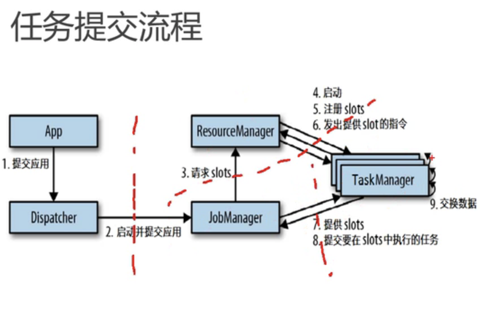
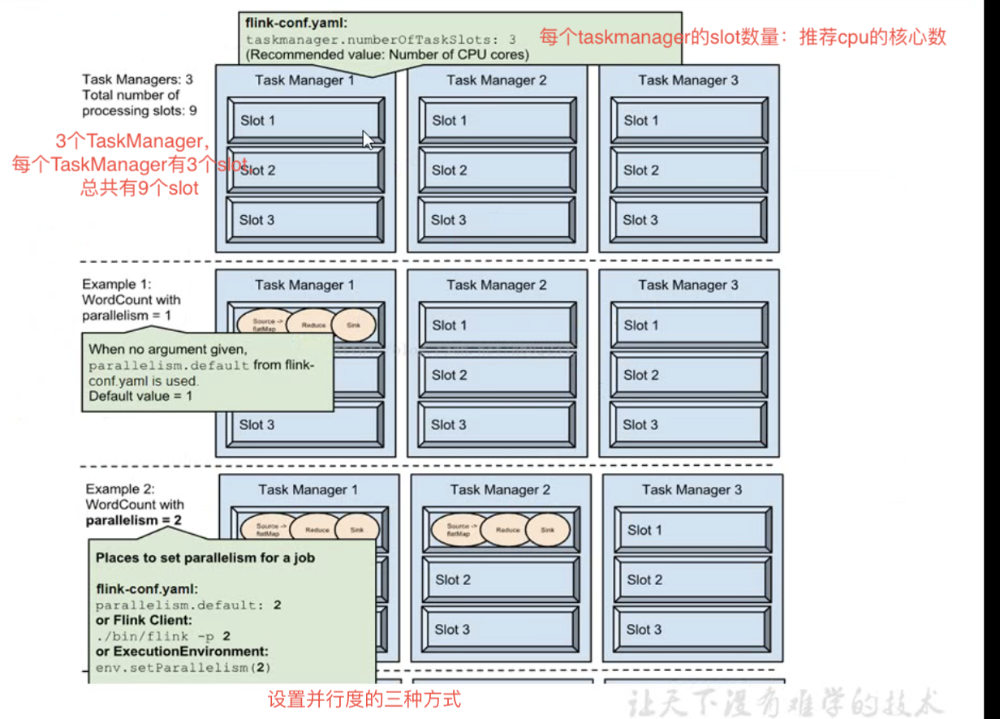

# 那些行业需要流处理
1，电商和市场营销
数据报表、广告投放、业务流程需要
2，物联网
传感器实时数据采集和显示、实时报警，交通运输业
3，电信业
基站流量调配
4，银行和金融行业
实时结算和通知推送，实时检测异常行为

# Flink主要特点
事件驱动
离线数据是有界的流，实时数据是一个没有界限的流：这就是所谓的有界流和无界流
分层api   
sql/table api：最高级的api，把里面的数据都当成表来操作
DataStream api：核心api，主要用来处理无界流
DataSet api：核心api，主要用来处理有界流
ProcessFunction：最底层api，能拿到事件，有状态计算，还可以进行时间操作
支持事件时间和处理时间
精确一次（exactly-once）的状态一致性保证
低延迟，每秒处理数百万个事件，毫秒级延迟
与众多常用存储系统连接
高可用，动态扩展、全天候运行

# Flink对比Spark Streaming
数据模型
spark采用RDD模型，Spark streaming的DStream实际上也就是一组小批数据RDD的集合
flink基本数据模型是数据流，以及事件（Event）序列
运行时架构
spark是批计算，将DAG划分为不同的stage，一个完成后才可以计算下一个
flink是标准的流执行模式，一个事件在一个节点处理完后可以直接发往下一个节点进行处理

# 运行时架构
运行时组件
- 作业管理器JobManager
    1，控制一个应用程序执行的主进程，也就是说，每个应用程序都会被一个不同的JobManager所控制执行
    2，JobManager会先接收到要执行的应用程序，每个应用程序包括：作业图JobGraph、逻辑数据流图Logical dataflow graph和打包了所有的类、裤和其他资源jar包
    3，JobManager会把JobGraph转换成一个物理层面的数据流图，这个图叫做"执行图ExecutionGraph"，包含了所有可以并发执行的任务
    4，JobManager会向资源管理器ResourceManager请求执行任务必要的资源，也就是资源管理器上的插槽slot。一旦获取到了足够的资源，
    就会将执行图发分发到真正运行他们的TaskManager上。而在运行过程中，JobManager会负责所有需要中央协调的操作，比如检查点的协调
- 任务管理器TaskManager
    1，flink的工作进程。通常flink会有多个taskmanager运行，每个TaskManager都包含了一定数量的插槽。插槽的数量限制了TaskManager能够执行的任务数量
    2，启动之后，TaskManager会向资源管理器注册它的插槽；收到资源管理器指令后，TaskManager就会将一个或者多个插槽提供给JobManager调用。JobManager就可以向插槽分配任务来执行
    3，执行过程中，一个TaskManager可以跟其他运行同一应用程序的TaskManager交换数据
- 资源管理器ResourceManager
    1，主要负责任务管理器TaskManager和插槽slot
    2，Flink为不同的环境和资源管理器工具提供了不同的资源管理器，比如yarn、mesos、k8s、以及standalone部署
    3，当JobManager申请插槽资源时，ResourceManager会将有空闲的插槽的TaskManager分配给JobManager。
    如果ResourceManager没有足够的插槽来满足JobManager请求，它还可以向资源提供平台发起会话，以提供TaskManager进程容器
- 分发器Dispacher
    1，可以跨作业运行，提供了rest接口
    2，当一个应用被提交执行时，分发器会启动并将应用交给JobManager
    3，Dispatcher也会启动一个Web UI，用来方便的展示和监控作业执行的信息
    4，Dispatcher在架构中可能不是必需的，这取决于应用提交运行的方式
任务提交流程
    1，app提交应用给分发器dispatcher
    2，分发器dispatcher启动并提交应用给JobManager（每个Job就有一个JobManager）
    3，JobManager（已经拿到了所有的作业图）向ResourceManager请求slots
    4，启动ResourceManager、注册slots、发出提供slot的指令
    5，然后由TaskManager给JobManager提供slots
    6，提交要在slots中执行的任务
    7，TaskManager执行任务
# Lambda架构
Lambda架构是Nathan Marz提出的一个大数据处理框架。该框架的做法是将大数据系统架构拆分成了三层：
    1，Batch Layer：
        该层主要利用分布式处理系统处理大批量的数据，在数据集上预先计算查询函数，并构建查询所对应的Batch View。即所谓的批处理，适合处理离线数据。
        这一层中常用的框架是Apache Hadoop这一套，存储一般用Elephant DB, Apache Impala, SAP HANA 或 Apache Hive
    2，Speed Layer
        该层的目的是提供低延时的Real-time View，处理的都是实时的增量数据。
        这一层常用的流数据处理框架有Apache Storm，Apache Spark，Apache Flink，输出通常是在高速的Nosql数据库中。存储一般用Elasticsearch
    3，Serving Layer
        Serving Layer 用于响应用户的查询请求，它将 Batch Views 和 Real-time Views 的结果进行了合并，得到最后的结果。
        这一层通常就是使用的 Apache Druid，存储一般用 Apache Cassandra, Apache HBase, MongoDB
    优点：
        同时支持实时和批处理业务(既保证了低延迟又保证了准确性)
    缺点:
          1，Lambda 架构需要在两个不同的 API（application programming interface，应用程序编程接口）中对同样的业务逻辑进行两次编程：一次为批量计算的系统，一次为流式计算的系统。针对同一个业务问题产生了两个代码库，各有不同的漏洞。这种系统实际上非常难维护。
          2，随着数据增量的增大，T+1 的批处理计算时间可能不够(当天的数据，一个晚上可能处理不完)
          3，实时与批量计算结果不一致引起的数据口径问题
# Kappa 架构
Lambda 架构需要维护两套代码，两套系统(批处理和实时处理)；在某些情况下，这是非常不划算且没必要的，为什么实时流数据用后就丢弃，为什么不用流计算系统来进行全量数据处理从而去除Batch Layer这一层？
于是，Jay Kreps 在 2014 提出了Kappa 架构，它可以看做是 Lambda 架构的简化版，就是讲 Lambda 架构中的批处理模块移除，移除后如下:
其核心思想就是，使用系统( eg. kafka )保存历史消息数据, 然后通过回放数据，利用 Real-time Layer 这一层的流处理框架( eg. Flink , Spark Streaming , Storm )来完成业务上的批处理需求。核心步骤如下:
    1，数据需要可以被重放(重新处理)。例如, 用 Kafka 来保存数据，你需要几天的数据量就保存几天。
    2，用新实例重新处理计算重放的数据。即当需要全量重新计算时，重新起一个流计算实例，从头开始读取数据进行处理，并输出到一个新的结果存储中。
    3，当新的实例做完后，停止老的流计算实例，并把老的一些结果删除。
Kappa 和 Lambda 对比
    对比项	            Lambda架构	                        Kappa架构
    数据处理能力	        可以处理超大规模的历史数据	            历史数据处理的能力有限
    机器开销	            批处理和实时计算需一直运行，机器开销大	    必要时进行全量计算，机器开销相对较小
    存储开销	            只需要保存一份查询结果，存储开销较小	    需要存储新老实例结果，存储开销相对较大
    开发、测试难易度	    实现两套代码，开发、测试难度较大	        只需面对一个框架，开发、测试难度相对较小
    运维成本	            维护两套系统，运维成本大	            只需维护一个框架，运维成本小
# Flink在大数据框架中的应用
如上描述，在大数据架构处理中涉及到了流数据处理。特别是在 Kappa 架构中，去除了批处理层，只留下了 Real-time Layer. 所以，支持流数据处理的框架就显得额外的重要，最好是还能支持批处理。在 Kappa 架构中，由于需要使用实时流处理的结果来替代 Lambda 架构中批处理的结果，所以其在选择流数据框架对数据的一致性支持要求会更高。在选择流数据处理框架的时候需要将这个考虑进去。那么目前比较常用的流数据处理框架有哪些呢？各框架又有什么异同呢？
目前主流的流数据处理框架: Storm (Storm Trident)、Spark Streaming、Flink
    Storm：支持低延迟，但是很难实现高吞吐，并且不能保证 exactly-once
    Sparking Streaming ( Storm Trident )：利用微批处理实现的流处理(将连续事件的流数据分割成一系列微小的批量作业)，能够实现 exactly-once 语义，但不可能做到完全实时(毕竟还是批处理，不过还是能达到几秒甚至几亚秒的延迟)
    Flink：实时流处理，支持低延迟、高吞吐、exactly-once 语义、有状态的计算、基于事件时间的处理
相对来说，Flink实现了真正的流处理，并且做到了低延迟、高吞吐 和 exactly-once 语义；同时还支持有状态的计算(即使在发生故障时也能准确的处理计算状态) 和 基于事件时间的处理
# Flink简介
Apache Flink 是由 Apache 软件基金会开发的开源流处理框架，其核心是用 Java 和 Scala 编写的分布式流数据处理引擎。
Flink 以数据并行和流水线方式执行任意流数据程序，Flink 的流水线运行时系统可以执行批处理和流处理程序。
此外，Flink 的运行时本身也支持迭代算法的执行。
Flink 提供高吞吐量、低延迟的流数据处理引擎以及对事件-时间处理和状态管理的支持。
Flink应用程序在发生机器故障时具有容错能力，并且支持exactly-once语义。
Flink 并不提供自己的数据存储系统，但为Amazon Kinesis、Apache Kafka、HDFS、Apache Cassandra和ElasticSearch等系统提供了数据源和接收器 1
# Flink基本框架
Flink主要有两类进程：JobManager和TaskManager
    JobManager（masters）：协调分布式计算、任务调度，协调checkpoints，错误调度等，相当于一个指挥官（实际部署的时，至少需要一个JobManager，实际生产环境部署时都会做HA，部署多个JobManager；这个时候，只有一个leader，其他都是standby模式）
    TaskManager(workers)：真正执行dataflow的，并对streams进行缓存和交换
总的来说，运行中的 Flink 集群至少有一个 JobManager 进程和一个 TaskManager 进程。如果将客户端也算进去的话，那么还有一个 Client 进程。
各个进程一般部署在不同的机子上，不过也可以部署在同一台机子上，就比如说在本地启动一个集群时( Local 模式，通常用于开发调试 )， JobManager 进程和 TaskManager 进程就是跑在同一台服务器上。
Flink 是基于 Akka Actor 实现的 JobManager 和 TaskManager，所以JobManager和 TaskManager 以及 Client 之间的信息交互都会通过事件的方式来进行处理的。
流程：
    一个简单的流程就是，Client 提交任务作业给 JobManager ，JobManager 负责该作业的调度和资源分配（在 Flink 集群中，计算资源被定义为 Task Slot。每个 TaskManager 会拥有一个或多个 Slots），随后将作业分给对应的 TaskManager，TaskManager 收到任务后，启动线程去执行，并向 JobManager 报告任务状态和自身运行状态等。当任务结束后， JobManager 将收到通知，并统计数据后发送给 Client。
Flink 核心特性
    1，编程模型
        Flink 处理数据流的时候，一般遵循如下模型:
            构建 Flink 程序最基本的模块就是数据流和算子( transformations )，数据流就是永不终止的数据记录，而算子将数据流作为输入，进行特定操作后，再产生新的流数据。
            通常，其处理流程为 Source -> Transformations -> Sink . 其数据流构成一个有向无环图(DAG)。
        .png) DAG模式说白了就是多条链跟随主链，这些链之间大方向相同且不存在环路。
        1，Transformation Operators有多种，DataSet API 和 DataStream API 支持的不完全相同，通常支持的有如下几种,更详细的可以参考官方文档;
            Transformations	                    描述
            Map (DataSet 和 DataStream 都有)   	将一个元素经过特定处理映射成另一个
            Filter (DataSet 和 DataStream 都有)  经过特性函数处理，过滤数据
            KeyBy (Only DataStream )	        将数据根据特定的属性字段分区
            Window	                            按需将KeyedStreams分组处理
        2，Source 为待处理数据的输入地，而 Sink 为处理后的输出地，目前 Flink 支持的 Source 和 Sink 有：
            Apache Kafka (source/sink)
            Apache Cassandra (sink)
            Amazon Kinesis Streams (source/sink)
            Elasticsearch (sink)
            Hadoop FileSystem (sink)
            RabbitMQ (source/sink)
            Apache NiFi (source/sink)
            Twitter Streaming API (source)
            Apache ActiveMQ (source/sink)
            Apache Flume (sink)
            Redis (sink)
            Akka (sink)
            Netty (source)
    2，对时间的处理
        一般来说，在流数据处理中，可以将时间分成三类:
            事件时间：事件实际发生的时间(流记录中本身包含对应的时间戳)
            处理时间：事件被处理的时间(被流处理器处理的时间)
            进入时间：事件进入流处理框架的时间（缺乏真实事件时间的数据会被流处理器附上时间戳，即流处理器第一次看到他的时间）
        Flink 允许用户根据自己所需来选择三者中的任何一种来定义时间窗口。那么什么是时间窗口呢？
            先从窗口说起，窗口是一种机制，其将许多事件按照时间或者其他特征分组，从而将每一组作为整体进行分析。
            Flink 目前默认支持有时间窗口，计数窗口，会话窗口。用户可根据自己需要的情况选择对应的窗口处理。
        时间窗口
            时间窗口，应该算是比较常用的一个窗口处理了。比如说，每分钟统计一次某商品的点击数啊；或者每分钟统计一次一个小时内点击数最高的前十个产品之类的需求。只要是按照时间划分的，都可以使用时间窗口。
            时间窗口又分为滚动时间窗口和滑动时间窗口两种。
                滚动窗口:
                    
                    RT，定义一个一分钟的滚动窗口:```stream.timeWindow(Time.minutes(1))```
                滑动窗口:
                    
                    RT，定义一个窗口大小为一小时，滑动周期为一分钟的滑动窗口:```stream.timeWindow(Time.minutes(60), Time.minutes(1))```
                计数窗口
                    计数窗口和时间窗口类似，只不过分组依据不是时间而是数据个数，同样也分滚动计数窗口和滑动计数窗口，这里不再细说。
                    RT，代码实例:
                        ```
                        stream.countWindow(100); // 滚动计数窗口
                        stream.countWindow(100, 10); // 滑动计数窗口
                        ```
                使用计数窗口需要考虑，万一最终的数据量一直无法满足窗口大小的量，那么该程序可能就无法终止，最好设置超时。
        会话窗口
            不像前两种，这个比较特别。需要先理解什么算一个会话: 
                会话指的是活动阶段，其前后都是非活动阶段，那么这一活动阶段就是一个有效的会话。
                会话阶段通常需要有自己的处理机制，可以想象，会话的定义比较灵活，很难有固定的会话定义。
                Fink 也支持一些简单的定义直接使用，RT：
                    ```stream.window(SessionWindows.withGap(Time.minutes(5)); // 五分钟内没有活动的话，则认为会话结束 ```
        时间和水印(Watermarks)
            支持事件时间的流处理器需要明确的知道何时才是事件的终止。
            就好比一个一小时的时间窗口操作，我们需要知道何时才是真正的结束时间，否则窗口无法被正确的关闭( 因为实际，基于事件时间的事件其由于网络等原因，其到达的顺序并不一定就是其事件发生时间的顺序 )。
            另外，在 Kappa 架构中， 流数据处理框架需要支持处理回放的数据，那么同一组数据重新运行同样的程序，需要得到相同的结果，这也需要其支持事件时间，因为如果窗口的设定是根据系统时间而不是事件自带的时间戳，那么每次运行同样的程序，都会得到不同的结果。
            可见支持事件时间对于流处理架构而言至关重要，因为事件时间能保证结果正确，并使流处理架构拥有重新处理数据的能力。
            那么 Flink 是如何做到对事件时间的支持的？ 其实际是通过 Watermarks 机制来实现的。
                
                大意就是说，Watermarks 作为数据流中的一部分，包含一个时间戳 t，当处理器处理到这个 Watermark(t) 的时候，就认为所有事件时间小于该水印时间的事件数据都已经到达。
                但是即使如此，依然可能会有些事件数据在 Watermark 之后到达，这时 Watermark 机制也无法起到对应的作用，针对这一情况 Flink 支持了 Late Elements 处理
            如何解决问题：
                Watermark是一种告诉Flink一个消息延迟多少的方式。**它定义了什么时候不再等待更早的数据。** 
                可以把Watermarks理解为一个水位线，这个Watermarks在不断的变化。**Watermark实际上作为数据流的一部分随数据流流动。**
                当Flink中的运算符接收到Watermarks时，它明白早于该时间的消息已经完全抵达计算引擎，**即假设不会再有时间小于水位线的事件到达。**
                这个假设是触发窗口计算的基础，**只有水位线越过窗口对应的结束时间，窗口才会关闭和进行计算。**
            背景概念：
                流处理：
                    流处理，最本质的是在处理数据的时候，接受一条处理一条数据。
                    批处理，则是累积数据到一定程度在处理。这是他们本质的区别。
                    在设计上Flink认为数据是流式的，批处理只是流处理的特例。同时对数据分为有界数据和无界数据。 
                    - 有界数据对应批处理，API对应Dateset。 
                    - 无界数据对应流处理，API对应DataStream。
                乱序（out-of-order）
                    什么是乱序呢？可以理解为数据到达的顺序和其实际产生时间的排序不一致。导致这的原因有很多，比如延迟，消息积压，重试等等。
                    我们知道，流处理从事件产生，到流经source，再到operator，中间是有一个过程和时间的。虽然大部分情况下，流到operator的数据都是按照事件产生的时间顺序来的，但是也不排除由于网络、背压等原因，导致乱序的产生（out-of-order或者说late element）。
比如：
某数据源中的某些数据由于某种原因(如：网络原因，外部存储自身原因)会有5秒的延时，
也就是在实际时间的第1秒产生的数据有可能在第5秒中产生的数据之后到来(比如到Window处理节点)。
有1~10个事件。
乱序到达的序列是：2,3,4,5,1,6,3,8,9,10,7


Flink中的窗口概念
对于Flink，如果来一条消息计算一条，这样是可以的，但是这样计算是非常频繁而且消耗资源，如果想做一些统计这是不可能的。所以对于Spark和Flink都产生了窗口计算。

比如 是因为我们想看到过去一分钟，过去半小时的访问数据，这时候我们就需要窗口。

Window：Window是处理无界流的关键，Windows将流拆分为一个个有限大小的buckets，可以可以在每一个buckets中进行计算。
start_time,end_time：当Window时时间窗口的时候，每个window都会有一个开始时间和结束时间（前开后闭），这个时间是系统时间。

窗口生命周期
简而言之，只要属于此窗口的第一个元素到达，就会创建一个窗口，当时间（事件或处理时间）超过其结束时间戳加上用户指定的允许延迟时，窗口将被完全删除。
例如:
使用基于事件时间的窗口策略，每5分钟创建一个不重叠（或翻滚）的窗口并允许延迟1分钟。

假定目前是12:00。

当具有落入该间隔的时间戳的第一个元素到达时，Flink将为12:00到12:05之间的间隔创建一个新窗口，当水位线（watermark）到12:06时间戳时将删除它。
窗口有如下组件：

Window Assigner：用来决定某个元素被分配到哪个/哪些窗口中去。

Trigger：触发器。决定了一个窗口何时能够被计算或清除。触发策略可能类似于“当窗口中的元素数量大于4”时，或“当水位线通过窗口结束时”。
Evictor：它可以在 触发器触发后 & 应用函数之前和/或之后 从窗口中删除元素。
窗口还拥有函数，比如 ProcessWindowFunction，ReduceFunction，AggregateFunction或FoldFunction。该函数将包含要应用于窗口内容的计算，而触发器指定窗口被认为准备好应用该函数的条件。
Keyed vs Non-Keyed Windows
在定义窗口之前,要指定的第一件事是流是否需要Keyed，使用keyBy（...）将无界流分成逻辑的keyed stream。 如果未调用keyBy（...），则表示流不是keyed stream。

对于Keyed流，可以将传入事件的任何属性用作key。 拥有Keyed stream将允许窗口计算由多个任务并行执行，因为每个逻辑Keyed流可以独立于其余任务进行处理。 相同Key的所有元素将被发送到同一个任务。
在Non-Keyed流的情况下，原始流将不会被分成多个逻辑流，并且所有窗口逻辑将由单个任务执行，即并行性为1。

窗口分类
窗口分类可以分成：翻滚窗口（Tumbling Window，无重叠），滚动窗口（Sliding Window，有重叠），和会话窗口，（Session Window，活动间隙）

滚动窗口
滚动窗口分配器将每个元素分配给固定窗口大小的窗口。滚动窗口大小固定的并且不重叠。例如，如果指定大小为5分钟的滚动窗口，则将执行当前窗口，并且每五分钟将启动一个新窗口。
滑动窗口
滑动窗口与滚动窗口的区别就是滑动窗口有重复的计算部分。
滑动窗口分配器将每个元素分配给固定窗口大小的窗口。类似于滚动窗口分配器，窗口的大小由窗口大小参数配置。另外一个窗口滑动参数控制滑动窗口的启动频率(how frequently a sliding window is started)。因此，如果滑动大小小于窗口大小，滑动窗可以重叠。在这种情况下，元素被分配到多个窗口。
例如，你可以使用窗口大小为10分钟的窗口，滑动大小为5分钟。这样，每5分钟会生成一个窗口，包含最后10分钟内到达的事件。
会话窗口
会话窗口分配器通过活动会话分组元素。与滚动窗口和滑动窗口相比，会话窗口不会重叠，也没有固定的开始和结束时间。相反，当会话窗口在一段时间内没有接收到元素时会关闭。
例如，不活动的间隙时。会话窗口分配器配置会话间隙，定义所需的不活动时间长度(defines how long is the required period of inactivity)。当此时间段到期时，当前会话关闭，后续元素被分配到新的会话窗口。
Flink中的时间概念

Flink在流处理程序支持不同的时间概念。分别为Event Time/Processing Time/Ingestion Time，也就是事件时间、处理时间、提取时间。

从时间序列角度来说，发生的先后顺序是：

事件时间（Event Time）----> 提取时间（Ingestion Time）----> 处理时间（Processing Time）
Event Time 是事件在现实世界中发生的时间，它通常由事件中的时间戳描述。
Ingestion Time 是数据进入Apache Flink流处理系统的时间，也就是Flink读取数据源时间。
Processing Time 是数据流入到具体某个算子 (消息被计算处理) 时候相应的系统时间。也就是Flink程序处理该事件时当前系统时间。
但是我们讲解时，会从后往前讲解，把最重要的Event Time放在最后。

处理时间
是数据流入到具体某个算子时候相应的系统时间。

这个系统时间指的是执行相应操作的机器的系统时间。当一个流程序通过处理时间来运行时，所有基于时间的操作(如: 时间窗口)将使用各自操作所在的物理机的系统时间。

ProcessingTime 有最好的性能和最低的延迟。但在分布式计算环境或者异步环境中，ProcessingTime具有不确定性，相同数据流多次运行有可能产生不同的计算结果。因为它容易受到从记录到达系统的速度（例如从消息队列）到记录在系统内的operator之间流动的速度的影响（停电，调度或其他）。
提取时间
IngestionTime是数据进入Apache Flink框架的时间，是在Source Operator中设置的。每个记录将源的当前时间作为时间戳，并且后续基于时间的操作（如时间窗口）引用该时间戳。

提取时间在概念上位于事件时间和处理时间之间。与处理时间相比，它稍早一些。IngestionTime与ProcessingTime相比可以提供更可预测的结果，因为IngestionTime的时间戳比较稳定(在源处只记录一次)，所以同一数据在流经不同窗口操作时将使用相同的时间戳，而对于ProcessingTime同一数据在流经不同窗口算子会有不同的处理时间戳。

与事件时间相比，提取时间程序无法处理任何无序事件或后期数据，但程序不必指定如何生成水位线。

在内部，提取时间与事件时间非常相似，但具有自动时间戳分配和自动水位线生成功能。

事件时间
事件时间就是事件在真实世界的发生时间，即每个事件在产生它的设备上发生的时间（当地时间）。比如一个点击事件的时间发生时间，是用户点击操作所在的手机或电脑的时间。

在进入Apache Flink框架之前EventTime通常要嵌入到记录中，并且EventTime也可以从记录中提取出来。在实际的网上购物订单等业务场景中，大多会使用EventTime来进行数据计算。

基于事件时间处理的强大之处在于即使在乱序事件，延迟事件，历史数据以及从备份或持久化日志中的重复数据也能获得正确的结果。对于事件时间，时间的进度取决于数据，而不是任何时钟。

事件时间程序必须指定如何生成事件时间的Watermarks，这是表示事件时间进度的机制。

现在假设我们正在创建一个排序的数据流。这意味着应用程序处理流中的乱序到达的事件，并生成同样事件但按时间戳（事件时间）排序的新数据流。

比如:

有1~10个事件。
乱序到达的序列是：1,2,4,5,6,3,8,9,10,7
经过按 事件时间 处理后的序列是：1,2,3,4,5,6,7,8,9,10
为了处理事件时间，Flink需要知道事件的时间戳，这意味着流中的每条数据都需要分配其事件时间戳。这通常通过提取每条数据中的固定字段来完成时间戳的获取。

设定时间特性

Flink DataStream 程序的第一部分通常是设置基本时间特性。 该设置定义了数据流源的行为方式（例如：它们是否将分配时间戳），以及像 **KeyedStream.timeWindow(Time.seconds(30)) ** 这样的窗口操作应该使用上面哪种时间概念。

final StreamExecutionEnvironment env = StreamExecutionEnvironment.getExecutionEnvironment();
env.setStreamTimeCharacteristic(TimeCharacteristic.ProcessingTime);


Watermark
前文讲到了事件时间，这个真实发生的时间是我们业务在实时处理程序中非常关心的。在一个理想的情况下，事件时间处理将产生完全一致和确定的结果，无论事件何时到达或其排序。但是在现实中，消息不在是按照顺序发送，产生了乱序，这时候该怎么处理？

Watermark是Apache Flink为了处理EventTime 窗口计算提出的一种机制,本质上也是一种时间戳。watermark是用于处理乱序事件或延迟数据的，这通常用watermark机制结合window来实现（Watermarks用来触发window窗口计算）。
比如对于late element，我们不能无限期的等下去，必须要有个机制来保证一个特定的时间后，必须触发window去进行计算了。这个特别的机制，就是watermark。 可以把Watermark看作是一种告诉Flink一个消息延迟多少的方式。定义了什么时候不再等待更早的数据。

1. 窗口触发条件
上面谈到了对数据乱序问题的处理机制是watermark+window，那么window什么时候该被触发呢？
基于Event Time的事件处理，Flink默认的事件触发条件为：
**对于out-of-order及正常的数据而言**
   watermark的时间戳 > = window endTime
   在 [window_start_time,window_end_time] 中有数据存在。
**对于late element太多的数据而言**
   Event Time > watermark的时间戳
WaterMark相当于一个EndLine，一旦Watermarks大于了某个window的end_time，就意味着windows_end_time时间和WaterMark时间相同的窗口开始计算执行了。
就是说，我们根据一定规则，计算出Watermarks，并且设置一些延迟，给迟到的数据一些机会，也就是说正常来讲，对于迟到的数据，我只等你一段时间，再不来就没有机会了。
WaterMark时间可以用Flink系统现实时间，也可以用处理数据所携带的Event time。
使用Flink系统现实时间，在并行和多线程中需要注意的问题较少，因为都是以现实时间为标准。
如果使用处理数据所携带的Event time作为WaterMark时间，需要注意两点：
    因为数据到达并不是循序的，注意保存一个当前最大时间戳作为WaterMark时间
    并行同步问题
    3，有状态的计算
        流计算一般分为有状态和无状态两种
            无状态计算指的是处理过程中不依赖于之前的数据处理结果或其他中间数据
            有状态计算会维护状态，并基于最新数据和当前状态生成输出结果
        
        有状态的计算引入了状态，所有引入了状态的分布式系统都会遇到数据一致性的问题。流处理或者消息系统中，通常将其定义为"正确性级别"，通常来说会有三个级别：
            at-most-once: 数据可能会丢失
            at-least-once: 数据最少处理一次
            exactly-once: 数据均被且只处理一次
        Flink的话支持exactly-once语义，且还能保持低延迟高吞吐的处理能力，这是flink的一个重大优势。
        Flink保证exactly-once主要是通过他的checkpoint和savepoint机制
            checkpoint：Flink自动周期生成，用于用户程序出现故障时，使其重置回到正确的状态，主要需要做两件事：
                1，保存source中流的偏移量（eg: kafka数据中的偏移量，以便数据重放）
                2，保存中间的计算状态（即StateBackend，这个保存的位置可以选择）
                Flink检查点算法的正确名称是异步屏障快照（asynchronous barrier snapshotting）。该算法大致基于Chandy-Lamport 分布式快照算法。
                    其中一个核心概念：Barrier（屏障）
                    在数据流中，屏障和普调标记类似；他们都由算子处理，但是不参与计算，而是会触发与检查点相关的行为。
                    当读取输入流的数据源遇到检查点屏障时，它将其在输入流的位置保存到文档存储中(eg. kafka的偏移量)。
                    当算子处理完记录并收到了屏障时，它们会将状态异步保存到稳定存储中，当状态备份和检查点位置备份都被确认后，则认为该检查点已完成。
                    总结如下：
                        1，Souce 遇到屏障保存数据位置
                        2，算子遇到屏障异步保存状态
                        3，保存结束后确认检查点完成
            savepoint：需要应用自己手动生成，通常用于状态版本控制。依赖于checkpoint机制。
                上述流程中涉及到保存状态，Flink 可以支持多种状态存储。大致有以下几种StateBackend
                    MemoryStateBackend：快速，但是不稳定，重启就没了。
                    RocksDBStateBackend：支持增量，支持大状态长窗口的大数据存储，但是存储和读取时都需要序列化(会耗时)
                    FsStateBackend：支持大状态长窗口的大数据存储，但是还是会保存一份在 TaskManager 的 Memory 中，所以状态的大小不能超过 TaskManager 的内存
# Flink四大组件

1，作业管理器（JobManager）
    控制一个应用程序的主进程，就是说每个应用程序都会被一个不同的JobManager控制执行
    JobManager会先接收到要执行的应用程序，这个应用程序包括：作业图（JobGraph）、逻辑数据流图（logic dataflow graph）和打包了所有类、库和其他资源的jar包
    JobManager会把JobGraph转换成一个物理层面的数据流图，这个图被叫做"执行图"（ExecutionGraph），包含了所有可以并发执行的任务
    JobManager会向资源管理器（ResourceManager）请求执行任务必要的资源，也就是任务管理器（TaskManager）上的插槽（Slot）。一旦获取到了足够的资源，就会将执行图分发到真正运行他们的TaskManager上，而运行过程中，JobManager会负责所有需要中央协调的操作，比如说检查点checkpoints的协调。
2，任务管理器（TaskManager）
    Flink的工作进程中。通常在Flink中会有多个TaskManager运行，每个TaskManager都包含了一定数量的插槽（slots）。插槽的数量限制了TaskManager能够执行的任务数量
    启动之后，TaskManager会向资源管理器注册它的插槽；收到资源管理器指令后，TaskManager就会将一个或者多个插槽提供给JobManager调用。JobManager就可以向插槽分配任务（tasks）来执行了
    在执行过程中，一个TaskManager可以跟其他运行同一数据的TaskManager交换数据
3，资源管理器（ResourceManager）
    主要负责管理任务管理器（TaskManager）的插槽（slot），TaskManager插槽是Flink中定义的处理资源单元
    Flink为不同的环境和资源管理工具提供了不同的资源管理器，比如Yarn、Mesos、K8s、以及standalone
    当JobManager申请插槽资源时，ResourceManager会将有空闲插槽的TaskManager分配给JobManager。如果ResourceManager没有足够的插槽来满足JobManager的请求，
4，分发器（Dispatcher）
    可以跨作业运行，它为应用提交提供了rest接口。
    当一个应用被提交执行时，分发器就会启动并将应用移交给一个JobManager。
    Dispatcher也会启动一个Web UI，用来方便的展示和监控作业执行信息
    Dispatcher在架构中可能并不是必须的，这取决于应用提交运行的方式
# flink任务调度

.png)

# 关于TaskManager和Slot以及并行度
.png)

 
 
 
inputDataStream.flatMap(new MyFlatMapper())
                .slotSharingGroup("red")//设置slot共享组
                .keyBy(0)
                .sum(1).slotSharingGroup("green");//设置slot共享组
组内的算子共享一个slot
# 程序与数据流
 
 
# flink执行图
 
 
# 任务之间数据传输形式
 
# 任务链
 
 
1，env.disableOperatorChaining()//可以禁止任务链的使用
2，inputDataStream.flatMap(new MyFlatMapper())
                .keyBy(0)
                .sum(1)
                .startNewChain();//开启一个新的任务链
# DataStream API
Environment
    getExecutionEnvironment
        创建一个执行环境，表示当前执行程序的上下文。如果程序是独立调用的，则次方法返回本地执行环境；如果从命令行客户端调用程序可以提交到集群，次方法返回集群的执行环境，也就是说，getExecutionEnvironment会根据查询运行的方式决定返回什么样的运行环境，是最常用的一种创建执行环境的方式
        ExecutionEnvironment env = ExecutionEnvironment.getExecutionEnvironment());
        StreamExecutionEnvironment env = StreamExecutionEnvironment.getExecutionEnvironment());
    createLocaleEnvironment
        返回本地执行环境，需要在调用时指定默认并行度。
        LocalStreamEnvironment env = StreamExecutionEnvironment.createLocalEnvironment(1);
    createRemoteEnvironment
        返沪集群执行环境，将jar提交到远程服务器，需要在调用时指定JobManager的IP和端口号，并指定要在集群运行的jar包
        StreamExecutionEnvironment env = StreamExecutionEnvironment.createRemoteEnvironment("jobmanage-hostname", 6123, "YOUROATH//WORDCOUNT.jar")
Slink从集合中读取数据
    StreamExecutionEnvironment env = StreamExecutionEnvironment.getExecutionEnvironment());
    从集合中读取数据
        DataStream<User> dataStream = env.fromCollection(Arrays.asList(
                                new User("张三", 12), 
                                new User("李四", 16), 
                                new User("王五", 17))); 
    直接读取元素
        DataStream<Integer> dataStream = env.fromElements(1,2,3,4,5,6);
    从文件读取数据
        DataStream<Integer> dataStream = env.readTestFile("/Users/yangshuai/./src/main/resources/hello.txt");
    从kafka读取数据
        1，倒入依赖
            <dependency>
                <groupId>org.apache.flink</groupId>
                <artifactId>flink-connector-kafka-0.11_2.12</artifactId>
                <version>1.10.1</version>
            </dependency>
        2，代码实现
            Properties properties = new Properties();
            properties.setProperty("bootstrap.servers", "localhost:9992");
            properties.setProperty("group.id", "consumer.group");
            properties.setProperty("key.deserializer", "org.apache.kafka.common.serialization.StringDeserializer");
            properties.setProperty("auto.offset.reset", "latest");
            DataStream<Integer> dataStream = env.addSource(new FlinkKafkaConsumer011<String>("user", new SimpleStringSchema(), properties));
    自定义数据源
        public class CustomSource {
            public static void main(String[] args) throws Exception {
                // 创建执行环境
                StreamExecutionEnvironment env = StreamExecutionEnvironment.getExecutionEnvironment();
                DataStream dataStream = env.addSource(new MySource());
                dataStream.print();
                env.execute();
            }
            public static class MySource implements SourceFunction<Integer> {
                // 定义一个标志位，用来控制数据的产生
                private boolean running = true;
                public void run(SourceContext<Integer> ctx) throws Exception {
                    Random random = new Random();
                    while (running) {
                        ctx.collect(random.nextInt());
                        Thread.sleep(1000);
                    }
                }
                public void cancel() {
                    running = false;
                }
            }
        }
Transform转换操作
    1，map把String转换成长度输出
        DataStream<Integer> mapStream = inputStream.map(new MapFunction<String, Integer>() {
            public Integer map(String value) throws Exception {
                return value.length();
            }
        });
    2, flatMap 按逗号区分
        DataStream<String> flatMapStream = inputStream.flatMap(new FlatMapFunction<String, String>() {
            public void flatMap(String value, Collector<String> out) throws Exception {
                String[] fields = value.split(",");
                for (String field : fields) {
                    out.collect(field);
                }
            }
        });
    3，filter，筛选asd开头的数据
        DataStream<String> filterStream = inputStream.filter(new FilterFunction<String>() {
            public boolean filter(String value) throws Exception {
                return value.startsWith("asd");
            }
        });
    4，keyBy
        DataStream -> KeyedStream:逻辑地将一个流拆分成不相交的分区，每个分区包含具有相同key的元素，在内部以hash的形式实现的
    5，滚动聚合算子（RollingAggregation）
        这些算子可以针对KeyedStream的每一个支流做聚合
        sum()
        min()
        max()
        minBy()
        maxBy()
    6，Reduce
        KeyStream -> DataStream:一个分组数据的聚合操作，合并当前的元素和上次聚合的结果，产生一个新的值，返回的流中包含每一次聚合的结果，而不是只返回最后一次聚合的最终结果
    7，Split 和 Select
        Split：DataStream -> SplitStream：根据某些特征将一个DataStream拆分成两个或者多个DataStream
    8，Connect 和CoMap
        DataStream，DataStream -> ConnectStream：连接两个保持他们类型的数据流，两个数据流被connect后，只是被放在了同一个流中，内部依然保持各自的数据和形式不发生任何变化，两个流互相独立
    9，Union
        DataStream -> DataStream 对两个或者两个以上的DataStream进行union操作，产生一个包含所有DataStream元素的新DataStream
# 支持的数据类型
Flink流应用程序处理的是以数据对象表示的时间流。所以在flink内部，我们需要能够处理这些对象。他们需要被序列化和反序列化，以便通过网络传送他们。或者从状态端、检查点和保存点读取他们。
为了有效的做到这点，flink需要明确知道应用程序所处理的数据类型。flink使用类型信息的概念来表示数据类型，并为每个数据类型生成特定的序列化器，反序列化器和比较器
flink还具有一个类型提取系统，该系统分析函数的输入和返回类型，以自动获取类型信息，从而获得序列化器和反序列化器。
但是在某些情况下，例如lambda函数或泛型类型，需要显式的提供类型信息，才能使应用程序正常工作或提高工作性能
1，基本数据类型
    flink支持所有的java和scala基础数据类型，Int、Double、Long、String
    DataStream<Integer> numberStream = env.fromElements(1,2,3,4);
    numberStream.map(data -> data*2);
2，Java和Scala元组（Tuples）
    DataStream<Tuples<String, Integer>> personStream = env.fromElements(new Tuple2("admin", 17), new Tuple2("hcp", 18));
3，Scala样例类（case classes）
    case class Person(name: String, age: Int)
    val person: DataStream[Person] = env.fromElements(Person("admin", 17), Person("hcp", 17))
4，Java简单的对象（POJOs）
    必须要有空参构造方法，私有方法必须有public的get和set方法
5，其他（Arrays、Lists、Maps、Enums等等）
    Flink对java和Scala中的一些特殊的类型也是支持的，比如Java的ArrayList、HashMao、Enum等
# 实现UDF函数类（更细粒度的控制流）
函数类（Function Classes）
    flink暴露了所有的udf函数的接口（实现方式为接口或者抽象类）例如MapFunction、FilterFunction、ProcessFunction等等
    下面实现了FilterFunction：
    ```
    DataStream<String> filterStream = inputStream.filter(new FilterFunction<String>() {
        public boolean filter(String value) throws Exception {
            return value.startsWith("asd");
        }
    });
    ```
匿名函数（Lambda FUnctions）
    DataStream<String> tweets = env.readTextFile("INPUT_FILE");
    DataStream<String> flinkTweets = tweets.filter(tweet -> tweet.contains("flink");
富函数（Rich Functions）
    "富函数"是DataStream API提供的一个函数类接口，所有flink函数类都有其rich版本。它与常规函数的不同在于，可以获取运行环境的上下文，并拥有一些生命周期方法，所以可以实现更复杂的功能。
    RichMapFUnction
    RichFlatMapFunction
    RichFilterFunction
    Rich Function有一个生命周期的概念。典型的生命周期方法有：
        open()方法是rich function的初始化方法，当一个算子例如map或者filter被调用之前open()会被调用
        close()方法是生命周期的最后一个调用的方法，做一些清理工作
        getRuntimeContext()方法提供了函数的RuntimeContext的一些信息，例如函数执行并行度，任务的名字，以及state状态
        ```
        SingleOutputStreamOperator<Tuple2<String, Integer>> richStream = dataStream.map(new MyMapper());
        public static class MyMapper extends RichMapFunction<SendorReading, Tuple2<String, Integer>> {
            @Override
            public Tuple2<String, Integer> map(SendorReading value) throws Exception {
                return new Tuple2<>(value.getName(), getRuntimeContext().getIndexOfThisSubtask());
            }
            public void open(org.apache.flink.configuration.Configuration parameters) throws Exception {
                //初始化工作，一般是定义状态，或者建立数据库连接
            }
            public void close() throws Exception {
                //一般是关闭连接或者清空状态
            }
        }
        ```
# Slink
Flink没有类似于spark中foreach方法，让用户进行迭代的操作。虽有对外的输出操作都要用slink完成。最后通过类似如下方式完成整个任务最终输出操作。
stream.addSlink(new MySlink(xxx))
官方提供了一部分的框架的slink。除此之外，需要用户自定义实现slink

# Window
基本概念
    一般真实的流是无界的，怎样处理无界数据？
    可以把无限的数据流切分，得到有限的数据集进行处理------也就是得到有界流
    窗口就是将无限流切割为有限流的一种方式，它会将流数据分发到有限大小的桶（bucket）中进行分析
类型
    时间窗口（Time Window）
        滚动时间窗口
        滑动时间窗口
        会话窗口
    计数窗口（Count Window）
        滚动计数窗口
        滑动计数窗口


window API
    窗口分配器------window()方法
    我们可以用.wondow()来定义一个窗口，然后基于window去做一些聚合或者其他处理操作。注意window()方法必须在keyBy之后才能调用
    flink提供了更加简单的timeWindow和countWindow方法，用于定义时间窗口和计数窗口
窗口分配器（window assigner）
    window()方法接受的输入参数是一个WindowAssigner
    WindowAssigner负责将每条输入的数据分发到正确的window中
    flink提供了通用的WindowAssigner
        滚动窗口（tumbling window）
        滑动窗口（sliding window）
        会话窗口（session window）
        全局窗口（global window）
创建不同类型的窗口
    滚动时间窗口：.timeWindow(Time.seconds(15))
    滑动时间窗口：.timeWindow(Time.seconds(15), Time.seconds(5))
    会话窗口：.window(EventTimeSessionWindows.withGap(Time.minutes(10)))
    滚动计数窗口：.countWindow(5)
    滑动计数窗口：.countWindow(10, 2)
窗口函数（window function）
    window function定义了要对窗口中收集的数据做的计算操作可以分为两类：
        增量聚合函数（incremental aggregation functions）：
            每条数据进来就计算，保持一个简单的状态
            ReduceFunction, AggregateFunction
        全窗口函数（full window functions）
            先把窗口所有数据收集起来，等到计算的时候会遍历所有数据
            ProcessWindowFunction, WindowFunction
其他API
    trigger() ------ 触发器
        定义window什么时候关闭，出发计算并输出结果
    evictor() ------ 移除器
        定义移除某些数据的逻辑
    allowedLateness() ------ 允许处理迟到的数据
    sideOutputLateData() ------ 将迟到的数据放入侧输出流
    getSideOutput() ------ 获取侧输出流
# Flink中的时间语义


设置事件事件语义
    ```
    StreamExecutionEnvironment env = StreamExecutionEnvironment.getExecutionEnvironment();
    env.setParallelism(1);
    env.setStreamTimeCharacteristic(TimeCharacteristic.EventTime);
    ```

水位线
    怎样避免乱数据带来的计算不正确？
    遇到一个时间戳达到了窗口关闭时间，不应该立即触发窗口计算，而是等待一段时间，等迟到的数据来了再关闭窗口
    Watermark是一种衡量Event time进展的机制，可以设定延迟触发
    Watermark机制结合window来实现
    数据流中的Watermark用于表示timestamp小于Watermark的数据，都已经到达了，因此，window的执行也是由Watermark触发的
    Watermark用来让程序自己平衡延迟和结果正确性


概念
    在Flink中，水位线是一种衡量Event Time进展的机制，用来处理实时数据中的乱序问题，通常是水位线和窗口结合使用来实现的
    从设备生成实时流事件，到Flink的source，再到多个operator处理数据，过程中会受到网络延迟、背压等多种因素影响造成数据乱序。
    在进行窗口处理时，不可能无限期的等待延迟数据到达，当到达特定的watermark时，认为在watermark之前的数据已经全部到达（即使后面还有延迟数据），可以触发窗口计算，这个机制就是水位线
水位线的计算
    watermark本质上是一个时间戳，且是动态变化的，会根据当前最大事件时间产生。
    watermark具体计算时间为：
        watermark = 进入flink窗口的最大事件时间（maxEventTime） - 指定的延迟时间（t）
    当watermark时间戳大于等于窗口结束时间时，意味着窗口结束，需要触发窗口计算。
水位线的生成
    水位线生产的最佳位置是在尽可能靠近数据源的地方，因为水位线生成时会做出一些有关元素顺序相对时间戳的假设。
    由于数据源读取过程是并行的，一切引起Flink跨行数据流分区进行重新分发的操作（比如：改变并行度，keyby等）都会导致元素时间戳乱序。
    但是如果是某些初始化的filter、map等不会引起元素重新分发的操作，可以考虑在生成水位线之前使用。
水位线分配器
    Periodic Watermarks
        周期性分配水位线比较常用，是我们会指示系统以固定的时间间隔发出的水位线。在设置时间为事件时间时，会默认设置这个时间间隔为200ms, 如果需要调整可以自行设置。比如下面的例子是手动设置每隔1s发出水位线。
        ```
        final StreamExecutionEnvironment env = StreamExecutionEnvironment.getExecutionEnvironment();
        env.setStreamTimeCharacteristic(TimeCharacteristic.EventTime);
        // 手动设置时间间隔为1s
        env.getConfig().setAutoWatermarkInterval(1000);
        ```
        周期水位线需要实现接口：AssignerWithPeriodicWatermarks，下面是示例：
        ```
            public class TestPeriodWatermark implements AssignerWithPeriodicWatermarks<Tuple2<String, Long>> {
                Long currentMaxTimestamp = 0L;
                final Long maxOutOfOrderness = 1000L;// 延迟时长是1s
                @Nullable
                @Override
                public Watermark getCurrentWatermark() {
                    return new Watermark(currentMaxTimestamp - maxOutOfOrderness);
                }
                @Override
                public long extractTimestamp(Tuple2<String, Long> element, long previousElementTimestamp) {
                    long timestamp = element.f1;
                    currentMaxTimestamp = Math.max(timestamp, currentMaxTimestamp);
                    return timestamp;
                }
            }
        ```
    Punctuated Watermarks
        定点水位线不是太常用，主要为输入流中包含一些用于指示系统进度的特殊元组和标记，方便根据输入元素生成水位线的场景使用的。
        由于数据流中每一个递增的EventTime都会产生一个Watermark。
        在实际的生产中Punctuated方式在TPS很高的场景下会产生大量的Watermark在一定程度上对下游算子造成压力，所以只有在实时性要求非常高的场景才会选择Punctuated的方式进行Watermark的生成。
        ```
        public class TestPunctuateWatermark implements AssignerWithPunctuatedWatermarks<Tuple2<String, Long>> {
            @Nullable
            @Override
            public Watermark checkAndGetNextWatermark(Tuple2<String, Long> lastElement, long extractedTimestamp) {
                return new Watermark(extractedTimestamp);
            }
            @Override
            public long extractTimestamp(Tuple2<String, Long> element, long previousElementTimestamp) {
                return element.f1;
            }
        }
        ```
水位线与数据完整性
    水位线可以用于平衡延迟和结果的完整性，它控制着执行某些计算需要等待的时间。这个时间是预估的，现实中不存在完美的水位线，因为总会存在延迟的记录。现实处理中，需要我们足够了解从数据生成到数据源的整个过程，来估算延迟的上线，才能更好的设置水位线。
    如果水位线设置的过于宽松，好处是计算时能保证近可能多的数据被收集到，但由于此时的水位线远落后于处理记录的时间戳，导致产生的数据结果延迟较大。
    如果设置的水位线过于紧迫，数据结果的时效性当然会更好，但由于水位线大于部分记录的时间戳，数据的完整性就会打折扣。
# Flink状态管理
flink中的状态管理
算子状态（Operatior State）
键控状态（Keyed State）
状态后端（State Backends）


# ProcessFunction API(底层API)
我们之前学习的转换算子是无法访问事件的时间戳信息和水位线信息的，而这在一些应用场景下，极为重要。例如MapFunction这样的map转换算子就无法访问时间戳或者当前事件的事件时间
基于此，DataStream API提供了一系列的Low-Level转换算子。可以访问时间戳、watermark、以及注册定时事件。还可以输出特定的一些事件，例如超时事件等。 Process Function用来构建事件驱动的应用以及实现自定义业务逻辑（使用之前的window函数和转换算子无法实现）。
例如，Flink SQL就是使用Process Function实现的。
Flink提供了8个process function：
ProcessFunction
KeyedProcessFunction
CoProcessFunction
ProcessJoinFunction
BroadcastFunction
KeyedBroadcastFunction
ProcessWindowFunction
ProcessAllWindowFunction


# Flink容错机制
主要内容
## 一致性检查点（checkpoints）

- flink故障恢复机制的核心，就是应用状态的一致性检查点
- 有状态流应用的一致性检查点，其实就是所有任务的状态，在某个时间点的一份拷贝（一份快照）；这个时间点，应该是所有任务都恰好处理完一个相同的输入数据的时候
## 从检查点恢复状态


- 在执行流应用程序期间，Flink会定期保存状态的一致性检查点
- 如果发生故障，Flink将会使用最近的检查点来一致恢复应用程序的状态，并重新启动处理流程
- 遇到故障后，第一步就是重启应用
- 第二步是从checkpoint中读取状态，将状态重置
- 从检查点重新启动应用程序后，其内部状态与检查点完成时的状态完全相同
- 第三步：开始消费并处理检查点到发生故障之间的所有数据
- 这种检查点的保存和恢复机制可以为应用程序状态提供"精确一次"（exactly-once）的一致性，因为所有算子都会保存检查点并恢复其所有状态，这样一来所有的输入流都会被重置到检查点完成时的位置
## 检查点的实现算法
一种简单的想法
    暂停应用，保存状态到检查点，再重新恢复应用
flink的改进实现
    基于Chandy-Lamport算法的分布式快照
    将检查点的保存和数据处理分开，不暂停整个应用
    flink检查点算法
        检查点分界线（checkpoint barrier）
        - flink的检查点算法用到了一种成为分界线（barrier）的特殊数据形式，用来把一条流上的数据按照不同的检查点分开
        - 分界线之前到来的数据导致的状态的更改，都会被包含在当前分界线所属的检查点中；而基于分界线之后的数据导致的所有更改，就会被包含在之后的检查点中
        
            现在是一个有两个输入流的应用程序，用并行的两个source任务来读取
        
            JobManager会向每个source任务发送一条带有新检查点ID的消息，通过这种方式来启动检查点
        
            数据源将它们写入检查点，并发出一个检查点barrier
            状态后端在状态存入检查点之后，会返回通知给source任务，source任务就会向JobManager确认检查点完成
        
            分界线对齐：barrier向下游传递，sum任务会等待所有输入分区的barrier到达
            对于barrier已经到的的分区，继续到达的数据会被缓存
            而barrier尚未到达的分区，数据会被正常处理
        
            当收到所有输入分区的barrier时，任务就将其状态保存到状态后端的检查点中，然后将barrier继续向下游转发
        
            Sink任务向JobManager确认状态保存到checkpoint完毕
            当所有任务都确认已成功将状态保存到检查点时，检查点就真正完成了
    保存点
        flink还提供了可以自定义的镜像保存功能，就是保存点（savepoints）
        原则上，创建保存点使用的算法与检查点完全相同，因此保存点可以认为就是具有一些额外数据的检查点
        Flink不会自动创建保存点，因此用户（或者外部调度程序）必须明确的触发创建操作
        保存点是一个强大的功能。除了故障恢复外，保存点可以用于：有计划的手动备份，更新应用程序，版本迁移，暂停和重启应用
## 检查点配置
检查点配置
    设置检查点间隔：
        executionEnvironment.enableCheckpointing(300);
    高级选项
        设置模式
            executionEnvironment.getCheckpointConfig().setCheckpointingMode(CheckpointingMode.EXACTLY_ONCE);
        设置超时时间
            executionEnvironment.getCheckpointConfig().setCheckpointTimeout(60000L);
        正在处理的最大的checkpoint
            executionEnvironment.getCheckpointConfig().setMaxConcurrentCheckpoints(2);
        最小的两个checkpoint间歇时间
            executionEnvironment.getCheckpointConfig().setMinPauseBetweenCheckpoints(2);
        set whether a job recovery should fallback to checkpoint when there is a more receat savepoint
            executionEnvironment.getCheckpointConfig().setPreferCheckpointForRecovery(true);
        允许checkpoint失败多少次
            executionEnvironment.getCheckpointConfig().setTolerableCheckpointFailureNumber(2);
重启策略配置
    每个10s重启一次，尝试3次
        executionEnvironment.setRestartStrategy(RestartStrategies.fixedDelayRestart(3, 10000L));
    10分钟之内尝试3次重启，每次间隔1分钟。超过10分钟重启不成功就放弃
        executionEnvironment.setRestartStrategy(RestartStrategies.failureRateRestart(3, Time.minutes(10), Time.minutes(1)));


# 状态一致性
主要内容：
    状态一致性
    一致性检查点
    端到端（end-to-end）的状态一致性
    端到端的精确一次（exactly-once）保证
    Flink+Kafka端到端的状态一致性保证
## 什么是状态一致性
- 有状态的流处理，内部每个算子任务都可以有自己的状态
- 对于流处理器内部来说，所谓的状态一致性，其实就是我们所说的计算结果要保证准确
- 一条数据不应该丢失，也不应该重复计算
- 在遇到故障时可以恢复状态，恢复以后的重新计算，结果也应该是完全正确的
## 状态一致性的分类
AT-MOST-ONCE(最多一次)
    当任务故障时，最简单的做法是什么不干，既不恢复丢失的状态，也不重播丢失的数据。AT-MOST-ONCE语义的含义是最多处理一次事件
AT-LEAST_ONCE（至少一次）
    在大多数的真实应用场景，我们不希望丢失事件。这种类型称为AT-LEAST_ONCE，意思是所有的事件都得到了处理，而一些事件还可能被处理多次
EXACTLY-ONCE（精确一次）
    恰好处理一次是最严密的保证，也是最难实现的。恰好处理一次语义不仅仅意味着事件没有丢失，还意味着针对每个数据，内部状态仅仅更新一次
## 一致性检查点
- Flink使用了一种轻量级的快照机制---检查点来保证exactly-once语义
- 有状态流应用的一致检查点，其实就是：所有任务的状态，在某个时间点的一份拷贝（一份快照）。这个时间点，应该是所有任务恰好处理完一个相同的输入数据的时候
- 应用状态的一致检查点，是Flink故障恢复机制的核心
## 端到端的状态一致性
- 目前我们看到的一致性保证都是由流处理器实现的，也就是说都是在Flink流处理器内部保证的；而在真是应用中，流处理应用除了流处理器以外还包含了数据源（例如kafka）和输出到持久化系统
- 端到端的一致性保证，意味着结果的正确性贯穿了整个流处理应用的始终；每一个组件都保证了它自己的一致性
- 整个端到端的一致性级别取决于所有组件中的一致性最弱的组件
## 端到端的exactly-once
内部保证 ------ checkpoint
source端 ----- 可重设数据的读取位置
slink端 ------ 从故障恢复时，数据不会重复写入外部系统（幂等写入、事物写入）
## 幂等写入（Idempotent Writes）
所谓幂等操作，也说一个操作，可以重复执行很多次，但只导致一次结果更改，也就是说，后面再重复执行就不起作用了
## 事物写入
事物（Transaction）
    应用程序是一系列严密的操作，所有操作必须成功完成，否则在每个操作中所有的更改都会被撤销
    具有原子性：一个事物中的一系列操作要么全部成功，要么都不做
实现思想：构建的事物对应着checkpoint，等到checkpoint真正完成的时候，才把所有对应的结果写入slink中
实现方式
    预写日志（Write-Ahead-Log, WAL）
        - 把结果数据先当成状态保存，然后在收到checkpoint完成的通知时，一次性写入slink系统
        - 简单已于实现，由于数据提前在状态后端中做了缓存，所以无论什么slink系统，都能用这种方式一批搞定
        - DataStream API提供了一个模版类：GenericWriteAheadSlink，来实现这种事务性的slink
    两阶段提交（Two-Phase-Commit, 2PC）
        - 对于每个checkpoint，slink任务会启动一个事物，并将接下来所有接受的数据添加到事物里
        - 然后将这些数据写入外部slink系统，但不提交他们---这时只是"预提交"
        - 当它收到checkpoint完成的通知时，它才正式提交事物，实现结果的真正写入
        这种方式真正实现了exactly-once，它需要一个提供事物支持的外部slink系统。Flink提供了TwoPhaseCommitSlinkFunction
    2PC对外部slink系统的要求
        - 外部slink系统必须提供事物支持，或者slink任务必须能够模拟外部系统上的事物
        - 在checkpoint的间隔期间里，必须能够开启一个事物并接受数据的写入
        - 在接收到checkpoint完成的通知之前，事物必须是"等待提交"的状态。在故障恢复的情况下，这可能需要一些时间如果这个时候slink系统关闭事物（例如超时了），那么为提交的数据就会丢失
        - slink任务必须能够在进程失败后恢复事物
        - 提交的事物必须是幂等操作
    
## Flink+Kafka端到端状态一致性的保证
- 内部
    利用checkpoint机制，把状态存盘，发生故障的时候可以恢复，保证内部的状态一致性
- source
    kafka consumer作为source，可以将偏移量保存下来，如果后续任务出现了故障，恢复的时候可以由连接器重置偏移量，重新消费数据，保证一致性
- slink
    kafka producer作为slink，采用两阶段提交slink。需要实现一个TwoPhaseCommitSlinkFunction

## Exactly-once两阶段提交.png


- 第一个数据来了之后，开启一个kafka的事物（transaction），正常写入kafka分区日志但标记为未提交，这就是"预提交"
- jobmanager触发checkpoint操作，barrier从source开始向下传递，遇到barrier的算子将状态存入状态后端，并通知jobmanager
- slink连接器收到barrier，保存当前状态，存入checkpoint，通知jobmanager，并开启下一阶段的事物，用于提交检查点的数据
- slink任务接收到jobmanager的确认信息，正式提交这段事件的数据
- 外部kafka关闭事物，提交的数据就可以正常消费了

    
# Table API和Flink SQL
- Flink对批处理和流处理，提供了统一的上层API
- Table API是一套内嵌在Java和Scala语言中的查询API，它允许以非常直观的方式组合来自一些关系运算符的查询
- Flink的SQL支持基于实现了SQL标准的Apache Calcite

# 表（Table）
- TableEnvironment可以注册目录Catalog，并可以基于Catalog注册表
- 表（Table）是由一个标识符（identifier）来指定的，由3部分组成：Catalog名，数据库（database）名和对象名
- 表可以是常规的，也可以是虚拟的（视图，View）
- 常规表（Table）一般可以用来描述外部文件，比如文件、数据库或消息队列的数据，也可以直接从DataStream转换而来
- 视图（View）可以从现有的表中创建，通常是table API或者SQL查询的一个结果集
## 创建表
TableEnvironment可以调用.connect()方法，连接外部系统，并调用.createTemporaryTable()，在Catalog中注册表
tableEnv
    .connect(...)//定义表的数据来源，和外部系统建立连接
    .withFormart(...)//定义数据格式化方法
    .withSchema(...)//定义表结构
    .createTemporaryTable("MyTable");//创建临时表
## 更新模式
- 对于流式查询，需要声明如何在表和外部连接器之间执行转换
- 与外部系统交换的消息类型，由更新模式（Update Mode）指定
    - 追加模式（Append）模式
        表只做插入操作，和外部连接器只交换（insert）插入消息
    - 撤回模式（Retract）模式
        表和外部连接器交换添加（Add）和撤回（Retract）消息
        插入操作（Insert）编码为Add消息；删除（Delete）编码为Retract消息；更新（Update）编码为上一条的Retract和下一条的Add消息
    - 更新插入（Upsert）模式
        更新和插入都编码为Upsert消息；删除编码为Delete消息
## 将Table转换成DataStream
- 表可以转换为DataStream或DataSet，这样自定义流处理或批处理可以继续在Table API或SQL查询结果上运行
- 将表转换为DateStream或DataSet时，需要指定生成的数据类型，即要将表的每一行转换成的数据类型
- 表作为流失查询的结果，是动态更新的
- 转换有两种转换模式：追加（Append）模式和撤回（Retract）模式
追加模式（Append Mode）
  - 用于表只会被插入（Insert）操作更改的场景
    DateStream<Row> resultStream = tableEnv.toAppendStream(resultTable, Row.class);
撤回模式（Retract Mode）
  - 用于任何场景。有些类似于更新模式中的Retract，它只有Insert和Delete两类操作。
  - 得到的数据会增加一个Boolean类型的标识位（返回第一个字段），用来表示到底是新增的数据（Insert），还是被删除的数据（Delete）
    DateStream<Tuple2<Boolean, Row>> aggResultStream = tableEnv.toRetractStream(aggResultTable, Row.class);
## 将DataStream转换成表
- 对于一个DataStream，可以直接转换成Table，进而方便的调用Table API做转换操作
  DataStream<SendorReading> dataStream = ...
  Table sensorTable = tableEnv.fromDataStream(dataStream);
- 默认转换后的Table schema和DataStream中的字段定义一一对应，也可以单独指定出来
  DataStream<SendorReading> dataStream = ...
  Table sensorTable = tableEnv.fromDataStream(dataStream, "id, timestamp as ts, temperature");
## 创建临时视图（Temporary View）
- 基于DataStream创建临时视图
  tableEnv.createTemporaryView("sensorView", dataStream);
  tableEnv.createTemporaryView("sensorView", "id, timestamp as ts, temperature");
- 基于Table创建临时视图
  tableEnv.createTemporaryView("sensorView", sensorTable);
## 流处理和关系代数的区别

## 动态表（Dynamic Tables）
- 动态表是Flink对流数据的Table API和sql支持的核心概念
- 与表示批处理和静态表不同，动态表是随时间变化的
持续查询（Continuous Query）
  - 动态表可以像静态的批处理一样进行查询，查询一个动态表会产生持续查询（Continuous Query）
  - 连续查询永远不会终止，并会生成一个动态表
  - 查询会不断更新其动态结果表，以反映其动态输入表的更改
## 动态表和持续查询


## 时间特性（Time Attributes）
- 基于时间的操作（比如Table API和SQL中窗口操作），需要定义相关的时间语义和时间数据来源的信息
- Table可以提供一个逻辑上的时间字段，用于在表处理程序中，指示时间和访问相应的时间戳
- 时间属性，可以是每个表schema的一部分。一旦定义了时间属性，他就可以作为一个字段引用，并且可以在基于时间的操作中使用
- 时间属性的行为类似于常规时间戳，可以访问，并且进行计算
## 定义处理时间（Processing Time）
- 处理时间语义如下，允许表处理程序根据机器的本地时间生成结果。它是时间的最简单概念。它既不需要提取时间戳，也不需要生成watermark
由DataStream转换成表时指定
- 在定义Schema期间，可以使用.proctime指定字段定义处理时间字段
- 这个proctime属性只能通过附加逻辑字段，来扩展物理schema。因此，只能在schema定义的末尾定义它
    Table sensorTable = tableEnv.fromDataStream(dataStream, "id, temerature, timestamp, pt.proctime");
## 窗口
- 时间语义，要配合窗口才能发挥作用
- 在Table API和SQL中，主要有两种窗口
Group Windows（分组窗口）
  - 根据时间或行计数间隔，将行居合道有限的组（Group）中，并且对每个组的数据执行一次聚合函数
Over Windows
  - 针对每个输入行，计算相邻行范围内的聚合
## Group Windows
- Group Windows是使用window（w:GroupWindow）子句定义的，并且必须由as子句指定一个别名。
- 为了按窗口对表进行分组，窗口的别名必须在group by子句中，像常规的分组字段一样引用
```
Table table = input
        .window([w:GroupWindow] as "w")//定义窗口，别名为w
            .groupBy("w", "a")//按照字段a和窗口w分组
            .select("a, b.sum");//聚合
```    
Table API提供了一组具有特定语义的预定义window类，这些类会被转换成为底层DataStream或者DataSet的窗口操作
## 滚动窗口
滚动窗口要用Tumble类来定义
//Tumbling Event-time Window
.window(Tumble.over("10.minutes").on("rowtime").as("w"))

//Tumbling Process-time Window
.window(Tumble.over("10.minutes").on("proctime").as("w"))

//Tumbling Row-count Window
.window(Tumble.over("10.rows").on("proctime").as("w"))
## 滑动窗口
//Sliding Event-time Window
.window(Slide.over("10.minutes").every("5.minutes").on("rowtime").as("w"))

//Sliding Processing-time Window
.window(Slide.over("10.minutes").every("5.minutes").on("proctime").as("w"))

//Sliding Row-count Window
.window(Slide.over("10.minutes").every("5.rows").on("proctime").as("w"))
## 会话窗口
//Session Event-time window
.window(Session.withGap("10.minutes").on("rowtime").as("w"))

//Session Processing-time window
.window(Session.withGap("10.minutes").on("proctime").as("w"))
## SQL中的Group Window.png


## Over Windows
- Over window聚合是标准的sql中已有的（over子句），可以在查询的select子句中定义
- Over window聚合，会针对每个输入行，计算相邻范围内的聚合
- Over windows使用window (w:overwindow*)子句定义，并在select()方法中通过别名来引用
    Table table = input.window([w: OverWindows] as "w")
        .select("a, b.sum over w, c.min over w");
- Table API提供了Over类，来配置Over窗口的属性  


  


# 函数


## 用户自定义函数
- 用户定义函数（User-denfined Functions, UDF）是一个重要的特性，它们显著的扩展了查询表达能力
- 在大多数情况下，用户自定义函数必须先注册，然后才能在查询中使用
- 函数通过调用registerFunction()方法在TableEnvironment中注册。当用户定义函数被注册时，她被插入到TableEnvironment的函数目录中，这样Table API和SQL解析器就可以识别并正确的解释他
## 标量函数

## 表函数

## 聚合函数


