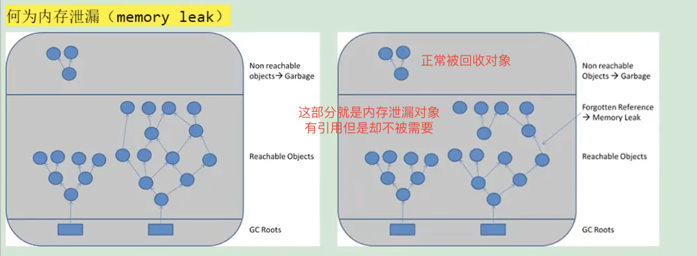

# 何为内存泄漏
可达性分析算法来判断对象是否是不再使用的对象，本质都是判断一个对象是否还被引用。
那么对于这种情况下，让JVM误以为此对象还在引用中，无法回收造成内存泄漏


# 内存泄漏的理解
严格来说：
    只有对象不会再被程序用到了，但是GC又不能回收他们的情况，才叫内存泄漏
宽泛意义上来说：
    但是实际情况很多时候一些不太好的实践（或疏忽）会导致对象的生命周期变得很长甚至OOM，也可以叫的内存泄漏
    

# 内存泄漏和内存溢出的关系
1，内存泄漏
    申请了内存用完不释放，比如一共有1024M的内存，分配了512M的内存一直不回收，那么可用的内存只有512M，仿佛泄漏掉了一部分
    通俗讲就是占着茅坑不拉屎
2，内存溢出
    申请内存时，没有足够的内存可以使用。内存泄漏可能导致内存溢出

# 泄漏的分类
经常发生：发生内存泄漏的代码会被执行多次，每次执行，泄漏一块内存
偶然发生：在某些特定情况下才发生
一次性：发生内存泄漏的方法只会执行一次
隐式泄漏：一直占着内存不释放，直到执行结束，严格来说不算内存泄漏，最终释放掉了，但是如果执行时间过长，也可能会导致内存耗尽

# 内存泄漏8中情况
典型情况就是长生命周期的对象持有短生命周期的对象引用，尽管生命周期不再使用，但是因为长生命周期对象持有它的引用导致不能被回收
1，静态集合类
    静态集合类，如HashMap，LinkedList等等。如果这些容器为静态的，那么他们的生命周期与JVM程序一致
    则容器中的对象在程序结束之前将不能被释放，造成内存泄漏。
2，单例模式
    和静态集合类导致的内存泄漏原因类似，因为单例具有静态性，他的生命周期和JVM的生命周期一样
    所以如果单例对象持有外部对象引用，那么整个外部引用对象也不会被回收，那么就会造成内存泄漏
3，内部类持有外部类
    如果一个外部类的实例对象的方法返回了一个内部类的实例对象
    这个内部类对象被长期引用了，即使那个外部类实例对象不再被引用，但是由于内部类持有外部类的实例对象
    这个外部类对象将不会被垃圾回收，这也会造成内存泄漏
4，变量不合理的作用域
    一般而言，一个变量的定义的作用范围大于其使用范围，很有可能会造成内存泄漏。
    另一方面，如果没有即使地把对象设置为null，很有可能导致内存泄漏的发生
        ```java
        public class UsingRandom {
            private String msg;
            public void receiveMsg() {
                readFromNet();//从网络中接收数据保存到msg中
                saveDB();/把msg保存到数据库中
            }
        }
        ```
    UsingRandom还有在使用不被回收，导致msg不能被回收。
    如上面这个伪代码，通过readFromNet方法把接收的消息保存在变量msg中，然后调用saveDB把msg的内容保存到数据库
    这时msg已经没用了，由于msg的生命周期与对象的生命周期形同，此时msg不能回收，造成内存泄漏
5，改变哈希值
    当一个对象被存储进HashSet集合中后，就不能修改这个对象中那些参与计算哈希值的字段了
    否则，对象修改后的哈希值与最初存储进HashSet集合时的哈希值就不同了，
    在这种情况下，即使在contains方法使用该对象的当前引用作为的参数去HashSet集合中检索对象，也将返回找不到对象的结果
    这也会导致无法从HashSet集合中单独删除当前对象，造成内存泄漏
    这也是String为什么设置为不可变类型，我们可以放心的把String存入HashSet，或者把String当作HashMap的key值
6，缓存泄漏
    内存泄漏的一个常见来源是缓存泄漏，一旦你把对象引用放入到缓存中，就很容易遗忘。
    比如：之前项目在一次上线的时候，应用启动出奇的慢直到死机，就是因为代码中会加载一个表中的数据到内存中
    测试环境只有几百条数据，但是生产环境就有几百万数据
    对于这个问题，可以使用WeakHashMap代表缓存，此种Map的特点是，当除了自身有对Key的引用外，此Key没有其他引用那么此map会自动丢弃此值
    
    其实这里指的还是静态集合类
7，各种连接，如数据库连接、网络连接、IO连接
    在对数据库的操作过程中，首先需要建立与数据库的连接，当不再使用时，需要调用close方法来释放与数据库的连接
    只有连接被关闭后，垃圾回收器才会回收对应的对象
    否则，如果在访问数据库的过程中，对Connection、Statement或ResultSet不显性地关闭，将会造成大量对象无法回首，从而引起内存泄漏
    
8，监听器和回调
    如果客户端在你实现的API中注册回调，却没有显式的取消，那么就会积聚
    需要确保回调立即被当作垃圾回收的最佳方法是保存它的弱引用，例如将他们保存为WeakHashMap中的健
