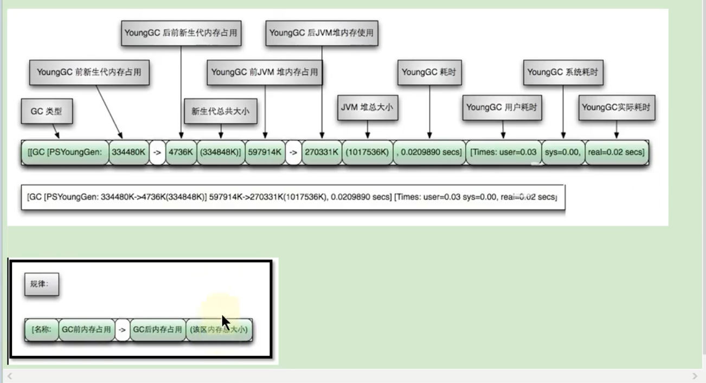

# GC的分类
针对HotSpot VM的实现，它里面的GC按照回收区域又分为两种大类型：一种是部分收集（Partial GC），一种是整堆收集（Full GC）
1，部分收集：不是完整收集整个Java堆的垃圾收集。其中又分为：
    （1）新生代收集（称为Minor GC或者Young GC）：只收集新生代（Eden、S0、S1）的垃圾收集
    （2）老年代收集（称为Major GC或者Old GC）：只是老年代的垃圾收集
        目前，只有CMS GC会单独收集老年代的行为
        注意：很多时候Major GC会和Full GC混淆使用，需要具体分辨是老年代回收还是整堆回收
    （3）混合收集（Mixed GC）：收集整个新生代以及部分老年代的垃圾收集
        目前，只有G1 GC会有这种行为
2，整堆收集（Full GC）：收集整个java堆和方法区的垃圾收集

# 哪些情况会触发Full GC？
1，老年代空间不足
2，方法区空间不足
3，显示调用System.gc()
4，Minor GC进入老年代的数据平均大小 大于 老年代可用内存
5，大对象进入老年代，老年代空间不足

# GC日志结构解析

1，使用Serial收集器在新生代的名字是Default New Generation，因此显示的是"[DefNew"
2，使用ParNew收集器在新生代的名字会变成"[ParNew"，意思是"Parallel New Generation"
3，使用Parallel Scavenge收集器在新生代的名字是"[PSYoungGen"，这里jdk1.7使用的是PSYoungGen
4，使用Parallel Old Generation收集器在老年代的名字是"[ParOldGen"
5，使用G1收集器的话，会显示"garbage-first heap"
6，Allocation Failure：表明本次引起GC的原因是因为在年轻代中没有足够的空间能够存储新的数据了

# GC日志中有三个时间：user、sys、real
user：
    进程执行用户态代码所使用的时间。这是执行此进程所使用的实际CPU时间，其他进程和此进程阻塞的时间并不包括在内。
    在垃圾收集的情况下，表示GC线程执行所使用的CPU总时间
sys：
    进程在内核态消耗的CPU时间，即在内核执行系统调用或等待系统事件所使用的CPU时间
real：
    程序从开始到结束所用的时钟时间。这个时间包括其他进程使用的时间片和进程阻塞的时间（比如等待I/O完成）。
    对于并行gc，这个数字应该接近（用户时间+系统时间）除以垃圾收集器使用的线程数
由于多核的原因，一般的GC事件中，real time是小于sys + user time的，因为一般是多个线程并发的去做GC
所以real time是要小于sys + user time的。如果real>sys+user的话，则你的应用可能存在下列问题：IO负载非常重或者是CPU不够用
    

