# Java虚拟机（JVM）
- Java虚拟机是一台执行Java字节码的虚拟机，它拥有独立的运行机制，其运行的Java字节码也未必由Java语言编译而成
- JVM平台的各种语言可以共享Java虚拟机带来的跨平台性、优秀的垃圾回收器，以及可靠的即时编译器
- Java的核心就是Java虚拟机（JVM，Java Virtual Machine），因为所有的Java程序都运行在Java虚拟机内部
作用：
    Java虚拟机就是二进制字节码的运行环境，负责装载字节码到其内部，编译为对应平台上的机器指令执行。
    每一条Java指令，Java虚拟机规范中都有详细的定义，如怎么取操作数，怎么处理操作数，处理结果放在哪里
特点：
    一次编译，到处运行
    自动内存管理
    自动垃圾回收功能
# JVM的位置
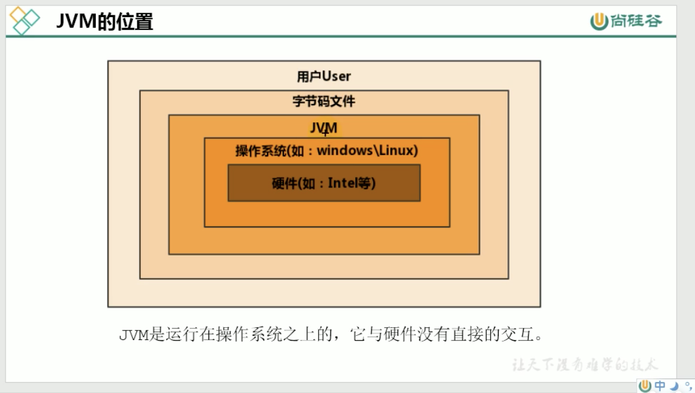
JVM是运行在操作系统之上的，它与硬件没有直接的交互

# JVM的整体结构
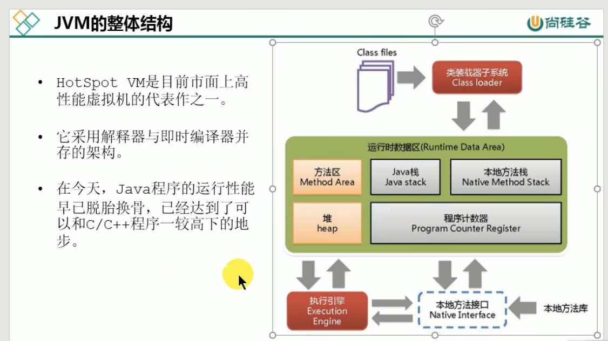
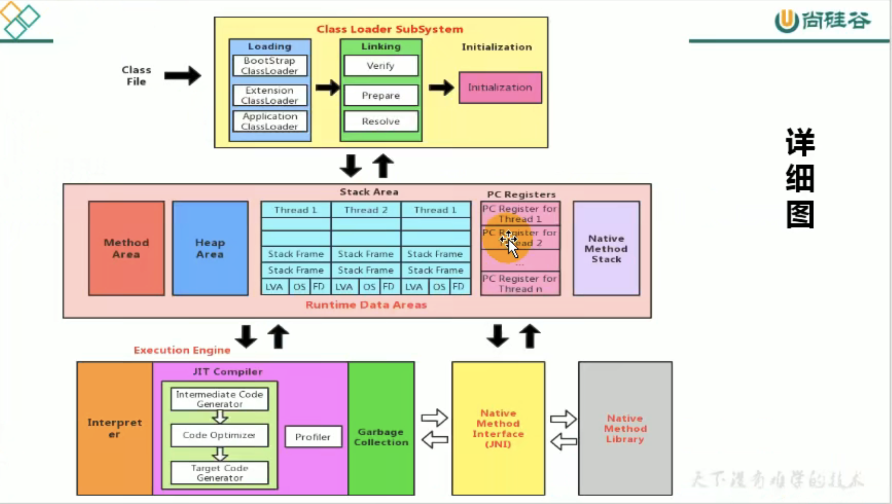
- HotSpot VM是目前市面上高性能的虚拟机代表作之一
- 它采用解释器与即时编译器并存的架构
- 在今天，Java程序性能早已脱胎换骨，已经达到了可以和C/C++程序一较高下的地步
1，入口就是Class files字节码文件
2，类装载子系统将class字节码文件加载到内存当中，生成一个大的class对象
3，然后就到了运行时数据区，这里面包含方法区、堆、虚拟机栈、本地方法栈、程序计数器（其中堆和方法区多个线程共享，其余的是每个线程独有一份的）
4，执行引擎包含解释器、JIT即时编译器、垃圾回收器
    执行引擎到底有什么作用呢？
        操作系统只能识别机器指令，但是字节码指令是不等同于机器指令的，
        执行引擎就相当于将java高级语言语言翻译成机器语言的一个翻译者

# Java代码执行流程
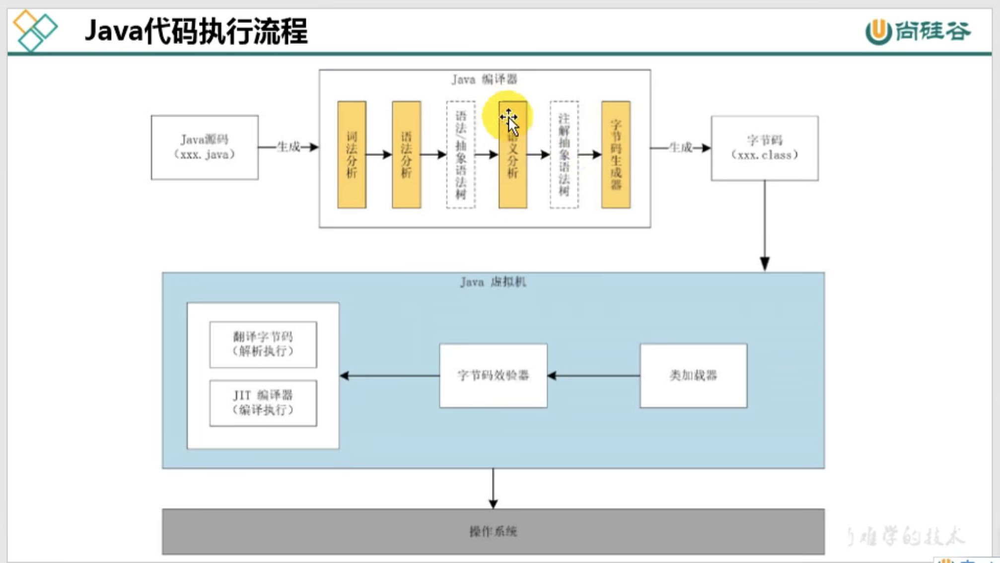
1，Java文件经过Java编译器生成字节码文件xxx.class
2，然后交给Java虚拟机，Java虚拟机中进行类加载、字节码校验、执行引擎（翻译字节码解释执行、JIT编译器编译执行）
3，操作系统执行

# JVM架构模型
Java编译器输入的指令基本上是一种栈的指令集架构，另一种指令集架构则基于寄存器指令集架构
具体来说：两种架构之间的区别：
    基于栈式架构的特点：
        - 设计和实现更简单，适用于资源受限的系统
        - 避开了寄存器分配难题：使用零地址指令方式分配
        - 指令流中的指令大部分是零地址指令，其执行过程依赖于操作栈。指令集更小，编译器容易实现
        - 不需要硬件支持，可移植性好，更高实现跨平台
    基于寄存器架构的特点：
        典型的应用是x86的二进制指令：比如传统的PC及Android的Davlik虚拟机
        指令集架构完全依赖硬件，可移植性差
        性能优秀和执行更高效
        花费更少的指令去完成一项操作
        在大部分情况下，基于寄存器架构的指令集往往都以一地址指令、二地址指令和三地址指令为主，而基于栈式架构的指令集却是以零地址指令为主
什么是零地址指令
    一般一个指令都是由地址和指令组成，所谓零地址指令就是没有地址，比如栈：
    执行的都是出栈的那个方法，没有具体的地址
同个计算流程分别基于栈和寄存器
    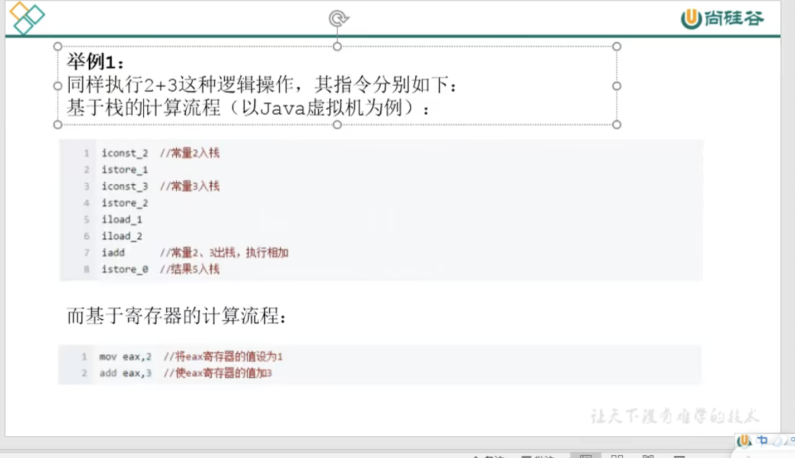
对比：
    1，可移植性比较
        基于栈式结构不需要硬件支持，可以实现跨平台
        基于寄存器架构则完全依赖硬件，可移植性差
    2，设计比较
        基于栈式架构使用零地址方式分配（没有地址，只有操作数），避开了寄存器分配难题，适用于资源受限系统
        寄存器架构往往使用一地址指令，二地址指令，三地址指令为主
    3，速度比较
        基于栈式指令是在内存中操作，而寄存器直接在cpu执行，速度更快
    4，指令集数量比较
        完成相同的操作，基于栈式结构比基于寄存器架构指令集数量多，但是指令集小


# jvm生命周期
1，实例的诞生
    任何class文件的main函数都可以认为是jvm示例的起点。
    当一个程序启动，伴随的就是jvm实例的诞生，程序关闭jvm实例就消亡。
    任何一个拥有公开的（public）、静态的（static）、没有返回值（void）并且接受一个字符串数组参数（String[] args） 的main()函数的class都可以作为JVM实例运行的起点 。
2，实例的运行
    main作为该程序初始线程的起点，任何其他线程都由该线程启动，
    JVM内部有两种线程：守护线程和用户线程，main()属于用户线程，守护线程通常由JVM自己使用，如GC线程。
    java程序也可以标明自己创建的线程是守护线程。
    java程序的初始线程 只就是运行main（）的线程，这个线程是用户线程，只要还有任何非守护线程还在运行，那么jvm就存活着。
3，实例的消亡
    所有用户线程都终止时，JVM才退出；
    若安全管理器允许，程序也可以使用java.lang.Runtime类或者java.lang.System.exit()来退出。


# java类加载
什么是类加载器
    - ClassLoader就是动态加载class文件到内存中的（class文件就是二进制的字节流）
    - 只有加载到内存中的class文件才能被其他的文件引用
类加载子系统作用
    类加载子系统负责从文件系统或者网络中加载class文件，class文件在文件的开头有特定的标识
    ClassLoader只负责class文件的加载，至于它是否可以运行，则由Execution Engine决定
    加载的类信息存放于一块称为方法区的内存空间。除了类的信息外，方法区中还会存放运行时常量池信息，
    可能还包括字符串字面量和数字常量（这部分常量信息是Class文件中常量池部分的内存映射）
类加载过程
    java程序是由多个class文件组成的，一个类中可能引用多个其他的类，当缺少一些class文件的时候就会出现异常
    程序加载class文件的时候不会一次性加载所有的文件，而是通过java的类加载机制动态的加载class文件到内存中
    第一步，加载（查找和导入类或接口的二进制数据）
        作用：
            将外部的Class文件加载到Java虚拟机内存(堆内存) & 存储到方法区内
        具体流程：
            通过一个类的全限定名来获取其定义的二进制字节流
            将这个字节流所代表的静态存储结构转化为方法区的运行时数据结构
            在Java堆中生成一个代表这个类的java.lang.Class对象，作为对方法区中这些数据的访问入口
        注意：
            数组类通过Java虚拟机直接创建，不通过类加载器创建
        加载的理解：
            将class文件加载到方法区，方法区存储的是类模版对象，JVM将字节码文件中解析出来的常量池、类字段、类方法等信息存储到类模版对象
            Java的反射机制正是基于这一基础。如果JVM没有将类的生命信息存储起来，则JVM在运行期间无法反射
        类模型的位置：
            类结构会存储在方法区（JDK1.8之前：永久代，JDK1.8之后：元空间）
        Class实例的位置：
            将类模版方法加载到方法区之后，会在堆中创建一个java.lang.Class对象，用来封装类位于方法区内部的数据结构，Class对象是加载类的过程中创建的，每个类都对应一个Class类型的对象
            堆中的实例是访问方法区中类信息的接口，也是实现反射的关键数据、入口。通过Class类提供的接口，可以获得目标类所关联的.class文件中具体的数据结构：方法、字段等信息
    第二步，验证（检查导入类或接口的二进制数据的正确性）
        作用：
            确保加载进来的Class文件包含的信息符合Java虚拟机的要求
            例如校验加载的.class文件内容是否符合指定的规范（例如字节码文件被篡改）
        具体流程：
            主要是文件格式的验证、元数据的验证、字节码验证、符号引用验证
            文件格式验证
                该阶段主要在字节流转化为方法区中的运行时数据时，负责检查字节流是否符合Class文件的规范，保证其可以正确的被解析并存储于方法区中。后面的检查都是基于方法区的存储结构进行检验，不会再直接操作字节流。
            元数据验证
                该阶段负责分析存储于方法区的结构是否符合Java语言规范的要求，如该类是否继承了不允许继承的类（被final修饰的类）、是否包含父类等。此阶段进行数据类型的校验，保证符合不存在非法的元数据信息。
            字节码验证
                负责分析数据流和控制流，确定方法体的合法性，保证被校验的方法在运行时不会危害虚拟机的运行。
            符号引用验证
                最后一个阶段发生在链接的解析阶段。在解析阶段，会将虚拟机中的符号引用转化为直接引用，该阶段则负责对各种符号引用进行匹配性校验，保证外部依赖真实存在，并且符合外部依赖类、字段、方法的访问性。
    第三步，准备（给类的静态变量分配并初始化存储空间）
        为类的static变量在方法区中分配内存 & 设置变量的初始值
        注意：
            如果类变量为常量（被final修饰），则直接赋开发者定义的值。因为final在编译的时候都分配内存了，在准备阶段会显式的初始化
            实例变量在该阶段不会分配内存，实例变量会随着对象一起分配到Java堆中
    第四步，解析（将符号引用转成直接引用）
        解析阶段将符号引用替换为直接引用
            1）、类或接口解析：将符合引用转化为类的直接引用，并检查访问权限。
            2）、字段解析：将字段的符号引用转化为字段所属的类信息或其父类该字段的直接引用，并检查访问权限。
            3）、类方法解析：将类方法的符号引用转化为类方法所属的类信息或其父类该字段的直接引用，并检查访问权限。
            4）、接口方法解析：将接口方法的符号引用转化为接口方法所属的接口信息或其父类该字段的直接引用，并检查访问权限。
    第五步，初始化（激活类的静态变量的初始化Java代码和静态Java代码块（<clinit>()））
        作用：
            初始化 类变量 & 静态语句块
        具体流程：
            1，生成类构造器<clinit>
                即 合并所有类变量（static）变量和静态语句块（static块）
                顺序 = 定义的顺序、实例变量由类的构造函数<init>()赋值
            2，执行<clinit>方法
        注意：
            1，类构造器<clinit>()不同于类构造<init>()
                不需要显示调用父类构造器
                子类<clinit>()执行前，父类<clinit>()一定会被执行
                因此虚拟机第一个执行的<clinit>()是java.lang.Object
            2，静态语句只可赋值，不可被访问
            3，接口与类不同，执行子接口的<clinit>()并不需要执行父接口的<clinit>()
            4，虚拟机必须保证一个类的<clinit>()方法在多线程下同步加锁
        Java编译器并不会为所有的类生成<clinit>()初始化方法。那些类在编译为字符串后字节码文件中将不会包含<clinit>()方法？
            1，一个类中并没有声明任何的变量，也没有静态代码块时
            2，一个类中声明变量，但是没有明确使用类变量的初始化语句以及静态代码块来执行初始化操作时
            3，一个类中包含static final修饰的基本数据类型的字段，这些类字段初始化语句采用编译时常量表达式
            最终结论：使用static+final修饰，且显式赋值不涉及到方法或构造器调用的基本数据类型或String类型的显式赋值，是在准备环节
# <clinit>()线程安全问题
类的初始化，虚拟机需要确保其多线程环境中的安全性。在多线程环境中，虚拟机会同步、加锁，保证一个类只有一个线程去执行这个<clinit>()方法
那么如果<clinit>()中有非常耗时的操作，就有可能造成线程阻塞，引发死锁。这种死锁很难发现，因为并没有什么可用的锁信息。
举例比如说：两个类的静态代码块中使用Class.forName("");互相加载就有可能造成死锁。
如果之前的线程加载了类，则等待在队列中的线程就没有机会再执行<clinit>()方法了。那么，当需要使用这个类的时候会直接返回已经准备好的信息。


# 类的主动引用和被动引用
首先我们需要知道java对类的使用方式分为2种：主动使用和被动使用。
每个类或接口只有被java程序主动使用时才会被初始化。也就是执行<clinit>()方法。
主动使用的几种情况:
    类初始化时机：只有当对类的主动使用的时候才会导致类的初始化，类的主动使用包括以下六种：
        – 创建类的实例，也就是new的方式
        – 访问某个类或接口的静态变量，或者对该静态变量赋值
        – 调用类的静态方法
        – 反射（如Class.forName(“com.shengsiyuan.Test”)）
        – 初始化某个类的子类，则其父类也会被初始化
        – Java虚拟机启动时被标明为启动类的类（Java Test）
    除了以上七种情况，其他使用Java类的方式都被看作对类的被动使用，都不会导致类的初始化
类的被动使用：
    被动使用不会引起类的初始化(<clinit>())。也就是说：并不是在代码中出现的类，就一定会被加载或者初始化。如果不符合主动使用的条件，类就不会初始化。
    1，当访问静态字段时，只有声明这个字段的类才会被初始化。当通过子类引用父类的静态变量，不会导致子类的初始化
    2，通过数组定义类引用，不会导致子类初始化
    3，引用常量不会触发此类或者接口的初始化。因为常量在链接阶段就已经被显式赋值了
    4，调用ClassLoader类的loadClass()方法加载一个类，并不是对类的主动使用，不会导致类的初始化

# 类的命名空间和唯一性
何为类的唯一性：
    对于任意一个类，都需要由加载它的类加载器和这个类本身一同，才能确认其在Java虚拟机中的唯一性。
    每个类加载器都拥有一个独立的命名空间：比较两个类是否相等，只有在这两个类是由同一个类加载器加载的前提下才有意义。
命名空间：
    每个类加载器都有自己的命名空间，命名空间由该加载器及所有的父类加载器所加载的类组成
    在同一命名空间中，不会出现类的完整名字相同的两个类
    在不同的命名空间，有可能会出现类的完整名字相同的两个类

# Java类的卸载时机
类的卸载跟垃圾回首算法有关，在CMS中有两种方法卸载不必要的类
    1，一种是等到元空间满了的时候出发FGC
    2，另一种是使用跟CMS并发收集算法类似的方式
jvm中一个类的卸载必须满足：
    1，该类的所有实例对象都被回收
    2，该类的加载器对象被回收
    3，该类对应的java.lang.CLass对象没有任何地方被引用，无法在任何地方通过反射访问该类的方法

# Java类加载器
- JVM支持两种类型的类加载器，分别为 引导类加载器(Bootstrap ClassLoader) 和 自定义类加载器(User-Defined ClassLoader)
- 从概念上来讲，自定义类加载器一般指的是程序中由开发人员自定义的一类加载器，但是Java虚拟机规范却没有这么定义，而是将所有派生于抽象类ClassLoader的类加载器都划分为自定义类加载器
无论类加载器的类型如何划分，在程序中我们常见的类加载器始终只有3个，如下所示：
    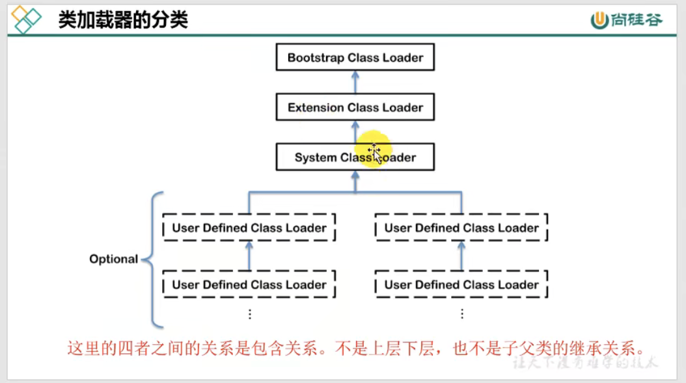
Java 中的类加载器大致可以分成两类：
    一类是系统提供的，另一类则由Java应用开发人员编写的
系统提供的类加载器主要有下面三个：
    1，引导类加载器：Bootstrap ClassLoader
        它是由本地代码c/c++实现的，你根本拿不到它的引用，但是他实际存在，并且加载一些重要的类，
        它加载java核心类，他是用原生代码实现的，并不集成java.lang.ClassLoader
    2，扩展类加载器：Extension类加载器
        由java语言实现，虽说能拿到，但是在实践中很少用到它，主要加载扩展目录下的jar包
    3，系统类加载器
        主要加载我们应用程序中的类，如Test，或者用到的第三方包，如jdbc驱动
除了系统提供的类加载器之外，开发人员可以通过继承java.lang.ClassLoader类的方式实现自己的类加载器
```
public class CLassLoaderTest {
    public static void main(String[] args) {
        //获取系统加载器
        ClassLoader systemCLassLoader = ClassLoader.getSystemClassLoader();
        System.out.println(systemCLassLoader);//sun.misc.Launcher$AppClassLoader@18b4aac2

        //获取其上层，扩展类加载器
        ClassLoader exCLassLoader = systemCLassLoader.getParent();
        System.out.println(exCLassLoader);//sun.misc.Launcher$ExtClassLoader@1be6f5c3

        //获取其上层
        ClassLoader bootstrapCLassLoader = exCLassLoader.getParent();
        System.out.println(bootstrapCLassLoader);//null

        //对于用户自定义类来说，默认使用系统类加载器进行加载
        ClassLoader classLoader = CLassLoaderTest.class.getClassLoader();
        System.out.println(classLoader);//sun.misc.Launcher$AppClassLoader@18b4aac2

        //String类使用引导类加载器进行加载 --> java的核心类使用引导类加载器进行加载
        ClassLoader strClassLoader = String.class.getClassLoader();
        System.out.println(strClassLoader);//null

    }
}
```

# 双亲委派机制
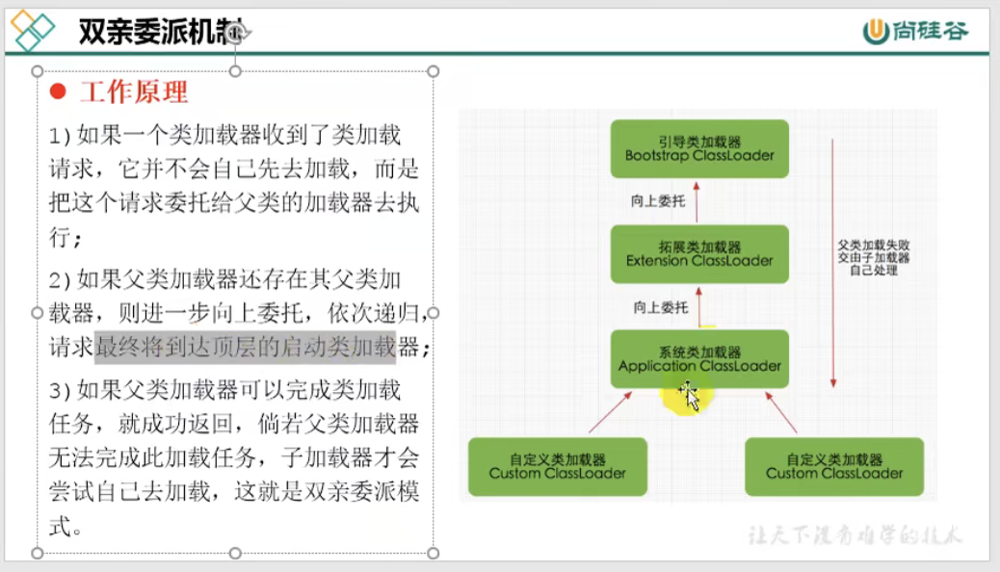
概述
    1，如果一个类加载器收到了类加载请求，并不会自己去加载，而是把这个请求委托给父类加载器执行
    2，如果父类加载器还存在父类加载器，则会进一步向上委托，依次递归最终到达顶层的启动类加载器
    3，如果父类加载器可以完成类加载，就成功返回。如果父类加载器无法完成加载任务，子加载器才会尝试自己加载
优势
    避免类的重复加载
    保护程序安全，防止核心API被篡改

jvm中怎么判断两个class对象是否为同一个类
    1，类的完成名必须一致，包括包名
    2，加载这个类的CLassLoader必须相同

# 双亲委派机制代码支持
双亲委派机制在java.lang.ClassLoader.loadClass(String, boolean)接口中体现。该接口的逻辑如下：
（1）先在当前加载器的缓存中查找有无目标类，如果有，直接返回
（2）判断当前加载器的父加载器是否为空，如果不为空，则调用parent.loadClass(name, false)接口进行加载
（3）反之，如果当前加载器的父类加载器为空，则调用findBootstrapClassOrNull(name)接口，让引导类加载器进行加载
（4）如果通过以上3条路径都没有成功加载，则调用findClass(name)接口进行加载。该接口最终会调用java.lang.ClassLoader接口的defineClass系列的native接口加载目标Java类
双亲委派模型就隐藏在第（2）步和第（3）步
思考：
    那么如果在自定义类加载器中重写java.lang.ClassLoader.loadClass(String, boolean)方法，抹去其中的双亲委派机制，是不是就能加载核心类库了呢？
    这是不行的！因为JDK还为核心类库提供了一层保护机制。不管是自定义类加载器、系统类加载器、扩展类加载器，最终必须调用java.lang.ClassLoader.defineClass(String, byte[], int, int, ProtectionDomain)方法
    而该方法会执行preDefineClass()接口，该接口中提供了对JDK核心类库的保护

# 双亲委派机制的弊端
检查类是否加载的委托过程是单向的，这个方式虽然结构上说比较清晰，使各个ClassLoader的职责非常明确
但是同时会带来一个问题，即顶层的ClassLoader无法访问底层的ClassLoader所加载的类

通常情况下，启动类加载器中的类为系统核心类，包括一些重要的系统接口，而在应用类加载器中，为应用类。
按照这种模式，应用类访问系统类自然没有问题，但是系统类访问应用类就会出现问题。
比如在系统类中提供了一个接口，该接口需要在应用类中得以实现，该接口还绑定一个工厂方法，用于创建该接口的实例，而接口和工厂方法都在启动类加载器中。
这时就会出现该工厂方法无法创建由应用类加载器加载的应用实例的问题

结论：
    由于Java虚拟机规范并没有明确要求类加载器加载机制一定使用双亲委派模型，只是建议采用这种方式
    比如tomcat中，类加载器所采用的机制就与双亲委派模型有一定的区别。
    当缺省的类加载器接收到一个类加载任务的时候，首先由它自行加载，当加载失败的时候，才会将类加载任务委派给它的超类加载器去执行，这同样是Servlet规范推荐的一种使用方法

# 破坏双亲委派
1，第一次破坏：
由于双亲委派模型是在JDK1.2之后才被引入的，但是java.lang.ClassLoader在java的第一个版本中就已经出现了
面对已经存在的用户自定义类加载器代码，Java设计者引入双亲委派模型的时候不得不做出一些妥协，为了兼容这些代码，无法再以技术手段避免loadClass()被子类覆盖
只能在jdk1.2之后的java.lang.ClassLoader中添加一个新的protected方法的findClass()，尽可能的引导用户们去重写这个方法
而不是在loadClass()中编写代码
1，第一次破坏：
    线程上下文类加载器
    如果基础类想要调用回用户代码，该怎么办呢？
    这并非不可能出现的事情，一个典型的例子就是JNDI服务，JNDI由启动类加载器来完成加载。但是JNDI存在的目的是对资源进行查找和集中管理，
    它需要调用其他厂商提供的JNDI接口，该怎么办呢？
    为了解决这个问题，引入了一个不太优雅的设计：线程上下文类加载器（Thread Context ClassLoader）
        这个类加载器可以通过java.lang.Thread类的setContextClassLoader()方法进行设置，如果创建线程时未设置，它将会从父线程中继承一个
        如果应用程序的全局范围内没有进行设置的话，那这个类加载器默认就是应用程序类加载器
    有了线程上下文类加载器，程序就可以做一些舞弊的事情了。
    这一种父类加载器去请求子类加载器完成类加载的行为，实际上已经打通了双亲委派模型的层次结构来逆向使用类加载器，已经违背了双亲委派模型的一般原则性
     Java中设计SPI的加载基本上都由这种方式来完成，例如JNDI、JDBC、JCE、JAXB和JBI等。不过当SPI服务提供者多余一个的时候，代码就只能根据具体提供者的类型来判断，为了消除这种不优雅的方式
    在JDK6的时候提供了java.util.ServiceLoader类，以META-INF.services中的配置信息，辅以责任链模式，这才算是给SPI的加载提供了一种合理的解决方案
2，第三次破坏：
是由于用户对程序动态性的追求导致的。如：代码热替换（Hot Swap）、模块热部署（Hot Deployment）等
比如OSGi实现模块化部署
它自定义的类加载器机制的实现。每一个程序模块(Bundle)都有一个自己的类加载器，当需要更换一个Bundle时，就把Bundle连同类加载器一起换掉以实现代码的热替换。
在OSGi幻境下，类加载器不再是双亲委派模型中的树状结构，而是进一步发展为更加复杂的网状结构，当受到类加载请求时，OSGi将按照下面的顺序进行类搜索：
1）将java.＊开头的类委派给父类加载器加载。
2）否则，将委派列表名单内的类委派给父类加载器加载。
3）否则，将Import列表中的类委派给Export这个类的Bundle的类加载器加载。
4）否则，查找当前Bundle的ClassPath，使用自己的类加载器加载。
5）否则，查找类是否在自己的Fragment Bundle中，如果在，则委派给Fragment Bundle的类加载器加载。
6）否则，查找Dynamic Import列表的Bundle，委派给对应Bundle的类加载器加载。
7）否则，类加载器失败。

# 沙箱安全机制
自定义String类，但是在加载自定义String类的时候会率先使用引导类加载器加载，而引导类加载器在加载过程中会先加载jdk自带的文件
报错信息说没有main方法，就是因为加载的是rt.jar中的String类。这样可以保证对java核心源代码的保护，这就是沙箱安全机制

# 自定义类加载器好处和应用场景
为什么要自定义类加载器？
1，隔离加载类
    在某些框架内进行中间件和应用的模块隔离，把类加载到不同的环境。
    比如：阿里内某容器框架通过自定义类加载器确保应用中依赖的jar包不会影响到中间件运行时使用的jar包
    再比如：Tomact这类web应用服务器，内部自定义了好几种类加载器，用于隔离同一个Web服务器上的不同应用程序
2，修改类加载方式
    类的加载模型并非强制，除了Bootstrap外，其他的加载并非一定要引入，或者根据实际情况在某个时间节点进行按需动态加载
3，扩展加载源
    比如从数据库、网络、设置是电视机机顶盒进行加载
4，防止源码泄漏
    Java代码容易被编译或者篡改，可以进行编译加密。那么类加载也需要自定义，还原加密的字节码
常见场景：
    1，实现类似进程内隔离，类加载器实际上用作不同的命名空间，以提供类似容器、模块化运行的效果。
    例如：两个模块依赖于某个类库的不同版本，如果分别被不同的容器加载，就可以互不干扰。这个方面的集大成者是Java EE、OSGI、JPMS等框架
    2，应用需要从不同的数据源获取类定义信息，例如网络数据源，而不是本地文件系统。或者是需要自己操纵字节码，动态修改或者生成类型
代码实现方式：
    - Java提供了抽象类java.lang.ClassLoader，所有用户自定义类加载器都应该继承ClassLoader类
    - 在自定义CLassLoader的子类的时候，我们常见的会有两种做法：
        方式一：重写loadClass()方法
        方式二：重写findClass()方法
    对比：
        这两种本质上差不多，毕竟loadClass()也会调用findClass()，但是从逻辑上讲我们最好不要直接修改loadClass()内部逻辑
        建议的做法是只在findClass()里重写自定义类的加载方法，根据参数指定类名字，返回对应的Class对象
        - loadClass()这个方法是实现双亲委派模型逻辑的地方，擅自修改这个方法模型会导致模型遭到破坏，容易造成问题。
        因此我们最好是在双亲委派模型框架内进行小范围的修改，不破坏原有的稳定结构。同时，也避免了自己重写loadClass()方法过程中必须写双亲委托的重复代码
        从代码的复用性来说，不直接修改这个方法始终是比较好的选择
        - 当编写好自定义的类加载器后，便可以在程序中调用loadClass()方法来实现类加载操作

# Java8~14新特性
Java8：
    1，Lambda表达式 
        Lambda 允许把函数作为一个方法的参数（函数作为参数传递到方法中）。
    2，方法引用 
        方法引用提供了非常有用的语法，可以直接引用已有Java类或对象（实例）的方法或构造器。与lambda联合使用，方法引用可以使语言的构造更紧凑简洁，减少冗余代码。
    3，函数式接口
        函数接口指的是只有一个函数的接口，这样的接口可以隐式转换为Lambda表达式。
        java.lang.Runnable和java.util.concurrent.Callable是函数式接口的最佳例子。
        Java 8 提供了一个特殊的注解@FunctionalInterface（Java 库中的所有相关接口都已经带有这个注解了）
    4，接口的默认方法和静态方法
        默认方法就是接口可以有实现方法，而且不需要实现类去实现其方法。我们只需在方法名前面加个 default 关键字即可实现默认方法。
        举一个很现实的例子：
            我们的接口老早就写好了，后面因为各种业务问题，避免不了要修改接口。
            在 Java 8 之前，比如要在一个接口中添加一个抽象方法，那所有的接口实现类都要去实现这个方法，不然就会编译错误，而某些实现类根本就不需要实现这个方法也被迫要写一个空实现，改动会非常大。
            所以，接口默认方法就是为了解决这个问题，只要在一个接口添加了一个默认方法，所有的实现类就自动继承，不需要改动任何实现类，也不会影响业务，爽歪歪。
    5，Stream API
        新添加的Stream API（java.util.stream） 把真正的函数式编程风格引入到Java中。
    6，Date Time API
        加强对日期与时间的处理。
    7，Optional类
        Optional 类已经成为 Java 8 类库的一部分，用来解决空指针异常。
    8，Nashorn, JavaScript 引擎 
        Java 8提供了一个新的Nashorn javascript引擎，它允许我们在JVM上运行特定的javascript应用。
Java9：
    1，模块系统（Jigsaw）- 最主要：
        Jigsaw Project的实现目标：
            1，模块化JDK：
                我们知道，现有JDK已经非常庞大，Jigsaw Project的目标就是将JDK分隔成一个个的小模块。
            2，模块化源码
                当前源码jar文件也非常大，特别是rt.jar，Jigsaw Project也会考虑将源码切分成一个个的小模块。
            3，重构JDK和JRE运行时映像以适应模块化的目的
            4，封装绝大部分内部API，仅暴露几个重要的、使用频繁的内部API
            5，实现Java平台的模块化系统，允许用户通过构建自己的模块来开发应用程序，
        当前Java系统的主要问题
            1，JDK太过于庞大以至于很难缩减应用到小的设备中去
            2，Jar文件比如rt.jar太大无法用于较小的设备和应用中去
            3，因为JDK太大，导致我们的应用或者设备无法提供更好的性能
            4，当前Java系统中没有实现很好的封装效果，每个人都可以访问public修饰符修饰的对象
            5，因为public修饰符太过开放，因此一些内部API比如：sun.*, *.internal.*也不可避免的暴露出来。
            6，正因为用户可以访问内部接口，因此安全性也是一个不小的问题
        Java 9 模块化系统的优势
            1，因为Java 9 将JDK、JRE、JAR文件切分成了一个个的小模块，因此，我们可以根据实际需要任意使用我们需要的模块，并且可以很方便的通过剔除不必要的模块，将应用部署到小的设备中去。
            2，用户将无法访问一些主要用于内部的API接口
            3，模块隐藏了内部细节，提供了很好的安全特性
            4，应用将更加小巧，因为我们只需要部署用到的模块
            5，支持组件间的低耦合
            6，支持单一责任原则（SRP, Single Responsibility Principle ）
    2，JShell
        jshell 是 Java 9 新增的一个实用工具。为 Java 提供了类似于 Python 的实时命令行交互工具。
        在 Jshell 中可以直接输入表达式并查看其执行结果
    3，集合、Stream 和 Optional
        （1）增加 了 List.of()、Set.of()、Map.of() 和 Map.ofEntries()等工厂方法来创建不可变集合，比如List.of("Java", "C++");、Map.of("Java", 1, "C++", 2);（这部分内容有点参考 Guava 的味道）
        （2）Stream 中增加了新的方法 ofNullable、dropWhile、takeWhile 和 iterate 方法。Collectors 中增加了新的方法 filtering 和 flatMapping
        （3）Optional 类中新增了 ifPresentOrElse、or 和 stream 等方法
    4，进程 API
        Java 9 增加了 ProcessHandle 接口，可以对原生进程进行管理，尤其适合于管理长时间运行的进程
    5，平台日志 API 和服务
        Java 9 允许为 JDK 和应用配置同样的日志实现。新增了 System.LoggerFinder 用来管理 JDK 使 用的日志记录器实现。JVM 在运行时只有一个系统范围的 LoggerFinder 实例。
    6，反应式流 （ Reactive Streams ）
        在 Java9 中的 java.util.concurrent.Flow 类中新增了反应式流规范的核心接口
        Flow 中包含了 Flow.Publisher、Flow.Subscriber、Flow.Subscription 和 Flow.Processor 等 4 个核心接口。Java 9 还提供了SubmissionPublisher 作为Flow.Publisher 的一个实现。
Java10：
    1，最知名的特性应该是 var 关键字（局部变量类型推断）的引入
        介绍 :提供了 var 关键字声明局部变量：var list = new ArrayList<String>(); // ArrayList<String>
        局限性 ：只能用于带有构造器的局部变量和 for 循环中
    2，不可变集合
        list，set，map 提供了静态方法copyOf()返回入参集合的一个不可变拷贝
        java.util.stream.Collectors中新增了静态方法，用于将流中的元素收集为不可变的集合
    3，并行全垃圾回收器 G1
        从 Java9 开始 G1 就了默认的垃圾回收器，G1 是以一种低延时的垃圾回收器来设计的，旨在避免进行 Full GC,
        但是 Java9 的 G1 的 FullGC 依然是使用单线程去完成标记清除算法,这可能会导致垃圾回收期在无法回收内存的时候触发 Full GC。
        为了最大限度地减少 Full GC 造成的应用停顿的影响，从 Java10 开始，G1 的 FullGC 改为并行的标记清除算法，
        同时会使用与年轻代回收和混合回收相同的并行工作线程数量，从而减少了 Full GC 的发生，以带来更好的性能提升、更大的吞吐量。
    5，应用程序类数据共享
        在 Java 5 中就已经引入了类数据共享机制CDS，允许将一组类预处理为共享归档文件，以便在运行时能够进行内存映射以减少 Java 程序的启动时间
        当多个 Java 虚拟机（JVM）共享相同的归档文件时，还可以减少动态内存的占用量，同时减少多个虚拟机在同一个物理或虚拟的机器上运行时的资源占用
        Java 10 在现有的 CDS 功能基础上再次拓展，以允许应用类放置在共享存档中。
        CDS 特性在原来的 bootstrap 类基础之上，扩展加入了应用类的 CDS (Application Class-Data Sharing) 支持。
        其原理为：在启动时记录加载类的过程，写入到文本文件中，再次启动时直接读取此启动文本并加载。设想如果应用环境没有大的变化，启动速度就会得到提升
Java11：
    1，字符串增强
        ```java
        //判断字符串是否为空
        " ".isBlank();//true
        //去除字符串首尾空格
        " Java ".strip();// "Java"
        //去除字符串首部空格
        " Java ".stripLeading();   // "Java "  
        //去除字符串尾部空格
        " Java ".stripTrailing();  // " Java"  
        //重复字符串多少次
        "Java".repeat(3);             // "JavaJavaJava"
        //返回由行终止符分隔的字符串集合。
        "A\nB\nC".lines().count();    // 3
        "A\nB\nC".lines().collect(Collectors.toList());
        ```
    2，ZGC：可伸缩低延迟垃圾收集器
        ZGC 主要为了满足如下目标进行设计：
            （1）GC 停顿时间不超过 10ms
            （2）即能处理几百 MB 的小堆，也能处理几个 TB 的大堆
            （3）应用吞吐能力不会下降超过 15%（与 G1 回收算法相比）
            （4）便在此基础上引入新的 GC 特性和利用 colord
            （5）针以及 Load barriers 优化奠定基础
            （6）当前只支持 Linux/x64 位平台
    3，标准 HTTP Client 升级
    4，简化启动单个源代码文件的方法
        增强了 Java 启动器，使其能够运行单一文件的 Java 源代码。此功能允许使用 Java 解释器直接执行 Java 源代码。源代码在内存中编译，然后由解释器执行
    5，用于 Lambda 参数的局部变量语法
        从 Java 10 开始，便引入了局部变量类型推断这一关键特性。类型推断允许使用关键字 var 作为局部变量的类型而不是实际类型，编译器根据分配给变量的值推断出类型
        Java 10 中对 var 关键字存在几个限制
            （1）只能用于局部变量上
            （2）声明时必须初始化
            （3）不能用作方法参数
            （4）不能在 Lambda 表达式中使用
        Java11 开始允许开发者在 Lambda 表达式中使用 var 进行参数声明
Java12：
    1，增强 Switch
        ```
        switch (day) {
            case MONDAY, FRIDAY, SUNDAY -> System.out.println(6);
            case TUESDAY                -> System.out.println(7);
            case THURSDAY, SATURDAY     -> System.out.println(8);
            case WEDNESDAY              -> System.out.println(9);
        }
        ```
    2，数字格式化工具类
        NumberFormat 新增了对复杂的数字进行格式化的支持
        ```
        NumberFormat fmt = NumberFormat.getCompactNumberInstance(Locale.US, NumberFormat.Style.SHORT);
        String result = fmt.format(1000);
        System.out.println(result); // 输出为 1K，计算工资是多少K更方便了。。。
        ```
    3，Shenandoah GC
        Redhat 主导开发的 Pauseless GC 实现，主要目标是 99.9% 的暂停小于 10ms，暂停与堆大小无关等
        和 Java11 开源的 ZGC 相比（需要升级到 JDK11 才能使用），Shenandoah GC 有稳定的 JDK8u 版本，在 Java8 占据主要市场份额的今天有更大的可落地性
    4，G1 收集器提升
        （1）可中止的混合收集集合：把要被回收的区域集（混合收集集合）拆分为强制和可选部分，使 G1 垃圾回收器能中止垃圾回收过程。 G1 可以中止可选部分的回收以达到停顿时间目标
        （2）及时返回未使用的已分配内存：空闲时自动将 Java 堆内存返回给操作系统
Java13：
    1，引入 yield 关键字到 Switch 中
        Switch 表达式中就多了一个关键字用于跳出 Switch 块的关键字 yield，主要用于返回一个值
        yield和 return 的区别在于：return 会直接跳出当前循环或者方法，而 yield 只会跳出当前 Switch 块，同时在使用 yield 时，需要有 default 条件
    2，文本块
        解决 Java 定义多行字符串时只能通过换行转义或者换行连接符来变通支持的问题，引入三重双引号来定义多行文本
        两个"""中间的任何内容都会被解释为字符串的一部分，包括换行符
        ```
        String json = """
                        {
                        "name":"mkyong",
                        "age":38
                        }
                    """;
        ```
    3，增强 ZGC 释放未使用内存
        在 Java 11 中是实验性的引入的 ZGC 在实际的使用中存在未能主动将未使用的内存释放给操作系统的问题
        ZGC 堆由一组称为 ZPages 的堆区域组成。在 GC 周期中清空 ZPages 区域时，它们将被释放并返回到页面缓存 ZPageCache 中，此缓存中的 ZPages 按最近最少使用（LRU）的顺序，并按照大小进行组织
        在 Java 13 中，ZGC 将向操作系统返回被标识为长时间未使用的页面，这样它们将可以被其他进程重用
    4，SocketAPI 重构
        Java 13 为 Socket API 带来了新的底层实现方法，并且在 Java 13 中是默认使用新的 Socket 实现，使其易于发现并在排除问题同时增加可维护性
    5，动态应用程序类-数据共享
        Java 13 中对 Java 10 中引入的 应用程序类数据共享进行了进一步的简化、改进和扩展，即：允许在 Java 应用程序执行结束时动态进行类归档，具体能够被归档的类包括：所有已被加载，但不属于默认基层 CDS 的应用程序类和引用类库中的类
Java14
    1，record 关键字
        简化数据类的定义方式，使用 record 代替 class 定义的类，只需要声明属性，就可以在获得属性的访问方法，以及 toString，hashCode,equals 方法
        类似于使用 Class 定义类，同时使用了 lomobok 插件，并打上了@Getter,@ToString,@EqualsAndHashCode注解
        ```
        /**
         * 这个类具有两个特征
         * 1. 所有成员属性都是final
         * 2. 全部方法由构造方法，和两个成员属性访问器组成（共三个）
         * 那么这种类就很适合使用record来声明
         */
        final class Rectangle implements Shape {
            final double length;
            final double width;
            public Rectangle(double length, double width) {
                this.length = length;
                this.width = width;
            }
            double length() { return length; }
            double width() { return width; }
        }
        /**
         * 1. 使用record声明的类会自动拥有上面类中的三个方法
         * 2. 在这基础上还附赠了equals()，hashCode()方法以及toString()方法
         * 3. toString方法中包括所有成员属性的字符串表示形式及其名称
         */
        record Rectangle(float length, float width) { }
        ```
    2，空指针异常精准提示
        通过 JVM 参数中添加-XX:+ShowCodeDetailsInExceptionMessages，可以在空指针异常中获取更为详细的调用信息，更快的定位和解决问题
    3，switch 的增强终于转正
        JDK12 引入的 switch（预览特性）在 JDK14 变为正式版本，不需要增加参数来启用，直接在 JDK14 中就能使用
    4，instanceof 增强
        instanceof 主要在类型强转前探测对象的具体类型，然后执行具体的强转
        新版的 instanceof 可以在判断的是否属于具体的类型同时完成转换
        ```
        Object obj = "我是字符串";
        if(obj instanceof String str){
         System.out.println(str);
        }
        ```
    5，垃圾回收器升级
        （1）从 Java11 引入的 ZGC 作为继 G1 过后的下一代 GC 算法，从支持 Linux 平台到 Java14 开始支持 MacOS 和 Window
        （2）移除了 CMS 垃圾收集器
    6，新增了 jpackage 工具，标配将应用打成 jar 包外，还支持不同平台的特性包，比如 linux 下的deb和rpm，window 平台下的msi和exe


        


    


    


        


# Jvm运行时数据区
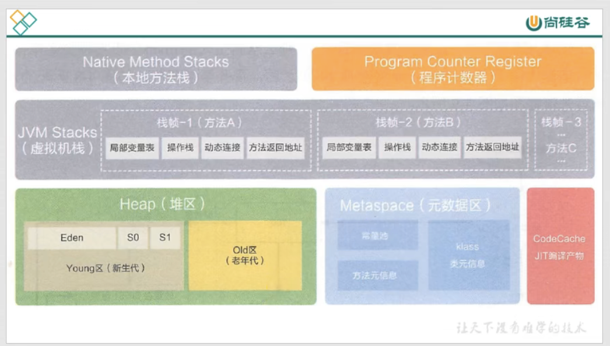
Java虚拟机定义若干种程序运行期间会使用到的运行时数据区，其中有一些会随着虚拟机启动而创建，随着虚拟机退出而销毁。
另外一些则是与线程一一对应的，这些与线程对应的数据区域会随着线程开始和结束而创建和销毁。

线程私有：程序计数器，虚拟机栈，本地方法栈
线程共享：堆，方法区（永久代或元空间，代码缓存）

# 程序计数器：（PC寄存器）
作用：
    PC寄存器用来存储指向下一条指令的地址，也就是将要执行的指令代码。由执行引擎读取下一条指令
特点：
    - 程序计数器占用内存很少
    - 每个线程都有自己的独立计数器
    - 任何一个线程都有一个方法在执行，也就是当前方法。程序计数器会存储当前线程正在执行的java方法jvm指令地址。
    - jvm规范中唯一一个没有规定OutOfMemoryError（OOM）异常，就是不会发生内存区超限，无GC
    - 它是程序控制流的指示器，分支，循环，跳转，异常处理，线程恢复等基础功能都依赖这个计数器完成
为什么需要PC寄存器：
    CPU之间需要不停的切换各个线程，这时候切换回来后，就不知道从哪里开始执行
为什么PC寄存器是私有的：
    因为为了记录各个线程正在执行的当前字节码指令，最好的办法自然是为每一个线程分配一个PC寄存器


# 虚拟机栈（本地方法栈）
出现的背景：
    由于跨平台的设计，Java指令都是根据栈来设计的。不同平台CPU架构不同，所以设计不能设计为PC寄存器
    优点：是跨平台，指令集小，编译器容易实现
    缺点：是性能下降，实现同样的功能需要更多的指令
内存中的堆与栈：
    栈解决程序的运行问题，即程序如何执行，或者说如何处理数据
    堆解决的是数据存储问题，即数据怎么放、放在哪
那么虚拟机栈到底是什么？
    Java虚拟机栈，早期也叫Java栈。每个线程在创建的时候都会创建一个虚拟机栈，
    其内部保存一个个的栈帧，对应着一次次的Java调用，线程是私有的
生命周期
    和线程一致
作用：
    主管Java程序的运行，它保存方法的局部变量、部分结果，并参与方法的调用和返回
基本概述
    - 每个线程创建的时候都会又一个虚拟机栈，其内部保存一个个栈帧，对应着一次次的java调用
    - 线程私有，生命周期和线程一致
    - 主管Java程序的运行，它保存方法的局部变量（8种基本数据类型，对象的引用地址），部分结果，并参与方法的调用和返回
    - 无GC，存在OMM
    - jvm直接对java栈的操作只有两个
        1，每个方法执行，伴随着进栈（入栈，压栈）
        2，执行结束后出栈
    - 对栈来说不存在垃圾回收：没有GC，只有OMM
栈中可能出现的异常：
    Java虚拟机规范允许Java栈的大小是动态的或者固定不变的
    1，如果采用固定大小的Java虚拟机栈，那每个线程的Java虚拟机栈容量可以在线程创建的时候独立选定 如果线程请求分配的栈容量超过Java虚拟机栈运行的最大容量，Java虚拟机将会跑出一个StackOverflowError
    2，如果Java虚拟机可以动态扩展，并且在尝试的时候无法申请到足够的内存，或者在创建新线程的时候没有足够的内存去创建对应的虚拟机栈，那么Java虚拟机将会抛出一个OutOfMemoryError

存储结构和运行原理
    栈存储内容
        - 每个线程都有自己的栈，栈中的数据都是以栈帧的格式存在
        - 在线程上正在执行的方法都对应各自的一个栈帧（方法的执行和结束对应着栈帧的入栈和出栈）
        - 栈帧是一个内存区块，一个数据集，维系着方法执行过程中各种数据信息
    栈运行原理
        1，jvm直接对栈的操作只有两个，就是对栈帧的压栈和出栈，遵循先进后出和后进先出的原则
        2，在一条活动线程中，一个时间点上，只会有一个活动的栈帧。即只有当前正在执行的方法的栈帧是有效的，这个栈帧被称为当前栈帧，与当前栈帧对应的方法就是当前方法，定义这个方法的类就是当前类。
        3，执行引擎运行的所有字节码指令只针对当前栈帧进行操作
        4，如果该方法中调用了其他的方法，对应新的栈帧会被创建出来，放在栈的顶端，成为新的栈帧
        5，不同线程中所包含的栈帧是不允许相互引用的（数据不共享），即不可能在另一个栈帧中引用另外一个线程的栈帧。
    不同线程可以共享他们在同一进程中的堆空间和方法区
        1，如果当前方法调用了其他的方法，方法返回之际，当前栈帧会传回此方法的执行结果前一个栈帧，接着，虚拟机会丢弃当前栈帧，使得前一个栈帧重新成为当前栈帧
    java方法有两种返回函数的方式
        1，一种是正常函数返回
        2，一种是抛出异常
总结：
    因为JVM是基于栈的指令集架构，所以自然有了虚拟机栈，它的跨平台性更高，编译更容易实现，但是性能不好，实现同样的功能需要更多的指令
    每个线程创建的时候会创建一个虚拟机栈，生命周期和线程一致。栈的内部保存着一个个的栈帧，对应着一次次的方法调用。
    jvm对栈的操作只有两个，就是对栈帧的压栈和出栈，一条线程一个时间点上只会有一个活动的栈帧，如果当前方法调用了其他方法，对应新的栈帧会创建出来，放在顶端成为新的栈帧
    不同线程中栈帧不允许相互引用，数据不共享
栈帧内部结构
    1，局部变量表
        概述：
            局部变量表是一个数组，用于存放方法参数以及方法内部的局部变量，这些数据类型包括基本数据类型、对象引用、以及返回值类型（returnAddress）
            局部变量表是建立在线程上的，线程是私有数据所以不存在数据安全的问题，当方法调用结束后随着栈帧的销毁，局部变量表随之销毁
            局部变量表所需的容量大小是在编译时期确定下来的，方法运行期间不会改变局部变量表的大小
        特性：
            - 定义一个数字数组，主要用于存储方法参数和定义在方法体内的局部变量，这些数据类型包括基本数据类型，对象引用，以及returnAddress
            - 由于局部变量都建立在线程的栈上，因此不存在数据安全问题
            - 局部变量表所需容量大小是在编译时期确定下来的，运行期间不会更改变量表的大小
            - 方法嵌套调用的次数由栈的大小决定。栈越大，方法嵌套调用的次数越多。对一个函数而言，他的参数和局部变量越多，使得局部变量表膨胀，它的栈帧就越大，以满足方法调用所传递的信息量增大的需求，进而函数占用更多的栈空间，导致嵌套调用的次数减少
            - 局部变量表中的变量只在当前方法中有效。当方法调用结束后，随着方法栈帧的销毁，局部变量表也会随之销毁
    2，局部变量槽（slot）
        概述：
            局部变量表以变量槽为最小单位，每个变量槽可以存储32位长度的内部空间，例如boolean、byte、char、short、int、float、reference
            对于64长度的数据类型（long、double），虚拟机会以高位对其的方式为其分配两个连续的slot空间
        slot的复用：
            为了尽可能的节省栈帧空间，局部变量表中的slot是可以重用的
            也就是pc寄存器的指令已经超出了某个变量的作用域（执行完毕），
            那么这个变量对应的slot槽是可以交给其他变量使用的
            优点：节省栈帧空间
            缺点：影响到系统的垃圾回收行为。比如大方法占用较多的slot，执行完该方法的作用域后没有对slot赋值或者清空，垃圾回收器不能即时的回收该内存
        特性：                    
            - 参数值总是放在局部变量的index0开始，到数组长度-1的索引结束
            - 局部变量，最基本的单位是slot（变量槽）
            - 局部变量表中存放着编译期可知的各种基本数据类型（8种），引用数据类型（reference），returnAddress类型的变量
            - 局部变量表里，32位以内的类型只占用一个slot（包括returnAddress类型），64的类型（double和long）占用两个slot
              -> byte，short，char在存储前被转为int，boolean也被转为int，0表示false，非0表示true
              -> long和double占据两个slot
            - jvm会为局部变量表中的每一个slot分配一个访问索引，通过这个索引可以成功访问到变量表中的局部变量值
            - 当一个实例方法被调用，它的方法参数和方法体内部定义的局部变量会按照顺序复制到局部变量表的每一个slot上
            - 如果需要访问局部变量中的一个64bit的局部变量值，只需要访问前一个索引就好
            - 如果当前帧是由构造方法或者实例方法创建的，那么该对象this将会放在index为0的slot处，其余的参数按照参数表的顺序继续排列
            - 栈帧中的局部变量表的slot是可以重复利用的
    3，操作数栈
        概述：
            可以理解为虚拟机栈中的一个用于计算的临时数据存储区
            过程就是PC寄存器获取字节码指令 -> 操作数栈压栈 -> 通过执行引擎进行运算操作 -> 出栈将计算结果存储至局部变量表
            这个过程中操作数栈的访问并非通过索引来进行数据访问，而是通过标准的入栈和出栈操作，如果被调用方法带有返回值，其返回值将会被压入当前栈帧的操作数栈中，并更新PC寄存器中下一条需要执行的字节码指令
            当一个方法开始的时候，一个新的栈帧被创建出来，这个方法的操作数栈是空的
        特性：
            - 操作数栈是jvm执行引擎的一个工作区，当一个方法开始执行的时候，一个新的栈帧被创建出来，这个方法的操作数栈是空的
            - 每个操作数栈有一个明确的栈深度用于存储数值，在编译时期就定义好了。保存在方法的code属性中，为max_stack的值
            - 栈中的任何一个元素都是任意的java数据类型
              -> 32bit的类型占用一个栈单位深度
              -> 64bit的类型占用两个栈单位深度
            - 操作数栈并非采用访问索引的方式来进行数据访问的，只能通过标准的入栈和出栈完成数据访问
            - 如果被调用方法带有返回值，其返回值将会被压入当前栈帧的操作数栈中，并更新PC寄存器中下一条需要执行的字节码指令
            - 操作数栈中的元素数据类型必须与字节码指令的序列号严格匹配，这由编译器期间进行验证，同时在类加载过程中类校验阶段的数据流分析阶段再次验证
            - 另外，我们说java虚拟机的解释引擎是基于栈的执行引擎，其中栈指的是操作数栈
    4，动态链接（指向运行时常量池的方法引用）
        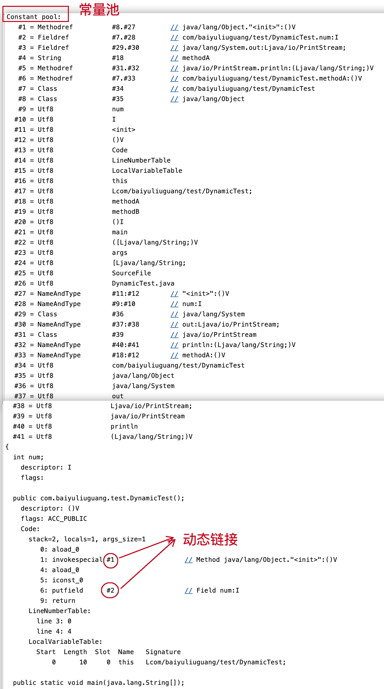
        概述：
            在Java源文件被编译到字节码文件中时，所有的变量和方法都作为符号引用保存在常量池中
            每个栈帧内部都包含一个指向运行时常量池中该栈帧所属方法的引用。包含这个他引用的目的：是为了支持当前方法的代码能够实现动态链接
            比如：一个方法调用另外其他方法，就是通过常量池中指向方法的符号引用来表示的，那么动态链接的作用就是将这些符号引用转为调用方法的直接引用
    5，方法返回地址
        存放的是该方法的pc寄存器的值
        一个方法的结束有两种方式：
            1，正常执行完成
            2，出现未处理的异常，非正常退出
        无论哪种方式退出，在方法退出后都返回该方法调用的位置。方法正常退出时，调用者的pc计数器的值作为返回地址，即该方法的指令的下一条指令的地址。而通过异常退出，返回地址是要通过异常表来确定

# 栈顶缓存技术
前面提到过，基于栈式架构的虚拟机所使用的零地址指令更加紧凑，但是完成一项操作的时候必然需要更多的入栈和出栈指令
这也就意味着将需要更多的指令分派和内存读写次数
为了解决这个问题HotSpot JVM的设计者提出了栈顶缓存技术，将栈顶元素全部缓存到物理CPU的寄存器中，以降低对内存的读/写次数，提升执行引擎的执行效率

# jvm方法的调用
在jvm中，将符号引用转换为调用方法的直接引用与方法的绑定机制有关
我们最终会将符号引用转换为直接引用，那么如果被调用的方法是在编译期间就确定下来，那么就称为静态链接，如果在编译期间无法被确定下来，那么就称为动态链接
静态链接
    当一个字节码文件被装载进jvm内部时，如果调用的目标方法在编译期可知，且运行期间保持不变，这种情况下将调用方法的符号引用转为直接引用的过程称之为静态链接
动态链接
    如果被调用的方法编译期无法确定下来，可就是说只能够在程序运行期间将调用的方法的符号引用转为直接引用，由于被转换的过程中具备动态性，因此成为动态链接
    **比如接口方法的调用**
虚方法和非虚方法
    - 如果方法在编译时期就确定具体的调用版本，这个版本在运行时是不可变的。这样的方法称为非虚方法
    - 静态方法，私有方法，final方法，实例构造器，父类方法都是非虚方法
    - 其他方法称为虚方法


# 面试题：分配栈内存越大越好么？
不是，栈内存空间变大，其他内存空间就会变小
# 面试题：垃圾回收是否涉及到虚拟机栈？
不涉及
# 面试题：方法中定义的局部变量是否线程安全？
需要分情况
```
线程安全
public static void method1() {
    StringBuilder s1 = new StringBuilder();
    s1.append("a");
    s1.append("b");
}
线程不安全
public static void method2(StringBuilder s1) {
    s1.append("a");
    s1.append("b");
}
线程不安全
public static void method2() {
    StringBuilder s1 = new StringBuilder();
    s1.append("a");
    s1.append("b");
    return s1;
}
```

# 静态变量和局部变量对比
- 我们知道变量表有两次初始化机会，第一次是在"准备阶段"，执行系统初始化，对变量设置零值，另一次则是在"初始化"阶段，赋予程序员在代码中定义的初始值
- 和类变量初始化不同的是，局部变量不存在系统初始化的过程，这意味着一旦定义了局部变量则必须人为初始化，否则无法使用


# java的本地方法
什么是本地方法？
    简单的讲就是一个java调用非java代码的接口。用native来修饰，abstract不能和native连用。
为什么要使用native method
    1，与java环境交互
        有时Java应用需要与Java外面的环境交互，这就是本地方法存在的主要原因
    2，与操作系统交互
        通过使用本地方法，可以实现jre与底层系统交互，甚至jvm的一些部分就是用c写的
    3，Sun's Java
        Sun的解释器就是用c实现的，这使得他能像一些普通的c一样与外部交互
java的本地方法栈
    java虚拟机用于管理java方法的调用，而本地方法栈用于管理本地方法的调用
    - 本地方法栈，也是线程私有的
    - 允许被实现成固定或者是可扩展的内存大小（在内存益处方面是相同的
    - 本地方法栈是由c语言实现的
    - 它的具体做法是native method stack中登记native方法，在execution engine执行时加载本地方法


# 堆空间和栈空间
- 一般来讲，对象主要放在堆空间，是运行时数据比较大的一块
- 栈空间存放：它保存方法的局部变量（8种基本数据类型，对象的引用地址），基本数据类型的局部变量，以及引用数据类型对象的引用

# 堆的核心概述
- 所有的对象实例以及数组都应该分配在堆上
- 数组和对象可能永远不会储存在栈上，因为栈帧中保存引用，这个引用指向对象或数组在堆中的位置
- 方法结束后，堆中的对象不会马上被移除，仅仅在垃圾回收时被移除
- 堆，是GC执行的回收重点

# 堆空间的大小设置
Java堆区用于存储Java对象实例，堆的大小在启动时已经设定好了
    -Xms用于表示堆区的起始内存，等价于-XX:InitialHeapSize
    -Xmx则用于表示堆区最大内存，等价于-XX:MaxHeapSize
    -XX:NewRatio:设置新生代老年代比例
    -XX:SurvivorRatio:设置新生代Eden区与Survivor区的比例
    -XX:UseAdaptiveSizePolicy:关闭自适应的内存分配策略（暂时用不到）
    -Xmn:设置新生代的空间大小
通常我们会将-Xms和-Xmx两个参数配置相同的值，目的是为了能够在java垃圾回收机制清理完堆区内存后不需要重新分隔计算堆区内存大小，从而提高性能

# 对象的分配过程
1，new对象先放在伊甸园区，此区域大小有限制
2，当伊甸园的空间填满时，程序又需要创建对象，jvm的垃圾回收器将对伊甸园区进行垃圾回收（Minor GC），将伊甸园区中不再被其他对象所引用的对象进行销毁 再加载新的对象到伊甸园区
3，然后将伊甸园区中的剩余对象移动到幸存者0区
4，如果再次触发垃圾回收，此时幸存者下来的放到幸存者0区，如果没有被回收，就会放到幸存者1区
5，如果再次触发垃圾回收，此时会重新放弃幸存者0区，接着去幸存者1区
6，啥时候去养老区呢？可以设置次数，默认是15次
   -> -XX:MaxTenuringThreshold=<N>进行设置
7，在养老区，相对悠闲。当养老区内存不足时，会再次触发Major GC，进行养老区的内存清理
8，若养老区执行了Major GC发现依然无法进行对象保存，就会产生OOM异常

总结：
- 针对幸存者s0，s1区：复制之后有交换，谁是空谁就是to
- 关于垃圾回收：频繁在新生区收集，很少在老年区进行收集，几乎不在永久区/元空间收集

# 常用的调优工具
- JDK命令
- Eclipse：Memory Analyzer Tool
- Jconsole
- VisualVM
- Jprofiler
- Java Flight Recorder
- GCViewer 
- GC Easy

# Minor GC，Major GC，Full GC
Java在进行GC的时候，并非对上面三个内存一起回收的，大部分时候指的是新生代
针对HotSpot VM的实现，它里面的GC按照回收区域分为两大类：一种是部分收集，一种是整堆收集
- 部分收集：不是完整收集整个Java堆的垃圾回收，其中分为：
  -> 新生代收集（Minor GC）:只是新生代垃圾回收
  -> 老年代收集：只是老年代的垃圾回收
     目前，只有CMS GC会有单独收集老年代的行为
     注意，很多时候Major GC会和Full  GC混淆使用，需要具体分辨是老年代回收还是整体回收
  -> 混淆收集（Mixed GC）:收集整个新生代和部分老年代的垃圾回收
     目前只有G1 GC会有这种行为
- 整堆收集：收集整个Java堆和方法区垃圾回收

# 年轻代GC（Minor GC）触发机制
-> 当年轻代空间不足时，就会触发Minor GC，这里的年轻代指的是Eden代满，Survivor满不会引发GC，（每次Minor GC会清理年轻代内存）
-> 因为Java对象大多数对象都具备朝生夕灭的特性，所以Minor GC非常频繁，一般回收速度比较快
-> Minor GC会引发STW，暂停其他用户线程，等垃圾回收结束，用户线程才能恢复

# 老年代GC（Major GC/Full GC）触发机制
- 指的是发生在老年代的GC，对象从老年代消失，我们说Major GC或Full GC发生了
- 出现了Major GC经常会伴随至少一次Minor GC（但非绝对的，在Parallel Scavenage）收集器的收集策略里就有直接进行Major GC的策略选择过程
  -> 也就是在老年大空间不足时，会尝试触发Minor GC，如果之后空间还不足，则会触发Major GC
- Major GC的速度一般会比Minor GC慢10倍以上，STW时间更长
- 如果Major GC后内存还不足就会报OOM
- Major GC的速度一般会比MInor GC慢10倍以上

# Full GC触发机制
1，调用System.gc()时，系统建议执行Full GC，但是不必然执行
2，老年代空间不足
3，方法区空间不足
4，通过Minor GC后进入老年代的平均大小大于老年代可用内存
5，由Eden区，s0区向s1区复制时，对象大小已经小于to区的可用内存，则把该对象转到老年代，且老年代的可用内存小于该对象大小
说明：full gc是开发或者调优过程中尽量避免的，这样暂时时间会短一些

# 为什么进行Java分代
- 经研究，不同的对象生命周期不同，70%-90%的对象是临时对象
  -> 新生代：有Eden，两块大小相同的Survivor构成，to总是为空
  -> 老年代：存放新生代中经历多次GC仍然存活的对象
分代唯一的理由是优化GC性能。如果没有分代那所有的对象都在一块，就如同把一个学校的人都关在一个教室。GC的时候要找到那些对象没用，
这些就会对堆的所有区域进行扫描，而很多对象都是朝生夕死的，如果分代的话，把新创建的对象放到一个地方，当GC的时候先把这块存储"朝生夕死"对象进行回收，这样就会腾出很大的空间

# 内存分配策略（或者对象提升规则）
- 优先分配到Eden
- 大对象直接分配到老年代（尽量避免程序中出现过多的大对象）
- 长期存活的对象分配到老年代
- 动态对象年龄判断
  -> 如果Survivor区中相同年龄的所有对象大小的总和大于Survivor空间的一半，年龄大于或者等于该年龄的对象可以直接进入老年代
     无需等到MaxTenuringThreshold要求的年龄值
- 空间分配担保
  -> -XX:HandlePromotionFailure 
  
# 空间分配担保
为什么要空间分配担保？
    因为新生代采用复制收集算法，假如大量对象在Minor GC后仍然存活，而Survivor空间是比较小的，这时候就需要老年代进行空间分配担保，把Survivor无法容纳的对象放到老年代
    老年代进行空间分配担保，前提是老年代有足够的空间来容纳这些对象，但是一共多少对象在内存中回收后存活下来是不可预知的
    因此只好取每次垃圾回收后晋升到老年代的对象大小的平均值最为参考，使用这个平均值与老年代剩余空间进行比较，来确定是否进行Full GC来腾出更多空间。
什么是空间分配担保？
    在发生Minor GC之前，虚拟机会检查老年代最大可用连接空间是否大于新生代所有的对象总空间
        1，如果大于，则此次Minor GC是安全的
        2，如果小于，则虚拟机会查看-XX:HandlePromotionFailure设置值是否允许担保失败
            1，如果-XX:HandlePromotionFailure=true，那么会继续检查老年代最大可用连续空间是否大于历次晋升到老年代的对象的平均大小
                1，如果大于，则尝试进行一次Minor GC，但这次Minor GC依然是有风险的
                2，如果小于进行一次Full GC
            2，如果-XX:HandlePromotionFailure=false，则改为进行一次Full GC
    
# 什么是TLAB
1，为什么会有TLAB(Thread Local Allocation Buffer)
    对象实例的创建在堆中十分频繁，堆又是共享区域，为了比避免多个线程操作同一地址，需要使用加锁等机制，会影响分配速度
    - 堆是线程共享区域，任何线程都可以直接访问堆中的共享区域
    - 由于对象实例的创建在jvm中非常频繁，因此在开发环境中从堆区划分内存空间是线程不安全的
    - 为了避免多个线程操作同一地址，需要使用加锁等机制，进而影响分配速度

2，什么是TLAB
    它是在 Java 堆中为每个线程划分出来一块内存区域，作为该线程创建对象
    主要目的是在多线程并发环境下进行内存分配的时候，减少线程之间对于内存区域的竞争，加快内存分配速度
3，TLAB缺点
    1，TLAB的空间大小是固定的，如果这时候有个大对象TLAB剩余的空间容不下他
    2，TLAB空间还剩一点点没有用到，有点舍不得。比如100kb的空间，已经使用了80kb，又来了个30kb的对象怎么处理呢？
        1，当剩余的空间小于最大浪费空间，那该TLAB属于的线程在重新向Eden区申请一个TLAB空间。进行对象创建，还是空间不够，那你这个对象太大了，去Eden区直接创建吧！
        2，当剩余的空间大于最大浪费空间，那这个大对象请你直接去Eden区创建，我TLAB放不下没有使用完的空间。
    3，Eden空间够的时候，你再次申请TLAB没问题，我不够了，Heap的Eden区要开始GC，
    4，LAB允许浪费空间，导致Eden区空间不连续，积少成多。以后还要人帮忙打理。
# 堆空间的参数
-XX:+PrintFlagsInitial：查看所有的参数默认初始值
-XX:+PringFlagsFinal：查看所有参数的最终值
-XX:PringGCDetails：输出详细的GC处理日志
-Xms：初始堆空间内存（默认物理内存的1/64）
-Xmx：最大堆空间内存（默认物理内存的1/4）
-XX:NewRatio：配置新生代和老年代在堆结构中的占比
-XX:SurviorRatio：配置新生代中Eden/S0/S1的空间比例
-XX:MaxTenuringThreshold：设置新生代垃圾回收的最大年龄
-XX:HandlePromotionFailure：是否设置空间分配担保

# 堆是分配对象的唯一选择么？
1，随着JIT编译期的发展与逃逸分析技术的逐渐成熟，栈上分配、标量替换优化技术将会导致一些微妙变化，所有的对象都分配到堆上也渐渐的不那么绝对了。
2，在Java虚拟机栈中，对象是在Java堆中分配内存的，这是一个普遍的常识。但是一种特殊情况，那就是如果经过逃逸分析后发现，一个对象并没有逃逸出方法的话，那么就有可能被优化成栈上分配。
这样就无须在堆上分配内存，也无须进行垃圾回收了。这也就是常见的堆外存储技术

# 逃逸分析
什么是逃逸分析？
    分析对象的动态作用域，当一个对象在方法里被定义后，他可能被外部方法所引用，例如作为调用参数传递到其他方法中，这种称为方法逃逸
    设置还有可能被外部线程访问，比如赋值给可以在其他线程中访问的实例变量，这种称为线程逃逸。
    从不逃逸到方法逃逸再到线程逃逸，称为对象由低到高的不同程度的逃逸程度
逃逸分析是Java虚拟机比较前沿的优化技术，它与类型继承关系分析一样，
当一个对象在方法中被定义后，对象只在方法内部使用，则认为没有发生逃逸
当一个对象在方法中被定义后，被外部方法引用，则认为发生逃逸。例如作为调用参数传递到其他地方中
```
发生逃逸主要场景是:
private Person p;
1,变量赋值
public void methodC(){
    p = new Person();
}
2,实例引用传递
public void methodA(){
    Person Person = methodB();
    methodC();
}
3,方法返回值
public Person methodB(){
    Person person = new Person();
    return person;
}
```

# 逃逸分析，代码优化
1，栈上分配(没有发生逃逸才会进行栈上分配)。
    指在Java程序的执行过程中，在方法体中声明的变量以及创建的对象，将直接从该线程所使用的栈中分配空间。 一般而言，创建对象都是从堆中来分配的，这里是指在栈上来分配空间给新创建的对象。
    JVM允许将线程私有的对象打散分配在栈上（比如若一个对象拥有两个字段，会将这两个字段视作局部变量进行分配），而不是分配在堆上。分配在栈上的好处是可以在函数调用结束后自行销毁，而不需要垃圾回收器的介入，从而提高系统性能。
2，同步省略。
    如果一个对象被发现只能从一个线程被访问到，那么对于这个对象的操作可以不考虑同步
    ```
    public class SynchronizedTest {
        public void f() {
            Object hollis = new Object();
            synchronized(hollis) {
                System.out.println(hollis);
            }
        }
    }
    同步省略之后
    public class SynchronizedTest {
        public void f() {
            Object hollis = new Object();
            System.out.println(hollis);
        }
    }
    ```
3，分离对象或标量替换。
    标量（Scalar）是指一个无法再分解成更小的数据的数据。Java中的原始数据类型就是标量。相对的，那些还可以分解的数据叫做聚合量（Aggregate），Java中的对象就是聚合量，因为他可以分解成其他聚合量和标量。
    在JIT阶段，如果经过逃逸分析，发现一个对象不会被外界访问的话，那么经过JIT优化，就会把这个对象拆解成若干个其中包含的若干个成员变量来代替。这个过程就是标量替换。
    ```
    public static void main (String[] args) {
        alloc(); 
    }
    private static void alloc() {
        Point point = new Point (1.2);
        System.out.println("point.x="+point.x+";point.y="+point.y);
    }
    class Point {
        private int X; 
        private int y;
    }
    经过标量替换后就会变成
    private static void alloc() {
        int x=1; 
        int y=2; 
        System.out.println("point.x="+x+"; point.y="+y);
    }
    ```
    可以看到，Point这个聚合量经过逃逸分析后，发现他并没有逃逸，就被替换成两个聚合量了。那么标量替换有什么好处呢？就是可以大大减少堆内存的占用。因为一旦不需要创建对象了，那么就不再需要分配堆内存了。


# 堆空间小结
- 年轻代是对象的诞生、成长、消亡的区域，一个对象在这里产生、应用，最后被垃圾回收器收集、结束生命
- 老年代放置长生命周期对象，通常都是从Survivor区域筛选拷贝过来的Java对象。当然，也有特殊情况，我们知道普通的对象会被分配在TLAB上
如果对象较大，JVM会试图直接分配在Eden其他位置上；如果对象太大，完全无法在新生代找到足够长的连续空闲空间，jvm就会直接分配到老年代
- 当GC只发生在年轻代，回收年轻代对象的行为被称为Minor GC。当GC发生在老年代则被称为Major GC或者Full GC。一般的，Minor GC的发生频率比Major GC
高很多，即老年代中垃圾回收发生的频率大大低于老年代

# 堆主要包含
对象实例
    类初始化生成的对象
    基本数据类型的数组也是对象实例
字符串常量池
    字符串常量池原本存放于方法区，jdk7开始放置于堆中。
    字符串常量池存储的是string对象的直接引用，而不是直接存放的对象，是一张string table
静态变量
    静态变量是有static修饰的变量，jdk7时从方法区迁移至堆中
线程分配缓冲区（Thread Local Allocation Buffer）
    线程私有，但是不影响java堆的共性
    增加线程分配缓冲区是为了提升对象分配时的效率


# 浅拷贝
1. 浅拷贝介绍
浅拷贝会创建一个新对象，如果属性是基本类型，拷贝的就是基本类型的值
   如果是内存地址（引用类型），拷贝的就是内存地址
   因此如果其中一个对象改变了这个地址，就会影响到另一个对象
   即默认拷贝构造函数只是对对象进行浅拷贝复制，只复制对象空间而不复制资源
2，实现
需要实现Cloneable接口，并覆盖clone()方法
```java
public class Student implements Cloneable {

    //引用类型
    private Subject subject;
    //基础数据类型
    private String name;
    private int age;

    public Subject getSubject() {
        return subject;
    }

    public void setSubject(Subject subject) {
        this.subject = subject;
    }

    public String getName() {
        return name;
    }

    public void setName(String name) {
        this.name = name;
    }

    public int getAge() {
        return age;
    }

    public void setAge(int age) {
        this.age = age;
    }

    /**
     *  重写clone()方法
     * @return
     */
    @Override
    public Object clone() {
        //浅拷贝
        try {
            // 直接调用父类的clone()方法
            return super.clone();
        } catch (CloneNotSupportedException e) {
            return null;
        }
    }

    @Override
    public String toString() {
        return "[Student: " + this.hashCode() + ",subject:" + subject + ",name:" + name + ",age:" + age + "]";
    }
}
```
# 深拷贝
1，对于基本数据类型和浅拷贝一样进行赋值
2，对于引用类型，比如对象或者数组，会新创建一个对象空间，然后拷贝里面的内容
3，对于有多层对象的，每个对象都需要实现Cloneable并重写clone()方法，进而实现对象的层层拷贝
实现：
```java
public class Student implements Cloneable {
    //引用类型
    private Subject subject;
    //基础数据类型
    private String name;
    private int age;

    public Subject getSubject() {
        return subject;
    }

    public void setSubject(Subject subject) {
        this.subject = subject;
    }

    public String getName() {
        return name;
    }

    public void setName(String name) {
        this.name = name;
    }

    public int getAge() {
        return age;
    }

    public void setAge(int age) {
        this.age = age;
    }

    /**
     *  重写clone()方法
     * @return
     */
    @Override
    public Object clone() {
        //深拷贝
        try {
            // 直接调用父类的clone()方法
            Student student = (Student) super.clone();
            student.subject = (Subject) subject.clone();
            return student;
        } catch (CloneNotSupportedException e) {
            return null;
        }
    }

    @Override
    public String toString() {
        return "[Student: " + this.hashCode() + ",subject:" + subject + ",name:" + name + ",age:" + age + "]";
    }
}
```


# 方法区的理解
关于方法区
    1，方法区其实是一种规范，java8以前叫永久代放在jvm内存中，是堆的一部分。java8以后称为元空间，直接放到了本地内存中。
    2，存放的类的元数据信息。主要包括：类信息、运行时常量池、字符串常量池
    3，与堆一样，是线程共享的区域
    4，同样存在垃圾收集
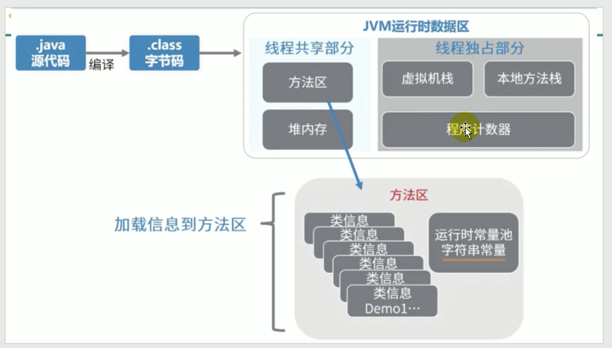
# 方法区内部结构
1，类型信息
    对每个加载的类型（类class、接口interface、枚举enum、注解annotation），jvm必须在方法区存储以下类型信息
    一，这个类型的完整有效名称（全名=包名.类名）
    二，这个类型直接父类的完整有效名（对于interface或是java.lang.Object，都没有父类）
    三，这个类型的修饰符（public，abstract，final的某个子集）
    四，这个类型直接接口的一个有序列表

2，域(Field)信息
    - jvm必须在方法区保存类型的所有属性的相关信息以及属性的生命顺序
    - 属性的相关信息包括：属性名称、属性类型、属性修饰符（public，protected，static，final，volatile，transient的某个子集）

3，方法信息
    方法名称，方法返回类型，方法参数数量和类型，方法修饰符，方法字节码，操作数栈，局部变量表大小，异常表

4，类变量(即static变量）非final类变量
    在java虚拟机使用一个类之前，它必须在方法区中为每个非final类变量分配空间。非final类变量存储在定义它的类中；
    final类变量（不存储在这里）
        由于final的不可改变性，因此，final类变量的值在编译期间，就被确定了，
        因此被保存在类的常量池里面，然后在加载类的时候，复制进方法区的运行时常量池里面；
        final类变量存储在运行时常量池里面，每一个使用它的类保存着一个对其的引用；

5，对类加载器的引用
    jvm必须知道一个类型是由启动类加载器加载的还是由用户类加载器加载的。如果一个类型是由用户类加载器加载的，那么jvm会将这个类加载器的一个引用作为类型信息的一部分保存在方法区中。

6，对Class类的引用
    jvm为每个加载的类都创建一个java.lang.Class的实例（存储在堆上）。
    而jvm必须以某种方式把Class的这个实例和存储在方法区中的类型数据（类的元数据）联系起来， 
    因此，类的元数据里面保存了一个Class对象的引用；

# 常量池和运行时常量池
常量池可以看作是一张表，虚拟机指令根据这张常量表找到要执行的类名、方法名、参数类型、字面量等类型
1，常量池
    主要是各种字面量和符号引用
    - 字面量
        1，字面量就是比如说int a = 1; 这个1就是字面量。又比如String a = "abc",这个abc就是字面量。
        2，声明为final的（基本数据类型）常量值。
        注意：方法内的常量值由栈分配，所以并不算是字面量
    - 符号引用
        类和接口的全限定名、字段的名称和描述符、方法名称和描述符。
        只不过是以一组符号来描述所引用的目标，和内存并无关，所以称为符号引用，直接指向内存中某一地址的引用称为直接引用。

3，运行时常量池
    java文件被编译成class文件后就会生成常量池，jvm在执行某个类的时候，必须经过加载、验证、准备、解析、初始化几个阶段。
    当类加载到内存中后，jvm就会将class常量池中的内容放到运行时常量池中，在解析阶段会把符号引用翻译成直接引用放到运行时常量池
    每个类都有一个运行时常量池
    注意：
        1，常量池具备动态性，运行期间也可能将新的常量放入池中

# 字符串池
class常量池存的是字面量和符号引用，也就是说他们存放的并不是对象的实例，而是对象的符号引用值。
经过解析后，也就是把符号引用替换为直接引用（直接指向内存中的地址）。
解析过程中会去查询全局字符串池，以保证运行时常量池所引用的字符串和全局字符串池中的引用是一致的
```
举个实例来说明一下:
public class HelloWorld {
    public static void main(String []args) {
        String str1 = "abc"; 
        String str2 = new String("def"); 
        String str3 = "abc"; 
        String str4 = str2.intern(); 
        String str5 = "def"; 
        System.out.println(str1 == str3);//true 
        System.out.println(str2 == str4);//false 
        System.out.println(str4 == str5);//true
    }
}
```
分析1：
    首先，在堆中会有一个”abc”实例，全局StringTable中存放着”abc”的一个引用值，
    然后在运行第二句的时候会生成两个实例，一个是”def”的实例对象，并且StringTable中存储一个”def”的引用值， 还有一个是new出来的一个”def”的实例对象，
    与上面那个是不同的实例，当在解析str3的时候查找StringTable，里面有”abc”的全局驻留字符串引用，所以str3的引用地址与之前的那个已存在的相同，
    str4是在运行的时候调用intern()函数，返回StringTable中”def”的引用值，如果没有就将str2的引用值添加进去，在这里，StringTable中已经有了”def”的引用值了，所以返回上面在new str2的时候添加到StringTable中的 “def”引用值，
    最后str5在解析的时候就也是指向存在于StringTable中的”def”的引用值，那么这样一分析之后，下面三个打印的值就容易理解了。
分析2：
    上面程序的首先经过编译之后，在该类的class常量池中存放一些符号引用，然后类加载之后，将class常量池中存放的符号引用转存到运行时常量池中，
    然后经过验证，准备阶段之后，在堆中生成驻留字符串的实例对象（也就是上例中str1所指向的”abc”实例对象），然后将这个对象的引用存到全局String Pool中，也就是StringTable中，
    最后在解析阶段，要把运行时常量池中的符号引用替换成直接引用，那么就直接查询StringTable，保证StringTable里的引用值与运行时常量池中的引用值一致，大概整个过程就是这样了。


# 为什么需要常量池
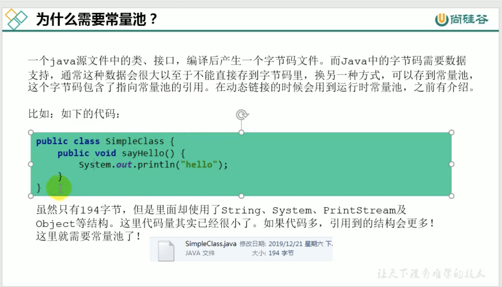
一个java源文件中的类、接口，编译后产生一个字节码文件。而Java中的字节码需要更多数据支持，通常这种数据很大以至于不能直接存到字节码里。
换一种方式，可以存到常量池，这个字节码包含了指向常量池的引用。在动态链接的时候会用到运行时常量池。

# 方法区的演进
jdk8完全放弃了永久代的概念，改用JRockit、J9一样在本地内存中实现元空间来代替
元空间的本质和永久带类似，都是对jvm规范中方法区的实现，不过元空间和永久带的最大区别在于：元空间不在虚拟机设置的内存中，而是使用本地内存

jdk1.6及以前：有永久代，静态变量放在永久代上
jdk1.7：有永久代，但是已经在逐步"去永久代"，字符串常量池，静态变量移除，保存在堆中
jdk1.8及以后：无永久代，类型信息、字段、方法、常量保存在本地内存的元空间，但字符串常量池、静态变量仍在堆中

# 设置方法区内存大小（jdk1.8）
-XX:MetaspaceSize：设置初始元空间大小。
-XX:MaxMetaspaceSize：最大元空间大小
对于一个64位的服务器jvm来说，其默认值是21mb，这是高水位，一旦超过这个高水位，Full GC将会被触发并卸载没用的类，然后这个高水位会被重置。
新的高水位取决于GC后释放了多少元空间，如果释放的空间不足，那么在不超过-XX:MaxMetaspaceSize时，适当提高该值，如果释放空间过多，则降低该值
如果初始化的内存设置过低，上述高水位调整情况会发生多次。为了避免频繁的Full GC建议将-XX:MetaspaceSize设置为一个较大的值

# 方法区垃圾收集
一般来说这个区域的回收效果比较难令人满意，尤其是类型的卸载，条件相当苛刻。但是部分区域的回收有时候确实是必要的。
方法区的垃圾回收主要是两部分：常量池中废弃的常量和不使用的类型

1，常量的回收
HotSpot虚拟机对常量池的回收策略是很明确的，只要常量池中的常量没有被任何地方引用，就被回收

2，类的回收
满足一下条件允许被回收
- 该类的所有实例被回收，也就是Java堆中不存在该类的任何派生子类
- 加载该类的类加载器被回收（这个条件除非是经过精心设计的可替换类加载器场景，如OSGI、JSP的重载等，否则很难达成）
- 该类对应的java.lang.Class对象没有在任何地方被引用，无论任何地方无法通过反射访问该类方法
这里满足条件后仅仅是被"允许"，并不是和其他对象一样，没有了就必然被回收。

# 如何解决OOM
1，要解决OOM异常或heap space异常，一般的手段是首先通过内存映像分析工具对dump出来的堆转储快照进行分析，重点是确认内存中的对象是否是必要的
也就是首先要分清楚到底是出现了内存泄漏还是内存溢出
2，如果是内存泄漏，可进一步通过工具查看泄漏对象到GC Roots的引用链。于是就能找到泄漏对象是通过怎样的路径与GC Roots相关联并导致垃圾回收器无法自动回收的
掌握了泄漏对象的类型信息，以及GC Roots引用链信息，就可以比较准确的定位出泄漏代码位置
3，如果不存在内存泄漏，换句话说就是内存中的对象都还必须存活着，那就应当检查虚拟机参数，与机器物理内存对比看是否可以调大，从代码上检查是否存在
某些对象生命周期过长，持有状态时间过长的情况，尝试减少程序运行期的内存消耗

# StringTable为什么要调整
因为永久代的回收效率很低，只有在full GC的时候才会触发。而full GC是老年代空间不足、永久代不足时才会触发。
这就导致StringTable回收效率不高，而开发中会有大量的字符串被创建，回收效率低，导致永久代内存不足。


# 问题
1，Java8分代改进
2，jvm内存分区，每个最用是什么
3，jvm内存分布、堆和栈的区别、堆的结构、为什么有两个survivor区
4，为什么要有新生代和老年代
5，对象什么时候会进入老年代
6，jvm为什么要分成新生代，老年代，持久代，新生代为什么要分Eden和Survivor
7，jvm内存模型在java8中做了什么修改
8，jvm永久代会发生垃圾回收么


 


  


