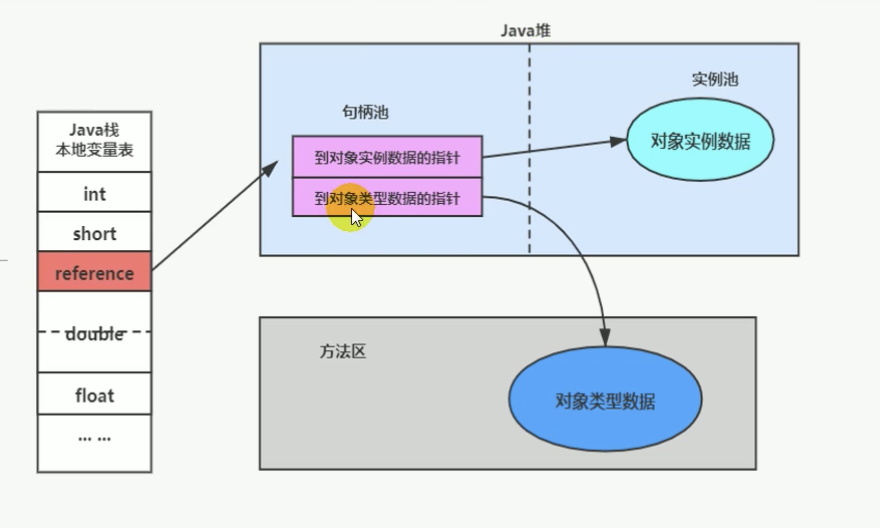
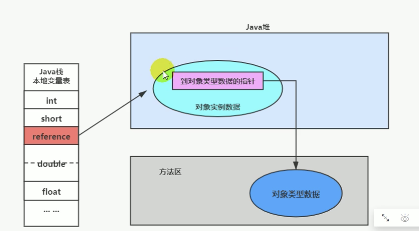

# 创建对象方式
1，new：最常见的方式
2，class的newInstance：反射的方式，只能调用空参构造器，权限必须是public
```
/*通过Class.NewInstance()创建新的类示例*/   
    private void newInstanceByClassNewInstance(){   
        try {/*当前包名为reflect，必须使用全路径*/   
            A a=(A)Class.forName("reflect.A").newInstance();   
        } catch (Exception e) {   
            out.println("通过Class.NewInstance()调用私有构造函数【失败】");   
        }  
    }
```
3，Constructor的newInstance(Xxx)：反射的方式，可以调用空参、带参构造器，权限没有要求
```
/*通过Constructor.newInstance()创建新的类示例*/   
    private void newInstanceByConstructorNewInstance(){   
        try {/*可以使用相对路径，同一个包中可以不用带包路径*/   
            Class c=Class.forName("A");   
            /*以下调用无参的、私有构造函数*/   
            Constructor c0=c.getDeclaredConstructor();   
            c0.setAccessible(true);   
            A a0=(A)c0.newInstance();   
            /*以下调用带参的、私有构造函数*/   
            Constructor c1=c.getDeclaredConstructor(new Class[]{int.class,int.class});   
            c1.setAccessible(true);   
            A a1=(A)c1.newInstance(new Object[]{5,6});   
        } catch (Exception e) {   
            e.printStackTrace();   
        }   
    }
```
4，使用clone：当前类要实现Cloneable接口
5，使用反序列化：从文件中、从网络中获取一个对象的二进制流
6，第三方库：Objenesis

# 对象实例化
1，加载对象的元信息
   虚拟机虚拟机遇到一条new命令，首先检查这个指令参数是否在Metaspace的常量池中定位到一个类的符号引用，并且检查这个符号引用代表的类是否被加载、解析、初始化。即判断元信息是否存在
   如果没有，那么在双亲委派模式下，使用类加载器查找对应的class文件，如果没有找到文件，那么就抛出ClassNotFoundException异常
   如果找到就进行类加载，并生成对应的Class对象
2，为对象分配内存
   如果内存规整，那么虚拟机将采用指针碰撞法为对象分配内存。意思就是所有用过的内存放在一边，空闲的内存放在另一边，中间放着一个指针作为分界点的指示器
   如果内存不规整，那么虚拟机将采用空闲列表算法为对象分配内存。意思是虚拟机维护一个列表，记录那些内存是可用的，再分配的时候从列表找到一块足够大的空间分配给对象实例
3，处理并发安全问题
   采用CAS失败重试，区域加锁保证更新原子性
   每个线程分配一个TLAB
4，默认属性初始化
   所有属性设置默认值，保证对象实例字段在不赋值的时候可以使用
5，设置对象头信息
   将对象的所属类（即类的元数据信息）、对象的HashCode和对象的GC信息、锁信息等数据存储在对象的对象头中。
   这个过程的具体设置方式取决于JVM的实现
6，执行init方法初始化
   主要包含显式初始化、代码块中初始化、构造器中初始化

# 对象的内存布局
1，对象头
   1，运行时元数据
      哈希地址值、GC分代年龄、锁状态标志、线程持有的锁、偏向锁、偏向时间戳
   2，类型指针
      指向元空间，确定对象所属类型
2，实例数据
   即对象真正存储的有效信息，包括代码中定义的各种类型字段（从父类继承下来的和本身拥有的）

# 对象访问定位
1，句柄访问

2，直接指针


# Java直接内存（堆外内存）
什么是Java直接内存：
   堆外内存又叫直接内存，是和操作系统内存直接挂钩的，堆外内存不受jvm的管制，所以可以认为堆外内存是jvm以外的内存空间，
   虽然不受jvm管控，但是堆外内存还是在java进程里面的，而不是由系统内核直接管理；所以它还是在java进程里面的；
Java中的实现：
   NIO的buffer提供了一个可以不经过JVM内存直接访问系统物理内存的类 - DirectBufffer。
特性：
   直接内存的读写操作比普通Buffer快，但它的创建、销毁比普通Buffer慢（主要是因为DirectBuffer需向OS申请内存涉及到用户态内核态切换）
使用场合：
   直接内存使用于需要大内存空间且频繁访问的场合，不适用于频繁释放内存的场合
使用直接内存的原因：
   1，减少垃圾回收次数
      垃圾回收机制不会回收堆外内存，所以使用堆外内存可以减少垃圾回收次数，提升运行效率；因为垃圾回收工作时会暂停工作线程；
   2，加快复制速度
      因为堆内在flush到远程时，会先复制到堆内内存，在复制到堆外内存，然后在发送；
      操作系统是不可直接访问堆内内存的，而堆外内存省去了堆内到堆外的复制工作；
      比如netty框架就是用了直接内存才会如此之快；
缺点：
   因为不受jvm管控，所以垃圾回收机制不会回收堆外内存空间，需要用户自己释放空间
   堆外内存一旦发生泄漏，很难排查，所以一定要对堆外内存足够了解再去使用堆外内存
   不适合存储很复杂的对象。一般简单的对象或者扁平化的比较合适
