# 执行引擎概述
主要包含：解释器和JIT编译器
JVM的主要任务是负责装载字节码到其内部，但字节码并不能直接运行在操作系统上，因为字节码指令并非等价于本地机器指令
它内部包含的仅是一些能够被JVM所识别的字节码指令、符号表，以及其他一些辅助信息

那么如果想让一个Java程序运行起来，执行引擎的任务就是将字节码指令解释/编译为对应平台上的本地机器指令
简单来说，JVM中的执行引擎充当了将高级语言翻译为机器语言的译者
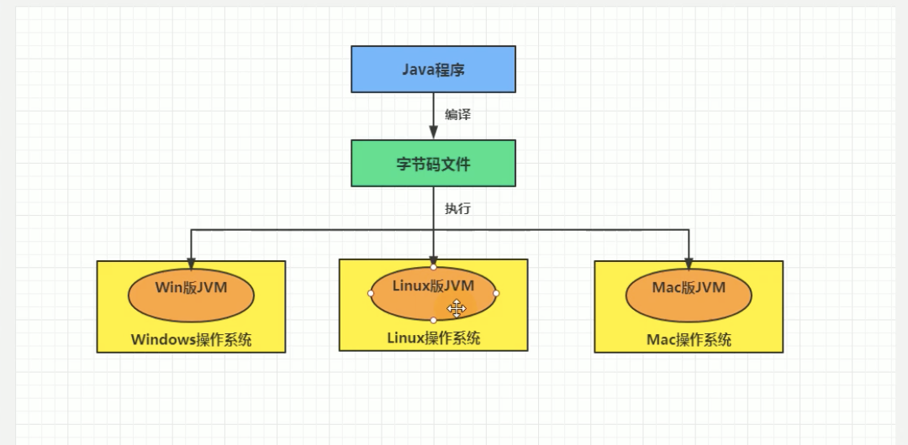

工作过程：
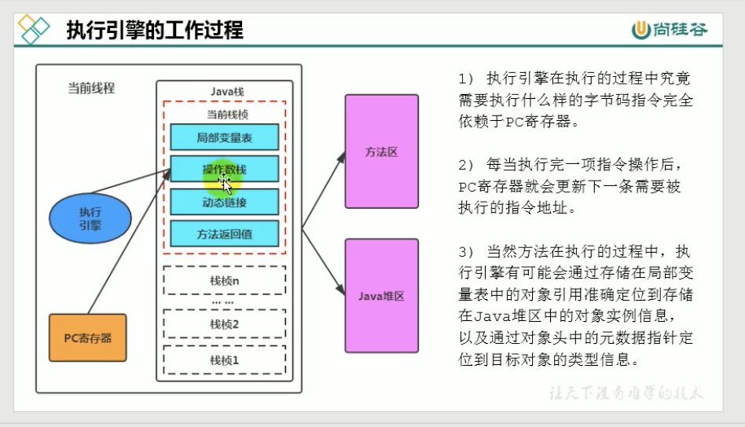
1，执行引擎在执行的过程中究竟需要执行什么样的字节码指令完全依赖于PC寄存器
2，每当执行完一项指令操作后，PC寄存器就会更新下一条需要被执行的指令地址
3，当前方法在执行的过程中，执行引擎有可能会通过存储在局部变量表中的对象引用准确定位到存储在Java堆区中的对象实例信息
以及通过对象头中的元数据指针定位到目标对象的类型信息

# Java代码的编译和执行
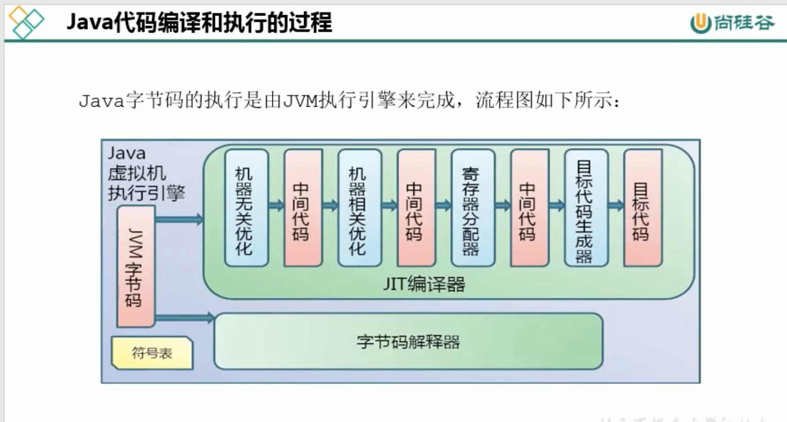

# 什么是解释器（Interpreter），什么是JIT编译器
解释器：根据定义的规范对字节码逐行解释的方式执行，将每条字节码文件中的内容"翻译"为对应平台的本地机器指令
JIT编译器：就是将虚拟机源代码直接编译成本地机器平台相关的机器语言
为什么说Java是半编译半解释型语言？
    是因为在执行Java代码的时候，通常都会将解释执行和编译执行二者结合起来进行

# 对于机器码、指令、汇编、高级语言的理解
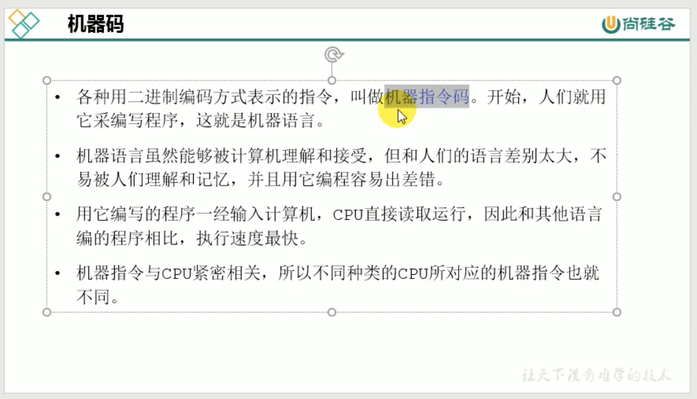
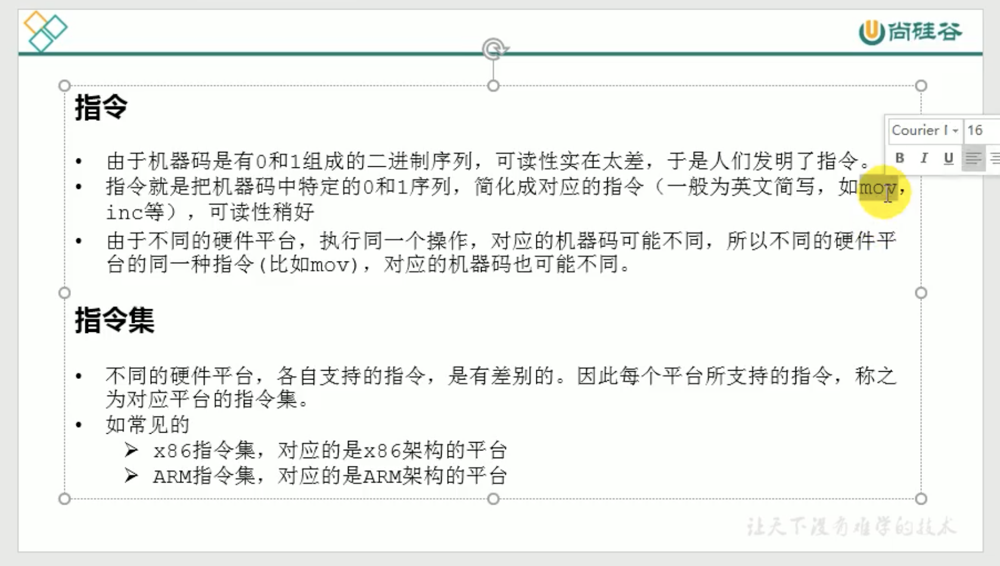
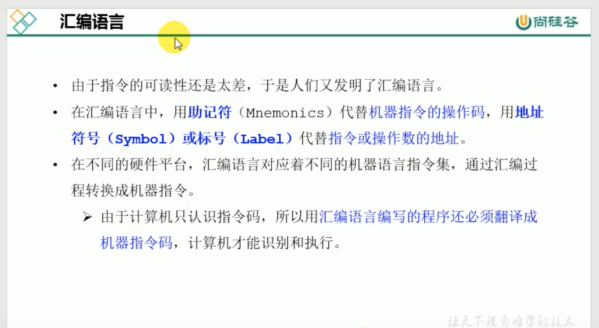
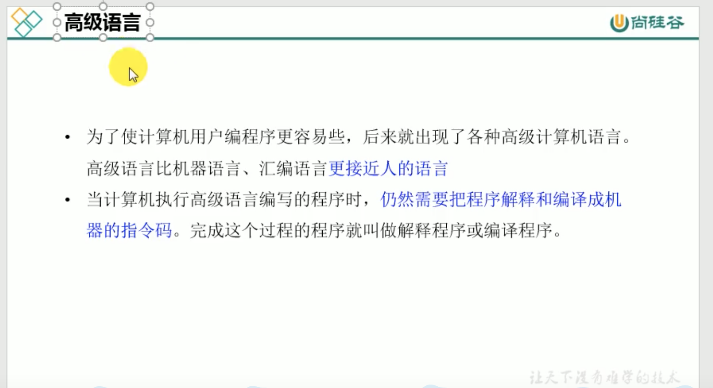

# 那么字节码又是什么？
1，字节码是一种中间状态（中间码）的二进制文件，它比机器码更抽象，需要直译器转译后才能成为机器码
2，字节码主要是为了实现特定软件运行和软件环境，与硬件环境无关
3，字节码的实现方式是通过编译器和虚拟机。编译器将源码编译成字节码，特定平台上的虚拟机将字节码转译为可以直接执行的指令

# 解释器
JVM设计的初衷仅仅只是单纯的满足Java程序实现跨平台性，因此避免采用静态编译的方式直接生成本地机器指令，
从而诞生了实现解释器在运行时采用逐行解释字节码执行程序的想法

解释器真正意义上所承担的角色是一个实时的"翻译者"，将字节码中的文件翻译为对应平台的本地机器指令执行
当一条字节码指令被解释执行完成后，接着再根据PC寄存器中记录的下一条指令执行解释操作

由于解释器在设计和实现上非常简单，因此除了Java语言之外，还有许多高级语言同样采用解释器执行
比如Python、Perl、Ruby等。
但是今天，基于解释器执行已经沦落为低效的代名词，并时常被一些C/C++程序员调侃
为了解决这个问题，JVM平台支持一种叫做即使编译器的技术。即使编译器的目的就是为了避免函数被解释执行，
而是将整个函数整体编译成机器码，每次函数执行时，只执行编译后的机器码即可，这种方式可以使执行效率大幅度提升
不过无论如何，基于解释器的执行模式仍人为中间语言的发展做出了不可磨灭的贡献

# JIT编译器
JIT编译器就是将整个函数字节码编译为机器指令并缓存起来，当需要使用函数的时候直接执行编译后的字节码即可

如何选择哪些字节码要编译为机器指令呢？
    需要根据代码被调用的执行频率而定，JIT编译器在运行时会针对哪些频繁调用的"热点代码"作出深度优化
    将其直接编译为对应平台的本地机器码指令，以提高Java程序的执行性能
那么什么叫热点代码呢？
    一个被多次调用的方法，或者是一个方法体内部循环次数较多的循环体都可以被称为"热点代码"。
    由于这种编译方式发生在方法的执行过程中，因此也称为栈上替换。
那么一个方法究竟被调用多少次才可以达到标准呢？
    必然需要一个明确的阈值，JIT编译器才会将这些"热点代码"编译到本地机器指令执行，主要依靠热点探测功能
热点探测：
    采用基于计数器的热点探测，HotSpot VM将会为每一个方法简历2个不同类型的计数器，分别为
        1，方法调用计数器：用于统计方法的调用次数呢
            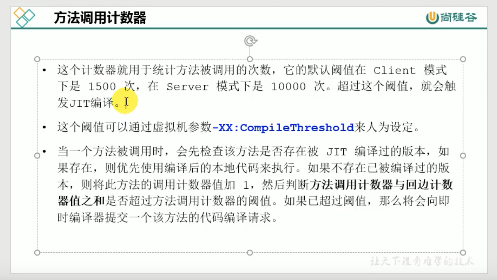
            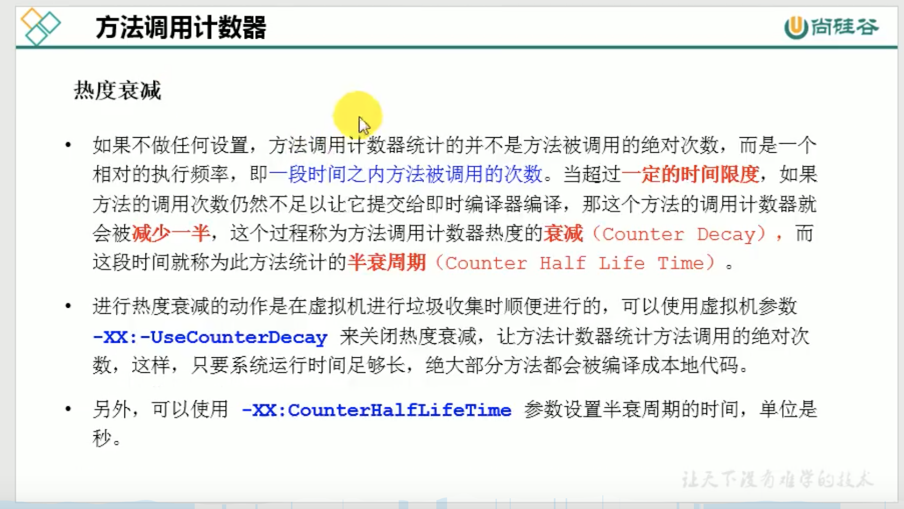
        2，回边计数器则用于统计循环体执行的循环次数
            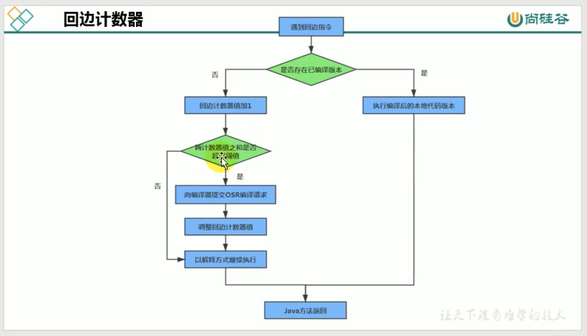

# 为什么有了JIT即时编译器这么高效还需要解释器呢？
当程序启动后解释器可以立马发挥作用，省去编译的时间，立即执行
即时编译器想要发挥作用，需要把代码编译成本地文件，需要一定的执行时间。但是在编译完成后执行效率很高

所以JRockit VM中程序的执行会非常高效，但程序启动的时候需要花费大量的时间，适用于服务端应用
因为对于服务端应用启动时间并非关注的重点！

解释器和即时编译器并存的优点就是：
    当Java虚拟机启动的时候，解释器可以首先发挥作用，而不必等待编译器全部编译完成在执行。
    随着时间的推移，编译器发挥作用，把越来越多的代码编译成本地代码获得更高效的执行

# 执行引擎解释器和即使编译器参数设置
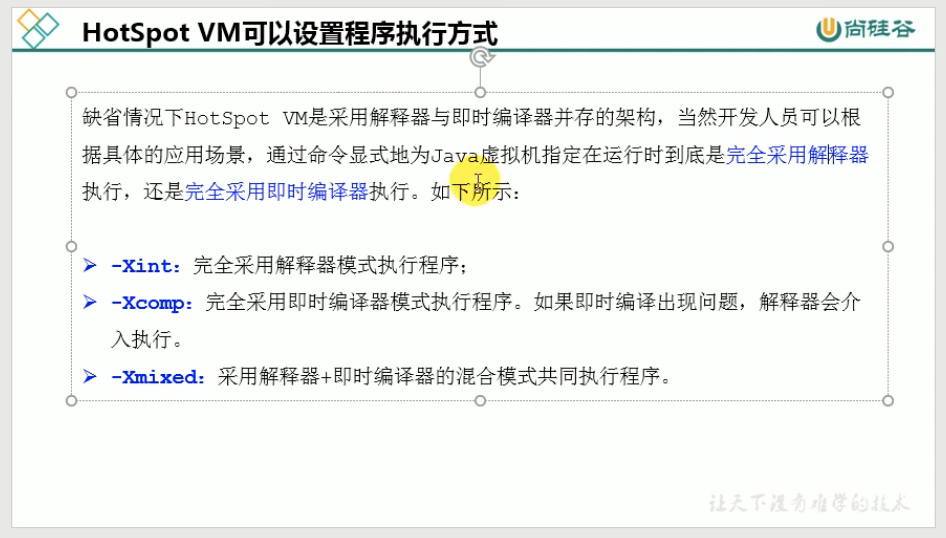

# JIT即时编译器分类
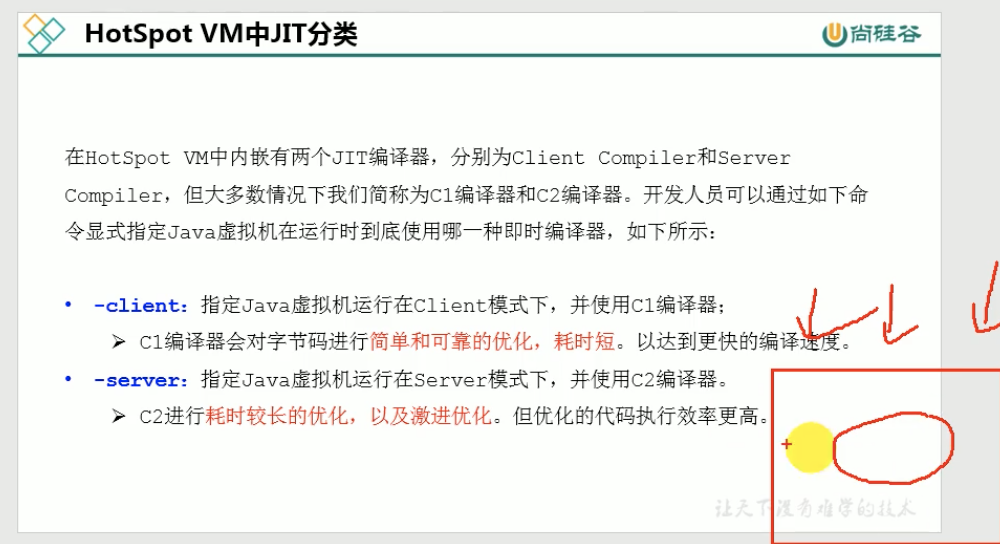
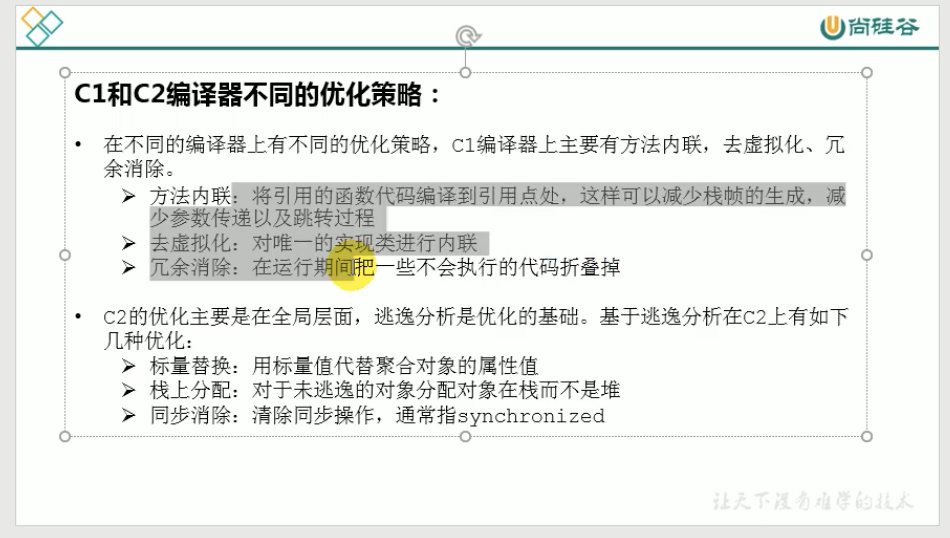
