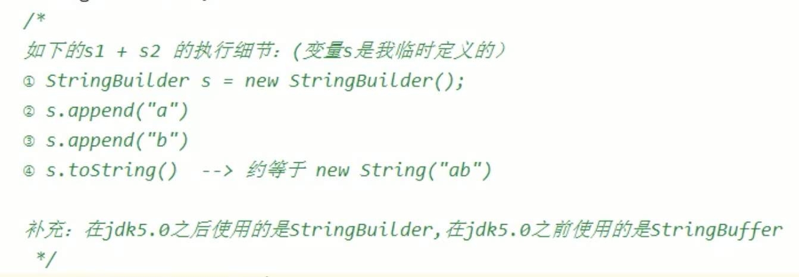
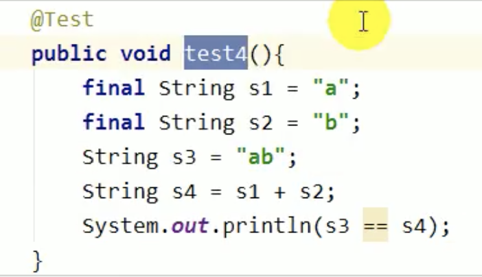
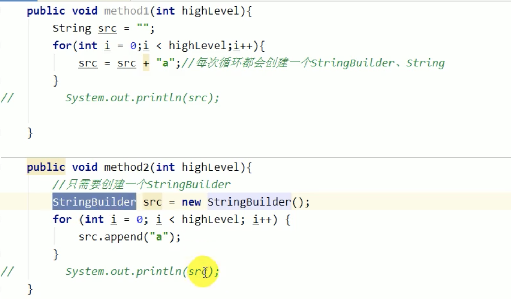

# 1，String 基本特性
- String声明为final，不可被继承
- String实现了Serializable和Comparable接口
- String在jdk8及以前内部定义了final char[] value用于存储字符串数据。jdk9改为byte[]

# 2，String的不可变性
- 当对字符串重新赋值时，需要重写指定内存区域赋值，不能使用原有的value进行赋值
- 当对现有的字符串进行连接操作时，也需要重新指定内存区域进行赋值，不能使用原有的value进行赋值
- 当调用String的replace()方法修改字符串时，也需要重新指定内存区域赋值，不能使用原有的value赋值
```
public class Test {
    String str = "good";
    char[] ch = {'a', 'a', 'a', 'a', 'a'};
    public void exchange(String str, char[] ch) {
        str = "best";//因为常量池中没有"best"，所以会开辟新的内存空间生成新的对象
        ch[0] = 'b';
    }
    public static void main(String[] args) {
        Test test = new Test();
        test.exchange(test.str, test.ch);
        System.out.println(test.str);//good
        System.out.println(test.ch);//baaaa
    }
}
1，str = "best";因为常量池中没有"best"，所以会开辟新的内存空间生成新的对象
2，
首先栈中存的是堆中对象的地址，因为String对象的特殊性（String有自己的常量池），当遇到常量池中没有的字符串时，String会开辟新的内存空间（生成新对象）。
实例中，将a的值（“b”的地址）赋值给了str，从而起初示例中a引用指向“b”，str初始值也是指向“b”；
然而当给str重新赋值时，str指向了另一个内存空间（即存储的是新字符串的地址，相当于给str重新赋值了），因此str指向“137878”，对a没影响。
```
# 字符串常量池不会存放相同内容的字符串
1，字符串常量池是一个固定大小的HashTable。如果放入的字符串过多就会造成hash冲突严重，
从而导致链表很长而链表长的直接影响就是String.intern()性能大幅下降
.intern()判断字符串常量池中是否存在某个字符串
2，使用-XX:StringTableSize可设置StringTable的长度
3，在jdk6中StringTable是固定的，就是1009的长度，所以如果常量池中的字符串过多就会导致效率下降很快。StringTableSize设置没有要求
4，在jdk7中，StringTable的长度默认是60013，1009是可设置的最小值

# String的内存分配
Java6及以前，字符串常量池放在永久代
Java7中，将字符串常量池放在了堆中
Java8元空间，字符串常量在堆中
为什么要迁移到堆中？
    1，永久代默认比较小
    2，垃圾回收频率低

# 字符串常量池的使用方法有两种
1，直接使用双引号声明出来的String对象会直接存储在常量池中。比如：String info = "shuai"
2，如果不是使用双引号声明的String对象，可以使用String提供的intern()方法

# 字符串的拼接
1，常量与常量的拼接结果在常量池，原理是编译期优化
2，常量池中不会存在相同内容的常量
3，只要其中有一个是变量，则相当于在堆空间中new String()，结果就在堆中，所以堆空间中的地址并不等于常量池中字符串的地址。变量拼接的原理是StringBuilder
4，如果拼接的结果调用intern()方法，则主动将常量池中还没有的字符串对象放入池中，并返回此对象地址


```
String s1 = "hello";
String s2 = "java";
String s3 = "hellojava";
String s4 = "hello" + "java";//编译期初始化
String s5 = s1 + "java";
String s6 = "hello" + s2;
String s7 = s1 + s2;

System.out.println(s3 == s4);//true
System.out.println(s3 == s5);//false
System.out.println(s3 == s6);//false
System.out.println(s3 == s7);//false
System.out.println(s5 == s6);//false
System.out.println(s5 == s7);//false
System.out.println(s6 == s7);//false
String s8 = s6.intern();
System.out.println(s3 == s8);//true
```

# 拼接操作和append操作效率对比
1，在一条语句中使用+号 和 直接使用append的效果是一样的
2，在多条语句中使用+号，会创建大量无用的StringBuilder对象，此时应该使用append来拼接字符串


# 6，intern()的使用
如果不是用双引号生命的string对象，可以使用String提供的intern方法：intern方法会从字符串常量池中查询当前字符串是否存在，若不存在就放入常量池中
通俗讲，就是确保字符串在内存中只有一份拷贝，这样可以节约内存空间

在jdk1.6中：
    ->如果串池中有，则并不会放入。返回已有的串池中的对象地址
    ->如果没有会把"对象复制一份"，放入串池，并返回串池中对象地址
在jdk1.7起：
    ->如果串池中有，则并不会放入。返回已有的串池中的对象地址
    ->如果没有会把"对象的引用地址复制一份"，放入串池，并返回串池中的引用地址


# 7，面试题
(1)new String("ab")创建几个对象   
对象1：一个对象是new关键字在堆空间创建的
对象2：另一个对象是字符串常量池中的对象
(2)new String("a") + new String("b")创建了几个对象
对象1：new StringBuilder()
对象2：new String("a")
对象3：常量池中的'a'
对象4：new String("b")
对象5：常量池中的'b'
(3)
```
String s = new String("1");
s.intern();//在调用此方法前，字符串常量池中已经存在"1"了
String s2 = "1";
System.out.println(s == s2);//false，一个指向堆内存，一个指向字符串常量池


String s = new String("1") + new String("1")
上述代码执行完成以后字符串常量池中是否存在"11"？不存在！！！
s.intern();//会把"对象的引用地址复制一份"，放入串池，并返回串池中的引用地址
String s2 = "11";
System.out.println(s == s2);//true，


String s3 = new String("1") + new String("1")
String s4 = "11";
s3.intern();//这里只是判断如果串池中有，没有接收返回的串池中的对象地址，所以s3 == s4为fase
System.out.println(s3 == s4);//false，


String s = new String("1") + new String("1")
String s2 = s.intern();
System.out.println(s == "11");//true，
System.out.println(s2 == "11");//true，

String x = "11";
String s = new String("1") + new String("1")
String s2 = s.intern();
System.out.println(s == "11");//true，
System.out.println(s2 == "11");//false，
```