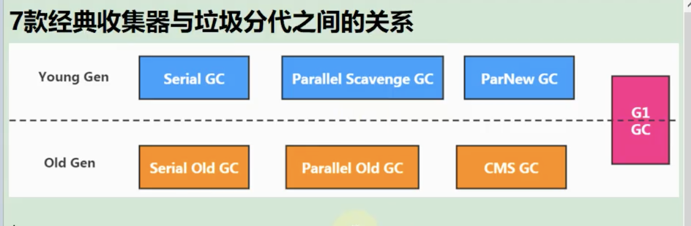
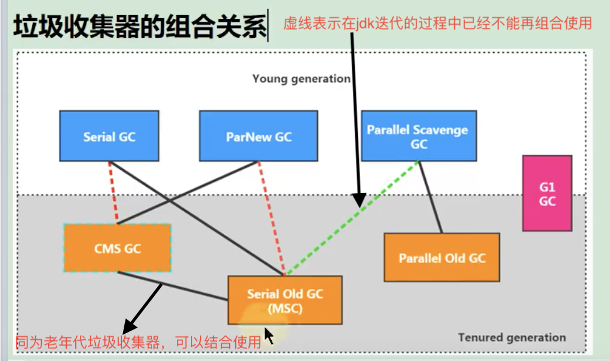

# 评价GC性能指标（吞吐量和暂停时间）
- 高吞吐量会让用户感觉只有应用程序在做"生产性工作"。直觉上吞吐量越高程序运行越快
- 低延迟必然会增加垃圾回收的执行频率，对于交互式的应用程序用户体验是非常不好的

不幸的是"高吞吐量"和"低延迟"是一个相互竞争的关系
    -> 高吞吐量优先，必然会降低内存回收执行频率。但是这样会导致GC需要更长的暂停时间执行内存回收
    -> 相反的，低延迟优先，降低了执行内存回收的暂停时间，但是频繁的内存回收，导致吞吐量下降

# 垃圾回收器
串行回收器：Serial(新生代)、Serial Old(老年代)
并行垃圾回收器：ParNew(新生代)、Parallel Scavenge(新生代)、Parallel Old(老年代)
并发回收器：CMS(老年代)、G1(新生代和老年代)

# Serial回收器
Serial收集器是最基本、历史最悠久的垃圾收集齐。jdk1.3之前回收新生代唯一的选择。
Serial采用复制算法、串行回收和'Stop-The-Word'机制的方式执行内存回收

# Serial Old回收器
Serial Old收集器是Client模式下默认的老年代垃圾收集器
Serial Old也采用串行回收和'Stop-The-Word'，只不过用的是标记-压缩算法
Serial Old在server模式下两个主要用途：
    1，与新生代Parallel Scavenge配合使用
    2，作为老年代CMS收集器的后备垃圾收集方案

优势：简单高效，对于限定单个cpu的环境，Serial收集器没有线程交互的开销，收集效率高

适用场景：在用户的桌面端应用中，可用内存一般不大（几十MB甚至几百MB），可以在较短时间内完成垃圾收集，只要不频繁发生

# ParNew回收器
相当于Serial收集器的多线程版本，除了采用并行回收外，和Serial几乎没有任何区别。采用复制算法和'Stop-The-Word'机制

是很多jvm在Server模式下新生代的默认垃圾回收器

可以和Serial Old搭配使用，也可以和CMS回收器搭配使用
    - 对于新生代，回收次数频繁，适用并行方式高效
    - 对于老年代，回收次数少，适用串行方式节省资源
    
适用场景：在多cpu环境下

# Parallel Scavenge（高吞吐量优先）
和ParNew一样，是并行垃圾回收器，采用复制算法和'Stop-The-Word'机制

那么是否多此一举呢？
    - 和ParNew收集器不同，Parallel Scavenge收集器目标是达到一个可控制的吞吐量
    - 自适应调节策略也是Parallel Scavenge收集器和ParNew回收器的一个重要区别
    
高吞吐量可以高效率的利用CPU时间，尽快完成程序的运算任务，主要适合后台运算而不需要太多的交互任务。因此，常见在服务器环境中。
例如，执行批量处理、订单处理、工资支付、科学计算的应用

Parallel在jdk1.6时提供了用于执行老年代收集器的Parallel Old，用来替代Serial Old收集器

Parallel Old采用标记-压缩算法，同样基于并行回收和'Stop-The-World'机制

参数设置：
    -XX:MaxGcPauseMillis：设置垃圾收集齐最大停顿时间
        -> 为了尽可能把停顿时间控制在MaxGcPauseMillis以内，收集器在工作时会调整Java堆大小或者其他参数
        -> 对于用户来说，停顿时间越短体验越好。但是在服务器端，我们注重高并发，整体吞吐量。所以服务器端更适合Parallel进行控制
        -> 这个参数设置须谨慎
    -XX:GCTimeRatio： 吞吐量，垃圾收集时间占总时间比例（=1/（N + 1））用于衡量吞吐量大小
        -> 取值范围（0，100）。默认值99，也就是垃圾回收时间不超过1%
        -> 与-XX:MaxGcPauseMillis具有矛盾性，暂停时间越长，-XX:GCTimeRatio参数就越容易超过设定比例
    -XX:UseAdaptiveSizePolicy：设置Parallel收集器自适应策略
        -> 这种模式下，年轻代大小、Eden和Survivor比例、今生老年代的对象年龄参数都会自动调整，已达到堆大小、吞吐量和停顿时间之间平衡点
        -> 手动调优比较困难的场合，可以直接使用这种自适应方式，仅仅指定虚拟机最大堆、目标吞吐量和停顿时间，让虚拟机自己完成调优工作
        
# CMS垃圾回收器
在jdk1.5，HotSpot推出了一款在强交互应用中几乎有划时代意义的垃圾回收器：CMS垃圾回收器。
这款收集器是HotSpot虚拟机中第一款真正意义上的并发收集器，它第一次实现了让垃圾收集器线程与用户线程同时工作

CMS的关注点是尽可能缩短垃圾收集时用户线程的停顿时间。停顿时间越短，越适合与用户交互的程序

CMS垃圾收集器采用标记-清除算法，并且也会'Stop-The-Word'

CMS整个过程比之前的收集器要复杂，分为四个主要阶段
    初始标记：
        程序中所有的工作线程将会因为'Stop-The-Word'机制出现短暂暂停，这个阶段主要任务仅仅是标记出GC Roots直接关联的对象。
        一旦标记完成就会恢复之前被暂停的所有引用线程，由于直接关联对象比较小，所以这里速度很快
    并发标记：
        从GC Roots直接关联对象开始遍历整个对象的过程，这个过程耗时长但是不需要停顿用户线程，可以与垃圾收集线程一起并发运行
    重新标记：
        由于并发标记阶段，程序工作线程会和垃圾收集线程同时运行，因此为了修正并发标记期间，因用户线程继续运作而导致标记产生变动的那一部分对象的标记记录
        这个阶段的停顿时间通常会比初始标记阶段长一些，但也远比并发标记阶段短   
    并发清除：
        清理删除掉标记阶段已经死亡的对象，释放内存空间。由于不需要移动存活对象，所以这个阶段也是可以和用户线程并发的
        
特点和弊端：
    由于最耗时的并发标记和并发清除阶段不需要暂停工作，所以整体回收是低停顿的
    由于垃圾收集阶段用户线程没有中断，所以在CMS回收过程中，还应该确保用户线程有足够的内存，因此CMS收集器不能像其他收集器那样等到老年代完全被填满再回收，而是当堆内存使用率达到某一值时就回收
    采用标记-清除算法会产生碎片，导致用户可用空间不足。无法分配大对象情况下提前出发Full GC
    CMS收集器对CPU资源敏感。在并发阶段虽然不会导致用户停顿，但是会因为占用了一部分线程导致应用程序变慢，吞吐量降低
    CMS收集器无法处理浮动垃圾。在并发标记阶段如果产生新的垃圾对象，CMS将无法对这些垃圾对象进行标记，最终导致这些新产生的垃圾对象不及时回收。从而只能在下一次GC时释放这些内存空间
    
为什么不使用标记-压缩算法？
    因为并发清楚的时候，如果使用压缩来整理内存的话，原来用户线程的内存怎么办呢

参数设置：
    -XX:+UseConcMarkSweepGC：手动指定CMS垃圾收集器
    -XX:CMSInitiatingOccupanyFraction：设置堆内存的阀值，一旦达到阀值便开始回收
        如果内存增长缓慢，则可以设置一个稍大的值，大的阀值可以有效的降低CMS的触发频率，减少老年代回收次数
        反之，如果应用程序使用频率增长很快，应该降低这个阀值，避免频繁触发老年代串行收集
    -XX:+UseCMSCompactAtFullCollection：用于指定执行完Full GC后对内存空间进行压缩整理，以此避免内存碎片产生。不过内存压缩整理无法触发并发，所带来的问题就是停顿时间变长了
    -XX:CMSFullGCsBeforeCompaction：设置在执行多少次Full GC后对内存空间进行压缩整理   
    -XX:ParallelCMSThreads：设置CMS线程数量
    
# 垃圾回收器应该怎么使用
如果想要最小化的使用内存和并行开销，选择Serial GC
如果想要最大化应用程序和吞吐量，选择Parallel GC
如果想要最小化GC的中断或停顿时间，选择CMS GC

# G1垃圾回收器
目标是在延迟可控的情况下获得尽可能高的吞吐量
特性：
    1.G1不同于之前的那些垃圾收集器分为连续的年轻代，老年代和永久代，而是分区（region），它将堆分为大大小小的区域（通常约为2048个），每个区域就是eden,survivor,old
    2.一般优先回收包含垃圾最多的区域，所以叫Garbage-First（G1）
    3.之前的垃圾收集器要么是新生代，要么是老年代，而G1兼顾年轻代和老年代
    4.可控性：因为G1可以选择回收部分区域，所以可以做到停顿时间的可控性

并发与并行：
    -> 并行性：G1在回收期间，可以有多个GC线程同时工作，有效利用多核计算能力。此时用户线程STW
    -> 并发性：G1拥有与应用程序交替执行的能力，部分工作可以和应用程序同时执行，因此一般来说，不会在整个回收阶段发生完全阻塞的情况
分代收集：
    -> G1属于分代型垃圾回收器，它会区分年轻代和老年代，年轻代依然有Eden和Survivor区，但是从堆结构上看，它不要求整个Eden、年轻代或者老年代是连续的，也不坚持固定大小和固定数量
    -> 将堆空间分为若干个区域，这些区域中包含了逻辑上的年轻代和老年代
    -> 和之前的垃圾回收器不同，它兼顾年轻代和老年代。对比其他回收器，或者工作在年轻代，或者工作在老年代
空间整合：   
    -> CMS：'标记-清除'算法、内存碎片、若干次GC后进行一次碎片整理
    -> G1将内存划分为一个个的region。内存回收是以region作为基本单位的。region之间是复制算法，但是整体上实际可以看作是"标记压缩算法"
    两种算法都可以避免产生内存碎片。这种特性有利于程序长时间运行，分配大对象时不会因为无法找到连续内存空间而触发下一次GC。尤其当Java堆非常大的时候，C1的优势更明显
可预测停顿时间模型
相对于CMS，G1除了追求低停顿外，还能建立可预测的停顿时间模型，能让使用者明确指定在一个长度M毫秒内，消耗在垃圾回收上的时间不超过N秒
    -> 由于分区的原因，G1可以只选取部分区域内存进行内存回收，这样缩小了回收范围，因此对于全局停顿情况的发生也能得到较好的控制
    -> G1跟踪各个region里面的垃圾堆积的价值大小（回收所获得的空间大小以及回收所需时间的经验值），后台维护一个优先列表，每次根据允许收集的时间
    优先收集价值最大的region。保证了G1垃圾收集器在有限时间内可以获得最高的收集效率
    -> 相比于CMS GC，G1未必能做到CMS在最好的情况下延时停顿，但是最差的情况要好很多
    
G1回收器缺点
    1，相较于CMS，G1还不具备全方位、压倒性优势。比如用户程序运行过程中，G1无论是为了垃圾收集产生的内存应用还是程序运行时的额外执行负载都比CMS高
    2，从经验上来说，在小内存应用上CMS的表现大概率会优于G1，而G1在大内存应用上则发挥其优势。平衡点在6-8GB之间

参数设置：
    -XX:+UseG1GC：手动指定使用G1收集器执行内存回收任务
    -XX:G1HeapRegionSize 设置每个Region的大小。值是2的幂，范围是1MB到32MB之间，目标是根据最小的Java堆大小划分出约2048个区域。默认堆内存的1/2000
    -XX:MaxGCPauseMills 设置期望达到的最大GC停顿时间指标（JVM会尽力实现，但不保证达到）。默认值是200ms
    -XX:ParallelGCThread 设置STW工作线程数。最多设置为8
    -XX:ConGcThreads 设置并发标记线程数。将n设置为并行垃圾回收线程数的1/4左右
    -XX:InitiatingHeapOccupancyPercent 设置触发并发GC周期的Java堆占用率阀值。超过此值就触发GC。默认值是45
    
G1垃圾回收器常见操作步骤：
    第一步：开启G1垃圾收集器
    第二步：设置堆的最大内存
    第三步：设置最大停顿时间
G1中提供了三种垃圾回收模式：YongGC、Mixed GC和Full GC，在不同条件下触发

适用场景：
    - 面向服务端应用，针对具有大内存、多处理器的机器。
    - 主要应用时需要GC延迟，并具有大堆的应用程序解决方案
    - 如：在堆大小约6GB或更大时，可预测的暂停时间可以低于0.5秒（G1通过每次只清理一部分而不是全部的region的增量式清理来保证每次GC停顿时间不会过长）
    - 用来替换掉JDK1.5中的CMS收集器；
        下面的情况使用G1比CMS更好
        1，超过50%的Java堆被活动数据占用
        2，对象分配频率或年代提升率变化很大
        3，GC停顿时间过长（长于0.5至1秒）
    - HotSpot垃圾收集器，除了G1外，其他的垃圾收集器使用内置的JVM线程执行GC的多线程操作。而G1 GC可以采用应用程序线程承担后台运行的GC工作，
    即当JVM的GC线程处理速度变慢时，系统会调用应用程序帮助加速垃圾回收过程
    
G1分区region：
    虽然还保留新生代和老年代的概念，但是新生代和老年代不再是物理隔离了，它们都是一部分region（不需要连续）的集合。
    通过region的动态分配方式实现逻辑上的连续
    一个region有可能属于Eden，Survivor或者old内存区域。但是一个region只能属于一个角色
    G1垃圾收集器还增加了一个新的内存区域，叫做Humongous内存区域，如图中的H块。主要用于存储大对象，如果超过了1.5个region，就放到H

G1垃圾回收器回收过程
    当年轻代的eden用尽时开始年轻代的回收过程：G1的年轻代收集阶段是一个并行的独占式收集器。在年轻代回收期，G1 GC暂停所有应用程序线程
    启动多线程执行年轻代回收。然后从年轻代区间移动存活对象到Survivor区间或者老年区间，也有可能是两个区间都会涉及。
    
    当堆内存使用达到一定值（默认45%）时，开始老年代并发标记过程
    
    标记完成马上开始混合回收。对于混合回收时期，G1从老年区间移动存活对象到空闲区间，这些空闲区间称为老年代的一部分。和年轻代不同，老年代的G1回收器和其他GC不同，
    G1的老年代收集器不需要整个老年代被回收，一次只需要扫描/回收一小部分老年代region就可以了。同时，这个老年代region和年轻代一起被回收的
    
G1回收器的名词：
    Remembered Set
        问题：
            一个对象被不同区域引用的问题
            一个对象不可能是孤立的，一个region中的对象可能被其他任意region中对象引用，判断对象存活时，是否需要扫描整个Java堆保证准确？
            回收新生代也不得不同时扫描老年代
            
        解决：
            无论是G1还是其他分代收集器，jvm都是使用Remembered Set来避免扫描全局
            每个region都有一个对应的remembered set
            每次reference类型数据写操作时，都会产生一个Write Barrier暂时中断操作，然后检查将要写入的引用指向的对象是否和该reference类型数据在不同的region（其他收集器：检查老年代对象是否引用了新生代对象）
            如果不同，通过CardTable把相关引用信息记录到引用指向对象的所在的region对应的remembered set中
            当进行垃圾收集时，在GC根节点的枚举范围进入remembered set，就可以保证不进行全局扫描，也不会有遗漏
    Collection Sets：
        GC中待回收的region的集合。CSet中可能存放着各个分代的Region。CSet中的存活对象会在gc中被移动（复制）。GC后CSet中的region会成为可用分区。
    Card Table
        Java虚拟机用了一个叫做CardTable(卡表)的数据结构来**标记老年代的某一块内存区域中的对象是否持有新生代对象的引用,**卡表的数量取决于老年代的大小和每张卡对应的内存大小，每张卡在卡表中对应一个比特位,当老年代中的某个对象持有了新生代对象的引用时,JVM就把这个对象对应的Card所在的位置标记为dirty(bit位设置为1)，这样在Minor GC时就不用扫描整个老年代，而是扫描Card为Dirty对应的那些内存区域。
    Humongous region：
        是G1中存放巨型对象的分区，巨型对象是指占用了region容量的50%以上的一个对象，如果一个H区装不下一个巨型对象，则会通过连续的若干H分区来存储。因为巨型对象的转移会影响GC效率，所以并发标记阶段发现巨型对象不再存活时，会将其直接回收。ygc也会在某些情况下对巨型对象进行回收。
    TLAB(Thread Local Allocation Buffer)本地线程缓冲区：
        由于对象一般分配在堆上，而堆是线程共用的，因此可能会有多个线程在堆上申请空间，而每一次的对象分配都必须线程同步，会使分配的效率下降。所以在线程初始化时，同时也会在eden区申请一块指定大小的内存，只给当前线程使用，这样每个线程都单独拥有一个空间，如果需要分配内存，就在自己的空间上分配，这样就不存在竞争的情况，可以大大提升分配效率。
    栈上分配：
        对于那些线程私有对象(指不可能被其他线程访问的对象)可以将它们打散分配在栈上，而不是分配在堆上，这样就不需要GC了，随着线程的销毁而回收。栈空间小，对于大对象无法实现栈上分配。栈上分配依赖于逃逸分析和标量替换 。
    Snapshot-At-The-Beginning(SATB)：
        SATB是在G1 GC在并发标记阶段使用的增量式的标记算法。SATB可以理解成在GC开始之前对堆内存里的对象做一次快照，此时活的对象就认为是活的，从而形成一个对象图
            
G1回收过程：
    1，年轻代GC：
        和其他垃圾收集器差不多，回收eden区，转移survivor区或者晋升年老的。区别是会动态调整新生代大小
    2，并发标记：
        主要是标记可回收对象，回收掉完全空闲的区域
        - 初始标记：标记从根节点可直接到达对象，会伴随一次ygc，STW
        - 根区域扫描：因为已经进行了ygc，所以只有survivor区有对象，扫描survivor区到老年代的引用（不能有ygc，必须等结束才行， 因为ygc会导致survivor区变化）
        - 并发标记：扫描并查找整个堆的存活对象，做好标记（可ygc，会中断标记过程）
        - 重新标记：STW，使用SATB，会在标记之初为存活对象创建一个快照，加快重新标记的速度
        - 独占清理：计算各个区域存活对象和回收比例并排序，识别可供混合回收的区域，更新RemeberedSet，该阶段给需要混合回收的区域做了标记，STW
        - 并发清理：识别并清理完全空闲的区域
    3.混合回收:
        并发标记周期，虽然有部分对象回收，但是总体上说，回收的比例是比较低的。
        混合回收不仅进行ygc，而且会回收之前标记出来垃圾最多的区域
    4.Full GC
        在混合回收过程中，当内存不足时也会触发Full GC
        ①.concurrent mode failure
        ②.大对象分配失败
        ③.晋升失败

垃圾回收器总结：
    怎么选择垃圾回收器？
    1，优先调整堆的大小让JVM自适应完成
    2，如果内存小于100M，使用串行收集器
    3，如果是单核、单机程序，并且没有停顿时间的要求，串行收集器
    4，如果是多CPU、追求低停顿时间，需快速响应，使用并发收集器
        官方推荐G1。现在的互联网项目基本使用G1
        
GC日志分析：
    内存分配与垃圾回收参数列表
    -XX:+PrintGC 输出GC日志
    -XX:+PrintGCDetails 输出GC详细日志
    -XXPrintGCTimeStamps 输出GC时间戳
    -XX:PrintGCDateStamps 输出GC时间戳（以日期的形式）
    -XX:+PrintHeapAtGC在进行GC前后打印出堆信息
    -Xloggc:../logs/gc.log 日志文件输出路径
    
日志说明：
    GC和Full GC说明了这次垃圾收集停顿类型，如果有Full则说明GC发生了stop the word
    使用serial收集器在新生代的名字是default new generation，因此显示DefNew
    使用ParNew收集器在新生代名字会变成ParNew，意思是Parallel New Generation
    使用Parallel Scavenge收集器在新生代的名字是PSToungGen
    老年代收集器和新生代道理一样，名字是由收集器决定的
    使用G1收集器会显示为gaebage-first heap  
    
    Allocation Failure
    表明本次引起GC的原因是年轻代没有足够的空间能存储新的数据了
    
    [PSYoungGen：5968K->696K(8704K)] 5968K -> 704K(9216K)
    中括号内：GC回收前年轻代大小，回收后大小，（年轻代总大小）
    括号外：GC回收前年轻代和老年代大小，回收后大小，（年轻代和老年代大小）
    
    user代表用户回收耗时，sys内核太回收耗时，rea实际耗时。由于多核原因，时间总和会超过real时间  

# 如何选择垃圾收回收器
1，优先调整堆的大小让JVM自适应完成
2，如果内存小于100M，使用串行收集器
3，如果是单核、单机程序，并且没有停顿时间要求的，使用串行收集器
4，如果是多CPU、需要吞吐量、允许停顿时间超过1秒，选择并行或者JVM自己选择
5，如果是多CPU、追求停顿时间、需要快速响应（比如延迟不能超过1秒，如互联网应用），使用并发收集器。
官方推荐G1，性能高。先在的互联网项目，基本都使用G1
特别说明：
    1，没有最好的收集器，更没有万能的收集
    2，调优永远针对特定的场景、特定的需求，不存在一劳永逸的收集器
