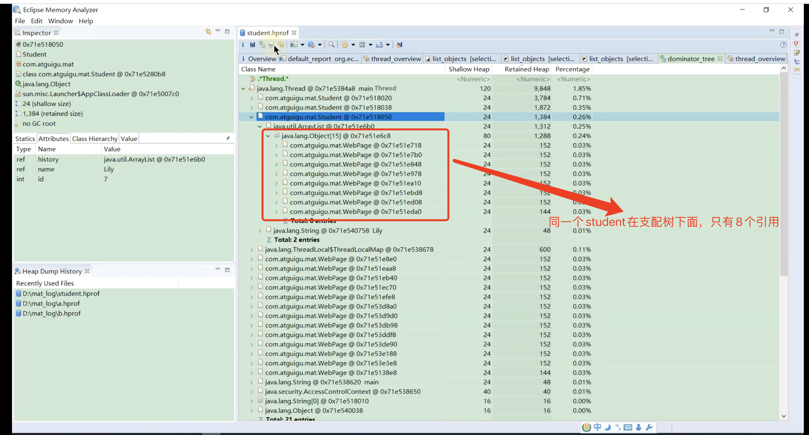

# 概述
MAT可以分析heap dump文件，在进行内存分析时，只要获得了反应当前设备的hprof文件，就可以通过MAT打开，可以直观的看到当前内存信息

一般来说，这些内存信息包括：
1，所有的对象信息，包括对象实例、成员变量、存储与栈中的基本类型值和存储与堆中的其他对象引用值
2，所有的类信息，包括ClassLoader、类名称、父类、静态变量
3，GCRoot到所有这些对象的引用路径
4，线程信息，包括线程的调用栈以及此线程的局部变量

# 两点说明：
说明1
    MAT不是一个万能的工具，它并不能处理所有类型的堆转储文件。但是比较主流的厂家和格式，例如Sun、HP、SAP所采用的.hprof二进制堆转储文件
    以及IBM的PHD堆转储文件等都能被很好的解析
说明2
    最吸引人的还是能够快速为开发人员生成内存泄漏报表，方便定位问题和分析问题。虽然MAT有如此强大的功能，但是内存分析也没有简单到一键就能完成
    很对内存问题还是需要我们从MAT展现给我们的信息中通过经验和直觉判断才能发现

# Histogram
展示的是内存中加载的类，包括类的数目、浅堆大小、深堆大小

# thread overview
这里面存放的是系统中的Java线程，
注意：每个对象下面包含的是，该线程所有的引用对象
可以通过右键查看一个对象的：
    with outgoing references：由此对象发散出去的引用对象，即该对象包含的引用对象
    with incoming reference：由此对象传入的引用对象，即那些引用了该对象的对象集合

# 浅堆和深堆

# 浅堆
浅堆表示一个Java对象结构所占的内存大小，这个Java对象包含了三部分数据：
对象头、实例数据和对其填充

1，对象头
    一个对象分为三部分：对象头、实例数据、对其填充。
    对象头又包含两部分：标记部分和原始对象引用
    （1）标记部分：
    包括hashcode、gc分代年龄、锁状态标志线程持有锁，偏向锁id，偏向时间戳
    这一部分在32位机器上为4byte，64位机器上为8byte，一般来说我们的机器都是64位，所以默认8字节
    （2）原始对象引用：
    是这个对象的指针，通过指针找到对象的实例，该指针可以压缩，为4byte
2，实例数据
    指的就是我们的对象实例
    
    注意：对象引用占4个字节，跟具体数据没有关系
3，对其填充
    java中的对象都是以8个字节为单位对齐，所以每一个java对象的大小都是8的整数倍。
# 深堆
深堆指对象保留集中所有的对象和浅堆大小之和，即一个Java对象被GC回收后，可以真是释放内存的大小。
1，保留集
    对象A的保留集指当对象A被垃圾回收后，可以释放的所有对象集合（包括A对象本身）
    即A对象可以被认为是**只能通过**对象A直接或间接访问到的对象集合
    

# dominator tree

由此可以看出支配树的作用，显示的其实是保留集的引用对象。

使用教程链接：https://blog.csdn.net/itomge/article/details/48719527