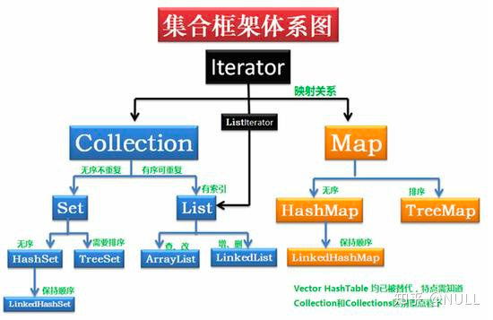
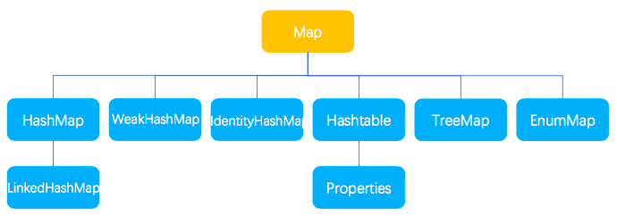
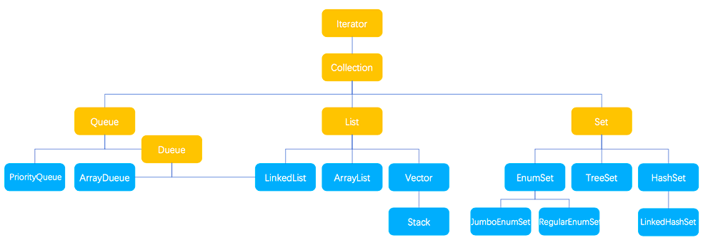
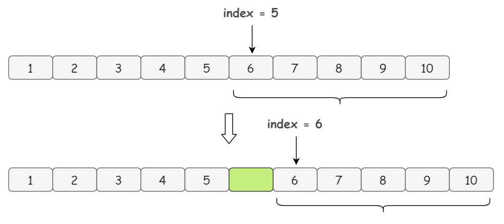
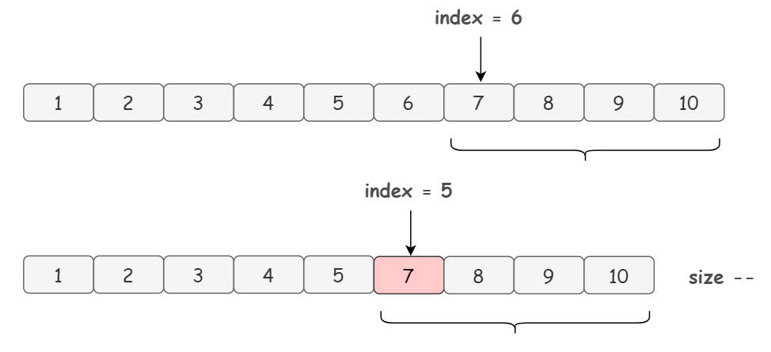
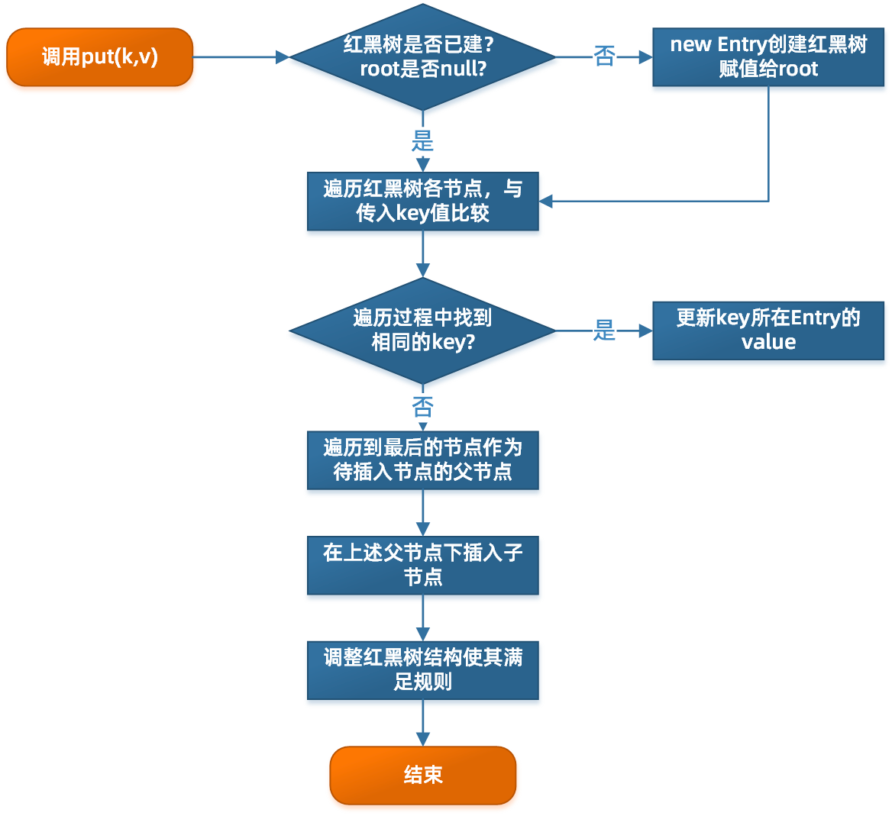

# 常见的集合有哪些？




# List集合下面
## ArrayList
特点：
    查询效率高，增删效率低，线程不安全
内部实现
    是数组实现的，适合随机查找和遍历，不适合插入和删除。
    如果我们创建数组的时候，不在构造函数中设置容量，那么它的数组默认容量就是10。
    当ArrayList其实是不对数组设置容量的，默认是一个空数组。
    只有真正对数据进行添加add时，才分配默认DEFAULT_CAPACITY = 10的初始容量。
扩容机制
    扩容分为两种方式，一种是直接新增，另一种是执行index新增
    在这之前他会有一步校验长度的判断ensureCapacityInternal，就是说如果长度不够，是需要扩容的
    扩容的时候会将容量扩展为当前容量的1.5倍，这里采用位运算提高效率：newCapacity = oldCapacity + (oldCapacity >> 1)
    会先创建一个新的数组，然后把原数组中的数据拷贝过来。
ArrayList插入数据
    这里指的是在指定位置插入数据，比如说在头部插入数据。
    比如我们想要在 index = 5 的位置插入元素
    
    这里会复制一个，是从index 5的位置开始到末尾的数组，然后把它放在了index 5+1的位置
    复制的时候会为我们要插入的元素腾出位置，然后新数组 index = 5 的位置放入元素 element就可以了
    显然，不用多说，ArrayList 的将数据插入到指定位置的操作性能非常低下，因为要开辟新数组复制元素啊，要是涉及到扩容那就更慢了。
ArrayList删除指定位置数据
    
    如图，假设我们要删除数组的 index = 5 的元素。
    代码他就复制一个index5+1开始到最后的数组，然后把它放到index开始的位置
ArrayList插入删除一定慢么？
    取决于他要插入或者删除的元素里末尾的距离
ArrayList线程安全问题
    线程不安全，用Collections.synchronizedList把一个普通ArrayList包装成一个线程安全版本的数组容器也可以
    原理同Vector是一样的，就是给所有的方法套上一层synchronized。
# LinkList
特点：
    他比较适合数据的动态插入或者删除
内部实现：
    LinkedList 是用双向链表结构存储数据的，增删数据的时候只需要改变节点之间的关系即可所以比较快
    另外，它还提供了专门用于操作表头和表尾元素的方法，可以当作堆栈、队列和双向队列使用
插入的时候：
    先是在双向链表中找到要插入节点的位置index，找到之后，再插入一个新节点。然后改变节点之间的关系。
    双向链表查找index位置的节点时，有一个加速动作：若index < 双向链表长度的1/2，则从前向后查找; 否则，从后向前查找。
删除的时候
    先是在双向链表中找到要插入节点的位置index，然后改变节点之间的关系
查询元素的时候：
    同上会有一个查询优化的动作
# Vector
Vector 与 ArrayList 一样，也是通过数组实现的。
它是线程安全的，它给所有的方法套上一层synchronized，即某一时刻只有一个线程能够写Vector


# Set接口下面的
## HashSet
底层实现
    基于hashmap实现的，默认构造函数是构建一个初始容量为16，负载因子为0.75的hashmap
    所有放在 hashset中的集合元素实际上由 hashmap的key来保存，value则存储了一个PRESENT的静态object对象
    后续的所有操作都是基于hashmap实现的
如何检查重复
    当你把对象加入HashSet时，HashSet会先计算对象的hashcode值来判断对象加入的位置
    同时也会与其他加入的对象的hashcode值作比较，如果没有相符的hashcode，HashSet会假设对象没有重复出现
    但是如果发现有相同hashcode值的对象，这时会调用equals（）方法来检查hashcode相等的对象是否真的相同。
    如果两者相同，HashSet就不会让加入操作成功
    通常来说，所有参与计算 hashCode() 返回值的关键属性，都应该用于作为 equals() 比较的标准。
## TreeSet
底层实现
    TreeSet()是基于TreeMap，添加的数据存入了map的key的位置，而value则固定是PRESENT的静态object对象
排序
    TreeSet中的元素支持2种排序方式：自然排序 或者 根据创建TreeSet 时提供的 Comparator 进行排序。这取决于使用的构造方法。
    Integer 和 String 对象都可以进行默认的 TreeSet 排序，而自定义类的对象是不可以的
    自己定义的类必须实现Comparable 接口，并且覆写相应的 compareTo()函数，才可以正常使用
## EnumSet
特点：
    与TreeSet/HashSet不同，EnumSet是一个抽象类，不能直接通过new新建，不过，EnumSet提供了若干静态工厂方法，可以创建EnumSet类型的对象
    EnumSet是用于枚举类型的专用Set实现，EnumSet中的所有元素必须来自单个枚举类型
原理：
    EnumSet是使用位向量实现的，什么是位向量呢？就是用一个位表示一个元素的状态，用一组位表示一个集合的状态，每个位对应一个元素，而状态只可能有两种。
    譬如一个枚举类 DemoEnum 有6个枚举值，则 EnumSet<DemoEnum> 集合就可以通过一个 byte 字节从右到左（二进制低到高位）来表示
    不用的位上用 0 填充，用的位上每个 bit 位代表一个枚举值，1 表示包含该枚举值，0 表示不含该枚举值。
## LinkedHashSet
特性：
    LinkedHashSet是HashSet的一个“扩展版本”，会维护“插入顺序”
原理：
    底层使用了LinkedHashMap，在HashSet的哈希表数据结构基础之上，增加了一个双向链表用来记录元素添加的顺序


# Map接口下面的
## HashMap
特性：
    HashMap存储键值对实现快速存取，key值不可重复，若key值重复则覆盖。
存储结构
    HashMap是数组+链表/红黑树
    主干是一个Entry数组
    每个数组元素上都一个链表结构，当数据被Hash后，得到数组下标，把数据放在对应下标元素的链表上
2，如何存数据
    例如程序执行下面代码：
    ```
    map.put("美团","小美");
    ```
    1, 系统将调用"美团"这个key的hashCode()方法得到其hashCode 值
    2, 然后再通过Hash算法的后两步运算（高位运算和取模运算）来定位该键值对的存储位置
    3, 哈希桶数组table的长度length大小必须为2的n次方
3，哈希冲突
    哈希是通过对数据进行再压缩，提高效率的一种解决方法。
    但由于通过哈希函数产生的哈希值是有限的，而数据可能比较多。
    导致经过哈希函数处理后仍然有不同的数据对应相同的值。这时候就产生了哈希冲突。
    Hash碰撞，也就是两个key的hash值相同
4，怎么解决哈希冲突
    Hash算法计算结果越分散均匀，Hash碰撞的概率就越小，map的存取效率就会越高。
    如果哈希桶数组很大，即使交差的算法也会比较分散，如果哈希桶数组数组很小，即使好的Hash算法也会出现较多碰撞
    所以就需要在时间和空间成本之间权衡，所以就有了扩容机制。定义好哈希桶数组的初始化长度为16，负载因子为0.75
    数组占用超过负载因子，就进行扩容为原来的两杯。
    当哈希冲突越来越多的时候，哈希冲突的概率就越来越大，链表的长度就越长，性能就越低
    在JDK1.8之后，当线性链表的长度超过8之后，就把线性链表转为红黑树，提高效率
5，HashMap为什么使用数组？
    数组在有下标的情况下时间复杂度是O(1)，通过对象的hashcode取余数组的长度得到对象在数组中下标的位置，使查找某个对象所在位置的时间复杂度降低为O(1)。
6，为什么超过8才转变为红黑树？长度8的由来？
    因为统计学角度，一般很少hash的碰撞值会达到7.
7，为什么红黑树转链表的阈值为6？
    hash的碰撞值会达到7，如果hash碰撞次数在8附近徘徊，会一直发生链表和红黑树的转化，为了预防这种情况的发生。
8，Hashmap长度保证2的n次幂？
    Hashmap默认初始长度16，后续每次加入的值都是2的指数次幂的值。
    如果传入的值不是2的指数次幂，则变成大于这个值的最接近的2的指数次幂的值。
    因为在计算hash位置的时候，不是用取模，而是使用二进制按位与，然后计算hash值对应的值
    取模运算很消耗时间，位运算效率高。
9，负载因子默认为0.75f？
    在统计学角度，空间利用率和时间效率在0.75的时候达到了平衡。
## LinkedHashMap
特性：
    它会维护插入顺序
原理：
    它的底层就是HashMap+双向链表。
    每个节点增加了两个属性，before引用 和 after 引用。这两个属性将我们的节点串联起来成为一个双向链表。
    链表节点按照访问时间进行排序，最近访问过的链表放在链表尾
## TreeMap
特性：
    它能够将传入的记录根据键进行排序，key 必须实现 Comparable 接口，或者构造 TreeMap 传入自定义的Comparator
原理：
    
    1，遍历红黑树的各节点与传入的Key值比较
    2，找到key值，那么就更新所在Entry的value
    3，如果没有，那么就遍历到最后节点，作为待插入节点的父节点
    4，在上述父节点下插入子节点
    5，调整规则让红黑树满足结构
红黑树的特点：
    1，根节点是黑色
    2，每个节点都只能是红色或者黑色
    3，每个叶节点（null节点，空节点）是黑色的。
    4，如果一个结点是红的，则它两个子节点都是黑的。也就是说在一条路径上不能出现相邻的两个红色结点。
    5，从任一节点到其每个叶子的所有路径都包含相同数目的黑色节点。
    面的约束强制了红黑树的关键性质：从根到叶子的最长的可能路径不多于最短的可能路径的两倍长。因此这棵树大致上是平衡的。
## HashTable
特性：
    也是用于键值的存取，不过他是线程安全的。
原理：
    底层是数组 + 单向链表。


# 集合底层实现
ArrayList底层是数组。
LinkedList底层是双向链表。
HashMap底层与HashTable原理相同，Java 8版本以后如果同一位置哈希冲突大于8则链表变成红黑树。
HashTable底层是链地址法组成的哈希表（即数组+单项链表组成）。
HashSet底层是HashMap。
LinkedHashMap底层修改自HashMap，包含一个维护插入顺序的双向链表。
TreeMap底层是红黑树。
LinkedHashSet底层是LinkedHashMap。
TreeSet底层是TreeMap。


## 默认的初始化长度是多少？
在JDK中默认长度是16，并且默认长度和扩容后的长度都必须是 2 的幂。

## 构造方法中初始容量、加载因子的理解
初始容量代表了哈希表中桶的初始数量，即 Entry< K,V>[] table 数组的初始长度
加载因子是哈希表在其容量自动增加之前可以达到多满的一种饱和度百分比，其衡量了一个散列表的空间的使用程度，负载因子越大表示散列表的装填程度越高，反之愈小。


# LinkHashSet
## 底层实现
它继承与 HashSet 、又基于 LinkedHashMap 来实现的。
底层使用LinkedHashMap来储存数据，它又继承HashSet，其所有的方法与HashSet相同

# ConcurrentHashMap
## 底层实现
ConcurrentHashMap与HashMap的思路差不多，但是因为它支持并发，所以要复杂一些。
ConcurrentHashMap由一个个的Segment组成，是一个Segment数组，Segment通过继承
ReentrantLock来进行加锁，所以只要保证了Segment线程是安全的，那么全局的线程就是安全的

# HashTable
HashTable是一个遗留类，很多的映射功能与HashMap类似。
它通过在put、get、size 等各种方法加上“synchronized” 锁来保证安全。
这就导致了所有的并发都来竞争同一把锁，一个线程操作的时候其他的只能等待。
效率极低。


# LinkHashMap
LinkedHashMap 是 HashMap 的一个子类， 保存了记录的插入顺序。
在用 Iterator 遍历LinkedHashMap 时，先得到的记录肯定是先插入的，也可以在构造时带参数，按照访问次序排序。

# HashMap与HashTable
HashMap没有考虑同步，是线程不安全的；Hashtable使用了synchronized关键字，是线程安全的；
HashMap允许K/V都为null；后者K/V都不允许为null；

# ConcurrentHashMap和Hashtable的区别？
ConcurrentHashMap 结合了 HashMap 和 HashTable 二者的优势。HashMap 没有考虑同步，HashTable 考虑了同步的问题。但是 HashTable 在每次同步执行时都要锁住整个结构。 ConcurrentHashMap 锁的方式是稍微细粒度的。

# ConcurrentHashMap实现原理
- JDK1.7 : 【数组（Segment） + 数组（HashEntry） + 链表（HashEntry节点）】
ConcurrentHashMap（分段锁） 对整个桶数组进行了分割分段(Segment)，每一把锁只锁容器其中一部分数据，多线程访问容器里不同数据段的数据，就不会存在锁竞争，提高并发访问率。
Segment是一种可重入锁ReentrantLock，在ConcurrentHashMap里扮演锁的角色，HashEntry则用于存储键值对数据。

- JDK1.8 : Node数组+链表 / 红黑树
利用CAS+Synchronized来保证并发更新的安全，底层依然采用数组+链表+红黑树的存储结构。

# ArrayList 和 Vector 的区别
Vector 是线程安全的,ArrayList 是线程不安全的。
Vector在数据满时增长为原来的两倍，而 ArrayList在数据量达到容量的一半时,增长为原容量的1.5倍。

# ArrayList和LinkedList的区别？
LinkedList基于链表的数据结构；ArrayList基于动态数组的数据结构
LinkedList 在插入和删除数据时效率更高，ArrayList 查询效率更高；

# 红黑树
红黑树是一种特殊的二叉查找树

- 根节点是黑色的；
- 每个叶子节点（NIL）是黑色，这里叶子节点是为空 NIL 或者 NULL 的叶子节点
- 如果一个节点是红色的，则它的子节点必须是黑色的
- 每个节点，从该节点到达其可达叶子节点的所有路径，都包含相同数目的黑色节点（[确保没有一条路径会比其他路径长出俩倍，所以红黑树是相对接近平衡的二叉树的！]）
- 在对红黑树进行添加或删除之后，都会用到旋转方法，使其保持红黑树的特性

红黑树是相对平衡的二叉树
可以快速的增删改查

# Comparable和Comparator
Comparable 是排序接口。若一个类实现了Comparable接口，就意味着“该类支持排序”。
接口中通过x.compareTo(y)来比较x和y的大小。若返回负数，意味着x比y小；返回零，意味着x等于y；返回正数，意味着x大于y。

Comparator 是比较器接口。我们若需要控制某个类的次序，而该类本身不支持排序(即没有实现Comparable接口)；
那么，我们可以建立一个“该类的比较器”来进行排序。这个“比较器”只需要实现Comparator接口即可。也就是说，我们可以通过“实现Comparator类来新建一个比较器”，然后通过该比较器对类进行排序。

Comparable相当于“内部比较器”，而Comparator相当于“外部比较器”。

Comparable
```
public class User implements Serializable, Comparable<User> {
    private static final long serialVersionUID = 1L;
    private int age;
    private String name;
    public User (){}
    public User (int age, String name){
        this.age = age;
        this.name = name;
    }
    public int getAge() {
        return age;
    }
    public void setAge(int age) {
        this.age = age;
    }
    public String getName() {
        return name;
    }
    public void setName(String name) {
        this.name = name;
    }
    @Override
    public int compareTo(User o) {
        return this.age - o.age;
    }
    @Override
    public String toString() {
        return "[user={age=" + age + ",name=" + name + "}]";
    }
}
```

Comparator
```
public class MyComparator implements Comparator<User> {
    @Override
    public int compare(User o1, User o2) {
        return o1.getName().charAt(0)-o2.getName().charAt(0);
    }
}
```

测试main
```
public class Main {
    public static void main(String[] args) {
        User u1 = new User(12, "xiaohua");
        User u2 = new User(10, "abc");
        User u3 = new User(15,"ccc");
        User[] users = {u1,u2,u3};
        System.out.print("数组排序前：");
        printArray(users);
        System.out.println();
        Arrays.sort(users);
        System.out.print("数组排序1后：");
        printArray(users);
        System.out.println();
        Arrays.sort(users, new MyComparator());
        System.out.print("数组排序2后：");
        printArray(users);
        System.out.println();
        Arrays.sort(users, Comparator.reverseOrder());// 针对内置的排序进行倒置
        System.out.print("数组排序3后：");
        printArray(users);
    }
    public static void printArray (User[] users) {
        for (User user:users) {
            System.out.print(user.toString());
        }
    }
}
```

# 迭代器
为什么要使用迭代器
集合无非就是一个存储和获取这样的一个过程。
在集合取出的过程中，不同的集合有不同类型的编程规范。
想要编写一套通用的代码，用于不同类型的集合，这时就可以使用迭代器

# ListIterator
ListIterator是继承自Iterator
ListIterator 是一个更强大的 Iterator 子类型，它只能由各种 List 类生成。 Iterator 只能向前移动，而 ListIterator 可以双向移动。


# Iterator和Iterable
Iterator是迭代器接口，用来迭代集合
Iterable是一个接口，用来约束一个类是否可以进行迭代


# 空间复杂程度
对一个算法在运行过程中临时占用存储空间大小的量度，比如：
1，一般的递归算法就要有O(n)的空间复杂度了
2，直接插入排序的时间复杂度是O(n^2),空间复杂度是O(1) 

# 怎么确保一个集合不能被修改？
可以使用 Collections. unmodifiableCollection(Collection c) 方法来创建一个只读集合，这样改变集合的任何操作都会抛出 Java. lang. UnsupportedOperationException 异常。


# hashCode（）与equals（）
hashCode是jdk根据对象的地址或者字符串或者数字算出来的int类型的数值
1，如果两个对象相等，则hashcode一定也是相同的
2，两个对象有相同的hashcode值，它们也不一定是相等的
3，两个对象相等,对两个equals方法返回true


