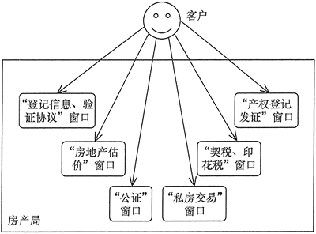

http://c.biancheng.net/design_pattern/
# 设计模式六大原则
单一原则
    概括：一个类只干一件事，实现类要单一
    目的：便于理解，提高代码的可读性
    就是说一个类，应该只有一个引起它变化的原因
    比如一个Activity既有bean文件，又有http请求，还有adapter等等，这样导致我们需要更改任何一个东西的时候都会导致Activity改变
开放封闭原则
    概括：对扩展开放，对修改关闭
    目的：降低维护带来的新风险
    类、模块、函数应该是可以扩展的，但是不可修改。对于扩展是开放的，对于修改是封闭的。
里氏替换原则
    概括：不要破坏继承体系，子类重写方法功能发生改变，不应该影响父类方法的含义
    目的：防止继承泛滥
    子类可以扩展父类的功能，但是不能改变父类原有的功能。也就是说尽量不要重写父类的方法
依赖倒置原则
    概括：高层不应该依赖底层，要面向接口编程
    目的：便于代码结构升级扩展
    高层模块不应该依赖底层模块，两者都应该依赖其抽象；抽象不应该依赖细节，细节不该依赖抽象
    依赖倒置原则是实现开闭原则的重要途径之一，它降低了客户与实现模块之间的耦合
    目的是通过面向接口编程来降低类间的耦合性，所以我们在实际编程中只需要遵循一下4点即可：
        1，每个类尽量提供接口或抽象类，或者两者都具备
        2，变量的声明类型尽量是接口或者抽象类
        3，任何类都不应该从具体类派生
        4，使用继承时尽量遵循里氏替换原则
接口隔离原则
    概括：一个接口要干一件事儿，接口要精简单一
    目的：功能解耦、高聚合、低耦合
迪米特法则
    概括：不该知道的不要知道，一个类应该保持对其他对象的对少了解，降低耦合度
    目的：只和朋友交流，不和陌生人说话，减少代码臃肿
    实现：
        1，从依赖者角度，只依赖应该依赖的对象
        2，从被依赖者角度，只暴露该暴露的方法
        3，在类的划分上，应该创建弱耦合类。类与类之间的耦合越弱，就越有利于实现可服用的目标
        4，在类的结构设计上，尽量降低类成员的访问权限
        5，在类的设计上，优先考虑将一个类设置成不变类
        6，在对其他类的引用上，将引用其他对象的次数降到最低
        7，不暴露成员属性，而应该提供相应的访问器
        8，谨慎使用序列化功能
合成复用原则
    概括：尽量使用组合或者聚合关系实现代码复用，少使用继承
    目的：降低代码耦合度
    通常类的复用分为继承复用和合成复用两种，继承复用虽然有简单和易实现的优点，但它也存在以下缺点。
    继承复用破坏了类的封装性。因为继承会将父类的实现细节暴露给子类，父类对子类是透明的，所以这种复用又称为“白箱”复用。
    子类与父类的耦合度高。父类的实现的任何改变都会导致子类的实现发生变化，这不利于类的扩展与维护。
    它限制了复用的灵活性。从父类继承而来的实现是静态的，在编译时已经定义，所以在运行时不可能发生变化。
    采用组合或聚合复用时，可以将已有对象纳入新对象中，使之成为新对象的一部分，新对象可以调用已有对象的功能，它有以下优点。
    它维持了类的封装性。因为成分对象的内部细节是新对象看不见的，所以这种复用又称为“黑箱”复用。
    新旧类之间的耦合度低。这种复用所需的依赖较少，新对象存取成分对象的唯一方法是通过成分对象的接口。
    复用的灵活性高。这种复用可以在运行时动态进行，新对象可以动态地引用与成分对象类型相同的对象。
    
    
# 单例模式
目的：
    保证一个类在内存中的对象的唯一性，比如一些常用的工具类、线程池、缓存、数据库、账户登陆系统、配置文件等只允许我们创建一个对象，
    一方面创建多个对象可能引起程序错误，另一方面造成资源浪费
写法：
    1,饿汉式
        ```
        public class Singleton {
        	private static Singleton instance=new Singleton();
        	private Singleton(){};
        	public static Singleton getInstance(){
        		return instance;
        	}
        }
        ```
        优点：这种方式实现简单，类加载的时候完成了实例化，避免了线程同步
        缺点：没有懒加载的效果，或造成内存浪费，但是也是推荐使用的
    2,懒汉式：
        ```
        public class Singleton {
        	private static Singleton instance=null;
        	private Singleton() {};
        	public static Singleton getInstance(){
        		if(instance==null){
        			instance=new Singleton();
        		}
        		return instance;
        	}
        }
        ```
        这样的话会有线程安全的问题
            如果有多个线程调用getInstance获取对象，有可能第一个线程执行if(instance==null)时，此时instance为null进入语句。
            在没有执行instance=new Singleton()时，第二个线程也进入if(instance==null)判断instance为null，所以会生成两个对象
        解决：
            ```
            public class Singleton {
            	private static Singleton instance=null;
            	private Singleton() {};
            	public static synchronized Singleton getInstance(){
            		if(instance==null){
            			instance=new Singleton();
            		}
            		return instance;
            	}
            }
            ```
            缺点：效率太低了
        懒汉式变种，属于懒汉式中最好的写法，保证了：延迟加载和线程安全
            ```
            public class Singleton {
            	private static Singleton instance=null;
            	private Singleton() {};
            	public static Singleton getInstance(){
            		 if (instance == null) {  
            	          synchronized (Singleton.class) {  
            	              if (instance == null) {  
            	            	  instance = new Singleton();  
            	              }  
            	          }  
            	      }  
            	      return instance;  
            	}
            }
            ```
    3,内部类：
        ```
        public class Singleton{
        	private Singleton() {};
        	private static class SingletonHolder{
        		private static Singleton instance=new Singleton();
        	} 
        	public static Singleton getInstance(){
        		return SingletonHolder.instance;
        	}
        }
        ```
        这种方式跟饿汉式方式采用的机制类似，但又有不同。两者都是采用了类装载的机制来保证初始化实例时只有一个线程。不同
        的地方在饿汉式方式是只要Singleton类被装载就会实例化，没有Lazy-Loading的作用，而静态内部类方式在Singleton类被装载时
        并不会立即实例化，而是在需要实例化时，调用getInstance方法，才会装载SingletonHolder类，从而完成Singleton的实例化。
        类的静态属性只会在第一次加载类的时候初始化，所以在这里，JVM帮助我们保证了线程的安全性，在类进行初始化时，别的线程是
        优点：避免了线程不安全，延迟加载，效率高。
    4,枚举
        ```
        class Resource{
        }
        public enum SomeThing {
            INSTANCE;
            private Resource instance;
            SomeThing() {
                instance = new Resource();
            }
            public voided method() {
                //Resource就类似于网络连接、数据库连接、线程池等等，这里做处理后返回
            }
        }
        ```
        访问方式：SingletonEnum.INSTANCE.method();
        首先，在枚举中我们明确了构造方法限制为私有，在我们访问枚举实例时会执行构造方法，同时每个枚举实例都是static final类型的，也就表明只能被实例化一次。在调用构造方法时，我们的单例被实例化。
        也就是说，因为enum中的实例被保证只会被实例化一次，所以我们的INSTANCE也被保证实例化一次。 
        

# 工厂模式
    1，简单工厂模式（又叫静态工厂方法模式）
    示例：
        我们创建一个电脑的抽象产品类，他有一个抽象方法用于启动电脑：
        public abstract class Computer {
            public abstract void start();
        }
        
        接着我们创建各个品牌的电脑，他们都继承了他们的父类Computer ，并实现了父类的start方法：
        public class LenovoComputer extends Computer{
            @Override
            public void start() {
                System.out.println("联想电脑启动");
            }
        }
        public class HpComputer extends Computer{
            @Override
            public void start() {
                System.out.println("惠普电脑启动");
            }
        }
        public class AsusComputer extends Computer {
            @Override
            public void start() {
                System.out.println("华硕电脑启动");
            }
        }
        接下来创建一个工厂类，它提供了一个静态方法createComputer用来生产电脑。你只需要传入你想生产的电脑的品牌，它就会实例化相应品牌的电脑对象：
        public class ComputerFactory {
            public static Computer createComputer(String type){
                Computer mComputer=null;
                switch (type) {
                    case "lenovo":
                        mComputer=new LenovoComputer();
                       break;
                    case "hp":
                        mComputer=new HpComputer();
                        break;
                    case "asus":
                        mComputer=new AsusComputer();
                        break;
        
                }
                return mComputer;
            }
        }
     优点：它提供了专门的工厂类用于创建对象，客户端无需知道具体创建什么对象，只需要传入参数即可
     缺点：系统扩展困难，一旦添加新对象，就需要修改工厂逻辑，破坏了'开闭原则';
          简单工厂模式由于使用了静态工厂方法，造成工厂角色无法形成继承的等级结构;
    2，工厂方法模式
        主要角色：
            1，抽象工厂：提供创建产品的工厂，调用者通过访问具体工厂的工厂方法newProduct()来创建产品
            2，具体工厂：主要实现抽象工厂中的抽象方法，完成具体产品创建
            3，抽象产品：定义了产品规范，描述产品的主要特性和功能
            4，具体的产品：实现了抽象产品所定义的借口，有具体的工厂创建
        示例：
            //抽象工厂：提供了厂品的生成方法
            interface CarFactory {
                public Product createCar();
            }
            //具体工厂：实现了厂品的生成方法
            class BenchiFactory implements AbstractFactory {
                public car createCar() {
                    System.out.println("生产奔驰汽车");
                    return new BenchiCar();
                }
            }
            //具体工厂：实现了厂品的生成方法
            class BaomaFactory implements AbstractFactory {
                public Product createCar() {
                    System.out.println("生产宝马汽车");
                    return new BaomaCar();
                }
            }
            //抽象产品：提供了产品的接口
            interface car {
                public void show();
            }
            //具体产品1：实现抽象产品中的抽象方法
            class BenchiCar implements car {
                public void show() {
                    System.out.println("展示奔驰汽车参数......");
                }
            }
            //具体产品2：实现抽象产品中的抽象方法
            class BaomaCar implements car {
                public void show() {
                    System.out.println("展示宝马汽车参数......");
                }
            }
        优点：用户只需要知道具体工厂的名称就可得到所要的产品，无须知道产品的具体创建过程。
             灵活性增强，对于新产品的创建，只需多写一个相应的工厂类。
             典型的解耦框架。高层模块只需要知道产品的抽象类，无须关心其他实现类，满足迪米特法则、依赖倒置原则和里氏替换原则。
        缺点：类的个数容易过多，增加复杂度；
             增加了系统的抽象性和理解难度；
             抽象产品只能生产一种产品，此弊端可使用抽象工厂模式解决。
    3，抽象工厂模式
    抽象工厂模式是工厂方法模式的升级版本，工厂方法模式只生产一个等级的产品，而抽象工厂模式可生产多个等级的产品。
    使用抽象工厂模式一般要满足以下条件。
        系统中有多个产品族，每个具体工厂创建同一族但属于不同等级结构的产品。
        系统一次只可能消费其中某一族产品，即同族的产品一起使用。
    抽象工厂模式除了有工厂方法模式的优点外，其他优点如下：
        可以在类的内部对产品中相关联的多级产品共同管理，而不必专门引入新的类进行管理；
        当需要产品族组，抽象工厂可以保证客户端始终只使用一个产品的产品组
        抽象工厂增强了程序的可扩展性，当增加一个新的产品族时，不需要修改原代码，满足开闭原则。
    缺点：
        当产品族中需要增加一个新的产品时，所有的工厂类都需要进行修改。增加了系统的抽象性和理解难度。
    抽象工厂主要角色：
        抽象工厂：提供了创建产品的接口，包含多个创建产品的方法，可以创建不同等级的产品
        具体工厂：主要实现抽象工厂中的多个抽象方法，完成具体产品的创建
        抽象产品：定义了产品规范，描述了产品的主要特性和功能，抽象工厂模式有多个抽象产品
        具体产品：实现了抽象产品角色定义的接口，由具体的工厂来创建，它同具体工厂之间是多对一的关系
    示例：
        (1) 抽象工厂：提供了产品的生成方法。
        interface AbstractFactory {
            public Video getVideo();
            public Article getArticle();
        }
        (2) 具体工厂：实现了产品的生成方法。
        class JavaCourseFactory implements AbstractFactory {
            public Video getVideo() {
                return new JavaVideo();
            }
            public Article getArticle() {
                return new JavaArticle();
            }
        }
        class PythonCourseFactory implements AbstractFactory {
            public Video getVideo() {
                return new PythonVideo();
            }
            public Article getArticle() {
                return new PythonArticle();
            }
        }
        (3) 抽象产品
        public abstract class Video {
            public abstract void produce();
        }
        public abstract class Article {
            public abstract void produce();
        }
        (4) 具体产品
        public abstract class JavaVideo {
            public abstract void produce() {
                Log.e("录制java视频")
            }
        }
        public abstract class JavaArticle {
            public abstract void produce()  {
                Log.e("编写java笔记")
            }
        }
        public abstract class PythonVideo {
            public abstract void produce() {
                Log.e("录制Python视频")
            }
        }
        public abstract class PythonArticle {
            public abstract void produce()  {
                Log.e("编写Python笔记")
            }
        }
        
# 观察者模式
    指的是对象间存在一对多的依赖关系，当一个对象状态发生改变，所有依赖于它的对象得到通知并自动更新
    优点：降低了目标和观察者之间的耦合关系，两者之间是抽象耦合关系。符合依赖倒置原则；
         目标和观察者之间建立了一套触发机制；
    缺点：目标和观察者之间的依赖关系并没有完全解除，而且有可能出现循环引用
         当观察者很多时，通知发布会耗费很多时间，影响程序效率
    主要角色：
        1，抽象类目标类：它提供了一个用于保存观察者对象的聚集类和增加、删除观察者对象的方法，以及通知所有观察者的抽象方法
        2，具体目标类：它实现抽象目标中的通知方法，当具体主题的内部状态发生改变时，通知所有注册过的观察者对象
        3，抽象观察者：它是一个抽象类或者接口，包含了一个更新自己的抽象方法，当接到通知时被调用
        4，具体观察者：实现抽象观察者中定义的抽象方法，以便在得到目标的更改时更新自身的状态
    示例1（原始实现）：
        //抽象目标
        abstract class Subject {
            protected List<Observer> observers = new ArrayList<Observer>();
            //增加观察者方法
            public void add(Observer observer) {
                observers.add(observer);
            }
            //删除观察者方法
            public void remove(Observer observer) {
                observers.remove(observer);
            }
            public abstract void notifyObserver(); //通知观察者方法
        }
        //具体目标
        class ConcreteSubject extends Subject {
            public void notifyObserver() {
                System.out.println("具体目标发生改变...");
                System.out.println("--------------");
                for (Object obs : observers) {
                    ((Observer) obs).response();
                }
            }
        }
        //抽象观察者
        interface Observer {
            void response(); //反应
        }
        //具体观察者1
        class ConcreteObserver1 implements Observer {
            public void response() {
                System.out.println("具体观察者1作出反应！");
            }
        }
        //具体观察者1
        class ConcreteObserver2 implements Observer {
            public void response() {
                System.out.println("具体观察者2作出反应！");
            }
        }
        //使用
        public class ObserverPattern {
            public static void main(String[] args) {
                Subject subject = new ConcreteSubject();
                Observer obs1 = new ConcreteObserver1();
                Observer obs2 = new ConcreteObserver2();
                subject.add(obs1);
                subject.add(obs2);
                subject.notifyObserver();
            }
        }
    示例2（Observable方式）：
        public class CrudeOilFutures {
            public static void main(String[] args) {
                OilFutures oil = new OilFutures();
                Observer bull = new Bull(); //多方
                Observer bear = new Bear(); //空方
                oil.addObserver(bull);
                oil.addObserver(bear);
                oil.setPrice(10);
                oil.setPrice(-8);
            }
        }
        //目标类：原油期货
        class OilFutures extends Observable {
            private float price;
        
            public float getPrice() {
                return this.price;
            }
        
            public void setPrice(float price) {
                super.setChanged();  //设置内部标志位，注明数据发生变化
                super.notifyObservers(price);    //通知观察者价格改变了
                this.price = price;
            }
        }
        //观察者类：多方
        class Bull implements Observer {
            public void update(Observable o, Object arg) {
                Float price = ((Float) arg).floatValue();
                if (price > 0) {
                    System.out.println("油价上涨" + price + "元，多方高兴了！");
                } else {
                    System.out.println("油价下跌" + (-price) + "元，多方伤心了！");
                }
            }
        }
        //观察者类：空方
        class Bear implements Observer {
            public void update(Observable o, Object arg) {
                Float price = ((Float) arg).floatValue();
                if (price > 0) {
                    System.out.println("油价上涨" + price + "元，空方伤心了！");
                } else {
                    System.out.println("油价下跌" + (-price) + "元，空方高兴了！");
                }
            }
        }
# 代理模式
    代理模式的主要有两个目的：
            1，保护目标对象
            2，增强目标对象
    由于某些原因需要给对象提供一个代理以控制对该对象的访问。这时，访问对象不适合或者不能直接引用目标对象，代理对象作为对象和目标之间的中介
    优点：
        代理对象起到一个中介作用保护目标对象；
        代理对象可以扩展目标对象的功能
        代理模式可以将客户端和目标对象分离，一定程度上降低了系统耦合度，增加了扩展性
    缺点：
        会造成类数量增加
        客户端和目标对象之间大代理对象会导致处理速度变慢
        增加系统复杂度
    那么如何解决以上提到的缺点呢？答案是可以使用动态代理方式
    主要结构：
        1，抽象主题：通过接口或者抽象类声明真是主题和代理对象实现的业务方法
        2，真是主题：实现了抽象主题中的具体业务，是代理对象所代表的真是对象，是最终要引用的对象
        3，代理类：提供了真是主题相同的接口，内部含有真是主题的引用，可以访问、控制、扩展真实主题的功能
    根据代理的创建时期，代理模式分为静态代理和动态代理。
        静态：由程序员创建代理类或特定工具自动生成源代码再对其编译，在程序运行前代理类的 .class 文件就已经存在了。
        动态：在程序运行时，运用反射机制动态创建而成
    应用场景：
        远程代理，这种方式通常是为了隐藏目标对象存在于不同地址空间的事实，方便客户端访问。例如，用户申请某些网盘空间时，会在用户的文件系统中建立一个虚拟的硬盘，用户访问虚拟硬盘时实际访问的是网盘空间。
        虚拟代理，这种方式通常用于要创建的目标对象开销很大时。例如，下载一幅很大的图像需要很长时间，因某种计算比较复杂而短时间无法完成，这时可以先用小比例的虚拟代理替换真实的对象，消除用户对服务器慢的感觉。
        安全代理，这种方式通常用于控制不同种类客户对真实对象的访问权限。
        智能指引，主要用于调用目标对象时，代理附加一些额外的处理功能。例如，增加计算真实对象的引用次数的功能，这样当该对象没有被引用时，就可以自动释放它。
        延迟加载，指为了提高系统的性能，延迟对目标的加载。例如，Hibernate 中就存在属性的延迟加载和关联表的延时加载。
    示例1（原始静态代理）：
        public class ProxyTest {
            public static void main(String[] args) {
                Proxy proxy = new Proxy();
                proxy.Request();
            }
        }
        //抽象主题
        interface Subject {
            void Request();
        }
        //真实主题
        class RealSubject implements Subject {
            public void Request() {
                System.out.println("访问真实主题方法...");
            }
        }
        //代理
        class Proxy implements Subject {
            private RealSubject realSubject;
            public void Request() {
                if (realSubject == null) {
                    realSubject = new RealSubject();
                }
                preRequest();
                realSubject.Request();
                postRequest();
            }
            public void preRequest() {
                System.out.println("访问真实主题之前的预处理。");
            }
            public void postRequest() {
                System.out.println("访问真实主题之后的后续处理。");
            }
        }
    示例2（高阶动态代理）
        public class ProxyTest {
        	public static void main(String[] args) throws Throwable {
        		CalculatorImpl target = new CalculatorImpl();
        		Calculator calculatorProxy = (Calculator) getProxy(target);
        		calculatorProxy.add(1, 2);
        		calculatorProxy.subtract(2, 1);
        	}
        
        	private static Object getProxy(final Object target) throws Exception {
        		Object proxy = Proxy.newProxyInstance(
        				target.getClass().getClassLoader(),/*类加载器*/
        				target.getClass().getInterfaces(),/*让代理对象和目标对象实现相同接口*/
        				new InvocationHandler(){/*代理对象的方法最终都会被JVM导向它的invoke方法*/
        					public Object invoke(Object proxy, Method method, Object[] args) throws Throwable {
        					    //这里执行目标方法
        						Object result = method.invoke(target, args);
        						return result;
        					}
        				}
        		);
        		return proxy;
        	}
        }

# 适配器模式
    将一个类的接口转换成客户希望的另外一个接口，使原本由于接口不兼容的类能在一起工作。
    适配器分为类结构型模式和对象结构型模式两种，前者类之间的耦合度比后者高，且要求程序员了解现有组件库中的相关组件的内部结构，所以应用相对少一些
    优点：
        客户端通过适配器可以透明的调用目标接口
        复用了现存的类，程序员不需要修改原油代码而重用现有的适配类
        将目标类和适配类解耦，解决了目标类和适配类接口不一致的情况
        很多业务场景符合开闭原则
    缺点：
        适配器编写需要结合业务场景全面考虑，可能会增加系统复杂性
        增加代码阅读难度，降低代码可读性
    主要角色：
        目标接口：当前系统业务所期待的接口，可以是抽象类或接口
        适配者类：它是被访问和适配的现存组件库中的接口组件
        适配器类：它是一个转换器，通过继承或引用适配者对象，把适配者接口转换成目标接口，让客户按照目标接口访问适配者
    应用场景：
        想要使用一个已经存在的类，但是它却不符合现有的接口规范，导致无法直接去访问，这时创建一个适配器就能间接去访问这个类中的方法。
        我们有一个类，想将其设计为可重用的类（可被多处访问），我们可以创建适配器来将这个类来适配其他没有提供合适接口的类。
        spring aop就是MethodBeforeAdviceInterceptor继承了MethodInterceptor作为了一个适配器内部委托请求给MethodBeforeAdvice。
    适配器模式（Adapter）可扩展为双向适配器模式，双向适配器类既可以把适配者接口转换成目标接口，也可以把目标接口转换成适配者接口
    
    示例：
        //目标接口
        interface Target
        {
            public void request();
        }
        //适配者接口
        class Adaptee
        {
            public void specificRequest()
            {       
                System.out.println("适配者中的业务代码被调用！");
            }
        }
        //类适配器类
        class ClassAdapter extends Adaptee implements Target
        {
            public void request()
            {
                specificRequest();
            }
        }
        //客户端代码
        public class ClassAdapterTest
        {
            public static void main(String[] args)
            {
                System.out.println("类适配器模式测试：");
                Target target = new ClassAdapter();
                target.request();
            }
        }
    
# 模板方法模式
    定义一个操作中的算法骨架，而将算法的一些步骤延迟到子类中，使得子类可以不改变算法结构的情况下重定义该算法的某些特定步骤
    优点：
        1，封装了不可变部分，扩展可变部分。它把认为是不变部分的算法封装到父类中实现，而把可变部分算法由子类继承实现，便于子类继续扩展
        2，它在父类中提取了公共部分代码，便于代码复用
        3，部分方法由子类实现，因此子类可以通过扩展方式增加相应功能符合开闭原则
    缺点：
        1，对于每一个不同的实现都需要定义一个子类，这会导致类的个数增加，系统更加庞大，设计更加抽象，间接增加了系统实现的复杂度
        2，子类执行的结果会影响父类，这导致一种反向控制结构，提高了代码阅读难度
        3，由于继承自身的特点，如果父类加新的抽象方法，子类都需要修改一遍
    具体的结构：
        （1）抽象类/抽象模版
            抽象类，负责给出一个算法的轮廓和骨架。他由一个模版方法和若干个基本方法构成。这些方法定义如下：
                1，模版方法：定义了算法的骨架，按照某种顺序调用其包含的基本方法
                2，基本方法：是整个算法中的一个步骤，包含一下几种类型：
                    抽象方法：在抽象类中声明，由具体子类实现
                    具体方法：在抽象类中已经实现，在具体子类中可以继承或者重写
                    钩子方法：在抽象类中实现，包括用于判断的逻辑方法和需要子类重写的空方法两种
        （2）具体子类/具体实现
            具体实现类，实现抽象类中所定义的抽象方法和钩子方法，他们是一个顶级逻辑的一个组成步骤
    应用场景：
        去银行办理业务一般要经过以下4个流程：取号、排队、办理具体业务、对银行工作人员进行评分等，其中取号、排队和对银行工作人员进行评分的业务对每个客户是一样的，
        可以在父类中实现，但是办理具体业务却因人而异，它可能是存款、取款或者转账等，可以延迟到子类中实现。
    实现：
        public class TemplateMethodPattern {
            public static void main(String[] args) {
                AbstractClass tm = new ConcreteClass();
                tm.TemplateMethod();
            }
        }
        //抽象类
        abstract class AbstractClass {
            //模板方法
            public void TemplateMethod() {
                SpecificMethod();
                abstractMethod1();
                abstractMethod2();
            }
            //具体方法
            public void SpecificMethod() {
                System.out.println("抽象类中的具体方法被调用...");
            }
            //抽象方法1
            public abstract void abstractMethod1();
            //抽象方法2
            public abstract void abstractMethod2();
        }
        //具体子类
        class ConcreteClass extends AbstractClass {
            public void abstractMethod1() {
                System.out.println("抽象方法1的实现被调用...");
            }
            public void abstractMethod2() {
                System.out.println("抽象方法2的实现被调用...");
            }
        }
# 建造者模式
    开发过程中需要创建一个复杂的对象，例如，计算机是由 CPU、主板、内存、硬盘、显卡、机箱、显示器、键盘、鼠标等部件组装而成的
    计算机由多个部件构成的，各个部件可以灵活选择，但其创建步骤都大同小异。这类产品的创建无法用前面介绍的工厂模式描述，只有建造者模式可以很好地描述该类产品的创建。
    定义：
        将一个复杂对象的构造和它的表示分离，使同样的构建过程可以创建不同的表示
        它是将一个复杂的对象分解为多个简单的对象，然后一步一步构建而成。它将变与不变相分离，即产品的组成部分是不变的，但每一部分是可以灵活选择的。
    优点：
        封装性好，构建和表示分离。
        扩展性好，各个具体的建造者相互独立，有利于系统的解耦。
        客户端不必知道产品内部组成的细节，建造者可以对创建过程逐步细化，而不对其它模块产生任何影响，便于控制细节风险。
    缺点：
        产品的组成部分必须相同，这限制了其使用范围。
        如果产品的内部变化复杂，如果产品内部发生变化，则建造者也要同步修改，后期维护成本较大。
    建造者（Builder）模式和工厂模式的关注点不同：建造者模式注重零部件的组装过程，而工厂方法模式更注重零部件的创建过程，但两者可以结合使用。
    第一种结构：
        产品角色（Product）：它是包含多个组成部件的复杂对象，由具体建造者来创建其各个零部件。
        抽象建造者（Builder）：它是一个包含创建产品各个子部件的抽象方法的接口，通常还包含一个返回复杂产品的方法 getResult()。
        具体建造者(Concrete Builder）：实现 Builder 接口，完成复杂产品的各个部件的具体创建方法。
        指挥者（Director）：它调用建造者对象中的部件构造与装配方法完成复杂对象的创建，在指挥者中不涉及具体产品的信息。
        示例：
            (1) 产品角色：包含多个组成部件的复杂对象。
            class Product {
                private String partA;
                private String partB;
                private String partC;
                public void setPartA(String partA) {
                    this.partA = partA;
                }
                public void setPartB(String partB) {
                    this.partB = partB;
                }
                public void setPartC(String partC) {
                    this.partC = partC;
                }
                public void show() {
                    //显示产品的特性
                }
            }
            (2) 抽象建造者：包含创建产品各个子部件的抽象方法。
            abstract class Builder {
                //创建产品对象
                protected Product product = new Product();
                public abstract void buildPartA();
                public abstract void buildPartB();
                public abstract void buildPartC();
                //返回产品对象
                public Product getResult() {
                    return product;
                }
            }
            (3) 具体建造者：实现了抽象建造者接口。
            public class ConcreteBuilder extends Builder {
                public void buildPartA() {
                    product.setPartA("建造 PartA");
                }
                public void buildPartB() {
                    product.setPartB("建造 PartB");
                }
                public void buildPartC() {
                    product.setPartC("建造 PartC");
                }
            }
            (4) 指挥者：调用建造者中的方法完成复杂对象的创建。
            class Director {
                private Builder builder;
                public Director(Builder builder) {
                    this.builder = builder;
                }
                //产品构建与组装方法
                public Product construct() {
                    builder.buildPartA();
                    builder.buildPartB();
                    builder.buildPartC();
                    return builder.getResult();
                }
            }
            (5) 客户类。
            public class Client {
                public static void main(String[] args) {
                    Builder builder = new ConcreteBuilder();
                    Director director = new Director(builder);
                    Product product = director.construct();
                    product.show();
                }
            }
    第二种结构：
        通过静态内部类方式实现零件无序装配话构造，这种方式使用更加灵活，更符合定义。内部有复杂对象的默认实现，使用时可以根据用户需求自由定义更改内容，并且无需改变具体的构造方式。就可以生产出不同复杂产品
        主要有三个角色：抽象建造者、具体建造者、产品
        比如麦当劳的套餐，服务员（具体建造者）可以随意搭配任意几种产品（零件）组成一款套餐（产品），然后出售给客户。
        具体代码
            建造者：Builder.java
                abstract class Builder {
                    //汉堡
                    abstract Builder bulidA(String mes);
                    //饮料
                    abstract Builder bulidB(String mes);
                    //薯条
                    abstract Builder bulidC(String mes);
                    //甜品
                    abstract Builder bulidD(String mes);
                    //获取套餐
                    abstract Product build();
                }
            产品：Product.java
                public class Product {
                    private String buildA="汉堡";
                    private String buildB="饮料";
                    private String buildC="薯条";
                    private String buildD="甜品";
                    public String getBuildA() {
                        return buildA;
                    }
                    public void setBuildA(String buildA) {
                        this.buildA = buildA;
                    }
                    public String getBuildB() {
                        return buildB;
                    }
                    public void setBuildB(String buildB) {
                        this.buildB = buildB;
                    }
                    public String getBuildC() {
                        return buildC;
                    }
                    public void setBuildC(String buildC) {
                        this.buildC = buildC;
                    }
                    public String getBuildD() {
                        return buildD;
                    }
                    public void setBuildD(String buildD) {
                        this.buildD = buildD;
                    }
                    @Override
                        public String toString() {
                            return buildA+"\n"+buildB+"\n"+buildC+"\n"+buildD+"\n"+"组成套餐";
                        }
                }
            具体建造者：ConcreteBuilder.java
                public class ConcreteBuilder extends Builder{
                    private Product product;
                    public ConcreteBuilder() {
                        product = new Product();
                    }
                    @Override
                    Product build() {
                        return product;
                    }
                    @Override
                    Builder bulidA(String mes) {
                        product.setBuildA(mes);
                        return this;
                    }
                    @Override
                    Builder bulidB(String mes) {
                        product.setBuildB(mes);
                        return this;
                    }
                    @Override
                    Builder bulidC(String mes) {
                        product.setBuildC(mes);
                        return this;
                    }
                    @Override
                    Builder bulidD(String mes) {
                        product.setBuildD(mes);
                        return this;
                    }
                }
            测试类：Test.java
                public class Test {
                    public static void main(String[] args) {
                         ConcreteBuilder concreteBuilder = new ConcreteBuilder();
                         Product build = concreteBuilder
                                .bulidA("牛肉煲")
                                .bulidC("全家桶")
                                .bulidD("冰淇淋")
                                .build();
                        System.out.println(build.toString());
                    }
                }
          
# 装饰者模式
    指的是不改变现有对象结构的情况下，动态的给对象加一个额外的功能
    优点：
        装饰器是继承的有力补充，比继承灵活，在不改变原有对象的情况下，动态的给一个对象扩展功能，即插即用
        通过使用不用装饰类及这些装饰类的排列组合，可以实现不同效果
        装饰器模式完全遵守开闭原则
    缺点：
        装饰器模式会增加许多子类，过度使用会增加程序得复杂性。
    通常情况下，扩展一个类的功能会使用继承方式来实现。但继承具有静态特征，耦合度高，并且随着扩展功能的增多，子类会很膨胀。
    如果使用组合关系来创建一个包装对象（即装饰对象）来包裹真实对象，并在保持真实对象的类结构不变的前提下，为其提供额外的功能，这就是装饰器模式的目标。下面来分析其基本结构和实现方法。
    主要结构：
        抽象构件（Component）角色：定义一个抽象接口以规范准备接收附加责任的对象。
        具体构件（ConcreteComponent）角色：实现抽象构件，定义一个将要接受附加责任的类
        装饰（Decorator）角色：持有一个构件对象实例，并定义一个与对象构件一致的接口
        具体装饰（ConcreteDecorator）角色：实现抽象装饰的相关方法，并给具体构件对象添加附加的责任。
    示例：
        public class DecoratorPattern {
            public static void main(String[] args) {
                Component p = new ConcreteComponent();
                p.operation();
                System.out.println("---------------------------------");
                Component d = new ConcreteDecorator(p);
                d.operation();
            }
        }
        //抽象构件角色
        interface Component {
            public void operation();
        }
        //具体构件角色
        class ConcreteComponent implements Component {
            public ConcreteComponent() {
                System.out.println("创建具体构件角色");
            }
            public void operation() {
                System.out.println("调用具体构件角色的方法operation()");
            }
        }
        //抽象装饰角色
        class Decorator implements Component {
            private Component component;
            public Decorator(Component component) {
                this.component = component;
            }
            public void operation() {
                component.operation();
            }
        }
        //具体装饰角色
        class ConcreteDecorator extends Decorator {
            public ConcreteDecorator(Component component) {
                super(component);
            }
            public void operation() {
                super.operation();
                addedFunction();
            }
            public void addedFunction() {
                System.out.println("为具体构件角色增加额外的功能addedFunction()");
            }
        }
# 策略模式
为了更好的理解这个模式，我们再举一个例子，我们出去旅游的时候可能有很多种出行方式，比如说我们可以坐火车、坐高铁、坐飞机等等。
不管我们使用哪一种出行方式，最终的目的地都是一样的。也就是选择不同的方式产生的结果都是一样的。
1，实现策略模式
    策略模式把对象本身和运算规则区分开来，因此我们整个模式也分为三个部分。
    - 环境类(Context):用来操作策略的上下文环境，也就是我们游客。
    - 抽象策略类(Strategy):策略的抽象，出行方式的抽象
    - 具体策略类(ConcreteStrategy):具体的策略实现，每一种出行方式的具体实现。
    第一步：定义抽象策略接口：
        interface TravelStrategy {
            public function travelAlgorithm();
        }
    第二步：具体策略类
        public class TrainStrategy implements TravelStrategy {
            @Override
            public void travelStyle() {
                System.out.println("乘坐火车......");
            }
        }
        public class HighTrainStrategy implements TravelStrategy {
            @Override
            public void travelStyle() {
                System.out.println("乘坐高铁......");
            }
        }
        public class AirStrategy implements TravelStrategy {
            @Override
            public void travelStyle() {
                System.out.println("乘坐飞机......");
            }
        }
    第三步：环境类实现
        public class Traveler {
            TravelStrategy travelStrategy;
            public void setTravelStrategy (TravelStrategy travelStrategy) {
                this.travelStrategy = travelStrategy;
            }
            public void travelStyle () {
                travelStrategy = travelStrategy.travelStyle();
            }
            public static void main(String[] args) {
                Traveler traveler = new Traveler();
                //设置出行策略
                traveler.settravelStrategy(new TrainStrategy());
                traveler.settravelStrategy(new HighTrainStrategy());
                traveler.settravelStrategy(new AirStrategy());
                traveler.travelStyle();
            }
        }
2，分析策略模式
    优点：
        们之前在选择出行方式的时候，往往会使用if-else语句，也就是用户不选择A那么就选择B这样的一种情况。这种情况耦合性太高了，而且代码臃肿，有了策略模式我们就可以避免这种现象，
        策略模式遵循开闭原则，实现代码的解耦合。扩展新的方法时也比较方便，只需要继承策略接口就好了
    缺点：
        客户端必须知道所有的策略类，并自行决定使用哪一个策略类。
        策略模式会出现很多的策略类。
        context在使用这些策略类的时候，这些策略类由于继承了策略接口，所以有些数据可能用不到，但是依然初始化了。
3，与其他模式区别
    （1）与状态模式的区别
        策略模式只是条件选择方法，只执行一次方法，而状态模式是随着状态的改变不停地更改执行方法。举个例子，就好比我们旅游，对于策略模式我们只需要选择其中一种出行方法就好了，但是状态模式不一样，可能我们到了A地点选择的是火车，到了B地点又选择飞机，根据不同的状态选择不同的出行方式。
    （2）与工厂模式的区别
        工厂模式是创建型模式 ，它关注对象创建，提供创建对象的接口，让对象的创建与具体的使用客户无关。 策略模式是对象行为型模式 ，它关注行为和算法的封装 。再举个例子，还是我们出去旅游，对于策略模式我们只需要选择其中一种出行方法就好，但是工厂模式不同，工厂模式是你决定哪种旅行方案后，由工厂代替你去构建具体方案（工厂代替你去买火车票）。
# 状态模式
状态模式定义：对象行为的变化是由于状态的变化引入，那么即当内部状态发生变化的时候，就会改变对象的行为，而这种改变视乎就改变了整个类。
业务场景：
    假设我们现在有一个糖果机项目，那么我们知道正常一般糖果机提供给用户的行为有这么几种：投入硬币、转动曲柄、退出硬币几种行为；
    那么糖果机呢一般有这几中状态，待机状态、持有硬币的准备状态、运行状态即正在售出状态和初始状态 这么几种正常状态。 我们发现处于不同状态的时候，持有的行为是不一样的
主要角色：
    1，环境类（Context）角色：也称为上下文，它定义了客户端需要的接口，内部维护一个当前状态，并负责具体状态的切换。
    2，抽象状态（State）角色：定义一个接口，用以封装环境对象中的特定状态所对应的行为，可以有一个或多个行为。
    3，具体状态（Concrete State）角色：实现抽象状态所对应的行为，并且在需要的情况下进行状态切换。
代码实现：
    public class StatePatternClient {
        public static void main(String[] args) {
            Context context = new Context();    //创建环境      
            context.Handle();    //处理请求
            context.Handle();
            context.Handle();
            context.Handle();
        }
    }
    //环境类
    class Context {
        private State state;
        //定义环境类的初始状态
        public Context() {
            this.state = new ConcreteStateA();
        }
        //设置新状态
        public void setState(State state) {
            this.state = state;
        }
        //读取状态
        public State getState() {
            return (state);
        }
        //对请求做处理
        public void Handle() {
            state.Handle(this);
        }
    }
    //抽象状态类
    abstract class State {
        public abstract void Handle(Context context);
    }
    //具体状态A类
    class ConcreteStateA extends State {
        public void Handle(Context context) {
            System.out.println("当前状态是 A.");
            context.setState(new ConcreteStateB());
        }
    }
    //具体状态B类
    class ConcreteStateB extends State {
        public void Handle(Context context) {
            System.out.println("当前状态是 B.");
            context.setState(new ConcreteStateA());
        }
    }

# 门面（外观）模式
前言：
    现实生活中，常常存在办事比较复杂的例子，例如办理房产证，有时候需要同多个部分联系，这时候要有一个综合部门能解决一切手续问题就好了
    软件设计也是这样，当一个系统的功能越来越强，子系统会越来越多，客户对系统的访问就会越来越复杂，如果系统内部发生改变，客户端也要随着改变
    所以有必要为多个子系统提供一个统一的接口，从而降低系统的耦合度，这就是外观模式的目标。
    
外观模式：
    外观（Facade）模式又叫作门面模式，是一种通过为多个复杂的子系统提供一个一致的接口，而使这些子系统更加容易被访问的模式。该模式对外有一个统一接口，
    外部应用程序不用关心内部子系统的具体细节，这样会大大降低应用程序的复杂度，提高了程序的可维护性。
    在日常编码工作中，我们都在有意无意的大量使用外观模式。只要是高层模块需要调度多个子系统（2个以上的类对象），
    我们都会自觉地创建一个新的类封装这些子系统，提供精简的接口，让高层模块可以更加容易地间接调用这些子系统的功能。尤其是现阶段各种第三方SDK、开源类库，很大概率都会使用外观模式。
结构与实现
    外观（Facade）模式的结构比较简单，主要是定义了一个高层接口。它包含了对各个子系统的引用，客户端可以通过它访问各个子系统的功能。现在来分析其基本结构和实现方法。
    1，外观（Facade）角色：为多个子系统对外提供一个共同的接口。
    2，子系统（Sub System）角色：实现系统的部分功能，客户可以通过外观角色访问它。
    3，客户（Client）角色：通过一个外观角色访问各个子系统的功能。
    
优点：
    1，降低了子系统与客户端之间的耦合度，使得子系统的变化不会影响调用它的客户类。
    2，对客户屏蔽了子系统组件，减少了客户处理的对象数目，并使得子系统使用起来更加容易。
    3，降低了大型软件系统中的编译依赖性，简化了系统在不同平台之间的移植过程，因为编译一个子系统不会影响其他的子系统，也不会影响外观对象。
缺点：
    1，能很好地限制客户使用子系统类，很容易带来未知风险。
    2，增加新的子系统可能需要修改外观类或客户端的源代码，违背了“开闭原则”。
实现代码如下：
```java
package facade;
public class FacadePattern {
    public static void main(String[] args) {
        Facade f = new Facade();
        f.method();
    }
}
//外观角色
class Facade {
    private SubSystem01 obj1 = new SubSystem01();
    private SubSystem02 obj2 = new SubSystem02();
    private SubSystem03 obj3 = new SubSystem03();
    public void method() {
        obj1.method1();
        obj2.method2();
        obj3.method3();
    }
}
//子系统角色
class SubSystem01 {
    public void method1() {
        System.out.println("子系统01的method1()被调用！");
    }
}
//子系统角色
class SubSystem02 {
    public void method2() {
        System.out.println("子系统02的method2()被调用！");
    }
}
//子系统角色
class SubSystem03 {
    public void method3() {
        System.out.println("子系统03的method3()被调用！");
    }
}
```
# 组合模式
有时候又叫做整体-部分模式，它是一种将对象组合成树状的层次结构模式，用来表示整体-部分的关系
使用户对单个对象和组合对象具有一致的访问性，属于结构型设计模式。
组合模式一般用来描述整体和部分的关系，它将对象组织到树形结构中，顶层的节点被称为根节点，
根节点下面可以包含树枝节点和叶子节点，树枝节点下面又可以包含树枝节点和叶子节点，树形结构图如下。
