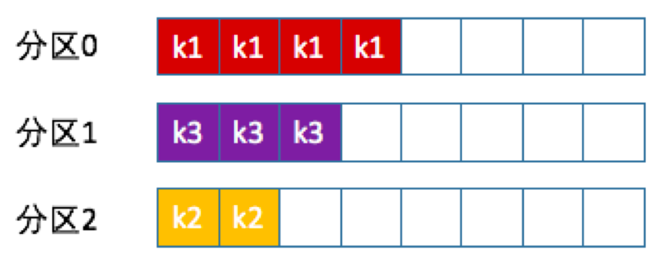
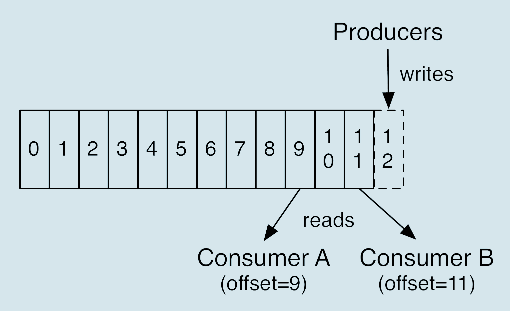

# 基本概念    
1）Producer ：
    消息生产者，就是向 kafka broker 发消息的客户端；
2）Consumer ：
    消息消费者，向 kafka broker 取消息的客户端；
3）Consumer Group （CG）：
    消费者组，由多个 consumer 组成。消费者组内每个消费者负 责消费不同分区的数据，
    一个分区只能由一个组内消费者消费；消费者组之间互不影响。
    所有的消费者都属于某个消费者组，即消费者组是逻辑上的一个订阅者。
4）Broker ：
    一台 kafka 服务器就是一个 broker。一个集群由多个 broker 组成。一个 broker可以容纳多个 topic。
5）Topic ：
    可以理解为一个队列，生产者和消费者面向的都是一个 topic；
6）Partition：
    为了实现扩展性，一个非常大的 topic 可以分布到多个 broker（即服务器）上，
    一个 topic 可以分为多个 partition，每个 partition 是一个有序的队列；
7）Replica：
    副本，为保证集群中的某个节点发生故障时，该节点上的 partition 数据不丢失，
    且 kafka 仍然能够继续工作，kafka 提供了副本机制，一个 topic 的每个分区都有若干个副本，
    一个 leader 和若干个 follower。
8）leader：
    每个分区多个副本的“主”，生产者发送数据的对象，以及消费者消费数据的对象都是 leader。
9）follower：
    每个分区多个副本中的“从”，实时从 leader 中同步数据，保持和 leader 数据的同步。
    leader 发生故障时，某个 follower 会成为新的 follower。

基本命令
安装目录
    /usr/local/Cellar/kafka/2.5.0
启动命令
    kafka-server-start /usr/local/etc/kafka/server.properties &
    kafka-server-start /usr/local/etc/kafka/server1.properties &
    kafka-server-start /usr/local/etc/kafka/server2.properties &
    zookeeper-server-start /usr/local/etc/kafka/zookeeper.properties &
查看所有主题
    bin/kafka-topics --list --zookeeper localhost:2181
    bin/kafka-topics --describe --zookeeper localhost:2181 --topic mytopic
创建主题
    bin/kafka-topics --create --zookeeper localhost:2181 --replication-factor 3 --partitions 2 --topic mytopic
    --replication-factor：副本数
    --partitions：分区数
删除数据
    bin/kafka-topics --delete --zookeeper localhost:2181 --topic mytopic
创建一个生产者：
    bin/kafka-console-producer --broker-list localhost:9092 --topic test
创建一个消费者：
    kafka-console-consumer --bootstrap-server localhost:9092 --topic test --from-beginning


Kafka生产者

生产者分区策略
分区的原因：
    1，提高并发，将同一个topic下面的数据分别发送到多个partition，这样可以提高并发，而且减少了消息容量提升IO性能
    2，方便扩展，可以很方便的通过增加broker的方式来增加partition数量，适应任何大小的数据
    3，为了提高消费端的消费能力，一般情况下会通过多个 conusmer 去消费 同一个 topic 中的消息，即实现消费端的负载均衡。
分区的原则
    我们需要将producer发送的数据封装成一个ProducerRecord对象
    1，指明partition的情况下，直接将指明的值作为partition
    2，没有指明的值，但是有key的情况下，将key的hash值与topic的partition数进行取余得到partition的值
    3，即没有partition值又没有key值的情况下，第一次调用时随机生成一个整数（后面每次调用在这个整数上自增），
    将这个值与topic可用的partition总数取余得到partition值，也就是常说的round-robin算法


生产者数据可靠性
为了保证数据的可靠性，能可靠的发送到指定的topic，topic的每个partition收到producer发送的数据，都要向producer发送ack（确认收到）
如果producer收到ack，就会进行下一轮发送，否则重新发送数据
那么何时发送ack？
副本的同步策略：
    1，半数以上完成同步发送ack，优点是延迟低，缺点是选举新的leader的时候容忍n台节点故障，需要2n+1副本
    2，全部同步完成才发送ack，优点是选举新的leader时容忍n台节点故障，需要n+1个副本，缺点是延迟高
kafka选择的是第二种方案，原因如下：
    1，Kafka的每个分区都有大量的数据，第一种方案会造成大量的数据冗余
    2，虽然第二种方案的网络延迟比较高，但网络延迟对Kafka的影响较小


ISR
    采用第二种方案后，设想一下几种场景，所有的follower开始同步数据，但是有一个follower因为故障不能与leader同步
    那么leader就要一直等待下去，直到他同步完成，才能发送ack，那么这个问题是怎么解决的？
    leader维护了一个动态的ISR，意为和leader保持同步的follower集合。当ISR中的follower完成数据同步后
    leader就会向producer发送ack，如果follower长时间未向leader同步数据，则该follower将被提出ISR，该
    阀值由replica.lag.time.max.ms参数决定，leader发生故障后，就会从ISR中选举新的leader
ack应答机制
    Kafka为用户提供三种可靠性级别，用户可对可靠性和延迟的要求进行权衡
    0：producer不等待broker的ack，这一操作提供了一个最低的延迟，broker一旦接收还没有写入磁盘就进行返回，当booker故障时就有可能丢失数据
    1：producer等待broker的ack，partition的leader写入磁盘就返回ack，如果在follower同步成功之前leader故障，那么将可能丢失数据
    -1/all：producer等待broker的ack，partition的leader和follower全部写入磁盘才会ack，但是如果在follower同步完成后，leader发生故障
            那么可能会造成数据重复


故障的细节处理
    LEO：每个副本最后一个offset
    HW(高水位)：所有副本最小的LEO
    HW之前的数据才会对consumer可见
    (1) follower故障
        follower发生故障后会被踢出ISR，等待follower恢复后，follower会读取本地磁盘上记录的上次的HW，并将log文件高于HW的部分截取掉
        从HW开始向leader进行同步，等该follower的LEO大于等于该partition的HW ,即follower追上leader之后，就可以重新加入ISR
    (2)leader故障
        leader发生故障后，会从ISR中选出一个新的leader，之后，为了保证多个副本之间的数据一致性，其余的follower会将各自高于HW的
        部分截取掉，然后从新的leader同步数据
    注意：这只能保证副本之间的数据一致性，并不能保证数据不丢失或者不重复


Exactly once（At Least Once + 幂等性 = Exactly Once）
即数据不重复，也不丢失
Kafka的幂等只能保证单个生产者会话（session）中单分区的幂等
启用
    要启用幂等性，只需要将Producer的参数中的enable.idompotence设置为true即可。
    Kafka的幂等性实现是将原来下游需要去做的去重复操作放在了上游
原理
    开启幂等性的producer在初始化的时候会分配一个pid，发往同一个partition的消息会附带一个sequence number
    而broker端会对<PID,Partiotion,SeqNumber>做缓存，当具有主键的消息提交时，broker只会持久化一条


如何保证Exactly-once
1，依赖业务控制
    对于生产者
        （1）每个分区只有一个生产者写入消息，当出现异常或者超时，生产者查询此分区最后一个消息，用于决定后续操作时重传还是继续发送。
        （2）为每个消息增加唯一主键，生产者不做处理，由消费者根据主键去重
    对消费者
        关闭自动提交 offset 的功能，不使用 Offsets Topic 这个内部 Topic 记录其 offset，而是由消费者自动保存 offset。
        将 offset 和消息处理放在一个事务里面，事务执行成功认为消息被消费，否则事务回滚需要重新处理
        当出现消费者重启或者 Rebalance 操作，可以从数据库找到对应的 offset，然后调用 KafkaConsumer.seek() 设置消费者位置，从此 offset 开始消费。
2，依赖 Kafka
    幂等性：每个分区中精确一次且有序
        在创建producer客户端的时候，添加配置props.put("enable.idempotence", ture)，producer就变成幂等的了。
        底层实现就是对每条消息生成一个id值，broker会根据这个id值进行去重，从而实现幂等，这样一来就能够实现精确一次的语义了。
        幂等的producer有两个主要是缺陷：
            - 幂等性的producer仅做到单分区上的幂等性，即单分区消息不重复，多分区无法保证幂等性。
            - 只能保持单会话的幂等性，无法实现跨会话的幂等性，如果producer挂掉再重启，无法保证两个会话间的幂等（新会话可能会重发）。
            因为broker端无法获取之前的状态信息，所以无法实现跨会话的幂等。
    事务：跨分区原子写入
        上述幂等设计只能保证单个 Producer 对于同一个 <Topic, Partition> 的 Exactly Once 语义
        当遇到上述幂等性的缺陷无法解决的时候，可以考虑使用事务了。
        事务可以支持多分区的数据完整性，原子性。允许一个生产者发送一批到不同分区的消息，这些消息要么全部对任何一个消费者可见，要么对任何一个消费者都不可见
        并且支持跨会话的exactly once处理语义，即使producer宕机重启，依旧能保证数据只处理一次。
        开启事务首先需要开启幂等性，即设置enable.idempotence为true。然后对producer消息发送做事务控制。
        ```java
        //初始化事务
        producer.initTransactions();
        try {
            //开启一个事务
            producer.beginTransaction();
            producer.send(record1);
            producer.send(record2);
            //提交
            producer.commitTransaction();
        } catch (KafkaException e) {
            //出现异常的时候，终止事务
            producer.abortTransaction();
        }
        ```


Kafka消费者

消费方式
    consumer 采用 pull(拉)模式从 broker 中读取数据。
    push(推)模式很难适应消费速率不同的消费者，因为消息发送速率是由 broker 决定的。
    它的目标是尽可能以最快速度传递消息，但是这样很容易造成 consumer 来不及处理消息，
    典型的表现就是拒绝服务以及网络拥塞。而 pull 模式则可以根据 consumer 的消费能力以适 当的速率消费消息。
    pull 模式不足之处是，如果 kafka 没有数据，消费者可能会陷入循环中，一直返回空数 据。针对这一点，Kafka 的消费者在消费数据时会传入一个时长参数 timeout，
    如果当前没有 数据可供消费，consumer 会等待一段时间之后再返回，这段时长即为 timeout。
Kafka 高效读写数据
    （1)顺序写磁盘
        Kafka 的 producer 生产数据，要写入到 log 文件中，写的过程是一直追加到文件末端， 为顺序写。
        官网有数据表明，同样的磁盘，顺序写能到 600M/s，而随机写只有 100K/s。这与磁盘的机械机构有关，顺序写之所以快，是因为其省去了大量磁头寻址的时间。
    （2)零拷贝


Kafka 事务
    保证了多会话的幂等性
    Kafka 从 0.11 版本开始引入了事务支持。事务可以保证 Kafka 在 Exactly Once 语义的基 础上，生产和消费可以跨分区和会话，要么全部成功，要么全部失败。

1)Producer 事务
    为了实现跨分区跨会话的事务，需要引入一个全局唯一的 Transaction ID，并将 Producer 获得的 PID 和 Transaction ID 绑定。这样当 Producer 重启后就可以通过正在进行的 Transaction ID 获得原来的 PID。
    为了管理 Transaction，Kafka 引入了一个新的组件 Transaction Coordinator。Producer 就 是通过和 Transaction Coordinator 交互获得 Transaction ID 对应的任务状态。
    Transaction Coordinator 还负责将事务所有写入 Kafka 的一个内部 Topic，这样即使整个服务重启，由于 事务状态得到保存，进行中的事务状态可以得到恢复，从而继续进行。
2)Consumer 事务
    上述事务机制主要是从 Producer 方面考虑，对于 Consumer 而言，事务的保证就会相对 较弱，尤其是无法保证 Commit 的信息被精确消费。
    这是由于 Consumer 可以通过 offset 访 问任意信息，而且不同的 Segment File 生命周期不同，同一事务的消息可能会出现重启后被 删除的情况。


跨会话的幂等性写入：即使中间故障，恢复后依然可以保持幂等性；
跨会话的事务恢复：如果一个应用实例挂了，启动的下一个实例依然可以保证上一个事务完成（commit 或者 abort）；
跨多个 Topic-Partition 的幂等性写入，Kafka 可以保证跨多个 Topic-Partition 的数据要么全部写入成功，要么全部失败，不会出现中间状态


Consumer端幂等性
    如上所述，consumer拉取到消息后，把消息交给线程池workers，workers对message的handle可能包含异步操作，又会出现以下情况：
    先commit，再执行业务逻辑：提交成功，处理失败。造成丢失
    先执行业务逻辑，再commit：提交失败，执行成功。造成重复执行
    先执行业务逻辑，再commit：提交成功，异步执行fail。造成丢失
    对此我们常用的方法时，works取到消息后先执行如下code：
    ```
    if(cache.contain(msgId)){
        // cache中包含msgId，已经处理过
        continue;
    }else {
        lock.lock();
        cache.put(msgId,timeout);
        commitSync();
        lock.unLock();
    }
    ```
        


# 一篇文章带你搞定kafka术语
在 Kafka 中，发布订阅的对象是主题（Topic），你可以为每个业务、每个应用甚至是每类数据都创建专属的主题。
向主题发布消息的客户端应用程序称为生产者（Producer），生产者程序通常持续不断地向一个或多个主题发送消息，
而订阅这些主题消息的客户端应用程序就被称为消费者（Consumer）。和生产者类似，消费者也能够同时订阅多个主题的消息。
我们把生产者和消费者统称为客户端（Clients）。

有客户端自然也就有服务器端。Kafka 的服务器端由被称为 Broker 的服务进程构成，即一个 Kafka 集群由多个 Broker 组成
Broker 负责接收和处理客户端发送过来的请求，以及对消息进行持久化。
虽然多个 Broker 进程能够运行在同一台机器上，但更常见的做法是将不同的 Broker 分散运行在不同的机器上
这样如果集群中某一台机器宕机，即使在它上面运行的所有 Broker 进程都挂掉了，其他机器上的 Broker 也依然能够对外提供服务。
这其实就是 Kafka 提供高可用的手段之一。

实现高可用的另一个手段就是备份机制（Replication）。备份的思想很简单，就是把相同的数据拷贝到多台机器上
而这些相同的数据拷贝在 Kafka 中被称为副本（Replica）。
副本的数量是可以配置的，这些副本保存着相同的数据，但却有不同的角色和作用。
Kafka 定义了两类副本：领导者副本（Leader Replica）和追随者副本（Follower Replica）
前者对外提供服务，这里的对外指的是与客户端程序进行交互；
而后者只是被动地追随领导者副本而已，不能与外界进行交互。
当然了，你可能知道在很多其他系统中追随者副本是可以对外提供服务的，比如 MySQL 的从库是可以处理读操作的，
但是在 Kafka 中追随者副本不会对外提供服务。

副本的工作机制也很简单：生产者总是向领导者副本写消息；而消费者总是从领导者副本读消息。
至于追随者副本，它只做一件事：向领导者副本发送请求，请求领导者把最新生产的消息发给它，这样它能保持与领导者的同步。

虽然有了副本机制可以保证数据的持久化或消息不丢失，但没有解决伸缩性的问题。
伸缩性即所谓的 Scalability，是分布式系统中非常重要且必须要谨慎对待的问题
什么是伸缩性呢？
我们拿副本来说，虽然现在有了领导者副本和追随者副本，但倘若领导者副本积累了太多的数据以至于单台 Broker 机器都无法容纳了，此时应该怎么办呢？
一个很自然的想法就是，能否把数据分割成多份保存在不同的 Broker 上？如果你就是这么想的，那么恭喜你，Kafka 就是这么设计的。

这种机制就是所谓的分区（Partitioning）。如果你了解其他分布式系统，你可能听说过分片、分区域等提法，
比如 MongoDB 和 Elasticsearch 中的 Sharding、HBase 中的 Region，其实它们都是相同的原理，只是 Partitioning 是最标准的名称。

Kafka 中的分区机制指的是将每个主题划分成多个分区（Partition），每个分区是一组有序的消息日志。
生产者生产的每条消息只会被发送到一个分区中，也就是说如果向一个双分区的主题发送一条消息，这条消息要么在分区 0 中，要么在分区 1 中
如你所见，Kafka 的分区编号是从 0 开始的，如果 Topic 有 100 个分区，那么它们的分区号就是从 0 到 99。

刚才提到的副本如何与这里的分区联系在一起呢？
实际上，副本是在分区这个层级定义的。每个分区下可以配置若干个副本，其中只能有 1 个领导者副本和 N-1 个追随者副本。
生产者向分区写入消息，每条消息在分区中的位置信息由一个叫位移（Offset）的数据来表征。
分区位移总是从 0 开始，假设一个生产者向一个空分区写入了 10 条消息，那么这 10 条消息的位移依次是 0、1、2、…、9。

至此我们能够完整地串联起 Kafka 的三层消息架构：
- 第一层是主题层，每个主题可以配置 M 个分区，而每个分区又可以配置 N 个副本。
- 第二层是分区层，每个分区的 N 个副本中只能有一个充当领导者角色，对外提供服务；其他 N-1 个副本是追随者副本，只是提供数据冗余之用。
- 第三层是消息层，分区中包含若干条消息，每条消息的位移从 0 开始，依次递增。
- 最后，客户端程序只能与分区的领导者副本进行交互。

讲完了消息层次，我们来说说 Kafka Broker 是如何持久化数据的。
总的来说，Kafka 使用消息日志（Log）来保存数据，一个日志就是磁盘上一个只能追加写（Append-only）消息的物理文件。
因为只能追加写入，故避免了缓慢的随机 I/O 操作，改为性能较好的顺序 I/O 写操作，这也是实现 Kafka 高吞吐量特性的一个重要手段。
不过如果你不停地向一个日志写入消息，最终也会耗尽所有的磁盘空间，因此 Kafka 必然要定期地删除消息以回收磁盘。
怎么删除呢？
简单来说就是通过日志段（Log Segment）机制。
在 Kafka 底层，一个日志又近一步细分成多个日志段，
消息被追加写到当前最新的日志段中，当写满了一个日志段后，Kafka 会自动切分出一个新的日志段，并将老的日志段封存起来。
Kafka 在后台还有定时任务会定期地检查老的日志段是否能够被删除，从而实现回收磁盘空间的目的。

这里再重点说说消费者。在专栏的第一期中我提到过两种消息模型，即点对点模型（Peer to Peer，P2P）和发布订阅模型。
这里面的点对点指的是同一条消息只能被下游的一个消费者消费，其他消费者则不能染指。
在 Kafka 中实现这种 P2P 模型的方法就是引入了消费者组（Consumer Group）。
所谓的消费者组，指的是多个消费者实例共同组成一个组来消费一组主题。
这组主题中的每个分区都只会被组内的一个消费者实例消费，其他消费者实例不能消费它。
为什么要引入消费者组呢？
主要是为了提升消费者端的吞吐量。多个消费者实例同时消费，加速整个消费端的吞吐量（TPS）
消费者实例可以是运行消费者应用的进程，也可以是一个线程，它们都称为一个消费者实例（Consumer Instance）。

消费者组里面的所有消费者实例不仅“瓜分”订阅主题的数据，而且更酷的是它们还能彼此协助。
假设组内某个实例挂掉了，Kafka 能够自动检测到，然后把这个 Failed 实例之前负责的分区转移给其他活着的消费者。
这个过程就是 Kafka 中大名鼎鼎的“重平衡”（Rebalance）。嗯，其实既是大名鼎鼎，也是臭名昭著，
因为由重平衡引发的消费者问题比比皆是。事实上，目前很多重平衡的 Bug 社区都无力解决。

每个消费者在消费消息的过程中必然需要有个字段记录它当前消费到了分区的哪个位置上，这个字段就是消费者位移（Consumer Offset）。
注意，这和上面所说的位移完全不是一个概念。
上面的“位移”表征的是分区内的消息位置，它是不变的，即一旦消息被成功写入到一个分区上，它的位移值就是固定的了。
而消费者位移则不同，它可能是随时变化的，毕竟它是消费者消费进度的指示器嘛。
另外每个消费者有着自己的消费者位移，


# kafka只是消息引擎系统么？
Apache Kafka 是消息引擎系统，也是一个分布式流处理平台（Distributed Streaming Platform）
Kafka 在设计之初就旨在提供三个方面的特性：
    - 提供一套 API 实现生产者和消费者；
    - 降低网络传输和磁盘存储开销；
    - 实现高伸缩性架构。
开源之后的 Kafka 被越来越多的公司应用到它们企业内部的数据管道中，特别是在大数据工程领域
Kafka 在承接上下游、串联数据流管道方面发挥了重要的作用：所有的数据几乎都要从一个系统流入 Kafka 然后再流向下游的另一个系统中
这样的使用方式屡见不鲜以至于引发了 Kafka 社区的思考：
与其我把数据从一个系统传递到下一个系统中做处理，我为何不自己实现一套流处理框架呢？
基于这个考量，Kafka 社区于 0.10.0.0 版本正式推出了流处理组件 Kafka Streams
也正是从这个版本开始，Kafka 正式“变身”为分布式的流处理平台，而不仅仅是消息引擎系统了
今天 Apache Kafka 是和 Apache Storm、Apache Spark 和 Apache Flink 同等级的实时流处理平台。

诚然，目前国内对 Kafka 是流处理平台的认知还尚不普及，其核心的流处理组件 Kafka Streams 更是少有大厂在使用。
但我们也欣喜地看到，随着在 Kafka 峰会上各路大神们的鼎力宣传，如今利用 Kafka 构建流处理平台的案例层出不穷，而了解并有意愿使用 Kafka Streams 的厂商也是越来越多

那么作为流处理平台，Kafka 与其他主流大数据流式计算框架相比，优势在哪里呢？
第一点是更容易实现端到端的正确性（Correctness）
    要实现正确性和提供能够推导时间的工具。实现正确性是流处理能够匹敌批处理的基石
    正确性一直是批处理的强项，而实现正确性的基石则是要求框架能提供精确一次处理语义
    即处理一条消息有且只有一次机会能够影响系统状态。
    目前主流的大数据流处理框架都宣称实现了精确一次处理语义，但这是有限定条件的，即它们只能实现框架内的精确一次处理语义，无法实现端到端的。
    Kafka 则不是这样，因为所有的数据流转和计算都在 Kafka 内部完成，故 Kafka 可以实现端到端的精确一次处理语义。
第二是Kafka自己对于流式计算的定位
    官网上明确标识 Kafka Streams 是一个用于搭建实时流处理的客户端库而非是一个完整的功能系统。
    这就是说，你不能期望着 Kafka 提供类似于集群调度、弹性部署等开箱即用的运维特性，
    你需要自己选择适合的工具或系统来帮助 Kafka 流处理应用实现这些功能。
    大型公司的流处理平台一定是大规模部署的，因此具备集群调度功能以及灵活的部署方案是不可或缺的要素。
    但毕竟这世界上还存在着很多中小企业，它们的流处理数据量并不巨大，逻辑也并不复杂，部署几台或十几台机器足以应付。
    在这样的需求之下，搭建重量级的完整性平台实在是“杀鸡焉用牛刀”，而这正是 Kafka 流处理组件的用武之地。

除了消息引擎和流处理平台，Kafka 还有别的用途吗？当然有！你能想象吗，Kafka 能够被用作分布式存储系统。


# 我们应该选择哪种Kafka？
Kafka Connect
    我们在评估流处理平台的时候，框架本身的性能、所提供操作算子（Operator）的丰富程度固然是重要的评判指标
    但框架与上下游交互的能力也是非常重要的。能够与之进行数据传输的外部系统越多，围绕它打造的生态圈就越牢固，因而也就有更多的人愿意去使用它，
    从而形成正向反馈，不断地促进该生态圈的发展。
    就 Kafka 而言，Kafka Connect 通过一个个具体的连接器（Connector），串联起上下游的外部系统。
    整个 Kafka 生态圈如下图所示。值得注意的是，这张图中的外部系统只是 Kafka Connect 组件支持的一部分而已。
    目前还有一个可喜的趋势是使用 Kafka Connect 组件的用户越来越多，相信在未来会有越来越多的人开发自己的连接器。
    
    说了这么多你可能会问这和今天的主题有什么关系呢？
    其实清晰地了解 Kafka 的发展脉络和生态圈现状，对于指导我们选择合适的 Kafka 版本大有裨益。下面我们就进入今天的主题——如何选择 Kafka 版本？
你知道几种Kafka
    - Apache Kafka，也称社区版 Kafka。优势在于迭代速度快，社区响应度高，使用它可以让你有更高的把控度；缺陷在于仅提供基础核心组件，缺失一些高级的特性。
    - Confluent Kafka，Confluent 公司提供的 Kafka。优势在于集成了很多高级特性且由 Kafka 原班人马打造，质量上有保证；缺陷在于相关文档资料不全，普及率较低，没有太多可供参考的范例。
    - CDH/HDP Kafka，大数据云公司提供的 Kafka，内嵌 Apache Kafka。优势在于操作简单，节省运维成本；缺陷在于把控度低，演进速度较慢。


# Kafka版本演进
Kafka 目前总共演进了 7 个大版本，分别是 0.7、0.8、0.9、0.10、0.11、1.0 和 2.0
其中的小版本和 Patch 版本很多。

我们先从 0.7 版本说起，实际上也没什么可说的，这是最早开源时的“上古”版本了，以至于我也从来都没有接触过。
这个版本只提供了最基础的消息队列功能，甚至连副本机制都没有，我实在想不出有什么理由你要使用这个版本，因此一旦有人向你推荐这个版本，果断走开就好了。

Kafka 从 0.7 时代演进到 0.8 之后正式引入了副本机制，至此 Kafka 成为了一个真正意义上完备的分布式高可靠消息队列解决方案。
有了副本备份机制，Kafka 就能够比较好地做到消息无丢失。
那时候生产和消费消息使用的还是老版本的客户端 API，所谓的老版本是指当你用它们的 API 开发生产者和消费者应用时，你需要指定 ZooKeeper 的地址而非 Broker 的地址。

如果你现在尚不能理解这两者的区别也没关系，我会在专栏的后续文章中详细介绍它们。
老版本客户端有很多的问题，特别是生产者 API，它默认使用同步方式发送消息，可以想见其吞吐量一定不会太高。
虽然它也支持异步的方式，但实际场景中可能会造成消息的丢失，因此 0.8.2.0 版本社区引入了新版本 Producer API，即需要指定 Broker 地址的 Producer。

据我所知，国内依然有少部分用户在使用 0.8.1.1、0.8.2 版本。我的建议是尽量使用比较新的版本。
如果你不能升级大版本，我也建议你至少要升级到 0.8.2.2 这个版本，因为该版本中老版本消费者 API 是比较稳定的。
另外即使你升到了 0.8.2.2，也不要使用新版本 Producer API，此时它的 Bug 还非常多。

时间来到了 2015 年 11 月，社区正式发布了 0.9.0.0 版本。在我看来这是一个重量级的大版本更迭，0.9 大版本增加了基础的安全认证 / 权限功能，同时使用 Java 重写了新版本消费者 API，
另外还引入了 Kafka Connect 组件用于实现高性能的数据抽取。如果这么多眼花缭乱的功能你一时无暇顾及
那么我希望你记住这个版本的另一个好处，那就是新版本 Producer API 在这个版本中算比较稳定了。
如果你使用 0.9 作为线上环境不妨切换到新版本 Producer，这是此版本一个不太为人所知的优势。
但和 0.8.2 引入新 API 问题类似，不要使用新版本 Consumer API，因为 Bug 超多的，绝对用到你崩溃。
即使你反馈问题到社区，社区也不会管的，它会无脑地推荐你升级到新版本再试试，因此千万别用 0.9 的新版本 Consumer API。
对于国内一些使用比较老的 CDH 的创业公司，鉴于其内嵌的就是 0.9 版本，所以要格外注意这些问题。

0.10.0.0 是里程碑式的大版本，因为该版本引入了 Kafka Streams。从这个版本起，Kafka 正式升级成分布式流处理平台，
虽然此时的 Kafka Streams 还基本不能线上部署使用。
0.10 大版本包含两个小版本：0.10.1 和 0.10.2，它们的主要功能变更都是在 Kafka Streams 组件上。
如果你把 Kafka 用作消息引擎，实际上该版本并没有太多的功能提升。
不过在我的印象中自 0.10.2.2 版本起，新版本 Consumer API 算是比较稳定了。
如果你依然在使用 0.10 大版本，我强烈建议你至少升级到 0.10.2.2 然后使用新版本 Consumer API。还有个事情不得不提，0.10.2.2 修复了一个可能导致 Producer 性能降低的 Bug。基于性能的缘故你也应该升级到 0.10.2.2。

在 2017 年 6 月，社区发布了 0.11.0.0 版本，引入了两个重量级的功能变更：
一个是提供幂等性 Producer API 以及事务（Transaction） API；
另一个是对 Kafka 消息格式做了重构。
前一个好像更加吸引眼球一些，毕竟 Producer 实现幂等性以及支持事务都是 Kafka 实现流处理结果正确性的基石。
没有它们，Kafka Streams 在做流处理时无法向批处理那样保证结果的正确性。
当然同样是由于刚推出，此时的事务 API 有一些 Bug，不算十分稳定。
另外事务 API 主要是为 Kafka Streams 应用服务的，实际使用场景中用户利用事务 API 自行编写程序的成功案例并不多见。

第二个重磅改进是消息格式的变化。虽然它对用户是透明的，但是它带来的深远影响将一直持续。
因为格式变更引起消息格式转换而导致的性能问题在生产环境中屡见不鲜，所以你一定要谨慎对待 0.11 版本的这个变化。
不得不说的是，这个版本中各个大功能组件都变得非常稳定了，国内该版本的用户也很多，应该算是目前最主流的版本之一了。
也正是因为这个缘故，社区为 0.11 大版本特意推出了 3 个 Patch 版本，足见它的受欢迎程度。
我的建议是，如果你对 1.0 版本是否适用于线上环境依然感到困惑，那么至少将你的环境升级到 0.11.0.3，因为这个版本的消息引擎功能已经非常完善了。

最后我合并说下 1.0 和 2.0 版本吧，因为在我看来这两个大版本主要还是 Kafka Streams 的各种改进，
在消息引擎方面并未引入太多的重大功能特性。Kafka Streams 的确在这两个版本有着非常大的变化，也必须承认 Kafka Streams 目前依然还在积极地发展着。
如果你是 Kafka Streams 的用户，至少选择 2.0.0 版本吧。

# 最最最重要的集群参数配置
## Broker端参数
目前 Kafka Broker 提供了近 200 个参数，这其中绝大部分参数都不用你亲自过问。
当谈及这些参数的用法时，网上的文章多是罗列出一些常见的参数然后一个一个地给出它们的定义，事实上我以前写文章时也是这么做的
不过今天我打算换个方法，按照大的用途类别一组一组地介绍它们，希望可以更有针对性，也更方便你记忆。
首先 Broker 是需要配置存储信息的，即 Broker 使用哪些磁盘。那么针对存储信息的重要参数有以下这么几个：
    - log.dirs：这是非常重要的参数，指定了 Broker 需要使用的若干个文件目录路径。要知道这个参数是没有默认值的，这说明什么？这说明它必须由你亲自指定。
    - log.dir：注意这是 dir，结尾没有 s，说明它只能表示单个路径，它是补充上一个参数用的。
这两个参数应该怎么设置呢？很简单，你只要设置log.dirs，即第一个参数就好了，不要设置log.dir。
而且更重要的是，在线上生产环境中一定要为log.dirs配置多个路径。
具体格式是一个 CSV 格式，也就是用逗号分隔的多个路径，比如/home/kafka1,/home/kafka2,/home/kafka3这样
这样做有两个好处：
- 提升读写性能：比起单块磁盘，多块物理磁盘同时读写数据有更高的吞吐量。
- 能够实现故障转移：即 Failover。这是 Kafka 1.1 版本新引入的强大功能。
  要知道在以前，只要 Kafka Broker 使用的任何一块磁盘挂掉了，整个 Broker 进程都会关闭。
  但是自 1.1 开始，这种情况被修正了，坏掉的磁盘上的数据会自动地转移到其他正常的磁盘上，而且 Broker 还能正常工作


## ZooKeeper相关参数
下面说说与 ZooKeeper 相关的设置。首先 ZooKeeper 是做什么的呢？
它是一个分布式协调框架，负责协调管理并保存 Kafka 集群的所有元数据信息
比如集群都有哪些 Broker 在运行、创建了哪些 Topic，每个 Topic 都有多少分区以及这些分区的 Leader 副本都在哪些机器上等信息。

Kafka 与 ZooKeeper 相关的最重要的参数当属zookeeper.connect。这也是一个 CSV 格式的参数，
比如我可以指定它的值为zk1:2181,zk2:2181,zk3:2181。2181 是 ZooKeeper 的默认端口。

现在问题来了，如果我让多个 Kafka 集群使用同一套 ZooKeeper 集群，那么这个参数应该怎么设置呢？
这时候 chroot 就派上用场了。这个 chroot 是 ZooKeeper 的概念，类似于别名。

如果你有两套 Kafka 集群，假设分别叫它们 kafka1 和 kafka2，
那么两套集群的zookeeper.connect参数可以这样指定：zk1:2181,zk2:2181,zk3:2181/kafka1和zk1:2181,zk2:2181,zk3:2181/kafka2。
切记 chroot 只需要写一次，而且是加到最后的。我经常碰到有人这样指定：zk1:2181/kafka1,zk2:2181/kafka2,zk3:2181/kafka3，这样的格式是不对的。
不太理解zookeeper是怎么在Kafka中使用的


## Broker连接相关参数
第三组参数是与 Broker 连接相关的，即客户端程序或其他 Broker 如何与该 Broker 进行通信的设置。有以下三个参数：
- listeners：学名叫监听器，其实就是告诉外部连接者要通过什么协议访问指定主机名和端口开放的 Kafka 服务。
- advertised.listeners：和 listeners 相比多了个 advertised。
  Advertised 的含义表示宣称的、公布的，就是说这组监听器是 Broker 用于对外发布的。
- 列出这两个参数就是想说你把它们忘掉吧，压根不要为它们指定值，毕竟都是过期的参数了。

我们具体说说监听器的概念，从构成上来说，它是若干个逗号分隔的三元组，每个三元组的格式为<协议名称，主机名，端口号>。
这里的协议名称可能是标准的名字，比如 PLAINTEXT 表示明文传输、SSL 表示使用 SSL 或 TLS 加密传输等；
也可能是你自己定义的协议名字，比如CONTROLLER: //localhost:9092。

一旦你自己定义了协议名称，你必须还要指定listener.security.protocol.map参数告诉这个协议底层使用了哪种安全协议
比如指定listener.security.protocol.map=CONTROLLER:PLAINTEXT表示CONTROLLER这个自定义协议底层使用明文不加密传输数据。

至于三元组中的主机名和端口号则比较直观，不需要做过多解释。
不过有个事情你还是要注意一下，经常有人会问主机名这个设置中我到底使用 IP 地址还是主机名。
这里我给出统一的建议：最好全部使用主机名，即 Broker 端和 Client 端应用配置中全部填写主机名。
Broker 源代码中也使用的是主机名，如果你在某些地方使用了 IP 地址进行连接，可能会发生无法连接的问题。


## Topic 管理相关参数
第四组参数是关于 Topic 管理的。我来讲讲下面这三个参数：
- auto.create.topics.enable：是否允许自动创建 Topic。
- unclean.leader.election.enable：是否允许 Unclean Leader 选举。
- auto.leader.rebalance.enable：是否允许定期进行 Leader 选举。

auto.create.topics.enable参数我建议最好设置成 false，即不允许自动创建 Topic。在我们的线上环境里面有很多名字稀奇古怪的 Topic，我想大概都是因为该参数被设置成了 true 的缘故。
你可能有这样的经历，要为名为 test 的 Topic 发送事件，但是不小心拼写错误了，把 test 写成了 tst，之后启动了生产者程序。恭喜你，一个名为 tst 的 Topic 就被自动创建了。
所以我一直相信好的运维应该防止这种情形的发生，特别是对于那些大公司而言，每个部门被分配的 Topic 应该由运维严格把控，决不能允许自行创建任何 Topic。

第二个参数unclean.leader.election.enable是关闭 Unclean Leader 选举的。何谓 Unclean？还记得 Kafka 有多个副本这件事吗？每个分区都有多个副本来提供高可用。
在这些副本中只能有一个副本对外提供服务，即所谓的 Leader 副本。
那么问题来了，这些副本都有资格竞争 Leader 吗？显然不是，只有保存数据比较多的那些副本才有资格竞选，那些落后进度太多的副本没资格做这件事。
好了，现在出现这种情况了：假设那些保存数据比较多的副本都挂了怎么办？我们还要不要进行 Leader 选举了？此时这个参数就派上用场了。
如果设置成 false，那么就坚持之前的原则，坚决不能让那些落后太多的副本竞选 Leader。
这样做的后果是这个分区就不可用了，因为没有 Leader 了。反之如果是 true，那么 Kafka 允许你从那些“跑得慢”的副本中选一个出来当 Leader。
这样做的后果是数据有可能就丢失了，因为这些副本保存的数据本来就不全，当了 Leader 之后它本人就变得膨胀了，认为自己的数据才是权威的。
这个参数在最新版的 Kafka 中默认就是 false

第三个参数auto.leader.rebalance.enable的影响貌似没什么人提，但其实对生产环境影响非常大。
设置它的值为 true 表示允许 Kafka 定期地对一些 Topic 分区进行 Leader 重选举
当然这个重选举不是无脑进行的，它要满足一定的条件才会发生。
严格来说它与上一个参数中 Leader 选举的最大不同在于，它不是选 Leader，而是换 Leader！
比如 Leader A 一直表现得很好，但若auto.leader.rebalance.enable=true，那么有可能一段时间后 Leader A 就要被强行卸任换成 Leader B。
你要知道换一次 Leader 代价很高的，原本向 A 发送请求的所有客户端都要切换成向 B 发送请求，而且这种换 Leader 本质上没有任何性能收益，因此我建议你在生产环境中把这个参数设置成 false。

## 数据留存相关参数
最后一组参数是数据留存方面的，即：
    - log.retention.{hour|minutes|ms}：这是个“三兄弟”，都是控制一条消息数据被保存多长时间。从优先级上来说 ms 设置最高、minutes 次之、hour 最低。
    - log.retention.bytes：这是指定 Broker 为消息保存的总磁盘容量大小。
    - message.max.bytes：控制 Broker 能够接收的最大消息大小。
先说log.retention.{hour|minutes|ms}，虽然 ms 设置有最高的优先级，但是通常情况下我们还是设置 hour 级别的多一些
比如log.retention.hour=168表示默认保存 7 天的数据，自动删除 7 天前的数据。
很多公司把 Kafka 当做存储来使用，那么这个值就要相应地调大。

其次是这个log.retention.bytes。这个值默认是 -1，表明你想在这台 Broker 上保存多少数据都可以，至少在容量方面 Broker 绝对为你开绿灯，不会做任何阻拦。
这个参数真正发挥作用的场景其实是在云上构建多租户的 Kafka 集群：
设想你要做一个云上的 Kafka 服务，每个租户只能使用 100GB 的磁盘空间，为了避免有个“恶意”租户使用过多的磁盘空间，设置这个参数就显得至关重要了。

最后说说message.max.bytes。实际上今天我和你说的重要参数都是指那些不能使用默认值的参数
这个参数也是一样，默认的 1000012 太少了，还不到 1MB。实际场景中突破 1MB 的消息都是屡见不鲜的，因此在线上环境中设置一个比较大的值还是比较保险的做法。
毕竟它只是一个标尺而已，仅仅衡量 Broker 能够处理的最大消息大小，即使设置大一点也不会耗费什么磁盘空间的。

## Topic 级别参数（不是Topic相关参数）
在上一期中，我们讨论了 Broker 端参数设置的一些法则，但其实 Kafka 也支持为不同的 Topic 设置不同的参数值
说起 Topic 级别的参数，你可能会有这样的疑问：如果同时设置了 Topic 级别参数和全局 Broker 参数，到底听谁的呢？哪个说了算呢？
答案就是 Topic 级别参数会覆盖全局 Broker 参数的值，而每个 Topic 都能设置自己的参数值，这就是所谓的 Topic 级别参数。

举个例子说明一下，上一期我提到了消息数据的留存时间参数，在实际生产环境中，如果为所有 Topic 的数据都保存相当长的时间，这样做既不高效也无必要
更适当的做法是允许不同部门的 Topic 根据自身业务需要，设置自己的留存时间。
如果只能设置全局 Broker 参数，那么势必要提取所有业务留存时间的最大值作为全局参数值，此时设置 Topic 级别参数把它覆盖，就是一个不错的选择。
下面我们依然按照用途分组的方式引出重要的 Topic 级别参数

从保存消息方面来考量的话，下面这组参数是非常重要的：
- retention.ms：规定了该 Topic 消息被保存的时长。默认是 7 天，即该 Topic 只保存最近 7 天的消息。一旦设置了这个值，它会覆盖掉 Broker 端的全局参数值。
- retention.bytes：规定了要为该 Topic 预留多大的磁盘空间。和全局参数作用相似，这个值通常在多租户的 Kafka 集群中会有用武之地。当前默认值是 -1，表示可以无限使用磁盘空间。

上面这些是从保存消息的维度来说的。如果从能处理的消息大小这个角度来看的话，有一个参数是必须要设置的，即max.message.bytes。
它决定了 Kafka Broker 能够正常接收该 Topic 的最大消息大小。
我知道目前在很多公司都把 Kafka 作为一个基础架构组件来运行，上面跑了很多的业务数据。
如果在全局层面上，我们不好给出一个合适的最大消息值，那么不同业务部门能够自行设定这个 Topic 级别参数就显得非常必要了。在实际场景中，这种用法也确实是非常常见的。

怎么设置 Topic 级别参数
- 创建 Topic 时进行设置
  用上面提到的retention.ms和max.message.bytes举例
  设想你的部门需要将交易数据发送到 Kafka 进行处理，需要保存最近半年的交易数据，同时这些数据很大，通常都有几 MB，但一般不会超过 5MB。现在让我们用以下命令来创建 Topic：
  ```bin/kafka-topics.sh--bootstrap-serverlocalhost:9092--create--topictransaction--partitions1--replication-factor1--configretention.ms=15552000000--configmax.message.bytes=5242880```
  我们只需要知道 Kafka 开放了kafka-topics命令供我们来创建 Topic 即可。
  对于上面这样一条命令，请注意结尾处的--config设置，我们就是在 config 后面指定了想要设置的 Topic 级别参数。
- 修改 Topic 时设置
  下面看看使用另一个自带的命令kafka-configs来修改 Topic 级别参数。
  假设我们现在要发送最大值是 10MB 的消息，该如何修改呢？命令如下：
  ``` bin/kafka-configs.sh--zookeeperlocalhost:2181--entity-typetopics--entity-nametransaction--alter--add-configmax.message.bytes=10485760```
  

## JVM 参数
Kafka 服务器端代码是用 Scala 语言编写的，但终归还是编译成 Class 文件在 JVM 上运行，因此 JVM 参数设置对于 Kafka 集群的重要性不言而喻。
说到 JVM 端设置，堆大小这个参数至关重要。
虽然在后面我们还会讨论如何调优 Kafka 性能的问题，但现在我想无脑给出一个通用的建议
将你的 JVM 堆大小设置成 6GB 吧，这是目前业界比较公认的一个合理值。
我见过很多人就是使用默认的 Heap Size 来跑 Kafka，说实话默认的 1GB 有点小
毕竟 Kafka Broker 在与客户端进行交互时会在 JVM 堆上创建大量的 ByteBuffer 实例，Heap Size 不能太小。

JVM 端配置的另一个重要参数就是垃圾回收器的设置，也就是平时常说的 GC 设置。
如果你依然在使用 Java 7，那么可以根据以下法则选择合适的垃圾回收器：
    - 如果 Broker 所在机器的 CPU 资源非常充裕，建议使用 CMS 收集器。启用方法是指定-XX:+UseCurrentMarkSweepGC。
    - 否则，使用吞吐量收集器。开启方法是指定-XX:+UseParallelGC。
当然了，如果你已经在使用 Java 8 了，那么就用默认的 G1 收集器就好了。
在没有任何调优的情况下，G1 表现得要比 CMS 出色，主要体现在更少的 Full GC，需要调整的参数更少等，所以使用 G1 就好了。

现在我们确定好了要设置的 JVM 参数，我们该如何为 Kafka 进行设置呢？
你只需要设置下面这两个环境变量即可：
    - KAFKA_HEAP_OPTS：指定堆大小。
    - KAFKA_JVM_PERFORMANCE_OPTS：指定 GC 参数。
比如你可以这样启动 Kafka Broker，即在启动 Kafka Broker 之前，先设置上这两个环境变量：
    ```
    $> export KAFKA_HEAP_OPTS=--Xms6g  --Xmx6g
    $> export  KAFKA_JVM_PERFORMANCE_OPTS= -server -XX:+UseG1GC -XX:MaxGCPauseMillis=20 -XX:InitiatingHeapOccupancyPercent=35 -XX:+ExplicitGCInvokesConcurrent -Djava.awt.headless=true
    $> bin/kafka-server-start.sh config/server.properties
    ```

## 操作系统参数
最后我们来聊聊 Kafka 集群通常都需要设置哪些操作系统参数。
通常情况下，Kafka 并不需要设置太多的 OS 参数，但有些因素最好还是关注一下，比如下面这几个：
- 文件描述符限制
  首先是ulimit -n。我觉得任何一个 Java 项目最好都调整下这个值。
  实际上，文件描述符系统资源并不像我们想象的那样昂贵，你不用太担心调大此值会有什么不利的影响。
  通常情况下将它设置成一个超大的值是合理的做法，比如ulimit -n 1000000。
  其实设置这个参数一点都不重要，但不设置的话后果很严重，比如你会经常看到“Too many open files”的错误。
- 文件系统类型
  其次是文件系统类型的选择。这里所说的文件系统指的是如 ext3、ext4 或 XFS 这样的日志型文件系统。
  根据官网的测试报告，XFS 的性能要强于 ext4，所以生产环境最好还是使用 XFS。
- Swappiness
  网上很多文章都提到设置其为 0，将 swap 完全禁掉以防止 Kafka 进程使用 swap 空间。
  我个人反倒觉得还是不要设置成 0 比较好，我们可以设置成一个较小的值。
  为什么呢？因为一旦设置成 0，当物理内存耗尽时，操作系统会触发 OOM killer 这个组件，它会随机挑选一个进程然后 kill 掉，即根本不给用户任何的预警。
  但如果设置成一个比较小的值，当开始使用 swap 空间时，你至少能够观测到 Broker 性能开始出现急剧下降，
  从而给你进一步调优和诊断问题的时间。
  基于这个考虑，我个人建议将 swappniess 配置成一个接近 0 但不为 0 的值，比如 1。
- 提交时间
  最后是提交时间或者说是 Flush 落盘时间。
  向 Kafka 发送数据并不是真要等数据被写入磁盘才会认为成功，而是只要数据被写入到操作系统的页缓存（Page Cache）上就可以了，
  随后操作系统根据 LRU 算法会定期将页缓存上的“脏”数据落盘到物理磁盘上。
  这个定期就是由提交时间来确定的，默认是 5 秒。
  一般情况下我们会认为这个时间太频繁了，可以适当地增加提交间隔来降低物理磁盘的写操作。
  当然你可能会有这样的疑问：如果在页缓存中的数据在写入到磁盘前机器宕机了，那岂不是数据就丢失了。
  的确，这种情况数据确实就丢失了
  但鉴于 Kafka 在软件层面已经提供了多副本的冗余机制，因此这里稍微拉大提交间隔去换取性能还是一个合理的做法。


# 生产者消息分区机制原理剖析
我们在使用 Apache Kafka 生产和消费消息的时候，肯定是希望能够将数据均匀地分配到所有服务器上。
比如很多公司使用 Kafka 收集应用服务器的日志数据，这种数据都是很多的，特别是对于那种大批量机器组成的集群环境，每分钟产生的日志量都能以 GB 数
因此如何将这么大的数据量均匀地分配到 Kafka 的各个 Broker 上，就成为一个非常重要的问题。

## 为什么分区
专栏前面我说过 Kafka 有主题（Topic）的概念，它是承载真实数据的逻辑容器
而在主题之下还分为若干个分区，也就是说 Kafka 的消息组织方式实际上是三级结构：主题 - 分区 - 消息
主题下的每条消息只会保存在某一个分区中，而不会在多个分区中被保存多份。
分区的作用就是提供负载均衡的能力，或者说对数据进行分区的主要原因，就是为了实现系统的高伸缩性（Scalability）。
不同的分区能够被放置到不同节点的机器上，而数据的读写操作也都是针对分区这个粒度而进行的
这样每个节点的机器都能独立地执行各自分区的读写请求处理。
并且，我们还可以通过添加新的节点机器来增加整体系统的吞吐量。

## 都有哪些分区策略？
所谓分区策略是决定生产者将消息发送到哪个分区的算法。
Kafka 为我们提供了默认的分区策略，同时它也支持你自定义分区策略。

如果要自定义分区策略，你需要显式地配置生产者端的参数partitioner.class
这个参数该怎么设定呢？
方法很简单，在编写生产者程序时，你可以编写一个具体的类实现org.apache.kafka.clients.producer.Partitioner接口。
这个接口也很简单，只定义了两个方法：partition()和close()，通常你只需要实现最重要的 partition 方法。
```int partition(String topic, Object key, byte[] keyBytes, Object value, byte[] valueBytes, Cluster cluster);```
这里的topic、key、keyBytes、value和valueBytes都属于消息数据，cluster则是集群信息（比如当前 Kafka 集群共有多少主题、多少 Broker 等）。
Kafka 给你这么多信息，就是希望让你能够充分地利用这些信息对消息进行分区，计算出它要被发送到哪个分区中。
只要你自己的实现类定义好了 partition 方法，同时设置partitioner.class参数为你自己实现类的 Full Qualified Name，那么生产者程序就会按照你的代码逻辑对消息进行分区。
虽说可以有无数种分区的可能，但比较常见的分区策略也就那么几种，下面我来详细介绍一下。

轮询策略
也称 Round-robin 策略，即顺序分配。比如一个主题下有 3 个分区，那么第一条消息被发送到分区 0，第二条被发送到分区 1，第三条被发送到分区 2，
以此类推。当生产第 4 条消息时又会重新开始，即将其分配到分区 0，就像下面这张图展示的那样。

轮询策略是 Kafka Java 生产者 API 默认提供的分区策略。如果你未指定partitioner.class参数，那么你的生产者程序会按照轮询的方式在主题的所有分区间均匀地“码放”消息。
轮询策略有非常优秀的负载均衡表现，它总是能保证消息最大限度地被平均分配到所有分区上，故默认情况下它是最合理的分区策略，也是我们最常用的分区策略之一。

随机策略
也称 Randomness 策略。所谓随机就是我们随意地将消息放置到任意一个分区上，如下面这张图所示。

如果要实现随机策略版的 partition 方法，很简单，只需要两行代码即可：
```
List<PartitionInfo> partitions = cluster.partitionsForTopic(topic);
return ThreadLocalRandom.current().nextInt(partitions.size());
```
先计算出该主题总的分区数，然后随机地返回一个小于它的正整数。
本质上看随机策略也是力求将数据均匀地打散到各个分区，但从实际表现来看，它要逊于轮询策略
所以如果追求数据的均匀分布，还是使用轮询策略比较好。

按消息键保序策略
也称 Key-ordering 策略。Kafka 允许为每条消息定义消息键，简称为 Key。这个 Key 的作用非常大，它可以是一个有着明确业务含义的字符串，比如客户代码、部门编号或是业务 ID 等； 也可以用来表征消息元数据
一旦消息被定义了 Key，那么你就可以保证同一个 Key 的所有消息都进入到相同的分区里面
由于每个分区下的消息处理都是有顺序的，故这个策略被称为按消息键保序策略，

实现这个策略的 partition 方法同样简单，只需要下面两行代码即可：
```
List<PartitionInfo> partitions = cluster.partitionsForTopic(topic);
return Math.abs(key.hashCode()) % partitions.size();
```
前面提到的 Kafka 默认分区策略实际上同时实现了两种策略：如果指定了 Key，那么默认实现按消息键保序策略；如果没有指定 Key，则使用轮询策略。


# 生产者压缩算法面面观
说起压缩（compression），我相信你一定不会感到陌生。
它秉承了用时间去换空间的经典 trade-off 思想，具体来说就是用 CPU 时间去换磁盘空间或网络 I/O 传输量
希望以较小的 CPU 开销带来更少的磁盘占用或更少的网络 I/O 传输。

## 怎么压缩？
Kafka 是如何压缩消息的呢？要弄清楚这个问题，就要从 Kafka 的消息格式说起了。
目前 Kafka 共有两大类消息格式，社区分别称之为 V1 版本和 V2 版本。V2 版本是 Kafka 0.11.0.0 中正式引入的。

不论是哪个版本，Kafka 的消息层次都分为两层：消息集合（message set）以及消息（message）。
一个消息集合中包含若干条日志项（record item），而日志项才是真正封装消息的地方。
Kafka 底层的消息日志由一系列消息集合日志项组成。
Kafka 通常不会直接操作具体的一条条消息，它总是在消息集合这个层面上进行写入操作。

那么社区引入 V2 版本的目的是什么呢？V2 版本主要是针对 V1 版本的一些弊端做了修正，和我们今天讨论的主题相关的修正有哪些呢？
先介绍一个，就是把消息的公共部分抽取出来放到外层消息集合里面，这样就不用每条消息都保存这些信息了。

我来举个例子。原来在 V1 版本中，每条消息都需要执行 CRC 校验，但有些情况下消息的 CRC 值是会发生变化的。
比如在 Broker 端可能会对消息时间戳字段进行更新，那么重新计算之后的 CRC 值也会相应更新；
再比如 Broker 端在执行消息格式转换时（主要是为了兼容老版本客户端程序），也会带来 CRC 值的变化。
鉴于这些情况，再对每条消息都执行 CRC 校验就有点没必要了，不仅浪费空间还耽误 CPU 时间，因此在 V2 版本中，消息的 CRC 校验工作就被移到了消息集合这一层。

V2 版本还有一个和压缩息息相关的改进，就是保存压缩消息的方法发生了变化。
之前 V1 版本中保存压缩消息的方法是把多条消息进行压缩然后保存到外层消息的消息体字段中；而
而 V2 版本的做法是对整个消息集合进行压缩。显然后者应该比前者有更好的压缩效果。

## 何时压缩？
在 Kafka 中，压缩可能发生在两个地方：生产者端和 Broker 端。
生产者程序中配置 compression.type 参数即表示启用指定类型的压缩算法。比如下面这段程序代码展示了如何构建一个开启 GZIP 的 Producer 对象：
```
Properties props = new Properties();
props.put("bootstrap.servers", "localhost:9092");
props.put("acks", "all");
props.put("key.serializer", "org.apache.kafka.common.serialization.StringSerializer");
props.put("value.serializer", "org.apache.kafka.common.serialization.StringSerializer");
// 开启 GZIP 压缩
props.put("compression.type", "gzip");
Producer<String, String> producer = new KafkaProducer<>(props);
```
这里比较关键的代码行是 props.put(“compression.type”, “gzip”)，它表明该 Producer 的压缩算法使用的是 GZIP。
这样 Producer 启动后生产的每个消息集合都是经 GZIP 压缩过的，故而能很好地节省网络传输带宽以及 Kafka Broker 端的磁盘占用。

在生产者端启用压缩是很自然的想法，那为什么我说在 Broker 端也可能进行压缩呢？
其实大部分情况下 Broker 从 Producer 端接收到消息后仅仅是原封不动地保存而不会对其进行任何修改，
但这里的“大部分情况”也是要满足一定条件的。有两种例外情况就可能让 Broker 重新压缩消息。
情况一：Broker 端指定了和 Producer 端不同的压缩算法。
    先看一个例子。想象这样一个对话。
    Producer 说：“我要使用 GZIP 进行压缩。”
    Broker 说：“不好意思，我这边接收的消息必须使用 Snappy 算法进行压缩。”
    你看，这种情况下 Broker 接收到 GZIP 压缩消息后，只能解压缩然后使用 Snappy 重新压缩一遍。
    如果你翻开 Kafka 官网，你会发现 Broker 端也有一个参数叫 compression.type，和上面那个例子中的同名
    但是这个参数的默认值是 producer，这表示 Broker 端会“尊重”Producer 端使用的压缩算法。
    可一旦你在 Broker 端设置了不同的 compression.type 值，就一定要小心了，因为可能会发生预料之外的压缩 / 解压缩操作，通常表现为 Broker 端 CPU 使用率飙升。
情况二：Broker 端发生了消息格式转换。
    所谓的消息格式转换主要是为了兼容老版本的消费者程序。
    还记得之前说过的 V1、V2 版本吧？
    在一个生产环境中，Kafka 集群中同时保存多种版本的消息格式非常常见。
    为了兼容老版本的格式，Broker 端会对新版本消息执行向老版本格式的转换。
    这个过程中会涉及消息的解压缩和重新压缩。
    一般情况下这种消息格式转换对性能是有很大影响的，除了这里的压缩之外，它还让 Kafka 丧失了引以为豪的 Zero Copy 特性。

## 何时解压缩？
通常来说解压缩发生在消费者程序中，也就是说 Producer 发送压缩消息到 Broker 后，Broker 照单全收并原样保存起来。
当 Consumer 程序请求这部分消息时，Broker 依然原样发送出去，当消息到达 Consumer 端后，由 Consumer 自行解压缩还原成之前的消息。
那么现在问题来了，Consumer 怎么知道这些消息是用何种压缩算法压缩的呢？其实答案就在消息中。
Kafka 会将启用了哪种压缩算法封装进消息集合中，这样当 Consumer 读取到消息集合时，它自然就知道了这些消息使用的是哪种压缩算法。
如果用一句话总结一下压缩和解压缩，那么我希望你记住这句话：Producer 端压缩、Broker 端保持、Consumer 端解压缩。

除了在 Consumer 端解压缩，Broker 端也会进行解压缩。
注意了，这和前面提到消息格式转换时发生的解压缩是不同的场景。
每个压缩过的消息集合在 Broker 端写入时都要发生解压缩操作，目的就是为了对消息执行各种验证。
我们必须承认这种解压缩对 Broker 端性能是有一定影响的，特别是对 CPU 的使用率而言。

## 各种压缩算法对比
在实际使用中，GZIP、Snappy、LZ4 甚至是 zstd 的表现各有千秋。但对于 Kafka 而言，它们的性能测试结果却出奇得一致
即在吞吐量方面：LZ4 > Snappy > zstd 和 GZIP；
而在压缩比方面，zstd > LZ4 > GZIP > Snappy。
具体到物理资源，使用 Snappy 算法占用的网络带宽最多，zstd 最少，这是合理的，毕竟 zstd 就是要提供超高的压缩比；
在 CPU 使用率方面，各个算法表现得差不多，只是在压缩时 Snappy 算法使用的 CPU 较多一些，而在解压缩时 GZIP 算法则可能使用更多的 CPU。


# 无消息丢失配置怎么实现？
## Kafka数据丢失
Kafka 到底在什么情况下才能保证消息不丢失呢？
一句话概括，Kafka 只对“已提交”的消息（committed message）做有限度的持久化保证。
这句话里面有两个核心要素，我们一一来看。
1，第一个核心要素是“已提交的消息”。什么是已提交的消息？
当 Kafka 的若干个 Broker 成功地接收到一条消息并写入到日志文件后，它们会告诉生产者程序这条消息已成功提交。
此时，这条消息在 Kafka 看来就正式变为“已提交”消息了。
那为什么是若干个 Broker 呢？这取决于你对“已提交”的定义。
你可以选择只要有一个 Broker 成功保存该消息就算是已提交，也可以是令所有 Broker 都成功保存该消息才算是已提交。
不论哪种情况，Kafka 只对已提交的消息做持久化保证这件事情是不变的。
2，第二个核心要素就是“有限度的持久化保证”
也就是说 Kafka 不可能保证在任何情况下都做到不丢失消息。
其实就是说 Kafka 不丢消息是有前提条件的。
假如你的消息保存在 N 个 Kafka Broker 上，那么这个前提条件就是这 N 个 Broker 中至少有 1 个存活。
只要这个条件成立，Kafka 就能保证你的这条消息永远不会丢失。
总结一下
Kafka 是能做到不丢失消息的，只不过这些消息必须是已提交的消息，而且还要满足一定的条件。
当然，说明这件事并不是要为 Kafka 推卸责任，而是为了在出现该类问题时我们能够明确责任边界。
## 生产者程序丢失数据
Producer 程序丢失消息，这应该算是被抱怨最多的数据丢失场景了。
我来描述一个场景：你写了一个 Producer 应用向 Kafka 发送消息，最后发现 Kafka 没有保存

目前 Kafka Producer 是异步发送消息的，也就是说如果你调用的是 producer.send(msg) 这个 API
那么它通常会立即返回，但此时你不能认为消息发送已成功完成。因为如果出现消息丢失，我们是无法知晓的
原因有很多：
    例如网络抖动，导致消息压根就没有发送到 Broker 端；
    或者消息本身不合格导致 Broker 拒绝接收（比如消息太大了，超过了 Broker 的承受能力）等
实际上，解决此问题的方法非常简单：
    Producer 永远要使用带有回调通知的发送 API，也就是说不要使用 producer.send(msg)，而要使用 producer.send(msg, callback)
不要小瞧这里的 callback（回调），它能准确地告诉你消息是否真的提交成功了。
一旦出现消息提交失败的情况，你就可以有针对性地进行处理。
举例来说
    如果是因为那些瞬时错误，那么仅仅让 Producer 重试就可以了；
    如果是消息不合格造成的，那么可以调整消息格式后再次发送。
    如果你所有的 Broker 都宕机了，那么无论 Producer 端怎么重试都会失败的，此时你要做的是赶快处理 Broker 端的问题
## 消费者程序丢失数据
Consumer 端丢失数据主要体现在 Consumer 端要消费的消息不见了。
Consumer 程序有个“位移”的概念，表示的是这个 Consumer 当前消费到的 Topic 分区的位置。
下面这张图来自于官网，它清晰地展示了 Consumer 端的位移数据。

比如对于 Consumer A 而言，它当前的位移值就是 9；Consumer B 的位移值是 11。
第一种情况
    一般都是先消费消息再更新位移。但是如果这个顺序颠倒了，先更新位移，再消费消息。那么就会出现数据丢失的情况。
    解决这种消息丢失，办法很简单：
        维持先消费消息，再更新位移的顺序即可。这样就能最大限度地保证消息不丢失。
        当然，这种处理方式可能带来的问题是消息的重复处理，但这不属于消息丢失的情形
第二种情况
    Consumer 程序从 Kafka 获取到消息后开启了多个线程异步处理消息。而 Consumer 程序自动地向前更新位移。
    假如其中某个线程运行失败了，它负责的消息没有被成功处理，但位移已经被更新了，因此这条消息对于 Consumer 而言实际上是丢失了。
    解决：
        如果是多线程异步处理消费消息，Consumer 程序不要开启自动提交位移，而是要应用程序手动提交位移
    在这里我要提醒你一下，单个 Consumer 程序使用多线程来消费消息说起来容易
    写成代码却异常困难，因为你很难正确地处理位移的更新，也就是说避免无消费消息丢失很简单，但极易出现消息被消费了多次的情况。
## 最佳实践防止kafka丢失数据
1，不要使用 producer.send(msg)，而要使用 producer.send(msg, callback)。记住，一定要使用带有回调通知的 send 方法。
2，设置 acks = all。acks 是 Producer 的一个参数，代表了你对“已提交”消息的定义。如果设置成 all，则表明所有副本 Broker 都要接收到消息，该消息才算是“已提交”。这是最高等级的“已提交”定义。
3，设置 retries 为一个较大的值。这里的 retries 同样是 Producer 的参数，对应前面提到的 Producer 自动重试。当出现网络的瞬时抖动时，消息发送可能会失败，此时配置了 retries > 0 的 Producer 能够自动重试消息发送，避免消息丢失。
4，设置 unclean.leader.election.enable = false。这是 Broker 端的参数，它控制的是哪些 Broker 有资格竞选分区的 Leader。如果一个 Broker 落后原先的 Leader 太多，那么它一旦成为新的 Leader，必然会造成消息的丢失。故一般都要将该参数设置成 false，即不允许这种情况的发生。
5，设置 replication.factor >= 3。这也是 Broker 端的参数。其实这里想表述的是，最好将消息多保存几份，毕竟目前防止消息丢失的主要机制就是冗余。
6，设置 min.insync.replicas > 1。这依然是 Broker 端参数，控制的是消息至少要被写入到多少个副本才算是“已提交”。设置成大于 1 可以提升消息持久性。在实际环境中千万不要使用默认值 1。
7，确保 replication.factor > min.insync.replicas。如果两者相等，那么只要有一个副本挂机，整个分区就无法正常工作了。
   我们不仅要改善消息的持久性，防止数据丢失，还要在不降低可用性的基础上完成。推荐设置成 replication.factor = min.insync.replicas + 1。
8，确保消息消费完成再提交。Consumer 端有个参数 enable.auto.commit，最好把它设置成 false，并采用手动提交位移的方式。
   就像前面说的，这对于单 Consumer 多线程处理的场景而言是至关重要的。
不太理解副本数和broker的概念


# Kafka拦截器
Kafka 拦截器可以应用于包括客户端监控、端到端系统性能检测、消息审计等多种功能在内的场景。
今天 Kafka 默认提供的监控指标都是针对单个客户端或 Broker 的，你很难从具体的消息维度去追踪集群间消息的流转路径
同时，如何监控一条消息从生产到最后消费的端到端延时也是很多 Kafka 用户迫切需要解决的问题。
通过实现拦截器的逻辑以及可插拔的机制，我们能够快速地观测、验证以及监控集群间的客户端性能指标，
特别是能够从具体的消息层面上去收集这些数据。
这就是 Kafka 拦截器的一个非常典型的使用场景。
我们再来看看消息审计（message audit）的场景。设想你的公司把 Kafka 作为一个私有云消息引擎平台向全公司提供服务，这必然要涉及多租户以及消息审计的功能。
作为私有云的 PaaS 提供方，你肯定要能够随时查看每条消息是哪个业务方在什么时间发布的，之后又被哪些业务方在什么时刻消费。一个可行的做法就是你编写一个拦截器类，实现相应的消息审计逻辑，然后强行规定所有接入你的 Kafka 服务的客户端程序必须设置该拦截器。


# Kafka的TCP连接
Apache Kafka 的所有通信都是基于 TCP 的，而不是基于 HTTP 或其他协议。
无论是生产者、消费者，还是 Broker 之间的通信都是如此。
你可能会问，为什么 Kafka 不使用 HTTP 作为底层的通信协议呢？其实这里面的原因有很多，但最主要的原因在于 TCP 和 HTTP 之间的区别。

从社区的角度来看，在开发客户端时，人们能够利用 TCP 本身提供的一些高级功能，比如多路复用请求以及同时轮询多个连接的能力。

所谓的多路复用请求，即 multiplexing request，是指将两个或多个数据流合并到底层单一物理连接中的过程。
TCP 的多路复用请求会在一条物理连接上创建若干个虚拟连接，每个虚拟连接负责流转各自对应的数据流
其实严格来说，TCP 并不能多路复用，它只是提供可靠的消息交付语义保证，比如自动重传丢失的报文。
## Kafka生产者程序概览
Kafka 的 Java 生产者 API 主要的对象就是 KafkaProducer。通常我们开发一个生产者的步骤有 4 步。
第 1 步：构造生产者对象所需的参数对象。
第 2 步：利用第 1 步的参数对象，创建 KafkaProducer 对象实例。
第 3 步：使用 KafkaProducer 的 send 方法发送消息。
第 4 步：调用 KafkaProducer 的 close 方法关闭生产者并释放各种系统资源。
## 何时创建 TCP 连接？
要回答上面这个问题，我们首先要弄明白生产者代码是什么时候创建 TCP 连接的。
就上面的那段代码而言，可能创建 TCP 连接的地方有两处：Producer producer = new KafkaProducer(props) 和 producer.send(msg, callback)。
你觉得连向 Broker 端的 TCP 连接会是哪里创建的呢？前者还是后者
首先，生产者应用在创建 KafkaProducer 实例时是会建立与 Broker 的 TCP 连接的。
在创建 KafkaProducer 实例时，生产者应用会在后台创建并启动一个名为 Sender 的线程，该 Sender 线程开始运行时首先会创建与 Broker 的连接。
你也许会问：怎么可能是这样？如果不调用 send 方法，这个 Producer 都不知道给哪个主题发消息，它又怎么能知道连接哪个 Broker 呢？
答案就是它会连接 bootstrap.servers 参数指定的所有 Broker。
在实际使用过程中，我并不建议把集群中所有的 Broker 信息都配置到 bootstrap.servers 中
通常你指定 3～4 台就足以了。因为 Producer 一旦连接到集群中的任一台 Broker，就能拿到整个集群的 Broker 信息，故没必要为 bootstrap.servers 指定所有的 Broker。
目前我们的结论是这样的：TCP 连接是在创建 KafkaProducer 实例时建立的
## 只会在创建 KafkaProducer 实例时时创建TCP连接么？
TCP 连接还可能在两个地方被创建。为什么说是可能？因为这两个地方并非总是创建 TCP 连接。：
    一个是在更新元数据后，
        当 Producer 更新了集群的元数据信息之后，如果发现与某些 Broker 当前没有连接，那么它就会创建一个 TCP 连接。
    另一个是在消息发送时。
        同样地，当要发送消息时，Producer 发现尚不存在与目标 Broker 的连接，也会创建一个。
Producer 更新集群元数据信息的两个场景。
    场景一：
        当 Producer 尝试给一个不存在的主题发送消息时，Broker 会告诉 Producer 说这个主题不存在。
        此时 Producer 会发送 METADATA 请求给 Kafka 集群，去尝试获取最新的元数据信息。
    场景二：
        Producer 通过 metadata.max.age.ms 参数定期地去更新元数据信息。
        该参数的默认值是 300000，即 5 分钟，也就是说不管集群那边是否有变化，Producer 每 5 分钟都会强制刷新一次元数据以保证它是最及时的数据。
“挑战”一下社区对 Producer 的这种设计的合理性
    目前来看，一个 Producer 默认会向集群的所有 Broker 都创建 TCP 连接，不管是否真的需要传输请求。
    这显然是没有必要的。再加上 Kafka 还支持强制将空闲的 TCP 连接资源关闭，这就更显得多此一举了
    试想一下，在一个有着 1000 台 Broker 的集群中，你的 Producer 可能只会与其中的 3～5 台 Broker 长期通信
    但是 Producer 启动后依次创建与这 1000 台 Broker 的 TCP 连接。
    一段时间之后，大约有 995 个 TCP 连接又被强制关闭。这难道不是一种资源浪费吗？很显然，这里是有改善和优化的空间的。
## 何时关闭 TCP 连接？
Producer 端关闭 TCP 连接的方式有两种：一种是用户主动关闭；一种是 Kafka 自动关闭。
用户主动关闭
    这里的主动关闭实际上是广义的主动关闭，甚至包括用户调用 kill -9 主动“杀掉”Producer 应用
    当然最推荐的方式还是调用 producer.close() 方法来关闭。
Kafka 自动关闭
    Kafka 帮你关闭，这与 Producer 端参数 connections.max.idle.ms 的值有关。
    默认情况下该参数值是 9 分钟，即如果在 9 分钟内没有任何请求“流过”某个 TCP 连接，那么 Kafka 会主动帮你把该 TCP 连接关闭。
    用户可以在 Producer 端设置 connections.max.idle.ms=-1 禁掉这种机制。一旦被设置成 -1，TCP 连接将成为永久长连接。
    当然这只是软件层面的“长连接”机制，由于 Kafka 创建的这些 Socket 连接都开启了 keepalive，因此 keepalive 探活机制还是会遵守的。


# Kafka 消息交付可靠性保障以及精确处理一次
所谓的消息交付可靠性保障，是指 Kafka 对 Producer 和 Consumer 要处理的消息提供什么样的承诺。常见的承诺有以下三种：
最多一次（at most once）：消息可能会丢失，但绝不会被重复发送。
至少一次（at least once）：消息不会丢失，但有可能被重复发送。
精确一次（exactly once）：消息不会丢失，也不会被重复发送。
Kafka 默认提供的交付可靠性保障是至少一次。
Kafka 也可以提供最多一次交付保障，只需要让 Producer 禁止重试即可。
这样一来，消息要么写入成功，要么写入失败，但绝不会重复发送。
无论是至少一次还是最多一次，都不如精确一次来得有吸引力。
那么问题来了，Kafka 是怎么做到精确一次的呢？
简单来说，这是通过两种机制：幂等性（Idempotence）和事务（Transaction）。
## 幂等性
在 Kafka 中，Producer 默认不是幂等性的，但我们可以创建幂等性 Producer。
它其实是 0.11.0.0 版本引入的新功能。
在此之前，Kafka 向分区发送数据时，可能会出现同一条消息被发送了多次，导致消息重复的情况。
在 0.11 之后，指定 Producer 幂等性的方法很简单，仅需要设置一个参数即可，即 props.put(“enable.idempotence”, ture)
或 props.put(ProducerConfig.ENABLE_IDEMPOTENCE_CONFIG， true)。
enable.idempotence 被设置成 true 后，Producer 自动升级成幂等性 Producer，其他所有的代码逻辑都不需要改变
Kafka 自动帮你做消息的重复去重。底层具体的原理很简单，就是经典的用空间去换时间的优化思路
即在 Broker 端多保存一些字段。当 Producer 发送了具有相同字段值的消息后，Broker 能够自动知晓这些消息已经重复了，于是可以在后台默默地把它们“丢弃”掉。

看上去，幂等性 Producer 的功能很酷，使用起来也很简单，仅仅设置一个参数就能保证消息不重复了
但实际上，我们必须要了解幂等性 Producer 的作用范围。

首先，它只能保证单分区上的幂等性，即一个幂等性 Producer 能够保证某个主题的一个分区上不出现重复消息
它无法实现多个分区的幂等性。其次，它只能实现单会话上的幂等性，不能实现跨会话的幂等性。
这里的会话，你可以理解为 Producer 进程的一次运行。当你重启了 Producer 进程之后，这种幂等性保证就丧失了。

那么你可能会问，如果我想实现多分区以及多会话上的消息无重复，应该怎么做呢？
答案就是事务（transaction）或者依赖事务型 Producer。这也是幂等性 Producer 和事务型 Producer 的最大区别！
## 事务型 Producer
事务型 Producer 能够保证将消息原子性地写入到多个分区中。这批消息要么全部写入成功，要么全部失败。
另外，事务型 Producer 也不惧进程的重启。Producer 重启回来后，Kafka 依然保证它们发送消息的精确一次处理。
设置事务型 Producer 的方法也很简单，满足两个要求即可：
    - 和幂等性 Producer 一样，开启 enable.idempotence = true。
    - 设置 Producer 端参数 transctional.id。最好为其设置一个有意义的名字
此外，你还需要在 Producer 代码中做一些调整，如这段代码所示：
```
producer.initTransactions();
try {
    producer.beginTransaction();
    producer.send(record1);
    producer.send(record2);
    producer.commitTransaction();
} catch (KafkaException e) {
    producer.abortTransaction();
}
```
和普通 Producer 代码相比，事务型 Producer 的显著特点是调用了一些事务 API
如 initTransaction、beginTransaction、commitTransaction 和 abortTransaction，它们分别对应事务的初始化、事务开始、事务提交以及事务终止。

这段代码能够保证 Record1 和 Record2 被当作一个事务统一提交到 Kafka，要么它们全部提交成功，要么全部写入失败。
实际上即使写入失败，Kafka 也会把它们写入到底层的日志中，也就是说 Consumer 还是会看到这些消息。
因此在 Consumer 端，读取事务型 Producer 发送的消息也是需要一些变更的。修改起来也很简单，设置 isolation.level 参数的值即可。
当前这个参数有两个取值：
    1，read_uncommitted：
        这是默认值，表明 Consumer 能够读取到 Kafka 写入的任何消息
        不论事务型 Producer 提交事务还是终止事务，其写入的消息都可以读取。
        很显然，如果你用了事务型 Producer，那么对应的 Consumer 就不要使用这个值。
    2，read_committed：
        表明 Consumer 只会读取事务型 Producer 成功提交事务写入的消息。
        当然了，它也能看到非事务型 Producer 写入的所有消息。


# Kafka的消费者组
那么何谓 Consumer Group 呢？用一句话概括就是：
Consumer Group 是 Kafka 提供的可扩展且具有容错性的消费者机制。
既然是一个组，那么组内必然可以有多个消费者或消费者实例（Consumer Instance），它们共享一个公共的 ID，这个 ID 被称为 Group ID
组内的所有消费者协调在一起来消费订阅主题（Subscribed Topics）的所有分区（Partition）
当然，每个分区只能由同一个消费者组内的一个 Consumer 实例来消费。
个人认为，理解 Consumer Group 记住下面这三个特性就好了。
1，Consumer Group 下可以有一个或多个 Consumer 实例。 这里的实例可以是一个单独的进程，也可以是同一进程下的线程。在实际场景中，使用进程更为常见一些。
2，Group ID 是一个字符串，在一个 Kafka 集群中，它标识唯一的一个 Consumer Group。
3，Consumer Group 下所有实例订阅的主题的单个分区，只能分配给组内的某个 Consumer 实例消费。这个分区当然也可以被其他的 Group 消费。
## 接下来我们分析为什么会有消费者组的出现
传统的消息队列模型的缺陷在于消息一旦被消费，就会从队列中被删除，而且只能被下游的一个 Consumer 消费
很显然，这种模型的伸缩性（scalability）很差，因为下游的多个 Consumer 都要“抢”这个共享消息队列的消息。
发布 / 订阅模型倒是允许消息被多个 Consumer 消费，但它的问题也是伸缩性不高，
因为每个订阅者都必须要订阅主题的所有分区。 这种全量订阅的方式既不灵活，也会影响消息的真实投递效果。

如果有这么一种机制，既可以避开这两种模型的缺陷，又兼具它们的优点，那就太好了。幸运的是，Kafka 的 Consumer Group 就是这样的机制。
当 Consumer Group 订阅了多个主题后，组内的每个实例不要求一定要订阅主题的所有分区，它只会消费部分分区中的消息。

Consumer Group 之间彼此独立，互不影响，它们能够订阅相同的一组主题而互不干涉。
再加上 Broker 端的消息留存机制，Kafka 的 Consumer Group 完美地规避了上面提到的伸缩性差的问题。
可以这么说，Kafka 仅仅使用 Consumer Group 这一种机制，却同时实现了传统消息引擎系统的两大模型：
如果所有实例都属于同一个 Group，那么它实现的就是消息队列模型；
如果所有实例分别属于不同的 Group，那么它实现的就是发布 / 订阅模型。
总结：
1，性能的提升
    
    传统的消息队列模型，消息只能被下游的一个Consumer消费，假设一个主题有10个分区，那么一个消费者对这10个分区消费压力肯定是大的
    发布 / 订阅模型倒是允许消息被多个 Consumer 消费，因为每个订阅者都必须要订阅主题的所有分区。 这种全量订阅的方式既不灵活，也会影响消息的真实投递效果
    
    如果有了消费者组，组内的成员就可以分担这10个分区的压力，提高消费性能。
2，灵活的消费模式
    
    所有实例分别属于不同的 Group，那么它实现的就是发布 / 订阅模型。
    
    所有实例都属于同一个 Group，那么它实现的就是消息队列模型；
3，故障容灾
    
    如果只有一个消费者，出现故障后就比较麻烦了，但有了消费者组之后就方便多了。
    消费组会对其成员进行管理，在有消费者加入或者退出后，消费者成员列表发生变化，消费组就会执行再平衡的操作。
    例如一个消费者宕机后，之前分配给他的分区会重新分配给其他的消费者，实现消费者的故障容错。

## 一个消费者组里面应该有多少个consumer
在了解了 Consumer Group 以及它的设计亮点之后，你可能会有这样的疑问：
在实际使用场景中，我怎么知道一个 Group 下该有多少个 Consumer 实例呢？
理想情况下，Consumer 实例的数量应该等于该 Group 订阅主题的分区总数。

举个简单的例子，假设一个 Consumer Group 订阅了 3 个主题，分别是 A、B、C，它们的分区数依次是 1个、2个、3个
那么通常情况下，为该 Group 设置 6 个 Consumer 实例是比较理想的情形，因为它能最大限度地实现高伸缩性。

你可能会问，我能设置小于或大于 6 的实例吗？当然可以！
如果你有 3 个实例，那么平均下来每个实例大约消费 2 个分区（6 / 3 = 2）；
如果你设置了 8 个实例，那么很遗憾，有 2 个实例（8 – 6 = 2）将不会被分配任何分区，它们永远处于空闲状态。
因此，在实际使用过程中一般不推荐设置大于总分区数的 Consumer 实例。设置多余的实例只会浪费资源，而没有任何好处。
不太理解，这里说的应该不对
## 针对Consumer Group，Kafka是怎么管理位移的
好了，说完了 Consumer Group 的设计特性，我们来讨论一个问题：
针对 Consumer Group，Kafka 是怎么管理位移的呢？
看上去该 Offset 就是一个数值而已，其实对于 Consumer Group 而言，它是一组 KV 对，
Key 是分区，V 对应 Consumer 消费该分区的最新位移。如果用 Java 来表示的话，你大致可以认为是这样的数据结构，即 Map<TopicPartition, Long>，其中 TopicPartition 表示一个分区，而 Long 表示位移的类型。

老版本的 Consumer Group 把位移保存在 ZooKeeper 中。
Apache ZooKeeper 是一个分布式的协调服务框架，Kafka 重度依赖它实现各种各样的协调管理。
将位移保存在 ZooKeeper 外部系统的做法，最显而易见的好处就是减少了 Kafka Broker 端的状态保存开销。
现在比较流行的提法是将服务器节点做成无状态的，这样可以自由地扩缩容，实现超强的伸缩性。
Kafka 最开始也是基于这样的考虑，才将 Consumer Group 位移保存在独立于 Kafka 集群之外的框架中。

不过，慢慢地人们发现了一个问题，即 ZooKeeper 这类元框架其实并不适合进行频繁的写更新
而 Consumer Group 的位移更新却是一个非常频繁的操作。这种大吞吐量的写操作会极大地拖慢 ZooKeeper 集群的性能
因此 Kafka 社区渐渐有了这样的共识：将 Consumer 位移保存在 ZooKeeper 中是不合适的做法。

于是，在新版本的 Consumer Group 中，Kafka 社区重新设计了 Consumer Group 的位移管理方式，
采用了将位移保存在 Kafka 内部主题的方法。这个内部主题就是让人既爱又恨的 __consumer_offsets。
新版本的 Consumer Group 将位移保存在 Broker 端的内部主题中。
## Consumer Group的Rebalance
Rebalance 本质上是一种协议，规定了一个 Consumer Group 下的所有 Consumer 如何达成一致，来分配订阅 Topic 的每个分区。
比如某个 Group 下有 20 个 Consumer 实例，它订阅了一个具有 100 个分区的 Topic。
正常情况下，Kafka 平均会为每个 Consumer 分配 5 个分区。这个分配的过程就叫 Rebalance。
那么 Consumer Group 何时进行 Rebalance 呢？Rebalance 的触发条件有 3 个。
    1，组成员数发生变更。比如有新的 Consumer 实例加入组或者离开组，抑或是有 Consumer 实例崩溃被“踢出”组。
    2，订阅主题数发生变更。Consumer Group 可以使用正则表达式的方式订阅主题，比如 consumer.subscribe(Pattern.compile(“t.*c”)) 就表明该 Group 订阅所有以字母 t 开头、字母 c 结尾的主题。在 Consumer Group 的运行过程中，你新创建了一个满足这样条件的主题，那么该 Group 就会发生 Rebalance。
    3，订阅主题的分区数发生变更。Kafka 当前只能允许增加一个主题的分区数。当分区数增加时，就会触发订阅该主题的所有 Group 开启 Rebalance。
Rebalance 发生时，Group 下所有的 Consumer 实例都会协调在一起共同参与。
你可能会问，每个 Consumer 实例怎么知道应该消费订阅主题的哪些分区呢？这就需要分配策略的协助了。

当前 Kafka 默认提供了 3 种分配策略，每种策略都有一定的优势和劣势，我们今天就不展开讨论了
你只需要记住社区会不断地完善这些策略，保证提供最公平的分配策略，即每个 Consumer 实例都能够得到较为平均的分区数。
比如一个 Group 内有 10 个 Consumer 实例，要消费 100 个分区，理想的分配策略自然是每个实例平均得到 10 个分区。
这就叫公平的分配策略。如果出现了严重的分配倾斜，势必会出现这种情况：有的实例会“闲死”，而有的实例则会“忙死”。

讲完了 Rebalance，现在我来说说它“遭人恨”的地方。
首先，Rebalance 过程对 Consumer Group 消费过程有极大的影响。
如果你了解 JVM 的垃圾回收机制，你一定听过万物静止的收集方式，即著名的 stop the world，简称 STW。
在 STW 期间，所有应用线程都会停止工作，表现为整个应用程序僵在那边一动不动。
Rebalance 过程也和这个类似，在 Rebalance 过程中，所有 Consumer 实例都会停止消费，等待 Rebalance 完成。这是 Rebalance 为人诟病的一个方面。

其次，目前 Rebalance 的设计是所有 Consumer 实例共同参与，全部重新分配所有分区。
其实更高效的做法是尽量减少分配方案的变动。
例如实例 A 之前负责消费分区 1、2、3，那么 Rebalance 之后，如果可能的话，最好还是让实例 A 继续消费分区 1、2、3，而不是被重新分配其他的分区。
这样的话，实例 A 连接这些分区所在 Broker 的 TCP 连接就可以继续用，不用重新创建连接其他 Broker 的 Socket 资源。

最后，Rebalance 实在是太慢了。曾经，有个国外用户的 Group 内有几百个 Consumer 实例，成功 Rebalance 一次要几个小时！这完全是不能忍受的。


# Kafka分区分配策略
一个consumer group中有多个consumer，一个 topic有多个partition，所以必然会涉及到partition的分配问题，即确定那个partition由哪个consumer来消费。
Kafka有两种分配策略，一是roundrobin，一是range。最新还有一个StickyAssignor策略
目前我们还不能自定义分区分配策略，只能通过partition.assignment.strategy参数选择 range 或 roundrobin。partition.assignment.strategy参数默认的值是range。
## Range（默认策略）
Range是对每个Topic而言的（即一个Topic一个Topic分），然后对消费者按照字母进行排序。
然后用Partitions分区的个数除以消费者线程的总数来决定每个消费者线程消费几个分区。如果除不尽，那么前面几个消费者线程将会多消费一个分区。

如上图所示，首先进行Topic1的分配。
    先看ConsumerGroup1，这里面ConsumerA和ConsumerB都订阅了T1，所以根据以上策略：
        T1P0、T1P1会分配给ConsumerA
        T1P2会分配给ConsumerB
    然后是ConsumerGroup1，这里面ConsumerC订阅了T1，，所以根据以上策略：
        T1P0、T1P1、T1P2都会分配给ConsumerC
如上图所示，然后进行Topic2的分配。
    先看ConsumerGroup1，这里面只有ConsumerB都订阅了T1，所以根据以上策略：
        T2P0、T2P1、T2P2都会会分配给ConsumerB
这里面注意两点：
    1，这种策略是按照Topic一个一个进行分配的
    2，一个消费者组中只有订阅了这个Topic，才会进行分配
## RoundRobin
RoundRobin是将消费组内所有消费者以及消费者所订阅的所有topic的partition按照字典序排序。
然后通过轮询方式逐个将分区以此分配给每个消费者。
所以每个消费者订阅的主题必须相同
而且同一个消费者组里面的所有消费者的num.streams（消费者消费线程数）必须相等；
为什么每个消费者订阅的主题必须相同？
    
    如下图，消费者A订阅了topicA(TA)，消费者B订阅了topicB(TB)，topicA由若干分区（TA0,TA1,TA2）组成，topicB由若干分区（TB0,TB1,TB2）组成
    则消费者A有可能接收到自己没订阅的topicB的分区TB0、TB1，消费者B有可能接收到自己没订阅的topicA的分区TA1、TA2。
    注意，一个消费者是一个线程
为什么消费者组里面的所有消费者的num.streams必须相等
    假设我们有两个消费者（C1，C2），而且 C1 的 num.streams = 1，C2 的 num.streams = 2
    那么消费者线程排完序将会是C1-0, C2-0, C2-1。
    如果num.streams不相等，还是会出现分布不均的情况
## StickyAssignor
我们再来看一下StickyAssignor策略，“sticky”这个单词可以翻译为“粘性的”，Kafka从0.11.x版本开始引入这种分配策略
它主要有两个目的：
    1，分区的分配要尽可能的均匀，分配给消费者者的主题分区数最多相差一个；
    2，分区的分配尽可能的与上次分配的保持相同。
当两者发生冲突时，第一个目标优先于第二个目标。

如图所示，C0、C1和C2，它们都订阅了4个主题：t0、t1、t2、t3
也就是说整个消费组订阅了t0p0、t0p1、t1p0、t1p1、t2p0、t2p1、t3p0、t3p1这8个分区
最终的分配结果如下：
```
消费者C0：t0p0、t1p1、t3p0
消费者C1：t0p1、t2p0、t3p1
消费者C2：t1p0、t2p1
```
这样初看上去似乎与采用RoundRobinAssignor策略所分配的结果相同，但事实是否真的如此呢？
此时假设消费者C1脱离了消费组，那么消费组就会执行再平衡操作，进而消费分区会重新分配。如果采用RoundRobinAssignor策略，那么此时的分配结果如下：
```
消费者C0：t0p0、t1p0、t2p0、t3p0
消费者C2：t0p1、t1p1、t2p1、t3p1
```
如分配结果所示，RoundRobinAssignor策略会按照消费者C0和C2进行重新轮询分配。而如果此时使用的是StickyAssignor策略，那么分配结果为：
```
消费者C0：t0p0、t1p1、t3p0、t2p0
消费者C2：t1p0、t2p1、t0p1、t3p1
```
可以看到分配结果中保留了上一次分配中对于消费者C0和C2的所有分配结果，并将原来消费者C1的“负担”分配给了剩余的两个消费者C0和C2，最终C0和C2的分配还保持了均衡。

# 怎样确定分区数
创建一个只有1个分区的topic，然后测试这个topic的producer吞吐量和consumer吞吐量。
假设它们的值分别是Tp和Tc，单位可以是MB/s。然后假设总的目标吞吐量是Tt，那么分区数 = Tt / max(Tp, Tc)
Tp表示producer的吞吐量。测试producer通常是很容易的，因为它的逻辑非常简单，就是直接发送消息到Kafka就好了。
Tc表示consumer的吞吐量。测试Tc通常与应用的关系更大， 因为Tc的值取决于你拿到消息之后执行什么操作，因此Tc的测试通常也要麻烦一些。
另外，Kafka并不能真正地做到线性扩展(其实任何系统都不能)，所以你在规划你的分区数的时候最好多规划一下，这样未来扩展时候也更加方便。


# 揭开神秘的“位移主题”面纱
__consumer_offsets 在 Kafka 源码中有个更为正式的名字，叫位移主题，即 Offsets Topic
首先，我们有必要探究一下位移主题被引入的背景及原因，即位移主题的前世今生。
在上一期中，我说过老版本 Consumer 的位移管理是依托于 Apache ZooKeeper 的，它会自动或手动地将位移数据提交到 ZooKeeper 中保存
当 Consumer 重启后，它能自动从 ZooKeeper 中读取位移数据，从而在上次消费截止的地方继续消费。
这种设计使得 Kafka Broker 不需要保存位移数据，减少了 Broker 端需要持有的状态空间，因而有利于实现高伸缩性。

但是，ZooKeeper 其实并不适用于这种高频的写操作，因此，Kafka 社区自 0.8.2.x 版本开始，就在酝酿修改这种设计，
并最终在新版本 Consumer 中正式推出了全新的位移管理机制，自然也包括这个新的位移主题。

新版本 Consumer 的位移管理机制其实也很简单，就是**将 Consumer 的位移数据作为一条条普通的 Kafka 消息，提交到 __consumer_offsets 中**
可以这么说，__consumer_offsets 的主要作用是保存 Kafka 消费者的位移信息
**它要求这个提交过程不仅要实现高持久性，还要支持高频的写操作**。显然，Kafka 的主题设计天然就满足这两个条件
因此，使用 Kafka 主题来保存位移这件事情，实际上就是一个水到渠成的想法了。

这里我想再次强调一下，和你创建的其他主题一样，位移主题就是普通的 Kafka 主题。你可以手动地创建它、修改它，甚至是删除它
只不过，它同时也是一个内部主题，大部分情况下，你其实并不需要“搭理”它，也不用花心思去管理它，把它丢给 Kafka 就完事了。

虽说位移主题是一个普通的 Kafka 主题，但它的消息格式却是 Kafka 自己定义的，用户不能修改，
也就是说你不能随意地向这个主题写消息，因为一旦你写入的消息不满足 Kafka 规定的格式，
那么 Kafka 内部无法成功解析，就会造成 Broker 的崩溃。
事实上，Kafka Consumer 有 API 帮你提交位移，也就是向位移主题写消息。
你千万不要自己写个 Producer 随意向该主题发送消息。

你可能会好奇，这个主题存的到底是什么格式的消息呢？
位移主题的 Key 中应该保存 3 部分内容：<Group ID，主题名，分区号 >。
消息体还保存了位移提交的一些其他元数据，诸如时间戳和用户自定义的数据等
保存这些元数据是为了帮助 Kafka 执行各种各样后续的操作，比如删除过期位移消息等
当然了，位移主题的消息格式可不是只有这一种。事实上，它有 3 种消息格式。除了刚刚我们说的这种格式，还有 2 种格式：
1，用于保存 Consumer Group 信息的消息。
2，用于删除 Group 过期位移甚至是删除 Group 的消息。

位移主题是怎么被创建的
通常来说，当 Kafka 集群中的第一个 Consumer 程序启动时，Kafka 会自动创建位移主题。
我们说过，位移主题就是普通的 Kafka 主题，那么它自然也有对应的分区数。但如果是 Kafka 自动创建的，分区数是怎么设置的呢？
这就要看 Broker 端参数 offsets.topic.num.partitions 的取值了。它的默认值是 50，因此 Kafka 会自动创建一个 50 分区的位移主题
如果你曾经惊讶于 Kafka 日志路径下冒出很多 __consumer_offsets-xxx 这样的目录，那么现在应该明白了吧，这就是 Kafka 自动帮你创建的位移主题啊。

你可能会问，除了分区数，副本数或备份因子是怎么控制的呢？
答案也很简单，这就是 Broker 端另一个参数 offsets.topic.replication.factor 要做的事情了。它的默认值是 3。
总结一下，如果位移主题是 Kafka 自动创建的，那么该主题的分区数是 50，副本数是 3。

那么什么地方会用到位移主题呢？
目前 Kafka Consumer 提交位移的方式有两种：自动提交位移和手动提交位移。
Consumer 端有个参数叫 enable.auto.commit，如果值是 true，则 Consumer 在后台默默地为你定期提交位移，提交间隔由一个专属的参数 auto.commit.interval.ms 来控制
自动提交位移有一个显著的优点，就是省事，你不用操心位移提交的事情，就能保证消息消费不会丢失。
但这一点同时也是缺点。因为它太省事了，以至于丧失了很大的灵活性和可控性，你完全没法把控 Consumer 端的位移管理。

事实上，很多与 Kafka 集成的大数据框架都是禁用自动提交位移的，如 Spark、Flink 等
这就引出了另一种位移提交方式：手动提交位移，即设置 enable.auto.commit = false。
一旦设置了 false，作为 Consumer 应用开发的你就要承担起位移提交的责任。
Kafka Consumer API 为你提供了位移提交的方法，如 consumer.commitSync 等。当调用这些方法时，Kafka 会向位移主题写入相应的消息。

Kafka 是怎么删除位移主题中的过期消息的
Kafka 使用Compact 策略来删除位移主题中的过期消息，避免该主题无限期膨胀。
那么应该如何定义 Compact 策略中的过期呢？对于同一个 Key 的两条消息 M1 和 M2，如果 M1 的发送时间早于 M2，那么 M1 就是过期消息
Compact 的过程就是扫描日志的所有消息，剔除那些过期的消息，然后把剩下的消息整理在一起。我在这里贴一张来自官网的图片，来说明 Compact 过程。

图中位移为 0、2 和 3 的消息的 Key 都是 K1。Compact 之后，分区只需要保存位移为 3 的消息，因为它是最新发送的。
Kafka 提供了专门的后台线程定期地巡检待 Compact 的主题，看看是否存在满足条件的可删除数据。这个后台线程叫 Log Cleaner。
很多实际生产环境中都出现过位移主题无限膨胀占用过多磁盘空间的问题，如果你的环境中也有这个问题，我建议你去检查一下 Log Cleaner 线程的状态，通常都是这个线程挂掉了导致的。


# 消费者重组能避免么？
## Rebalance 的弊端：
1，Rebalance 影响 Consumer 端 TPS。在 Rebalance 期间，Consumer 会停下手头的事情，什么也干不了。
2，Rebalance 很慢。如果你的 Group 下成员很多Rebalance 一次要几个小时。
3，Rebalance 效率不高。
    我们来举个简单的例子。比如一个 Group 下有 10 个成员，每个成员平均消费 5 个分区。
    假设现在有一个成员退出了，此时就需要开启新一轮的 Rebalance，把这个成员之前负责的 5 个分区“转移”给其他成员。
    显然，比较好的做法是维持当前 9 个成员消费分区的方案不变，然后将 5 个分区随机分配给这 9 个成员，这样能最大限度地减少 Rebalance 对剩余 Consumer 成员的冲击。
    但是Kafka却不是这样做的，会重新分配
    社区于 0.11.0.0 版本推出了 StickyAssignor，但是需要升级版本

总而言之，Rebalance 有以上这三个方面的弊端。特别是Rebalance 慢和影响 TPS 这两个弊端。
目前是无法没解决的，因此如何避免Rebalance就显得有必要了。
## Rebalance触发时机
要避免 Rebalance，还是要从 Rebalance 发生的时机入手。我们在前面说过，Rebalance 发生的时机有三个：
    1，组成员数量发生变化
    2，订阅主题数量发生变化
    3，订阅主题的分区数发生变化
后面两个通常都是运维的主动操作，所以它们引发的 Rebalance 大都是不可避免的。
我们主要说说因为组成员数量变化而引发的 Rebalance 该如何避免。
我碰到的 99% 的 Rebalance，都是Consumer Group 下的 Consumer 实例数量发生变化
## Rebalance相关参数
增加 Consumer 是出于增加 TPS 或提高伸缩性的需要。它不属于我们要规避的那类“不必要 Rebalance”。
我们主要分析Consumer 实例会被 Coordinator 错误地认为“已停止”从而被“踢出”Group。

当 Consumer Group 完成 Rebalance 之后，每个 Consumer 实例都会定期地向 Coordinator 发送心跳请求，表明它还存活着。
如果某个 Consumer 实例不能及时地发送这些心跳请求，Coordinator 就会认为该 Consumer 已经“死”了，从而将其从 Group 中移除，然后开启新一轮 Rebalance。
Consumer 端有个参数，叫 session.timeout.ms，就是被用来表征此事的。该参数的默认值是 10 秒，即如果 Coordinator 在 10 秒之内没有收到 Group 下某 Consumer 实例的心跳，它就会认为这个 Consumer 实例已经挂了

除了这个参数，Consumer 还提供了一个允许你控制发送心跳请求频率的参数，就是 heartbeat.interval.ms。
这个值设置得越小，Consumer 实例发送心跳请求的频率就越高。频繁地发送心跳请求会额外消耗带宽资源，但好处是能够更加快速地知晓当前是否开启 Rebalance
因为，目前 Coordinator 通知各个 Consumer 实例开启 Rebalance 的方法，就是将 REBALANCE_NEEDED 标志封装进心跳请求的响应体中。

除了以上两个参数，Consumer 端还有一个参数，用于控制 Consumer 实际消费能力对 Rebalance 的影响，即 max.poll.interval.ms 参数
它限定了 Consumer 端应用程序两次调用 poll 方法的最大时间间隔。它的默认值是 5 分钟，表示你的 Consumer 程序如果在 5 分钟之内无法消费完 poll 方法返回的消息
那么 Consumer 会主动发起“离开组”的请求，Coordinator 也会开启新一轮 Rebalance。
## 导致Rebalance的原因
搞清楚了这些参数的含义，接下来我们来明确一下到底哪些 Rebalance 是“不必要的”。
第一类：非必要 Rebalance 是因为未能及时发送心跳，导致 Consumer 被“踢出”Group 而引发的
    因此，你需要仔细地设置session.timeout.ms 和 heartbeat.interval.ms的值。我在这里给出一些推荐数值，你可以“无脑”地应用在你的生产环境中。
    设置 session.timeout.ms = 6s。
    设置 heartbeat.interval.ms = 2s。
    要保证 Consumer 实例在被判定为“dead”之前，能够发送至少 3 轮的心跳请求，即 session.timeout.ms >= 3 * heartbeat.interval.ms。
    将 session.timeout.ms 设置成 6s 主要是为了让 Coordinator 能够更快地定位已经挂掉的 Consumer
    毕竟，我们还是希望能尽快揪出那些“尸位素餐”的 Consumer，早日把它们踢出 Group。希望这份配置能够较好地帮助你规避第一类“不必要”的 Rebalance。
第二类非必要 Rebalance 是 Consumer 消费时间过长导致的
    此时，max.poll.interval.ms参数值的设置显得尤为关键。
    如果要避免非预期的 Rebalance，你最好将该参数值设置得大一点，比你的下游最大处理时间稍长一点。
    就拿 MongoDB 这个例子来说，如果写 MongoDB 的最长时间是 7 分钟，那么你可以将该参数设置为 8 分钟左右
    总之，你要为你的业务处理逻辑留下充足的时间。这样，Consumer 就不会因为处理这些消息的时间太长而引发 Rebalance 了。
第三类：Consumer 端的 GC时间过长
    如果你按照上面的推荐数值恰当地设置了这几个参数，却发现还是出现了 Rebalance，那么我建议你去排查一下Consumer 端的 GC 表现
    比如是否出现了频繁的 Full GC 导致的长时间停顿，从而引发了 Rebalance。
    为什么特意说 GC？那是因为在实际场景中，我见过太多因为 GC 设置不合理导致程序频发 Full GC 而引发的非预期 Rebalance 了。


# Kafka中位移提交那些事儿
## 消费位移记录的是Consumer要消费的下一条消息的位移
Consumer 的消费位移记录了 Consumer 要消费的下一条消息的位移，而不是目前最新消费消息的位移。
举例说明：
    假设一个分区中有 10 条消息，位移分别是 0 到 9。某个 Consumer 应用已消费了 5 条消息，
    这就说明该 Consumer 消费了位移为 0 到 4 的 5 条消息，此时 Consumer 的位移是 5，指向了下一条消息的位移。
Consumer 需要向 Kafka 汇报自己的位移数据，这个汇报过程被称为提交位移（Committing Offsets）
因为 Consumer 能够同时消费多个分区的数据，所以位移的提交实际上是在分区粒度上进行的
即Consumer 需要为分配给它的每个分区提交各自的位移数据。

提交位移主要是为了表征 Consumer 的消费进度，这样当 Consumer 发生故障重启之后，
就能够从 Kafka 中读取之前提交的位移值，然后从相应的位移处继续消费，从而避免整个消费过程重来一遍
从用户的角度来说，位移提交分为自动提交和手动提交；
从 Consumer 端的角度来说，位移提交分为同步提交和异步提交。
## 自动提交位移
自动提交位移，Kafka 会保证在开始调用 poll 方法时，提交上次 poll 返回的所有消息。
从顺序上来说，poll 方法的逻辑是先提交上一批消息的位移，再处理下一批消息
因此它能保证不出现消费丢失的情况。但自动提交位移的一个问题在于，它可能会出现重复消费

在默认情况下，Consumer 每 5 秒自动提交一次位移。
现在，我们假设提交位移之后的 3 秒发生了 Rebalance 操作。
在 Rebalance 之后，所有 Consumer 从上一次提交的位移处继续消费，但该位移已经是 3 秒前的位移数据了
故在 Rebalance 发生前 3 秒消费的所有数据都要重新再消费一次。
虽然你能够通过减少 auto.commit.interval.ms 的值来提高提交频率
但这么做只能缩小重复消费的时间窗口，不可能完全消除它。这是自动提交机制的一个缺陷
## 手动提交位移
反观手动提交位移，它的好处就在于更加灵活，你完全能够把控位移提交的时机和频率。

### 同步提交位移
最简单的手动提交位移：KafkaConsumer#commitSync()。
该方法会提交 KafkaConsumer#poll() 返回的最新位移。
它是一个同步操作，即该方法会一直等待，直到位移被成功提交才会返回。
如果提交过程中出现异常，该方法会将异常信息抛出。

但是，它也有一个缺陷，就是在调用 commitSync() 时，Consumer 程序会处于阻塞状态，直到远端的 Broker 返回提交结果，这个状态才会结束
在任何系统中，因为程序而非资源限制而导致的阻塞都可能是系统的瓶颈，会影响整个应用程序的 TPS。
当然，你可以选择拉长提交间隔，但这样做的后果是 Consumer 的提交频率下降，在下次 Consumer 重启回来后，会有更多的消息被重新消费。

### 异步提交位移
鉴于这个问题，Kafka 社区为手动提交位移提供了另一个 API 方法：KafkaConsumer#commitAsync()。
它是一个异步操作。调用 commitAsync() 之后，它会立即返回，不会阻塞，因此不会影响 Consumer 应用的 TPS。
由于它是异步的，Kafka 提供了回调函数（callback），供你实现提交之后的逻辑，比如记录日志或处理异常等。

## 同步、异步提交位移结合使用
commitAsync 是否能够替代 commitSync 呢？答案是不能。
commitAsync 的问题在于，出现问题时它不会自动重试。
因为它是异步操作，倘若提交失败后自动重试，那么它重试时提交的位移值可能早已经“过期”或不是最新值了。
因此，异步提交的重试其实没有意义，所以 commitAsync 是不会重试的。

显然，如果是手动提交，我们需要将 commitSync 和 commitAsync 组合使用才能到达最理想的效果，原因有两个：
1，我们可以利用 commitSync 的自动重试来规避那些瞬时错误，比如网络的瞬时抖动，Broker 端 GC 等。
因为这些问题都是短暂的，自动重试通常都会成功，因此，我们不想自己重试，而是希望 Kafka Consumer 帮我们做这件事。
2，我们不希望程序总处于阻塞状态，影响 TPS。
我们来看一下下面这段代码，它展示的是如何将两个 API 方法结合使用进行手动提交。
```
try {
    while (true) {
        ConsumerRecords<String, String> records = consumer.poll(Duration.ofSeconds(1));
        process(records); // 处理消息
        commitAysnc(); // 使用异步提交规避阻塞
    }
} catch (Exception e) {
    handle(e); // 处理异常
} finally {
    try {
        consumer.commitSync(); // 最后一次提交使用同步阻塞式提交
	} finally {
        consumer.close();
    }
}
```
这段代码同时使用了 commitSync() 和 commitAsync()。
对于常规性、阶段性的手动提交，我们调用 commitAsync() 避免程序阻塞，
而在 Consumer 要关闭前，我们调用 commitSync() 方法执行同步阻塞式的位移提交，以确保 Consumer 关闭前能够保存正确的位移数据。
将两者结合后，我们既实现了异步无阻塞式的位移管理，也确保了 Consumer 位移的正确性
所以，如果你需要自行编写代码开发一套 Kafka Consumer 应用，那么我推荐你使用上面的代码范例来实现手动的位移提交。


## 更加精细化的位移管理
我们说了自动提交和手动提交，也说了同步提交和异步提交，这些就是 Kafka 位移提交的全部了吗？其实，我们还差一部分。

实际上，Kafka Consumer API 还提供了一组更为方便的方法，可以帮助你实现更精细化的位移管理功能。
刚刚我们聊到的所有位移提交，都是提交 poll 方法返回的所有消息的位移，
比如 poll 方法一次返回了 500 条消息，当你处理完这 500 条消息之后，前面我们提到的各种方法会一次性地将这 500 条消息的位移一并处理
简单来说，就是直接提交最新一条消息的位移。但如果我想更加细粒度化地提交位移，该怎么办呢？

设想这样一个场景：你的 poll 方法返回的不是 500 条消息，而是 5000 条。
那么，你肯定不想把这 5000 条消息都处理完之后再提交位移，因为一旦中间出现差错，之前处理的全部都要重来一遍。
这类似于我们数据库中的事务处理。很多时候，我们希望将一个大事务分割成若干个小事务分别提交，这能够有效减少错误恢复的时间。

在 Kafka 中也是相同的道理。对于一次要处理很多消息的 Consumer 而言，它会关心社区有没有方法允许它在消费的中间进行位移提交。
比如前面这个 5000 条消息的例子，你可能希望每处理完 100 条消息就提交一次位移，这样能够避免大批量的消息重新消费。

庆幸的是，Kafka Consumer API 为手动提交提供了这样的方法：
commitSync(Map<TopicPartition, OffsetAndMetadata>) 和 commitAsync(Map<TopicPartition, OffsetAndMetadata>)。
它们的参数是一个 Map 对象，键就是 TopicPartition，即消费的分区，而值是一个 OffsetAndMetadata 对象，保存的主要是位移数据。

就拿刚刚提过的那个例子来说，如何每处理 100 条消息就提交一次位移呢？在这里，我以 commitAsync 为例
展示一段代码，实际上，commitSync 的调用方法和它是一模一样的。
```
private Map<TopicPartition, OffsetAndMetadata> offsets = new HashMap<>();
int count = 0;
while (true) {
    ConsumerRecords<String, String> records = consumer.poll(Duration.ofSeconds(1));
    for (ConsumerRecord<String, String> record: records) {
        process(record);  // 处理消息
        offsets.put(new TopicPartition(record.topic(), record.partition()), new OffsetAndMetadata(record.offset() + 1);
        if（count % 100 == 0）{
            consumer.commitAsync(offsets, null); // 回调处理逻辑是 null
        }
        count++;
	}
}
```
程序先是创建了一个 Map 对象，用于保存 Consumer 消费处理过程中要提交的分区位移
之后开始逐条处理消息，并构造要提交的位移值。
这里设置了一个计数器，每累计 100 条消息就统一提交一次位移。
与调用无参的 commitAsync 不同，这里调用了带 Map 对象参数的 commitAsync 进行细粒度的位移提交。
这样，这段代码就能够实现每处理 100 条消息就提交一次位移，不用再受 poll 方法返回的消息总数的限制了。


# CommitFailedException异常怎么处理
说起这个异常，我相信用过 Kafka Java Consumer 客户端 API 的你一定不会感到陌生
所谓 CommitFailedException，顾名思义就是 Consumer 客户端在提交位移时出现了错误或异常，而且还是那种不可恢复的严重异常。
如果异常是可恢复的瞬时错误，提交位移的 API 自己就能规避它们了，因为很多提交位移的 API 方法是支持自动错误重试的，比如我们在上一期中提到的commitSync 方法。
场景一
最常见的场景。当消息处理的总时间超过预设的 max.poll.interval.ms 参数值时，Kafka Consumer 端会抛出 CommitFailedException 异常
如果要防止这种场景下抛出异常，你需要简化你的消息处理逻辑。具体来说有 4 种方法。
1，缩短单条消息处理的时间。
    比如，之前下游系统消费一条消息的时间是 100 毫秒，优化之后成功地下降到 50 毫秒，那么此时 Consumer 端的 TPS 就提升了一倍。
2，增加 Consumer 端允许下游系统消费一批消息的最大时长。
    这取决于 Consumer 端参数 max.poll.interval.ms 的值。
    在最新版的 Kafka 中，该参数的默认值是 5 分钟。如果你的消费逻辑不能简化，那么提高该参数值是一个不错的办法。
3，减少下游系统一次性消费的消息总数。
    这取决于 Consumer 端参数 max.poll.records 的值。当前该参数的默认值是 500 条，表明调用一次 KafkaConsumer.poll 方法，最多返回 500 条消息。
    可以说，该参数规定了单次 poll 方法能够返回的消息总数的上限。如果前两种方法对你都不适用的话，降低此参数值是避免 CommitFailedException 异常最简单的手段。
4，下游系统使用多线程来加速消费。
    这应该算是“最高级”同时也是最难实现的解决办法了。
    具体的思路就是，让下游系统手动创建多个消费线程处理 poll 方法返回的一批消息。
综合以上这 4 个处理方法，我个人推荐你首先尝试采用方法 1 来预防此异常的发生。
优化下游系统的消费逻辑是百利而无一害的法子，不像方法 2、3 那样涉及到 Kafka Consumer 端 TPS 与消费延时（Latency）的权衡
如果方法 1 实现起来有难度，那么你可以按照下面的法则来实践方法 2、3。

首先，你需要弄清楚你的下游系统消费每条消息的平均延时是多少。
比如你的消费逻辑是从 Kafka 获取到消息后写入到下游的 MongoDB 中
假设访问 MongoDB 的平均延时不超过 2 秒，那么你可以认为消息处理需要花费 2 秒的时间。
如果按照 max.poll.records 等于 500 来计算，一批消息的总消费时长大约是 1000 秒
因此你的 Consumer 端的 max.poll.interval.ms 参数值就不能低于 1000 秒。
如果你使用默认配置，那默认值 5 分钟显然是不够的，你将有很大概率遭遇 CommitFailedException 异常
将 max.poll.interval.ms 增加到 1000 秒以上的做法就属于上面的第 2 种方法。

除了调整 max.poll.interval.ms 之外，你还可以选择调整 max.poll.records 值，减少每次 poll 方法返回的消息数。
还拿刚才的例子来说，你可以设置 max.poll.records 值为 150，甚至更少，这样每批消息的总消费时长不会超过 300 秒（150*2=300）
即 max.poll.interval.ms 的默认值 5 分钟。这种减少 max.poll.records 值的做法就属于上面提到的方法 3。


# 多线程开发消费者实例
在开始探究之前，我先简单阐述下 Kafka Java Consumer 为什么采用单线程的设计。
我们说 KafkaConsumer 是单线程的设计，严格来说这是不准确的。因为，从 Kafka 0.10.1.0 版本开始，KafkaConsumer 就变为了双线程的设计，即用户主线程和心跳线程。

首先，我们要明确的是，KafkaConsumer 类不是线程安全的 (thread-safe)。
所有的网络 I/O 处理都是发生在用户主线程中，因此，你在使用过程中必须要确保线程安全。
简单来说，就是你不能在多个线程中共享同一个 KafkaConsumer 实例

鉴于 KafkaConsumer 不是线程安全的事实，我们能够制定两套多线程方案。

1，多线程 + 多KafkaConsumer实例
    消费者程序启动多个线程，每个线程维护专属的 KafkaConsumer 实例，负责完整的消息获取、消息处理流程。
    
    优点：
        （1）实现起来简单，因为它比较符合目前我们使用 Consumer API 的习惯。我们在写代码的时候，使用多个线程并在每个线程中创建专属的 KafkaConsumer 实例就可以了。
        （2）多个线程之间彼此没有任何交互，省去了很多保障线程安全方面的开销。
        （3）由于每个线程使用专属的 KafkaConsumer 实例来执行消息获取和消息处理逻辑
            因此，Kafka 主题中的每个分区都能保证只被一个线程处理，这样就很容易实现分区内的消息消费顺序。
            这对在乎事件先后顺序的应用场景来说，是非常重要的优势。
    缺点：
        （1）每个线程都维护自己的 KafkaConsumer 实例，必然会占用更多的系统资源，比如内存、TCP 连接等。在资源紧张的系统环境中，方案 1 的这个劣势会表现得更加明显。
        （2）这个方案能使用的线程数受限于 Consumer 订阅主题的总分区数。
            我们知道，在一个消费者组中，每个订阅分区都只能被组内的一个消费者实例所消费。
            假设一个消费者组订阅了 100 个分区，那么方案 1 最多只能扩展到 100 个线程
            多余的线程无法分配到任何分区，只会白白消耗系统资源。
        （3）每个线程完整地执行消息获取和消息处理逻辑。一旦消息处理逻辑很重，造成消息处理速度慢，就很容易出现不必要的 Rebalance，从而引发整个消费者组的消费停滞。
    代码示例：
        ```java
        public class KafkaConsumerRunner implements Runnable {
            private final AtomicBoolean closed = new AtomicBoolean(false);
            private final KafkaConsumer consumer;
            public void run() {
                try {
                    consumer.subscribe(Arrays.asList("topic"));
                    while (!closed.get()) {
                        ConsumerRecords records = consumer.poll(Duration.ofMillis(10000));
                        // 执行消息处理逻辑
                    }
                } catch (WakeupException e) {
                    // Ignore exception if closing
                    if (!closed.get()) throw e;
                } finally {
                    consumer.close();
                }
            }
            // Shutdown hook which can be called from a separate thread
            public void shutdown() {
                closed.set(true);
                consumer.wakeup();
            }
        }
        /*
        这段代码创建了一个 Runnable 类，表示执行消费获取和消费处理的逻辑。每个 KafkaConsumerRunner 类都会创建一个专属的 KafkaConsumer 实例。
        在实际应用中，你可以创建多个 KafkaConsumerRunner 实例，并依次执行启动它们，以实现方案 1 的多线程架构。
        */
        ```
2，单线程 + 单KafkaConsumer实例 + 消息处理Worker线程池
    消费者程序使用单或多线程获取消息，同时创建多个消费线程执行消息处理逻辑。
    获取消息的线程可以是一个，也可以是多个，每个线程维护专属的 KafkaConsumer 实例
    处理消息则交由特定的线程池来做，从而实现消息获取与消息处理的真正解耦。
    
    总体来说，这两种方案都会创建多个线程，这些线程都会参与到消息的消费过程中，但各自的思路是不一样的。
    优点：
        与方案 1 的粗粒度不同，方案 2 将任务切分成了消息获取和消息处理两个部分，分别由不同的线程处理它们。
        比起方案 1，方案 2 的最大优势就在于它的高伸缩性，就是说我们可以独立地调节消息获取的线程数，以及消息处理的线程数，而不必考虑两者之间是否相互影响。
        如果你的消费获取速度慢，那么增加消费获取的线程数即可；如果是消息的处理速度慢，那么增加 Worker 线程池线程数即可。
    缺点：
        （1）它的实现难度要比方案 1 大得多，毕竟它有两组线程，你需要分别管理它们。
        （2）因为该方案将消息获取和消息处理分开了，也就是说获取某条消息的线程不是处理该消息的线程，因此无法保证分区内的消费顺序。
            举个例子，比如在某个分区中，消息 1 在消息 2 之前被保存，那么 Consumer 获取消息的顺序必然是消息 1 在前，消息 2 在后，
            但是，后面的 Worker 线程却有可能先处理消息 2，再处理消息 1，这就破坏了消息在分区中的顺序。还是那句话，如果你在意 Kafka 中消息的先后顺序，方案 2 的这个劣势是致命的。
        （3）方案 2 引入了多组线程，使得整个消息消费链路被拉长，最终导致正确位移提交会变得异常困难，
            结果就是可能会出现消息的重复消费。如果你在意这一点，那么我不推荐你使用方案 2。
    代码：
        ```
        private final KafkaConsumer<String, String> consumer;
        private ExecutorService executors;
        private int workerNum = ...;
        executors = new ThreadPoolExecutor(
            workerNum, workerNum, 0L, TimeUnit.MILLISECONDS,
            new ArrayBlockingQueue<>(1000),
            new ThreadPoolExecutor.CallerRunsPolicy());
        while (true)  {
            ConsumerRecords<String, String> records = consumer.poll(Duration.ofSeconds(1));
            for (final ConsumerRecord record : records) {
                executors.submit(new Worker(record));
            }
        }
        //段代码最重要的地方是我标为橙色的那个语句：当 Consumer 的 poll 方法返回消息后，由专门的线程池来负责处理具体的消息。
        //调用 poll 方法的主线程不负责消息处理逻辑，这样就实现了方案 2 的多线程架构。
        ```


# Java消费者是如何管理TCP连接的
## 何时创建TCP连接
和生产者不同的是，构建 KafkaConsumer 实例时是不会创建任何 TCP 连接的，
从这一点上来看，我个人认为 KafkaConsumer 的设计比 KafkaProducer 要好。就像我在第 13 讲中所说的，在 Java 构造函数中启动线程，会造成 this 指针的逃逸，这始终是一个隐患。
结论：TCP 连接是在调用 KafkaConsumer.poll 方法时被创建的。
在 poll 方法内部有 3 个时机可以创建 TCP 连接。
1，发起 FindCoordinator 请求时。
    消费者端有个组件叫协调者（Coordinator），它驻留在 Broker 端的内存中，负责消费者组的组成员管理和各个消费者的位移提交管理。
    当消费者程序首次启动调用 poll 方法时，它需要向 Kafka 集群发送一个名为 FindCoordinator 的请求
    希望 Kafka 集群告诉它哪个 Broker 是管理它的协调者。
2，连接协调者时。
    Broker 处理完上一步发送的 FindCoordinator 请求之后，会返还对应的响应结果（Response），显式地告诉消费者哪个 Broker 是真正的协调者
    因此在这一步，消费者知晓了真正的协调者后，会创建连向该 Broker 的 Socket 连接。
    只有成功连入协调者，协调者才能开启正常的组协调操作，比如加入组、等待组分配方案、心跳请求处理、位移获取、位移提交等。
3，消费数据时。
    消费者会为每个要消费的分区创建与该分区领导者副本所在 Broker 连接的 TCP。
    举个例子，假设消费者要消费 5 个分区的数据，这 5 个分区各自的领导者副本分布在 4 台 Broker 上，那么该消费者在消费时会创建与这 4 台 Broker 的 Socket 连接。
## 何时关闭 TCP 连接？
和生产者类似，消费者关闭 Socket 也分为主动关闭和 Kafka 自动关闭。
主动关闭是指你显式地调用消费者 API 的方法去关闭消费者，具体方式就是手动调用 KafkaConsumer.close() 方法，或者是执行 Kill 命令，不论是 Kill -2 还是 Kill -9；
而 Kafka 自动关闭是由消费者端参数 connection.max.idle.ms控制的，该参数现在的默认值是 9 分钟，即如果某个 Socket 连接上连续 9 分钟都没有任何请求“过境”的话，那么消费者会强行“杀掉”这个 Socket 连接。


# 消费者组消费进度监控都怎么实现？
对于 Kafka 消费者来说，最重要的事情就是监控它们的消费进度了，或者说是监控它们消费的滞后程度。
这个滞后程度有个专门的名称：消费者 Lag 或 Consumer Lag。
**所谓滞后程度，就是指消费者当前落后于生产者的程度。**
比方说，Kafka 生产者向某主题成功生产了 100 万条消息，你的消费者当前消费了 80 万条消息，那么我们就说你的消费者滞后了 20 万条消息，即 Lag 等于 20 万

通常来说，Lag 的单位是消息数，而且我们一般是在主题这个级别上讨论 Lag 的
但实际上，Kafka 监控 Lag 的层级是在分区上的。
如果要计算主题级别的，你需要手动汇总所有主题分区的 Lag，将它们累加起来，合并成最终的 Lag 值。

对消费者而言，Lag 应该算是最最重要的监控指标了。它直接反映了一个消费者的运行情况。
一个正常工作的消费者，它的 Lag 值应该很小，甚至是接近于 0 的，这表示该消费者能够及时地消费生产者生产出来的消息，滞后程度很小。
反之，如果一个消费者 Lag 值很大，通常就表明它无法跟上生产者的速度，最终 Lag 会越来越大，从而拖慢下游消息的处理速度。

更可怕的是，由于消费者的速度无法匹及生产者的速度，极有可能导致它消费的数据已经不在操作系统的页缓存中了，
那么这些数据就会失去享有 Zero Copy 技术的资格。这样的话，消费者就不得不从磁盘上读取它们，这就进一步拉大了与生产者的差距，进而出现马太效应，
即那些 Lag 原本就很大的消费者会越来越慢，Lag 也会越来越大。

鉴于这些原因，你在实际业务场景中必须时刻关注消费者的消费进度。一旦出现 Lag 逐步增加的趋势，一定要定位问题，及时处理，避免造成业务损失。
既然消费进度这么重要，我们应该怎么监控它呢？简单来说，有 3 种方法。
1，使用 Kafka 自带的命令行工具 kafka-consumer-groups 脚本。
2，使用 Kafka Java Consumer API 编程。
3，使用 Kafka 自带的 JMX 监控指标。

## Kafka 自带命令
使用 Kafka 自带的命令行工具 bin/kafka-consumer-groups.sh(bat)。
kafka-consumer-groups 脚本是 Kafka 为我们提供的最直接的监控消费者消费进度的工具。
使用 kafka-consumer-groups 脚本很简单。该脚本位于 Kafka 安装目录的 bin 子目录下，我们可以通过下面的命令来查看某个给定消费者的 Lag 值：
```$ bin/kafka-consumer-groups.sh --bootstrap-server <Kafka broker 连接信息 > --describe --group <group 名称 >```
Kafka 连接信息就是 < 主机名：端口 > 对，而 group 名称就是你的消费者程序中设置的 group.id 值

如上命令，我指定了 Kafka 集群的连接信息，即 localhost:9092。我还设置了要查询的消费者组名：testgroup。
kafka-consumer-groups 脚本的输出信息很丰富。首先，它会按照消费者组订阅主题的分区进行展示，每个分区一行数据；
其次，除了主题、分区等信息外，它会汇报每个分区当前
最新生产的消息的位移值（即 LOG-END-OFFSET 列值）、
该消费者组当前最新消费消息的位移值（即 CURRENT-OFFSET 值）、
LAG 值（前两者的差值）、
消费者实例 ID、
消费者连接 Broker 的主机名
消费者的 CLIENT-ID 信息。
毫无疑问，在这些数据中，我们最关心的当属 LAG 列的值了，图中每个分区的 LAG 值大约都是 60 多万
这表明，在我的这个测试中，消费者组远远落后于生产者的进度。
## Kafka Java Consumer API
很多时候，你可能对运行命令行工具查询 Lag 这种方式并不满意，而是希望用程序的方式自动化监控。
社区提供的 Java Consumer API 分别提供了查询当前分区最新消息位移和消费者组最新消费消息位移两组方法，我们使用它们就能计算出对应的 Lag。
代码实现
```
public static Map<TopicPartition, Long> lagOf(String groupID, String bootstrapServers) throws TimeoutException {
    Properties props = new Properties();
    props.put(CommonClientConfigs.BOOTSTRAP_SERVERS_CONFIG, bootstrapServers);
    try (AdminClient client = AdminClient.create(props)) {
        ListConsumerGroupOffsetsResult result = client.listConsumerGroupOffsets(groupID);
        try {
            Map<TopicPartition, OffsetAndMetadata> consumedOffsets = result.partitionsToOffsetAndMetadata().get(10, TimeUnit.SECONDS);
            props.put(ConsumerConfig.ENABLE_AUTO_COMMIT_CONFIG, false); // 禁止自动提交位移
            props.put(ConsumerConfig.GROUP_ID_CONFIG, groupID);
            props.put(ConsumerConfig.KEY_DESERIALIZER_CLASS_CONFIG, StringDeserializer.class.getName());
            props.put(ConsumerConfig.VALUE_DESERIALIZER_CLASS_CONFIG, StringDeserializer.class.getName());
            try (final KafkaConsumer<String, String> consumer = new KafkaConsumer<>(props)) {
                Map<TopicPartition, Long> endOffsets = consumer.endOffsets(consumedOffsets.keySet());
                return endOffsets.entrySet().stream().collect(Collectors.toMap(entry -> entry.getKey(),
                        entry -> entry.getValue() - consumedOffsets.get(entry.getKey()).offset()));
            }
        } catch (InterruptedException e) {
            Thread.currentThread().interrupt();
            // 处理中断异常
            // ...
            return Collections.emptyMap();
        } catch (ExecutionException e) {
            // 处理 ExecutionException
            // ...
            return Collections.emptyMap();
        } catch (TimeoutException e) {
            throw new TimeoutException("Timed out when getting lag for consumer group " + groupID);
        }
    }
}
//第 1 处是调用 AdminClient.listConsumerGroupOffsets 方法获取给定消费者组的最新消费消息的位移；
//第 2 处则是获取订阅分区的最新消息位移；
//最后 1 处就是执行相应的减法操作，获取 Lag 值并封装进一个 Map 对象。
```
## Kafka JMX 监控指标
上面这两种方式，都可以很方便地查询到给定消费者组的 Lag 信息。但在很多实际监控场景中，我们借助的往往是现成的监控框架。
当前，Kafka 消费者提供了一个名为 kafka.consumer:type=consumer-fetch-manager-metrics,client-id=“{client-id}”的 JMX 指标，里面有很多属性
和我们今天所讲内容相关的有两组属性：records-lag-max 和 records-lead-min，它们分别表示此消费者在测试窗口时间内曾经达到的最大的 Lag 值和最小的 Lead 值。

这里的 Lead 值是指消费者最新消费消息的位移与分区当前第一条消息位移的差值。很显然，Lag 和 Lead 是一体的两个方面：Lag 越大的话，Lead 就越小，反之也是同理。
Kafka 消费者还在分区级别提供了额外的 JMX 指标，用于单独监控分区级别的 Lag 和 Lead 值。
JMX 名称为：kafka.consumer:type=consumer-fetch-manager-metrics,partition=“{partition}”,topic=“{topic}”,client-id=“{client-id}”。


怎么开启：启动kafka时增加JMX_PORT=9988，即JMX_PORT=9988 bin/kafka-server-start.sh -daemon config/server.properties


# Kafka的副本机制
Kafka关于副本的定义：副本的概念实际上是在分区层级下定义的，每个分区配置有若干个副本。
所谓副本（Replica），本质就是一个只能追加写消息的提交日志。
同一个分区下的所有副本保存有相同的消息序列，这些副本分散保存在不同的 Broker 上，从而能够对抗部分 Broker 宕机带来的数据不可用。

在实际生产环境中，每台 Broker 都可能保存有各个主题下不同分区的不同副本
因此，单个 Broker 上存有成百上千个副本的现象是非常正常的。

主题 1 分区 0 的 3 个副本分散在 3 台 Broker 上，其他主题分区的副本也都散落在不同的 Broker 上，从而实现数据冗余。
## 副本角色

第一，在 Kafka 中，副本分成两类：领导者副本（Leader Replica）和追随者副本（Follower Replica）。每个分区在创建时都要选举一个副本，称为领导者副本，其余的副本自动称为追随者副本。
第二，Kafka 的副本机制比其他分布式系统要更严格一些。在 Kafka 中，追随者副本是不对外提供服务的。
第三，当领导者副本挂掉了，或者说领导者副本所在的 Broker 宕机时，Kafka 依托于 ZooKeeper 提供的监控功能能够实时感知到，并立即开启新一轮的领导者选举
    从追随者副本中选一个作为新的领导者。老 Leader 副本重启回来后，只能作为追随者副本加入到集群中。
## Kafka的追随者副本没有任何作用，Kafka为什么要这么设计？
1，方便实现“Read-your-writes”。
    所谓 Read-your-writes，顾名思义就是，当你使用生产者 API 向 Kafka 成功写入消息后，马上使用消费者 API 去读取刚才生产的消息。
2，方便实现单调读（Monotonic Reads）。
    什么是单调读呢？就是对于一个消费者用户而言，在多次消费消息时，它不会看到某条消息一会儿存在一会儿不存在。
    举例说明：
        如果允许追随者副本提供读服务，那么假设当前有 2 个追随者副本 F1 和 F2，它们异步地拉取领导者副本数据。
        倘若 F1 拉取了 Leader 的最新消息而 F2 还未及时拉取，那么，此时如果有一个消费者先从 F1 读取消息之后又从 F2 拉取消息，
        它可能会看到这样的现象：第一次消费时看到的最新消息在第二次消费时不见了，这就不是单调读一致性。
## In-sync Replicas（ISR）
设想一下几种场景，所有的follower开始同步数据，但是有一个follower因为故障不能与leader同步
那么leader就要一直等待下去，直到他同步完成，才能发送ack，那么这个问题是怎么解决的？
leader维护了一个动态的ISR，意为和leader保持同步的follower集合。当ISR中的follower完成数据同步后
leader就会向producer发送ack，如果follower长时间未向leader同步数据，则该follower将被提出ISR，该
阀值由replica.lag.time.max.ms参数决定，leader发生故障后，就会从ISR中选举新的leader

Kafka存在着不可能与 Leader 实时同步的风险，比如一个follower因为故障。
在探讨如何正确应对这种风险之前，我们必须要精确地知道同步的含义是什么
或者说，Kafka 要明确地告诉我们，追随者副本到底在什么条件下才算与 Leader 同步

基于这个想法，Kafka 引入了 In-sync Replicas，也就是所谓的 ISR 副本集合。
ISR 中的副本都是与 Leader 同步的副本，相反，不在 ISR 中的追随者副本就被认为是与 Leader 不同步的
那么，到底什么副本能够进入到 ISR 中呢？

我们首先要明确的是，Leader 副本天然就在 ISR 中。也就是说，ISR 不只是追随者副本集合，它必然包括 Leader 副本。
甚至在某些情况下，ISR 只有 Leader 这一个副本。

先来一起看看下面这张图。

图中有 3 个副本：1 个领导者副本和 2 个追随者副本。
Leader 副本当前写入了 10 条消息，Follower1 副本同步了其中的 6 条消息，而 Follower2 副本只同步了其中的 3 条消息。
现在，请你思考一下，对于这 2 个追随者副本，你觉得哪个追随者副本与 Leader 不同步？

答案是，要根据具体情况来定。看上去好像 Follower2 的消息数比 Leader 少了很多，它是最有可能与 Leader 不同步的。
但仅仅是可能。事实上，这张图中的 2 个 Follower 副本都有可能与 Leader 不同步，但也都有可能与 Leader 同步。
也就是说，Kafka 判断 Follower 是否与 Leader 同步的标准，不是看相差的消息数

这个标准就是 Broker 端参数 replica.lag.time.max.ms 参数值。
这个参数的含义是 Follower 副本能够落后 Leader 副本的最长时间间隔，当前默认值是 10 秒。
这就是说，只要一个 Follower 副本落后 Leader 副本的时间不连续超过 10 秒，那么 Kafka 就认为该 Follower 副本与 Leader 是同步的
即使此时 Follower 副本中保存的消息明显少于 Leader 副本中的消息。

如果这个同步过程的速度持续慢于 Leader 副本的消息写入速度，那么在 replica.lag.time.max.ms 时间后
此 Follower 副本就会被认为是与 Leader 副本不同步的，因此不能再放入 ISR 中。此时，Kafka 会自动收缩 ISR 集合，将该副本“踢出”ISR。

值得注意的是，倘若该副本后面慢慢地追上了 Leader 的进度，那么它是能够重新被加回 ISR 的。这也表明，ISR 是一个动态调整的集合，而非静态不变的。

## Unclean 领导者选举（Unclean Leader Election）
既然 ISR 是可以动态调整的，那么自然就可以出现这样的情形：ISR 为空。
因为 Leader 副本天然就在 ISR 中，如果 ISR 为空了，就说明 Leader 副本也“挂掉”了
Kafka 需要重新选举一个新的 Leader。可是 ISR 是空，此时该怎么选举新 Leader 呢？

Kafka 把所有不在 ISR 中的存活副本都称为非同步副本。
通常来说，非同步副本落后 Leader 太多，因此，如果选择这些副本作为新 Leader，就可能出现数据的丢失。
毕竟，这些副本中保存的消息远远落后于老 Leader 中的消息。
在 Kafka 中，选举这种副本的过程称为 Unclean 领导者选举。
Broker 端参数 unclean.leader.election.enable 控制是否允许 Unclean 领导者选举。

开启 Unclean 领导者选举可能会造成数据丢失，但好处是，它使得分区 Leader 副本一直存在，不至于停止对外提供服务，因此提升了高可用性。
反之，禁止 Unclean 领导者选举的好处在于维护了数据的一致性，避免了消息丢失，但牺牲了高可用性。

你可以根据你的实际业务场景决定是否开启 Unclean 领导者选举。
不过，我强烈建议你不要开启它，毕竟我们还可以通过其他的方式来提升高可用性。
如果为了这点儿高可用性的改善，牺牲了数据一致性，那就非常不值当了。


# 请求是怎么被处理的？
Kafka 是如何处理请求的呢？Kafka 使用的是Reactor 模式。

Kafka 的 Broker 端有个 SocketServer 组件，类似于 Reactor 模式中的 Dispatcher
它也有对应的 Acceptor 线程和一个工作线程池，只不过在 Kafka 中，这个工作线程池有个专属的名字，叫网络线程池
Kafka 提供了 Broker 端参数 num.network.threads，用于调整该网络线程池的线程数。
其默认值是 3，表示每台 Broker 启动时会创建 3 个网络线程，专门处理客户端发送的请求。

Acceptor 线程采用轮询的方式将入站请求公平地发到所有网络线程中
那么，当网络线程接收到请求后，它是怎么处理的呢？你可能会认为，它顺序处理不就好了吗？
实际上，Kafka 在这个环节又做了一层异步线程池的处理，我们一起来看一看下面这张图。

当网络线程拿到请求后，它不是自己处理，而是将请求放入到一个共享请求队列中。
Broker 端还有个 IO 线程池，负责从该队列中取出请求，执行真正的处理。
如果是 PRODUCE 生产请求，则将消息写入到底层的磁盘日志中；如果是 FETCH 请求，则从磁盘或页缓存中读取消息。

IO 线程池处中的线程才是执行请求逻辑的线程。Broker 端参数num.io.threads控制了这个线程池中的线程数。
目前该参数默认值是 8，表示每台 Broker 启动后自动创建 8 个 IO 线程处理请求。你可以根据实际硬件条件设置此线程池的个数。

细心的你一定发现了请求队列和响应队列的差别：请求队列是所有网络线程共享的，而响应队列则是每个网络线程专属的。
这么设计的原因就在于，Dispatcher 只是用于请求分发而不负责响应回传，
因此只能让每个网络线程自己发送 Response 给客户端，所以这些 Response 也就没必要放在一个公共的地方。

我们再来看看刚刚的那张图，图中有一个叫 Purgatory 的组件，这是 Kafka 中著名的“炼狱”组件
它是用来缓存延时请求（Delayed Request）的。所谓延时请求，就是那些一时未满足条件不能立刻处理的请求。
比如设置了 acks=all 的 PRODUCE 请求，一旦设置了 acks=all，那么该请求就必须等待 ISR 中所有副本都接收了消息后才能返回
此时处理该请求的 IO 线程就必须等待其他 Broker 的写入结果。
当请求不能立刻处理时，它就会暂存在 Purgatory 中。
稍后一旦满足了完成条件，IO 线程会继续处理该请求，并将 Response 放入对应网络线程的响应队列中。


# 消费者组重平衡全流程解析


# 你一定不能错过的Kafka控制器
控制器组件（Controller），是 Apache Kafka 的核心组件。它的主要作用是在 Apache ZooKeeper 的帮助下管理和协调整个 Kafka 集群
集群中任意一台 Broker 都能充当控制器的角色，但是，在运行过程中，只能有一个 Broker 成为控制器，行使其管理和协调的职责
换句话说，每个正常运转的 Kafka 集群，在任意时刻都有且只有一个控制器。

控制器是重度依赖 ZooKeeper 的，Kafka 控制器大量使用ZooKeeper的 Watch 功能实现对集群的协调管理。
## 控制器是如何被选出来的？
Broker 在启动时，会尝试去 ZooKeeper 中创建 /controller 节点。
Kafka 当前选举控制器的规则是：第一个成功创建 /controller 节点的 Broker 会被指定为控制器。
## 控制器是做什么的？
1，主题管理（创建、删除、增加分区）
    这里的主题管理，就是指控制器帮助我们完成对 Kafka 主题的创建、删除以及分区增加的操作。
    换句话说，当我们执行kafka-topics 脚本时，大部分的后台工作都是控制器来完成的
2，分区重分配
    分区重分配主要是指，kafka-reassign-partitions 脚本
3，Preferred 领导者选举
    Preferred 领导者选举主要是 Kafka 为了避免部分 Broker 负载过重而提供的一种换 Leader 的方案。
4，集群成员管理（新增 Broker、Broker 主动关闭、Broker 宕机）
    包括自动检测新增 Broker、Broker 主动关闭及被动宕机。
    这种自动检测是依赖于前面提到的 Watch 功能和 ZooKeeper 临时节点组合实现的。
    比如，控制器组件会利用Watch 机制检查 ZooKeeper 的 /brokers/ids 节点下的子节点数量变更。
    目前，当有新 Broker 启动后，它会在 /brokers 下创建专属的 znode 节点。
    一旦创建完毕，ZooKeeper 会通过 Watch 机制将消息通知推送给控制器，这样，控制器就能自动地感知到这个变化，进而开启后续的新增 Broker 作业。
    侦测 Broker 存活性则是依赖于刚刚提到的另一个机制：临时节点。
    每个 Broker 启动后，会在 /brokers/ids 下创建一个临时 znode。
    当 Broker 宕机或主动关闭后，该 Broker 与 ZooKeeper 的会话结束，这个 znode 会被自动删除。
    同理，ZooKeeper 的 Watch 机制将这一变更推送给控制器，这样控制器就能知道有 Broker 关闭或宕机了
5，数据服务
    控制器的最后一大类工作，就是向其他 Broker 提供数据服务。
    控制器上保存了最全的集群元数据信息，其他所有 Broker 会定期接收控制器发来的元数据更新请求，从而更新其内存中的缓存数据。
## 控制器保存了什么数据？

主要的数据有：
    - 所有主题信息。包括具体的分区信息，比如领导者副本是谁，ISR 集合中有哪些副本等。
    - 所有 Broker 信息。包括当前都有哪些运行中的 Broker，哪些正在关闭中的 Broker 等。
    - 所有涉及运维任务的分区。包括当前正在进行 Preferred 领导者选举以及分区重分配的分区列表。
值得注意的是，这些数据其实在 ZooKeeper 中也保存了一份。
每当控制器初始化时，它都会从 ZooKeeper 上读取对应的元数据并填充到自己的缓存中。有了这些数据，控制器就能对外提供数据服务了
这里的对外主要是指对其他 Broker 而言，控制器通过向这些 Broker 发送请求的方式将这些数据同步到其他 Broker 上。
## 控制器故障转移（Failover）
在 Kafka 集群运行过程中，只能有一台 Broker 充当控制器的角色，那么这就存在单点失效（Single Point of Failure）的风险
故障转移指的是，当运行中的控制器突然宕机或意外终止时，Kafka 能够快速地感知到，并立即启用备用控制器来代替之前失败的控制器。

最开始时，Broker 0 是控制器。当 Broker 0 宕机后，ZooKeeper 通过 Watch 机制感知到并删除了 /controller 临时节点。之后，所有存活的 Broker 开始竞选新的控制器身份。
Broker 3 最终赢得了选举，成功地在 ZooKeeper 上重建了 /controller 节点。之后，Broker 3 会从 ZooKeeper 中读取集群元数据信息，并初始化到自己的缓存中。
## 控制器内部设计原理
在 Kafka 0.11 版本之前，控制器是多线程的设计，会在内部创建很多个线程。
比如，控制器需要为每个 Broker 都创建一个对应的 Socket 连接，然后再创建一个专属的线程，用于向这些 Broker 发送特定请求。
另外，控制器连接 ZooKeeper 的会话，也会创建单独的线程来处理 Watch 机制的通知回调。
除了以上这些线程，控制器还会为主题删除创建额外的 I/O 线程。
比起多线程的设计，更糟糕的是，这些线程还会访问共享的控制器缓存数据。
为了保护数据安全性，控制器不得不在代码中大量使用ReentrantLock 同步机制，这就进一步拖慢了整个控制器的处理速度。

鉴于这些原因，社区于 0.11 版本重构了控制器的底层设计，最大的改进就是，把多线程的方案改成了单线程加事件队列的方案
.png)
从这张图中，我们可以看到，社区引入了一个事件处理线程，统一处理各种控制器事件
然后控制器将原来执行的操作全部建模成一个个独立的事件，发送到专属的事件队列中，供此线程消费。
这就是所谓的单线程 + 队列的实现方式。

值得注意的是，这里的单线程不代表之前提到的所有线程都被“干掉”了，控制器只是把缓存状态变更方面的工作委托给了这个线程而已。

这个方案的最大好处在于，控制器缓存中保存的状态只被一个线程处理，因此不再需要重量级的线程同步机制来维护线程安全
Kafka 不用再担心多线程并发访问的问题，非常利于社区定位和诊断控制器的各种问题

针对控制器的第二个改进就是，将之前同步操作 ZooKeeper 全部改为异步操作。
ZooKeeper 本身的 API 提供了同步写和异步写两种方式。
之前控制器操作 ZooKeeper 使用的是同步的 API，性能很差，集中表现为，当有大量主题分区发生变更时，ZooKeeper 容易成为系统的瓶颈。
新版本 Kafka 修改了这部分设计，完全摒弃了之前的同步 API 调用，转而采用异步 API 写入 ZooKeeper，性能有了很大的提升。

除了以上这些，社区最近又发布了一个重大的改进！之前 Broker 对接收的所有请求都是一视同仁的，不会区别对待。
这种设计对于控制器发送的请求非常不公平，因为这类请求应该有更高的优先级。

举个简单的例子，假设我们删除了某个主题，那么控制器就会给该主题所有副本所在的 Broker 发送一个名为StopReplica的请求。
如果此时 Broker 上存有大量积压的 Produce 请求，那么这个 StopReplica 请求只能排队等
如果这些 Produce 请求就是要向该主题发送消息的话，这就显得很讽刺了：主题都要被删除了，处理这些 Produce 请求还有意义吗？
此时最合理的处理顺序应该是，赋予 StopReplica 请求更高的优先级，使它能够得到抢占式的处理。


# 关于高水位和Leader Epoch的讨论
## 什么是高水位？
LEO：每个副本最后一个offset
HW(高水位)：所有副本最小的LEO
## 高水位的作用主要有 2 个
1，定义消息可见性，即用来标识分区下的哪些消息是可以被消费者消费的。
2，帮助 Kafka 完成副本同步。
## 副本间依赖HW和LEO完成同步过程
1，首先，生产者不停地向Leader写入数据，这时候Leader的LEO可能已经达到了10，但是HW依然是0，两个Follower向Leader请求同步数据，他们的值都是0。

2，然后，消息还在继续写入，Leader的LEO值又发生了变化，两个Follower也各自拉取到了自己的消息，于是更新自己的LEO值，但是这时候Leader的HW依然没有改变。

3，此时，Follower再次向Leader拉取数据，这时候Leader会更新自己的HW值，取Follower中的最小的LEO值来更新

4，之后，Leader响应自己的HW给Follower，Follower更新自己的HW值，因为又拉取到了消息，所以再次更新LEO，流程以此类推。


# Leader Epoch
## 不同的broker故障处理细节
(1) follower故障
    follower发生故障后会被提出ISR，等待follower恢复后，follower会读取本地磁盘上记录的上次的HW，并将log文件高于HW的部分截取掉
    从HW开始向leader进行同步，等该follower的LEO大于等于该partition的HW ,即follower追上leader之后，就可以重新加入ISR
(2)leader故障
    leader发生故障后，会从ISR中选出一个新的leader，之后，为了保证多个副本之间的数据一致性，其余的follower会将各自高于HW的
    部分截取掉，然后从新的leader同步数据
注意：这只能保证副本之间的数据一致性，并不能保证数据不丢失或者不重复
## 单纯依赖高水位造成数据丢失的场景
Leader 副本高水位更新和 Follower 副本高水位更新在时间上是存在错配的。这种错配是很多“数据丢失”或“数据不一致”问题的根源。
举例说明：
    我们假设 LeaderA 和 FollowerB 都写入了这两条消息，而且 LeaderA 副本的高水位也已经更新了，但 FollowerB 副本高水位还未更新。
    倘若此时FollowerB 所在的 Broker 宕机，当它重启回来后，FollowerB 会执行日志截断操作，将 LEO 值调整为之前的高水位值。
    当执行完截断操作后，FollowerB 开始从 LeaderA 拉取消息，执行正常的消息同步。
    如果就在这个节骨眼上，LeaderA 所在的 Broker 宕机了，那么 Kafka 就别无选择，只能让原来的FollowerB 成为新的 LeaderB
    此时当宕机的LeanderA回来之后，会变成FlowerA。需要执行相同的日志截断操作，即将高水位调整为与 LeaderB 相同的值
    这样就会造成数据丢失
## Leader Epoch解决单纯依赖高水位造成数据丢失
故事讲到这里似乎很完美，依托于高水位，Kafka 既界定了消息的对外可见性，又实现了异步的副本同步机制。
不过，我们还是要思考一下这里面存在的问题。
从刚才的分析中，我们知道，Follower 副本的高水位更新需要一轮额外的拉取请求才能实现。
如果把上面那个例子扩展到多个 Follower 副本，情况可能更糟，也许需要多轮拉取请求
也就是说，Leader 副本高水位更新和 Follower 副本高水位更新在时间上是存在错配的。
这种错配是很多“数据丢失”或“数据不一致”问题的根源。

基于此，社区在 0.11 版本正式引入了 Leader Epoch 概念，来规避因高水位更新错配导致的各种不一致问题。
所谓 Leader Epoch，我们大致可以认为是 Leader 版本。它由两部分数据组成。
    1，Epoch。一个单调增加的版本号。每当副本领导权发生变更时，都会增加该版本号。小版本号的 Leader 被认为是过期 Leader，不能再行使 Leader 权力。
    2，起始位移（Start Offset）。Leader 副本在该 Epoch 值上写入的首条消息的位移。
我举个例子来说明一下 Leader Epoch。
假设现在有两个 Leader Epoch<0, 0> 和 <1, 120>，
第一个 Leader Epoch 表示版本号是 0，这个版本的 Leader 从位移 0 开始保存消息，一共保存了 120 条消息。
之后，Leader 发生了变更，版本号增加到 1，新版本的起始位移是 120。
Kafka Broker 会在内存中为每个分区都缓存 Leader Epoch 数据，同时它还会定期地将这些信息持久化到一个 checkpoint 文件中。
当 Leader 副本写入消息到磁盘时，Broker 会尝试更新这部分缓存。
如果该 Leader 是首次写入消息，那么 Broker 会向缓存中增加一个 Leader Epoch 条目，否则就不做更新。
这样，每次有 Leader 变更时，新的 Leader 副本会查询这部分缓存，取出对应的 Leader Epoch 的起始位移，以避免数据丢失和不一致的情况。


# 主题管理知多少
## 创建主题
我们先来学习一下如何使用命令创建 Kafka 主题。Kafka 提供了自带的 kafka-topics 脚本，用于帮助用户创建主题。
该脚本文件位于 Kafka 安装目录的 bin 子目录下。一个典型的创建命令如下：
```bin/kafka-topics.sh --bootstrap-server broker_host:port --create --topic my_topic_name  --partitions 1 --replication-factor 1```
create 表明我们要创建主题，而 partitions 和 replication factor 分别设置了主题的分区数以及每个分区下的副本数。

如果你之前使用过这个命令，你可能会感到奇怪：难道不是指定 --zookeeper 参数吗？为什么现在变成 --bootstrap-server 了呢？
我来给出答案：从 Kafka 2.2 版本开始，社区推荐用 --bootstrap-server 参数替换 --zookeeper 参数，
因此，如果你已经在使用 2.2 版本了，那么创建主题请指定 --bootstrap-server 参数。

社区推荐使用 --bootstrap-server 而非 --zookeeper 的原因主要有两个。
1，使用 --zookeeper 会绕过 Kafka 的安全体系。这就是说，即使你为 Kafka 集群设置了安全认证，限制了主题的创建，如果你使用 --zookeeper 的命令，依然能成功创建任意主题，不受认证体系的约束。这显然是 Kafka 集群的运维人员不希望看到的。
2，使用 --bootstrap-server 与集群进行交互，越来越成为使用 Kafka 的标准姿势。换句话说，以后会有越来越少的命令和 API 需要与 ZooKeeper 进行连接。这样，我们只需要一套连接信息，就能与 Kafka 进行全方位的交互，不用像以前一样，必须同时维护 ZooKeeper 和 Broker 的连接信息。
## 查询主题
创建好主题之后，Kafka 允许我们使用相同的脚本查询主题。你可以使用下面的命令，查询所有主题的列表。
```bin/kafka-topics.sh --bootstrap-server broker_host:port --list```
如果要查询单个主题的详细数据，你可以使用下面的命令。
```bin/kafka-topics.sh --bootstrap-server broker_host:port --describe --topic <topic_name>```
如果 describe 命令不指定具体的主题名称，那么 Kafka 默认会返回所有“可见”主题的详细数据给你。

这里的“可见”，是指发起这个命令的用户能够看到的 Kafka 主题。
这和前面说到主题创建时，使用 --zookeeper 和 --bootstrap-server 的区别是一样的。
如果指定了 --bootstrap-server，那么这条命令就会受到安全认证体系的约束，即对命令发起者进行权限验证，然后返回它能看到的主题。
否则，如果指定 --zookeeper 参数，那么默认会返回集群中所有的主题详细数据。基于这些原因，我建议你最好统一使用 --bootstrap-server 连接参数。

## 修改主题分区。
其实就是增加分区，目前 Kafka 不允许减少某个主题的分区数。你可以使用 kafka-topics 脚本，结合 --alter 参数来增加某个主题的分区数，命令如下：
```bin/kafka-topics.sh --bootstrap-server broker_host:port --alter --topic <topic_name> --partitions < 新分区数 >```
这里要注意的是，你指定的分区数一定要比原有分区数大，否则 Kafka 会抛出 InvalidPartitionsException 异常。

## 修改主题级别参数。
在主题创建之后，我们可以使用 kafka-configs 脚本修改对应的参数。
假设我们要设置主题级别参数 max.message.bytes，那么命令如下：
```bin/kafka-configs.sh --zookeeper zookeeper_host:port --entity-type topics --entity-name <topic_name> --alter --add-config max.message.bytes=10485760```
也许你会觉得奇怪，为什么这个脚本就要指定 --zookeeper，而不是 --bootstrap-server 呢？
其实，这个脚本也能指定 --bootstrap-server 参数，只是它是用来设置动态参数的。

## 变更副本数。
使用自带的 kafka-reassign-partitions 脚本，帮助我们增加主题的副本数。

## 修改主题限速。
这里主要是指设置 Leader 副本和 Follower 副本使用的带宽。
有时候，我们想要让某个主题的副本在执行副本同步机制时，不要消耗过多的带宽。
假设我有个主题，名为 test，我想让该主题各个分区的 Leader 副本和 Follower 副本在处理副本同步时，不得占用超过 100MBps 的带宽。
要达到这个目的，我们必须先设置 Broker 端参数 leader.replication.throttled.rate 和 follower.replication.throttled.rate，命令如下：
```bin/kafka-configs.sh --zookeeper zookeeper_host:port --alter --add-config 'leader.replication.throttled.rate=104857600,follower.replication.throttled.rate=104857600' --entity-type brokers --entity-name 0```
这条命令结尾处的 --entity-name 就是 Broker ID。倘若该主题的副本分别在 0、1、2、3 多个 Broker 上，那么你还要依次为 Broker 1、2、3 执行这条命令。
设置好这个参数之后，我们还需要为该主题设置要限速的副本。在这个例子中，我们想要为所有副本都设置限速，因此统一使用通配符 * 来表示，命令如下：
```bin/kafka-configs.sh --zookeeper zookeeper_host:port --alter --add-config 'leader.replication.throttled.replicas=*,follower.replication.throttled.replicas=*' --entity-type topics --entity-name test```

## 主题分区迁移。
同样是使用 kafka-reassign-partitions 脚本，对主题各个分区的副本进行“手术”般的调整
比如把某些分区批量迁移到其他 Broker 上。

## 删除主题
```bin/kafka-topics.sh --bootstrap-server broker_host:port --delete  --topic <topic_name>```
删除主题的命令并不复杂，关键是删除操作是异步的，执行完这条命令不代表主题立即就被删除了。
它仅仅是被标记成“已删除”状态而已。Kafka 会在后台默默地开启主题删除操作。因此，通常情况下，你都需要耐心地等待一段时间。

## 常见主题错误处理
1，主题删除失败
    实际上，造成主题删除失败的原因有很多，最常见的原因有两个：副本所在的 Broker 宕机了；待删除主题的部分分区依然在执行迁移过程。
    如果是因为前者，通常你重启对应的 Broker 之后，删除操作就能自动恢复；如果是因为后者，那就麻烦了，很可能两个操作会相互干扰。
    不管什么原因，一旦你碰到主题无法删除的问题，可以采用这样的方法：
    第 1 步，手动删除 ZooKeeper 节点 /admin/delete_topics 下以待删除主题为名的 znode。
    第 2 步，手动删除该主题在磁盘上的分区目录。
    第 3 步，在 ZooKeeper 中执行 rmr /controller，触发 Controller 重选举，刷新 Controller 缓存。
    在执行最后一步时，你一定要谨慎，因为它可能造成大面积的分区 Leader 重选举。事实上，仅仅执行前两步也是可以的，只是 Controller 缓存中没有清空待删除主题罢了，也不影响使用。
2，__consumer_offsets 占用太多的磁盘。
    一旦你发现这个主题消耗了过多的磁盘空间，那么，你一定要显式地用jstack 命令查看一下 kafka-log-cleaner-thread 前缀的线程状态。
    通常情况下，这都是因为该线程挂掉了，无法及时清理此内部主题。倘若真是这个原因导致的，那我们就只能重启相应的 Broker 了。


# Kafka动态配置了解下？

# 怎么重设消费者组位移？
## 为什么要重设消费者组位移？
Kafka，由于它是基于日志结构（log-based）的消息引擎，消费者在消费消息时，仅仅是从磁盘文件上读取数据而已
是只读的操作，因此消费者不会删除消息数据。
同时，由于位移数据是由消费者控制的，因此它能够很容易地修改位移的值，实现重复消费历史数据的功能。

在实际使用场景中，我该如何确定是使用传统的消息中间件，还是使用 Kafka 呢？
如果在你的场景中，消息处理逻辑非常复杂，处理代价很高，同时你又不关心消息之间的顺序，那么传统的消息中间件是比较合适的；
反之，如果你的场景需要较高的吞吐量，但每条消息的处理时间很短，同时你又很在意消息的顺序，此时，Kafka 就是你的首选。
## 重设位移策略
重设位移大致可以从两个维度来进行。
1，位移维度。这是指根据位移值来重设。也就是说，直接把消费者的位移值重设成我们给定的位移值。
2，时间维度。我们可以给定一个时间，让消费者把位移调整成大于该时间的最小位移；也可以给出一段时间间隔，比如 30 分钟前，然后让消费者直接将位移调回 30 分钟之前的位移值。

1，Earliest 策略
表示将位移调整到主题当前最早位移处。这个最早位移不一定就是 0，因为在生产环境中，很久远的消息会被 Kafka 自动删除
所以当前最早位移很可能是一个大于 0 的值。如果你想要重新消费主题的所有消息，那么可以使用 Earliest 策略。

2，Latest 策略
表示把位移重设成最新末端位移。如果你总共向某个主题发送了 15 条消息，那么最新末端位移就是 15。
如果你想跳过所有历史消息，打算从最新的消息处开始消费的话，可以使用 Latest 策略。

3，Current 策略
表示将位移调整成消费者当前提交的最新位移。
有时候你可能会碰到这样的场景：你修改了消费者程序代码，并重启了消费者，结果发现代码有问题
你需要回滚之前的代码变更，同时也要把位移重设到消费者重启时的位置，那么，Current 策略就可以帮你实现这个功能。

4，Specified-Offset 策略
表示消费者把位移值调整到你指定的位移处。
这个策略的典型使用场景是，消费者程序在处理某条错误消息时，你可以手动地“跳过”此消息的处理。在
在实际使用过程中，可能会出现 corrupted 消息无法被消费的情形，此时消费者程序会抛出异常，无法继续工作。一旦碰到这个问题，你就可以尝试使用 Specified-Offset 策略来规避。

5，Shift-By-N 策略
指定的就是位移的相对数值，即你给出要跳过的一段消息的距离即可。
这里的“跳”是双向的，你既可以向前“跳”，也可以向后“跳”。
比如，你想把位移重设成当前位移的前 100 条位移处，此时你需要指定 N 为 -100。

6，DateTime策略
允许你指定一个时间，然后将位移重置到该时间之后的最早位移处。
常见的使用场景是，你想重新消费昨天的数据，那么你可以使用该策略重设位移到昨天 0 点。

7，Duration 策略
指给定相对的时间间隔，然后将位移调整到距离当前给定时间间隔的位移处

## 消费者 API 方式设置
通过 Java API 的方式来重设位移，你需要调用 KafkaConsumer 的 seek 方法，或者是它的变种方法 seekToBeginning 和 seekToEnd
```
void seek(TopicPartition partition, long offset);
void seek(TopicPartition partition, OffsetAndMetadata offsetAndMetadata);
void seekToBeginning(Collection<TopicPartition> partitions);
void seekToEnd(Collection<TopicPartition> partitions);
```
根据方法的定义，我们可以知道，每次调用 seek 方法只能重设一个分区的位移。
seek 的变种方法 seekToBeginning 和 seekToEnd 则拥有一次重设多个分区的能力。我们在调用它们时，可以一次性传入多个主题分区。
1，Earliest 策略的实现方式
```
Properties consumerProperties = new Properties();
consumerProperties.put(ConsumerConfig.ENABLE_AUTO_COMMIT_CONFIG, false);
consumerProperties.put(ConsumerConfig.GROUP_ID_CONFIG, groupID);
consumerProperties.put(ConsumerConfig.AUTO_OFFSET_RESET_CONFIG, "earliest");
consumerProperties.put(ConsumerConfig.KEY_DESERIALIZER_CLASS_CONFIG, StringDeserializer.class.getName());
consumerProperties.put(ConsumerConfig.VALUE_DESERIALIZER_CLASS_CONFIG, StringDeserializer.class.getName());
consumerProperties.put(ConsumerConfig.BOOTSTRAP_SERVERS_CONFIG, brokerList);
 
String topic = "test";  // 要重设位移的 Kafka 主题 
try (final KafkaConsumer<String, String> consumer = 
	new KafkaConsumer<>(consumerProperties)) {
         consumer.subscribe(Collections.singleton(topic));
         consumer.poll(0);
         consumer.seekToBeginning(
	consumer.partitionsFor(topic).stream().map(partitionInfo ->          
	new TopicPartition(topic, partitionInfo.partition()))
	.collect(Collectors.toList()));
}
```
这段代码中有几个比较关键的部分，你需要注意一下。
1，你要创建的消费者程序，要禁止自动提交位移。
2，组 ID 要设置成你要重设的消费者组的组 ID。
3，调用 seekToBeginning 方法时，需要一次性构造主题的所有分区对象。
4，最重要的是，一定要调用带长整型的 poll 方法，而不要调用 consumer.poll(Duration.ofSecond(0))。

2，Latest 策略和 Earliest 是类似的，我们只需要使用 seekToEnd 方法即可
```
consumer.seekToEnd(
	consumer.partitionsFor(topic).stream().map(partitionInfo ->          
	new TopicPartition(topic, partitionInfo.partition()))
	.collect(Collectors.toList()));
```

3，实现 Current 策略的方法很简单，我们需要借助 KafkaConsumer 的 committed 方法来获取当前提交的最新位移，代码如下：
```
consumer.partitionsFor(topic).stream().map(info -> 
	new TopicPartition(topic, info.partition()))
	.forEach(tp -> {
	long committedOffset = consumer.committed(tp).offset();
	consumer.seek(tp, committedOffset);
});
```

4，如果要实现 Specified-Offset 策略，直接调用 seek 方法即可，如下所示：
```
long targetOffset = 1234L;
for (PartitionInfo info : consumer.partitionsFor(topic)) {
	TopicPartition tp = new TopicPartition(topic, info.partition());
	consumer.seek(tp, targetOffset);
}
```

5，接下来我们来实现 Shift-By-N 策略，主体代码逻辑如下：
```
for (PartitionInfo info : consumer.partitionsFor(topic)) {
         TopicPartition tp = new TopicPartition(topic, info.partition());
	// 假设向前跳 123 条消息
         long targetOffset = consumer.committed(tp).offset() + 123L; 
         consumer.seek(tp, targetOffset);
}
```

6，如果要实现 DateTime 策略，我们需要借助另一个方法：KafkaConsumer. offsetsForTimes 方法。假设我们要重设位移到 2019 年 6 月 20 日晚上 8 点，那么具体代码如下：
```
long ts = LocalDateTime.of(2019, 6, 20, 20, 0).toInstant(ZoneOffset.ofHours(8)).toEpochMilli();
Map<TopicPartition, Long> timeToSearch = 
         consumer.partitionsFor(topic).stream().map(info -> 
	new TopicPartition(topic, info.partition()))
	.collect(Collectors.toMap(Function.identity(), tp -> ts));
 
for (Map.Entry<TopicPartition, OffsetAndTimestamp> entry : 
	consumer.offsetsForTimes(timeToSearch).entrySet()) {
consumer.seek(entry.getKey(), entry.getValue().offset());
}
```


7，最后，我来给出实现 Duration 策略的代码。假设我们要将位移调回 30 分钟前，那么代码如下：
```
Map<TopicPartition, Long> timeToSearch = consumer.partitionsFor(topic).stream()
         .map(info -> new TopicPartition(topic, info.partition()))
         .collect(Collectors.toMap(Function.identity(), tp -> System.currentTimeMillis() - 30 * 1000  * 60));
 
for (Map.Entry<TopicPartition, OffsetAndTimestamp> entry : 
         consumer.offsetsForTimes(timeToSearch).entrySet()) {
         consumer.seek(entry.getKey(), entry.getValue().offset());
}
```

## 命令行方式设置
通过 kafka-consumer-groups 脚本。需要注意的是，这个功能是在 Kafka 0.11 版本中新引入的
就是说，如果你使用的 Kafka 是 0.11 版本之前的，那么你只能使用 API 的方式来重设位移。
1，Earliest 策略直接指定**–to-earliest**。
```bin/kafka-consumer-groups.sh --bootstrap-server kafka-host:port --group test-group --reset-offsets --all-topics --to-earliest –execute```

2，Latest 策略直接指定**–to-latest**。
```bin/kafka-consumer-groups.sh --bootstrap-server kafka-host:port --group test-group --reset-offsets --all-topics --to-latest --execute```

3，Current 策略直接指定**–to-current**。
```bin/kafka-consumer-groups.sh --bootstrap-server kafka-host:port --group test-group --reset-offsets --all-topics --to-current --execute```

4，Specified-Offset 策略直接指定**–to-offset**。
```bin/kafka-consumer-groups.sh --bootstrap-server kafka-host:port --group test-group --reset-offsets --all-topics --to-offset <offset> --execute```

5，Shift-By-N 策略直接指定**–shift-by N**。
```bin/kafka-consumer-groups.sh --bootstrap-server kafka-host:port --group test-group --reset-offsets --shift-by <offset_N> --execute```

6，DateTime 策略直接指定**–to-datetime**。
```bin/kafka-consumer-groups.sh --bootstrap-server kafka-host:port --group test-group --reset-offsets --to-datetime 2019-06-20T20:00:00.000 --execute```

7，最后是实现 Duration 策略，我们直接指定**–by-duration**。
```bin/kafka-consumer-groups.sh --bootstrap-server kafka-host:port --group test-group --reset-offsets --by-duration PT0H30M0S --execute```


# 常见工具脚本大汇总
1，生产消息脚本
    生产消息使用 kafka-console-producer 脚本即可，一个典型的命令如下所示：
    ```$ bin/kafka-console-producer.sh --broker-list kafka-host:port --topic test-topic --request-required-acks -1 --producer-property compression.type=lz4```
    在这段命令中，我们指定生产者参数 acks 为 -1，同时启用了 LZ4 的压缩算法。这个脚本可以很方便地让我们使用控制台来向 Kafka 的指定主题发送消息。
2，消费消息脚本
    如果要快速地消费主题中的数据来验证消息是否存在，运行 kafka-console-consumer 脚本应该算是最便捷的方法了。常用的命令用法如下：
    ```$ bin/kafka-console-consumer.sh --bootstrap-server kafka-host:port --topic test-topic --group test-group --from-beginning --consumer-property enable.auto.commit=false ```
    注意
        在这段命令中，我们指定了 group 信息。如果没有指定的话，每次运行 Console Consumer，它都会自动生成一个新的消费者组来消费。
        久而久之，你会发现你的集群中有大量的以 console-consumer 开头的消费者组。通常情况下，你最好还是加上 group。
        另外，from-beginning 等同于将 Consumer 端参数 auto.offset.reset 设置成 earliest，表明我想从头开始消费主题。
        如果不指定的话，它会默认从最新位移读取消息。如果此时没有任何新消息，那么该命令的输出为空，你什么都看不到。
        最后，我在命令中禁掉了自动提交位移。通常情况下，让 Console Consumer 提交位移是没有意义的，毕竟我们只是用它做一些简单的测试。
3，测试生产者性能
    如果你想要对 Kafka 做一些简单的性能测试。那么不妨试试下面这一组工具。它们分别用于测试生产者和消费者的性能
    我们先说测试生产者的脚本：kafka-producer-perf-test。它的参数有不少，但典型的命令调用方式是这样的。
    ```$ bin/kafka-producer-perf-test.sh --topic test-topic --num-records 10000000 --throughput -1 --record-size 1024 --producer-props bootstrap.servers=kafka-host:port acks=-1 linger.ms=2000 compression.type=lz4```
    上述命令向指定主题发送了 1 千万条消息，每条消息大小是 1KB。该命令允许你在 producer-props 后面指定要设置的生产者参数，比如本例中的压缩算法、延时时间等。
    注意：
        该命令的输出值得好好说一下。它会打印出测试生产者的吞吐量 (MB/s)、消息发送延时以及各种分位数下的延时
        一般情况下，消息延时不是一个简单的数字，而是一组分布。或者说，我们应该关心延时的概率分布情况，仅仅知道一个平均值是没有意义的。
        这就是这里计算分位数的原因。通常我们关注到99th 分位就可以了。
        比如在上面的输出中，99th 值是 604ms，这表明测试生产者生产的消息中，有 99% 消息的延时都在 604ms 以内。
4，测试消费者性能
    测试消费者也是类似的原理，只不过我们使用的是kafka-consumer-perf-test脚本，
    ```$ bin/kafka-consumer-perf-test.sh --broker-list kafka-host:port --messages 10000000 --topic test-topic```
    虽然输出格式有所差别，但该脚本也会打印出消费者的吞吐量数据。比如本例中的 1723MB/s。
    有点令人遗憾的是，它没有计算不同分位数下的分布情况。因此，在实际使用过程中，这个脚本的使用率要比生产者性能测试脚本的使用率低。

5，查看主题消息总数
    很多时候，我们都想查看某个主题当前的消息总数。令人惊讶的是，Kafka 自带的命令竟然没有提供这样的功能，我们只能“绕道”获取了。
    所谓的绕道，是指我们必须要调用一个未被记录在官网上的命令。命令如下：
    ```$ bin/kafka-run-class.sh kafka.tools.GetOffsetShell --broker-list kafka-host:port --time -2 --topic test-topic```
    我们要使用 Kafka 提供的工具类GetOffsetShell来计算给定主题特定分区当前的最早位移和最新位移，
    将两者的差值累加起来，就能得到该主题当前总的消息数。
    对于本例来说，test-topic 总的消息数为 5500000 + 5500000，等于 1100 万条。

6，查询消费者组位移
    我们来看如何使用 kafka-consumer-groups 脚本查看消费者组位移。
    在上一讲讨论重设消费者组位移的时候，我们使用的也是这个命令。
    当时我们用的是 --reset-offsets 参数，今天我们使用的是 --describe 参数。
    假设我们要查询 Group ID 是 test-group 的消费者的位移，那么命令如图所示：
    
    图中的 CURRENT-OFFSET 表示该消费者当前消费的最新位移，LOG-END-OFFSET 表示对应分区最新生产消息的位移，LAG 列是两者的差值。
    CONSUMER-ID 是 Kafka 消费者程序自动生成的一个 ID。


# KafkaAdminClient：Kafka的运维利器
## 如何使用AdminClient。
它是 Java 客户端提供的工具。
想要使用它的话，你需要在你的工程中显式地增加依赖。
```
<dependency>
    <groupId>org.apache.kafka</groupId>
    <artifactId>kafka-clients</artifactId>
    <version>2.3.0</version>
</dependency>
```
## 功能
AdminClient 提供的功能有 9 大类。
1，主题管理：包括主题的创建、删除和查询。
2，权限管理：包括具体权限的配置与删除。
3，配置参数管理：包括 Kafka 各种资源的参数设置、详情查询。所谓的 Kafka 资源，主要有 Broker、主题、用户、Client-id 等。
4，副本日志管理：包括副本底层日志路径的变更和详情查询。
5，分区管理：即创建额外的主题分区。
6，消息删除：即删除指定位移之前的分区消息。
7，Delegation Token 管理：包括 Delegation Token 的创建、更新、过期和详情查询。
8，消费者组管理：包括消费者组的查询、位移查询和删除。
9，Preferred 领导者选举：推选指定主题分区的 Preferred Broker 为领导者。
## 常见的AdminClient应用实例
1，创建主题
```
String newTopicName = "test-topic";
try (AdminClient client = AdminClient.create(props)) {
    NewTopic newTopic = new NewTopic(newTopicName, 10, (short) 3);
    CreateTopicsResult result = client.createTopics(Arrays.asList(newTopic));
    result.all().get(10, TimeUnit.SECONDS);
}
//这段代码调用 AdminClient 的 createTopics 方法创建对应的主题。
//构造主题的类是 NewTopic 类，它接收主题名称、分区数和副本数三个字段。
```
注意这段代码倒数第二行获取结果的方法。目前，AdminClient 各个方法的返回类型都是名为 ***Result 的对象。
这类对象会将结果以 Java Future 的形式封装起来。如果要获取运行结果，你需要调用相应的方法来获取对应的 Future 对象，然后再调用相应的 get 方法来取得执行结果。
当然，对于创建主题而言，一旦主题被成功创建，任务也就完成了，它返回的结果也就不重要了，只要没有抛出异常就行。

2，查询消费者组位移
```
String groupID = "test-group";
try (AdminClient client = AdminClient.create(props)) {
     ListConsumerGroupOffsetsResult result = client.listConsumerGroupOffsets(groupID);
     Map<TopicPartition, OffsetAndMetadata> offsets = result.partitionsToOffsetAndMetadata().get(10, TimeUnit.SECONDS);
     System.out.println(offsets);
}
```
和创建主题的风格一样，我们调用 AdminClient 的 listConsumerGroupOffsets 方法去获取指定消费者组的位移数据。
不过，对于这次返回的结果，我们不能再丢弃不管了，因为它返回的 Map 对象中保存着按照分区分组的位移数据。
你可以调用 OffsetAndMetadata 对象的 offset() 方法拿到实际的位移数据。

3，获取 Broker 磁盘占用
现在，我们来使用 AdminClient 实现一个稍微高级一点的功能：获取某台 Broker 上 Kafka 主题占用的磁盘空间量。
有些遗憾的是，目前 Kafka 的 JMX 监控指标没有提供这样的功能，而磁盘占用这件事，是很多 Kafka 运维人员要实时监控并且极为重视的。
```
try (AdminClient client = AdminClient.create(props)) {
     DescribeLogDirsResult ret = client.describeLogDirs(Collections.singletonList(targetBrokerId)); // 指定 Broker id
     long size = 0L;
     for (Map<String, DescribeLogDirsResponse.LogDirInfo> logDirInfoMap : ret.all().get().values()) {
              size += logDirInfoMap.values().stream().map(logDirInfo -> logDirInfo.replicaInfos).flatMap(
                       topicPartitionReplicaInfoMap ->
                       topicPartitionReplicaInfoMap.values().stream().map(replicaInfo -> replicaInfo.size))
                       .mapToLong(Long::longValue).sum();
     }
     System.out.println(size);
}
```
这段代码的主要思想是，使用 AdminClient 的describeLogDirs 方法获取指定 Broker 上所有分区主题的日志路径信息，然后把它们累积在一起，得出总的磁盘占用量。
## 工作原理
从设计上来看，AdminClient 是一个双线程的设计：前端主线程和后端 I/O 线程。
前端线程负责将用户要执行的操作转换成对应的请求，然后再将请求发送到后端 I/O 线程的队列中；
而后端 I/O 线程从队列中读取相应的请求，然后发送到对应的 Broker 节点上，之后把执行结果保存起来，以便等待前端线程的获取。
值得一提的是，AdminClient 在内部大量使用生产者 - 消费者模式将请求生成与处理解耦。

如图所示，前端主线程会创建名为 Call 的请求对象实例。该实例有两个主要的任务。
1，构建对应的请求对象。比如，如果要创建主题，那么就创建 CreateTopicsRequest；如果是查询消费者组位移，就创建 OffsetFetchRequest。
2，指定响应的回调逻辑。比如从 Broker 端接收到 CreateTopicsResponse 之后要执行的动作。一旦创建好 Call 实例，前端主线程会将其放入到新请求队列（New Call Queue）中，此时，前端主线程的任务就算完成了。它只需要等待结果返回即可。
剩下的所有事情就都是后端 I/O 线程的工作了。


# Kafka认证机制
认证要解决的是你要证明你是谁的问题，授权要解决的则是你能做什么的问题。
在 Kafka 中，认证和授权是两套独立的安全配置。我们今天主要讨论 Kafka 的认证机制

自 0.9.0.0 版本开始，Kafka 正式引入了认证机制，用于实现基础的安全用户认证
这是将 Kafka 上云或进行多租户管理的必要步骤。
截止到当前最新的 2.3 版本，Kafka 支持基于 SSL 和基于 SASL 的安全认证机制。

基于 SSL 的认证主要是指 Broker 和客户端的双路认证（2-way authentication）
即客户端认证 Broker 的证书， Broker 也要认证客户端的证书。

Kafka 还支持通过 SASL 做客户端认证。SASL 是提供认证和数据安全服务的框架。
Kafka 支持的 SASL 机制有 5 种，它们分别是在不同版本中被引入的
1，GSSAPI：也就是 Kerberos 使用的安全接口，是在 0.9 版本中被引入的。
2，PLAIN：是使用简单的用户名 / 密码认证的机制，在 0.10 版本中被引入。
3，SCRAM：主要用于解决 PLAIN 机制安全问题的新机制，是在 0.10.2 版本中被引入的。
4，OAUTHBEARER：是基于 OAuth 2 认证框架的新机制，在 2.0 版本中被引进。
5，Delegation Token：补充现有 SASL 机制的轻量级认证机制，是在 1.1.0 版本被引入的。

## 认证机制的比较
Kafka 为我们提供了这么多种认证机制，在实际使用过程中，我们应该如何选择合适的认证框架呢？
目前来看，使用 SSL 做信道加密的情况更多一些，但使用 SSL 实现认证不如使用 SASL
毕竟，SASL 能够支持你选择不同的实现机制，如 GSSAPI、SCRAM、PLAIN 等。
因此，我的建议是你可以使用 SSL 来做通信加密，使用 SASL 来做 Kafka 的认证实现。

SASL 下又细分了很多种认证机制，我们应该如何选择呢？
SASL/GSSAPI 主要是给 Kerberos 使用的。如果你的公司已经做了 Kerberos 认证（比如使用 Active Directory）
那么使用 GSSAPI 是最方便的了。因为你不需要额外地搭建 Kerberos，只要让你们的 Kerberos 管理员给每个 Broker 和要访问 Kafka 集群的操作系统用户申请 principal 就好了。
总之，GSSAPI 适用于本身已经做了 Kerberos 认证的场景，这样的话，SASL/GSSAPI 可以实现无缝集成。

而 SASL/PLAIN，就像前面说到的，它是一个简单的用户名 / 密码认证机制，通常与 SSL 加密搭配使用。
注意，这里的 PLAIN 和 PLAINTEXT 是两回事。PLAIN 在这里是一种认证机制，而 PLAINTEXT 说的是未使用 SSL 时的明文传输
对于一些小公司而言，搭建公司级的 Kerberos 可能并没有什么必要，他们的用户系统也不复杂，特别是访问 Kafka 集群的用户可能不是很多。
对于 SASL/PLAIN 而言，这就是一个非常合适的应用场景。总体来说，SASL/PLAIN 的配置和运维成本相对较小，适合于小型公司中的 Kafka 集群。
但是，SASL/PLAIN 有这样一个弊端：它不能动态地增减认证用户，你必须重启 Kafka 集群才能令变更生效
这是因为所有认证用户信息全部保存在静态文件中，所以只能重启 Broker，才能重新加载变更后的静态文件。

SASL/SCRAM 就解决动态增减认证用户的问题，它通过将认证用户信息保存在 ZooKeeper 的方式，避免了动态修改需要重启 Broker 的弊端。
在实际使用过程中，你可以使用 Kafka 提供的命令动态地创建和删除用户，无需重启整个集群。
打算使用 SASL/PLAIN，不妨改用 SASL/SCRAM 试试。不过要注意的是，后者是 0.10.2 版本引入的。你至少要升级到这个版本后才能使用。

SASL/OAUTHBEARER 是 2.0 版本引入的新认证机制，主要是为了实现与 OAuth 2 框架的集成。
OAuth 是一个开发标准，允许用户授权第三方应用访问该用户在某网站上的资源，而无需将用户名和密码提供给第三方应用。
Kafka 不提倡单纯使用 OAUTHBEARER，因为它生成的不安全的 JSON Web Token，必须配以 SSL 加密才能用在生产环境中。
当然，鉴于它是 2.0 版本才推出来的，而且目前没有太多的实际使用案例，我们可以先观望一段时间

Delegation Token 是在 1.1 版本引入的，它是一种轻量级的认证机制，主要目的是补充现有的 SASL 或 SSL 认证。
如果要使用 Delegation Token，你需要先配置好 SASL 认证，然后再利用 Kafka 提供的 API 去获取对应的 Delegation Token。
Broker 和客户端在做认证的时候，可以直接使用这个 token，不用每次都去 KDC 获取对应的 ticket（Kerberos 认证）或传输 Keystore 文件（SSL 认证）。


## SASL/SCRAM-SHA-256的一个配置实例
接下来我们给出SASL/SCRAM-SHA-256的一个配置实例，来说明一下如何在 Kafka 集群中开启认证。
其他认证机制的设置方法也是类似的，比如它们都涉及认证用户的创建、Broker 端以及 Client 端特定参数的配置等。
测试环境是本地两个Broker组成的Kafka集群，连接端口分别是9092和9093

1，创建用户
    配置 SASL/SCRAM 的第一步，是创建能否连接 Kafka 集群的用户。
    在本次测试中，我会创建 3 个用户，分别是 admin 用户、writer 用户和 reader 用户。
    admin 用户用于实现 Broker 间通信，writer 用户用于生产消息，reader 用户用于消费消息。
    我们使用下面这 3 条命令，分别来创建它们。
    ```
    $ cd kafka_2.12-2.3.0/
    $ bin/kafka-configs.sh --zookeeper localhost:2181 --alter --add-config 'SCRAM-SHA-256=[password=admin],SCRAM-SHA-512=[password=admin]' --entity-type users --entity-name admin
    Completed Updating config for entity: user-principal 'admin'.
    $ bin/kafka-configs.sh --zookeeper localhost:2181 --alter --add-config 'SCRAM-SHA-256=[password=writer],SCRAM-SHA-512=[password=writer]' --entity-type users --entity-name writer
    Completed Updating config for entity: user-principal 'writer'.
    $ bin/kafka-configs.sh --zookeeper localhost:2181 --alter --add-config 'SCRAM-SHA-256=[password=reader],SCRAM-SHA-512=[password=reader]' --entity-type users --entity-name reader
    Completed Updating config for entity: user-principal 'reader'.
    ```
    我们可以使用下列命令来查看刚才创建的用户数据。
    ```
    $ bin/kafka-configs.sh --zookeeper localhost:2181 --describe --entity-type users  --entity-name writer
    Configs for user-principal 'writer' are SCRAM-SHA-512=salt=MWt6OGplZHF6YnF5bmEyam9jamRwdWlqZWQ=,stored_key=hR7+vgeCEz61OmnMezsqKQkJwMCAoTTxw2jftYiXCHxDfaaQU7+9/dYBq8bFuTio832mTHk89B4Yh9frj/ampw==,server_key=C0k6J+9/InYRohogXb3HOlG7s84EXAs/iw0jGOnnQAt4jxQODRzeGxNm+18HZFyPn7qF9JmAqgtcU7hgA74zfA==,iterations=4096,SCRAM-SHA-256=salt=MWV0cDFtbXY5Nm5icWloajdnbjljZ3JqeGs=,stored_key=sKjmeZe4sXTAnUTL1CQC7DkMtC+mqKtRY0heEHvRyPk=,server_key=kW7CC3PBj+JRGtCOtIbAMefL8aiL8ZrUgF5tfomsWVA=,iterations=4096
    ```
    这段命令包含了 writer 用户加密算法 SCRAM-SHA-256 以及 SCRAM-SHA-512 对应的盐值 (Salt)、ServerKey 和 StoreKey。
    这些都是 SCRAM 机制的术语，我们不需要了解它们的含义，因为它们并不影响我们接下来的配置。
2，创建 JAAS 文件
    配置了用户之后，我们需要为每个 Broker 创建一个对应的 JAAS 文件。
    因为本例中的两个 Broker 实例是在一台机器上，所以我只创建了一份 JAAS 文件。
    但是你要切记，在实际场景中，你需要为每台单独的物理 Broker 机器都创建一份 JAAS 文件。
    JAAS 的文件内容如下：
    ```
    KafkaServer {
    org.apache.kafka.common.security.scram.ScramLoginModule required
    username="admin"
    password="admin";
    };
    ```
    注意：
        1，不要忘记最后一行和倒数第二行结尾处的分号；
        2，JAAS 文件中不需要任何空格键。
    这里，我们使用 admin 用户实现 Broker 之间的通信。
    接下来，我们来配置 Broker 的 server.properties 文件，下面这些内容，是需要单独配置的：
    ```
    sasl.enabled.mechanisms=SCRAM-SHA-256
    sasl.mechanism.inter.broker.protocol=SCRAM-SHA-256
    security.inter.broker.protocol=SASL_PLAINTEXT
    listeners=SASL_PLAINTEXT://localhost:9092
    ```
    第 1 项内容表明开启 SCRAM 认证机制，并启用 SHA-256 算法；
    第 2 项的意思是为 Broker 间通信也开启 SCRAM 认证，同样使用 SHA-256 算法；
    第 3 项表示 Broker 间通信不配置 SSL，本例中我们不演示 SSL 的配置；
    最后 1 项是设置 listeners 使用 SASL_PLAINTEXT，依然是不使用 SSL。
    另一台 Broker 的配置基本和它类似，只是要使用不同的端口，在这个例子中，端口是 9093。
3，启动Broker
    现在我们分别启动这两个 Broker。在启动时，你需要指定 JAAS 文件的位置，如下所示：
    ```
    $KAFKA_OPTS=-Djava.security.auth.login.config=<your_path>/kafka-broker.jaas bin/kafka-server-start.sh config/server1.properties
    ......
    [2019-07-02 13:30:34,822] INFO Kafka commitId: fc1aaa116b661c8a (org.apache.kafka.common.utils.AppInfoParser)
    [2019-07-02 13:30:34,822] INFO Kafka startTimeMs: 1562045434820 (org.apache.kafka.common.utils.AppInfoParser)
    [2019-07-02 13:30:34,823] INFO [KafkaServer id=0] started (kafka.server.KafkaServer)
    $KAFKA_OPTS=-Djava.security.auth.login.config=<your_path>/kafka-broker.jaas bin/kafka-server-start.sh config/server2.properties
    ......
    [2019-07-02 13:32:31,976] INFO Kafka commitId: fc1aaa116b661c8a (org.apache.kafka.common.utils.AppInfoParser)
    [2019-07-02 13:32:31,976] INFO Kafka startTimeMs: 1562045551973 (org.apache.kafka.common.utils.AppInfoParser)
    [2019-07-02 13:32:31,978] INFO [KafkaServer id=1] started (kafka.server.KafkaServer)
    ```
4，发送消息
    在创建好测试主题之后，我们使用 kafka-console-producer 脚本来尝试发送消息。
    由于启用了认证，客户端需要做一些相应的配置。我们创建一个名为 producer.conf 的配置文件，内容如下：
    ```
    security.protocol=SASL_PLAINTEXT
    sasl.mechanism=SCRAM-SHA-256
    sasl.jaas.config=org.apache.kafka.common.security.scram.ScramLoginModule required username="writer" password="writer";
    ```
    之后运行 Console Producer 程序：
    ```
    $ bin/kafka-console-producer.sh --broker-list localhost:9092,localhost:9093 --topic test  --producer.config <your_path>/producer.conf
    >hello, world
    >   
    ```
    可以看到，Console Producer 程序发送消息成功。
5，消费消息
    接下来，我们使用 Console Consumer 程序来消费一下刚刚生产的消息。
    同样地，我们需要为 kafka-console-consumer 脚本创建一个名为 consumer.conf 的脚本，内容如下：
    ```
    security.protocol=SASL_PLAINTEXT
    sasl.mechanism=SCRAM-SHA-256
    sasl.jaas.config=org.apache.kafka.common.security.scram.ScramLoginModule required username="reader" password="reader";
    ```
    之后运行 Console Consumer 程序：
    ```
    $ bin/kafka-console-consumer.sh --bootstrap-server localhost:9092,localhost:9093 --topic test --from-beginning --consumer.config <your_path>/consumer.conf 
    hello, world
    ```
    很显然，我们是可以正常消费的。
6，动态增减用户
    最后，我们来演示 SASL/SCRAM 动态增减用户的场景。
    假设我删除了 writer 用户，同时又添加了一个新用户：new_writer，那么，我们需要执行的命令如下：
    ```
    $ bin/kafka-configs.sh --zookeeper localhost:2181 --alter --delete-config 'SCRAM-SHA-256' --entity-type users --entity-name writer
    Completed Updating config for entity: user-principal 'writer'.
     
    $ bin/kafka-configs.sh --zookeeper localhost:2181 --alter --delete-config 'SCRAM-SHA-512' --entity-type users --entity-name writer
    Completed Updating config for entity: user-principal 'writer'.
     
    $ bin/kafka-configs.sh --zookeeper localhost:2181 --alter --add-config 'SCRAM-SHA-256=[iterations=8192,password=new_writer]' --entity-type users --entity-name new_writer
    Completed Updating config for entity: user-principal 'new_writer'.
    ```
    现在，我们依然使用刚才的 producer.conf 来验证，以确认 Console Producer 程序不能发送消息。
    ```
    $ bin/kafka-console-producer.sh --broker-list localhost:9092,localhost:9093 --topic test  --producer.config /Users/huxi/testenv/producer.conf
    >[2019-07-02 13:54:29,695] ERROR [Producer clientId=console-producer] Connection to node -1 (localhost/127.0.0.1:9092) failed authentication due to: Authentication failed during authentication due to invalid credentials with SASL mechanism SCRAM-SHA-256 (org.apache.kafka.clients.NetworkClient)
    ......
    ```
    很显然，此时 Console Producer 已经不能发送消息了。因为它使用的 producer.conf 文件指定的是已经被删除的 writer 用户。
    如果我们修改 producer.conf 的内容，改为指定新创建的 new_writer 用户，结果如下：
    ```
    $ bin/kafka-console-producer.sh --broker-list localhost:9092,localhost:9093 --topic test  --producer.config <your_path>/producer.conf
    >Good!  
    ```
    现在，Console Producer 可以正常发送消息了。


# Kafka授权机制
所谓授权，一般是指对与信息安全或计算机安全相关的资源授予访问权限，特别是存取控制。
具体到权限模型，常见的有四种：
ACL：Access-Control List，访问控制列表。
RBAC：Role-Based Access Control，基于角色的权限控制。
ABAC：Attribute-Based Access Control，基于属性的权限控制。
PBAC：Policy-Based Access Control，基于策略的权限控制。
在典型的互联网场景中，前两种模型应用得多，后面这两种则比较少用。
ACL 模型很简单，它表征的是用户与权限的直接映射关系，如下图所示：

而 RBAC 模型则加入了角色的概念，支持对用户进行分组，如下图所示：

Kafka 没有使用 RBAC 模型，它用的是 ACL 模型。简单来说，这种模型就是规定了什么用户对什么资源有什么样的访问权限。
当前，Kafka 提供了一个可插拔的授权实现机制。该机制会将你配置的所有 ACL 项保存在 ZooKeeper 下的 /kafka-acl 节点中。
你可以通过 Kafka 自带的 kafka-acls 脚本动态地对 ACL 项进行增删改查，并让它立即生效。
## 如何开启 ACL？
在 Kafka 中，开启 ACL 的方法特别简单，你只需要在 Broker 端的配置文件中增加一行设置即可，也就是在 server.properties 文件中配置下面这个参数值：
```authorizer.class.name=kafka.security.auth.SimpleAclAuthorizer```
authorizer.class.name 参数指定了 ACL 授权机制的实现类。
当前 Kafka 提供了 Authorizer 接口，允许你实现你自己的授权机制，但更常见的做法，还是直接使用 Kafka 自带的SimpleAclAuthorizer 实现类。
一旦设置好这个参数的值，并且启动 Broker 后，该 Broker 就默认开启了 ACL 授权验证。在实际生产环境中，你需要为集群中的每台 Broker 都做此设置。
## 超级用户（Super User）
在开启了 ACL 授权之后，你还必须显式地为不同用户设置访问某项资源的权限，否则，在默认情况下，没有配置任何 ACL 的资源是不能被访问的。
不过，这里也有一个例外：超级用户能够访问所有的资源，即使你没有为它们设置任何 ACL 项。
那么，我们如何在一个 Kafka 集群中设置超级用户呢？方法很简单，只需要在 Broker 端的配置文件 server.properties 中，设置 super.users 参数即可，比如：
```super.users=User:superuser1;User:superuser2```
注意，如果你要一次性指定多个超级用户，那么分隔符是分号而不是逗号，这是为了避免出现用户名中包含逗号从而无法分割的问题。
除了设置 super.users 参数，Kafka 还支持将所有用户都配置成超级用户的用法
如果我们在 server.properties 文件中设置 allow.everyone.if.no.acl.found=true，那么所有用户都可以访问没有设置任何 ACL 的资源。

## kafka-acls 脚本
在了解了 Kafka 的 ACL 概念之后，我们来看一下如何设置它们。
当前在 Kafka 中，配置授权的方法是通过 kafka-acls 脚本。
举个例子，如果我们要为用户 Alice 增加了集群级别的所有权限，那么我们可以使用下面这段命令。
```$ kafka-acls --authorizer-properties zookeeper.connect=localhost:2181 --add --allow-principal User:Alice --operation All --topic '*' --cluster```
在这个命令中，All 表示所有操作，topic 中的星号则表示所有主题，指定 --cluster 则说明我们要为 Alice 设置的是集群权限。
这个脚本的参数有很多，我们再来看看它的另一个常见用法。
```$ bin/kafka-acls --authorizer-properties zookeeper.connect=localhost:2181 --add --allow-principal User:'*' --allow-host '*' --deny-principal User:BadUser --deny-host 10.205.96.119 --operation Read --topic test-topic```
User 后面的星号表示所有用户，allow-host 后面的星号则表示所有 IP 地址
这个命令的意思是，允许所有的用户使用任意的 IP 地址读取名为 test-topic 的主题数据
同时也禁止 BadUser 用户和 10.205.96.119 的 IP 地址访问 test-topic 下的消息。
kafka-acls 脚本还有其他的功能，比如删除 ACL、查询已有 ACL 等。
## ACL 权限列表
刚才的这两条命令，分别涉及了主题的集群权限和读权限。你可能会问，Kafka 到底提供了多少种 ACL 权限呢？
我们一起来看看下面这张表格，它完整地展示了 Kafka 所有的 ACL 权限。

我来跟你分享一下这个表格的使用方法。
举个例子，假如你要为你的生产者程序赋予写权限，那么首先，你要在 Resource 列找到 Topic 类型的权限
然后在 Operation 列寻找 WRITE 操作权限。
这个 WRITE 权限是限制 Producer 程序能否向对应主题发送消息的关键。
通常情况下，Producer 程序还可能有创建主题、获取主题数据的权限，所以 Kafka 为 Producer 需要的这些常见权限创建了快捷方式，即 --producer。
也就是说，在执行 kafka-acls 命令时，直接指定 --producer 就能同时获得这三个权限了。 --consumer 也是类似的，指定 --consumer 可以同时获得 Consumer 端应用所需的权限。
## 授权机制能否单独使用？
关于授权，有一个很常见的问题是，Kafka 授权机制能不配置认证机制而单独使用吗？
其实，这是可以的，只是你只能为 IP 地址设置权限。
## SSL配置
```shell
#!/bin/bash
 
# 设置环境变量
BASE_DIR=/Users/huxi/testenv # 你需要修改此处
CERT_OUTPUT_PATH="$BASE_DIR/certificates"
PASSWORD=test1234
KEY_STORE="$CERT_OUTPUT_PATH/server.keystore.jks"
TRUST_STORE="$CERT_OUTPUT_PATH/server.truststore.jks"
CLIENT_KEY_STORE="$CERT_OUTPUT_PATH/client.keystore.jks"
CLIENT_TRUST_STORE="$CERT_OUTPUT_PATH/client.truststore.jks"
KEY_PASSWORD=$PASSWORD
STORE_PASSWORD=$PASSWORD
TRUST_KEY_PASSWORD=$PASSWORD
TRUST_STORE_PASSWORD=$PASSWORD
CERT_AUTH_FILE="$CERT_OUTPUT_PATH/ca-cert"
DAYS_VALID=365
DNAME="CN=Xi Hu, OU=YourDept, O=YourCompany, L=Beijing, ST=Beijing, C=CN"
 
 
mkdir -p $CERT_OUTPUT_PATH
 
echo "1. 产生 key 和证书......"
keytool -keystore $KEY_STORE -alias kafka-server -validity $DAYS_VALID -genkey -keyalg RSA \
-storepass $STORE_PASSWORD -keypass $KEY_PASSWORD -dname "$DNAME"
 
keytool -keystore $CLIENT_KEY_STORE -alias kafka-client -validity $DAYS_VALID -genkey -keyalg RSA \
-storepass $STORE_PASSWORD -keypass $KEY_PASSWORD -dname "$DNAME"
 
echo "2. 创建 CA......"
openssl req -new -x509 -keyout $CERT_OUTPUT_PATH/ca-key -out "$CERT_AUTH_FILE" -days "$DAYS_VALID" \
-passin pass:"$PASSWORD" -passout pass:"$PASSWORD" \
-subj "/C=CN/ST=Beijing/L=Beijing/O=YourCompany/OU=YourDept,CN=Xi Hu"
 
echo "3. 添加 CA 文件到 broker truststore......"
keytool -keystore "$TRUST_STORE" -alias CARoot \
-importcert -file "$CERT_AUTH_FILE" -storepass "$TRUST_STORE_PASSWORD" -keypass "$TRUST_KEY_PASS" -noprompt
 
echo "4. 添加 CA 文件到 client truststore......"
keytool -keystore "$CLIENT_TRUST_STORE" -alias CARoot \
-importcert -file "$CERT_AUTH_FILE" -storepass "$TRUST_STORE_PASSWORD" -keypass "$TRUST_KEY_PASS" -noprompt
 
echo "5. 从 keystore 中导出集群证书......"
keytool -keystore "$KEY_STORE" -alias kafka-server -certreq -file "$CERT_OUTPUT_PATH/server-cert-file" \
-storepass "$STORE_PASSWORD" -keypass "$KEY_PASSWORD" -noprompt
 
keytool -keystore "$CLIENT_KEY_STORE" -alias kafka-client -certreq -file "$CERT_OUTPUT_PATH/client-cert-file" \
-storepass "$STORE_PASSWORD" -keypass "$KEY_PASSWORD" -noprompt
 
echo "6. 使用 CA 签发证书......"
openssl x509 -req -CA "$CERT_AUTH_FILE" -CAkey $CERT_OUTPUT_PATH/ca-key -in "$CERT_OUTPUT_PATH/server-cert-file" \
-out "$CERT_OUTPUT_PATH/server-cert-signed" -days "$DAYS_VALID" -CAcreateserial -passin pass:"$PASSWORD"
 
openssl x509 -req -CA "$CERT_AUTH_FILE" -CAkey $CERT_OUTPUT_PATH/ca-key -in "$CERT_OUTPUT_PATH/client-cert-file" \
-out "$CERT_OUTPUT_PATH/client-cert-signed" -days "$DAYS_VALID" -CAcreateserial -passin pass:"$PASSWORD"
 
echo "7. 导入 CA 文件到 keystore......"
keytool -keystore "$KEY_STORE" -alias CARoot -import -file "$CERT_AUTH_FILE" -storepass "$STORE_PASSWORD" \
 -keypass "$KEY_PASSWORD" -noprompt
 
keytool -keystore "$CLIENT_KEY_STORE" -alias CARoot -import -file "$CERT_AUTH_FILE" -storepass "$STORE_PASSWORD" \
 -keypass "$KEY_PASSWORD" -noprompt
 
echo "8. 导入已签发证书到 keystore......"
keytool -keystore "$KEY_STORE" -alias kafka-server -import -file "$CERT_OUTPUT_PATH/server-cert-signed" \
 -storepass "$STORE_PASSWORD" -keypass "$KEY_PASSWORD" -noprompt
 
keytool -keystore "$CLIENT_KEY_STORE" -alias kafka-client -import -file "$CERT_OUTPUT_PATH/client-cert-signed" \
 -storepass "$STORE_PASSWORD" -keypass "$KEY_PASSWORD" -noprompt
 
echo "9. 删除临时文件......"
rm "$CERT_OUTPUT_PATH/ca-cert.srl"
rm "$CERT_OUTPUT_PATH/server-cert-signed"
rm "$CERT_OUTPUT_PATH/client-cert-signed"
rm "$CERT_OUTPUT_PATH/server-cert-file"
rm "$CERT_OUTPUT_PATH/client-cert-file"
```
可以把上面的代码保存成一个 SHELL 脚本，然后在一台 Broker 上运行。
该脚本主要的产出是 4 个文件，分别是：server.keystore.jks、server.truststore.jks、client.keystore.jks 和 client.truststore.jks。
你需要把以 server 开头的两个文件，拷贝到集群中的所有 Broker 机器上，把以 client 开头的两个文件，拷贝到所有要连接 Kafka 集群的客户端应用程序机器上。
接着，你要配置每个 Broker 的 server.properties 文件，增加以下内容：
```
listeners=SSL://localhost:9093
ssl.truststore.location=/Users/huxi/testenv/certificates/server.truststore.jks
ssl.truststore.password=test1234
ssl.keystore.location=/Users/huxi/testenv/certificates/server.keystore.jks
ssl.keystore.password=test1234
security.inter.broker.protocol=SSL
ssl.client.auth=required
ssl.key.password=test1234
```
接下来，我们来配置客户端的 SSL。
首先，我们要创建一个名为 client-ssl.config 的文件，内容如下：
```
security.protocol=SSL
ssl.truststore.location=/Users/huxi/testenv/certificates/client.truststore.jks
ssl.truststore.password=test1234
ssl.keystore.location=/Users/huxi/testenv/certificates/server.keystore.jks
ssl.keystore.password=test1234
ssl.key.password=test1234
ssl.endpoint.identification.algorithm=
```
注意，一定要加上最后一行。因为自 Kafka 2.0 版本开始，它默认会验证服务器端的主机名是否匹配 Broker 端证书里的主机名
如果你要禁掉此功能的话，一定要将该参数设置为空字符串。

配置好这些，你可以使用 ConsoleConsumer 和 ConsoleProducer 来测试一下 Producer 和 Consumer 是否能够正常工作。
比如，下列命令指定 producer-config 指向刚才我们创建的 client-ssl 配置文件。
```$ bin/kafka-console-producer.sh --broker-list localhost:9093 --topic test --producer.config client-ssl.config```

## ACL配置
如果你在运营一个云上的 Kafka 集群，那么势必会面临多租户的问题。
除了设置合理的认证机制外，为每个连接 Kafka 集群的客户端授予恰当的权限，也是非常关键的
第一，就像前面说的，要开启 ACL，你需要设置 authorizer.class.name=kafka.security.auth.SimpleAclAuthorizer。
第二，我建议你采用白名单机制，这样的话，没有显式设置权限的用户就无权访问任何资源。也就是说，在 Kafka 的 server.properties 文件中，不要设置 allow.everyone.if.no.acl.found=true。
第三，你可以使用 kafka-acls 脚本为 SSL 用户授予集群的权限。我们以前面的例子来进行一下说明。

在配置 SSL 时，我们指定用户的 Distinguished Name 为“CN=Xi Hu, OU=YourDept, O=YourCompany, L=Beijing, ST=Beijing, C=CN”。
之前在设置 Broker 端参数时，我们指定了 security.inter.broker.protocol=SSL，即强制指定 Broker 间的通讯也采用 SSL 加密。

如果不为指定的 Distinguished Name 授予集群操作的权限，你是无法成功启动 Broker 的。因此，你需要在启动 Broker 之前执行下面的命令：
```$ bin/kafka-acls.sh --authorizer-properties zookeeper.connect=localhost:2181 --add --allow-principal User:"CN=Xi Hu,OU=YourDept,O=YourCompany,L=Beijing,ST=Beijing,C=CN" --operation All --cluster```

第四，你要为客户端程序授予相应的权限，比如为生产者授予 producer 权限，为消费者授予 consumer 权限。假设客户端要访问的主题名字是 test，那么命令如下：
```shell
$ bin/kafka-acls.sh --authorizer-properties zookeeper.connect=localhost:2181 --add --allow-principal User:"CN=Xi Hu,OU=YourDept,O=YourCompany,L=Beijing,ST=Beijing,C=CN" --producer --topic 'test'
$ bin/kafka-acls.sh --authorizer-properties zookeeper.connect=localhost:2181 --add --allow-principal User:"CN=Xi Hu,OU=YourDept,O=YourCompany,L=Beijing,ST=Beijing,C=CN" --consumer --topic 'test' --group '*'
```
注意这两条命令中的 --producer 和 --consumer，它们类似于一个快捷方式，直接将 Producer 和 Consumer 常用的权限进行了一次性的授予。
作为云环境 PaaS 管理员，除了以上这些必要的权限，你最好不要把其他权限授予客户端，比如创建主题的权限。总之，你授予的权限越少，你的 Kafka 集群就越安全。


# 跨集群备份解决方案MirrorMaker

# 你应该怎么监控Kafka？
在监控 Kafka 时，如果我们只监控 Broker 的话，就难免以偏概全。
单个 Broker 启动的进程虽然属于 Kafka 应用，但它也是一个普通的 Java 进程，更是一个操作系统进程。
因此，我觉得有必要从 Kafka 主机、JVM 和 Kafka 集群本身这三个维度进行监控。
## 主机监控
主机级别的监控，往往是揭示线上问题的第一步。所谓主机监控，指的是监控 Kafka 集群 Broker 所在的节点机器的性能。
通常来说，一台主机上运行着各种各样的应用进程，这些进程共同使用主机上的所有硬件资源，比如 CPU、内存或磁盘等
常见的主机监控指标包括但不限于以下几种：
    - 机器负载（Load）
    - CPU 使用率
    - 内存使用率，包括空闲内存（Free Memory）和已使用内存（Used Memory）
    - 磁盘 I/O 使用率，包括读使用率和写使用率
    - 网络 I/O 使用率
    - TCP 连接数
    - 打开文件数
    - inode 使用情况
考虑到我们并不是要系统地学习调优与监控主机性能，因此我并不打算对上面的每一个指标都进行详细解释
我重点分享一下机器负载和 CPU 使用率的监控方法。我会以 Linux 平台为例来进行说明，其他平台应该也是类似的。
首先，我们来看一张图片。我在 Kafka 集群的某台 Broker 所在的主机上运行 top 命令，输出的内容如下图所示：

在图片的右上角，我们可以看到 load average 的 3 个值：4.85，2.76 和 1.26，它们分别代表过去 1 分钟、过去 5 分钟和过去 15 分钟的 Load 平均值
在这个例子中，我的主机总共有 4 个 CPU 核，但 Load 值却达到了 4.85
这就说明，一定有进程暂时“抢不到”任何 CPU 资源。同时，Load 值一直在增加，也说明这台主机上的负载越来越大。
举这个例子，其实我真正想说的是 CPU 使用率。
很多人把 top 命令中“%CPU”列的输出值当作 CPU 使用率。
比如，在上面这张图中，PID 为 2637 的 Java 进程是 Broker 进程，它对应的“%CPU”的值是 102.3。
你不要认为这是 CPU 的真实使用率，这列值的真实含义是进程使用的所有 CPU 的平均使用率，只是 top 命令在显示的时候转换成了单个 CPU。
因此，如果是在多核的主机上，这个值就可能会超过 100。
在这个例子中，我的主机有 4 个 CPU 核，总 CPU 使用率是 102.3，那么，平均每个 CPU 的使用率大致是 25%。
## JVM监控
Kafka Broker 进程是一个普通的 Java 进程，所有关于 JVM 的监控手段在这里都是适用的。
监控 JVM 进程主要是为了让你全面地了解你的应用程序。具体到 Kafka 而言，就是全面了解 Broker 进程。
比如，Broker 进程的堆大小（HeapSize）是多少、各自的新生代和老年代是多大？用的是什么 GC 回收器？
这些监控指标和配置参数林林总总，通常你都不必全部重点关注，
但你至少要搞清楚 Broker 端 JVM 进程的 Minor GC 和 Full GC 的发生频率和时长、活跃对象的总大小和 JVM 上应用线程的大致总数
因为这些数据都是你日后调优 Kafka Broker 的重要依据。

我举个简单的例子。假设一台主机上运行的 Broker 进程在经历了一次 Full GC 之后，堆上存活的活跃对象大小是 700MB，
那么在实际场景中，你几乎可以安全地将老年代堆大小设置成该数值的 1.5 倍或 2 倍，即大约 1.4GB。
不要小看 700MB 这个数字，它是我们设定 Broker 堆大小的重要依据！

很多人会有这样的疑问：我应该怎么设置 Broker 端的堆大小呢？其实，这就是最合理的评估方法
试想一下，如果你的 Broker 在 Full GC 之后存活了 700MB 的数据，而你设置了堆大小为 16GB，这样合理吗？
对一个 16GB 大的堆执行一次 GC 要花多长时间啊？！

因此，我们来总结一下。要做到 JVM 进程监控，有 3 个指标需要你时刻关注：
1，Full GC 发生频率和时长。这个指标帮助你评估 Full GC 对 Broker 进程的影响。长时间的停顿会令 Broker 端抛出各种超时异常。
2，活跃对象大小。这个指标是你设定堆大小的重要依据，同时它还能帮助你细粒度地调优 JVM 各个代的堆大小。
3，应用线程总数。这个指标帮助你了解 Broker 进程对 CPU 的使用情况。
总之，你对 Broker 进程了解得越透彻，你所做的 JVM 调优就越有效果。
## 集群监控
说完了主机和 JVM 监控，现在我来给出监控 Kafka 集群的几个方法。
1，查看 Broker 进程是否启动，端口是否建立。
    千万不要小看这一点。在很多容器化的 Kafka 环境中，比如使用 Docker 启动 Kafka Broker 时
    容器虽然成功启动了，但是里面的网络设置如果配置有误，就可能会出现进程已经启动但端口未成功建立监听的情形
    因此，你一定要同时检查这两点，确保服务正常运行。
2，查看 Broker 端关键日志。
    这里的关键日志，主要涉及 Broker 端服务器日志 server.log，控制器日志 controller.log 以及主题分区状态变更日志 state-change.log。
    其中，server.log 是最重要的，你最好时刻对它保持关注。很多 Broker 端的严重错误都会在这个文件中被展示出来。
    因此，如果你的 Kafka 集群出现了故障，你要第一时间去查看对应的 server.log，寻找和定位故障原因。
3，查看 Broker 端关键线程的运行状态。
    这些关键线程的意外挂掉，往往无声无息，但是却影响巨大。
    比如：
        Broker 后台有个专属的线程执行 Log Compaction 操作，由于源代码的 Bug，这个线程有时会无缘无故地“死掉”，
        社区中很多 Jira 都曾报出过这个问题。当这个线程挂掉之后，作为用户的你不会得到任何通知，Kafka 集群依然会正常运转，
        只是所有的 Compaction 操作都不能继续了，这会导致 Kafka 内部的位移主题所占用的磁盘空间越来越大。因此，我们有必要对这些关键线程的状态进行监控。
    可是，一个 Kafka Broker 进程会启动十几个甚至是几十个线程，我们不可能对每个线程都做到实时监控。
    所以，我跟你分享一下我认为最重要的两类线程。在实际生产环境中，监控这两类线程的运行情况是非常有必要的。
        1，Log Compaction 线程
            这类线程是以 kafka-log-cleaner-thread 开头的。就像前面提到的，此线程是做日志 Compaction 的。
            一旦它挂掉了，所有 Compaction 操作都会中断，但用户对此通常是无感知的。
        2，副本拉取消息的线程
            通常以 ReplicaFetcherThread 开头。这类线程执行 Follower 副本向 Leader 副本拉取消息的逻辑。
            如果它们挂掉了，系统会表现为对应的 Follower 副本不再从 Leader 副本拉取消息，因而 Follower 副本的 Lag 会越来越大。
        3，对于生产者而言，有一个以 kafka-producer-network-thread 开头的线程
            它是负责实际消息发送的线程。一旦它挂掉了，Producer 将无法正常工作，但你的 Producer 进程不会自动挂掉，因此你有可能感知不到
        4，对于消费者而言，名字以 kafka-coordinator-heartbeat-thread 开头
            对于消费者而言，心跳线程事关 Rebalance，也是必须要监控的一个线程。它的名字以 kafka-coordinator-heartbeat-thread 开头。
    不论你是使用 jstack 命令，还是其他的监控框架，我建议你时刻关注 Broker 进程中这两类线程的运行状态。
    一旦发现它们状态有变，就立即查看对应的 Kafka 日志，定位原因，因为这通常都预示会发生较为严重的错误。
4，查看 Broker 端的关键 JMX 指标。
    Kafka 提供了超多的 JMX 指标供用户实时监测，我来介绍几个比较重要的 Broker 端 JMX 指标：
    - BytesIn/BytesOut：
        即 Broker 端每秒入站和出站字节数。你要确保这组值不要接近你的网络带宽，否则这通常都表示网卡已被“打满”，很容易出现网络丢包的情形。
    - NetworkProcessorAvgIdlePercent
        即网络线程池线程平均的空闲比例。通常来说，你应该确保这个 JMX 值长期大于 30%。
        如果小于这个值，就表明你的网络线程池非常繁忙，你需要通过增加网络线程数或将负载转移给其他服务器的方式，来给该 Broker 减负。
    - RequestHandlerAvgIdlePercent
        即 I/O 线程池线程平均的空闲比例。同样地，如果该值长期小于 30%，你需要调整 I/O 线程池的数量，或者减少 Broker 端的负载。
    - UnderReplicatedPartitions
        即未充分备份的分区数。所谓未充分备份，是指并非所有的 Follower 副本都和 Leader 副本保持同步。
        一旦出现了这种情况，通常都表明该分区有可能会出现数据丢失。因此，这是一个非常重要的 JMX 指标。
    - ISRShrink/ISRExpand
        即 ISR 收缩和扩容的频次指标。如果你的环境中出现 ISR 中副本频繁进出的情形，那么这组值一定是很高的。
        这时，你要诊断下副本频繁进出 ISR 的原因，并采取适当的措施。
    - ActiveControllerCount
        即当前处于激活状态的控制器的数量。
        正常情况下，Controller 所在 Broker 上的这个 JMX 指标值应该是 1，其他 Broker 上的这个值是 0。
        如果你发现存在多台 Broker 上该值都是 1 的情况，一定要赶快处理，处理方式主要是查看网络连通性。这种情况通常表明集群出现了脑裂。
        脑裂问题是非常严重的分布式故障，Kafka 目前依托 ZooKeeper 来防止脑裂。
        但一旦出现脑裂，Kafka 是无法保证正常工作的。
    - request-latency
        即消息生产请求的延时。这个 JMX 最直接地表征了 Producer 程序的 TPS；
    - records-lag 和 records-lead
        从 Consumer 角度来说，records-lag 和 records-lead 是两个重要的 JMX 指标。它们直接反映了 Consumer 的消费进度
    - join-rate 和 sync-rate
        如果你使用了 Consumer Group，那么有两个额外的 JMX 指标需要你关注下，一个是 join rate，另一个是 sync rate。它们说明了 Rebalance 的频繁程度。


# 主流的Kafka监控框架
JMXTool 工具
首先，我向你推荐 JMXTool 工具。严格来说，它并不是一个框架，只是社区自带的一个工具罢了。
JMXTool 工具能够实时查看 Kafka JMX 指标。倘若你一时找不到合适的框架来做监控，JMXTool 可以帮你“临时救急”一下。

现在，我举一个实际的例子来说明一下如何运行这个命令。
假设你要查询 Broker 端每秒入站的流量，即所谓的 JMX 指标 BytesInPerSec，这个 JMX 指标能帮助你查看 Broker 端的入站流量负载
下面这条命令，表示每 5 秒查询一次过去 1 分钟的 BytesInPerSec 均值。
```bin/kafka-run-class.sh kafka.tools.JmxTool --object-name kafka.server:type=BrokerTopicMetrics,name=BytesInPerSec --jmx-url service:jmx:rmi:///jndi/rmi://:9997/jmxrmi --date-format "YYYY-MM-dd HH:mm:ss" --attributes OneMinuteRate --reporting-interval 1000```
- 设置 --jmx-url 参数的值时，需要指定 JMX 端口。在这个例子中，端口是 9997，在实际操作中，你需要指定你的环境中的端口。
- 由于我是直接在 Broker 端运行的命令，因此就把主机名忽略掉了。如果你是在其他机器上运行这条命令，你要记得带上要连接的主机名。
- 关于 --object-name 参数值的完整写法，我们可以直接在 Kafka 官网上查询。
JMX用法：
    我们在前面说过，Kafka 提供了超多的 JMX 指标，你需要去官网学习一下它们的用法。
    我以 ActiveController JMX 指标为例，介绍一下学习的方法。
    你可以在官网上搜索关键词 ActiveController，找到它对应的 --object-name，即 kafka.controller:type=KafkaController,name=ActiveControllerCount
    这样，你就可以执行下面的脚本，来查看当前激活的 Controller 数量。
```
$ bin/kafka-run-class.sh kafka.tools.JmxTool --object-name kafka.controller:type=KafkaController,name=ActiveControllerCount --jmx-url service:jmx:rmi:///jndi/rmi://:9997/jmxrmi --date-format "YYYY-MM-dd HH:mm:ss" --reporting-interval 1000
Trying to connect to JMX url: service:jmx:rmi:///jndi/rmi://:9997/jmxrmi.
"time","kafka.controller:type=KafkaController,name=ActiveControllerCount:Value"
2019-08-05 15:08:30,1
2019-08-05 15:08:31,1
```
总体来说，JMXTool 是社区自带的一个小工具，对于一般简单的监控场景，它还能应付，但是它毕竟功能有限，复杂的监控整体解决方案，还是要依靠监控框架。

## Kafka Manager
说起 Kafka 监控框架，最有名气的当属 Kafka Manager 了。Kafka Manager 是雅虎公司于 2015 年开源的一个 Kafka 监控框架。
这个框架用 Scala 语言开发而成，主要用于管理和监控 Kafka 集群。
应该说 Kafka Manager 是目前众多 Kafka 监控工具中最好的一个，无论是界面展示内容的丰富程度，还是监控功能的齐全性，它都是首屈一指的。

不过，目前该框架已经有 4 个月没有更新了，而且它的活跃的代码维护者只有三四个人，因此，很多 Bug 或问题都不能及时得到修复，
更重要的是，它无法追上 Apache Kafka 版本的更迭速度。
安装
在其 Github 官网上下载 tar.gz 包之后，我们执行解压缩，可以得到 kafka-manager-2.0.0.2 目录。
之后，我们需要运行 sbt 工具来编译 Kafka Manager。sbt 是专门用于构建 Scala 项目的编译构建工具，类似于我们熟知的 Maven 和 Gradle。
Kafka Manager 自带了 sbt 命令，我们直接运行它构建项目就可以了：
```./sbt clean dist```
之后可以看到项目已经被成功构建了。你可以在 Kafka Manager 的 target/universal 目录下找到生成的 zip 文件，把它解压
然后修改里面的 conf/application.conf 文件中的 kafka-manager.zkhosts 项，让它指向你环境中的 ZooKeeper 地址，比如：
```kafka-manager.zkhosts="localhost:2181"```
之后，运行以下命令启动 Kafka Manager：
```bin/kafka-manager -Dconfig.file=conf/application.conf -Dhttp.port=8080```
该命令指定了要读取的配置文件以及要启动的监听端口。现在，我们打开浏览器，输入对应的 IP:8080，就可以访问 Kafka Manager 了。
注意，要勾选上 Enable JMX Polling，这样你才能监控 Kafka 的各种 JMX 指标。

从这张图中，我们可以发现，Kafka Manager 清晰地列出了当前监控的 Kafka 集群的主题数量、Broker 数量等信息
除了丰富的监控功能之外，Kafka Manager 还提供了很多运维管理操作，比如执行主题的创建、Preferred Leader 选举等。

## JMXTrans + InfluxDB + Grafana
除了刚刚说到的专属开源 Kafka 监控框架之外，其实现在更流行的做法是，
在一套通用的监控框架中监控 Kafka，比如使用JMXTrans + InfluxDB + Grafana 的组合
由于 Grafana 支持对JMX 指标的监控，因此很容易将 Kafka 各种 JMX 指标集成进来。

图中集中了很多监控指标，比如 CPU 使用率、GC 收集数据、内存使用情况等。
除此之外，这个仪表盘面板还囊括了很多关键的 Kafka JMX 指标，比如 BytesIn、BytesOut 和每秒消息数等
将这么多数据统一集成进一个面板上直观地呈现出来，是这套框架非常鲜明的特点。
主要那些已经搭建了该监控组合的企业来说，直接复用这套框架可以极大地节省运维成本，不失为一个好的选择。

## Confluent Control Center
目前已知最强大的 Kafka 监控框架了。不过收费的。
Control Center 不但能够实时地监控 Kafka 集群，而且还能够帮助你操作和搭建基于 Kafka 的实时流处理应用。
更棒的是，Control Center 提供了统一式的主题管理功能。你可以在这里享受到 Kafka 主题和 Schema 的一站式管理服务。

从这张图中，我们可以直观地观测到整个 Kafka 集群的主题数量、ISR 副本数量、各个主题对应的 TPS 等数据
当然，Control Center 提供的功能远不止这些，你能想到的所有 Kafka 运维管理和监控功能，Control Center 几乎都能提供。


# 调优Kafka，你做到了吗？
调优目标
优化漏斗
优化漏斗是一个调优过程中的分层漏斗，我们可以在每一层上执行相应的优化调整。
总体来说，层级越靠上，其调优的效果越明显，整体优化效果是自上而下衰减的
第 1 层：应用程序层。它是指优化 Kafka 客户端应用程序代码。比如，使用合理的数据结构、缓存计算开销大的运算结果，抑或是复用构造成本高的对象实例等。这一层的优化效果最为明显，通常也是比较简单的。
第 2 层：框架层。它指的是合理设置 Kafka 集群的各种参数。毕竟，直接修改 Kafka 源码进行调优并不容易，但根据实际场景恰当地配置关键参数的值，还是很容易实现的。
第 3 层：JVM 层。Kafka Broker 进程是普通的 JVM 进程，各种对 JVM 的优化在这里也是适用的。优化这一层的效果虽然比不上前两层，但有时也能带来巨大的改善效果。
第 4 层：操作系统层。对操作系统层的优化很重要，但效果往往不如想象得那么好。与应用程序层的优化效果相比，它是有很大差距的。

## 操作系统调优
1，你最好在挂载（Mount）文件系统时禁掉 atime 更新。
    atime 的全称是 access time，记录的是文件最后被访问的时间。
    记录 atime 需要操作系统访问 inode 资源，而禁掉 atime 可以避免 inode 访问时间的写入操作，减少文件系统的写操作数
    你可以执行mount -o noatime 命令进行设置。
2，至于文件系统，我建议你至少选择 ext4 或 XFS。
    尤其是 XFS 文件系统，它具有高性能、高伸缩性等特点，特别适用于生产服务器
3，另外就是 swap 空间的设置
    我个人建议将 swappiness 设置成一个很小的值，比如 1～10 之间，以防止 Linux 的 OOM Killer 开启随意杀掉进程
    你可以执行 sudo sysctl vm.swappiness=N 来临时设置该值，如果要永久生效，
4，ulimit -n 和 vm.max_map_count
    前者如果设置得太小，你会碰到 Too Many File Open 这类的错误
    而后者的值如果太小，在一个主题数超多的 Broker 机器上，你会碰到OutOfMemoryError：Map failed的严重错误
5，操作系统页缓存大小
    这对 Kafka 而言至关重要。在某种程度上，我们可以这样说：
    给 Kafka 预留的页缓存越大越好，最小值至少要容纳一个日志段的大小，也就是 Broker 端参数 log.segment.bytes 的值。该参数的默认值是 1GB。
    预留出一个日志段大小，至少能保证 Kafka 可以将整个日志段全部放入页缓存，这样，消费者程序在消费时能直接命中页缓存，从而避免昂贵的物理磁盘 I/O 操作。
## JVM 层调优
其实，JVM 层的调优，我们还是要重点关注堆设置以及 GC 方面的性能。
1，设置堆大小。
    如何为 Broker 设置堆大小，这是很多人都感到困惑的问题。我来给出一个朴素的答案：将你的 JVM 堆大小设置成 6～8GB。
    在很多公司的实际环境中，这个大小已经被证明是非常合适的，你可以安心使用。
    如果你想精确调整的话，我建议你可以查看 GC log，特别是关注 Full GC 之后堆上存活对象的总大小，
    然后把堆大小设置为该值的 1.5～2 倍。如果你发现 Full GC 没有被执行过，手动运行 jmap -histo:live < pid > 就能人为触发 Full GC。
2，GC 收集器的选择。
    我强烈建议你使用 G1 收集器，主要原因是方便省事，至少比 CMS 收集器的优化难度小得多
    另外，你一定要尽力避免 Full GC 的出现。其实，不论使用哪种收集器，都要竭力避免 Full GC。
    在 G1 中，Full GC 是单线程运行的，它真的非常慢。如果你的 Kafka 环境中经常出现 Full GC，你可以配置 JVM 参数 -XX:+PrintAdaptiveSizePolicy，来探查一下到底是谁导致的 Full GC。

## Broker 端调优
Broker 端调优很重要的一个方面，就是合理地设置 Broker 端参数值，以匹配你的生产环境。
不过，后面我们在讨论具体的调优目标时再详细说这部分内容。
1，保持客户端版本和Broker端版本一致
    这里我想先讨论另一个优化手段，即尽力保持客户端版本和 Broker 端版本一致。
    不要小看版本间的不一致问题，它会令 Kafka 丧失很多性能收益，比如 Zero Copy。
    
    图中蓝色的 Producer、Consumer 和 Broker 的版本是相同的，它们之间的通信可以享受 Zero Copy 的快速通道；
    相反，一个低版本的 Consumer 程序想要与 Producer、Broker 交互的话，就只能依靠 JVM 堆中转一下，丢掉了快捷通道，就只能走慢速通道了
## 应用层调优
这一层的优化方法各异，毕竟每个应用程序都是不一样的。不过，有一些公共的法则依然是值得我们遵守的。
1，不要频繁地创建 Producer 和 Consumer 对象实例。构造这些对象的开销很大，尽量复用它们。
2，用完及时关闭。这些对象底层会创建很多物理资源，如 Socket 连接、ByteBuffer 缓冲区等。不及时关闭的话，势必造成资源泄露。
3，合理利用多线程来改善性能。Kafka 的 Java Producer 是线程安全的，你可以放心地在多个线程中共享同一个实例；
    而 Java Consumer 虽不是线程安全的，但我们讨论过多线程的方案

# 性能指标调优
接下来，我会给出调优各个目标的参数配置以及具体的配置原因，希望它们能够帮助你更有针对性地调整你的 Kafka 集群。
## 调优吞吐量
首先是调优吞吐量。很多人对吞吐量和延时之间的关系似乎有些误解。
比如有这样一种提法还挺流行的：假设 Kafka 每发送一条消息需要花费 2ms，那么延时就是 2ms。
显然，吞吐量就应该是 500 条 / 秒，因为 1 秒可以发送 1 / 0.002 = 500 条消息。
因此，吞吐量和延时的关系可以用公式来表示：TPS = 1000 / Latency(ms)。

但实际上，吞吐量和延时的关系远不是这么简单。
我们以 Kafka Producer 为例。假设它以 2ms 的延时来发送消息，如果每次只是发送一条消息，那么 TPS 自然就是 500 条 / 秒。
但如果 Producer 不是每次发送一条消息，而是在发送前等待一段时间，然后统一发送一批消息
比如 Producer 每次发送前先等待 8ms，8ms 之后，Producer 共缓存了 1000 条消息
此时总延时就累加到 10ms（即 2ms + 8ms）了，而 TPS 等于 1000 / 0.01 = 100,000 条 / 秒
由此可见，虽然延时增加了 4 倍，但 TPS 却增加了将近 200 倍。这其实也是批次化（batching）或微批次化（micro-batching）目前会很流行的原因。

在实际环境中，用户似乎总是愿意用较小的延时增加的代价，去换取 TPS 的显著提升。
毕竟，从 2ms 到 10ms 的延时增加通常是可以忍受的。事实上，Kafka Producer 就是采取了这样的设计思想。

当然，你可能会问：发送一条消息需要 2ms，那么等待 8ms 就能累积 1000 条消息吗？
答案是可以的！Producer 累积消息时，一般仅仅是将消息发送到内存中的缓冲区，而发送消息却需要涉及网络 I/O 传输。
内存操作和 I/O 操作的时间量级是不同的，前者通常是几百纳秒级别，而后者则是从毫秒到秒级别不等，
因此，Producer 等待 8ms 积攒出的消息数，可能远远多于同等时间内 Producer 能够发送的消息数。

那么我们该怎么调优TPS呢？

1，Broker 端参数 num.replica.fetchers
表示的是 Follower 副本用多少个线程来拉取消息，默认使用 1 个线程。
如果你的 Broker 端 CPU 资源很充足，不妨适当调大该参数值，加快 Follower 副本的同步速度。
因为在实际生产环境中，配置了 acks=all 的 Producer 程序吞吐量被拖累的首要因素，就是副本同步性能
增加这个值后，你通常可以看到 Producer 端程序的吞吐量增加。
2，Broker端调优GC参数
避免经常性的 Full GC。
前不论是 CMS 收集器还是 G1 收集器，其 Full GC 采用的是 Stop The World 的单线程收集策略，非常慢，因此一定要避免。

3，Producer 端增加batch.size参数
在 Producer 端，如果要改善吞吐量，通常的标配是增加消息批次的大小以及批次缓存时间，即 batch.size 和 linger.ms。
目前它们的默认值都偏小，特别是默认的 16KB 的消息批次大小一般都不适用于生产环境。
假设你的消息体大小是 1KB，默认一个消息批次也就大约 16 条消息，显然太小了。我们还是希望 Producer 能一次性发送更多的消息。

4，Producer端压缩算法
你最好把压缩算法也配置上，以减少网络 I/O 传输量，从而间接提升吞吐量。当前，和 Kafka 适配最好的两个压缩算法是LZ4 和 zstd

5，Producer端最好不要设置 acks=all 以及开启重试
同时，由于我们的优化目标是吞吐量，最好不要设置 acks=all 以及开启重试。
前者引入的副本同步时间通常都是吞吐量的瓶颈，而后者在执行过程中也会拉低 Producer 应用的吞吐量。

6，如果在多线程共享一个Producer实例，增加buffer.memory参数值
如果你在多个线程中共享一个 Producer 实例，就可能会碰到缓冲区不够用的情形。倘若频繁地遭遇 TimeoutException：Failed to allocate memory within the configured max blocking time 这样的异常，
那么你就必须显式地增加buffer.memory参数值，确保缓冲区总是有空间可以申请的。

7，Consumer 端提升吞吐量的手段是有限的，你可以利用多线程方案增加整体吞吐量
8，Consumer 端增加 fetch.min.bytes 参数值
默认是 1 字节，表示只要 Kafka Broker 端积攒了 1 字节的数据，就可以返回给 Consumer 端
这实在是太小了。我们还是让 Broker 端一次性多返回点数据吧。

## 调优延时
讲完了调优吞吐量，我们来说说如何优化延时，下面是调优延时的参数列表。

1，在 Broker 端，我们依然要增加 num.replica.fetchers 值以加快 Follower 副本的拉取速度，减少整个消息处理的延时。
2，在 Producer 端，我们希望消息尽快地被发送出去，因此不要有过多停留，所以必须设置 linger.ms=0，
同时不要启用压缩。因为压缩操作本身要消耗 CPU 时间，会增加消息发送的延时。
另外，最好不要设置 acks=all。我们刚刚在前面说过，Follower 副本同步往往是降低 Producer 端吞吐量和增加延时的首要原因。
3，在 Consumer 端，我们保持 fetch.min.bytes=1 即可，也就是说，只要 Broker 端有能返回的数据，立即令其返回给 Consumer，缩短 Consumer 消费延时。


https://zhuanlan.zhihu.com/p/260645454
https://baijiahao.baidu.com/s?id=1714702357558973718&wfr=spider&for=pc
https://blog.csdn.net/suifeng629/article/details/103024295
