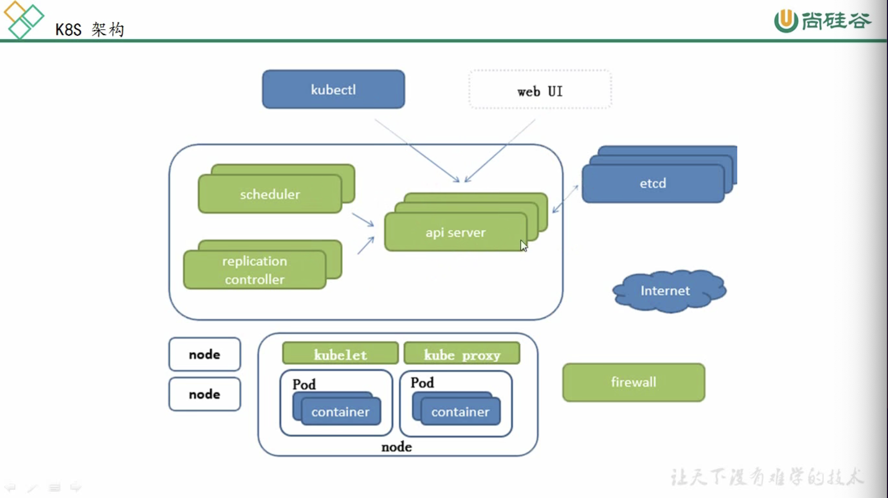

Mesos Apache ------ 分布式资源管理框架
Docker Swarm ------ Docker开放的框架
Kubernetes ------ Google开发的
    特点：
        轻量级：消耗资源小
        开源
        弹性伸缩
        负载均衡：IPVS
基础概念：什么事Pod 控制器类型   K8s 网络通讯模式
K8s：构建集群
资源清单：什么是资源  资源清单的语法 编写Pod   掌握Pod的生命周期
Pod控制器：掌握各种控制器的特点以及使用定义的方式
服务发现：掌握svc原理及其构建方式
存储：掌握多种存储类型的特点，并且能够在不同的环境中选择合适的存储方案（有自己的见解）
调度器：掌握调度器原理 能够根据要求把Pod定义到想要的节点运行
安全：集群认证 鉴权  访问控制    原理及流程
HELM：Linux yum  掌握HELM原理    HELM模版自定义 HELM部署一些常用插件 
运维：k8s源码修改  k8s高可用构建

etcd：官方将它定位成一个可信赖的分布式键之存储服务，它能够为整个分布式集群存储一些关键数据，协助分布式集群正常运转

数据服务分类：
    有状态服务：DBMS（数据库管理系统）
    无状态服务：LVS APACHE

master：
    Api server：所有服务访问统一入口
    ControllerManager：维持副本期望数
    Scheduler：负责介绍任务，选择合适的节点进行分配任务
    Etcd：键值对数据库 存储k8s集群所有的主要信息（持久化）
node：
    Kubelet：直接跟容器引擎交互实现容器的生命周期管理
    Kube-proxy：负责写入规则至IPTABLES、IPVS实现服务映射访问
其他插件：
    COREDNS：可以为集群中的SVC创建一个域名IP的对应关系解析
    DASHBOARD：给k8s集群提供一个B/S结构访问体系
    INGRESS CONTROLLER：官方只能实现4层代理，INGRESS可以实现7层
    FEDETATION：提供一个可以跨集群中心多K8S统一管理功能
    PROMETHEUS：提供k8s集群的监控能力
    ELK：提供K8s集群日志统一分析介入平台