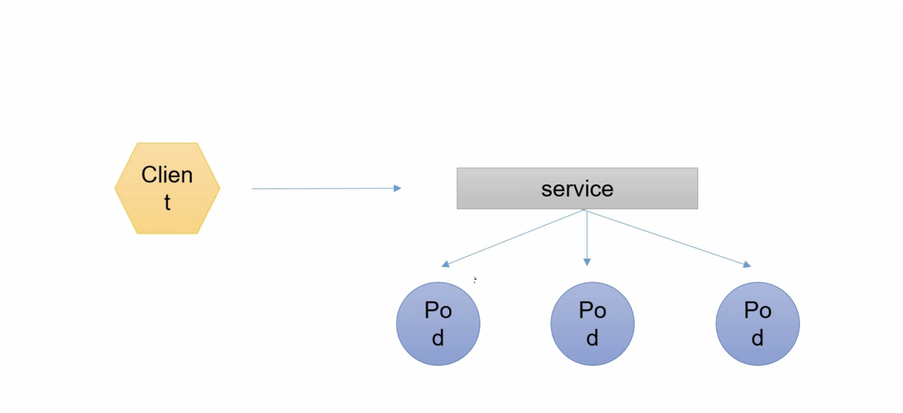
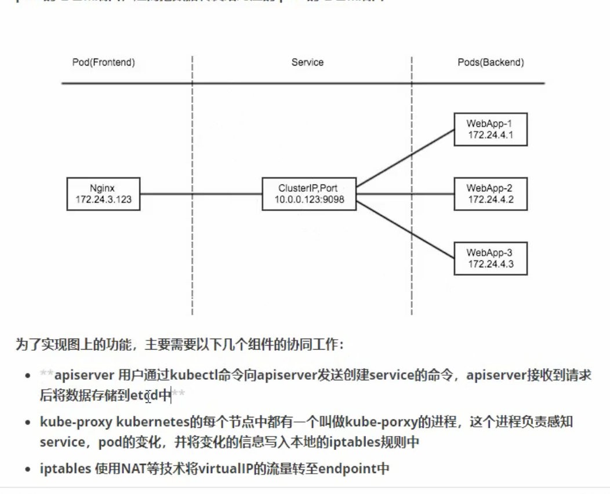
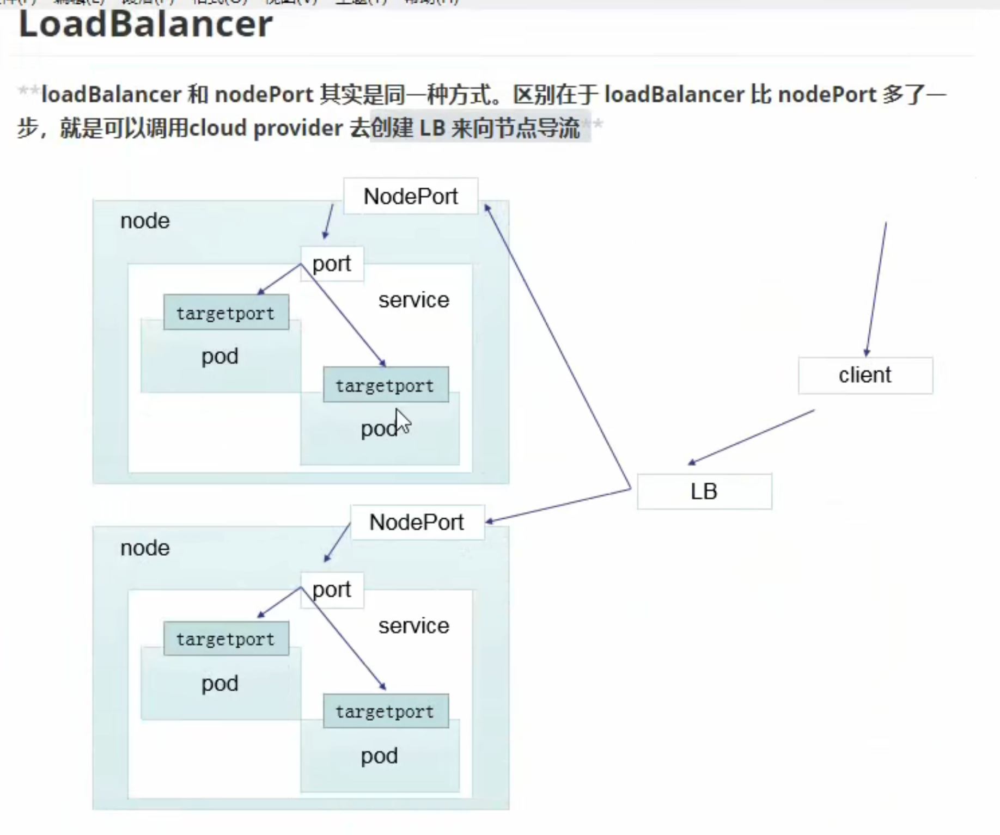
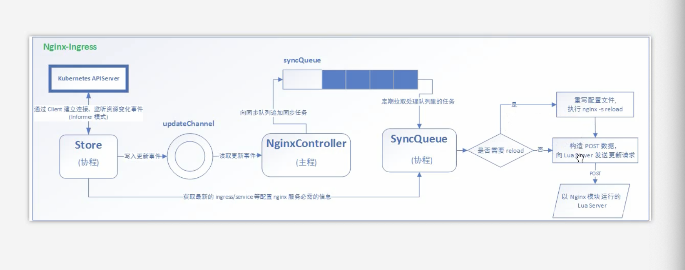

# k8s基础概念
Mesos Apache ------ 分布式资源管理框架
Docker Swarm ------ Docker开放的框架
Kubernetes ------ Google开发的
    特点：
        轻量级：消耗资源小
        开源
        弹性伸缩
        负载均衡：IPVS
基础概念：什么事Pod 控制器类型   K8s 网络通讯模式
K8s：构建集群
资源清单：什么是资源  资源清单的语法 编写Pod   掌握Pod的生命周期
Pod控制器：掌握各种控制器的特点以及使用定义的方式
服务发现：掌握svc原理及其构建方式
存储：掌握多种存储类型的特点，并且能够在不同的环境中选择合适的存储方案（有自己的见解）
调度器：掌握调度器原理 能够根据要求把Pod定义到想要的节点运行
安全：集群认证 鉴权  访问控制    原理及流程
HELM：Linux yum  掌握HELM原理    HELM模版自定义 HELM部署一些常用插件 
运维：k8s源码修改  k8s高可用构建

etcd：官方将它定位成一个可信赖的分布式键之存储服务，它能够为整个分布式集群存储一些关键数据，协助分布式集群正常运转

数据服务分类：
    有状态服务：DBMS（数据库管理系统）
    无状态服务：LVS APACHE

# k8s架构

master：
    Api server：所有服务访问统一入口
    ControllerManager：维持副本期望数
    Scheduler：负责介绍任务，选择合适的节点进行分配任务
    Etcd：键值对数据库 存储k8s集群所有的主要信息（持久化）
node：
    Kubelet：直接跟容器引擎交互实现容器的生命周期管理
    Kube-proxy：负责写入规则至IPTABLES、IPVS实现服务映射访问
其他插件：
    COREDNS：可以为集群中的SVC创建一个域名IP的对应关系解析
    DASHBOARD：给k8s集群提供一个B/S结构访问体系
    INGRESS CONTROLLER：官方只能实现4层代理，INGRESS可以实现7层
    FEDETATION：提供一个可以跨集群中心多K8S统一管理功能
    PROMETHEUS：提供k8s集群的监控能力
    ELK：提供K8s集群日志统一分析介入平台

# Pod控制器
类型：
    自主式pod：Pod退出了，此类型的Pod不会被创建
    控制器管理的pod：在控制器的生命周期里，始终要维持Pod的副本数
Pod控制器类型
    ReplicationController & ReplicaSet
        1，ReplicationController用来确保容器应用的副本数始终保持在用户定义的副本数，即如果有容器异常退出，会自动创建新的Pod来替代
        2，而如果异常多出来的容器也会自动回收。在新的版本Kubernetes中建议使用ReplicaSet来取代ReplicationController；
        3，ReplicaSet与ReplicationController没有本质的不同，只是名字不一样，并且ReplicaSet支持集合式的selector（通过标签来进行匹配）；
    Deployment
        1，Deployment为Pod和ReplicaSet提供了一个声明式定义（declarative）方法，用来替代以前的ReplicationController来方便管理应用。典型的应用场景：
            - 定义Deployment来创建Pod和ReplicaSet
            - 滚动升级和回滚应用
                虽然ReplicaSet可以独立使用，但一般还是建议使用Deployment管理ReplicaSet，这样就无需担心其他机制的不兼容问题（比如ReplicaSet不支持rolling-update但Deployment支持）；
                ：会重新启动一个ReplicaSet，然后逐个将pod移到新的RS下面。但是原来的ReplicaSet并不会删除，而是停用，如果要恢复，那么将pod逐个迁移回去，并启动。
            - 扩容和缩容
            - 暂停和继续Deployment
    HPA（Horizontal Pod Autoscaling）
        仅适用于Deployment和ReplicaSet，在V1版本中仅支持根据Pod的CPU利用率扩容，在vlalpha版本中，支持根据内存和用户自定义的metric扩容
        ：当CPU大于80%的时候会进行pod扩容，最大pod数不超过10个。直到CPU小于80%。
    StatefulSet是为了解决有状态服务的问题（对应Deployments和ReplicaSets是为无状态服务而设计），其应用场景包括：
        * 稳定的持久化存储，即Pod重新调度后还是能访问到相同的持久化数据，基于PVC来实现
        * 稳定的网络标志，即Pod重新调度后其PodName和HostName不变，基于Headless Service（即没有Cluster IP的Service）来实现
        * 有序部署，有序扩展，即Pod是有序的，在部署或者扩展的时候要依据定义的顺序依次进行（即从0到N-1，在下一个Pod运行之前所有的Pod必须是Running和Ready状态），基于init containers
        * 有序收缩，有序删除（即从N-1到0）
    DaemonSet确保全部（或者一些）Node上运行一个Pod副本。当有Node加入集群式，也会为他们新增一个Pod。当有Node从集群移除时，这些Pod也会被回收。删除DaemonSet将会删除它创建的所有Pod
        使用DaemonSet的一些典型用法：
            * 运行集群存储daemon，例如在每个Node上运行glusterd、ceph
            * 在每个Node上运行日志收集daemon，例如fluentd、logstash
            * 在每个Node上运行监控daemon。例如Proetheus Node Exporter
    Job：
        负责批处理任务，即仅执行一次的任务，它保证批处理任务的一个或多个Pod成功结束
    Cron Job
        管理基于时间的Job，即：
            * 在给定时间点只运行一次
            * 周期性的在给定时间点运行
总结：
    一般部署到RS&Deployment
    需要以node为节点的部署到DaemonSet
    有状态的服务部署到StatefulSet
    批处理的部署到Job&Cron Job
    自动扩展部署到HPA
使用：
    Deployment：
        
        
        
    DaemonSet：
        ：会确保集群节点运行一个pod副本
    Job：    
        
    Cron Job：
        
        
        
        

# Service
1，Kubernetes Service定义了这样一种抽象：一个Pod的逻辑分组，一种可以访问它们的策略 -- 通常为微服务
这一组Pod能够被Service访问到，通常是通过Label Selector；
2，客户端想去访问一组pod。如果这一组pod是不相关的，是不能通过service去代理的。service选择一组pod是通过标签去选择的。
被service代理后，service拥有自己的ip和端口，client就可以通过service间接的访问到具体的pod（通过Round Balance算法轮训访问）；
3，Service能够提供负载均衡的能力，但是在使用上有以下限制：
- 只提供4层负载均衡能力，而没有7层功能，但有时我们需要更多的规则来匹配转发请求，这点上4层负载均衡是不支持的

Service类型：
    ClusterIp：默认类型，自动分配一个仅Cluster内部可以访问的虚拟IP
    NodePort：在ClusterIP基础上为Service在每台机器绑定一个端口，这样可以通过<NodeIP>:NodePort来访问该服务
    LoadBalancer：在NodePort的基础上，借助cloud provider创建一个外部负载均衡器，并请求转发到<NodeIP>:NodePort
    ExternalName：把集群外部的服务引入到集群内部来，在集群内部直接使用。没有任何类型代理被创建，这只有Kubernetes1.7或者更高版本的K8s才支持
    
代理模式分类：
    VIP和Service代理：
        在Kubernetes集群中，每个Node运行一个kube-proxy进程。kube-proxy负责为service实现了一种VIP（虚拟IP）的形式，而不是ExternalName的形式。
        在Kubernetes v1.0版本，代理完全在userspace。在Kubernetes v1.1版本，新增了iptables代理，但是并不是默认的运行模式
        从Kubernetes v1.2起，默认就是iptables代理。在Kubernetes v1.14版本开始默认使用ipvs代理
        在Kubernetes v1.0版本，Service是4层（TCP/UDP over IP）概念。在Kubernetes v1.1版本新增了Ingress API（beta版），开始表示"7层"（HTTP）服务
    为什么不实用round-robin DNS？进行负载均衡？
        因为DNS有缓存
    1，userspace代理模式
        需要kube-proxy进行一层代理
        
    2，iptables代理模式
        所有的代理直接由防火墙iptables进行代理，而不需要kube-proxy
        
    3，ipvs代理模式
        这种模式，kube-proxy会监视Kubernetes service对象和Endpoints，调用netlink接口以相应的创建ipvs规则并定期与kubernetes service对象和endpoints对象同步ipvs规则
        以确保ipvs状态与期望一致。访问服务时，流量将被重定向到其中一个后段pod；
        与iptables类似，ipvs于netfilter的hook功能，但使用哈希表座位底层数据结构并在内核空间中工作。这意味着ipvs可以更快的重定向流量，并在同步代理规则时具有更好的性能。此外，ipvs为负载均衡提供了更多选项，例如：
            rr：轮训调度
            lc：最小连接数
            dh：目标哈希
            sh：源哈希
            sed：最短希望延迟
            nq：不排队调度
        
    ClusterIP Service的创建
        clusterIP主要在每个node节点使用iptables，将发向clusterIP对应端口的数据，转发到kube-proxy中。
        然后kube-proxy自己内部实现有负载均衡的方法，并可以查到这个service下对应pod的地址和端口，进而把数据转发给对应的pod地址和端口
        为了实现上述功能，需要几个组件协调工作：
            
        
    Headless Service的创建
        有时不需要或者不想要负载均衡，以及单独的Service IP。遇到这种情况，可以通过指定CLuster IP（spec.clusterIP）的值为"Node"来创建Headless Service。
        这类的service并不会分配Cluster IP，kube-proxy不会处理它们，而且平台也不会为它们进行负载均衡和路由
        
    NodePort Service的创建
        nodeport的原理在于在node上开了一个端口，将向该端口的流量导入到kube-proxy，然后由kube-proxy进一步到给对应的pod
        
    NodePort Service的创建（付费）
        
    ExternalName Service的创建
        

    

    
        

# 网络通讯方式
Kubernetes的网络模型假定了所有pod都在一个可以直接连通的扁平的网络空间中，这在CGE（Google Compute Engine）里面是现成的网络模型
Kubernetes假定这个网络已经存在。而在私有云里面搭建Kubernetes集群，就不能假定这个网络存在了。我们需要自己实现这个网络假设，将不同节点上的Docker容器之间互相访问先打通
然后运行Kubernetes

通讯模式：
    同一个pod内的多个容器之间：io（共用同一个pause的网络站，走的就是这个网络站的io）
    各pod之间的通讯：Overlay Network
    Pod和service之间的通讯：各节点的Iptables
    
Kubernetes + Flannel
    
    Flannel是CoreOS团队针对Kubernetes设计的一个网络规划服务，简单来说，它的功能是让集群中的不同节点主机创建的Docker容器都具有全集群唯一的虚拟IP地址。
    而且它还能在这些IP地址之间建立一个覆盖网络（Overlay Network），通过这个覆盖网络，将数据包原封不动的传递到目标容器内
    etcd之flannel提供说明：
        存储管理flannel可分配的ip地址段资源
        监控etcd中每个pod的实际地址，并在内存中建立维护pod节点路由表

# 资源清单
什么是资源：
    K8s中所有内容都抽象为资源，资源实例化之后，叫做对象
集群资源分类：
    名称空间级别：比如kubeadm安装k8s集群的时候会把所有的系统组建放在kube-system这个名称空间下面，当我们通过命令kubectl get pod -n default获取的时候是获取不到的
    集群级别：比如role，不管在什么名称空间下面定义，在其他名称空间下面都能拿得到（准确来说在定义的时候就没有指定名称空间）
    元数据级别：比如HPA
名称空间级别的资源类型
    工作负载型资源（workload）：Pod、ReplicaSet、Deployment、StatefulSet、DaemonSet、Job、CronJob（ReplicationController在v1.11版本中被废弃）
    服务发现及负载均衡型资源（ServiceDiscovery LoadBalance）：Service、Ingress...
    配置存储型资源：Volume（存储卷，给Pod提供持久化的能力）、CSI（容器存储接口，可以扩展各种何样的第三方存储券，只要pod符合csi的规范那么k8s集群就可以调用到pod的存储）
    特殊类型的存储卷：COnfigMap（当配置中心来使用的资源类型）、Secret（保存敏感数据）、DownwardAPI（把外部环境中的信息输出给容器）
集群资源：
    Namespace、Node、Role、ClusterRole、RoleBinding、ClusterRoleBinding
元数据型资源：
    HPA、PodTemplate、LimitRange
资源清单含义：
    在k8s中，一般使用yaml格式的文件来创建符合我们预期的pod。这样的yaml文件我们一般称为资源清单
资源清单属性：
    
    
    
    
容器的生命周期：

启动步骤：
    1，首先kubectl想kubeapi接口发送指令
    2，kubeapi会调度到kubelet（etcd完成的存储）
    3，kubelet去操作对应的CRI，CRI完成容器的初始化
    4，CRI会先启动一个pause的基础容器（负责同一个pod中网络以及存储卷的共享）
    5，进行1个或多个init C的初始化（也可以没有init C、init C初始化是逐个线形初始化的）
    6，init C正常初始化后进行main C的初始化
    7，main C初始化前允许执行一条start脚本的执行
    8，main C初始化前允许执行一条stop脚本的执行
    9，在main C初始化的过程中会有readiness和Liveness进行参与（readiness）
init容器：
    pod能够具有多个容器，应用运行在容器里面，但是它也可能有一个或多个先于应用容器启动的init容器
    init容器与普通容器非常像，除了如下两点：
        - init容器总是运行到成功完成为止
        - 每个init容器都必须在下个init容器启动之前完成
        如果pod的init容器失败，Kubernetes会不断的重启pod，直到init容器成功为止。然而，如果pod对应的restartPolocy为never，他不会重新启动
    init容器作用：
        
    init容器使用：
        
        
    init特殊说明：
        
        

容器探针：
    readiness：
        是就绪检测。一般在主容器main C运行后进行。根据命令、tcp连接、htpp协议获取状态判断容器是否可用。如果可用的话将pod容器状态改为running
    Liveness：
        是生存检测。会伴随整个pod的生命周期。当Liveness探测到main C主容器里面的进程出现损坏的时候，那么就会执行对应的重启命令或者删除命令等等
    探针是由kubelet对容器执行的定期诊断。要执行诊断，kubelet调用由容器实现的Handler。有三种类型的处理程序：
        ExecAction：在容器内执行指定命令。如果命令退出时返回码为0则认为诊断成功
        TCPSocketAction：对指定端口上的容器IP地址进行TCP检查。如果端口打开，则诊断被认为成功
        HTTPGetAction：对指定的端口和路径上的容器的IP地址执行HTTP Get请求。如果响应的状态码大于等于200小于400，则被认为诊断成功
    每次探测都将获得一下三种结果之一：
        成功：容器通过了诊断
        失败：容器未通过诊断
        未知：诊断失败，因此不会采用任何行动
    探测方式：
        livenessProbe：
            指示容器是否正在运行。如果探测失败，则kubelet会杀死容器，并且容器将受到其重启策略的影响。如果容器不提供存活探针，则默认状态为success
        readlinessProbe：
            指示容器是否准备好服务请求。如果就绪探测失败，端点控制器将从与Pod匹配的所有Service的端点中删除该Pod的IP地址
            初识延迟之前的就绪状态默认为Faliure。如果容器不提供就绪探针，则默认为success
    探针示例：
        
        
        
        就绪检测存活检测一样，只需要将livenessProbe改为readlinessProbe即可

start、stop、相位
    

Pod phase可能存在的可能性：
    也就是Pod的status
    

# ingress

入口网络是充当Kubernetes集群入口点的规则的集合。这允许入站连接，可以将其配置为通过可访问的URL，负载平衡流量或通过提供基于名称的虚拟主机在外部提供服务。
因此，Ingress是一个API对象，通常通过HTTP管理群集中对服务的外部访问，这是公开服务的最强大方法
1，Ingress HTTP代理访问

2，Ingress HTTPS代理访问

# 存储
## 1，Config Map
ConfigMap功能是在Kubernetes1.2版本中引入，许多应用程序会从配置文件、命令行参数或者环境变量中读取配置信息
ConfigMap API给我们提供了向容器中注入配置信息的机制，ConfigMap可以被用来保存单个属性，也可以用来保存整个配置文件或者JSON二进制大对象
ConfigMap的创建：
    1，使用目录创建：
        
        -from-file指定在目录下的所有文件都会被用在ConfigMap里面创建一个键值对，键的名字就是文件名，值就是文件内容
    2，使用文件创建
        
        -from-file这个参数可以使用多次，你可以使用两次分别指定上个实例中的那两个配置文件，效果就跟指定整个目录是一样的
    3，使用字面值创建
        
        使用字面值创建，利用-from-literal参数传递配置信息，该参数可以使用多次
在Pod中使用ConfigMap：
    
    
用ConfigMap设置命令行参数
    
在数据卷里面使用ConfigMap
    最基本的就是将文件填入数据卷，在这个文件中，键就是文件名，键值就是文件内容
    
ConfigMap的热更新
    
    
    修改ConfigMap以热更新：
        kubectl edit configmap log-config
    修改log_level的值为DEBUG等待大概10秒钟时间，再次查看环境变量的值
        打印查看：kubectl exec my-nginx-7b55868ff4-hzq22 -it --car /etc/log_level
    注意：ConfigMap如果以env的方式挂载到容器，修改ConfigMap并不会实现热更新
## 2，Secret
Secret解决了密码、token、密钥等敏感数据的配置问题，而不需要吧这些敏感数据暴露到镜像或者Pod Spec中。Secret可以以volume或者环境变量的方式使用。
Secret有三种类型：
    Service Account：用来访问Kubernetes API，由Kubernetes自动创建，并且会自动挂载到Pod的/run/secret/kubernetes.io/serviceaccount目录中
    Opaque：base64编码格式的secret，用来存储密码、密钥等
    Kubernetes.io/dockerconfigjson：用来存储私有docker registry的认证信息
## Service Account
Service Account用来访问Kubernetes API，由Kubernetes自动创建，并且会自动挂载到Pod的/run/secret/kubernetes.io/serviceaccount目录中

## Opaque Secret
1，创建说明
Opaque类型的数据是一个map类型，要求value是base64编码格式：

2，使用方式

3，kubernetes.io/dockerconfigjson
使用Kuberctl创建docker registry认证的secret

## 3，Volume
容器磁盘上的文件的生命周期是短暂的，这就使得在容器中运行重要应用时会出现一些问题。首先，当容器崩溃时，kubelet会重启它，但是容器中的文件将丢失---容器以干净的状态（镜像最初的状态）重新启动。
其次，在pod中同时运行多个容器，这些容器之间通常需要共享文件。Kubernetes中的vloume抽象就很好的解决了这些问题
背景：
Kubernetes中的卷有明确的寿命---与封装它的pod相同。所以，卷的生命比Pod中的所有容器都长，当这个容器重启时数据仍然得以保存。
当然，当Pod不再存在时，卷也将不复存在。也许更重要的是，Kubernetes支持多种类型的卷，Pod可以同时使用任意数量的卷
卷的类型：
    
    emptyDir：
        当Pod被分配给节点时，首先创建emptyDir卷，并且只要该Pod在该节点上运行，该卷就会存在。
        正如卷的名字所述，它最初是空的。Pod中的容器可以读取或写入emptyDir卷中的相同文件，尽管该卷可以挂载到每个容器中的相同或不同路径上。
        当出于任何原因从节点中删除Pod时，emptyDir中的数据永久删除
        emptyDir的用法有：
            - 暂存空间，例如用于基于磁盘的合并排序
            - 用作长时间计算崩溃时的检查点
            - Web服务器容器提供数据时，保存内存管理器容器提取的文件

https://mp.weixin.qq.com/s/2HwYG43pDP_5lSGPN825ZA
        

    

    

    

        