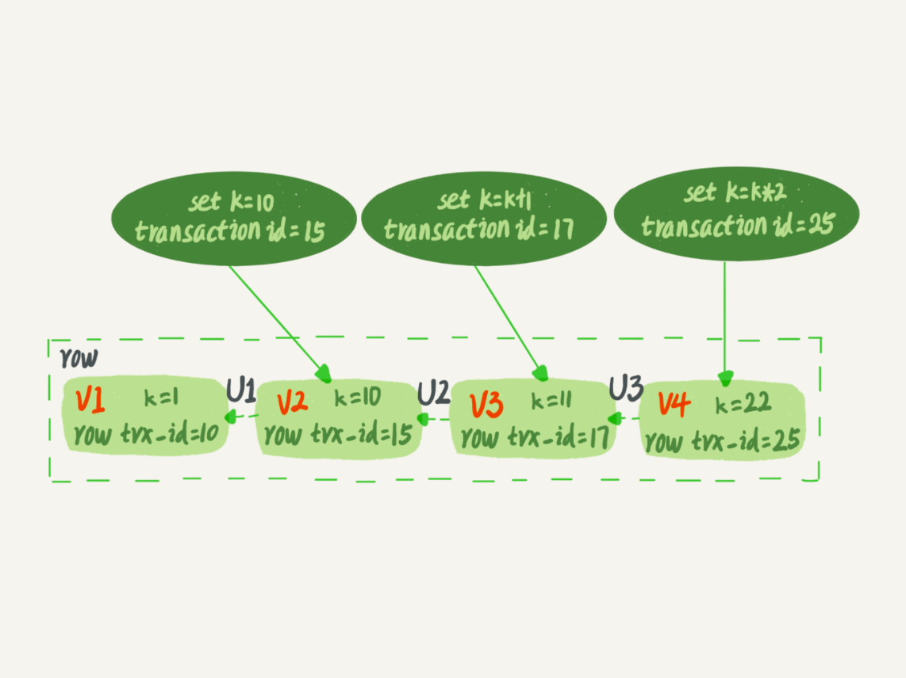
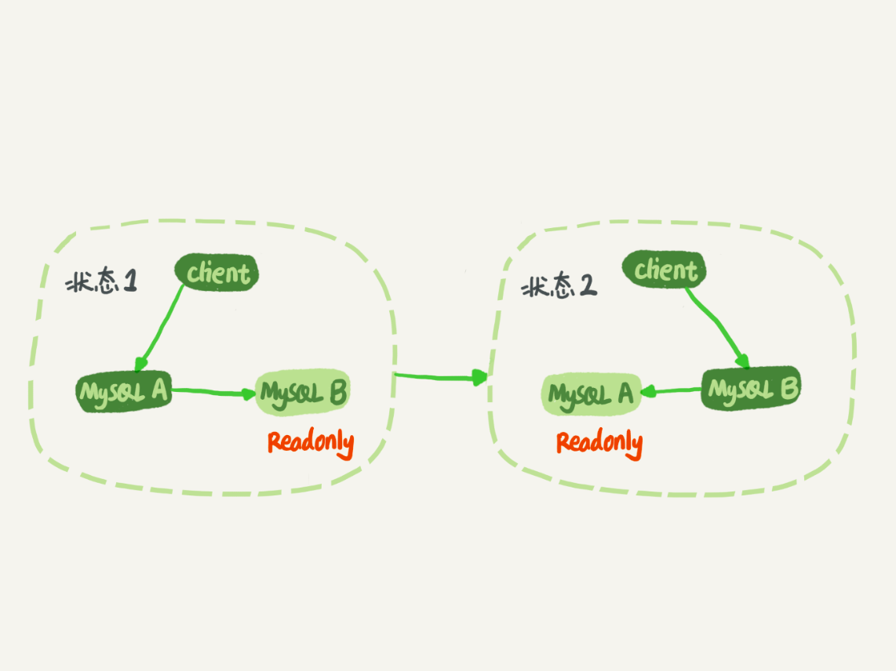
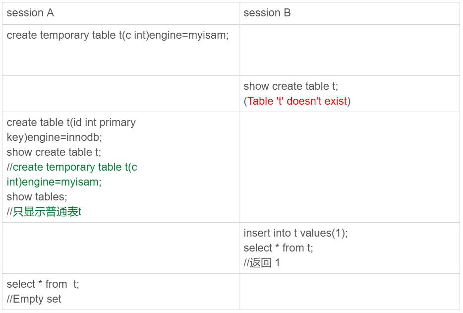

# Mysql存储引擎
什么是存储引擎？
说白了就是如何存储数据，如何为存储数据建立索引，如何更新、查询数据等技术实现方法
例如，如果你在研究大量临时数据，你也许需要内存存储引擎，因为内存存储引擎能够在内存中存储所有的表格数据。
或者你需要一个支持事物处理的数据库，以确保事务处理不成功时数据的回退能力，就选择支持事物的存储引擎

## 1，InnoDB存储引擎介绍
1，持ACID，简单地说就是支持事务完整性、一致性；
2，支持行锁，以及类似ORACLE的一致性读，多用户并发；
3，独有的聚集索引主键设计方式，可大幅提升并发读写性能

适用场景：
    - 更新密集的表。InnoDB存储引擎特别适合处理多重并发的更新需求
    - 事物
    - 自动灾难恢复。与其他存储引擎不同，InnoDB表能够自动从灾难中恢复
    - 外键约束。
    - 支持自动增加列AUTO_INCREMENT属性


## 2，MyISAM存储引擎
- 不支持事物，他的设计目标是面向在线分析应用
- 支持全文索引
- 表锁设计
- 它的缓冲池只缓冲索引文件，不缓冲数据文件，所以MyISAM存储引擎表由MYD和MYI组成，前者存储数据文件，后者存储索引文件

MyISAM表是独立于操作系统的，这说明可以轻松的将其从Windows服务器移植到Linux服务器
每当我们建立一个MyISAM引擎的表时，会在本地磁盘上建立三个文件，文件名就是表名
例如，我们建立一个MyISAM引擎的tb_Demo表，那么会生成一下三个文件：
tb_Demo.frm，存储表定义
tb_Demo.MYD，存储数据
tb_Demo.MYI，存储索引

适用场景：
    1，选择密集型数据。MyISAM存储引擎在筛选大量数据时非常迅速
    2，插入密集型数据。MyISAM的并发插入特性允许同时选择和插入数据

# Mysql事物
什么是事物？
    事物就是一个操作序列，这些操作要么都执行要么都不执行，是一个不可分割的单位。
MySql中的事物
    在缺省模式下，mysql是autocommit模式的，所有的数据库更新操作都会及时提交，在缺省情况下，mysql不支持事物。
    如果表类型使用InnoDB table的话，你的mysql可以使用事务处理，使用set autocommit=0用来设置非自动提交模式，这时你必须使用commit来提交你的更改，或者用rollback来回滚你的更改
事物的特性：
    原子性：事物中的所有操作是一个原子操作，要么全部完成，要不完全不起作用
        通过undolog来实现
    隔离性：事务是可以开启很多的，Mysql数据库中可以同时启动很多事务，但是事务和事务之间是相互隔离的互不影响的
        通过读写锁+MVCC
    持久性：持久性是指一个事务一旦被提交了，那么对数据库中的数据的改变就是永久性的，即便是在数据库系统遇到故障的情况下也不会丢失提交事务的操作。
        通过redolog来实现
    一致性：事务的执行使得数据库从一种正确状态转换成另一种正确状态，是指事物中的方法要么同时成功，要么都不成功
        通过原子性、持久性、隔离性来实现
事务的隔离级别：
    读未提交（read uncommitted） ：
        会读到另一个事务未提交的数据，产生脏读数据
    读提交（read committed）：
        读取到的都是已经提交的数据，解决了脏读。但是会有出现了不可重复读，即在一个事务任意时刻读到的数据可能不一样，可能会受到其他事务对数据修改提交后的影响
    可重复读（repeatable read：）：
        一个事物可以多次从数据库读取某条记录，而且多次读取的那条记录都是一致的。但是会有幻读的问题
        比如：事物A两次从数据库读取一系列记录，期间事物B插入了某条记录并提交。
        事物A第二次读取时，会读取到事物B刚刚插入的那条记录。在事物期间，事物A两次读取的一系列记录不一致，这个问题称为幻读
    串行化（serializable）：
        最强的隔离级别，事物开始执行时会对所有级别上锁。防止了脏读、不可重复读、幻读
    读为提交会导致很多并发问题，而性能相对于其他隔离级别并没有提升多少，因此很少使用
    串行化会强制事物串行化执行，并发效率很低，也很少使用。
    大多数操作系统中默认的隔离级别是读提交和可重复读。

# 事物的隔离性底层原理：
1，如果是一个事物写操作对另一个事物写操作：锁机制保证隔离性
2，如果是一个事物写操作对另一个事物读操作：MVCC保证隔离性

# MVCC保证隔离性
MVCC：全称Multi-Version Concurrency Control，即多版本的并发控制协议。
特点是在同一时刻不同事物读取到的数据可能是不同的版本，读不加锁，因此读写不冲突有很好的并发性能
底层：
    InnoDB的MVCC是通过在每行记录后面保存两个隐藏的列来实现的。
    一个保存了行事物ID（DB_TRX_ID），一个保存了行的回滚指针（DB_ROLL_PT）
    每开始一个新的事务，都会自动递增产 生一个新的事务id。
    ~~事物开始会把当前事物id放到这个事物中影响到的行的行事物ID（DB_TRX_ID）中。~~
    在读取数据的时候，MySql可以通过隐藏列来判断是否需要回滚并找到回滚的undo log
    从而实现MVCC。
增删改查时的处理：
    select：
        1，InnoDB只查找版本早于当前事务的版本的数据行，这样可以确保事务读取的行要么是在开始事务之前已经存在，要么事务自身插入或者修改过的
        2，行的删除版本号要么未定义，要么大于当前事务版本号，这样可以确保事务读取到的行在事务开始之前未被删除
    insert：InnoDB为新插入的每一行保存当前系统版本号作为行版本号
    delete：InnoDB为删除的每一行保存当前系统版本号作为删除标识
    update：InnoDB为插入的一行新纪录保存当前系统版本号作为行版本号，同时保存当前系统版本号到原来的行作为删除标识保存这两个版本号
解决不可重复读：
    
    当事物A在T2节点第一次读取数据时，会记录该数据的版本号，假设版本号为1；
    当事物B提交时，该行记录的版本号增加，假设版本号为2；
    当事物A在T5再一次读取数据时，发现数据的版本号（2）大于第一次读取时记录的版本号（1）
    因此会根据undo log执行回滚操作，得到版本号为1时的数据，从而实现了可重复读。
    好比说：
        一个事物启动的时候声明说，“以我启动的时刻为准，如果一个数据版本是在我启动之前生成的，就认；
        如果是我启动以后才生成的，我就不认，我必须要找到它的上一个版本”。当然，如果“上一个版本”也不可见，那就得继续往前找。
        还有，如果是这个事务自己更新的数据，它自己还是要认的
解决脏读问题：
    
    当事务A在T3时间节点读取zhangsan的余额时，会发现数据已被其他事务修改，且状态为未提交。
    此时事务A读取最新数据后，根据数据的undo log执行回滚操作，得到事务B修改前的数据，从而避免了脏读。
    具体实现也是使用的是ReadView，与上面相似。
解决幻读
    解决幻读和MVCC没有关系，是用间隙锁来解决的

# ReadView（快照）
在MVCC是结合ReadView来解决可重复读的问题的
InnoDB 为每个事务构造了一个数组m_ids，用来保存这个事务启动瞬间，当前正在“活跃”的所有事务 ID。“活跃”指的就是，启动了但还没提交。

如果落在绿色部分，即trx_id 属性值小于 m_ids 列表中最小的事务id，表示这个版本是已提交的事务或者是当前事务自己生成的，这个数据是可见的；
如果落在红色部分，即trx_id 属性值大于 m_ids 列表中最大的事务id，表示这个版本是由将来启动的事务生成的，是肯定不可见的；
如果落在黄色部分，那就需要判断一下 trx_id 属性值是不是在 m_ids 列表中：
    （1）如果在，说明创建 ReadView 时生成该版本的事务还是活跃的，表示这个版本是由还没提交的事务生成的，该版本不可以被访问
    （2）若 row trx_id 不在数组中，表示这个版本是已经提交了的事务生成的，可见。
可重复读：会在事物启动时生成一个快照。
读已提交：每次查询都会生成一个快照

# MySql中日志文件
（1）Redo log
    叫做重做日志，当事物提交之后会把所有修改信息存到该日志中，用来保障已提交事物的持久化特性。
    它是InnoDb引擎专属的。
    作用：
        在事物提交之后MySql并不会立即把修改的数据写入磁盘，而是先写入内存，然后由后台线程在适当的时候再把数据同步到磁盘。
        那么在数据还没有同步到磁盘，服务器宕机岂不是造成数据丢失？
        Redo log就可以解决这个问题，每次事物提交之后都会把修改信息记录如Redo log日志。
        在重启MySQL服务的时候，根据Redo Log进行重做，从而达到事务的未入磁盘数据进行持久化这一特性。
    一旦事务成功提交且数据持久化落盘之后，此时Redo log中的对应事务数据记录就失去了意义，所以Redo log的写入是日志文件循环写入的
    InnoDb的redo log是固定大小的，比如可以配置为一组4个文件，每个文件大小是1GB。
    从头开始写，写到末尾就回到开头循环写。如图
    redo log buffer
        1，redo log buffer 就是一块内存，用来暂存redo日志的
        2，在一个事务的更新过程中，日志是要写多次的。比如下面这个事务：
        ```
        begin;
        insert into t1 ...
        insert into t2 ...
        commit;
        ```
        这个事务要往两个表中插入记录，插入数据的过程中，生成的日志都得先保存起来，但又不能在还没 commit 的时候就直接写到 redo log 文件里。
        也就是说，在执行第一个 insert 的时候，数据的内存被修改了，redo log buffer 也写入了日志。但是，真正把日志写到 redo log 文件（文件名是 ib_logfile+ 数字），
        可能是在执行 commit 语句的时候做的。
    刷盘时机：
        redolog在事务进行过程中会不停的写入到redo log buffer。真正把日志写到 redo log 文件，可能是在执行 commit 语句的时候做的。
    每次提交事物都要记录redo log到磁盘，为什么不直接把MySql修改的数据写入磁盘呢？而是多此一举加一个redo log来保证MySql内存中的数据不会丢失？
        写 redo log 跟写数据有一个很大的差异，那就是 redo log 是顺序 IO。
        而写数据涉及到随机 IO，写数据需要寻址，找到对应的位置，然后更新/添加/删除
        而写 redo log 则是在一个固定的位置循环写入，是顺序 IO，所以速度要高于写数据。
（2）binlog
    主要记录数据的逻辑变化，是MySql的Server层实现的，所有引擎都可以使用
    记录的是这个语句的原始逻辑，比如“给 ID=2 这一行的 c 字段加 1 ”
    作用：归档
        binlog是追加写的，写到一定大小会切换到下一个，并不会覆盖以前的日志。
        是数据恢复和备份库的重要依据。因为他记录的是逻辑操作
        比如：数据恢复到今天8点整的状态
            1，先建立备份库
            2，读取MySQL的快照，如果我们每天0点做一次备份的话，那么就读取今天0点的快照，把备份库的数据先恢复到今天0点的状态。
            3，最后用备份库替换掉原库的数据。
    刷盘时机：
        默认1，只有事物提交的时候才会将binlog写入磁盘
        还有两个选项：
            0：不去强制要求，由系统自行判断何时写入磁盘；
            N：每N个事务，才会将binlog写入磁盘。
（3）undo log
    叫做回滚日志，用于记录数据被修改前的信息，为了在发生错误时回滚之前的操作，保障事物的原子性。
两阶段提交中，MySQL异常重启（crash），是如何保证数据完整性的？
    [img.png](images/两阶段提交.png)
    1，在上图时刻A中，也就是写入redo log处于prepare阶段以后、写binlog之前，发生了崩溃（crash）：由于此时binlog还没写，redo log也还没提交（commit），所以崩溃恢复的时候，这个事务会回滚。这时候，binlog还没写，所以也不会传到备库，数据一致；
    2，在上图时刻B中，也就是写完binlog之后，发生crash：如果redo log里面的事务有commit标识（事务是完整的）则直接提交；如果redo log里面的事务只有prepare没有commit，则判断对应的事务在binlog是否存在并完整，完整则提交事务，否则回滚事务；
    这里不太理解，按理说不管是Redo log还是binlog，都是在事物提交之后进行刷盘的。
    事物还没有提交之前发生crash，不会有Redo log和binlog信息，该事物会被回滚。
    难道是崩溃恢复后内存中的数据还在？


# 在没有索引的情况下，没办法快速定位到数据行怎么加锁？
没有索引的情况下，就获取所有行，都加上锁，然后mysql会再次过滤符合条件的行并释放锁，只有符合条件的才会继续持有锁，这样性能消耗会很大

# 当前读和快照读
快照读：
    读写不冲突，每次读取的是快照数据
    隔离级别Repeatable Read下（默认隔离级别）：有可能读取的不是最新的数据
    Read Committed隔离级别下：快照读和当前读读取的数据是一样的，都是最新的
当前读：
    每次读取的都是当前最新的数据，但是读的时候不允许写，写的时候也不允许读。
    update、deldete、insert、 select...lock in share mode、 select...for update都是当前读  

# mysql只读事务到底有什么作用？
很多人认为MySQL只读事务没啥用，有点鸡肋，以前我也这么认为，自从认真研究了事务的隔离级别和事务的并发问题后，发现这个只读事务其实并不是大家想象的那么无用。下面举一个实际开发中可能会遇到的例子来说明只读事务的作用。
展示用户列表的需求，后台从数据库查询用户列表返回给前端分页展示，分页通过数据库的分页功能实现，前端分页插件需要后台返回总共有多少条记录，以便渲染分页效果，后端返回的数据大概长这样：
{
    total:18,//总共多少条记录
    list: [...]//当前页记录
}
所以后台需要查询两次数据库：查询总数和查询列表。（有人会说，就不能全部查询出来再在代码里通过sublist分页吗？我这个例子里只有18条数据，万一有180万条数据呢，全部加载到内存不怕内存溢出吗？）
假设我第一次查询总数返回的是18条，结果在我第二次查询列表的时候数据表中插入了一条用户数据，然后我刚好查询的是第二页的数据，原本是有8条数据，结果现在查到了9条。然后就在页面看到了神奇的一幕：总共18条数据，按照每页显示10条来分页，结果第二页有9条数据，这不是有毛病么？
是的，上述情景就是典型的不可重复读问题。我们都知道有个事务隔离级别叫“可重复读”，此隔离级别可以实现可重复读，但是别忘了事务的隔离级别前提是要有事务啊，两个查询语句都没有处于事务中，还谈啥事务的隔离级别啊？还谈啥可重复读啊？这个我还真做过实验，就算事务的隔离级别是可重复读级别，两个查询语句没有处于事务中时，还是会出现不可重复读问题。
所以在可重复读隔离级别下需要结合事务才能实现可重复读，而只读事务比读写事务更高效，因为不需要写数据，所以做了一些优化。没错，只读事务就是这么来的。
还有人说只读事务不能进行写操作，这确实没错，但我认为不能写是结果而不是目的。
如果执行的是单条查询语句，是没有必要启用事务支持的，数据库默认执行sql执行期间的读一致性，如果是执行多条查询语句，例如统计查询，报表查询，在这种场景下，多条查询sql必须保证整体的读一致性
否则，在前条sql查询之后，后条查询之前，数据被其他用户改变，则会出现不一致的状态
   
        

# mysql的锁机制
MySQL 里面的锁大致可以分成全局锁、表级锁和行锁三类
全局锁
    全局锁就是对整个数据库实例加锁
    MySQL 提供了一个加全局读锁的方法，命令是 Flush tables with read lock (FTWRL)
    当你需要让整个库处于只读状态的时候，可以使用这个命令，之后其他线程的以下语句会被阻塞
    全局锁的典型使用场景是，做全库逻辑备份
    但是让整库都只读，听上去就很危险：
        如果你在主库上备份，那么在备份期间都不能执行更新，业务基本上就得停摆；
        如果你在从库上备份，那么备份期间从库不能执行主库同步过来的 binlog，会导致主从延迟。
    官方自带的逻辑备份工具是 mysqldump。当 mysqldump 使用参数–single-transaction 的时候，导数据之前就会启动一个事务，来确保拿到一致性视图。而由于 MVCC 的支持，这个过程中数据是可以正常更新的。
    但有的引擎是不支持这个隔离级别。**比如，对于 MyISAM 这种不支持事务的引擎，如果备份过程中有更新，总是只能取到最新的数据，那么就破坏了备份的一致性。这时，我们就需要使用 FTWRL 命令了。
表级锁
    表级别的锁有两种：一种是表锁，一种是元数据锁（meta data lock，MDL)。
    表锁
        **表锁的语法是 lock tables … read/write。**与 FTWRL 类似，可以用 unlock tables 主动释放锁，也可以在客户端断开的时候自动释放。
        注意：
            lock tables 语法除了会限制别的线程的读写外，也限定了本线程接下来的操作对象。
            比如如果在某个线程 A 中执行 lock tables t1 read, t2 write; 这个语句，则其他线程写 t1、读写 t2 的语句都会被阻塞。同时，线程 A 在执行 unlock tables 之前，也只能执行读 t1、读写 t2 的操作。连写 t1 都不允许，自然也不能访问其他表。
        在还没有出现更细粒度的锁的时候，表锁是最常用的处理并发的方式。而对于 InnoDB 这种支持行锁的引擎，一般不使用 lock tables 命令来控制并发，毕竟锁住整个表的影响面还是太大。
    元数据锁（meta data lock，MDL)
        **MDL 不需要显式使用，在访问一个表的时候会被自动加上。
        MDL 的作用是，保证读写的正确性。你可以想象一下，如果一个查询正在遍历一个表中的数据，而执行期间另一个线程对这个表结构做变更，删了一列，那么查询线程拿到的结果跟表结构对不上，肯定是不行的。
        因此，在 MySQL 5.5 版本中引入了 MDL，当对一个表做增删改查操作的时候，加 MDL 读锁；当要对表做结构变更操作的时候，加 MDL 写锁。
        读锁之间不互斥，因此你可以有多个线程同时对一张表增删改查。
        读写锁之间、写锁之间是互斥的，用来保证变更表结构操作的安全性。因此，如果有两个线程要同时给一个表加字段，其中一个要等另一个执行完才能开始执行。
        读锁之间不互斥，因此你可以有多个线程同时对一张表增删改查
        读写锁之间、写锁之间是互斥的，用来保证变更表结构操作的安全性。因此，如果有两个线程要同时给一个表加字段，其中一个要等另一个执行完才能开始执行。
        注意：我经常看到有人掉到这个坑里：给一个小表加个字段，导致整个库挂了。
            给一个表加字段，或者修改字段，或者加索引，需要扫描全表的数据。在对大表操作的时候，你肯定会特别小心，以免对线上服务造成影响。而实际上，即使是小表，操作不慎也会出问题。我们来看一下下面的操作序列，假设表 t 是一个小表。
            
            我们可以看到 session A 先启动，这时候会对表 t 加一个 MDL 读锁。由于 session B 需要的也是 MDL 读锁，因此可以正常执行。
            之后 session C 会被 blocked，是因为 session A 的 MDL 读锁还没有释放，而 session C 需要 MDL 写锁，因此只能被阻塞。
            如果只有 session C 自己被阻塞还没什么关系，但是之后所有要在表 t 上新申请 MDL 读锁的请求也会被 session C 阻塞。
            等于这个表现在完全不可读写了。
            如果某个表上的查询语句频繁，而且客户端有重试机制，也就是说超时后会再起一个新 session 再请求的话，这个库的线程很快就会爆满。
            事务中的 MDL 锁，在语句执行开始时申请，但是语句结束后并不会马上释放，而会等到整个事务提交后再释放。
        如何安全地给小表加字段？
            首先我们要解决长事务，事务不提交，就会一直占着 MDL 锁。
            在 MySQL 的 information_schema 库的 innodb_trx 表中，你可以查到当前执行中的事务。如果你要做 DDL 变更的表刚好有长事务在执行，要考虑先暂停 DDL，或者 kill 掉这个长事务。
            但考虑一下这个场景。如果你要变更的表是一个热点表，虽然数据量不大，但是上面的请求很频繁，而你不得不加个字段，你该怎么做呢？
            这时候 kill 可能未必管用，因为新的请求马上就来了。比较理想的机制是，在 alter table 语句里面设定等待时间，如果在这个指定的等待时间里面能够拿到 MDL 写锁最好，
            拿不到也不要阻塞后面的业务语句，先放弃。之后开发人员或者 DBA 再通过重试命令重复这个过程。
行级别锁
    前言
        **一般普通的select语句，InnoDB不加任何锁，我们称之为快照读**
        **通过加S锁和X锁的select语句或者插入/更新/删除操作，我们称之为当前读**
    什么是行级锁
        顾名思义，**行锁就是针对数据表中行记录的锁**。这很好理解，比如事务 A 更新了一行，而这时候事务 B 也要更新同一行，则必须等事务 A 的操作完成后才能进行更新。
        是mysql锁粒度最细的一种锁，表示只针对当前操作的行进行加锁。行级锁能大大减少数据库操作的冲突。其加锁粒度最小，但加锁的开销也最大有可能出现死锁的情况
        **InnoDB行锁是通过给索引项加锁来实现的，如果没有索引，InnoDB将通过隐藏的聚簇索引来对记录枷锁。**
    行级锁按照使用方式分为共享锁和排它锁
        **共享锁用法**（S锁 读锁）：
            若事务T对数据对象A加上读锁，则事务T可以读A但不能更改A，其他事务只能再对A加读锁，而不能加写锁，直到T释放A上的读锁。
            这保证了其他事务可以读A，但在T释放A上的读锁之前不能对A进行任何修改
            共享锁就是允许多个线程同时获取一个锁，一个锁可以同时被多个线程拥有
            加锁方式：```select * from table_name where ... lock in share mode;```
        **排它锁**（X锁 写锁）
            若事务T对数据对象加上写锁，事务T可以读A也可以修改A，其他的事物不能再对A加任何锁，直到T释放A上的锁。
            这保证了其他事务在T释放A上的锁之前不能再读取和修改A
            加锁方式：```select * from table_name where ... for update;```
    注意：
        1，**InnoDB的行锁是针对索引加的锁，不是针对记录加的锁。并且该索引不能失效，否则都会从行锁升级为表锁**。
        2，**于UPDATE、DELETE和INSERT语句，InnoDB会自动给涉及数据集加排他锁；对于普通SELECT语句，InnoDB不会加任何锁；当然我们也可以显示的加锁**：
    行锁升级为表锁
        1，**索引导致行锁升级表锁**
            
            在不使用索引的情况下加锁，上述示例中，在不给age字段加索引的情况下，尽管加锁的数据是不同的，但是事物2在加锁时会出现锁等待现象
            说明此时事物1从航行级锁升级为表锁，导致事物2再给age=15数据加锁时出现锁等待现象
            当我们给age加上索引之后：```alter table user add index idx_age(age);```
            就不会出现锁等待的情况了
        2，**范围性查询导致行锁升级为表锁**
            
            当要加锁的数据不确定的时候，也会由行锁升级为表锁
    两阶段锁协议
        在 InnoDB 事务中，**行锁是在需要的时候才加上的，但并不是不需要了就立刻释放，而是要等到事务结束时才释放**。
    死锁和死锁检测
        并发系统中不同线程出现循环资源依赖，涉及的线程都在等待别的线程释放资源时，就会导致这几个线程都进入无限等待的状态，称为死锁
        
        事务 A 在等待事务 B 释放 id=2 的行锁，而事务 B 在等待事务 A 释放 id=1 的行锁。 事务 A 和事务 B 在互相等待对方的资源释放，就是进入了死锁状态。
    死锁解决策略
        1，一种策略是，直接进入等待，直到超时。这个超时时间可以通过参数 innodb_lock_wait_timeout 来设置。
            innodb_lock_wait_timeout 的默认值是 50s，意味着如果采用第一个策略，当出现死锁以后，第一个被锁住的线程要过 50s 才会超时退出，
            然后其他线程才有可能继续执行。对于在线服务来说，这个等待时间往往是无法接受的。
            但是，我们又不可能直接把这个时间设置成一个很小的值，比如 1s。这样当出现死锁的时候，确实很快就可以解开，但如果不是死锁，而是简单的锁等待呢？所以，超时时间设置太短的话，会出现很多误伤。
            所以正常情况下会使用第二种策略
        2，另一种是发起死锁检测，发现死锁后，主动回滚死锁链条中的某一个事物，让其他事物继续执行。将参数 innodb_deadlock_detect 设置为 on，表示开启这个逻辑。
            主动死锁检测，而且 innodb_deadlock_detect 的默认值本身就是 on。主动死锁检测在发生死锁的时候，是能够快速发现并进行处理的，但是它也是有额外负担的。
            可以想象一下这个过程：每当一个事务被锁的时候，就要看看它所依赖的线程有没有被别人锁住，如此循环，最后判断是否出现了循环等待，也就是死锁
            那如果是我们上面说到的所有事务都要更新同一行的场景呢？
            每个新来的被堵住的线程，都要判断会不会由于自己的加入导致了死锁，
            这是一个时间复杂度是 O(n) 的操作。假设有 1000 个并发线程要同时更新同一行，那么死锁检测操作就是 100 万这个量级的。
            这个怎么解决呢？
                （1）确保这个业务一定不会出现死锁，可以临时把死锁检测关掉。
                但是这种操作本身带有一定的风险，因为业务设计的时候一般不会把死锁当做一个严重错误
                毕竟出现死锁了，就回滚，然后通过业务重试一般就没问题了，这是业务无损的。
                而关掉死锁检测意味着可能会出现大量的超时，这是业务有损的。
                （2）控制并发度。**根据上面的分析，你会发现如果并发能够控制住，比如同一行同时最多只有 10 个线程在更新，那么死锁检测的成本很低，就不会出现这个问题。
    for update使用场景
        如果遇到存在高并发并且对于数据的准确性很有要求的场景。
        比如：
            涉及到金钱库存等，一般这些操作都是很长一串，并且涉及到事物的。
            如果库存刚开始读的时候是1，而立马另一个进程进行了update将库存更新为0了
            而事物还没有结束，会将错的数据一直执行下去，就会有问题。所以需要for update进行数据加锁
            防止高并发时出错。
        使用：
            ```SELECT * FROM user WHERE id = 1 FOR UPDATE;```
            默认是行级别的锁，当有明确指定的主键/索引时候，是行级锁。否则是表级别。
            （1）明确指定主键/索引，并且有此记录，行级锁
                ```SELECT * FROM user WHERE id = 1 FOR UPDATE;```//id是主键
            （2）未指定主键/索引，并且有此记录，表级锁
                ```SELECT * FROM user WHERE name = '小明' FOR UPDATE;```//name上面没有索引
            （3）当我们使用范围条件而不是相等条件检索数据并请求共享锁或排他锁时
                ```SELECT * FROM user WHERE id > 6 FOR UPDATE;```
                InnoDB会给条件已有数据记录的索引项加锁，对于键值在条件范围但不存在的记录加间隙锁
            （4）如果查不到数据for update是否会加锁呢
                ```SELECT * FROM user WHERE id = 4 FOR UPDATE;```
                会的，有主键/索引产生间隙锁，无主键/索引产生表锁表级锁。   
间隙锁
    间隙锁的引入主要是为了解决在RR隔离界别的幻读问题。
    创建一个Table：
        ```
        CREATE TABLE `foo` (
        `uid` int(11) NOT NULL,
        `age` int(11) NOT NULL,
        PRIMARY KEY (`uid`),
        KEY `age` (`age`)
        ) ENGINE=InnoDB DEFAULT CHARSET=utf8;
        insert into foo values(1,1),(4,4),(7,7),(9,9);
        ```
    然后开两个mysql客户端M1和M2，执行顺序如下：
        ```
        M1: begin;
        M1: select * from foo were uid > 1 and uid < 5 for update;
        M2: begin;insert into foo values(2,2);commit;
        M1: select * from foo were uid > 1 and uid < 5 for update;
        M1: commit;
        ```
    如果M1在第一次执行select语句时只加行锁，那么锁住的只有uid=4这一行。
    M1第二次执行select语句时，由于M2插入了一条(2,2)，因此会多出一条(2,2)的记录。这就会产生幻读
    MySql的解决方案就是：使用间隙锁，将uid在间隙区间1～4,4～7全部加锁，这样当M2在insert行数据(2,2)甚至(6,6)会被锁阻塞防止M1出现幻读。
    另外看3条语句：
        ```
        M1: begin;
        M1: select * from foo were age = 4 for update;
        M2: begin;insert into foo values(6,6);commit;
        M1: select * from foo were age = 4 for update;
        M1: commit;
        ```
    手动执行一下就会发现M2会被锁阻塞住，这是因为他对age加了间隙锁（锁是加在索引上的）。
    直接对age=4这一条索引加锁就解决问题了，为什么要加间隙锁？
    因为二级索引中存储的主键，会参于二级索引排序，比如age索引进行排序时，实际用的是(age,uid)来进行排序。
    而之所以会使用uid参与排序我想大部分原因应该是B+树内不允许存储相同的值。
    我们需要使用age,uid进行拼接之后可以保证所有的二级索引，在B+树中的值一定是惟一的。
    由此可见我们无法直接锁住age=4这一条件，因为可能存在(age,uid) = (4,1)/(4,2)/(4,5)等任意索引
    二级索引在拼接时，由于age在前uid在后，因此age的值在一定程度上就代表了整个索引值。这也是为什么间隙锁可以锁住age=4这一条件。
    两种类型：
        Gap Locks：会锁住两个索引之间的区间，比如select * from user where id>3 and id<5 for update，就会在（3，5）之间加上Gap Locks
        Next-key Locks：是 Gap locks + Record Locks形成区间锁，select * from user where id>3 and id<5 for update会在【3，5】之间加上Next-key Locks
页面锁
    开销和加锁时间介于表锁和行锁之间；会出现死锁；锁定粒度介于表锁和行锁之间。并发度一般
    仅从锁角度，表级锁更适合查询为主，只有少量按索引条件更新数据的应用，如web应用；而行级锁则更适合有大量按索引条件并发更新少量不同数据，同时又有并发查询的应用，如一些在线事务处理系统    
乐观锁
    乐观锁不是数据库自带的，需要我们自己去实现。乐观锁是指操作数据库时(更新操作)，想法很乐观，认为这次的操作不会导致冲突，在操作数据时，并不进行任何其他的特殊处理（也就是不加锁），而在进行更新后，再去判断是否有冲突了。
    一般是通过为数据库表增加一个数字类型的 version字段来实现。当读取数据时，将version字段的值一同读出，数据每更新一次，对此version值加1。当我们提交更新的时候，判断数据库表对应记录的当前版本信息与第一次取出来的version值进行比对，
    如果数据库表当前版本号与第一次取出来的version值相等，则予以更新，否则认为是过期数据。
    ```
    1、查询出库存信息：
    select (id,count,version) from t_goodsku where id=#{id}
    2、扣减2个库存：
    程序中计算：count = count - 2;
    3、更新库存：
    update t_goodsku
    set count={count},version=version+1
    where id=#{id} and version=#{version};
    ```
悲观锁      
    悲观锁就是在操作数据时，认为此操作会出现数据冲突，所以在进行每次操作时都要通过获取锁才能进行对相同数据的操作，这点跟java中的synchronized很相似，所以悲观锁需要耗费较多的时间。另外与乐观锁相对应的，悲观锁是由数据库自己实现了的，要用的时候，我们直接调用数据库的相关语句就可以了。
    说到这里，由悲观锁涉及到的另外两个锁概念就出来了，它们就是共享锁与排它锁。共享锁和排它锁是悲观锁的不同的实现，它俩都属于悲观锁的范畴。
意向锁
    为了允许行锁和表锁共存，实现多粒度锁机制，InnoDB还有两种内部使用的意向锁（Intention Locks），这两种意向锁都是表锁。
        1，意向共享锁（IS）：事务打算给数据行加共享锁，事务在给一个数据行加共享锁前必须先取得该表的IS锁。
        2，意向排他锁（IX）：事务打算给数据行加排他锁，事务在给一个数据行加排他锁前必须先取得该表的IX锁。
    注意：意向锁之间是互相兼容的，虽然意向锁和自家兄弟互相兼容，但是它会与普通的排他 / 共享锁互斥
    举例说明：
        比如有一张users表，事物A获取了某一行排他锁并未提交：
            ```SELECT * FROM users WHERE id = 6 FOR UPDATE;```
        事物B想要获取users表的表锁：
            ```LOCK TABLES users READ;```
        因为共享锁排他锁互斥，所以事物B在视图对users表加共享锁的时候，必须保证：
            1，当前没有其他事务持有 users 表的排他锁
            2，当前没有其他事务持有 users 表中任意一行的排他锁 。
        为了检测是否满足第二个条件，事务 B 必须在确保 users表不存在任何排他锁的前提下，去检测表中的每一行是否存在排他锁
        很明显这是一个效率很差的做法，但是有了意向锁之后，情况就不一样了：
            事务 A 获取了某一行的排他锁，并未提交：```SELECT * FROM users WHERE id = 6 FOR UPDATE;```
            此时 users 表存在两把锁：users 表上的意向排他锁与 id 为 6 的数据行上的排他锁。
            事务 B 想要获取 users 表的共享锁：```LOCK TABLES users READ;```
            此时事务 B 检测事务 A 持有 users 表的意向排他锁，就可以得知事务 A 必然持有该表中某些数据行的排他锁，那么事务 B 对 users 表的加锁请求就会被排斥（阻塞），而无需去检测表中的每一行数据是否存在排他锁。
# mysql主从复制和读写分离
作用：
    在实际的生产环境中，对数据库的读和写都在同一个数据库服务器中，是不能满足实际需求的，通过主从复制的方式来同步数据，再通过读写分离来提升数据库的并发负载能力
mysql复制类型
    1，基于语句的复制。在服务器上执行sql语句，在从服务器上执行同样的语句，mysql默认采用基于语句的复制执行效率高
    2，基于行的复制。把改变的内容复制过去，而不是把命令在从服务器上执行一遍
    3，混合类型。默认采用基于语句的复制，一旦发现基于语句无法精确复制时，就会采用基于行的复制
复制过程：
    在每个事务更新数据完成之前，master在二进制日志记录这些改变。写入二进制日志完成后，master通知存储引擎提交事务
    1，slave将master的binary log复制到其中继日志。首先slave开始一个工作线程（I/O），I/O线程在master上打开一个普通连接，然后开始binlog dump process
    binlog dump process从master的二进制日志中读取事件，如果已经跟上master，它会睡眠等待master产生新的事件，I/O线程将这些事件写入中继日志。
    2，sql从线程处理该过程的最后一步，sql线程将从中继日志读取事件，并重新放其中的事件而更新slave日志。使其与master中的数据一致，
    只要该线程与I/O线程保持一致，中继日志通常会位于os缓存中，所以中继日志的开销很小
读写分离原理
    读写分离就是在主服务器上修改，数据会同步到从服务器，从服务器只能提供读数据，不能写入，实现备份的同时也实现了数据库的优化，提升了服务器的安全
    常见的mysql读写分离：
        1，基于程序代码内部实现
            在代码中根据select、insert进行路由分类，这类方法也是目前生产环境下应用最广泛的。优点是性能较好，
            因程序在代码中实现不需要增加额外的硬件开支，缺点是需要开发人员来实现，运维人员无从下手
        2，基于中间代理层实现
            代理层一般介于应用服务器和数据服务器之间，代理数据库服务器收到应用服务器的请求后根据判断后转发到后端数据库，有以下代表性的程序

主从同步的配置：
    1，登入主服务器的mysql，创建用于从服务器同步数据使用的账号
        GRANT REPLICATION SLAVE ON *.* TO 'slave'@'%' identified by 'slave';
        FLUSH PRIVILEGES;
    2，获取主服务器的二进制信息
        SHOW MASTER STATUS;
        File为使用的日志文件名字，Position为使用的文件位置，配置从服务器的时候会用到
    3，设置从服务器的my.ini
    4，进入从服务器的mysql，设置连接到master主服务器
        change master to master_host='192.168.204.129', master_user='slave', master_password='slave',master_log_file='mysql-bin.000001', master_log_pos=590;
        master_host：主服务器的ip地址；
        master_log_file：前面查询到的主服务器日志文件名
        master_log_pos：前面查询到的主服务器日志文件位置
    5，开启同步
        start slave 
读写分离配置（amoeba）：
    1，安装并配置Amoeba软件
        mkdir /usr/local/amoeba
        tar zxf amoeba-mysql-binary-2.2.0.tar.gz -C /usr/local/amoeba/
        chmod -R 755 /usr/local/amoeba/
        /usr/local/amoeba/bin/amoeba
        出现以下内容说明安装成功了
            [root@centos1 ]#  /usr/local/amoeba/bin/amoeba
            amoeba start|stop
            .
    2，配置amoeba读写分离，两个从节点读负载均衡
        在主从服务器上开放权限给amoeba（三台服务器上都做相同设置，这里以一台为例）
        mysql> grant all on *.* to liang@'192.168.1.%' identified by '123456';
    3，修改amoeba.xml文件
        [root@centos1 ]#  cd /usr/local/amoeba/
        [root@centos1 ]#  vim conf/amoeba.xml 
        ```
        <bean class="com.meidusa.amoeba.mysql.server.MysqlClientAuthenticator">
            <property name="user">amoeba</property>//这里的帐户名和密码在后面链接amoeba使用
            <property name="password">123456</property>
            <property name="filter">
                <property name="LRUMapSize">1500</property>
                <property name="defaultPool">master</property>//修改为master
                //注意：这里原有注释，需要删除
                <property name="writePool">master</property>//修改为master
                <property name="readPool">slaves</property>//修改为slaves
                <property name="needParse">true</property>
        ```
        [root@centos1 ]#  vim conf/dbServers.xml 
        ```
        <property name="user">liang</property>//之前设置开放权限的用户名和密码
        //注意删掉此位置的注释
        <property name="password">123456</property>
        //注意删掉此位置的注释
        </factoryConfig>
        .............................................................................
        <dbServer name="master"  parent="abstractServer">   //修改为master
            <factoryConfig>
                <!-- mysql ip -->
                <property name="ipAddress">192.168.1.30</property>  //修改IP
            </factoryConfig>
        </dbServer>
        <dbServer name="slave1"  parent="abstractServer">   //修改为slave1
            <factoryConfig>
                <!-- mysql ip -->
                <property name="ipAddress">192.168.1.40</property>  //修改IP
            </factoryConfig>    
        </dbServer>
        <dbServer name="slave2"  parent="abstractServer">   //复制一份，修改为slave2
            <factoryConfig>
                <!-- mysql ip -->
                <property name="ipAddress">192.168.1.50</property>  //修改IP
            </factoryConfig>
        </dbServer>
        <dbServer name="slaves" virtual="true">         //修改为slaves
            <poolConfig class="com.meidusa.amoeba.server.MultipleServerPool">
                <!-- Load balancing strategy: 1=ROUNDROBIN , 2=WEIGHTBASED , 3=HA-->
                <property name="loadbalance">1</property>
                <!-- Separated by commas,such as: server1,server2,server1 -->
                <property name="poolNames">slave1,slave2</property> //修改为slave1，slave2
            </poolConfig>
        </dbServer>
        </amoeba:dbServers>
        ```
        4，启动amoeba软件
            [root@centos1 ]#   bin/amoeba start&
            [root@centos1 ]#  netstat -anpt | grep java

# mysql索引
索引其实是一种数据结构，能够帮助我们快速的检索数据库中的数据
索引是帮助mysql高效获取数据的排好序的数据结构 
常见的索引模型
    hash索引
        哈希表是一种以键 - 值（key-value）存储数据的结构，我们只要输入待查找的值即 key，就可以找到其对应的值即 Value。
        思路很简单：用一个哈希函数把key换算成一个确定的位置，然后把 value 放在数组的这个位置
        不可避免的，多个key经过哈希函数换算，会出现同一个值的情况。处理这种情况的方法是拉出一个链表。
        示意图解析：
            
            图中，User2 和 User4 根据身份证号算出来的值都是 N，但没关系，后面还跟了一个链表。假设，这时候你要查 ID_card_n2 对应的名字是什么，处理步骤就是：首先，将 ID_card_n2 通过哈希函数算出 N；然后，按顺序遍历，找到 User2。
            需要注意的是，图中四个 ID_card_n 的值并不是递增的，这样做的好处是增加新的 User 时速度会很快，只需要往后追加。但缺点是，因为不是有序的，所以哈希索引做区间查询的速度是很慢的。
            你可以设想下，如果你现在要找身份证号在 [ID_card_X, ID_card_Y] 这个区间的所有用户，就必须全部扫描一遍了。
        哈希表这种结构适用于只有等值查询的场景，比如一些NoSQL引擎
        优点：
            hash索引底层是哈希表，是一种key-value存储数据的结构，所以多个数据在存储关系上完全没有任何顺序关系，所以对于区间查询是无法直接通过索引查询的，
            需要全表扫描，所以哈希索引只适合等值查询场景。
        缺点：
            1，利用hash存储的话需要将所有数据文件添加到内存，比较耗费内存空间
            2，如果所有的查询都是等值查询，那么hash确实快，但是在企业或者实际工作环境中范围查找的数据更多
            而不是等值查询，因此hash就不合适了
            3，会有哈希碰撞的问题，效率不一定比B树高
    数组索引
        有序数组在等值查询和范围查询场景中的性能就都非常优秀，还是以身份证好查询为例
        
        这里我们假设身份证号没有重复，这个数组就是按照身份证号递增的顺序保存的。这时候如果你要查 ID_card_n2 对应的名字，用二分法就可以快速得到，这个时间复杂度是 O(log(N))
        同时可以通过二分查找进行范围查询，你要查身份证号在 [ID_card_X, ID_card_Y] 区间的 User，可以先用二分法找到 ID_card_X（如果不存在 ID_card_X，就找到大于 ID_card_X 的第一个 User），然后向右遍历，直到查到第一个大于 ID_card_Y 的身份证号
        如果仅仅看查询效率，有序数组就是最好的数据结构了。但是，在需要更新数据的时候就麻烦了，你往中间插入一个记录就必须得挪动后面所有的记录，成本太高。
        所以数组索引只适合静态存储引擎索引，这类不会修改的数据
    二叉树索引优缺点：
        二叉搜索树也是课本里的经典数据结构了。还是上面根据身份证号查名字的例子，如果我们用二叉搜索树来实现的话，示意图如下所示：
        
        二叉搜索树的特点是：每个节点的左儿子小于父节点，父节点又小于右儿子。
        这样如果你要查 ID_card_n2 的话，按照图中的搜索顺序就是按照 UserA -> UserC -> UserF -> User2 这个路径得到。这个时间复杂度是 O(log(N))。
        当然为了维持 O(log(N)) 的查询复杂度，你就需要保持这棵树是平衡二叉树。为了做这个保证，更新的时间复杂度也是 O(log(N))。
        但是大多数的数据库存储却并不使用二叉树。其原因是，索引不止存在内存中，还要写到磁盘上。
        一棵 100 万节点的平衡二叉树，树高 20。一次查询可能需要访问 20 个数据块。在机械硬盘时代，从磁盘随机读一个数据块需要 10 ms 左右的寻址时间
        也就是说，对于一个 100 万行的表，如果使用二叉树来存储，单独访问一个行可能需要 20 个 10 ms 的时间，这个查询可真够慢的。
        而且如果数据本身是有序的，极端情况下会变成链表，性能急剧降低
    B+ 树（N叉树）
        为了让一个查询尽量少地读磁盘，就必须让查询过程访问尽量少的数据块。那么，我们就不应该使用二叉树，而是要使用“N 叉”树
        多叉树就是每个节点有多个儿子，儿子之间的大小保证从左到右递增。
        以 InnoDB 的一个整数字段索引为例，这个 N 差不多是 1200。这棵树高是 4 的时候，就可以存 1200 的 3 次方个值，这已经 17 亿了。
        考虑到树根的数据块总是在内存中的，一个 10 亿行的表上一个整数字段的索引，查找一个值最多只需要访问 3 次磁盘
InnoDB 的索引模型          
    InnoDB 使用了 B+ 树索引模型，所以数据都是存储在 B+ 树中的。每一个索引在 InnoDB 里面对应一棵 B+ 树。
    举例说明：
        假设，我们有一个主键列为 ID 的表，表中有字段 k，并且在 k 上有索引。
        ```
        create table T(
        id int primary key,
        k int not null,
        name varchar(16),
        index (k))engine=InnoDB;
        ```
        表中 R1~R5 的 (ID,k) 值分别为 (100,1)、(200,2)、(300,3)、(500,5) 和 (600,6)，两棵树的示例示意图如下。
        
        从图中可以看出，索引类型分为主键索引和非主键索引。
        主键索引的叶子节点存的是整行数据。在 InnoDB 里，主键索引也被称为聚簇索引（clustered index）。
        非主键索引的叶子节点内容是主键的值。在 InnoDB 里，非主键索引也被称为二级索引（secondary index）。
    那么基于主键索引和普通索引的查询有什么区别？
        如果语句是 select * from T where ID=500，即主键查询方式，则只需要搜索 ID 这棵 B+ 树；
        如果语句是 select * from T where k=5，即普通索引查询方式，则需要先搜索 k 索引树，得到 ID 的值为 500，再到 ID 索引树搜索一次。这个过程称为回表。
        也就是说，基于非主键索引的查询需要多扫描一棵索引树。因此，我们在应用中应该尽量使用主键查询。
    索引维护
        B+ 树为了维护索引有序性，在插入新值的时候需要做必要的维护。
        
        以上面这个图为例，如果插入新的行 ID 值为 700，则只需要在 R5 的记录后面插入一个新记录。
        如果新插入的 ID 值为 400，就相对麻烦了，需要逻辑上挪动后面的数据，空出位置。
        而更糟的情况是，如果 R5 所在的数据页已经满了，根据 B+ 树的算法，这时候需要申请一个新的数据页，然后挪动部分数据过去。这个过程称为页分裂。在这种情况下，性能自然会受影响。
        同时当相邻两个页由于删除了数据，利用率很低之后，会将数据页做合并。也是十分耗费性能的
        如何解决呢？
            在表里一定要有自增主键。
            自增主键的插入数据模式，正符合了我们前面提到的递增插入的场景。每次插入一条新记录，都是追加操作，都不涉及到挪动其他记录，也不会触发叶子节点的分裂。
            有业务逻辑的字段做主键，则往往不容易保证有序插入，这样写数据成本相对较高。
为什么采用B+ 树作为索引
    使用二叉树时，索引存放的是具体数据以及存放在磁盘上的地址，类似key-value的形式，但是在极端的情况下会变成链表，造成深度过多，IO次数增加
    使用红黑树时，深度也会过多，造成io次数过多
    使用hash表在存储索引的时候，会把索引值做一个哈希运算生成的散列值当作索引值，搜索的时候把值做一个hash运算
    然后就能快速找到具体的值，哈希散列和值是一一对应的关系，但是在范围搜索的时候并不适合
    如果想要深度降低，那就需要横向增加，让每个节点上存储更多的元素，这就有了B-tree：
        叶子节点具有相同的深度，叶子结点指针为空
        所有索引元素不重复
        节点中的数据索引从左至右递增排列
    升级后就有了B+tree
        几千万的数据只需要进行3次io
        1，把所有的索引元素在叶子节点有一份全量的索引元素，把处于中间位置的一些元素提取出来放到非叶子节点作为冗余元素
        2，非叶子结点存储的是索引键值（就是主键）和子节点的内存地址，是成对出现的！！！，不存储具体的数据，这样的话节省很多空间
        一个叶子节点的大小是16kb，那么一个节点就可以存放大概1170个元素，那么高度为3的B+树，就可以存放一千万的数据
        3，每个叶子结点包含的元素是指针、键值（主键）、索引数据，叶子结点存放在磁盘节省内存空间，叶子结点之间会用指针链接，提高区间访问性能（在进行范围查找的时候）
        4，索引存放在磁盘中，同时可以分批加入内存，提高查询效率
        索引的元素按理说是存储在磁盘上面的，为什么不能将全量的元素都放在叶子结点呢？这样直接加载到内存速度也很快，这样的话浪费时间，而且浪费内存
        非叶子节点不存储data，只存储索引（会有冗余），可以放更多的索引，叶子节点包含所有索引字段，叶子结点用指针连接，提高区间访问性能  
        叶子节点之间有链表，非常适合范围查找，本来叶子之间就是有序的，在范围查找的时候
        比如查找大于20的数据，就可以直接取叶子几点20之后的数据，如果叶子结点之间没有链表的话，就需要向上查找，非常耗时
回表
    ```
    create table T (
    ID int primary key,
    k int NOT NULL DEFAULT 0,
    s varchar(16) NOT NULL DEFAULT '',
    index k(k))
    engine=InnoDB;
    ```
    如果我执行 select * from T where k between 3 and 5，需要执行几次树的搜索操作，会扫描多少行？
    1，在 k 索引树上找到 k=3 的记录，取得 ID = 300；
    2，再到 ID 索引树查到 ID=300 对应的 R3；
    3，在 k 索引树取下一个值 k=5，取得 ID=500；
    4，再回到 ID 索引树查到 ID=500 对应的 R4；
    5，在 k 索引树取下一个值 k=6，不满足条件，循环结束。
    在这个过程中，回到主键索引树搜索的过程，我们称为回表。
    由于查询结果所需要的数据只在主键索引上有，所以不得不回表。那么，有没有可能经过索引优化，避免回表过程呢？
覆盖索引
    如果执行的语句是 select ID from T where k between 3 and 5，这时只需要查 ID 的值，
    而 ID 的值已经在 k 索引树上了，因此可以直接提供查询结果，不需要回表。也就是说，在这个查询里面，
    索引 k 已经“覆盖了”我们的查询需求，我们称为覆盖索引。
    由于覆盖索引可以减少树的搜索次数，显著提升查询性能，所以使用覆盖索引是一个常用的性能优化手段。
    注意：
        在引擎内部使用覆盖索引在索引 k 上其实读了三个记录，R3~R5（对应的索引 k 上的记录项）
        但是对于 MySQL 的 Server 层来说，它就是找引擎拿到了两条记录，因此 MySQL 认为扫描行数是 2。
    基于上面覆盖索引的说明，我们来讨论一个问题：在一个市民信息表上，是否有必要将身份证号和名字建立联合索引？
        我们知道，身份证号是市民的唯一标识。也就是说，如果有根据身份证号查询市民信息的需求，我们只要在身份证号字段上建立索引就够了
        如果现在有一个高频请求，要根据市民的身份证号查询他的姓名，这个联合索引就有意义了。它可以在这个高频请求上用到覆盖索引，不再需要回表查整行记录，减少语句的执行时间。
最左匹配原则
    如果为每一种查询都设计一个索引，索引是不是太多了。
    如果我现在要按照市民的身份证号去查他的家庭地址呢？
    虽然这个查询需求在业务中出现的概率不高，但总不能让它走全表扫描吧？反过来说，单独为一个不频繁的请求创建一个（身份证号，地址）的索引又感觉有点浪费。应该怎么做呢？
    这里，我先和你说结论吧。B+ 树这种索引结构，可以利用索引的“最左前缀”，来定位记录。
    不是需要索引的全部定义，只要满足最左前缀，就可以利用索引来加速检索。
    这个最左前缀可以是联合索引的最左 N 个字段，也可以是字符串索引的最左 M 个字符。
    所以我们可以通过（身份证号，姓名）这个联合索引，来利用身份证号索引然后通过回表找到地址信息
基于最左前缀索引，我们来讨论一个问题：在建立联合索引的时候，如何安排索引内的字段顺序？
    评估标准是，索引的复用能力。
    因为可以支持最左前缀，所以当已经有了 (a,b) 这个联合索引后，一般就不需要单独在 a 上建立索引了。
    第一原则是：
        如果通过调整顺序，可以少维护一个索引，那么这个顺序往往就是需要优先考虑采用的。
    第二原则：
        那么，如果既有联合查询，又有基于 a、b 各自的查询呢？
        查询条件里面只有 b 的语句，是无法使用 (a,b) 这个联合索引的，这时候你不得不维护另外一个索引，也就是说你需要同时维护 (a,b)、(b) 这两个索引。
        这时候，我们要考虑的原则就是空间了。比如上面这个市民表的情况，name 字段是比 age 字段大的 ，那我就建议你创建一个（name,age) 的联合索引和一个 (age) 的单字段索引。
索引下推
    上一段我们说到满足最左前缀原则的时候，最左前缀可以用于在索引中定位记录。这时，你可能要问，那些不符合最左前缀的部分，会怎么样呢？
    我们还是以市民表的联合索引（name, age）为例。如果现在有一个需求：检索出表中“名字第一个字是张，而且年龄是 10 岁的所有男孩”。那么，SQL 语句是这么写的：
    ```select * from tuser where name like '张 %' and age=10 and ismale=1;```
    你已经知道了前缀索引规则，所以这个语句在搜索索引树的时候，只能用 “张”，找到第一个满足条件的记录 ID3。当然，这还不错，总比全表扫描要好。
    然后是判断其他条件是否满足。
    在 MySQL 5.6 之前，只能从 ID3 开始一个个回表。到主键索引上找出数据行，再对比字段值。
    而 MySQL 5.6 引入的索引下推优化（index condition pushdown)， 可以在索引遍历过程中，对索引中包含的字段先做判断，直接过滤掉不满足条件的记录，减少回表次数。
    图 3 和图 4，是这两个过程的执行流程图。
    
    
    无索引下推时，InnoDB 并不会去看 age 的值，只是按顺序把“name 第一个字是’张’”的记录一条条取出来回表。因此，需要回表 4 次。
    索引下推时，InnoDB 在 (name,age) 索引内部就判断了 age 是否等于 10，对于不等于 10 的记录，直接判断并跳过

聚集索引和非聚集索引
    区别就是索引和数据是否分开存储        
    InnoDB索引实现（聚集）
        叶子结点的 存储的是索引值和具体的数据 
    MySAM索引文件个数据文件是分离的（非聚集）
        叶子结点存储的是索引值和磁盘文件地址，找到索引后会根据磁盘文件地址在myd文件找到具体的索引
        
为什么InnoDB表必须包含主键，并且使用Int类型的自增主键
    首先InnoDB存储引擎，如果自己不设置主键，存储引擎也会自动给加一个主键
    使用int类型作为主键是因为，在查找的时候相互比效率比较高，而且int类型节约空间
    要自增，如果主键不自增的话，在插入一条数据的时候，要维护到索引里面查找的时候需要分裂是非常耗费性能的，如果是递增的那就是一直往后面加元素
 
为什么非主键索引结构叶子节点存储的是主键值？（一致性和节省存储空间）
    1，保持一致性
        当数据库进行dml操作时，同一行记录的页地址会发生改变，因非主键索引保存的是主键值，无需进行更改
    2，节省存储空间
        innodb数据本身就已经汇聚到主键索引所在的B+树了，如果普通索引还继续再保存一份数据，就会导致有多少索引就要存多少份数据
    商城系统订单表会存储一个用户ID作为关联外键，而不推荐完整的用户信息，因为当我们用户表中的信息（真实名称，手机号，收货地址...）修改后，
    不需要再次维护订单表的用户数据，同时也节省了存储空间

联合索引底层结构
    由数据库a字段和b字段组成一个联合索引
    本质上来说，联合索引也是一个B+树，和单值索引不同的是，联合索引的键值对不是1个，而是大于1个
    a,b排序分析：
    a顺序：1，1，2，2，3，3
    b顺序：1，2，1，4，1，2
    大家可以发现a字段是有序排列的，b字段是无序排列的（因为B+树只能选一个字段构建有序的树）
    又不小心发现，在a相等的情况下，b字段是有序的。
    使用联合索引时，索引列的定义顺序将会影响到最终索引的使用情况。例如联合索引（a,b,c），mysql会从最左边的列优先匹配，如果最左边的没起到作用，在未使用覆盖索引的情况下就只能全表扫描
    从联合索引的底层结构思考，mysql会优先以联合索引第一列匹配，才会匹配下一列，如果不指定第一列匹配值，就无法得知下一步查询哪个节点
    另一种情况，如果遇到范围查询，那B+树也无法对下一列进行等值匹配了
    
索引失效
    1，对于多列索引，不是使用的第一部分，则不会使用索引
        遵循最佳左前缀法则的例子：select * from testTable where a=1 and b=2
            首先a字段在B+树上是有序的，所以我们可以通过二分查找法来定位到a=1的位置。
            其次在a确定的情况下，b是相对有序的，因为有序，所以同样可以通过二分查找法找到b=2的位置。
        不遵循最佳左前缀的例子：select * from testTable where b=2
            我们来回想一下b有顺序的前提：在a确定的情况下。
            现在你的a都飞了，那b肯定是不能确定顺序的，在一个无序的B+树上是无法用二分查找来定位到b字段的。
            所以这个时候，是用不上索引的。
    2，对于多列索引，使用了第一部分，但是通过第一部分查询出来的值是不确定的，也不会使用索引
        select * from testTable where a>1 and b=2
        首先a字段在B+树上是有序的，所以可以用二分查找法定位到1，然后将所有大于1的数据取出来，a可以用到索引。 
        b有序的前提是a是确定的值，那么现在a的值是取大于1的，可能有10个大于1的a，也可能有一百个a。 
        大于1的a那部分的B+树里，b字段是无序的（开局一张图），所以b不能在无序的B+树里用二分查找来查询，b用不到索引。
    3，like后缀匹配和中缀匹配
        字符串的排序方式：先按照第一个字母排序，如果第一个字母相同，就按照第二个字母排序。。。以此类推
        %号放右边（前缀）：由于B+树的索引顺序，是按照首字母的大小进行排序，前缀匹配又是匹配首字母。所以可以在B+树上进行有序的查找，查找首字母符合要求的数据。所以有些时候可以用到索引
        %%叫做（中缀）：这个是查询任意位置的字母满足条件即可，只有首字母是进行索引排序的，其他位置的字母都是相对无序的，所以查找任意位置的字母是用不上索引的。
        %放在左边（后缀）：尾部的字母是没有顺序的，所以不能按照索引顺序查询，就用不到索引
    4，做函数计算
        ```select count(*) from tradelog where month(t_modified)=7;```
        会发现虽然字段t_modified有索引，但是却不管用，会做全表扫描。
        
        从以上示意图可以看出，如果计算 month() 函数的话，你会看到传入 7 的时候，在树的第一层就不知道该怎么办了
    5，隐式类型转换，导致索引失效
        我们一起看这条sql语句：```select * from tradelog where tradeid=110717;```
        tradeid 的字段类型是 varchar(32)，而输入的参数却是整型。所以需要做类型转换。
        这条语句转换后相当于这样：```select * from tradelog where CAST(tradid AS signed int) = 110717;```
        因为对索引字段做了函数操作，所以优化器放弃走树搜索功能。
    6，如果mysql估计使用全表扫描要比使用索引快,则不使用索引
        比如使用or，```select * from users where id=11 or name="张三"```
        这里id=11会走主键索引，但是name="张三"没有加索引需要全表扫描
        索性直接全表扫描


# 数据库设计三大范式
1，第一范式（确保每列原子性）
    是最基本的范式。如果数据库表中所有字段都是不可拆分的原子值，就说明该数据库满足了第一范式
    第一范式的合理遵循需要根据系统的实际需求来定。比如某些数据库系统中需要用到“地址”这个属性，本来直接将“地址”属性设计成一个数据库表的字段就行。但是如果系统经常会访问“地址”属性中的“城市”部分，那么就非要将“地址”这个属性重新拆分为省份、城市、详细地址等多个部分进行存储，这样在对地址中某一部分操作的时候将非常方便。这样设计才算满足了数据库的第一范式，如下表所示。
2，第二范式（确保表中每列都和主键有关）
    在一个数据库表中，一个表中只能保存一种数据，不可以把多种数据保存在同一张数据库表中。
    第二范式需要确保数据库表中的每一列都和主键相关，而不能只与主键的某一部分相关（主要针对联合主键而言）。
    比如要设计一个订单信息表，因为订单中可能会有多种商品，所以要将订单编号和商品编号作为数据库表的联合主键。
    这样就产生一个问题：这个表中是以订单编号和商品编号作为联合主键。这样在该表中商品名称、单位、商品价格等信息不与该表的主键相关，而仅仅是与商品编号相关。所以在这里违反了第二范式的设计原则。
    而如果把这个订单信息表进行拆分，把商品信息分离到另一个表中，把订单项目表也分离到另一个表中，就非常完美了。
    这样设计，在很大程度上减小了数据库的冗余。如果要获取订单的商品信息，使用商品编号到商品信息表中查询即可。
3，第三范式(确保每列都和主键列直接相关,而不是间接相关)
    比如在设计一个订单数据表的时候，可以将客户编号作为一个外键和订单表建立相应的关系。而不可以在订单表中添加关于客户其它信息（比如姓名、所属公司等）的字段。如下面这两个表所示的设计就是一个满足第三范式的数据库表。

# ShardingSphere-Proxy
ShardingSphere-Proxy就是代理，类似网关，对外暴露一个入口，请求过来时，将请求转发到配置的真实的mysql实例。
转发之前做了一些处理工作，如果请求（也就是sql语句）带了分片键，则根据分片算法计算出真实的mysql实例以及表名，查询效率高
1，首先要编写的是server.yaml，配置全局信息
    ##治理中心
    # orchestration:
    #   name: orchestration_ds
    #   overwrite: true
    #   registry:
    #     type: zookeeper
    #     serverLists: localhost:2181
    #     namespace: orchestration
    #权限配置
    authentication:
      users:
        root:               #用户名
          password: root	#密码
        sharding:
          password: sharding 
          authorizedSchemas: sharding_db	#只能访问的逻辑数据库
    #Proxy属性
    props:
      max.connections.size.per.query: 1
      acceptor.size: 16  #用于设置接收客户端请求的工作线程个数，默认为CPU核数*2
      executor.size: 16  # Infinite by default.
      proxy.frontend.flush.threshold: 128  # The default value is 128.
        # LOCAL: Proxy will run with LOCAL transaction.
        # XA: Proxy will run with XA transaction.
        # BASE: Proxy will run with B.A.S.E transaction.
      proxy.transaction.type: LOCAL 	#默认为LOCAL事务
      proxy.opentracing.enabled: false     #是否开启链路追踪功能，默认为不开启。
      query.with.cipher.column: true
      sql.show: true				#SQL打印
      check.table.metadata.enabled: true			#是否在启动时检查分表元数据一致性，默认值: false
    # proxy.frontend.flush.threshold: 				# 对于单个大查询,每多少个网络包返回一次
2，分库分表（编辑config-sharding.yaml）
    //对外数据库名称
    schemaName: sharding_db
    //数据库链接公共参数
    dataSourceCommon:
     username: root
     password: 123456
     connectionTimeoutMilliseconds: 30000
     idleTimeoutMilliseconds: 60000
     maxLifetimeMilliseconds: 1800000
     maxPoolSize: 50
     minPoolSize: 1
     maintenanceIntervalMilliseconds: 30000
    //数据库地址，这里配置了两个库
    dataSources:
     ds_0:
       url: jdbc:mysql://127.0.0.1:3306/demo_ds_0?serverTimezone=UTC&useSSL=false
     ds_1:
       url: jdbc:mysql://127.0.0.1:3306/demo_ds_1?serverTimezone=UTC&useSSL=false
    //分片规则
    rules:
    - !SHARDING
     tables:
       //虚拟表名称，最后登陆 proxy之后，sharding_db库下只有一张表 test（我这里只分了一个表，用于测试）
       test:
         //ds_${0..1} 分库规则，库索引从0到1，一共两个，前缀为：ds_， test，分成3张表，索引从0到2，前缀为：test_
         actualDataNodes: ds_${0..1}.test_${0..2}
         tableStrategy:
           standard:
             //分片键
             shardingColumn: id
             shardingAlgorithmName: test_inline
         keyGenerateStrategy:
           column: id
           keyGeneratorName: snowflake  #主键生成策略 -- 雪花算法
    //默认数据库分片规则
     defaultDatabaseStrategy:
       standard:
         //依据 id 进行分片
         shardingColumn: id
         shardingAlgorithmName: database_inline
     defaultTableStrategy:
       none:
     shardingAlgorithms:
       database_inline:
         type: INLINE
         props:
           //数据库分片规则， id取模2，结果有 0 和 1，路由到 0 和 1这两个数据库
           algorithm-expression: ds_${id % 2}
       test_inline:
         type: INLINE
         props:
           //数据库表分表规则：id 模 3，结果有：0、1、2, 得到 test_0、test_1、test_2这三张表
           algorithm-expression: test_${id % 3}
     keyGenerators:
       snowflake:
         type: SNOWFLAKE
         props:
           worker-id: 123
3，配置主从同步（编写config-master_slave.yaml配置文件）
    schemaName: master_slave_db
    dataSources:
      master:
        url: jdbc:mysql://127.0.0.1:3307/test?characterEncoding=utf-8&serverTimezone=UTC&useSSL=false
        username: root
        password: root
        connectionTimeoutMilliseconds: 30000
        idleTimeoutMilliseconds: 60000
        maxLifetimeMilliseconds: 1800000
        maxPoolSize: 50
      slave0:
        url: jdbc:mysql://127.0.0.1:3308/test?characterEncoding=utf-8&serverTimezone=UTC&useSSL=false
        username: root
        password: root
        connectionTimeoutMilliseconds: 30000
        idleTimeoutMilliseconds: 60000
        maxLifetimeMilliseconds: 1800000
        maxPoolSize: 50
      slave1:
        url: jdbc:mysql://127.0.0.1:3309/test?characterEncoding=utf-8&serverTimezone=UTC&useSSL=false
        username: root
        password: root
        connectionTimeoutMilliseconds: 30000
        idleTimeoutMilliseconds: 60000
        maxLifetimeMilliseconds: 1800000
        maxPoolSize: 50
      slave2:
        url: jdbc:mysql://127.0.0.1:3310/test?characterEncoding=utf-8&serverTimezone=UTC&useSSL=false
        username: root
        password: root
        connectionTimeoutMilliseconds: 30000
        idleTimeoutMilliseconds: 60000
        maxLifetimeMilliseconds: 1800000
        maxPoolSize: 50
    masterSlaveRule:
      name: ms_ds
      masterDataSourceName: master
      slaveDataSourceNames:
        - slave0
        - slave1
        - slave2

# 一条SQL查询语句是如何执行的？
```select * from T where ID=10;```

MySql分为Server层和存储引擎层两部分
Server层包括：
    连接器、查询缓存、分析器、执行器等。
    覆盖MySql大多数核心服务功能，比如：内置函数（如日期、时间、数学和加密函数等）、存储过程、触发器、视图
    连接器：
        连接器负责跟客户端建立连接、获取权限、维持和管理连接。
    查询缓存：
        MySQL 拿到一个查询请求后，会先到查询缓存看看，之前是不是执行过这条语句
        之前执行过的语句及其结果可能会以 key-value 对的形式，被直接缓存在内存中
        key 是查询的语句，value 是查询的结果。
        但是大多数情况下我会建议你不要使用查询缓存，为什么呢？
            因为查询缓存往往弊大于利，查询缓存的失效非常频繁，只要有对一个表的更新，这个表上所有的查询缓存都会被清空
            在MySql8.0已经移除了查询缓存的功能
    分析器：
        MySQL 需要知道你要做什么，因此需要对 SQL 语句做解析。
        分析器首先会做"词法分析"。比如把"select"这个关键字识别出来，这是一个查询语句
        把字符串"T"识别成"表名 T"，把字符串"ID"识别成"列 ID"。
        语法分析器会根据语法规则判断输入的sql是否满足MySql语法
    优化器：
        优化器是在表里面有多个索引的时候决定使用哪一个索引；
        或者在一个语句有多表关联的时候，决定表的关联顺序；
        比如这个语句是执行两个表的join：
            ```select * from t1 join t2 using(ID)  where t1.c=10 and t2.d=20;```
            既可以先从表 t1 里面取出 c=10 的记录的 ID 值，再根据 ID 值关联到表 t2，再判断 t2 里面 d 的值是否等于 20。
            也可以先从表 t2 里面取出 d=20 的记录的 ID 值，再根据 ID 值关联到 t1，再判断 t1 里面 c 的值是否等于 10。
        这两种执行方法的结果是一样的，但是执行效率会有不同，而优化器的作用就是决定使用哪一个方案
        优化器阶段完成后，这个语句的执行方案就确定下来了
    执行器：
        1，判断对该表有没有执行查询权限
        2，如果有权限，就打开表继续执行
        3，打开表的时候会根据表的引擎定义，去使用这个引擎提供的接口
        比如我们这个例子中的表 T 中，ID 字段没有索引，那么执行器的执行流程是这样的：
            （1）调用 InnoDB 引擎接口取这个表的第一行，判断 ID 值是不是 10，如果不是则跳过，如果是则将这行存在结果集中；
            （2）调用引擎接口取“下一行”，重复相同的判断逻辑，直到取到这个表的最后一行。
            （3）执行器将上述遍历过程中所有满足条件的行组成的记录集作为结果集返回给客户端。

# 一条SQL更新语句是如何执行的？
```update T set c=c+1 where ID=2;```
重要的日志模块：redo log
    是物理日志，主要记录“在某个数据页上做了什么修改”
    是InnoDb存储引擎专有的，他用到了WAL技术，全称是Write-Ahead Logging，就是先写日志，再写磁盘
    具体来说就是当有一条记录需要更新的时候，InnoDB引擎会先把记录写到redo log里面，并更新内存，这个时候更新算是完成了
    同时，InnoDB引擎会在适当的时候，将这个操作记录更新到磁盘里面，往往就是比较空闲的时候
    InnoDb的redo log是固定大小的，比如可以配置为一组4个文件，每个文件大小是1GB。
    从头开始写，写到末尾就回到开头循环写。如图
    有了redo log，InnoDB就可以保证即使数据库发生异常重启，之前提交的记录都不会丢失，这个称为crash-safe
重要的日志模块：binlog
    binlog是MySql的Server层实现的，所有引擎都可以使用
    binlog记录的是逻辑日志，记录的是这个语句的原始逻辑，比如“给 ID=2 这一行的 c 字段加 1 ”
    redo log是循环写的，空间固定会使用完，而binglog是可以追加写入的，写到一定大小会切换到下一个，并不会覆盖以前的日志
我们再来看update语句内部流程
    1，执行器先找到引擎取ID=2这一行。ID是主键，引擎直接用树搜索找到这一行。
    如果ID=2这一行所在的数据本来就在内存中，直接返回给执行器；否则需要从磁盘写入内存然后返回
    2，执行器拿到引擎给的行数据，把这个值加上1，得到新的一行数据，在调用引擎接口写入这行新数据
    3，引擎将这行新数据更新到内存中，同时将这个更新操作记录到redo log里面，此时redo log处于prepare状态。告知执行器执行完成了，可以随时提交事物
    4，执行器生成这个操作的binlog，并把binlog写入磁盘
    5，执行器调用引擎的提交事物接口，引擎把刚刚写入的redo log改成提交（commit）状态，更新完成
    
    
MySql中的数据恢复到半个月内任意一秒的状态？
    首先，找到最近的一次全量备份，如果你运气好，可能就是昨天晚上的一个备份，从这个备份恢复到临时库；
    然后，从备份的时间点开始，将备份的 binlog 依次取出来，重放到中午误删表之前的那个时刻
    这样你的临时库就跟误删之前的线上库一样了，然后你可以把表数据从临时库取出来，按需要恢复到线上库去。
两阶段提交：
    上面将redo log写入拆分成了两个步骤：prepare和commit，就是两阶段提交
    那么为什么需要两阶段提交呢？就是为了让两份日志之间的逻辑一直。   
    我们用反证法来说明：
        由于redo log和binlog是两个独立的逻辑，如果不用两阶段提交，要么是先写redo log再写binlog，或者采用反过来的顺序
        假设当前 ID=2 的行，字段 c 的值是 0，再假设执行 update 语句过程中在写完第一个日志后，第二个日志还没有写完期间发生了 crash
        1，先写redo log后写binlog
            假设在 redo log 写完，binlog 还没有写完的时候，MySQL 进程异常重启。
            redo log 写完之后，系统即使崩溃，仍然能够把数据恢复回来，所以恢复后这一行 c 的值是 1
            但是由于 binlog 没写完就 crash 了，这时候 binlog 里面就没有记录这个语句
            因此，之后备份日志的时候，存起来的 binlog 里面就没有这条语句。
            然后你会发现，如果需要用这个 binlog 来恢复临时库的话，由于这个语句的 binlog 丢失，这个临时库就会少了这一次更新，恢复出来的这一行 c 的值就是 0，与原库的值不同。
        2，先写 binlog 后写 redo log
            如果在 binlog 写完之后 crash，由于 redo log 还没写，崩溃恢复以后这个事务无效，所以这一行 c 的值是 0
            但是 binlog 里面已经记录了“把 c 从 0 改成 1”这个日志。
            所以，在之后用 binlog 来恢复的时候就多了一个事务出来，恢复出来的这一行 c 的值就是 1，与原库的值不同。
    可以看到，如果不使用“两阶段提交”，那么数据库的状态就有可能和用它的日志恢复出来的库的状态不一致。
    这个概率低么？
        不低，不只是误操作后需要用这个过程来恢复数据。
        当你需要扩容的时候，也就是需要再多搭建一些备库来增加系统的读能力的时候，
        现在常见的做法也是用全量备份加上应用 binlog 来实现的，这个“不一致”就会导致你的线上出现主从数据库不一致的情况。  
# 根据一个例子来分析事物的底层原理

先说结果：事物B查询到的K值是3，而事物A查询到的K值是1
先说说快照
    在可重复读的情况下，事物在启动的时候就拍了一个快照。注意这个快照是基于整个库的。
    这时，你会觉得不太现实啊。如果一个库有100G，那么我启动一个事物，MySql就要拷贝100G的数据出来？
    实际上我们并不需要拷贝这100G的数据。我们先来看看这个快照是怎么实现的
多版本和 row trx_id：
    InnoDB 里面每个事务有一个唯一的事务 ID，叫作 transaction id。它是在事务开始的时候向 InnoDB 的事务系统申请的，是按申请顺序严格递增的。
    而每行数据有多个版本。每次事务更新数据的时候，都会生成一个新的数据版本，并且把 transaction id 赋值给这个数据版本的事务 ID，记为 row trx_id。
    同时，旧的数据版本要保留，并且在新的数据版本中，能够有信息可以直接拿到它。
    也就是说，数据表中的一行记录，其实有很多版本，每个版本都有自己的row trx_id
    
    如图，图中虚线框里是同一行数据的 4 个版本，当前最新版本是 V4，k 的值是 22，它是被 transaction id 为 25 的事务更新的，因此它的 row trx_id 也是 25。
    而图中而 V1、V2、V3 并不是物理上真实存在的，而是每次需要的时候根据当前版本和 undo log 计算出来的。
    比如，需要 V2 的时候，就是通过 V4 依次执行 U3、U2 算出来。
InnoDB是如何定义100G的快照的 
    按照可重复读的定义，一个事务只需要在启动的时候声明说，“以我启动的时刻为准，如果一个数据版本是在我启动之前生成的，就认；如果是我启动以后才生成的，我就不认，我必须要找到它的上一个版本”。
    当然，如果“上一个版本”也不可见，那就得继续往前找。还有，如果是这个事务自己更新的数据，它自己还是要认的。
    具体实现：
        InnoDB 为每个事务构造了一个数组，用来保存这个事务启动瞬间，当前正在“活跃”的所有事务 ID。“活跃”指的就是，启动了但还没提交。
        数组里面事务 ID 的最小值记为低水位，当前系统里面已经创建过的事务 ID 的最大值加 1 记为高水位
        这个视图数组和高水位，就组成了当前事务的一致性视图（read-view）。
    数据版本的可见性，则是基于数据的 row trx_id 和这个一致性视图的对比结果得到的。
    
    对于当前事务的启动瞬间来说，一个数据版本的 row trx_id，有以下几种可能：
        1，如果落在绿色部分，表示这个版本是已提交的事务或者是当前事务自己生成的，这个数据是可见的；
        2，如果落在红色部分，表示这个版本是由将来启动的事务生成的，是肯定不可见的；
        3，如果落在黄色部分，那就包括两种情况 a. 若 row trx_id 在数组中，表示这个版本是由还没提交的事务生成的，不可见； b. 若 row trx_id 不在数组中，表示这个版本是已经提交了的事务生成的，可见。
    比如，对于中的数据来说，如果有一个事物，它的低水位是18，
    那么当它访问这一行数据时，就会从 V4 通过 U3 计算出 V3，所以在它看来，这一行的值是 11。
开头图中示例分析
    假设：
        事务 A 开始前，系统里面只有一个活跃事务 ID 是 99；
        事务 A、B、C 的版本号分别是 100、101、102，且当前系统里只有这四个事务；
        三个事务开始前，(1,1）这一行数据的 row trx_id 是 90。
    这样，事务 A 的视图数组就是 [99,100], 事务 B 的视图数组是 [99,100,101], 事务 C 的视图数组是 [99,100,101,102]。
    第一个有效更新是事务 C，把数据从 (1,1) 改成了 (1,2)。这时候，这个数据的最新版本的 row trx_id 是 102，而 90 这个版本已经成为了历史版本。
    第二个有效更新是事务 B，把数据从 (1,2) 改成了 (1,3)。这时候，这个数据的最新版本（即 row trx_id）是 101，而 102 又成为了历史版本。
    现在事务 A 要来读数据了，它的视图数组是 [99,100]。当然了，读数据都是从当前版本读起的。所以，事务 A 查询语句的读数据流程是这样的：
        （1）找到 (1,3) 的时候，判断出 row trx_id=101，比高水位大，处于红色区域，不可见；
        （2）接着，找到上一个历史版本，一看 row trx_id=102，比高水位大，处于红色区域，不可见；
        （3）再往前找，终于找到了（1,1)，它的 row trx_id=90，比低水位小，处于绿色区域，可见。
        这样执行下来，虽然期间这一行数据被修改过，但是事务 A 不论在什么时候查询，看到这行数据的结果都是一致的，所以我们称之为一致性读。
    事物B查询大的数据为什么是3呢？按照一致性视图的概念，事物C的操作应该是对其不可见的
        是的，如果事务 B 在更新之前查询一次数据，这个查询返回的 k 的值确实是 1。
        但是，当它要去更新数据的时候，就不能再在历史版本上更新了，否则事务 C 的更新就丢失了。因此，事务 B 此时的 set k=k+1 是在（1,2）的基础上进行的操作。
        更新数据都是先读后写的，而这个读只能读当前的值，称为当前读。
    那么假设事务 C 不是马上提交的，而是变成了下面的事务 C’，会怎么样呢？
        如图：[img.png](images/事物底层原理执行示例2.png)
        这时候就牵扯到了前面所说的"两阶段锁协议"，事务 C’没提交，也就是说 (1,2) 这个版本上的写锁还没释放。
        而事务 B 是当前读，必须要读最新版本，必须等到事务 C’释放这个锁，才能继续它的当前读。
# change buffer
当需要更新一个数据页时，如果数据页在内存中就直接更新，
而如果这个数据页还没有在内存中的话，在不影响数据一致性的前提下，InooDB 会将这些更新操作缓存在 change buffer 中
这样就不需要从磁盘中读入这个数据页了
在下次查询需要访问这个数据页的时候，将数据页读入内存，然后执行 change buffer 中与这个页有关的操作。
注意：
    虽然名字叫作 change buffer，实际上它是可以持久化的数据。也就是说，change buffer 在内存中有拷贝，也会被写入到磁盘上。
merge过程：
    将 change buffer 中的操作应用到原数据页过程。
    除了访问这个数据页会触发 merge 外，系统有后台线程会定期 merge。在数据库正常关闭（shutdown）的过程中，也会执行 merge 操作。
使用场景
    由于change buffer在访问这个数据页会触发 merge，因此对于写多读少的业务来说，页面在写完以后马上被访问到的概率比较小，此时 change buffer 的使用效果最好
    假设一个业务的更新模式是写入之后马上会做查询，那么即使满足了条件，将更新先记录在 change buffer，但之后由于马上要访问这个数据页，会立即触发 merge 过程
    这样随机访问 IO 的次数不会减少，反而增加了 change buffer 的维护代价
change buffer 和 redo log
    redo log 主要节省的是随机写磁盘的 IO 消耗（转成顺序写），
    而 change buffer 主要节省的则是随机读磁盘的 IO 消耗。
# 普通索引、唯一索引，应该怎么选择？（change buffer）
假设你在维护一个市民系统，每个人都有一个唯一的身份证号，如果市民系统需要按照身份证号查姓名，就会执行类似这样的 SQL 语句：
```select name from CUser where id_card = 'xxxxxxxyyyyyyzzzzz';```
所以，你一定会考虑在 id_card 字段上建索引。
由于身份证号字段比较大，我不建议你把身份证号当做主键，那么现在你有两个选择
    1，给 id_card 字段创建唯一索引
    2，创建一个普通索引
那么从性能的角度，是选择唯一索引还是普通索引呢？
我们从两个方面分析：
查询过程：
    执行查询语句```select name from CUser where id_card = 'xxxxxxxyyyyyyzzzzz';```
    对于普通索引来说，先从B+树树根开始，按层搜索到叶子结点，然后需要查找下一个记录，直到碰到第一个不满足 id_card = 'xxxxxxxyyyyyyzzzzz' 条件的记录。
    对于唯一索引来说，由于索引定义了唯一性，查找到第一个满足条件的记录后，就会停止继续检索。
    那么会带来多少性能差距呢？答案是微乎其微
        查找索引树上位置的下一条记录，如果不满足，循环结束。性能影响很小。
        如果满足，那么通过回表后返回这一行记录。因为InnoDB 的数据是按数据页为单位来读写的，所以下一行记录大概率是在内存中的
        这样带来的性能开销也很小
更新过程
    由之前的change buffer可知。显然，如果能够将更新操作先记录在 change buffer，减少读磁盘，语句的执行速度会得到明显的提升。
    对于唯一索引，所有的更新操作都要先判断这个操作是否违反唯一性约束。
    比如，要插入 (4,400) 这个记录，就要先判断现在表中是否已经存在 k=4 的记录，而这必须要将数据页读入内存才能判断。
    但是，如果都已经读入到内存了，那直接更新内存会更快，就没必要使用 change buffer 了。
    因此，唯一索引的更新就不能使用 change buffer，实际上也只有普通索引可以使用。
将数据从磁盘读入内存涉及随机 IO 的访问，是数据库里面成本最高的操作之一。change buffer 因为减少了随机磁盘访问，所以对更新性能的提升是会很明显的。
因此在业务有大量插入数据，尽量使用普通索引会好一点

# 索引优化器

# 怎么给字符串字段加索引？（前缀索引）
几乎所有的系统都支持邮箱登陆，如何在邮箱这样的字段上建立合理的索引，是我们今天要讨论的问题。
假设，你现在维护一个支持邮箱登录的系统，由于要使用邮箱登录，所以业务代码中一定会出现类似于这样的语句：
```select id,name,email from users where email='zhangssxyz@xxx.com';```
前缀索引
    MySQL 是支持前缀索引的，也就是说，你可以定义字符串的一部分作为索引。
    默认地，如果你创建索引的语句不指定前缀长度，那么索引就会包含整个字符串。
    这两个在 email 字段上创建索引的语句：
        ```
        alter table users add index index1(email);
        alter table users add index index2(email(6));
        ```
    第一个语句创建的 index1 索引里面，包含了每个记录的整个字符串；而第二个语句创建的 index2 索引里面，对于每个记录都是只取前 6 个字节。
    
    
    如果使用字符串完全索引，执行顺序是这样的
        （1）从index1索引树找到满足索引值'zhangssxyz@xxx.com'这条记录，取得ID2的值
        （2）到主键上查找主键值是ID2的行，判断email是否正确，将这行记录加入结果集
        （3）取 index1 索引树上刚刚查到的位置的下一条记录，发现已经不满足 email='zhangssxyz@xxx.com’的条件了，循环结束
        这个过程中，只需要回主键索引一次数据，所以系统认为只扫描了一行
    如果使用的是前缀索引，执行顺序是这样的
        （1）从 index2 索引树找到满足索引值是’zhangs’的记录，找到的第一个是 ID1；
        （2）到主键上查到主键值是 ID1 的行，判断出 email 的值不是’zhangssxyz@xxx.com’，这行记录丢弃；
        （3）取 index2 上刚刚查到的位置的下一条记录，发现仍然是’zhangs’，取出 ID2，再到 ID 索引上取整行然后判断，这次值对了，将这行记录加入结果集；
        （4）重复上一步，直到在 idxe2 上取到的值不是’zhangs’时，循环结束。
        在这个过程中，要回主键索引取 4 次数据，也就是扫描了 4 行。
    结论：
        通过这个对比，你很容易就可以发现，使用前缀索引后，可能会导致查询语句读数据的次数变多。
        也就是说使用前缀索引，定义好长度，就可以做到既节省空间，又不用额外增加太多的查询成本。
        我们在建立索引时关注的是区分度，区分度越高越好。因为区分度越高，意味着重复的键值越少
前缀索引对覆盖索引的影响
    我们来看这个sql语句：```select id,email from SUser where email='zhangssxyz@xxx.com';```
    如果使用 email 整个字符串的索引结构的话，可以利用覆盖索引，从 index1 查到结果后直接就返回了，不需要回到 ID 索引再去查一次。
    如果使用 前缀索引email(6) 索引结构的话，就不得不回到 ID 索引再去判断 email 字段的值。
    这也是考虑有害的一个因素。

# 为什么我的MySQL会“抖”一下？（刷脏页）
平时的工作中，不知道你有没有遇到过这样的场景，一条 SQL 语句，正常执行的时候特别快，
但是有时也不知道怎么回事，它就会变得特别慢，并且这样的场景很难复现，它不只随机，而且持续时间还很短。
刷脏页：
    当内存数据页跟磁盘数据页内容不一致的时候，我们称这个内存页为“脏页”。
    内存数据写入到磁盘后，内存和磁盘上的数据页的内容就一致了，称为“干净页”。
什么情况下会触发数据库的flush过程？
    1，InnoDB 的 redo log 写满了。
        这时候系统会停止所有更新操作，把 checkpoint 往前推进，redo log 留出空间可以继续写。
        推进的过程会把对应的脏页flush 到磁盘上
    2，系统内存不足
        系统内存不足，需要新的内存页，就要淘汰一些数据页，如果淘汰的是“脏页”，就要先将脏页写到磁盘 
    3， MySQL 认为系统“空闲”的时候，触发flush
    4，MySQL 正常关闭的时候，会把内存的脏页都 flush 到磁盘上
InnoDB刷脏页控制策略
    你要正确地告诉 InnoDB 所在主机的 IO 能力，这样 InnoDB 才能知道需要全力刷脏页的时候，可以刷多快。
    innodb_io_capacity参数：会告诉 InnoDB 你的磁盘能力
    平时要多关注脏页比例，不要让它经常接近 75%。
    脏页比例是通过 Innodb_buffer_pool_pages_dirty/Innodb_buffer_pool_pages_total 得到的
    ```
    select VARIABLE_VALUE into @a from global_status where VARIABLE_NAME = 'Innodb_buffer_pool_pages_dirty';
    select VARIABLE_VALUE into @b from global_status where VARIABLE_NAME = 'Innodb_buffer_pool_pages_total';
    select @a/@b;
    ```

# 为什么表数据删掉一半，表文件大小不变？（数据库表的空间回收、数据空洞、重建表）
数据库占用空间太大，我把一个最大的表删掉了一半的数据，怎么表文件的大小还是没变？
我就和你聊聊数据库表的空间回收，看看如何解决这个问题。
一个 InnoDB 表包含两部分，即：表结构定义和数据。
在 MySQL 8.0 版本以前，表结构是存在以.frm 为后缀的文件里。而 MySQL 8.0 版本，则已经允许把表结构定义放在系统数据表中了。
参数innodb_file_per_table：
    表数据既可以存在共享表空间里，也可以是单独的文件。这个行为是由参数 innodb_file_per_table 控制的
    1，这个参数设置为 OFF 表示的是，表的数据放在系统共享表空间，也就是跟数据字典放在一起；
    2，这个参数设置为 ON 表示的是，每个 InnoDB 表数据存储在一个以 .ibd 为后缀的文件中。
    从 MySQL 5.6.6 版本开始，它的默认值就是 ON 了。
    建议不管是MySql哪个版本，都将这个值设置为ON，一个表单独存储给一个文件更容易管理
    而且在你不需要这个表的时候，通过 drop table 命令，系统就会直接删除这个文件
    而如果是放在共享表空间中，即使表删掉了，空间也是不会回收的。
我们在删除整个表的时候，可以使用 drop table 命令回收表空间。
但是，我们遇到的更多的删除数据的场景是删除某些行，这时就遇到了我们文章开头的问题：表中的数据被删除了，但是表空间却没有被回收。
数据删除流程：
    删除单行记录：
        
        我们要删掉 R4 这个记录，InnoDB 引擎只会把 R4 这个记录标记为删除。如果之后要再插入一个 ID 在 300 和 600 之间的记录时，可能会复用这个位置。但是，磁盘文件的大小并不会缩小。
    删除数据页：
        InnoDB 的数据是按页存储的，那么如果我们删掉了一个数据页上的所有记录，会怎么样？
        答案是，整个数据页就可以被复用了。
    区别：    
        1，记录的复用，只限于符合范围条件的数据。比如上面的这个例子，R4 这条记录被删除后，如果插入一个 ID 是 400 的行，可以直接复用这个空间。
        但如果插入的是一个 ID 是 800 的行，就不能复用这个位置了。
        2，当整个页从 B+ 树里面摘掉以后，可以复用到任何位置。如果将数据页 page A 上的所有记录删除以后，page A 会被标记为可复用。
        这时候如果要插入一条 ID=50 的记录需要使用新页的时候，page A 是可以被复用的。
那么如果我们用 delete 命令把整个表的数据删除呢？
    结果就是，所有的数据页都会被标记为可复用。但是磁盘上，文件不会变小。
    这些可以复用，而没有被使用的空间，看起来就像是“空洞”。
不止是删除数据会造成空洞，插入数据也会。
    如果数据是按照索引递增顺序插入的，那么索引是紧凑的。但如果数据是随机插入的，就可能造成索引的数据页分裂。
    假设图中 page A 已经满了，这时我要再插入一行数据，会怎样呢？
    
    可以看到，由于 page A 满了，再插入一个 ID 是 550 的数据时，就不得不再申请一个新的页面 page B 来保存数据了。页分裂完成后，page A 的末尾就留下了空洞
重建表
    经过大量增删改的表，都是可能是存在空洞的。所以，如果能够把这些空洞去掉，就能达到收缩表空间的目的。
    alter table A engine=InnoDB 命令来重建表。
MySQL 5.5 版本之前
    新建一个与表 A 结构相同的表 B，然后按照主键 ID 递增的顺序，把数据一行一行地从表 A 里读出来再插入到表 B 中。
    由于表 B 是新建的表，所以表 A 主键索引上的空洞，在表 B 中就都不存在了
    整个 DDL 过程中，表 A 中不能有更新。也就是说，这个 DDL 不是 Online 的。
MySQL 5.6 版本开始引入的 Online DDL
    1，建立一个临时文件，扫描表 A 主键的所有数据页；
    2，用数据页中表 A 的记录生成 B+ 树，存储到临时文件中；
    3，生成临时文件的过程中，将所有对 A 的操作记录在一个日志文件（row log）中
    4，临时文件生成后，将日志文件中的操作应用到临时文件，得到一个逻辑数据上与表 A 相同的数据文件
    5，用临时文件替换表 A 的数据文件。
    由于日志文件记录和重放操作这个功能的存在，这个方案在重建表的过程中，允许对表 A 做增删改操作。这也就是 Online DDL 名字的来源。
optimize table、analyze table 和 alter table 这三种方式重建表
    1，从 MySQL 5.6 版本开始，alter table t engine = InnoDB（也就是 recreate）
    2，analyze table t 其实不是重建表，只是对表的索引信息做重新统计，没有修改数据，这个过程中加了 MDL 读锁；
    3，optimize table t 等于 recreate+analyze。
# count()这么慢，我该怎么办？
不同的MySQL 引擎中，count(*) 有不同的实现方式。
    1，MyISAM 引擎把一个表的总行数存在了磁盘上，因此执行 count(*) 的时候会直接返回这个数，效率很高；
    2，而 InnoDB 引擎就麻烦了，它执行 count(*) 的时候，需要把数据一行一行地从引擎里面读出来，然后累积计数。
为什么 InnoDB 不跟 MyISAM 一样，也把数字存起来呢？
    由于多版本并发控制（MVCC）的原因，每一行记录都要判断自己是否对这个会话可见，因此对于 count(*) 请求来说，InnoDB 只好把数据一行一行地读出依次判断。
InnoDB对count(*)的优化
    InnoDB 是索引组织表，主键索引树的叶子节点是数据，而普通索引树的叶子节点是主键值。
    所以，普通索引树比主键索引树小很多。对于 count(*) 这样的操作，遍历哪个索引树得到的结果逻辑上都是一样的
    因此，MySQL 优化器会找到最小的那棵树来遍历。在保证逻辑正确的前提下，尽量减少扫描的数据量，是数据库系统设计的通用法则之一。
关于show table status
    索引统计的值是通过采样来估算的。实际上，TABLE_ROWS 就是从这个采样估算得来的
    所以，show table status 命令显示的行数也不能直接使用。
怎么解决count(*)慢的问题？
    基本思路：你需要自己找一个地方，把操作记录表的行数存起来。
不同的 count 用法（count(*)、count(主键 id)、count(字段) 和 count(1)）
    count(*)、count(主键 id) 和 count(1) 都表示返回满足条件的结果集的总行数；
    而 count(字段），则表示返回满足条件的数据行里面，参数“字段”不为 NULL 的总个数。
    count(主键 id)：   
        InnoDB 引擎会遍历整张表，把每一行的 id 值都取出来，返回给 server 层。server 层拿到 id 后，判断是不可能为空的，就按行累加。
    count(1) 来说：
        InnoDB 引擎遍历整张表，但不取值。server 层对于返回的每一行，放一个数字“1”进去，判断是不可能为空的，按行累加。
    对于 count(字段) 来说：
        1，如果这个“字段”是定义为 not null 的话，一行行地从记录里面读出这个字段，判断不能为 null，按行累加；
        2，如果这个“字段”定义允许为 null，那么执行的时候，判断到有可能是 null，还要把值取出来再判断一下，不是 null 才累加
    count(*) 是例外：
        并不会把全部字段取出来，而是专门做了优化，不取值。count(*) 肯定不是 null，直接按行累加。
    count(字段)<count(主键 id)<count(1)≈count(*)

# order by是如何工作的
sort_buffer：
    如果需要排序，MySQL 会给每个线程分配一块内存用于排序，称为 sort_buffer。
    如果要排序的数据量过大，sort_buffer放不下，则不得不利用磁盘临时文件辅助排序。
全字段排序
    举例：假设你要查询城市是“杭州”的所有人名字，并且按照姓名排序返回前 1000 个人的姓名、年龄
    SQL 语句可以这么写：```select city,name,age from t where city='杭州' order by name limit 1000;```
    
    从图中可以看到，满足 city='杭州’条件的行，是从 ID_X 到 ID_(X+N) 的这些记录。
    这个语句执行流程如下：
        1，初始化sort_buffer，确定放入name、city、age三个字段
        2，从索引city找到第一个满足city='杭州'条件的主键id，也就是图中的ID_X
        3，从主键id索引取出正行，取name、city、age三个字段的值，存入sort_buffer中
        4，从索引city取出下一条记录的主键id
        5，重复步骤3、4直到city不满足条件为止，
        6，对sort_buffer中的数据按照字段name快速排序
        7，按照排序结果取前1000行返回给客户端
rowid排序
    全字段排序只对原表数据读取了一遍，剩下的操作都是在sort_buffer和临时文件中执行的
    但这个算法有一个问题：就是如果查询要返回的字段很多的话，那么 sort_buffer 里面要放的字段数太多，
    这样内存里能够同时放下的行数很少，要分成很多个临时文件，排序的性能会很差。
    那么就可以通过设置max_length_for_sort_data参数来换一种算法。
    max_length_for_sort_data，是 MySQL 中专门控制用于排序的行数据的长度的一个参数。它的意思是，如果单行的长度超过这个值，MySQL 就认为单行太大，要换一个算法。
    举例：city、name、age 这三个字段的定义总长度是 36，我把 max_length_for_sort_data 设置为 16，我们再来看看计算过程有什么改变。
    新的算法放入sort_buffer字段，只要有排序的列和主键id。
    这时，排序的结果就因为少了 city 和 age 字段的值，不能直接返回了，整个执行流程就变成如下所示的样子：
        1，初始化 sort_buffer，确定放入两个字段，即 name 和 id；
        2，从索引 city 找到第一个满足 city='杭州’条件的主键 id，也就是图中的 ID_X；
        3，到主键 id 索引取出整行，取 name、id 这两个字段，存入 sort_buffer 中；
        4，从索引 city 取下一个记录的主键 id；
        5，重复步骤 3、4 直到不满足 city='杭州’条件为止，也就是图中的 ID_Y；
        6，对 sort_buffer 中的数据按照字段 name 进行排序；
        7，遍历排序结果，取前 1000 行，并按照 id 的值回到原表中取出 city、name 和 age 三个字段返回给客户端。
    这样从排序后的 sort_buffer 中依次取出 id，然后到原表查到 city、name 和 age 这三个字段的结果
    需要在服务端再耗费内存存储结果，是直接返回给客户端的。
并不是所有的 order by 语句，都需要排序操作的
    从上面分析的执行过程，我们可以看到，MySQL 之所以需要生成临时表，并且在临时表上做排序操作，其原因是原来的数据都是无序的。
    如果能够保证从 city 这个索引上取出来的行，天然就是按照 name 递增排序的话，就可以不用再排序了
    我们可以在这个市民表上创建一个 city 和 name 的联合索引


# 为什么我只查一行的语句，也执行这么慢？
场景1：等 MDL 锁 
    
    session A 通过 lock table 命令持有表 t 的 MDL 写锁，而 session B 的查询需要获取 MDL 读锁。所以，session B 进入等待状态。
    解决：
        通过sql```select blocking_pid from sys.schema_table_lock_waits;```
        找出阻塞的process id然后kill掉
场景2：等flush
    
    在 session A 中，每行都调用一次 sleep(1)，这样这个语句默认要执行 10 万秒。
    session B 的 flush tables t 命令再要去关闭表 t，就要等session A查询结束
    session C 要再次查询的话，就会被 flush 命令堵住了。
场景3：等行锁
    
    由于访问 id=1 这个记录时要加读锁，如果这时候已经有一个事务在这行记录上持有一个写锁，我们的 select 语句就会被堵住。
场景4：可重复读级别下，另一个事物中执行多次更新，生成过多回滚日志，本事物查询时就会执行多次回滚导致变慢
    
    session B 执行完 100 万次 update 语句后，生成了 100 万个回滚日志 (undo log)。
    带 lock in share mode 的 SQL 语句，是当前读，因此会直接读到 1000001 这个结果，所以速度很快；
    而 select * from t where id=1 这个语句，是一致性读，因此需要从 1000001 开始，依次执行 undo log，执行了 100 万次以后，才将 1 这个结果返回。
    
# 幻读详细说明

其中Q3读到的id=1这一行的现象，被称为“幻读”。也就是说，幻读指的是一个事务在前后两次查询同一个范围的时候，后一次查询看到了前一次查询没有看到的行。
注意：
    1，在可重复读隔离级别下，普通的查询是快照读，是不会看到别的事务插入的数据的。因此，幻读在“当前读”下才会出现。
    2，上面 session B 的修改结果，被 session A 之后的 select 语句用“当前读”看到，不能称为幻读。幻读仅专指“新插入的行”。
那这个场景下的结果就是正确的，就没有错误了么？
    这是有问题的，session A 在 T1 时刻就声明了，“我要把所有 d=5 的行锁住，不准别的事务进行读写操作”。而实际上，这个语义被破坏了。
假设只对d=5这一行加锁 --- 数据一致性问题
假设对扫描到的所有行加锁 --- 阻止不了新插入的记录
间隙锁解决幻读：
    产生幻读的原因是，行锁只能锁住行，但是新插入记录这个动作，要更新的是记录之间的间隙
    因此，为了解决幻读问题，InnoDB 只好引入新的锁，也就是间隙锁 (Gap Lock)。
    顾名思义，间隙锁，锁的就是两个值之间的空隙。比如文章开头的表 t，初始化插入了 6 个记录，这就产生了 7 个间隙。
    
    当你执行 select * from t where d=5 for update 的时候，就不止是给数据库中已有的 6 个记录加上了行锁，还同时加了 7 个间隙锁。这样就确保了无法再插入新的记录。
    所以数据行是可以加上锁的实体，数据行之间的间隙，也是可以加上锁的实体
间隙锁的不同
    
    也就是说跟行锁有冲突关系的是另一个行锁。
    但是间隙锁不一样，**跟间隙锁存在冲突关系的是往这个间隙中插入一条记录**这个操作，间隙锁是不存在冲突关系的
    
    这里 session B 并不会被堵住。因为表 t 里并没有 c=7 这个记录。
    session A 加的是间隙锁 (5,10)，而 session B 也是在这个间隙加的间隙锁，它们有共同的目标，即：保护这个间隙，不允许插入值。但，它们之间是不冲突的。
next-key lock
    间隙锁和行锁合称 next-key lock，每个 next-key lock 是前开后闭区间。
    我们的表 t 初始化以后，如果用 select * from t for update 要把整个表所有记录锁起来
    就形成了 7 个 next-key lock，分别是 (-∞,0]、(0,5]、(5,10]、(10,15]、(15,20]、(20, 25]、(25, +supremum]。
间隙锁带来的死锁问题
    
    过程分析：
        1，session A 执行 select … for update 语句，由于 id=9 这一行并不存在，因此会加上间隙锁 (5,10);
        2，session B 执行 select … for update 语句，同样会加上间隙锁 (5,10)，间隙锁之间不会冲突，因此这个语句可以执行成功；
        3，session B 试图插入一行 (9,9,9)，被 session A 的间隙锁挡住了，只好进入等待；
        4，session A 试图插入一行 (9,9,9)，被 session B 的间隙锁挡住了。
间隙锁的结构
    主键索引id上的间隙锁结构：
        
    非唯一索引age列上的间隙锁结构
        
        因为是非唯一索引，所以索引中的值可以重复出现，所以在图中没有标记每一个间隙可能出现的值，用三个点代替显示。
    唯一索引phone列上的间隙锁
        
注意：
    MySQL中的行锁和间隙锁是锁定就是对应的索引
    1，行锁锁定的行所在的主键索引
    2，非主键索引列上面的锁也是锁定对应的非主键索引
    3，间隙锁也是锁定索引，他们不是锁定行，也不是锁定某个列，是锁定对应的索引。
间隙锁加锁规则
    1，原则 1：加锁的基本单位是 next-key lock。希望你还记得，next-key lock 是前开后闭区间。
    2，原则 2：查找过程中访问到的对象才会加锁。
    3，优化 1：索引上的等值查询，给唯一索引加锁的时候，next-key lock 退化为行锁。
    4，优化 2：索引上的等值查询，向右遍历时且最后一个值不满足等值条件的时候，next-key lock 退化为间隙锁
    5，一个 bug：唯一索引上的范围查询会访问到不满足条件的第一个值为止
    案例1：等值查询 - 唯一索引
        
        1，根据原则 1，加锁单位是 next-key lock，session A 加锁范围就是 (5,10]；
        2，同时根据优化 2，这是一个等值查询 (id=7)，而 id=10 不满足查询条件，next-key lock 退化成间隙锁，因此最终加锁的范围是 (5,10)。
        因此，session B 要往这个间隙里面插入 id=8 的记录会被锁住，但是 session C 修改 id=10 这行是可以的。
    案例2：等值查询 - 非唯一索引
        
        1，根据原则 1，加锁单位是 next-key lock，因此会给 (0,5] 加上 next-key lock。
        2，要注意 c 是普通索引，因此仅访问 c=5 这一条记录是不能马上停下来的，需要向右遍历，查到 c=10 才放弃。根据原则 2，访问到的都要加锁，因此要给 (5,10] 加 next-key lock。
        3，但是同时这个符合优化 2：等值判断，向右遍历，最后一个值不满足 c=5 这个等值条件，因此退化成间隙锁 (5,10)。
        4，根据原则 2 ，只有访问到的对象才会加锁，这个查询使用覆盖索引，并不需要访问主键索引，所以主键索引上没有加任何锁，这就是为什么 session B 的 update 语句可以执行完成。
        但 session C 要插入一个 (7,7,7) 的记录，就会被 session A 的间隙锁 (5,10) 锁住。
    案例3：范围查询 - 唯一索引
        
        1，开始执行的时候，要找到第一个 id=10 的行，因此本该是 next-key lock(5,10]。 根据优化 1， 主键 id 上的等值条件，退化成行锁，只加了 id=10 这一行的行锁。
        2，范围查找就往后继续找，找到 id=15 这一行停下来，因此需要加 next-key lock(10,15]。
        所以，session A 这时候锁的范围就是主键索引上，行锁 id=10 和 next-key lock(10,15]。
    案例4：范围查询 — 普通索引
        
        1，next-key lock 增加范围锁（5,10]，（10，15]
        2，因为c是非唯一索引，故（5,10]不会退化为10
        3，因为查询并不是等值查询，故[10,15]不会退化成[10,15)
        4，所以事务B和事务C全部堵塞
    案例5：等值查询 - Limit问题
        
        因为知道了数据加锁值加2条，故在加锁（5,10]之后发现已经有两条数据，故后面不在向后匹配加锁。所以事务B执行成功
#  MySQL是怎么保证数据不丢的？
binlog 的写入机制    
    事务执行过程中，先把日志写到 binlog cache，事务提交的时候，再把 binlog cache 写到 binlog 文件中
    一个事务的 binlog 是不能被拆开的，因此不论这个事务多大，也要确保一次性写入。这就涉及到了 binlog cache 的保存问题
    系统给 binlog cache 分配了一片内存，每个线程一个，参数 binlog_cache_size 用于控制单个线程内 binlog cache 所占内存的大小。如果超过了这个参数规定的大小，就要暂存到磁盘
    事务提交的时候，执行器把 binlog cache 里的完整事务写入到 binlog 中，并清空 binlog cache
    write：
        指的就是指把日志写入到文件系统的 page cache，并没有把数据持久化到磁盘，所以速度比较快。
    fsync：
        将数据持久化到磁盘的操作
    write 和 fsync 的时机
        是由参数 sync_binlog 控制的：
        1，sync_binlog=0 的时候，表示每次提交事务都只 write，不 fsync；
        2，sync_binlog=1 的时候，表示每次提交事务都会执行 fsync；
        3，sync_binlog=N(N>1) 的时候，表示每次提交事务都 write，但累积 N 个事务后才 fsync。
    在出现 IO 瓶颈的场景里，将 sync_binlog 设置成一个比较大的值，可以提升性能。
    但是，将 sync_binlog 设置为 N，对应的风险是：如果主机发生异常重启，会丢失最近 N 个事务的 binlog 日志。
redo log 的写入机制
    事务在执行过程中，生成的 redo log 是要先写到 redo log buffer 的。
    如果事务执行期间 MySQL 发生异常重启，那这部分日志就丢了。由于事务并没有提交，所以这时日志丢了也不会有损失。
    为了控制 redo log 的写入策略，InnoDB 提供了 innodb_flush_log_at_trx_commit 参数，它有三种可能取值：
        1，设置为 0 的时候，表示每次事务提交时都只是把 redo log 留在 redo log buffer 中 ;
        2，设置为 1 的时候，表示每次事务提交时都将 redo log 直接持久化到磁盘；
        3，设置为 2 的时候，表示每次事务提交时都只是把 redo log 写到 page cache。
    那么事务还没提交的时候，redo log buffer 中的部分日志有没有可能被持久化到磁盘呢？
        会有的，InnoDB 有一个后台线程，每隔 1 秒，就会把 redo log buffer 中的日志，调用 write 写到文件系统的 page cache，然后调用 fsync 持久化到磁盘。
        注意，事务执行中间过程的 redo log 也是直接写在 redo log buffer 中的，这些 redo log 也会被后台线程一起持久化到磁盘。
        也就是说，一个没有提交的事务的 redo log，也是可能已经持久化到磁盘的。
        除了后台线程每秒一次的轮询操作外，还有两种场景会让一个没有提交的事务的 redo log 写入到磁盘中
            1，redo log buffer 占用的空间即将达到 innodb_log_buffer_size 一半的时候，后台线程会主动写盘。**注意，由于这个事务并没有提交，所以这个写盘动作只是 write，而没有调用 fsync，也就是只留在了文件系统的 page cache
            2，并行的事务提交的时候，顺带将这个事务的 redo log buffer 持久化到磁盘。**假设一个事务 A 执行到一半，已经写了一些 redo log 到 buffer 中，这时候有另外一个线程的事务 B 提交，如果 innodb_flush_log_at_trx_commit 设置的是 1，那么按照这个参数的逻辑，事务 B 要把 redo log buffer 里的日志全部持久化到磁盘。这时候，就会带上事务 A 在 redo log buffer 里的日志一起持久化到磁盘。
双1配置：
    指的就是 sync_binlog 和 innodb_flush_log_at_trx_commit 都设置成 1
    也就是说，一个事务完整提交前，需要等待两次刷盘，一次是 redo log（prepare 阶段），一次是 binlog。

# MySql是怎么保证主备一致的？
MySql几乎所有的高可用都依赖于binlog
主备基本原理：
    
    在状态 1 中，客户端的读写都直接访问节点 A，而节点 B 是 A 的备库，只是将 A 的更新都同步过来，到本地执行。这样可以保持节点 B 和 A 的数据是相同的。
    当需要切换的时候，就切成状态 2。这时候客户端读写访问的都是节点 B，而节点 A 是 B 的备库。
    在状态 1 中，虽然节点 B 没有被直接访问，但是我依然建议你把节点 B（也就是备库）设置成只读（readonly）模式。这样做，有以下几个考虑：
        1，有时候一些运营类的查询语句会被放到备库上去查，设置为只读可以防止误操作；
        2，防止切换逻辑有 bug，比如切换过程中出现双写，造成主备不一致；
        3，可以用 readonly 状态，来判断节点的角色。
    疑问：备库设置成只读了，还怎么跟主库保持同步更新呢？
        readonly 设置对超级 (super) 权限用户是无效的，而用于同步更新的线程，就拥有超级权限。
主备流程：
    主库接收到客户端的更新请求后，执行内部事务的更新逻辑，同时写 binlog。
    备库 B 跟主库 A 之间维持了一个长连接。主库 A 内部有一个线程，专门用于服务备库 B 的这个长连接。一个事务日志同步的完整过程是这样的：
        1，在备库 B 上通过 change master 命令，设置主库 A 的 IP、端口、用户名、密码，以及要从哪个位置开始请求 binlog，这个位置包含文件名和日志偏移量。
        2，在备库 B 上执行 start slave 命令，这时候备库会启动两个线程，就是图中的 io_thread 和 sql_thread。其中 io_thread 负责与主库建立连接。
        3，主库 A 校验完用户名、密码后，开始按照备库 B 传过来的位置，从本地读取 binlog，发给 B。
        4，备库 B 拿到 binlog 后，写到本地文件，称为中转日志（relay log）。
        5，sql_thread 读取中转日志，解析出日志里的命令，并执行。
    说明：后来由于多线程复制方案的引入，sql_thread 演化成为了多个线程
binlog 的三种格式
    1，binlog_format=statement
        binlog 里面记录的就是 SQL 语句的原文
        特点：
            delete 带 limit，很可能会出现主备数据不一致的情况
            ```delete from t where a>=4 and t_modified<='2018-11-10' limit 1;```
            第一种情况：如果 delete 语句使用的是索引 a，那么会根据索引 a 找到第一个满足条件的行，也就是说删除的是 a=4 这一行；
            第二种情况：但如果使用的是索引 t_modified，那么删除的就是 t_modified='2018-11-09’也就是 a=5 这一行。
            由于 statement 格式下，记录到 binlog 里的是语句原文，因此可能会出现这样一种情况：在主库执行这条 SQL 语句的时候，用的是索引 a；而在备库执行这条 SQL 语句的时候，却使用了索引 t_modified
    2，binlog_format=row
        row 格式的 binlog 里没有了 SQL 语句的原文，而是替换成了两个 event：Table_map 和 Delete_rows
        （1）Table_map event，用于说明接下来要操作的表是 test 库的表 t;
        （2）Delete_rows event，用于定义删除的行为
    3，binlog_format=mixed
        （1）因为有些 statement 格式的 binlog 可能会导致主备不一致，所以要使用 row 格式。
        （2）但 row 格式的缺点是，很占空间。比如你用一个 delete 语句删掉 10 万行数据
            用 statement 的话就是一个 SQL 语句被记录到 binlog 中，占用几十个字节的空间
            但如果用 row 格式的 binlog，就要把这 10 万条记录都写到 binlog 中。这样做，不仅会占用更大的空间，同时写 binlog 也要耗费 IO 资源，影响执行速度
        （3）以，MySQL 就取了个折中方案，也就是有了 mixed 格式的 binlog。mixed 格式的意思是，MySQL 自己会判断这条 SQL 语句是否可能引起主备不一致，如果有可能，就用 row 格式，否则就用 statement 格式。
    应该使用那种格式
        如果你的线上 MySQL 设置的 binlog 格式是 statement 的话，那基本上就可以认为这是一个不合理的设置。你至少应该把 binlog 的格式设置为 mixed。
        但是现在越来越多的场景要求把 MySQL 的 binlog 格式设置成 row，比如它的一个好处：恢复数据。
    binlog_format=row来恢复数据
        即使执行的是 delete 语句，row 格式的 binlog 也会把被删掉的行的整行信息保存起来
        如果你在执行完一条 delete 语句以后，发现删错数据了，可以直接把 binlog 中记录的 delete 语句转成 insert，把被错删的数据插入回去就可以恢复了。
双M架构下的循环复制问题
    实际生产中很少使用M-S 结构，使用比较多的是双 M 结构。
    节点 A 和 B 之间总是互为主备关系。这样在切换的时候就不用再修改主备关系
    循环复制问题
        业务逻辑在节点 A 上更新了一条语句，然后再把生成的 binlog 发给节点 B
        节点 B 执行完这条更新语句后也会生成 binlog（我建议你把参数 log_slave_updates 设置为 on，表示备库执行 relay log 后生成 binlog）
        那么，如果节点 A 同时是节点 B 的备库，相当于又把节点 B 新生成的 binlog 拿过来执行了一次，然后节点 A 和 B 间，会不断地循环执行这个更新语句，也就是循环复制了
    解决：
        MySQL 在 binlog 中记录了这个命令第一次执行时所在实例的 server id。
        规定两个库的 server id 必须不同，如果相同，则它们之间不能设定为主备关系
        一个备库接到 binlog 并在重放的过程中，生成与原 binlog 的 server id 相同的新的 binlog；
        每个库在收到从自己的主库发过来的日志后，先判断 server id，如果跟自己的相同，表示这个日志是自己生成的，就直接丢弃这个日志。
# MySql怎么保证高可用
正常情况下，只要主库执行更新生成的所有 binlog，都可以传到备库并被正确地执行，备库就能达到跟主库一致的状态，这就是最终一致性。
但是，MySQL 要提供高可用能力，只有最终一致性是不够的
主备延迟：
    主备切换可能是一个主动运维动作，比如软件升级、主库所在机器按计划下线等，也可能是被动操作，比如主库所在机器掉电。
    主备延迟时间：
        与数据同步有关的时间点主要包括以下三个：
        1，主库 A 执行完成一个事务，写入 binlog，我们把这个时刻记为 T1;
        2，之后传给备库 B，我们把备库 B 接收完这个 binlog 的时刻记为 T2;
        3，备库 B 执行完成这个事务，我们把这个时刻记为 T3。
        所谓主备延迟，就是同一个事务，在备库执行完成的时间和主库执行完成的时间之间的差值，也就是 T3-T1。
    怎么查看主备延迟时间：
        在备库上执行 show slave status 命令，它的返回结果里面会显示 seconds_behind_master，用于表示当前备库延迟了多少秒。
    主备延迟的原因：
        1，备库所在机器的性能要比主库所在的机器性能差
            更新过程中也会触发大量的读操作。所以，当备库主机上的多个备库都在争抢资源的时候，就可能会导致主备延迟了。
        2，备库的压力大
            主备部署性能对称。一般的想法是，主库既然提供了写能力，那么备库可以提供一些读能力
            或者一些运营后台需要的分析语句，不能影响正常业务，所以只能在备库上跑。
            于主库直接影响业务，大家使用起来会比较克制，反而忽视了备库的压力控制。结果就是，备库上的查询耗费了大量的 CPU 资源，影响了同步速度，造成主备延迟。
            怎么解决呢？一主多从。除了备库外，可以多接几个从库，让这些从库来分担读的压力。
        3，大事物
            采用了一主多从，保证备库的压力不会超过主库，还主备延迟，那么就可能是由于大事物造成的
            因为主库上必须等事务执行完成才会写入 binlog，再传给备库。所以，如果一个主库上的语句执行 10 分钟，那这个事务很可能就会导致从库延迟 10 分钟。
            次性地用 delete 语句删除太多数据。其实，这就是一个典型的大事务场景。  
        4，备库的并行复制能力
可靠性优先策略
    双M架构下，主备切换流程
        1，判断备库 B 现在的 seconds_behind_master，如果小于某个值（比如 5 秒）继续下一步，否则持续重试这一步；
        2，把主库 A 改成只读状态，即把 readonly 设置为 true；
        3，判断备库 B 的 seconds_behind_master 的值，直到这个值变成 0 为止；
        4，把备库 B 改成可读写状态，也就是把 readonly 设置为 false；
        5，把业务请求切到备库 B。
        这个切换流程，一般由专门的HA系统来完成，暂时称之为可靠性优先流程。
        可以看到，这个切换流程中是有不可用时间的。因为在步骤 2 之后，主库 A 和备库 B 都处于 readonly 状态，
        也就是说这时系统处于不可写状态，直到步骤 5 完成后才能恢复。
        在这个不可用状态中，比较耗费时间的是步骤 3，可能需要耗费好几秒的时间。
        这也是为什么需要在步骤 1 先做判断，确保 seconds_behind_master 的值足够小
        试想如果一开始主备延迟就长达 30 分钟，而不先做判断直接切换的话，系统的不可用时间就会长达 30 分钟，
        这种情况一般业务都是不可接受的。
    可靠性优先策略：
        如果我强行把步骤 4、5 调整到最开始执行，也就是说不等主备数据同步，直接把连接切到备库 B，并且让备库 B 可以读写，那么系统几乎就没有不可用时间了。
        我们把这个切换流程，暂时称作可用性优先流程。这个切换流程的代价，就是可能出现数据不一致的情况。
    大多数情况下，我都建议你使用可靠性优先策略。毕竟对数据服务来说的话，数据的可靠性一般还是要优于可用性的。
    但是也有可用性优先级更高的情况
# 备库为什么会延迟好几个小时（备库并行复制策略）
# 主库出问题了，从库连接到新主库，新主库的同步位点（主库对应的文件名和日志偏移量） 如何确定。
大多数的互联网应用场景都是读多写少，因此你负责的业务，在发展过程中很可能先会遇到读性能的问题。而在数据库层解决读性能问题，就要涉及到一主多从架构
今天这篇文章，我们就先聊聊一主多从的切换正确性

图中，虚线箭头表示的是主备关系，也就是 A 和 A’互为主备， 从库 B、C、D 指向的是主库 A。
一主多从的设置，一般用于读写分离，主库负责所有的写入和一部分读，其他的读请求则由从库分担。

相比于一主一备的切换流程，一主多从结构在切换完成后，A’会成为新的主库，从库 B、C、D 也要改接到 A’
正是由于多了从库 B、C、D 重新指向的这个过程，所以主备切换的复杂性也相应增加了。
基于位点的主备切换
    当我们把节点 B 设置成节点 A’的从库的时候，需要执行一条 change master 命令：
        ```
        CHANGE MASTER TO 
        MASTER_HOST=$host_name//IP
        MASTER_PORT=$port//端口
        MASTER_USER=$user_name//用户名
        MASTER_PASSWORD=$password//密码
        MASTER_LOG_FILE=$master_log_name 
        MASTER_LOG_POS=$master_log_pos 
        ```
        MASTER_LOG_FILE 和 MASTER_LOG_POS 表示，要从主库的 master_log_name 文件的 master_log_pos 这个位置的日志继续同步
    这里就有一个问题了，节点 B 要设置成 A’的从库，就要执行 change master 命令，就不可避免地要设置位点的这两个参数，但是这两个参数到底应该怎么设置呢？
    原来节点 B 是 A 的从库，本地记录的也是 A 的位点。但是相同的日志，A 的位点和 A’的位点是不同的。因此，从库 B 要切换的时候，就需要先经过“找同步位点”这个逻辑。
找同步位点
    1，等待新主库 A’把中转日志（relay log）全部同步完成；
    2，在 A’上执行 show master status 命令，得到当前 A’上最新的 File 和 Position；
    3，取原主库 A 故障的时刻 T；
    4，用 mysqlbinlog 工具解析 A’的 File，得到 T 时刻的位点。
    但是这个值并不准确，可能会发生错误，比如：
        1，假设在 T 这个时刻，主库 A 已经执行完成了一个 insert 语句插入了一行数据 R，并且已经将 binlog 传给了 A’和 B，然后在传完的瞬间主库 A 的主机就掉电了。
        2，在从库 B 上，由于同步了 binlog， R 这一行已经存在；
        3，在新主库 A’上， R 这一行也已经存在，日志是写在 123 这个位置之后的；
        4，我们在从库 B 上执行 change master 命令，指向 A’的 File 文件的 123 位置，就会把插入 R 这一行数据的 binlog 又同步到从库 B 去执行。
    从库 B 的同步线程就会报告 Duplicate entry ‘id_of_R’ for key ‘PRIMARY’ 错误，提示出现了主键冲突，然后停止同步。
    不太理解，为什么同步位点不准确
同步位点不准确造成切换过程中同步失败解决办法：
    1，一种做法是，主动跳过一个事务，在从库 B 刚开始接到新主库 A’时，持续观察，每次碰到这些错误就停下来，执行一次跳过命令，直到不再出现停下来的情况
    2，通过设置 slave_skip_errors 参数，直接设置跳过指定的错误。有这么两类错误，是经常会遇到的：
        - 1062 错误是插入数据时唯一键冲突；
        - 1032 错误是删除数据时找不到行。
GTID
    前言：
        通过 sql_slave_skip_counter 跳过事务和通过 slave_skip_errors 忽略错误的方法，虽然都最终可以建立从库 B 和新主库 A’的主备关系，但这两种操作都很复杂，而且容易出错。
        所以，MySQL 5.6 版本引入了 GTID，彻底解决了这个困难
        那么，GTID 到底是什么意思，又是如何解决找同步位点这个问题呢？现在，我就和你简单介绍一下。
    什么是GTID    
        GTID 的全称是 Global Transaction Identifier，也就是全局事务 ID，是一个事务在提交的时候生成的，是这个事务的唯一标识。它由两部分组成，格式是：GTID=server_uuid:gno
            1，server_uuid 是一个实例第一次启动时自动生成的，是一个全局唯一的值；
            2，gno 是一个整数，初始值是 1，每次提交事务的时候分配给这个事务，并加 1。
        每个 MySQL 实例都维护了一个 GTID 集合，用来对应“这个实例执行过的所有事务”。
    GTID模式启动
        启动一个 MySQL 实例的时候，加上参数 gtid_mode=on 和 enforce_gtid_consistency=on 就可以了。
    基本原理：
        1、master更新数据时，会在事务前产生GTID，一同记录到binlog日志中。
        2、slave端的i/o 线程将变更的binlog，写入到本地的relay log中。
        3、sql线程从relay log中获取GTID，然后对比slave端的binlog是否有记录。
        4、如果有记录，说明该GTID的事务已经执行，slave会忽略。
        5、如果没有记录，slave就会从relay log中执行该GTID的事务，并记录到binlog。
    双M架构下GTID如何保证从库切换到新主库不会出错
        实例 A’的 GTID 集合记为 set_a，实例 B 的 GTID 集合记为 set_b。
        1，实例 B 指定主库 A’，基于主备协议建立连接。
        2，实例 B 把 set_b 发给主库 A’。
        3，实例 A’算出 set_a 与 set_b 的差集，也就是所有存在于 set_a，但是不存在于 set_b 的 GTID 的集合，判断 A’本地是否包含了这个差集需要的所有 binlog 事务
            a，如果不包含，表示 A’已经把实例 B 需要的 binlog 给删掉了，直接返回错误
            b，如果确认全部包含，A’从自己的 binlog 文件里面，找出第一个不在 set_b 的事务，发给 B；
        4，之后就从这个事务开始，往后读文件，按顺序取 binlog 发给 B 去执行。
    设计思想：
        在基于 GTID 的主备关系里，系统认为只要建立主备关系，就必须保证主库发给备库的日志是完整的。
        因此，如果实例 B 需要的日志已经不存在，A’就拒绝把日志发给 B。
        这跟基于位点的主备协议不同。基于位点的协议，是由备库决定的，备库指定哪个位点，主库就发哪个位点，不做日志的完整性判断。
        基于上面的介绍，我们再来看看引入 GTID 后，一主多从的切换场景下，主备切换是如何实现的。
        由于不需要找位点了，所以从库 B、C、D 只需要分别执行 change master 命令指向实例 A’即可。
        其实，严谨地说，主备切换不是不需要找位点了，而是找位点这个工作，在实例 A’内部就已经自动完成了。但由于这个工作是自动的，所以对 HA 系统的开发人员来说，非常友好。
# 读写分离有哪些坑（主从延迟导致数据刚插入的数据查询不到）
读写分离的主要目标就是分摊主库的压力。
1，客户端（client）主动做负载均衡，这种模式下一般会把数据库的连接信息放在客户端的连接层。也就是说，由客户端来选择后端数据库进行查询。
2，还有一种架构是，在 MySQL 和客户端之间有一个中间代理层 proxy，客户端只连接 proxy， 由 proxy 根据请求类型和上下文决定请求的分发路由
还有一种架构是，在 MySQL 和客户端之间有一个中间代理层 proxy，客户端只连接 proxy， 由 proxy 根据请求类型和上下文决定请求的分发路由：
    1，客户端直连方案，因为少了一层 proxy 转发，所以查询性能稍微好一点儿，并且整体架构简单，排查问题更方便。但是这种方案，由于要了解后端部署细节，所以在出现主备切换、库迁移等操作的时候，客户端都会感知到，并且需要调整数据库连接信息。
    你可能会觉得这样客户端也太麻烦了，信息大量冗余，架构很丑。其实也未必，一般采用这样的架构，一定会伴随一个负责管理后端的组件，比如 Zookeeper，尽量让业务端只专注于业务逻辑开发。
    2，带 proxy 的架构，对客户端比较友好。客户端不需要关注后端细节，连接维护、后端信息维护等工作，都是由 proxy 完成的。
    但这样的话，对后端维护团队的要求会更高。而且，proxy 也需要有高可用架构。因此，带 proxy 架构的整体就相对比较复杂。
目前看，趋势是往带 proxy 的架构方向发展的。但是，不论使用哪种架构，你都会碰到我们今天要讨论的问题：
由于主从可能存在延迟，客户端执行完一个更新事务后马上发起查询，如果查询选择的是从库的话，就有可能读到刚刚的事务更新之前的状态。
这种“在从库上会读到系统的一个过期状态”的现象，在这篇文章里，我们暂且称之为“过期读”。
接下来，我们就来讨论怎么处理过期读问题。
这里，我先把文章中涉及到的处理过期读的方案汇总在这里，以帮助你更好地理解和掌握全文的知识脉络。这些方案包括：

1，强制走主库方案；
    将查询请求做分类。通常情况下，我们可以将查询请求分为这么两类：
    （a）对于必须要拿到最新结果的请求，强制将其发到主库上。比如，在一个交易平台上，卖家发布商品以后，马上要返回主页面，看商品是否发布成功。那么，这个请求需要拿到最新的结果，就必须走主库。
    （b）对于可以读到旧数据的请求，才将其发到从库上。在这个交易平台上，买家来逛商铺页面，就算晚几秒看到最新发布的商品，也是可以接受的。那么，这类请求就可以走从库。
2，sleep 方案；
    主库更新后，读从库之前先 sleep 一下。具体的方案就是，类似于执行一条 select sleep(1) 命令。
3，判断主备无延迟方案；
    每次从库执行查询请求前，先判断 seconds_behind_master 是否已经等于 0。如果还不等于 0 ，那就必须等到这个参数变为 0 才能执行查询请求。
    seconds_behind_master 的单位是秒，如果你觉得精度不够的话，还可以采用对比位点和 GTID 的方法来确保主备无延迟
4，配合 semi-sync 方案；
    要解决这个问题，就要引入半同步复制，也就是 semi-sync replication。
    semi-sync 做了这样的设计：
        （a）事务提交的时候，主库把 binlog 发给从库；
        （b）从库收到 binlog 以后，发回给主库一个 ack，表示收到了；
        （c）主库收到这个 ack 以后，才能给客户端返回“事务完成”的确认。
    也就是说，如果启用了 semi-sync，就表示所有给客户端发送过确认的事务，都确保了备库已经收到了这个日志。
    有同学问到：如果主库掉电的时候，有些 binlog 还来不及发给从库，会不会导致系统数据丢失？
        如果使用的是普通的异步复制模式，就可能会丢失，但 semi-sync 就可以解决这个问题。
        semi-sync配合前面关于位点的判断，就能够确定在从库上执行的查询请求，可以避免过期读。
    但是，semi-sync+ 位点判断的方案，只对一主一备的场景是成立的。在一主多从场景中，主库只要等到一个从库的 ack，就开始给客户端返回确认。
    其实，判断同步位点的方案还有另外一个潜在的问题，即：如果在业务更新的高峰期，主库的位点或者 GTID 集合更新很快，那么上面的两个位点等值判断就会一直不成立，很可能出现从库上迟迟无法响应查询请求的情况
5，等主库位点方案；
    要理解等主库位点方案，我需要先和你介绍一条命令：
    ```select master_pos_wait(file, pos[, timeout]);```
    这条命令的逻辑如下：
        1，它是在从库执行的；
        2，参数 file 和 pos 指的是主库上的文件名和位置；
        3，timeout 可选，设置为正整数 N 表示这个函数最多等待 N 秒。
    这个命令正常返回的结果是一个正整数 M，表示从命令开始执行，到应用完 file 和 pos 表示的 binlog 位置，执行了多少事务。
    当然，除了正常返回一个正整数 M 外，这条命令还会返回一些其他结果，包括：
        1，如果执行期间，备库同步线程发生异常，则返回 NULL；
        2，如果等待超过 N 秒，就返回 -1；
        3，如果刚开始执行的时候，就发现已经执行过这个位置了，则返回 0。
    对于先执行 trx1，再执行一个查询请求的逻辑，要保证能够查到正确的数据，我们可以使用这个逻辑：
        1，trx1 事务更新完成后，马上执行 show master status 得到当前主库执行到的 File 和 Position；
        2，选定一个从库执行查询语句；
        3，在从库上执行 select master_pos_wait(File, Position, 1)；
        4，如果返回值是 >=0 的正整数，则在这个从库执行查询语句；
        5，否则，到主库执行查询语句。
6，GTID 方案
    如果你的数据库开启了 GTID 模式，对应的也有等待 GTID 的方案。
    MySQL 中同样提供了一个类似的命令：
    select wait_for_executed_gtid_set(gtid_set, 1);
    这条命令的逻辑是：
        1，等待，直到这个库执行的事务中包含传入的 gtid_set，返回 0；
        2，超时返回 1。
    在前面等位点的方案中，我们执行完事务后，还要主动去主库执行 show master status。而 MySQL 5.7.6 版本开始，允许在执行完更新类事务后，把这个事务的 GTID 返回给客户端，这样等 GTID 的方案就可以减少一次查询。
    这时，等 GTID 的执行流程就变成了：
        1，trx1 事务更新完成后，从返回包直接获取这个事务的 GTID，记为 gtid1；
        2，选定一个从库执行查询语句；
        3，在从库上执行 select wait_for_executed_gtid_set(gtid1, 1)；
        4，如果返回值是 0，则在这个从库执行查询语句；
        5，否则，到主库执行查询语句。
    跟等主库位点的方案一样，等待超时后是否直接到主库查询，需要业务开发同学来做限流考虑。
不太理解GTID

# 如何判断一个数据库是不是出问题了
主备切换有两种场景，一种是主动切换，一种是被动切换。而其中被动切换，往往是因为主库出问题了，由 HA 系统发起的。
这也就引出了我们今天要讨论的问题：怎么判断一个主库出问题了？
前言：参数innodb_thread_concurrency：
    这个参数是为了控制 InnoDB 的并发线程上限，也就是说，一旦并发线程数达到这个值，InnoDB 在接收到新请求的时候，就会进入等待状态，直到有线程退出
    在 InnoDB 中，innodb_thread_concurrency 这个参数的默认值是 0，表示不限制并发线程数量
    但是，不限制并发线程数肯定是不行的，通常情况下，我们建议把 innodb_thread_concurrency 设置为 64~128 之间的值
    疑问：并发线程上限数设置为 128 够干啥，线上的并发连接数动不动就上千了。
        产生这个疑问的原因，是搞混了并发连接和并发查询。
        并发连接：
            你在 show processlist 的结果里，看到的几千个连接，指的就是并发连接。并发连接数达到几千个影响并不大，就是多占一些内存而已
        并发查询：
            而“当前正在执行”的语句，才是我们所说的并发查询。并发查询太高才是 CPU 杀手。这也是为什么我们需要设置 innodb_thread_concurrency 参数的原因
    疑问：如果出现同一行热点更新的情况，是不是很快就把 128 消耗完了，这样整个系统是不是就挂了呢？
        实际上，在线程进入锁等待以后，并发线程的计数会减一，也就是说等行锁（也包括间隙锁）的线程是不算在 128 里面的。
        因为，进入锁等待的线程已经不吃 CPU 了；更重要的是，必须这么设计，才能避免整个系统锁死。
1，select 1 判断
    连上 MySQL，执行个 select 1
    问题：
        实际上，select 1 成功返回，只能说明这个库的进程还在，并不能说明主库没问题
        
        当参数innodb_thread_concurrency=3的时候，select 1 是能执行成功的，但是查询表 t 的语句会被堵住
        因为此时的并发线程数量为100。
2，查表判断
    为了能够检测 InnoDB 并发线程数过多导致的系统不可用情况，我们需要找一个访问 InnoDB 的场景
    一般的做法是，在系统库（mysql 库）里创建一个表，比如命名为 health_check，里面只放一行数据，然后定期执行：
    ```select * from mysql.health_check; ```
    使用这个方法，我们可以检测出由于并发线程过多导致的数据库不可用的情况。
    问题：
        空间满了以后，这种方法又会变得不好使。
        更新事务要写 binlog，而一旦 binlog 所在磁盘的空间占用率达到 100%，那么所有的更新语句和事务提交的 commit 语句就都会被堵住。但是，系统这时候还是可以正常读数据的。
3，更新判断
    放一个 timestamp 字段，用来表示最后一次执行检测的时间。这条更新语句类似于：
    ```update mysql.health_check set t_modified=now();```
    节点可用性的检测都应该包含主库和备库。如果用更新来检测主库的话，那么备库也要进行更新检测。
    但，备库的检测也是要写 binlog 的。由于我们一般会把数据库 A 和 B 的主备关系设计为双 M 结构，所以在备库 B 上执行的检测命令，也要发回给主库 A。
    但是，如果主库 A 和备库 B 都用相同的更新命令，就可能出现行冲突，也就是可能会导致主备同步停止。所以，现在看来 mysql.health_check 这个表就不能只有一行数据了。
    为了让主备之间的更新不产生冲突，我们可以在 mysql.health_check 表上存入多行数据，并用 A、B 的 server_id 做主键。
    ```
    CREATE TABLE `health_check` (
    `id` int(11) NOT NULL,
    `t_modified` timestamp NOT NULL DEFAULT CURRENT_TIMESTAMP,
    PRIMARY KEY (`id`)
    ) ENGINE=InnoDB;
    insert into mysql.health_check(id, t_modified) values (@@server_id, now()) on duplicate key update t_modified=now();
    ```
    问题：
        IO 利用率 100% 表示系统的 IO 是在工作的，每个请求都有机会获得 IO 资源，执行自己的任务。
        而我们的检测使用的 update 命令，需要的资源很少，所以可能在拿到 IO 资源的时候就可以提交成功，并且在超时时间 N 秒未到达之前就返回给了检测系统。  
        检测系统一看，update 命令没有超时，于是就得到了“系统正常”的结论。
        也就是说，这时候在业务系统上正常的 SQL 语句已经执行得很慢了，但是 DBA 上去一看，HA 系统还在正常工作，并且认为主库现在处于可用状态。
4，内部统计
    MySQL 可以告诉我们，内部每一次 IO 请求的时间，那我们判断数据库是否出问题的方法就可靠得多了
    MySQL 5.6 版本以后提供的 performance_schema 库，就在 file_summary_by_event_name 表里统计了每次 IO 请求的时间。
    但是。如果打开所有的 performance_schema 项，性能大概会下降 10% 左右
    所以，我建议你只打开自己需要的项进行统计。
    具体操作：
        假设，现在你已经开启了 redo log 和 binlog 这两个统计信息，那要怎么把这个信息用在实例状态诊断上呢？
        很简单，你可以通过 MAX_TIMER 的值来判断数据库是否出问题了。比如，你可以设定阈值，单次 IO 请求时间超过 200 毫秒属于异常，然后使用类似下面这条语句作为检测逻辑。
        ```select event_name,MAX_TIMER_WAIT  FROM performance_schema.file_summary_by_event_name where event_name in ('wait/io/file/innodb/innodb_log_file','wait/io/file/sql/binlog') and MAX_TIMER_WAIT>200*1000000000;```
        发现异常后，取到你需要的信息，再通过下面这条语句：
        ```truncate table performance_schema.file_summary_by_event_name;```
        把之前的统计信息清空。这样如果后面的监控中，再次出现这个异常，就可以加入监控累积值了。
    

# InnoDB的一条记录长什么样子？
数据行格式：
    
    主要分为两部分：记录额外信息，记录的真实数据
概念说明：
    额外信息：
        1，变长字段长度列表
            MySQL 中有些类型的字段长度是不固定的，比如 VARCHAR(M) 类型、TEXT 等，这就导致每条记录中该字段的「实际」长度可能是不一样的。
            数据占用的字节数就保存在「变长字段长度列表」中。它是以列的「逆序」存储表中变长字段的实际长度的。
        2，NULL 值列表
            MySQL 中有些列是允许为 NULL 的，如果这些列很多、每个 NULL 值都在表中存储的话会很占用空间。Compact 把这些 NULL 统一管理了起来，放到了 NULL 值列表。
        3，记录头信息
            有点类似 JVM 中的对象头信息
            前两个预留位：暂无用处（各占 1 位）
            delete_mask：1 位，标记该条记录是否被删除
            min_rec_mask：1位，B+树每层非叶子节点中的最小记录都会添加该标记
            n_owned：4 位，当前记录拥有的记录数
            heap_no：13 位，当前记录在记录堆的位置
            record_type：3 位，记录的类型，记录分为多种类型，使用该位做区分
            next_record：16 位，保存下一条记录的相对位置
    真实数据：
        1，隐藏列
            （1）row_id：表示行记录的唯一标识，这一列并不是必须的。若无唯一键，添加 row_id 作为主键
            （2）transaction_id：当前行事物id
            （3）roll_pointer：回滚指针
        2，自定义的数据列

# InnoDB数据页
InnoDB将存储的数据分为若干个页，以页作为磁盘和内存交互的基本单位，一个页的大小默认是16kb
也就是说，即便我们查询一条记录，InnoDB也会至少把16KB的内容读到内存中。

记录插入过程：
    当记录为空时，User Records 是不存在的。随着记录的一条条插入，会不断从 Free Space 开辟空间分配给记录，如图所示：
    
页结构分析
    记录头信息：
        
        前两个预留位：暂无用处（各占 1 位）
        delete_mask：1 位，标记该条记录是否被删除
        min_rec_mask：1位，B+树每层非叶子节点中的最小记录都会添加该标记
        n_owned：4 位，当前记录拥有的记录数
        heap_no：13 位，当前记录在记录堆的位置
        record_type：3 位，记录的类型
        0：普通记录
        1：B+ 树非叶子节点（后文再介绍，暂时略过）
        2：最小记录
        3：最大记录
        next_record：16 位，保存下一条记录的相对位置
    Infimum + Supremum
        
        这部分存储的是固定的两条记录，分别为数据页中的「最小记录」和「最大记录」
    Free Space：
        空闲空间，数据页中尚未使用的部分。
    User Records：
        用户记录，这里就是存储我们记录的地方。
        最小记录」的 next_record 指向第一条数据记录，最后一条数据记录的 next_record 指向「最大记录」。数据记录之间是按照主键的顺序从小到大排序的
    Page Directory：
        如果用户记录少的话，我们要查找一条记录即使遍历也不会很耗时
        但是，数据多的情况下，我们查找其中一条记录就会很耗时
        Page Directory就是提供了页面目录的功能，方便我们查找。
        由于记录之间是按主键排序的，可以把它们从小到大分成一个个的「组」，每组包含很少的几条记录
        
        分组之后，把每组中最大的那条记录的地址偏移量提出来，按顺序存储起来，这些地址偏移量称为槽（Slot）
        而这些槽就组成了页目录（Page Directory）
        查找一条记录步骤：
            1，由于页目录中的槽是有序的，因此可以用「二分法」快速定位到一个槽；
            2，找到该槽所在分组中主键值最小的记录；
            3，通过 next_record 遍历组中的记录。
    Page Header
        页头部，主要记录数据页的一些信息，比如本页存了多少条记录、页目录中有多少个槽等等。
    File Header
        文件头存的是各种页通用的信息，比如页的类型是什么、页的编号是多少、上一页的页号是多少、下一页的页号是多少等等
    File Trailer
        文件尾，主要用于校验一个页是不是完整的。
# 怎么查看死锁？
```
select id from t where c in(5,20,10) lock in share mode;
select id from t where c in(5,20,10) order by c desc for update;
```
执行 show engine innodb status 命令得到的部分输出。这个命令会输出很多信息，有一节 LATESTDETECTED DEADLOCK，就是记录的最后一次死锁信息。

这个结果分成3部分：
    "(1) TRANSACTION"：是第一个事务的信息；
    "(2) TRANSACTION"：是第二个事务的信息；
    "WE ROLL BACK TRANSACTION (1)"：是最终的处理结果，表示回滚了第一个事务。
在事物"(1) TRANSACTION"中
    1，WAITING FOR THIS LOCK TO BE GRANTED，表示的是这个事务在等待的锁信息；
    2，index c of table test.t，说明在等的是表 t 的索引 c 上面的锁；
    3，lock mode S waiting 表示这个语句要自己加一个读锁，当前的状态是等待中；
    4，Record lock 说明这是一个记录锁；
    5，n_fields 2 表示这个记录是两列，也就是字段 c 和主键字段 id；
    6，0: len 4; hex 0000000a; asc ;; 是第一个字段，也就是 c。值是十六进制 a，也就是 10；
    7，1: len 4; hex 0000000a; asc ;; 是第二个字段，也就是主键 id，值也是 10；
    8，这两行里面的 asc 表示的是，接下来要打印出值里面的“可打印字符”，但 10 不是可打印字符，因此就显示空格。
    9，第一个事务信息就只显示出了等锁的状态，在等待 (c=10,id=10) 这一行的锁。
    10，然你是知道的，既然出现死锁了，就表示这个事务也占有别的锁，但是没有显示出来。别着急，我们从第二个事务的信息中推导出来
在事物"(2) TRANSACTION"中
    “ HOLDS THE LOCK(S)”用来显示这个事务持有哪些锁；
    index c of table test.t 表示锁是在表 t 的索引 c 上；
    hex 0000000a 和 hex 00000014 表示这个事务持有 c=10 和 c=20 这两个记录锁；
    WAITING FOR THIS LOCK TO BE GRANTED，表示在等 (c=5,id=5) 这个记录锁。
从上面这些信息中，我们就知道：
    “lock in share mode”的这条语句，持有 c=5 的记录锁，在等 c=10 的锁；
    “for update”这个语句，持有 c=20 和 c=10 的记录锁，在等 c=5 的记录锁
# 怎么查看锁等待？
# 误删数据怎么办
传统的高可用架构是不能预防误删数据的，因为主库的一个 drop table 命令，会通过 binlog 传给所有从库和级联从库，进而导致整个集群的实例都会执行这个命令。
误删行：
    可以用 Flashback 工具通过闪回把数据恢复回来。
    Flashback 恢复数据的原理，是修改 binlog 的内容，拿回原库重放。而能够使用这个方案的前提是，需要确保 binlog_format=row 和 binlog_row_image=FULL。
    Flashback具体恢复数据时，对单个事务做如下处理：
        对于 insert 语句，对应的 binlog event 类型是 Write_rows event，把它改成 Delete_rows event 即可；
        同理，对于 delete 语句，也是将 Delete_rows event 改为 Write_rows event；
        而如果是 Update_rows 的话，binlog 里面记录了数据行修改前和修改后的值，对调这两行的位置即可。
    注意：
        我不建议你直接在主库上执行这些操作。
        恢复数据比较安全的做法，是恢复出一个备份，或者找一个从库作为临时库，在这个临时库上执行这些操作，然后再将确认过的临时库的数据，恢复回主库。
误删库 / 表
    这种情况下，要想恢复数据，就需要使用全量备份，加增量日志的方式了。这个方案要求线上有定期的全量备份，并且实时备份 binlog。
    在这两个条件都具备的情况下，假如有人中午 12 点误删了一个库，恢复数据的流程如下：
        1，取最近一次全量备份，假设这个库是一天一备，上次备份是当天 0 点；
        2，用备份恢复出一个临时库；
        3，从日志备份里面，取出凌晨 0 点之后的日志；
        4，把这些日志，除了误删除数据的语句外，全部应用到临时库。
    建议：
        1，为了加速数据恢复，如果这个临时表上有多个数据库，你可以在使用 mysqlbinlog 命令时，加上一个–database 参数，用来指定误删表所在的库
        这样，就避免了在恢复数据时还要应用其他库日志的情况。
        2，在应用日志的时候，需要跳过 12 点误操作的那个语句的 binlog：
            a，如果原实例没有使用 GTID 模式，只能在应用到包含 12 点的 binlog 文件的时候，先用–stop-position 参数执行到误操作之前的日志，然后再用–start-position 从误操作之后的日志继续执行；
            b，如果实例使用了 GTID 模式，就方便多了。假设误操作命令的 GTID 是 gtid1，那么只需要执行 set gtid_next=gtid1;begin;commit; 先把这个 GTID 加到临时实例的 GTID 集合，之后按顺序执行 binlog 的时候，就会自动跳过误操作的语句。
    不过，即使这样，使用 mysqlbinlog 方法恢复数据还是不够快，主要原因有两个：
        1，如果是误删表，最好就是只恢复出这张表，也就是只重放这张表的操作，但是 mysqlbinlog 工具并不能指定只解析一个表的日志；
        2，用 mysqlbinlog 解析出日志应用，应用日志的过程就只能是单线程。
    一种加速的方法是，在用备份恢复出临时实例之后，将这个临时实例设置成线上备库的从库
        这样，在 start slave 之前，先通过执行 change replication filter replicate_do_table = (tbl_name) 命令，就可以让临时库只同步误操作的表；
        这样做也可以用上并行复制技术，来加速整个数据恢复过程。
延迟复制备库
    延迟复制的备库是一种特殊的备库，通过 CHANGE MASTER TO MASTER_DELAY = N 命令，可以指定这个备库持续保持跟主库有 N 秒的延迟。
    比如你把 N 设置为 3600，这就代表了如果主库上有数据被误删了，并且在 1 小时内发现了这个误操作命令，这个命令就还没有在这个延迟复制的备库执行
    这时候到这个备库上执行 stop slave，再通过之前介绍的方法，跳过误操作命令，就可以恢复出需要的数据。
预防误删库 / 表的方法
    虽然常在河边走，很难不湿鞋，但终究还是可以找到一些方法来避免的。所以这里，我也会给你一些减少误删操作风险的建议。
    1，账号分离，避免写错命令
        我们只给业务开发同学 DML 权限，而不给 truncate/drop 权限，
        而如果业务开发人员有 DDL 需求的话，也可以通过开发管理系统得到支持。
        即使是 DBA 团队成员，日常也都规定只使用只读账号，必要的时候才使用有更新权限的账号。
    2，制定操作规范，避免写错要删除的表名
        在删除数据表之前，必须先对表做改名操作。然后，观察一段时间，确保对业务无影响以后再删除这张表。
        改表名的时候，要求给表名加固定的后缀（比如加 _to_be_deleted)，然后删除表的动作必须通过管理系统执行。并且，管理系删除表的时候，只能删除固定后缀的表。
rm删除数据
    对于一个有高可用机制的 MySQL 集群来说，最不怕的就是 rm 删除数据了。只要不是恶意地把整个集群删除，而只是删掉了其中某一个节点的数据的话，HA 系统就会开始工作，选出一个新的主库，从而保证整个集群的正常工作。
# 为什么还有kill不掉的语句？
# 我查这么多数据，会不会把数据库内存打爆？
主机内存只有 100G，现在要对一个 200G 的大表做全表扫描，会不会把数据库主机的内存用光了？
但是，反过来想想，逻辑备份的时候，可不就是做整库扫描吗？如果这样就会把内存吃光，逻辑备份不是早就挂了？
所以说，对大表做全表扫描，看来应该是没问题的。但是，这个流程到底是怎么样的呢？
全表扫描对 server 层的影响
    假设，我们现在要对一个 200G 的 InnoDB 表 db1. t，执行一个全表扫描。当然，你要把扫描结果保存在客户端，会使用类似这样的命令：
    ```mysql -h$host -P$port -u$user -p$pwd -e "select * from db1.t" > $target_file```
    你已经知道了，InnoDB 的数据是保存在主键索引上的，所以全表扫描实际上是直接扫描表 t 的主键索引。
    这条查询语句由于没有其他的判断条件，所以查到的每一行都可以直接放到结果集里面，然后返回给客户端。
    那么，这个“结果集”存在哪里呢？
    实际上，服务端并不需要保存一个完整的结果集。取数据和发数据的流程是这样的：
        1，获取一行，写到 net_buffer 中。这块内存的大小是由参数 net_buffer_length 定义的，默认是 16k。
        2，重复获取行，直到 net_buffer 写满，调用网络接口发出去。
        3，如果发送成功，就清空 net_buffer，然后继续取下一行，并写入 net_buffer。
        4，如果发送函数返回 EAGAIN 或 WSAEWOULDBLOCK，就表示本地网络栈（socket send buffer）写满了，进入等待。直到网络栈重新可写，再继续发送。
    
    从这个流程中，你可以看到：
        1，一个查询在发送过程中，占用的 MySQL 内部的内存最大就是 net_buffer_length 这么大，并不会达到 200G；
        2，socket send buffer 也不可能达到 200G（默认定义 /proc/sys/net/core/wmem_default），如果 socket send buffer 被写满，就会暂停读数据的流程。
    也就是说，MySQL 是“边读边发的”，这个概念很重要。这就意味着，如果客户端接收得慢，会导致 MySQL 服务端由于结果发不出去，这个事务的执行时间变长。
全表扫描对 InnoDB 的影响
    Buffer Pool加速查询
        首先我们知道，内存的数据页是在 Buffer Pool (BP) 中管理的，在 WAL 里 Buffer Pool 起到了加速更新的作用。
        而实际上，Buffer Pool 还有一个更重要的作用，就是加速查询。
        由于有 WAL 机制，当事务提交的时候，磁盘上的数据页是旧的，那如果这时候马上有一个查询要来读这个数据页，是不是要马上把 redo log 应用到数据页呢？
        答案是不需要。因为这时候内存数据页的结果是最新的，直接读内存页就可以了。你看，这时候查询根本不需要读磁盘，直接从内存拿结果，速度是很快的
        所以说，Buffer Pool 还有加速查询的作用。
    MySql内存命中率
        而 Buffer Pool 对查询的加速效果，依赖于一个重要的指标，即：内存命中率。
        你可以在 show engine innodb status 结果中，查看一个系统当前的 BP 命中率。一般情况下，一个稳定服务的线上系统，要保证响应时间符合要求的话，内存命中率要在 99% 以上。
        InnoDB Buffer Pool 的大小是由参数 innodb_buffer_pool_size 确定的，一般建议设置成可用物理内存的 60%~80%。
    Buffer Pool的淘汰策略
        如果一个 Buffer Pool 满了，而又要从磁盘读入一个数据页，那肯定是要淘汰一个旧数据页的。
        InnoDB 内存管理用的是最近最少使用 (Least Recently Used, LRU) 算法，这个算法的核心就是淘汰最久未使用的数据。
        InnoDB 管理 Buffer Pool 的 LRU 算法，是用链表来实现的。
        
        具体过程：
            1，如图state1里面，链表头部是P1，表示P1是最近刚刚被访问过的数据页；假设内存中只能放这么多数据页
            2，这时候有一个读请求访问 P3，因此变成状态 2，P3 被移到最前面；
            3，状态 3 表示，这次访问的数据页是不存在于链表中的，所以需要在 Buffer Pool 中新申请一个数据页 Px，加到链表头部。
            但是由于内存已经满了，不能申请新的内存。于是，会清空链表末尾 Pm 这个数据页的内存，存入 Px 的内容，然后放到链表头部。
            4，从效果上看，就是最久没有被访问的数据页 Pm，被淘汰了。
    全表扫描对Buffer Pool的影响
        这个算法乍一看上去没什么问题，但是如果考虑到要做一个全表扫描，会不会有问题呢？
        假设按照这个算法，我们要扫描一个 200G 的表，而这个表是一个历史数据表，平时没有业务访问它。
        那么，按照这个算法扫描的话，就会把当前的 Buffer Pool 里的数据全部淘汰掉，存入扫描过程中访问到的数据页的内容。也就是说 Buffer Pool 里面主要放的是这个历史数据表的数据。
        对于一个正在做业务服务的库，这可不妙。你会看到，Buffer Pool 的内存命中率急剧下降，磁盘压力增加，SQL 语句响应变慢。
         所以，InnoDB 不能直接使用这个 LRU 算法。实际上，InnoDB 对 LRU 算法做了改进。
    LRU算法改进
        
        在 InnoDB 实现上，按照 5:3 的比例把整个 LRU 链表分成了 young 区域和 old 区域。
        改进后的 LRU 算法执行流程变成了下面这样。
            1，图 7 中状态 1，要访问数据页 P3，由于 P3 在 young 区域，因此和优化前的 LRU 算法一样，将其移到链表头部，变成状态 2。
            2，之后要访问一个新的不存在于当前链表的数据页，这时候依然是淘汰掉数据页 Pm，但是新插入的数据页 Px，是放在 LRU_old 处。
            3，处于 old 区域的数据页，每次被访问的时候都要做下面这个判断：
                a，若这个数据页在 LRU 链表中存在的时间超过了 1 秒，就把它移动到链表头部；
                b，如果这个数据页在 LRU 链表中存在的时间短于 1 秒，位置保持不变。1 秒这个时间，是由参数 innodb_old_blocks_time 控制的。其默认值是 1000，单位毫秒。
        这个策略，就是为了处理类似全表扫描的操作量身定制的。还是以刚刚的扫描 200G 的历史数据表为例，我们看看改进后的 LRU 算法的操作逻辑：
            1，扫描过程中，需要新插入的数据页，都被放到 old 区域 ;
            2，一个数据页里面有多条记录，这个数据页会被多次访问到，但由于是顺序扫描，这个数据页第一次被访问和最后一次被访问的时间间隔不会超过 1 秒，因此还是会被保留在 old 区域；
            3，再继续扫描后续的数据，之前的这个数据页之后也不会再被访问到，于是始终没有机会移到链表头部（也就是 young 区域），很快就会被淘汰出去。
        可以看到，这个策略最大的收益，就是在扫描这个大表的过程中，虽然也用到了 Buffer Pool，但是对 young 区域完全没有影响，从而保证了 Buffer Pool 响应正常业务的查询命中率。
# 到底可不可以使用join？
关于 join 语句使用的问题，一般会集中在以下两类：
1，我们 DBA 不让使用 join，使用 join 有什么问题呢？
2，如果有两个大小不同的表做 join，应该用哪个表做驱动表呢？
例表：
```
这两个表都有一个主键索引 id 和一个索引 a，字段 b 上无索引。
存储过程 idata() 往表 t2 里插入了 1000 行数据，在表 t1 里插入的是 100 行数据。
CREATE TABLE `t2` (
  `id` int(11) NOT NULL,
  `a` int(11) DEFAULT NULL,
  `b` int(11) DEFAULT NULL,
  PRIMARY KEY (`id`),
  KEY `a` (`a`)
) ENGINE=InnoDB;
create table t1 like t2;
```
Index Nested-Loop Join（NLJ）
    我们来看一下这个语句：```select * from t1 straight_join t2 on (t1.a=t2.a);```
    如果直接使用 join 语句，MySQL 优化器可能会选择表 t1 或 t2 作为驱动表,这样会影响我们分析 SQL 语句的执行过程
    所以，为了便于分析执行过程中的性能问题，我改用 straight_join 让 MySQL 使用固定的连接方式执行查询，这样优化器只会按照我们指定的方式去 join。在这个语句里，t1 是驱动表，t2 是被驱动表。
    
    可以看到，在这条语句里，被驱动表 t2 的字段 a 上有索引，join 过程用上了这个索引，因此这个语句的执行流程是这样的：
        1，从表 t1 中读入一行数据 R；
        2，从数据行 R 中，取出 a 字段到表 t2 里去查找；
        3，取出表 t2 中满足条件的行，跟 R 组成一行，作为结果集的一部分；
        4，重复执行步骤 1 到 3，直到表 t1 的末尾循环结束。
    这个过程是先遍历表 t1，然后根据从表 t1 中取出的每行数据中的 a 值，去表 t2 中查找满足条件的记录
    在形式上，这个过程就跟我们写程序时的嵌套查询类似，并且可以用上被驱动表的索引，所以我们称之为“Index Nested-Loop Join”，简称 NLJ。
    在这个流程里：
        1，对驱动表 t1 做了全表扫描，这个过程需要扫描 100 行；
        2，而对于每一行 R，根据 a 字段去表 t2 查找，走的是树搜索过程。由于我们构造的数据都是一一对应的，因此每次的搜索过程都只扫描一行，也是总共扫描 100 行；
        3，所以，整个执行流程，总扫描行数是 200。
先看第一个问题：能不能使用 join?
    假设不使用 join，那我们就只能用单表查询。我们看看上面这条语句的需求，用单表查询怎么实现。
        1，执行select * from t1，查出表 t1 的所有数据，这里有 100 行；
        2，循环遍历这 100 行数据：
            a，从每一行 R 取出字段 a 的值 $R.a；
            b，执行select * from t2 where a=$R.a；
            c，把返回的结果和 R 构成结果集的一行。
    可以看到，在这个查询过程，也是扫描了 200 行，但是总共执行了 101 条语句
    比直接 join 多了 100 次交互。除此之外，客户端还要自己拼接 SQL 语句和结果。显然，这么做还不如直接 join 好。
看看第二个问题：怎么选择驱动表？
    在这个 join 语句执行过程中，驱动表是走全表扫描，而被驱动表是走树搜索。
    如果使用 join 语句的话，需要让小表做驱动表。但是这个前提是可以使用被驱动表的索引
Simple Nested-Loop Join（驱动表使用不上索引的情况）
    我们把sql改成这样：```select * from t1 straight_join t2 on (t1.a=t2.b);```
    由于表 t2 的字段 b 上没有索引，因此再用图 2 的执行流程时，每次到 t2 去匹配的时候，就要做一次全表扫描。
    但是，这样算来，这个 SQL 请求就要扫描表 t2 多达 100 次，总共扫描 100*1000=10 万行。
    当然，MySQL 也没有使用这个 Simple Nested-Loop Join 算法，而是使用了另一个叫作“Block Nested-Loop Join”的算法，简称 BNL。
Block Nested-Loop Join（BNL）
    这时候，被驱动表上没有可用的索引，算法的流程是这样的：
    1，把表 t1 的数据读入线程内存 join_buffer 中，由于我们这个语句中写的是 select *，因此是把整个表 t1 放入了内存；
    2，扫描表 t2，把表 t2 中的每一行取出来，跟 join_buffer 中的数据做对比，满足 join 条件的，作为结果集的一部分返回。
    
    
    可以看到，在这个过程中，对表 t1 和 t2 都做了一次全表扫描，因此总的扫描行数是 1100
    由于 join_buffer 是以无序数组的方式组织的，因此对表 t2 中的每一行，都要做 100 次判断，总共需要在内存中做的判断次数是：100*1000=10 万次。
    但是，Block Nested-Loop Join 算法的这 10 万次判断是内存操作，速度上会快很多，性能也更好。
    应该怎么选择驱动表：  
        无所谓，选择大表还是小表做驱动表，执行耗时是一样的。
    但是如果被驱动表是一张非常大的表，join_buffer放不下怎么办？
        join_buffer 的大小是由参数 join_buffer_size 设定的，默认值是 256k
        如果放不下表 t1 的所有数据话，策略很简单，就是分段放
            1，扫描表 t1，顺序读取数据行放入 join_buffer 中，放完第 88 行 join_buffer 满了，继续第 2 步
            2，扫描表 t2，把 t2 中的每一行取出来，跟 join_buffer 中的数据做对比，满足 join 条件的，作为结果集的一部分返回；
            3，清空 join_buffer；
            4，继续扫描表 t1，顺序读取最后的 12 行数据放入 join_buffer 中，继续执行第 2 步。
        所以应该让小表当驱动表。
最后能不能使用 join 语句？
    1，如果可以使用 Index Nested-Loop Join 算法，也就是说可以用上被驱动表上的索引，其实是没问题的；
    2，如果使用 Block Nested-Loop Join 算法，扫描行数就会过多。尤其是在大表上的 join 操作，这样可能要扫描被驱动表很多次，会占用大量的系统资源。所以这种 join 尽量不要用。
最后：如果要使用 join，应该选择大表做驱动表还是选择小表做驱动表？
    1，如果是 Index Nested-Loop Join 算法，应该选择小表做驱动表；
    2，如果是 Block Nested-Loop Join 算法
        a，在 join_buffer_size 足够大的时候，是一样的；
        b，在 join_buffer_size 不够大的时候（这种情况更常见），应该选择小表做驱动表。
# join语句怎么优化？
使用 NLJ 算法的时候，其实效果还是不错的，比通过应用层拆分成多个语句然后再拼接查询结果更方便，而且性能也不会差。
但是，BNL 算法在大表 join 的时候性能就差多了，比较次数等于两个表参与 join 的行数的乘积，很消耗 CPU 资源。
当然了，这两个算法都还有继续优化的空间，我们今天就来聊聊这个话题
Multi-Range Read 优化
    这个优化的主要目的是尽量使用顺序读盘。
    因为大多数的数据都是按照主键递增顺序插入得到的，所以我们可以认为，如果按照主键的递增顺序查询的话，对磁盘的读比较接近顺序读，能够提升读性能。
    这，就是 MRR 优化的设计思路。此时，语句的执行流程变成了这样：
        1，根据索引 a，定位到满足条件的记录，将 id 值放入 read_rnd_buffer 中 ;
        2，将 read_rnd_buffer 中的 id 进行递增排序；
        3，排序后的 id 数组，依次到主键 id 索引中查记录，并作为结果返回。
    
    explain 结果中，我们可以看到 Extra 字段多了 Using MRR，表示的是用上了 MRR 优化
    MRR 能够提升性能的核心在于，这条查询语句在索引 a 上做的是一个范围查询（也就是说，这是一个多值查询），
    可以得到足够多的主键 id。这样通过排序以后，再去主键索引查数据，才能体现出“顺序性”的优势。
Batched Key Access（BKA）
    BKA 算法，其实就是对 NLJ 算法的优化
    
    NLJ 算法执行的逻辑是：从驱动表 t1，一行行地取出 a 的值，再到被驱动表 t2 去做 join
    也就是说，对于表 t2 来说，每次都是匹配一个值。这时，MRR 的优势就用不上了。
    那怎么才能一次性地多传些值给表 t2 呢？方法就是，从表 t1 里一次性地多拿些行出来，一起传给表 t2。
    既然如此，我们就把表 t1 的数据取出来一部分，先放到一个临时内存。这个临时内存不是别人，就是 join_buffer。
    
BNL 转 BKA
    一些情况下，我们可以直接在被驱动表上建索引，这时就可以直接转成 BKA 算法了。
    不适合转BKA的场景：
        但是确实会碰到一些不适合在被驱动表上建索引的情况，比如下面这个语句：
        ```select * from t1 join t2 on (t1.b=t2.b) where t2.b>=1 and t2.b<=2000;```
        经过 where 条件过滤后，需要参与 join 的只有 2000 行数据。如果这条语句同时是一个低频的 SQL 语句，那么再为这个语句在表 t2 的字段 b 上创建一个索引就很浪费了。
    适合转BKA的场景：
        对于表 t2 的每一行，判断 join 是否满足的时候，都需要遍历 join_buffer 中的所有行
        因此判断等值条件的次数是 1000*100 万 =10 亿次，这个判断的工作量很大。
        在表 t2 的字段 b 上创建索引会浪费资源，但是不创建索引的话这个语句的等值条件要判断 10 亿次，想想也是浪费。那么，有没有两全其美的办法呢？
        我们可以考虑使用临时表。使用临时表的大致思路是：
            1，把表 t2 中满足条件的数据放在临时表 tmp_t 中；
            2，为了让 join 使用 BKA 算法，给临时表 tmp_t 的字段 b 加上索引；
            3，让表 t1 和 tmp_t 做 join 操作。
            此时的sql：
                ```
                create temporary table temp_t(id int primary key, a int, b int, index(b))engine=innodb;
                insert into temp_t select * from t2 where b>=1 and b<=2000;
                select * from t1 join temp_t on (t1.b=temp_t.b);
                ```
扩展 -hash join
    看到这里你可能发现了，其实上面计算 10 亿次那个操作，看上去有点儿傻。
    如果 join_buffer 里面维护的不是一个无序数组，而是一个哈希表的话，那么就不是 10 亿次判断，而是 100 万次 hash 查找。
    这样的话，整条语句的执行速度就快多了吧？
# 为什么临时表可以重名
有的人可能会认为，临时表就是内存表。但是，这两个概念可是完全不同的。
    内存表：指的是使用 Memory 引擎的表，建表语法是 create table … engine=memory。这种表的数据都保存在内存里，系统重启的时候会被清空，但是表结构还在。除了这两个特性看上去比较“奇怪”外，从其他的特征上看，它就是一个正常的表。
    临时表：可以使用各种引擎类型 。如果是使用 InnoDB 引擎或者 MyISAM 引擎的临时表，写数据的时候是写到磁盘上的。当然，临时表也可以使用 Memory 引擎。
临时表特性
    
    可以看到，临时表有以下特点：
    1，建表语法是create temporary table …
    2，一个临时表只能被创建它的 session 访问，对其他线程不可见。所以，图中 session A 创建的临时表 t，对于 session B 就是不可见的
    3，临时表可以与普通表同名。
    4，session A 内有同名的临时表和普通表的时候，show create 语句，以及增删改查语句访问的是临时表。
    5，show tables 命令不显示临时表。
    由于临时表只能被创建它的 session 访问，所以在这个 session 结束的时候，会自动删除临时表。
    也正是由于这个特性，临时表就特别适合我们文章开头的 join 优化这种场景。
    主要原因包括以下两方面：
        1，不同 session 的临时表是可以重名的，如果有多个 session 同时执行 join 优化，不需要担心表名重复导致建表失败的问题。
        2，不需要担心数据删除问题。如果使用普通表，在流程执行过程中客户端发生了异常断开，或者数据库发生异常重启，还需要专门来清理中间过程中生成的数据表。而临时表由于会自动回收，所以不需要这个额外的操作。
临时表的应用
    分库分表场景
        由于不用担心线程之间的重名冲突，临时表经常会被用在复杂查询的优化过程中。
        其中，分库分表系统的跨库查询就是一个典型的使用场景。
        一般分库分表的场景，就是要把一个逻辑上的大表分散到不同的数据库实例上。比如。将一个大表 ht，按照字段 f，拆分成 1024 个分表，然后分布到 32 个数据库实例上。如下图所示：
        
        在这个架构中，分区 key 的选择是以“减少跨库和跨表查询”为依据的
        如果大部分的语句都会包含 f 的等值条件，那么就要用 f 做分区键
        这样，在 proxy 这一层解析完 SQL 语句以后，就能确定将这条语句路由到哪个分表做查询。
        比如下面这条语句：
        ```select v from ht where f=N;```
        这时，我们就可以通过分表规则（比如，N%1024) 来确认需要的数据被放在了哪个分表上
        这种语句只需要访问一个分表，是分库分表方案最欢迎的语句形式了。
    临时表在分库分表中的应用
        但是，如果这个表上还有另外一个索引 k，并且查询语句是这样的：
        ```select v from ht where k >= M order by t_modified desc limit 100;```
        这时候，由于查询条件里面没有用到分区字段 f，只能到所有的分区中去查找满足条件的所有行，然后统一做 order by 的操作
        这种情况下，有两种比较常用的思路。
            1，第一种思路是，**在 proxy 层的进程代码中实现排序**。
                这种方式的优势是处理速度快，拿到分库的数据以后，直接在内存中参与计算。不过，这个方案的缺点也比较明显：
                1，需要的开发工作量比较大。我们举例的这条语句还算是比较简单的，如果涉及到复杂的操作，比如 group by，甚至 join 这样的操作，对中间层的开发能力要求比较高
                2，对 proxy 端的压力比较大，尤其是很容易出现内存不够用和 CPU 瓶颈的问题
            2，另一种思路就是，**把各个分库拿到的数据，汇总到一个 MySQL 实例的一个表中，然后在这个汇总实例上做逻辑操作**。
                比如上面这条语句，执行流程可以类似这样：
                在汇总库上创建一个临时表 temp_ht，表里包含三个字段 v、k、t_modified；
                在各个分库上执行```select v,k,t_modified from ht_x where k >= M order by t_modified desc limit 100;```
                把分库执行的结果插入到 temp_ht 表中，执行```select v from temp_ht order by t_modified desc limit 100; ```得到结果

# 为什么临时表可以重名？
临时表磁盘是怎么保存的
    这个 frm 文件放在临时文件目录下，文件名的后缀是.frm，前缀是“#sql{进程 id}{线程 id} 序列号”
    你可以使用 select @@tmpdir 命令，来显示实例的临时文件目录
    从文件名的前缀规则，我们可以看到，其实创建一个叫作 t1 的 InnoDB 临时表，
    MySQL 在存储上认为我们创建的表名跟普通表 t1 是不同的
    因此同一个库下面已经有普通表 t1 的情况下，还是可以再创建一个临时表 t1 的。
临时表内存中是怎么保存的
    内存中每个表都对应一个 table_def_key。
    一个普通表的 table_def_key 的值是由“库名 + 表名”得到的，
    而对于临时表，table_def_key 在“库名 + 表名”基础上，又加入了“server_id+thread_id”。
线程是怎么使用临时表的
    每个线程都维护了自己的临时表链表。这样每次 session 内操作表的时候，先遍历链表，检查是否有这个名字的临时表，
    如果有就优先操作临时表，如果没有再操作普通表；
    在 session 结束的时候，对链表里的每个临时表，执行 “DROP TEMPORARY TABLE + 表名”操作。
临时表在主备复制
    为什么binlog里需要记录删除临时表的语句？
        你可以设想一下，在主库上执行下面这个语句序列：
        ```
        create table t_normal(id int primary key, c int)engine=innodb;/*Q1*/
        create temporary table temp_t like t_normal;/*Q2*/
        insert into temp_t values(1,1);/*Q3*/
        insert into t_normal select * from temp_t;/*Q4*/
        ```
        如果关于临时表的操作都不记录，那么在备库就只有 create table t_normal 表和 insert into t_normal select * from temp_t 这两个语句的 binlog 日志，
        备库在执行到 insert into t_normal 的时候，就会报错“表 temp_t 不存在”
    binlog_format=row时不会记录临时表有关的语句到binlog里面
        因为 binlog 是 row 格式时，在记录 insert into t_normal 的 binlog 时，记录的是这个操作的数据
        即：write_row event 里面记录的逻辑是“插入一行数据（1,1)”。
    binlog_format=statment/mixed时临时表的问题
        这种情况下，创建临时表的语句会传到备库执行，因此备库的同步线程就会创建这个临时表
        主库在线程退出的时候，会自动删除临时表
        但是备库同步线程是持续在运行的。所以，这时候我们就需要在主库上再写一个 DROP TEMPORARY TABLE 传给备库执行。
# 什么时候会使用内部临时表
union中使用内部临时表
    例句：```(select 1000 as f) union (select id from t1 order by id desc limit 2);```
    
    第二行的 key=PRIMARY，说明第二个子句用到了索引 id。
    第三行的 Extra 字段，表示在对子查询的结果集做 union 的时候，使用了临时表 (Using temporary)。
    这个语句执行流程是这样的：
        1，创建一个内存临时表，这个临时表只有一个整型字段 f，并且 f 是主键字段。
        2，执行第一个子查询，得到 1000 这个值，并存入临时表中。
        3，执行第二个子查询
            a，拿到第一行 id=1000，试图插入临时表中。但由于 1000 这个值已经存在于临时表了，违反了唯一性约束，所以插入失败，然后继续执行
            b，取到第二行 id=999，插入临时表成功。
        4，从临时表中按行取出数据，返回结果，并删除临时表，结果中包含两行数据分别是 1000 和 999。
    如果把上面这个语句中的 union 改成 union all 的话，就没有了“去重”的语义。
    这样执行的时候，就依次执行子查询，得到的结果直接作为结果集的一部分，发给客户端。
group by使用内部临时表
    例句：```select id%10 as m, count(*) as c from t1 group by m;```
    group by 的 explain 结果
        
        Using index，表示这个语句使用了覆盖索引，选择了索引 a，不需要回表；
        Using temporary，表示使用了临时表；
        Using filesort，表示需要排序。
    语句的执行流程是这样的：
        1，创建内存临时表，表里有两个字段 m 和 c，主键是 m；
        2，扫描表 t1 的索引 a，依次取出叶子节点上的 id 值，计算 id%10 的结果，记为 x；
            a，如果临时表中没有主键为 x 的行，就插入一个记录 (x,1);
            b，如果表中有主键为 x 的行，就将 x 这一行的 c 值加 1；
        3，遍历完成后，再根据字段 m 做排序，得到结果集返回给客户端。
group by 优化方法 -- 索引
    可以看到，不论是使用内存临时表还是磁盘临时表，group by 逻辑都需要构造一个带唯一索引的表，执行代价都是比较高的
    要解决 group by 语句的优化问题，你可以先想一下这个问题：执行 group by 语句为什么需要临时表？
    group by 的语义逻辑，是统计不同的值出现的个数。但是，由于每一行的 id%100 的结果是无序的，所以我们就需要有一个临时表，来记录并统计结果。
    那么，如果扫描过程中可以保证出现的数据是有序的，是不是就简单了呢？
    假设，现在有一个类似图 10 的这么一个数据结构，我们来看看 group by 可以怎么做。
    
    可以看到，如果可以确保输入的数据是有序的，那么计算 group by 的时候，就只需要从左到右，顺序扫描，依次累加。也就是下面这个过程：
    当碰到第一个 1 的时候，已经知道累积了 X 个 0，结果集里的第一行就是 (0,X);
    当碰到第一个 2 的时候，已经知道累积了 Y 个 1，结果集里的第二行就是 (1,Y);
    按照这个逻辑执行的话，扫描到整个输入的数据结束，就可以拿到 group by 的结果，不需要临时表，也不需要再额外排序。
    解决：
        在 MySQL 5.7 版本支持了 generated column 机制，用来实现列数据的关联更新。你可以用下面的方法创建一个列 z，然后在 z 列上创建一个索引
        ```alter table t1 add column z int generated always as(id % 100), add index(z);```
        这样，索引 z 上的数据就是类似图 10 这样有序的了。上面的 group by 语句就可以改成：
        ```select z, count(*) as c from t1 group by z;```
    
    从 Extra 字段可以看到，这个语句的执行不再需要临时表，也不需要排序了。
group by 优化方法 -- 直接排序
    所以，如果可以通过加索引来完成 group by 逻辑就再好不过了。但是，如果碰上不适合创建索引的场景，我们还是要老老实实做排序的。那么，这时候的 group by 要怎么优化呢？
    如果我们明明知道，一个 group by 语句中需要放到临时表上的数据量特别大，却还是要按照“先放到内存临时表，插入一部分数据后，发现内存临时表不够用了再转成磁盘临时表”,看上去就有点儿傻。
    解决：
        直接让MySql走磁盘临时表
        在 group by 语句中加入 SQL_BIG_RESULT 这个提示（hint），就可以告诉优化器：这个语句涉及的数据量很大，请直接用磁盘临时表。
    MySQL 的优化器一看，磁盘临时表是 B+ 树存储，存储效率不如数组来得高
    所以，既然你告诉我数据量很大，那从磁盘空间考虑，还是直接用数组来存吧。
    因此，下面这个语句```select SQL_BIG_RESULT id%100 as m, count(*) as c from t1 group by m;```
    执行流程就是这样的：
        1，初始化 sort_buffer，确定放入一个整型字段，记为 m；
        2，扫描表 t1 的索引 a，依次取出里面的 id 值, 将 id%100 的值存入 sort_buffer 中；
        3，扫描完成后，对 sort_buffer 的字段 m 做排序（如果 sort_buffer 内存不够用，就会利用磁盘临时文件辅助排序）；
        4，排序完成后，就得到了一个有序数组。
    
    从 Extra 字段可以看到，这个语句的执行没有再使用临时表，而是直接用了排序算法。


# 避免长事务对业务的影响？
从应用开发段来看
    （1）确认是否使用了set autocommit=0.
    （2）确认是否有不必要的只读事物。有些框架会习惯不管什么语句先用 begin/commit 框起来。我见过有些是业务并没有这个需要，但是也把好几个 select 语句放到了事务中。这种只读事务可以去掉。
    （3）业务连接数据库的时候，根据业务本身的预估，通过 SET MAX_EXECUTION_TIME 命令，来控制每个语句执行的最长时间
数据库端来看
    （1）监控 information_schema.Innodb_trx 表，设置长事务阈值，超过就报警 / 或者 kill
    （2）在业务功能测试阶段要求输出所有的 general_log，分析日志行为提前发现问题；
    （3）如果使用的是 MySQL 5.6 或者更新版本，把 innodb_undo_tablespaces 设置成 2（或更大的值）。如果真的出现大事务导致回滚段过大，这样设置后清理起来更方便
# 关于重建索引
索引可能因为删除，或者页分裂等原因，导致数据页有空洞，
重建索引的过程会创建一个新的索引，把数据按顺序插入，这样页面的利用率最高，也就是索引更紧凑、更省空间。
重建二级索引 k
```
alter table T drop index k;
alter table T add index(k);
```
重建主键索引
```
alter table T drop primary key;
alter table T add primary key(id);
```
重建二级索引 k 的做法是合理的，可以达到省空间的目的。但是，重建主键的过程不合理。不论是删除主键还是创建主键，都会将整个表重建。
# 一个索引示例
表结构
```
CREATE TABLE `geek` (
  `a` int(11) NOT NULL,
  `b` int(11) NOT NULL,
  `c` int(11) NOT NULL,
  `d` int(11) NOT NULL,
  PRIMARY KEY (`a`,`b`),
  KEY `c` (`c`),
  KEY `ca` (`c`,`a`),
  KEY `cb` (`c`,`b`)
) ENGINE=InnoDB;
```
查询语句
```
select * from geek where c=N order by a limit 1;
select * from geek where c=N order by b limit 1;
```
因为这两个查询语句，所以就必须建立联合索引"ca"和联合索引"cb"么？
不是的，联合索引"cb"是必须的，因为联合索引"ab"是先按照a排序再按照b排序
第二条查询语句是无法用到联合索引"ab"的。

# 备库用–single-transaction 做逻辑备份的时候，如果从主库的 binlog 传来一个 DDL 语句会怎么样？
备份一般都会在备库上执行，你在用–single-transaction 方法做逻辑备份的过程中，如果主库上的一个小表做了一个 DDL，比如给一个表上加了一列。这时候，从备库上会看到什么现象呢？
备份过程中几个关键语句：
```
Q1:SET SESSION TRANSACTION ISOLATION LEVEL REPEATABLE READ;//为了确保 RR（可重复读）隔离级别，再设置一次 RR 隔离级别 (Q1);
Q2:START TRANSACTION  WITH CONSISTENT SNAPSHOT；//启动事务，这里用 WITH CONSISTENT SNAPSHOT 确保这个语句执行完就可以得到一个一致性视图（Q2)；
/* other tables */
Q3:SAVEPOINT sp;//设置一个保存点
/* 时刻 1 */
Q4:show create table `t1`;//是为了拿到表结构 
/* 时刻 2 */
Q5:SELECT * FROM `t1`;//然后正式导数据
/* 时刻 3 */
Q6:ROLLBACK TO SAVEPOINT sp;//回滚到 SAVEPOINT sp，在这里的作用是释放 t1 的 MDL 锁
/* 时刻 4 */
/* other tables */
```
1，如果在 Q4 语句执行之前到达，现象：没有影响，备份拿到的是 DDL 后的表结构。
2，如果在“时刻 2”到达，则表结构被改过，Q5 执行的时候，报 Table definition has changed, please retry transaction，现象：mysqldump 终止；
3，如果在“时刻 2”和“时刻 3”之间到达，mysqldump 占着 t1 的 MDL 读锁，binlog 被阻塞，现象：主从延迟，直到 Q6 执行完成。
4，从“时刻 4”开始，mysqldump 释放了 MDL 读锁，现象：没有影响，备份拿到的是 DDL 前的表结构。

# 如果要删除表前10000行数据，有以下三种方法，你会选择哪一种呢？
1，第一种，直接执行 delete from T limit 10000;
2，第二种，在一个连接中循环执行 20 次 delete from T limit 500;
3，第三种，在 20 个连接中同时执行 delete from T limit 500。
第二种是最好的，第一种方式（即：直接执行 delete from T limit 10000）里面，单个语句占用时间长，锁的时间也比较长；而且大事务还会导致主从延迟。
第三种方式（即：在 20 个连接中同时执行 delete from T limit 500），会人为造成锁冲突。


# 数字类型：避免自增踩坑
在进行表结构设计时，数字类型是最为常见的类型之一，但要用好数字类型并不如想象得那么简单，比如：
- 怎么设计一个互联网海量并发业务的自增主键？用 INT 就够了？
- 怎么设计账户的余额？用 DECIMAL 类型就万无一失了吗？
以上全错！
数字类型看似简单，但在表结构架构设计中很容易出现上述“设计上思考不全面”的问题（特别是在海量并发的互联网场景下）。
  
数字类型
整形类型
MySQL 数据库支持 SQL 标准支持的整型类型：INT、SMALLINT。
此外，MySQL 数据库也支持诸如 TINYINT、MEDIUMINT 和 BIGINT 整型类型（表 1 显示了各种整型所占用的存储空间及取值范围）：


弱一致性、强一致性、最终一致性

索引：https://juejin.im/post/5e6509fd518825490d1267eb


