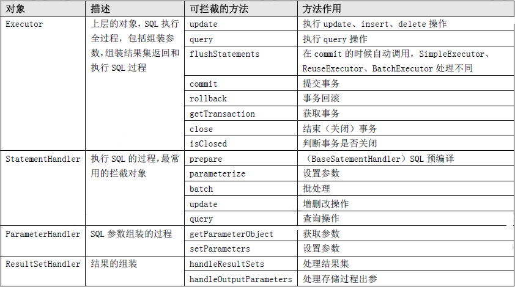

# 主要结构
动态代理MapperProxy
SQL会话SqlSession
执行器Executor
JDBC处理器StatementHandler
# 基本代码
String resource = "mybatis-config.xml";
InputStream inputStream = Resources.getResourceAsStream(resource);
SqlSessionFactory sqlSessionFactory = new SqlSessionFactoryBuilder().build(inputStream);
SqlSession session = sqlSessionFactory.openSession();
UserMapper mapper = session.getMapper(UserMapper.class);
try {
    UserBean user = mapper.selectUserById(1);
    System.out.println(user);
    session.commit();
} catch (Exception e) {
    e.printStackTrace();
    session.rollback();
} finally {
    session.close();
}
# 不使用 XML 构建 SqlSessionFactory
DataSource dataSource = BlogDataSourceFactory.getBlogDataSource();
TransactionFactory transactionFactory = new JdbcTransactionFactory();
Environment environment = new Environment("development", transactionFactory, dataSource);
Configuration configuration = new Configuration(environment);
configuration.addMapper(BlogMapper.class);
SqlSessionFactory sqlSessionFactory = new SqlSessionFactoryBuilder().build(configuration);
# 核心原理动态代理
//jdk动态代理
interface UserMapper {
    List<Object> selectUserList();
}
public class ProxyTest {
    public static void main(String[] args) throws Throwable {
        UserMapper userMapper = (UserMapper) Proxy.newProxyInstance(
                ProxyTest.class.getClassLoader(),/*类加载器*/
                new Class<?>[]{UserMapper.class},/*让代理对象和目标对象实现相同接口*/
                new InvocationHandler(){/*代理对象的方法最终都会被JVM导向它的invoke方法*/
                    public Object invoke(Object proxy, Method method, Object[] args) throws Throwable {
                        //这里执行目标方法
                        Object result = method.invoke(proxy, args);
                        return result;
                    }
                }
        );
    }
}
//动态代理的原理
interface Test {
    public void say();
}
interface InvokeHandler {
    Object invoke(Object obj, Method method, Object... arg);
}
public class ProxyDemo {
    public static void main(String[] args) {
    }
    public Test createProxyInstance(final InvokeHandler handler, final Class<?> clazz) {
        return new Test() {
            @Override
            public void say() {
                try {
                    Method sayMethod = clazz.getMethod("say");
                    handler.invoke(this, sayMethod);
                } catch(Exception e) {
                    e.printStackTrece()
                }
            }
        }
    }
}
# 不使用 XML 构建 SqlSessionFactory
DataSource dataSource = BlogDataSourceFactory.getBlogDataSource();
TransactionFactory transactionFactory = new JdbcTransactionFactory();
Environment environment = new Environment("development", transactionFactory, dataSource);
Configuration configuration = new Configuration(environment);
configuration.addMapper(BlogMapper.class);
SqlSessionFactory sqlSessionFactory = new SqlSessionFactoryBuilder().build(configuration);
SqlSession session = sqlSessionFactory.openSession();
# 使用 XML 构建 SqlSessionFactory
String resource = "mybatis-config.xml";
InputStream inputStream = Resources.getResourceAsStream(resource);
SqlSessionFactory sqlSessionFactory = new SqlSessionFactoryBuilder().build(inputStream);
SqlSession session = sqlSessionFactory.openSession();
# 使用xml的情况下建造者模式创建环境对象
private void environmentsElement(XNode context) throws Exception {
    if (context != null) {
        if (environment == null) {
            environment = context.getStringAttribute("default");
        }
        for (XNode child : context.getChildren()) {
            String id = child.getStringAttribute("id");
            if (isSpecifiedEnvironment(id)) {
                TransactionFactory txFactory = transactionManagerElement(child.evalNode("transactionManager"));
                DataSourceFactory dsFactory = dataSourceElement(child.evalNode("dataSource"));
                DataSource dataSource = dsFactory.getDataSource();
                //建造者模式
                Environment.Builder environmentBuilder = new Environment.Builder(id)
                        .transactionFactory(txFactory)
                        .dataSource(dataSource);
                configuration.setEnvironment(environmentBuilder.build());
            }
        }
    }
}
这是建造者模式的经典实现，外层类没有提供set方法，因此外部不能修改
# 添加mapper（configuration.addMapper(BlogMapper.class)）
public void parse() {
    String resource = type.toString();
    if (!configuration.isResourceLoaded(resource)) {
        //这里主要把UserMapper.xml和UserMapper.interface的接口绑定起来
        loadXmlResource();
        configuration.addLoadedResource(resource);
        assistant.setCurrentNamespace(type.getName());
        //缓存操作
        parseCache();
        parseCacheRef();
        for (Method method : type.getMethods()) {
            if (!canHaveStatement(method)) {
                continue;
            }
            if (getAnnotationWrapper(method, false, Select.class, SelectProvider.class).isPresent()
                    && method.getAnnotation(ResultMap.class) == null) {
                parseResultMap(method);
            }
            try {
                parseStatement(method);
            } catch (IncompleteElementException e) {
                configuration.addIncompleteMethod(new MethodResolver(this, method));
            }
        }
    }
    parsePendingMethods();
}
# 执行器

SqlSession（门面模式）
    基本API：增、删、改、查
    辅助API：提交、关闭会话
    包含Executor
Executor
    基本功能：改、查、缓存维护
    辅助API：提交、关闭执行器，批处理
    BaseExecutor（继承Executor）
        一级缓存
        获取连接
        SimpleExecutor 继承BaseExecutor
            简单执行器
            每次都会创建一个新的预处理器（PrepareStatement）
        ReuseExecutor 继承BaseExecutor
            可重用执行器
            相同的sql只进行一次预处理
        BatchExecutor
            批处理执行器
            批处理提交修改，必须执行flushStatements才会生效
    CachingExecutor（装饰者模式）
        二级缓存
        delegate委派BaseExecutor：执行具体执行器
# 一级缓存
是会话级别的，会话关闭缓存清空
命中场景
    
    运行时参数相关
        1，同一个会话
        2，sql语句，参数相同
        3，相同的statementID
        4，RowBounds相同
    操作配置相关
        1，未手动清空缓存（提交、回滚）
        2，未配置flushCache=true
        3，未执行Update
        4，缓存作用域不是STATEMENT
源码解析
    
    mybatis一次执行的大致流程
        Mapper（动态代理）--> SqlSession --> BaseExecutor --> Statementhandler
Spring集成Mybatis一级缓存失效
    Spring集成Mybatis封装流程
        
        Mapper(动态代理接口[动态代理]) ---> SqlSessionTemplate(会话模版) --> SqlSessionInterceptor(会话拦截器[动态代理]) --> SqlSessionFactory(会话工厂)
        这里层层进行代理主要是集成了Spring的事物
    缓存失效的原因：
        在没有提供事物支持的情况下，每次查询都是一次新的会话，所以一级缓存会失效
        SqlSession和Executor是一比一的关系，集成Spring后每次查询的执行器都不一样，说明每次的会话都不一样，所以一级缓存会失效
        这时候只需要把两次放在一个事物里面就就好了
# 二级缓存

二级缓存也称为应用级缓存，与一级缓存不同的是它的作用范围是整个应用，而且可以跨线程使用。
所以二级缓存有更高的命中率，适合缓存一些修改较少的数据
二级缓存扩展性需求
    
那么二级缓存是怎么实现上述的需求的，二级缓存又是怎样的一个结构呢？
    
    这里主要是责任链+装饰器设计模式。
    顶层Cache接口只提供简单的功能，然后一层一层的装饰各种缓存处理逻辑
二级缓存的使用和命中场景
    1，会话提交后
    2，sql语句、参数相同
    3，相同的statementID
    4，RowBounds相同
二级缓存配置表
    cacheEnabled 
        全局缓存开关 默认true
    useCache 
        statement缓存开关 默认true
    flushCache  
        清除默认：修改时默认为true、查询时默认为false
        表示任何时候语句被调用，都会导致本地缓存和二级缓存被清空
    <cache/>或@CacheNamespace 
        声明缓存空间
    <cache-ref> 或 @CacheNamespaceRef
        引用缓存空间   
为什么会话提交之后才能使用二级缓存
    因为缓存是跨线程使用的 
二级缓存暂存区
    
    
    每个会话对应一个事物缓存管理器，事物缓存管理器作用域为会话
    事物缓存管理器中的每个暂存区对应二级缓存空间的一个缓冲区
    二级缓存空间的一个缓冲区对应多个事物缓存管理器的暂存区
二级缓存存取流程
    
缓存需要在提交之后才能命中，那么在更新了数据还没有提交，此时查询数据库，岂不是有了脏数据？
    这时会设置一个标志clearOnCommit=true，如果此标志为true的话就不会走二级缓存
三种执行器Statement

三种处理器StatementHandler

    jdbc处理器，基于jdbc构建statement并设置参数，然后执行sql。每调用会话当中一次sql，都会有与之相对应的且唯一的statement实例
StatementHandler执行流程
    
参数处理器

    主要是将Java Bean转换成JDBC参数
    ParamNameResolver参数转换过程
        1，单个参数：默认不做任何处理，除非设置了@param
        2，多个参数：（无论是那种方式都是转换成map）
            按照顺序转换成Param1、Param2......
            基于@Param注解中的属性转换
            基于反射转换成变量名，如果不支持转换成arg1、arg2（这种方式不推荐）
    ParameterHandler参数映射处理
        单个原始类型：
            直接映射，忽略sql中引用名称
        map类型：
            基于Map key映射
        Object：
            基于属性名称映射，支持嵌套对象属性访问
    TypeHandler
        辅助类，不同的参数类型使用不同的TypeHandler进行处理
结果集处理器

    ResultSetHandler：将结果集每行的数据转换成对象一个个对象
    ResultContext：存放当前对象，以及解析状态和控制解析数量
    ResultHandler：处理存入解析结果
    一个行数据需要经过上面三个处理器，那么为什么要设计的这么复杂呢？
        主要是为了控制解析数量
    主要操作是在结果集处理器ResultSetHandler中
        分为单个结果集处理器和多个结果集处理器，大多数都是单个结果集处理器
Mybatis映射体系（MetaObject）
MetaObject主要用到的就是装饰者模式

    1，直接操作属性
    2，操作子属性
    3，自动创建属性对象
    4，自动查找属性名，支持下划线和驼峰
    5，基于索引访问数组
映射
     
Configuration配置体系
     
Configuration组件构建过程  
    
     
MappedStatement解析过程
      
    
    为什么有了MapperAnnotationBuilder还要有MapperBuilderAssistant（构建小助手）?
        因为缓存的原因
mybatis插件机制
    拦截的对象：
        mybatis的四大核心对象：
            ParameterHandler（处理sql参数对象）
            ResultHandler（处理sql返回结果集）
            StatementHandler（数据库处理对象，用于执行sql语句） 
            Executor：mybatis执行器，用于执行增删改查操作
    拦截的技术方案：
        在java里面，我们想要拦截某个对象，只需要将这个对象包装一下，用代码来说就是重新生成一个代理对象
        这样每次调用executor类方法的时候，总是经过interceptor
    拦截对象的变身：
        以ParameterHandler为例：
        1，根据插件配置，利用反射技术，创建interceptor拦截器
        Interceptor interceptor = MyInterceptor.class.newInstance();
        2，创建原身
        ParameterHandler parameterHandler = createParameterHanlder();
        3，原身+拦截器 ------>变身
        parameterHandler = (ParameterHandler)Plugin.wrap(parameterHandler, interceptor);
        在这一步，将parameterHandler和interceptor包装到了一起，生成了变身，并重新赋值给parameterHandler变量
        
        
    
