# 主要结构
动态代理MapperProxy
SQL会话SqlSession
执行器Executor
JDBC处理器StatementHandler
# 基本代码
String resource = "mybatis-config.xml";
InputStream inputStream = Resources.getResourceAsStream(resource);
SqlSessionFactory sqlSessionFactory = new SqlSessionFactoryBuilder().build(inputStream);
SqlSession session = sqlSessionFactory.openSession();
UserMapper mapper = session.getMapper(UserMapper.class);
try {
    UserBean user = mapper.selectUserById(1);
    System.out.println(user);
    session.commit();
} catch (Exception e) {
    e.printStackTrace();
    session.rollback();
} finally {
    session.close();
}
# 不使用 XML 构建 SqlSessionFactory
DataSource dataSource = BlogDataSourceFactory.getBlogDataSource();
TransactionFactory transactionFactory = new JdbcTransactionFactory();
Environment environment = new Environment("development", transactionFactory, dataSource);
Configuration configuration = new Configuration(environment);
configuration.addMapper(BlogMapper.class);
SqlSessionFactory sqlSessionFactory = new SqlSessionFactoryBuilder().build(configuration);

# 核心原理动态代理
//jdk动态代理
interface UserMapper {
    List<Object> selectUserList();
}
public class ProxyTest {
    public static void main(String[] args) throws Throwable {
        UserMapper userMapper = (UserMapper) Proxy.newProxyInstance(
                ProxyTest.class.getClassLoader(),/*类加载器*/
                new Class<?>[]{UserMapper.class},/*让代理对象和目标对象实现相同接口*/
                new InvocationHandler(){/*代理对象的方法最终都会被JVM导向它的invoke方法*/
                    public Object invoke(Object proxy, Method method, Object[] args) throws Throwable {
                        //这里执行目标方法
                        Object result = method.invoke(proxy, args);
                        return result;
                    }
                }
        );
    }
}
//动态代理的原理
interface Test {
    public void say();
}
interface InvokeHandler {
    Object invoke(Object obj, Method method, Object... arg);
}
public class ProxyDemo {
    public static void main(String[] args) {
    }
    public Test createProxyInstance(final InvokeHandler handler, final Class<?> clazz) {
        return new Test() {
            @Override
            public void say() {
                try {
                    Method sayMethod = clazz.getMethod("say");
                    handler.invoke(this, sayMethod);
                } catch(Exception e) {
                    e.printStackTrece()
                }
            }
        }
    }
}

# 不使用 XML 构建 SqlSessionFactory
DataSource dataSource = BlogDataSourceFactory.getBlogDataSource();
TransactionFactory transactionFactory = new JdbcTransactionFactory();
Environment environment = new Environment("development", transactionFactory, dataSource);
Configuration configuration = new Configuration(environment);
configuration.addMapper(BlogMapper.class);
SqlSessionFactory sqlSessionFactory = new SqlSessionFactoryBuilder().build(configuration);
SqlSession session = sqlSessionFactory.openSession();

# 使用 XML 构建 SqlSessionFactory
String resource = "mybatis-config.xml";
InputStream inputStream = Resources.getResourceAsStream(resource);
SqlSessionFactory sqlSessionFactory = new SqlSessionFactoryBuilder().build(inputStream);
SqlSession session = sqlSessionFactory.openSession();

# 使用xml的情况下建造者模式创建环境对象
private void environmentsElement(XNode context) throws Exception {
    if (context != null) {
        if (environment == null) {
            environment = context.getStringAttribute("default");
        }
        for (XNode child : context.getChildren()) {
            String id = child.getStringAttribute("id");
            if (isSpecifiedEnvironment(id)) {
                TransactionFactory txFactory = transactionManagerElement(child.evalNode("transactionManager"));
                DataSourceFactory dsFactory = dataSourceElement(child.evalNode("dataSource"));
                DataSource dataSource = dsFactory.getDataSource();
                //建造者模式
                Environment.Builder environmentBuilder = new Environment.Builder(id)
                        .transactionFactory(txFactory)
                        .dataSource(dataSource);
                configuration.setEnvironment(environmentBuilder.build());
            }
        }
    }
}
这是建造者模式的经典实现，外层类没有提供set方法，因此外部不能修改

# 添加mapper（configuration.addMapper(BlogMapper.class)）
public void parse() {
    String resource = type.toString();
    if (!configuration.isResourceLoaded(resource)) {
        //这里主要把UserMapper.xml和UserMapper.interface的接口绑定起来
        loadXmlResource();
        configuration.addLoadedResource(resource);
        assistant.setCurrentNamespace(type.getName());
        //缓存操作
        parseCache();
        parseCacheRef();
        for (Method method : type.getMethods()) {
            if (!canHaveStatement(method)) {
                continue;
            }
            if (getAnnotationWrapper(method, false, Select.class, SelectProvider.class).isPresent()
                    && method.getAnnotation(ResultMap.class) == null) {
                parseResultMap(method);
            }
            try {
                parseStatement(method);
            } catch (IncompleteElementException e) {
                configuration.addIncompleteMethod(new MethodResolver(this, method));
            }
        }
    }
    parsePendingMethods();
}

# 执行器
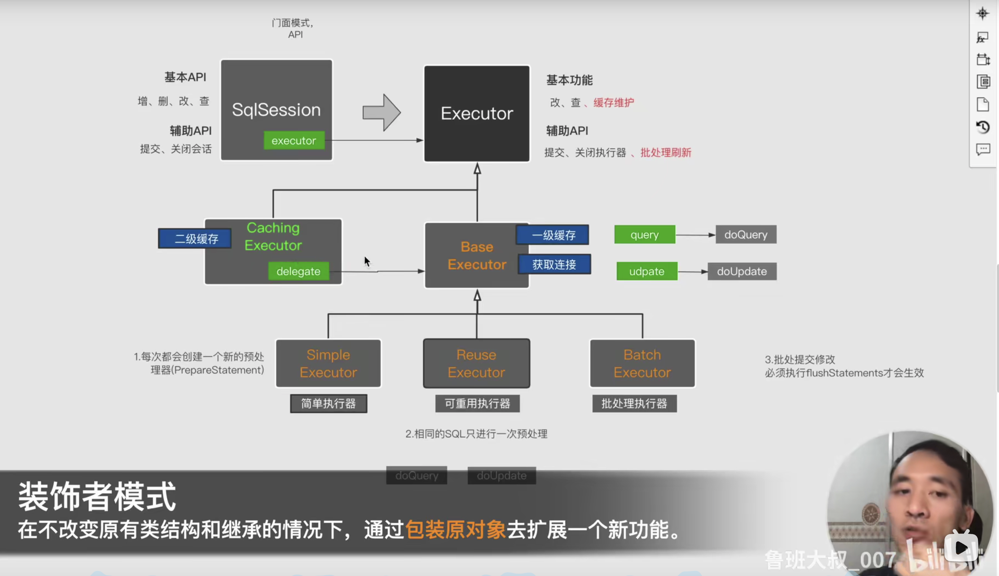
SqlSession（门面模式）
    基本API：增、删、改、查
    辅助API：提交、关闭会话
    包含Executor
Executor
    基本功能：改、查、缓存维护
    辅助API：提交、关闭执行器，批处理
    BaseExecutor（继承Executor）
        一级缓存就是存放在BaseExecutor里面的一个Map
        获取连接
        SimpleExecutor 继承BaseExecutor
            简单执行器，是MyBatis中默认使用的执行器，每执行一次update或者select
            都会创建一个新的预处理器（PrepareStatement），用完就关闭Statement或者PrepareStatement对象
        ReuseExecutor 继承BaseExecutor
            可重用执行器，它会在内部使用一个 Map 把创建的 Statement 都缓存起来
            每次执行 SQL 命令的时候，都会去判断是否存在基于该 SQL 的 Statement 对象
            如果存在 Statement 对象并且对应的 connection 还没有关闭的情况下就继续使用之前的 Statement 对象
            相同的sql只进行一次预处理
            每个SqlSession 都有一个新的 Executor 对象，所以我们缓存在 ReuseExecutor 上的Statement 作用域是同一个 SqlSession
        BatchExecutor
            执行update（没有select，JDBC批处理不支持select），将所有sql都添加到批处理中（addBatch()），等待统一执行（executeBatch()），它缓存了多个Statement对象，
            每个Statement对象都是addBatch()完毕后，等待逐一执行executeBatch()批处理。与JDBC批处理相同。
        在Mybatis配置文件中，可以指定默认的ExecutorType执行器类型，也可以手动给DefaultSqlSessionFactory的创建SqlSession的方法传递ExecutorType类型参数。
    CachingExecutor（装饰者模式）
        二级缓存
        缓存执行器，先从缓存中查询结果，如果存在，就返回；如果不存在，再委托给 Executor delegate 去数据库中取，
        delegate 可以是上面任何一个执行器，默认是simpleexecutor。这里面用到了装饰者模式

# 一级缓存
是会话级别的，会话关闭缓存清空
命中场景
    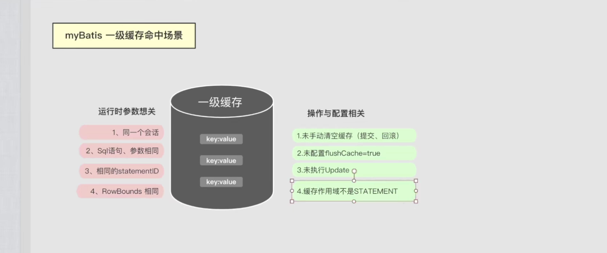
    运行时参数相关
        1，同一个会话
        2，sql语句，参数相同
        3，相同的statementID
        4，RowBounds相同
    缓存失效场景
        1，手动清空缓存（提交、回滚）
        2，配置flushCache=true
        3，执行Update
        4，缓存作用域是STATEMENT
        注意：子查询里面不能清空缓存
源码解析
    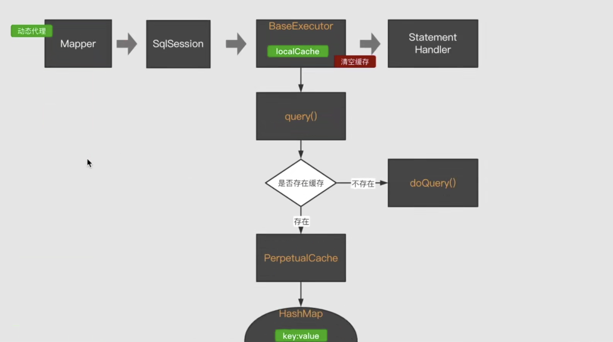
    mybatis一次执行的大致流程
        Mapper（动态代理）--> SqlSession --> BaseExecutor --> Statementhandler
Spring集成Mybatis一级缓存失效
    Spring将MyBatis的DefaultSqlSession类替换成了SqlSessionTemplate。
    MyBatis的一级缓存是基于SqlSession来实现的，对应MyBatis中sqlSession接口的默认实现类是DefaultSqlSession，如果执行的SQL相同时，并且使用的是同一个SqlSession对象，那么就会触发对应的缓存机制。
    但是在Spring整合MyBatis后，Spring使用MyBatis不再是直接调用MyBatis中的信息，而是通过调用调用mybatis-spring.jar中的类，继而达到间接调用MyBatis的效果。但在mybatis-spring.jar中，引入了一个SqlSessionTemplate类，
    它和Spring的事务管理器共同配合，创建对应的SqlSession连接。
    即在没有添加@Transactional注解的情况下，每调用一次查询SQL，就会通过SqlSessionTemplate去创建sqlSession，即相当于新创建一次连接，故而每次查询在调试结果看来就是一级缓存失效
    Spring集成Mybatis封装流程
        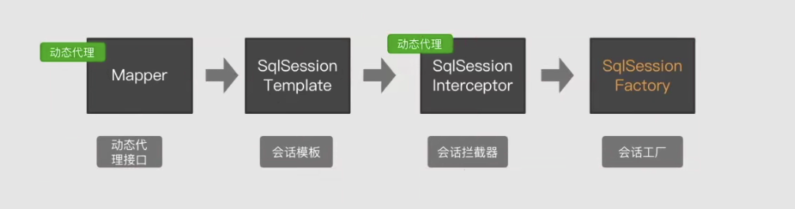
        Mapper(动态代理接口[动态代理]) ---> SqlSessionTemplate(会话模版) --> SqlSessionInterceptor(会话拦截器[动态代理]) --> SqlSessionFactory(会话工厂)
        这里层层进行代理主要是集成了Spring的事物
    缓存失效的原因：
        在没有提供事物支持的情况下，每次查询都是一次新的会话，所以一级缓存会失效
        SqlSession和Executor是一比一的关系，集成Spring后每次查询的执行器都不一样，说明每次的会话都不一样，所以一级缓存会失效
        这时候只需要把两次放在一个事物里面就就好了

# 二级缓存
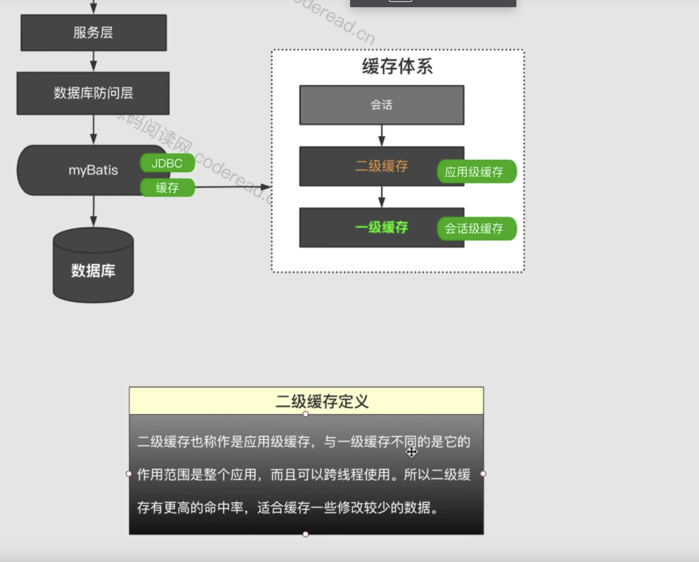
作用域
    是Mapper文件。
多表操作一定不要使用二级缓存，因为多表操作进行更新操作，一定会产生脏数据。
    现在假设一种情况：我们要同时查询出包含用户角色信息的用户信息，这是，我们会通过连接查询，对用户表和角色表进行连接查询，关联条件是：user.role_id = role.id；当用户数据查询出来以后，会将缓存信息绑定到 UserMapper 这个文件的二级缓存对象中
    而当我们修改了用户角色表后，MyBatis 只会清空 RoleMapper 对应的二级缓存，UserMapper 对应的二级缓存并没有被清空，这时，再去查询用户角色信息
    由于我们已经更改过数据库中的角色信息，但是 UserMapper 绑定的二级缓存并未清空，所以，这时的查询会直接去 UserMapper 对应的二级缓存中拿数据并返回，并不会查询数据库，所以，产生了数据脏读的问题。

二级缓存也称为应用级缓存，与一级缓存不同的是它的作用范围是整个应用，而且可以跨线程使用。
所以二级缓存有更高的命中率，适合缓存一些修改较少的数据
二级缓存架构（重点）：
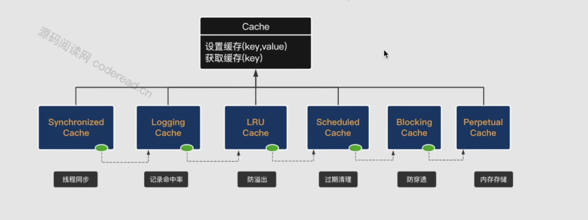
    二级缓存有许多的扩展性需求，比如说存储、线程安全、LRU最近最少使用、过期清理、记录命中率等等
    那么怎么才能实现这些扩展需求呢？
        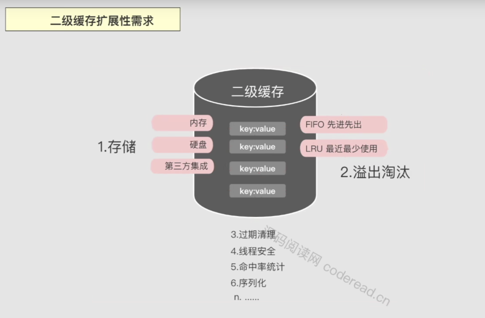
        MyBatis采用装饰器 + 责任链的模式
    顶层接口只有写入、查询、获取缓存数量和删除缓存这几个方法，
    然后每一个扩展需求都有一个实现类来实现，比如：
        SynchronizedCache：线程同步
        LoggingCache：记录命中率
        LRUCache：防止溢出
        ScheduledCache：过期清理
        BlockingCache：防穿透
        PerpetualCache：存储
    然后每一个缓存都通过装饰器模式指向下一个缓存，当我们执行一个操作的时候，就会挨个向下传递
    每个组件都会实现自己的功能，然后调用下一个组件。
二级缓存的使用和命中场景
    1，会话提交后
    2，sql语句、参数相同
    3，相同的statementID
    4，RowBounds相同
二级缓存配置表
    cacheEnabled：全局缓存开关 默认true
    useCache：statement缓存开关 默认true
    flushCache：清除默认：修改时默认为true、查询时默认为false。表示任何时候语句被调用，都会导致本地缓存和二级缓存被清空
    <cache/>或@CacheNamespace：声明缓存空间
    <cache-ref> 或 @CacheNamespaceRef：引用缓存空间   
为什么会话提交之后才能使用二级缓存
    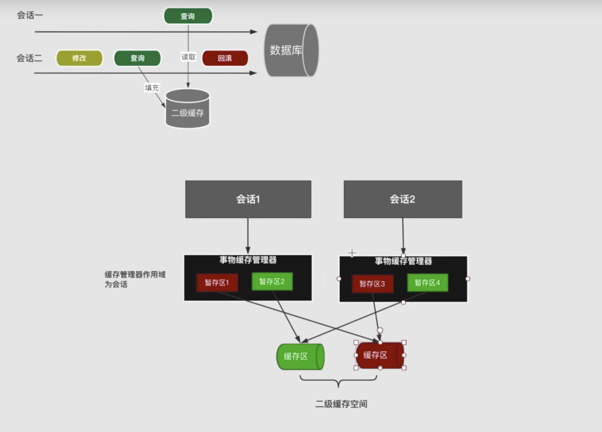
    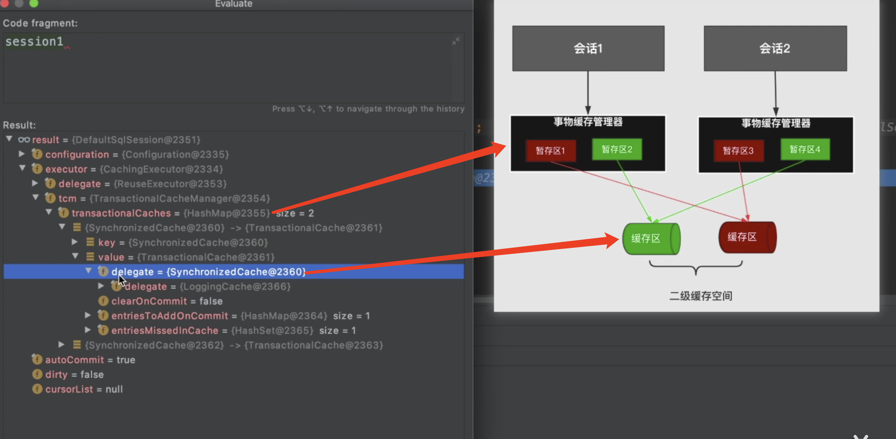
    会话一与会话二原本是两条隔离的事务，但由于二级缓存的存在导致彼此可见会发生脏读。
    若会话二的修改直接填充到二级缓存，会话一查询时缓存中存在即直接返回数据，此时会话二回滚会话一读到的数据就是脏数据。
    为了解决这一问题mybatis二级缓存机制就引入了事务管理器(暂存区)，所有变动的数据都会暂时存放到事务管理器的暂存区中，只有执行提交动作后才会真正的将数据从暂存区中填充到二级缓存中。
    因为缓存是跨线程使用的 
二级缓存存取流程
    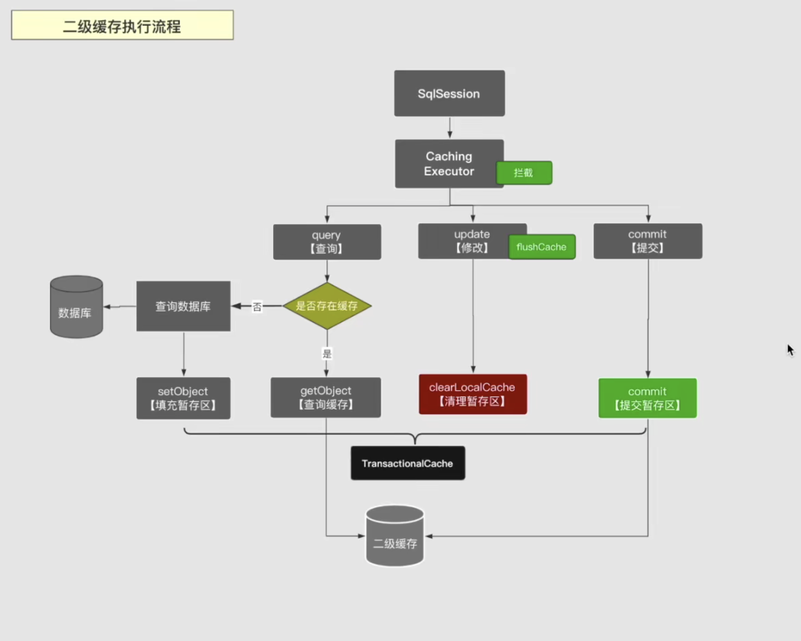
缓存需要在提交之后才能命中，那么在更新了数据还没有提交，此时查询数据库，岂不是有了脏数据？
    这时会设置一个标志clearOnCommit=true，如果此标志为true的话就不会走二级缓存
可用的收回策略有:
    LRU – 最近最少使用的:移除最长时间不被使用的对象。
    FIFO – 先进先出:按对象进入缓存的顺序来移除它们。
    SOFT – 软引用:移除基于垃圾回收器状态和软引用规则的对象。
    WEAK – 弱引用:更积极地移除基于垃圾收集器状态和弱引用规则的对象。

# 执行器Statement
SqlSession会话将数据库操作由Executor执行器去完成，实际上需要通过StatementHandler创建相应的Statement对象，
并做一些准备工作，然后通过Statement执行数据库操作，查询结果则需要通过ResultSetHandler对结果集映射转换成Java对象
每调用会话当中一次sql，都会有与之相对应的且唯一的Statement。
正常都会使用PreparedStatement，因为他性能更高，而且更加安全，防止了sql注入
三种Statement
    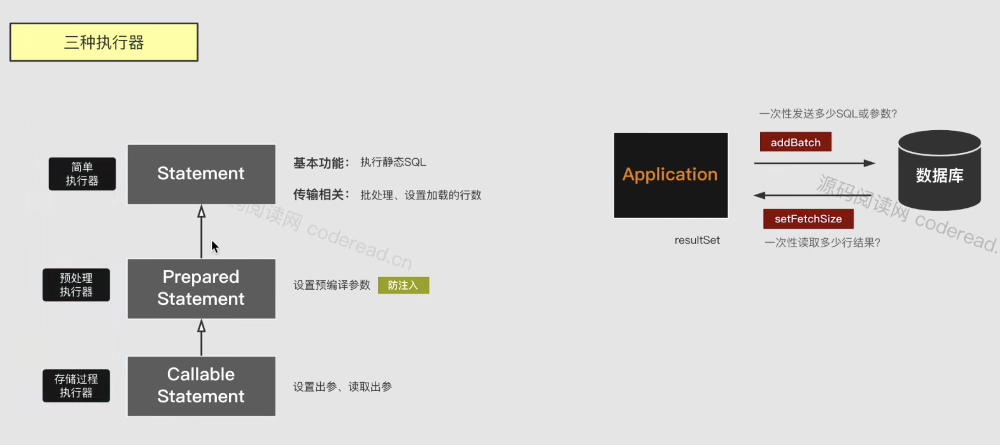
    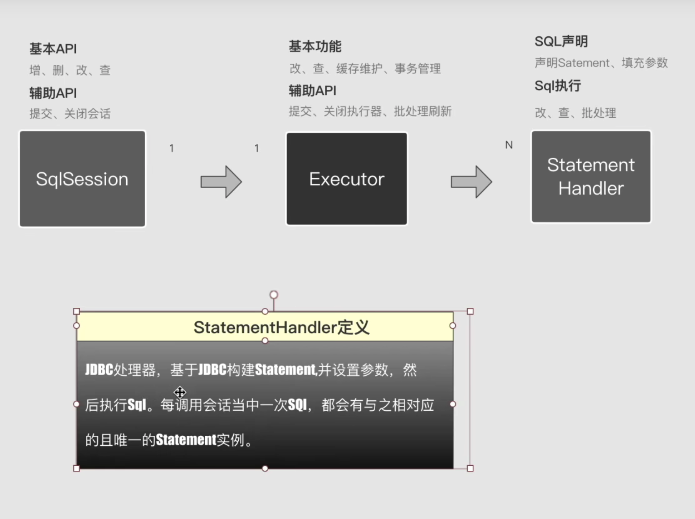
StatementHandler执行流程
    首先执行器Executor执行 ---> 进行预编译 ---> 设置参数 ---> 执行SQL --- 结果集映射成Java对象
    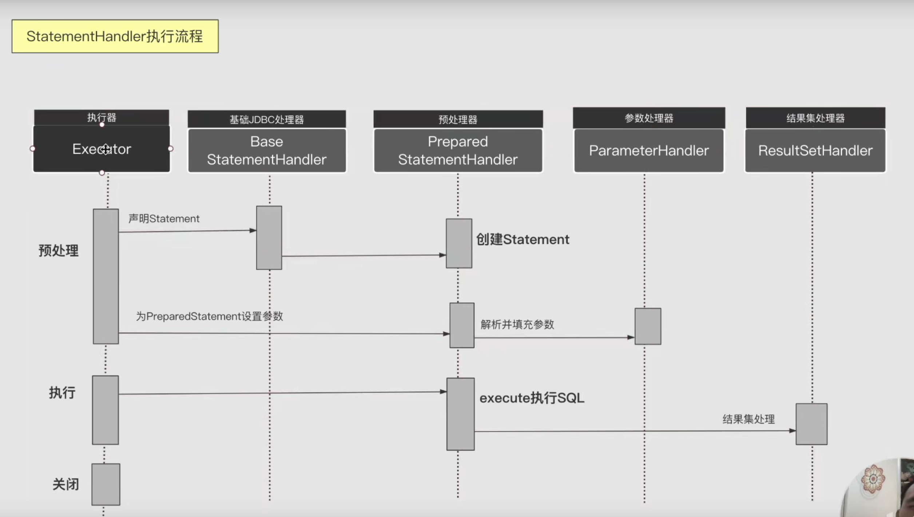

# 参数处理器
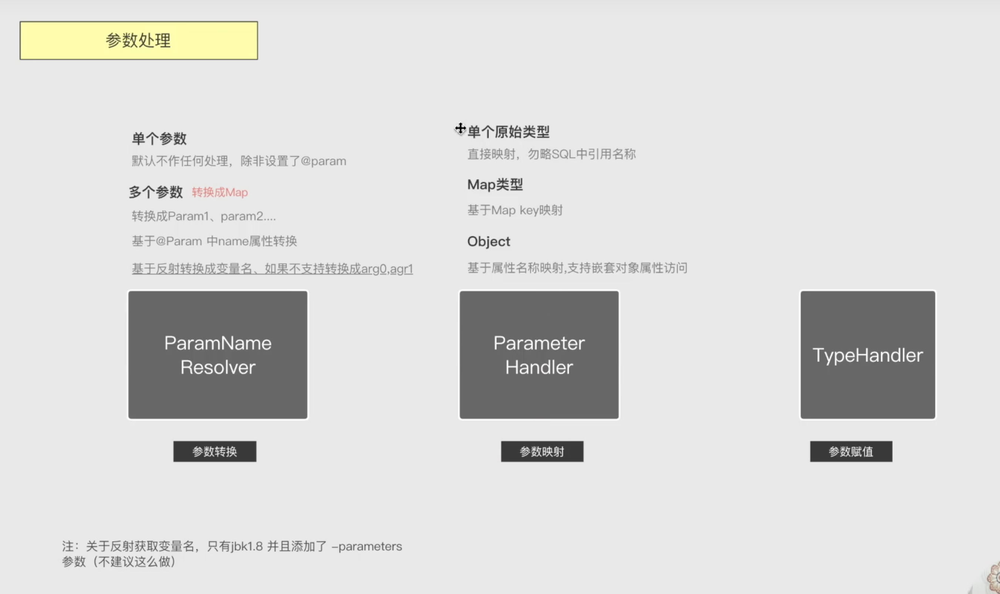
    主要是将Java Bean转换成JDBC参数
    ParamNameResolver参数转换过程
        1，单个参数：默认不做任何处理，除非设置了@param
        2，多个参数：（无论是那种方式都是转换成map）
            按照顺序转换成Param1、Param2......
            基于@Param注解中的属性转换
            基于反射转换成变量名，如果不支持转换成arg1、arg2（这种方式不推荐）
    ParameterHandler参数映射处理
        单个原始类型：
            直接映射，忽略sql中引用名称
        map类型：
            基于Map key映射
        Object：
            基于属性名称映射，支持嵌套对象属性访问
    TypeHandler
        辅助类，不同的参数类型使用不同的TypeHandler进行处理

# 结果集处理器
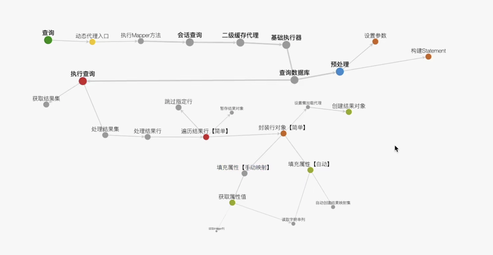
    ResultSetHandler：将结果集每行的数据转换成对象一个个对象，核心转换逻辑
    ResultContext：存放当前对象，以及解析状态和控制解析数量
    ResultHandler：处理存入解析结果
一个行数据需要经过上面三个处理器，那么为什么要设计的这么复杂呢？直接把ResultSetHandler中的数据放入ResultHandler不就好了，为什么还需要ResultContext？
    主要是为了控制解析数量。比如我们查询一组数据，当数量大于10的时候，就停止结果集解析。只获取前5条数据
    ```java
    public void test() {
        List<Object> list = new ArrayList<>();
        ResultHandler handler = new ResultHandler() {
            @Override
            public void handleResult(ResultContext resultContext) {
                if (resultContext.getResultCount() > 10) {
                    resultContext.stop();
                }
                list.add(resultContext.getResultObject());
            }
        };
        //这里返回值是void，因为在handler中已经处理了
        sqlSession.select("com.shuai.mybatis.UserMapper.selectByName", handler);
    }
    ```
核心就是ResultSetHandler结果集转换流程
    前言：
        JDBC中每执行一条Select语句通常只能拿到一个ResultSet，DefaultResultSetHandler 实现的 handleResultSets() 方法支持多个 ResultSet 的处理（单 ResultSet 的处理只是其中的特例）
        这里获取到的ResultSet对象，会被包装成ResultSetWrapper对象返回。
        ResultSetWrapper主要用于封装 ResultSet 的一些元数据，其中记录了 ResultSet 中每列的名称、对应的 Java 类型、JdbcType 类型以及每列对应的 TypeHandler
    简单映射：
        核心步骤总结如下：
            1，执行 skipRows() 方法跳过多余的记录，定位到指定的行。
            2，通过 shouldProcessMoreRows() 方法，检测是否还有需要映射的数据记录。
            3，如果存在需要映射的记录，则先通过 resolveDiscriminatedResultMap() 方法处理映射中用到的 Discriminator，决定此次映射实际使用的 ResultMap。
            4，通过 getRowValue() 方法对 ResultSet 中的一行记录进行映射，映射规则使用的就是步骤 3 中确定的 ResultMap。
            5，执行 storeObject() 方法记录步骤 4 中返回的、映射好的 Java 对象。
        详细步骤：
            1，ResultSet预处理：
                这里的 skipRows() 方法就会根据 RowBounds 移动 ResultSet 的指针到指定的数据行，这样后续的映射操作就可以从这一行开始。
            2，确定 ResultMap
                通过 resolveDiscriminatedResultMap() 方法处理 标签，确定此次映射操作最终使用的 ResultMap 对象。
            3，创建映射结果对象
                按照 ResultMap 规则进行各个列的映射，得到最终的 Java 对象
                核心步骤如下：
                    1，首先根据 ResultMap 的 type 属性值创建映射的结果对象；
                        创建映射结果对象又有两个关键步骤：
                            （1）一个是调用另一个 createResultObject() 重载方法来创建结果对象
                                首先进行一些准备工作：获取 ResultMap 中 type 属性指定的结果对象的类型，并创建该类型对应的 MetaClass 对象；
                                获取 ResultMap 中配置的 <constructor> 标签信息（也就是对应的 ResultMapping 对象集合），如果该信息不为空，则可以确定结果类型中的唯一构造函数。
                                然后再根据四种不同的场景，使用不同的方式创建结果对象，下面就是这四种场景的核心逻辑。
                                    场景一，ResultSet 中只有一列，并且能够找到一个 TypeHandler 完成该列到目标结果类型的映射，此时可以直接读取 ResultSet 中的列值并通过 TypeHandler 转换得到结果对象。这部分逻辑是在 createPrimitiveResultObject() 方法中实现的，该场景多用于 Java 原始类型的处理。
                                    场景二，如果 ResultMap 中配置了 <constructor> 标签，就会先解析 <constructor> 标签中指定的构造方法参数的类型，并从待映射的数据行中获取对应的实参值，然后通过反射方式调用对应的构造方法来创建结果对象。这部分逻辑在 createParameterizedResultObject() 方法中实现。
                                    场景三，如果不满足上述两个场景，则尝试查找默认构造方法来创建结果对象，这里使用前面介绍的 ObjectFactory.create() 方法实现，底层原理还是 Java 的反射机制。
                                    场景四，最后会检测是否已经开启了自动映射功能，如果开启了，会尝试查找合适的构造方法创建结果对象。这里首先会查找 @AutomapConstructor 注解标注的构造方法，查找失败之后，则会尝试查找每个参数都有 TypeHandler 能与 ResultSet 列进行映射的构造方法，确定要使用的构造方法之后，也是通过 ObjectFactory 完成对象创建的。这部分逻辑在 createByConstructorSignature() 方法中实现
                            （2）是通过 ProxyFactory 创建代理对象来处理延迟加载的属性。
                    2，然后根据 ResultMap 的配置以及全局信息，决定是否自动映射 ResultMap 中未明确映射的列；
                    3，接着根据 ResultMap 映射规则，将 ResultSet 中的列值与结果对象中的属性值进行映射；
                    4，最后返回映射的结果对象，如果没有映射任何属性，则需要根据全局配置决定如何返回这个结果值，这里不同场景和配置，可能返回完整的结果对象、空结果对象或是 null。
            4，自动映射
                创建完结果对象之后，下面就开始映射各个字段了。首先会检测是否开启了自动映射。
                当确定当前 ResultMap 需要进行自动映射的时候，就会执行自动映射的核心逻辑：
                    （1）首先，从 ResultSetWrapper 中获取所有未映射的列名，然后逐个处理每个列名。通过列名获取对应的属性名称，这里会将列名转换为小写并截掉指定的前缀，得到相应的属性名称。
                    （2）首先，从 ResultSetWrapper 中获取所有未映射的列名，然后逐个处理每个列名。通过列名获取对应的属性名称，这里会将列名转换为小写并截掉指定的前缀，得到相应的属性名称。
                    （3）经过上述检测之后，就可以创建 UnMappedColumnAutoMapping 对象将该列与对应的属性进行关联。在 UnMappedColumnAutoMapping 中记录了列名、属性名以及相关的 TypeHandler。
                    （4）最后，遍历上面得到 UnMappedColumnAutoMapping 集合，通过其中的 TypeHandler 读取列值并转换成相应的 Java 类型，再通过 MetaObject 设置到相应属性中。
            5，正常映射
                完成自动映射之后，MyBatis 会执行 applyPropertyMappings() 方法处理 ResultMap 中明确要映射的列，applyPropertyMappings() 方法的核心流程如下所示。
                    （1）首先从 ResultSetWrapper 中明确需要映射的列名集合，以及 ResultMap 中定义的 ResultMapping 对象集合。
                    （2）遍历全部 ResultMapping 集合，针对每个 ResultMapping 对象为 column 属性值添加指定的前缀，得到最终的列名，然后执行 getPropertyMappingValue() 方法完成映射，得到对应的属性值。
                    （3）如果成功获取到了属性值，则通过结果对象关联的 MetaObject 对象设置到对应属性中。
            6，存储对象
                通过上述 5 个步骤，我们已经完成简单映射的处理，得到了一个完整的结果对象。接下来，我们就要通过 storeObject() 方法把这个结果对象保存到合适的位置。
    

# Mybatis映射体系（MetaObject）反射工具箱
为了降低反射使用门槛，MyBatis 内部封装了一个反射工具箱，其中包含了 MyBatis 自身常用的反射操作，MyBatis 其他模块只需要调用反射工具箱暴露的简洁 API 即可实现想要的反射功能
反射工具箱的具体代码实现位于 org.apache.ibatis.reflection 包中
Reflector：
    Reflector 是 MyBatis 反射模块的基础。要使用反射模块操作一个 Class，都会先将该 Class 封装成一个 Reflector 对象，在 Reflector 中缓存 Class 的元数据信息，这可以提高反射执行的效率。
    1，核心初始化流程
        既然是涉及反射操作，Reflector 必然要管理类的属性和方法，这些信息都记录在它的核心字段中
            type（Class<?> 类型）：该 Reflector 对象封装的 Class 类型。
            readablePropertyNames、writablePropertyNames（String[] 类型）：可读、可写属性的名称集合。
            getMethods、setMethods（Map<String, Invoker> 类型）：可读、可写属性对应的 getter 方法和 setter 方法集合，key 是属性的名称，value 是一个 Invoker 对象。Invoker 是对 Method 对象的封装。
            getTypes、setTypes（Map<String, Class<?>> 类型）：属性对应的 getter 方法返回值以及 setter 方法的参数值类型，key 是属性名称，value 是方法的返回值类型或参数类型。
            defaultConstructor（Constructor<?> 类型）：默认构造方法。
            caseInsensitivePropertyMap（Map<String, String> 类型）：所有属性名称的集合，记录到这个集合中的属性名称都是大写的。
        在我们构造一个 Reflector 对象的时候，传入一个 Class 对象，通过解析这个 Class 对象，即可填充上述核心字段，整个核心流程大致可描述为如下。
            （1）用 type 字段记录传入的 Class 对象。
            （2）通过反射拿到 Class 类的全部构造方法，并进行遍历，过滤得到唯一的无参构造方法来初始化 defaultConstructor 字段
            （3）读取 Class 类中的 getter方法，填充上面介绍的 getMethods 集合和 getTypes 集合
            （4）读取 Class 类中的 setter 方法，填充上面介绍的 setMethods 集合和 setTypes 集合
            （5）读取 Class 中没有 getter/setter 方法的字段，生成对应的 Invoker 对象，填充 getMethods 集合、getTypes 集合以及 setMethods 集合、setTypes 集合
            （6）根据前面三步构造的 getMethods/setMethods 集合的 keySet，初始化 readablePropertyNames、writablePropertyNames 集合
            （7）遍历构造的 readablePropertyNames、writablePropertyNames 集合，将其中的属性名称全部转化成大写并记录到 caseInsensitivePropertyMap 集合中
默认对象工厂
    ObjectFactory是MyBatis中的反射工厂，其中提供两个create()方法的重载，我们可以通过两个 create() 方法创建指定类型的对象。
    DefaultObjectFactory 是 ObjectFactory 接口的默认实现，其 create() 方法底层是通过调用 instantiateClass() 方法创建对象的。instantiateClass() 方法会通过反射的方式根据传入的参数列表，选择合适的构造函数实例化对象。
    除了使用DefaultObjectFactory这个默认实现之外，我们还可以在 mybatis-config.xml 配置文件中配置自定义 ObjectFactory 接口扩展实现 类，完成自定义的功能扩展
MetaClass
    MetaClass提供了获取类中属性描述信息的功能，底层依赖前面介绍的Reflector
    在 MetaClass 的构造方法中会将传入的 Class 封装成一个 Reflector 对象，
    并记录到 reflector 字段中，MetaClass 的后续属性查找都会使用到该 Reflector 对象。
    核心方法：findProperty()    
        MetaClass中的findProperty()方法是实现属性查找的核心方法，它主要处理了“.”导航的属性查找
    ObjectWrapper
        MetaClass 中封装的是 Class 元信息，ObjectWrapper 封装的则是对象元信息。
        在 ObjectWrapper 中抽象了一个对象的属性信息，并提供了查询对象属性信息的相关方法，以及更新属性值的相关方法。
BeanWrapper
    BaseWrapper 是 ObjectWrapper 接口的抽象实现，其中只有一个 MetaObject 类型的字段
MetaObject
    通过对 ObjectWrapper 的介绍我们了解到，ObjectWrapper 实现了读写对象属性值、检测getter/setter 等基础功能
    在 MetaObject 中维护了一个 originalObject 字段指向被封装的 JavaBean 对象，还维护了该 JavaBean 对象对应的 ObjectWrapper 对象（objectWrapper 字段）
反射工具类MetaObject，主要用到的就是装饰者模式
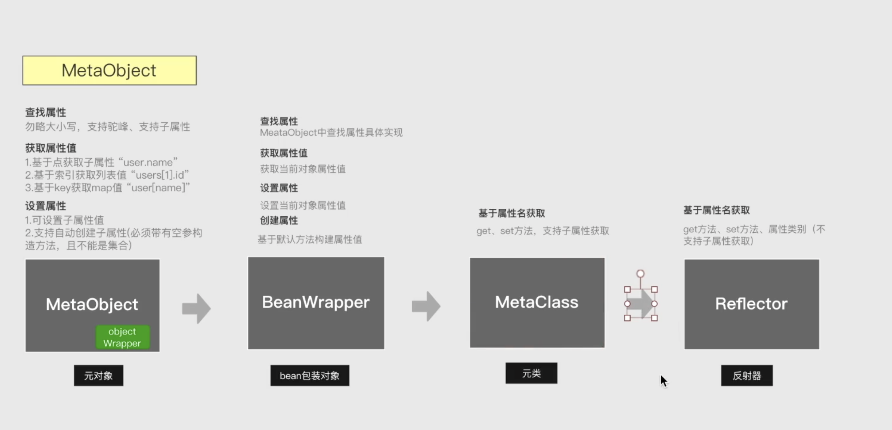
    1，直接操作属性
    2，操作子属性
    3，自动创建属性对象
    4，自动查找属性名，支持下划线和驼峰
    5，基于索引访问数组
映射
    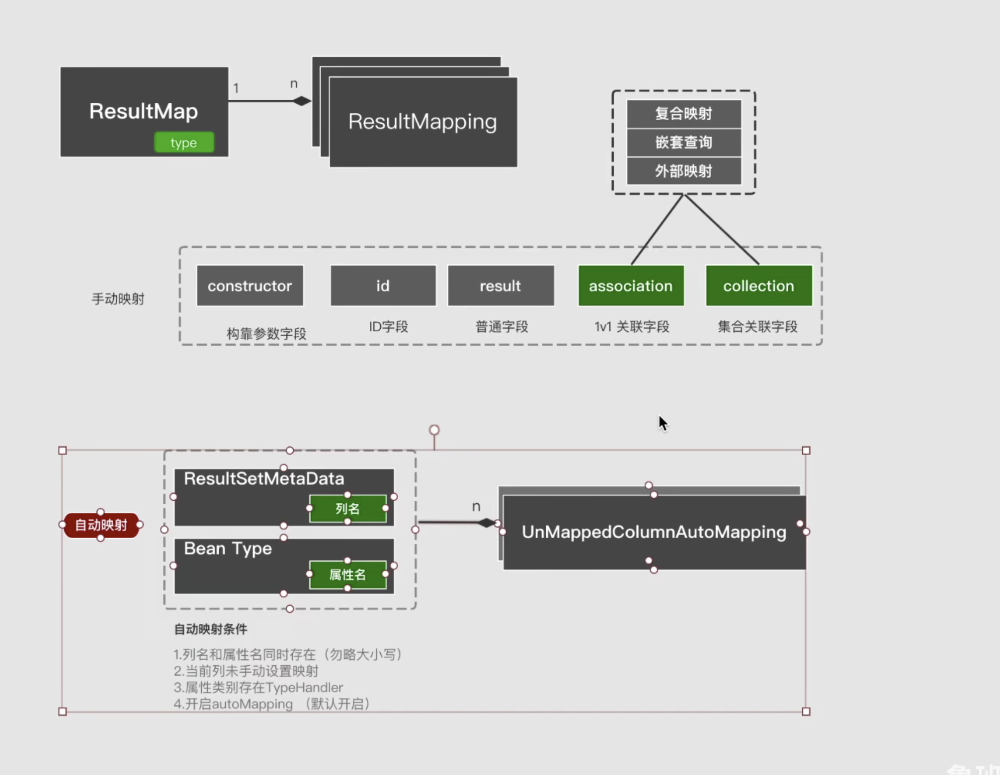 

# Mapper 文件与 Java 接口映射
我们为每个Mapper.xml配置文件创建一个对应的Mapper接口，无需提供接口的实现，直接调用接口对象中的方法执行Mapper.xml配置文件中的Sql
1，为什么需要使用Mapper接口来执行对应的sql语句呢？
2，为什么无需提供Mapper接口的实现类呢？
3，实际使用的Mapper对象是什么？
为什么使用Mapper接口来执行对应的sql语句呢？
    MyBatis的前身是iBatis，在使用iBatis的时候可以调用 ```SqlSession.queryForObject ("findCustonerById", customerId)```查询数据
    这两个参数分别：
        （1）要执行的 SQL 语句唯一标识：也就是定义在Mapper.xml文件中的id为findCustonerById的sql语句
        （2）传入的参数
    这样做有个问题，就是SQL语句的唯一标识符容易写错，比如把findCustonerById写成了finbCustonerById。
    在编译以及iBatis初始化的时候根本发现不了，真正执行的时候才会抛出异常
    MyBatis 中的 Mapper 接口就可以很好地解决这个问题。
        Mapper接口中定义了和SQL语句唯一标识符相同名的findCustonerById()方法，如果拼写错误，编译时期会报错
        同时MyBatis初始化的时候，Mapper接口中的名字如果和Mapper.xml配置文件中的sql唯一标识符进行映射，不对应的话会抛出异常
核心模块：binding模块
    实现Mapper接口和Mapper.xml配置文件的映射。
    1，MapperRegistry
        总结：
            MapperRegistry是MyBatis初始化过程中构造的一个对象，主要作用是统一维护 Mapper 接口与代理工厂对象之间的映射关系。
        MyBatis初始化的时候，会读取Mapper.xml配置文件，还会扫描Mapper接口，然后将为每个Mapper接口创建MapperProxyFactory，并放到一个集合里面
        当我们调用Mapper接口CustomerMapper.findCustonerById()执行数据库查询的时候，会先从MapperRegistry中获取Mapper接口的代理对象
        也就是获得前面的MapperProxyFactory工厂，并调用其newInstance()方法创建Mapper接口代理对象
    2，MapperProxyFactory
        总结：
            MapperProxyFactory 使用 JDK 动态代理方式为相应的 Mapper 接口创建了代理对象
        ```
        protected T newInstance(MapperProxy<T> mapperProxy) {
            // 创建实现了mapperInterface接口的动态代理对象，这里使用的InvocationHandler 实现是MapperProxy
            return (T) Proxy.newProxyInstance(mapperInterface.getClassLoader(), new Class[]{mapperInterface}, mapperProxy);
        }
        ```
    3，MapperProxy
        总结：
            MapperProxy 封装了核心的代理逻辑，将拦截到的目标方法委托给对应的 MapperMethod 处理
        通过分析 MapperProxyFactory 这个工厂类，我们可以清晰地看到MapperProxy 是生成 Mapper 接口代理对象的关键，它实现了 InvocationHandler 接口
        MapperProxy.invoke()方法是代理对象执行的入口，其中会拦截所有非Object方法。
        针对每个被拦截的方法，都会获取MapperMethod对象，并调用其invoke()方法执行代理逻辑和目标方法
    4，MapperMethod
        总结：
            MapperMethod是执行最终SQL语句的地方，同时也记录了Mapper接口中对应的方法
        核心SqlCommand
            MapperMethod 的第一个核心字段是 command（SqlCommand 类型），其中维护了关联 SQL 语句的相关信息。
            在 MapperMethod$SqlCommand 这个内部类中，通过 name 字段记录了关联 SQL 语句的唯一标识，通过 type 字段（SqlCommandType 类型）维护了 SQL 语句的操作类型，
            这里 SQL 语句的操作类型分为 INSERT、UPDATE、DELETE、SELECT 和 FLUSH 五种。
            下面就来看看SqlCommand如何查找Mapper接口对应的SQL语句信息的？
                根据 SQL 语句的唯一标识从 Configuration 全局配置对象中查找关联的 MappedStatement 对象，
                还会尝试顺着 Mapper 接口的继承树进行查找，直至查找成功为止

# MyBatis的初始化
（一）加载mybatis-config.xml
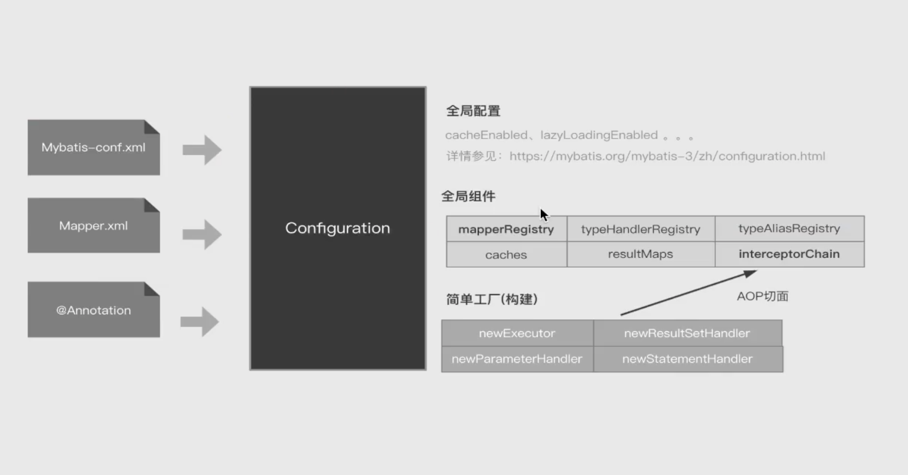
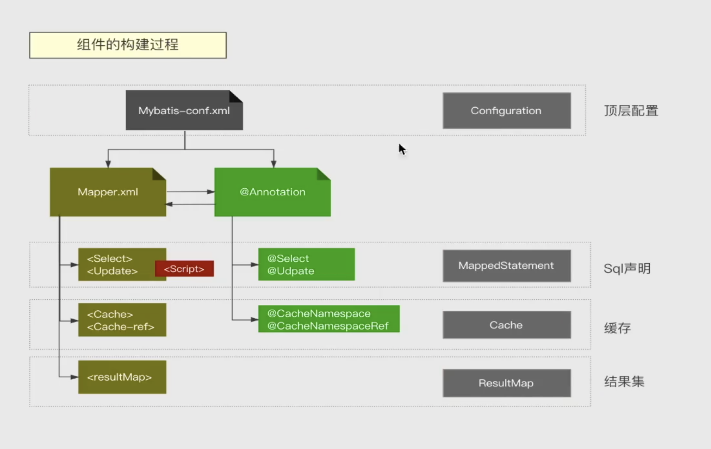
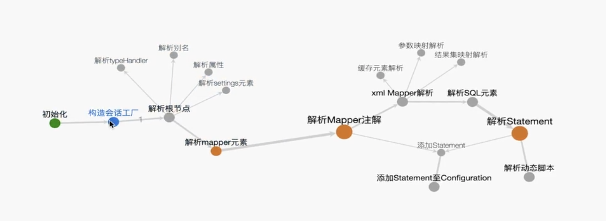
    在初始化的过程中，MyBatis会读取mybatis-config.xml这个全局配置文件和所有的Mapper.xml配置文件
    同时还会加载这两个配置文件中指定的类，解析类中的相关注解，最终将解析到的信息转换为配置对象。
    完成配置加载之后，MyBatis就会根据得到的配置对象初始化各个模块。
    MyBatis 在加载配置文件、创建配置对象的时候，会使用到经典设计模式中的构造者模式
    mybatis-config.xml 解析全流程：
        MyBatis 初始化的第一个步骤就是加载和解析 mybatis-config.xml 这个全局配置文件，
        入口是XMLConfigBuilder这个Builder对象，它由SqlSessionFactoryBuilder.build()方法创建
        XMLConfigBuilder会解析mybatis-config.xml配置文件得到对应的Configuration全局配置对象
        然后SqlSessionFactoryBuilder会根据得到的Configuration全局配置文件创建一个DefaultSqlSessionFactory对象返回给上层使用
        XMLConfigBuilder.parse() 方法触发了 mybatis-config.xml 配置文件的解析
    主要标签：
        <properties>：定义 KV 信息供 MyBatis 使用
        <settings>：全局性的配置，例如，是否使用二级缓存、是否开启懒加载功能等
        <typeAliases>：类型别名
            类型别名是为 Java 类型设置一个短的名字。它只和 XML 配置有关，存在的意义仅在于用来减少类完全限定名的冗余
            例如：
                ```
                <typeAliases>
                    <typeAlias alias="Author" type="domain.blog.Author"/>
                    <typeAlias alias="Blog" type="domain.blog.Blog"/>
                    <typeAlias alias="Comment" type="domain.blog.Comment"/>
                    <typeAlias alias="Post" type="domain.blog.Post"/>
                    <typeAlias alias="Section" type="domain.blog.Section"/>
                    <typeAlias alias="Tag" type="domain.blog.Tag"/>
                </typeAliases>
                ```
            当这样配置时，Blog可以用在任何使用domain.blog.Blog的地方。
            也可以指定一个包名，MyBatis 会在包名下面搜索需要的 Java Bean，比如:
                ```
                <typeAliases>
                  <package name="domain.blog"/>
                </typeAliases>
                ```
            每一个在包 domain.blog 中的 Java Bean， 在没有注解的情况下，会使用 Bean 的首字母小写的非限定类名来作为它的别名。 比如 domain.blog.Author 的别名为 author；若有注解，则别名为其注解值。看下面的例子：
                ```
                @Alias("author")
                public class Author {
                ...
                }
                ```
        <typeHandlers>：
            无论是MyBatis在预处理语句（PreparedStatement）中设置一个参数时。
            还是从结果集中取出一个值的时候，都会使用类型处理器以合适的方式转换Java类型
            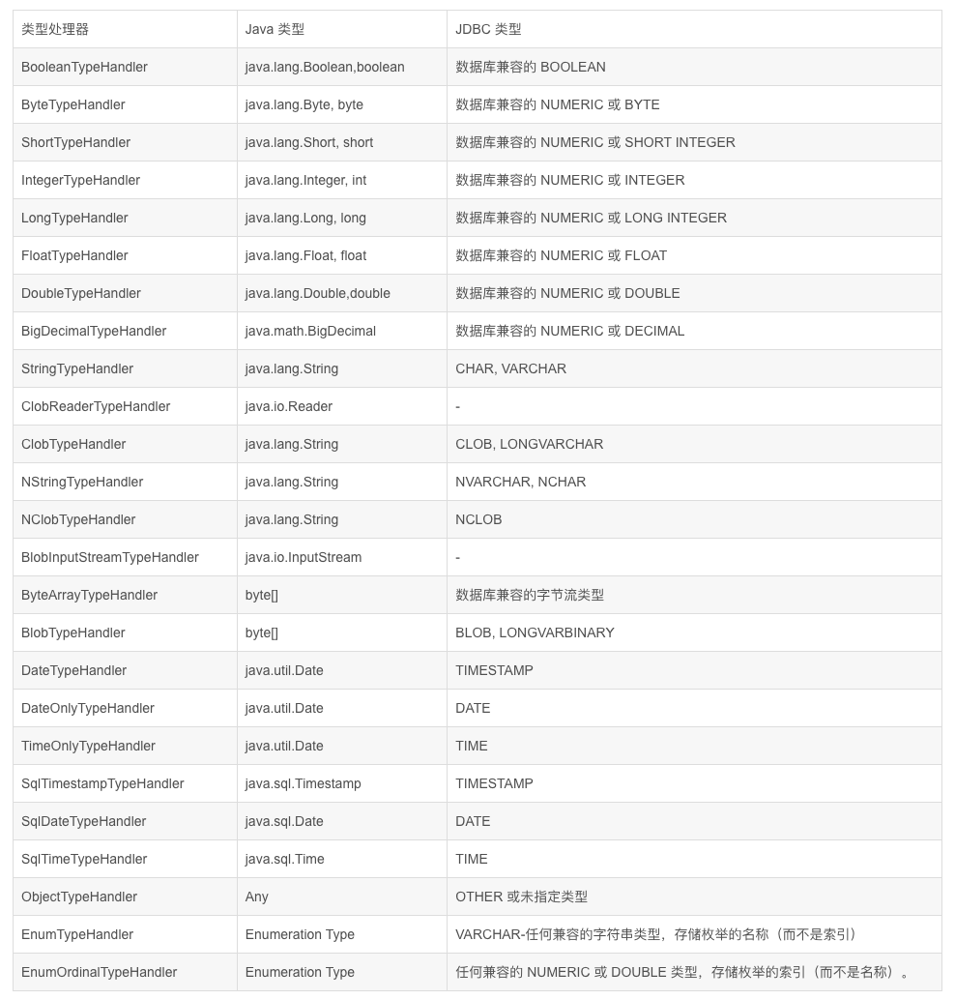
            我们可以实现自己的类型处理器：
            ```
            <typeHandlers>
                <typeHandler handler="org.mybatis.example.ExampleTypeHandler"/>
            </typeHandlers>
            ```
        <plugins>：配置MyBatis实现的插件
        <objectFactory>：MyBatis支持自定义的ObjectFactory实现类和ObjectWrapperFactory
            我们把数据库返回的结果集转换为实体类的时候，需要创建对象的实例，由于我 们不知道需要处理的类型是什么，有哪些属性，所以不能用 new 的方式去创建。
            在 MyBatis 里面，它提供了一个工厂类的接口，叫做 ObjectFactory，专门用来创建对象的实例。
            在结果集映射中有使用到。
        <environments>：在MyBatis中，我们可以通过此标签为不同环境添加不同配置
        <databaseIdProvider>：多数据库支持
            MyBatis编写的都是原生SQL语句，而很多数据库产品都有一些sql语言，这些语言与标准SQL不兼容
            我们可以通过 <databaseIdProvider> 标签定义需要支持的全部数据库的 DatabaseId
            在后续编写 Mapper 映射配置文件的时候，就可以为同一个业务场景定义不同的 SQL 语句（带有不同的 DataSourceId）
            来支持不同的数据库，这里就是靠 DatabaseId 来确定哪个 SQL 语句支持哪个数据库的。
        <mappers>：配置Mapper映射文件
（二） 加载Mapper接口和Mapper.xml映射文件
    （1）将用户配置的Mapper接口所在包路径package添加到MapperRegistry注册表中
    （2）在MapperRegistry注册表中会对包下所有的Mapper接口进行解析，每个接口创建对应的MapperProxyFactory动态代理工厂，并保存
（三） Mapper.xml映射文件映射文件解析
    MyBatis会为每个Mapper.xml映射文件创建一个XMLMapperBuilder实例完成解析
    与XMLConfigBuilder类似，XMLMapperBuilder也是具有构造者的角色。
    主要解析过程：
        <cache>标签解析：
            解析<cache>标签得到所有信息传递给MapperBuilderAssistant完成Cache对象创建
            将创建好的Cache对象添加到Configuration.caches集合中，这个caches字段是一个StrictMap类型集合
            key值是Mapper.xml 映射文件的namespace，value是真正二级缓存对应的Cache对象
        <cache-ref>标签解析：
            从上面可知，二级缓存是namespace级别的，但是有的场景中需要多个namespace共享同一个二级缓存，也就是共享一个Cache对象
            为了解决这个需求，MyBatis提供了<cache-ref>来引用另一个namespace的二级缓存。
            其中的 Key 是 <cache-ref> 标签所属的namespace 标识，Value 值是 <cache-ref> 标签引用的 namespace 值。
            原理：
                这里会使用一个叫CacheRefResolver的Cache引用解析器。
                CacheRefResolver 中记录了被引用的 namespace以及当前 namespace 关联的MapperBuilderAssistant 对象。
                这里解析 <cache-ref> 标签的时候，MapperBuilderAssistant 会通过 useCacheRef() 方法从 Configuration.caches 集合中，
                根据被引用的namespace 查找共享的 Cache 对象来初始化 currentCache，而不再创建新的Cache 对象，从而实现二级缓存的共享。
        <resultMap>标签解析：
            用来定义结果集与 Java 对象之间的映射规则。
            首先<resultMap>标签下的每一个子标签，例如<column>、<id>等，都被解析成一个ResultMapping对象
            这个对象维护了数据库一个列对应Java类中一个属性之间的映射关系。
            解析完成后创建映射结果对象ResultMap
        SQL语句（MapperStatement）解析：
            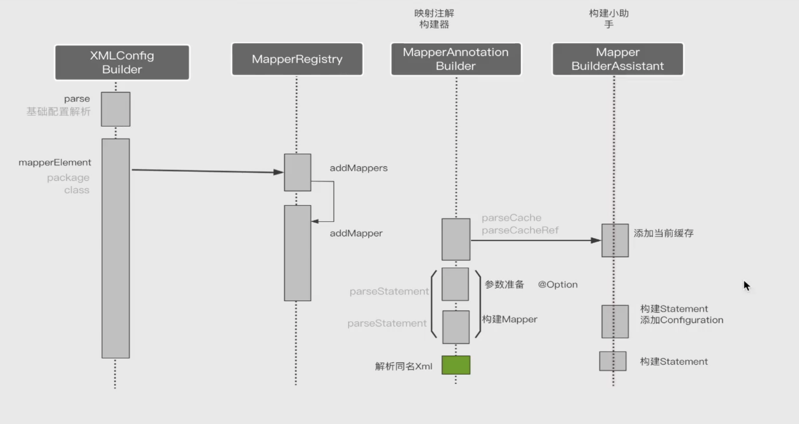  
            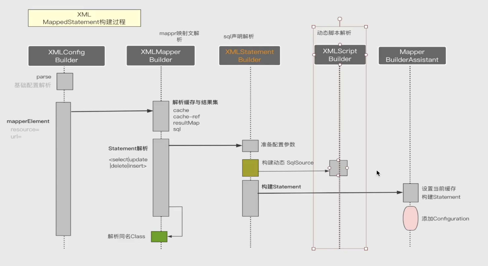
            除了上面介绍的标签之外，还有一类比较重要的标签，那就是<select>、<insert>、<delete>、<update> 等 SQL 语句标签
            虽然定义在Mapper.xml文件中，但是这些标签是由XMLStatementBuilder来进行解析的，而不是XMLMapperBuilder
            MyBatis 在内存中使用 MappedStatement 对象表示上述 SQL 标签。
                sqlCommandType：
                    MappedStatement中的sqlCommandType 字段记录了 SQL 语句的类型（INSERT、UPDATE、DELETE、SELECT 或 FLUSH 类型）。
                sqlSource：
                    MappedStatement中的sqlSource 字段记录了 SQL 标签中定义的 SQL 语句。
                    SqlSource中的动态标签、SQL语句文本等，会解析成对应类型的SqlNode对象
            最终MappedStatement对象为value放入Configuration中的mappedStatements中

# 深入分析MyBatis动态SQL语句解析
OGNL表达式语言：
    动态SQL语句中使用到了OGNL表达式读写JavaBean属性值、执行JavaBean方法这两个基础功能
    OGNL 表达式是相对完备的一门表达式语言，我们可以通过“对象变量名称.方法名称（或属性名称）”调用一个 JavaBean 对象的方法（或访问其属性）
    可以通过“@[类的完全限定名]@[静态方法（或静态字段）]”调用一个 Java 类的静态方法（或访问静态字段）。
DynamicContext 上下文
    在 MyBatis 解析一条动态 SQL 语句的时候，可能整个流程非常长，其中涉及多层方法的调用、方法的递归、复杂的循环等，
    其中产生的中间结果需要有一个地方进行存储，那就是 DynamicContext 上下文对象。
    三个核心属性：
        sqlBuilder 字段（StringJoiner 类型），用来记录解析之后的 SQL 语句；
        bindings 字段，用来记录上下文中的一些 KV 信息。
        ContextMap 内部类，用来记录运行时用户传入的、用来替换“#{}”占位符的实参。
组合模式
    是将同一类型的多个对象组合成一个树形结构。在使用这个树形结构的时候，我么可以像处理一个对象那样进行处理，而不用关心其复杂的树形结构
    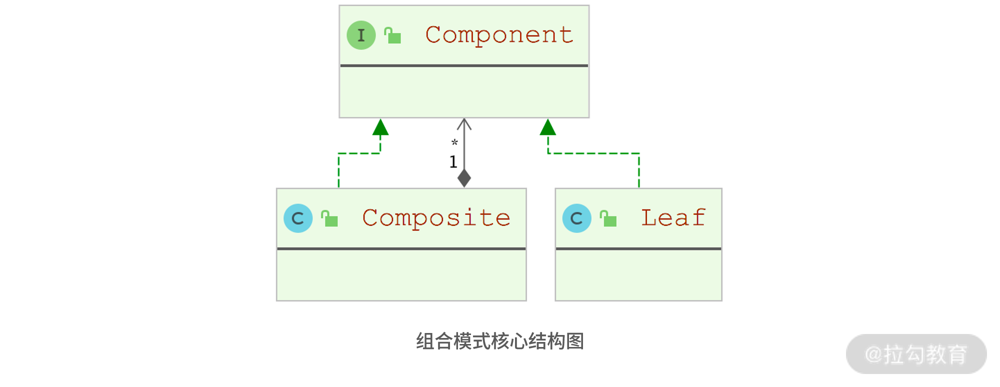 
    核心组件：
        Component接口：
            定义了树形结构中每个节点的基础行为。一般情况下会定义两类方法，一类是真正的业务行为
            另一类是管理字节点行为，例如addChild()、removeChild()、getChildren()
        Leaf类：
            抽象的是树形结构中的叶子节点。Leaf类只实现了Component接口中的业务方法，而没有管理子节点的方法给
        Composite：
            抽象了树形结构中的树枝节点（非叶子节点）。Composite不仅要实现Component中的业务方法给
            而且还需要实现字节点管理的相关方法，并在内部维护一个集合类管理这些子节点
    组合模式的优势：
        1，高层模块调用简单。局部和整体对调用者来说没有任何区别，也就是说，
        高层模块不必关心自己处理的是单个对象还是整个组合结构，简化了高层模块的代码。
        2，如果要在树形结构中添加新的功能，只需要增加树形结构中的节点即可，也就是提供新的 Component 接口实现并添加到树中，这符合“开放-封闭”原则。
    缺点：
        树枝树叶直接使用了实现类，这在面向接口编程是很不恰当的，它限制了接口的影响范围
    使用场景：
        1，只要是树形结构或者要是体现局部和整体关系的时候，而且这种关系可能比较深就要考虑下组合模式
        2，从一个整体能够独立出部分模块或者功能的场景
        3，维护和展示部分-整体关系的场景
SqlNode：
    MyBatis 处理动态 SQL 语句的时候，会将动态 SQL 标签解析为 SqlNode 对象，
    多个 SqlNode 对象就是通过组合模式组成树形结构供上层使用的。
    MyBatis为SqlNode接口提供了非常多的实现类，其中很多实现了都对应一个动态SQL标签，
    但是也有SqlNode实现扮演了组合模式中Composite角色，例如，MixedSqlNode实现类
    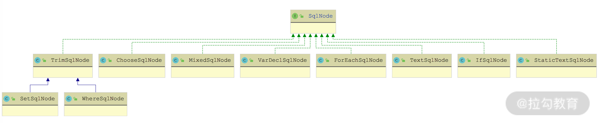
    1，StaticTextSqlNode
        StaticTextSqlNode 用于表示非动态的 SQL 片段，其中维护了一个 text 字段（String 类型），用于记录非动态 SQL 片段的文本内容，
        其 apply() 方法会直接将 text 字段值追加到 DynamicContext.sqlBuilder 的最末尾。
    2，MixedSqlNode
        在整个 SqlNode 树中充当了树枝节点，也就是扮演了组合模式中 Composite 的角色，
        其中维护了一个 List<SqlNode> 集合用于记录 MixedSqlNode 下所有的子 SqlNode 对象。
        MixedSqlNode 对于 apply() 方法的实现也相对比较简单，核心逻辑就是遍历 List<SqlNode> 集合中全部的子 SqlNode 对象并调用 apply() 方法，由子 SqlNode 对象完成真正的动态 SQL 处理逻辑。
    3，TextSqlNode
        TextSqlNode 实现抽象了包含 “${}”占位符的动态 SQL 片段。
        TextSqlNode 通过一个 text 字段（String 类型）记录了包含“${}”占位符的 SQL 文本内容，在 apply() 方法实现中会结合用户给定的实参解析“${}”占位符
    4，IfSqlNode
        IfSqlNode 实现类对应了动态 SQL 语句中的 标签，在 MyBatis 的 <if> 标签中使用可以通过 test 属性指定一个表达式，当表达式成立时，<if> 标签内的 SQL 片段才会出现在完整的 SQL 语句中。
        在 MyBatis 的 <if> 标签中使用可以通过 test 属性指定一个表达式，当表达式成立时，<if> 标签内的 SQL 片段才会出现在完整的 SQL 语句中。
    5，TrimSqlNode
        TrimSqlNode 对应 MyBatis 动态 SQL 语句中的 标签。
        在使用 <trim> 标签的时候，我们可以指定 prefix 和 suffix 属性添加前缀和后缀，也可以指定 prefixesToOverrides 和 suffixesToOverrides 属性来删除多个前缀和后缀（使用“|”分割不同字符串）。
        在 TrimSqlNode 中维护了同名的四个字段值，即 prefix 字段、suffix 字段（这两个是 String 类型）以及 prefixesToOverride 字段、suffixesToOverride 字段（这两个是 List<String> 类型）。
    6，ForeachSqlNode
        首先，向 DynamicContext.sqlBuilder 中追加 open 属性值指定的字符串，然后通过 ExpressionEvaluator 工具类解析 <foreach> 标签中 collection 属性指定的表达式，得到一个集合对象，并遍历这个集合。
        接下来，为每个元素创建一个 PrefixedContext 对象。PrefixedContext 是 DynamicContext 的一个装饰器，其中记录了一个 prefix 前缀信息（其实就是 <foreach> 标签中的 separator 属性值），在其 apply() 方法中会先追加 prefix 前缀（迭代第一个元素的时候，prefix 为空字符串），然后追加 SQL 片段。
        如果传入的集合是 Map 类型，则通过 applyIndex() 方法和 applyItem() 方法将 Map 中的 Key 和 Value 记录到 PrefixedContext 中
        但如果传入的集合不是 Map 类型，则通过 applyIndex() 方法和 applyItem() 方法将集合元素的下标索引和元素值本身绑定到 PrefixedContext 中。
        完成 PrefixedContext 的绑定之后，会调用 <foreach> 标签下子 SqlNode 的 apply() 方法
        其中传入的 DynamicContext 实际上是 ForEachSqlNode$FilteredDynamicContext 这个内部类，它也是 DynamicContext 的装饰器，
        核心功能是：根据前面在 PrefixedContext 中绑定的各种变量，处理 SQL 片段中的“#{}”占位符
    7，ChooseSqlNode
        <choose>标签会被 MyBatis 解析成 ChooseSqlNode 对象， 
        <when>标签会被解析成 IfSqlNode 对象，
        <otherwise> 标签会被解析成 MixedSqlNode 对象。
        原理：
            ChooseSqlNode中维护了一个 List<SqlNode> 集合（ifSqlNodes 字段）用来记录所有 <when> 子标签对应的 IfSqlNode 对象
            同时还维护了一个 SqlNode 类型字段（defaultSqlNode 字段）用来记录 <otherwise> 子标签生成的 MixedSqlNode 对象
            在 ChooseSqlNode 的 apply() 方法中，首先会尝试迭代全部 IfSqlNode 节点并执行 apply() 方法
            我们知道任意一个 IfSqlNode.apply() 方法返回 true，即表示命中该分支，此时整个 ChooseSqlNode.apply() 返回 true，否则尝试执行 defaultSqlNode.apply() 方法并返回 true，即进入默认分支
            如果 defaultSqlNode 字段为 null，则返回 false。
    8，VarDeclSqlNode
        VarDeclSqlNode 抽象了 <bind> 标签，其核心功能是将一个 OGNL 表达式的值绑定到一个指定的变量名上，并记录到 DynamicContext 上下文中。
        VarDeclSqlNode 中的 name 字段维护了 <bind> 标签中 name 属性的值，expression 字段记录了 <bind> 标签中 value 属性的值（一般是一个 OGNL 表达式）。
        在 apply() 方法中，VarDeclSqlNode 首先会通过 OGNL 工具类解析 expression 这个表达式的值，然后将解析结果与 name 字段的值一起绑定到 DynamicContext 上下文中，这样后面就可以通过 name 字段值获取这个表达式的值了。
SqlSourceBuilder
    动态 SQL 语句经过上述 SqlNode 的解析之后，接着会由 SqlSourceBuilder 进行下一步处理。
    SqlSourceBuilder 的核心操作主要有两个：
        （1）解析“#{}”占位符中携带的各种属性，例如，“#{id, javaType=int, jdbcType=NUMERIC, typeHandler=MyTypeHandler}”这个占位符，指定了 javaType、jdbcType、typeHandler 等配置；
        （2）将 SQL 语句中的“#{}”占位符替换成“?”占位符，替换之后的 SQL 语句就可以提交给数据库进行编译了。
    SqlSourceBuilder 完成了“#{}”占位符的解析和替换之后，会将最终的 SQL 语句以及得到的 ParameterMapping 集合封装成一个 StaticSqlSource 对象并返回。
SqlSource
    经过上述一系列处理之后，SQL 语句最终会由 SqlSource 进行最后的处理。
    在 SqlSource 接口中只定义了一个 getBoundSql() 方法，它控制着动态 SQL 语句解析的整个流程，它会根据从 Mapper.xml 映射文件（或注解）解析到的 SQL 语句以及执行 SQL 时传入的实参，返回一条可执行的 SQL。
    三个核心实现类的具体含义：
        （1）DynamicSqlSource：当 SQL 语句中包含动态 SQL 的时候，会使用 DynamicSqlSource 对象。
        （2）RawSqlSource：当 SQL 语句中只包含静态 SQL 的时候，会使用 RawSqlSource 对象。
        （3）StaticSqlSource：DynamicSqlSource 和 RawSqlSource 经过一系列解析之后，会得到最终可提交到数据库的 SQL 语句，这个时候就可以通过 StaticSqlSource 进行封装了。


https://learn.lianglianglee.com/%E4%B8%93%E6%A0%8F/%E6%B7%B1%E5%85%A5%E5%89%96%E6%9E%90%20MyBatis%20%E6%A0%B8%E5%BF%83%E5%8E%9F%E7%90%86-%E5%AE%8C/14%20%20%E6%8E%A2%E7%A9%B6%20MyBatis%20%E7%BB%93%E6%9E%9C%E9%9B%86%E6%98%A0%E5%B0%84%E6%9C%BA%E5%88%B6%E8%83%8C%E5%90%8E%E7%9A%84%E7%A7%98%E5%AF%86%EF%BC%88%E4%B8%8A%EF%BC%89.md
    
