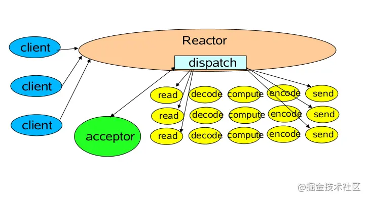
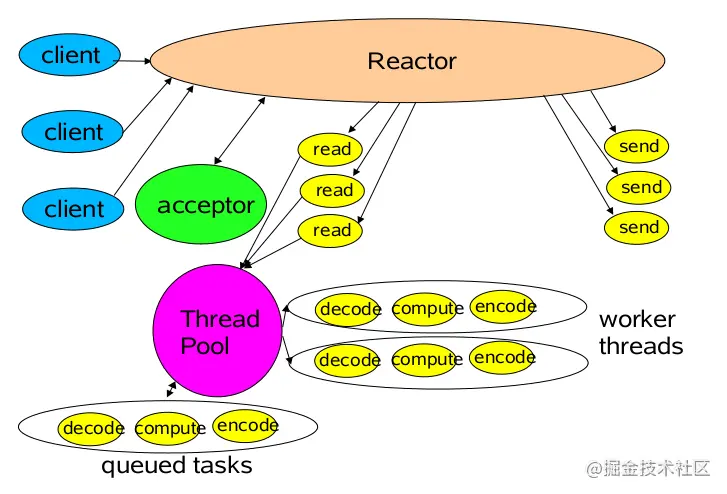
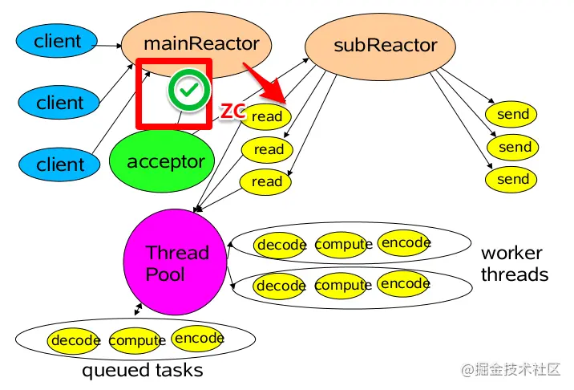

# Reactor
关键点 ：
    1，事件驱动（event handling）
    2，可以处理一个或多个输入源（one or more inputs）
    3，通过Service Handler同步的将输入事件（Event）采用多路复用分发给相应的Request Handler（多个）处理
自POSA2 中的关于Reactor Pattern 介绍中，我们了解了Reactor 的处理方式:
    1，同步的等待多个事件源到达（采用select()实现）
    2，将事件多路分解以及分配相应的事件服务进行处理，这个分派采用server集中处理（dispatch）
    3，分解的事件以及对应的事件服务应用从分派服务中分离出去（handler）
为什么要用reactor
    常见的网络服务中，如果每一个客户端都维持一个与登陆服务器的连接。那么服务器将维护多个和客户端的连接以出来和客户端的contnect 、read、write ，特别是对于长链接的服务，
    有多少个c端，就需要在s端维护同等的IO连接。这对服务器来说是一个很大的开销。
BIO
    // 主线程维护连接
    public void run() {
        try {
            while (true) {
              Socket socket = serverSocket.accept();
              //提交线程池处理
              executorService.submit(new Handler(socket));
            }
        } catch (Exception e) {
            e.printStackTrace();
        }
    }
    // 处理读写服务
    class Handler implements Runnable {
        public void run() {
            try {
                //获取Socket的输入流，接收数据
                BufferedReader buf = new BufferedReader(new InputStreamReader(socket.getInputStream()));
                String readData = buf.readLine();
                while (readData != null) {
                  readData = buf.readLine();
                  System.out.println(readData);
                }
            } catch (Exception e) {
                e.printStackTrace();
            }
        }
    }
    1，同步阻塞IO，读写阻塞，线程等待时间过长
    2，在制定线程策略的时候，只能根据CPU的数目来限定可用线程资源，不能根据连接并发数目来制定，也就是连接有限制。否则很难保证对客户端请求的高效和公平。
    3，多线程之间的上下文切换，造成线程使用效率并不高，并且不易扩展
    4，状态数据以及其他需要保持一致的数据，需要采用并发同步控制
NIO
    1，非阻塞的IO读写
    2，基于IO事件进行分发任务，同时支持对多个fd的监听
    public NIOServer(int port) throws Exception {
        selector = Selector.open();
        serverSocket = ServerSocketChannel.open();
        serverSocket.socket().bind(new InetSocketAddress(port));
        serverSocket.configureBlocking(false);
        serverSocket.register(selector, SelectionKey.OP_ACCEPT);
    }
    @Override
    public void run() {
        while (!Thread.interrupted()) {
            try {
                //阻塞等待事件
                selector.select();
                // 事件列表
                Set selected = selector.selectedKeys();
                Iterator it = selected.iterator();
                while (it.hasNext()) {
                  it.remove();
                  //分发事件
                  dispatch((SelectionKey) (it.next()));
                }
            } catch (Exception e) { }
        }
    }
    private void dispatch(SelectionKey key) throws Exception {
      if (key.isAcceptable()) {
          register(key);//新链接建立，注册
      } else if (key.isReadable()) {
          read(key);//读事件处理
      } else if (key.isWritable()) {
          wirete(key);//写事件处理
      }
    }
    private void register(SelectionKey key) throws Exception {
      ServerSocketChannel server = (ServerSocketChannel) key.channel();
      // 获得和客户端连接的通道
      SocketChannel channel = server.accept();
      channel.configureBlocking(false);
      //客户端通道注册到selector 上
      channel.register(this.selector, SelectionKey.OP_READ);
    }
    我们可以看到上述的NIO例子已经差不多拥有reactor的影子了
    1，基于事件驱动-> selector（支持对多个socketChannel的监听）
    2，统一的事件分派中心-> dispatch
    3，事件处理服务-> read & write
    事实上NIO已经解决了上述BIO暴露的1&2问题了，服务器的并发客户端有了量的提升，不再受限于一个客户端一个线程来处理，而是一个线程可以维护多个客户端（selector 支持对多个socketChannel 监听）。
    但这依然不是一个完善的Reactor Pattern ,首先Reactor 是一种设计模式，好的模式应该是支持更好的扩展性，显然以上的并不支持，另外好的Reactor Pattern 必须有以下特点：
        1，更少的资源利用，通常不需要一个客户端一个线程
        2，更少的开销，更少的上下文切换以及locking
        3，能够跟踪服务器状态
        4，能够管理handler 对event的绑定
首先我们基于Reactor Pattern 处理模式中，定义以下三种角色:
    Reactor将I/O事件分派给对应的Handler
    Acceptor处理客户端新连接，并分派请求到处理器链中
    Handlers执行非阻塞读/写 任务
1，单Reactor单线程模型
作为 NIO 服务器，接受客户端 TCP 连接，作为 NIO 客户端，向服务端发起 TCP 连接
服务端读请求数据并响应，客户端写请求并读取响应
场景：
    对应小业务则适合，编码简单，对于高负载，高并发不合适。一个 NIO 线程处理太多请求，负载很高，并且响应变慢，导致大量请求超时，万一线程挂了，则不可用
    
    这是最基本的单Reactor单线程模型。
    其中Reactor线程，负责多路分离套接字，有新连接到来触发connect 事件之后，交由Acceptor进行处理，有IO读写事件之后交给hanlder 处理。
    Acceptor主要任务就是构建handler ，在获取到和client相关的SocketChannel之后 ，绑定到相应的hanlder上，对应的SocketChannel有读写事件之后，基于racotor 分发,hanlder就可以处理了（所有的IO事件都绑定到selector上，有Reactor分发）。
    该模型 适用于处理器链中业务处理组件能快速完成的场景。不过，这种单线程模型不能充分利用多核资源，所以实际使用的不多。
    代码实现：
        /**
         * 等待事件到来，分发事件处理
         */
        class Reactor implements Runnable {
            private Reactor() throws Exception {
                SelectionKey sk = serverSocket.register(selector, SelectionKey.OP_ACCEPT);
                // attach Acceptor 处理新连接
                sk.attach(new Acceptor());
            }
            public void run() {
                try {
                    while (!Thread.interrupted()) {
                        selector.select();
                        Set selected = selector.selectedKeys();
                        Iterator it = selected.iterator();
                        while (it.hasNext()) {
                            it.remove();
                            //分发事件处理
                            dispatch((SelectionKey) (it.next()));
                        }
                    }
                } catch (IOException ex) {
                    //do something
                }
            }
            void dispatch(SelectionKey k) {
                // 若是连接事件获取是acceptor
                // 若是IO读写事件获取是handler
                Runnable runnable = (Runnable) (k.attachment());
                if (runnable != null) {
                    runnable.run();
                }
            }
        }
        /**
         * 连接事件就绪,处理连接事件
         */
        class Acceptor implements Runnable {
            @Override
            public void run() {
                try {
                    SocketChannel c = serverSocket.accept();
                    if (c != null) {// 注册读写
                        new Handler(c, selector);
                    }
                } catch (Exception e) {
        ​
                }
            }
        }
        /**
         * 处理读写业务逻辑
         */
        class Handler implements Runnable {
            public static final int READING = 0, WRITING = 1;
            int state;
            final SocketChannel socket;
            final SelectionKey sk;
            public Handler(SocketChannel socket, Selector sl) throws Exception {
                this.state = READING;
                this.socket = socket;
                sk = socket.register(selector, SelectionKey.OP_READ);
                sk.attach(this);
                socket.configureBlocking(false);
            }
            @Override
            public void run() {
                if (state == READING) {
                    read();
                } else if (state == WRITING) {
                    write();
                }
            }
            private void read() {
                process();
                //下一步处理写事件
                sk.interestOps(SelectionKey.OP_WRITE);
                this.state = WRITING;
            }
            private void write() {
                process();
                //下一步处理读事件
                sk.interestOps(SelectionKey.OP_READ);
                this.state = READING;
            }
            /**
             * task 业务处理
             */
            public void process() {
                //do something
            }
        }
2，单Reactor多线程模型
一个 Acceptor线程，一组 NIO 线程，一般是使用自带线程池，包含一个任务队列和多个可用线程场景：
    可满足大多数场景，当Acceptor需要做负责操作的时候，比如认证等耗时操作 ，在高并发情况下也会有性能问题
    
    相对于第一种单线程的模式来说，在处理业务逻辑，也就是获取到IO的读写事件之后，交由线程池来处理，这样可以减小主reactor的性能开销，从而更专注的做事件分发工作了
    代码实现：
        /**
         * 多线程处理读写业务逻辑
         */
        class MultiThreadHandler implements Runnable {
            public static final int READING = 0, WRITING = 1;
            int state;
            final SocketChannel socket;
            final SelectionKey sk;
            //多线程处理业务逻辑
            ExecutorService executorService = Executors.newFixedThreadPool(Runtime.getRuntime().availableProcessors());
            public MultiThreadHandler(SocketChannel socket, Selector sl) throws Exception {
                this.state = READING;
                this.socket = socket;
                sk = socket.register(selector, SelectionKey.OP_READ);
                sk.attach(this);
                socket.configureBlocking(false);
            }
            @Override
            public void run() {
                if (state == READING) {
                    read();
                } else if (state == WRITING) {
                    write();
                }
            }
            private void read() {
                //任务异步处理
                executorService.submit(() -> process());
                //下一步处理写事件
                sk.interestOps(SelectionKey.OP_WRITE);
                this.state = WRITING;
            }
            private void write() {
                //任务异步处理
                executorService.submit(() -> process());
                //下一步处理读事件
                sk.interestOps(SelectionKey.OP_READ);
                this.state = READING;
            }
            /**
             * task 业务处理
             */
            public void process() {
                //do IO ,task,queue something
            }
        }
3，多Reactor多线程模型
Acceptor不在是一个线程，而是一组 NIO 线程，IO 线程也是一组 NIO 线程，这样就是 2 个线程池去处理接入和处理 IO场景：
    满足目前大部分场景，也是 Netty推荐使用的线程模型BossGroup 处理连接的WorkGroup 处理业务的
    
    第三种模型比起第二种模型，是将Reactor分成两部分，
        1,mainReactor负责监听server socket，用来处理新连接的建立，将建立的socketChannel指定注册给subReactor。
        2,subReactor维护自己的selector, 基于mainReactor 注册的socketChannel多路分离IO读写事件，读写网 络数据，对业务处理的功能，另其扔给worker线程池来完成。
    第三种模型中，我们可以看到，mainReactor 主要是用来处理网络IO 连接建立操作，通常一个线程就可以处理。而subReactor主要做和建立起来的socket做数据交互和事件业务处理操作，它的个数上一般是和CPU个数等同，每个subReactor一个线程来处理。
    此种模型中，每个模块的工作更加专一，耦合度更低，性能和稳定性也大量的提升，支持的可并发客户端数量可达到上百万级别。
    关于此种模型的应用，目前有很多优秀的矿建已经在应用了，比如mina 和netty 等。上述中去掉线程池的第三种形式的变种，也 是Netty NIO的默认模式。下一节我们将着重讲解netty的架构模式。
    代码实现
        /**
         * 多work 连接事件Acceptor,处理连接事件
         */
        class MultiWorkThreadAcceptor implements Runnable {
            // cpu线程数相同多work线程
            int workCount = Runtime.getRuntime().availableProcessors();
            SubReactor[] workThreadHandlers = new SubReactor[workCount];
            volatile int nextHandler = 0;
            public MultiWorkThreadAcceptor() {
                this.init();
            }
            public void init() {
                nextHandler = 0;
                for (int i = 0; i < workThreadHandlers.length; i++) {
                    try {
                        workThreadHandlers[i] = new SubReactor();
                    } catch (Exception e) {
                    }
                }
            }
            @Override
            public void run() {
                try {
                    SocketChannel c = serverSocket.accept();
                    if (c != null) {// 注册读写
                        synchronized (c) {
                            // 顺序获取SubReactor，然后注册channel 
                            SubReactor work = workThreadHandlers[nextHandler];
                            work.registerChannel(c);
                            nextHandler++;
                            if (nextHandler >= workThreadHandlers.length) {
                                nextHandler = 0;
                            }
                        }
                    }
                } catch (Exception e) {
                }
            }
        }
        /**
         * 多work线程处理读写业务逻辑
         */
        class SubReactor implements Runnable {
            final Selector mySelector;
            //多线程处理业务逻辑
            int workCount = Runtime.getRuntime().availableProcessors();
            ExecutorService executorService = Executors.newFixedThreadPool(workCount);
            public SubReactor() throws Exception {
                // 每个SubReactor 一个selector 
                this.mySelector = SelectorProvider.provider().openSelector();
            }
            /**
             * 注册chanel
             *
             * @param sc
             * @throws Exception
             */
            public void registerChannel(SocketChannel sc) throws Exception {
                sc.register(mySelector, SelectionKey.OP_READ | SelectionKey.OP_CONNECT);
            }
            @Override
            public void run() {
                while (true) {
                    try {
                        //每个SubReactor 自己做事件分派处理读写事件
                        selector.select();
                        Set<SelectionKey> keys = selector.selectedKeys();
                        Iterator<SelectionKey> iterator = keys.iterator();
                        while (iterator.hasNext()) {
                            SelectionKey key = iterator.next();
                            iterator.remove();
                            if (key.isReadable()) {
                                read();
                            } else if (key.isWritable()) {
                                write();
                            }
                        }
                    } catch (Exception e) {
                    }
                }
            }
            private void read() {
                //任务异步处理
                executorService.submit(() -> process());
            }
            private void write() {
                //任务异步处理
                executorService.submit(() -> process());
            }
            /**
             * task 业务处理
             */
            public void process() {
                //do IO ,task,queue something
            }
        }

    
https://zhuanlan.zhihu.com/p/389308521
https://www.cnblogs.com/cjsblog/p/12580518.html
https://www.jianshu.com/p/7ee89f70dfe5
https://juejin.cn/post/6844903636422623240
https://blog.csdn.net/qq_38525526/article/details/99713288
