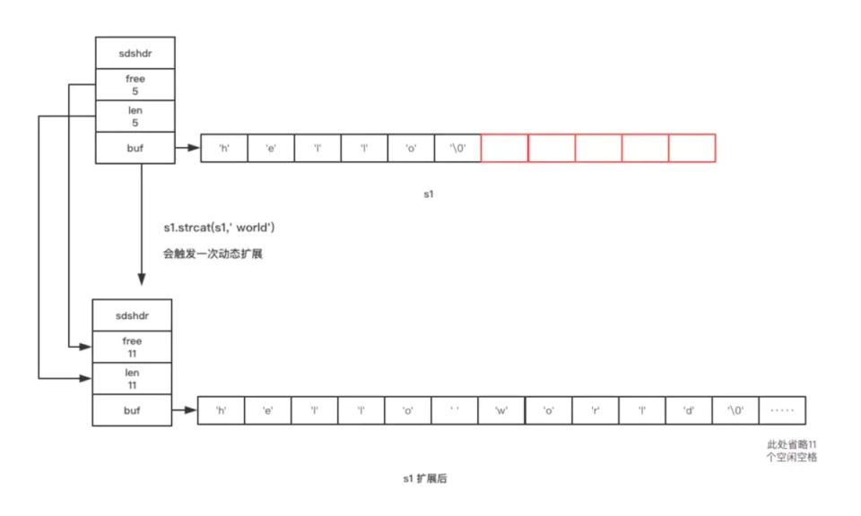
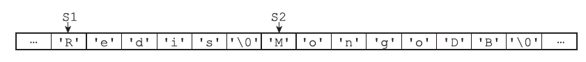
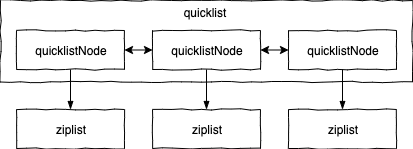
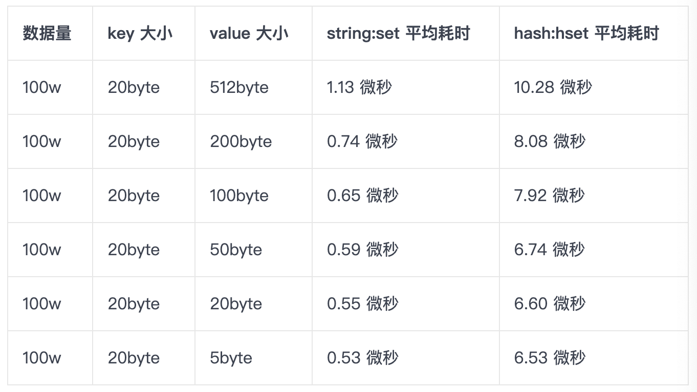

# 五种数据类型
① String 是 Redis 最基本的类型
    常用命令：set,get,decr,incr,mget 
    常规key-value缓存应用，常规的计数
② Hash是一个键值（key-value）的集合
    常用命令： hget,hset,hgetall 
    hash 是一个 string 类型的 field 和 value 的映射表，hash 特别适合用于存储对象，后续操作的时候，你可以直接仅仅修改这个对象中的某个字段的值。 
    比如我们可以 hash 数据结构来存储用户信息，商品信息等等。
③ List 列表是简单的字符串列表，按照插入顺序排序
    常用命令: lpush,rpush,lpop,rpop,lrange
    list 就是链表，Redis list 的应用场景非常多，也是Redis最重要的数据结构之一，比如微博的关注列表，粉丝列表，消息列表等功能都可以用Redis的 list 结构来实现。
    Redis list 的实现为一个双向链表，即可以支持反向查找和遍历，更方便操作，不过带来了部分额外的内存开销。
    另外可以通过 lrange 命令，就是从某个元素开始读取多少个元素，可以基于 list 实现分页查询，这个很棒的一个功能，基于 redis 实现简单的高性能分页，可以做类似微博那种下拉不断分页的东西（一页一页的往下走），性能高。
④ Set 是 String 类型的无序集合。
    常用命令： sadd,spop,smembers,sunion
    当你需要存储一个列表数据，又不希望出现重复数据时，set是一个很好的选择。
    并且set提供了判断某个成员是否在一个set集合内的重要接口，这个也是list所不能提供的。可以基于 set 轻易实现交集、并集、差集的操作。
⑤ Sorted Set
    常用命令： zadd,zrange,zrem,zcard
    和set相比，sorted set增加了一个权重参数score，使得集合中的元素能够按score进行有序排列。


# Redis过期时间
在Redis的expires字典中保存了数据库中所有键的过期时间，所以叫过期字典。
    - 过期字典的key是一个指针，指向键空间的某个键对象（就是数据库键）
    - 过期字典的value是一个long类型的整数，这个整数保存了键所指向的数据库键的过期时间，一个毫秒精度的UNIX时间戳
## 过期键判定
- 判断key是否存在于过期字典中
- 通过过期字典拿到key的过期时间，判断当前UNIX时间戳是否大于key时间
## 重点：过期键的删除策略
定时删除：
    设置过期键的同时，设定设定定时器，通过定时器来主动删除过期键。
    这种方式对内存友好，但是对cpu最不友好；定时器的设定需要使用redis服务器的时间事件（无序链表），查找的事件复杂度为O(n);故在过期键过多时，cpu的大部分占用是用来查找过期键和删除过期键的。
惰性删除：
    每次对key进行操作时，判断当前key是否过期，再进行操作。
    这种方式很明显对内存是不友好的，key过期的话仍然会一直存在数据库中，直到下次有对这个key的操作。
定期删除：
    定期删除指的是Redis默认每隔100ms就随机抽取一些设置了过期时间的key，检测这些key是否过期，如果过期了就将其删掉。
    因为key太多，如果全盘扫描所有的key会非常耗性能，所以是随机抽取一些key来删除。这样就有可能删除不完，需要惰性删除配合。

但有些过期的key既没有被随机抽取，也没有被客户端访问，就会一直保留在数据库，占用内存，长期下去可能会导致内存耗尽。所以Redis提供了内存淘汰机制来解决这个问题。


# 内存淘汰机制
**MySQL里有2000w数据，Redis中只存20w的数据，内存淘汰机制可以保证Redis中的数据都是热点数据**
Redis在使用内存达到某个阈值（通过maxmemory配置)的时候，就会触发内存淘汰机制，选取一些key来删除。内存淘汰有许多策略，下面分别介绍这几种
- noeviction：当内存不足以容纳新写入数据时，新写入操作会报错。默认策略
- allkeys-lru：当内存不足以容纳新写入数据时，在键空间中，移除最近最少使用的key。
- allkeys-random：当内存不足以容纳新写入数据时，在键空间中，随机移除某个key。
- volatile-lru：当内存不足以容纳新写入数据时，在设置了过期时间的键空间中，移除最近最少使用的key。
- volatile-random：当内存不足以容纳新写入数据时，在设置了过期时间的键空间中，随机移除某个key。
- volatile-ttl：当内存不足以容纳新写入数据时，在设置了过期时间的键空间中，有更早过期时间的key优先移除。
如何进行选择呢？
如何选取合适的策略？比较推荐的是两种lru策略。根据自己的业务需求。
如果你使用Redis只是作为缓存，不作为DB持久化，那推荐选择allkeys-lru；
如果你使用Redis同时用于缓存和数据持久化，那推荐选择volatile-lru。
# 应用场景（缓存预热）：
1，缓存预热基本思路
由于缓存冷启动问题，redis 启动后，一点数据都没有，直接就对外提供服务了，mysql 裸奔
（1）提前给 redis 中灌入部分数据，再提供服务
（2）数据量太大的话，无法将所有数据放入 redis 中
    耗费时间过长
    或 redis 根本无法容纳下所有的数据
（3）需要根据当天的具体访问情况，实时统计出访问频率较高的热数据
    然后将访问频率较高的热数据写入 redis 中，肯定数据也比较多， 我们也得多个服务并行读取数据去写，并行的分布式缓存预热
（4）都准备好后，在对外服务，就不至于冷启动，让数据库裸奔了
2，缓存预热具体实现思路
（1）nginx +lua 将访问流量上报到 kafka 中
    要统计出当前最新的实时的热数据是那些，我们就得将商品详情页访问的请求对应的流量 日志实时上报到 kafka 中
（2）storm 从 kafka 中消费数据，实时统计访问次数
    访问次数基于 LRU 内存数据结构的存储方案；
    为什么要基于 LRU 内存方案？
        storm 中读写数据频繁
        数据量大
        所以不适合依赖 redis 或者 mysql：
        redis 可能出现故障，会导致 storm 的稳定性
        mysql：扛不住高并发读写
        hbase：hadoop 生态组合还是不错的，但是对于非专业大数据方向来说，维护太重了
    我之前做过的一些项目，一些广告计费类的系统也是用这种方案，有人就直接往 mysql 中去写， 流量上来之后 mysql 直接被打死了
    其实我们的需求就是：统计出最近一段时间访问最频繁的商品，进行访问计数， 同时维护出一个前 N 个访问最多的商品 list 即可
    也就是热数据：最近一段时间（如最近 1 小时、5 分钟），1 万个商品请求， 统计这段时间内每个商品的访问次数，排序后做出一个 top n 列表
    计算好每个 task 大致要存放的商品访问次数的数量，计算出大小， 然后构建一个 LRU MAP，它能够给你一个剩下访问次数最多的商品列表，访问高的才能存活
    LRU MAP 有开源的实现，apach commons collections 中有提供，设置好 map 的最大大小， 就会自动根据 LRU 算法去剔除多余的数据，保证内存使用限制， 即时有部分数据被干掉了，下次会从 0 开始统计，也没有关系，因为被 LRU 算法干掉了， 就表示它不是热数据，说明最近一段时间都很少访问了，热度下降了
（3）每个 Storm task 启动时，基于 zk 分布式锁，将自己的 ID 写入 zk 同一个节点中
    这个 id 写到一个固定节点中，形成一个 task id 列表， 后续可以通过这个 id 列表去拿到对于 task 存储在 zk node 上的 topn 列表
（4）每个 Storm task 负责完成自己这里的热数据统计
    比如每隔一段时间，就遍历下这个 map，维护并更新一个前 n 个商品的 list
（5）定时同步到 zk 中去
    写一个后台线程，每隔一段时间，比如 1 分钟，将这个 task 所有的商品排名算一次 将排名前 n 的热数据 list 同步到 zk 中去
（6）需要一个服务，根据 top n 列表在 mysql 中获取数据往 redis 中存
    这个服务有会部署多个实例，在启动时会拉取 storm task id 列表， 然后通过 zk 分布式锁，基于 id 去加锁，获取到这个 task id 节点中存储的 topn 列表， 然后读取 mysql 中的数据，存储在 redis 中
    这个服务可以是单独的服务，本课程为了方便会放在缓存服务中

# redis事务
redis的事务更像是一组命令的集合。
开启事务后我们可以同时执行一组命令，这些命令在事务执行前，不会进行入队的操作
## 1，如果事务执行时，命令集合存在书写错误，那么整个集合的命令都不会执行
- 如参数数量错误、参数名错误等等，或者其他更严重的错误，比如内存不足
- 对于这种情况，Redis早些时候会在事务执行前检查命令入队所得的返回值：如果命令入队时返回 QUEUED ，那么入队成功；否则，就是入队失败
- 如果有命令在入队时失败，那么大部分客户端都会停止并取消这个事务
## 2，如果命令编译通过，存在运行时异常，那么其他命令仍会执行，存在异常的命令执行失败
- 比如使用 incy命令对一个非整形数据进行原子 +1操作
## 3，事务是可以取消的，事务取消，入队的命令不会执行
- 可以手动使用命令取消，也可以直接 ctrl + F4强制取消（在事务未被执行前打断施法即可
不存在原子性之外，Redis中的事务也没有隔离级别的概念


# Redis 雪崩了解吗？
热点数据的缓存都是定时任务去刷新，如果首页所有 Key 的失效时间都是某一个时间节点，这个时间大量用户涌入，这些请求全部落在了数据库上这就是缓存雪崩
每个 Key 的失效时间都加个随机值就好了，这样可以保证数据不会再同一时间大面积失效。


# Redis 穿透
缓存穿透吧，缓存穿透是指缓存和数据库中都没有的数据
而用户不断发起请求。攻击导致数据库压力很大，严重会击垮数据库。

缓存穿透我会在接口层增加校验

# Redis 击穿
某一个 Key 不停地扛着大量的请求，Key 在失效的瞬间，持续的大并发直接落到了数据库上
设置热点数据永不过期

Redis 内置了复制（Replication），LUA脚本（Lua scripting）， LRU驱动事件（LRU eviction），事务（Transactions） 和不同级别的磁盘持久化（Persistence），并通过 Redis哨兵（Sentinel）和自动分区（Cluster）提供高可用性（High Availability）

# Redis如何进行持久化


# Redis为什么是单线程还那么快
1，Redis是基于内存实现的，数据存在内存中，类似于HashMap，HashMap的优势就是查找和操作的时间复杂度都是O(1)
2，数据结构简单，对数据的操作也简单
3，采用单线程，避免了不必要的上下文切换，不用考虑锁的问题。
4，Redis的多路复用机制

# Redis的多路复用机制
多路指的是网络连接，复用指的是同一个线程。
一个线程监听多个IO事件，当有IO事件就绪时，就会通知相应的线程去执行相应的读写操作
没有就绪事件时就会交出cpu。

## select 机制
### 基本原理：
客户端操作服务器时就会产生这三种文件描述符(简称 fd)：writefds(写)、readfds(读)、和 exceptfds(异常)。select 会阻塞住监视 3 类文件描述符，等有数据、可读、可写、出异常 或超时、就会返回；
返回后通过遍历 fdset 整个数组来找到就绪的描述符 fd，然后进行对应的 IO 操作。
### 优点：
几乎在所有的平台上支持，跨平台支持性好。
### 缺点：
1.由于是采用轮询方式全盘扫描，会随着文件描述符 FD 数量增多而性能下降。
2.每次调用 select()，需要把 fd 集合从用户态拷贝到内核态，并进行遍历(消息传递都是从内核到用 户空间)
3.默认单个进程打开的 FD 有限制是 1024 个，可修改宏定义，但是效率仍然慢。
## poll 机制：
## 基本原理：
基本原理与 select 一致，也是轮询+遍历；唯一的区别就是 poll 没有最大文件描述符限制（使用链表的方式存储 fd）。

## epoll 机制：
### 基本原理
没有 fd 个数限制，用户态拷贝到内核态只需要一次，使用时间通知机制来触发。通过 epoll_ctl 注册 fd，一旦 fd 就绪就会通过 callback 回调机制来激活对应 fd，进行相关的 io 操作。
### 优点：
1.没 fd 这个限制，所支持的 FD 上限是操作系统的最大文件句柄数，1G 内存大概支持 10 万个句柄
2.效率提高，使用回调通知而不是轮询的方式，不会随着 FD 数目的增加效率下降
3.内核和用户空间 mmap 同一块内存实现(mmap 是一种内存映射文件的方法，即将一个文件或者其它对象映射到进程的地址空间).

# redis集群三种模式
    1，主从复制
        概述
            主从复制是指将redis主节点（master）的数据复制到从节点（slave）
            数据复制是单向的，只能从主节点复制到从节点
            默认情况下，每台Redis服务器都是主节点；且一个主节点可以有多个从节点(或没有从节点)，但一个从节点只能有一个主节点。
        作用
            1，容灾恢复
                当主节点出现问题时，可以由从节点提供服务，实现快速的故障恢复；实际上是一种服务的冗余。
            2，负载均衡
                在主从复制的基础上，配合读写分离，可以由主节点提供写服务，由从节点提供读服务（即写Redis数据时应用连接主节点，读Redis数据时应用连接从节点），分担服务器负载；尤其是在写少读多的场景下，通过多个从节点分担读负载，可以大大提高Redis服务器的并发量。
            3，数据冗余
                实现数据热备份，是持久化之外的一种数据冗余方式
        原理
            全量同步
                1，从服务器连接主服务器，发送sync命令
                2，主服务器接收到SYNC命名后，开始执行BGSAVE命令生成RDB文件并使用缓冲区记录此后执行的所有写命令； 
                3，主服务器BGSAVE执行完后，向所有从服务器发送快照文件，并在发送期间继续记录被执行的写命令； 
                4，从服务器收到快照文件后丢弃所有旧数据，载入收到的快照； 
                5，主服务器快照发送完毕后开始向从服务器发送缓冲区中的写命令； 
                6，从服务器完成对快照的载入，开始接收命令请求，并执行来自主服务器缓冲区的写命令；
            部分同步
                从redis 2.8版本以前，并不支持部分同步，当主从服务器之间的连接断掉之后，master服务器和slave服务器之间都是进行全量数据同步，
                但是从redis 2.8开始，即使主从连接中途断掉，也不需要进行全量同步，可以进行部分同步
                1，master服务器内存中给每个slave服务器维护了一份同步日志和同步标识
                2，每个slave服务器在跟master服务器进行同步时都会携带自己的同步标识和上次同步的最后位置
                3，当主从连接断掉之后，slave服务器隔断时间（默认1s）主动尝试和master服务器进行连接
                4，如果从服务器携带的偏移量标识还在master服务器上的同步备份日志中，那么就从slave发送的偏移量开始继续上次的同步操作
                5，如果slave发送的偏移量已经不再master的同步备份日志中（可能由于主从之间断掉的时间比较长或者在断掉的短暂时间内master服务器接收到大量的写操作），则必须进行一次全量更新
                6，在部分同步过程中，master会将本地记录的同步备份日志中记录的指令依次发送给slave服务器从而达到数据一致。
            增量同步
                主服务器每执行一个写命令就会向从服务器发送相同的写命令，从服务器接收并执行收到的写命令。
        注意点：
            1，如果多个Slave断线了，需要重启的时候，因为只要Slave启动，就会发送sync请求和主机全量同步，当多个同时出现的时候，可能会导致Master IO剧增宕机。
            2，多个从服务器连接到一个主服务器之外，多个从服务器也可以连接到一个从服务器上，形成一个图状结构。
            3，Redis使用异步复制。但从Redis 2.8开始，从服务器会周期性的应答从复制流中处理的数据量。
            4，Redis主从复制不阻塞主服务器端。也就是说当若干个从服务器在进行初始同步时，主服务器仍然可以处理请求。
            5，主从复制也不阻塞从服务器端。当从服务器进行初始同步时，它使用旧版本的数据来应对查询请求，假设你在redis.conf配置文件是这么配置的。
            否则的话，你可以配置当复制流关闭时让从服务器给客户端返回一个错误。
            但是，当初始同步完成后，需要删除旧的数据集和加载新的数据集，在这个短暂的时间内，从服务器会阻塞连接进来的请求。
            6，使用主从复制可以为主服务器免除把数据写入磁盘的消耗：在主服务器的redis.conf文件中配置“避免保存”（注释掉所有“保存“命令），然后连接一个配置为“进行保存”的从服务器即可
        具体使用
            主从复制的开启，完全是在从节点发起的；不需要我们在主节点做任何事情。
            从节点开启主从复制，有3种方式：
            (1) 配置文件
                在从服务器的配置文件中加入：slaveof <masterip> <masterport>
            (2) 启动命令
                redis-server启动命令后加入 --slaveof <masterip> <masterport>
            (3) 客户端命令
                Redis服务器启动后，直接通过客户端执行命令：slaveof <masterip> <masterport>，则该Redis实例成为从节点。
        缺点
            1，Redis不具备自动容错和恢复功能，主机从机的宕机都会导致前端部分读写请求失败，需要等待机器重启或者手动切换前端的IP才能恢复（也就是要人工介入）；
            2，主机宕机，宕机前有部分数据未能及时同步到从机，切换IP后还会引入数据不一致的问题，降低了系统的可用性（需要手动将一台slave切换成master）；
            3，如果多个 Slave 断线了，需要重启的时候，尽量不要在同一时间段进行重启。因为只要 Slave 启动，就会发送sync 请求和主机全量同步，当多个 Slave 重启的时候，可能会导致 Master IO 剧增从而宕机。
            4，Redis 较难支持在线扩容，在集群容量达到上限时在线扩容会变得很复杂；
    2，Sentinel（哨兵模式）
        概述
            哨兵模式是一种特殊的模式，首先 Redis 提供了哨兵的命令
            哨兵是一个独立的进程，作为进程，它会独立运行。
            其原理是哨兵通过发送命令，等待Redis服务器响应，从而监控运行的多个 Redis 实例。
        作用
            1，通过发送命令，让 Redis 服务器返回监控其运行状态，包括主服务器和从服务器；
            2，当哨兵监测到 master 宕机，会自动将 slave 切换成 master ，然后通过发布订阅模式通知其他的从服务器，修改配置文件，让它们切换主机；
        一个哨兵进程对Redis服务器进行监控，也可能会出现问题，为此，我们可以使用多个哨兵进行监控。各个哨兵之间还会进行监控，这样就形成了多哨兵模式。
        原理
            1，每个Sentinel（哨兵）进程以每秒钟一次的频率向整个集群中的 Master 主服务器，Slave 从服务器以及其他Sentinel（哨兵）进程发送一个 PING 命令。
            2，如果一个实例（instance）距离最后一次有效回复 PING 命令的时间超过 down-after-milliseconds 选项所指定的值， 则这个实例会被 Sentinel（哨兵）进程标记为主观下线（SDOWN）
            3，如果一个 Master 主服务器被标记为主观下线（SDOWN），则正在监视这个 Master 主服务器的所有 Sentinel（哨兵）进程要以每秒一次的频率确认 Master 主服务器的确进入了主观下线状态
            4，当有足够数量的 Sentinel（哨兵）进程（大于等于配置文件指定的值）在指定的时间范围内确认 Master 主服务器进入了主观下线状态（SDOWN）， 则 Master 主服务器会被标记为客观下线（ODOWN）
            5，在一般情况下， 每个 Sentinel（哨兵）进程会以每 10 秒一次的频率向集群中的所有 Master 主服务器、Slave 从服务器发送 INFO 命令。
            6，当 Master 主服务器被 Sentinel（哨兵）进程标记为客观下线（ODOWN）时，Sentinel（哨兵）进程向下线的 Master 主服务器的所有 Slave 从服务器发送 INFO 命令的频率会从 10 秒一次改为每秒一次。
            7，若没有足够数量的 Sentinel（哨兵）进程同意 Master主服务器下线， Master 主服务器的客观下线状态就会被移除。若 Master 主服务器重新向 Sentinel（哨兵）进程发送 PING 命令返回有效回复，Master主服务器的主观下线状态就会被移除。
        优点
           哨兵模式是基于主从模式的，所有主从的优点，哨兵模式都具有。
           主从可以自动切换，系统更健壮，可用性更高(可以看作自动版的主从复制)。
        缺点
            Redis较难支持在线扩容，在集群容量达到上限时在线扩容会变得很复杂。
        配置过程
            1，配置Redis的主从服务器，修改redis.conf文件
                # 使得Redis服务器可以跨网络访问
                bind 0.0.0.0
                # 设置密码
                requirepass "123456"
                # 指定主服务器，注意：有关slaveof的配置只是配置从服务器，主服务器不需要配置
                slaveof 192.168.11.128 6379
                # 主服务器密码，注意：有关slaveof的配置只是配置从服务器，主服务器不需要配置
                masterauth 123456
                上述内容主要是配置Redis服务器，从服务器比主服务器多一个slaveof的配置和密码。
            2，配置3个哨兵，每个哨兵的配置都是一样的。在Redis安装目录下有一个sentinel.conf文件，copy一份进行修改
                # 禁止保护模式
                protected-mode no
                # 配置监听的主服务器，这里sentinel monitor代表监控，mymaster代表服务器的名称，可以自定义，192.168.11.128代表监控的主服务器，6379代表端口，2代表只有两个或两个以上的哨兵认为主服务器不可用的时候，才会进行failover操作。
                sentinel monitor mymaster 192.168.11.128 6379 2
                # sentinel author-pass定义服务的密码，mymaster是服务名称，123456是Redis服务器密码
                # sentinel auth-pass <master-name> <password>
                sentinel auth-pass mymaster 123456
                上述关闭了保护模式，便于测试。
            3，有了上述的修改，我们可以进入Redis的安装目录的src目录，通过下面的命令启动服务器和哨兵
                # 启动Redis服务器进程
                ./redis-server ../redis.conf
                # 启动哨兵进程
                ./redis-sentinel ../sentinel.conf
                注意启动的顺序。首先是主机（192.168.11.128）的Redis服务进程，然后启动从机的服务进程，最后启动3个哨兵的服务进程。
    3，Cluster
        redis最开始使用主从模式做集群，若master宕机需要手动配置slave转为master。
        后来为了高可用提出来哨兵模式，该模式下有一个哨兵监视master和slave，若master宕机可自动将slave转为master
        但是他也有一个问题，就是不能动态扩容，哨兵模式还是只有一个master；所以在3.x提出了cluster集群模式
        概述
            Redis-Cluster采用无中心结构，每个节点保存数据和整个集群状态,每个节点都和其他所有节点连接。
            多主多从，去中心化：从节点作为备用，复制主节点，不做读写操作，不提供服务
            不支持处理多个key：因为数据分散在多个节点，在数据量大高并发的情况下会影响性能；
            支持动态扩容节点：这是我认为算是Rerdis Cluster最大的优点之一；
            节点之间相互通信，相互选举，不再依赖sentinel：准确来说是主节点之间相互“监督”，保证及时故障转移
            所有的redis节点彼此互联(PING-PONG机制),内部使用二进制协议优化传输速度和带宽。
            节点的fail是通过集群中超过半数的节点检测失效时才生效。
            客户端与redis节点直连,不需要中间proxy层.客户端不需要连接集群所有节点,连接集群中任何一个可用节点即可。
        与其他集群区别
            1，相比较sentinel模式，多个master节点保证主要业务（比如master节点主要负责写）稳定性，不需要搭建多个sentinel实例监控一个master节点；
            2，相比较一主多从的模式，不需要手动切换，具有自我故障检测，故障转移的特点；
            3，相比较其他两个模式而言，对数据进行分片（sharding），不同节点存储的数据是不一样的；
            4，从某种程度上来说，Sentinel模式主要针对高可用（HA），而Cluster模式是不仅针对大数据量，高并发，同时也支持HA
        如何实现数据分片
            redis-cluster把所有的物理节点映射到[0-16383]slot上（不一定是平均分配）,cluster 负责维护node<->slot<->value。
            现在我们是三个主节点分别是：A, B, C 三个节点，它们可以是一台机器上的三个端口，也可以是三台不同的服务器。那么，采用哈希槽 (hash slot)的方式来分配16384个slot 的话，它们三个节点分别承担的slot 区间是：
                节点A覆盖0－5460;
                节点B覆盖5461－10922;
                节点C覆盖10923－16383.
            获取数据:
                如果存入一个值，按照redis cluster哈希槽的算法： CRC16('key')384 = 6782。 那么就会把这个key 的存储分配到 B 上了。同样，当我连接(A,B,C)任何一个节点想获取'key'这个key时，也会这样的算法，然后内部跳转到B节点上获取数据
            新增一个主节点:
                新增一个节点D，redis cluster的这种做法是从各个节点的前面各拿取一部分slot到D上，我会在接下来的实践中实验。大致就会变成这样：
                    节点A覆盖1365-5460
                    节点B覆盖6827-10922
                    节点C覆盖12288-16383
                    节点D覆盖0-1364,5461-6826,10923-12287
                同样删除一个节点也是类似，移动完成后就可以删除这个节点了。
        Redis Cluster主从模式
            redis cluster 为了保证数据的高可用性，加入了主从模式，一个主节点对应一个或多个从节点，主节点提供数据存取，从节点则是从主节点拉取数据备份，当这个主节点挂掉后，就会有这个从节点选取一个来充当主节点，从而保证集群不会挂掉
            上面那个例子里, 集群有ABC三个主节点, 如果这3个节点都没有加入从节点，如果B挂掉了，我们就无法访问整个集群了。A和C的slot也无法访问。
            所以我们在集群建立的时候，一定要为每个主节点都添加了从节点, 比如像这样, 集群包含主节点A、B、C, 以及从节点A1、B1、C1, 那么即使B挂掉系统也可以继续正确工作。
            B1节点替代了B节点，所以Redis集群将会选择B1节点作为新的主节点，集群将会继续正确地提供服务。 当B重新开启后，它就会变成B1的从节点。
            不过需要注意，如果节点B和B1同时挂了，Redis集群就无法继续正确地提供服务了。
    1，去中心化思想：Cluster集群有多个主节点，采用哈希槽算法将数据均匀的分布在不同的master节点。
    2，我们可以讲数据发送给任何一个Master节点，首先会根据哈希槽算法计算出key所在的分区，如果在本节点上就直接进行存取，如果不在的话通过内部跳转到对应的节点上获取数据
    2，每个Master配置多个从节点，从节点作为备用，复制主节点数据，不做读写操作，不提供服务。并且内部也是采用哨兵模式，如果主节点发生故障会选举新的从节点为Master节点
    3，新增一个节点的时候，redis cluster会从各个节点的前面各拿取一部分slot到新节点上
    4，节点之间使用轻量协议通信Gossip来减少带宽占用所以性能很高

# Gossip协议
集群往往需要维护一定的元数据，比如实例的ip地址，缓存分片的 slots 信息等，所以需要一套分布式机制来维护元数据的一致性
这类机制一般有两个模式：分散式和集中式
分散式机制将元数据存储在部分或者所有节点上，不同节点之间进行不断的通信来维护元数据的变更和一致性。Redis Cluster，Consul 等都是该模式。
而集中式是将集群元数据集中存储在外部节点或者中间件上，比如 zookeeper。旧版本的 kafka 和 storm 等都是使用该模式。

分散式的元数据模式有多种可选的算法进行元数据的同步，比如说 Paxos、Raft 和 Gossip
Paxos 和 Raft 等都需要全部节点或者大多数节点(超过一半)正常运行，整个集群才能稳定运行，而 Gossip 则不需要半数以上的节点运行。
Gossip 协议，顾名思义，就像流言蜚语一样，利用一种随机、带有传染性的方式，将信息传播到整个网络中，并在一定时间内，使得系统内的所有节点数据一致。
对你来说，掌握这个协议不仅能很好地理解这种最常用的，实现最终一致性的算法，也能在后续工作中得心应手地实现数据的最终一致性。
**在一个处于有界网络的集群里，如果每个节点都随机与其他节点交换特定信息，经过足够长的时间后，集群各个节点对该份信息的认知终将收敛到一致。**
这里的“特定信息”一般就是指集群状态、各节点的状态以及其他元数据等
Gossip协议是完全符合 BASE 原则，可以用在任何要求最终一致性的领域，比如分布式存储和注册中心。
另外，它可以很方便地实现弹性集群，允许节点随时上下线，提供快捷的失败检测和动态负载均衡等。
此外，Gossip 协议的最大的好处是，即使集群节点的数量增加，每个节点的负载也不会增加很多，几乎是恒定的。这就允许 Redis Cluster 或者 Consul 集群管理的节点规模能横向扩展到数千个。

Redis Cluster 中的每个节点都维护一份自己视角下的当前整个集群的状态，主要包括：
    当前集群状态
    集群中各节点所负责的 slots信息，及其migrate状态
    集群中各节点的master-slave状态
    集群中各节点的存活状态及怀疑Fail状态
也就是说上面的信息，就是集群中Node相互八卦传播流言蜚语的内容主题，而且比较全面，既有自己的更有别人的，这么一来大家都相互传，最终信息就全面而且一致了。
具体过程：
    每个实例之间会按照一定的频率，从集群中随机挑选一些实例，进行PING 消息发送，用来检测这些实例是否在线，并交换彼此的状态信息。
    PING 消息中封装了发送消息的实例自身的状态信息、部分其它实例的状态信息，以及 Slot 映射表。
    一个实例在接收到 PING 消息后，会给发送 PING 消息的实例，发送一个 PONG 消息。
    PONG 消息包含的内容和 PING 消息一样。

# Redis的sentinel基于的raft协议
raft协议中节点有3个状态：
    Leader: 负责处理所有客户端的请求. 并且会定期向集群中的 Follower 节点发送心跳信息，从而刷新 Follower 节点的选举计时器避免新一轮选举.
    Candidate: 当 Follower 节点的选举计时器超时过期，就会将自身状态转化成 Candidate，并发起新一轮选举.
    Follower: 只是响应来自 Leader 和 Candidate 的请求, 备份副本数据.
raft将一致性协议处理分成三个子问题，分别是
    leader选举
    日志复制
    安全
leader选举：
    每个 follower 都有一个选举计时器，当 选举计时器 超时，follower 会变成 candidate 开始选举.
    节点收到 选举请求 后，将按照先来先服务的原则进行投票，并且同一个term内每个节点最多给一个 candidate 投票.
    当 candidate 接收到集群中同一 term 的多数票，则 candidate 赢得选举. 赢得选举的节点状态切换成 Leader
    并向其它节点发送声明. 其它 candidate 收到 leader 声明且 term 比之前的都大后，接受新的 leader ，状态返回成 follower.
    当存在多个候选人时候，可能投票的结果是没有任何一个候选人取得大多数. 这时候，需要开启下一轮选举. raft 通过一个随机选举超时机制确保几乎不出现分裂投票.
term:
    可以理解为任期，用Term作为一个周期，每个Term都是一个连续递增的编号，每一轮选举都是一个Term周期，在一个Term中只能产生一个Leader 同时,
    term也起到了系统中逻辑时钟的作用，每一个server都存储了当前term编号，在server之间进行交流的时候就会带有该编号，如果一个server的编号小于另一个的，
    那么它会将自己的编号更新为较大的那一个；如果leader或者candidate发现自己的编号不是最新的了，就会自动转变为follower；如果接收到的请求的term编号小于自己的当前term将会拒绝执行。
日志复制
    客户端向 etcd 发起修改请求. leader 收到请求后将负责指令的执行，首先 leader 将新的日志条目添加到日志中
    然后并行的发起 AppendEntries RPC 请求给其他服务器，让它们复制这条信息. 当大多数服务器复制了这条日志，这条日志将会进行 commited 操作
安全机制(Safety)
    安全性是用于保证每个节点都执行相同序列的安全机制，避免新 Leader 产生后存在 Log 覆盖问题的机制
    Safety 用于保证选举出来的 Leader 一定包含先前 Committed Log 的机制
        
    
# 懂Redis事务么？
    我们在生产上采用的是Redis Cluster集群架构，不同的key是有可能分配在不同的Redis节点上的，在这种情况下Redis的事务机制是不生效的。其次，Redis事务不支持回滚操作，简直是鸡肋！所以基本不用！
# Redis集群机制中，你觉得有什么不足的地方吗？
    假设我有一个key，对应的value是Hash类型的。如果Hash对象非常大，是不支持映射到不同节点的！只能映射到集群中的一个节点上！还有就是做批量操作比较麻烦！
# 懂Redis的批量操作么？
    我们在生产上采用的是Redis Cluster集群架构，不同的key会划分到不同的slot中，因此直接使用mset或者mget等操作是行不通的。
# 那在Redis集群模式下，如何进行批量操作？
    如果执行的key数量比较少，就不用mget了，就用串行get操作
    如果真的需要执行的key很多，就使用Hashtag保证这些key映射到同一台redis节点上。简单来说语法如下
        对于key为{foo}.student1、{foo}.student2，{foo}student3，这类key一定是在同一个redis节点上。
        因为key中“{}”之间的字符串就是当前key的hash tags， 只有key中{ }中的部分才被用来做hash，因此计算出来的redis节点一定是同一个
# 有对Redis做读写分离么？
    不做读写分离。我们用的是Redis Cluster的架构，是属于分片集群的架构。而redis本身在内存上操作，不会涉及IO吞吐，即使读写分离也不会提升太多性能。
    Redis在生产上的主要问题是考虑容量，单机最多10-20G，key太多降低redis性能.因此采用分片集群结构，已经能保证了我们的性能。
    其次，用上了读写分离后，还要考虑主从一致性，主从延迟等问题，徒增业务复杂度。

# redis热点数据问题
怎么发现热key
    1，凭借经验预估那些是热key，比如某商品在做秒杀，那就可以判断出热key
    2，在客户端收集
        在操作redis之前，加入一行代码进行数据统计。但是缺点就是对客户端代码造成入侵
    3，在proxy层收集
        有些集群架构使用proxy作为统一入口。例如Twemproxy作为统一入口，在proxy层收集上报，但是缺点明显，并非所有的redis集群都有proxy
    4，使用redis自带命令
        (1)monitor命令
            该命令可以实时抓取redis服务器收到的命令，然后写代码统计出热点key是什么。
            当然，也有现成的分析工具，比如redis-faina。但是该命令在高并发条件下，有内存暴增的隐患，还会降低redis性能
        (2)hotkeys参数
            redis4.0.3提供了redis-cli的热点key发现功能，执行redis-cli时加上-hotkeys选项即可
            但是该参数执行的时候，如果key比较多，执行起来比较慢
    5，自己抓包评估
        redis客户端使用tcp协议和服务端进行交互，通信协议采用的是resp。自己写程序监听端口，按照resp协议规则解析数据，进行分析
如何解决热点key
    1，利用二级缓存
        比如利用ehcache，或者一个HashMap都可以。在发现热key以后，把热key加载到系统的jvm中
        针对这种热key数据，会直接从jvm中取，而不会走到redis
        （假设此时有十万个针对同一个key请求过来，如果没有本地缓存，这10万个请求就会直接怼到同一台redis上
        现在假设，应用层有50台机器，那么这10万个请求平均分散开来，每个机器有2000个请求，会从jvm中取到value返回数据）
    2，备份热key
        这个方案简单。不要让key走到同一台redis上就可以了。我们把这个key，在多个redis上都存一份
        接下来，有热key请求进来的时候，我们就在有备份的redis上随机选取一台，进行访问取值
行业中是怎么发现热key，然后自动处理的
    1，监控热key
        (1)比较认可的方式二：在客户端进行收集（TMC）
            TMC对原生jedis包的Jedis和JedisPool类做了改造，在JedisPool初始化过程中集成TMC（热点发现+本地缓存）
            也就是说改写了jedis原生jar包，加入了Hermes-SDK包。从监控角度看，该包对于Jedis-Client的每次key值请求访问
            Hermes-SDK都会通过其他通信模块将key访问事件异步上报给Hermes服务端集群以便根据上报数据进行"热点探测"
        (2)自己抓包评估
            利用flink或者storm搭建一套流式计算系统。然后自己写一个抓包程序抓redis监听端口的数据，抓到的数据往kafka里面丢
            接下来，流式计算系统消费kafka里的数据，进行数据统计即可，也能达到监控热key的目的
    2，通知系统处理
        (1)如果使用的是Hermes-SDK的话，利用的是二级缓存进行处理
            在监控到热点key后，Hermes服务端集群会通过各种手段通知各个业务系统里的Hermes-SDK，告诉他们做好本地缓存
            于是Hermes-SDK就会将该key缓存在本地，对于后面的请求。Hermes-SDK发现是一个热key，直接从本地拿，不回去访问集群
        (2)如果采用流式计算
            监控到热key后，往zookeeper里的某个节点写。然后业务系统监听该节点，发现节点数据变化了，就代表发现热key，最后往本地缓存里写
            
# redis实现实时热点统计和分布式缓存预热
问题
    由于缓存冷启动，redis一点数据都没有，直接就对外提供服务，mysql就裸奔了
    1，提前给redis中灌入部分数据，再提供服务
    2，数据量太大，无法将所有数据放入redis
        耗费时间过长
        redis无法容纳所有的数据
    3，根据当天具体访问情况，实时统计出访问频率较高的热数据
        然后将访问频率较高的热数据写入redis中，肯定数据也比较多，我们也得多个服务并行读数据去写，并行的分布式缓存预热
    4，都准备好后，对外提供服务
具体步骤：
    1，nginx +lua 将访问流量上报到 kafka 中
        要统计出当前最新的实时的热数据是那些，我们就得将商品详情页访问的请求对应的流量 日志实时上报到 kafka 中
    2，storm从kafka中消费数据，实时统计访问次数
        访问次数基于lru内存数据结构的存储方案
        计算好每个 task 大致要存放的商品访问次数的数量，计算出大小， 然后构建一个 LRU MAP，它能够给你一个剩下访问次数最多的商品列表，访问高的才能存活
        LRU MAP 有开源的实现，apach commons collections 中有提供，设置好 map 的最大大小
        就会自动根据 LRU 算法去剔除多余的数据，保证内存使用限制， 即时有部分数据被干掉了，下次会从 0 开始统计，也没有关系，因为被 LRU 算法干掉了， 
        就表示它不是热数据，说明最近一段时间都很少访问了，热度下降了
    3，每个 Storm task 启动时，基于 zk 分布式锁，将自己的 ID 写入 zk 同一个节点中
       这个 id 写到一个固定节点中，形成一个 task id 列表， 后续可以通过这个 id 列表去拿到对于 task 存储在 zk node 上的 topn 列表
    4，每个 Storm task 负责完成自己这里的热数据统计。比如每隔一段时间，就遍历下这个 map，维护并更新一个前 n 个商品的 list
    5，定时同步到 zk 中去
        写一个后台线程，每隔一段时间，比如 1 分钟，将这个 task 所有的商品排名算一次 将排名前 n 的热数据 list 同步到 zk 中去
    6，需要一个服务，根据 top n 列表在 mysql 中获取数据往 redis 中存
        这个服务有会部署多个实例，在启动时会拉取 storm task id 列表， 然后通过 zk 分布式锁，基于 id 去加锁，获取到这个 task id 节点中存储的 topn 列表， 然后读取 mysql 中的数据，存储在 redis 中
思路总结：
    1，使用 stom 实时计算出最近一段时间内的 n 个 topn 列表，并存储在 zk task id 节点上
    2，多服务通过 task id 进行分布式锁，获取 topn 列表，去 mysql 拉取数据放入 redis 中
    3，由于对 storm 不熟悉，这里的思路看来，只是利用了 storm 能创建大量并行的 task 和数据分组策略， 来让大量的访问日志分发到 n 个 task 中，让 storm 这种抗住大量并发访问量的计算能力， 注意这里是计算出 n 个 topn 列表，也就是大量的热数据。而不是唯一的一份 topn 列表， 而且是最近一段时间内的（之前一直想不通 storm 怎么能达到实时计算？原来是通过这种分而治之方式 + 分段时间来重复计算自己负责的部分结果数据实现的，就是不知道 storm 其他的使用场景也是这样的吗？）
      也想知道如果想维护一个全局的排行榜名单的话，用 storm 应该怎么做？这个数据量就很大了， 比如淘宝的双 11 的秒级统计成交金额

# redis哨兵模式
Redis Sentinel为redis提供了高可用解决方案。实际上这意味着使用Sentinel可以部署一套redis，在没有认为干预的情况下去应付各种失败事件
功能列表：
    监控（Monitoring）：sentinel不断检查主从实例是否按照预期在工作
    通知（notification）：sentinel可以通过一个api来通知系统管理员或者另外的应用程序，被监控的redis实例有问题
    自动转移故障（automatic failover）：如果一个主节点没有按照预期工作，Sentinel会开始故障转移，把一个从节点升为主节点，并重新配置其他的从节点使用新的主节点，使用redis服务的应用程序在连接的时候也被通知新的地址
    配置提供者（Configuration provider）：sentinel给客户端的服务发现提供来源：对于一个给定的服务，客户端连接到sentinels来寻找当前主节点的地址。当故障转移发生的时候，sentinel将报告新的地址
sentinel分布式特性
    redis sentinel是一个分布式系统，sentinel运行在许多sentinel进程互相合作的环境下，它本身就是这样被设计的。有许多sentinel进程相互合作的优点如下：
        1，当多个sentinel同意一个master不再可用的时候，就执行故障检测。这明显降低了错误概率
        2，即使并非全部的sentinel在工作，sentinel也可以正常工作，这种特性让系统很健康

# redis双写一致性
# redis是如何执行的
一条命令的执行过程有很多细节，但大体可分为：
客户端先将用户输入的命令，转化为 Redis 相关的通讯协议，再用 socket 连接的方式将内容发送给服务器端
服务器端在接收到相关内容之后，先将内容转化为具体的执行命令
再判断用户授权信息和其他相关信息，当验证通过之后会执行最终命令
命令执行完之后，会进行相关的信息记录和数据统计，然后再把执行结果发送给客户端
这样一条命令的执行流程就结束了。如果是集群模式的话，主节点还会将命令同步至子节点

Redis 通讯协议（RESP 协议）
    这个通信协议是为了保障服务器能最快速的理解命令的含义而制定的
    如果没有这个通讯协议，那么 Redis 服务器端要遍历所有的空格以确认此条命令的含义，这样会加大服务器的运算量
    而直接发送通讯协议，相当于把服务器端的解析工作交给了每一个客户端，这样会很大程度的提高 Redis 的运行速度
I/O 多路复用
    Redis 使用的是 I/O 多路复用功能来监听多 socket 链接的，这样就可以使用一个线程链接来处理多个请求
    减少线程切换带来的开销，同时也避免了 I/O 阻塞操作，从而大大提高了 Redis 的运行效率。
步骤一：用户输入一条命令
步骤二：客户端先将命令转换成 Redis 协议，然后再通过 socket 连接发送给服务器端
    客户端与服务端是基于socket通信的，服务端在初始化时会创建一个socket监听，用于监测连接客户端的socket连接
    当 socket 成功连接之后，客户端会先把命令转换成 Redis 通讯协议（RESP 协议，REdis Serialization Protocol）发送给服务器端
步骤三：服务端接受到命令
    服务器会先去输入缓冲中读取数据，然后判断数据的大小是否超过了系统设置的值(默认是 1GB)
    如果大于此值就会返回错误信息，并关闭客户端连接。
    当数据大小验证通过之后，服务器端会对输入缓冲区中的请求命令进行分析，提取命令请求中包含的命令参数
    存储在 client 对象(服务器端会为每个链接创建一个 Client 对象)的属性中
步骤四：执行前准备
    （1）判断是否为退出命令，如果是则直接返回；
    （2）非 null 判断，检查 client 对象是否为 null，如果是返回错误信息；
    （3）获取执行命令，根据 client 对象存储的属性信息去 redisCommand 结构中查询执行命令；
    （4）用户权限效验，未通过身份验证的客户端只能执行 AUTH(授权) 命令，未通过身份验证的客户端执行了 AUTH 之外的命令则返回错误信息；
    （5）集群相关操作，如果是集群模式，把命令重定向到目标节点，如果是 master(主节点) 则不需要重定向；
    （6）检查服务器端最大内存限制，如果服务器端开启了最大内存限制，会先检查内存大小，如果内存超过了最大值会对内存进行回收操作；
    （7）持久化检测，检查服务器是否开启了持久化和持久化出错停止写入配置，如果开启了此配置并且有持久化失败的情况，禁止执行写命令；
    （8）集群模式最少从节点(slave)验证，如果是集群模式并且配置了 replminslavestowrite(最小从节点写入)，当从节点的数量少于配置项时，禁止执行写命令；
    （9）只读从节点验证，当此服务器为只读从节点时，只接受 master 的写命令；
    （10）客户端订阅判断，当客户端正在订阅频道时，只会执行部分命令（只会执行 SUBSCRIBE、PSUBSCRIBE、UNSUBSCRIBE、PUNSUBSCRIBE，其他命令都会被拒绝）。
    （11）从节点状态效验，当服务器为 slave 并且没有连接 master 时，只会执行状态查询相关的命令，如 info 等；
    （12）服务器初始化效验，当服务器正在启动时，只会执行 loading 标志的命令，其他的命令都会被拒绝；
    （13）lua 脚本阻塞效验，当服务器因为执行 lua 脚本阻塞时，只会执行部分命令；
    （14）事务命令效验，如果执行的是事务命令，则开启事务把命令放入等待队列；
    （15）监视器 (monitor) 判断，如果服务器打开了监视器功能，那么服务器也会把执行命令和相关参数发送给监视器 (监视器是用于监控服务器运行状态的)。
步骤五：执行最终命令，调用 redisCommand 中的 proc 函数执行命令。
步骤六：执行完后相关记录和统计
    （1）检查慢查询是否开启，如果开启会记录慢查询日志；
    （2）检查统计信息是否开启，如果开启会记录一些统计信息，例如执行命令所耗费时长和计数器(calls)加1；
    （3）检查持久化功能是否开启，如果开启则会记录持久化信息；
    （4）如果有其它从服务器正在复制当前服务器，则会将刚刚执行的命令传播给其他从服务器。
步骤七：返回结果给客户端 命令执行完之后，服务器会通过 socket 的方式把执行结果发送给客户端，客户端再把结果展示给用户
    

# Redis持久化 --- RDB
什么是RDB
    RDB（Redis DataBase）是将某一个时刻的内存快照（Snapshot），以二进制的方式写入磁盘的过程。
会不会影响性能
    Redis会单独创建(fork)一个子进程来进行持久化，会先将数据写进一个临时文件中，等到持久化过程结束了，再用这个临时文件替换上次持久化好的文件。在这个过程中，只有子进程来负责IO操作，主进程仍然处理客户端的请求，这就确保了极高的性能。
如何触发持久化
    如何触发持久化呢？可以通过查看或者设置redis.conf配置文件来指定触发规则。
    （1）手动触发
        手动触发持久化的操作有两个： save 和 bgsave ，它们主要区别体现在：是否阻塞 Redis 主线程的执行。
        （a）save 命令
            在客户端中执行 save 命令，就会触发 Redis 的持久化，但同时也是使 Redis 处于阻塞状态
            到 RDB 持久化完成，才会响应其他客户端发来的命令，所以在生产环境一定要慎用
            
        （b）bgsave 命令
            bgsave（background save）既后台保存的意思， 它和 save 命令最大的区别就是 bgsave 会 fork() 一个子进程来执行持久化
            整个过程中只有在 fork() 子进程时有短暂的阻塞，当子进程被创建之后，Redis 的主进程就可以响应其他客户端的请求了
            相对于整个流程都阻塞的 save 命令来说，显然 bgsave 命令更适合我们使用
    （2）自动触发
        （a）save m n
            save m n 是指在 m 秒内，如果有 n 个键发生改变，则自动触发持久化。 参数 m 和 n 可以在 Redis 的配置文件中找到
            例如，save 60 1 则表明在 60 秒内，至少有一个键发生改变，就会触发 RDB 持久化
            自动触发持久化，本质是 Redis 通过判断，如果满足设置的触发条件，自动执行一次 bgsave 命令
            注意：当设置多个 save m n 命令时，满足任意一个条件都会触发持久化。
        （b）flushall
            flushall 命令用于清空 Redis 数据库，在生产环境下一定慎用，当 Redis 执行了 flushall 命令之后，则会触发自动持久化，把 RDB 文件清空。
        （c）主从同步触发
            在 Redis 主从复制中，当从节点执行全量复制操作时，主节点会执行 bgsave 命令
            并将 RDB 文件发送给从节点，该过程会自动触发 Redis 持久化。
RDB配置项
    RDB保存条件：
        save 900 1：表示 900 秒内如果至少有 1 个 key 值变化，则把数据持久化到硬盘；
        save 300 10：表示 300 秒内如果至少有 10 个 key 值变化，则把数据持久化到硬盘；
        save 60 10000：表示 60 秒内如果至少有 10000 个 key 值变化，则把数据持久化到硬盘。
    bgsave 失败之后，是否停止持久化数据到磁盘，yes 表示停止持久化，no 表示忽略错误继续写文件。
        stop-writes-on-bgsave-error yes
    RDB 文件压缩
        rdbcompression yes
    写入文件和读取文件时是否开启 RDB 文件检查，检查是否有无损坏，如果在启动是检查发现损坏，则停止启动。
        rdbchecksum yes
    RDB 文件名
        dbfilename dump.rdb
    RDB 文件目录
        dir ./
配置查询
    查询命令的格式为：config get xxx
    如，想要获取 RDB 文件的存储名称设置，可以使用 config get dbfilename
    查询 RDB 的文件目录，可使用命令 config get dir
配置设置
    1，手动修改 Redis 配置文件；
    2，使用命令行设置，例如，使用 config set dir "/usr/data" 就是用于修改 RDB 的存储目录。
RDB 文件恢复
    当 Redis 服务器启动时，如果 Redis 根目录存在 RDB 文件 dump.rdb，Redis 就会自动加载 RDB 文件恢复持久化数据
    如果根目录没有 dump.rdb 文件，请先将 dump.rdb 文件移动到 Redis 的根目录
优点：
    RDB 的内容为二进制的数据，占用内存更小，更紧凑，更适合做为备份文件；
    RDB 对灾难恢复非常有用，它是一个紧凑的文件，可以更快的传输到远程服务器进行 Redis 服务恢复；
    RDB 可以更大程度的提高 Redis 的运行速度，因为每次持久化时 Redis 主进程都会 fork() 一个子进程，进行数据持久化到磁盘，Redis 主进程并不会执行磁盘 I/O 等操作；
    与 AOF 格式的文件相比，RDB 文件可以更快的重启。
缺点：
    因为 RDB 只能保存某个时间间隔的数据，如果中途 Redis 服务被意外终止了，则会丢失一段时间内的 Redis 数据；
    RDB 需要经常 fork() 才能使用子进程将其持久化在磁盘上。如果数据集很大，fork() 可能很耗时，并且如果数据集很大且 CPU 性能不佳，则可能导致 Redis 停止为客户端服务几毫秒甚至一秒钟。
RDB快照原理
    Redis 使用操作系统的多进程CopyOnWrite机制来实现快照持久化。
    主进程 fork一个子进程来进行处理RDB快照生成，子进程可以共享父进程内存里面的数据
    子进程运行后，开始读取主线程的内存数据，并把它们写入 RDB 文件。
    当主进程有数据修改的时候，操作系统的 COW 机制来进行数据段页面的分离
    会将我们的数据段页面复制一份出来，然后对这个复制的页面进行修改
    这时子进程相应的页面是没有变化的，还是进程产生时那一瞬间的数据.
# Redis 持久化 ——- AOF
什么是AOF
    以日志的形式记录Redis每一个写操作,将Redis执行过的所有写指令记录下来（读操作不记录），只许追加文件不可以改写文件.
    redis启动之后会读取appendonly.aof文件来实现重新恢复数据，完成恢复数据的工作。
开启 AOF 持久化（默认不开启）：
    命令行启动 AOF：config set appendonly yes
    配置文件启动 AOF：根路径下的 redis.conf 文件中，设置 appendonly yes
触发持久化
    （1）自动触发
        （a）满足 AOF 设置的策略触发
            appendfsync always:每修改同步，每一次发生数据变更都会持久化到磁盘上，性能较差，但数据完整性较好。
            appendfsync everysec: 每秒同步，每秒内记录操作，异步操作，如果一秒内宕机，有数据丢失。
            appendfsync no:不同步。
        （b）满足 AOF 重写触发
    （2）手动触发
        在客户端执行 bgrewriteaof 命令就可以手动触发 AOF 持久化
AOF重写
    AOF 是通过记录 Redis 的执行命令来持久化（保存）数据的，所以随着时间的流逝 AOF 文件会越来越多，这样不仅增加了服务器的存储压力，也会造成 Redis 重启速度变慢。
    为了解决这个问题 Redis 提供了 AOF 重写的功能。它会直接读取 Redis 服务器当前的状态，并压缩保存为 AOF 文件
    比如：我们看到对一个key进行了100次修改，如果不做 AOF 重写的话，那么持久化文件中就会有 100 条记录执行命令的信息，而 AOF 重写之后，只记录一条此计数器最终的结果信息
    手动触发：
        使用 bgrewriteaof 命令，可以自动触发 AOF 文件重写。
    配置：
        auto-aof-rewrite-min-size：允许 AOF 重写的最小文件容量，默认是 64mb 。
        auto-aof-rewrite-percentage：AOF 文件重写的大小比例，默认值是 100，表示 100%，也就是只有当前 AOF 文件，比最后一次（上次）的 AOF 文件大一倍时，才会启动 AOF 文件重写。
    实现：
        AOF创建一个子进程进行AOF重写，其指定内存跟主进程一致
        AOF 文件重写是生成一个全新的文件，并把当前数据的最少操作命令保存到新文件上。
        如果客户端在这时执行写命令，主线程处理指令，将指令追加到AOF缓冲区，并且追加到AOF重写缓冲区
        AOF重写完成后替换现有的AOF文件
    为什么会把这个指令同时追加到AOF缓冲区和AOF重写区呢？
        追加到AOF缓冲区是因为如果我们在重写的时候突然服务器挂了，那么我们AOF文件中会保存这个指令。
        追加到AOF缓冲区是为了保证操作指令能及时同步到AOF重写区。AOF重写操作也就是之前提到过的bgrewriteaof。
数据恢复
    正常数据恢复
        正常情况下，只要开启了 AOF 持久化，并且提供了正常的 appendonly.aof 文件，在 Redis 启动时就会自定加载 AOF 文件并启动
    异常数据恢复：
        在 AOF 写入文件时如果服务器崩溃，或者是 AOF 存储已满的情况下，AOF 的最后一条命令可能被截断，这就是异常的 AOF 文件
        简单异常数据恢复：
            在 AOF 文件异常的情况下，如果为修改 Redis 的配置文件，也就是使用 aof-load-truncated 等于 yes 的配置
            Redis 在启动时会忽略最后一条命令，并顺利启动 Redis
        复杂异常数据恢复：
            AOF 文件可能出现更糟糕的情况，当 AOF 文件不仅被截断，而且中间的命令也被破坏，这个时候再启动 Redis 会提示错误信息并中止运行
            解决方案：
                1，首先使用 AOF 修复工具，检测出现的问题，在命令行中输入 redis-check-aof 命令，它会跳转到出现问题的命令行，这个时候可以尝试手动修复此文件
                2，如果无法手动修复，我们可以使用 redis-check-aof --fix 自动修复 AOF 异常文件，不过执行此命令，可能会导致异常部分至文件末尾的数据全部被丢弃。
优点
    1，AOF 持久化保存的数据更加完整，AOF 提供了三种保存策略：每次操作保存、每秒钟保存一次、跟随系统的持久化策略保存，其中每秒保存一次，从数据的安全性和性能两方面考虑是一个不错的选择，也是 AOF 默认的策略，即使发生了意外情况，最多只会丢失 1s 钟的数据；
    2，AOF 采用的是命令追加的写入方式，所以不会出现文件损坏的问题，即使由于某些意外原因，导致了最后操作的持久化数据写入了一半，也可以通过 redis-check-aof 工具轻松的修复；
    3，Redis可以在AOF文件变得过大时，会自动地在后台对AOF进行重写：重写后的新的AOF文件包含了恢复当前数据集所需的最小命令集合。整个重写操作是绝对安全的，因为Redis在创建AOF文件的过程中，会继续将命令追加到现有的AOF文件中，即使在重写的过程中发生宕机，现有的AOF文件也不会丢失。一旦新AOF文件创建完毕，Redis就会从旧的AOF文件切换到新的AOF文件，并对新的AOF文件进行追加操作。
    4，AOF 持久化文件，非常容易理解和解析，它是把所有 Redis 键值操作命令，以文件的方式存入了磁盘。即使不小心使用 flushall 命令删除了所有键值信息，只要使用 AOF 文件，删除最后的 flushall 命令，重启 Redis 即可恢复之前误删的数据。
缺点
    1，对于相同的数据集来说，AOF文件要比RDB文件大。
    2，根据所使用的持久化策略来说，AOF的速度要慢与RDB。一般情况下，每秒同步策略效果较好。不使用同步策略的情况下，AOF与RDB速度一样快。
AOF日志原理
    每次执行完命令后，都会将命令写入AOF缓冲区，他与执行命令是串行化的
    然后会根据具体策略进行刷盘。同时搭配重写机制。适当的时机压缩AOF文件


# 持久化的几种方式
持久化机制
    快照方式（RDB, Redis DataBase）：将某一个时刻的内存数据，以二进制的方式写入磁盘；
    文件追加方式（AOF, Append Only File）：记录所有的操作命令，并以文本的形式追加到文件中；
    混合持久化方式，Redis 4.0 之后新增的方式，混合持久化是结合了 RDB 和 AOF 的优点，在写入的时候，先把当前的数据以 RDB 的形式写入文件的开头，再将后续的操作命令以 AOF 的格式存入文件，这样既能保证 Redis 重启时的速度，又能减低数据丢失的风险。
持久化文件加载规则
    如果只开启了 AOF 持久化，Redis 启动时只会加载 AOF 文件（appendonly.aof），进行数据恢复；
    如果只开启了 RDB 持久化，Redis 启动时只会加载 RDB 文件（dump.rdb），进行数据恢复；
    如果同时开启了 RDB 和 AOF 持久化，Redis 启动时只会加载 AOF 文件（appendonly.aof），进行数据恢复

# Redis 持久化 ——- 混合持久化
什么是混合持久化
    为了能同时使用 RDB 和 AOF 各种的优点，Redis 4.0 之后新增了混合持久化的方式。
    在开启混合持久化的情况下，AOF 重写时会把 Redis 的持久化数据，以 RDB 的格式写入到 AOF 文件的开头
    之后的数据再以 AOF 的格式化追加的文件的末尾
    
开启方式
    查询是否开启混合持久化可以使用 config get aof-use-rdb-preamble 命令
    yes 表示已经开启混合持久化，no 表示关闭，Redis 5.0 默认值为 yes
    命令行开启：config set aof-use-rdb-preamble yes
    Redis 配置文件开启：Redis 的根路径下找到 redis.conf 文件，把配置文件中的 aof-use-rdb-preamble no 改为 aof-use-rdb-preamble yes
混合持久化加载流程
    1，判断是否开启 AOF 持久化，开启继续执行后续流程，未开启执行加载 RDB 文件的流程；
    2，判断 appendonly.aof 文件是否存在，文件存在则执行后续流程；
    3，判断 AOF 文件开头是 RDB 的格式, 先加载 RDB 内容再加载剩余的 AOF 内容；
    4，判断 AOF 文件开头不是 RDB 的格式，直接以 AOF 格式加载整个文件。
优点：
    混合持久化结合了 RDB 和 AOF 持久化的优点，开头为 RDB 的格式，使得 Redis 可以更快的启动，同时结合 AOF 的优点，有减低了大量数据丢失的风险。
缺点：
    AOF 文件中添加了 RDB 格式的内容，使得 AOF 文件的可读性变得很差；
    兼容性差，如果开启混合持久化，那么此混合持久化 AOF 文件，就不能用在 Redis 4.0 之前版本了。


# RDB和AOF如何选择
无疑混合持久化是最好的方案
但是在redis4.0之前如何选择呢？
1，不要仅仅使用 RDB，因为那样会导致你丢失很多数据
2，也不要仅仅使用 AOF。首先它的恢复速度慢，而且会复杂的备份和恢复机制的 bug
所以综合来说：
    使用AOF 和 RDB 两种持久化机制。用 AOF 来保证数据不丢失作为数据恢复的第一选择。
    用 RDB 来做不同程度的冷备，在 AOF 文件都丢失或损坏不可用的时候，还可以使用 RDB 来进行快速的数据恢复
# 企业级别的持久化
1，RDB配置：
    save 60 10000：每隔1分钟生成一个快照
2，AOF配置：
    fsync everysec：每秒从操作系统缓存刷新一次到硬盘。
    auto-aof-rewrite-percentage 100：就是当前AOF大小膨胀到超过上次100%，上次的两倍
    auto-aof-rewrite-min-size 64mb: 根据你的数据量来定，16mb，32mb
3，数据库冷备份方案  
    基于RDB，写crontab定时调度脚本去做数据冷备份
    1，每小时都copy一份rdb的备份，到一个目录中去，仅仅保留最近48小时的备份
    2，每天都保留一份当日的rdb的备份，到一个目录中去，仅仅保留最近1个月的备份
    3，每天晚上将当前服务器上所有的数据备份，发送一份到远程的云服务上去
4，数据库恢复
    （1）redis进程挂掉：那么重启 redis 进程即可，直接基于 AOF 日志文件恢复数据
    （2）redis进程所在的机器挂掉：重启后尝试基于 AOF 日志文件进行数据恢复。如果AOF文件有破损，尝试使用redis-check-aof --fix修复后恢复
    （3）AOF损害不可修复：使用最近的RDB文件进行恢复。注意这时候要先停止 redis，关闭 aof，拷贝 rdb 备份，重启 redis

# redis字符串的使用与内部实现原理
使用场景
    （1）页面数据缓存
        把查询结果放入缓存(Redis)中，让下次同样的查询直接去缓存系统取结果，而非查询数据库，
        这样既减少了数据库的压力，同时也提高了程序的运行速度。
    （2）数字计算与统计
        Redis 可以用来存储整数和浮点类型的数据，并且可以通过命令直接累加并存储整数信息
        这样就省去了每次先要取数据、转换数据、拼加数据、再存入数据的麻烦
    （3）共享 Session 信息
        分布式系统下 Session存储
字符串如何使用？
    1， 单个键值对操作
        添加键值对：set key value [expiration EX seconds|PX milliseconds] [NX|XX]
            eg：set k1 val1
        获取键值对：get key
            eg：get k1
        给元素追加值：append key value
            eg：append k1 append
        查询字符串的长度：strlen key
            eg：strlen k1
    2，多个键值对操作
        创建一个或多个键值对：mset key value [key value …]
            eg：mset k2 v2 k3 v3
        查询一个或多个元素：mget key [key …]
            eg：mget k2 k3
    3，数字统计
        在 Redis 中可以直接操作整型和浮点型，例如可以直接使用命令来加、减值
        给整数类型的值加 1：incr key
            eg：incr k1
        给整数类型的值减 1：decr key
            eg：decr k1
        根据 key 减去指定的值：decrby key decrement
            eg：decrby k1 2
            如果 key 不存在，则会先初始化此 key 为 0 ，然后再执行减法操作
        根据 key 加指定的整数值：incrby key increment
            eg：incrby k1 2
            如果 key 不存在，则会先初始化此 key 为 0 ，然后再执行加整数值的操作    
        根据 key 加上指定的浮点数：incrbyfloat key increment
            eg：incrbyfloat k3 4.9
            如果 key 不存在，则会先初始化此 key 为 0 ，然后再执行加浮点数的操作
    4，键值对过期操作
        添加键值对并设置过期时间：set key value [expiration EX seconds|PX milliseconds] [NX|XX]
            eg：set k1 val1 ex 1000
        赋值字符串，并设置过期时间(单位/秒)：setex key seconds value
            eg：setex k1 1000 v1
            如果 key 已经存在，setex 命令将会覆写原来的旧值。
        赋值字符串，并设置过期时间(单位/毫秒)：psetex k1 100000 v11
            eg：psetex k1 100000 v11
        查看过期时间：ttl key
            eg：ttl k1
    5，字符串操作进阶
        根据指定的范围截取字符串：getrange key start end
            eg：getrange hello 0 4
            eg：getrange hello 0 -1
            负数表示从字符串最后开始计数， -1 表示最后一个字符， -2 表示倒数第二个，以此类推。
        设置字符串新值并返回旧值：getset key value
            eg：getset db mysql
            使用 getset 命令时，如果 key 不为字符串会报错
        赋值(创建)键值对，当 key 不存在时：setnx key value
            如果 key 已经存在，则执行命令无效，不会修改原来的值，否则会创建新的键值对
        设置一个或多个键值，当所有键值都不存在时：msetnx key value [key value …]
            eg：msetnx k5 v5 k6 v6
            msetnx 是一个原子操作，当一个操作失败时，其他操作也会失败。例如，如果有一个已经存在的值，那么全部键值都会设置失败
        截取字符串并赋值：setrange key offset value
            eg：setrange hello 6 redis
            如果待截取的键不存在，会当作空白字符串处理
内部实现：
    Redis构建了一个叫简单动态字符串，简称SDS。
    里面主要包含3个字段：已使用长度、空闲未使用长度、字符串数组
    最厉害最奇妙之处在于它的 Dynamic：动态变化长度
    
    如上图所示刚开始 s1 只有 5 个空闲位子，后面需要追加' world' 6 个字符，很明显是不够的。
    那咋办？Redis 会做一下三个操作：
        1，计算出大小是否足够
        2，开辟空间至满足所需大小
        3，开辟与已使用大小 len 相同长度的空闲 free 空间
    优势：
        1，快速获取字符串长度
            由于在 SDS 里存了已使用字符长度 len，所以当想获取字符串长度时直接返回 len 即可
        2，二进制安全
            什么是二进制安全？
                通俗地讲，C语言中，用'0'表示字符串的结束，如果字符串本身就有'0'字符，字符串就会被截断，即非二进制安全；若通过某种机制，保证读写字符串时不损害其内容，则是二进制安全。
                C字符串中的字符除了末尾字符为'\0'外其他字符不能为空字符，否则会被认为是字符串结尾
                这限制了C字符串只能保存文本数据，而不能保存二进制数据。
            而SDS使用len属性的值判断字符串是否结束，所以不会受'\0'的影响。
        3，杜绝缓冲区溢出
            缓冲区溢出：
                字符串S1 和 S2，他们在物理地址上暂时是 连续的
                如果我们在s1 的字符串末尾连接 “Cluster” 字符串时，字符串 s1 的数据溢出到了 s2 的内存地址，导致 s2 的数据被意外修改
                字符串的拼接操作是使用十分频繁的，
                比如在C语言开发中使用char *strcat(char *dest,const char *src)方法将src字符串中的内容拼接到dest字符串的末尾
                由于C字符串不记录自身的长度，所有strcat方法已经认为用户在执行此函数时已经为dest分配了足够多的内存，足以容纳src字符串中的所有内容
                而一旦这个条件不成立就会产生缓冲区溢出，会把其他数据覆盖掉
            与C字符串不同，SDS 的自动扩容机制完全杜绝了发生缓冲区溢出的可能性：
            当SDS API需要对SDS进行修改时，API会先检查 SDS 的空间是否满足修改所需的要求
            如果不满足，API会自动将SDS的空间扩展至执行修改所需的大小，然后才执行实际的修改操作
            所以使用 SDS 既不需要手动修改SDS的空间大小，也不会出现缓冲区溢出问题。 
        4，减少修改字符串时所带来的内存重分配次数
            C语言字符串在扩容或者缩短时，程序都需要为这个字符数组执行一次内存重分配操作
            由于内存重分配涉及很复杂的算法，这对于非常重视性能的 redis 数据库来说可能产生性能瓶颈。
            redis 自身做了如下优化：
                空间预分配：
                    用于优化字符串增长操作，当 SDS 需要扩容时，程序不仅会为 SDS 分配修改必要的长度，还会为 SDS 分配额外的长度
                    SDS 通过这种预分配内存的方式，减少后续执行修改字符串长度时的内存重分配次数，以这种以空间换时间的方式提高效率
                惰性空间释放：
                    用于优化字符串减少操作，当 SDS 需要缩容时，程序不会立即执行内存重分配回收暂时没有使用的内存，而是通过 free 属性把它们先保存起来，以便后面再使用
                    SDS 通过这种惰性空间释放的方式，减少了内存重分配的次数，总得来说还是借鉴了以空间换时间的思想
# 压缩列表ziplist
ziplist是一个特殊的双向链表，特殊之处在于：没有维护双向指针：prev next
而是存储上一个 entry的长度和 当前entry的长度，通过长度推算下一个元素在什么地方。
内存地址连续，省去了每个元素的头尾节点指针占用的内存
牺牲读取的性能，获得高效的存储空间为(简短字符串的情况)存储指针比存储entry长度 更费内存。这是典型的“时间换空间”。
      
# redis列表使用与内部实现原理
列表类型 (List) 是一个使用链表结构存储的有序结构，它的元素插入会按照先后顺序存储到链表结构中
此它的元素操作 (插入\删除) 时间复杂度为 O(1)速度还是比较快的，但它的查询时间复杂度为 O(n)，因此查询可能会比较慢。
基础使用：
    给列表添加一个或多个元素：lpush key value [value …]
        eg：lpush list 1 2 3
    给列表尾部添加一个或多个元素：rpush key value [value …]
        eg：rpush list2 1 2 3
    返回列表指定区间内的元素：lrange key start stop
        eg：lrange list 0 -1
        其中 -1 代表列表中的最后一个元素。
    获取并删除列表的第一个元素：lpop key
        eg：lrange list 0 -1
    获取并删除列表的最后一个元素：rpop key
        eg：rpop list
    根据下标获取对应的元素：lindex key index
        eg：lindex list3 0
    在某值之前/之后添加某个元素：linsert key before|after pivot value
        eg：linsert list3 before b A
    根据下标修改元素：lset key index value
        eg：lset list3 0 A
    根据下标删除元素：ltrim key start stop
        eg：ltrim list 0 1
    查询列表的长度：llen key
        eg：llen list
    删除指定个数的元素：lrem key count value
        eg：lrem list 2 a
使用场景：
    1，消息队列：
        列表类型可以使用 rpush 实现先进先出的功能，同时又可以使用 lpop 轻松的弹出（查询并删除）第一个元素，所以列表类型可以用来实现消息队列；
    2，文章列表
        对于博客站点来说，当用户和文章都越来越多时，为了加快程序的响应速度，我们可以把用户自己的文章存入到 List 中，因为 List 是有序的结构，所以这样又可以完美的实现分页功能，从而加速了程序的响应速度。
内部实现
    Redis中的列表list，在版本3.2之前，列表底层的编码是ziplist和linkedlist实现的，但是在版本3.2之后，重新引入 quicklist，列表的底层都由quicklist实现
    在版本3.2之前，当列表对象中元素的长度比较小或者数量比较少的时候，采用ziplist来存储
    当列表对象中元素的长度比较大或者数量比较多的时候，则会转而使用双向列表linkedlist来存储。
    对比：
        
        1，双向链表linkedlist便于在表的两端进行push和pop操作，在插入节点上复杂度很低，但是它的内存开销比较大。
        首先，它在每个节点上除了要保存数据之外，还要额外保存两个指针；其次，双向链表的各个节点是单独的内存块，地址不连续，节点多了容易产生内存碎片。
        2，ziplist存储在一段连续的内存上，所以存储效率很高。但是，它不利于修改操作，插入和删除操作需要频繁的申请和释放内存。
        特别是当ziplist长度很长的时候，一次realloc可能会导致大批量的数据拷贝。
    Redis 3.2 改为用 quicklist 来存储列表元素。
    可以认为quickList，是ziplist和linkedlist二者的结合；quickList将二者的优点结合起来。
    
    quickList就是一个标准的双向链表的配置，有head 有tail;
    每一个节点是一个quicklistNode，包含prev和next指针。
    每一个quicklistNode 包含 一个ziplist，*zp 压缩链表里存储键值。
    所以quicklist是对ziplist进行一次封装，使用小块的ziplist来既保证了少使用内存，也保证了性能
# redis集合使用与内部实现原理
集合类型 (Set) 是一个无序并唯一的键值集合。
基础使用：
    添加一个或多个元素：sadd key member [member ...]
        eg：sadd myset v1 v2 v3
    查询集合所有元素：smembers key
        eg：smembers myset
    查询集合的成员数量：scard key
        eg：scard myset
    查询集合中是否包含某个元素：sismember key member
        eg：sismember myset v4
    从一个集合中移动一个元素到另一个集合：smove source destination member
        eg：smove myset myset2 v3
    移除集合中一个或多个元素：srem key member [member ...]
        eg：srem myset v5
    移除并返回集合中的一个随机元素：spop key [count]
        eg：spop myset 1
    随机返回集合中指定数量的元素列表：srandmember key [count]
        eg：srandmember myset 2
    返回一个集合或多个集合的交集：sinter key [key ...]
        eg：sinter myset myset2
    把集合的交集复制到新的集合中：sinterstore destination key [key ...]
        eg：sinterstore myset3 myset myset2
    查询一个或多个集合的并集：sunion key [key ...]
        eg：sunion group1 group2
    把一个或多个集合的并集复制到新集合中：sunionstore destination key [key ...]
        eg：sunionstore group3 group1 group2
    查询一个或多个集合的错集：sdiff key [key ...]
        eg：sdiff group1 group2
    把一个或多个集合的错集复制到新集合：sdiffstore destination key [key ...]
        eg：sdiffstore group3 group1 group2
内部实现
    Set集合采用整数集合（inset）和字典（hashtable）两种方式来实现
    当满足如下两个条件的时候，采用整数集合实现，一旦有一个条件不满足时则采用字典来实现
        1，set 集合中的所有元素都为整数
        2，set集合中的元素个数不大于512（默认512，可以通过set-max-intset-entries 配置调整集合大小）
    集合类型以 hashtable 存储时，哈希表的 key 为要插入的元素值，而哈希表的 value 则为 Null
    
# Redis-有序集合对象（zset）
有序集合类型 (Sorted Set) 相比于集合类型多了一个排序属性 score（分值）
对于有序集合 ZSet 来说，每个存储元素相当于有两个值组成的，一个是有序结合的元素值，一个是排序值。
有序集合的存储元素值也是不能重复的，但分值是可以重复的。

基本使用：
    添加一个或多个元素：zadd key [NX|XX] [CH] [INCR] score member [score member ...]
        eg：zadd zset1 3 golang 4 sql 1 redis
        可以看出有序集合的添加是 zadd 键值 分值1 元素值1 分值2 元素值2 的形式添加的。
    查询所有元素列表：zrange key start stop [WITHSCORES]
        eg：zrange zset 0 -1
        其中 -1 表示最后一个元素，查询结果包含开始和结束元素。
    删除一个或多个元素(根据元素值)：zrem key member [member ...]
        eg：zrem zset1 redis sql #删除元素：reids、sql
        删除命令中如果包含了不存在的元素，并不会影响命令的正常执行，不存在的元素将会被忽略。
    查询某元素的 score 值：zscore key member
        eg：zscore zset1 redis
    查询 score 区间内元素：zrangebyscore key min max [WITHSCORES] [LIMIT offset count]
        eg：zrangebyscore zset1 3 10
    查询某元素排名：zrank key member
        eg：zrank zset java #查询元素排序
内部实现：
    有序集合是由 ziplist (压缩列表) 或 skiplist (跳跃表) 组成的。
    有序集合使用 ziplist 格式存储必须满足以下两个条件：
        1，有序集合保存的元素个数要小于 128 个；
        2，有序集合保存的所有元素成员的长度都必须小于 64 字节。
# Skiplist的实现原理

SkipList 分为两部分，dict 部分是由字典实现，Zset 部分使用跳跃表实现
从图中可以看出，dict 和跳跃表都存储的数据，实际上 dict 和跳跃表最终使用指针都指向了同一份数据
即数据是被两部分共享的，为了方便表达将同一份数据展示在两个地方。
跳跃表按 score 从小到大保存所有集合元素，查找时间复杂度为平均 O(logN)，最坏 O(N)
字典则保存着从 member 到 score 的映射，这样就可以用 O(1)的复杂度来查找 member 对应的 score 值
虽然同时使用两种结构，但它们会通过指针来共享相同元素的 member 和 score，因此不会浪费额外的内存

# Redis-散列哈希对象（hash）
Redis的散列(hash)表会将一个键和一个散列表在数据库中关联起来，用户可以在散列表中为任意多个字设置值。
与字符串键值对一样，散列表里面的字段和值既可以是文本数据，可以是二进制数据。
通过使用散列表，用户可以把相关联的多项数据存储到同一个散列里面，以便对这些数据进行管理，或者针对他们进行批量操作。

使用：
    为字段设置值：hset key field value
        如果给定字段并不存在于散列当中，那么这次设置就是一次创建操作命令，将在散列里面关联起给定的字段和值，然后返回1。
        如果给定的字段原本已经存在于散列当中，那么这次设置就是一次更新操作命令，将使用用户给定的新值去覆盖字段原有的旧址，然后返回0。
    只在字段不存在的情况下为它设置值：hsetnx key field value
        hsetnx命令在字段不存在并且设置成功时返回值1；在字段存在并导致设置失败时返回值0。
    获取字段的值：hget key field
        如果给定的字段并不存在于散列表中，那么hget命令将返回一个空值
    对字段存储的整数值执行加减法操作：hincrby key field increment
        hincrby命令操作成功后，会返回该字段当前值作为结果。
    对字段存储的数字值执行浮点加减法操作：hincrbyfloat key field increment
    获取字段值的字节长度：hstrlen key field
    检查字段是否存在：hexists key field
    删除字段：hdel key field
    获取散列表包含的字段数量：hlen key field
    一次为多个字段设置值：hmset key field value [field value ...]
    一次获取多个字段的值：hmget key field [field ...]
    返回散列表中所有的字段名称：hkeys key
    返回散列表中所有的字段对应的值：hvals key
应用场景：
    1，购物车：以用户id为key，商品id为field，商品数量为value，恰好构成了购物车的3个要素
    2，存储对象：hash类型的(key, field, value)的结构与对象的(对象id, 属性, 值)的结构相似，也可以用来存储对象
    在介绍string类型的应用场景时有所介绍，string + json也是存储对象的一种方式，那么存储对象时，到底用string + json还是用hash呢？
    当对象的某个属性需要频繁修改时，不适合用string+json，因为它不够灵活，每次修改都需要重新将整个对象序列化并赋值
    如果使用hash类型，则可以针对某个属性单独修改，没有序列化，也不需要修改整个对象
    比如，商品的价格、销量、关注数、评价数等可能经常发生变化的属性，就适合存储在hash类型里。
内部原理：
    hash 底层采用了Ziplist和hashtable 两种实现方式
    hash结构同时满足如下两个条件时，采用Ziplist实现，一旦有一个条件不满足时，就会被转码为hashTable进行存储。
        1，Hash 中存储的所有元素的key和value的长度都小于64byte （通过修改 hash-max-ziplist-value配置调节大小）
        2，Hash 中存储的元素个数小于512.
    ziplist实现逻辑就是前面说的逻辑
    集合类型以 hashtable 存储时，其中键存储的内容为 field，值存储的是 value 值
    
实现原理中为什么都有两种实现方式？

# Redis事物深入解析
redis事物只保证了原子性。实现原理就是把事物中的命令放入队列，当client提交了exec命令后
redis会把队列中的每一条命令按序执行一遍。如果在执行exec之前事务中断了，那么所有的命令都不会执行；
如果执行了exec命令之后，那么所有的命令都会按序执行
但如果在事务执行期间redis被强制关闭，那么则需要使用redis-check-aof 工具对redis进行修复，删除那些部分执行的命令

Redis 中的事务从开始到结束也是要经历三个阶段：
    1，开启事务
        multi 命令可以让客户端从非事务模式状态，变为事务模式状态
        multi 命令不能嵌套使用，如果已经开启了事务的情况下，再执行 multi 命令，会提示错误
    2，命令入列
        客户端进入事务状态之后，执行的所有常规 Redis 操作命令（非触发事务执行或放弃和导致入列异常的命令）会依次入列，命令入列成功后会返回 QUEUED
        命令会按照先进先出（FIFO）的顺序出入列，也就是说事务会按照命令的入列顺序，从前往后依次执行 
    3，执行事务/放弃事务
        执行事务的命令是 exec，放弃事务的命令是 discard
事物错误&回滚
    事物执行中错误分为以下三类：
        1，执行时才会出现的错误（简称：执行时错误）；
            
            从以上结果可以看出，即使事务队列中某个命令在执行期间发生了错误，事务也会继续执行，直到事务队列中所有命令执行完成。
        2，入列时错误，不会终止整个事务；
            
            可以看出，重复执行 multi 会导致入列错误，但不会终止事务，最终查询的结果是事务执行成功了。
            除了重复执行 multi 命令，还有在事务状态下执行 watch 也是同样的效果
        3，入列时错误，会终止整个事务；
            
    回滚：
        redis为什么不支持运行时事物回滚？
            1，Redis 事务的执行时，错误通常都是编程错误造成的，这种错误通常只会出现在开发环境中，而很少会在实际的生产环境中出现，所以他认为没有必要为 Redis 开发事务回滚功能；
            2，不支持事务回滚是因为这种复杂的功能和 Redis 追求的简单高效的设计主旨不符合
        这里不支持事务回滚，指的是不支持运行时错误的事务回滚
事物间的相互影响
    
    如果两个事务同时修改一条记录，首先执行exec的事务的结果将会被覆盖
    这里我们可以使用watch命令，该命令用于监控某些具体的key，如果这些key被其它事务修改了，那么本事务再修改时就不会成功，然后返回失败的提示。
监控：
    watch
        watch 命令用于客户端并发情况下，为事务提供一个乐观锁（CAS，Check And Set）
        也就是可以用 watch 命令来监控一个或多个变量。
        如果在事务的过程中，某个监控项被修改了，那么整个事务就会终止执行。
        基本语法：
            watch key [key ...]
            
            以上事务在执行期间，也就是开启事务（multi）之后，执行事务（exec）之前，模拟多客户端并发操作了变量 k 的值
            这个时候再去执行事务，才会出现如上结果，exec 执行的结果为 nil。
            可以看出，当执行 exec 返回的结果是 nil 时，表示 watch 监控的对象在事务执行的过程中被修改了
            从 get k 的结果也可以印证，因为事务中设置的值 set k v2 并未正常执行
        注意：watch 命令只能在客户端开启事务之前执行，在事务中执行 watch 命令会引发错误，但不会造成整个事务失败
    unwatch
        
        可以看出，即使在事务的执行过程中，k 值被修改了，因为调用了 unwatch 命令，整个事务依然会顺利执行。

# lua脚本
redis确保正一条script脚本执行期间，其它任何脚本或者命令都无法执行。
正是由于这种原子性，script才可以替代MULTI/EXEC作为事务使用。
Redis中Lua的常用命令
    - EVAL
    - EVALSHA
    - SCRIPT LOAD - SCRIPT EXISTS
    - SCRIPT FLUSH
    - SCRIPT KILL
    1，EVAL命令
        命令格式：```EVAL script numkeys key [key …] arg [arg …]```
        - script：参数是一段 Lua5.1 脚本程序。
        - numkeys：指定后续参数有几个key，即：key [key …]中key的个数。如没有key，则为0
        - key [key …]：表示在脚本中所用到的那些 Redis 键(key)。在Lua脚本中通过KEYS[1], KEYS[2]获取
        - arg [arg …]：附加参数。在Lua脚本中通过ARGV[1],ARGV[2]获取
    2，SCRIPT LOAD命令 和 EVALSHA命令
        SCRIPT LOAD：SCRIPT LOAD script
        EVALSHA：EVALSHA sha1 numkeys key [key …] arg [arg …]
        这两个命令放在一起讲的原因是：EVALSHA 命令中的sha1参数，就是SCRIPT LOAD 命令执行的结果。
        SCRIPT LOAD 将脚本 script 添加到Redis服务器的脚本缓存中，并不立即执行这个脚本，而是会立即对输入的脚本进行求值。
        并返回给定脚本的 SHA1 校验和。如果给定的脚本已经在缓存里面了，那么不执行任何操作。
        在脚本被加入到缓存之后，在任何客户端通过EVALSHA命令，可以使用脚本的 SHA1 校验和来调用这个脚本。脚本可以在缓存中保留无限长的时间，直到执行SCRIPT FLUSH为止。
        ```
        [comment]: <> (SCRIPT LOAD加载脚本，并得到sha1值)
        127.0.0.1:6379> SCRIPT LOAD "redis.call('SET', KEYS[1], ARGV[1]);redis.call('EXPIRE', KEYS[1], ARGV[2]); return 1;"
        "6aeea4b3e96171ef835a78178fceadf1a5dbe345"
        [comment]: <> (EVALSHA使用sha1值，并拼装和EVAL类似的numkeys和key数组、arg数组，调用脚本。)
        127.0.0.1:6379> EVALSHA 6aeea4b3e96171ef835a78178fceadf1a5dbe345 1 userAge 10 60
        (integer) 1
        127.0.0.1:6379> get userAge
        "10"
        127.0.0.1:6379> ttl userAge
        (integer) 43
        ```
    3，SCRIPT EXISTS 命令
        命令格式：SCRIPT EXISTS sha1 [sha1 …]
        作用：给定一个或多个脚本的 SHA1 校验和，返回一个包含 0 和 1 的列表，表示校验和所指定的脚本是否已经被保存在缓存当中
    4，SCRIPT FLUSH 命令
        命令格式：SCRIPT FLUSH
        作用：清除Redis服务端所有 Lua 脚本缓存
    5，SCRIPT KILL 命令
        命令格式：SCRIPT KILL
        作用：杀死当前正在运行的 Lua 脚本，当且仅当这个脚本没有执行过任何写操作时，这个命令才生效。 这个命令主要用于终止运行时间过长的脚本，比如一个因为 BUG 而发生无限 loop 的脚本
lua脚本中调用redis的命令
    可以在脚本中使用redis.call()或redis.pcall()直接调用，两者用法类似，只是在遇到错误时，返回错误的提示方式不同
    ```eval "return redis.call('set',KEYS[1],'bar')" 1 foo```
优化：
    redis为了减少每次客户端发送来的数据带宽(如果script太长，则发送来的内容可能非常多)
    会把每次新出现的脚本的sha1摘要保存下来。
    这样后续如果script不变的话，只需要调用evalsha命令+script摘要即可，而不需要重复传递过长的脚本内容
    例如：
        ```
        127.0.0.1:6379> set foo bar
        OK
        127.0.0.1:6379> eval "return redis.call('get','foo')" 0
        "bar"
        127.0.0.1:6379> evalsha 6b1bf486c81ceb7edf3c093f4c48582e38c0e791 0
        "bar"
        ```
        从这里可以看出把key和arg以参数的形式传递而不是直接写在script中的好处，因为这样可以把变量提取出来
        使得script的sha1摘要保持不变，提高命中率
    在应用程序中，可以先使用evalsha进行调用，如果失败，再使用eval进行操作，这样可以在一定程度上提高效率。
使用场景：
    1，我们要判断一个IP是不是第一次访问，如果是第一次访问，那么返回状态1，否则插入该ip，并返回状态0.
        ```127.0.0.1:6379> eval "if redis.call('get',KEYS[1]) then return 1 else redis.call('set', KEYS[1], 'test') return 0 end" 1 test_127.0.0.1```
    2，使用redis限制30分钟内一个IP只允许访问5次
        ```
        eval 
            "redis.call('rpush', KEYS[1],ARGV[1]);
            if (redis.call('llen',KEYS[1]) >tonumber(ARGV[2])) then
                if tonumber(ARGV[1])-redis.call('lpop', KEYS[1])<tonumber(ARGV[3]) then
                    return -1 
                else 
                    return 1 
                end 
            else 
                return 1 
            end"
        1 'test_127.0.0.1' 1451460590 5 1800
        ```
# Redis键值过期操作
Redis 中设置过期时间主要通过以下四种方式：
1，expire key seconds：设置 key 在 n 秒后过期；
2，pexpire key milliseconds：设置 key 在 n 毫秒后过期；
3，expireat key timestamp：设置 key 在某个时间戳（精确到秒）之后过期；
4，pexpireat key millisecondsTimestamp：设置 key 在某个时间戳（精确到毫秒）之后过期；
持久化中的过期键：
    RDB 中的过期键：
        RDB 文件分为两个阶段，RDB 文件生成阶段和加载阶段。
        1，RDB 文件生成
            从内存状态持久化成 RDB（文件）的时候，会对 key 进行过期检查，过期的键不会被保存到新的 RDB 文件中，因此 Redis 中的过期键不会对生成新 RDB 文件产生任何影响。
        2，RDB 文件加载
            （1）如果 Redis 是主服务器运行模式的话，在载入 RDB 文件时，程序会对文件中保存的键进行检查，过期键不会被载入到数据库中。所以过期键不会对载入 RDB 文件的主服务器造成影响；
            （2）如果 Redis 是从服务器运行模式的话，在载入 RDB 文件时，不论键是否过期都会被载入到数据库中。但由于主从服务器在进行数据同步时，从服务器的数据会被清空。所以一般来说，过期键对载入 RDB 文件的从服务器也不会造成影响。
    AOF 中的过期键：
        1，AOF文件写入
            当 Redis 以 AOF 模式持久化时，如果数据库某个过期键还没被删除，那么 AOF 文件会保留此过期键，当此过期键被删除后，Redis 会向 AOF 文件追加一条 DEL 命令来显式地删除该键值。
        2，AOF 重写
            执行 AOF 重写时，会对 Redis 中的键值对进行检查已过期的键不会被保存到重写后的 AOF 文件中，因此不会对 AOF 重写造成任何影响。
主从库的过期键
    当 Redis 运行在主从模式下时，从库不会进行过期扫描，从库对过期的处理是被动的。
    也就是即使从库中的 key 过期了，如果有客户端访问从库时，依然可以得到 key 对应的值，像未过期的键值对一样返回。
    从库的过期键处理依靠主服务器控制，主库在 key 到期时，会在 AOF 文件里增加一条 del 指令，同步到所有的从库，从库通过执行这条 del 指令来删除过期的 key。
过期策略源码分析
    在 Redis 中我们可以给一些元素设置过期时间，那当它过期之后 Redis 是如何处理这些过期键呢？
    过期键执行流程
        Redis 之所以能知道那些键值过期，是因为在 Redis 中维护了一个字典，存储了所有设置了过期时间的键值，我们称之为过期字典。
        
    过期策略：
        Redis 会删除已过期的键值，以此来减少 Redis 的空间占用，但因为 Redis 本身是单线的，如果因为删除操作而影响主业务的执行就得不偿失了，为此 Redis 需要制定多个（过期）删除策略来保证糟糕的事情不会发生。
        1，定时删除
            在设置键值过期时间时，创建一个定时事件，当过期时间到达时，由事件处理器自动执行键的删除操作。
            优点：保证内存可以被尽快地释放。
            缺点：在 Redis 高负载的情况下或有大量过期键需要同时处理时，会造成 Redis 服务器卡顿，影响主业务执行。
            Redis 默认每秒进行 10 次过期扫描，此配置可通过 Redis 的配置文件 redis.conf 进行配置，配置键为 hz 它的默认值是 hz 10
            注意：
                Redis 每次扫描并不是遍历过期字典中的所有键，而是采用随机抽取判断并删除过期键的形式执行的。
                1，从过期字典中随机取出 20 个键；
                2，删除这 20 个键中过期的键；
                3，如果过期 key 的比例超过 25%，重复步骤 1。
                同时为了保证过期扫描不会出现循环过度，导致线程卡死现象，算法还增加了扫描时间的上限，默认不会超过 25ms
                这样，通过限制删除操作的时长和频率，来减少删除操作对 Redis 主业务的影响
        2，惰性删除
            不主动删除过期键，每次从数据库获取键值时判断是否过期，如果过期则删除键值，并返回 null。
            优点：因为每次访问时，才会判断过期键，所以此策略只会使用很少的系统资源。
            缺点：系统占用空间删除不及时，导致空间利用率降低，造成了一定的空间浪费。
    Redis 使用的是惰性删除加定期删除的过期策略。

# redis管道技术 --- Pipeline
管道技术（Pipeline）是客户端提供的一种批处理技术，用于一次处理多个 Redis 命令，从而提高整个交互的性能。
通常情况下 Redis 是单行执行的，客户端先向服务器发送请求，服务端接收并处理请求后再把结果返回给客户端，这种处理模式在非频繁请求时不会有任何问题。
但如果出现集中大批量的请求时，因为每个请求都要经历先请求再响应的过程，这就会造成网络资源浪费，
此时就需要管道技术来把所有的命令整合一次发给服务端，再一次响应给客户端，这样就能大大的提升了 Redis 的响应速度。
使用：
    Jedis 客户端提供的 Pipeline 对象来实现管道技术
    ```
    public class PipelineExample {
        public static void main(String[] args) {
            Jedis jedis = new Jedis("127.0.0.1", 6379);
            // 记录执行开始时间
            long beginTime = System.currentTimeMillis();
            // 获取 Pipeline 对象
            Pipeline pipe = jedis.pipelined();
            // 设置多个 Redis 命令
            for (int i = 0; i < 100; i++) {
            pipe.set("key" + i, "val" + i);
            pipe.del("key"+i);
            }
            // 执行命令
            pipe.sync();
            // 记录执行结束时间
            long endTime = System.currentTimeMillis();
            System.out.println("执行耗时：" + (endTime - beginTime) + "毫秒");
        }
    }
    ```
注意：
    1，管道技术本质上是客户端提供的功能，而非 Redis 服务器端的功能。
2，发送的命令数量不会被限制，但输入缓存区也就是命令的最大存储体积为 1GB，当发送的命令超过此限制时，命令不会被执行，并且会被 Redis 服务器端断开此链接；
3，如果管道的数据过多可能会导致客户端的等待时间过长，导致网络阻塞；
4，部分客户端自己本身也有缓存区大小的设置，如果管道命令没有没执行或者是执行不完整，可以排查此情况或较少管道内的命令重新尝试执行。

# 查询附近的人——GEO
Redis 在 3.2 版本中增加了 GEO 类型用于存储和查询地理位置，关于 GEO 的命令不多，主要包含以下 6 个：
geoadd：添加地理位置
geopos：查询位置信息
geodist：距离统计
georadius：查询某位置内的其他成员信息
geohash：查询位置的哈希值
zrem：删除地理位置
使用：
    1，添加位置信息
        ```geoadd key longitude latitude member [longitude latitude member ...]```
        参数说明：
            longitude 表示经度
            latitude 表示纬度
            member 是为此经纬度起的名字
        eg：
            ```
            127.0.0.1:6379> geoadd site 116.404269 39.913164 tianan
            (integer) 1
            127.0.0.1:6379> geoadd site 116.36 39.922461 yuetan
            (integer) 1
            127.0.0.1:6379> geoadd site 116.499705 39.874635 huanle
            (integer) 1
            127.0.0.1:6379> geoadd site 116.193275 39.996348 xiangshan
            (integer) 1
            ```
    2，查询位置信息
        ```geopos key member [member ...]```
        eg：```geopos site tianan```
    3，距离统计
        ```geodist key member1 member2 [unit]```
        unit 参数表示统计单位，它可以设置以下值：
        m：以米为单位，默认单位；
        km：以千米为单位；
        mi：以英里为单位；
        ft：以英尺为单位。
        eg：
            天安门距离月坛公园的直线距离
            ```geodist site tianan yuetan km```
    4，查询某位置内的其他成员信息
        ```georadius key longitude latitude radius m|km|ft|mi [WITHCOORD] [WITHDIST] [WITHHASH] [COUNT count] [ASC|DESC]```
        WITHCOORD：返回满足条件位置的经纬度信息。
        WITHDIST：返回满足条件位置与查询位置的直线距离。
        WITHHASH：返回满足条件位置的哈希信息。
        COUNT count：指定返回满足条件位置的个数。
        ASC|DESC：从近到远|从远到近排序返回。
        eg：```georadius site 116.405419 39.913164 5 km```
    5，查询哈希值
        ```geohash key member [member ...]```
        eg：geohash site tianan
    6，删除地理位置
    ```zrem key member [member ...]```
    eg：```zrem site xiaoming```
        
# redis游标迭代器（过滤器） --- Scan
前言：
    我们的 Redis 服务器存储了海量的数据，其中登录用户信息是以 user_token_id 的形式存储的。运营人员想要当前所有的用户登录信息
    因为我们的工程师使用了 keys user_token_* 来查询对应的用户，结果导致 Redis 假死不可用，以至于影响到线上的其他业务接连发生问题
    并且这个假死的时间是和存储的数据成正比的，数据量越大假死的时间就越长，导致的故障时
keys命令缺点：
    在 Redis 2.8 之前，我们只能使用 keys 命令来查询我们想要的数据，但这个命令存在两个缺点：
        1，此命令没有分页功能，我们只能一次性查询出所有符合条件的 key 值，如果查询结果非常巨大，那么得到的输出信息也会非常多；
        2，keys 命令是遍历查询，因此它的查询时间复杂度是 o(n)，所以数据量越大查询时间就越长。
Scan：
    语法：```scan cursor [MATCH pattern] [COUNT count]```
    cursor：光标位置，整数值，从 0 开始，到 0 结束，查询结果是空，但游标值不为 0，表示遍历还没结束；
    match pattern：正则匹配字段；
    count：限定服务器单次遍历的字典槽位数量（约等于），只是对增量式迭代命令的一种提示（hint），并不是查询结果返回的最大数量，它的默认值是 10。
    示例：
        假设redis中的keys有：user_token_1、user_token_2、......user_token_100000
        我们来查询key值为9999*的数据，Scan命令如下：
        ```
        127.0.0.1:6379> scan 0 match user_token_9999* count 10000
        1) "127064"
        2) 1) "user_token_99997"
              127.0.0.1:6379> scan 127064 match user_token_9999* count 10000
        1) "1740"
        2) 1) "user_token_9999"
              127.0.0.1:6379> scan 1740 match user_token_9999* count 10000
        1) "21298"
        2) 1) "user_token_99996"
              127.0.0.1:6379> scan 21298 match user_token_9999* count 10000
        1) "65382"
        2) (empty list or set)
           127.0.0.1:6379> scan 65382 match user_token_9999* count 10000
        1) "78081"
        2) 1) "user_token_99998"
        2) "user_token_99992"
           127.0.0.1:6379> scan 78081 match user_token_9999* count 10000
        1) "3993"
        2) 1) "user_token_99994"
        2) "user_token_99993"
           127.0.0.1:6379> scan 3993 match user_token_9999* count 10000
        1) "13773"
        2) 1) "user_token_99995"
              127.0.0.1:6379> scan 13773 match user_token_9999* count 10000
        1) "47923"
        2) (empty list or set)
           127.0.0.1:6379> scan 47923 match user_token_9999* count 10000
        1) "59751"
        2) 1) "user_token_99990"
        2) "user_token_99991"
        3) "user_token_99999"
           127.0.0.1:6379> scan 59751 match user_token_9999* count 10000
        1) "0"
        2) (empty list or set)
        ```
        从以上执行结果，可以看出：
        1，查询的结果为空，但游标值不为0，表示循环还没有结束
        2，设置的是 count 10000，但每次返回的数量都不是 10000，且不固定，这是因为 count 只是限定服务器单次遍历的字典槽位数量（约等于），而不是规定返回结果的 count 值。
    Scan 是一个系列指令，除了 Scan 之外，还有以下 3 个命令：
        1，HScan 遍历字典游标迭代器
            hscan key cursor [MATCH pattern] [COUNT count]
            eg：hscan myhash 0 match k2* count 10
        2，SScan 遍历集合的游标迭代器
            hscan key cursor [MATCH pattern] [COUNT count]
            hscan myhash 0 match k2* count 10
        3，ZScan 遍历有序集合的游标迭代器
            zscan key cursor [MATCH pattern] [COUNT count]
            zscan zset 0 match red* count 20
原理：
    关于scan命令的遍历顺序，我们可以用一个小栗子来具体看一下。
    ```
    127.0.0.1:6379> keys *
        1) "db_number"
        2) "key1"
        3) "myKey"
    127.0.0.1:6379> scan 0 MATCH * COUNT 1
        1) "2"
        2) 1) "db_number"
    127.0.0.1:6379> scan 2 MATCH * COUNT 1
        1) "1"
        2) 1) "myKey"
    127.0.0.1:6379> scan 1 MATCH * COUNT 1
        1) "3"
        2) 1) "key1"
    127.0.0.1:6379> scan 3 MATCH * COUNT 1
        1) "0"
        2) (empty list or set)
    ```
    SCAN命令的遍历顺序：0->2->1->3
    把它转换成二进制就好理解：00->10->01->11
    我们发现每次这个序列是高位加1的。普通二进制的加法，是从右往左相加、进位。而这个序列是从左往右相加、进位的。
    意思是，将游标倒置，加一后，再倒置，也就是我们所说的“高位加1”的操作。
    为什么要使用这样的顺序进行遍历，而不是用正常的0、1、2......这样的顺序呢？
        这是因为需要考虑遍历时发生字典扩容与缩容的情况
        我们来看一下在SCAN遍历过程中，发生扩容时，遍历会如何进行。加入我们原始的数组有4个元素，也就是索引有两位，这时需要把它扩充成3位，并进行rehash。
        原来挂接在xx下的所有元素被分配到0xx和1xx下。在上图中，当我们即将遍历10时，dict进行了rehash，这时，scan命令会从010开始遍历，而000和100（原00下挂接的元素）不会再被重复遍历。
        再来看看缩容的情况。假设dict从3位缩容到2位，当即将遍历110时，dict发生了缩容，这时scan会遍历10。
        时010下挂接的元素会被重复遍历，但010之前的元素都不会被重复遍历了。所以，缩容时还是可能会有些重复元素出现的。
小结：
    1，Scan 可以实现 keys 的匹配功能；
    2，Scan 是通过游标进行查询的不会导致 Redis 假死；
    3，Scan 提供了 count 参数，可以规定遍历的数量；
    4，Scan 会把游标返回给客户端，用户客户端继续遍历查询；
    5，Scan 返回的结果可能会有重复数据，需要客户端去重；
    6，单次返回空值且游标不为 0，说明遍历还没结束；
    7，Scan 可以保证在开始检索之前，被删除的元素一定不会被查询出来；
    8，在迭代过程中如果有元素被修改， Scan 不保证能查询出相关的元素。
# Redis渐进式rehash
众所周知，redis是一种提供了高速读写的内存键值数据库，“快速”是其最具优势的技术选型特征。
而实现快速的方法便是：
    1，内存存储和键值对的数据结构
    2，当然除此以外还和它采用的IO多路复用机制及读写的单线程机制也有很大关系
全局Hash表
    HashMap是极为基础的数据结构，可以理解为一组hash桶的数组，这就很好的利用了数组以下标访问时高效的O(1)时间复杂度
    redis正式采用了这种数据结构，每个hash桶在数组中的下标位置则通过key的hash值与数组的容量取模来保证能落到数组中而不至于越界。
    这样就带来了两个问题：
        1，hash碰撞：即不同的key做hash运算和取模时落在了数组中相同的下标上，进而在单个hash桶上退化为链表，损失了redis的高性能:(数组O(1)的时间复杂度向链表O(N)的复杂度退化)
        2，无序性：hashmap中hash桶数组的顺序和用户put操作的先后无关（这个基本不考虑）
怎么解决redis中的hash碰撞呢？
    和Java基础的HashMap数据结构采用的负载因子触发hash桶数组扩容机制一样，redis这套扩容机制就是rehash
渐进式Rehash
    redis默认使用了两个全局hash表，首先使用的是hash表A，此时另外的hash表B并未分配空间
    随着hash表A数据的增多，hash碰撞会越来越拉低redis的响应性能，此时rehash动作开启
        1，给hash表B申请较大的空间，如hash桶数据容量是hash表A的两倍
        2，将hash表A中的元素重新计算hahs和取模运算，映射到hash表B中
        3，清理hash表A
    实际上hash桶的每个记录是entry的key和value的指向地址，每个hash桶及其连续的数组占用的内存空间和存储的数据大小并无关系
    但以redis存储数据的数量级，如果一次性的完成整个数据的重新copy，势必会阻塞redis线程，导致redis不可用。
    为了解决这个问题，redis采用的是渐进式rehash：
        意即，从hash桶数组的第1个节点开始，每次处理一个客户端请求，向hash表2中复杂一组hash桶数据。
        直至所有的节点数据copy完成。通过这种人民群众的力量完成了巨大的历史任务。保证了均匀在每次的客户端请求处理的响应都能够保持高效。
    
# 优秀的基数统计算法——HyperLogLog
前言
    在我们实际开发的过程中，可能会遇到这样一个问题，当我们需要统计一个大型网站的独立访问次数时，
    也就是某个页面有哪些用户进行了访问，这里有个问题就是去重，一个用户多次访问一个页面算作一次。该用什么的类型来统计？
    如果我们使用 Redis 中的集合来统计，当它每天有数千万级别的访问时，将会是一个巨大的问题。
    因为这些访问量不能被清空，我们运营人员可能会随时查看这些信息，那么随着时间的推移，这些统计数据所占用的空间会越来越大，逐渐超出我们能承载最大空间
    例如，我们用 IP 来作为独立访问的判断依据，那么我们就要把每个独立 IP 进行存储
    以 IP4 来计算，IP4 最多需要 15 个字节来存储信息，例如：110.110.110.110。当有一千万个独立 IP 时，所占用的空间就是 15 bit*10000000 约定于 143MB
    但这只是一个页面的统计信息，假如我们有 1 万个这样的页面，那我们就需要 1T 以上的空间来存储这些数据
    而且随着 IP6 的普及，这个存储数字会越来越大，那我们就不能用集合的方式来存储了，这个时候我们需要开发新的数据类型 HyperLogLog 来做这件事了。
HyperLogLog 介绍
    HyperLogLog（下文简称为 HLL）是 Redis 2.8.9 版本添加的数据结构，它用于高性能的基数（去重）统计功能，它的缺点就是存在极低的误差率。
    HLL 具有以下几个特点：
    1，能够使用极少的内存来统计巨量的数据，它只需要 12K 空间就能统计 2^64 的数据；
    2，统计存在一定的误差，误差率整体较低，标准误差为 0.81%；
    3，误差可以被设置辅助计算因子进行降低。
基础使用
    HLL 的命令只有 3 个，但都非常的实用，下面分别来看。
    添加元素：pfadd key element [element ...]
        ```
        127.0.0.1:6379> pfadd key "redis"
        (integer) 1
        127.0.0.1:6379> pfadd key "java" "sql"
        (integer) 1
        ```
        重复的记录会自动去重
    统计不重复的元素：pfcount key [key ...]
        ```
        127.0.0.1:6379> pfadd key "redis"
        (integer) 1
        127.0.0.1:6379> pfadd key "sql"
        (integer) 1
        127.0.0.1:6379> pfadd key "redis"
        (integer) 0
        127.0.0.1:6379> pfcount key
        (integer) 2
        ```
        从 pfcount 的结果可以看出，在 HLL 结构中键值为 key 的元素，有 2 个不重复的值：redis 和 sql，
    合并一个或多个 HLL 至新结构：pfmerge destkey sourcekey [sourcekey ...]
        ```
        127.0.0.1:6379> pfadd k "java" "sql"
        (integer) 1
        127.0.0.1:6379> pfadd k2 "redis" "sql"
        (integer) 1
        127.0.0.1:6379> pfmerge k3 k k2
        OK
        127.0.0.1:6379> pfcount k3
        (integer) 3
        ```
        当我们需要合并两个或多个同类页面的访问数据时，我们可以使用 pfmerge 来操作。
HLL算法
    是一种非精确的去重算法，它的特点是具有非常优异的空间复杂度。
    HLL算法是一种概率算法，他不直接存储数据集合本身，通过一定的概率统计方法预估基数值
    特点：    
        1，HLL 算法需要完整遍历所有元素一次，而非多次或采样；
        2，该算法只能计算集合中有多少个不重复的元素，不能给出每个元素的出现次数或是判断一个元素是否之前出现过；
        3，多个使用 HLL 统计出的基数值可以融合。
    算法原理：
        想要了解 HLL 的原理，先要从伯努利试验说起，伯努利实验说的是抛硬币的事。
        一次伯努利实验相当于抛硬币，不管抛多少次只要出现一个正面，就称为一次伯努利实验。
        我们用 k 来表示每次抛硬币的次数，n 表示第几次抛的硬币，用 k_max 来表示抛硬币的最高次数。
        最终根据估算发现 n 和 k_max 存在的关系是 n=2^(k_max)
        例如我们进行以下 3 次实验：
        第 1 次试验：抛 3 次出现正面，此时 k=3，n=1；
        第 2 次试验：抛 2 次出现正面，此时 k=2，n=2；
        第 3 次试验：抛 6 次出现正面，此时 k=6，n=3。
        对于这三组实验来说，k_max=6，n=3，但放入估算公式明显 3≠2^6。
        为了解决这个问题 HLL 引入了分桶算法和调和平均数来使这个算法更接近真实情况。
        分桶算法是指把原来的数据平均分为 m 份，在每段中求平均数在乘以 m，以此来消减因偶然性带来的误差，提高预估的准确性
        简单来说就是把一份数据分为多份，把一轮计算，分为多轮计算。
        而调和平均数指的是使用平均数的优化算法，而非直接使用平均数。
        例如小明的月工资是 1000 元，而小王的月工资是 100000 元，如果直接取平均数，那小明的平均工资就变成了 (1000+100000)/2=50500‬ 元，这显然是不准确的，而使用调和平均数算法计算的结果是 2/(1/1000+1/100000)≈1998 元，显然此算法更符合实际平均数。
        所以综合以上情况，在 Redis 中使用 HLL 插入数据，相当于把存储的值经过 hash 之后，再将 hash 值转换为二进制，存入到不同的桶中
        这样就可以用很小的空间存储很多的数据，统计时再去相应的位置进行对比很快就能得出结论，这就是 HLL 算法的基本原理
        
    
# redis内存淘汰机制与算法
Redis 内存淘汰机制指的是，当 Redis 运行内存已经超过 Redis 设置的最大内存之后，
将采用什么策略来删除符合条件的键值对，以此来保障 Redis 高效的运行。
Redis最大运行内存
    只有在 Redis 的运行内存达到了某个阀值，才会触发内存淘汰机制，这个阀值就是我们设置的最大运行内存
    此值在 Redis 的配置文件中可以找到，配置项为 maxmemory。
    查看最大运行内存：config get maxmemory
内存淘汰策略
    查看 Redis 内存淘汰策略：config get maxmemory-policy
    早期版本redis有以下6种淘汰策略：
    （1）noeviction：不淘汰任何数据，当内存不足时，新增操作会报错，Redis 默认内存淘汰策略；
    （2）allkeys-lru：淘汰整个键值中最久未使用的键值；
    （3）allkeys-random：随机淘汰任意键值;
    （4）volatile-lru：淘汰所有设置了过期时间的键值中最久未使用的键值；
    （5）volatile-random：随机淘汰设置了过期时间的任意键值；
    （6）volatile-ttl：优先淘汰更早过期的键值。
    在 Redis 4.0 版本中又新增了 2 种淘汰策略：
    （1）volatile-lfu：淘汰所有设置了过期时间的键值中，最少使用的键值；
    （2）allkeys-lfu：淘汰整个键值中最少使用的键值。
修改Redis 内存淘汰策略
    方式一：通过“config set maxmemory-policy 策略”命令设置。它的优点是设置之后立即生效，不需要重启 Redis 服务，缺点是重启 Redis 之后，设置就会失效。
    方式二：通过修改 Redis 配置文件修改，设置“maxmemory-policy 策略”，它的优点是重启 Redis 服务后配置不会丢失，缺点是必须重启 Redis 服务，设置才能生效。
内存淘汰算法：
    从内测淘汰策略分类上，我们可以得知，除了随机删除和不删除之外，主要有两种淘汰算法：LRU 算法和 LFU 算法。
    1，LRU 算法（最近最少使用）
        LRU 全称是 Least Recently Used 译为最近最少使用，是一种常用的页面置换算法，选择最近最久未使用的页面予以淘汰。
        实现：
            LRU 算法需要基于链表结构，链表中的元素按照操作顺序从前往后排列，最新操作的键会被移动到表头，当需要内存淘汰时，只需要删除链表尾部的元素即可
            Redis 使用的是一种近似 LRU 算法，目的是为了更好的节约内存，它的实现方式是给现有的数据结构添加一个额外的字段，用于记录此键值的最后一次访问时间
            Redis 内存淘汰时，会使用随机采样的方式来淘汰数据，它是随机取 5 个值（此值可配置），然后淘汰最久没有使用的那个。
            缺点：
                LRU 算法有一个缺点，比如说很久没有使用的一个键值，如果最近被访问了一次，那么它就不会被淘汰，即使它是使用次数最少的缓存，那它也不会被淘汰
    2，LFU 算法（最不常用）
        LFU 全称是 Least Frequently Used 翻译为最不常用的，最不常用的算法是根据总访问次数来淘汰数据的
        它的核心思想是“如果数据过去被访问多次，那么将来被访问的频率也更高”
        LFU 解决了偶尔被访问一次之后，数据就不会被淘汰的问题，相比于 LRU 算法也更合理一些。
        实现：
            在 Redis 中每个对象头中记录着 LFU 的信息，源码如下：
            ```
            typedef struct redisObject {
                unsigned type:4;
                unsigned encoding:4;
                unsigned lru:LRU_BITS; /* LRU time (relative to global lru_clock) or
                                        * LFU data (least significant 8 bits frequency
                                        * and most significant 16 bits access time). */
                int refcount;
                void *ptr;
            } robj;
            ```
            在 Redis 中 LFU 存储分为两部分，16 bit 的 ldt（last decrement time）和 8 bit 的 logc（logistic counter）。
            1，logc 是用来存储访问频次，8 bit 能表示的最大整数值为 255，它的值越小表示使用频率越低，越容易淘汰
            2，ldt 是用来存储上一次 logc 的更新时间。
# redis消息队列 --- 发布订阅模式
消息队列有两个重要的角色，一个是发送者，另一个就是订阅者，对应的命令如下：
发布消息：publish channel "message"
订阅消息：subscribe channel
具体实现：
    订阅消息：subscribe channel [channel ...]
        订阅一个频道：
        ```
        127.0.0.1:6379> subscribe channel #订阅消息channel
        Reading messages...
        1) "subscribe"
        2) "channel"
        3) (integer) 1
        ```
        订阅多个频道：
        ```
        127.0.0.1:6379> subscribe channel channel2 #订阅 channel 和 channel2
        Reading messages... (press Ctrl-C to quit)
        1) "subscribe"
        2) "channel"
        3) (integer) 1
        1) "subscribe"
        2) "channel2"
        3) (integer) 2
        1) "message"
        2) "channel" # 收到 channel 消息
        3) "message 1."
        1) "message"
        2) "channel2" # 收到 channel2 消息
        3) "message 2."
        ```
    发送消息：publish channel message
        ```
        127.0.0.1:6379> publish channel "hello,redis." #发布消息
        (integer) 1
        ```
        最后的返回值表示成功发送给几个订阅方，1 表示成功发给了一个订阅者，这个数字可以是 0~n，这是由订阅者的数量决定的。
    主题订阅：
        上面介绍了普通的订阅与发布模式，但如果我要订阅某一个类型的消息就不适用了，
        例如我要订阅日志类的消息队列，它们的命名都是 logXXX
        语法：psubscribe pattern [pattern ...]
        ```
        127.0.0.1:6379> psubscribe log_* #主题订阅 log_*
        1) "psubscribe"
        2) "log_*"
        3) (integer) 1
        1) "pmessage"
        2) "log_*"
        3) "log_user" #接收到频道 log_user 的消息推送
        4) "user message."
        1) "pmessage"
        2) "log_*"
        3) "log_sys" #接收到频道 log_sys 的消息推送
        4) "sys message."
        1) "pmessage"
        2) "log_*"
        3) "log_db" #接收到频道 log_db 的消息推送
        4) "db message"
        ```
缺点：
    1，无法持久化保存消息，如果redis宕机或者重启，所有消息将丢失
    2，发布订阅模式是“发后既忘”的工作模式，如果有订阅者离线重连之后不能消费之前的历史消息。
# redis消息队列的其他实现方式
1，List 版消息队列
    List 方式是实现消息队列最简单和最直接的方式，它主要是通过 lpush 和 rpop 存入和读取实现消息队列的
    List 使用命令的方式实现消息队列：
        ```
        127.0.0.1:6379> lpush mq "hello" #推送消息 hello
        (integer) 1
        127.0.0.1:6379> lpush mq "msg" #推送消息 msg
        (integer) 2
        127.0.0.1:6379> rpop mq #接收到消息 hello
        "hello"
        127.0.0.1:6379> rpop mq #接收到消息 msg
        "mq"
        ```
    代码实现：
        ```
        public class ListMQExample {
            public static void main(String[] args){
                // 消费者
                new Thread(() -> consumer()).start();
                // 生产者
                producer();
            }
            /**
                 * 生产者
            */
            public static void producer() {
                Jedis jedis = new Jedis("127.0.0.1", 6379);
                // 推送消息
                jedis.lpush("mq", "Hello, List.");
            }
            /**
                 * 消费者
            */
            public static void consumer() {
                Jedis jedis = new Jedis("127.0.0.1", 6379);
                // 消费消息
                while (true) {
                    // 获取消息
                    String msg = jedis.rpop("mq");
                    if (msg != null) {
                    // 接收到了消息
                    System.out.println("接收到消息：" + msg);
                    }
                }
            }
        }
        ```
        以上代码有个问题，当队列中如果没有数据的情况下，无限循环会一直消耗系统的资源
        这时候我们可以使用 brpop 替代 rpop 来完美解决这个问题。
        b 是 blocking 的缩写，表示阻塞读，也就是当队列没有数据时，它会进入休眠状态，
        当有数据进入队列之后，它才会“苏醒”过来执行读取任务
        改良版代码：
            ```
            /**
                 * 消费者（阻塞版）
            */
            public static void bConsumer() {
                Jedis jedis = new Jedis("127.0.0.1", 6379);
                while (true) {
                    // 阻塞读
                    for (String item : jedis.brpop(0,"mq")) {
                        // 读取到相关数据，进行业务处理
                        System.out.println(item);
                    }
                }
            }
            ```
    优缺点分析：
        优点：
            1，消息可以被持久化，借助 Redis 本身的持久化（AOF、RDB 或者是混合持久化），可以有效的保存数据；
            2，消费者可以积压消息，不会因为客户端的消息过多而被强行断开。
        缺点：
            1，消息不能被重复消费，一个消息消费完就会被删除；
            2，没有主题订阅的功能。
2，ZSet 版消息队列
    ZSet 版消息队列相比于之前的两种方式，List 和发布订阅方式在实现上要复杂一些
    但 ZSet 因为多了一个 score（分值）属性，从而使它具备更多的功能，例如我们可以用它来存储时间戳，以此来实现延迟消息队列等。
    优缺点分析：
        优点：
            支持消息持久化；
            相比于 List 查询更方便，ZSet 可以利用 score 属性很方便的完成检索，而 List 则需要遍历整个元素才能检索到某个值。 
        缺点：
            ZSet 不能存储相同元素的值，也就是如果有消息是重复的，那么只能插入一条信息在有序集合中；
            ZSet 是根据 score 值排序的，不能像 List 一样，按照插入顺序来排序；
            ZSet 没有向 List 的 brpop 那样的阻塞弹出的功能。

# redis消息队列终极解决方案 ——- Stream
Stream没出来之前，消息队列的实现方式都有着各自的缺陷
1，发布订阅模式 PubSub，不能持久化也就无法可靠的保存消息，并且对于离线重连的客户端不能读取历史消息的缺陷；
2，列表实现消息队列的方式不能重复消费，一个消息消费完就会被删除；
3，有序集合消息队列的实现方式不能存储相同 value 的消息，并且不能阻塞读取消息。
4，以上三种方式在实现消息队列时，只能存储单 value 值，也就是如果你要存储一个对象的情况下，必须先序列化成 JSON 字符串
Stream基础使用：
    添加消息：xadd key ID field string [field string ...]
        ```
        127.0.0.1:6379> xadd key * name redis age 10
        "1580880750844-0" #结果返回的是消息 id
        ```
        其中 * 表示使用 Redis 的规则：时间戳 + 序号的方式自动生成 ID，用户也可以自己指定 ID。
    查询消息长度：xlen key
        ```
        127.0.0.1:6379> xlen key
        (integer) 1
        ```
    删除消息：xdel key ID [ID ...]
        ```
        127.0.0.1:6379> xadd key * name redis
        "1580881585129-0" #消息 ID
        127.0.0.1:6379> xlen key
        (integer) 1
        127.0.0.1:6379> xdel key 1580881585129-0 #删除消息，根据 ID
        (integer) 1
        127.0.0.1:6379> xlen key
        (integer) 0
        ```
        此命令支持删除一条或多条消息，根据消息 ID。
    删除整个Stream：del key [key ...]
        ```
        127.0.0.1:6379> del key #删除整个 Stream
        (integer) 1
        127.0.0.1:6379> xlen key
        (integer) 0
        ```
    查询区间消息：xrange key start end [COUNT count]
        ```
        127.0.0.1:6379> xrange mq - +
        1) 1) "1580882060464-0"
        2) 1) "name"
        2) "redis"
        3) "age"
        4) "10"
        2) 1) "1580882071524-0"
        2) 1) "name"
        2) "java"
        3) "age"
        4) "20"
        ```
        - 表示第一条消息，+ 表示最后一条消息。
    查询某个消息之后的消息：xread [COUNT count] [BLOCK milliseconds] STREAMS key [key ...] ID [ID ...]
        ```
        127.0.0.1:6379> xread count 1 streams mq 1580882060464-0
        1) 1) "mq"
           2) 1) 1) "1580882071524-0"
              2) 1) "name"
                 2) "java"
                 3) "age"
                 4) "20"
        ```
        在名称为 mq 的 Stream 中，从消息 ID 为 1580882060464-0 的，往后查询一条消息。
        此命令提供了阻塞读的参数 block，我们可以使用它读取从当前数据以后新增数据，命令如下：
            ```127.0.0.1:6379> xread count 1 block 0 streams mq $```
            其中 block 0 表示一直阻塞，$ 表示从最后开始读取
    创建消费者分组：xgroup create stream-key group-key ID
        ```
        127.0.0.1:6379> xgroup create mq group1 0-0
        OK
        ```
        mq 为 Stream 的 key；
        group1 为分组的名称；
        0-0 表示从第一条消息开始读取。
        如果要从当前最后一条消息向后读取，使用 $ 即可，命令如下：
        ```
        127.0.0.1:6379> xgroup create mq group2 $
        OK
        ```
    读取消费者分组：xreadgroup group group1 c1 count 1 streams mq >
        ```
        127.0.0.1:6379> xreadgroup group group1 c1 count 1 streams mq >
        1) 1) "mq"
           2) 1) 1) "1580959593553-0"
                 2) 1) "name"
                    2) "redis"
                    3) "age"
                    4) "10"
        ```
        '>' 表示读取下一条消息；
        group1 表示分组名称；
        c1 表示 consumer（消费者）名称。
        xreadgroup 命令和 xread 使用类似，也可以设置阻塞读取，命令如下：
        ```
        127.0.0.1:6379> xreadgroup group group1 c2 streams mq >
        1) 1) "mq"
           2) 1) 1) "1580959606181-0"
                 2) 1) "name"
                    2) "java"
                    3) "age"
                    4) "20"
        127.0.0.1:6379> xreadgroup group group1 c2 streams mq >
        (nil) #队列中的消息已经被读取完
        127.0.0.1:6379> xreadgroup group group1 c1 count 1 block 0 streams mq > #阻塞读取
        ``` 
    消息消费确认：xack key group-key ID [ID ...]
        接收到消息之后，我们要手动确认一下（ack），命令如下：
        ```
        127.0.0.1:6379> xack mq group1 1580959593553-0
        (integer) 1
        ```
    查询未确认的消费队列：xpending mq group1
        ```
        127.0.0.1:6379> xpending mq group1
        1) (integer) 1 #未确认（ack）的消息数量为 1 条
        2) "1580994063971-0"
        3) "1580994063971-0"
        4) 1) 1) "c1"
              2) "1"
        127.0.0.1:6379> xack  mq group1 1580994063971-0 #消费确认
        (integer) 1
        127.0.0.1:6379> xpending mq group1
        1) (integer) 0 #没有未确认的消息
        2) (nil)
        3) (nil)
        4) (nil)
        ```
    xinfo 查询相关命令
        查询流信息：xinfo stream mq
        查询消费组消息：xinfo groups mq
        查看消费者组成员信息：xinfo consumers mq group1
    删除消费者：xgroup delconsumer mq group1 c1
    删除消费组：xgroup destroy mq group1
Stream 数据会写入到 RDB 和 AOF 做持久化吗？
    Stream 是新增加的数据类型，它与其它数据类型一样，每个写操作，也都会写入到 RDB 和 AOF 中。
    我们只需要配置好持久化策略，就算 Redis 宕机重启，Stream 中的数据也可以从 RDB 或 AOF 中恢复回来。
# 到底redis适不适合做消息队列
核心目标就是不允许数据丢失，消息是否会发生丢失，其重点也就在于以下 3 个环节：
生产者会不会丢消息？
    当生产者在发布消息时，可能发生以下异常情况：
    1，消息没发出去：网络故障或其它问题导致发布失败，中间件直接返回失败
        这种情况，消息根本没发出去，那么重新发一次就好了。
    2，不确定是否发布成功：网络问题导致发布超时，可能数据已发送成功，但读取响应结果超时了
        为了避免消息丢失，它也只能继续重试，直到发布成功为止。生产者一般会设定一个最大重试次数。
        消费者这边，就需要多做一些逻辑了。对于敏感业务，当消费者收到重复数据数据时，要设计幂等逻辑，保证业务的正确性。
消费者会不会丢消息？
    消费者拿到消息后，还没处理完成就异常宕机了，那消费者还能否重新消费失败的消息？
    要解决这个问题，消费者在处理完消息后，必须「告知」队列中间件，队列中间件才会把标记已处理
    否则仍旧把这些数据发给消费者。
    这种方案需要消费者和中间件互相配合，才能保证消费者这一侧的消息不丢。无论是 Redis 的 Stream，还是专业的队列中间件，例如 RabbitMQ、Kafka，其实都是这么做的。
    所以，从这个角度来看，Redis 也是合格的。
队列中间件会不会丢消息？
    在这个方面，Redis 其实没有达到要求。Redis 在以下 2 个场景下，都会导致数据丢失。
    1，AOF 持久化配置为每秒写盘，但这个写盘过程是异步的，Redis 宕机时会存在数据丢失的可能
    2，主从复制也是异步的，主从切换时，也存在丢失数据的可能（从库还未同步完成主库发来的数据，就被提成主库）
消息积压怎么办？
    因为 Redis 的数据都存储在内存中，这就意味着一旦发生消息积压，则会导致 Redis 的内存持续增长，如果超过机器内存上限，就会面临被 OOM 的风险。
    所以，Redis 的 Stream 提供了可以指定队列最大长度的功能，就是为了避免这种情况发生
    但 Kafka、RabbitMQ 这类消息队列就不一样了，它们的数据都会存储在磁盘上，磁盘的成本要比内存小得多，当消息积压时，无非就是多占用一些磁盘空间
    相比于内存，在面对积压时也会更加「坦然」。
总结：
    redis作为消息队列面临的2个问题：
        1，Redis 本身可能会丢数据
        2，面对消息积压，Redis 内存资源紧张
# 布隆过滤器安装与使用及原理分析
HyperLogLog 可以用来做基数统计，但它没提供判断一个值是否存在的查询方法，那我们如何才能查询一个值是否存在于海量数据之中呢？
如果使用传统的方式，例如 SQL 中的传统查询，因为数据量太多，查询效率又低有占用系统的资源，因此我们需要一个优秀的算法和功能来实现这个需求
开启布隆过滤器
    在 Redis 中不能直接使用布隆过滤器，但我们可以通过 Redis 4.0 版本之后提供的 modules（扩展模块）的方式引入，本文提供两种方式的开启方式。
    方式一：编译方式
        1，下载并安装布隆过滤器
            ```
            git clone https://github.com/RedisLabsModules/redisbloom.git
            cd redisbloom
            make # 编译redisbloom
            ```
            编译正常执行完，会在根目录生成一个 redisbloom.so 文件。
        2，启动 Redis 服务器
            ```
            > ./src/redis-server redis.conf --loadmodule ./src/modules/RedisBloom-master/redisbloom.so
            ```
            其中 --loadmodule 为加载扩展模块的意思，后面跟的是 redisbloom.so 文件的目录。
    方式二：Docker 方式
        ```
        docker pull redislabs/rebloom &nbsp;# 拉取镜像
        docker run -p6379:6379 redislabs/rebloom &nbsp;# 运行容器
        ```
        启动验证
            服务启动之后，我们需要判断布隆过滤器是否正常开启，此时我们只需使用 redis-cli 连接到服务端，输入 bf.add 看有没有命令提示，就可以判断是否正常启动了
            如果有命令提示则表名 Redis 服务器已经开启了布隆过滤器。
布隆过滤器的使用
    主要命令包含以下几个：
        bf.add：添加元素
        bf.exists：判断某个元素是否存在
        bf.madd：添加多个元素
        bf.mexists：判断多个元素是否存在
        bf.reserve：设置布隆过滤器的准确率
        准确率 bf.reserve 的使用：
            ```
            127.0.0.1:6379> bf.reserve user 0.01 200
            (error) ERR item exists #已经存的 key 设置会报错
            127.0.0.1:6379> bf.reserve userlist 0.9 10
            OK
            ```
            可以看出此命令必须在元素刚开始执行，否则会报错，它有三个参数：key、error_rate 和 initial_size。
            error_rate：允许布隆过滤器的错误率，这个值越低过滤器占用空间也就越大，以为此值决定了位数组的大小，位数组是用来存储结果的，它的空间占用的越大（存储的信息越多），错误率就越低，它的默认值是 0.01。
            initial_size：布隆过滤器存储的元素大小，实际存储的值大于此值，准确率就会降低，它的默认值是 100。
    对于布隆过滤器来说，它说没有的值一定没有，它说有的值有可能没有。
    原理：
        
        布隆过滤器（Bloom Filter）的核心实现是一个超大的位数组（位数组上面所有值位0）和几个哈希函数
        布隆过滤器添加元素
            1，将要添加的元素给这个哈希函数
            2，然后就得到了元素在位数组上面的位置
            3，将对应位置的元素改为1
        布隆过滤器查询元素
            1，将要查询的元素使用这几个哈希函数进行哈希
            2，得到对应于位数组上的几个位置
            3，如果这几个位置有一个为0，则肯定不在集合中
            4，如果这几个位置全部为1，则可能在集合中
        为什么是可能？
            因为不同元素的hash值有可能是一样的
    使用场景：
        垃圾邮件过滤
        爬虫里的 URL 去重
        判断一个元素在亿级数据中是否存在
        解决缓存穿透：https://www.itcast.cn/news/20200729/16190618867.shtml
    优势：
        相比于其它的数据结构，布隆过滤器在空间和时间方面都有巨大的优势。
        布隆过滤器存储空间和插入/查询时间都是常数 $O(K)$
        另外，散列函数相互之间没有关系，方便由硬件并行实现
        布隆过滤器不需要存储元素本身，在某些对保密要求非常严格的场合有优势。


# Redis Bitmap
存储结构：
    位图（bitmap）同样属于 string 数据类型。Redis 中一个字符串类型的值最多能存储 512 MB 的内容
    每个字符串由多个字节组成，每个字节又由 8 个 Bit 位组成。位图结构正是使用“位”来实现存储的
    它通过将比特位设置为 0 或 1来达到数据存取的目的，这大大增加了 value 存储数量，它存储上限为2^32 。
举例：
    比如要统计一个用户一年的签到记录，若用 sring 类型存储，则需要 365 个键值对；
    若使用位图存储，用户签到就存 1，否则存 0。最后会生成 11010101... 这样的存储结果，其中每天的记录只占一位，一年就是 365 位，约为 46 个字节
    如果只想统计用户签到的天数，那么统计 1 的个数即可。
    位图操作的优势，相比于字符串而言，它不仅效率高，而且还非常的节省空间。
使用：
    1) SETBIT命令
        用来设置或者清除某一位上的值，其返回值是原来位上存储的值。key 在初始状态下所有的位都为 0
        ```SETBIT key offset value```
        其中 offset 表示偏移量，从 0 开始。示例如下：
        ```
        127.0.0.1:6379> SET user:1 a
        OK
        #设置偏移量为0
        127.0.0.1:6379> SETBIT user:1 0 1
        (integer) 0
        #当对应位的字符是不可打印字符，redis会以16进制形式显示
        127.0.0.1:6379> GET user:1
        "\xe1"
        ```
    2) GETBIT命令
        用来获取某一位上的值。示例如下：
        ```
        127.0.0.1:6379> GETBIT user:1 0
        (integer) 1
        ```
        当偏移量 offset 比字符串的长度大，或者当 key 不存在时，返回 0。
        ```
        redis> EXISTS bits
        (integer) 0
        redis> GETBIT bits 100000
        (integer) 0
        ```
    3) BITCOUNT命令
       统计指定位区间上，值为 1 的个数。语法格式如下：
        ```BITCOUNT key [start end]```
       示例如下：
       ```
       127.0.0.1:6379> BITCOUNT user:1
       (integer) 8
       ```
       通过指定的 start 和 end 参数，可以让计数只在特定的字节上进行。start 和 end 参数和 GETRANGE 命令的参数类似，都可以使用负数，比如 -1 表示倒数第一个位， -2 表示倒数第二个位。
       

    


# 完整案例：实现延迟队列的两种方法
目前市面上延迟队列的实现方式基本分为三类，
    第一类是通过程序的方式实现，例如 JDK 自带的延迟队列 DelayQueue
    第二类是通过 MQ 框架来实现，例如 RabbitMQ 可以通过 rabbitmq-delayed-message-exchange 插件来实现延迟队列
    第三类就是通过 Redis 的方式来实现延迟队列
redis实现延迟队列
    Redis 是通过有序集合（ZSet）的方式来实现延迟消息队列的，ZSet 有一个 Score 属性可以用来存储延迟执行的时间。
    优点：
        1，灵活方便，Redis 是互联网公司的标配，无序额外搭建相关环境；
        2，可进行消息持久化，大大提高了延迟队列的可靠性；
        3，分布式支持，不像 JDK 自身的 DelayQueue；
        4，高可用性，利用 Redis 本身高可用方案，增加了系统健壮性。
    缺点：
        需要使用无限循环的方式来执行任务检查，会消耗少量的系统资源。
    方式一：
        利用 zrangebyscore 查询符合条件的所有待处理任务，循环执行队列任务
        一次性查询所有满足条件的任务，循环执行，代码如下    
            ```
            /**
             * 延迟队列
             */
            public class DelayQueueExample {
                // zset key
                private static final String _KEY = "myDelayQueue";
                public static void main(String[] args) throws InterruptedException {
                    Jedis jedis = JedisUtils.getJedis();
                    // 延迟 30s 执行（30s 后的时间）
                    long delayTime = Instant.now().plusSeconds(30).getEpochSecond();
                    jedis.zadd(_KEY, delayTime, "order_1");
                    // 继续添加测试数据
                    jedis.zadd(_KEY, Instant.now().plusSeconds(2).getEpochSecond(), "order_2");
                    jedis.zadd(_KEY, Instant.now().plusSeconds(2).getEpochSecond(), "order_3");
                    jedis.zadd(_KEY, Instant.now().plusSeconds(7).getEpochSecond(), "order_4");
                    jedis.zadd(_KEY, Instant.now().plusSeconds(10).getEpochSecond(), "order_5");
                    // 开启延迟队列
                    doDelayQueue(jedis);
                }
                /**
                 * 延迟队列消费
                 * @param jedis Redis 客户端
                 */
                public static void doDelayQueue(Jedis jedis) throws InterruptedException {
                    while (true) {
                        // 当前时间
                        Instant nowInstant = Instant.now();
                        long lastSecond = nowInstant.plusSeconds(-1).getEpochSecond(); // 上一秒时间
                        long nowSecond = nowInstant.getEpochSecond();
                        // 查询当前时间的所有任务
                        Set<String> data = jedis.zrangeByScore(_KEY, lastSecond, nowSecond);
                        for (String item : data) {
                            // 消费任务
                            System.out.println("消费：" + item);
                        }
                        // 删除已经执行的任务
                        jedis.zremrangeByScore(_KEY, lastSecond, nowSecond);
                        Thread.sleep(1000); // 每秒轮询一次
                    }
                }
            }
            ```
    方式二：
        每次查询最早的一条任务，与当前时间判断，决定是否需要执行
            ```java
            /**
             * 延迟队列
             */
            public class DelayQueueExample {
                // zset key
                private static final String _KEY = "myDelayQueue";
                public static void main(String[] args) throws InterruptedException {
                    Jedis jedis = JedisUtils.getJedis();
                    // 延迟 30s 执行（30s 后的时间）
                    long delayTime = Instant.now().plusSeconds(30).getEpochSecond();
                    jedis.zadd(_KEY, delayTime, "order_1");
                    // 继续添加测试数据
                    jedis.zadd(_KEY, Instant.now().plusSeconds(2).getEpochSecond(), "order_2");
                    jedis.zadd(_KEY, Instant.now().plusSeconds(2).getEpochSecond(), "order_3");
                    jedis.zadd(_KEY, Instant.now().plusSeconds(7).getEpochSecond(), "order_4");
                    jedis.zadd(_KEY, Instant.now().plusSeconds(10).getEpochSecond(), "order_5");
                    // 开启延迟队列
                    doDelayQueue2(jedis);
                }
                /**
                 * 延迟队列消费（方式2）
                 * @param jedis Redis 客户端
                 */
                public static void doDelayQueue2(Jedis jedis) throws InterruptedException {
                    while (true) {
                        // 当前时间
                        long nowSecond = Instant.now().getEpochSecond();
                        // 每次查询一条消息，判断此消息的执行时间
                        Set<String> data = jedis.zrange(_KEY, 0, 0);
                        if (data.size() == 1) {
                            String firstValue = data.iterator().next();
                            // 消息执行时间
                            Double score = jedis.zscore(_KEY, firstValue);
                            if (nowSecond >= score) {
                                // 消费消息（业务功能处理）
                                System.out.println("消费消息：" + firstValue);
                                // 删除已经执行的任务
                                jedis.zrem(_KEY, firstValue);
                            }
                        }
                        Thread.sleep(100); // 执行间隔
                    }
                }
            }
            ```     
# redis实现定时任务案例
比如产品要求给每个在线预约看病的患者，距离预约时间的前一天发送一条提醒推送，以防止患者错过看病的时间
这个时候就要求我们给每个人设置一个定时任务，用前面文章说的延迟队列也可以实现，但延迟队列的实现方式需要开启一个无限循环任务，那有没有其他的实现方式呢？
接下来我们就用 Keyspace Notifications（键空间通知）来实现定时任务，定时任务指的是指定一个时间来执行某个任务，就叫做定时任务
开启键空间通知
    默认情况下 Redis 服务器端是不开启键空间通知的，需要我们手动开启。
    命令设置方式：config set notify-keyspace-events Ex
    配置文件设置方式：找到 Redis 的配置文件 redis.conf，设置配置项 notify-keyspace-events Ex，然后重启 Redis 服务器
配置说明：
    无论是那种方式，都是设置 notify-keyspace-events Ex，其中 Ex 表示开启键事件通知里面的 key 过期事件。
        K：键空间通知，所有通知以 __keyspace@<db>__ 为前缀
        E：键事件通知，所有通知以 __keyevent@<db>__ 为前缀
        g：DEL、EXPIRE、RENAME 等类型无关的通用命令的通知
        $：字符串命令的通知
        l：列表命令的通知
        s：集合命令的通知
        h：哈希命令的通知
        z：有序集合命令的通知
        x：过期事件，每当有过期键被删除时发送
        e：驱逐（evict）事件，每当有键因为 maxmemory 政策而被删除时发送
        A：参数 g$lshzxe 的别名
    以上配置项可以自由组合，例如我们订阅列表事件就是 El
    如果 notify-keyspace-event 的值设置为空，则表示不开启任何通知，有值则表示开启通知。
功能实现
    我们要实现定时任务需要使用 Pub/Sub 订阅者和发布者的功能，使用订阅者订阅元素的过期事件，然后再执行固定的任务
    以在线预约看病为例，首先根据每个患者预约的时间往前推一天，然后再计算出当前时间和目标时间（预约前一天的时间）的毫秒值
    把这个值作为元素的过期时间设置到 Redis 中
    当这个键过期的时候，我们使用订阅者模式就可以订阅到此信息，然后再发提醒消息给此用户
    这样就实现了给每个患者开启一个单独的分布式定时任务的功能。
代码实现：
    ```java
    /**
     * 定时任务
     */
    public class TaskExample {
        public static final String _TOPIC = "__keyevent@0__:expired"; // 订阅频道名称
        public static void main(String[] args) {
            Jedis jedis = JedisUtils.getJedis();
            // 执行定时任务
            doTask(jedis);
        }
        /**
         * 订阅过期消息，执行定时任务
         * @param jedis Redis 客户端
         */
        public static void doTask(Jedis jedis) {
            // 订阅过期消息
            jedis.psubscribe(new JedisPubSub() {
                @Override
                public void onPMessage(String pattern, String channel, String message) {
                    // 接收到消息，执行定时任务
                    System.out.println("收到消息：" + message);
                }
            }, _TOPIC);
        }
    }
    ```
# RedisSearch 高性能的全文搜索引擎
RedisSearch 是一个高性能的全文搜索引擎，它可以作为一个 Redis Module（扩展模块）运行在 Redis 服务器上。
主要特性如下：
    基于文档的多个字段全文索引
    高性能增量索引
    文档排序（由用户在索引时手动提供）
    在子查询之间使用 AND 或 NOT 操作符的复杂布尔查询
    可选的查询子句
    基于前缀的搜索
    支持字段权重设置
    自动完成建议（带有模糊前缀建议）
    精确的短语搜索
    在许多语言中基于词干分析的查询扩展
    支持用于查询扩展和评分的自定义函数
    将搜索限制到特定的文档字段
    数字过滤器和范围
    使用 Redis 自己的地理命令进行地理过滤
    Unicode 支持（需要 UTF-8 字符集）
    检索完整的文档内容或只是 ID 的检索
    支持文档删除和更新与索引垃圾收集
    支持部分更新和条件文档更新
安装
    和前面讲到布隆过滤器的引入方式一样，我们可以使用 RediSearch 官方推荐的 Docker 方式来安装并启动 RediSearch 功能，操作命令如下：
    docker run -p 6379:6379 redislabs/redisearch:latest
    安装完成之后使用 redis-cli 来检查 RediSearch 模块是否加载成功，使用 Docker 启动 redis-cli，命令如下：docker exec -it myredis redis-cli
使用：
    我们先使用 redis-cli 来对 RediSearch 进行相关的操作。
    创建索引和字段
        ```
        127.0.0.1:6379> ft.create myidx schema title text weight 5.0 desc text
        OK
        ```
        其中“myidx”为索引的ID，此索引包含了两个字段“title”和“desc”，“weight”为权重，默认值为 1.0。
    将内容添加到索引
        ```
        127.0.0.1:6379> ft.add myidx doc1 1.0 fields title "He urged her to study English" desc "good idea"
        OK
        ```
        其中“doc1”为文档 ID（docid），“1.0”为评分（score）。
    根据关键查询
        ```
        127.0.0.1:6379> ft.search myidx "english" limit 0 10
        1) (integer) 1
        2) "doc1"
        3) 1) "title"
           2) "He urged her to study English"
           3) "desc"
           4) "good idea"
        ```
        可以看出我们使用 title 字段中的关键字“english”查询出了一条满足查询条件的数据。
    中文搜索
        首先我们需要先给索引中，添加一条中文数据，执行命令如下：
        ```
        127.0.0.1:6379> ft.add myidx doc2 1.0 language "chinese" fields title "Java 14 发布了！新功能速览" desc "Java 14 在 2020.3.17 日发布正式版了，但现在很多公司还在使用 Java 7 或 Java 8"
        OK
        ```
        注意：这里必须要设置语言编码为中文，也就是“language "chinese"”，默认是英文编码，如果不设置则无法支持中文查询（无法查出结果）。
    删除索引的数据
        ```
        127.0.0.1:6379> ft.del myidx doc1
        (integer) 1
        ```
        我们使用索引加文档 ID 就可以实现删除数据的功能。
    删除索引
        我们可以使用“ft.drop”关键字删除整个索引，执行命令如下：
        ```
        127.0.0.1:6379> ft.drop myidx
        OK
        ```
    查询索引详细信息
        ```127.0.0.1:6379> ft.info myidx```
# redis性能测试
为什么要性能测试？
    1，技术选型，比如测试 Memcached 和 Redis；
    2，对比单机 Redis 和集群 Redis 的吞吐量；
    3，评估不同类型的存储性能，例如集合和有序集合；
    4，对比开启持久化和关闭持久化的吞吐量；
    5，对比调优和未调优的吞吐量；
    6，对比不同 Redis 版本的吞吐量，作为是否升级的一个参考标准。
性能测试工具redis-benchmark  
    redis-benchmark 位于 Redis 的 src 目录下，我们可以使用 ./redis-benchmark -h 来查看基准测试的使用
    -h <hostname>：服务器的主机名（默认值为 127.0.0.1）。
    -p <port>：服务器的端口号（默认值为 6379）。
    -s <socket>：服务器的套接字（会覆盖主机名和端口号）。
    -a <password>：登录 Redis 时进行身份验证的密码。
    -c <clients>：并发的连接数量（默认值为 50）。
    -n <requests>：发出的请求总数（默认值为 100000）。
    -d <size>：SET/GET 命令所操作的值的数据大小，以字节为单位（默认值为 2）。
    –dbnum <db>：选择用于性能测试的数据库的编号（默认值为 0）。
    -k <boolean>：1 = 保持连接；0 = 重新连接（默认值为 1）。
    -r <keyspacelen>：SET/GET/INCR 命令使用随机键，SADD 命令使用随机值。通过这个选项，基准测试会将参数中的 __rand_int__ 字符串替换为一个 12 位的整数，这个整数的取值范围从 0 到 keyspacelen-1。每次执行一条命令的时候，用于替换的整数值都会改变。通过这个参数，默认的测试方案会在指定范围之内尝试命中随机键。
    -P <numreq>：使用管道机制处理 <numreq> 条 Redis 请求。默认值为 1（不使用管道机制）。
    -q：静默测试，只显示 QPS 的值。
    –csv：将测试结果输出为 CSV 格式的文件。
    -l：循环测试。基准测试会永远运行下去。
    -t <tests>：基准测试只会运行列表中用逗号分隔的命令。测试命令的名称和结果输出产生的名称相同。
    -I：空闲模式，只会打开 N 个空闲的连接，然后等待
基本使用：
    在安装 Redis 服务端的机器上，我们可以不带任何参数直接执行 ./redis-benchmark
    都是对常用的方法 Set、Get、Incr 等进行测试，基本能达到每秒 8W 的处理级别。
精简测试
    我们可以使用 ./redis-benchmark -t set,get,incr -n 1000000 -q 命令，来对 Redis 服务器进行精简测试
    ```
    [@iZ2ze0nc5n41zomzyqtksmZ:src]$ ./redis-benchmark -t set,get,incr -n 1000000 -q
    SET: 81726.05 requests per second
    GET: 81466.40 requests per second
    INCR: 82481.03 requests per second
    ```
    可以看出以上测试展示的结果非常的精简，这是因为我们设置了 -q 参数，此选项的意思是设置输出结果为精简模式，
    其中 -t 表示指定测试指令，-n 设置每个指令测试 100w 次。
管道测试
    ```
    [@iZ2ze0nc5n41zomzyqtksmZ:src]$ ./redis-benchmark -t set,get,incr -n 1000000 -q -P 10
    SET: 628535.50 requests per second
    GET: 654450.25 requests per second
    INCR: 647249.19 requests per second
    ```
    我们发现 Pipeline 的测试很快就执行完了，同样是每个指令执行 100w 次，可以看出 Pipeline 的性能几乎是普通命令的 8 倍， -P 10 表示每次执行 10 个 Redis 命令。

# redis慢查询
和 MySQL 慢查询作用类似，都是为我们查询出不合理的执行命令，然后让开发人员和运维人员一起来规避这些耗时的命令
慢查询相关配置：
    slowlog-log-slower-than：用于设置慢查询的评定时间，也就是说超过此配置项的命令，将会被当成慢操作记录在慢查询日志中，它执行单位是微秒（1 秒等于 1000000 微秒）；
    slowlog-max-len：用来配置慢查询日志的最大记录数。
    慢查询的临界值是 10000 微秒，默认保存 128 条慢查询记录。
使用：
    设置慢查询的判断时间为 0 微秒，这样所有的执行命令都会被记录
    ```
    127.0.0.1:6379> config set slowlog-log-slower-than 0
    OK
    ```
    接下来我们执行两条插入命令：
    ```
    127.0.0.1:6379> set msg xiaoming
    OK
    127.0.0.1:6379> set lang java
    OK
    ```
    最后我们使用 slowlog get 来查询慢日志
    ```
    127.0.0.1:6379> slowlog get #慢日志查询
    1) 1) (integer) 2 #慢日志下标
       2) (integer) 1581994139 #执行时间
       3) (integer) 5 #花费时间 (单位微秒)
       4) 1) "set" #执行的具体命令
          2) "lang"
          3) "java"
       5) "127.0.0.1:47068"
       6) ""
    2) 1) (integer) 1
       2) (integer) 1581994131
       3) (integer) 6
       4) 1) "set"
          2) "msg"
          3) "xiaoming"
       5) "127.0.0.1:47068"
       6) ""
    3) 1) (integer) 0
       2) (integer) 1581994093
       3) (integer) 5
       4) 1) "config"
          2) "set"
          3) "slowlog-log-slower-than"
          4) "0"
       5) "127.0.0.1:47068"
       6) ""
    ```
慢查询其他命令
    查询指定条数慢日志：slowlog get n
    获取慢查询队列长度：slowlog len
    清空慢查询日志：slowlog reset

# redis性能优化方案
Redis 是基于单线程模型实现的，也就是 Redis 是使用一个线程来处理所有的客户端请求的
尽管 Redis 使用了非阻塞式 IO，并且对各种命令都做了优化（大部分命令操作时间复杂度都是 O(1)）
但由于 Redis 是单线程执行的特点，因此它对性能的要求更加苛刻，本文我们将通过一些优化手段，让 Redis 更加高效的运行。
提升redis运行速度
    1，缩短键值对的存储长度；
        键值对的长度是和性能成反比的，比如我们来做一组写入数据的性能测试，执行结果如下：
        
        从以上数据可以看出，在 key 不变的情况下，value 值越大操作效率越慢
        因为 Redis 对于同一种数据类型会使用不同的内部编码进行存储，
        比如字符串的内部编码就有三种：int（整数编码）、raw（优化内存分配的字符串编码）、embstr（动态字符串编码）
        因此在保证完整语义的同时，我们要尽量地缩短键值对的存储长度，必要时要对数据进行序列化和压缩再存储
        以 Java 为例，序列化我们可以使用 protostuff 或 kryo，压缩我们可以使用 snappy。
    2，使用 lazy free（延迟删除）特性；
        lazy free 特性是 Redis 4.0 新增的一个非常实用的功能，它可以理解为惰性删除或延迟删除
        意思是在删除的时候提供异步延时释放键值的功能，把键值释放操作放在 BIO（Background I/O）单独的子线程处理中，以减少删除对 Redis 主线程的阻塞
        可以有效地避免删除 big key 时带来的性能和可用性问题。
        几个配置：
            lazyfree-lazy-eviction：表示当 Redis 运行内存超过 maxmeory 时，是否开启 lazy free 机制删除；
            lazyfree-lazy-expire：表示设置了过期时间的键值，当过期之后是否开启 lazy free 机制删除；
            lazyfree-lazy-server-del：有些指令在处理已存在的键时，会带有一个隐式的 del 键的操作，比如 rename 命令，当目标键已存在，Redis 会先删除目标键，如果这些目标键是一个 big key，就会造成阻塞删除的问题，此配置表示在这种场景中是否开启 lazy free 机制删除；
            slave-lazy-flush：针对 slave（从节点）进行全量数据同步，slave 在加载 master 的 RDB 文件前，会运行 flushall 来清理自己的数据，它表示此时是否开启 lazy free 机制删除。
        建议开启其中的 lazyfree-lazy-eviction、lazyfree-lazy-expire、lazyfree-lazy-server-del 等配置，这样就可以有效的提高主线程的执行效率。
    3，设置键值的过期时间；
        我们应该根据实际的业务情况，对键值设置合理的过期时间，这样 Redis 会帮你自动清除过期的键值对，以节约对内存的占用，以避免键值过多的堆积，频繁的触发内存淘汰策略。
    4，禁用耗时长的查询命令；
        （1）决定禁止使用 keys 命令；
        （2）避免一次查询所有的成员，要使用 scan 命令进行分批的，游标式的遍历；
        （3）通过机制严格控制 Hash、Set、Sorted Set 等结构的数据大小；
        （4）将排序、并集、交集等操作放在客户端执行，以减少 Redis 服务器运行压力；
        （5）删除（del）一个大数据的时候，可能会需要很长时间，所以建议用异步删除的方式 unlink，它会启动一个新的线程来删除目标数据，而不阻塞 Redis 的主线程。
    5，使用 slowlog 优化耗时命令；
        使用 slowlog 功能找出最耗时的 Redis 命令进行相关的优化，以提升 Redis 的运行速度
    6，使用 Pipeline 批量操作数据；
        一次处理多个 Redis 命令，从而提高整个交互的性能。
    7，避免大量数据同时失效；
    8，客户端使用优化；
        尽量使用 Redis 连接池，而不是频繁创建销毁 Redis 连接
    9，限制 Redis 内存大小；
        在 64 位操作系统中 Redis 的内存大小是没有限制的，也就是配置项 maxmemory <bytes> 是被注释掉的
        这样就会导致在物理内存不足时，使用 swap 空间
        而当操心系统将 Redis 所用的内存分页移至 swap 空间时，将会阻塞 Redis 进程，导致 Redis 出现延迟
        从而影响 Redis 的整体性能。
        因此我们需要限制 Redis 的内存大小为一个固定的值，当 Redis 的运行到达此值时会触发内存淘汰策略
    10，使用物理机而非虚拟机安装 Redis 服务；
    11，检查数据持久化策略；
    12，使用分布式架构来增加读写速度。

# redis主从同步
主从同步（主从复制）是 Redis 高可用服务的基石，也是多机运行中最基础的一个。我们把主要存储数据的节点叫做主节点 (master），把其他通过复制主节点数据的副本节点叫做从节点 (slave）

在 Redis 中一个主节点可以拥有多个从节点，一个从节点也可以是其他服务器的主节点

优点：
    性能方面：有了主从同步之后，可以把查询任务分配给从服务器，用主服务器来执行写操作，这样极大的提高了程序运行的效率，把所有压力分摊到各个服务器了
    高可用：当有了主从同步之后，当主服务器节点宕机之后，可以很迅速的把从节点提升为主节点，为 Redis 服务器的宕机恢复节省了宝贵的时间；
    防止数据丢失：当主服务器磁盘坏掉之后，其他从服务器还保留着相关的数据，不至于数据全部丢失。
开启主从同步
    运行中设置从服务器
        在 Redis 运行过程中，我们可以使用 replicaof host port 命令，把自己设置为目标 IP 的从服务器
            ```
            127.0.0.1:6379> replicaof 127.0.0.1 6380
            OK
            ```
        如果主服务设置了密码，需要在从服务器输入主服务器的密码，使用 config set masterauth 主服务密码 命令的方式
            ```
            127.0.0.1:6377> config set masterauth pwd654321
            OK
            ```
        在执行完 replicaof 命令之后，从服务器的数据会被清空，主服务会把它的数据副本同步给从服务器。
    运行中设置从服务器
        使用命令 redis-server --port 6380 --replicaof 127.0.0.1 6379 将自己设置成目标服务器的从服务器。
    查询服务器角色
        我们使用 role 命令，来查询当前服务器的主从角色信息。
        ```
        127.0.0.1:6379> role
        1) "master"
        2) (integer) 546
        3) 1) 1) "172.17.0.1"
              2) "6379"
              3) "546"
        ```
        master 表示主服务器，底下是从服务器的 IP、端口和连接时间。
    关闭主从同步：
        我们可以使用 replicaof no one 命令来停止从服务器的复制
        ```
        127.0.0.1:6379> role #查询当前角色
        1) "slave" #从服务器
        2) "192.168.1.71"
        3) (integer) 6380
        4) "connected"
        5) (integer) 14
        127.0.0.1:6379> replicaof no one #关闭同步
        OK
        127.0.0.1:6379> role #查询当前角色
        1) "master" #主服务器
        2) (integer) 1097
        3) (empty list or set)
        ```
数据同步原理
    完整数据同步
        当有新的从服务器连接时，为了保障多个数据库的一致性，主服务器会执行一次 bgsave 命令生成一个 RDB 文件
        然后再以 Socket 的方式发送给从服务器，从服务器收到 RDB 文件之后再把所有的数据加载到自己的程序中，就完成了一次全量的数据同步。
    部分数据同步
        在 Redis 2.8 之前每次从服务器离线再重新上线之前，主服务器会进行一次完整的数据同步
        然后这种情况如果发生在离线时间比较短的情况下，只有少量的数据不同步却要同步所有的数据是非常笨拙和不划算的
        复制偏移量
            执行复制的主从服务器都会分别维护各自的复制偏移量。
            1，主服务器每次向从服务器传播 n 个字节数据时，都会将自己的复制偏移量加 n。
            2，从服务器接受主服务器传来的数据时，也会将自己的复制偏移量加 n
            比如：
                若当前主服务器的复制偏移量为 10000，此时向从服务器传播 30 个字节数据，结束后复制偏移量为 10030。
                这时，从服务器还没接收这 30 个字节数据就断线了，然后重新连接上之后，该从服务器的复制偏移量依旧为 10000，
                说明主从数据不一致，此时会向主服务器发送 psync 命令。
                那么此时该执行完整同步还是部分同步呢？
        复制积压缓冲区
            首先，复制积压缓冲区是一个固定长度，先进先出的队列，默认 1MB。
            当主服务器进行命令传播时，不仅会将命令发送给从服务器，还会发送给这个缓冲区。
            
            当从服务器向主服务器发送 psync 命令时，还需要将自己的复制偏移量带上
            主服务器就可以通过这个复制偏移量和复制积压缓冲区的偏移量进行对比。
            主服务会判断离线这段时间内的命令是否还在队列中，如果在就直接把队列中的数据发送给从服务器
    无盘数据同步
        第一次主从连接的时候，会先产生一个 RDB 文件，再把 RDB 文件发送给从服务器
        如果主服务器是非固态硬盘的时候，系统的 I/O 操作是非常高的
        为了缓解这个问题，Redis 2.8.18 新增了无盘复制功能，无盘复制功能不会在本地创建 RDB 文件
        而是会派生出一个子进程，然后由子进程通过 Socket 的方式，直接将 RDB 文件写入到从服务器，这样主服务器就可以在不创建RDB文件的情况下，完成与从服务器的数据同步
数据一致性问题
    当从服务器已经完成和主服务的数据同步之后，再新增的命令会以异步的方式发送至从服务器
    在这个过程中主从同步会有短暂的数据不一致，如在这个异步同步发生之前主服务器宕机了，会造成数据不一致。
从服务器只读性
    默认在情况下，处于复制模式的主服务器既可以执行写操作也可以执行读操作，而从服务器则只能执行读操作。
    可以在从服务器上执行 config set replica-read-only no 命令，使从服务器开启写模式，但需要注意以下几点：
        1，在从服务器上写的数据不会同步到主服务器；
        2，当键值相同时主服务器上的数据可以覆盖从服务器；
        3，在进行完整数据同步时，从服务器数据会被清空。

# redis哨兵模式
主从复制模式，它是属于 Redis 多机运行的基础，但这种模式本身存在一个致命的问题，当主节点奔溃之后，需要人工干预才能恢复 Redis 的正常使用
我们有 3 台服务器做了主从复制，一个主服务器 A 和两个从服务器 B、C，当 A 发生故障之后，需要人工把 B 服务器设置为主服务器，同时再去 C 服务器设置成从服务器并且从主服务器 B 同步数据
Redis Sentinel（哨兵模式）来把手动的过程变成自动的，让 Redis 拥有自动容灾恢复（failover）的能力。

哨兵模式使用
    1，配置Sentinel
        Redis 官方提供了 Redis Sentinel 的功能，它的运行程序保存在 src 目录下，如图所示：
        我们需要使用命令 ./src/redis-sentinel sentinel.conf 来启动 Sentinel，可以看出我们在启动它时必须设置一个 sentinel.conf 文件，这个配置文件中必须包含监听的主节点信息：
            sentinel monitor master-name ip port quorum
            sentinel monitor mymaster 127.0.0.1 6379 1
            参数解析：
                master-name：表示给监视的主节点起一个名称；
                ip：表示主节点的 IP；
                port：表示主节点的端口；
                quorum：表示确认主节点下线的 Sentinel 数量，如果 quorum 设置为 1 表示只要有一台 Sentinel 判断它下线了，就可以确认它真的下线了
        注意：
            1，如果主节点 Redis 服务器有密码，还必须在 sentinel.conf 中添加主节点的密码，不然会导致 Sentinel 不能自动监听到主节点下面的从节点。
                sentinel monitor mymaster 127.0.0.1 6379 1
                sentinel auth-pass mymaster pwd654321
            2，Sentinel 可以监视多台主节点，而不是只能监视一台服务器
                想要监视多台主节点只需要在配置文件中设置多个 
                sentinel monitor master-name ip port quorum
                我们通过 master-name 来区分不同的主节点。
    2，启动
        当我们配置好 sentinel.conf 并执行启动命令 ./src/redis-sentinel sentinel.conf 之后，Redis Sentinel 就会被启动
    3，Sentinel命令
        查询所有被监控的主服务器信息：sentinel masters
        查询某个主节点的信息：sentinel master mymaster
        查看某个主节点的 IP 和端口：sentinel get-master-addr-by-name mymaster
        查询从节点的信息：sentinel slaves mymaster
        查询Sentinel集群中的其他Sentinel信息：sentinel sentinels mymaster
        检查可用 Sentinel 的数量：sentinel ckquorum mymaster
        强制故障转移：sentinel failover mymaster
Sentinel 集群
    1，前言
        生产环境我们不会只启动一台 Sentinel，因为如果启动一台 Sentinel 假如它不幸宕机的话，就不能提供自动容灾的服务了
        所以我们会在不同的物理机上启动多个 Sentinel 来组成 Sentinel 集群，来保证 Redis 服务的高可用。
    2，配置Sentinel集群
        启动 Sentinel 集群的方法很简单，和上面启动单台的方式一样，我们只需要把多个 Sentinel 监听到一个主服务器节点
        那么多个 Sentinel 就会自动发现彼此，并组成一个 Sentinel 集群。
        
    3，集群数量：
        一般情况下 Sentinel 集群的数量取大于 1 的奇数，例如 3、5、7、9
        而 quorum 的配置要根据 Sentinel 的数量来发生变化，例如 Sentinel 是 3 台，那么对应的 quorum 最好是 2
        如果 Sentinel 是 5 台，那么 quorum 最好是 3，它表示当有 3 台 Sentinel 都确认主节点下线了，就可以确定主节点真的下线了。
    4，quorum 参数相关的有两个概念：（主观下线和客观下线）
        当 Sentinel 集群中，有一个 Sentinel 认为主服务器已经下线时，它会将这个主服务器标记为主观下线（Subjectively Down，SDOWN）
        然后询问集群中的其他 Sentinel，是否也认为该服务器已下线，当同意主服务器已下线的 Sentinel 数量达到 quorum 参数所指定的数量时，Sentinel 就会将相应的主服务器标记为客观下线（Objectively down，ODOWN）
    5，新主节点竞选规则
        1，新主节点竞选优先级设置
            我们可以 redis.conf 中的 replica-priority 选项来设置竞选新主节点的优先级
            它的默认值是 100，它的最大值也是 100，这个值越小它的权重就越高，
            例如：从节点 A 的 replica-priority 值为 100，从节点 B 的值为 50，从节点 C 的值为 5，那么在竞选时从节点 C 会作为新的主节点。
        2，新主节点竞选规则
            新主节点的竞选会排除不符合条件的从节点，然后再剩余的从节点按照优先级来挑选。
            首先来说，存在以下条件的从节点会被排除：
                1，排除所有已经下线以及长时间没有回复心跳检测的疑似已下线从服务器；
                2，排除所有长时间没有与主服务器通信，数据状态过时的从服务器；
                3，排除所有优先级（replica-priority）为 0 的服务器。
            符合条件的从节点竞选顺序：
                1，优先级最高的从节点将会作为新主节点；
                2，优先级相等则判断复制偏移量，偏移量最大的从节点获胜；
                3，如果以上两个条件都相同，选择 Redis 运行时随机生成 ID 最小那个为新的主服务器。
        3，旧主节点恢复上线
            如果之前的旧主节点恢复上线，会作为从节点运行在主从服务器模式中。
    6，在线添加或删除一个监视主节点
        前言：
            在 Redis 2.8.4 之前如果需要修改 Sentinel 的配置文件，例如添加或删除一个监视主节点，
            需要先停止 Sentinel 服务，再找到配置文件修改之后，重新启动 Sentinel 才行
            这样就给我们带来了很多的不便，尤其是生产环境的 Sentinel，正常情况下如果是非致命问题我们是不能手动停止服务的
            Redis 2.8.4 之后，我们可以不停机在线修改配置文件了，修改命令有以下几个。
        增加监视主节点：sentinel monitor mymaster IP Port Quorum
            ```
            127.0.0.1:26379> sentinel monitor mymaster 127.0.0.1 6379 2
            OK
            ```
        移除主节点的监视：sentinel remove master-name
            ```
            127.0.0.1:26379> sentinel remove mymaster
            OK
            ```
        修改 quorum 参数：sentinel set master-name quorum n
            ```
            127.0.0.1:26379> sentinel set mymaster quorum 1
            OK
            ```
            quorum 参数用来表示确认主节点下线的 Sentinel 数量，如果 quorum 设置为 1 表示只要有一台 Sentinel 确认主观下线后，这个主节点就客观（真正地）下线了
哨兵工作原理
    首先每个 Sentinel 会以每秒钟 1 次的频率，向已知的主服务器、从服务器和以及其他 Sentinel 实例，发送一个 PING 命令
    如果最后一次有效回复 PING 命令的时间超过 down-after-milliseconds 所配置的值（默认 30s），那么这个实例会被 Sentinel 标记为主观下线
    如果一个主服务器被标记为主观下线，那么正在监视这个主服务器的所有 Sentinel 节点，要以每秒 1 次的频率确认 主服务器的确进入了主观下线状态
    如果有足够数量（quorum 配置值）的 Sentinel 在指定的时间范围内同意这一判断，那么这个主服务器被标记为客观下线
    此时所有的 Sentinel 会按照规则协商自动选出新的主节点。

# redis集群模式
前言
    Redis Cluster 是 Redis 3.0 版本推出的 Redis 集群方案，它将数据分布在不同的服务区上，
    以此来降低系统对单主节点的依赖，并且可以大大的提高 Redis 服务的读写性能。
结构
    Redis 将所有的数据分为 16384 个 slots（槽），每个节点负责其中的一部分槽位
    当有 Redis 客户端连接集群时，会得到一份集群的槽位配置信息，这样它就可以直接把请求命令发送给对应的节点进行处理。
    Redis Cluster 是无代理模式去中心化的运行模式，客户端发送的绝大数命令会直接交给相关节点执行
    这样大部分情况请求命令无需转发，或仅转发一次的情况下就能完成请求与响应
    所以集群单个节点的性能与单机 Redis 服务器的性能是非常接近的
    因此在理论情况下，当水平扩展一倍的主节点就相当于请求处理的性能也提高了一倍，所以 Redis Cluster 的性能是非常高的。
    
搭建Redis Cluster
    1，create-cluster方式搭建
        create-cluster 工具在 utils/create-cluster 目录下
        使用命令 ./create-cluster start 就可以急速创建一个 Redis 集群
        create-cluster 搭建的方式虽然速度很快，但是该方式搭建的集群主从节点数量固定以及槽位分配模式固定，并且安装在同一台服务器上，所以只能用于测试环境
    2，手动搭建 Redis Cluster
        搭建3主3从redis集群
        （1）设置配置文件
            需要修改每个节点内的 redis.conf 文件，设置 cluster-enabled yes 表示开启集群模式
            修改各自的端口，我们继续使用 30001 到 30006，通过 port 3000X 设置
        （2）启动各个节点
            redis.conf 配置好之后，我们就可以启动所有的节点了，命令如下：
            ```
            cd /usr/local/soft/mycluster/node1
            ./src/redis-server redis.conf
            ```
    3，创建集群并分配槽位
        之前我们已经启动了 6 个节点，但这些节点都在各自的集群之内并未互联互通，因此接下来我们需要把这些节点串连成一个集群，并为它们指定对应的槽位
            ```redis-cli --cluster create 127.0.0.1:30001 127.0.0.1:30002 127.0.0.1:30003 127.0.0.1:30004 127.0.0.1:30005 127.0.0.1:30006 --cluster-replicas 1```
        其中 create 后面跟多个节点，表示把这些节点作为整个集群的节点
        而 cluster-replicas 表示给集群中的主节点指定从节点的数量
        1 表示为每个主节点设置一个从节点。
        接下来系统会为我们指定节点的角色和槽位分配计划
动态增删节点
    增加主节点
        添加方式一：cluster meet
            使用 cluster meet ip:port 命令就可以把一个节点加入到集群中
        添加方式二：add-node
            使用 redis-cli --cluster add-node 添加节点ip:port 集群某节点ip:port 也可以把一个节点添加到集群中
    添加从节点：
        使用 cluster replicate nodeId 命令就可以把当前节点设置为目标节点的从节点
    删除节点
        使用 cluster forget nodeId 命令就可以把一个节点从集群中移除。
        此命令和 meet 命令不同的时，删除节点需要把使用节点的 Id 进行删除，可以通过 cluster nodes 命令查看所有节点的 Id 信息，其中每一行的最前面的 40 位字母和数组的组合就是该节点的 Id
重新分片
    在我们重新添加节点后，并没有分配任何槽位，这显然不能满足我们的需求，需要重新分片
    我们可以使用reshard命令，对槽位（slots）进行重新分配：redis-cli --cluster reshard 127.0.0.1:30007
槽位定位算法
    Redis 集群总共的槽位数是 16384 个，每一个主节点负责维护一部分槽以及槽所映射的键值数据
    Redis 集群默认会对要存储的 key 值使用 CRC16 算法进行 hash 得到一个整数值，然后用这个整数值对 16384 进行取模来得到具体槽位
负载均衡
    在redis集群负载不均衡的情况下，可以使用rebalance命令重新分配各个节点负责的槽数量
    从而使得各个节点的负载压力趋于平衡，从而提高 Redis 集群的整体运行效率。
    rebalance命令如下：redis-cli --cluster rebalance 127.0.0.1:30007
    需要注意的是，即使输入 rebalance 命令，但它可能不会执行，当它认为没有必要进行分配时会直接退出
故障
    故障发现
        故障发现里面有两个重要的概念：疑似下线（PFAIL-Possibly Fail）和确定下线（Fail）。
        集群中的健康监测是通过定期向集群中的其他节点发送 PING 信息来确认的
        如果发送 PING 消息的节点在规定时间内，没有收到返回的 PONG 消息，那么对方节点就会被标记为疑似下线。
        一个节点发现某个节点疑似下线，它会将这条信息向整个集群广播，其它节点就会收到这个消息，并且通过 PING 的方式监测某节点是否真的下线了
        如果一个节点收到某个节点疑似下线的数量超过集群数量的一半以上，就可以标记该节点为确定下线状态
        然后向整个集群广播，强迫其它节点也接收该节点已经下线的事实，并立即对该失联节点进行主从切换
        这个概念和哨兵模式里面的主观下线和客观下线的概念比较类似。
    故障转移
        当一个节点被集群标识为确认下线之后就可以执行故障转移了，故障转移的执行流程如下：
            1，从下线的主节点的所有从节点中，选择一个从节点（选择的方法详见下面“新主节点选举原则”部分）；
            2，从节点会执行 SLAVEOF NO ONE 命令，关闭这个从节点的复制功能，并从从节点转变回主节点，原来同步所得的数据集不会被丢弃；
            3，新的主节点会撤销所有对已下线主节点的槽指派，并将这些槽全部指派给自己；
            4，新的主节点向集群广播一条 PONG 消息，这条 PONG 消息是让集群中的其他节点知道此节点已经由从节点变成了主节点，并且这个主节点已经接管了原本由已下线节点负责处理的槽位信息；
            5，新的主节点开始处理相关的命令请求，此故障转移过程完成
    新主节点选举规则
        1，集群的纪元（epoch）是一个自增计数器，初始值为0；
        2，而每个主节点都有一次投票的机会，主节点会把这一票投给第一个要求投票的从节点；
        3，当从节点发现自己正在复制的主节点确认下线之后，就会向集群广播一条消息，要求所有有投票权的主节点给此从节点投票；
        4，如果有投票权的主节点还没有给其他人投票的情况下，它会向第一个要求投票的从节点发送一条消息，表示把这一票投给这个从节点；
        5，当从节点收到投票数量大于集群数量的半数以上时，这个从节点就会当选为新的主节点。


            
            

# MySQL与Redis 如何保证双写一致性
1，双写模式
    即把数据库改完就去改缓存
    问题：
        可能会有脏数据的问题
        两台机器都更改数据库然后更新缓存，但是可能线程1更改了数据库，在更改缓存的时候遇到了卡顿。
        这时候线程2写入了新的数据更新了缓存。然后线程1更新了缓存，这时缓存就是线程1设置的旧数据   
    解决：
        1，双写的时候加锁
        2，如果允许暂时性的脏数据问题，那么就给缓存设置过期时间，到时候就又能得到正确的数据
2，单删策略：
    每次更新完数据库，删除缓存，这样查询的时候就会更新缓存
    问题：
        请求一：1.1修改数据库数据		1.2 删除redis数据
        请求二：2.1修改数据库数据		2.2 删除redis数据
        假设现在并发存在一个查询请求
        请求三：3.1查询redis中数据   3.2查询数据库数据    3.3 新查到的数据写入redis
        （一定要理解带redis的查询请求实现逻辑，先查redis，数据不存在查数据库，
        查到的数据写入redis以便以后的查询不去直接查数据库）
        此时并发情况下就会存在1.1 ---> 1.2 ---> 3.1 ---> 3.2 ---> 2.1 ---> 2.2 ---> 3.3的情况
3，延迟双删
    1，先删除缓存
    2，再更新数据库
    3，休眠一会（比如1秒），再次删除缓存。
    这种方案还算可以，只有休眠那一会（比如就那1秒），可能有脏数据，一般业务也会接受的。
    但是如果第二次删除缓存失败呢？缓存和数据库的数据还是可能不一致，对吧？
    给Key设置一个自然的expire过期时间，让它自动过期怎样？那业务要接受过期时间内，数据的不一致咯？还是有其他更佳方案呢？
    删除缓存重试机制
        因为延时双删可能会存在第二步的删除缓存失败，导致的数据不一致问题。
        可以使用这个方案优化：删除失败就多删除几次呀,保证删除缓存成功就可以了呀~ 所以可以引入删除缓存重试机制
        1，写请求更新数据库
        2，缓存因为某些原因，删除失败
        3，把删除失败的key放到消息队列
        4，消费消息队列的消息，获取要删除的key
        5，重试删除缓存操作
4，读取biglog异步删除缓存
    可以使用阿里的canal将binlog日志采集发送到MQ队列里面
    然后通过ACK机制确认处理这条更新消息，删除缓存，保证数据缓存一致性


# 分布式锁


    
        
    


