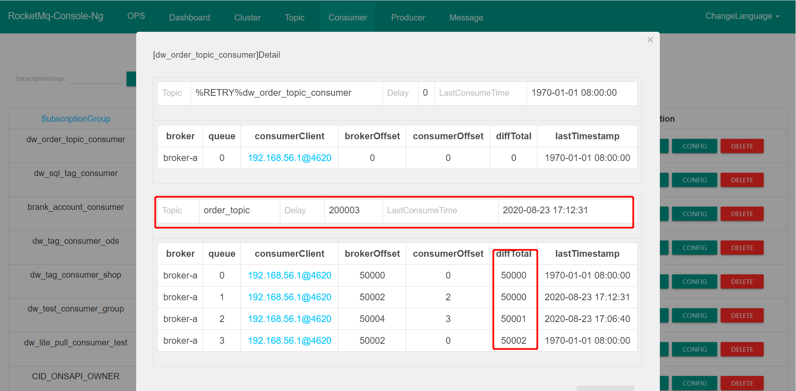
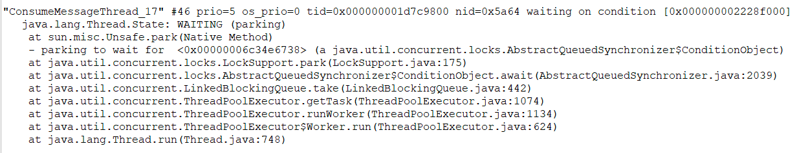

# 为什么要用activemq
* 应用解耦
系统的耦合性越高，容错性就越低。以电商应用为例，用户创建订单后，如果耦合调用库存系统、物流系统、支付系统，任何一个子系统出了故障或者因为升级等原因暂时不可用，都会造成下单操作异常，影响用户使用体验。
使用消息队列解耦合，系统的耦合性就会提高了。比如物流系统发生故障，需要几分钟才能来修复，在这段时间内，物流系统要处理的数据被缓存到消息队列中，用户的下单操作正常完成。当物流系统回复后，补充处理存在消息队列中的订单消息即可，终端系统感知不到物流系统发生过几分钟故障。

* 流量削峰
应用系统如果遇到系统请求流量的瞬间猛增，有可能会将系统压垮。有了消息队列可以将大量请求缓存起来，分散到很长一段时间处理，这样可以大大提到系统的稳定性和用户体验。
一般情况，为了保证系统的稳定性，如果系统负载超过阈值，就会阻止用户请求，这会影响用户体验，而如果使用消息队列将请求缓存起来，等待系统处理完毕后通知用户下单完毕，这样总不能下单体验要好。

* 数据分发
通过消息队列可以让数据在多个系统更加之间进行流通。数据的产生方不需要关心谁来使用数据，只需要将数据发送到消息队列，数据使用方直接在消息队列中直接获取数据即可


# MQ的优点和缺点
* 系统可用性降低

  系统引入的外部依赖越多，系统稳定性越差。一旦MQ宕机，就会对业务造成影响。

  如何保证MQ的高可用？
  
* 系统复杂度提高

  MQ的加入大大增加了系统的复杂度，以前系统间是同步的远程调用，现在是通过MQ进行异步调用。

  如何保证消息没有被重复消费？怎么处理消息丢失情况？那么保证消息传递的顺序性？

* 一致性问题

  A系统处理完业务，通过MQ给B、C、D三个系统发消息数据，如果B系统、C系统处理成功，D系统处理失败。

  如何保证消息数据处理的一致性？


# RocketMQ安装使用
下载RocketMq安装包：
  [下载地址](https://www.apache.org/dyn/closer.cgi?path=rocketmq/4.5.1/rocketmq-all-4.5.1-bin-release.zip)
  安装包目录介绍：
    - bin：启动脚本，包括shell脚本和CMD脚本
    - conf：实例配置文件 ，包括broker配置文件、logback配置文件等
    - lib：依赖jar包，包括Netty、commons-lang、FastJSON等
启动NameServer
  ```shell
  # 1.启动NameServer
  nohup sh bin/mqnamesrv &
  # 2.查看启动日志
  tail -f ~/logs/rocketmqlogs/namesrv.log
  ```
启动Broker
  ```shell
  # 1.启动Broker
  nohup sh bin/mqbroker -n localhost:9876 &
  # 2.查看启动日志
  tail -f ~/logs/rocketmqlogs/broker.log 
  ```
注意：
  RocketMQ默认的虚拟机内存较大，启动Broker如果因为内存不足失败，需要编辑如下两个配置文件，修改JVM内存大小
  ```shell
  # 编辑runbroker.sh和runserver.sh修改默认JVM大小
  vi runbroker.sh
  vi runserver.sh
  ```
  参考设置：```JAVA_OPT="${JAVA_OPT} -server -Xms256m -Xmx256m -Xmn128m -XX:MetaspaceSize=128m  -XX:MaxMetaspaceSize=320m"```
发送消息
  ```sh
  # 1.设置环境变量
  export NAMESRV_ADDR=localhost:9876
  # 2.使用安装包的Demo发送消息
  sh bin/tools.sh org.apache.rocketmq.example.quickstart.Producer
  ```
接收消息
  ```shell
  # 1.设置环境变量
  export NAMESRV_ADDR=localhost:9876
  # 2.接收消息
  sh bin/tools.sh org.apache.rocketmq.example.quickstart.Consumer
  ```
关闭RocketMQ
  ```shell
  # 1.关闭NameServer
  sh bin/mqshutdown namesrv
  # 2.关闭Broker
  sh bin/mqshutdown broker
  ```


  


# 各角色介绍
* Producer：消息的发送者；举例：发信者
* Consumer：消息接收者；举例：收信者
* Broker：暂存和传输消息；举例：邮局
* NameServer：管理Broker；举例：各个邮局的管理机构
* Topic：区分消息的种类；一个发送者可以发送消息给一个或者多个Topic；一个消息的接收者可以订阅一个或者多个Topic消息
* Message Queue：相当于是Topic的分区；用于并行发送和接收消息。


# 集群搭建方式
集群特点
  1，NameServer是一个几乎无状态的节点，可集群部署，节点之间无任何信息同步
  2，Broker部署相对复杂，Broker分为Master和Slave，一个Master可以对应多个Slave
  但是一个Slave只能对应一个Master，Master与Slave的对应关系通过指定相同的BrokerName，不同的BrokerId来定义
  BrokerId为0表示Master，非0表示Slave。Master可以部署多个。每个Broker与NameServer集群中所有节点建立长链接，定时注册Topic信息到所有NameServer
  3，Producer与NameServer集群中的其中一个节点（随机选择）建立长链接，定期从NameServer取Topic路由信息
  并向Topic服务的Master建立长链接，且定时向Master发送心跳。Producer完全无状态，可集群部署
  4，Producer与NamerServer集群中其中一个节点（随机选择）建立长链接，定期从NamerServer获取Topic路由信息
  并向提供Topic服务的Master、Slave建立长链接，且定时向Master、Slave发送心跳。
  Consumer既可以向Master订阅消息，也可以向Slave订阅消息，订阅规则由Broker配置决定
集群模式
  （1）单Master模式
    一旦Broker重启或者宕机时，会导致整个服务不可用。不建议线上环境使用,可以用于本地测试。
  （2）多Master模式
    一个集群无Slave，全是Master，例如2个Master或者3个Master
    优点：
      配置简单，单个Master宕机或重启维护对应用无影响。
      在磁盘配置为RAID10时，即使机器宕机不可恢复情况下，由于RAID10磁盘非常可靠，消息也不会丢
      （异步刷盘丢失少量消息，同步刷盘一条不丢），性能最高
    缺点：
      单台机器宕机期间，这台机器上未被消费的消息在机器恢复之前不可订阅，消息实时性会受到影响。
  （3）多Master多Slave模式（异步）
    每个Master配置一个Slave，有多对Master-Slave。HA采用异步复制方式，主备有短暂消息延迟（毫秒级）
    优点：
      Master宕机后，消费者仍然可以从Slave消费，消费的实时性不会收到影响，而且此过程不需要人工干预。
      性能同多Master模式几乎一样；
    缺点：
      Master宕机，磁盘损坏情况下会丢失少量消息。
  （4）多Master多Slave模式（同步）
    每个Master配置一个Slave，有多对Master-Slave，HA采用同步双写方式，即只有主备都写成功，才向应用返回成功
    优点：数据与服务都无单点故障，Master宕机情况下，消息无延迟，服务可用性与数据可用性都非常高；
    缺点：性能比异步复制模式略低（大约低10%左右），发送单个消息的RT会略高，且目前版本在主节点宕机后，备机不能自动切换为主机。


# 双主双从集群搭建
消息高可用采用2m-2s（同步双写）方式
集群工作流程：
1，启动NameServer，NameServer起来后监听端口，等待Broker、Producer、Consumer连接上来，相当于一个路由控制中心
2，Broker启动，跟所有的NameServer保持长连接，定时发送心跳包。心跳包中包含当前Broker信息(IP+端口等)以及存储所有Topic信息。
注册成功后，NameServer集群中就有Topic跟Broker的映射关系。
3，收发消息前，先创建Topic，创建Topic时需要指定该Topic要存储在哪些Broker上，也可以在发送消息时自动创建Topic。
4，Producer发送消息，启动时先跟NameServer集群中的其中一台建立长连接
并从NameServer中获取当前发送的Topic存在哪些Broker上
轮询从队列列表中选择一个队列，然后与队列所在的Broker建立长连接从而向Broker发消息。
5，Consumer跟Producer类似，跟其中一台NameServer建立长连接，获取当前订阅Topic存在哪些Broker上，
然后直接跟Broker建立连接通道，开始消费消息。


# mqadmin管理工具
使用方式：进入RocketMQ安装位置，在bin目录下执行```./mqadmin {command} {args}```
注意：
    1，几乎所有命令都需要配置-n表示NameServer地址，格式为ip:port
    2，几乎所有命令都可以通过-h获取帮助
    3，如果既有Broker地址（-b）配置项又有clusterName（-c）配置项，则优先以Broker地址执行命令
    4，如果不配置Broker地址，则对集群中所有主机执行命令
具体参数命令介绍可以看黑马RocketMQ文档


# 集群监控平台
`RocketMQ`有一个对其扩展的开源项目[incubator-rocketmq-externals](https://github.com/apache/rocketmq-externals)，这个项目中有一个子模块叫`rocketmq-console`
这个便是管理控制台项目了，先将[incubator-rocketmq-externals](https://github.com/apache/rocketmq-externals)拉到本地，因为我们需要自己对`rocketmq-console`进行编译打包运行
下载并编译打包
    ```
    git clone https://github.com/apache/rocketmq-externals
    cd rocketmq-console
    mvn clean package -Dmaven.test.skip=true
    ```
    注意：打包前在```rocketmq-console```中配置```namesrv```集群地址：
    ```rocketmq.config.namesrvAddr=192.168.25.135:9876;192.168.25.138:9876```
启动rocketmq-console：
    ```java -jar rocketmq-console-ng-1.0.0.jar```


# 消息发送样例
Producer发送步骤：
    1，创建消息生产者Producer，并制定生产者组名
    2，指定NameServer地址
    3，启动Producer
    4，创建消息对象，执行Topic、Tag和消息体
    5，发送消息
    6，关闭生产者Producer

Consumer消费者步骤
    1，创建消费者Consumer，制定消费者组名
    2，指定Nameserver地址
    3，订阅主题Topic和Tag
    4，设置回调函数，处理消息
    5，启动消费者consumer


# 消息发送基本样例
## 消息发送：
1，发送同步消息
这种可靠性同步地发送方式使用的比较广泛，比如：重要的消息通知，短信通知。
```java
public class SyncProducer {
	public static void main(String[] args) throws Exception {
    	// 实例化消息生产者Producer
        DefaultMQProducer producer = new DefaultMQProducer("please_rename_unique_group_name");
    	// 设置NameServer的地址
    	producer.setNamesrvAddr("localhost:9876");
    	// 启动Producer实例
        producer.start();
    	for (int i = 0; i < 100; i++) {
    	    // 创建消息，并指定Topic，Tag和消息体
    	    Message msg = new Message("TopicTest" /* Topic */,
        	"TagA" /* Tag */,
        	("Hello RocketMQ " + i).getBytes(RemotingHelper.DEFAULT_CHARSET) /* Message body */
        	);
        	// 发送消息到一个Broker
            SendResult sendResult = producer.send(msg);
            // 通过sendResult返回消息是否成功送达
            System.out.printf("%s%n", sendResult);
    	}
    	// 如果不再发送消息，关闭Producer实例。
    	producer.shutdown();
    }
}
```
2，发送异步消息
异步消息通常用在对响应时间敏感的业务场景，即发送端不能容忍长时间地等待Broker的响应。
实现原理：
    1，每一个消息发送者实例（DefaultMQProducer）内部会创建一个异步消息发送线程池，默认线程数量为 CPU 核数
    线程池内部持有一个有界队列，默认长度为 5W，并且会控制异步调用的最大并发度，默认为 65536，其可以通过参数 clientAsyncSemaphoreValue 来配置。
    2，客户端使线程池将消息发送到服务端，服务端处理完成后，返回结构并根据是否发生异常调用 SendCallback 回调函数。
```java
public class AsyncProducer {
	public static void main(String[] args) throws Exception {
    	// 实例化消息生产者Producer
        DefaultMQProducer producer = new DefaultMQProducer("please_rename_unique_group_name");
    	// 设置NameServer的地址
        producer.setNamesrvAddr("localhost:9876");
    	// 启动Producer实例
        producer.start();
        producer.setRetryTimesWhenSendAsyncFailed(0);
    	for (int i = 0; i < 100; i++) {
                final int index = i;
            	// 创建消息，并指定Topic，Tag和消息体
                Message msg = new Message("TopicTest",
                    "TagA",
                    "OrderID188",
                    "Hello world".getBytes(RemotingHelper.DEFAULT_CHARSET));
                // SendCallback接收异步返回结果的回调
                producer.send(msg, new SendCallback() {
                    @Override
                    public void onSuccess(SendResult sendResult) {
                        System.out.printf("%-10d OK %s %n", index,
                            sendResult.getMsgId());
                    }
                    @Override
                    public void onException(Throwable e) {
      	              System.out.printf("%-10d Exception %s %n", index, e);
      	              e.printStackTrace();
                    }
            	});
    	}
    	// 如果不再发送消息，关闭Producer实例。
    	producer.shutdown();
    }
}
```
3，单项发送消息
这种方式主要用在不特别关心发送结果的场景，例如日志发送。
```java
public class OnewayProducer {
	public static void main(String[] args) throws Exception{
    	// 实例化消息生产者Producer
        DefaultMQProducer producer = new DefaultMQProducer("please_rename_unique_group_name");
    	// 设置NameServer的地址
        producer.setNamesrvAddr("localhost:9876");
    	// 启动Producer实例
        producer.start();
    	for (int i = 0; i < 100; i++) {
        	// 创建消息，并指定Topic，Tag和消息体
        	Message msg = new Message("TopicTest" /* Topic */,
                "TagA" /* Tag */,
                ("Hello RocketMQ " + i).getBytes(RemotingHelper.DEFAULT_CHARSET) /* Message body */
        	);
        	// 发送单向消息，没有任何返回结果
        	producer.sendOneway(msg);

    	}
    	// 如果不再发送消息，关闭Producer实例。
    	producer.shutdown();
    }
}
```
实践建议：
    MQ 与应用服务器都在一个内部网络中，网络通信的流量通常可以忽略，而且 MQ 的设计目的是低延迟、高并发，故通常没有必要使用异步发送
    如果在一个场景中，一个数据库操作事务中需要发送多条消息，这个时候使用异步发送也会带来一定性能提升。
## 消息消费：
1，负载均衡模式
消费者采用负载均衡方式消费消息，多个消费者共同消费队列消息，每个消费者处理的消息不同

```java
public class LoadBalancingConsumer {
    public static void main(String[] args) throws Exception {
        // 实例化消息生产者,指定组名
        DefaultMQPushConsumer consumer = new DefaultMQPushConsumer("group1");
        // 指定Namesrv地址信息.
        consumer.setNamesrvAddr("localhost:9876");
        // 订阅Topic
        consumer.subscribe("Test", "*");
        //负载均衡模式消费
        consumer.setMessageModel(MessageModel.CLUSTERING);
        // 注册回调函数，处理消息
        consumer.registerMessageListener(new MessageListenerConcurrently() {
            @Override
            public ConsumeConcurrentlyStatus consumeMessage(List<MessageExt> msgs,
                                                            ConsumeConcurrentlyContext context) {
                System.out.printf("%s Receive New Messages: %s %n", 
                                  Thread.currentThread().getName(), msgs);
                return ConsumeConcurrentlyStatus.CONSUME_SUCCESS;
            }
        });
        //启动消息者
        consumer.start();
        System.out.printf("Consumer Started.%n");
    }
}
```
2，广播模式
消费者采用广播的方式消费消息，每个消费者消费的消息都是相同的

```java
public class BroadcastConsumer {
    public static void main(String[] args) throws Exception {
        // 实例化消息生产者,指定组名
        DefaultMQPushConsumer consumer = new DefaultMQPushConsumer("group1");
        // 指定Namesrv地址信息.
        consumer.setNamesrvAddr("localhost:9876");
        // 订阅Topic
        consumer.subscribe("Test", "*");
        //广播模式消费
        consumer.setMessageModel(MessageModel.BROADCASTING);
        // 注册回调函数，处理消息
        consumer.registerMessageListener(new MessageListenerConcurrently() {
            @Override
            public ConsumeConcurrentlyStatus consumeMessage(List<MessageExt> msgs,
                                                            ConsumeConcurrentlyContext context) {
                System.out.printf("%s Receive New Messages: %s %n", 
                                Thread.currentThread().getName(), msgs);
                return ConsumeConcurrentlyStatus.CONSUME_SUCCESS;
            }
        });
        //启动消息者
        consumer.start();
        System.out.printf("Consumer Started.%n");
    }
}
```


# 顺序消息
消息有序指的是可以按照消息的发送顺序来消费(FIFO)。RocketMQ可以严格的保证消息有序，可以分为分区有序或者全局有序。
顺序消费原理：
    顺序消费的原理解析，在默认的情况下消息发送会采取Round Robin轮询方式把消息发送到不同的queue(分区队列)；
    而消费消息的时候从多个queue上拉取消息，这种情况发送和消费是不能保证顺序。
    但是如果控制发送的顺序消息只依次发送到同一个queue中，消费的时候只从这个queue上依次拉取，则就保证了顺序。
    当发送和消费参与的queue只有一个，则是全局有序；如果多个queue参与，则为分区有序，即相对每个queue，消息都是有序的。
## 顺序消息生产
```java
/**
* Producer，发送顺序消息
*/
public class Producer {

   public static void main(String[] args) throws Exception {
       DefaultMQProducer producer = new DefaultMQProducer("please_rename_unique_group_name");

       producer.setNamesrvAddr("127.0.0.1:9876");

       producer.start();

       String[] tags = new String[]{"TagA", "TagC", "TagD"};

       // 订单列表
       List<OrderStep> orderList = new Producer().buildOrders();

       Date date = new Date();
       SimpleDateFormat sdf = new SimpleDateFormat("yyyy-MM-dd HH:mm:ss");
       String dateStr = sdf.format(date);
       for (int i = 0; i < 10; i++) {
           // 加个时间前缀
           String body = dateStr + " Hello RocketMQ " + orderList.get(i);
           Message msg = new Message("TopicTest", tags[i % tags.length], "KEY" + i, body.getBytes());

           SendResult sendResult = producer.send(msg, new MessageQueueSelector() {
               @Override
               public MessageQueue select(List<MessageQueue> mqs, Message msg, Object arg) {
                   Long id = (Long) arg;  //根据订单id选择发送queue
                   long index = id % mqs.size();
                   return mqs.get((int) index);
               }
           }, orderList.get(i).getOrderId());//订单id

           System.out.println(String.format("SendResult status:%s, queueId:%d, body:%s",
               sendResult.getSendStatus(),
               sendResult.getMessageQueue().getQueueId(),
               body));
       }

       producer.shutdown();
   }

   /**
    * 订单的步骤
    */
   private static class OrderStep {
       private long orderId;
       private String desc;

       public long getOrderId() {
           return orderId;
       }

       public void setOrderId(long orderId) {
           this.orderId = orderId;
       }

       public String getDesc() {
           return desc;
       }

       public void setDesc(String desc) {
           this.desc = desc;
       }

       @Override
       public String toString() {
           return "OrderStep{" +
               "orderId=" + orderId +
               ", desc='" + desc + '\'' +
               '}';
       }
   }

   /**
    * 生成模拟订单数据
    */
   private List<OrderStep> buildOrders() {
       List<OrderStep> orderList = new ArrayList<OrderStep>();

       OrderStep orderDemo = new OrderStep();
       orderDemo.setOrderId(15103111039L);
       orderDemo.setDesc("创建");
       orderList.add(orderDemo);

       orderDemo = new OrderStep();
       orderDemo.setOrderId(15103111065L);
       orderDemo.setDesc("创建");
       orderList.add(orderDemo);

       orderDemo = new OrderStep();
       orderDemo.setOrderId(15103111039L);
       orderDemo.setDesc("付款");
       orderList.add(orderDemo);

       orderDemo = new OrderStep();
       orderDemo.setOrderId(15103117235L);
       orderDemo.setDesc("创建");
       orderList.add(orderDemo);

       orderDemo = new OrderStep();
       orderDemo.setOrderId(15103111065L);
       orderDemo.setDesc("付款");
       orderList.add(orderDemo);

       orderDemo = new OrderStep();
       orderDemo.setOrderId(15103117235L);
       orderDemo.setDesc("付款");
       orderList.add(orderDemo);

       orderDemo = new OrderStep();
       orderDemo.setOrderId(15103111065L);
       orderDemo.setDesc("完成");
       orderList.add(orderDemo);

       orderDemo = new OrderStep();
       orderDemo.setOrderId(15103111039L);
       orderDemo.setDesc("推送");
       orderList.add(orderDemo);

       orderDemo = new OrderStep();
       orderDemo.setOrderId(15103117235L);
       orderDemo.setDesc("完成");
       orderList.add(orderDemo);

       orderDemo = new OrderStep();
       orderDemo.setOrderId(15103111039L);
       orderDemo.setDesc("完成");
       orderList.add(orderDemo);

       return orderList;
   }
}
```
## 顺序消息消费
```java
/**
* 顺序消息消费，带事务方式（应用可控制Offset什么时候提交）
*/
public class ConsumerInOrder {

   public static void main(String[] args) throws Exception {
       DefaultMQPushConsumer consumer = new DefaultMQPushConsumer("please_rename_unique_group_name_3");
       consumer.setNamesrvAddr("127.0.0.1:9876");
       /**
        * 设置Consumer第一次启动是从队列头部开始消费还是队列尾部开始消费<br>
        * 如果非第一次启动，那么按照上次消费的位置继续消费
        */
       consumer.setConsumeFromWhere(ConsumeFromWhere.CONSUME_FROM_FIRST_OFFSET);

       consumer.subscribe("TopicTest", "TagA || TagC || TagD");

       consumer.registerMessageListener(new MessageListenerOrderly() {

           Random random = new Random();

           @Override
           public ConsumeOrderlyStatus consumeMessage(List<MessageExt> msgs, ConsumeOrderlyContext context) {
               context.setAutoCommit(true);
               for (MessageExt msg : msgs) {
                   // 可以看到每个queue有唯一的consume线程来消费, 订单对每个queue(分区)有序
                   System.out.println("consumeThread=" + Thread.currentThread().getName() + "queueId=" + msg.getQueueId() + ", content:" + new String(msg.getBody()));
               }

               try {
                   //模拟业务逻辑处理中...
                   TimeUnit.SECONDS.sleep(random.nextInt(10));
               } catch (Exception e) {
                   e.printStackTrace();
               }
               return ConsumeOrderlyStatus.SUCCESS;
           }
       });

       consumer.start();

       System.out.println("Consumer Started.");
   }
}
```


# 延时消息
比如电商里，提交了一个订单就可以发送一个延时消息，1h后去检查这个订单的状态，如果还是未付款就取消订单释放库存。
## 启动消息消费者
```java
public class ScheduledMessageConsumer {
   public static void main(String[] args) throws Exception {
      // 实例化消费者
      DefaultMQPushConsumer consumer = new DefaultMQPushConsumer("ExampleConsumer");
      // 订阅Topics
      consumer.subscribe("TestTopic", "*");
      // 注册消息监听者
      consumer.registerMessageListener(new MessageListenerConcurrently() {
          @Override
          public ConsumeConcurrentlyStatus consumeMessage(List<MessageExt> messages, ConsumeConcurrentlyContext context) {
              for (MessageExt message : messages) {
                  // Print approximate delay time period
                  System.out.println("Receive message[msgId=" + message.getMsgId() + "] " + (System.currentTimeMillis() - message.getStoreTimestamp()) + "ms later");
              }
              return ConsumeConcurrentlyStatus.CONSUME_SUCCESS;
          }
      });
      // 启动消费者
      consumer.start();
  }
}
```
## 发送延时消息
```java
public class ScheduledMessageProducer {
   public static void main(String[] args) throws Exception {
      // 实例化一个生产者来产生延时消息
      DefaultMQProducer producer = new DefaultMQProducer("ExampleProducerGroup");
      // 启动生产者
      producer.start();
      int totalMessagesToSend = 100;
      for (int i = 0; i < totalMessagesToSend; i++) {
          Message message = new Message("TestTopic", ("Hello scheduled message " + i).getBytes());
          // 设置延时等级3,这个消息将在10s之后发送(现在只支持固定的几个时间,详看delayTimeLevel)
          message.setDelayTimeLevel(3);
          // 发送消息
          producer.send(message);
      }
       // 关闭生产者
      producer.shutdown();
  }
}
```
注意：
    现在RocketMq并不支持任意时间的延时，需要设置几个固定的延时等级，从1s到2h分别对应着等级1到18
    ```private String messageDelayLevel = "1s 5s 10s 30s 1m 2m 3m 4m 5m 6m 7m 8m 9m 10m 20m 30m 1h 2h";```


# 批量消息
批量发送消息能显著提高传递小消息的性能。限制是这些批量消息应该有相同的topic，相同的waitStoreMsgOK，而且不能是延时消息。此外，这一批消息的总大小不应超过4MB。
## 发送批量消息
如果您每次只发送不超过4MB的消息，则很容易使用批处理，样例如下：
```
String topic = "BatchTest";
List<Message> messages = new ArrayList<>();
messages.add(new Message(topic, "TagA", "OrderID001", "Hello world 0".getBytes()));
messages.add(new Message(topic, "TagA", "OrderID002", "Hello world 1".getBytes()));
messages.add(new Message(topic, "TagA", "OrderID003", "Hello world 2".getBytes()));
try {
   producer.send(messages);
} catch (Exception e) {
   e.printStackTrace();
   //处理error
}
```
如果消息的总长度可能大于4MB时，这时候最好把消息进行分割
```java
public class ListSplitter implements Iterator<List<Message>> {
    private final int SIZE_LIMIT = 1024 * 1024 * 4;
    private final List<Message> messages;
    private int currIndex;

    public ListSplitter(List<Message> messages) {
        this.messages = messages;
    }

    @Override
    public boolean hasNext() {
        return currIndex < messages.size();
    }

    @Override
    public List<Message> next() {
        int nextIndex = currIndex;
        int totalSize = 0;
        for (; nextIndex < messages.size(); nextIndex++) {
            Message message = messages.get(nextIndex);
            int tmpSize = message.getTopic().length() + message.getBody().length;
            Map<String, String> properties = message.getProperties();
            for (Map.Entry<String, String> entry : properties.entrySet()) {
                tmpSize += entry.getKey().length() + entry.getValue().length();
            }
            tmpSize = tmpSize + 20; // 增加日志的开销20字节
            if (tmpSize > SIZE_LIMIT) {
                //单个消息超过了最大的限制
                //忽略,否则会阻塞分裂的进程
                if (nextIndex - currIndex == 0) {
                    //假如下一个子列表没有元素,则添加这个子列表然后退出循环,否则只是退出循环
                    nextIndex++;
                }
                break;
            }
            if (tmpSize + totalSize > SIZE_LIMIT) {
                break;
            } else {
                totalSize += tmpSize;
            }

        }
        List<Message> subList = messages.subList(currIndex, nextIndex);
        currIndex = nextIndex;
        return subList;
    }
}

public class BatchMessage {
    //把大的消息分裂成若干个小的消息
    public static void main(String[] args) {
        ListSplitter splitter = new ListSplitter(messages);
        while (splitter.hasNext()) {
            try {
                List<Message> listItem = splitter.next();
                producer.send(listItem);
            } catch (Exception e) {
                e.printStackTrace();
                //处理error
            }
        }
    }
}
```


# 过滤消息
在大多数情况下，TAG是一个简单而有用的设计，其可以来选择您想要的消息。例如：
```
DefaultMQPushConsumer consumer = new DefaultMQPushConsumer("CID_EXAMPLE");
consumer.subscribe("TOPIC", "TAGA || TAGB || TAGC");
```
消费者将接收包含TAGA或TAGB或TAGC的消息。但是限制是一个消息只能有一个标签，这对于复杂的场景可能不起作用。
在这种情况下，可以使用SQL表达式筛选消息。SQL特性可以通过发送消息时的属性来进行计算。
在RocketMQ定义的语法下，可以实现一些简单的逻辑。下面是一个例子：
```te
------------
| message  |
|----------|  a > 5 AND b = 'abc'
| a = 10   |  --------------------> Gotten
| b = 'abc'|
| c = true |
------------
------------
| message  |
|----------|   a > 5 AND b = 'abc'
| a = 1    |  --------------------> Missed
| b = 'abc'|
| c = true |
------------
```
## sql基本语法
RocketMQ只定义了一些基本语法来支持这个特性。你也可以很容易地扩展它。
    * 数值比较，比如：**>，>=，<，<=，BETWEEN，=；**
    * 字符比较，比如：**=，<>，IN；**
    * **IS NULL** 或者 **IS NOT NULL；**
    * 逻辑符号 **AND，OR，NOT；**
常量支持类型为：
    * 数值，比如：**123，3.1415；**
    * 字符，比如：**'abc'，必须用单引号包裹起来；**
    * **NULL**，特殊的常量
    * 布尔值，**TRUE** 或 **FALSE**
只有使用push模式的消费者才能用使用SQL92标准的sql语句，接口如下：
```
public void subscribe(finalString topic, final MessageSelector messageSelector)
```
## 消息生产者
发送消息时，你能通过`putUserProperty`来设置消息的属性
```
DefaultMQProducer producer = new DefaultMQProducer("please_rename_unique_group_name");
producer.start();
Message msg = new Message("TopicTest", tag, ("Hello RocketMQ " + i).getBytes(RemotingHelper.DEFAULT_CHARSET));
// 设置一些属性
msg.putUserProperty("a", String.valueOf(i));
SendResult sendResult = producer.send(msg);
producer.shutdown();
```
## 消息消费者
用MessageSelector.bySql来使用sql筛选消息
```
DefaultMQPushConsumer consumer = new DefaultMQPushConsumer("please_rename_unique_group_name_4");
// 只有订阅的消息有这个属性a, a >=0 and a <= 3
consumer.subscribe("TopicTest", MessageSelector.bySql("a between 0 and 3");
consumer.registerMessageListener(new MessageListenerConcurrently() {
   @Override
   public ConsumeConcurrentlyStatus consumeMessage(List<MessageExt> msgs, ConsumeConcurrentlyContext context) {
       return ConsumeConcurrentlyStatus.CONSUME_SUCCESS;
   }
});
consumer.start();
```


# 事物消息

事务消息相对普通消息最大的特点就是一阶段发送的消息对消费者是不可见的，写入消息数据，但是不创建对应的消息的索引信息。
每条消息都会有对应的索引信息，Consumer通过索引读取消息。那么实现一阶段写入的消息不被用户消费（需要在Commit后才能消费）
只需要写入Storage Queue，但是不构建Index Queue即可。

RocketMQ中具体实现策略：
写入的如果是事务消息，对消息的Topic和Queue等属性进行替换，同时将原来的Topic和Queue信息存储到消息的属性中。
在完成Storage Queue的写入后，在appendCallback中，普通消息会去构建消息索引，而如果发现是事务消息，则跳过了创建索引的逻辑。

Commit
在完成第一阶段写入一条对用户不可见的消息后，第二阶段如果是Commit操作，则消息需要对用户可见。
在执行第二阶段Commit操作时，一阶段的Half消息由于是写到一个特殊的Topic，所以二阶段构建索引时需要读取出Half消息，并将Topic和Queue替换成真正的目标的Topic和Queue
之后通过一次普通消息的写入操作来生成一条对用户可见的消息。
所以RocketMQ事务消息二阶段其实是利用了一阶段存储的消息的内容，在二阶段时恢复出一条完整的普通消息，然后走一遍消息写入流程。

Rollback
本身一阶段的消息对用户是不可见的，其实不需要真正撤销消息（实际上RocketMQ也无法去真正的删除一条消息，因为是顺序写文件的）。
但是区别于这条消息没有确定状态（Pending状态，事务悬而未决），需要一个操作来标识这条消息的最终状态。
RocketMQ事务消息方案中引入了Op消息的概念，用Op消息标识事务消息是否状态已经确定（Commit或者Rollback）
如果一条事务消息没有对应的Op消息，说明这个事务的状态还无法确定（可能是二阶段失败了）。

Op消息
RocketMQ将Op消息写入到全局一个特定的Topic中：TransactionalMessageUtil.buildOpTopic()这个Topic是一个内部的Topic（像Half消息的Topic一样）
不会被用户消费。Op消息的内容为对应的Half消息的存储的Offset，这样通过Op消息能索引到Half消息进行后续的回查操作。

事物回查
如果二阶段失败了，比如在Commit操作时出现网络问题导致Commit失败，那么需要通过一定的策略使这条消息最终被Commit。
RocketMQ采用了一种补偿机制，称为“回查”。
Broker端对未确定状态的消息发起回查，将消息发送到对应的Producer端（同一个Group的Producer）
由Producer根据消息来检查本地事务的状态，进而执行Commit或者Rollback。

事务消息的大致方案，其中分为两个流程：正常事务消息的发送及提交、事务消息的补偿流程。
1，事务消息发送及提交
    （1）发送消息（half消息）
    （2）服务端响应消息写入结果
    （3）根据发送结果执行本地事物（如果写入失败，此时half消息对业务不可见，本地逻辑不执行）
    （4）根据本地事物状态执行Commit或者Rollback（Commit操作生成消息索引，消息对消费者可见
2，事物补偿
    （1）对于没有Commit/Rollback的事物消息（pending状态的消息），从服务端发起一次"回查"
    （2）Producer收到回查消息，检查回查消息对应的本地事物状态
    （3）根据本地事物状态，重新Commit或者Rollback
3，事物消息状态
    事物共有三种状态：提交状态、回滚状态、中间状态
    * TransactionStatus.CommitTransaction: 提交事务，它允许消费者消费此消息。
    * TransactionStatus.RollbackTransaction: 回滚事务，它代表该消息将被删除，不允许被消费。
    * TransactionStatus.Unknown: 中间状态，它代表需要检查消息队列来确定状态。
## 创建事务性生产者
使用 `TransactionMQProducer`类创建生产者，并指定唯一的 `ProducerGroup`，就可以设置自定义线程池来处理这些检查请求。
执行本地事务后、需要根据执行结果对消息队列进行回复。
```java
public class Producer {
    public static void main(String[] args) throws MQClientException, InterruptedException {
        //创建事务监听器
        TransactionListener transactionListener = new TransactionListenerImpl();
        //创建消息生产者
        TransactionMQProducer producer = new TransactionMQProducer("group6");
        producer.setNamesrvAddr("192.168.25.135:9876;192.168.25.138:9876");
        //生产者这是监听器
        producer.setTransactionListener(transactionListener);
        //启动消息生产者
        producer.start();
        String[] tags = new String[]{"TagA", "TagB", "TagC"};
        for (int i = 0; i < 3; i++) {
            try {
                Message msg = new Message("TransactionTopic", tags[i % tags.length], "KEY" + i, ("Hello RocketMQ " + i).getBytes(RemotingHelper.DEFAULT_CHARSET));
                SendResult sendResult = producer.sendMessageInTransaction(msg, null);
                System.out.printf("%s%n", sendResult);
                TimeUnit.SECONDS.sleep(1);
            } catch (MQClientException | UnsupportedEncodingException e) {
                e.printStackTrace();
            }
        }
        //producer.shutdown();
    }
}
```
## 实现事物的监听接口
当发送半消息成功时，我们使用 `executeLocalTransaction` 方法来执行本地事务。
它返回前一节中提到的三个事务状态之一。`checkLocalTranscation` 方法用于检查本地事务状态，并回应消息队列的检查请求。
它也是返回前一节中提到的三个事务状态之一。
```java
public class TransactionListenerImpl implements TransactionListener {
    @Override
    public LocalTransactionState executeLocalTransaction(Message msg, Object arg) {
        System.out.println("执行本地事务");
        if (StringUtils.equals("TagA", msg.getTags())) {
            return LocalTransactionState.COMMIT_MESSAGE;
        } else if (StringUtils.equals("TagB", msg.getTags())) {
            return LocalTransactionState.ROLLBACK_MESSAGE;
        } else {
            return LocalTransactionState.UNKNOW;
        }

    }
    @Override
    public LocalTransactionState checkLocalTransaction(MessageExt msg) {
        System.out.println("MQ检查消息Tag【"+msg.getTags()+"】的本地事务执行结果");
        return LocalTransactionState.COMMIT_MESSAGE;
    }
}
```
## 使用限制
1，事务消息不支持延时消息和批量消息。
2，为了避免单个消息被检查太多次而导致半队列消息累积，我们默认将单个消息的检查次数限制为 15 次，
但是用户可以通过 Broker 配置文件的 `transactionCheckMax`参数来修改此限制。如果已经检查某条消息超过 N 次的话（ N = `transactionCheckMax` ） 则 Broker 将丢弃此消息
并在默认情况下同时打印错误日志。用户可以通过重写 `AbstractTransactionCheckListener` 类来修改这个行为。
3，事务消息将在 Broker 配置文件中的参数 transactionMsgTimeout 这样的特定时间长度之后被检查。
当发送事务消息时，用户还可以通过设置用户属性 CHECK_IMMUNITY_TIME_IN_SECONDS 来改变这个限制，该参数优先于 `transactionMsgTimeout` 参数。
4，事务性消息可能不止一次被检查或消费。
5，提交给用户的目标主题消息可能会失败，目前这依日志的记录而定。
它的高可用性通过 RocketMQ 本身的高可用性机制来保证，如果希望确保事务消息不丢失、并且事务完整性得到保证，建议使用同步的双重写入机制。
6，事务消息的生产者 ID 不能与其他类型消息的生产者 ID 共享。
与其他类型的消息不同，事务消息允许反向查询、MQ服务器能通过它们的生产者 ID 查询到消费者。


# 消息存储
分布式队列有高可靠性的需求，所有数据要进行持久化存储

1，Producer发送消息
2，MQ收到消息，将消息进行持久化，在存储中新增一条记录
3，返回ACK给生产者
4，MQ push 消息给对应的消费者，然后等待消费者返回ACK
5，如果消息消费者在指定时间内成功返回ack，那么MQ认为消息消费成功，在存储中删除消息，即执行第6步；
6，如果MQ在指定时间内没有收到ACK，则认为消息消费失败，会尝试重新push消息,重复执行4、5、6步骤
6，MQ删除消息

## 存储介质（顺序写）
磁盘如果使用得当，磁盘的速度完全可以匹配上网络 的数据传输速度。
目前的高性能磁盘，顺序写速度可以达到600MB/s， 超过了一般网卡的传输速度。
但是磁盘随机写的速度只有大概100KB/s，和顺序写的性能相差6000倍！
RocketMQ的消息用顺序写,保证了消息存储的速度。

## 消息发送（零拷贝）
Linux操作系统分为【用户态】和【内核态】，文件操作、网络操作需要涉及这两种形态的切换，免不了进行数据复制。
一台服务器 把本机磁盘文件的内容发送到客户端，一般分为两个步骤：
    1，read；读取本地文件内容； 
    2，write；将读取的内容通过网络发送出去。
这两个看似简单的操作，实际进行了4 次数据复制，分别是：
    1，从磁盘复制数据到内核态内存；
    2，从内核态内存复 制到用户态内存；
    3，然后从用户态 内存复制到网络驱动的内核态内存；
    4，最后是从网络驱动的内核态内存复 制到网卡中进行传输。
使用mmap零拷贝技术的方式，可以省去向用户态的内存复制，提高速度。这种机制在Java中是通过MappedByteBuffer实现的
这里需要注意的是，采用MappedByteBuffer这种内存映射的方式有几个限制，其中之一是一次只能映射1.5~2G 的文件至用户态的虚拟内存，这也是为何RocketMQ默认设置单个CommitLog日志数据文件为1G的原因了

## 消息存储结构
RocketMQ消息存储是由ConsumeQueue和CommitLog配合完成的，消息真正的物理存储文件是CommitLog
ConsumeQueue是消息的逻辑队列，类似数据库的索引文件，存储的是指向物理存储的地址。
每个Topic下的每个Message Queue都有一个对应的ConsumeQueue文件
CommitLog：存储消息的元数据
ConsumerQueue：存储消息在CommitLog的索引
IndexFile：为了消息查询提供了一种通过key或时间区间来查询消息的方法，这种通过IndexFile来查询消息的方法不影响发送和消费消息的主流程

## 刷盘机制
RocketMQ的消息是存储到磁盘上的，这样既能保证断电后恢复， 又可以让存储的消息量超出内存的限制。
RocketMQ为了提高性能，会尽可能地保证磁盘的顺序写。
消息在通过Producer写入RocketMQ的时 候，有两种写磁盘方式，分布式同步刷盘和异步刷盘。
1，同步刷盘
    在返回写成功状态时，消息已经被写入磁盘。
    具体流程是，消息写入内存的PAGECACHE后，立刻通知刷盘线程刷盘
    然后等待刷盘完成，刷盘线程执行完成后唤醒等待的线程
    返回消息写 成功的状态。
2，异步刷盘
    在返回写成功状态时，消息可能只是被写入了内存的PAGECACHE，写操作的返回快，吞吐量大；
    当内存里的消息量积累到一定程度时，统一触发写磁盘动作，快速写入


# 高可用机制

RocketMQ分布式集群是通过Master和Slave的配合达到高可用性的。
Master和Slave的区别：在Broker的配置文件中，参数 brokerId的值为0表明这个Broker是Master，大于0表明这个Broker是 Slave，同时brokerRole参数也会说明这个Broker是Master还是Slave。
Master角色的Broker支持读和写，Slave角色的Broker仅支持读，也就是 Producer只能和Master角色的Broker连接写入消息；
Consumer可以连接 Master角色的Broker，也可以连接Slave角色的Broker来读取消息。

## 消息消费高可用
在Consumer的配置文件中，并不需要设置是从Master读还是从Slave 读，
当Master不可用或者繁忙的时候，Consumer会被自动切换到从Slave 读。
有了自动切换Consumer这种机制，当一个Master角色的机器出现故障后，Consumer仍然可以从Slave读取消息，不影响Consumer程序。这就达到了消费端的高可用性。

## 消息发送高可用
在创建Topic的时候，把Topic的多个Message Queue创建在多个Broker组上（相同Broker名称，不同 brokerId的机器组成一个Broker组）
这样当一个Broker组的Master不可 用后，其他组的Master仍然可用，Producer仍然可以发送消息。
RocketMQ目前还不支持把Slave自动转成Master，如果机器资源不足， 需要把Slave转成Master，则要手动停止Slave角色的Broker
更改配置文 件，用新的配置文件启动Broker。

## 消息主从复制
如果一个Broker组有Master和Slave，消息需要从Master复制到Slave 上，有同步和异步两种复制方式。
1，同步复制
同步复制方式是等Master和Slave均写 成功后才反馈给客户端写成功状态；
在同步复制方式下，如果Master出故障， Slave上有全部的备份数据，容易恢复，但是同步复制会增大数据写入 延迟，降低系统吞吐量。
2，异步复制
异步复制方式是只要Master写成功 即可反馈给客户端写成功状态。
在异步复制方式下，系统拥有较低的延迟和较高的吞吐量，但是如果Master出了故障，有些数据因为没有被写 入Slave，有可能会丢失；

## 刷盘方式和主从复制的设置
由于频繁地触发磁盘写动作，会明显降低 性能。通常情况下，应该把Master和Save配置成异步刷盘方式
主从之间配置成同步复制的方式，这样即使有一台 机器出故障，仍然能保证数据不丢，是个不错的选择。


# Producer负载均衡
Producer端，每个实例在发消息的时候，默认会轮询所有的message queue发送，以达到让消息平均落在不同的queue上。
而由于queue可以散落在不同的broker，所以消息就发送到不同的broker下。


# 消息队列
一个 Topic 下可以设置多个消息队列，RocketMQ 会轮询该 Topic 下的所有队列将消息发出去
默认的队列数量是4 (defaultTopicQueueNums: 4)，当然你也可以选择自己配置。


# 消费者组
消费者组（Consumer Group）一类 Consumer 的集合名称，这类 Consumer 通常消费同一类消息并且消费逻辑一致，所以将这些 Consumer 分组在一起。
消费者组与生产者组类似，都是将相同角色的分组在一起并命名
分组是个很精妙的概念设计，RocketMQ 正是通过这种分组机制，实现了天然的消息负载均衡。
消费消息时通过 Consumer Group 实现了将消息分发到多个消费者服务器实例，比如某个 Topic 有9条消息，其中一个 Consumer Group 有3个实例（3个进程或3台机器），那么每个实例将均摊3条消息，这也意味着我们可以很方便的通过加机器来实现水平扩展。


# 消费模式
## 集群消费
默认情况下是集群消费，该模式下一个消费者集群共同消费一个主题的多个队列，一个队列只会被一个消费者消费，
如果某个消费者挂掉，分组内其它消费者会接替挂掉的消费者继续消费。
在集群消费模式下，每条消息只需要投递到订阅这个topic的Consumer Group下的一个实例即可。
RocketMQ采用主动拉取的方式拉取并消费消息，在拉取的时候需要明确指定拉取哪一条message queue。
负载均衡算法
    而每当实例的数量有变更，都会触发一次所有实例的负载均衡，这时候会按照queue的数量和实例的数量平均分配queue给每个实例
    默认的分配算法是AllocateMessageQueueAveragely，如下图：
    
    还有另外一种平均的算法是AllocateMessageQueueAveragelyByCircle，也是平均分摊每一条queue，只是以环状轮流分queue的形式，如下图：
    
需要注意的是，集群模式下，queue都是只允许分配一个实例。
这是由于如果多个实例同时消费一个queue的消息，由于拉取哪些消息是consumer主动控制的
那样会导致同一个消息在不同的实例下被消费多次，
所以算法上都是一个queue只分给一个consumer实例，一个consumer实例可以允许同时分到不同的queue。

通过增加consumer实例去分摊queue的消费，可以起到水平扩展的消费能力的作用。
而有实例下线的时候，会重新触发负载均衡，这时候原来分配到的queue将分配到其他实例上继续消费。

但是如果consumer实例的数量比message queue的总数量还多的话，多出来的consumer实例将无法分到queue，也就无法消费到消息，
也就无法起到分摊负载的作用了。所以需要控制让queue的总数量大于等于consumer的数量。

## 广播模式

由于广播模式下要求一条消息需要投递到一个消费组下面所有的消费者实例，所以也就没有消息被分摊消费的说法。
在实现上，其中一个不同就是在consumer分配queue的时候，所有consumer都分到所有的queue。


# 消息重试
## 顺序消息的重试
对于顺序消息，当消费者消费消息失败后，消息队列 RocketMQ 会自动不断进行消息重试（每次间隔时间为 1 秒）
这时，应用会出现消息消费被阻塞的情况。因此，在使用顺序消息时，务必保证应用能够及时监控并处理消费失败的情况，避免阻塞现象的发生。

## 无序消息的重试(集群模式)
对于无序消息（普通、定时、延时、事务消息），当消费者消费消息失败时，您可以通过设置返回状态达到消息重试的结果。
无序消息的重试只针对集群消费方式生效；广播方式不提供失败重试特性，即消费失败后，失败消息不再重试，继续消费新的消息。
集群模式期望消息重试配置：
    消息消费失败后期望消息重试，需要在消息监听器接口的实现中明确进行配置（三种方式任选一种）：
    ```java
    public class MessageListenerImpl implements MessageListener {
        @Override
        public Action consume(Message message, ConsumeContext context) {
            //处理消息
            doConsumeMessage(message);
            //方式1：返回 Action.ReconsumeLater，消息将重试
            return Action.ReconsumeLater;
            //方式2：返回 null，消息将重试
            return null;
            //方式3：直接抛出异常， 消息将重试
            throw new RuntimeException("Consumer Message exceotion");
        }
    }
    ```
消费失败后，不重试配置：
    集群消费方式下，消息失败后期望消息不重试，需要捕获消费逻辑中可能抛出的异常，最终返回 Action.CommitMessage，此后这条消息将不会再重试。
    ```java
    public class MessageListenerImpl implements MessageListener {
        @Override
        public Action consume(Message message, ConsumeContext context) {
            try {
                doConsumeMessage(message);
            } catch (Throwable e) {
                //捕获消费逻辑中的所有异常，并返回 Action.CommitMessage;
                return Action.CommitMessage;
            }
            //消息处理正常，直接返回 Action.CommitMessage;
            return Action.CommitMessage;
        }
    }
    ```
## 自定义消息最大重试次数
消息队列 RocketMQ 允许 Consumer 启动的时候设置最大重试次数，重试时间间隔将按照如下策略：
1，最大重试次数小于等于 16 次，则重试时间间隔同上表描述。
2，最大重试次数大于 16 次，超过 16 次的重试时间间隔均为每次 2 小时。
```
Properties properties = new Properties();
//配置对应 Group ID 的最大消息重试次数为 20 次
properties.put(PropertyKeyConst.MaxReconsumeTimes,"20");
Consumer consumer =ONSFactory.createConsumer(properties);
```
注意：
    1，消息最大重试次数的设置对相同 Group ID 下的所有 Consumer 实例有效。
    2，如果只对相同 Group ID 下两个 Consumer 实例中的其中一个设置了 MaxReconsumeTimes，那么该配置对两个 Consumer 实例均生效。
    3，配置采用覆盖的方式生效，即最后启动的 Consumer 实例会覆盖之前的启动实例的配置
获取消息重试次数：
    ```java
    public class MessageListenerImpl implements MessageListener {
        @Override
        public Action consume(Message message, ConsumeContext context) {
            //获取消息的重试次数
            System.out.println(message.getReconsumeTimes());
            return Action.CommitMessage;
        }
    }
    ```


# 死信队列
当一条消息初次消费失败，消息队列 RocketMQ 会自动进行消息重试；
达到最大重试次数后，若消费依然失败，则表明消费者在正常情况下无法正确地消费该消息，此时，消息队列 RocketMQ 不会立刻将消息丢弃，而是将其发送到该消费者对应的特殊队列中。
在消息队列 RocketMQ 中，这种正常情况下无法被消费的消息称为死信消息（Dead-Letter Message），存储死信消息的特殊队列称为死信队列（Dead-Letter Queue）。

死信消息特性
    1，不会再被消费者正常消费。
    2，有效期与正常消息相同，均为 3 天，3 天后会被自动删除。因此，请在死信消息产生后的 3 天内及时处理。
死信队列特性
    1，一个死信队列对应一个 Group ID， 而不是对应单个消费者实例。
    2，如果一个 Group ID 未产生死信消息，消息队列 RocketMQ 不会为其创建相应的死信队列。
    3，一个死信队列包含了对应 Group ID 产生的所有死信消息，不论该消息属于哪个 Topic。
查看死信消息
    
    
重新发送消息
    一条消息进入死信队列，意味着某些因素导致消费者无法正常消费该消息，因此，通常需要您对其进行特殊处理。
    排查可疑因素并解决问题后，可以在消息队列 RocketMQ 控制台重新发送该消息，让消费者重新消费一次。


# 消费幂等性
消息队列 RocketMQ 消费者在接收到消息以后，有必要根据业务上的唯一 Key 对消息做幂等处理的必要性。
消息重复的原因：
    1，发送时消息重复
        当一条消息已被成功发送到服务端并完成持久化，此时出现了网络闪断或者客户端宕机，导致服务端对客户端应答失败。
        如果此时生产者意识到消息发送失败并尝试再次发送消息，消费者后续会收到两条内容相同并且 Message ID 也相同的消息。
    2，投递时消息重复
        消息消费的场景下，消息已投递到消费者并完成业务处理，当客户端给服务端反馈应答的时候网络闪断。
        为了保证消息至少被消费一次，消息队列 RocketMQ 的服务端将在网络恢复后再次尝试投递之前已被处理过的消息，消费者后续会收到两条内容相同并且 Message ID 也相同的消息。
    3，负载均衡时消息重复（包括但不限于网络抖动、Broker 重启以及订阅方应用重启）
        当消息队列 RocketMQ 的 Broker 或客户端重启、扩容或缩容时，会触发 Rebalance，此时消费者可能会收到重复消息。
处理方式
    因为 Message ID 有可能出现冲突（重复）的情况，所以真正安全的幂等处理，不建议以 Message ID 作为处理依据。
    最好的方式是以业务唯一标识作为幂等处理的关键依据，而业务的唯一标识可以通过消息 Key 进行设置：
    ```
    Message message = new Message();
    message.setKey("ORDERID_100");
    SendResult sendResult = producer.send(message);
    ```
    订阅方收到消息时可以根据消息的 Key 进行幂等处理：
    ```
    consumer.subscribe("ons_test", "*", new MessageListener() {
        public Action consume(Message message, ConsumeContext context) {
            String key = message.getKey()
            // 根据业务唯一标识的 key 做幂等处理
        }
    });
    ```


# 消息发送常见错误与解决方案
1，No route info of this topic
    （1）可以通过 RocketMQ-Console 查询路由信息是否存在，或使用如下命令查询路由信息：
        ```
        cd ${ROCKETMQ_HOME}/bin
        sh ./mqadmin topicRoute -n 127.0.0.1:9876 -t dw_test_0003
        ```
    （2）如果通过命令无法查询到路由信息，则查看 Broker 是否开启了自动创建 Topic，参数为 autoCreateTopicEnable，该参数默认为 true。但在生产环境不建议开启。
    （3）如果开启了自动创建路由信息，但还是抛出这个错误，这个时候请检查客户端（Producer）连接的 NameServer 地址是否与 Broker 中配置的 NameServer 地址是否一致。
2，消息发送超时
    减少消息发送的超时时间，增加重试次数，并增加快速失败的最大等待时长
3，System busy、Broker busy
    在使用 RocketMQ 中，如果 RocketMQ 集群达到 1W/tps 的压力负载水平，System busy、Broker busy 就会是大家经常会遇到的问题
    其触发的原由可以归纳为如下 3 种。
        （1）PageCache压力过大
            判断 PageCache 是否忙的依据就是，在写入消息、向内存追加消息时加锁的时间
            默认的判断标准是加锁时间超过 1s，就认为是 PageCache 压力大，向客户端抛出相关的错误日志。
        （2）发送线程池挤压的拒绝策略
            在 RocketMQ 中处理消息发送的，是一个只有一个线程的线程池，内部会维护一个有界队列，默认长度为 1W。
            如果当前队列中挤压的数量超过 1w，执行线程池的拒绝策略，从而抛出 [too many requests and system thread pool busy] 错误。
        （3）Broker 端快速失败
            默认情况下 Broker 端开启了快速失败机制，就是在 Broker 端还未发生 PageCache 繁忙（加锁超过 1s）的情况，
            但存在一些请求在消息发送队列中等待 200ms 的情况，RocketMQ 会不再继续排队，直接向客户端返回 System busy，
            但由于 RocketMQ 客户端目前对该错误没有进行重试处理，所以在解决这类问题的时候需要额外处理。
    PageCache繁忙解决方案
        1，transientStorePoolEnable
            开启 transientStorePoolEnable 机制，即在 Broker 中配置文件中增加如下配置：transientStorePoolEnable=true
            背后关键如下：
                （a）：消息先写入到堆外内存中，该内存由于启用了内存锁定机制，故消息的写入是接近直接操作内存，性能可以得到保证。
                （b）：消息进入到堆外内存后，后台会启动一个线程，一批一批将消息提交到 PageCache，
                    即写消息时对 PageCache 的写操作由单条写入变成了批量写入，降低了对 PageCache 的压力。
        2，扩容
            集群进行扩容，或者对集群中的 Topic 进行拆分，即将一部分 Topic 迁移到其他集群中，降低集群的负载。


# 消息消费积压问题排查实战

所谓消息积压，就是Broker端当前队列有效数据最大的偏移量（brokerOffset）与消息消费端的当前处理进度（consumerOffset）之间的差值
即表示当前需要消费但没有消费的消息
## 问题分析与解决方案
项目组遇到消息积压问题通常第一时间都会怀疑是 RocketMQ Broker 的问题，会第一时间联系到消息中间件的负责
消息中间件负责人当然会首先排查 Broker 端的异常，但根据笔者的境遇，此种情况通常是消费端的问题
反而是消息发送遇到的问题更有可能是 Broker 端的问题。
这里基本可以采用类比法，因为一个 Topic 通常会被多个消费端订阅，我们只要看看其他消费组是否也积压，例如如下图所示：

从上图看出，两个不同的消费组订阅了同一个 Topic，一个出现消息积压，一个却消费正常，从这里就可以将分析的重点定位到具体项目组
我们先介绍一下RocketMQ消息拉去模型和消息消费进度提交机制
    1，在 RocketMQ 中每一客户端会单独创建一个线程 PullMessageService 会循环从 Broker 拉取一批消息，然后提交到消费端的线程池中进行消费
    2，线程池中的线程消费完一条消息后会上服务端上报当前消费端的消费进度
    3，而且在提交消费进度时是提交当前处理队列中消息消费偏移量最小的消息作为消费组的进度
    4，即如果消息偏移量为 100 的消息，如果由于某种原因迟迟没有消费成功，那该消费组的进度则无法向前推进
    5，久而久之，Broker 端的消息偏移量就会远远大于消费组当前消费的进度，从而造成消息积压现象。
所以我们遇到这种情况，通常应该去查看消费端线程池中线程的状态，故可以通过如下命令获取应用程序的线程栈。
即可通过 jps -m 或者 ps -ef | grep java 命令获取当前正在运行的 Java 程序，通过启动主类即可获得应用的进程 id，
然后可以通过 jstack pid > j.log 命令获取线程的堆栈，在这里我建议大家连续运行 5 次该命令，分别获取 5 个线程堆栈文件，主要用于对比线程的状态是否在向前推进。
通过 jstack 获取堆栈信息后，可以重点搜索 ConsumeMessageThread_ 开头的线程状态，例如下图所示：


状态为 RUNABLE 的消费端线程正在等待网络读取，我们再去其他文件看该线程的状态，如果其状态一直是 RUNNABLE，表示线程一直在等待网络读取
及线程一直“阻塞”在网络读取上，一旦阻塞，那该线程正在处理的消息就一直处于消费中，消息消费进度就会卡在这里，不会继续向前推进，久而久之，就会出现消息积压情况。
从调用线程栈就可以找到阻塞的具体方法，从这里看出是在调用一个 HTTP 请求。
定位到代码后再定位问题就比较简单的，通常的网络调用需要设置超时时间，这里由于没有设置超时时间，导致一直在等待对端的返回，从而消息消费进度无法向前推进
## 线程栈分析经验
网上说分析线程栈，一般盯着 WAIT、Block、TIMEOUT_WAIT 等状态，其实不然，处于 RUNNABLE 状态的线程也不能忽略
因为 MySQL 的读写、HTTP 请求等网络读写，即在等待对端网络的返回数据时线程的状态是 RUNNABLE，并不是所谓的 BLOCK 状态。
如果处于下图所示的线程栈中的线程数量越多，说明消息消费端的处理能力很好，反而是拉取消息的速度跟不上消息消费的速度。

## RocketMQ 消费端限流机制
RocketMQ 消息消费端会从 3 个维度进行限流：
1，消息消费端队列中积压的消息超过 1000 条
2，消息处理队列中尽管积压没有超过 1000 条，但最大偏移量与最小偏移量的差值超过 2000
3，消息处理队列中积压的消息总大小超过 100M
为了方便理解上述三条规则的设计理念，我们首先来看一下消费端的数据结构：
1，PullMessageService 线程会按照队列向 Broker 拉取一批消息，然后会存入到 ProcessQueue 队列中，即所谓的处理队列
2，然后再提交到消费端线程池中进行消息消费，消息消费完成后会将对应的消息从 ProcessQueue 中移除
3，然后向 Broker 端提交消费进度，提交的消费偏移量为 ProceeQueue 中的最小偏移量。
规则一：消息消费端队列中积压的消息超过 1000 条值的就是 ProcessQueue 中存在的消息条数超过指定值
默认为 1000 条，就触发限流，限流的具体做法就是暂停向 Broker 拉取该队列中的消息，但并不会阻止其他队列的消息拉取
例如如果 q0 中积压的消息超过 1000 条，但 q1 中积压的消息不足 1000，那 q1 队列中的消息会继续消费
其目的就是担心积压的消息太多，如果再继续拉取，会造成内存溢出。
规则二：消息在 ProcessQueue 中实际上维护的是一个 TreeMap
key 为消息的偏移量、vlaue 为消息对象，
由于 TreeMap 本身是排序的，故很容易得出最大偏移量与最小偏移量的差值，
即有可能存在处理队列中其实就只有 3 条消息，但偏移量确超过了 2000，例如如下图所示：

出现这种情况也是非常有可能的，其主要原因就是消费偏移量为 100 的这个线程由于某种情况卡主了（“阻塞”了）
其他消息却能正常消费，这种情况虽然不会造成内存溢出，但大概率会造成大量消息重复消费
究其原因与消息消费进度的提交机制有关
在 RocketMQ 中，例如消息偏移量为 2001 的消息消费成功后，向服务端汇报消费进度时并不是报告 2001，而是取处理队列中最小偏移量 100
这样虽然消息一直在处理，但消息消费进度始终无法向前推进
试想一下如果此时最大的消息偏移量为 1000，项目组发现出现了消息积压，然后重启消费端，那消息就会从 100 开始重新消费，会造成大量消息重复消费
RocketMQ 为了避免出现大量消息重复消费，故对此种情况会对其进行限制，超过 2000 就不再拉取消息了。
规则三：消息处理队列中积压的消息总大小超过 100M。
这个就更加直接了，不仅从消息数量考虑，再结合从消息体大小考虑，处理队列中消息总大小超过 100M 进行限流，这个显而易见就是为了避免内存溢出。
不太理解RocketMQ拉取机制


# RocketMQ 集群性能摸高
如何进行压力测试呢？
    1，写段发送代码测试同学通过 JMeter 进行压力测试，或者代码中通过多线程发送消息。这种方式需要多台不错配置的测试机器。
    2，通过 RocketMQ 自带压测脚本。
    这两种在实践过程中都使用过，压测效果基本接近，为了方便，建议直接在新搭建的 RocketMQ 集群上直接通过压测脚本进行即可。
压力脚本
    在 RocketMQ 安装包解压后，在 benchmark 目录有一个 producer.sh 文件。我们通过该脚本进行压力测试。
    通过使用不同的线程数，消息大小，主题队列数来进行测试。
测试场景一
1 个线程、消息大小为 1K、主题为 8 个队列。以下结果中发送最大 TPS 为 4533，最大 RT 为 299，平均 RT 为 0.22。

sh producer.sh -t cluster-perf-tst8 -w 1 -s 1024 -n x.x.x.x:9876
Send TPS: 4281 Max RT: 299 Average RT:   0.233 Send Failed: 0 Response Failed: 0
Send TPS: 4237 Max RT: 299 Average RT:   0.236 Send Failed: 0 Response Failed: 0
Send TPS: 4533 Max RT: 299 Average RT:   0.221 Send Failed: 0 Response Failed: 0
Send TPS: 4404 Max RT: 299 Average RT:   0.227 Send Failed: 0 Response Failed: 0
Send TPS: 4360 Max RT: 299 Average RT:   0.229 Send Failed: 0 Response Failed: 0
Send TPS: 4269 Max RT: 299 Average RT:   0.234 Send Failed: 0 Response Failed: 0
Send TPS: 4319 Max RT: 299 Average RT:   0.231 Send Failed: 0 Response Failed: 0
测试场景二
1 个线程、消息大小为 3K、主题为 8 个队列。以下结果中发送最大 TPS 为 4125，最大 RT 为 255，平均 RT 为 0.24。

sh producer.sh -t cluster-perf-tst8 -w 1 -s 3072 -n 192.168.x.x:9876
Send TPS: 4120 Max RT: 255 Average RT:   0.242 Send Failed: 0 Response Failed: 0
Send TPS: 4054 Max RT: 255 Average RT:   0.246 Send Failed: 0 Response Failed: 0
Send TPS: 4010 Max RT: 255 Average RT:   0.249 Send Failed: 0 Response Failed: 0
Send TPS: 4125 Max RT: 255 Average RT:   0.242 Send Failed: 0 Response Failed: 0
Send TPS: 4093 Max RT: 255 Average RT:   0.244 Send Failed: 0 Response Failed: 0
Send TPS: 4093 Max RT: 255 Average RT:   0.244 Send Failed: 0 Response Failed: 0
Send TPS: 3999 Max RT: 255 Average RT:   0.250 Send Failed: 0 Response Failed: 0
Send TPS: 3957 Max RT: 255 Average RT:   0.253 Send Failed: 0 Response Failed: 0

测试场景三
1 个线程、消息大小为 1K、主题为 16 个队列。以下结果中发送最大 TPS 为 5289，最大 RT 为 255，平均 RT 为 0.19。

sh producer.sh -t cluster-perf-tst16 -w 1 -s 1024 -n x.x.x.x:9876
Send TPS: 5289 Max RT: 225 Average RT:   0.189 Send Failed: 0 Response Failed: 0
Send TPS: 5252 Max RT: 225 Average RT:   0.190 Send Failed: 0 Response Failed: 0
Send TPS: 5124 Max RT: 225 Average RT:   0.195 Send Failed: 0 Response Failed: 0
Send TPS: 5146 Max RT: 225 Average RT:   0.194 Send Failed: 0 Response Failed: 0
Send TPS: 4861 Max RT: 225 Average RT:   0.206 Send Failed: 0 Response Failed: 0
Send TPS: 4998 Max RT: 225 Average RT:   0.200 Send Failed: 0 Response Failed: 0
Send TPS: 5063 Max RT: 225 Average RT:   0.198 Send Failed: 0 Response Failed: 0
Send TPS: 5039 Max RT: 225 Average RT:   0.198 Send Failed: 0 Response Failed: 0

测试场景四
1 个线程、消息大小为 3K、主题为 16 个队列。以下结果中发送最大 TPS 为 5011，最大 RT 为 244，平均 RT 为 0.21。

sh producer.sh -t cluster-perf-tst16 -w 1 -s 3072 -n x.x.x.x:9876
Send TPS: 4778 Max RT: 244 Average RT:   0.209 Send Failed: 0 Response Failed: 0
Send TPS: 5011 Max RT: 244 Average RT:   0.199 Send Failed: 0 Response Failed: 0
Send TPS: 4826 Max RT: 244 Average RT:   0.207 Send Failed: 0 Response Failed: 0
Send TPS: 4762 Max RT: 244 Average RT:   0.210 Send Failed: 0 Response Failed: 0
Send TPS: 4663 Max RT: 244 Average RT:   0.214 Send Failed: 0 Response Failed: 0
Send TPS: 4648 Max RT: 244 Average RT:   0.215 Send Failed: 0 Response Failed: 0
Send TPS: 4778 Max RT: 244 Average RT:   0.209 Send Failed: 0 Response Failed: 0
Send TPS: 4737 Max RT: 244 Average RT:   0.211 Send Failed: 0 Response Failed: 0
Send TPS: 4523 Max RT: 244 Average RT:   0.221 Send Failed: 0 Response Failed: 0
Send TPS: 4544 Max RT: 244 Average RT:   0.220 Send Failed: 0 Response Failed: 0
Send TPS: 4683 Max RT: 244 Average RT:   0.213 Send Failed: 0 Response Failed: 0
Send TPS: 4838 Max RT: 244 Average RT:   0.207 Send Failed: 0 Response Failed: 0

测试场景五
10 个线程、消息大小为 1K、主题为 8 个队列。以下结果中发送最大 TPS 为 41946，最大 RT 为 259，平均 RT 为 0.24。

sh producer.sh -t cluster-perf-tst8 -w 10 -s 1024 -n x.x.x.x:9876
Send TPS: 40274 Max RT: 259 Average RT:   0.248 Send Failed: 0 Response Failed: 0
Send TPS: 41421 Max RT: 259 Average RT:   0.241 Send Failed: 0 Response Failed: 0
Send TPS: 43185 Max RT: 259 Average RT:   0.231 Send Failed: 0 Response Failed: 0
Send TPS: 40654 Max RT: 259 Average RT:   0.246 Send Failed: 0 Response Failed: 0
Send TPS: 40744 Max RT: 259 Average RT:   0.245 Send Failed: 0 Response Failed: 0
Send TPS: 41946 Max RT: 259 Average RT:   0.238 Send Failed: 0 Response Failed: 0

测试场景六
10 个线程、消息大小为 3K、主题为 8 个队列。以下结果中发送最大 TPS 为 40927，最大 RT 为 265，平均 RT 为 0.25。

sh producer.sh -t cluster-perf-tst8 -w 10 -s 3072 -n x.x.x.x:9876
Send TPS: 40085 Max RT: 265 Average RT:   0.249 Send Failed: 0 Response Failed: 0
Send TPS: 37710 Max RT: 265 Average RT:   0.265 Send Failed: 0 Response Failed: 0
Send TPS: 39305 Max RT: 265 Average RT:   0.254 Send Failed: 0 Response Failed: 0
Send TPS: 39881 Max RT: 265 Average RT:   0.251 Send Failed: 0 Response Failed: 0
Send TPS: 38428 Max RT: 265 Average RT:   0.260 Send Failed: 0 Response Failed: 0
Send TPS: 39280 Max RT: 265 Average RT:   0.255 Send Failed: 0 Response Failed: 0
Send TPS: 38539 Max RT: 265 Average RT:   0.259 Send Failed: 0 Response Failed: 0
Send TPS: 40927 Max RT: 265 Average RT:   0.244 Send Failed: 0 Response Failed: 0

测试场景七
10 个线程、消息大小为 1K、主题为 16 个队列。以下结果中发送最大 TPS 为 42365，最大 RT 为 243，平均 RT 为 0.23。

sh producer.sh -t cluster-perf-tst16 -w 10 -s 1024 -n x.x.x.x:9876
Send TPS: 41301 Max RT: 243 Average RT:   0.242 Send Failed: 0 Response Failed: 0
Send TPS: 42365 Max RT: 243 Average RT:   0.236 Send Failed: 0 Response Failed: 0
Send TPS: 42181 Max RT: 243 Average RT:   0.237 Send Failed: 0 Response Failed: 0
Send TPS: 42261 Max RT: 243 Average RT:   0.237 Send Failed: 0 Response Failed: 0
Send TPS: 40831 Max RT: 243 Average RT:   0.245 Send Failed: 0 Response Failed: 0
Send TPS: 43010 Max RT: 243 Average RT:   0.232 Send Failed: 0 Response Failed: 0
Send TPS: 41871 Max RT: 243 Average RT:   0.239 Send Failed: 0 Response Failed: 0
Send TPS: 40970 Max RT: 243 Average RT:   0.244 Send Failed: 0 Response Failed: 0

测试场景八
10 个线程、消息大小为 3K、主题为 16 个队列。以下结果中发送最大 TPS 为 39976，最大 RT 为 237，平均 RT 为 0.25。

sh producer.sh -t cluster-perf-tst16 -w 10 -s 3072 -n x.x.x.x:9876
Send TPS: 36245 Max RT: 237 Average RT:   0.276 Send Failed: 0 Response Failed: 0
Send TPS: 38713 Max RT: 237 Average RT:   0.258 Send Failed: 0 Response Failed: 0
Send TPS: 36327 Max RT: 237 Average RT:   0.275 Send Failed: 0 Response Failed: 0
Send TPS: 39005 Max RT: 237 Average RT:   0.256 Send Failed: 0 Response Failed: 0
Send TPS: 37926 Max RT: 237 Average RT:   0.264 Send Failed: 0 Response Failed: 0
Send TPS: 38804 Max RT: 237 Average RT:   0.258 Send Failed: 0 Response Failed: 0
Send TPS: 39976 Max RT: 237 Average RT:   0.250 Send Failed: 0 Response Failed: 0

测试场景九
30 个线程、消息大小为 1K、主题为 8 个队列。以下结果中发送最大 TPS 为 89288，最大 RT 为 309，平均 RT 为 0.34。

sh producer.sh -t cluster-perf-tst8 -w 30 -s 1024 -n x.x.x.x:9876
Send TPS: 86259 Max RT: 309 Average RT:   0.348 Send Failed: 0 Response Failed: 0
Send TPS: 85335 Max RT: 309 Average RT:   0.351 Send Failed: 0 Response Failed: 0
Send TPS: 81850 Max RT: 309 Average RT:   0.366 Send Failed: 0 Response Failed: 0
Send TPS: 87712 Max RT: 309 Average RT:   0.342 Send Failed: 0 Response Failed: 0
Send TPS: 89288 Max RT: 309 Average RT:   0.336 Send Failed: 0 Response Failed: 0
Send TPS: 86732 Max RT: 309 Average RT:   0.346 Send Failed: 0 Response Failed: 0

测试场景十
30 个线程、消息大小为 3K、主题为 8 个队列。以下结果中发送最大 TPS 为 77792，最大 RT 为 334，平均 RT 为 0.42。

sh producer.sh -t cluster-perf-tst8 -w 30 -s 3072 -n x.x.x.x:9876
Send TPS: 74085 Max RT: 334 Average RT:   0.405 Send Failed: 0 Response Failed: 0
Send TPS: 71014 Max RT: 334 Average RT:   0.422 Send Failed: 0 Response Failed: 0
Send TPS: 77792 Max RT: 334 Average RT:   0.386 Send Failed: 0 Response Failed: 0
Send TPS: 73913 Max RT: 334 Average RT:   0.406 Send Failed: 0 Response Failed: 0
Send TPS: 77337 Max RT: 334 Average RT:   0.392 Send Failed: 0 Response Failed: 0
Send TPS: 72184 Max RT: 334 Average RT:   0.416 Send Failed: 0 Response Failed: 0
Send TPS: 77271 Max RT: 334 Average RT:   0.388 Send Failed: 0 Response Failed: 0
Send TPS: 75016 Max RT: 334 Average RT:   0.400 Send Failed: 0 Response Failed: 0

测试场景十一
30 个线程、消息大小为 1K、主题为 16 个队列。以下结果中发送最大 TPS 为 87009，最大 RT 为 306，平均 RT 为 0.34。

sh producer.sh -t zms-clusterB-perf-tst16 -w 30 -s 1024 -n x.x.x.x:9876
Send TPS: 82946 Max RT: 306 Average RT:   0.362 Send Failed: 0 Response Failed: 0
Send TPS: 86902 Max RT: 306 Average RT:   0.345 Send Failed: 0 Response Failed: 0
Send TPS: 83157 Max RT: 306 Average RT:   0.365 Send Failed: 0 Response Failed: 0
Send TPS: 86804 Max RT: 306 Average RT:   0.345 Send Failed: 0 Response Failed: 0
Send TPS: 87009 Max RT: 306 Average RT:   0.345 Send Failed: 0 Response Failed: 0
Send TPS: 80219 Max RT: 306 Average RT:   0.374 Send Failed: 0 Response Failed: 0

测试场景十二
30 个线程、消息大小为 3K、主题为 16 个队列。以下结果中发送最大 TPS 为 78555，最大 RT 为 329，平均 RT 为 0.40。

sh producer.sh -t cluster-perf-tst16 -w 30 -s 3072 -n x.x.x.x:9876
Send TPS: 73864 Max RT: 329 Average RT:   0.403 Send Failed: 0 Response Failed: 0
Send TPS: 78555 Max RT: 329 Average RT:   0.382 Send Failed: 0 Response Failed: 0
Send TPS: 75200 Max RT: 329 Average RT:   0.406 Send Failed: 0 Response Failed: 0
Send TPS: 73925 Max RT: 329 Average RT:   0.406 Send Failed: 0 Response Failed: 0
Send TPS: 69955 Max RT: 329 Average RT:   0.429 Send Failed: 0 Response Failed: 0

测试场景十三
45 个线程、消息大小为 1K、主题为 8 个队列。以下结果中发送最大 TPS 为 96340，最大 RT 为 2063，平均 RT 为 0.48。

sh producer.sh -t cluster-perf-tst8 -w 45 -s 1024 -n x.x.x.x:9876
Send TPS: 91266 Max RT: 2063 Average RT:   0.493 Send Failed: 0 Response Failed: 0
Send TPS: 87279 Max RT: 2063 Average RT:   0.515 Send Failed: 0 Response Failed: 0
Send TPS: 92130 Max RT: 2063 Average RT:   0.487 Send Failed: 0 Response Failed: 1
Send TPS: 95227 Max RT: 2063 Average RT:   0.472 Send Failed: 0 Response Failed: 1
Send TPS: 96340 Max RT: 2063 Average RT:   0.467 Send Failed: 0 Response Failed: 1
Send TPS: 84272 Max RT: 2063 Average RT:   0.534 Send Failed: 0 Response Failed: 1

测试场景十四
45 个线程、消息大小为 3K、主题为 8 个队列。以下结果中发送最大 TPS 为 90403，最大 RT 为 462，平均 RT 为 0.52。

sh producer.sh -t cluster-perf-tst8 -w 45 -s 3072 -n 192.168.x.x:9876
Send TPS: 89334 Max RT: 462 Average RT:   0.503 Send Failed: 0 Response Failed: 0
Send TPS: 84237 Max RT: 462 Average RT:   0.534 Send Failed: 0 Response Failed: 0
Send TPS: 86051 Max RT: 462 Average RT:   0.523 Send Failed: 0 Response Failed: 0
Send TPS: 86475 Max RT: 462 Average RT:   0.520 Send Failed: 0 Response Failed: 0
Send TPS: 86088 Max RT: 462 Average RT:   0.523 Send Failed: 0 Response Failed: 0
Send TPS: 90403 Max RT: 462 Average RT:   0.498 Send Failed: 0 Response Failed: 0
Send TPS: 84229 Max RT: 462 Average RT:   0.534 Send Failed: 0 Response Failed: 0

测试场景十五
45 个线程、消息大小为 1K、主题为 16 个队列。以下结果中发送最大 TPS 为 100158，最大 RT 为 604，平均 RT 为 0.49。

sh producer.sh -t cluster-perf-tst16 -w 45 -s 1024 -n x.x.x.:9876
Send TPS: 91724 Max RT: 604 Average RT:   0.490 Send Failed: 0 Response Failed: 0
Send TPS: 90414 Max RT: 604 Average RT:   0.498 Send Failed: 0 Response Failed: 0
Send TPS: 89904 Max RT: 604 Average RT:   0.500 Send Failed: 0 Response Failed: 0
Send TPS: 100158 Max RT: 604 Average RT:   0.449 Send Failed: 0 Response Failed: 0
Send TPS: 99658 Max RT: 604 Average RT:   0.451 Send Failed: 0 Response Failed: 0
Send TPS: 92440 Max RT: 604 Average RT:   0.489 Send Failed: 0 Response Failed: 0

测试场景十六
45 个线程、消息大小为 3K、主题为 16 个队列。以下结果中发送最大 TPS 为 77297，最大 RT 为 436，平均 RT 为 0.39。

sh producer.sh -t cluster-perf-tst16 -w 30 -s 3072 -n x.x.x.x:9876
Send TPS: 75159 Max RT: 436 Average RT:   0.399 Send Failed: 0 Response Failed: 0
Send TPS: 75315 Max RT: 436 Average RT:   0.398 Send Failed: 0 Response Failed: 0
Send TPS: 77297 Max RT: 436 Average RT:   0.388 Send Failed: 0 Response Failed: 0
Send TPS: 72188 Max RT: 436 Average RT:   0.415 Send Failed: 0 Response Failed: 0
Send TPS: 77525 Max RT: 436 Average RT:   0.387 Send Failed: 0 Response Failed: 0
Send TPS: 71535 Max RT: 436 Average RT:   0.422 Send Failed: 0 Response Failed: 0

测试场景十七
60 个线程、消息大小为 1K、主题为 8 个队列。以下结果中发送最大 TPS 为 111395，最大 RT 为 369，平均 RT 为 0.53。

sh producer.sh -t cluster-perf-tst8 -w 60 -s 1024 -n x.x.x.x:9876
Send TPS: 110067 Max RT: 369 Average RT:   0.545 Send Failed: 0 Response Failed: 0
Send TPS: 111395 Max RT: 369 Average RT:   0.538 Send Failed: 0 Response Failed: 0
Send TPS: 103114 Max RT: 369 Average RT:   0.582 Send Failed: 0 Response Failed: 0
Send TPS: 107466 Max RT: 369 Average RT:   0.558 Send Failed: 0 Response Failed: 0
Send TPS: 106655 Max RT: 369 Average RT:   0.562 Send Failed: 0 Response Failed: 0
Send TPS: 107241 Max RT: 369 Average RT:   0.559 Send Failed: 0 Response Failed: 1
Send TPS: 110672 Max RT: 369 Average RT:   0.540 Send Failed: 0 Response Failed: 1
Send TPS: 109037 Max RT: 369 Average RT:   0.552 Send Failed: 0 Response Failed: 1

测试场景十八
60 个线程、消息大小为 3K、主题为 8 个队列。以下结果中发送最大 TPS 为 99535，最大 RT 为 583，平均 RT 为 0.64。

sh producer.sh -t cluster-perf-tst8 -w 60 -s 3072 -n 192.168.x.x:9876
Send TPS: 92572 Max RT: 583 Average RT:   0.648 Send Failed: 0 Response Failed: 0
Send TPS: 95163 Max RT: 583 Average RT:   0.640 Send Failed: 0 Response Failed: 1
Send TPS: 93823 Max RT: 583 Average RT:   0.654 Send Failed: 0 Response Failed: 1
Send TPS: 97091 Max RT: 583 Average RT:   0.628 Send Failed: 0 Response Failed: 1
Send TPS: 98205 Max RT: 583 Average RT:   0.628 Send Failed: 0 Response Failed: 1
Send TPS: 99535 Max RT: 583 Average RT:   0.596 Send Failed: 0 Response Failed: 3

测试场景十九
60 个线程、消息大小为 1K、主题为 16 个队列。以下结果中发送最大 TPS 为 111667，最大 RT 为 358，平均 RT 为 0.55。

sh producer.sh -t cluster-perf-tst16 -w 60 -s 1024 -n x.x.x.x:9876
Send TPS: 105229 Max RT: 358 Average RT:   0.578 Send Failed: 0 Response Failed: 0
Send TPS: 103003 Max RT: 358 Average RT:   0.582 Send Failed: 0 Response Failed: 0
Send TPS: 95497 Max RT: 358 Average RT:   0.628 Send Failed: 0 Response Failed: 0
Send TPS: 108878 Max RT: 358 Average RT:   0.551 Send Failed: 0 Response Failed: 0
Send TPS: 109265 Max RT: 358 Average RT:   0.549 Send Failed: 0 Response Failed: 0
Send TPS: 105545 Max RT: 358 Average RT:   0.568 Send Failed: 0 Response Failed: 0
Send TPS: 111667 Max RT: 358 Average RT:   0.537 Send Failed: 0 Response Failed: 0

测试场景二十
60 个线程、消息大小为 3K、主题为 16 个队列。以下结果中发送最大 TPS 为 101073，最大 RT 为 358，平均 RT 为 0.61。

sh producer.sh -t cluster-perf-tst16 -w 60 -s 3072 -n x.x.x.x:9876
Send TPS: 98899 Max RT: 358 Average RT:   0.606 Send Failed: 0 Response Failed: 0
Send TPS: 101073 Max RT: 358 Average RT:   0.594 Send Failed: 0 Response Failed: 0
Send TPS: 97295 Max RT: 358 Average RT:   0.617 Send Failed: 0 Response Failed: 0
Send TPS: 97923 Max RT: 358 Average RT:   0.609 Send Failed: 0 Response Failed: 1
Send TPS: 96111 Max RT: 358 Average RT:   0.620 Send Failed: 0 Response Failed: 2
Send TPS: 93873 Max RT: 358 Average RT:   0.639 Send Failed: 0 Response Failed: 2
Send TPS: 96466 Max RT: 358 Average RT:   0.622 Send Failed: 0 Response Failed: 2
Send TPS: 96579 Max RT: 358 Average RT:   0.621 Send Failed: 0 Response Failed: 2

测试场景二十一
75 个线程、消息大小为 1K、主题为 8 个队列。以下结果中发送最大 TPS 为 112707，最大 RT 为 384，平均 RT 为 0.68。

sh producer.sh -t cluster-perf-tst8 -w 75 -s 1024 -n x.x.x.x:9876
Send TPS: 108367 Max RT: 384 Average RT:   0.692 Send Failed: 0 Response Failed: 0
Send TPS: 107516 Max RT: 384 Average RT:   0.701 Send Failed: 0 Response Failed: 0
Send TPS: 110974 Max RT: 384 Average RT:   0.680 Send Failed: 0 Response Failed: 0
Send TPS: 109754 Max RT: 384 Average RT:   0.683 Send Failed: 0 Response Failed: 0
Send TPS: 111917 Max RT: 384 Average RT:   0.670 Send Failed: 0 Response Failed: 0
Send TPS: 104764 Max RT: 384 Average RT:   0.712 Send Failed: 0 Response Failed: 1
Send TPS: 112208 Max RT: 384 Average RT:   0.668 Send Failed: 0 Response Failed: 1
Send TPS: 112707 Max RT: 384 Average RT:   0.665 Send Failed: 0 Response Failed: 1

测试场景二十二
75 个线程、消息大小为 3K、主题为 8 个队列。以下结果中发送最大 TPS 为 103953，最大 RT 为 370，平均 RT 为 0.74。

sh producer.sh -t cluster-perf-tst8 -w 75 -s 3072 -n x.x.x.x:9876
Send TPS: 102311 Max RT: 370 Average RT:   0.733 Send Failed: 0 Response Failed: 0
Send TPS: 93722 Max RT: 370 Average RT:   0.800 Send Failed: 0 Response Failed: 0
Send TPS: 101091 Max RT: 370 Average RT:   0.742 Send Failed: 0 Response Failed: 0
Send TPS: 100404 Max RT: 370 Average RT:   0.747 Send Failed: 0 Response Failed: 0
Send TPS: 102328 Max RT: 370 Average RT:   0.733 Send Failed: 0 Response Failed: 0
Send TPS: 103953 Max RT: 370 Average RT:   0.722 Send Failed: 0 Response Failed: 0
Send TPS: 103454 Max RT: 370 Average RT:   0.725 Send Failed: 0 Response Failed: 0

测试场景二十三
75 个线程、消息大小为 1K、主题为 16 个队列。以下结果中发送最大 TPS 为 115659，最大 RT 为 605，平均 RT 为 0.68。

sh producer.sh -t cluster-perf-tst16 -w 75 -s 1024 -n x.x.x.x:9876
Send TPS: 106813 Max RT: 605 Average RT:   0.687 Send Failed: 0 Response Failed: 0
Send TPS: 110828 Max RT: 605 Average RT:   0.673 Send Failed: 0 Response Failed: 1
Send TPS: 109855 Max RT: 605 Average RT:   0.676 Send Failed: 0 Response Failed: 3
Send TPS: 102741 Max RT: 605 Average RT:   0.730 Send Failed: 0 Response Failed: 3
Send TPS: 110123 Max RT: 605 Average RT:   0.681 Send Failed: 0 Response Failed: 3
Send TPS: 115659 Max RT: 605 Average RT:   0.648 Send Failed: 0 Response Failed: 3
Send TPS: 108157 Max RT: 605 Average RT:   0.693 Send Failed: 0 Response Failed: 3

测试场景二十四
75 个线程、消息大小为 3K、主题为 16 个队列。以下结果中发送最大 TPS 为 99871，最大 RT 为 499，平均 RT 为 0.78。

sh producer.sh -t cluster-perf-tst16 -w 75 -s 3072 -n x.x.x.x:9876
Send TPS: 90459 Max RT: 499 Average RT:   0.829 Send Failed: 0 Response Failed: 0
Send TPS: 96838 Max RT: 499 Average RT:   0.770 Send Failed: 0 Response Failed: 1
Send TPS: 96590 Max RT: 499 Average RT:   0.776 Send Failed: 0 Response Failed: 1
Send TPS: 95137 Max RT: 499 Average RT:   0.788 Send Failed: 0 Response Failed: 1
Send TPS: 89502 Max RT: 499 Average RT:   0.834 Send Failed: 0 Response Failed: 2
Send TPS: 90255 Max RT: 499 Average RT:   0.831 Send Failed: 0 Response Failed: 2
Send TPS: 99871 Max RT: 499 Average RT:   0.725 Send Failed: 0 Response Failed: 9

测试场景二十五
100 个线程、消息大小为 1K、主题为 8 个队列。以下结果中发送最大 TPS 为 126590，最大 RT 为 402，平均 RT 为 0.86。

sh producer.sh -t cluster-perf-tst8 -w 100 -s 1024 -n x.x.x.x:9876
Send TPS: 113204 Max RT: 402 Average RT:   0.883 Send Failed: 0 Response Failed: 0
Send TPS: 114872 Max RT: 402 Average RT:   0.868 Send Failed: 0 Response Failed: 1
Send TPS: 116261 Max RT: 402 Average RT:   0.860 Send Failed: 0 Response Failed: 1
Send TPS: 118116 Max RT: 402 Average RT:   0.847 Send Failed: 0 Response Failed: 1
Send TPS: 112594 Max RT: 402 Average RT:   0.888 Send Failed: 0 Response Failed: 1
Send TPS: 124407 Max RT: 402 Average RT:   0.801 Send Failed: 0 Response Failed: 2
Send TPS: 126590 Max RT: 402 Average RT:   0.790 Send Failed: 0 Response Failed: 2

测试场景二十六
100 个线程、消息大小为 3K、主题为 8 个队列。以下结果中发送最大 TPS 为 108616，最大 RT 为 426，平均 RT 为 0.93。

sh producer.sh -t cluster-perf-tst8 -w 100 -s 3072 -n x.x.x.x:9876
Send TPS: 106723 Max RT: 426 Average RT:   0.937 Send Failed: 0 Response Failed: 0
Send TPS: 104768 Max RT: 426 Average RT:   0.943 Send Failed: 0 Response Failed: 1
Send TPS: 106697 Max RT: 426 Average RT:   0.935 Send Failed: 0 Response Failed: 2
Send TPS: 105147 Max RT: 426 Average RT:   0.951 Send Failed: 0 Response Failed: 2
Send TPS: 105814 Max RT: 426 Average RT:   0.935 Send Failed: 0 Response Failed: 5
Send TPS: 108616 Max RT: 426 Average RT:   0.916 Send Failed: 0 Response Failed: 6
Send TPS: 101429 Max RT: 426 Average RT:   0.986 Send Failed: 0 Response Failed: 6

测试场景二十七
100 个线程、消息大小为 1K、主题为 16 个队列。以下结果中发送最大 TPS 为 123424，最大 RT 为 438，平均 RT 为 0.86。

sh producer.sh -t cluster-perf-tst16 -w 100 -s 1024 -n x.x.x.x:9876
Send TPS: 123424 Max RT: 438 Average RT:   0.805 Send Failed: 0 Response Failed: 0
Send TPS: 111418 Max RT: 438 Average RT:   0.897 Send Failed: 0 Response Failed: 0
Send TPS: 110360 Max RT: 438 Average RT:   0.905 Send Failed: 0 Response Failed: 0
Send TPS: 118734 Max RT: 438 Average RT:   0.842 Send Failed: 0 Response Failed: 0
Send TPS: 120725 Max RT: 438 Average RT:   0.816 Send Failed: 0 Response Failed: 4
Send TPS: 113823 Max RT: 438 Average RT:   0.878 Send Failed: 0 Response Failed: 4
Send TPS: 115639 Max RT: 438 Average RT:   0.865 Send Failed: 0 Response Failed: 4
Send TPS: 112787 Max RT: 438 Average RT:   0.889 Send Failed: 0 Response Failed: 4
Send TPS: 106677 Max RT: 438 Average RT:   0.937 Send Failed: 0 Response Failed: 4
Send TPS: 112635 Max RT: 438 Average RT:   0.888 Send Failed: 0 Response Failed: 4
Send TPS: 108470 Max RT: 438 Average RT:   0.922 Send Failed: 0 Response Failed: 4

测试场景二十八
100 个线程、消息大小为 3K、主题为 16 个队列。以下结果中发送最大 TPS 为 103664，最大 RT 为 441，平均 RT 为 0.96。

sh producer.sh -t cluster-perf-tst16 -w 100 -s 3072 -n x.x.x.x:9876
Send TPS: 93374 Max RT: 441 Average RT:   1.071 Send Failed: 0 Response Failed: 3
Send TPS: 98421 Max RT: 441 Average RT:   1.017 Send Failed: 0 Response Failed: 3
Send TPS: 103664 Max RT: 441 Average RT:   0.964 Send Failed: 0 Response Failed: 4
Send TPS: 98234 Max RT: 441 Average RT:   0.995 Send Failed: 0 Response Failed: 6
Send TPS: 103563 Max RT: 441 Average RT:   0.960 Send Failed: 0 Response Failed: 7
Send TPS: 103807 Max RT: 441 Average RT:   0.962 Send Failed: 0 Response Failed: 7
Send TPS: 102715 Max RT: 441 Average RT:   0.973 Send Failed: 0 Response Failed: 7

测试场景二十九
150 个线程、消息大小为 1K、主题为 8 个队列。以下结果中发送最大 TPS 为 124567，最大 RT 为 633，平均 RT 为 1.20。

sh producer.sh -t cluster-perf-tst8 -w 150 -s 1024 -n x.x.x.x:9876
Send TPS: 124458 Max RT: 633 Average RT:   1.205 Send Failed: 0 Response Failed: 0
Send TPS: 124567 Max RT: 633 Average RT:   1.204 Send Failed: 0 Response Failed: 0
Send TPS: 121324 Max RT: 633 Average RT:   1.236 Send Failed: 0 Response Failed: 0
Send TPS: 124928 Max RT: 633 Average RT:   1.201 Send Failed: 0 Response Failed: 0
Send TPS: 122830 Max RT: 633 Average RT:   1.242 Send Failed: 0 Response Failed: 0
Send TPS: 118825 Max RT: 633 Average RT:   1.262 Send Failed: 0 Response Failed: 0
Send TPS: 124085 Max RT: 633 Average RT:   1.209 Send Failed: 0 Response Failed: 0

测试场景三十
150 个线程、消息大小为 3K、主题为 8 个队列。以下结果中发送最大 TPS 为 107032，最大 RT 为 582，平均 RT 为 1.40。

sh producer.sh -t cluster-perf-tst8 -w 150 -s 3072 -n x.x.x.x:9876
Send TPS: 106575 Max RT: 582 Average RT:   1.404 Send Failed: 0 Response Failed: 1
Send TPS: 101830 Max RT: 582 Average RT:   1.477 Send Failed: 0 Response Failed: 1
Send TPS: 99666 Max RT: 582 Average RT:   1.505 Send Failed: 0 Response Failed: 1
Send TPS: 102139 Max RT: 582 Average RT:   1.465 Send Failed: 0 Response Failed: 2
Send TPS: 105405 Max RT: 582 Average RT:   1.419 Send Failed: 0 Response Failed: 3
Send TPS: 107032 Max RT: 582 Average RT:   1.399 Send Failed: 0 Response Failed: 4
Send TPS: 103416 Max RT: 582 Average RT:   1.448 Send Failed: 0 Response Failed: 5

测试场景三十一
150 个线程、消息大小为 1K、主题为 16 个队列。以下结果中发送最大 TPS 为 124474，最大 RT 为 574，平均 RT 为 1.40。

sh producer.sh -t cluster-perf-tst16 -w 150 -s 1024 -n x.x.x.x:9876
Send TPS: 115151 Max RT: 574 Average RT:   1.299 Send Failed: 0 Response Failed: 1
Send TPS: 106960 Max RT: 574 Average RT:   1.402 Send Failed: 0 Response Failed: 1
Send TPS: 116382 Max RT: 574 Average RT:   1.289 Send Failed: 0 Response Failed: 1
Send TPS: 110587 Max RT: 574 Average RT:   1.349 Send Failed: 0 Response Failed: 4
Send TPS: 122832 Max RT: 574 Average RT:   1.220 Send Failed: 0 Response Failed: 4
Send TPS: 124474 Max RT: 574 Average RT:   1.213 Send Failed: 0 Response Failed: 4
Send TPS: 112153 Max RT: 574 Average RT:   1.337 Send Failed: 0 Response Failed: 4
Send TPS: 120450 Max RT: 574 Average RT:   1.261 Send Failed: 0 Response Failed: 4

测试场景三十二
150 个线程、消息大小为 3K、主题为 16 个队列。以下结果中发送最大 TPS 为 111285，最大 RT 为 535，平均 RT 为 1.42。

sh producer.sh -t cluster-perf-tst16 -w 150 -s 3072 -n x.x.x.x:9876
Send TPS: 105061 Max RT: 535 Average RT:   1.428 Send Failed: 0 Response Failed: 0
Send TPS: 102117 Max RT: 535 Average RT:   1.465 Send Failed: 0 Response Failed: 1
Send TPS: 105569 Max RT: 535 Average RT:   1.421 Send Failed: 0 Response Failed: 1
Send TPS: 100689 Max RT: 535 Average RT:   1.489 Send Failed: 0 Response Failed: 2
Send TPS: 108464 Max RT: 535 Average RT:   1.381 Send Failed: 0 Response Failed: 2
Send TPS: 111285 Max RT: 535 Average RT:   1.348 Send Failed: 0 Response Failed: 2
Send TPS: 103406 Max RT: 535 Average RT:   1.451 Send Failed: 0 Response Failed: 2
Send TPS: 109203 Max RT: 535 Average RT:   1.388 Send Failed: 0 Response Failed: 2

测试场景三十三
200 个线程、消息大小为 1K、主题为 8 个队列。以下结果中发送最大 TPS 为 126170，最大 RT 为 628，平均 RT 为 1.71。

sh producer.sh -t cluster-perf-tst8 -w 200 -s 1024 -n x.x.x.x:9876
Send TPS: 117965 Max RT: 628 Average RT:   1.674 Send Failed: 0 Response Failed: 7
Send TPS: 115583 Max RT: 628 Average RT:   1.715 Send Failed: 0 Response Failed: 12
Send TPS: 118732 Max RT: 628 Average RT:   1.672 Send Failed: 0 Response Failed: 16
Send TPS: 126170 Max RT: 628 Average RT:   1.582 Send Failed: 0 Response Failed: 17
Send TPS: 116203 Max RT: 628 Average RT:   1.719 Send Failed: 0 Response Failed: 18
Send TPS: 114793 Max RT: 628 Average RT:   1.739 Send Failed: 0 Response Failed: 19

测试场景三十四
200 个线程、消息大小为 3K、主题为 8 个队列。以下结果中发送最大 TPS 为 110892，最大 RT 为 761，平均 RT 为 1.80。

sh producer.sh -t cluster-perf-tst8 -w 200 -s 3072 -n x.x.x.x:9876
Send TPS: 107240 Max RT: 761 Average RT:   1.865 Send Failed: 0 Response Failed: 0
Send TPS: 104585 Max RT: 761 Average RT:   1.906 Send Failed: 0 Response Failed: 2
Send TPS: 110892 Max RT: 761 Average RT:   1.803 Send Failed: 0 Response Failed: 2
Send TPS: 105414 Max RT: 761 Average RT:   1.898 Send Failed: 0 Response Failed: 2
Send TPS: 105904 Max RT: 761 Average RT:   1.885 Send Failed: 0 Response Failed: 3
Send TPS: 110748 Max RT: 761 Average RT:   1.806 Send Failed: 0 Response Failed: 3

测试场景三十五
200 个线程、消息大小为 1K、主题为 16 个队列。以下结果中发送最大 TPS 为 124760，最大 RT 为 601，平均 RT 为 1.63。

sh producer.sh -t cluster-perf-tst16 -w 200 -s 1024 -n x.x.x.x:9876
Send TPS: 118892 Max RT: 601 Average RT:   1.679 Send Failed: 0 Response Failed: 4
Send TPS: 118839 Max RT: 601 Average RT:   1.668 Send Failed: 0 Response Failed: 12
Send TPS: 117122 Max RT: 601 Average RT:   1.704 Send Failed: 0 Response Failed: 12
Send TPS: 122670 Max RT: 601 Average RT:   1.630 Send Failed: 0 Response Failed: 12
Send TPS: 119592 Max RT: 601 Average RT:   1.672 Send Failed: 0 Response Failed: 12
Send TPS: 121243 Max RT: 601 Average RT:   1.649 Send Failed: 0 Response Failed: 12
Send TPS: 124760 Max RT: 601 Average RT:   1.603 Send Failed: 0 Response Failed: 12
Send TPS: 124354 Max RT: 601 Average RT:   1.608 Send Failed: 0 Response Failed: 12
Send TPS: 119272 Max RT: 601 Average RT:   1.677 Send Failed: 0 Response Failed: 12

测试场景三十六
200 个线程、消息大小为 3K、主题为 16 个队列。以下结果中发送最大 TPS 为 111201，最大 RT 为 963，平均 RT 为 1.88。

sh producer.sh -t cluster-perf-tst16 -w 200 -s 3072 -n x.x.x.x:9876
Send TPS: 105091 Max RT: 963 Average RT:   1.896 Send Failed: 0 Response Failed: 4
Send TPS: 106243 Max RT: 963 Average RT:   1.882 Send Failed: 0 Response Failed: 4
Send TPS: 103994 Max RT: 963 Average RT:   1.958 Send Failed: 0 Response Failed: 5
Send TPS: 109741 Max RT: 963 Average RT:   1.822 Send Failed: 0 Response Failed: 5
Send TPS: 103788 Max RT: 963 Average RT:   1.927 Send Failed: 0 Response Failed: 5
Send TPS: 110597 Max RT: 963 Average RT:   1.805 Send Failed: 0 Response Failed: 6
Send TPS: 111201 Max RT: 963 Average RT:   1.798 Send Failed: 0 Response Failed: 6
总结：通过上面的性能压测，可以看出最高 TPS 为 12.6 万。那可以确定集群的理论承载值为 12 万左右，日常流量控制在 4 万左右，当超过 4 万时新申请的主题分配到其他集群。


# RocketMQ性能调优建议
1，开启异步刷盘
    除了一些支付类场景、或者 TPS 较低的场景（例如：TPS 在 2000 以下）生产环境建议开启异步刷盘，提高集群吞吐。
    flushDiskType=ASYNC_FLUSH
2，开启 Slave 读权限
    消息占用物理内存的大小通过 accessMessageInMemoryMaxRatio 来配置默认为 40%；
    如果消费的消息不在内存中，开启 slaveReadEnable 时会从 slave 节点读取；
    提高 Master 内存利用率。
    slaveReadEnable=true
3，消费一次拉取消息数量
    消费时一次拉取的数量由 broker 和 consumer 客户端共同决定，默认为 32 条
    Broker 端参数由 maxTransferCountOnMessageInMemory 设置。consumer 端由 pullBatchSize 设置。
    Broker 端建议设置大一些，例如 1000，给 consumer 端留有较大的调整空间。
    maxTransferCountOnMessageInMemory=1000
4，发送队列等待时间
    消息发送到 Broker 端，在队列的等待时间由参数 waitTimeMillsInSendQueue 设置，默认为 200ms。
    建议设置大一些，例如：1000ms~5000ms。设置过短，发送客户端会引起超时。
    waitTimeMillsInSendQueue=1000
5，主从异步复制
    为提高集群性能，在生成环境建议设置为主从异步复制，经过压力测试主从同步复制性能过低。
    brokerRole=ASYNC_MASTER
6，提高集群稳定性
    为了提高集群稳定性，对下面三个参数进行特别说明，在后面踩坑案例中也会提到。
    关闭堆外内存：transientStorePoolEnable=false
    关闭文件预热：warmMapedFileEnable=false
    开启堆内传输：transferMsgByHeap=true


# RocketMQ 集群平滑运维
1，优雅摘除节点
    4 主 4 从架构，需要摘除一个Master节点，如何平滑的摘除该节点呢？
    直接关机，有部分未同步到从节点的数据会丢失，显然不可行
    线上安全的指导思路“先摘除流量”，当没有流量流入流出时，对节点的操作是安全的。
    1，摘除写入流量
        我们可以通过关闭 Broker 的写入权限，来摘除该节点的写入流量。
        通过 updateBrokerConfig 命令将 Broker 设置为只读权限，执行完之后原该 Broker 的写入流量会分配到集群中的其他节点
        将 Broker 设置为只读权限后，观察该节点的流量变化，直到写入流量（InTPS）掉为 0 表示写入流量已摘除。
    2，摘除读出流量
        当摘除 Broker 写入流量后，读出消费流量也会逐步降低。可以通过 clusterList 命令中 OutTPS 观察读出流量变化。
        除此之外，也可以通过 brokerConsumeStats 观察 broker 的积压（Diff）情况，当积压为 0 时，表示消费全部完成。
    3，节点下线
        在观察到该 Broker 的所有积压为 0 时，通常该节点可以摘除了。
        考虑到可能消息回溯到之前某个时间点重新消费，可以过了日志保存日期再下线该节点。如果日志存储为 3 天，那 3 天后再移除该节点。
2，平滑扩所容


# RocketMQ 集群监控
集群监控的目的记录集群健康状态，具体监控项见下图：

1，节点数量
如果集群中是 4 主 4 从架构，那么集群中会有 8 个 Broker 节点，下面通过 clusterList 命令可以看到有 8 个节点。当集群中节点数量小于 8 时，说明集群中有节点掉线。
2，节点可用性
Broker 节点数量或者进程的检测不能保证节点是否可用
我们可以通过定时向集群中各个 Broker 节点发送心跳的方式来检测。
另外，记录发送的响应时间也很关键，响应时间过长，例如超过 5 秒，往往伴随着集群抖动，具体体现为客户端发送超时。
3，集群写入 TPS
从 clusterList 命令中，可以看到每个节点的 InTPS，将各个 Master 节点求和即为集群的 TPS。
4，集群写入 TPS 变化率
集群写入 TPS 监控数据的基础上通过时序数据库函数统计集群 TPS 在某一段时间内的变化率。


# RocketMQ Nameserver背后的设计理念
Nameserver 在 RocketMQ 整体架构中所处的位置就相当于 ZooKeeper、Dubbo 服务化架构体系中的位置，即充当“注册中心”
在 RocketMQ 中路由信息主要是指主题（Topic）的队列信息，即一个 Topic 的队列分布在哪些 Broker 中。
Topic 的注册与发现主要的参与者：Nameserver、Producer、Consumer、Broker。其交互特性与联通性如下：
1，Nameserver：命名服务器，多台机器组成一个集群，每台机器之间互不联通。
2，Broker：Broker 消息服务器，会向 Nameserver 中的每一台 NamServer 每隔 30s 发送心跳包，即 Nameserver 中关于 Topic 路由信息来源于 Broker。
正式由于这种注册机制，并且 Nameserver 互不联通，如果出现网络分区等因素，例如 broker-a 与集群中的一台 Nameserver 网络出现中断，这样会出现两台 Nameserver 中的数据出现不一致。
3，Producer、Consumer：消息发送者、消息消费者，在同一时间只会连接 Nameserver 集群中的一台服务器，并且会每隔 30s 会定时更新 Topic 的路由信息。
另外 Nameserver 会定时扫描 Broker 的存活状态，其依据之一是如果连续 120s 未收到 Broker 的心跳信息，就会移除 Topic 路由表中关于该 broker 的所有队列信息
这样消息发送者在发送消息时就不会将消息发送到出现故障的 Broker 上，提高消息发送高可用性。
Nameserver 采用的注册中心模式为——PULL 模式，接下来会详细介绍目前主流的注册中心实现思路
## PUSH 模式
说到服务注册中心，大家肯定会优先想到 Dubbo 的服务注册中心 ZooKeeper，正式由于这种“先入为主”，
不少读者朋友们通常也会有一个疑问：为什么 RocketMQ 的注册中心不直接使用 ZooKeeper，而要自己实现一个 Nameserver 的注册中心呢？
那我们首先来聊一下 Dubbo 的服务注册中心：ZooKeeper，基于 ZooKeeper 的注册中心有一个显著的特点是服务的动态变更，消费者可以实时感知。
例如在 Dubbo 中，一个服务进行在线扩容，增加一批的消息服务提供者，消费者能立即感知
并将新的请求负载到新的服务提供者，这种模式在业界有一个专业术语：PUSH 模式。
基于 ZooKeeper 的服务注册中心主要是利于 ZooKeeper 的事件机制，其主要过程如下：
    1，消息服务提供者在启动时向注册中心进行注册，其主要是在 /dubbo/{serviceName}/providers 目录下创建一个瞬时节点。
    服务提供者如果宕机该节点就会由于会话关闭而被删除。
    2，消息消费者在启动时订阅某个服务，其实就是在 /dubbo/{serviceName}/consumers 下创建一个瞬时节点，同时监听 /dubbo/{serviceName}/providers
    如果该节点下新增或删除子节点，消费端会收到一个事件，ZooKeeper 会将 providers 当前所有子节点信息推送给消费消费端，消费端收到最新的服务提供者列表
    更新消费端的本地缓存，及时生效。
基于 ZooKeeper 的注册中心一个最大的优点是其实时性。
ZooKeeper 是基于 CP 模型，可以看出是强一致性，往往就需要吸收其可用性
例如如果 ZooKeeper 集群触发重新选举或网络分区，此时整个 ZooKeeper 集群将无法提供新的注册与订阅服务，影响用户的使用。

在服务注册领域服务数据的一致性其实并不是那么重要
例如回到 Dubbo 服务的注册与订阅场景来看，其实客户端（消息消费端）就算获得服务提供者列表不一致，也不会造成什么严重的后果
最多是在一段时间内服务提供者的负载不均衡，只要最终能达到一致即可。

## PULL模式
RocketMQ 的 Nameserver 并没有采用诸如 ZooKeeper 的注册中心，而是选择自己实现

1，Broker 每 30s 向 Nameserver 发送心跳包，心跳包中包含主题的路由信息（主题的读写队列数、操作权限等）
Nameserver 会通过 HashMap 更新 Topic 的路由信息，并记录最后一次收到 Broker 的时间戳。
2，Nameserver 以每 10s 的频率清除已宕机的 Broker，
Nameserver 认为 Broker 宕机的依据是如果当前系统时间戳减去最后一次收到 Broker 心跳包的时间戳大于 120s。

PULL 模式的一个典型特征是即使注册中心中存储的路由信息发生变化后，客户端无法实时感知，只能依靠客户端的定时更新更新任务，这样会引发一些问题
例如大促结束后要对集群进行缩容，对集群进行下线，如果是直接停止进程
由于是网络连接直接断开，Nameserver 能立即感知 Broker 的下线，会及时存储在内存中的路由信息
但并不会立即推送给 Producer、Consumer，而是需要等到 Producer 定时向 Nameserver 更新路由信息
那在更新之前，进行消息队列负载时，会选择已经下线的 Broker 上的队列，这样会造成消息发送失败。

在 RocketMQ 中 Nameserver 集群中的节点相互之间不通信，各节点相互独立，实现非常简单，但同样会带来一个问题：Topic 的路由信息在各个节点上会出现不一致。

那 Nameserver 如何解决上述这两个问题呢？RocketMQ 的设计者采取的方案是不解决，即为了保证 Nameserver 的高性能，允许存在这些缺陷，这些缺陷由其使用者去解决。

由于消息发送端无法及时感知路由信息的变化，引入了消息发送重试与故障规避机制来保证消息的发送高可用，

## Nameserver 数据不一致影响分析
RocketMQ 中的消息发送者、消息消费者在同一时间只会连接到 Nameserver 集群中的某一台机器上
即有可能消息发送者 A 连接到 Namederver-1 上，而消费端 C1 可能连接到 Nameserver-1 上，消费端 C2 可能连接到 Nameserver-2 上
我们分别针对消息发送、消息消费来谈一下数据不一致会产生什么样的影响。
对消息发送端的影响
    
    正如上图所示，Producer-1 连接 Nameserver-1，而 Producer-2 连接 Nameserver-2
    例如这个两个消息发送者都需要发送消息到主题 order_topic。由于 Nameserver 中存储的路由信息不一致，对消息发送的影响不大，只是会造成消息分布不均衡
    会导致消息大部分会发送到 broker-a 上，只要不出现网络分区的情况，Nameserver 中的数据会最终达到一致，数据不均衡问题会很快得到解决。
    故从消息发送端来看，Nameserver 中路由数据的不一致性并不会产生严重的问题。
对消息消费端的影响
如果一个消费组 order_consumer 中有两个消费者 c1、c2，同样由于 c1、c2 连接的 Nameserver 不同
两者得到的路由信息会不一致，会出现什么问题呢？
我们知道，在 RocketMQ PUSH 模式下会自动进行消息消费队列的负载均衡，我们以平均分配算法为例，来看一下队列的负载情况。
1，在消息队列负载的时查询到 order_topic 的队列数量为 8 个（broker-a、broker-b 各 2 个）
查询到该消费组在线的消费者为 2 个，那按照平均分配算法，会分配到 4 个队列，分别为 broker-a：q0、q1、q2、q3。
2，在消息队列负载时查询到 order_topic 的队列个数为 4 个（broker-a）
查询到该消费组在线的消费者 2 个，按照平均分配算法，会分配到 2 个队列
由于 c2 在整个消费列表中处于第二个位置，故分配到队列为 broker-a：q2、q3。
将出现的问题一目了然了吧：会出现 broker-b 上的队列分配不到消费者，并且 broker-a 上的 q2、q3 这两个队列会被两个消费者同时消费，造成消息的重复处理


# RocketMQ消息队