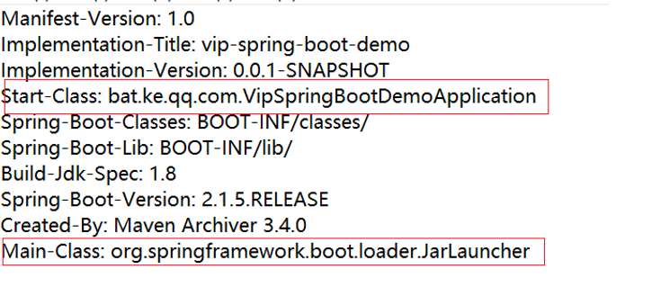
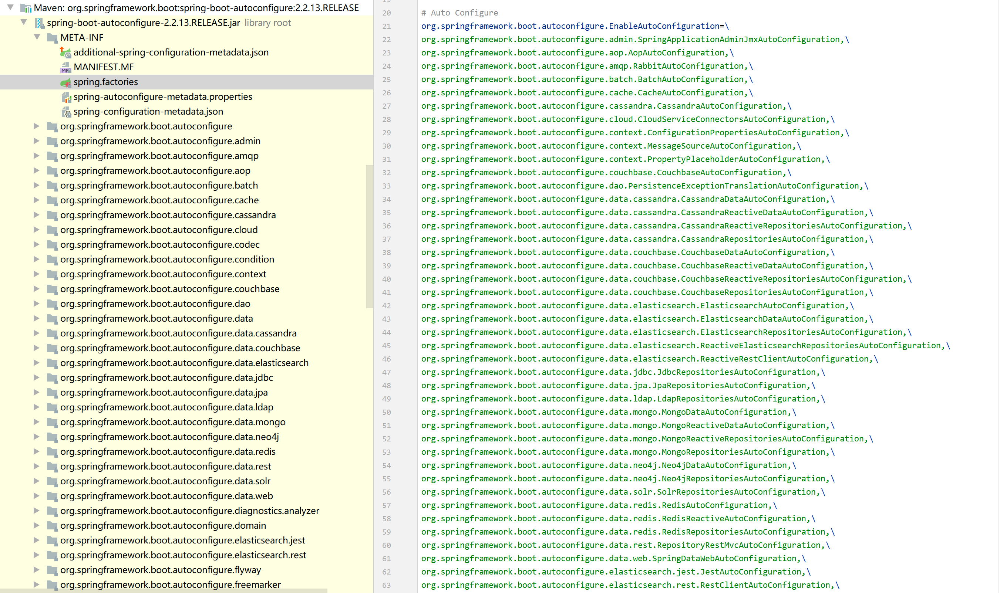

# Spring Boot优点
1，独立运行
    Spring Boot而且内嵌了各种servlet容器，Tomcat、Jetty等，现在不再需要打成war包部署到容器中，Spring Boot只要打成一个可执行的jar包就能独立运行，所有的依赖包都在一个jar包内。
2，简化配置
    spring-boot-starter-web启动器自动依赖其他组件，简少了maven的配置。
3，自动配置
    Spring Boot能根据当前类路径下的类、jar包来自动配置bean，如添加一个spring-boot-starter-web启动器就能拥有web的功能，无需其他配置。
4，无代码生成和XML配置
    Spring Boot配置过程中无代码生成，也无需XML配置文件就能完成所有配置工作，这一切都是借助于条件注解完成的，这也是Spring4.x的核心功能之一。
5，应用监控
    Spring Boot提供一系列端点可以监控服务及应用，做健康检测。

# Spring Boot源码分析 - Jar包的启动实现
SpringBoot提供了Maven插件spring-boot-maven-plugin，可以很方便将我们的项目打包成jar包或者war包
考虑到便利性，我们一般会打包成jar包，这样一来我们无需将项目部署到Tomcat、Jetty等Servlet容器中
那么，SpringBoot插件生成的jar包是如何运行的并启动的呢？

jar包主要分成三个模块：
1，BOOT-INF目录    
    里面保存了我们自己SpringBoot项目编译后的所有文件。
    classes目录就是编译后的.class文件，包括项目的配置文件等，lib目录下就是我们引入的第三方依赖
2，META-INF目录
    通过MANIFEST.MF 文件提供 jar 包的基础信息，包括jar的启动类等信息
    
3，org.springframework.boot.loader目录
    当我们调用java -jar启动应用的时候，会首先找到位于启动模块的Main-Class
    也就是jarLauncher主类，然后执行JarLauncher中的main方法
    在这个main方法中，首先会创建一个自定义的ClassLoader类加载器，从我们的BOOT-INF目录下加载出应用的Class对象和依赖对象
    然后然后根据"start-class"配置，通过反射调用我们启动类的main(String[]) 方法，这样就启动了应用

# Spring Boot 源码分析 - SpringApplication 启动类的启动过程
SpringBoot项目的启动类通常有以下三种：
    ```java
    // 方式一
    @SpringBootApplication
    public class DemoApplication {
        public static void main(String[] args) {
            SpringApplication.run(DemoApplication.class, args);
        }
    }
    // 方式二
    @SpringBootApplication
    public class DemoApplication {
        public static void main(String[] args) {
            new SpringApplicationBuilder(DemoApplication.class).run(args);
        }
    }
    // 方式三
    @SpringBootApplication
    public class DemoApplication extends SpringBootServletInitializer {
        public static void main(String[] args) {
            SpringApplication.run(DemoApplication.class, args);
        }
        @Override
        protected SpringApplicationBuilder configure(SpringApplicationBuilder builder) {
            return builder.sources(Application.class);
        }
    }
    ```
    方式一和方式二本质上通过调用SpringApplication#run(...)方法来启动应用，
    不同的是方式二通过构建器模式，先构建一个SpringApplication实例对象，然后调用其run(...)方法启动应用
    这种方式可以对SpringApplication进行配置，更加灵活。
    我们再来看方式三，它和方式一差不多，不同的是它继承了SpringBootServletInitializer这个类
    作用就是当你的SpringBoot项目打成war包时它能够放入外部Tomcat容器中运行
    如果是war包，那上面的 main(...) 方法自然是不需要的，当然，configure(..) 方法也可以不要。
    通过java -jar 启动 Spring Boot 应用时，最终会调用我们启动类的 main(..) 方法
    那么本文主要是对SpringApplication这个类进行解析。
SpringApplication#run()初始化过程：
    1，SpringApplication的实例化
        这里面主要做这几件事：
            （1）判断当前存在的Class类对象，来决定当前Web应用类型（Reactive、Servlet、None），默认为Servlet
            （2）使用 SpringFactoriesLoader 在应用的 classpath 中查找并加载所有的ApplicationContextInitializer类型对象
            （3）使用 SpringFactoriesLoader 在应用的 classpath 中查找并加载所有的ApplicationListener 类型的对象
    2，接下来就开始执行run()方法的逻辑了
        首先通过SpringFactoriesLoader查找并加载所有的SpringApplicationRunListener，然后启动他们
        例如：
            EventPublishingRunListener 会广播 ApplicationEvent 应用正在启动的事件，
            它里面封装了所有的 ApplicationListener 对象，那么此时就可以通过它们做一些初始化工作，进行拓展
    3，然后会准备好当前应用的Environment环境，这里会加载出所有配置信息，包括application.yml和外部属性配置
    4，如果 SpringApplication的showBanner 属性被设置为 true，则打印 banner
    5，然后就会调用createApplicationContext方法，创建Spring应用上下文ApplicationContext，并把之前设置好的Environment设置给ApplicationContext
    6，执行prepareContext()方法，对Spring应用上下文做一些初始化工作，例如执行之前的ApplicationContextInitializer#initialize(..) 方法
    7，最核心的一步，将之前通过@EnableAutoConfiguration获取的所有配置以及其他形式的IoC容器配置加载到已经准备完毕的ApplicationContext
    8，然后执行ApplicationContext 的 refresh() 方法
    9，最后对所有的SpringApplicationRunListener监听器进行广播
总结
    1，从META-INF/spring.factories文件中加载出相关Class对象，并进行实例化，例如：
        ApplicationContextInitializer、SpringApplicationRunListener和ApplicationListener对象
    2，准备好当前Spring应用的Environment环境，这里会解析application.yml以及外部配置
    3，创建一个ApplicationContext应用上下文对象，默认servlet类型下创建AnnotationConfigServletWebServerApplicationContext对象
    4，调用AbstractApplication#refresh()方法，刷新应用上下文
    整个过程有许多扩展点是通过监听机制实现的，在不同阶段广播不同类型的事件，此时ApplicationListener可进行相关操作
    在上面第四步，servlet应用类型下的Spring应用上下文会创建一个Servlet容器（默认Tomcat）

# Spring Boot 源码分析 - 内嵌Tomcat容器的实现
我们知道SpringBoot能够创建独立的Spring应用，内部嵌入Tomcat，让我们的jar无需放入servlet容器能直接运行
如何使用？
    在我们的 Spring Boot 项目中通常会引入 spring-boot-starter-web 这个依赖
    该模块提供全栈的 WEB 开发特性，包括 Spring MVC 依赖和 Tomcat 容器，这样我们就可以打成 jar 包直接启动我们的应用，如下：
    ```
    <dependency>
        <groupId>org.springframework.boot</groupId>
        <artifactId>spring-boot-starter-web</artifactId>
    </dependency>
    ```
    然后启动类这样写：
    ```
    // 方式三
    @SpringBootApplication
    public class Application extends SpringBootServletInitializer {
        // 可不写
        public static void main(String[] args) {
            SpringApplication.run(DemoApplication.class, args);
        }
        @Override
        protected SpringApplicationBuilder configure(SpringApplicationBuilder builder) {
            return builder.sources(Application.class);
        }
    }
    ```
    然后打成的war包就可以放入到Servlet容器运行了
总结：
    内嵌tomcat容器，主要是在SpringBoot的应用上下文刷新阶段进行了扩展，分别在 onRefresh() 和 finishRefresh() 两个地方
    1，创建一个WebServer服务对象，例如TomcatWebServer对象，对tomcat封装，用于控制tomcat服务器
        （1）先创建一个org.apache.catalina.startup.Tomcat 对象 tomcat，使用临时目录作为基础目录（tomcat.端口号）
        退出时删除，同时会设置端口、编码、最小空闲线程数和最大空闲线程数
        （2）为tomcat创建一个TomcatEmbedded

    在刷新Spring应用上下文的过程中调用onRefresh()方法，在Spring Boot的ServletWebServerApplicationContext中重写了该方法
    
    此时会创建一个Servlet容器（默认为tomcat），并添加IoC容器中的Servlet、Filter和EventListener至Servlet上下文
    Spring MVC 中的核心组件 DispatcherServlet 对象会添加至 Servlet 上下文

# Spring Boot 源码分析 - 剖析 @SpringBootApplication 注解
@SpringBootApplication通常标注在我们的启动类上面，标记是一个SpringBoot应用，同时开启自动配置的功能
@SpringBootApplication是一个组合注解，如下：
```java
@Target(ElementType.TYPE)
@Retention(RetentionPolicy.RUNTIME)
@Documented
@Inherited // 表明该注解定义在某个类上时，其子类会继承该注解
@SpringBootConfiguration // 继承 `@Configuration` 注解
@EnableAutoConfiguration // 开启自动配置功能
// 扫描指定路径下的 Bean
@ComponentScan( excludeFilters = {
// 默认没有 TypeExcludeFilter
@Filter(type = FilterType.CUSTOM, classes = TypeExcludeFilter.class),
// 排除掉自动配置类
@Filter(type = FilterType.CUSTOM, classes = AutoConfigurationExcludeFilter.class) })
public @interface SpringBootApplication {
	/**
	 * 需要自动配置的 Class 类
	 */
	@AliasFor(annotation = EnableAutoConfiguration.class)
	Class<?>[] exclude() default {};
	/**
	 * 需要自动配置的类名称
	 */
	@AliasFor(annotation = EnableAutoConfiguration.class)
	String[] excludeName() default {};
	/**
	 * 需要扫描的路径
	 */
	@AliasFor(annotation = ComponentScan.class, attribute = "basePackages")
	String[] scanBasePackages() default {};
	/**
	 * 需要扫描的 Class 类
	 */
	@AliasFor(annotation = ComponentScan.class, attribute = "basePackageClasses")
	Class<?>[] scanBasePackageClasses() default {};

	/**
	 * 被标记的 Bean 是否进行 CGLIB 提升
	 */
	@AliasFor(annotation = Configuration.class)
	boolean proxyBeanMethods() default true;
}
```
@SpringBootConfiguration：
    是SpringBoot自定义注解，该注解很简单，上面标注了@Configuration元注解，所以作用相同，
    同样是将一个类标注为配置类，能够作为一个Bean被Spring IoC容器管理
    那么为什么不直接使用@Configuration注解呢，我想这是领域驱动设计中的一种思想，可以使SpringBoot更加灵活
@ComponentScan：
    扫描指定路径下标有@Component注解的类，解析成Bean被Spring IoC容器管理
    该注解通常需要和@Configuration注解一起使用，因为需要先被当作一个配置类
    通过 ClassPathBeanDefinitionScanner 扫描器去扫描指定路径下标注了 @Component 注解的类，
    将他们解析成 BeanDefinition（Bean 的前身），后续则会生成对应的 Bean 被 Spring IoC 容器管理
    当然，如果该注解没有通过 basePackages 指定路径，Spring 会选在以该注解标注的类所在的包作为基础路径，然后扫描包下面的这些类
@EnableAutoConfiguration
    ```java
    @Target(ElementType.TYPE)
    @Retention(RetentionPolicy.RUNTIME)
    @Documented
    @Inherited
    @AutoConfigurationPackage // 注册一个 Bean 保存当前注解标注的类所在包路径
    @Import(AutoConfigurationImportSelector.class) // Spring Boot 自动配置的实现
    public @interface EnableAutoConfiguration {
        /**
         * 可通过这个配置关闭 Spring Boot 的自动配置功能
         */
        String ENABLED_OVERRIDE_PROPERTY = "spring.boot.enableautoconfiguration";
        /**
         * 指定需要排除的自动配置类的 Class 对象
         */
        Class<?>[] exclude() default {};
        /**
         * 指定需要排除的自动配置类的名称
         */
        String[] excludeName() default {};
    }
    ```
    @Import(AutoConfigurationImportSelector.class)：
        Spring Boot 自动配置的实现
    @AutoConfigurationPackage
        注册一个Bean，保存了当前注解标注的类所在包路径
@Import 注解：
    @Import主要用来导入配置类或者一些需要前置加载的类，@Import 注解提供了类似 @Bean 注解的功能
    1，声明一个bean，会将这个类作为一个 Bean 被 Spring IoC 管理
        ```
        public class TestBean1 { }
        @Import({TestBean1.class})
        @Configuration
        public class AppConfig {
        }
        ```
    2，导入@Configuration注解的配置类，会将这个类作为一个 Bean 被 Spring IoC 管理
        ```
        @Configuration
        public class TestConfig {
            @Bean
            public TestBean2 getTestBean2(){
                return new TestBean2();
            }
        }
        @Import({TestConfig.class})
        @Configuration
        public class AppConfig { }
        ```
    3，导入ImportSelector的实现类，会调用它的 selectImports(..) 方法获取需要被处理的 Class 对象的名称，也就是可以将它们作为一个 Bean 被 Spring IoC 管理
        ```
        public class TestImportSelector implements ImportSelector {
            @Override
            public String[] selectImports(AnnotationMetadata importingClassMetadata) {
                return new String[]{"com.example.demo.bean.TestBean3"};
            }
        }
        @Import({TestImportSelector.class})
        @Configuration
        public class AppConfig { }
        ```
    4，导入ImportBeanDefinitionRegistrar的实现类，会调用它的 registerBeanDefinitions(..) 方法，自定义地往 BeanDefinitionRegistry 注册中心注册 BeanDefinition
        ```
        public class TestImportBeanDefinitionRegistrar implements ImportBeanDefinitionRegistrar {
            @Override
            public void registerBeanDefinitions(AnnotationMetadata importingClassMetadata, BeanDefinitionRegistry registry) {
                RootBeanDefinition rootBeanDefinition = new RootBeanDefinition(TestBean4.class);
                registry.registerBeanDefinition("TestBean4", rootBeanDefinition);
            }
        }
        @Import({TestImportBeanDefinitionRegistrar.class})
        @Configuration
        public class AppConfig { }
        ```
自动配置：@EnableAutoConfiguration
    什么是自动配置？
        自动配置就是引入某个功能的相关jar包依赖后，Spring能够自动配置应用程序，方便我们使用该功能。、
        例如：当你引入 spring-boot-starter-aop 后，会自动引入 AOP 相关的 jar 包依赖，那么在 spring-boot-autoconfigure 中有一个 AopAutoConfiguration 自动配置类会自动驱动整个 AOP 模块
    原理：
        首先项目会在编译阶段，使用spring-boot-autoconfigure-processor工具模块将自动配置类的一些注解元信息保存在一个spring.properties文件中。
        因为SpringBoot提供的自动配置类比较多，大部分都是没必要的，如果我们在启动的过程中一个一个的去解析，肯定会花费不少性能
        然后会借助@Impor从spring.factories 文件中找到EnableAutoConfiguration对应的值
        
        然后会将这些自动配置类作为一个Bean尝试注入到Spring IoC容器中，如果注入成功的话可以通过@EnableXxx 来驱动某个模块
        注入的时候会通过@Conditional注解判断是否符合条件。比如如果pom.xml文件中没有引入相关依赖，那么该自动配置类就不会工作。这是因为缺少相应的jar包和依赖，自动配置无法生效
@ConditionalOnClass注解
    自动配置类为什么在你引入了相关的jar包才会自动配置相应的模块呢？主要使用了@ConditionalOnClass注解
    @ConditionOnClass注解，当存在指定的class对象时才注入某个Bean。
    其他类似注解：
        @Conditional(TestCondition.class)：这句代码可以标注在类上面，表示该类下面的所有@Bean都会启用配置，也可以标注在方法上面，只是对该方法启用配置。
        @ConditionalOnBean：（仅仅在当前上下文中存在某个对象时，才会实例化一个Bean）
        @ConditionalOnClass：（某个class位于类路径上，才会实例化一个Bean）
        @ConditionalOnExpression：（当表达式为true的时候，才会实例化一个Bean）
        @ConditionalOnMissingBean：（仅仅在当前上下文中不存在某个对象时，才会实例化一个Bean）
        @ConditionalOnMissingClass：（某个class类路径上不存在的时候，才会实例化一个Bean）
        @ConditionalOnNotWebApplication：（不是web应用）
# Spring Boot 源码分析 - 配置加载
在SpringBoot应用中，我们可以很方便的在application.yml或application.properties文件中添加需要的配置信心并应用于当前应用
那么对于SpringBoot是如何加载配置文件的？
源码分析：
    之前说的prepareEnvironment方法中，会对所有的SpringApplicationRunListener广播应用环境已经准备好
    其中有一个ConfigFileApplicationListener，监听到上面这个事件，会去解析application.yml等配置信息
    在ConfigFileApplicationListener中会先加载出application.yml文件，然后找到需要的Profile对应的PropertySource属性信息，包括公告配置
    最后将这些PropertySource应用于Environment

# Spring Boot 源码分析 - 日志系统
在我们使用SpringBoot的时候，默认就提供了日志的功能，使用Logback作为默认的日志框架
因为在 spring-boot-starter 模块中引入 spring-boot-starter-logging 模块，该 Starter 引入了 logback-classic 依赖
Log 日志体系
    在我们日常工作中，可以看到项目中日志相关的jar包很多，例如commons-logging、log4j、log4j2、sl4j 和 logback
    经常碰到各种依赖冲突问题，非常烦恼。
Log 的发展历程开始说起：
    1，log4j（作者Ceki Gülcü）出来后，被开发者们广泛的应用（注意，这里是直接使用），当初是 Java 日志事实上的标准，并成为了 Apache 的项目
    2，Apache 要求把 log4j 并入到 jdk，SUN 表示拒绝，并在 jdk1.4 版本后增加了 JUL（java.util.logging）；
    3，毕竟是 JDK 自带的，JUL 也被很多人使用。同时还有其他的日志组件，如 SimpleLog 等。这个时候如果有人想换成其他日志组件，如 log4j 换成 JUL，因为 API 完全不同，就需要改动代码，当然很多人不愿意呀；
    4，Apache 见此，开发了 JCL（Jakarta Commons Logging），即 commons-logging-xx.jar。它只提供一套通用的日志接口 API，并不提供日志的实现。很好的设计原则嘛，依赖抽象而非实现。这样一来，我们的应用程序可以在运行时选择自己想要的日志实现组件；
    5，这样看上去也挺美好的，但是 log4j 的作者觉得 JCL 不好用，自己开发出一套 slf4j，它跟 JCL 类似，本身不替供日志的具体实现，只对外提供接口或门面。目的就是为了替代 JCL。同时，还开发出 logback，一个比 log4j 拥有更高性能的组件，目的是为了替代 log4j；
    6，Apache 参考了 logback，并做了一系列优化，推出了一套 log4j2 日志框架。
日志系统源码分析：
    在Spring应用的整个过程中，到了不同阶段会发布不同类型的事件，例如最开始会发布一个应用正在启动的事件
    其中有一个 LoggingApplicationListener 对象，监听到不同事件后，会对日志系统进行一些相关的初始化工作

# Spring Boot 源码分析 - @ConfigurationProperties 注解的实现
我们常会在application.yml配置文件里面配置一些自定义配置，对于不同环境设置不同的值，然后通过@ConfigurationProperties注解将这些配置作为Spring Bean属性值进行注入
几种使用方式：
    properties配置信息：
        mail.hostname=host@mail.com
        mail.port=9000
        mail.from=mailer@mail.com
    1，@ConfigurationProperties + @Component或者@Configuration 注解（一个类）
        ```
        @Data
        @Configuration
        @ConfigurationProperties(prefix = "mail")
        public class ConfigProperties {
            private String hostName;
            private int port;
            private String from;
        }
        ```
    2，如果不想使用@Configuration，那么需要在@EnableConfigurationProperties注解中手动导入配置文件如下：
        ```
        配置类不使用@Component或者@Configuration
            @Data
            @ConfigurationProperties(prefix = "mail")
            public class ConfigProperties {
                private String hostName;
                private int port;
                private String from;
            }
        启动类开启：EnableConfigurationProperties
            @SpringBootApplication
            @EnableConfigurationProperties(ConfigProperties.class)
            public class ConfigPropApp {
                public static void main(String[] args) {
                    SpringApplication.run(ConfigPropApp.class,args);
                }
            }
        或者指定扫描路径：ConfigurationPropertiesScan
            @SpringBootApplication
            @ConfigurationPropertiesScan("com.flydean.config")
                public class ConfigPropApp {
                public static void main(String[] args) {
                    SpringApplication.run(ConfigPropApp.class,args);
                }
            }
        ```
    3，搭配Bean使用：
        ```
        yml信息
            item:
                name: Tom
                size: 12
        POJO信息：
            @Data
            public class Item {
                private String name;
                private int size;
            }
        使用：
            @Data
            @Configuration
            public class BeanConfigProperties {
                @Bean
                @ConfigurationProperties(prefix = "item")
                    public Item item() {
                    return new Item();
                }
            }
        ```
    4，属性嵌套
        properties配置文件：
            ```
            # nest Simple properties
            nestmail.hostname=mailer@mail.com
            nestmail.port=9000
            nestmail.from=mailer@mail.com
            #List properties
            nestmail.defaultRecipients[0]=admin@mail.com
            nestmail.defaultRecipients[1]=owner@mail.com
            #Map Properties
            nestmail.additionalHeaders.redelivery=true
            nestmail.additionalHeaders.secure=true
            #Object properties
            nestmail.credentials.username=john
            nestmail.credentials.password=password
            nestmail.credentials.authMethod=SHA1
            ```
        POJO配置文件：
            ```
            @Data
            public class Credentials {
                private String authMethod;
                private String username;
                private String password;
            }
            ```
        嵌套的配置文件：
            ```
            @Data
            @Configuration
            @ConfigurationProperties(prefix = "nestmail")
            public class NestConfigProperties {
                private String host;
                private int port;
                private String from;
                private List<String> defaultRecipients;
                private Map<String, String> additionalHeaders;
                private Credentials credentials;
            }
            ```
    5，属性验证
        ```
        @Data
        @Validated
        @Configuration
        @ConfigurationProperties(prefix = "mail")
        public class ConfigProperties {
            @NotEmpty
            private String hostName;
            @Min(1025)
            @Max(65536)
            private int port;
            @Pattern(regexp = "^[a-z0-9._%+-]+@[a-z0-9.-]+\\.[a-z]{2,6}$")
            private String from;
        }
        ```
    6，属性转换，自定义Converter
        ```
        properties文件：
            conversion.employee=john,2000
        POJO类：
            public class Employee {
                private String name;
                private double salary;
            }
        自己实现一个Converter接口的转换类：
            @Component
            @ConfigurationPropertiesBinding
            public class EmployeeConverter implements Converter<String, Employee> {
                @Override
                public Employee convert(String from) {
                    String[] data = from.split(",");
                    return new Employee(data[0], Double.parseDouble(data[1]));
                }
            }
        ```
大致原理：      
    就是通过注册一个BeanPostProcessor，会在加载Spring Bean初始化的时候进行前置处理。解析出@ConfigurationProperties注解相关信息，然后找到对应的属性绑定到这个Bean中
    关于第二种方法：@EnableConfigurationProperties：
        是通过@Import注解的方法，注册一个BeanPostProcessor用于处理@ConfigurationProperties注解的Bean
        同时将指定带有@ConfigurationProperties注解的Class对象注册到Spring IoC容器，这就是为什么不用加@Component的原因
    那么第一种是在哪里注册的BeanPostProcessor呢？
        因为 Spring Boot 有一个 ConfigurationPropertiesAutoConfiguration 自动配置类，如下：
        ```
        @Configuration(proxyBeanMethods = false)
        @EnableConfigurationProperties
        public class ConfigurationPropertiesAutoConfiguration { }
        ```
        如上，也是通过 @EnableConfigurationProperties 注解注册的这个 BeanPostProcessor 对象
    第二种方式和第一种原理是一样的，不过第二种方式会注册一个BeanPostProcessor用于处理带有@ConfigurationProperties 注解的 Spring Bean
    同时将指定的Class解析出BeanDefinition并注册。
    
# 如何理解SpringBoot中的Starter
starter的理解：
    starter是SpringBoot中一种非常重要的机制，能够抛弃以前复杂的配置，将其同一集成进starter，应用者只需要在maven中引入starter依赖
    SpringBoot就能够自动扫描到要加载的信息并启动相应的默认配置
    starter让我们摆脱了各种依赖裤的处理，需要配置各种信息的困扰。
    SpringBoot会自动通过classpath路径下的类发现需要的Bean，并注册进IoC容器。
创建自己的stater：
    1，创建一个starter项目，设置pom文件
        ```
        <?xml version="1.0" encoding="UTF-8"?>
        <project xmlns="http://maven.apache.org/POM/4.0.0"
        xmlns:xsi="http://www.w3.org/2001/XMLSchema-instance"
        xsi:schemaLocation="http://maven.apache.org/POM/4.0.0 http://maven.apache.org/xsd/maven-4.0.0.xsd">
        <modelVersion>4.0.0</modelVersion>
        <artifactId>http-starter</artifactId>
        <version>0.0.1-SNAPSHOT</version>
            <!-- 自定义starter都应该继承自该依赖 -->
            <!-- 如果自定义starter本身需要继承其它的依赖，可以参考 https://stackoverflow.com/a/21318359 解决 -->
            <parent>
                <groupId>org.springframework.boot</groupId>
                <artifactId>spring-boot-starters</artifactId>
                <version>1.5.2.RELEASE</version>
            </parent>
            <dependencies>
                <!-- 自定义starter依赖此jar包 -->
                <dependency>
                    <groupId>org.springframework.boot</groupId>
                    <artifactId>spring-boot-starter</artifactId>
                </dependency>
                <!-- lombok用于自动生成get、set方法 -->
                <dependency>
                    <groupId>org.projectlombok</groupId>
                    <artifactId>lombok</artifactId>
                    <version>1.16.10</version>
                </dependency>
            </dependencies>
        </project>
        ```
    2，创建一个ConfigurationProperties用于保存配置信息（如果没有配置信息可以跳过，不过这种情况非常少见）
        ```
        @ConfigurationProperties(prefix = "http") // 自动获取配置文件中前缀为http的属性，把值传入对象参数
        @Setter
        @Getter
        public class HttpProperties {
            // 如果配置文件中配置了http.url属性，则该默认属性会被覆盖
            private String url = "http://www.baidu.com/";
        }
        ```
    3，创建一个AutoConfiguration，引用定义好的配置信息；在AutoConfiguration中实现所有starter应该完成的操作
        ```
        @Configuration
        @EnableConfigurationProperties(HttpProperties.class)
        public class HttpAutoConfiguration {
            @Resource
            private HttpProperties properties; // 使用配置
            // 在Spring上下文中创建一个对象
            @Bean
            @ConditionalOnMissingBean
            public HttpClient init() {
                HttpClient client = new HttpClient();
                String url = properties.getUrl();
                client.setUrl(url);
                return client;
            }
        }
        ```
    4，在 resources 文件夹下新建目录 META-INF，在目录中新建 spring.factories 文件，并且在 spring.factories 中配置AutoConfiguration
        ```
        org.springframework.boot.autoconfigure.EnableAutoConfiguration=\
        com.nosuchfield.httpstarter.HttpAutoConfiguration
        ```
    5，打包项目，之后在一个SpringBoot项目中引入该项目依赖，然后就可以使用该starter了
        ```
        @Component
        public class RunIt {
            @Resource
            private HttpClient httpClient;
            public void hello() {
                System.out.println(httpClient.getHtml());
            }
        }
        ```