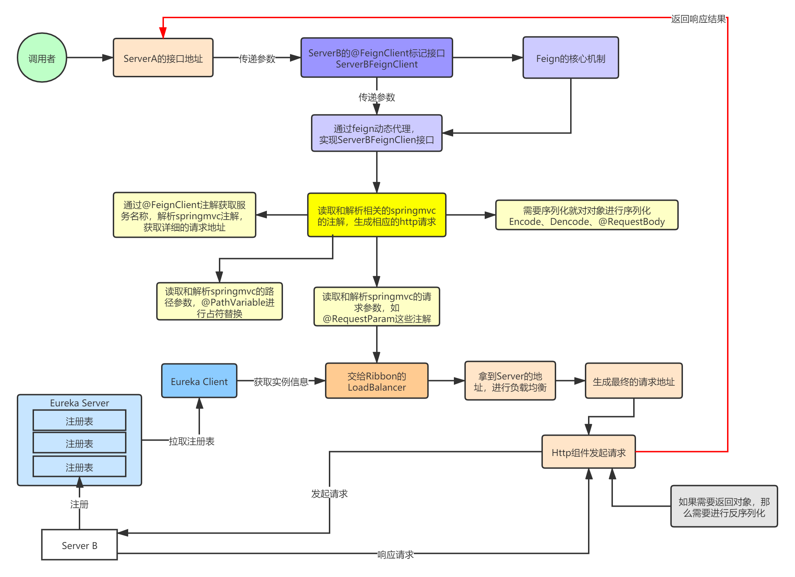

# 什么是Feign？
Feign 的英文表意为“假装，伪装，变形”， 是一个轻量级的http客户端工具。 他封装了Http调用流程，使我们可以以Java接口注解的方式调用http请求。 Spring Cloud
Feign整合了Ribbon（负载均衡）和hystrix（服务熔断） 同时扩展了对注Spring MVC注解的支持， 在其实现下，我们只需要创建一个接口并用注解的方式来配置它，即可完成对服务提供方接口绑定，


# Feign整合Ribbon和Hystrix
微服务中的两个重要武器就是客户端负载均衡（Ribbon）的服务调用以及如何通过断路器（Hystrix）来保护我们的微服务应用
这两者将作为基础框架广泛应用在各个微服务实现中，这两个框架几乎是同时出现的。既然如此，就出现了Feign，提供了两者强大的功能

整合Ribbon 在这个服务调用过程中Feign会通过Ribbon从服务注册中心获取目标微服务的服务器地址列表 之后在网络请求的过程中Ribbon就会将请求以负载均衡的方式打到微服务的不同实例上 从而实现Spring
Cloud微服务架构中最为关键的功能即服务发现及客户端负载均衡调用。 

整合Hystrix 如果微服务项目上加上了spring-cloud-starter-netflix-hystrix依赖，那么，feign会通过代理模式，
自动将所有的方法用 hystrix 进行包装。 调用方会针对被调用微服务设置调用超时时间，一旦超时就会进入熔断逻辑，而这个故障指标信息也会返回给Hystrix组件
Hystrix组件会根据熔断情况判断被调微服务的故障情况从而打开熔断器，之后所有针对该微服务的请求就会直接进入熔断逻辑，直到被调微服务故障恢复，Hystrix断路器关闭为止。
我们使用Ribbon和Hystrix的时候，无需对Feign单独配置，只需要修改对应的Ribbon和Hystrix的配置即可


# Spring MVC注解的支持前言
在使用Ribbon的时候，通常都会利用它对RestTemplate的请求拦截来实现对依赖服务的接口调用。 由于RestTemplate的封装，几乎每一个调用都是简单的模版化内容。 Spring Cloud
Fegin在此基础上做了进一步封装，由它来帮助我们定义和实现依赖服务接口的定义。 在Spring Cloud Feign的实现下，我们只需创建一个接口并用注解的方式来配置它，即可完成对服务提供方的接口绑定，简化了在使用Spring
Cloud Ribbon时自行封装服务调用客户端的开发量。 Spring Cloud Feign具备可插拔的注解支持，包括Feign注解和JAX-RS注解。 同时，为了适应Spring的广大用户，它在Netflix
Feign的基础上扩展了对Spring MVC的注解支持。


# Feign基础使用
1，引入依赖

```
<dependency>
    <groupId>org.springframework.cloud</groupId>
    <artifactId>spring-cloud-starter-openfeign</artifactId>
</dependency>
```

2，启动类注册Bean @EnableFeignClients 3，编写远程调用服务接口，根据相应的消费接口进行参数的绑定

```
@FeignClient(value = "provider")
public interface FeignService {
    @GetMapping("/zone")
    String feignService();
    
    @GetMapping("/queryUserById")
    User queryUserById(@RequestParam（"id"） String id);
}
```

4，调用接口

```
public class FeignController {
    @AutoWired
    private FeignService service;
    @GetMapping("/consumer")
    public String test() {
      return service.feignService();
    }
}
```


# Feign配置
1，客户端配置
    ```
    //这是最简单的客户端指定服务配置
    @FeignClient(value = "provider")
    //其他参数
    value：调用服务名称，和name属性相同
    name：调用服务名称，和value属性相同
    url：全路径地址或hostname，http或https可选
    decode404：配置响应状态码为404时是否应该抛出FeignExceptions
    configuration：自定义当前feign client的一些配置	参考FeignClientsConfiguration
    fallback：熔断机制，调用失败时，走的一些回退方法，可以用来抛出异常或给出默认返回数据。	底层依赖hystrix，启动类要加上@EnableHystrix
    path：自动给所有方法的requestMapping前加上前缀，类似与controller类上的requestMapping
    ```
2，客户端指定fallBack（服务降级）
    ```
    //指定fallBack属性的实现类
    @FeignClient(value = "provider", fallback = HystrixServiceCompenent.class)
    public interface FeignService {
        //这里要注意,value属性名不能省略，虽然在MVC中可以，但是在feign中不行。
        @GetMapping(value = "/zone")
        String feignService();
        @GetMapping(value = "/queryUserById")
        User queryUserById(@RequestParam String id);
    }
    //以下就是实现服务降级的组件。
    @Component
    public class HystrixServiceCompenent implements FeignService {
        @Override
        public String feignService() {
            return "sorry" + "this service is fail, by_hystrix";
        }
        @Override
        public User queryUserById(String id) {
            return null;
        }
    }
    ```
3，全局配置
    （1）配置ribbon
        格式：ribbon.<key>=<value>
        例如：ribbon.ConnectTimeout=500
             ribbon.ReadTimeout=5000
        注意：
            在Feign声明式远程调用中，负载均衡还是使用的Ribbon技术。而Ribbon技术默认的链接超时是1秒，也就是1秒内Application Service没有处理Application Client的请求，且链接请求处理后，1秒之内没有返回响应，Application Client都会抛出超时异常。
            在商业项目中，部分服务是很难在1秒之内处理链接，并在处理链接后1秒之内返回响应的，所以配置超时信息就很有必要了。
            超时策略的使用优先级： 指定服务的超时策略 -> 全局配置的超时策略 -> 默认的超时策略。
    （2）配置hystrix
        hystrix.command.default.execution.isolation.thread.timeoutInMilliseconds=5000
        feign.hystrix.enabled=false
4，指定服务实例配置
    格式：服务名.ribbon.属性=属性值
    以下例子中 "provider" 就是服务名
    ```
    # 对所有操作请求都进行重试
    provider.ribbon.OkToRetryOnAllOperations=true
    # 对当前实例的重试次数
    provider.ribbon.MaxAutoRetries=2
    # 请求连接的超时时间
    provider.ribbon.ConnectTimeout=3000
    # 请求处理的超时时间
    provider.ribbon.ReadTimeout=3000
    ```
5，重试机制(Retry)（这是ribbon组件）
    ```
    # 更换实例后的重试次数为2
    provider.ribbon.MaxAutoRetrikesNextServer=1
    # 重试策略首先访问首选服务一次，失败后再重试一次
    provider.ribbon.MaxAutoRetries=1
    ```
    1，计算上面的重试次数为：
        MaxAutoRetries + MaxAutoRetriesNextServer + (MaxAutoRetries * MaxAutoRetriesNextServer)
        由以上计算公式得出为3次重试；
        那么包括第一次，则为4次。
    2，Hystrix的超时时间必须大于Ribbon的超时时间，
        否则触发了Hystrix的熔断命令之后，重试机制已经失效。
        即，运行过程应该是先进行请求，如果ribbon超时，则进行重试，如果再超时，超过Hystrix超时时间，就会触发熔断，从而进行服务降级等一系列操作。
6，局部禁用hystrix(有时候不希望全局禁用,比如跨zone调用服务的时候)
    ```
    /**
     * @author linxu
     * @date 2019/7/16
     * 用于禁用某个Feign客户端的Hystrix组件
     * 如果想要开启，这个@Configuration注解必须注释掉，否则会出现不生效的情况。
     */
    @Configuration
    public class DisableHystrixConfiguration {
        @Bean
        @Scope("prototype")
        public Feign.Builder feignBuilder(){
            return Feign.builder();
        }
    }
    //在客户端中，只需要指定配置就达到禁用的效果。
    @FeignClient(value = "provider",configuration = DisableHystrixConfiguration.class)
    ```
7，请求压缩
    ```
    # 开启压缩
    feign.compression.request.enabled=true
    feign.compression.response.enabled=true
    # 设置压缩参数以下两个都是默认值
    feign.compression.request.mime-type=text/xml,application/xml,application/json
    feign.compression.request.min-request-size=2048
    ```
8，Hystrix的配置更改
    ```yml
    #在Hystrix中，我们采用了声明式配置，通过注解进行配置的修改；但是，Feign在取消了这一做法，改为配置文件配置；如下，是线程池的配置。
    hystrix:
      command:
        default:
          execution:
            isolation:
              strategy: THREAD
      threadpool:
          default:
             coreSize: 20
           #这个是feign客户端的名称
          <client-Name>:
             coreSize: 10
    ```


# Feign通讯优化
1，GZIP压缩
    在Feign技术中应用GZIP压缩
    只开启Feign请求-应答过程中的GZIP，也就是浏览器-Application Client之间的请求应答不开启GZIP压缩。在全局配置文件中，使用下述配置来实现Feign请求-应答的GZIP压缩：
    ```properties
    # feign gzip
    # 局部配置。只配置feign技术相关的http请求-应答中的gzip压缩。
    # 配置的是application client和application service之间通讯是否使用gzip做数据压缩。
    # 和浏览器到application client之间的通讯无关。
    # 开启feign请求时的压缩， application client -> application service
    feign.compression.request.enabled=true
    # 开启feign技术响应时的压缩，  application service -> application client
    feign.compression.response.enabled=true
    # 设置可以压缩的请求/响应的类型。
    feign.compression.request.mime-types=text/xml,application/xml,application/json
    # 当请求的数据容量达到多少的时候，使用压缩。默认是2048字节。
    feign.compression.request.min-request-size=512
    ```
2，HttpClient客户端替换及HTTP连接池
    两台服务器建立HTTP连接的过程是很复杂的一个过程，涉及到多个数据包的交换，并且也很耗时间。HTTP连接需要的3次握手4次挥手开销很大，这一开销对于大量的比较小的HTTP消息来说更大。
    我们可以采用HTTP连接池来提升性能，连接池可以节约大量的3次握手4次挥手的时间，这样能大大提升吞吐率。
    Feign技术的底层实现
        Feign的HTTP客户端支持3种框架，分别是；HttpURLConnection、HttpClient、OKHttp。Feign中默认使用HttpURLConnection。
        HttpURLConnection是JDK自带的HTTP客户端技术，并不支持连接池，如果要实现连接池的机制，还需要自己来管理连接对象。对于网络请求这种底层相对复杂的操作，如果有可用的其他方案，也没有必要自己去管理连接对象。
        Apache提供的HttpClient框架相比传统JDK自带的HttpURLConnection，它封装了访问http的请求头，参数，内容体，响应等等；它不仅使客户端发送HTTP请求变得容易，而且也方便了开发人员测试接口（基于Http协议的），即提高了开发的效率，也方便提高代码的健壮性；另外高并发大量的请求网络的时候，还是用“HTTP连接池”提升吞吐量。
    Feign中应用HttpClient
    （1）资源依赖：Feign技术发起请求的位置是Application Client端，下述依赖只需要在Application Client所在工程中添加即可
        <!-- httpclient相关依赖 -->
        <dependency>
            <groupId>org.apache.httpcomponents</groupId>
            <artifactId>httpclient</artifactId>
        </dependency>
        <dependency>
            <groupId>io.github.openfeign</groupId>
            <artifactId>feign-httpclient</artifactId>
        </dependency>
    （2）修改全局配置文件：
        # 开启feign技术对底层httpclient的依赖。 切换底层实现技术。
        feign.httpclient.enabled=true
    （3）提供连接池配置类：
        /**
         * 配置类型
         * 用于提供一个HTTP连接池，并实现连接池管理。
         * 主要目的是，提供一个合理的资源回收方式。
         */
        @Configuration
        public class HttpClientConfiguration {
            @Bean
            public HttpClient httpClient(){
                System.out.println("init feign httpclient configuration " );
                // 生成默认请求配置
                RequestConfig.Builder requestConfigBuilder = RequestConfig.custom();
                // 超时时间
                requestConfigBuilder.setSocketTimeout(5 * 1000);
                // 连接时间
                requestConfigBuilder.setConnectTimeout(5 * 1000);
                RequestConfig defaultRequestConfig = requestConfigBuilder.build();
                // 连接池配置
                // 长连接保持30秒
                final PoolingHttpClientConnectionManager pollingConnectionManager = new PoolingHttpClientConnectionManager(30, TimeUnit.MILLISECONDS);
                // 总连接数
                pollingConnectionManager.setMaxTotal(5000);
                // 同路由的并发数
                pollingConnectionManager.setDefaultMaxPerRoute(100);
                // httpclient 配置
                HttpClientBuilder httpClientBuilder = HttpClientBuilder.create();
                // 保持长连接配置，需要在头添加Keep-Alive
                httpClientBuilder.setKeepAliveStrategy(new DefaultConnectionKeepAliveStrategy());
                httpClientBuilder.setConnectionManager(pollingConnectionManager);
                httpClientBuilder.setDefaultRequestConfig(defaultRequestConfig);
                HttpClient client = httpClientBuilder.build();
                // 启动定时器，定时回收过期的连接， 最重要。 如果没有定义回收策略。连接池会在运行一段时间后失效。
                Timer timer = new Timer();
                timer.schedule(new TimerTask() {
                    @Override
                    public void run() {
                        pollingConnectionManager.closeExpiredConnections();
                        pollingConnectionManager.closeIdleConnections(5, TimeUnit.SECONDS);
                    }
                }, 10 * 1000, 5 * 1000);
                System.out.println("===== Apache httpclient 初始化连接池===");
                return client;
            }
        }
    使用HttpClient客户端替换HttpURLConnection，仅需修改Application Client，其余无需修改。当使用HttpClient技术作为Feign的底层HTTP技术应用时，使用GET请求方式请求头传递自定义类型对象是可行的，只要在服务标准对象中定义的方法参数上增加注解@RequestBody即可处理。


# Feign中的注意事项
1，Feign客户端默认是关闭重试功能，因为该功能会与Ribbon的重试机制重叠。建议不要开启Feign的重试机制，毫无意义。
2，ribbon的超时时间只有小于feign.hystrix的超时时间才会重试，否则触发熔断。
3，ribbon重试的次数计算如下：MaxAutoRetries + MaxAutoRetriesNextServer + (MaxAutoRetries * MaxAutoRetriesNextServer)
4，OkToRetryOnAllOperations选项记得关闭，否则会触发其它post、put方法的重试（不是幂等），则会出现数据问题。默认只对Get方法进行重试。
5，Hystrix的超时计算：(1 + MaxAutoRetries + MaxAutoRetriesNextServer) * Ribbon.ReadTimeout
6，默认情况下，GET方式请求无论是连接异常还是读取异常，都会进行重试，非GET方式请求,只有连接异常时,才会进行重试，避免了非幂等问题。


# 源码解析
1，通过在启动类上标记 @EnableFeignClients 注解来开启feign的功能，服务启动后会扫描 @FeignClient 注解标记的接口
2，扫描的时候会将注解信息连同接口名一起取出，赋值给BeanDefinitionBuilder，BeanDefinitionBuilder得到BeanDefinition，最后BeanDefinition式注入到ioc容器中
3，然后根据JDK动态代理机制，会生成一个InvocationHandler统一的方法拦截器。
4，同时为接口的每个方法生成一个SynchronousMethodHandler拦截器，并解析方法上的元数据，生成一个http请求模板
5，RequestTemplate生成Request请求对象，然后交由Client端进行处理。Client可以是HttpUrlConnection、HttpClient也可以是Okhttp。
6，最后Client被封装到LoadBalanceClient类，这个类结合类Ribbon做到了负载均衡。



