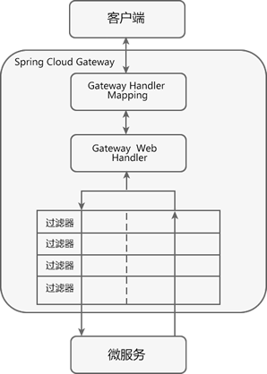

# 前言
在微服务架构中，一个系统往往由多个微服务组成，而这些服务可能部署在不同机房、不同地区、不同域名下。
这种情况下，客户端（例如浏览器、手机、软件工具等）想要直接请求这些服务，就需要知道它们具体的地址信息，例如 IP 地址、端口号等。

这种客户端直接请求服务的方式存在以下问题：
1，当服务数量众多的时候，客户端需要维护大量的服务地址，对于客户端来说，是非常复杂的
2，某些场景下可能会存在跨域请求的问题
3，身份认证难度大，每个微服务需要独立认证

# API网管
API 网关是一个搭建在客户端和微服务之间的服务，我们可以在 API 网关中处理一些非业务功能的逻辑，例如权限验证、监控、缓存、请求路由等。

API 网关就像整个微服务系统的门面一样，是系统对外的唯一入口。有了它，客户端会先将请求发送到 API 网关，然后由 API 网关根据请求的标识信息将请求转发到微服务实例。


对于服务数量众多、复杂度较高、规模比较大的系统来说，使用 API 网关具有以下好处：
1，客户端通过 API 网关与微服务交互时，客户端只需要知道 API 网关地址即可，而不需要维护大量的服务地址，简化了客户端的开发。
2，客户端直接与 API 网关通信，能够减少客户端与各个服务的交互次数。
3，客户端与后端的服务耦合度降低。
4，节省流量，提高性能，提升用户体验。
5，API 网关还提供了安全、流控、过滤、缓存、计费以及监控等 API 管理功能。

常见的API网关实现方案：
- Spring Cloud Gateway
- Spring Cloud Netflix Zuul
- Kong
- Nginx+Lua
- Traefik


# Spring Cloud Gateway
Spring Cloud Gateway 旨在提供一种简单而有效的途径来发送 API，并为它们提供横切关注点，例如：安全性，监控/指标和弹性。
Spring Cloud Gateway 是基于 WebFlux 框架实现的，而 WebFlux 框架底层则使用了高性能的 Reactor 模式通信框架 Netty。
核心概念：
    最主要的功能就是路由转发，而在定义转发规则时主要涉及了以下三个核心概念，如下表。
    1，Route（路由）
        网关最基本的模块。它由一个 ID、一个目标 URI、一组断言（Predicate）和一组过滤器（Filter）组成。
    2，Predicate（断言）
        路由转发的判断条件，我们可以通过 Predicate 对 HTTP 请求进行匹配，例如请求方式、请求路径、请求头、参数等，如果请求与断言匹配成功，则将请求转发到相应的服务。
    3，Filter（过滤器）
        过滤器，我们可以使用它对请求进行拦截和修改，还可以使用它对上文的响应进行再处理。
特征：
    1，基于 Spring Framework 5、Project Reactor 和 Spring Boot 2.0 构建。
    2，能够在任意请求属性上匹配路由。
    3，predicates（断言） 和 filters（过滤器）是特定于路由的。
    4，集成了 Hystrix 熔断器。
    5，集成了 Spring Cloud DiscoveryClient（服务发现客户端）。
    6，易于编写断言和过滤器。
    7，能够限制请求频率。
    8，能够重写请求路径。
工作流程：
    
    1，客户端将请求发送到 Spring Cloud Gateway 上。
    2，Spring Cloud Gateway 通过 Gateway Handler Mapping 找到与请求相匹配的路由，将其发送给 Gateway Web Handler。
    3，Gateway Web Handler 通过指定的过滤器链（Filter Chain），将请求转发到实际的服务节点中，执行业务逻辑返回响应结果。
    4，过滤器之间用虚线分开是因为过滤器可能会在转发请求之前（pre）或之后（post）执行业务逻辑。
    5，过滤器（Filter）可以在请求被转发到服务端前，对请求进行拦截和修改，例如参数校验、权限校验、流量监控、日志输出以及协议转换等。
    6，过滤器可以在响应返回客户端之前，对响应进行拦截和再处理，例如修改响应内容或响应头、日志输出、流量监控等。
    7，响应原路返回给客户端。
总而言之，客户端发送到 Spring Cloud Gateway 的请求需要通过一定的匹配条件，才能定位到真正的服务节点。
在将请求转发到服务进行处理的过程前后（pre 和 post），我们还可以对请求和响应进行一些精细化控制。
Predicate 就是路由的匹配条件，而 Filter 就是对请求和响应进行精细化控制的工具。有了这两个元素，再加上目标 URI，就可以实现一个具体的路由了。


# Predicate 断言
Spring Cloud Gateway 通过 Predicate 断言来实现 Route 路由的匹配规则。
简单点说，Predicate 是路由转发的判断条件，请求只有满足了 Predicate 的条件，才会被转发到指定的服务上进行处理。

使用 Predicate 断言需要注意以下 3 点：
    - Route 路由与 Predicate 断言的对应关系为“一对多”，一个路由可以包含多个不同断言。
    - 一个请求想要转发到指定的路由上，就必须同时匹配路由上的所有断言。
    - 当一个请求同时满足多个路由的断言条件时，请求只会被首个成功匹配的路由转发。

## 常见的 Predicate 断言
After	- After=2017-01-20T17:42:47.789-07:00[America/Denver]	在该日期时间之后发生的请求都将被匹配。
Before	- Before=2017-01-20T17:42:47.789-07:00[America/Denver]	在该日期时间之前发生的请求都将被匹配。
Between	- Between=2017-01-20T17:42:47.789-07:00[America/Denver], 2017-01-21T17:42:47.789-07:00[America/Denver]	在两个日期时间之间发生的请求都将被匹配。
Cookie	- Cookie=chocolate, ch.p	请求包含次cookie名称且正则表达式为真的将会被匹配。
Header	- Header=X-Request-Id, \d+	请求包含次header名称且正则表达式为真的将会被匹配。
Host	- Host=**.somehost.org,**.anotherhost.org	使用Ant路径匹配规则，.作为分隔符
Method	- Method=GET	所有GET请求都将被路由
Path	- Path=/foo/{segment},/bar/{segment}	路径/foo/开头或/bar/开头的请求都将被匹配
Query	- Query=baz，    包含了请求参数 baz的都将被匹配
        - Query=foo, ba.  请求参数里包含foo参数，并且值匹配为ba.  
RemoteAddr	- RemoteAddr=192.168.1.1/24	请求的remote address 为 192.168.1.10则将被路由
Weight	    routes:
                - id: weight_high
                  uri: https://weighthigh.org  将大约80％的流量转发到weighthigh.org
                  predicates:
                    - Weight=group1, 8
                - id: weight_low
                  uri: https://weightlow.org  将大约20％的流量转发到weightlow.org
                  predicates:
                    - Weight=group1, 2
## Predicate断言的使用
1，在父工程 spring-cloud-demo2 下创建一个名为 micro-service-cloud-gateway-9527 的 Spring Boot 模块，并在其 pom.xml 中引入相关依赖，配置如下。
```xml
<?xml version="1.0" encoding="UTF-8"?>
<project xmlns="http://maven.apache.org/POM/4.0.0" xmlns:xsi="http://www.w3.org/2001/XMLSchema-instance"
         xsi:schemaLocation="http://maven.apache.org/POM/4.0.0 https://maven.apache.org/xsd/maven-4.0.0.xsd">
    <modelVersion>4.0.0</modelVersion>
    <parent>
        <artifactId>spring-cloud-demo2</artifactId>
        <groupId>net.biancheng.c</groupId>
        <version>0.0.1-SNAPSHOT</version>
    </parent>
    <groupId>net.biancheng.c</groupId>
    <artifactId>micro-service-cloud-gateway-9527</artifactId>
    <version>0.0.1-SNAPSHOT</version>
    <name>micro-service-cloud-gateway-9527</name>
    <description>Demo project for Spring Boot</description>
    <properties>
        <java.version>1.8</java.version>
    </properties>
    <dependencies>
        <dependency>
            <groupId>org.springframework.boot</groupId>
            <artifactId>spring-boot-starter</artifactId>
        </dependency>
        <dependency>
            <groupId>org.springframework.boot</groupId>
            <artifactId>spring-boot-starter-test</artifactId>
            <scope>test</scope>
        </dependency>
        <!--特别注意：在 gateway 网关服务中不能引入 spring-boot-starter-web 的依赖，否则会报错-->
        <!-- Spring cloud gateway 网关依赖-->
        <dependency>
            <groupId>org.springframework.cloud</groupId>
            <artifactId>spring-cloud-starter-gateway</artifactId>
        </dependency>
        <!--Eureka 客户端-->
        <dependency>
            <groupId>org.springframework.cloud</groupId>
            <artifactId>spring-cloud-starter-netflix-eureka-client</artifactId>
        </dependency>
        <dependency>
            <groupId>org.springframework.boot</groupId>
            <artifactId>spring-boot-devtools</artifactId>
        </dependency>
        <dependency>
            <groupId>org.projectlombok</groupId>
            <artifactId>lombok</artifactId>
        </dependency>
    </dependencies>
    <build>
        <plugins>
            <plugin>
                <groupId>org.springframework.boot</groupId>
                <artifactId>spring-boot-maven-plugin</artifactId>
            </plugin>
        </plugins>
    </build>
</project>
```
2，在 micro-service-cloud-gateway-9527 的类路径（/resources 目录）下，新建一个配置文件 application.yml，配置内容如下。
```yml
server:
  port: 9527  #端口号
spring:
  application:
    name: microServiceCloudGateway
  cloud:
    gateway: #网关路由配置
      routes:
        #将 micro-service-cloud-provider-dept-8001 提供的服务隐藏起来，不暴露给客户端，只给客户端暴露 API 网关的地址 9527
        - id: provider_dept_list_routh   #路由 id,没有固定规则，但唯一，建议与服务名对应
          uri: http://localhost:8001          #匹配后提供服务的路由地址
          predicates:
            #以下是断言条件，必选全部符合条件
            - Path=/dept/list/**               #断言，路径匹配 注意：Path 中 P 为大写
            - Method=GET #只能时 GET 请求时，才能访问
eureka:
  instance:
    instance-id: micro-service-cloud-gateway-9527
    hostname: micro-service-cloud-gateway
  client:
    fetch-registry: true
    register-with-eureka: true
    service-url:
      defaultZone: http://eureka7001.com:7001/eureka/,http://eureka7002.com:7002/eureka/,http://eureka7003.com:7003/eureka/
```
以上配置中，我们在 spring.cloud.gateway.routes 下使用 predicates 属性，定义了以下两个断言条件：
```
- Path=/dept/list/**            
- Method=GET 
```
只有当外部（客户端）发送到 micro-service-cloud-gateway-9527 的 HTTP 请求同时满足以上所有的断言时，该请求才会被转发到指定的服务端中（即 http://localhost:8001）。
3，在 micro-service-cloud-gateway-9527 的主启动类上，使用 @EnableEurekaClient 注解开启 Eureka 客户端功能，代码如下。
```java
package net.biancheng.c;
import org.springframework.boot.SpringApplication;
import org.springframework.boot.autoconfigure.SpringBootApplication;
import org.springframework.cloud.netflix.eureka.EnableEurekaClient;
@SpringBootApplication
@EnableEurekaClient
public class MicroServiceCloudGateway9527Application {
    public static void main(String[] args) {
        SpringApplication.run(MicroServiceCloudGateway9527Application.class, args);
    }
}
```


# Spring Cloud Gateway动态路由
默认情况下，Spring Cloud Gateway 会根据服务注册中心（例如 Eureka Server）中维护的服务列表，
以服务名（spring.application.name）作为路径创建动态路由进行转发，从而实现动态路由功能。

我们可以在配置文件中，将 Route 的 uri 地址修改为以下形式。
```lb://service-name```
lb：uri 的协议，表示开启 Spring Cloud Gateway 的负载均衡功能。
service-name：服务名，Spring Cloud Gateway 会根据它获取到具体的微服务地址。

下面我们就通过一个实例，来展示下 Spring Cloud Gateway 是如何实现动态路由的。

1，修改 micro-service-cloud-gateway-9527 中 application.yml 的配置，使用注册中心中的微服务名创建动态路由进行转发，配置如下。
```yml
server:
  port: 9527 #端口号
spring:
  application:
    name: microServiceCloudGateway  #服务注册中心注册的服务名
   
  cloud:
    gateway: #网关路由配置
      discovery:
        locator:
          enabled: true #默认值为 true，即默认开启从注册中心动态创建路由的功能，利用微服务名进行路由
      routes:
        #将 micro-service-cloud-provider-dept-8001 提供的服务隐藏起来，不暴露给客户端，只给客户端暴露 API 网关的地址 9527
        - id: provider_dept_list_routh   #路由 id,没有固定规则，但唯一，建议与服务名对应
          uri: lb://MICROSERVICECLOUDPROVIDERDEPT #动态路由，使用服务名代替上面的具体带端口   http://eureka7001.com:9527/dept/list
          predicates:
            #以下是断言条件，必选全部符合条件
            - Path=/dept/list/**    #断言，路径匹配 注意：Path 中 P 为大写
            - Method=GET #只能时 GET 请求时，才能访问
eureka:
  instance:
    instance-id: micro-service-cloud-gateway-9527
    hostname: micro-service-cloud-gateway
  client:
    fetch-registry: true
    register-with-eureka: true
    service-url:
      defaultZone: http://eureka7001.com:7001/eureka/,http://eureka7002.com:7002/eureka/,http://eureka7003.com:7003/eureka/
```
2，依次启动 Eureka 服务注册中心（集群）、服务提供者集群（micro-service-cloud-provider-dept-8001/8002/8003）以及 micro-service-cloud-gateway-9527。
3，在浏览器中访问“http://localhost:9527/dept/list”


# Filter 过滤器
通常情况下，出于安全方面的考虑，服务端提供的服务往往都会有一定的校验逻辑，例如用户登陆状态校验、签名校验等。

在微服务架构中，系统由多个微服务组成，所有这些服务都需要这些校验逻辑，此时我们就可以将这些校验逻辑写到 Spring Cloud Gateway 的 Filter 过滤器中。
## Filter 的分类
Spring Cloud Gateway 提供了以下两种类型的过滤器，可以对请求和响应进行精细化控制。
1，Pre 类型
    这种过滤器在请求被转发到微服务之前可以对请求进行拦截和修改，例如参数校验、权限校验、流量监控、日志输出以及协议转换等操作。
2，Post 类型
    这种过滤器在微服务对请求做出响应后可以对响应进行拦截和再处理，例如修改响应内容或响应头、日志输出、流量监控等。

## 按照作用范围划分，Spring Cloud gateway 的 Filter 可以分为 2 类：
1，GatewayFilter：应用在单个路由或者一组路由上的过滤器。
2，GlobalFilter：应用在所有的路由上的过滤器。

## GatewayFilter 网关过滤器
GatewayFilter 是 Spring Cloud Gateway 网关中提供的一种应用在单个或一组路由上的过滤器。
它可以对单个路由或者一组路由上传入的请求和传出响应进行拦截
并实现一些与业务无关的功能，比如登陆状态校验、签名校验、权限校验、日志输出、流量监控等。

GatewayFilter 在配置文件（例如 application.yml）中的写法与 Predicate 类似，格式如下。
```yml
spring:
  cloud:
    gateway: 
      routes:
        - id: xxxx
          uri: xxxx
          predicates:
            - Path=xxxx
          filters:
            - AddRequestParameter=X-Request-Id,1024 #过滤器工厂会在匹配的请求头加上一对请求头，名称为 X-Request-Id 值为 1024
            - PrefixPath=/dept #在请求路径前面加上 /dept
            ……
```
Spring Cloud Gateway 内置了多达 31 种 GatewayFilter，下表中列举了几种常用的网关过滤器及其使用示例。
1，AddRequestHeader
    拦截传入的请求，并在请求上添加一个指定的请求头参数。
    eg：- AddRequestHeader=my-request-header,1024
2，AddRequestParameter
    拦截传入的请求，并在请求上添加一个指定的请求参数。
    eg：- AddRequestParameter=my-request-param,c.biancheng.net
3，AddResponseHeader
    拦截响应，并在响应上添加一个指定的响应头参数。
    eg：AddResponseHeader=my-response-header,c.biancheng.net
4，PrefixPath
    拦截传入的请求，并在请求路径增加一个指定的前缀。
    eg：- PrefixPath=/consumer
5，PreserveHostHeader
    转发请求时，保持客户端的 Host 信息不变，然后将它传递到提供具体服务的微服务中。     
    eg：- PreserveHostHeader
6，RemoveRequestHeader
    移除请求头中指定的参数。
    eg：- RemoveRequestHeader=my-request-header
7，RemoveResponseHeader
    移除响应头中指定的参数。
    eg：- RemoveResponseHeader=my-response-header
8，RemoveRequestParameter
    移除指定的请求参数。	
    eg：- RemoveRequestParameter=my-request-param
9，RequestSize
    配置请求体的大小，当请求体过大时，将会返回 413 Payload Too Large。
    - name: RequestSize
        args:
            maxSize: 5000000
下面我们通过一个实例来演示 GatewayFilter 的配置，步骤如下。
1，在 micro-service-cloud-gateway-9527 的 application.yml 中在添加一个动态路由，配置内容如下。
```
- id: provider_dept_get_routh
  uri: lb://MICROSERVICECLOUDPROVIDERDEPT #使用服务名代替上面的具体带端口
  predicates:
    - Path=/get/**
  filters:
    - PrefixPath=/dept #在请求路径上增加一个前缀 /dept
```

## GlobalFilter 全局过滤器
GlobalFilter 是一种作用于所有的路由上的全局过滤器，通过它，我们可以实现一些统一化的业务功能，例如权限认证、IP 访问限制等。
当某个请求被路由匹配时，那么所有的 GlobalFilter 会和该路由自身配置的 GatewayFilter 组合成一个过滤器链。

Spring Cloud Gateway 为我们提供了多种默认的 GlobalFilter，例如与转发、路由、负载均衡等相关的全局过滤器。
但在实际的项目开发中，通常我们都会自定义一些自己的 GlobalFilter 全局过滤器以满足我们自身的业务需求，而很少直接使用 Spring Cloud  Config 提供这些默认的 GlobalFilter。

下面我们就通过一个实例来演示下，如何自定义 GlobalFilter 全局过滤器。
1，在 net.biancheng.c.filter 包下，新建一个名为 MyGlobalFilter 全局过滤器配置类，代码如下。
```java
package net.biancheng.c.filter;
import lombok.extern.slf4j.Slf4j;
import org.springframework.cloud.gateway.filter.GatewayFilterChain;
import org.springframework.cloud.gateway.filter.GlobalFilter;
import org.springframework.core.Ordered;
import org.springframework.http.HttpStatus;
import org.springframework.stereotype.Component;
import org.springframework.web.server.ServerWebExchange;
import reactor.core.publisher.Mono;
import java.util.Date;
/**
* 自定义全局网关过滤器（GlobalFilter）
*/
@Component
@Slf4j
public class MyGlobalFilter implements GlobalFilter, Ordered {
    @Override
    public Mono<Void> filter(ServerWebExchange exchange, GatewayFilterChain chain) {
        log.info("进入自定义的全局过滤器 MyGlobalFilter" + new Date());
        String uname = exchange.getRequest().getQueryParams().getFirst("uname");
        if (uname == null) {
            log.info("参数 uname 不能为 null！");
            exchange.getResponse().setStatusCode(HttpStatus.NOT_ACCEPTABLE);
            return exchange.getResponse().setComplete();
        }
        return chain.filter(exchange);
    }
    @Override
    public int getOrder() {
        //过滤器的顺序，0 表示第一个
        return 0;
    }
}
```
2，重启 micro-service-cloud-gateway-9527，使用浏览器访问“http://eureka7001.com:9527/dept/list”，我们会发现访问报 406 错误，控制台输出如下。
```
2021-10-21 16:25:39.450  INFO 19116 --- [ctor-http-nio-4] net.biancheng.c.filter.MyGlobalFilter    : Thu Oct 21 16:25:39 CST 2021进入自定义的全局过滤器 MyGlobalFilter
2021-10-21 16:25:39.451  INFO 19116 --- [ctor-http-nio-4] net.biancheng.c.filter.MyGlobalFilter    : 参数 uname 不能为 null！
```
3，使用浏览器访问“http://eureka7001.com:9527/dept/list?uname=123”,结果如下图。


# Spring Cloud Gateway负载均衡
```yml
spring:
      cloud:
        gateway:
          discovery:
            locator:
              enabled: true # 启用自动根据服务ID生成路由
              lower-case-service-id: true # 设置路由的路径为小写的服务ID
          routes:
            - id: sso-service # 路由ID（一个路由配置一个ID）
              uri: lb://sso # 通过注册中心来查找服务（lb代表从注册中心获取服务，并且自动开启负载均衡）
              predicates:
                - Path=/auth/** # 匹配到的以/product开头的路径都转发到product的服务，相当于访问 lb://PRODUCT-SERVICE/**
              filters:
                - StripPrefix=1 # 去掉匹配到的路径的第一段
    LoadBalancerClientFilter ：实现负载均衡的全局过滤器，内部实现是ribbon
```


# Spring Cloud Gateway权重负载
```yml
routes:
    - id: spring-cloud-client-demo
      uri: lb://spring-cloud-client-demo
      predicates:
        - Path=/client/**
        - Weight=group1, 2
      filters:
        - StripPrefix=1
    - id: spring-cloud-client-demo1
      uri: lb://spring-cloud-client-demo
      predicates:
        - Path=/client/**
        - Weight=group1, 8
      filters:
        - StripPrefix=1
```


# Spring Cloud Gateway限流
默认：RequestRateLimiterGatewayFilterFactory限流过滤器和限流的实现类RedisRateLimiter使用令牌桶限流；
常用的限流算法有几种：计数器算法、漏桶算法和令牌桶算法
    计数算法适合流量突发情况（瞬间突发）
    令牌桶适合均速，无法获取令牌的请求直接拒绝
    漏桶算法适合均速并且可以让请求进行等待，不需要直接拒绝请求
计数器算法：
    维护一个单位时间内的计数器（例如：设置1s内允许请求次数10次)，表示为时间单位1秒内允许计数次数最高为10，每次请求计数器加1，
    当单位时间内计数器累加到大于设定的阈值(10)，则之后的请求都被拒绝，直到单位时间(1s)已经过去，再将计数器重置为零，
    缺点：
        如果在单位时间1s内允许100个请求，在10ms已经通过了100个请求，那后面的990ms所接收到的请求都会被拒绝，我们把这种现象称为“突刺现象”。
漏桶算法：
    水（请求）先进入到漏桶里，漏桶以一定的速度出水（接口响应速率），当水流入速度过大会直接溢出（访问频率超过接口响应速率），
    然后就拒绝请求，可以看出漏桶算法能强行限制数据的传输速率。
令牌桶算法：
    随着时间流逝，系统会按恒定 1/QPS 时间间隔（如果 QPS=100，则间隔是 10ms）往桶里加入 Token（想象和漏洞漏水相反，有个水龙头在不断的加水）
    如果桶已经满了就不再加了。新请求来临时，会各自拿走一个 Token，如果没有 Token 可拿了就阻塞或者拒绝服务。
```yml
spring:
  cloud:
    gateway:
      routes:
      - id: test-service
        uri: lb://test
        predicates:
        - Path=/test/**
        filters:
        - StripPrefix= 1
        - name: RequestRateLimiter #请求数限流 名字不能随便写 
          args:
            key-resolver: "#{@hostAddrKeyResolver}" #使用SpEL按名称引用bean
            redis-rate-limiter.replenishRate: 1 #令牌桶每秒填充平均速率
            redis-rate-limiter.burstCapacity: 1 #令牌桶的容量，允许在一秒钟内完成的最大请求数
```


# Gateway降级
```yml
spring:
  cloud:
    gateway:
      routes:
      - id: test-service
        uri: lb://test
        predicates:
        - Path=/test/**
        filters:
        - StripPrefix= 1
        - name: Hystrix
          args:
            name: fallback # Hystrix的bean名称
            fallbackUri: 'forward:/fallback' # Hystrix超时降级后调用uri地址
```
```java
@RestController
@Slf4j
public class FallbackController {
    @RequestMapping(value = "/fallback")
    @ResponseStatus
    public Mono<Map<String, Object>> fallback(ServerWebExchange exchange) {
        Map<String, Object> result = new HashMap<>(3);
        result.put("code", 7002);
        result.put("data", null);
        Exception exception = exchange.getAttribute(ServerWebExchangeUtils.HYSTRIX_EXECUTION_EXCEPTION_ATTR);
        ServerWebExchange delegate = ((ServerWebExchangeDecorator) exchange).getDelegate();
        log.error("接口调用失败，URL={}", delegate.getRequest().getURI(), exception);
        if (exception instanceof HystrixTimeoutException) {
            result.put("msg", "接口调用超时");
        } else if (exception != null && exception.getMessage() != null) {
            result.put("msg", "接口调用失败: " + exception.getMessage());
        } else {
            result.put("msg", "接口调用失败");
        }
        return Mono.just(result);
    }
}
```


# Gateway重试
```yml
spring:
  cloud:
    gateway:
      routes:
      - id: test-service
        uri: lb://test
        predicates:
        - Path=/test/**
        filters:
        - StripPrefix= 1
        - name: Retry #重试
          args:
            retries: 1 #重试次数
            series: #不指定错误码系列
            statuses: BAD_GATEWAY,INTERNAL_SERVER_ERROR,SERVICE_UNAVAILABLE #500，502状态重试
            methods: GET,POST # 只有get和post接口重试
```
