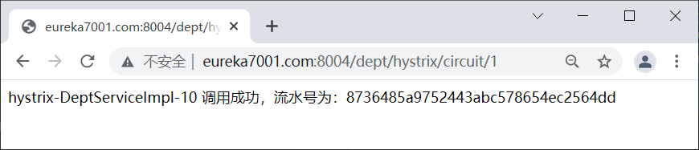
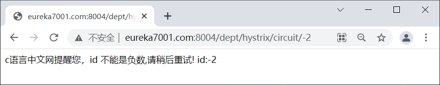
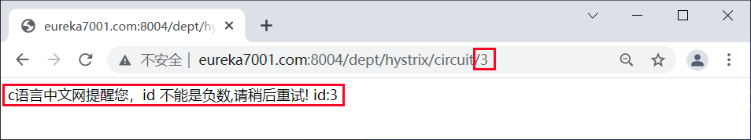
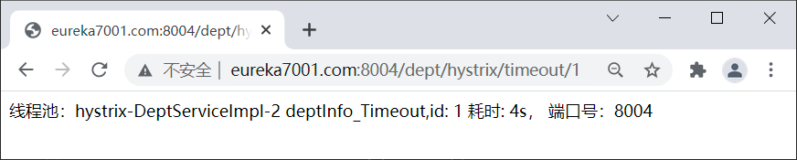
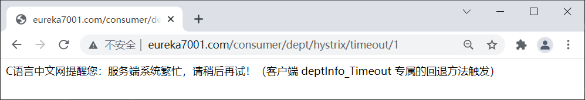
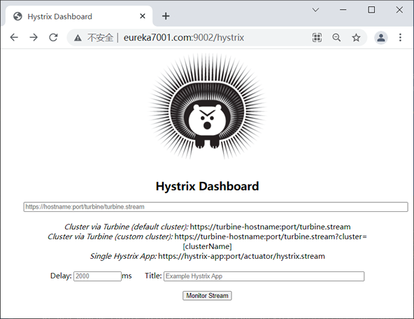
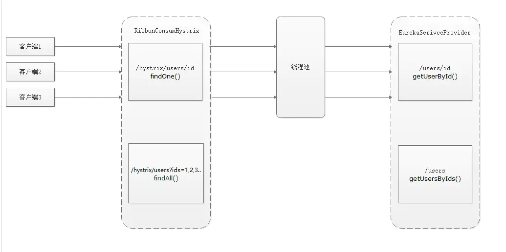
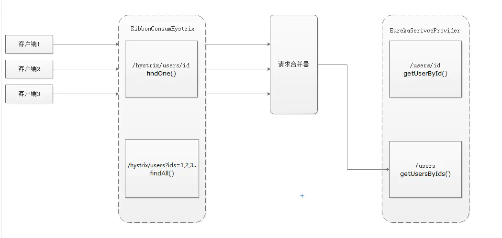

# 什么是Hystrix？
一款针对分布式系统的延迟和容错库，目的是用来隔离分布式服务故障。
它提供线程和信号量隔离，以减少不同服务之间资源竞争带来的相互影响;
提供优雅降级机制;提供熔断机制使得服务可以快速失败，而不是一直阻塞等待服务响应，并能从中快速恢复。
Hystrix通过这些机制来阻止级联失败并保证系统弹性、可用


# 造成雪崩原因可以归结为以下三个：
1，服务提供者不可用（硬件故障，程序Bug，缓存击穿，用户大量请求）
2，重试加大流量（用户重试，代码逻辑重试）
3，服务调用者不可用（同步等待造成的资源耗尽）


# hystrix的出现即为解决雪崩效应，它通过四个方面的机制来解决这个问题
1，隔离（线程池隔离和信号量隔离）：限制调用分布式服务的资源使用，某一个调用的服务出现问题不会影响其他服务调用。
2，服务降级：超时降级、资源不足时(线程或信号量)降级，降级后可以配合降级接口返回托底数据。
3，服务熔断：当失败率达到阀值自动触发降级(如因网络故障/超时造成的失败率高)，熔断器触发的快速失败会进行快速恢复。
4，缓存：提供了请求缓存、请求合并实现。
支持实时监控、报警、控制（修改配置）


# 微服务系统中，Hystrix 能够帮助我们实现以下目标
保护线程资源：防止单个服务的故障耗尽系统中的所有线程资源。
快速失败机制：当某个服务发生了故障，不让服务调用方一直等待，而是直接返回请求失败。
提供降级（FallBack）方案：在请求失败后，提供一个设计好的降级方案，通常是一个兜底方法，当请求失败后即调用该方法。
防止故障扩散：使用熔断机制，防止故障扩散到其他服务。
监控功能：提供熔断器故障监控组件 Hystrix Dashboard，随时监控熔断器的状态。


# 隔离
使用线程隔离或信号隔离的目的是为不同的服务分配一定的资源，当自己的资源用完，直接返回失败而不是占用别人的资源。
1，THREAD（线程隔离）：
    使用该方式，HystrixCommand将会在单独的线程上执行，并发请求受线程池中线程数量的限制。
    为每一个服务接口单独开辟一个线程池，保持与其他服务接口线程的隔离，提高该服务接口的独立性和高可用。
    使用一个线程池来存储当前的请求，线程池对请求作处理，设置任务返回处理超时时间，堆积的请求堆积入线程池队列。
    这种方式需要为每个依赖的服务申请线程池，有一定的资源消耗，好处是可以应对突发流量
    优点：
        1，使用线程池隔离可以完全**隔离依赖的服务**（例如图中的A、B、C服务），请求线程可以快速放回
        2，当线程池出现问题时，**线程池隔离是独立的**，不会影响其他服务接口
        3，当失败的服务再次变得可用时，**线程池将立即清理并可立即恢复**，而不需要一个长时间恢复
        4，独立的线程池提高了**并发行**
    缺点：
        它增加了计算开销（CPU）。每个命令的执行涉及到排队、调度和上下文切换都在一个单独的线程上运行
2，SEMAPHORE（信号量隔离）
    使用该方式，HystrixCommand将会在调用线程上执行，开销相对较小，并发请求受信号量的个数的限制。
    使用一个原子计数器（或信号量）来记录当前有多少个线程在运行，请求来先判断计数器的数值，若超过设置的最大线程个数则丢弃改类型的新请求，
    若不超过则执行计数操作请求来计数器+1，请求返回计数器-1。这种方式是严格的控制线程且立即返回模式，无法应对突发流量
    （流量洪峰来临时，处理的线程超过数量，其他的请求会直接返回，不继续去请求依赖的服务）
配置：hystrix.command.default.execution.isolation.strategy 隔离策略，默认是Thread, 可选Thread｜Semaphore
区别（两种隔离方式只能选其一）：
            线程池隔离	           信号量隔离
    线程	    与调用线程非相同线程	   与调用线程相同（jetty线程）
    开销	    排队、调度、上下文开销等    无线程切换，开销低
    异步	    支持	                   不支持
    并发支持	支持（最大线程池大小）	   支持（最大信号量上限）
什么情况下使用线程池隔离？
    请求并发量大，耗时长（请求耗时长一般是计算量大，或读数据库）
    采用线程隔离策略，这样的话，可以保证大量的容器（tomcat）线程可用
    不会由于服务原因，一直处于阻塞或等待状态，快速返回失败
什么情况下使用信号量隔离
    请求并发量大，耗时短（请求耗时端可能是极端量小，或读缓存）
    采用信号量隔离策略，因为这类服务通常会非常的快，不会占用容器线程太长时间
    而且减少了线程切换的开销，提高了缓存命中率
hystrixCommand线程
    线程池隔离：
        1、调用线程和hystrixCommand线程不是同一个线程，并发请求数受到线程池（不是容器tomcat的线程池，而是hystrixCommand所属于线程组的线程池）中的线程数限制，默认是10。
        2、这个是默认的隔离机制
        3、hystrixCommand线程无法获取到调用线程中的ThreadLocal中的值
    信号量隔离：
        1、调用线程和hystrixCommand线程是同一个线程，默认最大并发请求数是10
        2、调用数度快，开销小，由于和调用线程是处于同一个线程，所以必须确保调用的微服务可用性足够高并且返回快才用


# 熔断
- 开始时断路器处于关闭状态
- 如果调用一段时间持续出错、超式、或者失败频率超过一定限制，断路器打开进入熔断状态，后续一段时间所有请求都会被直接拒绝
- 一段时间以后，保护器会尝试进入半熔断状态(Half-Open)，允许少量请求进来尝试；如果调用仍然失败，则回到熔断状态，如果调用成功，则回到电路闭合状态;
## 主要配置参数：
circuitBreaker.enabled：是否启用熔断器，默认是TRUE。
circuitBreaker.forceOpen：熔断器强制打开，始终保持打开状态，不关注熔断开关的实际状态。默认值FLASE
circuitBreaker.forceClosed：熔断器强制关闭，始终保持关闭状态，不关注熔断开关的实际状态。默认值FLASE。
circuitBreaker.errorThresholdPercentage：错误率，默认值50%，例如一段时间（10s）内有100个请求，其中有54个超时或者异常，那么这段时间内的错误率是54%，大于了默认值50%，这种情况下会触发熔断器打开。
circuitBreaker.requestVolumeThreshold：默认值20。含义是一段时间内至少有20个请求才进行errorThresholdPercentage计算。比如一段时间了有19个请求，且这些请求全部失败了，错误率是100%，但熔断器不会打开，总请求数不满足20。
circuitBreaker.sleepWindowInMilliseconds：半开状态试探睡眠时间，默认值5000ms。如：当熔断器开启5000ms之后，会尝试放过去一部分流量进行试探，确定依赖服务是否恢复。
## 原理：
第一步，调用allowRequest()判断是否允许将请求提交到线程池
    1，如果熔断器强制打开，circuitBreaker.forceOpen为true，不允许放行，返回。
    2，如果熔断器强制关闭，circuitBreaker.forceClosed为true，允许放行。此外不必关注熔断器实际状态，也就是说熔断器仍然会维护统计数据和开关状态，只是不生效而已
第二步，调用isOpen()判断熔断器开关是否打开
    1，如果熔断器开关打开，进入第三步，否则继续；
    2，如果一个周期内总的请求数小于circuitBreaker.requestVolumeThreshold的值，允许请求放行，否则继续；
    3，如果一个周期内错误率小于circuitBreaker.errorThresholdPercentage的值，允许请求放行。否则，打开熔断器开关，进入第三步。
第三步，调用allowSingleTest()判断是否允许单个请求通行，检查依赖服务是否恢复
    1，如果熔断器打开，且距离熔断器打开的时间或上一次试探请求放行的时间超过circuitBreaker.sleepWindowInMilliseconds的值时，熔断器器进入半开状态，允许放行一个试探请求；否则，不允许放行。
## 熔断状态
熔断关闭状态（Closed）：
    当务访问正常时，熔断器处于关闭状态，服务调用方可以正常地对服务进行调用。
熔断开启状态（Open）：
    默认情况下，在固定时间内接口调用出错比率达到一个阈值（例如 50%），熔断器会进入熔断开启状态。
    进入熔断状态后，后续对该服务的调用都会被切断，熔断器会执行本地的降级（FallBack）方法。
半熔断状态（Half-Open）： 
    在熔断开启一段时间之后，熔断器会进入半熔断状态。在半熔断状态下，熔断器会尝试恢复服务调用方对服务的调用，允许部分请求调用该服务，
    并监控其调用成功率。如果成功率达到预期，则说明服务已恢复正常，熔断器进入关闭状态；如果成功率仍旧很低，则重新进入熔断开启状态。

## Hystrix 实现熔断机制
1，当服务的调用出错率达到或超过 Hystix 规定的比率（默认为 50%）后，熔断器进入熔断开启状态。
2，熔断器进入熔断开启状态后，Hystrix 会启动一个休眠时间窗，在这个时间窗内，该服务的降级逻辑会临时充当业务主逻辑，而原来的业务主逻辑不可用。
3，当有请求再次调用该服务时，会直接调用降级逻辑快速地返回失败响应，以避免系统雪崩。
4，当休眠时间窗到期后，Hystrix 会进入半熔断转态，允许部分请求对服务原来的主业务逻辑进行调用，并监控其调用成功率。
5，如果调用成功率达到预期，则说明服务已恢复正常，Hystrix 进入熔断关闭状态，服务原来的主业务逻辑恢复；
    否则 Hystrix 重新进入熔断开启状态，休眠时间窗口重新计时，继续重复第 2 到第 5 步。
## 熔断机制实现
1，在 micro-service-cloud-provider-dept-hystrix-8004 中的 DeptService 接口中添加一个 deptCircuitBreaker() 方法，代码如下。
```java
package net.biancheng.c.service;
public interface DeptService {
    // hystrix 熔断器示例 ok
    public String deptInfo_Ok(Integer id);
    //hystrix 熔断器超时案例
    public String deptInfo_Timeout(Integer id);
    // Hystrix 熔断机制案例
    public String deptCircuitBreaker(Integer id);
}
```
2，在 DeptService 接口的实现类 DeptServiceImpl 添加 deptCircuitBreaker() 的方法实现及其回退方法，代码如下。
```
//Hystrix 熔断案例
@Override
@HystrixCommand(fallbackMethod = "deptCircuitBreaker_fallback", commandProperties = {
        //以下参数在 HystrixCommandProperties 类中有默认配置
        @HystrixProperty(name = "circuitBreaker.enabled", value = "true"), //是否开启熔断器
        @HystrixProperty(name = "metrics.rollingStats.timeInMilliseconds",value = "1000"), //统计时间窗
        @HystrixProperty(name = "circuitBreaker.requestVolumeThreshold", value = "10"), //统计时间窗内请求次数
        @HystrixProperty(name = "circuitBreaker.sleepWindowInMilliseconds", value = "10000"), //休眠时间窗口期
        @HystrixProperty(name = "circuitBreaker.errorThresholdPercentage", value = "60"), //在统计时间窗口期以内，请求失败率达到 60% 时进入熔断状态
})
public String deptCircuitBreaker(Integer id) {
    if (id < 0) {
        //当传入的 id 为负数时，抛出异常，调用降级方法
        throw new RuntimeException("c语言中文网提醒您，id 不能是负数！");
    }
    String serialNum = IdUtil.simpleUUID();
    return Thread.currentThread().getName() + "\t" + "调用成功，流水号为：" + serialNum;
}
//deptCircuitBreaker 的降级方法
public String deptCircuitBreaker_fallback(Integer id) {
    return "c语言中文网提醒您，id 不能是负数,请稍后重试!\t id:" + id;
}
```
在以上代码中，共涉及到了 4 个与 Hystrix 熔断机制相关的重要参数，这 4 个参数的含义如下表。
metrics.rollingStats.timeInMilliseconds：统计时间窗。
circuitBreaker.sleepWindowInMilliseconds：休眠时间窗
    熔断开启状态持续一段时间后，熔断器会自动进入半熔断状态，这段时间就被称为休眠窗口期。
circuitBreaker.requestVolumeThreshold：请求总数阀值。
    在统计时间窗内，请求总数必须到达一定的数量级，Hystrix 才可能会将熔断器打开进入熔断开启转态，而这个请求数量级就是 请求总数阀值。
    Hystrix 请求总数阈值默认为 20，这就意味着在统计时间窗内，如果服务调用次数不足 20 次，即使所有的请求都调用出错，熔断器也不会打开。
circuitBreaker.errorThresholdPercentage：错误百分比阈值。
    当请求总数在统计时间窗内超过了请求总数阀值，且请求调用出错率超过一定的比例，熔断器才会打开进入熔断开启转态，而这个比例就是错误百分比阈值。
    错误百分比阈值设置为 50，就表示错误百分比为 50%，如果服务发生了 30 次调用，其中有 15 次发生了错误，即超过了 50% 的错误百分比，这时候将熔断器就会打开。
3，在 DeptController 中添加一个 deptCircuitBreaker() 方法对外提供服务，代码如下。
```
// Hystrix 服务熔断
@RequestMapping(value = "/dept/hystrix/circuit/{id}")
public String deptCircuitBreaker(@PathVariable("id") Integer id){
    String result = deptService.deptCircuitBreaker(id);
    log.info("result:"+result);
    return result;
}
```
4，重启 micro-service-cloud-provider-dept-hystrix-8004，使用浏览器访问“http://eureka7001.com:8004/dept/hystrix/circuit/1”，结果如下图。

5，浏览器多次（调用次数大于请求总数阀值）访问“http://eureka7001.com:8004/dept/hystrix/circuit/-2”，使调用出错率大于错误百分比阀值，结果下图。

6，重新将参数修改为正数（例如参数为 3），使用浏览器访问“http://eureka7001.com:8004/dept/hystrix/circuit/3”，结果如下图。

通过图 11 可以看到，在熔断开启状态下，即使我们传入的参数已经是正数，调用的依然降级逻辑。
7，继续连续访问“http://eureka7001.com:8004/dept/hystrix/circuit/3”，结果下图。
通过图 12 可以看出，当服务调用正确率上升到一定的利率后，Hystrix 进入熔断关闭状态。


# 降级
Hystrix 提供了服务降级功能，能够保证当前服务不受其他服务故障的影响，提高服务的健壮性。
服务熔断其实是一种过载保护，是指整体资源快不够了，忍痛将某些服务先关掉，待渡过难关，再开启回来。
熔断和降级二者的目标是一致的，目的都是保证上游服务的稳定性。
但其关注的重点并不一样，融断对下层依赖的服务并不级（或者说孰轻孰重），一旦产生故障就断掉；
而降级需要对下层依赖的业务分级，把产生故障的丢了，换一个轻量级的方案，是一种退而求其次的方法。
服务降级的使用场景有以下 2 种：
    1，在服务器压力剧增时，根据实际业务情况及流量，对一些不重要、不紧急的服务进行有策略地不处理或简单处理，从而释放服务器资源以保证核心服务正常运作。
    2，当某些服务不可用时，为了避免长时间等待造成服务卡顿或雪崩效应，而主动执行备用的降级逻辑立刻返回一个友好的提示，以保障主体业务不受影响。
降级的三种模式：
    1，快速模式（最常用的模式）
        调用服务失败了，那么立即失败并返回，通过fallback进行降级，返回静态值。
    2，故障转移（服务级联）
        如果服务调用失败了就调用备用服务，因为备用服务也可能失败，所以也有可能有再下一一级的备用服务，如此形成一个级联
        例如如果服务提供者不响应，则从缓存中取默认数据
    3，主次模式
我们可以通过重写 HystrixCommand 的 getFallBack() 方法或 HystrixObservableCommand 的 resumeWithFallback() 方法，使服务支持服务降级。
Hystrix 服务降级 FallBack 既可以放在服务端进行，也可以放在客户端进行。
Hystrix 会在以下场景下进行服务降级处理：
    - 程序运行异常
    - 服务超时
    - 熔断器处于打开状态
    - 线程池资源耗尽
下面我们就通过一个案例，分别演示下 Hystrix 服务端服务降级和客户端服务降级。
## 服务端服务降级
1，在主工程 spring-cloud-demo2 下创建一个名为 micro-service-cloud-provider-dept-hystrix-8004 的服务提供者，并在其 pom.xml 中添加以下依赖。
```xml
<?xml version="1.0" encoding="UTF-8"?>
<project xmlns="http://maven.apache.org/POM/4.0.0" xmlns:xsi="http://www.w3.org/2001/XMLSchema-instance"
         xsi:schemaLocation="http://maven.apache.org/POM/4.0.0 https://maven.apache.org/xsd/maven-4.0.0.xsd">
    <modelVersion>4.0.0</modelVersion>
    <!--父pom-->
    <parent>
        <artifactId>spring-cloud-demo2</artifactId>
        <groupId>net.biancheng.c</groupId>
        <version>0.0.1-SNAPSHOT</version>
    </parent>

    <groupId>net.biancheng.c</groupId>
    <artifactId>micro-service-cloud-provider-dept-hystrix-8004</artifactId>
    <version>0.0.1-SNAPSHOT</version>
    <name>micro-service-cloud-provider-dept-hystrix-8004</name>
    <description>Demo project for Spring Boot</description>
    <properties>
        <java.version>1.8</java.version>
    </properties>

    <dependencies>
        <dependency>
            <groupId>org.springframework.boot</groupId>
            <artifactId>spring-boot-starter-web</artifactId>
        </dependency>
        <dependency>
            <groupId>org.springframework.boot</groupId>
            <artifactId>spring-boot-devtools</artifactId>
            <scope>runtime</scope>
            <optional>true</optional>
        </dependency>
        <dependency>
            <groupId>org.projectlombok</groupId>
            <artifactId>lombok</artifactId>
            <optional>true</optional>
        </dependency>
        <dependency>
            <groupId>org.springframework.boot</groupId>
            <artifactId>spring-boot-starter-test</artifactId>
            <scope>test</scope>
        </dependency>
        <!--添加 Spring Boot 的监控模块-->
        <dependency>
            <groupId>org.springframework.boot</groupId>
            <artifactId>spring-boot-starter-actuator</artifactId>
        </dependency>
        <!-- eureka 客户端-->
        <dependency>
            <groupId>org.springframework.cloud</groupId>
            <artifactId>spring-cloud-starter-netflix-eureka-client</artifactId>
        </dependency>
        <!--hystrix 依赖-->
        <dependency>
            <groupId>org.springframework.cloud</groupId>
            <artifactId>spring-cloud-starter-netflix-hystrix</artifactId>
        </dependency>
    </dependencies>

    <build>
        <plugins>
            <plugin>
                <groupId>org.springframework.boot</groupId>
                <artifactId>spring-boot-maven-plugin</artifactId>
                <configuration>
                    <excludes>
                        <exclude>
                            <groupId>org.projectlombok</groupId>
                            <artifactId>lombok</artifactId>
                        </exclude>
                    </excludes>
                </configuration>
            </plugin>
        </plugins>
    </build>
</project>
```
2，在类路径（即 /resources 目录）下添加一个配置文件 application.yml，配置内容如下。
```yml
spring:
  application:
    name: microServiceCloudProviderDeptHystrix  #微服务名称，对外暴漏的微服务名称，十分重要
server:
  port: 8004
########################################### Spring cloud 自定义服务名称和 ip 地址###############################################
eureka:
  client: #将客户端注册到 eureka 服务列表内
    service-url:
      #defaultZone: http://eureka7001:7001/eureka  #这个地址是 7001注册中心在 application.yml 中暴露出来额注册地址 （单机版）
      defaultZone: http://eureka7001.com:7001/eureka/,http://eureka7002.com:7002/eureka/,http://eureka7003.com:7003/eureka/  #将服务注册到 Eureka 集群
  instance:
    instance-id: spring-cloud-provider-8004 #自定义服务名称信息
    prefer-ip-address: true  #显示访问路径的 ip 地址
#####################spring cloud 使用 Spring Boot actuator 监控完善信息###########################################
# Spring Boot 2.50对 actuator 监控屏蔽了大多数的节点，只暴露了 heath 节点，本段配置（*）就是为了开启所有的节点
management:
  endpoints:
    web:
      exposure:
        include: "*"   # * 在yaml 文件属于关键字，所以需要加引号
info:
  app.name: micro-service-cloud-provider-dept-hystrix
  company.name: c.biancheng.net
  build.aetifactId: @project.artifactId@
  build.version: @project.version@
```
3，在 net.biancheng.c.service 包下创建一个名为  DeptService 的接口，代码如下。
```java
package net.biancheng.c.service;
public interface DeptService {
    // hystrix 熔断器示例 ok
    public String deptInfo_Ok(Integer id);
    //hystrix 熔断器超时案例
    public String deptInfo_Timeout(Integer id);
}
```
4，在 net.biancheng.c.service.impl 包下，创建 DeptService 接口的实现类 DeptServiceImpl，代码如下。
```java
package net.biancheng.c.service.impl;
import com.netflix.hystrix.contrib.javanica.annotation.HystrixCommand;
import com.netflix.hystrix.contrib.javanica.annotation.HystrixProperty;
import net.biancheng.c.service.DeptService;
import org.springframework.stereotype.Service;
import java.util.concurrent.TimeUnit;
@Service("deptService")
public class DeptServiceImpl implements DeptService {
    @Override
    public String deptInfo_Ok(Integer id) {
        return "线程池：" + Thread.currentThread().getName() + "  deptInfo_Ok,id:   " + id;
    }
    //一旦该方法失败并抛出了异常信息后，会自动调用  @HystrixCommand 注解标注的 fallbackMethod 指定的方法
    @HystrixCommand(fallbackMethod = "dept_TimeoutHandler",
            commandProperties =
                    //规定 5 秒钟以内就不报错，正常运行，超过 5 秒就报错，调用指定的方法
                    {@HystrixProperty(name = "execution.isolation.thread.timeoutInMilliseconds", value = "5000")})
    @Override
    public String deptInfo_Timeout(Integer id) {
        int outTime = 6;
        try {
            TimeUnit.SECONDS.sleep(outTime);
        } catch (InterruptedException e) {
            e.printStackTrace();
        }
        return "线程池：" + Thread.currentThread().getName() + "  deptInfo_Timeout,id:   " + id + "  耗时: " + outTime;
    }
    // 当服务出现故障后，调用该方法给出友好提示
    public String dept_TimeoutHandler(Integer id) {
       return  "C语言中文网提醒您，系统繁忙请稍后再试！"+"线程池：" + Thread.currentThread().getName() + "  deptInfo_Timeout,id:   " + id;
    }
}
```
我们可以看到 deptInfo_Timeout() 方法上使用 @HystrixCommand 注解，该注解说明如下：
- 参数 fallbackMethod 属性用于指定降级方法。
- 参数 execution.isolation.thread.timeoutInMilliseconds 用于设置自身调用超时时间的峰值，峰值内可以正常运行，否则执行降级方法
5，在 net.biancheng.c.controller 包下创建一个名为 DeptController 的 Controller 类，代码如下。
```java
package net.biancheng.c.controller;
import lombok.extern.slf4j.Slf4j;
import net.biancheng.c.service.DeptService;
import org.springframework.beans.factory.annotation.Autowired;
import org.springframework.beans.factory.annotation.Value;
import org.springframework.web.bind.annotation.*;
@RestController
@Slf4j
public class DeptController {
    @Autowired
    private DeptService deptService;
    @Value("${server.port}")
    private String serverPort;
    @RequestMapping(value = "/dept/hystrix/ok/{id}")
    public String deptInfo_Ok(@PathVariable("id") Integer id) {
        String result = deptService.deptInfo_Ok(id);
        log.info("端口号：" + serverPort + " result:" + result);
        return result + "，   端口号：" + serverPort;
    }
    // Hystrix 服务超时降级
    @RequestMapping(value = "/dept/hystrix/timeout/{id}")
    public String deptInfo_Timeout(@PathVariable("id") Integer id) {
        String result = deptService.deptInfo_Timeout(id);
        log.info("端口号：" + serverPort + " result:" + result);
        return result + "，   端口号：" + serverPort;
    }
}
```
6，在 micro-service-cloud-provider-dept-hystrix-8004 的主启动类上，使用 @EnableCircuitBreaker 注解开启熔断器功能，代码如下。
```java
package net.biancheng.c;
import org.springframework.boot.SpringApplication;
import org.springframework.boot.autoconfigure.SpringBootApplication;
import org.springframework.cloud.client.circuitbreaker.EnableCircuitBreaker;
import org.springframework.cloud.netflix.eureka.EnableEurekaClient;
@SpringBootApplication
@EnableEurekaClient //开启 Eureka 客户端功能
@EnableCircuitBreaker //激活熔断器功能
public class MicroServiceCloudProviderDeptHystrix8004Application {
    public static void main(String[] args) {
        SpringApplication.run(MicroServiceCloudProviderDeptHystrix8004Application.class, args);
    }
}
```

## 客户端服务降级
我们都会在客户端进行服务降级，当客户端调用的服务端的服务不可用时，客户端直接进行服务降级处理，避免其线程被长时间、不必要地占用。
1，在 micro-service-cloud-consumer-dept-feign 的 pom.xml 中添加 Hystrix 的依赖，代码如下。
```xml
<!--hystrix 依赖-->
<dependency>
    <groupId>org.springframework.cloud</groupId>
    <artifactId>spring-cloud-starter-netflix-hystrix</artifactId>
</dependency>
```
2，在 micro-service-cloud-consumer-dept-feign 的 application.yml 中添加以下配置，开启客户端的 Hystrix 功能。
```yml
feign:
  hystrix:
    enabled: true #开启客户端 hystrix
```
3，在 net.biancheng.c.service 包下，创建一个名为 DeptHystrixService 的服务绑定接口，与 micro-service-cloud-provider-dept-hystrix-8004 中提供的服务接口进行绑定，代码如下。
```java
package net.biancheng.c.service;
import org.springframework.cloud.openfeign.FeignClient;
import org.springframework.stereotype.Component;
import org.springframework.web.bind.annotation.PathVariable;
import org.springframework.web.bind.annotation.RequestMapping;
@Component
@FeignClient(value = "MICROSERVICECLOUDPROVIDERDEPTHYSTRIX")
public interface DeptHystrixService {
    @RequestMapping(value = "/dept/hystrix/ok/{id}")
    public String deptInfo_Ok(@PathVariable("id") Integer id);
    @RequestMapping(value = "/dept/hystrix/timeout/{id}")
    public String deptInfo_Timeout(@PathVariable("id") Integer id);
}
```
4，在 net.biancheng.c.controller 包下创建一个名为 HystrixController_Consumer 的 Controller ，代码如下。
```java
package net.biancheng.c.controller;
import com.netflix.hystrix.contrib.javanica.annotation.DefaultProperties;
import com.netflix.hystrix.contrib.javanica.annotation.HystrixCommand;;
import lombok.extern.slf4j.Slf4j;
import net.biancheng.c.service.DeptHystrixService;
import org.springframework.web.bind.annotation.PathVariable;
import org.springframework.web.bind.annotation.RequestMapping;
import org.springframework.web.bind.annotation.RestController;
import javax.annotation.Resource;
@Slf4j
@RestController
public class HystrixController_Consumer {
    @Resource
    private DeptHystrixService deptHystrixService;
    @RequestMapping(value = "/consumer/dept/hystrix/ok/{id}")
    public String deptInfo_Ok(@PathVariable("id") Integer id) {
        return deptHystrixService.deptInfo_Ok(id);
    }
    //在客户端进行降级
    @RequestMapping(value = "/consumer/dept/hystrix/timeout/{id}")
    @HystrixCommand(fallbackMethod = "dept_TimeoutHandler") //为该请求指定专属的回退方法
    public String deptInfo_Timeout(@PathVariable("id") Integer id) {
        String s = deptHystrixService.deptInfo_Timeout(id);
        log.info(s);
        return s;
    }
    // deptInfo_Timeout方法的 专用 fallback 方法
    public String dept_TimeoutHandler(@PathVariable("id") Integer id) {
        log.info("deptInfo_Timeout 出错，服务已被降级！");
        return "C语言中文网提醒您：服务端系统繁忙，请稍后再试！（客户端 deptInfo_Timeout 专属的回退方法触发）";
    }
}
```
6，在配置文件 appliction.yml 中添加以下配置，在客户端配置请求超时的时间。
```yml
######################### Ribbon 客户端超时控制 ###################################
ribbon:
  ReadTimeout: 6000 #建立连接所用的时间，适用于网络状况正常的情况下，两端两端连接所用的时间
  ConnectionTimeout: 6000 #建立连接后，服务器读取到可用资源的时间
######################配置请求超时时间##########################
hystrix:
  command:
    default:
      execution:
        isolation:
          thread:
            timeoutInMilliseconds: 7000
####################配置具体方法超时时间 为 3 秒########################
    DeptHystrixService#deptInfo_Timeout(Integer):
      execution:
        isolation:
          thread:
            timeoutInMilliseconds: 3000
```
在配置文件中设计请求的超时时间时，需要注意以下 2 点：
（1）Hystrix 可以来为所有请求（方法）设置超时时间（单位为毫秒），若请求超时则触发全局的回退方法进行处理。
```hystrix.command.default.execution.isolation.thread.timeoutInMilliseconds=mmm```
（2）Hystrix 还可以为某个特定的服务请求（方法）设置超时时间，格式如下：
```hystrix.command.xxx#yyy(zzz).execution.isolation.thread.timeoutInMilliseconds=mmm```
格式说明如下：
xxx：为包含该服务方法的类的名称（通常为服务绑定接口的名称），例如 DeptHystrixService 接口。
yyy：服务方法名，例如 deptInfo_Timeout() 方法。
zzz：方法内的参数类型，例如 Integer、String 等等
mmm：要设置的超时时间，单位为毫秒（1 秒 =1000 毫秒）
6，在 micro-service-cloud-consumer-dept-feign 的主启动类上，使用 @EnableHystrix 注解开启客户端 Hystrix 功能，代码如下。
```java
package net.biancheng.c;
import org.springframework.boot.SpringApplication;
import org.springframework.boot.autoconfigure.SpringBootApplication;
import org.springframework.cloud.netflix.hystrix.EnableHystrix;
import org.springframework.cloud.openfeign.EnableFeignClients;
@SpringBootApplication
@EnableFeignClients //开启 OpenFeign 功能
@EnableHystrix //启用 Hystrix
public class MicroServiceCloudConsumerDeptFeignApplication {
    public static void main(String[] args) {
        SpringApplication.run(MicroServiceCloudConsumerDeptFeignApplication.class, args);
    }
}
```
7，修改 micro-service-cloud-provider-dept-hystrix-8004 中 DeptServiceImpl 的代码，将 deptInfo_Timeout() 方法的运行时间修改为 4 秒（小于超时时间 5 秒），以保证服务端请求正常不被降级，代码如下。
```
//一旦该方法失败并抛出了异常信息后，会自动调用  @HystrixCommand 注解标注的 fallbackMethod 指定的方法
@HystrixCommand(fallbackMethod = "dept_TimeoutHandler",
        commandProperties =
                //规定 5 秒钟以内就不报错，正常运行，超过 5 秒就报错，调用指定的方法
                {@HystrixProperty(name = "execution.isolation.thread.timeoutInMilliseconds", value = "5000")})
@Override
public String deptInfo_Timeout(Integer id) {
    int outTime = 4;
    try {
        TimeUnit.SECONDS.sleep(outTime);
    } catch (InterruptedException e) {
        e.printStackTrace();
    }
    return "线程池：" + Thread.currentThread().getName() + "  deptInfo_Timeout,id:   " + id + "  耗时: " + outTime;
}
```
8，重启 micro-service-cloud-provider-dept-hystrix-8004 和 micro-service-cloud-consumer-dept-feign，使用浏览器访问“http://eureka7001.com:8004/dept/hystrix/timeout/1”，直接调用服务端的 deptInfo_Timeout() 方法，结果如下图。

9，使用浏览器访问“http://eureka7001.com/consumer/dept/hystrix/timeout/1”，结果如下图。

由图 5 可以看出，由于服务请求的耗时为 4 秒，超过了客户端为该请求指定的超时时间 （3 秒 ），因此该服务被降级处理，触发了其指定的回退方法。


## 全局降级方法
通过上面的方式实现服务降级时，需要针对所有业务方法都配置降级方法，这极有可能会造成代码的急剧膨胀。
为了解决该问题，我们还可以为所有业务方法指定一个全局的回退方法，具体步骤如下。
1，在 HystrixController_Consumer 的类名上标注 @DefaultProperties 注解，并通过其 defaultFallback 属性指定一个全局的降级方法，代码如下。
```
@Slf4j
@RestController
@DefaultProperties(defaultFallback = "dept_Global_FallbackMethod") //全局的服务降级方法
public class HystrixController_Consumer {
……
}
```
2，在 HystrixController_Consumer 中，创建一个名为 dept_Global_FallbackMethod 的全局回方法，代码如下。
```
/**
 * 全局的 fallback 方法，
 * 回退方法必须和 hystrix 的执行方法在相同类中
 * @DefaultProperties(defaultFallback = "dept_Global_FallbackMethod") 类上注解，请求方法上使用 @HystrixCommand 注解
 */
public String dept_Global_FallbackMethod() {
    return "C语言中文网提醒您，运行出错或服务端系统繁忙，请稍后再试！（客户端全局回退方法触发,）";
}
```
注意：降级（FallBack）方法必须与其对应的业务方法在同一个类中，否则无法生效。
3，在所有的业务方法上都标注 @HystrixCommand 注解，这里我们将 deptInfo_Timeout() 方法上的 @HystrixCommand(fallbackMethod = "dept_TimeoutHandler") 修改为 @HystrixCommand 即可，代码如下。
```
//在客户端进行降级
@RequestMapping(value = "/consumer/dept/hystrix/timeout/{id}")
@HystrixCommand
public String deptInfo_Timeout(@PathVariable("id") Integer id) {
    String s = deptHystrixService.deptInfo_Timeout(id);
    log.info(s);
    return s;
}
```
注意：全局降级方法的优先级较低，只有业务方法没有指定其降级方法时，服务降级时才会触发全局回退方法。
若业务方法指定它自己的回退方法，那么在服务降级时，就只会直接触发它自己的回退方法，而非全局回退方法。

## 解耦降级逻辑
不管是业务方法指定的降级方法还是全局降级方法，它们都必须和业务方法在同一个类中才能生效，业务逻辑与降级逻辑耦合度极高。
下面我们对业务逻辑与降级逻辑进行解耦，操作步骤如下。
1，在 micro-service-cloud-consumer-dept-feign 的 net.biancheng.c.service 包下，新建 DeptHystrixService 接口的实现类 DeptHystrixFallBackService，统一为 DeptHystrixService 中的方法提供服务降级处理 ，代码如下。
```java
package net.biancheng.c.service;
import org.springframework.stereotype.Component;
/**
* Hystrix 服务降级
* 解耦回退逻辑
*/
@Component
public class DeptHystrixFallBackService implements DeptHystrixService {
    @Override
    public String deptInfo_Ok(Integer id) {
        return "--------------------C语言中文网提醒您，系统繁忙，请稍后重试！（解耦回退方法触发）-----------------------";
    }
    @Override
    public String deptInfo_Timeout(Integer id) {
        return "--------------------C语言中文网提醒您，系统繁忙，请稍后重试！（解耦回退方法触发）-----------------------";
    }
}
```
该类必须以组件的形式添加 Spring 容器中才能生效，最常用的方式就是在类上标注 @Component 注解。
2，在服务绑定接口 DeptHystrixService 标注的 @FeignClient 注解中添加 fallback 属性，属性值为 DeptHystrixFallBackService.class，代码如下。
```java
package net.biancheng.c.service;
import org.springframework.cloud.openfeign.FeignClient;
import org.springframework.stereotype.Component;
import org.springframework.web.bind.annotation.PathVariable;
import org.springframework.web.bind.annotation.RequestMapping;
@Component
@FeignClient(value = "MICROSERVICECLOUDPROVIDERDEPTHYSTRIX", fallback = DeptHystrixFallBackService.class)
public interface DeptHystrixService {
    @RequestMapping(value = "/dept/hystrix/ok/{id}")
    public String deptInfo_Ok(@PathVariable("id") Integer id);
    @RequestMapping(value = "/dept/hystrix/timeout/{id}")
    public String deptInfo_Timeout(@PathVariable("id") Integer id);
}
```


# Hystrix 故障监控
Hystrix 还提供了准实时的调用监控（Hystrix Dashboard）功能，Hystrix 会持续地记录所有通过 Hystrix 发起的请求的执行信息，并以统计报表的形式展示给用户，包括每秒执行请求的数量、成功请求的数量和失败请求的数量等。

下面我们就通过一个实例来搭建 Hystrix Dashboard，监控 micro-service-cloud-provider-dept-hystrix-8004 的运行情况。

1，在父工程下新建一个名为 micro-service-cloud-consumer-dept-hystrix-dashboard-9002 的子模块，并在其 pom.xml 中添加以下依赖。
```xml
<?xml version="1.0" encoding="UTF-8"?>
<project xmlns="http://maven.apache.org/POM/4.0.0" xmlns:xsi="http://www.w3.org/2001/XMLSchema-instance"
         xsi:schemaLocation="http://maven.apache.org/POM/4.0.0 https://maven.apache.org/xsd/maven-4.0.0.xsd">
    <modelVersion>4.0.0</modelVersion>
    <parent>
        <artifactId>spring-cloud-demo2</artifactId>
        <groupId>net.biancheng.c</groupId>
        <version>0.0.1-SNAPSHOT</version>
    </parent>
    <groupId>net.biancheng.c</groupId>
    <artifactId>micro-service-cloud-consumer-dept-hystrix-dashboard-9002</artifactId>
    <version>0.0.1-SNAPSHOT</version>
    <name>micro-service-cloud-consumer-dept-hystrix-dashboard-9002</name>
    <description>Demo project for Spring Boot</description>
    <properties>
        <java.version>1.8</java.version>
    </properties>
    <dependencies>
        <dependency>
            <groupId>org.springframework.boot</groupId>
            <artifactId>spring-boot-starter</artifactId>
        </dependency>
        <!--Spring Boot 测试依赖-->
        <dependency>
            <groupId>org.springframework.boot</groupId>
            <artifactId>spring-boot-starter-test</artifactId>
            <scope>test</scope>
        </dependency>
        <!--hystrix-dashboard 监控的依赖-->
        <dependency>
            <groupId>org.springframework.cloud</groupId>
            <artifactId>spring-cloud-starter-netflix-hystrix-dashboard</artifactId>
        </dependency>
        <!--添加 Spring Boot 的监控模块-->
        <dependency>
            <groupId>org.springframework.boot</groupId>
            <artifactId>spring-boot-starter-actuator</artifactId>
        </dependency>
        <dependency>
            <groupId>org.springframework.boot</groupId>
            <artifactId>spring-boot-devtools</artifactId>
        </dependency>
        <dependency>
            <groupId>org.projectlombok</groupId>
            <artifactId>lombok</artifactId>
        </dependency>
    </dependencies>

    <build>
        <plugins>
            <plugin>
                <groupId>org.springframework.boot</groupId>
                <artifactId>spring-boot-maven-plugin</artifactId>
            </plugin>
        </plugins>
    </build>
</project>
```
2，在 micro-service-cloud-consumer-dept-hystrix-dashboard-9002 的 application.yml 中添加以下配置。
```yml
server:
  port: 9002  #端口号
#http://eureka7001.com:9002/hystrix 熔断器监控页面
# localhost:8004//actuator/hystrix.stream 监控地址
hystrix:
  dashboard:
    proxy-stream-allow-list:
      - "localhost"
```
3，在 micro-service-cloud-consumer-dept-hystrix-dashboard-9002 的主启动类上添加 @EnableHystrixDashboard 注解，开启 Hystrix 监控功能，代码如下。
```java
package net.biancheng.c;
import org.springframework.boot.SpringApplication;
import org.springframework.boot.autoconfigure.SpringBootApplication;
import org.springframework.cloud.netflix.hystrix.dashboard.EnableHystrixDashboard;
@SpringBootApplication
@EnableHystrixDashboard
public class MicroServiceCloudConsumerDeptHystrixDashboard9002Application {
    public static void main(String[] args) {
        SpringApplication.run(MicroServiceCloudConsumerDeptHystrixDashboard9002Application.class, args);
    }
}
```
4，在 micro-service-cloud-provider-dept-hystrix-8004 的 net.biancheng.c.config 包下，创建一个名为 HystrixDashboardConfig 的配置类，代码如下。
```java
package net.biancheng.c.config;
import com.netflix.hystrix.contrib.metrics.eventstream.HystrixMetricsStreamServlet;
import org.springframework.boot.web.servlet.ServletRegistrationBean;
import org.springframework.context.annotation.Bean;
import org.springframework.context.annotation.Configuration;
@Configuration
public class HystrixDashboardConfig {
    /**
     *  Hystrix dashboard 监控界面必须配置
     * @return
     */
    @Bean
    public ServletRegistrationBean getServlet() {
        HystrixMetricsStreamServlet streamServlet = new HystrixMetricsStreamServlet();
        ServletRegistrationBean registrationBean = new ServletRegistrationBean(streamServlet);
        registrationBean.setLoadOnStartup(1);
        registrationBean.addUrlMappings("/actuator/hystrix.stream");//访问路径
        registrationBean.setName("hystrix.stream");
        return registrationBean;
    }
}
```
5，启动 micro-service-cloud-consumer-dept-hystrix-dashboard-9002，使用浏览器访问“http://eureka7001.com:9002/hystrix”，结果如下图。



# Hystrix请求合并
Hystrix请求合并用于应对服务器的高并发场景，通过合并请求，减少线程的创建和使用，降低服务器请求压力，提高在高并发场景下服务的吞吐量和并发能力

正常的分布式请求中，客户端发送请求，服务器在接受请求后，向服务提供者发送请求获取数据
这种模式在高并发的场景下就会导致线程池有大量的线程处于等待状态,从而导致响应缓慢
同时线程池的资源也是有限的，每一个请求都分配一个资源，也是无谓的消耗了很多服务器资源
在这种场景下我们可以通过使用hystrix的请求合并来降低对提供者过多的访问，减少线程池资源的消耗从而提高系统的吞吐量和响应速度

请求合并可以通过构建类和添加注解的方式实现，这里我们先说通过构建合并类的方式实现请求合并
## 请求合并的实现类
请求合并的实现包含了两个主要实现类，一个是合并请求类，一个是批量处理类
合并请求类的作用是收集一定时间内的请求，将他们传递的参数汇总，然后调用批量处理类
通过向服务调用者发送请求获取批量处理的结果数据，最后在对应的request方法体中依次封装获取的结果，并返回回去
1，请求合并类
```java
public class UserCollapseCommand extends HystrixCollapser<List<UserInfo>,UserInfo,Integer> {

    private CacheServiceImpl service;
    private Integer userId;

    /**
     * 构造方法，主要是用来设置合并器的时间，多长时间合并一次请求
     * @param cacheService 调用的服务
     * @param userId 单次需要传递的业务id
     */
    public UserCollapseCommand(CacheServiceImpl cacheService, Integer userId){
        super(Setter.withCollapserKey(HystrixCollapserKey.Factory.asKey("userCollapseCommand")).
                andCollapserPropertiesDefaults(HystrixCollapserProperties.Setter().withTimerDelayInMilliseconds(100)));
        this.service = cacheService;
        this.userId = userId;
    }


    @Override
    public Integer getRequestArgument() {
        return userId;
    }

    /**
     * 获取传入的业务参数集合，调用执行方法执行批量请求
     * @param collapsedRequests
     * @return
     */
    @Override
    protected HystrixCommand<List<UserInfo>> createCommand(Collection<CollapsedRequest<UserInfo, Integer>> collapsedRequests) {
        System.out.println("HystrixCommandHystrixCommand========>");
        //按请求数声名UserId的集合
        List<Integer> userIds = new ArrayList<>(collapsedRequests.size());
        //通过请求将100毫秒中的请求参数取出来装进集合中
        userIds.addAll(collapsedRequests.stream().map(CollapsedRequest::getArgument).collect(Collectors.toList()));
        //返回UserBatchCommand对象，自动执行UserBatchCommand的run方法
        HystrixCommand<List<UserInfo>> a=new UserBatchCommand(service, userIds);
        return a;
    }

    /**
     * 返回请求的执行结果，并根据对应的request将结果返回到对应的request相应体中
     * 通过循环所有被合并的请求依次从批处理的结果集中获取对应的结果
     * @param userInfos 这里是批处理后返回的结果集
     * @param collection 所有被合并的请求
     */
    @Override
    protected void mapResponseToRequests(List<UserInfo> userInfos, Collection<CollapsedRequest<UserInfo, Integer>> collection) {
        int count = 0 ;
        for(CollapsedRequest<UserInfo,Integer> collapsedRequest : collection){
            //从批响应集合中按顺序取出结果
            UserInfo user = userInfos.get(count++);
            //将结果放回原Request的响应体内
            collapsedRequest.setResponse(user);
        }
    }
}
```
通过创建构造方法来设置合并器的收集时间，也就是合并器一次收集客户端请求的时间是多久
然后通过收集请求器获取在这段时间内收集的所有请求参数，在传递给批量执行程序去批量执行,mapResponseToRequests方法获取返回的结果
并根据对应的request请求将结果返回到对应的request请求中
2，批量处理类
```java
public class UserBatchCommand extends HystrixCommand<List<UserInfo>> {

    private static final Logger LOGGER = LoggerFactory.getLogger(UserBatchCommand.class);

    private CacheServiceImpl service;

    private List<Integer> ids;

    public UserBatchCommand(CacheServiceImpl cacheService, List<Integer> ids){
        super(Setter.withGroupKey(HystrixCommandGroupKey.Factory.asKey("ExampleGroup")).
                andCommandKey(HystrixCommandKey.Factory.asKey("GetValueForKey")));
        this.service =cacheService ;
        this.ids = ids;
    }

    /**
     * 调用批量处理的方法
     * @return
     */
    @Override
    protected List<UserInfo> run() {
        List<UserInfo> users = service.findAll(ids);
        return users;
    }

    /**
     * Fallback回调方法，如果没有会报错
     */
    @Override
    protected List<UserInfo> getFallback(){
        System.out.println("UserBatchCommand的run方法，调用失败");
        return null;
    }
}
```
3，API调用实现请求合并
```java
public class CollapseTest extends HystrixCommand<List<UserInfo>> {

    /**
     * 模拟合并请求测试(非注解)
     * 这里通过
     */
    @GetMapping("/collapse")
    public void collapseTest() {
        System.out.println("==========>collapseTest方法执行了");
        HystrixRequestContext context = HystrixRequestContext.initializeContext();
        try {
            Future<UserInfo> f1 = new UserCollapseCommand(cacheService, 1).queue();
            Future<UserInfo> f2 = new UserCollapseCommand(cacheService, 2).queue();
            Future<UserInfo> f3 = new UserCollapseCommand(cacheService, 3).queue();

            Thread.sleep(3000);

            Future<UserInfo> f4 = new UserCollapseCommand(cacheService, 5).queue();
            Future<UserInfo> f5 = new UserCollapseCommand(cacheService, 6).queue();

            UserInfo u1 = f1.get();
            UserInfo u2 = f2.get();
            UserInfo u3 = f3.get();

            UserInfo u4 = f4.get();
            UserInfo u5 = f5.get();
            System.out.println(u1.getName());
            System.out.println(u2.getName());
            System.out.println(u3.getName());
            System.out.println(u4.getName());
            System.out.println(u5.getName());
        } catch (Exception e) {
            e.printStackTrace();
        } finally {
            context.close();
        }

    }
}
```


# 请求缓存
请求缓存是对一次请求的数据进行缓存，当有新的请求进来的时候，将会进行初始化操作，保证读取到的数据是最新的而不是上次缓存的数据
hystrix就是去缓存一次请求中相同cachekey的查询结果
**不建议使用，对问题排查会造成很大的困扰**
使用：
    @CacheResult:标记这是一个执行缓存的方法，其结果将会被缓存,需要注意的是，该注解需要配合HystrixCommand注解使用
    @CacheKey:这个注解会对请求参数进行标记，相同参数将会获取缓存得到的结果
    ```
    @Override
    @CacheResult
    @HystrixCommand(commandKey = "commandKey2")
    public Integer getRandomInteger(@CacheKey int id) {
        Integer a1=storeClient.getRandomInteger();
        return a1;
    }
    ```


# 运行流程
1，两个核心代理HystrixCommand,HystrixObservableCommand，任何依赖的服务只需要继承这两个类就可以了。
（其中HystrixObservableCommand使用观察者模式）
2，HystrixCommand 可以采用同步调用和异步调用，异步返回Future对象（还未直接支持CompletebleFuture）
如果开启了缓存，则会根据GroupKey,Commandkey以及cachedKey确定是否存在缓存（不建议使用）
3，判断断路器是否开启，开启则直接调用getFallback,
4，判断是否满足信号量隔离或线程池隔离的条件，如果隔离则抛异常
5，执行run方法
6，metrics包含了一个计数器，用来计算当前服务的状态，无论是成功调用，还是抛异常都会记录数据
7，执行降级策略


# HystrixCollapser(请求合并器)
微服务架构中通常需要依赖多个远程的微服务，而远程调用中最常见的问题就是通信消耗与连接数占用。在高并发的情况之下，因通信次数的增加，总的通信时间消耗将会变得越来越长。同时，因为依赖服务的线程池资源有限，将出现排队等待与响应延迟的清况。
为了优化这两个问题，Hystrix 提供了HystrixCollapser来实现请求的合并，以减少通信消耗和线程数的占用。
HystrixCollapser实现了在 HystrixCommand之前放置一个合并处理器，将处于一个很短的时间窗(默认10毫秒)内对同一依赖服务的多个请求进行整合，
并以批量方式发起请求的功能(前提是服务提供方提供相应的批量接口)。HystrixCollapser的封装多个请求合并发送的具体细节，开发者只需关注将业务上将单次请求合并成多次请求即可。
1，合并请求会有开销
    用于请求合并的延迟时间窗会使得依赖服务的请求延迟增高，比如，某个请求不通过请求合并器访问的平均耗时为5ms，请求合并的延迟时间窗为lOms (默认值)， 那么当该请求设置了请求合并器之后，最坏情况下(在延迟时间 窗结束时才发起请求)该请求需要15ms才能完成。
2，什么时候使用合并请求
    合并请求存在额外开销，所以需要根据依赖服务调用的实际情况决定是否使用此功能，主要考虑下面两个方面：
        （1）请求命令本身的延迟
            如果依赖服务的请求命令本身是一个高延迟的命令，那么就可以使用请求合并器，因为延迟时间窗的时间消耗微不足道
        （2）并发量
            时间窗口内并发量大，合并请求的性能提示越明显。如果一段时间内只有少数几个请求，那么就不适合请求合并器
            相反，如果一个时间窗内有很高的并发量，那么使用请求合并器是可以的


# 服务熔断和服务降级的区别
##服务降级：系统有限的资源的合理协调
概念
    服务降级一般指服务压力剧增的时候，根据实际业务使用情况以及流量，对一些服务和页面有策略的不处理或者用一种简单的方式进行处理
    从而释放服务器资源以保证核心业务正常高效运行。
原因：
    服务器的资源是有限的，而请求是无限的。在用户使用即并发高峰期，会影响整体服务的性能，严重的话会导致宕机，以至于某些重要服务不可用。
    故高峰期为了保证核心功能服务的可用性，就需要对某些服务降级处理。可以理解为舍小保大
应用场景：
    多用于微服务架构中，一般当整个微服务架构整体的负载超出了预设的上限阈值（和服务器的配置性能有关系），或者即将到来的流量预计会超过预设的阈值时（比如双11、6.18等活动或者秒杀活动）
服务降级是从整个系统的负荷情况出发和考虑的，对某些负荷会比较高的情况，为了预防某些功能（业务场景）出现负荷过载或者响应慢的情况
在其内部暂时舍弃对一些非核心的接口和数据的请求，而直接返回一个提前准备好的fallback（退路）错误处理信息
这样，虽然提供的是一个有损的服务，但却保证了整个系统的稳定性和可用性。
需要考虑的问题：
    区分那些服务为核心？那些非核心
    降级策略（处理方式，一般指如何给用户友好的提示或者操作）
    自动降级还是手动降
## 服务熔断：应对雪崩效应的链路自我保护机制。可看作降级的特殊情况
概念：
    应对微服务雪崩效应的一种链路保护机制，类似股市、保险丝
原因：
    微服务之间的数据交互是通过远程调用来完成的。
    服务A调用服务，服务B调用服务c，某一时间链路上对服务C的调用响应时间过长或者服务C不可用
    随着时间的增长，对服务C的调用也越来越多，然后服务C崩溃了，但是链路调用还在
    对服务B的调用也在持续增多，然后服务B崩溃，随之A也崩溃，导致雪崩效应
- 服务熔断是应对雪崩效应的一种微服务链路保护机制。例如在高压电路中，如果某个地方的电压过高，熔断器就会熔断，对电路进行保护。
同样，在微服务架构中，熔断机制也是起着类似的作用。当调用链路的某个微服务不可用或者响应时间太长时，会进行服务熔断
不再有该节点微服务的调用，快速返回错误的响应信息。当检测到该节点微服务调用响应正常后，恢复调用链路。

在Spring Cloud框架中，熔断机制通过Hystrix实现。Hystrix会监控微服务调用的情况，当失败的调用到一定阈值缺省是5秒内20次调用失败，就会启动熔断机制。

需要考虑的问题：
    - 如何探知所依赖的服务对象不稳定
    - 失败之后如何快速恢复依赖对象，如何探知依赖对象是否恢复
## 服务降级和服务熔断区别
1，触发原因不一样，服务熔断由链路上某个服务引起的，服务降级是从整体的负载考虑
2，管理目标层次不一样，服务熔断是一个框架层次的处理，服务降级是业务层次的处理
3，实现方式不一样，服务熔断一般是自我熔断恢复，服务降级相当于人工控制
4，触发原因不同 服务熔断一般是某个服务（下游服务）故障引起，而服务降级一般是从整体负荷考虑；
一句话：
    服务熔断是应对系统服务雪崩的一种保险措施，给出的一种特殊降级措施。而服务降级则是更加宽泛的概念，主要是对系统整体资源的合理分配以应对压力。
限流：限制并发的请求访问量，超过阈值则拒绝；
降级：服务分优先级，牺牲非核心服务（不可用），保证核心服务稳定；从整体负荷考虑；
熔断：依赖的下游服务故障触发熔断，避免引发本系统崩溃；系统自动执行和恢复