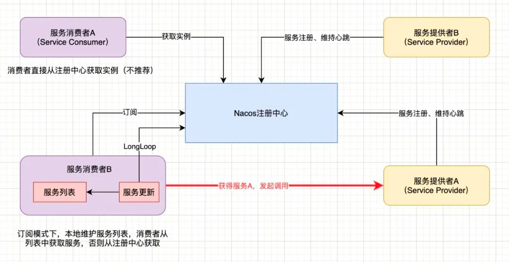
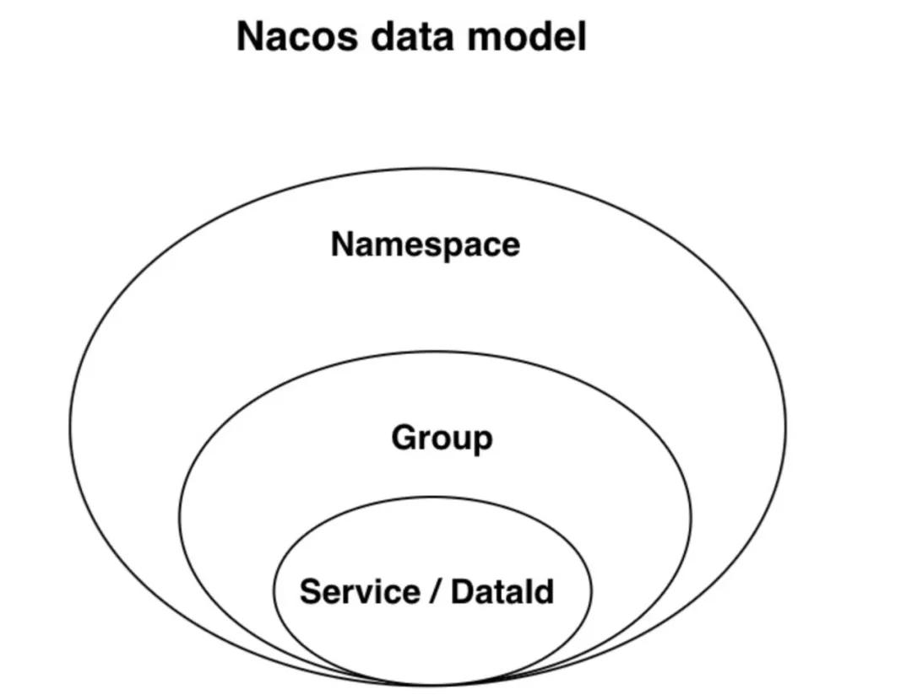
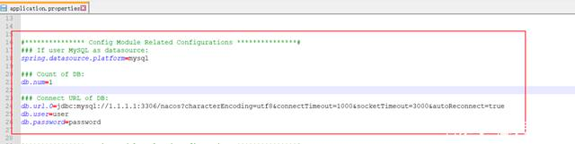
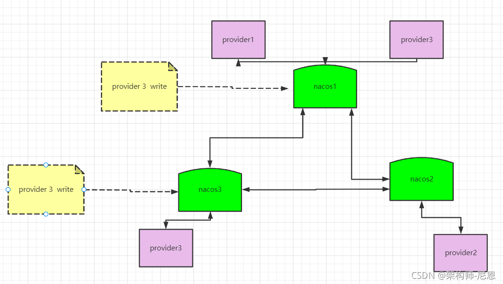

# Nacos简介
Nacos一般读作/nɑ:k??s/，这个名字来源于“Dynamic Naming and Configuration Service”。其中na取自“Naming”的前两个字母，co取自“Configuration”的前两个字母，而s则取自“Service”的首字母。
Nacos的功能官方用一句话来进行了说明：“一个更易于构建云原生应用的动态服务发现、配置管理和服务管理平台。”也就是说Nacos不仅提供了服务注册与发现功能，还提供了配置管理的功能，同时还提供了可视化的管理平台。
官方文档中还提到“服务(Service)是Nacos世界的一等公民。”，也就是说在Nacos是围绕着Service转的。
如果查看源码，会发现Nacos的核心API中定义了两个接口NamingService和ConfigService。服务注册与发现围绕着NamingService展开，而配置管理则围绕着ConfigService展开。
官网给出了Nacos的4个核心特性：
    1，服务发现和服务健康监测
    2，动态配置服务
    3，动态DNS服务
        支持将注册在Nacos上的服务以域名的方式暴露端点，让三方应用方便的查阅及发现。
    4，服务及其元数据管理。
        Nacos 能让您从微服务平台建设的视角管理数据中心的所有服务及元数据，包括管理服务的描述、生命周期、服务的静态依赖分析、服务的健康状态、服务的流量管理、路由及安全策略、服务的 SLA 以及最首要的 metrics 统计数据。
一个Nacos干掉了Spring Cloud的三大组件，分别是
    **注册中心Eureka**
    **服务配置Config**
    **服务总线Bus**
我们主要来讲服务发现功能。


# Nacos架构

Provider APP：服务提供者
Consumer APP：服务消费者
Name Server：通过VIP（Virtual IP）或DNS的方式实现Nacos高可用集群的服务路由
Nacos Server：Nacos服务提供者，里面包含的Open API是功能访问入口
    Config Service：Nacos提供的配置服务
    Naming Service：Nacos提供的命名服务
    Consitency Protocol：一致性协议，用来实现Nacos集群节点的数据同步，这里使用的是Raft算法（Etcd、Redis哨兵选举）
Nacos Console：控制台


# Nacos的Server与Client
**Nacos注册中心分为Server与Client**，Nacos提供SDK和openApi，如果没有SDK也可以根据openApi手动写服务注册与发现和配置拉取的逻辑。
**Server采用Java编写，基于Spring Boot框架，为Client提供注册发现服务与配置服务**。
**Client支持包含了目前已知的Nacos多语言客户端及Spring生态的相关客户端。Client与微服务嵌套在一起**。
**Nacos的DNS实现依赖了CoreDNS**，其项目为nacos-coredns-plugin。该插件提供了基于CoreDNS的DNS-F客户端，**开发语言为go**。


# 服务注册与发现
在传统应用中，一个服务A访问另外一个服务B，我们只需将服务B的服务地址和端口在服务A的静态配置文件中进行配置即可。
但在微服务的架构中，这种情况就有所变化了，如下图所示：

上图中，服务实例的IP是动态分配。同时，还面临着服务的增减、故障、升级等变化。
这种情况，对于客户端程序来说，就需要使用更精确的服务发现机制。
为了解决这个问题，于是像etcd、Consul、Apache Zookeeper、Nacos等服务注册中间件便应运而生。


# Nacos 服务注册与发现原理分析
## 微服务是如何注册的

微服务注册的主要信息就是各节点所在的ip + 端口号，
注册中心通过维护serviceHolder去处理每一个服务，为每一个服务通过实例空间。
当各个服务启动并注册到注册中心之后就通过心跳的模式保证注册中心可以知晓各个服务的存活状态。
如果发现有无心跳的服务那么注册中心就会及时提出失效的服务实例，发送心跳的周期默认是 5 秒
Nacos 服务端会在 15 秒没收到心跳后将实例设置为不健康，在 30 秒没收到心跳时将这个临时实例摘除。
## 微服务是如何发现的
服务注册到注册中心后，服务的消费者就可以向注册中心订阅某个服务，并提交一个监听器
当注册中心中服务发生变更时，监听器会收到通知，这时消费者更新本地的服务实例列表，以保证所有的服务均是可用的。

如上图如果消费者订阅了服务，那么会在本地基于内存维护一个服务信息列表，之后进行服务调用是直接从本地列表获取对应的服务实例进行调用，否则去主从中心获取服务实例。
## 二者之间是怎么调用的
服务提供者与服务消费者之间是通过feign+ribbon进行配合调用的，feign提供http请求的封装以及调用，ribbon提供负载均衡。
负载均衡有很多种实现方式，包括轮询法，随机方法法，对请求ip做hash后取模等等。
Nacos的客户端在获取到服务的完整实例列表后，会在客户端进行负载均衡算法来获取一个可用的实例，默认使用的是随机获取的方式。


# Nacos Config实现原理分析
当config配置进行更新变化的时候，客户端怎么知道配置变化了呢？
涉及更新方式就有2种，推和拉；
1，客户端主动从服务端定时拉取配置，如果有变化则进行替换。
    对于拉的模式则需要客户端定时去服务端访问，那么就会存在时间间隔，也就保证不了数据的实时性。
2，服务端主动把变化的内容发送给客户端。 
    比如对于推的模式来讲，就需要服务端与客户端进行长连接，那么这种就会出现服务端需要耗费大量资源维护这个链接，并且还得加入心跳机制来维护连接有效性
**长轮训机制**
    nacos是采用了拉模式是一种特殊的拉模式，也就是我们通常听的长轮询机制。
    如果客户端拉取发现客户端与服务端配置是一致的（其实是通过MD5判断的）那么服务端会先拿住这个请求不返回
    直到这段时间内配置有变化了才把刚才拿住的请求返回。
    他的步骤是nacos服务端收到请求后检查配置是否发生变化，如果没有则开启定时任务，延迟29.5s执行。
    同时把当前客户端的连接请求放入队列。
    那么此时服务端并没有将结果返回给客户端，当有以下2种情况的时候才触发返回。
        1，就是等待29.5s后触发自动检查
        2，在29.5s内有配置进行了更改
    经过这2种情况才完成这次的pull操作。这种的好处就是保证了客户端的配置能及时变化更新，也减少了轮询给服务端带来的压力。


    


# Nacos注册中的交互流程
为注册中心的功能来说，Nacos提供的功能与其他主流框架很类似，基本都是围绕服务实例注册、实例健康检查、服务实例获取这三个核心来实现的。

以Java版本的Nacos客户端为例，服务注册基本流程：
    1，服务实例启动将自身注册到Nacos注册中心，随后维持与注册中心的心跳;
    2，心跳维持策略为每5秒向Nacos Server发送一次心跳，并携带实例信息(服务名、实例IP、端口等);
    3，Nacos Server也会向Client主动发起健康检查，支持TCP/Http;
    4，15秒内无心跳且健康检查失败则认为实例不健康，如果30秒内健康检查失败则剔除实例;
    5，服务消费者通过注册中心获取实例，并发起调用;
其中服务发现支持两种场景：
    1，服务消费者直接向注册中心发送获取某服务实例的请求，注册中心返回所有可用实例，但一般不推荐此种方式;
    2，服务消费者向注册中心订阅某服务，并提交一个监听器，当注册中心中服务发生变化时，监听器会收到通知，消费者更新本地服务实例列表，以保证所有的服务均可用。


# 注册中心原理
- 服务实例在启动时注册到服务注册表，并在关闭时注销
- 服务消费者查询服务注册表，获得可用实例
- 服务注册中心需要调用服务实例的健康检查API来验证它是否能够处理请求


# Nacos数据模型
Nacos数据模型的Key由三元组唯一确定，Namespace默认是空串，公共命名空间(public)，分组默认是DEFAULT_GROUP。


如果还无法理解，我们可以直接从代码层面来看看Namespace、Group和Service是如何存储的：
```
/** 
 * Map(namespace, Map(group::serviceName, Service)). 
 */ 
private final Map<String, Map<String, Service>> serviceMap = new ConcurrentHashMap<>()
```
也就是说Nacos服务注册表结构为：Map
Nacos基于namespace的设计是为了做多环境以及多租户数据(配置和服务)隔离的。
如果用户有多套环境(开发、测试、生产等环境)，则可以分别建三个不同的namespace，比如上图中的dev-namespace和prod-namespace。


# Nacos服务领域模型
在上面的数据模式中，我们可以定位到一个服务(Service)了，那么服务的模型又是如何呢?

从图中的分级存储模型可以看到，在服务级别，保存了健康检查开关、元数据、路由机制、保护阈值等设置
而集群保存了健康检查模式、元数据、同步机制等数据
实例保存了该实例的ip、端口、权重、健康检查状态、下线状态、元数据、响应时间。

我们忽略掉一对多的情况，整个Nacos中数据存储的关系如下图：

可以看出，整个层级的包含关系为Namespace包含多个Group、Group可包含多个Service、Service可包含多个Cluster、Cluster中包含Instance集合。
对应的部分源码如下：
```
// ServiceManager类，Map(namespace, Map(group::serviceName, Service)) 
private final Map<String, Map<String, Service>> serviceMap = new ConcurrentHashMap<>(); 
 
// Service类，Map(cluster,Cluster) 
private Map<String, Cluster> clusterMap = new HashMap<>(); 
 
// Cluster类 
private Set<Instance> persistentInstances = new HashSet<>(); 
private Set<Instance> ephemeralInstances = new HashSet<>(); 
 
// Instance类 
private String instanceId; 
private String ip; 
private int port; 
private double weight = 1.0D; 
```
其中，实例又分为临时实例和持久化实例。它们的区别关键是健康检查的方式。临时实例使用客户端上报模式，而持久化实例使用服务端反向探测模式。
临时实例需要能够自动摘除不健康实例，而且无需持久化存储实例。
持久化实例使用服务端探测的健康检查方式，因为客户端不会上报心跳，自然就不能去自动摘除下线的实例。


# 对比Eureka、Config
这两个组件给我最直观的感受就是繁琐，原因如下：
无论是Eureka还是Config都必须自己搭建个服务
用过Nacos的开发者都说很爽，不用自己搭建服务，阿里给你准备好了服务，只需要启动即可


# 具体使用

参照上面架构图，作者分别创建了两个模块，分别是nacos-provider(服务提供者)、nacos-consumer(服务消费者)，职责如下：
nacos-provider：注册进入nacos-server，对外暴露服务
nacos-consumer：注册进入nacos-server，调用nacos-provider的服务
## nacos-provider服务提供者创建
由于使用了多模块聚合项目，只需要创建一个nacos-provider模块即可。步骤如下：
1，添加maven依赖
```
<dependency>
    <groupId>com.alibaba.cloud</groupId>
    <artifactId>spring-cloud-starter-alibaba-nacos-discovery</artifactId>
</dependency>
```
由于父模板中指定了spring-cloud-alibaba-dependencies的版本，子模块中直接引入依赖即可，不需要指定版本号，这样才能达到版本管理的效果。
2，配置YML文件
在配置文件中指定服务名称、端口号、nacos-server的地址等信息，如下：
```yml
server:
  port: 9001
spring:
  application:
    # 指定服务名称，在nacos中的名字
    name: nacos-provider
  cloud:
    nacos:
      discovery:
        # nacos的服务地址，nacos-server中IP地址:端口号
        server-addr: 127.0.0.1:8848
management:
  endpoints:
    web:
      exposure:
        # yml文件中存在特殊字符，必须用单引号包含，否则启动报错
        include: '*'
```
3，开启服务注册发现功能
这个大部分Spring Boot功能模块相同，都需要使用@EnableXxxx注解来开启某个功能，否则无法引入自动配置。
这里需要使用Spring Cloud的原生注解@EnableDiscoveryClient来开启服务注册发现的功能

4，写个演示服务
nacos-provider作为服务提供者注册到nacos中，肯定需要提供个服务来供消费者（nacos-consumer）调用，下面是随便写的一个接口

## nacos-consumer服务消费者创建
1，添加Maven依赖
```
<dependency>
    <groupId>com.alibaba.cloud</groupId>
    <artifactId>spring-cloud-starter-alibaba-nacos-discovery</artifactId>
</dependency>
```
2，配置YML文件
同样是指定服务名、端口、nacos-server的地址，如下：
```yml
server:
  port: 9002
spring:
  application:
    name: nacos-consumer
  cloud:
    nacos:
      discovery:
        # nacos的服务地址
        server-addr: 127.0.0.1:8848
management:
  endpoints:
    web:
      exposure:
        # yml文件中存在特殊字符，必须用单引号包含，否则启动报错
        include: '*'

```
3，开启服务注册发现功能
使用@EnableDiscoveryClient标注

4，演示服务
Nacos集成了Ribbon，因此我们便能使用Ribbon的负载均衡来调用服务
创建RestTemplate，使用@LoadBalanced注解标注开启负载均衡，如下图：

直接使用注册到nacos的中的服务名作为访问地址调用服务，如下图：

上图中的serviceUrl是什么东西呢？难道是IP地址？当然不是，既然nacos-provider和nacos-consumer都已经注册到nacos中，
那么可能是可以直接通过服务名直接找到对应得服务，因此这个serviceUrl=http://service-name


# 启动配置管理
其实这已经不仅仅是微服务的痛点了，单体服务也存在这样的痛点。
试问线上的项目如果想要的修改某个配置，比如添加一个数据源，难道要停服更新？显然是不太现实，那么如何解决呢？
微服务环境下可选的方案还是很多的，比如Config+BUS，携程开源的Apollo....
Config+BUS觉得怎么样？自己要搭建一个Config微服务，还要集成GitHub等，你不难受吗？
下面就来介绍一下Nacos是如何完美的实现配置管理以及动态刷新的。
新建一个模块nacos-config用来整合Nacos实现配置管理，项目结构如下：

Nacos配置列表在哪里能看到呢？在管理平台->配置管理->配置列表这一栏，如下图：

1，添加依赖
由于使用了模块聚合的工程，因此不需要指定版本号
```
<dependency>
    <groupId>com.alibaba.cloud</groupId>
    <artifactId>spring-cloud-starter-alibaba-nacos-config</artifactId>
</dependency>
```
2，配置YAML文件
```yml
spring:
  application:
    name: nacos-config
    # 当前环境，这个和dataId有关-> ${prefix}-${spring.profiles.active}.${file-extension}
  profiles:
    active: dev
  cloud:
    nacos:
      config:
        # nacos的地址，作为配置中心
        server-addr: 127.0.0.1:8848
        # 配置内容的数据格式，目前只支持 properties 和 yaml 类型，这个和dataId有关-> ${prefix}-${spring.profiles.active}.${file-extension}
        file-extension: properties
management:
  endpoints:
    web:
      exposure:
        # yml文件中存在特殊字符，必须用单引号包含，否则启动报错
        include: '*'
```
3，Data ID是什么？
dataId是一个配置的唯一标识，怎么取值呢？格式如下：
```${prefix}-${spring.profiles.active}.${file-extension}```
prefix：
    前缀，默认是spring.application.name的值，也可以通过配置项 spring.cloud.nacos.config.prefix来配置。
spring.profiles.active：
    即为当前环境对应的 profile。当 spring.profiles.active 为空时，对应的连接符 - 也将不存在，dataId 的拼接格式变成 ${prefix}.${file-extension}
file-exetension:
    为配置内容的数据格式，可以通过配置项 spring.cloud.nacos.config.file-extension 来配置。目前只支持 properties 和 yaml 类型。
4，添加一个配置
下面在nacos中添加一个config.version的配置，如下图：

5，获取nacos中的配置
获取nacos中的配置很简单，使用原生注解@Value()直接读取即可，步骤如下：
新建一个实体类DynamicConfigEntity：
```
@Component
@Data
public class DynamicConfigEntity {
    //直接读取nacos中config.version的配置
    @Value("${config.version}")
    private String version;
}
```
6，新建一个controller测试，如下：
```
@RestController
@RequestMapping("/nacos")
public class NacosController {

    @Autowired
    private DynamicConfigEntity entity;


    @GetMapping("/test/{id}")
    public String test(@PathVariable("id")Integer id){
        return "accept one msg id="+id+"----- version="+entity.getVersion();
    }
}
```
7，配置动态刷新
Nacos自动刷新配置还需要结合原生注解@RefreshScope
这个注解是不是很眼熟，在Config中也是用这个注解刷新配置，我们只需要将该注解标注在配置的实体类上即可
```
@Component
@RefreshScope
@Data
public class DynamicConfigEntity {

    //直接读取nacos中config.version的配置
    @Value("${config.version}")
    private String version;
}
```


# 多环境如何隔离配置？（Namespace）
试想一下：正常的业务开发至少有三个环境吧，如下：
    dev：本地开发环境
    test：测试环境
    prod：生产环境
那么每个环境的配置肯定是不同的，那么问题来了，如何将以上三种不同的配置在Nacos能够很明显的区分呢？
很多人可能会问：DataId格式中不是有环境的区分吗？这个不是可以满足吗？
DataId当然能够区分，但是微服务配置可不止这几个啊？一旦多了你怎么查找呢？多种环境的配置杂糅到一起，你好辨别吗？
当然阿里巴巴的Nacos开发团队显然考虑到了这种问题，官方推荐用命名空间（namespace）来解决环境配置隔离的问题。


## Namespace（命名空间）
解决多环境及多租户数据的隔离问题 在多套不同的环境下，可以根据指定的环境创建不同的Namespace，实现多环境的数据隔离
Nacos中默认提供的命名空间则是public，上述我们创建的config.version这个配置就属于public这个命名空间，如下图：

当然我们可以根据业务需要创建自己的命名空间，操作如下图：

创建了三个，分别是dev、test、prod，如下图：

注意：上图中的命名空间ID是系统自动生成的唯一ID，后续指定不同的Namespace就用这个ID。
既然Nacos中的Namespace配置好了，那么微服务中如何配置呢？前面也说过，Nacos默认指定的命名空间是public，那么如何在项目中指定命名空间呢？
此时只需要在bootstrap.yml配置中指定如下配置：
```yml
spring:
  application:
    name: nacos-config
  cloud:
    nacos:
      config:
      # namespace的取值是命名空间ID，这里取的是test命名空间ID
        namespace: d0ffeec2-3deb-4540-9664-fdd77461fd6b
```
Namespace必须在bootstrap.yml配置文件中指定，否则不生效。


# 不同业务配置如何隔离？(Group)
试想以下场景：有两个微服务，一个是订单系统，一个是用户系统，但是他们有着相同的配置，比如datasource-url，那么如何区分呢？
此时Group就派上用场了，顾名思义Group是分组的意思。
Group：Nacos 中的一组配置集，是组织配置的维度之一，简单的说则是不同的系统或微服务的配置文件可以放在一个组里。Nacos如果不指定Group，则默认的分组是DEFAULT_GROUP。
上述场景中订单系统、用户系统可以单独分为一个组，比如ORDER_GROUP、USER_GROUP。当然这是比较细粒度的分组，根据企业的业务也可以多个微服务分为一组。
下面在Nacos中新建一个config.version=5，命名空间为test，分组为ORDER_GROUP

此时命名空间test中的配置如下图：
在bootstrap.yml配置文件中指定分组，配置如下：
```yml
spring:
  application:
    name: nacos-config
  cloud:
    nacos:
      config:
        # 指定命名空间
        namespace: d0ffeec2-3deb-4540-9664-fdd77461fd6b
        # 指定分组为ORDER_GROUP
        group: ORDER_GROUP
```
注意：Group配置和Namespace一样，要在bootstrap.yml文件中配置。


# Nacos如何共享配置？
场景：一个项目的微服务数量逐渐增多，势必会有相同的配置，那么我们可以将相同的配置抽取出来作为项目中共有的配置，比如集群中的数据源信息..
Nacos的共享配置能够完美的解决上述问题，配置起来也是很简单，没办法，就是这么强大。
1，新建两个共享配置
DataId分别是share-config1.properties，share-config2.properties，如下图：
share-config1.properties配置中的内容如下：
    ```database.url=jdbc:mysql://112.111.0.135:3306/nacos_config?characterEncoding=utf8&connectTimeout=1000&socketTimeout=3000&autoReconnect=true```
share-config2.properties配置中的内容如下：
    ```database.user=root```

2，新建模块nacos-config-share演示依赖同nacos-config
bootstrap.yml配置如下：
```yml
spring:
  application:
    name: nacos-config-share
  cloud:
    nacos:
      config:
        # 指定命名空间
        namespace: 51f0479b-a88d-4646-902b-f2a063801502
        # nacos的地址，作为配置中心
        server-addr: 127.0.0.1:8848
        # 配置内容的数据格式，目前只支持 properties 和 yaml 类型，这个和dataId有关-> ${prefix}-${spring.profiles.active}.${file-extension}
        file-extension: properties
management:
  endpoints:
    web:
      exposure:
        # yml文件中存在特殊字符，必须用单引号包含，否则启动报错
        include: '*'
```
以上的配置和nacos-config差不多，指定application.name、命名空间、file-extension、nacos服务地址....
当然除了以上配置肯定是不够的，要想共享配置还需要添加以下配置：
```yml
spring:
  application:
    name: nacos-config-share
  cloud:
    nacos:
      config:
        # 共享配置，List集合，可以配置多个
        shared-configs:
          # dataId：配置文件的dataId，必须带有后缀
          - dataId: share-config1.properties
          # refresh：指定是否能够动态刷新，默认是false
            refresh: true
          - dataId: share-config2.properties
          # 指定配置文件的分组，默认是DEFAULT_GROUP
            group: ORDER_GROUP
            refresh: true
```


# 增加Server运行模式的设置
Server的运行模式，是指 Nacos Server 可以运行在多种模式下，当前支持三种模式：AP、CP和 MIXED 。
Nacos 支持 AP 和 CP 模式的切换，这意味着 Nacos 同时支持两者一致性协议。这样，Nacos能够以一个注册中心管理这些生态的服务。不过在Nacos中，AP模式和CP模式的具体含义，还需要再说明下。
1，AP模式为了服务的可能性而减弱了一致性，因此AP模式下只支持注册临时实例。AP 模式是在网络分区下也能够注册实例。
2，在AP模式下也不能编辑服务的元数据等非实例级别的数据，但是允许创建一个默认配置的服务。
3，同时注册实例前不需要进行创建服务的操作，因为这种模式下，服务其实降级成一个简单的字符创标识，不在存储任何属性，会在注册实例的时候自动创建。

1，CP模式下则支持注册持久化实例，此时则是以 Raft 协议为集群运行模式，因此网络分区下不能够注册实例，在网络正常情况下，可以编辑服务器别的配置。
2，改模式下注册实例之前必须先注册服务，如果服务不存在，则会返回错误。

1，MIXED 模式可能是一种比较让人迷惑的模式，这种模式的设立主要是为了能够同时支持临时实例和持久化实例的注册。
2，这种模式下，注册实例之前必须创建服务，在服务已经存在的前提下，临时实例可以在网络分区的情况下进行注册。
https://blog.csdn.net/qq_38826019/article/details/109433231


# Nacos如何持久化？
前面讲了这么多，大家有没有思考过一个问题，Nacos的一系列的配置究竟存储在哪里呢？
其实Nacos默认使用的是内嵌的数据库Derby，这个在Nacos-server文件下的/data目录下就可以验证，如下图：
那么问题来了，这些配置如何用自己的数据库存储呢？
目前Nacos仅支持Mysql数据库，且版本要求：5.6.5+
1，初始化数据库
    首先在Mysql中新建一个数据库nacos-config（名称随意），然后执行Nacos中的SQL脚本，该脚本是Nacos-server文件夹中的nacos-mysql.sql，如下图：
    
2，修改配置文件
    Nacos-server也是一个Spring Boot 项目，想要连接自己的数据库，当然要配置数据源了，那么在哪里配置呢？
    配置文件同样在Nacos-server中的conf目录下，如下图：
    
    只需要将application.properties中的Mysql配置取消注释并且配置好自己的数据源即可，如下图：
    
    修改完毕，重新启动Nacos-server。


# Nacos集群如何搭建
Nacos推荐集群模式部署，这样可以避免单点故障，那么如何搭建集群呢？

请求进来先共同Nginx集群进行转发到Nacos集群中，当然为了保持高可用，数据库必须也是集群模式。
1，下载对应版本
    Nacos官方推荐Linux下搭建集群模式，在GitHub上下载自己对应的版本，找到后缀为tar.gz的文件下载
    下载地址：https://github.com/alibaba/nacos/releases/tag/1.2.1
2，修改端口号
    在一台服务器上启动三个Nacos服务演示。Nacos的端口分别为8848、8849、8850。
    只需要修改conf目录下的application.properties中的server.port即可
    
3，修改集群配置（重点）
    那么如何配置集群呢？在conf目录下有一个cluster.conf.example文件，如下图：
    
    只需要将cluster.conf.example这个文件复制一份为cluster.conf放在conf目录下，其中配置的内容如下：
        172.16.1.84:8848
        172.16.1.84:8849
        172.16.1.84:8850
    什么意思呢？172.16.1.84是服务器的IP地址，这里填写自己服务器的IP，:后面的是Nacos的端口号。
4，修改数据源
    这个在持久化的那里已经讲过了，只需要将application.properties中的数据源替换掉
5，启动Nacos
    经过上述的步骤Nacos集群已经配置好了，现在分别启动Nacos，命令如下：
    ```bash -f ./startup.sh```
    启动成功，访问任意一个端口的Nacos服务，在集群管理->节点列表中将会看到自己搭建的三个节点，如下图：
    至此，Nacos集群算是搭建完成了......
6，Nginx中配置
    此处就不演示Nginx集群搭建了，直接在单机的Nginx中配置。直接修改nginx的conf文件，内容如下：
    ```
    upstream nacos{
        server 172.16.1.84:8848;
        server 172.16.1.84:8849;
        server 172.16.1.84:8850;
    }
    server{
        listen 80;
        location / {
          proxy_pass http://nacos;
        }
    }
    ```
7，项目中配置server-addr
    既然搭建了集群，那么项目中也要配置一下，有两种方式，下面分别介绍。
    第一种：通过直连的方式配置，如下：
        ```yml
        spring:
          application:
            # 指定服务名称，在nacos中的名字
            name: nacos-provider
          cloud:
            nacos:
              discovery:
                # nacos的服务地址，nacos-server中IP地址:端口号
                server-addr: 172.16.1.84:8848,172.16.1.84:8849,172.16.1.84:8850
        ```
    第二种：直接连接Nginx，如下：
        ```yml
        spring:
          application:
            # 指定服务名称，在nacos中的名字
            name: nacos-provider
          cloud:
            nacos:
              discovery:
                # nacos的服务地址，nacos-server中IP地址:端口号
                server-addr: 172.16.1.84:80
        ```
Nacos集群搭建非常简单，唯一的配置就是cluster.conf中设置三个Nacos服务，这也正是Nacos的设计理念，让开发者能够尽快上手，专注业务的开发。


# Nacos是CP还是AP？
复习下CAP的概念吧，如下：
一致性（C）：在分布式系统中的所有数据备份，在同一时刻是否同样的值。（等同于所有节点访问同一份最新的数据副本）
可用性（A）：在集群中一部分节点故障后，集群整体是否还能响应客户端的读写请求。（对数据更新具备高可用性）
分区容错性（P）：以实际效果而言，分区相当于对通信的时限要求。系统如果不能在时限内达成数据一致性，就意味着发生了分区的情况，必须就当前操作在C和A之间做出选择。
一般分布式系统中，肯定是优先保证P，剩下的就是C和A的取舍。

Zookeeper：保证CP，放弃可用性；一旦zookeeper集群中master节点宕了，则会重新选举leader，这个过程可能非常漫长，在这过程中服务不可用。
Eureka：保证AP，放弃一致性；Eureka集群中的各个节点都是平等的，一旦某个节点宕了，其他节点正常服务（一旦客户端发现注册失败，则将会连接集群中其他节点），虽然保证了可用性，但是每个节点的数据可能不是最新的
Nacos：同时支持CP和AP，默认是AP，可以切换；AP模式下以临时实例注册，CP模式下服务永久实例注册。


# AP模式下的 distro 一致性协议 
## 临时服务和持久化服务
有的文章介绍 Nacos 的一致性模型是 AP + CP，这么说很容易让人误解，其实 Nacos 并不是支持两种一致性模型
也并不是支持两种模型的切换，介绍一致性模型之前，需要先了解到 Nacos 中的两个概念：临时服务和持久化服务。
临时服务（Ephemeral）：
    临时服务健康检查失败后会从列表中删除，常用于服务注册发现场景。
    临时服务使用的是 Nacos 为服务注册发现场景定制化的私有协议 distro，其一致性模型是 AP；
    临时实例向Nacos注册，Nacos不会对其进行持久化存储，只能通过心跳方式保活。
    默认模式是：
        客户端心跳上报Nacos实例健康状态，默认间隔5秒，Nacos在15秒内未收到该实例的心跳，则会设置为不健康状态，超过30秒则将实例删除。
持久化服务（Persistent）：
    持久化服务健康检查失败后会被标记成不健康，常用于 DNS 场景。
    持久化服务使用的是 raft 协议，其一致性模型是 CP。
    持久化实例向Nacos注册，Nacos会对其进行持久化处理。当该实例不存在时，Nacos只会将其健康状态设置为不健康，但并不会对将其从服务端删除。
所以以后不要再说 Nacos 是 AP + CP 了，更建议加上服务节点状态或者使用场景的约束。
## distro协议
distro 协议与高可用有什么关系呢？上一节我们提到 nacos-server 节点宕机后，客户端会重试， 但少了一个前提，即 nacos-server 少了一个节点后依旧可以正常工作。
Nacos 这种有状态的应用和一般无状态的 Web 应用不同，并不是说只要存活一个节点就可以对外提供服务的，需要分 情况 讨论 这与其一致性协议的设计有关。
distro 协议的工作流程如下：
    1，Nacos 启动时首先从其他远程节点同步全部数据。
    2，Nacos 每个节点是平等的都可以处理写入请求，同时把新数据同步到其他节点。
    3，每个节点只负责部分数据，定时发送自己负责数据的校验值到其他节点来保持数据一致性。

1，但每个节点都可以接收到写入请求，这时就存在两种情况：
    如上图所示，每个节点负责一部分服务的写入，但每个节点都可以接收到写入请求，这时就存在两种情况：
    （1）当该节点接收到属于该节点负责的服务时，直接写入。
    （2）当该节点接收到不属于该节点负责的服务时，将在集群内部路由，转发给对应的节点，从而完成写入。
2，读取流程
    读取操作则不需要路由，因为集群中的各个节点会同步服务状态，每个节点都会有一份最新的服务数据。
3，异常处理
    （1）部分节点宕机
        当节点发生宕机后，原本该节点负责的一部分服务的写入任务会转移到其他节点，从而保证 Nacos 集群整体的可用性。
        
    （2）网络分区
        什么是网络分区：
            在分布式环境下，有时由于网络通讯故障，而不是服务器上的应用故障，导致一些节点认为应用不可用，另外一些节点认为应用仍可用。导致，整个系统在提供服务时，造成了不一致性。
        一个比较复杂的情况是，节点没有宕机，但是出现了网络分区，即下图所示：
        
        这个情况会损害可用性，客户端会表现为有时候服务存在有时候服务不存在。
综上，Nacos 的 distro 一致性协议可以保证在大多数情况下，集群中的机器宕机后依旧不损害整体的可用性。该可用性保证存在于 nacos-server 端。
Nacos 有两个一致性协议：distro 和 raft，distro 协议不会有脑裂问题。

# Zab协议


# CP模式下的 distro 一致性协议


# Nacos中的临时实例和持久实例
## Nacos两种健康检查模式
1，agent上报模式（临时实例）
    客户端（注册在nacos server上的微服务实例）健康检查
    - 客户端通过心跳上报方式告知服务端(nacos注册中心)健康状态；
    - 默认心跳间隔5秒；
    - nacos会在超过15秒未收到心跳后将实例设置为不健康状态；
    - 超过30秒将实例删除；
2，服务端主动检测（持久实例）
    nacos主动探知客户端健康状态，默认间隔为20秒；
    健康检查失败后实例会被标记为不健康，不会被立即删除。
## ephemeral字段表示是临时实例还是持久化实例
Nacos 在 1.0.0版本 instance级别增加了一个ephemeral字段，该字段表示注册的实例是否是临时实例还是持久化实例。
同一个服务下可以同时有临时实例和持久化实例，这意味着当这服务的所有实例进程不在时，会有部分实例从服务上摘除，剩下的实例则会保留在服务下。
## 临时实例
临时实例，Nacos 服务端持久化存储，需要通过上报心跳的方式进行保活，如果一段时间内没有上报心跳，则会被 Nacos 服务端踢除。
在被踢除后如果又开始上报心跳，则会重新将这个实例注册。
## 持久化实例
持久化实例则会持久化到Nacos 服务端，此时即使注册实例的客户端进程不在，这个实例也不会从服务端删除，只会将健康状态设为不健康。

## Server运行模式的设置
当前支持三种模式：AP、CP和 MIXED 。这里的运行模式，使用的是CAP理论里的C、A和P概念
Nacos 支持 AP 和 CP 模式的切换，这意味着 Nacos 同时支持两者一致性协议。
AP模式：
    AP模式为了服务的可用性而减弱了一致性，因此AP模式下只支持注册临时实例。
    AP 模式是在网络分区下也能够注册实例。
    在AP模式下也不能编辑服务的元数据等非实例级别的数据，但是允许创建一个默认配置的服务。
    同时注册实例前不需要进行创建服务的操作，因为这种模式下，服务其实降级成一个简单的字符创标识，不在存储任何属性，会在注册实例的时候自动创建。
CP模式：
    CP模式下则支持注册持久化实例，此时则是以 Raft 协议为集群运行模式
    因此网络分区下不能够注册实例，在网络正常情况下，可以编辑服务级别的配置
    该模式下注册实例之前必须先注册服务，如果服务不存在，则会返回错误。
MIXED 模式：
    MIXED 模式可能是一种比较让人迷惑的模式，这种模式的设立主要是为了能够同时支持临时实例和持久化实例的注册。
    这种模式下，注册实例之前必须创建服务，在服务已经存在的前提下，临时实例可以在网络分区的情况下进行注册。
不太理解CP模式下可以创建临时实例么？

## 临时实例和持久化实例区别及使用场景
主要区别：
    临时和持久化的区别主要在健康检查失败后的表现，持久化实例健康检查失败后会被标记成不健康，而临时实例会直接从列表中被删除。
临时实例使用场景：
    比较适合那些需要应对流量突增，而弹性扩容的服务，当流量降下来后这些实例自己销毁自己就可以了，不用再去nacos里手动调用注销实例。
持久化实例使用场景：
    对于持久化实例，健康检查失败，会被标记成不健康状态。它的好处是运维可以实时看到实例的健康状态，便于后续的警告、扩容等一些列措施。
    除了上述场景之外，持久化实例还有另外一个场景用的到，那就是保护阈值。

## Nacos的保护阈值
Nacos中可以针对具体的实例设置一个保护阈值，值为0-1之间的浮点类型。
本质上，保护阈值是⼀个⽐例值（当前服务健康实例数/当前服务总实例数）。

⼀般情况下，服务消费者要从Nacos获取可⽤实例有健康/不健康状态之分。Nacos在返回实例时，只会返回健康实例。

但在⾼并发、⼤流量场景会存在⼀定的问题。比如，服务A有100个实例，98个实例都处于不健康状态，如果Nacos只返回这两个健康实例的话。
流量洪峰的到来可能会直接打垮这两个服务，进一步产生雪崩效应。

保护阈值存在的意义在于当服务A健康实例数/总实例数 < 保护阈值时，说明健康的实例不多了，保护阈值会被触发（状态true）。

Nacos会把该服务所有的实例信息（健康的+不健康的）全部提供给消费者，消费者可能访问到不健康的实例，请求失败
但这样也⽐造成雪崩要好，牺牲了⼀些请求，保证了整个系统的可⽤

这里我们看到了不健康实例的另外一个作用：防止产生雪崩。

那么，如果所有的实例都是临时实例，当雪崩场景发生时，Nacos的阈值保护机制是不是就没有足够的（包含不健康实例）实例返回了？
如果有一部分实例是持久化实例，即便它们已经挂掉，状态为不健康的，但当触发阈值保护时，还是可以起到分流的作用。


# 本地缓存文件Failover机制
注册中心发生故障最坏的一个情况是整个 Server 端宕机，这时候 Nacos 依旧有高可用机制做兜底。
一道经典的 Dubbo 面试题：当 Dubbo 应用运行时，Nacos 注册中心宕机，会不会影响 RPC 调用。
这个题目大多数应该都能回答出来，因为 Dubbo 内存里面是存了一份地址的，一方面这样的设计是为了性能，因为不可能每次 RPC 调用时都读取一次注册中心
另一面，注册中心宕机后内存会有一份数据，这也起到了可用性的保障（尽管可能 Dubbo 设计者并没有考虑这个因素）。

那如果，我在此基础上再抛出一个问题：Nacos 注册中心宕机，Dubbo 应用发生重启，会不会影响 RPC 调用。
如果了解了 Nacos 的 Failover 机制，应当得到和上一题同样的回答：不会。

Nacos 存在本地文件缓存机制，nacos-client 在接收到 nacos-server 的服务推送之后，会在内存中保存一份，随后会落盘存储一份快照。snapshot 默认的存储路径为：{USER_HOME}/nacos/naming/ 中：

这份文件有两种价值，一是用来排查服务端是否正常推送了服务；
二是当客户端加载服务时，如果无法从服务端拉取到数据，会默认从本地文件中加载。
**前提是构建 NacosNaming 时传入了该参数：namingLoadCacheAtStart=true**
**Dubbo 2.7.4 及以上版本支持该 Nacos 参数；开启该参数的方式：dubbo.registry.address=nacos://127.0.0.1:8848?namingLoadCacheAtStart=true**
在生产环境，推荐开启该参数，以避免注册中心宕机后，导致服务不可用，在服务注册发现场景，可用性和一致性 trade off 时，我们大多数时候会优先考虑可用性。

{USER_HOME}/nacos/naming/{namespace} 下除了缓存文件之外还有一个 failover 文件夹，里面存放着和 snapshot 一致的文件夹。
这是 Nacos 的另一个 failover 机制，snapshot 是按照某个历史时刻的服务快照恢复恢复，而 failover 中的服务可以人为修改，以应对一些极端场景
该可用性保证存在于 nacos-client 端。


# 心跳同步服务
心跳机制一般广泛存在于分布式通信领域，用于确认存活状态。
一般心跳请求和普通请求的设计是有差异的，心跳请求一般被设计的足够精简，这样在定时探测时可以尽可能避免性能下降
而在 Nacos 中，出于可用性的考虑，一个心跳报文包含了全部的服务信息，这样相比仅仅发送探测信息降低了吞吐量，而提升了可用性，怎么理解呢？
考虑以下的两种场景：
1，nacos-server 节点全部宕机，服务数据全部丢失。nacos-server 即使恢复运作，也无法恢复出服务，而心跳包含全部内容可以在心跳期间就恢复出服务，保证可用性。
2，nacos-server 出现网络分区。由于心跳可以创建服务，从而在极端网络故障下，依旧保证基础的可用性。
不太理解网络分区


# 集群部署模式高可用
最后给大家分享的 Nacos 高可用特性来自于其部署架构。
节点数量
    我们知道在生产集群中肯定不能以单机模式运行 Nacos，那么第一个问题便是：我应该部署几台机器？
    前面我们提到 Nacos 有两个一致性协议：distro 和 raft，distro 协议不会有脑裂问题，所以理论来说，节点数大于等于 2 即可
    raft 协议的投票选举机制则建议是 2n+1 个节点。综合来看，选择 3 个节点是起码的，其次处于吞吐量和更高可用性的考量，可以选择 5 个，7 个，甚至 9 个节点的集群。
多可用区部署
    组成集群的 Nacos 节点，应该尽可能考虑两个因素：
    1，各个节点之间的网络时延不能很高，否则会影响数据同步。
    2，各个节点所处机房、可用区应当尽可能分散，以避免单点故障。
    以阿里云的 ECS 为例，选择同一个 Region 的不同可用区就是一个很好的实践。
部署模式
    主要分为 K8s 部署和 ECS 部署两种模式。
    ECS 部署的优点在于简单，购买三台机器即可搭建集群，如果你熟练 Nacos 集群部署的话，这不是难事
    但无法解决运维问题，如果 Nacos 某个节点出现 OOM 或者磁盘问题，很难迅速摘除，无法实现自运维。
    K8s 部署的有点在于云原生运维能力强，可以在节点宕机后实现自恢复，保障 Nacos 的平稳运行。
    前面提到过，Nacos 和无状态的 Web 应用不同，它是一个有状态的应用，所以在 K8s 中部署，往往要借助于 StatefulSet 和 Operator 等组件才能实现 Nacos 集群的部署和运维。
MSE Nacos 的高可用最佳实践
    阿里云微服务引擎 MSE 提供了 Nacos 集群的托管能力，实现了集群部署模式的高可用。
    1，当创建多个节点的集群时，系统会默认分配在不同可用区。同时，这对于用户来说又是透明的，用户只需要关心 Nacos 的功能即可，MSE 替用户兜底可用性。
    2，MSE 底层使用 K8s 运维模式部署 Nacos。历史上出现过用户误用 Nacos 导致部分节点宕机的问题，但借助于 K8s 的自运维模式，宕机节点迅速被拉起，以至于用户可能都没有意识到自己发生宕机。


# nacos核心功能点
服务注册
    nacos client会通过发送rest请求的方式向nacos server注册自己的服务，提供自身的元数据，比如ip地址、端口信心。
    nacos server接收到注册请求后，就会把这些元数据信息存储在一个双层的内存map中
Nacos服务端收到请求后，做以下三件事：
    1，构建一个Service对象保存到ConcurrentHashMap集合中
    2，使用定时任务对当前服务下的所有实例建立心跳检测机制
    3，基于数据一致性协议服务数据进行同步
源码分析
    1，在spring-cloud-alibaba-nacos-discpvery的spring.factories中发现核心注册类NacosDiscoveryAutoConfiguration
    2，NacosDiscoveryAutoConfiguration中会实例化三个bean，其中一个主要用于服务注册的是NacosAutoServiceRegistration
    3，NacosAutoServiceRegistration继承AbstractAutoServiceRegistration，AbstractAutoServiceRegistration实现了ApplicationListener<WebServerInitializedEvent>
    4，看到listener我们就应该知道，Nacos是通过Spring的事件机制继承到SpringCloud中去的。
    5，AbstractAutoServiceRegistration实现了onApplicationEvent抽象方法,并且监听WebServerInitializedEvent事件(当Webserver初始化完成之后) , 调用this.bind ( event )方法。
    6，bind就是注册开始的入口，然后里面有一个refister()方法开始注册流程
    7，真正的注册方法是NamingService.registerInstance（主要分为两部分，分别是心跳检测和服务注册）
    8，首先是beatReactor.addBeatInfo创建心跳信息实现健康检测
        这里主要是客户端通过schedule定时向服务端发送一个数据包 ,然后启动-个线程不断检测服务端的回应,
        如果在设定时间内没有收到服务端的回应,则认为服务器出现了故障。Nacos服务端会根据客户端的心跳包不断更新服务的状态。
    9，服务注册serverProxy.registerService
        这里会调用server实例注册接口：nacos/v1/ns/instance
        实现代码咋nacos-naming模块下的InstanceController类中
        这里主要做了三件事：
            1，构建一个service对象保存到ConcurrentHashMap集合中
            2，使用定时任务对当前服务下的所有实例建立心跳检测机制
            3，基于数据一致性协议服务数据进行同步
        nacos注册表的结构：
            Map<namespace, Map<group::serviceName, Service>>
            NameSpace(命名空间) -> Group(分组) -> Service(微服务) -> Cluster(集群) -> Instance(具体实例)
        具体步骤
            1，从请求参数汇总获得serviceName（服务名）和namespaceId（命名空间Id）
            2，创建一个空服务（在Nacos控制台“服务列表”中展示的服务信息），实际上是初始化一个serviceMap，它是一个ConcurrentHashMap集合
            3，根据namespaceId、serviceName从缓存中获取Service实例，如果Service实例为空，通过putService()方法将服务缓存到内存。
            4，执行service.init()：建立健康检查机制
                它主要通过定时任务不断检测当前服务下所有实例最后发送心跳包的时间，
                如果超时,则设置healthy为false表示服务不健康,并且发送服务变更事件。
            5，执行addInstance()(这里指的是阿里自己实现的AP模式Distro协议)：
                DistroConsistencyServiceImpl.put(key, value)
                1，将注册实例更新到内存注册表
                    往阻塞队列tasks中放注册实例的数据
                    循环从阻塞队列tasks中拿去到实例数据进行处理
                    将注册实例信息更新到注册表内存结构中去（里使用CopyOnWrite思想，解决冲突，提高并发）
                2，同步实例信息到nacos server集群其他节点
                    也是把注册的实例放到一个阻塞队列里面，然后线程启动的时候就一直循环的从队列中取数据
                    如果注册实例达到一定数量就批量同步给nacos其他节点，或者距离上次节点同步达到一定时间也开始批量同步
                    如果同步不成功就重试         
            6，consistencyService.listen实现数据一致性监听
                Nacos服务地址动态感知原理
                可以通过subscribe方法来实现监听，其中serviceName表示服务名、EventListener表示监听到的事件：
                    void subscribe(String serviceName, EventListener listener) throws NacosException;
                具体调用方式
                    NamingService naming = NamingFactory.createNamingService(System.getProperty("serveAddr"));
                        naming.subscribe("example", event -> {
                        if (event instanceof NamingEvent) {
                            System.out.println(((NamingEvent)event).getServerName();
                            System.out.println(((NamingEvent)event).getInstances();
                        }
                    })
                或者调用selectInstance方法，如果将subacribe属性设置为true，会自动注册监听
                    public List<Instance> selectInstances(String serviceName, List<String> clusters, boolean healthy, boolean subscribe))
                客户端有一个hostReactor类，它的功能是实现服务的动态更新，基本原理是：
                    1，客户端发起时间订阅后，在HostReactor中有一个UpdateTask线程，每10s发送一次Pull请求，获得服务端最新的地址列表
                    2，对于服务端，它和服务提供者的实例之间维持了心跳检测，一旦服务提供者出现异常，则会发送一个Push消息给Nacos客户端，也就是服务端消费者
                    3，服务消费者收到请求之后，使用HostReactor中提供的processServiceJSON解析消息，并更新本地服务地址列表


# 微服务的灵魂摆渡者——Nacos，来一篇原理全攻略
https://developer.51cto.com/article/661461.html
# 整理nacos知识点，让你吃透 Nacos
https://baijiahao.baidu.com/s?id=1718085725874504564&wfr=spider&for=pc
# 一文详解 Nacos 高可用特性
https://zhuanlan.zhihu.com/p/344503468
# SpringCloudAlibaba——Nacos实现原理详解
https://blog.csdn.net/cold___play/article/details/108032204
# 你想了解的Nacos原理全在这里
https://www.jianshu.com/p/80a5a6ca1567/
# 有点硬有点猛，不愧是最深入的Nacos原理分析
https://zhuanlan.zhihu.com/p/353376366
