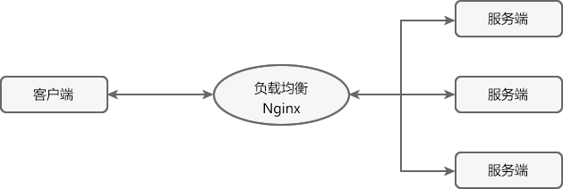
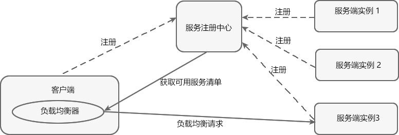

# 什么是Ribbon？
Ribbon主要提供客户端负载均衡算法和服务调用。

Spring Cloud将其与Netflix的其他开源组件（例如Eureka、Feign以及Hystrix等）一起整合进Spring Cloud Netflix中
整合后全称为Spring Cloud Neetflix Ribbon

Ribbon 是 Spring Cloud Netflix 模块的子模块，它是 Spring Cloud 对 Netflix Ribbon 的二次封装。
通过它，我们可以将面向服务的 REST 模板（RestTemplate）请求转换为客户端负载均衡的服务调用。

Ribbon 是 Spring Cloud 体系中最核心、最重要的组件之一。它虽然只是一个工具类型的框架，并不像 Eureka Server（服务注册中心）那样需要独立部署，
但它几乎存在于每一个使用 Spring Cloud 构建的微服务中。


# 负载均衡
在任何一个系统中，负载均衡都是一个十分重要且不得不去实施的内容，它是系统处理高并发、缓解网络压力和服务端扩容的重要手段之一。

负载均衡（Load Balance） ，简单点说就是将用户的请求平摊分配到多个服务器上运行，以达到扩展服务器带宽、增强数据处理能力、增加吞吐量、提高网络的可用性和灵活性的目的。

常见的负载均衡方式有两种：
## 服务端负载均衡

服务端负载均衡是在客户端和服务端之间建立一个独立的负载均衡服务器，该服务器既可以是硬件设备（例如 F5），也可以是软件（例如 Nginx）
这个负载均衡服务器维护了一份可用服务端清单，然后通过心跳机制来删除故障的服务端节点，以保证清单中的所有服务节点都是可以正常访问的。

当客户端发送请求时，该请求不会直接发送到服务端进行处理，而是全部交给负载均衡服务器，由负载均衡服务器按照某种算法（例如轮询、随机等）
从其维护的可用服务清单中选择一个服务端，然后进行转发。

特点：
    - 需要建立一个独立的负载均衡服务器。
    - 负载均衡是在客户端发送请求后进行的，因此客户端并不知道到底是哪个服务端提供的服务。
    - 可用服务端清单存储在负载均衡服务器上。
## 客户端负载均衡
相较于服务端负载均衡，客户端服务在均衡则是一个比较小众的概念。

客户端负载均衡是将负载均衡逻辑以代码的形式封装到客户端上，即负载均衡器位于客户端。
客户端通过服务注册中心（例如 Eureka Server）获取到一份服务端提供的可用服务清单。
有了服务清单后，负载均衡器会在客户端发送请求前通过负载均衡算法选择一个服务端实例再进行访问，以达到负载均衡的目的；

客户端负载均衡也需要心跳机制去维护服务端清单的有效性，这个过程需要配合服务注册中心一起完成。

特点：
    - 负载均衡器位于客户端，不需要单独搭建一个负载均衡服务器。
    - 负载均衡是在客户端发送请求前进行的，因此客户端清楚地知道是哪个服务端提供的服务。
    - 客户端都维护了一份可用服务清单，而这份清单都是从服务注册中心获取的。

Ribbon 就是一个基于 HTTP 和 TCP 的客户端负载均衡器，，当我们将 Ribbon 和 Eureka 一起使用时，
Ribbon 会从 Eureka Server（服务注册中心）中获取服务端列表，然后通过负载均衡策略将请求分摊给多个服务提供者，从而达到负载均衡的目的。


# Ribbon使用
Ribbon 可以与 RestTemplate（Rest 模板）配合使用，以实现微服务之间的调用。

RestTemplate 是 Spring 家族中的一个用于消费第三方 REST 服务的请求框架。
RestTemplate 实现了对 HTTP 请求的封装，提供了一套模板化的服务调用方法。
通过它，Spring 应用可以很方便地对各种类型的 HTTP 请求进行访问。

RestTemplate 针对各种类型的 HTTP 请求都提供了相应的方法进行处理，例如 HEAD、GET、POST、PUT、DELETE 等类型的 HTTP 请求
分别对应 RestTemplate 中的 headForHeaders()、getForObject()、postForObject()、put() 以及 delete() 方法。

下面我们通过一个简单的实例，来演示 Ribbon 是如何实现服务调用的。
1，在主工程 spring-cloud-demo2 下，创建一个名为 micro-service-cloud-consumer-dept-80 的微服务，并在其 pom.xml 中引入所需的依赖，代码如下。
```xml
<?xml version="1.0" encoding="UTF-8"?>
<project xmlns="http://maven.apache.org/POM/4.0.0" xmlns:xsi="http://www.w3.org/2001/XMLSchema-instance"
         xsi:schemaLocation="http://maven.apache.org/POM/4.0.0 https://maven.apache.org/xsd/maven-4.0.0.xsd">
    <modelVersion>4.0.0</modelVersion>
    <!--父工程-->
    <parent>
        <artifactId>spring-cloud-demo2</artifactId>
        <groupId>net.biancheng.c</groupId>
        <version>0.0.1-SNAPSHOT</version>
    </parent>
    <groupId>net.biancheng.c</groupId>
    <artifactId>micro-service-cloud-consumer-dept-80</artifactId>
    <version>0.0.1-SNAPSHOT</version>
    <name>micro-service-cloud-consumer-dept-80</name>
    <description>Demo project for Spring Boot</description>
    <properties>
        <java.version>1.8</java.version>
    </properties>
    <dependencies>
        <!--公共子模块-->
        <dependency>
            <groupId>net.biancheng.c</groupId>
            <artifactId>micro-service-cloud-api</artifactId>
            <version>${project.version}</version>
        </dependency>
        <!--Spring Boot Web-->
        <dependency>
            <groupId>org.springframework.boot</groupId>
            <artifactId>spring-boot-starter-web</artifactId>
        </dependency>
        <!--lombok-->
        <dependency>
            <groupId>org.projectlombok</groupId>
            <artifactId>lombok</artifactId>
            <optional>true</optional>
        </dependency>
        <!--Spring Boot 测试-->
        <dependency>
            <groupId>org.springframework.boot</groupId>
            <artifactId>spring-boot-starter-test</artifactId>
            <scope>test</scope>
        </dependency>
        <!--Spring Cloud Eureka 客户端依赖-->
        <dependency>
            <groupId>org.springframework.cloud</groupId>
            <artifactId>spring-cloud-starter-netflix-eureka-client</artifactId>
        </dependency>
        <!--Spring Cloud Ribbon 依赖-->
        <dependency>
            <groupId>org.springframework.cloud</groupId>
            <artifactId>spring-cloud-starter-netflix-ribbon</artifactId>
        </dependency>
    </dependencies>
    <build>
        <plugins>
            <plugin>
                <groupId>org.springframework.boot</groupId>
                <artifactId>spring-boot-maven-plugin</artifactId>
                <configuration>
                    <excludes>
                        <exclude>
                            <groupId>org.projectlombok</groupId>
                            <artifactId>lombok</artifactId>
                        </exclude>
                    </excludes>
                </configuration>
            </plugin>
        </plugins>
    </build>
</project>
```
2，在类路径（即 /resource 目录）下，新建一个配置文件 application.yml，配置内容如下。
```yml
server:
  port: 80 #端口号
############################################# Spring Cloud Ribbon 负载均衡配置##########################
eureka:
  client:
    register-with-eureka: false #本微服务为服务消费者，不需要将自己注册到服务注册中心
    fetch-registry: true  #本微服务为服务消费者，需要到服务注册中心搜索服务
    service-url:
      defaultZone: http://eureka7001.com:7001/eureka/,http://eureka7002.com:7002/eureka/,http://eureka7003.com:7003/eureka/ #服务注册中心集群
```
3，在 net.biancheng.c.config 包下，创建一个名为 ConfigBean 的配置类，将 RestTemplate 注入到容器中，代码如下。
```java
package net.biancheng.c.config;
import com.netflix.loadbalancer.IRule;
import com.netflix.loadbalancer.RetryRule;
import org.springframework.cloud.client.loadbalancer.LoadBalanced;
import org.springframework.context.annotation.Bean;
import org.springframework.context.annotation.Configuration;
import org.springframework.web.client.RestTemplate;
// 配置类注解
@Configuration
public class ConfigBean {
    
    @Bean //将 RestTemplate 注入到容器中
    @LoadBalanced //在客户端使用 RestTemplate 请求服务端时，开启负载均衡（Ribbon）
    public RestTemplate getRestTemplate() {
        return new RestTemplate();
    }
}
```
4，在 net.biancheng.c.controller 包下，创建一个名为 DeptController_Consumer 的 Controller，该 Controller 中定义的请求用于调用服务端提供的服务，代码如下。
```java
package net.biancheng.c.controller;
import net.biancheng.c.entity.Dept;
import org.springframework.beans.factory.annotation.Autowired;
import org.springframework.web.bind.annotation.PathVariable;
import org.springframework.web.bind.annotation.RequestMapping;
import org.springframework.web.bind.annotation.RestController;
import org.springframework.web.client.RestTemplate;
import java.util.List;
@RestController
public class DeptController_Consumer {
    //private static final String REST_URL_PROVIDER_PREFIX = "http://localhost:8001/"; 这种方式是直调用服务方的方法，根本没有用到 Spring Cloud
    //面向微服务编程，即通过微服务的名称来获取调用地址
    private static final String REST_URL_PROVIDER_PREFIX = "http://MICROSERVICECLOUDPROVIDERDEPT"; // 使用注册到 Spring Cloud Eureka 服务注册中心中的服务，即 application.name
    @Autowired
    private RestTemplate restTemplate; //RestTemplate 是一种简单便捷的访问 restful 服务模板类，是 Spring 提供的用于访问 Rest 服务的客户端模板工具集，提供了多种便捷访问远程 HTTP 服务的方法
    //获取指定部门信息
    @RequestMapping(value = "/consumer/dept/get/{id}")
    public Dept get(@PathVariable("id") Integer id) {
        return restTemplate.getForObject(REST_URL_PROVIDER_PREFIX + "/dept/get/" + id, Dept.class);
    }
    //获取部门列表
    @RequestMapping(value = "/consumer/dept/list")
    public List<Dept> list() {
        return restTemplate.getForObject(REST_URL_PROVIDER_PREFIX + "/dept/list", List.class);
    }
}
```
5，在 micro-service-cloud-consumer-dept-80 的主启动类上，使用 @EnableEurekaClient 注解来开启 Eureka 客户端功能，代码如下。
```java
package net.biancheng.c;
import org.springframework.boot.SpringApplication;
import org.springframework.boot.autoconfigure.SpringBootApplication;
import org.springframework.cloud.netflix.eureka.EnableEurekaClient;
@SpringBootApplication
@EnableEurekaClient
public class MicroServiceCloudConsumerDept80Application {
    public static void main(String[] args) {
        SpringApplication.run(MicroServiceCloudConsumerDept80Application.class, args);
    }
}
```
6，依次启动服务注册中心 micro-service-cloud-eureka-7001、服务提供者 micro-service-cloud-provider-dept-8001 以及服务消费者 micro-service-cloud-consumer-dept-80。

## Ribbon 实现负载均衡
Ribbon 是一个客户端的负载均衡器，它可以与 Eureka 配合使用轻松地实现客户端的负载均衡。
Ribbon 会先从 Eureka Server（服务注册中心）去获取服务端列表，然后通过负载均衡策略将请求分摊给多个服务端，从而达到负载均衡的目的。

Spring Cloud Ribbon 提供了一个 IRule 接口，该接口主要用来定义负载均衡策略，它有 7 个默认实现类，每一个实现类都是一种负载均衡策略。
RoundRobinRule：
    按照线性轮询策略，即按照一定的顺序依次选取服务实例
RandomRule：
    随机选取一个服务实例
RetryRule：
    按照 RoundRobinRule（轮询）的策略来获取服务，如果获取的服务实例为 null 或已经失效，则在指定的时间之内不断地进行重试（重试时获取服务的策略还是 RoundRobinRule 中定义的策略）
    如果超过指定时间依然没获取到服务实例则返回 null 。
WeightedResponseTimeRule：
    WeightedResponseTimeRule 是 RoundRobinRule 的一个子类，它对 RoundRobinRule 的功能进行了扩展。
    根据平均响应时间，来计算所有服务实例的权重，响应时间越短的服务实例权重越高，被选中的概率越大。
    刚启动时，如果统计信息不足，则使用线性轮询策略，等信息足够时，再切换到 WeightedResponseTimeRule。
BestAvailableRule：
    继承自 ClientConfigEnabledRoundRobinRule。先过滤点故障或失效的服务实例，然后再选择并发量最小的服务实例。
AvailabilityFilteringRule：
    先过滤掉故障或失效的服务实例，然后再选择并发量较小的服务实例。
ZoneAvoidanceRule：
    默认的负载均衡策略，综合判断服务所在区域（zone）的性能和服务（server）的可用性，来选择服务实例。
    在没有区域的环境下，该策略与轮询（RandomRule）策略类似。

1，参考 micro-service-cloud-provider-dept-8001，再创建两个微服务 Moudle ：micro-service-cloud-provider-dept-8002 和 micro-service-cloud-provider-dept-8003。
2，在 micro-service-cloud-provider-dept-8002 中 application.yml 中，修改端口号以及数据库连接信息，修改的配置如下。
```yml
server:
  port: 8002  #端口号修改为 8002
spring:
  application:
    name: microServiceCloudProviderDept  #微服务名称，不做修改，与 micro-service-cloud-provider-dept-8001 的配置保持一致
  datasource:
    username: root        #数据库登陆用户名
    password: root        #数据库登陆密码
    url: jdbc:mysql://127.0.0.1:3306/spring_cloud_db2       #数据库url
    driver-class-name: com.mysql.jdbc.Driver                  #数据库驱动
```
3，在 micro-service-cloud-provider-dept-8003 中 application.yml 中，修改端口号以及数据库连接信息，修改的配置如下。
```yml
server:
  port: 8003  #端口号修改为 8003
spring:
  application:
    name: microServiceCloudProviderDept  #微服务名称，不做修改，与 micro-service-cloud-provider-dept-8001 的配置保持一致
  datasource:
    username: root        #数据库登陆用户名
    password: root        #数据库登陆密码
    url: jdbc:mysql://127.0.0.1:3306/spring_cloud_db3      #数据库url
    driver-class-name: com.mysql.jdbc.Driver                  #数据库驱动
```
4，依次启动 micro-service-cloud-eureka-7001/7002/7003（服务注册中心集群）、micro-service-cloud-provider-dept-8001/8002/8003（服务提供者集群）以及 micro-service-cloud-consumer-dept-80（服务消费者）。
5，使用浏览器连续访问“http://eureka7001.com/consumer/dept/get/1”,结果如下图。
通过图 4 中 dbSource 字段取值的变化可以看出，Spring Cloud Ribbon 默认使用轮询策略进行负载均衡。
## 切换负载均衡策略
Spring Cloud Ribbon 默认使用轮询策略选取服务实例，我们也可以根据自身的需求切换负载均衡策略。

切换负载均衡策略的方法很简单，我们只需要在服务消费者（客户端）的配置类中，将 IRule 的其他实现类注入到容器中即可。

下面我们就通过一个实例，来演示下如何切换负载均衡的策略。

1，在 micro-service-cloud-consumer-dept-80 的配置类 ConfigBean 中添加以下代码，将负载均衡策略切换为 RandomRule（随机）。
```
@Bean
public IRule myRule() {
    // RandomRule 为随机策略
    return  new RandomRule();
}
```
## 定制负载均衡策略
通常情况下，Ribbon 提供的这些默认负载均衡策略是可以满足我们的需求的，如果有特殊的要求，我们还可以根据自身需求定制负载均衡策略。

1，在 micro-service-cloud-consumer-dept-80 中新建一个 net.biancheng.myrule 包，并在该包下创建一个名为 MyRandomRule 的类，代码如下。
```java
package net.biancheng.myrule;
import com.netflix.client.config.IClientConfig;
import com.netflix.loadbalancer.AbstractLoadBalancerRule;
import com.netflix.loadbalancer.ILoadBalancer;
import com.netflix.loadbalancer.Server;
import java.util.List;
/**
* 定制 Ribbon 负载均衡策略
*/
public class MyRandomRule extends AbstractLoadBalancerRule {
    private int total = 0;            // 总共被调用的次数，目前要求每台被调用5次
    private int currentIndex = 0;    // 当前提供服务的机器号
    public Server choose(ILoadBalancer lb, Object key) {
        if (lb == null) {
            return null;
        }
        Server server = null;
        while (server == null) {
            if (Thread.interrupted()) {
                return null;
            }
            //获取所有有效的服务实例列表
            List<Server> upList = lb.getReachableServers();
            //获取所有的服务实例的列表
            List<Server> allList = lb.getAllServers();
            //如果没有任何的服务实例则返回 null
            int serverCount = allList.size();
            if (serverCount == 0) {
                return null;
            }
            //与随机策略相似，但每个服务实例只有在调用 3 次之后，才会调用其他的服务实例
            if (total < 3) {
                server = upList.get(currentIndex);
                total++;
            } else {
                total = 0;
                currentIndex++;
                if (currentIndex >= upList.size()) {
                    currentIndex = 0;
                }
            }
            if (server == null) {
                Thread.yield();
                continue;
            }
            if (server.isAlive()) {
                return (server);
            }
            server = null;
            Thread.yield();
        }
        return server;
    }
    @Override
    public Server choose(Object key) {
        return choose(getLoadBalancer(), key);
    }
    @Override
    public void initWithNiwsConfig(IClientConfig clientConfig) {
        // TODO Auto-generated method stub
    }
}
```
2，在 net.biancheng.myrule 包下创建一个名为 MySelfRibbonRuleConfig 的配置类，将我们定制的负载均衡策略实现类注入到容器中，代码如下。
```java
package net.biancheng.myrule;
import com.netflix.loadbalancer.IRule;
import org.springframework.context.annotation.Bean;
import org.springframework.context.annotation.Configuration;
/**
* 定制 Ribbon 负载均衡策略的配置类
* 该自定义 Ribbon 负载均衡策略配置类 不能在 net.biancheng.c 包及其子包下
* 否则所有的 Ribbon 客户端都会采用该策略，无法达到特殊化定制的目的
*/
@Configuration
public class MySelfRibbonRuleConfig {
    @Bean
    public IRule myRule() {
        //自定义 Ribbon 负载均衡策略
        return new MyRandomRule(); //自定义，随机选择某一个微服务，执行五次
    }
}
```
3，修改位于 net.biancheng.c 包下的主启动类，在该类上使用 @RibbonClient 注解让我们定制的负载均衡策略生效，代码如下。
```java
package net.biancheng.c;
import net.biancheng.myrule.MySelfRibbonRuleConfig;
import org.springframework.boot.SpringApplication;
import org.springframework.boot.autoconfigure.SpringBootApplication;
import org.springframework.cloud.netflix.eureka.EnableEurekaClient;
import org.springframework.cloud.netflix.ribbon.RibbonClient;
@SpringBootApplication
@EnableEurekaClient
//自定义 Ribbon 负载均衡策略在主启动类上使用 RibbonClient 注解，在该微服务启动时，就能自动去加载我们自定义的 Ribbon 配置类，从而是配置生效
// name 为需要定制负载均衡策略的微服务名称（application name）
// configuration 为定制的负载均衡策略的配置类，
// 且官方文档中明确提出，该配置类不能在 ComponentScan 注解（SpringBootApplication 注解中包含了该注解）下的包或其子包中，即自定义负载均衡配置类不能在 net.biancheng.c 包及其子包下
@RibbonClient(name = "MICROSERVICECLOUDPROVIDERDEPT", configuration = MySelfRibbonRuleConfig.class)
public class MicroServiceCloudConsumerDept80Application {
    public static void main(String[] args) {
        SpringApplication.run(MicroServiceCloudConsumerDept80Application.class, args);
    }
}
```


# Ribbon执行架构
1，负载均衡器在初始化的时候，会从Eureka获取一次实例列表；
2，负载均衡器在初始化的时候，会启动一个ServerListUpdater定时器，默认每10秒从Eureka同步一次实例列表；
3，在获取到实例列表以后，如果负载均衡器带有服务列表过滤器（ServerListFilter），要将实例列表通过服务列表过滤器（ServerListFilter）过滤一遍，获取到最终的实例列表；
4，负载均衡器在初始化的时候，会启动一个PingTask定时器，默认每30秒校验一下实例列表中的所有实例是否可用；
5，完成上述步骤后，我们会获取到一个可用的实例列表，当要进行接口调用的时候，负载均衡器会通过负载均衡规则（IRule）筛选出其中一个实例，以供调用。


# Ribbon原理
自动化配置类中，主要做了以下3件事
    1，创建了一个LoadBalancerInterceptor的Bean，用于实现对客户端发起请求时进行拦截，以实现客户端负载均衡。
    2，创建了一个RestTemplateCustomizer的Bean，用于给RestTemplate增加LoadBalancerInterceptor拦截器。
    3，维护了一个被@LoadBalanced注解修饰的RestTemplate对象列表，并在这里进行初始化，通过调用RestTemplateCustomizer的实例来给需要客户端负载均衡的RestTemplate增加LoadBalancerInterceptor拦截器。
LoadBalancerInterceptor是如何将一个普通的RestTemplate变成客户端负载均衡的：
    在LoadBalancerInterceptor中注入了LoadBalancerClient的实现，当一个被@LoadBalanced注解修饰的RestTemplate对象向外发起HTTP请求时，会被LoadBalancerInterceptor类的intercept函数所拦截
    由于我们在使用RestTemplate时候采用了服务名作为host，所以直接从HttpRequest的URI对象中通过getHost()就可以拿到服务名，然后调用execute函数去根据服务名来选择实例并发起实际的请求。
加了ribbon发起一个请求的具体流程：
    1，RestTemplate：发起请求
    2，LoadBanlanceInterceptor：负载均衡拦截器拦截
    3，LoadBanlanceClient：获取该服务的ILoadBalance
    4，ILoadBalance中
        获取服务列表 -> 服务路由 -> 根据负载均衡算法选择一个server -> 发起请求 -> 记录调用数据（耗时、成功、失败等信息）
获取服务列表
    Ribbon使用ServerList接口抽象服务实例列表，Ribbon获取服务实例有如下两种方法：
    1，配置文件：com.netflix.loadbalancer.ConfigurationBasedServerList
        在没有使用注册中心的情况下，Ribbon可以通过配置文件手动列举服务实例的地址，它的命令规范是{{服务名}}.ribbon.listOfServers
        Ribbon通过ConfigurationBasedServerList类实现配置服务列表,多个服务实例用逗号隔开
            spring.application.name=shop-order
            shop-product.ribbon.listOfServers=http://localhost:8001,http://localhost:8002
        使用配置文件是不是意味着服务实例列表就不会不变了呢？不是的，其实还会定时更新
    2，利用注册中心获取
        利用配置文件获取服务实例列表扩展性很差，因为在服务实例上线或者下线的情况下，需要手动修改配置文件，扩展性很低。一个健壮的微服务系统会采用注册中心的方式维护服务的上下线。
        Ribbon可以使用DiscoveryEnabledNIWSServerList维护和Eureka之间的服务上下线
动态更新服务实例列表
    服务实例上下线在微服务系统中是一个非常常见的场景，Ribbon也实现了该功能。
    当Ribbon从注册中心获取了服务实例列表之后，Ribbon需要动态更新服务实例列表，抽象接口为ServerListUpdater
    更新方式有两种：
        1，定时任务定时拉取服务实例列表
            Ribbon会使用一个定时任务线程池定时拉取更新数据。
            参数设置：
                com.netflix.loadbalancer.PollingServerListUpdater:定时拉取
                {service-name}.ribbon.ServerListRefreshInterval:更新频率
                DynamicServerListLoadBalancer.ThreadPoolSize:定时更新的线程数目
            PollingServerListUpdater只是控制了线程池的动作，但是具体的业务逻辑则是封装在UpdateAction。
        2，事件通知
            参数设置：com.netflix.niws.loadbalancer.EurekaNotificationServerListUpdater:事件通知
            和PollingServerListUpdater不同的是，如果注册中心是Eureka，可以采用事件通知的方式，即当Eureka注册中心发生注册信息变更的时候，那么就将消息发送到事件监听者，
            Ribbon使用EurekaNotificationServerListUpdater实现类进行更新，首先会创建一个Eureka监听器，当接口接受到通知事件之后，会将更新逻辑提交到线程池中执行，更详细的代码如下
            ```
            public synchronized void start(final UpdateAction updateAction) {
                if (isActive.compareAndSet(false, true)) {
                    this.updateListener = new EurekaEventListener() {
                        @Override
                        public void onEvent(EurekaEvent event) {
                            if (event instanceof CacheRefreshedEvent) {
                                if (!updateQueued.compareAndSet(false, true)) {  // if an update is already queued
                                    logger.info("an update action is already queued, returning as no-op");
                                    return;
                                }
                                try {
                                    refreshExecutor.submit(new Runnable() {
                                        @Override
                                        public void run() {
                                              updateAction.doUpdate();
                                        }
                                    }); 
                                } catch (Exception e) {
                                    updateQueued.set(false);  // if submit fails, need to reset updateQueued to false
                                }
                            }
                        }
                    };
                    //注册事件监听器，省略不重要的代码
                } else {
                    logger.info("Update listener already registered, no-op");
                }
            }
            ```
对服务进行心跳检测
    PingTask执行流程：
        1，PingTask：周期性执行
        2，Pinger：获取服务实例列表 -> 更新upServerList
        3，PingStrategy：串行/并行发起请求
        4，IPing：检测服务可用性
    服务列表中的服务实例未必一直都处于可用的状态，Ribbon会对服务实例进行检测，PingerStrategy接口抽象检测的策略，Ribbon默认采用了串行的方式进行检测，
    如果有必要，我们可以通过该接口实现并行的检测方式。Pinger会定时通过PingerStrategy获取更新的服务实例，并调用监听者。
    ```
    // 避免在检测过程中服务实例列表发生变更，预先进行复制，代码省略
    //在线服务实例列表
    final List<Server> newUpList = new ArrayList<Server>();
    //发生状态变更的服务实例列表
    final List<Server> changedServers = new ArrayList<Server>();
    for (int i = 0; i < numCandidates; i++) {
        boolean isAlive = results[i];
        Server svr = allServers[i];
        boolean oldIsAlive = svr.isAlive();
        svr.setAlive(isAlive);
        if (oldIsAlive != isAlive) {
            changedServers.add(svr);
            logger.debug("LoadBalancer [{}]:  Server [{}] status changed to {}", 
                name, svr.getId(), (isAlive ? "ALIVE" : "DEAD"));
        }
        if (isAlive) {
            newUpList.add(svr);
        }
    }
    ```
    除此之外，还有一个IPing接口，它的目的是检测单个服务的可用性，对于Eureka来说使用的是NIWSDiscoveryPing策略


