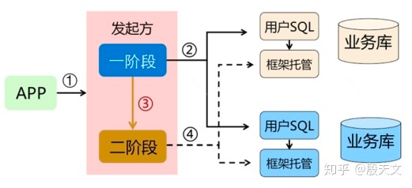
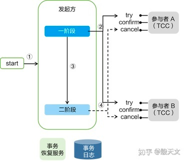
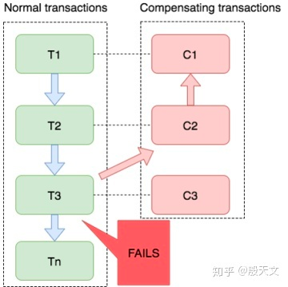
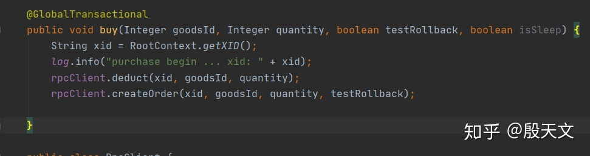
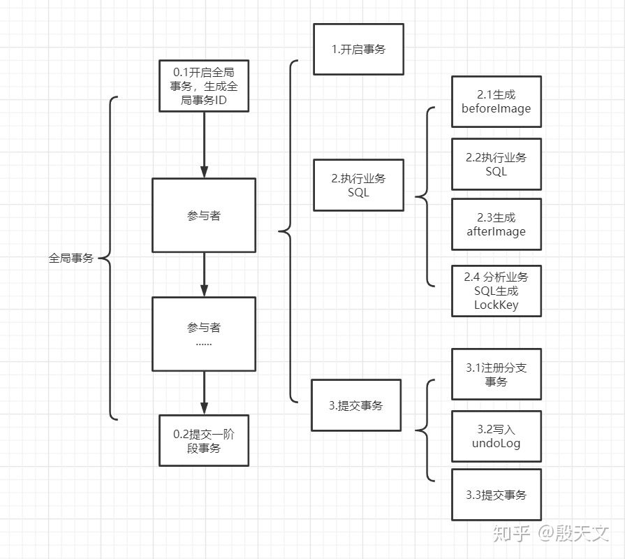

# Seata支持4种模式
Seata 提供四种模式解决分布式事务场景，AT，XA，TCC，Saga。
# AT模式

这是Seata的一大特色，AT对业务代码完全无侵入性，使用非常简单，改造成本低。我们只需要关注自己的业务SQL，Seata会通过分析我们业务SQL，反向生成回滚数据
AT 包含两个阶段
    1，一阶段，所有参与事务的分支，本地事务Commit 业务数据和回滚日志（undoLog）
        Seata 的 JDBC 数据源代理通过对业务 SQL 的解析，把业务数据在更新前后的数据镜像组织成回滚日志，
        利用 本地事务 的 ACID 特性，将业务数据的更新和回滚日志的写入在同一个 本地事务 中提交。
        这样，可以保证：任何提交的业务数据的更新一定有相应的回滚日志存在
    2，二阶段，事务协调者根据所有分支的情况，决定本次全局事务是Commit 还是 Rollback（二阶段是完全异步）
        场景一：提交，全局提交
            如果决议是全局提交，此时分支事务此时已经完成提交，不需要同步协调处理（只需要异步清理回滚日志），Phase2 可以非常快速地完成
        场景2：回滚，全局回滚
            如果决议是全局回滚，RM 收到协调器发来的回滚请求，通过 XID 和 Branch ID 找到相应的回滚日志记录，通过回滚记录生成反向的更新 SQL 并执行，以完成分支的回滚
GlobalTransactional 切面原理
    标记@GlobalTransactional的方法通过AOP实现了，开启全局事务和提交全局事务两个操作，与Spring 事务机制类似，
    当 GlobalTransactionalInterceptor 在事务执行过程中捕获到Throwable时，会发起全局事务回滚
注册分支事物
    注册分支事务时，client会把所有的LockKey 拼到一起作为全局锁发送给Seata-server。
    如果注册成功，写入undoLog，并提交本地事务，一阶段结束，等待二阶段反馈
    如果当前有其他分支事务已经持有了相同的锁（即其他事务也在处理相同表的同一行），则client 注册事务分支失败。
    client会根据客户端定义的重发时间和重发次数进行不断的尝试，如果重试结束仍然没有获得锁，则一阶段失败，本地事务回滚。
    如果该全局事务存在已经注册成功分支事务，Seata-server 进行二阶段回滚
全局锁
    全局锁会在分支事务二阶段结束后释放
    Seata 全局锁的设计是为了什么？ 以扣减库存场景为例，TX1 完成库存扣减的一阶段，库存从100扣减为99，正在等待二阶段的通知。
    TX2也要扣减同一商品的库存，如果没有全局锁的限制，TX2库存从99扣减为98，这时如果TX1接收到回滚通知，进行回滚把库存从98回滚到100。因为没有全局锁，造成了脏写
Seata如何做到无侵入的分析业务SQL生成undoLog，注册事务分支等操作？
    Seata 代理了DataSource，所有的Java持久化框架，最终在操作数据库时都会通过DataSource接口获取Connection，通过Connection 实现对数据库的增删改查，事务控制。
ConnectionProxy 如何判断当前事务是全局事务，还是本地事务？
    通过当前线程是否绑定了全局事务id，在进行全局事务之前，需要调用RootContext.bind(xid);
全局事务并发更新
    如果TX1和TX2同时扣减product_id为1的库存，这时Seata会不会生成相同的beforeImage？
    举个例子，TX1读库存为100，TX1扣减库存1，此时BeforeImage为100 紧接着 如果TX2读库存也为100，那么就有问题了，不管TX2扣减多少库存，如果TX1回滚那么相当于覆盖了TX2扣减的库存，出现了脏写
    这里使用的是**SELECT FOR UPDATE**TX2如果也想读同一条数据的话，只能等到TX1 提交事务后，才能读到。所以问题解决
全局事务外的更新（@GlobalLock）
    我们现在可以确认在Seata的保证下，全局事务，不会造成数据的脏写，但是全局事务外会！
    用户正在抢购，用户A完成了1阶段的库存扣减，这个时候库存为99。
    此时库存管理员上线了，他查了一下库存为99。嗯...太少了，我加100个，库存管理员把库存更新为200。
    而此时seata给用户A生成beforeImage为100，如果此时用户A的全局事务失败了，发生了回滚，再次将库存更新为100... 再次出现脏写
    Seata 针对这个问题，提供了@GlobalLock注解，标记该注解时，会像全局事务一样进行SQL分析，竞争全局锁，就不会出现上述问题了
怎么使用Seata框架，来保证事务的隔离性？
    A: 因seata一阶段本地事务已提交，为防止其他事务脏读脏写需要加强隔离。
    脏读 select语句加for update，代理方法增加@GlobalLock+@Transactional或@GlobalTransaction
    脏写 必须使用@GlobalTransaction
    注：
        如果你查询的业务的接口没有GlobalTransactional 包裹，也就是这个方法上压根没有分布式事务的需求，这时你可以在方法上标注@GlobalLock+@Transactional 注解，并且在查询语句上加 for update。 
        如果你查询的接口在事务链路上外层有GlobalTransactional注解，那么你查询的语句只要加for update就行。设计这个注解的原因是在没有这个注解之前，需要查询分布式事务读已提交的数据，但业务本身不需要分布式事务。 
        若使用GlobalTransactional注解就会增加一些没用的额外的rpc开销比如begin 返回xid，提交事务等。GlobalLock简化了rpc过程，使其做到更高的性能。
@GlobalTransactional 和 @Transactional 同时使用会怎么样
    我们上文中已经说过了 @GlobalTransactional 的作用了，他是负责开启全局事务/提交事务1阶段，说白了@GlobalTransactional 只和Seata-server 交互，
    而 @Transactional 管理的是本地数据库的事务，所以二者不发生冲突。
    但是需要注意 @GlobalTransactional AOP 覆盖范围一定要大于 @Transactional
大致流程
    一阶段：
        业务数据和回滚日志记录在同一个本地事务中提交，释放本地锁和连接资源。
        加载流程：
            1，解析SQL语义，找到『业务SQL』要更新的业务数据，在业务数据被更新前，将其保存成"before image"
            2，执行『业务SQL』更新业务数据，在业务数据更新之后
            3，其保存成"after image"，最后生成行锁
        以上操作全部在一个数据库事务内完成，这样保证了一阶段操作的原子性。
    二阶段：
        二阶段如是顺利提交的话，因为『业务SQL』在一阶段已经提交到数据库，所以Seata框架只需将一阶段快照数据和行锁删掉，完成数据清理即可。
        二阶段如果是回滚的话，Seata就需要回滚一阶段已经执行的『业务SQL』，还原数据。
        回滚的方式便是用"before image"还原业务数据；但在还原前首先要校验脏写，对比"数据库当前业务数据"和"after image"，如果两份数据完全一致就说明没有脏写，可以还原业务数据
        如果不一致就说明有脏写，出现脏写就需要转人工处理。

        

# XA模式
也是我们常说的二阶段提交，XA要求数据库本身提供对规范和协议的支持。XA用起来的话，也是对业务代码无侵入性的。
上述其他三种模式，都是属于补偿型，无法保证全局一致性。
啥意思呢，例如刚刚说的AT模式，我们是可能读到这一次分布式事务的中间状态，而XA模式不会。

补偿型 事务处理机制构建在 事务资源（数据库） 之上（要么在中间件层面，要么在应用层面）
事务资源 本身对分布式事务是无感知的，这也就导致了补偿型事务无法做到真正的 全局一致性 。
比如，一条库存记录，处在 补偿型 事务处理过程中，由 100 扣减为 50。此时，仓库管理员连接数据库，查询统计库存，就看到当前的 50。
之后，事务因为意外回滚，库存会被补偿回滚为 100。显然，仓库管理员查询统计到的 50 就是 脏 数据。
如果是XA的话，中间态数据库存 50 由数据库本身保证，不会被仓库管理员读到（当然隔离级别需要 读已提交 以上）

但是全局一致性带来的结果就是**数据的锁定**，例如全局事务中有一条update语句，其他事务想要更新同一条数据的话，只能等待全局事务结束
AT模式也是存在全局锁的，但是隔离级别无法保证，后边我们会详细说

XA模式详解：http://seata.io/zh-cn/blog/seata-xa-introduce.html

# TCC模式

Try 阶段 ：所有参与分布式事务的分支，对业务资源进行检查和预留
二阶段 Confirm：所有分支的Try全部成功后，执行业务提交
二阶段 Cancel：取消Try阶段预留的业务资源

对比AT或者XA模式来说，TCC模式需要我们自己抽象并实现Try，Confirm，Cancel三个接口，编码量会大一些，但是由于事务的每一个阶段都由开发人员自行实现。
而且相较于AT模式来说，减少了SQL解析的过程，也没有全局锁的限制，所以TCC模式的性能是优于AT 、XA模式。 PS：果然简单和高效难以两全的

# Saga

Saga 是长事务解决方案，每个参与者需要实现事务的正向操作和补偿操作。
当参与者正向操作执行失败时，回滚本地事务的同时，会调用上一阶段的补偿操作，在业务失败时最终会使事务回到初始状态

Saga与TCC类似，同样没有全局锁。由于相比缺少锁定资源这一步，在某些适合的场景，Saga要比TCC实现起来更简单。 
由于Saga和TCC都需要我们手动编码实现，所以在开发时我们需要参考一些设计上的规范

在需要开启分布式事务的方法上标记@GlobalTransactional，然后执行分别执行扣减库存和扣减库存操作的，
事务的参与者可以是本地的数据源，或者RPC的远程调用（远程调用的话需要携带全局事务ID，也就是上图的xid）
之前说过AT模式分为两个阶段，第一阶段包括提交业务数据和回滚日志（undoLog），第一阶段具体流程如下图
