# 什么是Sentinel
Sentinel中文翻译为哨兵，是为微服务提供流量控制、熔断降级的功能。
Sentinel以流量为切入点，从流量控制、熔断降级、系统负载保护等多个维度保护服务的稳定性
主要是为了解决微服务调用产生的雪崩效应，为微服务提供了稳定性解决方案


# Sentinel优势
丰富的应用场景：
    Sentinel 承接了阿里巴巴近 10 年的“双十一”大促流量的核心场景，例如秒杀（将突发流量控制在系统可以承受的范围）、消息削峰填谷、集群流量控制、实时熔断下游不可用服务等。
完备的实时监控：
    Sentinel 提供了实时监控功能。用户可以在控制台中看到接入应用的单台机器的秒级数据，甚至是 500 台以下规模集群的汇总运行情况。
广泛的开源生态：
    Sentinel 提供了开箱即用的与其它开源框架或库（例如 Spring Cloud、Apache Dubbo、gRPC、Quarkus）的整合模块。
    我们只要在项目中引入相应的依赖并进行简单的配置即可快速地接入 Sentinel。此外，Sentinel 还提供 Java、Go 以及 C++ 等多语言的原生实现。
完善的SPI扩展机制：
    Sentinel 提供简单易、完善的 SPI 扩展接口，我们可以通过实现这些扩展接口快速地定制逻辑，例如定制规则管理、适配动态数据源等。


# Sentinel基本概念
Sentinel 的基本概念有两个，它们分别是：资源和规则。
资源：
    资源是 Sentinel 的关键概念。它可以是 Java 应用程序中的任何内容，例如由应用程序提供的服务或者是服务里的方法，甚至可以是一段代码。
    我们可以通过 Sentinel 提供的 API 来定义一个资源，使其能够被 Sentinel 保护起来。通常情况下，我们可以使用方法名、URL 甚至是服务名来作为资源名来描述某个资源。
规则：
    围绕资源而设定的规则。Sentinel 支持流量控制、熔断降级、系统保护、来源访问控制和热点参数等多种规则，所有这些规则都可以动态实时调整。


# @SentinelResource 注解
@SentinelResource 注解是 Sentinel 提供的最重要的注解之一，它还包含了多个属性
value：
    用于指定资源的名称。必填。
entryType：
    entry类型。可选项（默认为EntryType.out）
blockHandler
    服务限流后会抛出 BlockException 异常，而 blockHandler 则是用来指定一个函数来处理 BlockException  异常的。
    简单点说，该属性用于指定服务限流后的后续处理逻辑。
    使用要求：
        1，blockHandler 函数访问范围需要是 public；
        2，返回类型需要与原方法相匹配；
        3，参数类型需要和原方法相匹配并且最后加一个额外的参数，类型为 BlockException；
        4，blockHandler 函数默认需要和原方法在同一个类中，若希望使用其他类的函数，则可以指定 blockHandler 为对应的类的 Class 对象，注意对应的函数必需为 static 函数，否则无法解析。
blockHandlerClass
    若 blockHandler 函数与原方法不在同一个类中，则需要使用该属性指定 blockHandler 函数所在的类。
    使用要求：
        1，不能单独使用，必须与 blockHandler 属性配合使用；
        2，该属性指定的类中的 blockHandler 函数必须为 static 函数，否则无法解析。
fallback
    用于在抛出异常（包括 BlockException）时，提供 fallback 处理逻辑。
    fallback 函数可以针对所有类型的异常（除了 exceptionsToIgnore 里面排除掉的异常类型）进行处理。
    使用要求：
        1，返回值类型必须与原函数返回值类型一致；
        2，方法参数列表需要和原函数一致，或者可以额外多一个 Throwable 类型的参数用于接收对应的异常；
        3，fallback 函数默认需要和原方法在同一个类中，若希望使用其他类的函数，则可以指定 fallbackClass 为对应的类的 Class 对象，注意对应的函数必需为 static 函数，否则无法解析。
fallbackClass
    若 fallback 函数与原方法不在同一个类中，则需要使用该属性指定 blockHandler 函数所在的类。
    使用要求：
        1，不能单独使用，必须与 fallback 或 defaultFallback  属性配合使用；
        2，该属性指定的类中的 fallback 函数必须为 static 函数，否则无法解析。
defaultFallback
    默认的 fallback 函数名称，通常用于通用的 fallback 逻辑（即可以用于很多服务或方法）。
    默认 fallback 函数可以针对所以类型的异常（除了 exceptionsToIgnore 里面排除掉的异常类型）进行处理。
    使用要求：
        1，返回值类型必须与原函数返回值类型一致；
        2，方法参数列表需要为空，或者可以额外多一个 Throwable 类型的参数用于接收对应的异常；
        3，defaultFallback 函数默认需要和原方法在同一个类中。若希望使用其他类的函数，则可以指定 fallbackClass 为对应的类的 Class 对象，注意对应的函数必需为 static 函数，否则无法解析。
exceptionsToIgnore
    用于指定哪些异常被排除掉，不会计入异常统计中，也不会进入 fallback 逻辑中，而是会原样抛出。


# Sentinel控制台
Sentinel 提供了一个轻量级的开源控制台 Sentinel Dashboard，它提供了机器发现与健康情况管理、监控（单机和集群）、规则管理与推送等多种功能。
Sentinel控制台提供的功能如下：
**查看机器列表以及健康情况**：Sentinel 控制台能够收集 Sentinel 客户端发送的心跳包，判断机器是否在线。
**监控（单机和集群聚合）**：Sentinel 控制台通过 Sentinel 客户端暴露的监控 API，可以实现秒级的实时监控。
**规则管理和推送**：通过 Sentinel 控制台，我们还能够针对资源定义和推送规则。
**鉴权**：从 Sentinel 1.6.0 起，Sentinel 控制台引入基本的登录功能，默认用户名和密码都是 sentinel。
Sentinel Dashboard 是我们配置和管理规则（例如流控规则、熔断降级规则等）的重要入口之一。
通过它，我们不仅可以对规则进行配置和管理，还能实时查看规则的效果。
## 安装Sentinel控制台
1，使用"https://github.com/alibaba/Sentinel/releases"下载页面下载 Sentinel 控制台的 jar 包，如下图。
2，打开命令行窗口，跳转到 Sentinel Dashboard  jar 包所在的目录，执行以下命令，启动 Sentinel Dashboard。
```java -jar sentinel-dashboard-1.8.2.jar```
3，启动完成后，使用浏览器访问“http://localhost:8080/”，跳转到 Sentinel 控制台登陆页面
4，分别输入用户名和密码（默认都是 sentinel），点击下方的登录按钮


# Sentinel的开发流程
1，引入Sentinel依赖：
    在项目中引入 Sentinel 的依赖，将 Sentinel 整合到项目中；
2，定义资源
    通过对主流框架提供适配或 Sentinel 提供的显式 API 和注解，可以定义需要保护的资源，此外 Sentinel 还提供了资源的实时统计和调用链路分析；
3，定义规则
    根据实时统计信息，对资源定义规则，例如流控规则、熔断规则、热点规则、系统规则以及授权规则等。
4，检验规则是否在生效
    运行程序，检验规则是否生效，查看效果。


# 引入Sentinel依赖
为了减少开发的复杂程度，Sentinel 对大部分的主流框架都进行了适配，例如 Web Servlet、Dubbo、Spring Cloud、gRPC、Spring WebFlux 和 Reactor 等。
以 Spring Cloud 为例，我们只需要引入 spring-cloud-starter-alibaba-sentinel 的依赖，就可以方便地将 Sentinel 整合到项目中。

下面我们就通过一个简单的实例，演示如何将 Sentinel 整合到 Spring Cloud 项目中，步骤如下。

1，在主工程 spring-cloud-alibaba-demo 下，创建一个名为 spring-cloud-alibaba-sentinel-service-8401 的 Spring Boot 模块，并在其 pom.xml 中添加以下依赖
```xml
<?xml version="1.0" encoding="UTF-8"?>
<project xmlns="http://maven.apache.org/POM/4.0.0" xmlns:xsi="http://www.w3.org/2001/XMLSchema-instance"
         xsi:schemaLocation="http://maven.apache.org/POM/4.0.0 https://maven.apache.org/xsd/maven-4.0.0.xsd">
    <modelVersion>4.0.0</modelVersion>
    <parent>
        <groupId>net.biancheng.c</groupId>
        <version>1.0-SNAPSHOT</version>
        <artifactId>spring-cloud-alibaba-demo</artifactId>
    </parent>

    <groupId>net.biancheng.c</groupId>
    <artifactId>spring-cloud-alibaba-sentinel-service-8401</artifactId>
    <version>0.0.1-SNAPSHOT</version>
    <name>spring-cloud-alibaba-sentinel-service-8401</name>
    <description>Demo project for Spring Boot</description>
    <properties>
        <java.version>1.8</java.version>
    </properties>

    <dependencies>
        <!--Nacos 服务发现依赖-->
        <dependency>
            <groupId>com.alibaba.cloud</groupId>
            <artifactId>spring-cloud-starter-alibaba-nacos-discovery</artifactId>
        </dependency>
        <!--Snetinel 依赖-->
        <dependency>
            <groupId>com.alibaba.cloud</groupId>
            <artifactId>spring-cloud-starter-alibaba-sentinel</artifactId>
        </dependency>
        <!--SpringCloud ailibaba sentinel-datasource-nacos 后续做持久化用到-->
        <dependency>
            <groupId>com.alibaba.csp</groupId>
            <artifactId>sentinel-datasource-nacos</artifactId>
        </dependency>
       
        <dependency>
            <groupId>org.springframework.boot</groupId>
            <artifactId>spring-boot-starter-actuator</artifactId>
        </dependency>
        <dependency>
            <groupId>org.springframework.boot</groupId>
            <artifactId>spring-boot-starter-web</artifactId>
        </dependency>
        <dependency>
            <groupId>org.springframework.cloud</groupId>
            <artifactId>spring-cloud-starter-openfeign</artifactId>
        </dependency>
        <dependency>
            <groupId>org.springframework.boot</groupId>
            <artifactId>spring-boot-devtools</artifactId>
            <scope>runtime</scope>
            <optional>true</optional>
        </dependency>
        <dependency>
            <groupId>org.projectlombok</groupId>
            <artifactId>lombok</artifactId>
            <optional>true</optional>
        </dependency>
        <dependency>
            <groupId>org.springframework.boot</groupId>
            <artifactId>spring-boot-starter-test</artifactId>
            <scope>test</scope>
        </dependency>
    </dependencies>

    <build>
        <plugins>
            <plugin>
                <groupId>org.springframework.boot</groupId>
                <artifactId>spring-boot-maven-plugin</artifactId>
                <configuration>
                    <excludes>
                        <exclude>
                            <groupId>org.projectlombok</groupId>
                            <artifactId>lombok</artifactId>
                        </exclude>
                    </excludes>
                </configuration>
            </plugin>
        </plugins>
    </build>
</project>
```
2，在 spring-cloud-alibaba-sentinel-service-8401 的类路径下，新建一个配置文件 application.yml，配置内容如下。
```yml
server:
  port: 8401 #端口
spring:
  application:
    name: sentinel-service #服务名
  cloud:
    nacos:
      discovery:
        #Nacos服务注册中心(集群)地址
        server-addr: localhost:1111
    sentinel:
      transport:
        #配置 Sentinel dashboard 地址
        dashboard: localhost:8080
        #默认8719端口，假如被占用会自动从8719开始依次+1扫描,直至找到未被占用的端口
        port: 8719
management:
  endpoints:
    web:
      exposure:
        include: '*'
```
3，在 net.biancheng.c.controller 下，创建一个名为 SentinelFlowLimitController 的 Controller 类，代码如下。
```java
package net.biancheng.c.controller;

import lombok.extern.slf4j.Slf4j;
import org.springframework.beans.factory.annotation.Value;
import org.springframework.web.bind.annotation.GetMapping;
import org.springframework.web.bind.annotation.RestController;

@RestController
@Slf4j
public class SentinelFlowLimitController {

    @Value("${server.port}")
    private String serverPort;

    @GetMapping("/testA")
    public String testA() {
        return "c语言中文网提醒您，服务访问成功------testA";
    }

    @GetMapping("/testB")
    public String testB() {
        return "c语言中文网提醒您，服务访问成功------testB"
    }
}
```
4，spring-cloud-alibaba-sentinel-service-8401 主启动类代码如下。
```java
package net.biancheng.c;
import org.springframework.boot.SpringApplication;
import org.springframework.boot.autoconfigure.SpringBootApplication;
import org.springframework.cloud.client.discovery.EnableDiscoveryClient;
@SpringBootApplication
@EnableDiscoveryClient
public class SpringCloudAlibabaSentinelService8401Application {
    public static void main(String[] args) {
        SpringApplication.run(SpringCloudAlibabaSentinelService8401Application.class, args);
    }
}
```
5，依次启动 Nacos Server 集群、 spring-cloud-alibaba-sentinel-service-8401，使用浏览器访问“http://localhost:8401/testA”，结果如下图。
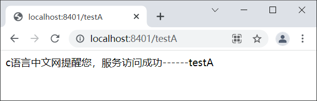
6，使用浏览器访问 Sentinel 控制台主页，我们发现在“首页”下方新增了一个“sentinel-servcie”的菜单
而这正是 spring-cloud-alibaba-sentinel-service-8401 的服务名（spring.application.name），说明 Sentinel 已经监控到这个服务，如下图。
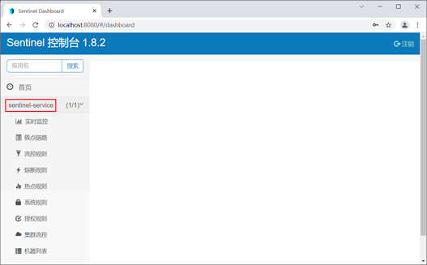
7，点击“实时监控”，查看 sentinel-service 下各请求的实时监控数据，如下图所示。
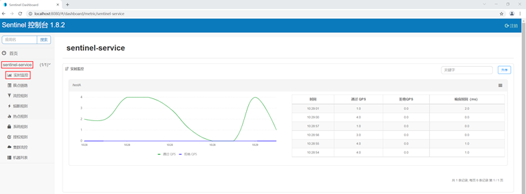


# 定义资源
资源是 Sentinel 中的核心概念之一。在项目开发时，我们只需要考虑这个服务、方法或代码是否需要保护，如果需要保护，就可以将它定义为一个资源。
Sentinel 为我们提供了多种定义资源的方式：
    1，适配主流框架自动定义资源
    2，通过 SphU 手动定义资源
    3，通过 SphO 手动定义资源
    4，注解方式定义资源
### 适配主流框架自定义资源
Sentinel 对大部分的主流框架都进行了适配，我们只要引入相关的适配模块（例如 spring-cloud-starter-alibaba-sentinel）
Snetinel 就会自动将项目中的服务（包括调用端和服务端）定义为资源，资源名就是服务的请求路径
此时，我们只要再定义一些规则，这些资源就可以享受到 Sentinel 的保护。

我们可以在 Sentinel 控制台的“簇点链路”中，直接查看被 Sentinel 监控的资源，如下图。


### 通过 SphU 手动定义资源
Sentinel 提供了一个名为 SphU 的类，它包含的 try-catch 风格的 API ，可以帮助我们手动定义资源。
下面我们就通过一个实例，来演示下如何通过 SphU 定义资源。
1，在 spring-cloud-alibaba-sentinel-service-8401 下的 SentinelFlowLimitController 中，新增一个 testAbySphU() 方法定义一个名为 testAbySphU 的资源，代码如下。
```java
package net.biancheng.c.controller;

import com.alibaba.csp.sentinel.Entry;
import com.alibaba.csp.sentinel.SphO;
import com.alibaba.csp.sentinel.SphU;
import com.alibaba.csp.sentinel.slots.block.BlockException;
import com.alibaba.csp.sentinel.slots.block.RuleConstant;
import com.alibaba.csp.sentinel.slots.block.flow.FlowRule;
import com.alibaba.csp.sentinel.slots.block.flow.FlowRuleManager;
import lombok.extern.slf4j.Slf4j;
import org.springframework.beans.factory.annotation.Value;
import org.springframework.web.bind.annotation.GetMapping;
import org.springframework.web.bind.annotation.RestController;

import java.util.ArrayList;
import java.util.List;

@RestController
@Slf4j
public class SentinelFlowLimitController {

    @Value("${server.port}")
    private String serverPort;

    @GetMapping("/testA")
    public String testA() {
        return testAbySphU();
    }

    @GetMapping("/testB")
    public String testB() {
        return "c语言中文网提醒您，服务访问成功------testB";
    }


    /**
     * 通过 SphU 手动定义资源
     * @return
     */
    public String testAbySphU() {
        Entry entry = null;
        try {
            entry = SphU.entry("testAbySphU");
            //您的业务逻辑 - 开始
            log.info("c语言中文网提醒您，服务访问成功------testA："+serverPort);
            return "c语言中文网提醒您，服务访问成功------testA："+serverPort;
            //您的业务逻辑 - 结束
        } catch (BlockException e1) {
            //流控逻辑处理 - 开始
            log.info("c语言中文网提醒您，testA 服务被限流");
            return "c语言中文网提醒您，testA 服务被限流";
            //流控逻辑处理 - 结束
        } finally {
            if (entry != null) {
                entry.exit();
            }
        }
    }
}
```
2，重启 spring-cloud-alibaba-sentinel-service-8401，使用浏览器访问“http://localhost:8401/testA”，结果如下。
```c语言中文网提醒您，服务访问成功------testA：8401```
3，访问 Sentinel 控制台主页，点击 sentinel-service 下的“簇点链路”，结果如下图。
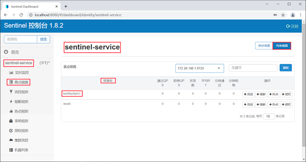

### 通过 SphO 手动定义资源
Sentinel 还提供了一个名为 SphO 的类，它包含了 if-else 风格的 API，能帮助我们手动定义资源。
通过这种方式定义的资源，发生了限流之后会返回 false，此时我们可以根据返回值，进行限流之后的逻辑处理。

下面我们就通过一个实例，来演示下如何通过 SphO 定义资源。
1，在 spring-cloud-alibaba-sentinel-service-8401 下的 SentinelFlowLimitController 中，新增一个 testBbySphO() 方法定义一个名为 testBbySphO 的资源，代码如下。
```java
package net.biancheng.c.controller;

import com.alibaba.csp.sentinel.Entry;
import com.alibaba.csp.sentinel.SphO;
import com.alibaba.csp.sentinel.SphU;
import com.alibaba.csp.sentinel.slots.block.BlockException;
import com.alibaba.csp.sentinel.slots.block.RuleConstant;
import com.alibaba.csp.sentinel.slots.block.flow.FlowRule;
import com.alibaba.csp.sentinel.slots.block.flow.FlowRuleManager;
import lombok.extern.slf4j.Slf4j;
import org.springframework.beans.factory.annotation.Value;
import org.springframework.web.bind.annotation.GetMapping;
import org.springframework.web.bind.annotation.RestController;

import java.util.ArrayList;
import java.util.List;

@RestController
@Slf4j
public class SentinelFlowLimitController {

    @Value("${server.port}")
    private String serverPort;


    @GetMapping("/testA")
    public String testA() {
        return testAbySphU();
    }

    @GetMapping("/testB")
    public String testB() {
        return testBbySphO();
    }

    /**
     * 通过 SphU 手动定义资源
     *
     * @return
     */
    public String testAbySphU() {
        Entry entry = null;
        try {
            entry = SphU.entry("testAbySphU");
            //您的业务逻辑 - 开始
            log.info("c语言中文网提醒您，服务访问成功------testA：" + serverPort);
            return "c语言中文网提醒您，服务访问成功------testA：" + serverPort;
            //您的业务逻辑 - 结束
        } catch (BlockException e1) {
            //流控逻辑处理 - 开始
            log.info("c语言中文网提醒您，testA 服务被限流");
            return "c语言中文网提醒您，testA 服务被限流";
            //流控逻辑处理 - 结束
        } finally {
            if (entry != null) {
                entry.exit();
            }
        }
    }

    /**
     * 通过 SphO 手动定义资源
     *
     * @return
     */
    public String testBbySphO() {
        if (SphO.entry("testBbySphO")) {
            // 务必保证finally会被执行
            try {
                log.info("c语言中文网提醒您，服务访问成功------testB：" + serverPort);
                return "c语言中文网提醒您，服务访问成功------testB：" + serverPort;
            } finally {
                SphO.exit();
            }
        } else {
            // 资源访问阻止，被限流或被降级
            //流控逻辑处理 - 开始
            log.info("c语言中文网提醒您，testB 服务被限流");
            return "c语言中文网提醒您，testB 服务被限流";
            //流控逻辑处理 - 结束
        }
    }
}
```
2，重启 spring-cloud-alibaba-sentinel-service-8401，使用浏览器访问“http://localhost:8401/testB”，结果如下。
```c语言中文网提醒您，服务访问成功------testB：8401```
3，访问 Sentinel 控制台主页，点击 sentinel-service 下的“簇点链路”，结果如下图。
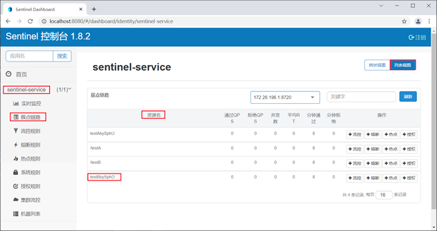

### 注解方式定义资源（推荐）
除了以上两种方式外，我们还可以通过 Sentinel 提供的 @SentinelResource 注解定义资源。

下面我们就通过一个实例，来演示下如何通过 @SentinelResource 注解定义资源。

1，将 spring-cloud-alibaba-sentinel-service-8401 中 SentinelFlowLimitController 类中增加以下代码。
```
@GetMapping("/testC")
@SentinelResource(value = "testCbyAnnotation") //通过注解定义资源
public String testC() {
    log.info("c语言中文网提醒您，服务访问成功------testC：" + serverPort);
    return "c语言中文网提醒您，服务访问成功------testC：" + serverPort;
}
```
2，重启 spring-cloud-alibaba-sentinel-service-8401，使用浏览器访问“http://localhost:8401/testC”，结果如下。
```c语言中文网提醒您，服务访问成功------testC：8401```
3，访问 Sentinel 控制台主页，点击 sentinel-service 下的“簇点链路”，结果如下图。
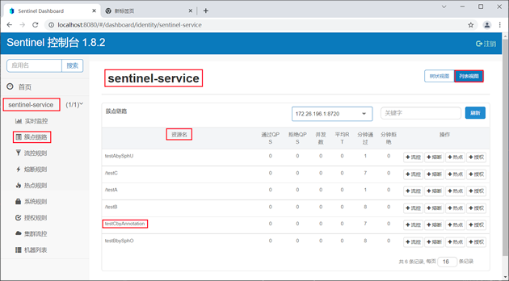


# Sentinel 流量控制
任何系统处理请求的能力都是有限的，但任意时间内到达系统的请求量往往是随机且不可控的
如果在某一个瞬时时刻请求量急剧增，那么系统就很有可能被瞬时的流量高峰冲垮。
为了避免此类情况发生，我们都需要根据系统的处理能力对请求流量进行控制，这就是我们常说的“流量控制”，简称“流控”。

Sentinel 作为一种轻量级高可用流量控制组件，流量控制是它最主要的工作之一。

我们可以针对资源定义流控规则，Sentinel 会根据这些规则对流量相关的各项指标进行监控。
当这些指标当达到或超过流控规则规定的阈值时，Sentinel 会对请求的流量进行限制（即“限流”）
以避免系统被瞬时的流量高峰冲垮，保障系统的高可用性。

一条流量规则主要由下表中的属性组成，我们可以通过组合这些属性来实现不同的限流效果。
属性	    说明	                                                    默认值
资源名	流控规则的作用对象。	                                     -
阈值	    流控的阈值。	                                             -
阈值类型	流控阈值的类型，包括 QPS 或并发线程数。	                    QPS
针对来源	流控针对的调用来源。	                                default，表示不区分调用来源
流控模式	调用关系限流策略，包括直接、链路和关联。	                     直接
流控效果	流控效果（直接拒绝、Warm Up、匀速排队），不支持按调用关系限流。	直接拒绝
同一个资源可以创建多条流控规则，Sentinel 会遍历这些规则，直到有规则触发限流或者所有规则遍历完毕为止。
Sentinel 触发限流时，资源会抛出 BlockException 异常，此时我们可以捕捉 BlockException 来自定义被限流之后的处理逻辑。
## 通过 Sentinel 控制台定义流控规则
我们可以通过 Sentinel 控制台，直接对资源定义流控规则，操作步骤如下。
1，在 spring-cloud-alibaba-sentinel-service-8401 的 SentinelFlowLimitController 中新增一个名为 testD 的服务方法，代码如下。
```
/**
 * 通过 Sentinel 控制台定义流控规则
 *
 * @return
 */
@GetMapping("/testD")
public String testD() {
    log.info("c语言中文网提醒您，服务访问成功------testD：" + serverPort);
    return "c语言中文网提醒您，服务访问成功------testD：" + serverPort;
}
```
2，重启 spring-cloud-alibaba-sentinel-service-8401，使用浏览器访问“http://localhost:8401/testD”，结果如下。
```c语言中文网提醒您，服务访问成功------testD：8401```
3，使用浏览器访问“http://localhost:8080”，登陆 Sentinel 控制台主页，点击 sentinel-sevice 下的“簇点链路”，结果如下图。
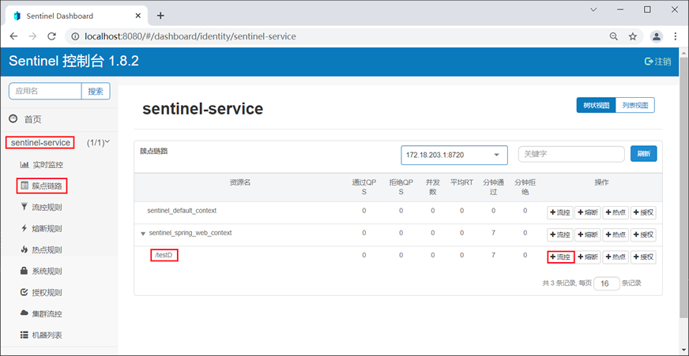
4，点击“/testD”右侧的“+流控”按钮，在弹出的“新增流控规则”窗口中定义流控规则，如下图。
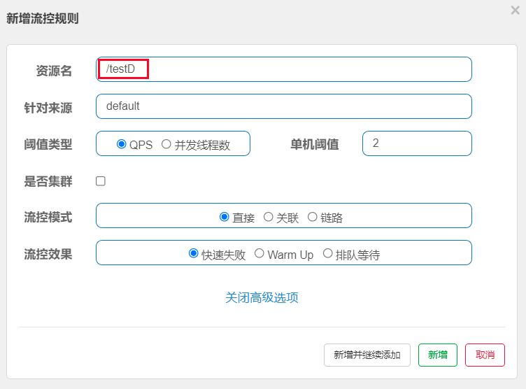
5，点击下方的“新增”按钮，跳转到“流控规则”列表，如下图。
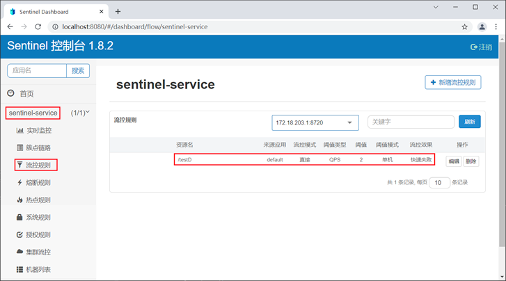
6，快速连续（频率大于每秒钟 2 次）访问“http://localhost:8401/testD”，结果如下
```Blocked by Sentinel (flow limiting)```
若页面中出现以上信息，则说明该服务已被限流，但这种提示是 Sentinel 系统自动生成的，用户体验不好。
7，在服务代码中使用 @SentinelResource 注解定义资源名称，并在 blockHandler 属性指定一个限流函数，自定义服务限流信息，代码如下。
```
/**
 * 通过 Sentinel 控制台定义流控规则
 *
 */
@GetMapping("/testD")
@SentinelResource(value = "testD-resource", blockHandler = "blockHandlerTestD") //通过注解定义资源
public String testD() {
    log.info("c语言中文网提醒您，服务访问成功------testD：" + serverPort);
    return "c语言中文网提醒您，服务访问成功------testD：" + serverPort;
}
/**
 * 限流之后的逻辑
 * @param exception
 * @return
 */
public String blockHandlerTestD(BlockException exception) {
    log.info(Thread.currentThread().getName() + "c语言中文网提醒您，TestD服务访问失败! 您已被限流，请稍后重试");
    return "c语言中文网提醒您，TestD服务访问失败! 您已被限流，请稍后重试";
}
```
在以上代码中，我们通过 @SentinelResource 注解的 blockHandler 属性指定了一个 blockHandler 函数，进行限流之后的后续处理。

使用 @SentinelResource 注解的 blockHandler 属性时，需要注意以下事项：
1，blockHandler 函数访问范围需要是 public；
2，返回类型需要与原方法相匹配；
3，参数类型需要和原方法相匹配并且最后加一个额外的参数，类型为 BlockException；
4，blockHandler 函数默认需要和原方法在同一个类中，若希望使用其他类的函数，则可以指定 blockHandler 为对应的类的 Class 对象，注意对应的函数必需为 static 函数，否则无法解析。
5，请务必添加 blockHandler 属性来指定自定义的限流处理方法，若不指定，则会跳转到错误页（用户体验不好）。
快速连续（频率大于每秒钟 2 次）访问“http://localhost:8401/testD”，结果如下。
```c语言中文网提醒您，TestD服务访问失败! 您已被限流，请稍后重试```
## 通过代码定义流控规则
我们还可以在服务代码中，调用 FlowRuleManager 类的 loadRules() 方法来定义流控规则，该方法需要一个 FlowRule 类型的 List 集合作为其参数，示例代码如下。
```
public static void loadRules(List<FlowRule> rules) {
    currentProperty.updateValue(rules); 
}
```
FlowRule 可以通过以下属性定义流控规则：
    resource：资源名，即限流规则的作用对象
        唯一名称，默认请求路径
    count: 限流阈值
        1.QPS：每秒请求数，当前调用该api的QPS到达阈值的时候进行限流
        2.线程数：当调用该api的线程数到达阈值的时候，进行限流
    grade: 限流阈值类型（QPS 或并发线程数）
    limitApp: 流控针对的调用来源，若为 default 则不区分调用来源
    Sentinel可以针对调用者进行限流，填写微服务名，默认为default(不区分来源)
    strategy: 调用关系限流策略
        1.直接：当api大达到限流条件时，直接限流
        2.关联：当关联的资源到达阈值，就限流自己
        3.链路：只记录指定路上的流量，指定资源从入口资源进来的流量，如果达到阈值，就进行限流，api级别的限流
    controlBehavior: 流量控制效果（直接拒绝、Warm Up、匀速排队）

下面我们就通过一个简单的实例，来演示下如何通过代码定义流控规则，步骤如下。
1，在 spring-cloud-alibaba-sentinel-service-8401 的 SentinelFlowLimitController 中添加一个 initFlowRules() 方法，为名为 testD-resource 的资源定义流控规则：每秒最多只能通过 2 个请求，即 QPS 的阈值为 2。
```
/**
 * 通过代码定义流量控制规则
 */
private static void initFlowRules() {
    List<FlowRule> rules = new ArrayList<>();
    //定义一个限流规则对象
    FlowRule rule = new FlowRule();
    //资源名称
    rule.setResource("testD-resource");
    //限流阈值的类型
    rule.setGrade(RuleConstant.FLOW_GRADE_QPS);
    // 设置 QPS 的阈值为 2
    rule.setCount(2);
    rules.add(rule);
    //定义限流规则
    FlowRuleManager.loadRules(rules);
}
```
2，在 testD() 方法中调用 initFlowRules() 方法，初始化流控规则，代码如下。
```
@GetMapping("/testD")
@SentinelResource(value = "testD-resource", blockHandler = "blockHandlerTestD") //通过注解定义资源
public String testD() {
    initFlowRules(); //调用初始化流控规则的方法
    log.info("c语言中文网提醒您，服务访问成功------testD：" + serverPort);
    return "c语言中文网提醒您，服务访问成功------testD：" + serverPort;
}
```
3，重启 spring-cloud-alibaba-sentinel-service-8401，并使用浏览器访问“http://localhost:8401/testD”，结果如下。
```c语言中文网提醒您，服务访问成功------testD：8401```
4，快速连续（频率大于每秒钟 2 次）访问“http://localhost:8401/testD”，结果如下。
```c语言中文网提醒您，TestD服务访问失败! 您已被限流，请稍后重试```
5，打开命令行窗口，执行以下命令查看资源的实时统计信息。
```curl http://localhost:8719/cnode?id=testD-resource```
6，控制台输出内容如下。
```
idx id                thread    pass      blocked   success    total    aRt   1m-pass   1m-block   1m-all   exceptio
2   testD-resource      0        0.0       0.0       0.0        0.0      0.0   10        16         26       0.0
```
实时统计信息各列名说明如下：
    thread： 代表当前处理该资源的并发数；
    pass： 代表一秒内到来到的请求；
    blocked： 代表一秒内被流量控制的请求数量；
    success： 代表一秒内成功处理完的请求；
    total： 代表到一秒内到来的请求以及被阻止的请求总和；
    RT： 代表一秒内该资源的平均响应时间；
    1m-pass： 则是一分钟内到来的请求；
    1m-block： 则是一分钟内被阻止的请求；
    1m-all： 则是一分钟内到来的请求和被阻止的请求的总和；
    exception： 则是一秒内业务本身异常的总和。
## strategy流控模式详解
1，直接
    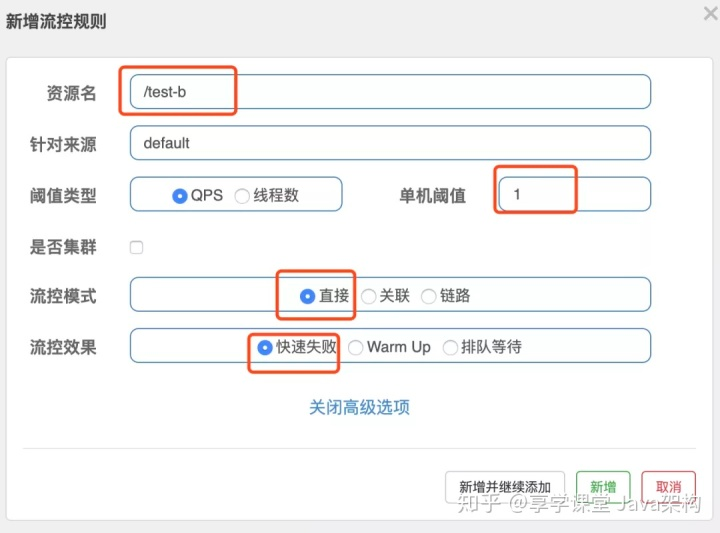
    如图当我们调用/test-b，慢一点请求，正常返回；快速请求几次，超过阀值就会失败
2，关联
    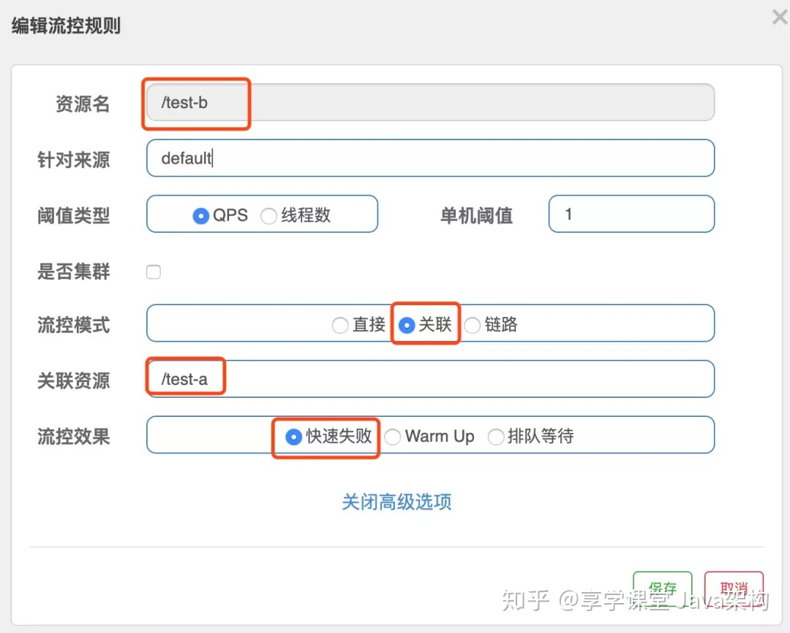
    当关联的资源达到阀值，就限流自己
    如图所示，设置了关联资源为/test-a，上图设置的效果就是当关联资源/test-a的qps阀值超过1时，就限流/test-b接口
    使用场景：
        举个例子，订单服务中会有2个重要的接口，一个是读取订单信息接口，一个是写入订单信息接口。
        在高并发业务场景中，两个接口都会占用资源，如果读取接口访问过大，就会影响写入接口的性能。
        业务中如果我们希望写入订单比较重要，要优先考虑写入订单接口。那就可以利用关联模式；
        在关联资源上面设置写入接口，资源名设置读取接口就行了；这样就起到了优先写入，一旦写入请求多，就限制读的请求。
    总结：满足下面条件可以使用关联模式
        1，两个有竞争关系的资源
        2，一个优先级较高，一个优先级较低
3，链路
    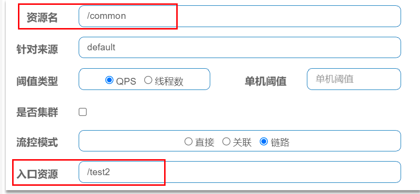
    链路模式：只针对从指定链路访问到本资源的请求做统计，判断是否超过阈值。
    例如有两条请求链路：
    /test1      /common
    /test2      /common
    如果只希望统计从/test2进入到/common的请求，对/test2 进行限流，则可以这样配置：
    案例：流控模式-链路
        需求：有查询订单和创建订单业务，两者都需要查询商品。针对从查询订单进入到查询商品的请求统计，并设置限流。
## controlBehavior流控效果详解
1，直接拒绝（CONTROL_BEHAVIOR_DEFAULT）
    该方式是默认的流量控制方式，当 qps 超过任意规则的阈值后，新的请求就会被立即拒绝，拒绝方式为抛出FlowException。
    这种方式适用于对系统处理能力确切已知的情况下，比如通过压测确定了系统的准确水位。
2，Warm Up（CONTROL_BEHAVIOR_WARM_UP）
    该方式主要用于当系统长期处于低水位的情况下，流量突然增加时，直接把系统拉升到高水位可能瞬间把系统压垮。
    即如果系统在此之前长期处于空闲的状态，我们希望处理请求的数量是缓步的增多，经过预期的时间以后，到达系统处理请求个数的最大值。
    Warm Up（冷启动，预热）模式就是为了实现这个目的的。默认 coldFactor 为 3，即请求 QPS 从 threshold / 3 开始，经预热时长逐渐升至设定的 QPS 阈值。
3，排队等待模式（CONTROL_BEHAVIOR_RATE_LIMITER）
    匀速排队（RuleConstant.CONTROL_BEHAVIOR_RATE_LIMITER）方式会严格控制请求通过的间隔时间，也即是让请求以均匀的速度通过，对应的是漏桶算法。阈值必须设置为QPS。
    这种方式主要用于处理间隔性突发的流量，例如消息队列。想象一下这样的场景，在某一秒有大量的请求到来，而接下来的几秒则处于空闲状态，我们希望系统能够在接下来的空闲期间逐渐处理这些请求，而不是在第一秒直接拒绝多余的请求。
    某瞬时来了大流量的请求, 而如果此时要处理所有请求，很可能会导致系统负载过高，影响稳定性。但其实可能后面几秒之内都没有消息投递，若直接把多余的消息丢掉则没有充分利用系统处理消息的能力。Sentinel的Rate Limiter模式能在某一段时间间隔内以匀速方式处理这样的请求, 充分利用系统的处理能力, 也就是削峰填谷, 保证资源的稳定性.
    Sentinel会以固定的间隔时间让请求通过, 访问资源。当请求到来的时候，如果当前请求距离上个通过的请求通过的时间间隔不小于预设值，则让当前请求通过；
    否则，计算当前请求的预期通过时间，如果该请求的预期通过时间小于规则预设的 timeout 时间，则该请求会等待直到预设时间到来通过；反之，则马上抛出阻塞异常。
    使用Sentinel的这种策略, 简单点说, 就是使用一个时间段(比如20s的时间)处理某一瞬时产生的大量请求, 起到一个削峰填谷的作用, 从而充分利用系统的处理能力
    场景:
        模拟2个用户同时并发的访问资源，发出100个请求,
        如果设置QPS阈值为1, 拒绝策略修改为Rate Limiter匀速RuleConstant.CONTROL_BEHAVIOR_RATE_LIMITER方式,
        还需要设置setMaxQueueingTimeMs(20 * 1000)表示每一请求最长等待时间, 这里等待时间大一点, 以保证让所有请求都能正常通过;
        假设这里设置的排队等待时间过小的话, 导致排队等待的请求超时而抛出异常BlockException, 最终结果可能是这100个并发请求中只有一个请求或几个才能正常通过, 
        所以使用这种模式得根据访问资源的耗时时间决定排队等待时间. 按照目前这种设置, QPS阈值为10的话, 每一个请求相当于是以匀速100ms左右通过


# 熔断降级规则
除了流量控制以外，对调用链路中不稳定资源的熔断降级，也是保障服务高可用的重要措施之一。

在分布式微服务架构中，一个系统往往由多个服务组成，不同服务之间相互调用，组成复杂的调用链路。
如果链路上的某一个服务出现故障，那么故障就会沿着调用链路在系统中蔓延，最终导致整个系统瘫痪。
Sentinel 提供了熔断降级机制就可以解决这个问题。

Sentinel 的熔断将机制会在调用链路中某个资源出现不稳定状态时（例如调用超时或异常比例升高），暂时切断对这个资源的调用，以避免局部不稳定因素导致整个系统的雪崩。

熔断降级作为服务保护自身的手段，通常在客户端（调用端）进行配置，资源被熔断降级最直接的表现就是抛出 DegradeException 异常。
## Sentinel 熔断策略
Sentinel 提供了 3 种熔断策略
1，慢调用比例(SLOW_REQUEST_RATIO）
    - 选择以慢调用比例作为阈值，需要设置允许的慢调用 RT（即最大响应时间），若请求的响应时间大于该值则统计为慢调用。
    - 当单位统计时长（statIntervalMs）内请求数目大于设置的最小请求数目，且慢调用的比例大于阈值，则接下来的熔断时长内请求会自动被熔断。
    - 经过熔断时长后熔断器会进入探测恢复状态（HALF-OPEN 状态），若接下来的一个请求响应时间小于设置的慢调用 RT 则结束熔断，若大于设置的慢调用 RT 则再次被熔断。
2，异常比例 (ERROR_RATIO)
    - 当单位统计时长（statIntervalMs）内请求数目大于设置的最小请求数目且异常的比例大于阈值，则在接下来的熔断时长内请求会自动被熔断。
    - 经过熔断时长后熔断器会进入探测恢复状态（HALF-OPEN 状态），若接下来的一个请求成功完成（没有错误）则结束熔断，否则会再次被熔断。异常比率的阈值范围是 [0.0, 1.0]，代表 0% - 100%。
3，异常数 (ERROR_COUNT)
    - 当单位统计时长内的异常数目超过阈值之后会自动进行熔断。
    - 经过熔断时长后熔断器会进入探测恢复状态（HALF-OPEN 状态），若接下来的一个请求成功完成（没有错误）则结束熔断，否则会再次被熔断。
## Sentinel 熔断状态
Sentinel 熔断降级中共涉及 3 种状态，熔断状态的之间的转换过程如下图。
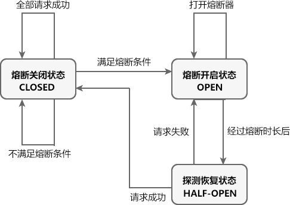
熔断关闭状态（CLOSED）
    处于关闭状态时，请求可以正常调用资源。
    满足以下任意条件，Sentinel 熔断器进入熔断关闭状态：
        1，全部请求访问成功。
        2，单位统计时长（statIntervalMs）内请求数目小于设置的最小请求数目。
        3，未达到熔断标准，例如服务超时比例、异常数、异常比例未达到阈值。
        4，处于探测恢复状态时，下一个请求访问成功。
熔断开启状态（OPEN）
    处于熔断开启状态时，熔断器会一定的时间（规定的熔断时长）内，暂时切断所有请求对该资源的调用
    并调用相应的降级逻辑使请求快速失败避免系统崩溃。
    满足以下任意条件，Sentinel 熔断器进入熔断开启状态：
        1，单位统计时长内请求数目大于设置的最小请求数目，且已达到熔断标准，例如请求超时比例、异常数、异常比例达到阈值。
        2，处于探测恢复状态时，下一个请求访问失败。
探测恢复状态（HALF-OPEN）
    处于探测恢复状态时，Sentinel 熔断器会允许一个请求调用资源。
    则若接下来的一个请求成功完成（没有错误）则结束熔断，熔断器进入熔断关闭（CLOSED）状态；
    否则会再次被熔断，熔断器进入熔断开启（OPEN）状态。
    何时开启：
        在熔断开启一段时间（降级窗口时间或熔断时长，单位为 s）后，Sentinel 熔断器自动会进入探测恢复状态
## Sentinel 熔断规则属性
Sentinel 熔断降级规则包含多个重要属性，如下表所示。
1，资源名（作用域所有熔断策略）
    规则的作用对象。
2，熔断策略
    Sentinel 支持3 中熔断策略：慢调用比例、异常比例、异常数策略。
3，最大 RT
    请求的最大相应时间，请求的响应时间大于该值则统计为慢调用。
4，熔断时长
    熔断开启状态持续的时间，超过该时间熔断器会切换为探测恢复状态（HALF-OPEN），单位为 s。
5，最小请求数
    熔断触发的最小请求数，请求数小于该值时即使异常比率超出阈值也不会熔断（1.7.0 引入）。
6，统计时长
    熔断触发需要统计的时长（单位为 ms），如 60*1000 代表分钟级（1.8.0 引入）。
7，比例阈值
    分为慢调用比例阈值和异常比例阈值，即慢调用或异常调用占所有请求的百分比，取值范围 [0.0,1.0]。
8，异常数
    请求或调用发生的异常的数量。
## Sentinel 实现熔断降级过程
1，在项目中，使用 @SentinelResource 注解的 fallback 属性可以为资源指定熔断降级逻辑（方法）。
2，通过 Sentinel 控制台或代码定义熔断规则，包括熔断策略、最小请求数、阈值、熔断时长以及统计时长等。
3，若单位统计时长（statIntervalMs）内，请求数目大于设置的最小请求数目且达到熔断标准（例如请求超时比例、异常数、异常比例达到阈值），Sentinel 熔断器进入熔断开启状态（OPEN）。
4，处于熔断开启状态时， @SentinelResource 注解的 fallback 属性指定的降级逻辑会临时充当主业务逻辑，而原来的主逻辑则暂时不可用。当有请求访问该资源时，会直接调用降级逻辑使请求快速失败，而不会调用原来的主业务逻辑。
5，在经过一段时间（在熔断规则中设置的熔断时长）后，熔断器会进入探测恢复状态（HALF-OPEN），此时 Sentinel 会允许一个请求对原来的主业务逻辑进行调用，并监控其调用结果。
6，若请求调用成功，则熔断器进入熔断关闭状态（CLOSED ），服务原来的主业务逻辑恢复，否则重新进入熔断开启状态（OPEN）。
## 演示通过Sentinel控制台，对资源定义降级规则
1，在 MySQL 的 bianchengbang_jdbc 数据库中执行以下 SQL，准备测试数据。
```sql
DROP TABLE IF EXISTS `dept`;
CREATE TABLE `dept` (
  `dept_no` int NOT NULL AUTO_INCREMENT,
  `dept_name` varchar(255) DEFAULT NULL,
  `db_source` varchar(255) DEFAULT NULL,
  PRIMARY KEY (`dept_no`)
) ENGINE=InnoDB AUTO_INCREMENT=6 DEFAULT CHARSET=utf8mb4 COLLATE=utf8mb4_0900_ai_ci;


INSERT INTO `dept` VALUES ('1', '开发部', 'bianchengbang_jdbc');
INSERT INTO `dept` VALUES ('2', '人事部', 'bianchengbang_jdbc');
INSERT INTO `dept` VALUES ('3', '财务部', 'bianchengbang_jdbc');
INSERT INTO `dept` VALUES ('4', '市场部', 'bianchengbang_jdbc');
INSERT INTO `dept` VALUES ('5', '运维部', 'bianchengbang_jdbc');
```
2，在主工程 spring-cloud-alibaba-demo 下，创建一个名为 spring-cloud-alibaba-provider-mysql-8003 的 Spring Boot 模块，并在其 pom.xml 中添加相关依赖，代码如下。
```
<?xml version="1.0" encoding="UTF-8"?>
<project xmlns="http://maven.apache.org/POM/4.0.0" xmlns:xsi="http://www.w3.org/2001/XMLSchema-instance"
         xsi:schemaLocation="http://maven.apache.org/POM/4.0.0 https://maven.apache.org/xsd/maven-4.0.0.xsd">
    <modelVersion>4.0.0</modelVersion>
    <parent>
        <groupId>net.biancheng.c</groupId>
        <version>1.0-SNAPSHOT</version>
        <artifactId>spring-cloud-alibaba-demo</artifactId>
    </parent>
    <groupId>net.biancheng.c</groupId>
    <artifactId>spring-cloud-alibaba-provider-mysql-8003</artifactId>
    <version>0.0.1-SNAPSHOT</version>
    <name>spring-cloud-alibaba-provider-mysql-8003</name>
    <description>Demo project for Spring Boot</description>
    <properties>
        <java.version>1.8</java.version>
    </properties>
    <dependencies>
        <dependency>
            <groupId>org.springframework.boot</groupId>
            <artifactId>spring-boot-starter-web</artifactId>
        </dependency>
        <dependency>
            <groupId>org.springframework.boot</groupId>
            <artifactId>spring-boot-devtools</artifactId>
            <scope>runtime</scope>
            <optional>true</optional>
        </dependency>
        <dependency>
            <groupId>org.projectlombok</groupId>
            <artifactId>lombok</artifactId>
            <optional>true</optional>
        </dependency>
        <dependency>
            <groupId>org.springframework.boot</groupId>
            <artifactId>spring-boot-starter-test</artifactId>
            <scope>test</scope>
        </dependency>
        <dependency>
            <groupId>com.alibaba.cloud</groupId>
            <artifactId>spring-cloud-starter-alibaba-nacos-discovery</artifactId>
        </dependency>
        <dependency>
            <groupId>net.biancheng.c</groupId>
            <artifactId>spring-cloud-alibaba-api</artifactId>
            <version>${project.version}</version>
        </dependency>
        <dependency>
            <groupId>junit</groupId>
            <artifactId>junit</artifactId>
            <version>4.12</version>
        </dependency>
        <dependency>
            <groupId>mysql</groupId>
            <artifactId>mysql-connector-java</artifactId>
            <version>5.1.49</version>
        </dependency>
        <dependency>
            <groupId>ch.qos.logback</groupId>
            <artifactId>logback-core</artifactId>
        </dependency>
        <dependency>
            <groupId>org.mybatis.spring.boot</groupId>
            <artifactId>mybatis-spring-boot-starter</artifactId>
            <version>2.2.0</version>
        </dependency>
        <!--添加 Spring Boot 的监控模块-->
        <!-- https://mvnrepository.com/artifact/org.springframework.boot/spring-boot-starter-actuator -->
        <dependency>
            <groupId>org.springframework.boot</groupId>
            <artifactId>spring-boot-starter-actuator</artifactId>
        </dependency>
    </dependencies>
    <build>
        <plugins>
            <plugin>
                <groupId>org.springframework.boot</groupId>
                <artifactId>spring-boot-maven-plugin</artifactId>
                <configuration>
                    <excludes>
                        <exclude>
                            <groupId>org.projectlombok</groupId>
                            <artifactId>lombok</artifactId>
                        </exclude>
                    </excludes>
                </configuration>
            </plugin>
        </plugins>
    </build>
</project>
```
3，在 spring-cloud-alibaba-provider-mysql-8003 的类路径下，创建一个配置文件 application.yml，配置如下。
```yml
server:
  port: 8003 #端口
spring:
  application:
    name: spring-cloud-alibaba-provider-mysql
  cloud:
    nacos:
      discovery:
        server-addr: localhost:1111
  ######################### 数据库连接 #################################
  datasource:
    username: root        #数据库登陆用户名
    password: root        #数据库登陆密码
    url: jdbc:mysql://127.0.0.1:3306/spring_cloud_db2       #数据库url
    driver-class-name: com.mysql.jdbc.Driver
management:
  endpoints:
    web:
      exposure:
        include: "*"   # * 在yaml 文件属于关键字，所以需要加引号
###################################### MyBatis 配置 ######################################
mybatis:
  # 指定 mapper.xml 的位置
  mapper-locations: classpath:mybatis/mapper/*.xml
  #扫描实体类的位置,在此处指明扫描实体类的包，在 mapper.xml 中就可以不写实体类的全路径名
  type-aliases-package: net.biancheng.c.entity
  configuration:
    #默认开启驼峰命名法，可以不用设置该属性
    map-underscore-to-camel-case: true
```
4，在 net.biancheng.c.entity 包下，创建一个名为 Dept 的实体类，代码如下。
```java
package net.biancheng.c.entity;
import lombok.AllArgsConstructor;
import lombok.Data;
import lombok.NoArgsConstructor;
import lombok.experimental.Accessors;
import java.io.Serializable;
@AllArgsConstructor
@NoArgsConstructor //无参构造函数
@Data // 提供类的get、set、equals、hashCode、canEqual、toString 方法
@Accessors(chain = true)
public class Dept implements Serializable {
    private Integer deptNo;
    private String deptName;
    private String dbSource;
}
```
5，在 net.biancheng.c.entity 包下，创建一个名为 CommonResult 的 Java 类，代码如下。
```java
package net.biancheng.c.entity;
import lombok.AllArgsConstructor;
import lombok.Data;
import lombok.NoArgsConstructor;
@Data
@AllArgsConstructor
@NoArgsConstructor
public class CommonResult<T> {
    private Integer code;
    private String message;
    private T data;
    public CommonResult(Integer code, String message) {
        this(code, message, null);
    }
}
```
6，在 net.biancheng.c.mapper 包下，创建一个名为 DeptMapper 的接口，代码如下。
```
package net.biancheng.c.mapper;
import net.biancheng.c.entity.Dept;
import org.apache.ibatis.annotations.Mapper;
import java.util.List;
@Mapper
public interface DeptMapper {
    //根据主键获取数据
    Dept selectByPrimaryKey(Integer deptNo);
    //获取表中的全部数据
    List<Dept> GetAll();
}
```
7，在 spring-cloud-alibaba-provider-mysql-8003 的  /resources/mybatis/mapper/  目录下，创建一个名为 DeptMapper.xml 的 MyBatis 映射文件，配置内容如下。
```xml
<?xml version="1.0" encoding="UTF-8"?>
<!DOCTYPE mapper PUBLIC "-//mybatis.org//DTD Mapper 3.0//EN" "http://mybatis.org/dtd/mybatis-3-mapper.dtd">
<mapper namespace="net.biancheng.c.mapper.DeptMapper">
    <resultMap id="BaseResultMap" type="net.biancheng.c.entity.Dept">
        <id column="dept_no" jdbcType="INTEGER" property="deptNo"/>
        <result column="dept_name" jdbcType="VARCHAR" property="deptName"/>
        <result column="db_source" jdbcType="VARCHAR" property="dbSource"/>
    </resultMap>
    <sql id="Base_Column_List">
        dept_no
        , dept_name, db_source
    </sql>
    <select id="selectByPrimaryKey" parameterType="java.lang.Integer" resultMap="BaseResultMap">
        select
        <include refid="Base_Column_List"/>
        from dept
        where dept_no = #{deptNo,jdbcType=INTEGER}
    </select>
    <select id="GetAll" resultType="net.biancheng.c.entity.Dept">
        select *
        from dept;
    </select>
</mapper>
```
8，在 net.biancheng.c.service 包下，创建一个名为 DeptService 的接口，代码如下。
```java
package net.biancheng.c.service;
import net.biancheng.c.entity.Dept;
import java.util.List;
public interface DeptService {
    Dept get(Integer deptNo);
    List<Dept> selectAll();
}
```
9，在 net.biancheng.c.service.impl 包下，创建 DeptService 接口的实现类 DeptServiceImpl，代码如下。
```java
package net.biancheng.c.service.impl;
import net.biancheng.c.entity.Dept;
import net.biancheng.c.mapper.DeptMapper;
import net.biancheng.c.service.DeptService;
import org.springframework.beans.factory.annotation.Autowired;
import org.springframework.stereotype.Service;
import java.util.List;
@Service("deptService")
public class DeptServiceImpl implements DeptService {
    @Autowired
    private DeptMapper deptMapper;
    @Override
    public Dept get(Integer deptNo) {
        return deptMapper.selectByPrimaryKey(deptNo);
    }
    @Override
    public List<Dept> selectAll() {
        return deptMapper.GetAll();
    }
}
```
10，在 net.biancheng.c.controller 包下，创建一个名为 DeptController 的 Contorller 类，代码如下。
```java
package net.biancheng.c.controller;
import lombok.extern.slf4j.Slf4j;
import net.biancheng.c.entity.CommonResult;
import net.biancheng.c.entity.Dept;
import net.biancheng.c.service.DeptService;
import org.springframework.beans.factory.annotation.Autowired;
import org.springframework.beans.factory.annotation.Value;
import org.springframework.web.bind.annotation.PathVariable;
import org.springframework.web.bind.annotation.RequestMapping;
import org.springframework.web.bind.annotation.RequestMethod;
import org.springframework.web.bind.annotation.RestController;
import java.util.List;
import java.util.concurrent.TimeUnit;
@RestController
@Slf4j
public class DeptController {
    @Autowired
    private DeptService deptService;
    @Value("${server.port}")
    private String serverPort;
    @RequestMapping(value = "/dept/get/{id}", method = RequestMethod.GET)
    public CommonResult<Dept> get(@PathVariable("id") int id) {
        log.info("端口：" + serverPort + "\t+ dept/get/");
        try {
            TimeUnit.SECONDS.sleep(1);
            log.info("休眠 1秒");
        } catch (InterruptedException e) {
            e.printStackTrace();
        }
        Dept dept = deptService.get(id);
        CommonResult<Dept> result = new CommonResult(200, "from mysql,serverPort:  " + serverPort, dept);
        return result;
    }
    @RequestMapping(value = "/dept/list", method = RequestMethod.GET)
    public CommonResult<List<Dept>> list() {
        log.info("端口：" + serverPort + "\t+ dept/list/");
        List<Dept> depts = deptService.selectAll();
        CommonResult<List<Dept>> result = new CommonResult(200, "from mysql,serverPort:  " + serverPort, depts);
        return result;
    }
}
```
11，spring-cloud-alibaba-provider-mysql-8003 的主启动类代码如下。
```java
package net.biancheng.c;
import org.springframework.boot.SpringApplication;
import org.springframework.boot.autoconfigure.SpringBootApplication;
import org.springframework.cloud.client.discovery.EnableDiscoveryClient;
@SpringBootApplication
@EnableDiscoveryClient
public class SpringCloudAlibabaProviderMysql8003Application {
    public static void main(String[] args) {
        SpringApplication.run(SpringCloudAlibabaProviderMysql8003Application.class, args);
    }
}
```
12，在主工程 spring-cloud-alibaba-demo 下，创建一个名为 spring-cloud-alibaba-consumer-mysql-8803 的 Spring Boot 模块，并在其 pom.xml 添加依赖，内容如下。
```xml
<?xml version="1.0" encoding="UTF-8"?>
<project xmlns="http://maven.apache.org/POM/4.0.0" xmlns:xsi="http://www.w3.org/2001/XMLSchema-instance"
         xsi:schemaLocation="http://maven.apache.org/POM/4.0.0 https://maven.apache.org/xsd/maven-4.0.0.xsd">
    <modelVersion>4.0.0</modelVersion>
    <parent>
        <groupId>net.biancheng.c</groupId>
        <version>1.0-SNAPSHOT</version>
        <artifactId>spring-cloud-alibaba-demo</artifactId>
    </parent>
    <groupId>net.biancheng.c</groupId>
    <artifactId>spring-cloud-alibaba-consumer-mysql-8803</artifactId>
    <version>0.0.1-SNAPSHOT</version>
    <name>spring-cloud-alibaba-consumer-mysql-8803</name>
    <description>Demo project for Spring Boot</description>
    <properties>
        <java.version>1.8</java.version>
    </properties>
    <dependencies>
        <!--SpringCloud ailibaba nacos -->
        <dependency>
            <groupId>com.alibaba.cloud</groupId>
            <artifactId>spring-cloud-starter-alibaba-nacos-discovery</artifactId>
            <exclusions>
                <exclusion>
                    <groupId>org.springframework.cloud</groupId>
                    <artifactId>spring-cloud-starter-netflix-ribbon</artifactId>
                </exclusion>
            </exclusions>
        </dependency>
        <dependency>
            <groupId>org.springframework.boot</groupId>
            <artifactId>spring-boot-starter-web</artifactId>
        </dependency>
        <!--引入 OpenFeign 的依赖-->
        <dependency>
            <groupId>org.springframework.cloud</groupId>
            <artifactId>spring-cloud-starter-openfeign</artifactId>
        </dependency>
        <dependency>
            <groupId>org.springframework.cloud</groupId>
            <artifactId>spring-cloud-loadbalancer</artifactId>
        </dependency>
        <dependency>
            <groupId>org.springframework.boot</groupId>
            <artifactId>spring-boot-devtools</artifactId>
            <scope>runtime</scope>
            <optional>true</optional>
        </dependency>
        <dependency>
            <groupId>org.projectlombok</groupId>
            <artifactId>lombok</artifactId>
            <optional>true</optional>
        </dependency>
        <dependency>
            <groupId>org.springframework.boot</groupId>
            <artifactId>spring-boot-starter-test</artifactId>
            <scope>test</scope>
        </dependency>
        <!--SpringCloud ailibaba sentinel -->
        <dependency>
            <groupId>com.alibaba.cloud</groupId>
            <artifactId>spring-cloud-starter-alibaba-sentinel</artifactId>
        </dependency>
        <dependency>
            <groupId>net.biancheng.c</groupId>
            <artifactId>spring-cloud-alibaba-api</artifactId>
            <version>${project.version}</version>
        </dependency>
        <dependency>
            <groupId>org.springframework.boot</groupId>
            <artifactId>spring-boot-starter-actuator</artifactId>
        </dependency>
    </dependencies>
    <build>
        <plugins>
            <plugin>
                <groupId>org.springframework.boot</groupId>
                <artifactId>spring-boot-maven-plugin</artifactId>
                <configuration>
                    <excludes>
                        <exclude>
                            <groupId>org.projectlombok</groupId>
                            <artifactId>lombok</artifactId>
                        </exclude>
                    </excludes>
                </configuration>
            </plugin>
        </plugins>
    </build>
</project>
```
13，在 spring-cloud-alibaba-consumer-mysql-8803 的类路径下，创建一个配置文件 application.yml，配置内容如下。
```yml
server:
  port: 8803
spring:
  application:
    name: spring-cloud-alibaba-consumer-mysql-feign
  cloud:
    nacos:
      discovery:
        server-addr: localhost:1111
    sentinel:
      transport:
        dashboard: localhost:8080
        port: 8719
# 以下配置信息并不是默认配置，而是我们自定义的配置，目的是不在 Controller 内硬编码 服务提供者的服务名
service-url:
  nacos-user-service: http://spring-cloud-alibaba-provider-mysql #消费者要方位的微服务名称
# 激活Sentinel对Feign的支持
feign:
  sentinel:
    enabled: true
```
14，在 net.biancheng.c.service 包下，创建一个名为 DeptFeignService 的接口，代码如下。
```java
package net.biancheng.c.service;
import net.biancheng.c.entity.CommonResult;
import net.biancheng.c.entity.Dept;
import org.springframework.cloud.openfeign.FeignClient;
import org.springframework.stereotype.Component;
import org.springframework.web.bind.annotation.PathVariable;
import org.springframework.web.bind.annotation.RequestMapping;
import org.springframework.web.bind.annotation.RequestMethod;
import java.util.List;
@Component
@FeignClient(value = "spring-cloud-alibaba-provider-mysql", fallback = DeptFallbackService.class)
public interface DeptFeignService {
    @RequestMapping(value = "/dept/get/{id}", method = RequestMethod.GET)
    public CommonResult<Dept> get(@PathVariable("id") int id);
    @RequestMapping(value = "/dept/list", method = RequestMethod.GET)
    public CommonResult<List<Dept>> list();
}
```
15，在 net.biancheng.c.controller 包下，创建一个名为 DeptFeignController 的 Controller，代码如下。
```java
package net.biancheng.c.controller;
import com.alibaba.csp.sentinel.annotation.SentinelResource;
import com.alibaba.csp.sentinel.slots.block.degrade.circuitbreaker.CircuitBreaker;
import com.alibaba.csp.sentinel.slots.block.degrade.circuitbreaker.EventObserverRegistry;
import com.alibaba.csp.sentinel.util.TimeUtil;
import lombok.extern.slf4j.Slf4j;
import net.biancheng.c.entity.CommonResult;
import net.biancheng.c.entity.Dept;
import net.biancheng.c.service.DeptFeignService;
import org.springframework.web.bind.annotation.PathVariable;
import org.springframework.web.bind.annotation.RequestMapping;
import org.springframework.web.bind.annotation.RequestMethod;
import org.springframework.web.bind.annotation.RestController;
import javax.annotation.Resource;
import java.text.SimpleDateFormat;
import java.util.Date;
import java.util.List;
@RestController
@Slf4j
public class DeptFeignController {
    @Resource
    DeptFeignService deptFeignService;
    @RequestMapping(value = "consumer/feign/dept/get/{id}", method = RequestMethod.GET)
    @SentinelResource(value = "fallback", fallback = "handlerFallback")
    public CommonResult<Dept> get(@PathVariable("id") int id) {
        monitor();
        System.out.println("--------->>>>主业务逻辑");
        CommonResult<Dept> result = deptFeignService.get(id);
        if (id == 6) {
            System.err.println("--------->>>>主业务逻辑，抛出非法参数异常");
            throw new IllegalArgumentException("IllegalArgumentException，非法参数异常....");
            //如果查到的记录也是 null 也控制正异常
        } else if (result.getData() == null) {
            System.err.println("--------->>>>主业务逻辑，抛出空指针异常");
            throw new NullPointerException("NullPointerException，该ID没有对应记录,空指针异常");
        }
        return result;
    }
    @RequestMapping(value = "consumer/feign/dept/list", method = RequestMethod.GET)
    public CommonResult<List<Dept>> list() {
        return deptFeignService.list();
    }
    //处理异常的回退方法（服务降级）
    public CommonResult handlerFallback(@PathVariable int id, Throwable e) {
        System.err.println("--------->>>>服务降级逻辑");
        Dept dept = new Dept(id, "null", "null");
        return new CommonResult(444, "C语言中文网提醒您，服务被降级！异常信息为：" + e.getMessage(), dept);
    }
    /**
     * 自定义事件监听器，监听熔断器状态转换
     */
    public void monitor() {
        EventObserverRegistry.getInstance().addStateChangeObserver("logging",
                (prevState, newState, rule, snapshotValue) -> {
                    SimpleDateFormat format = new SimpleDateFormat("yyyy-MM-dd HH:mm:ss");
                    if (newState == CircuitBreaker.State.OPEN) {
                        // 变换至 OPEN state 时会携带触发时的值
                        System.err.println(String.format("%s -> OPEN at %s, 发送请求次数=%.2f", prevState.name(),
                                format.format(new Date(TimeUtil.currentTimeMillis())), snapshotValue));
                    } else {
                        System.err.println(String.format("%s -> %s at %s", prevState.name(), newState.name(),
                                format.format(new Date(TimeUtil.currentTimeMillis()))));
                    }
                });
    }
}
```
在以上代码中，我们通过 @SentinelResource 注解的 fallback 属性指定了一个 fallback 函数，进行熔断降级的后续处理。
使用 @SentinelResource 注解的 blockHandler 属性时，需要注意以下事项：
1，返回值类型必须与原函数返回值类型一致；
2，方法参数列表需要和原函数一致，或者可以额外多一个 Throwable 类型的参数用于接收对应的异常；
3，fallback 函数默认需要和原方法在同一个类中，若希望使用其他类的函数，则可以指定 fallbackClass 为对应的类的 Class 对象，注意对应的函数必需为 static 函数，否则无法解析。
16，spring-cloud-alibaba-consumer-mysql-8803 的主启动类代码如下。
```java
package net.biancheng.c;
import org.springframework.boot.SpringApplication;
import org.springframework.boot.autoconfigure.SpringBootApplication;
import org.springframework.cloud.client.discovery.EnableDiscoveryClient;
import org.springframework.cloud.openfeign.EnableFeignClients;
@SpringBootApplication
@EnableDiscoveryClient
@EnableFeignClients
public class SpringCloudAlibabaConsumerMysql8803Application {
    public static void main(String[] args) {
        SpringApplication.run(SpringCloudAlibabaConsumerMysql8803Application.class, args);
    }
}
```
17，依次启动 spring-cloud-alibaba-provider-mysql-8003 和 spring-cloud-alibaba-consumer-mysql-8803，使用浏览器访问“http://localhost:8803/consumer/feign/dept/get/3”，结果如下。
```json
{"code":200,"message":"from mysql,serverPort:  8003","data":{"deptNo":3,"deptName":"财务部","dbSource":"spring_cloud_db2"}}
```
18，使用浏览器访问“http://localhost:8803/consumer/feign/dept/get/7”，结果如下。
```json
{"code":444,"message":"C语言中文网提醒您，服务被降级！异常信息为：NullPointerException，该ID没有对应记录,空指针异常","data":{"deptNo":7,"deptName":"null","dbSource":"null"}}
```
19，控制台输出如下。
```
--------->>>>主业务逻辑
--------->>>>主业务逻辑
--------->>>>主业务逻辑，抛出空指针异常
--------->>>>服务熔断降级逻辑
```
20，使用浏览器访问 Sentinel 控制台，在“簇点链路”列表中，点击 fallback 资源的 “+熔断”按钮，如下图。
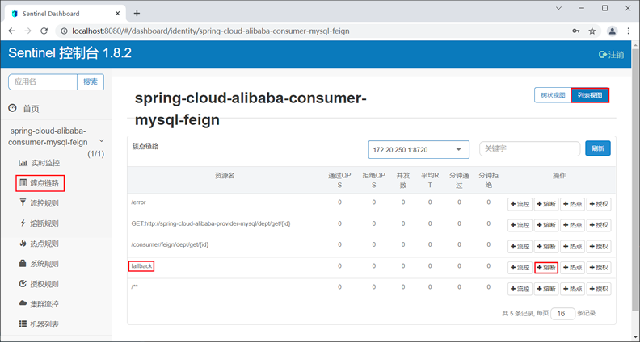
21， 在“新增熔断规则”的窗口中，为名为 “fallback”的资源定义以下熔断规则，如下图。
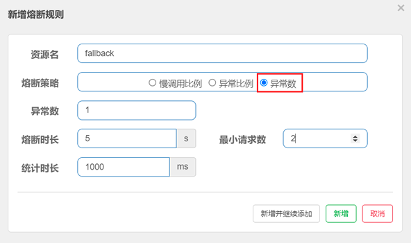
在上图中，熔断规则各属性说明如下：
    - 异常数为 1；
    - 统计时长为 1000 ms（即 1s）；
    - 最小请求数为 2；
    - 熔断时长为 5 秒；
我们为 fallback 资源定义的熔断规则为：当 1 秒钟内请求数大于 2 个，且请求异常数大于 1 时，服务被熔断，熔断的时长为 5 秒钟。
22，使用浏览器连续访问“http://localhost:8803/consumer/feign/dept/get/7”，访问频率大于每秒 2 个请求，结果如下。
```json
{"code":444,"message":"C语言中文网提醒您，服务被降级！异常信息为：null","data":{"deptNo":7,"deptName":"null","dbSource":"null"}}
```
23，控制台输出如下。
```text
--------->>>>主业务逻辑
--------->>>>主业务逻辑，抛出空指针异常
--------->>>>服务降级逻辑
--------->>>>主业务逻辑
--------->>>>主业务逻辑，抛出空指针异常
--------->>>>服务降级逻辑
CLOSED -> OPEN at 2021-11-17 14:06:47, 发送请求次数=2.00
```
从控制台输出可以看出，在 14点 06 分 47 秒时，熔断器从熔断关闭状态（CLOSED）切换到熔断开启状态（OPEN）。
在熔断开启开启状态下，使用浏览器访问“http://localhost:8803/consumer/feign/dept/get/4”，结果页面输出如下。
```json
{"code":444,"message":"C语言中文网提醒您，服务被降级！异常信息为：null","data":{"deptNo":4,"deptName":"null","dbSource":"null"}}
```
24，控制台输出如下。
```text
--------->>>>主业务逻辑
--------->>>>主业务逻辑，抛出空指针异常
--------->>>>服务降级逻辑
--------->>>>主业务逻辑
--------->>>>主业务逻辑，抛出空指针异常
--------->>>>服务降级逻辑
CLOSED -> OPEN at 2021-11-17 14:09:19, 发送请求次数=2.00
--------->>>>服务降级逻辑
--------->>>>服务降级逻辑
--------->>>>服务降级逻辑
```
从控制台输出可知，当熔断器处于熔断开启状态时，所有的请求都直接交给降级逻辑处理。
25，继续使用浏览器访问“http://localhost:8803/consumer/feign/dept/get/4”，结果页面输出如下。
```json
{"code":200,"message":"from mysql,serverPort:  8003","data":{"deptNo":4,"deptName":"市场部","dbSource":"spring_cloud_db2"}}
```
26，控制台输出如下。
```text
--------->>>>主业务逻辑
--------->>>>主业务逻辑，抛出空指针异常
--------->>>>服务降级逻辑
--------->>>>主业务逻辑
--------->>>>主业务逻辑，抛出空指针异常
--------->>>>服务降级逻辑
CLOSED -> OPEN at 2021-11-17 14:09:19, 发送请求次数=2.00
--——--->>>>服务降级逻辑
--------->>>>服务降级逻辑
--------->>>>服务降级逻辑
OPEN -> HALF_OPEN at 2021-11-17 14:09:24
--——--->>>>主业务逻辑
HALF_OPEN -> CLOSED at 2021-11-17 14:09:24
--------->>>>主业务逻辑
--------->>>>主业务逻辑
```
从以上控制台输出可知，熔断器在经历了 5 秒的熔断时长后，自动切换到了探测恢复状态（HALF-OPEN），并在下一个请求成功的情况下，结束了熔断开启状态，切换到了熔断关闭状态（CLOSED）。

## 通过代码定义熔断规则
Sentinel 核心库中提供了的一个名为 DegradeRuleManager 类，我们可以通过调用它的 loadRules() 方法来定义熔断降级规则，该方法需要一个 DegradeRule 类型的 List 参数。
```
public static void loadRules(List<DegradeRule> rules) {
    try {
        currentProperty.updateValue(rules);
    } catch (Throwable var2) {
        RecordLog.error("[DegradeRuleManager] Unexpected error when loading degrade rules", var2);
    }
}
```
DegradeRule 类可以用来定义一条熔断规则，它包含多个与熔断规则相关的属性，如下表。
    - resource：资源名，即规则的作用对象	 
    - grade：熔断策略，支持慢调用比例/异常比例/异常数策略	慢调用比例
    - count：慢调用比例模式下为慢调用临界 RT（超出该值计为慢调用）；异常比例/异常数模式下为对应的阈值	 
    - timeWindow：熔断时长，单位为 s	 
    - minRequestAmount：熔断触发的最小请求数，请求数小于该值时即使异常比率超出阈值也不会熔断（1.7.0 引入）	5
    - statIntervalMs：统计时长（单位为 ms），如 60*1000 代表分钟级（1.8.0 引入）	1000 ms
    - slowRatioThreshold：慢调用比例阈值，仅慢调用比例模式有效（1.8.0 引入）
下面我们就通过一个实例，演示下如何通过代码定义熔断规则，步骤如下。
1，在 spring-cloud-alibaba-consumer-mysql-8803 的 DeptFeignController 中，添加一个名为 initDegradeRule 的方法，代码如下。
```
/**
 * 初始化熔断策略
 */
private static void initDegradeRule() {
    List<DegradeRule> rules = new ArrayList<>();
    DegradeRule rule = new DegradeRule("fallback");
    //熔断策略为异常比例
    rule.setGrade(CircuitBreakerStrategy.ERROR_RATIO.getType());
    //异常比例阈值
    rule.setCount(0.7);
    //最小请求数
    rule.setMinRequestAmount(100);
    //统计市场，单位毫秒
    rule.setStatIntervalMs(30000);
    //熔断市场，单位秒
    rule.setTimeWindow(10);
    rules.add(rule);
    DegradeRuleManager.loadRules(rules);
}
```
2，在 DeptFeignController 的 get() 方法中调用 initDegradeRule() 方法初始化熔断规则，代码如下。
```
@RequestMapping(value = "consumer/feign/dept/get/{id}", method = RequestMethod.GET)
@SentinelResource(value = "fallback", fallback = "handlerFallback")
public CommonResult<Dept> get(@PathVariable("id") int id) {
    initDegradeRule();
    monitor();
    System.out.println("--------->>>>主业务逻辑");
    CommonResult<Dept> result = deptFeignService.get(id);
    if (id == 6) {
        System.err.println("--------->>>>主业务逻辑，抛出非法参数异常");
        throw new IllegalArgumentException("IllegalArgumentException，非法参数异常....");
        //如果查到的记录也是 null 也控制正异常
    } else if (result.getData() == null) {
        System.err.println("--------->>>>主业务逻辑，抛出空指针异常");
        throw new NullPointerException("NullPointerException，该ID没有对应记录,空指针异常");
    }
    return result;
}
```
3，重启 spring-cloud-alibaba-consumer-mysql-8803，使用浏览器访问“http://localhost:8803/consumer/feign/dept/get/1”，结果如下。
```json
{"code":200,"message":"from mysql,serverPort:  8003","data":{"deptNo":1,"deptName":"开发部","dbSource":"spring_cloud_db2"}}
```
4，使用浏览器访问 Sentinel 控制主页，点击“熔断规则”查看熔断规则列表，结果如下图。
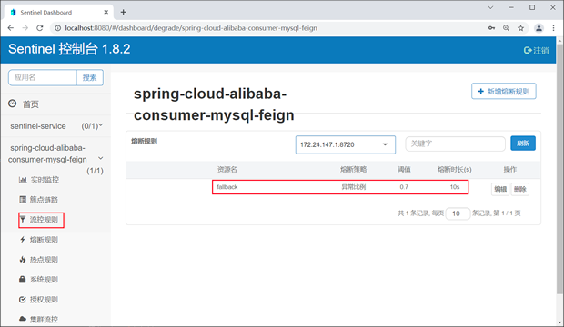


# Sentinel热点规则(ParamFlowRule)
何为热点？热点即经常访问的数据。很多时候我们希望统计某个热点数据中访问频次最高的 Top K 数据，并对其访问进行限制。比如：
    商品 ID 为参数，统计一段时间内最常购买的商品 ID 并进行限制
    用户 ID 为参数，针对一段时间内频繁访问的用户 ID 进行限制 
    热点参数限流会统计传入参数中的热点参数，并根据配置的限流阈值与模式，对包含热点参数的资源调用进行限流。
    热点参数限流可以看做是一种特殊的流量控制，仅对包含热点参数的资源调用生效。
热点参数规则（ParamFlowRule）类似于流量控制规则（FlowRule）：
    resource	资源名，必填
    count	限流阈值，必填
    grade	限流模式	QPS 模式
    durationInSec	统计窗口时间长度（单位为秒），1.6.0 版本开始支持	1s
    controlBehavior	流控效果（支持快速失败和匀速排队模式），1.6.0 版本开始支持	快速失败
    maxQueueingTimeMs	最大排队等待时长（仅在匀速排队模式生效），1.6.0 版本开始支持	0ms
    paramIdx	热点参数的索引，必填，对应 SphU.entry(xxx, args) 中的参数索引位置
    paramFlowItemList	参数例外项，可以针对指定的参数值单独设置限流阈值，不受前面 count 阈值的限制。仅支持基本类型和字符串类型
    clusterMode	是否是集群参数流控规则	false
    clusterConfig	集群流控相关配置
控制面板使用示例：
    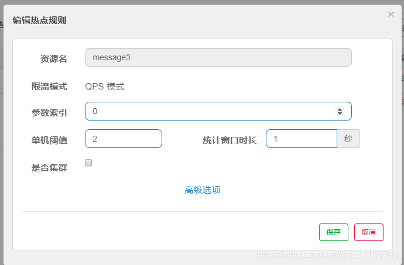
    分别用两个参数访问，会发现只对第一个参数限流了
    还可以为热点规则增加参数例外项（热点规则编辑页面才有此选项）。
    例如，参数name的值如果为jack，qps阈值达到6才限流：
    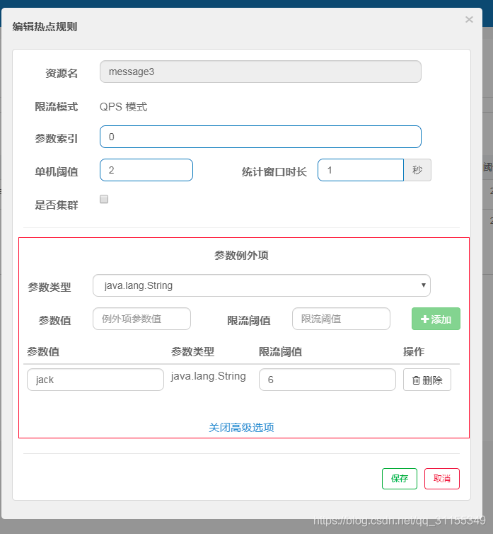
代码使用示例：
    自定义资源
        ```
        @GetMapping("/byHotKey")
        @SentinelResource(value = "byHotKey", blockHandler = "userAccessError")
        public String test4(@RequestParam(value = "userId", required = false) String userId,
                            @RequestParam(value = "goodId", required = false) int goodId) {
            log.info(Thread.currentThread().getName() + "\t" + "...byHotKey");
            return "-----------by HotKey： UserId";
        }
        ```
    限流规则代码：
        可以通过 ParamFlowRuleManager 的 loadRules 方法更新热点参数规则，下面是官方实例：
        ```
        ParamFlowRule rule = new ParamFlowRule(resourceName)
            .setParamIdx(0)
            .setCount(5);
        // 针对 int 类型的参数 PARAM_B，单独设置限流 QPS 阈值为 10，而不是全局的阈值 5.
        ParamFlowItem item = new ParamFlowItem().setObject(String.valueOf(PARAM_B))
            .setClassType(int.class.getName())
            .setCount(10);
        rule.setParamFlowItemList(Collections.singletonList(item));
        ParamFlowRuleManager.loadRules(Collections.singletonList(rule));
        具体的限流代码如下：
            ParamFlowRule pRule = new ParamFlowRule("byHotKey")
                            .setParamIdx(1)
                            .setCount(1);
            // 针对 参数值1000，单独设置限流 QPS 阈值为 5，而不是全局的阈值 1.
            ParamFlowItem item = new ParamFlowItem().setObject(String.valueOf(1000))
                    .setClassType(int.class.getName())
                    .setCount(5);
            pRule.setParamFlowItemList(Collections.singletonList(item));
            ParamFlowRuleManager.loadRules(Collections.singletonList(pRule));
        ```


# Sentinel原理
ProcessorSlotChain：
    Sentinel的核心架构，将不同的slot按照顺序串在一起（责任链模式），从而将不同的功能（限流、降级、系统保护）组合在一起
    系统会为每个资源创建一套SlotChain
    slot chain其实可以分为两部分：统计数据构建部分（statistic）和判断部分（rule checking）
SPI机制
    Sentinel槽链中各slot的执行顺序是固定好的。但是并不是绝对不能改变的。
    sentinel将ProcessorSolt作为SPI接口进行扩展，使得SlotChain具备了扩展能力。
    用户可以自定义slot并编排slot间的顺序：
        StatisticSlot监控统计 -> SystemSlot系统保护 -> FlowSlot流量控制 -> DegradeSlot熔断降级
    这每一步中奖都可以加入MyCustomSlot自定义实现
常用slot简介：
    NodeSelectorSlot
        负责收集资源的路径，并将这些资源的调用路径以树状结构存储起来，用于根据调用路径来限流降级
    ClusterbuilderSlot
        用于存储资源统计信息以及调用者信息，例如该资源的RT、QPS、thread count等等，这些信息将用作多维度限流、降级的依据。简单来说就是用于构建ClusterNode
    StatisticSlot
        用于记录、统计不同维度的runtime指标监控信息
    ParamFlowSlot
        对应热点流控
    FlowSlot
        用于根据预设限流规则以及前面slot统计的状态，来进行流量控制。对应'流控规则'
    AuthoritySlot
        根据配置的黑白名单和调用信息来源，做黑白名单规则。对应授权规则
    DeagadeSlot
        降级规则
    SystemSlot
        通过系统状态，例如load1等，来控制入口流量。对应系统规则
context简介
    context是对资源操作的上下文，每个资源操作必须属于一个context。如果代码中没有指定context，
    则会创建一个name为sentinel_default_context的默认context
    一个context生命周期中可以包含多个资源操作。context生命周期最后一个资源在exit()时会清理该context，这也就意味着这个context生命周期结束了
Node的关系
    Node：用于完成数据统计
    StatisticNode：统计节点，是Node接口的实现类，用于完成数据统计
    EntranceNode：入口节点，一个Context会有一个入口节点，用于统计当前Context的总体流量数据
    DefaultNode：默认节点，用于统计一个资源在当前Context中的流量数据
    ClisterNode：集群节点，用于统计一个资源在所有Context中的总体流量数据
滑动时间窗算法：
    时间窗算法
        系统会自动选定一个时间窗口的起始零点，然后按照固定长度将时间轴划分为若干定长的时间窗口。所以该算法也成为"固定时间窗口算法"。
        当请求到达时，系统会查看该请求到达的时间点所在的时间窗口当前统计的数据是否超过了预先设定好的阈值。未超出，则请求通过，否则被限流
        存在的问题：
            如果用户在上一个窗口的最后一刻和下一个窗口的最前一刻发起冲击服务，那么时间窗限制的流量就不起作用
    滑动时间窗算法初级：
        时间窗口随着时间的流失而移动，最开始的窗口将会失效，但是也会生成新的窗口。来新的请求的时候就看这个时间窗口内的请求是否超过阈值
        存在的问题：
            随着生成新的时间窗口，重复统计了时间窗口内的一部分请求，资源浪费
    滑动时间窗算法高级：
        将时间轴划分为一个个样本窗口，比如每个样本窗口长度为250ms，然后滑动时间窗长度为1000ms，那么一个滑动时间窗就有4个样本窗口
        那么在时间窗滑动时，是随着样本窗口的大小来滑动，这样就可以避免重复统计一部分数据。
        假设我们将1s划分为四个窗口，则每个窗口对应250ms。假设恶意用户还是在上一秒最后一刻和下一秒第一刻冲击服务，按照滑动窗口原理
        此时统计上一秒最后750ms和下一秒250ms，这种方式能够判断出用户的访问依旧超过了1s的访问数量，此时依然会阻拦用户访问


# 与Hystrix对比
Hystrix常用的线程池隔离会造成线程上下切换的overhead比较大；
Hystrix使用的信号量隔离对某个资源调用的并发数进行控制，效果不错，但是无法对慢调用进行自动降级；
Sentinel通过并发线程数的流量控制提供信号量隔离的功能；
此外，Sentinel支持的熔断降级维度更多，可对多种指标进行流控、熔断，且提供了实时监控和控制面板，功能更为强大。

功能                     sentinel                 hystrix
隔离策略              信号量隔离（并发线程数限流）   线程池隔离/信号量隔离
熔断降级策略          基于响应时间、异常比率、异常数    基于异常比例
实时统计实现            滑动窗口（LeaoArray）        滑动窗口（基于RxJava）
动态规则匹配            支持多种数据源               支持多种数据源
扩展性                  多个扩展节点                插件形式
基于注解支持              支持                       支持
限流              基于QPS，支持基于调用关系的限流      有限的支持
流量整形          支持预热模式、匀速模式、预热派对模式    不支持
系统自适应保护            支持                         不支持
控制台           可配置规则、查看秒级监控、机器发现    简单的监控查看


http://c.biancheng.net/springcloud/sentinel.html