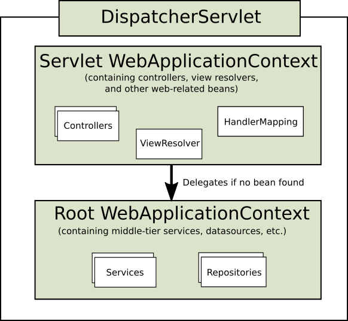

# 什么是Spring MVC
Spring MVC是一个基于Java实现的mvc设计模式的请求驱动类型的轻量级Web框架
通常把模型-视图-控制器分离，将web层进行职责解耦，把复杂的web应用分成逻辑清晰的几部分，简化开发，减少出错
# 优点
可以支持各种视图技术，不仅仅限于JSP
与Spring框架集成（如IoC容器、AOP等）
清晰的角色分配：
    前段控制器（DispatcherServlet）
    请求处理映射器（HandlerMapping）
    处理适配器（HandlerAdapter）
    视图解析器（ViewReactor）
支持各种请求资源的映射策略
# 核心组件
1，前段控制器DispatcherServlet（无需程序员开发）
    接收请求、响应结果相当于转发器，有了DispatcherServlet减少了其他组件之间的耦合度
    Spring的MVC框架是围绕DispatcherServlet来设计的，它用来处理所有的HTTP请求和响应。
2，处理映射器HandlerMapping（无需程序员开发）
    根据请求的URL查找Handler
3，处理适配器（HandlerAdapter）
    在编写Handler的时候，需要按照HandlerAdapter要求的规则去编写，这样适配器HandlerAdapter才可以正确的执行Handler
4，处理器Handler（需要程序员开发）
5，视图解析器ViewResolver（不需要程序员开发）
    进行视图解析，根据视图逻辑解析成真正的视图
6，视图View（需要程序员开发jsp）
    View是一个接口，它的实现类支持不同类型的视图（jsp、freemark、pdf等等）
# 什么是Spring MVC控制器
控制器提供一个访问应用程序的行为，此行为通常通过服务接口实现。
控制器解析用户输入并将其转换为一个由视图呈现给用户的模型。
Spring用一个非常抽象的方式实现一个控制层，允许用户创建各种用途的控制器
# 工作流程
1，用户发送请求之前段控制器DispatcherServlet
2，DispatcherServlet接收到请求之后调用HandlerMapping映射处理器，请求获取Handler，返回给DispatcherServlet
3，DispatcherServlet请求处理器适配器HandlerAdapter执行相应的Handler
4，Handler执行完毕之后会返回ModelAndView对象给HandlerAdapter
5，HandlerAdapter将ModelAndView返回给DispatcherServlet
6，DispatcherServlet将ModelAndView传给ViewResolver视图解析器解析
7，ViewResolver视图解析器解析后返回具体的View
8，DispatcherServlet对View进行渲染，将模型数据填充至视图中
9，DispatcherServlet响应用户

# MVC框架
mvc是一种设计模式，即模型（model）-视图（view）-控制器（controller），三层架构的设计模式。用于实现前端页面的展现与后端业务数据处理的分离
好处：
    1，分层设计，实现了业务系统各个组件之间的解耦，有利于业务系统的可扩展性，可维护性
    2，有利于系统的并行开发，提升开发效率。

# Spring MVC一个Controller处理所有用户请求的并发问题
关于有状态和无状态对象的基本概念：
有状态对象（Stateful Bean）：就是有实例变量的对象，可以保存数据，是非线程安全的。一般是prototype scopt
无状态对象（Stateless Bean）：就是没有实例变量的对象，不能保存数据，是不变类，是线程安全的，一般是singleton scope。
在Spring MVC中，一般controller、service、dao的scope均是singleton
每个请求都是单独的线程，即使同时访问同一个controller对象，并没有修改controller对象。
相当于对于controller对象来说，只有读操作，没有写操作，不需要做同步处理。

# Controller注解的作用
在Spring MVC中，控制器controller负责处理由DispatcherServlet分发的请求，
他把用户请求的数据经过经过业务处理层处理之后封装成一个Model，然后再把该Model返回给View进行展示
Spring MVC中提供了一个非常简便的定义Controller方法，无需继承特定的类或实现特定的接口
只需要使用Controller标记一个类是Controller，然后使用
RequestMapping和RequestParam等一系列注解定义URL请求和Controller方法之间的映射
这样Controller就能被外界访问到。此外Controller不直接依赖于HttpServletRequest和HttpServletResponse等HttpServlet对象
可以通过Controller方法参数灵活的获取到

# ServletContext、WebApplicationContext、DispatcherServlet
ServletContext：
    ServletContext是Servlet容器，存放的是包含从容器中获得的初始化web应用信息，一个web应用只能有一个ServletContext
    生成过程：
        1，启动web项目时，tomcat会读它的配置文件web.xml，读两个节点listener和context-param内容
        2，容器创建一个ServletContext上下文，在该应用内全局共享
        3，容器将转换为键值对，并交给ServletContext
        4，监听Listener并执行初始化方法和销毁方法
DispatcherServlet
    就是一个Servlet，它是Spring MVC的核心，它是Spring MVC的统一入口，所有的请求都经过它
    用来完成请求处理并返回响应。每个DispatcherServlet都有一个对应的WebApplicationContext
WebApplicationContext
    Web应用上下文(WebApplicationContext)是一个IoC容器，内部定义了项目所需要用到的bean，并在容器启动的时候生成bean。这些bean包括Controllers、ViewResolver、HandlerMapping等等。
    每个DispatcherServlet都有一个对应的WebApplicationContext，并且它是存放在ServletContext中的

# Spring MVC中的父子容器
如果我们在Spring的配置文件中配置一个Bean，然后在Spring MVC的配置文件也配置一个Bean，两个Bean的类型和ID都相同
那么容器中会存在两个相同id的Bean，使用起来互不干扰
这是为什么呢？这就涉及到Spring MCV的父子容器了
在使用Spring MVC过程中会存在Spring MVC和Spring两个IoC容器，且Spring MVC的是子容器

如上图中DispatcherServlet创建的子容器WebApplicationContext，主要包含的是Controllers、ViewResolver等Web相关的Bean
Spring MVC还会通过ServletContext拿到Spring根容器，也就是父容器root WebApplicationContext
Spring MVC容器可以访问父容器中的Bean，但是父容器不能访问子容器的Bean。
说的通俗点就是，在Controller里可以访问Service对象，但是在Service里不可以访问Controller对象
