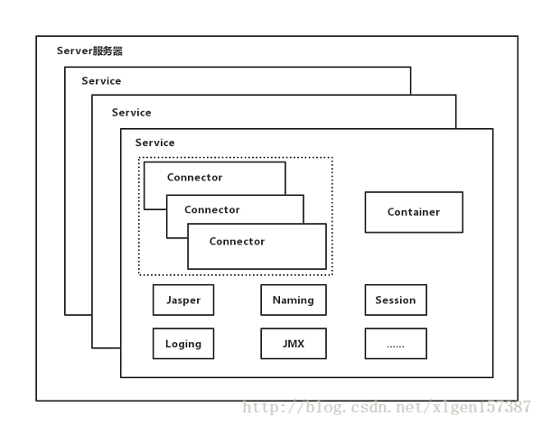
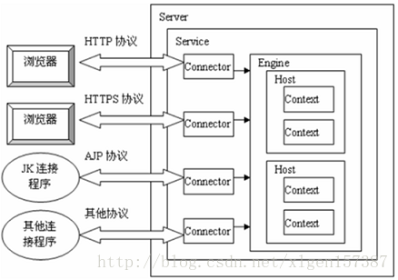
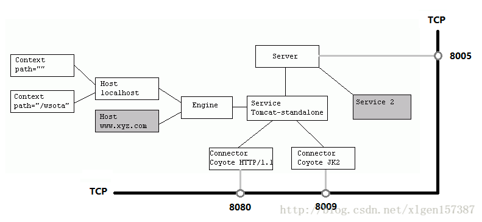
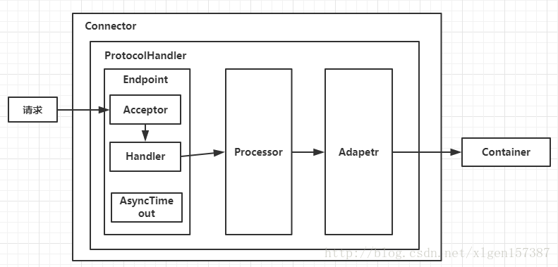
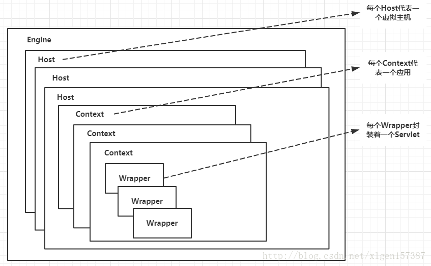
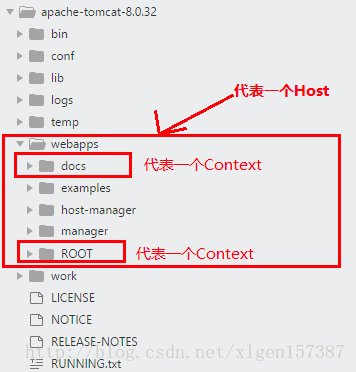
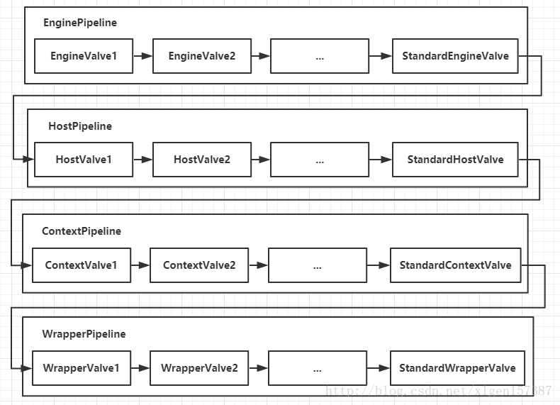

# Tomcat是什么？
tomcat是一个轻量级的的web应用服务器
# tomcat有哪几种Connector运行模式？
有三种运行模式：
BIO：
    同步并阻塞，一个线程处理一个connection
    缺点：并发量高时，线程数多，浪费资源
    Tomcat7或以下默认使用这种方式
NIO：
    同步非阻塞IO
    利用Java的异步IO处理，可以通过少量线程处理大量请求，可以复用同一个线程处理多个connection
    Tomcat8在Linux中默认使用这种方式
AIO：
    异步非阻塞io，从操作系统层面解决io阻塞问题。
    配置项：protocol="org.apache.coyote.http11.Http11AprProtocol"
    备注：需要在本地服务器安装APR库。Tomcat7或者Tomcat8在Win7或以上的系统中启动默认使用这种方式
        Linux如果安装了apr和native，Tomcat直接启动就支持apr
# Tomcat有几种部署方式
1，利用Tomcat的自动部署。把web应用拷贝到webapps目录。
Tomcat在启动时会加载目录下的应用，并将编译后的结果放入work目录下
2，使用Manager App控制台部署。在tomcat主页点击"Manager App"进入应用管理控制台，可以指定一个web应用的路径或war文件。
3，修改conf/server.xml文件部署。修改conf/server.xml文件，增加Context节点可以部署应用
4，增加自定义的Web部署文件。在conf/Catalina/localhost/路径下增加xyz.xml文件，内容是Context节点，可以部署应用

# tomcat容器是如何创建servlet实例？用了什么原理？
当容器启动的时候，会读取webapps目录下所有的web应用中的web.xml文件，然后对xml文件进行解析
并读取servlet注册信息。然后，将每个应用中注册的servlet类都进行加载，并通过反射的方式实例化
在servlet注册时加上1如果为正数，则在一开始就实例化
如果不写或为负数，则第一次请求实例化

# Tomcat工作模式
Tomcat作为Servlet容器，有三种工作模式：
1，独立的servlet容器，servlet容器是web服务器的一部分；
2，进程内的servlet容器，servlet容器作为web服务器的插件和Java容器的实现，
web服务器插件在内部地址打开一个jvm使得java容器在内部得以运行，反应快但伸缩性不足
3，进程外的servlet容器，servlet容器运行于web服务器之外的地址空间，并作为web服务器的插件和java容器实现的结合
反应时间不如进程内但伸缩性和稳定性比进程内优

进入Tomcat的请求可以根据Tomcat的工作模式分为如下两类：
Tomcat作为程序服务器：请求来自于前端的web服务器，这可能是Apache、IIS、Nginx等；
Tomcat作为独立的服务器：请求来自于web浏览器

# Tomcat顶层架构

Tomcat中最顶层的容器是Server，代表着整个服务器，从上可以看出，一个Server可以包含至少一个Service，用于具体提供服务
Service主要包含两部分：Connector和Container。从上图可以看出Tomcat的心脏就是两个组件，他们的作用如下：
    1，Connector用于处理连接相关的事情，并提供Socket与Request和Response相关的转化
    2，Container用于封装和管理Servlet，以及具体处理Request请求
Tomcat中只有一个Server，一个Server可以包含多个Service，一个Service只有一个Container，
但是可以有多个Connectors，这是因为一个服务可以有多个连接，如同时提供Http和Https连接
也可以提供相关协议不同端口的连接，示意图如下（Engine、Host、Context下边会说道）：

多个Connector和一个Container就形成了一个Service有了Service就可以对外提供服务了，
但是Service还要有一个生存的环境，必须要有人能够给他生命、掌握其生死大权，那就非Server莫属了
所以整个Tomcat生命周期由Server控制。
上面的配置文件可以由下边的结构图清楚的理解：


小结：
    1，Tomcat只有一个Server，一个Server可以有多个Service，一个Service可以有多个Connector和一个Container
    2，Server掌握着整个Tomcat的生死大权
    3，Service是对外提供服务的
    4，Connector用于接收请求并将请求封装成Request和Response来具体处理
    5，Container用于封装和管理Servlet，以及具体处理Request请求

# Connector和Container的微妙关系
有上述内容我们大致可以知道一个请求发送到Tomcat之后，首先经过Service然后会交给我们的Connector
Connector用于接收请求并将接受的请求封装为Request和Response来具体处理
Request和Response封装完之后再交由Container进行处理，Container处理请求之后再返回给Connector
最后由Connector通过Socket将处理结果返回给客户端，这样整个请求就处理完了

Connector最底层使用的是Socket进行连接的，Request和Response是按照HTTP协议来封装的
所以Connector同时需要实现TCP/IP协议和HTTP协议

# Connctor架构分析
Connector主要用于接收请求并将请求封装成Request和Response，然后交给Container进行处理
Container处理完成之后再交给Connector返回给客户端

因此，我们可以把Connector分成四方面进行理解
1，Connector如何接收请求？
2，如何将请求封装成Request和Response的？
3，封装完之后的Request和Response如何交给Container进行处理的？
4，Container处理完之后如何交给Connector并返回给客户端的？

Connector就是使用ProtocolHandler来处理请求的，不同的ProtocolHandler代表不同的连接类型
比如：Http11Protocol使用的是普通Socket来连接的，Http11NioProtocol使用的是NioSocket来连接的
其中ProtocolHandler包含了三个部件：Endpoint、Processor、Adapter
1，Endpoint是用来处理底层Socket网络连接，Processor用于将Endpoint接收到的Socket封装成Request，Adapter用于将Request交给Container进行具体处理。
2，Endpoint由于是处理底层的Socket网络连接，因此Endpoint是用来实现TCP/IP协议的，而Processor用来实现Http协议，Adapter将请求适配到Servlet容器进行具体的处理
3，Endpoint的抽象实现AbstractEndpoint里面定义的Acceptor和AsyncTimeout两个内部类和一个Handler接口。
Acceptor用于监听请求，AsyncTimeout用于检查异步Request的超时，Handler用于处理接收到的Socket，在内部调用Processor进行处理

# Container架构分析

Container用于封装和管理Servlet，以及具体处理Request请求，在Connector内部包含了4个子容器，
4个子容器的作用分别是：
1，Engine：引擎，用来管理多个站点，一个Service最多只能有一个Engine
2，Host：代表一个站点，也可以叫虚拟主机，通过配置Host就可以添加站点
3，Context：代表一个应用程序，对应着平时开发的一套程序，或者一个web-info下面的web.xml文件
4，Wrapper：每一个Wrapper封装着一个Servlet
下面是Tomcat的文件目录对照以下：

Context和Host的区别是Context表示一个应用，我们的Tomcat中默认的配置下webapps下的每一个文件夹目录都是一个Context
其中ROOT目录中存放着主应用，其他目录存放着子应用，而整个webapps就是一个Host站点

我们访问应用Context的时候，如果是ROOT下的直接使用域名就可以访问

# Container是如何处理请求的
Container处理请求是使用Pipeline-Valve管道来处理的
Pipeline-Valve是责任链模式，责任链模式是指一个请求处理的过程中有很多处理者依次对请求进行处理
每个处理者负责做自己相应的处理，处理完之后将处理后的请求返回，再让下一个处理继续处理

但是！Pipeline-Valve使用的责任链模式和普通的责任链模式有些不同！区别主要有以下两点：
1，每个Pipeline都有特定的Valve，而且是在管道最后一个执行，这个Valve叫做BaseValve，BaseValve是不可删除的
2，在上层容器的管道的BaseValve中会调用下层容器的管道
我们知道Container包含四个子容器，而这四个子容器对应的BaseValve分别在：StandardEngineValve、StandardHostValve、StandardContextValve、StandardWrapperValve。

Pieline处理流程：
    1，Connector在接收到请求后会首先调用最顶层容器的Pipeline来处理，这里的最顶层容器的Pipeline就是EnginePipeline（Engine的管道）；
    2，在Engine的管道中依次会执行EngineValve1、EngineValve2等等，最后会执行StandardEngineValve，在StandardEngineValve中会调用Host管道，然后再依次执行Host的HostValve1、HostValve2等，最后在执行StandardHostValve，然后再依次调用Context的管道和Wrapper的管道，最后执行到StandardWrapperValve。
    3，当执行到StandardWrapperValve的时候，会在StandardWrapperValve中创建FilterChain，并调用其doFilter方法来处理请求，这个FilterChain包含着我们配置的与请求相匹配的Filter和Servlet，其doFilter方法会依次调用所有的Filter的doFilter方法和Servlet的service方法，这样请求就得到了处理
    4，当所有的Pipeline-Valve都执行完之后，并且处理完了具体的请求，这个时候就可以将返回的结果交给Connector了，Connector在通过Socket的方式将结果返回给客户端。

# tomcat如何优化
1，并发优化
（1）调整连接器connector的并发处理能力
    enableLookups：是否反查域名。为了提高处理能力，应设置为false，来关闭DNS查询
    URIEconding="UTF-8"：使得tomcat可以解析含有中文名的文件的url
    maxThreads：客户请求最大线程数
    minSpareThreads：tomcat初始化时创建的线程数
    maxSpareThreads：最大空闲线程数
    acceptAccount：监听端口队列最大数，满了之后客户端请求会被拒绝（不能小于maxSpareThreads）
    connectionTimeout：连接超时
    minProcessors：服务器创建时最小处理线程数
    maxProcessors：服务器同时最大处理线程数
    其中和最大连接数相关的参数为maxProcessors和acceptCount。如果要加大并发连接数，应同时加大这两个参数
（2）压缩优化及参数
    compression="on"：打开压缩功能
    compressionMinSize="2048"：启用压缩的输出内容大小，默认为2KB
    noCompressionUserAgents="gozilla,traviata"：对于以下的浏览器，不启用压缩
    compressableMimeType="text/html,text/xml,text/javascript,text/css,text/plain"：哪些资源类型需要压缩
    Tomcat 的压缩是在客户端请求服务器对应资源后，从服务器端将资源文件压缩，再输出到客户端，由客户端的浏览器负责解压缩并浏览。
    相对于普通的浏览过程 HTML、CSS、Javascript和Text，它可以节省40% 左右的流量。
    更为重要的是，它可以对动态生成的，包括CGI、PHP、JSP、ASP、Servlet,SHTML等输出的网页也能进行压缩，压缩效率也很高。
    但是， 压缩会增加 Tomcat 的负担，因此最好采用Nginx + Tomcat 或者 Apache + Tomcat 方式，将压缩的任务交由 Nginx/Apache 去做。
2，Tomcat缓存优化
tomcat的maxThreads、acceptCount（最大线程数、最大排队数）
说明：
    maxThreads：tomcat启动过的最大线程数，即同时处理的任务个数，默认值为200
    acceptCount：当tomcat启动的线程数达到最大的时候，接收排队的请求个数，默认值为100
    情况1：接受一个请求，此时tomcat起动的线程数没有到达maxThreads，tomcat会起动一个线程来处理此请求。
    情况2：接受一个请求，此时tomcat起动的线程数已经到达maxThreads，tomcat会把此请求放入等待队列，等待空闲线程。
    情况3：接受一个请求，此时tomcat起动的线程数已经到达maxThreads，等待队列中的请求个数也达到了acceptCount，此时tomcat会直接拒绝此次请求，返回connection refused
maxThreads如何配置
    一般的服务器操作都包括量方面：
        1，计算（主要消耗cpu）
        2，等待（io、数据库等）
    第一种极端情况，如果我们的操作是纯粹的计算，那么系统响应时间的主要限制就是cpu的运算能力，此时maxThreads应该尽量设的小，降低同一时间内争抢cpu的线程个数，可以提高计算效率，提高系统的整体处理能力。
    第二种极端情况，如果我们的操作纯粹是IO或者数据库，那么响应时间的主要限制就变为等待外部资源，此时maxThreads应该尽量设的大，这样才能提高同时处理请求的个数，从而提高系统整体的处理能力。此情况下因为tomcat同时处理的请求量会比较大，所以需要关注一下tomcat的虚拟机内存设置和linux的open file限制。
    我在测试时遇到一个问题，maxThreads我设置的比较大比如3000，当服务的线程数大到一定程度时，一般是2000出头，单次请求的响应时间就会急剧的增加，
    原因可能是cpu在线程切换时消耗的时间随着线程数量的增加越来越大，cpu把大多数时间都用来在这2000多个线程直接切换上了
3，tomcat协议类型优化
    （1）关闭AJP端口
        AJP是为Tomcat与Http服务器之间通信而定制的协议，能提供较高的通信速度和效率。
        如果 tomcat 前端放的是apache的时候，会使用到AJP连接器。若tomcat为和apache配合使用则注销掉该连接器
        <!-- <Connector port="8009" protocol="AJP/1.3" redirectPort="8443" /> -->
    （2）nio模式
        默认的bio模式,性能非常低下,没有经过任何优化处理和支持.
        nio也被看成是non-blocking I/O的缩写。它拥有比传统I/O操作(bio)更好的并发运行性能。
        具体操作： 
            server.xml里的Connector节点,修改protocol为org.apache.coyote.http11.Http11NioProtocol
    （3）apr（aio）模式
        apr是从操作系统级别解决异步IO问题，大幅度提高服务器的并发处理性能，也是Tomcat生产环境运行的首选方式
        具体操作：
            目前Tomcat 8.x默认情况下全部是运行在nio模式下，而apr的本质就是使用jni技术调用操作系统底层的IO接口，所以需要提前安装所需要的依赖，首先是需要安装openssl和apr，命令如下：
                ```
                yum -y install openssl-devel
                yum -y install apr-devel
                ```
            安装之后，去tomcat官网下载native组件，native可以看成是tomcat和apr交互的中间环节，下载地址是：http://tomcat.apache.org/download-native.cgi 这里下载最新的版本1.2.10
            解压之后上传至服务器执行解压并安装：
                ```
                tar -xvzf tomcat-native-1.2.10-src.tar.gz -C /usr/local
                cd /usr/local/tomcat-native-1.2.10-src/native/
                ./configure 编译安装
                ```
            将默认的protocol="HTTP/1.1"修改为protocol="org.apache.coyote.http11.Http11AprProtocol"
            apr引入方法：
                配置tomcat安装目录下:bin/catalina.sh文件引入apr，推荐这种方式：
                如图所示在原有变量JAVA_OPTS后面追加对应的配置即可，添加一行新的就可以：JAVA_OPTS="$JAVA_OPTS -Djava.library.path=/usr/local/apr/lib"
5，tomcat安全配置
（1）当tomcat完成安装后首先需要做的事情如下：
    首次安装完成后立即删除webapps下面的所有代码
    注释或删除conf/tomcat-users.xml所有用户权限
（2）隐藏tomcat版本
    1，首先找到这个jar包，$TOMCAT_HOME/lib/catalina.jar
    2，解压catalina.jar之后按照路径\org\apache\catalina\util\ServerInfo.properties找到文件
    3，打开ServerInfo.properties文件修改如下：把server.number、server.built置空
        server.info=Apache Tomcat
        server.number=
        server.built=
    4，重新打成jar包，重启tomcat。
（3）隐藏tomcat 的服务类型
    conf/server.xml文件中，为connector元素添加server="
"，注意不是空字符串，是空格组成的长度为1的字符串
（4）应用程序安全
    关闭war自动部署 unpackWARs="false" autoDeploy="false"。防止被植入木马等恶意程序
（5）修改服务监听端口
    一般公司的 Tomcat 都是放在内网的，因此我们针对 Tomcat 服务的监听地址都是内网地址。
    修改实例：<Connector port="8080" address="172.16.100.1" />


        


# Apache和Tomcat的区别
1，一般使用apache+tomcat，apache只是作为一个转发，对jsp的处理是由tomcat来处理的
2，apache可以支持php、cgi、perl，但是使用Java的话，需要tomcat在apache后台支撑，将java请求由apache转发给tomcat处理
3，apache是web服务器，tomcat是应用服务器，它只是一个servlet（jsp也翻译成servlet容器），可以认为是apache的扩展，但是可以独立于apache运行
4，apache是专门用于提供http服务以及相关配置的（例如虚拟主机、URL转发）
5，tomcat是apache组织在符合J2EE的jsp、Servlet标准下开发的一个jsp服务器
6，apache是一个web服务器环境程序，可以作为web服务器使用，不过只支持静态网页，如asp、php、cgi、jsp等动态网页就不行
如果要在aoache环境下运行jsp的话，就需要一个解释器来执行jsp网页，而这个jsp解释器就是tomcat。
那么为什么还需要jdk呢？
因为jsp需要连接数据库的话就要jdk来提供连接数据库的驱动程序，所以要运行jsp的web服务器平台就需要apache+tomcat+jdk
整合的好处是：
    如果客户端请求的是静态网页，则只需要apache服务器响应请求，如果客户端请求的是动态页面，则tomcat服务器响应请求
    因为jsp服务器端解释代码，这样整合就可以减少tomcat的服务开销
7，apache侧重于http server，tomcat侧重于servlet引擎。
apache是web服务器，tomcat是一个servlet容器
    
    
