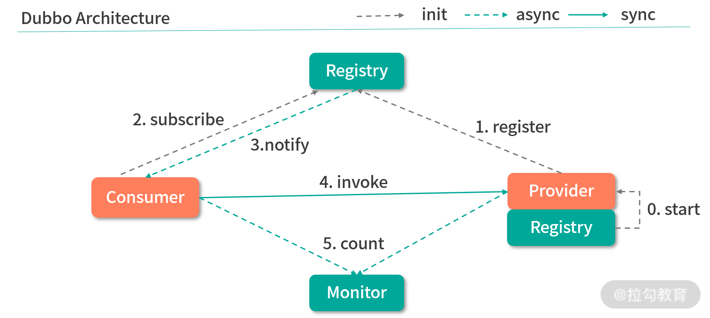
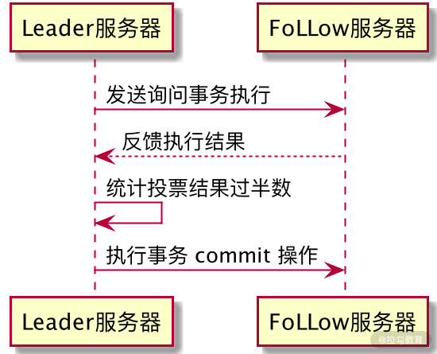

# 什么是Zookeeper？
zookeeper是一个分布式框架，主要是为分布式应用提供协调服务。
zookeeper从设计模式来理解，是一个基于观察者模式的分布式服务管理框架
他负责存储和管理大家都关心的数据，然后接受观察者的注册
一旦这些数据发生变化，
zookeeper就负责通知在zookeeper上注册的那些观察者并且作出相应的反应


# Zookeeper设计的目标
`zooKeeper`致力于为分布式应用提供一个高性能、高可用，且具有严格顺序访问控制能力的分布式协调服务
1，高性能
    `zookeeper`将全量数据存储在**内存**中，并直接服务于客户端的所有非事务请求，尤其用于以读为主的应用场景
2，高可用
    `zookeeper`一般以集群的方式对外提供服务，一般`3~5`台机器就可以组成一个可用的 `Zookeeper`集群了
    每台机器都会在内存中维护当前的服务器状态，井且每台机器之间都相互保持着通信。
    只要集群中超过一半的机器都能够正常工作，那么整个集群就能够正常对外服务
3，严格顺序访问
    对于来自客户端的每个更新请求，`Zookeeper`都会分配一个全局唯一的递增编号，这个编号反应了所有事务操作的先后顺序


# Zookeeper数据模型
`zookeeper`的数据结点可以视为树状结构(或目录)，树中的各个结点被称为`znode `(即`zookeeper node`)
一个`znode`可以由多个子结点。`zookeeper`结点在结构上表现为树状；
使用路径`path`来定位某个`znode`，比如`/ns-1/itcast/mysqml/schemal1/table1`
此处`ns-1，itcast、mysql、schemal1、table1`分别是`根结点、2级结点、3级结点以及4级结点`；
其中`ns-1`是`itcast`的父结点，`itcast`是`ns-1`的子结点，`itcast`是`mysql`的父结点....以此类推
znode
    兼具文件和目录两种特点，即像文件一样维护着数据、元信息、ACL、时间戳等数据结构，又像目录一样可以作为路径标识的一部分
    那么如何描述一个`znode`呢？一个`znode`大体上分为`3`个部分：
        1，结点的数据：即`znode data `(结点`path`，结点`data`)的关系就像是`Java map `中的 `key value `关系
        2，结点的子结点`children`
        3，结点的状态`stat`：用来描述当前结点的创建、修改记录，包括`cZxid`、`ctime`等
结点状态stat的属性
    在`zookeeper shell `中使用 `get `命令查看指定路径结点的`data`、`stat`信息
    
    属性说明：
        1，`cZxid`数据结点创建时的事务ID——针对于`zookeeper`数据结点的管理：
        们对结点数据的一些写操作都会导致`zookeeper`自动地为我们去开启一个事务，并且自动地去为每一个事务维护一个事务`ID`
        2，`ctime`数据结点创建时的时间
        3，`mZxid`数据结点最后一次更新时的事务ID
        4，`mtime`数据结点最后一次更新时的时间
        5，`pZxid`数据节点最后一次修改此`znode`子节点更改的`zxid`
        6，`cversion`子结点的更改次数
        7，`dataVersion`结点数据的更改次数
        8，`aclVersion`结点的ACL更改次数——类似`linux`的权限列表，维护的是当前结点的权限列表被修改的次数
        9，`ephemeralOwner`如果结点是临时结点，则表示创建该结点的会话的`SessionID`；如果是持久结点，该属性值为0
        10，`dataLength`数据内容的长度
        11，`numChildren`数据结点当前的子结点个数
        其中重要的概念是`Zxid(Zookeeper Transaction ID)`，`Zookeeper`结点的每一次更改都具有唯一的`Zxid`
        如果`Zxid-1` 小于` Zxid-2` ，则`Zxid-1` 的更改发生在 `Zxid-2 `更改之前
节点类型
`zookeeper`中的结点有两种，分别为**临时结点**和**永久结点**。结点的类型在创建时被确定，并且不能改变
临时节点：
    该节点的生命周期依赖于创建它们的会话。一旦会话( `Session`）结束，临时节点将被自动删除，当然可以也可以手动删除。
    虽然每个临时的 `Znode`都会绑定到一个客户端会话，但他们对所有的客户端还是可见的
    另外，`Zookeeper`的临时节点不允许拥有子节点
持久化节点：
    该结点的生命周期不依赖于会话，并且只有在客户端显示执行删除操作的时候，它们才能被删除
有序节点
    其实有序节点并不算是一种单独种类的节点，而是在之前提到的持久节点和临时节点特性的基础上，增加了一个节点有序的性质
    所谓节点有序是说在我们创建有序节点的时候，ZooKeeper 服务器会自动使用一个单调递增的数字作为后缀，追加到我们创建节点的后边。
    例如一个客户端创建了一个路径为 works/task- 的有序节点，那么 ZooKeeper 将会生成一个序号并追加到该节点的路径后，最后该节点的路径为 works/task-1。
    通过这种方式我们可以直观的查看到节点的创建顺序。


# Zookeeper的Acl权限控制
`zookeeper `类似文件系统，`client`可以创建结点、更新结点、删除结点，那么如何做到结点的权限控制呢？
`zookeeper`的 `access control list` 访问控制列表可以做到这一点，使用`scheme：id：permission `来标识，主要涵盖3个方面：
    1，权限模式(`scheme`)：授权的策略
    2，授权对象(`id`)：授权的对象
    3，权限(`permission`)：授予的权限
特性如下：
    1，`zookeeper`的权限控制是基于每个`znode`结点的，需要对每个结点设置权限
    2，每个`znode `支持多种权限控制方案和多个权限
    3，子结点不会继承父结点的权限，客户端无权访问某结点，但可能可以访问它的子结点
    例如`setAcl /test2 ip:192.168.133.133:crwda`  // 将结点权限设置为Ip：192.168.133.133 的客户端可以对节点进行
    增删改查和管理权限
权限模式
    world：只有一个用户：anyone，代表登陆zookeeper所有人
    ip：对客户端使用IP地址认证
    auth：使用已添加认证的用户认证
    digest：使用"用户名：密码"方式认证
授权对象：
    1，给谁授予权限
    2，授权对象ID是指，权限赋予的实体，例如：IP地址或用户
授权的权限：
    `create、delete、read、writer、admin`也就是 增、删、查、改、管理权限，这5种权限简写为 c d r w a
    注意：
        这五种权限中，有的权限并不是对结点自身操作。
        例如：delete是指对**子结点**的删除权限，可以试图删除父结点，但是子结点必须删除干净，所以`delete`的权限也是很有用的
    create：
        | 权限   | ACL简写 | 描述                               |
        | ------ | ------- | ---------------------------------- |
        | create | c       | 可以创建子结点                     |
        | delete | d       | 可以删除子结点(仅下一级结点)       |
        | read   | r       | 可以读取结点数据以及显示子结点列表 |
        | write  | w       | 可以设置结点数据                   |
        | admin  | a       | 可以设置结点访问控制权限列表       |
授权相关命令
    | 命令    | 使用方式 | 描述         |
    | ------- | -------- | ------------ |
    | getAcl  | getAcl   | 读取ACL权限  |
    | setAcl  | setAcl   | 设置ACL权限  |
    | addauth | addauth  | 添加认证用户 |
world权限模式：
    - `getAcl /node` // 读取权限信息
    - `setAcl /node world:anyone:drwa` // 设置权限(禁用创建子结点的权限)
ip模式
    - `setAcl /hadoop ip:192.168.133.133:drwa`
    - 如果在两台不同的虚拟机中，另一台用远程连接的模式，进行上面这条命令，那么只会有一台被授权
    - 需要两台虚拟机一起授权的话需要用**逗号**将授权列表隔开：`setAcl /hadoop ip:192.168.133.133:cdrwa,ip:192.168.133.132:cdrwa`
auth认证用户模式
    **`addauth digest <user>:<password>`**
    **`setAcl <path> auth:<user>:<acl>`**
    示例：
        ```shell
        create /hadoop "hadoop"           # 初始化测试用的结点
        addauth digest itcast:123456      # 添加认证用户
        setAcl /hadoop auth:itcast:cdrwa  # 设置认证用户
        quit                              # 退出后再./zkCli.sh 进入
        get /hadoop                       # 这个时候就没有权限了，需要再次认证
        addauth digest itcast:123456      # 认证，密码错了的话 zookeeper 不会报错，但是不能认证
        get /hadoop
        ```
Digest授权模式
    **`setAcl <path> digest:<user>:<password>:<acl>`**
    这里的密码是经过`SHA1`以及`BASE64`处理的密文，在shell 中可以通过以下命令计算：
    ```shellecho -n <user>:<password> | openssl dgst -binary -sha1 | openssl base64```
    示例：
        ```shell
        # 计算密码
        echo -n itcast:12345 | openssl dgst -binary -sha1 | openssl base64
        # 获取密码，设置权限列表
        setAcl /hadoop digest:itcast:qUFSHxJjItUW/93UHFXFVGlvryY=:cdrwa
        # 现在想要get /hadoop 需要登录了
        addauth digest itcast:12345
        get /hadoop
        ```
ZooKeeper 作为分布式系统协调框架，往往在一个分布式系统下起到关键的作用。
尤其是在分布式锁、配置管理等应用场景中
如果因为错误操作对重要数据节点进行变更或删除，对整个分布式系统影响很大，甚至会导致整个分布式服务不可用。
所以当你在设计使用 ZooKeeper 的时候一定要考虑对关键节点添加权限控制。


#应用场景
## 数据发布/订阅
发布订阅常见的场景是配置中心，发布者把数据发布到zookeeper的一个或一系列节点上，供订阅者进行数据订阅，达到动态获取数据的目的
配置信息一般有几个特点：
    1，数据量小的KV
    2，数据内容运行时会发生动态变化
    3，集群机器共享，配置一直
zookeeper采用的是推拉结合的方式
1，推：服务端会推给注册了监控节点的客户端wathcer事件通知
2，拉：客户端获取通知后，主动到服务端拉去最新的数据
实现思路如下：
    配置信息：
        ```
        mysql.driverClassName=com.mysql.jdbc.Driver
        dbJDBCUrl=jdbc:mysql://127.0.0.1/runzhlliu
        username=runzhliu
        password=runzhliu
        ```
    1，把配置信息写到一个znode上，例如/Configuration
    2，客户端启动初始化阶段读取服务端节点的数据，并且注册一个数据变更的Watcher
    3，配置变更只需要对znode数据进行set操作，数据变更的通知会发送到客户端，客户端重新获取数据，完成配置动态修改
## 负载均衡
负载均衡是一种手段，用来把对某种资源的访问分摊给不同的设备，从而减轻单点压力
实现思路：
    1，首先建立 Servers 节点，并建立监听器监视 Servers 子节点的状态（用于在服务器增添时及时同步当前集群中服务器列表）
    2，在每个服务器启动时，在 Servers 节点下建立临时子节点 Worker Server，并在对应的字节点下存入服务器的相关信息，包括服务的地址，IP，端口等等
    3，可以自定义一个负载均衡算法，在每个请求过来时从 ZooKeeper 服务器中获取当前集群服务器列表，根据算法选出其中一个服务器来处理请求
## 命名服务
命名服务就是提供名称的服务。zookeeper的命名服务有两个应用方面
1，提供类JNDI功能，可以把系统中各种服务名称、地址以及目录信息存放在zookeeper，需要的时候去zookeeper中取
2，制作分布式的序列号生成器
    利用 ZooKeeper 顺序节点的特性，制作分布式的序列号生成器，或者叫 id 生成器（分布式环境下使用作为数据库 id，另外一种是 UUID（缺点：没有规律））
    ZooKeeper 可以生成有顺序的容易理解的同时支持分布式环境的编号。
    在创建节点时，如果设置节点是有序的，则 ZooKeeper 会自动在你的节点名后面加上序号
    上面说容易理解，是比如说这样，你要获得订单的 id，你可以在创建节点时指定节点名为 order_[日期]_xxxxxx，这样一看就大概知道是什么时候的订单。
## 分布式协调/通知
一种典型的分布式系统机器间的通信方式是心跳。心跳检测是指分布式环境中，不同机器之间需要检测彼此是否正常运行
。传统的方法是通过主机之间相互 PING 来实现，又或者是建立长连接，通过 TCP 连接固有的心跳检测机制来实现上层机器的心跳检测。
如果使用 ZooKeeper，可以基于其临时节点的特性，不同机器在 ZooKeeper 的一个指定节点下创建临时子节点
不同机器之间可以根据这个临时节点来判断客户端机器是否存活。
好处就是检测系统和被检系统不需要直接相关联，而是通过 ZooKeeper 节点来关联，大大减少系统的耦合。
## 集群管理
集群管理主要指集群监控和集群控制两个方面。前者侧重于集群运行时的状态的收集，后者则是对集群进行操作与控制
开发和运维中，面对集群，经常有如下需求:
    1，希望知道集群中究竟有多少机器在工作
    2，对集群中的每台机器的运行时状态进行数据收集
    3，对集群中机器进行上下线的操作
Agent方式
    分布式集群管理体系中有一种传统的基于 Agent 的方式，就是在集群每台机器部署 Agent 来收集机器的 CPU、内存等指标。
    但是如果需要深入到业务状态进行监控，比如一个分布式消息中间件中，希望监控每个消费者对消息的消费状态
    或者一个分布式任务调度系统中，需要对每个机器删的任务执行情况进行监控。对于这些业务紧密耦合的监控需求，统一的 Agent 是不太合适的。
利用 ZooKeeper 实现集群管理监控组件的思路:
    在管理机器上线/下线的场景中，为了实现自动化的线上运维，我们必须对机器的上/下线情况有一个全局的监控。
    通常在新增机器的时候，需要首先将指定的 Agent 部署到这些机器上去。
    Agent 部署启动之后，会首先向 ZooKeeper 的指定节点进行注册，具体的做法就是在机器列表节点下面创建一个临时子节点
    当 Agent 在 ZooKeeper 上创建完这个临时子节点后，对 /machines 节点关注的监控中心就会接收到“子节点变更”事件，即上线通知
    于是就可以对这个新加入的机器开启相应的后台管理逻辑
    另一方面，监控中心同样可以获取到机器下线的通知，这样便实现了对机器上/下线的检测，同时能够很容易的获取到在线的机器列表，对于大规模的扩容和容量评估都有很大的帮助。
## master选举
分布式系统中 Master 是用来协调集群中其他系统单元，具有对分布式系统状态更改的决定权。比如一些读写分离的应用场景，客户端写请求往往是 Master 来处理的。
利用常见关系型数据库中的主键特性来实现也是可以的，集群中所有机器都向数据库中插入一条相同主键 ID 的记录
数据库会帮助我们自动进行主键冲突检查，可以保证只有一台机器能够成功。
但是有一个问题，如果插入成功的和护短机器成为 Master 后挂了的话，如何通知集群重新选举 Master？
利用 ZooKeeper 创建节点 API 接口，提供了强一致性，能够很好保证在分布式高并发情况下节点的创建一定是全局唯一性。
集群机器都尝试创建节点，创建成功的客户端机器就会成为 Master，失败的客户端机器就在该节点上注册一个 Watcher 用于监控当前 Master 机器是否存活，一旦发现 Master 挂了，其余客户端就可以进行选举了
## 分布式锁
分布式锁是控制分布式系统之间同步访问共享资源的一种方式。
Zookeeper实现
排他锁：
    通过Zookeeper上的Znode表示一个锁，/x_lock/lock。
    1，获取锁
        所有客户端都会通过调用 create() 接口尝试在 /x_lock 创建临时子节点 /x_lock/lock。
        最终只有一个客户端创建成功，那么该客户端就获取了锁。同时没有获取到锁的其他客户端，注册一个子节点变更的 Watcher 监听
    2，释放锁
        获取锁的客户端发生宕机或者正常完成业务逻辑后，就会把临时节点删除。临时子节点删除后，其他客户端又开始新的一轮获取锁的过程。
    死锁问题：
        这里有一个隐含的问题，就是当进程因为异常终端，会导致locks节点始终存在，其他线程无法再次创建节点而无法获取锁，这就产生了死锁的问题
        针对这种情况我们可以通过将节点设置为临时节点的方式避免。并通过在服务器端添加监听事件来通知其他进程重新获取锁。
共享锁：
    zookeeper实现分布式锁的原理就是多个节点同时在一个指定的节点下面创建临时会话顺序节点，谁创建的节点序号最小，谁就获得了锁，
    并且其他节点就会监听序号比自己小的节点，一旦序号比自己小的节点被删除了，其他节点就会得到相应的事件，然后查看自己是否为序号最小的节点，如果是，则获取锁
    具体实现：
        通过 ZooKeeper 上的 Znode 表示一个锁，/s_lock/[HOSTNAME]-请求类型-序号。
            ```
            /
            ├── /host1-R-000000001
            ├── /host2-R-000000002
            ├── /host3-W-000000003
            ├── /host4-R-000000004
            ├── /host5-R-000000005
            ├── /host6-R-000000006
            └── /host7-W-000000007
            ```
        1，获取锁
            需要获得共享锁的客户端都会在 s_lock 这个节点下面创建一个临时顺序节点，
            如果当前是读请求，就创建类型为 R 的临时节点。
            如果是写请求，就创建类型为 W 的临时节点。
        2，判断读写顺序 共享锁下不同事务可以同时对同一个数据对象进行读取操作，而更新操作必须在当前没有任何事务进行读写操作的情况下进行。
            创建完节点后，获取 s_lock 的所有子节点，并对该节点注册子节点变更的 Watcher 监听
            然后确定自己的节点序号在所有的子节点中的顺序
            对于读请求：
                如果没有比自己序号小的子节点，或是所有比自己序号小的子节点都是读请求，那么表明自己已经是成功获取到了共享锁，同时开始执行读取逻辑。
            对于写请求：
                如果自己不是序号最小的子节点，那么就需要继续进入等待。
        3，释放锁
            获取锁的客户端发生宕机或者正常完成业务逻辑后，就会把临时节点删除。临时子节点删除后，其他客户端又开始新的一轮获取锁的过程。
    羊群效应
        在上面的共享锁中，在判断读写顺序的时候会出现一个问题，假如 host4 在移除自己的节点的时候，后面 host5-7 都需要接收 Watcher 事件通知
        但是实际上，只有 host5 接收到事件就可以了。
        因此以上的实现方式会产生大量的 Watcher 通知。这样会对 ZooKeeper 服务器造成了巨大的性能影响和网络冲击，这就是羊群效应。
        改进的一步在于，调用 getChildren 接口的时候获取到所有已经创建的子节点列表，但是这个时候不要注册任何的 Watcher。
        而对于读写请求，会有不同的定义:
            （1）读请求: 在比自己序号小的最后一个写请求节点注册 Watcher。
            （2）写请求: 向比自己序号小的最后一个节点注册 Watcher。
乐观锁：
    乐观锁基本可以分为读取、校验、写入三个步骤。
    在 ZooKeeper 中的 version 属性就是用来实现乐观锁机制中的“校验”的，ZooKeeper 每个节点都有数据版本的概念
    在调用更新操作的时候，假如有一个客户端试图进行更新操作，它会携带上次获取到的 version 值进行更新。
    而如果在这段时间内，ZooKeeper 服务器上该节点的数值恰好已经被其他客户端更新了，
    那么其数据版本一定也会发生变化，因此肯定与客户端携带的 version 无法匹配，便无法成功更新，因此可以有效地避免一些分布式更新的并发问题。
## 分布式队列
使用 ZooKeeper 实现 FIFO 队列，
入队操作就是在 queue_fifo 下创建自增序的子节点，并把数据（队列大小）放入节点内。
出队操作就是先找到 queue_fifo 下序号最下的那个节点，取出数据，然后删除此节点。
```
/queue_fifo
|
├── /host1-000000001
├── /host2-000000002
├── /host3-000000003
└── /host4-000000004
```
创建完节点后，根据以下步骤确定执行顺序:
    1，通过 get_children() 接口获取 /queue_fifo 节点下所有子节点
    2，通过自己的节点序号在所有子节点中的顺序
    3，如果不是最小的子节点，那么进入等待，同时向比自己序号小的最后一个子节点注册 Watcher 监听
    3，接收到 Watcher 通知后重复 1
## Barrier
Barrier就是栅栏或者屏障，适用于这样的业务场景：
当有些操作需要并行执行，但后续操作又需要串行执行，此时必须等待所有并行执行的线程全部结束，才开始串行
于是就需要一个屏障，来控制所有线程同时开始，并等待所有线程全部结束。
利用 ZooKeeper 的实现，开始时 queue_barrier 节点是一个已经存在的默认节点，并且将其节点的数据内容赋值为一个数字 n 来代表 Barrier 值
比如 n=10 代表只有当 /queue_barrier 节点下的子节点个数达到10才会打开 Barrier。
之后所有客户端都会在 queue_barrier 节点下创建一个临时节点，如 queue_barrier/host1。
如何控制所有线程同时开始？
    所有的线程启动时在 ZooKeeper 节点 /queue_barrier 下插入顺序临时节点，然后检查 /queue/barrier 下所有 children 节点的数量是否为所有的线程数，如果不是，则等待，如果是，则开始执行。
    具体步骤：
        1，getData() 获取 /queue_barrier 节点的数据内容
        2，getChildren() 获取 /queue_barrier 节点下的所有子节点，同时注册对子节点列表变更的 Watche 监听。
        3，统计子节点的个数
        4，如果子节点个数不足10，那么进入等待
        5，接收 Watcher 通知后，重复2
如何等待所有线程结束？
    所有线程在执行完毕后，都检查 /queue/barrier 下所有 children 节点数量是否为0，若不为0，则继续等待。
用什么类型的节点？
    根节点使用持久节点，子节点使用临时节点
根节点为什么要用持久节点？
    首先因为临时节点不能有子节点，所以根节点要用持久节点，并且在程序中要判断根节点是否存在。
子节点为什么要用临时节点？
    临时节点随着连接的断开而消失，在程序中，虽然会删除临时节点，但可能会出现程序在节点被删除之前就 crash了，如果是持久节点，节点不会被删除。


# 为什么 ZooKeeper 不能采用相对路径查找节点呢
这是因为 ZooKeeper 大多是应用场景是定位数据模型上的节点，并在相关节点上进行操作。
像这种查找与给定值相等的记录问题最适合用散列来解决。
因此 ZooKeeper 在底层实现的时候，使用了一个 hashtable，即 hashtableConcurrentHashMap<String, DataNode> nodes
用节点的完整路径来作为 key 存储节点数据。这样就大大提高了 ZooKeeper 的性能。


# Zookeeper的watch机制
Zookeeper 允许客户端向服务端的某个 Znode 注册一个 Watcher 监听，当服务端的一些指定事件触发了这个 Watcher
服务端会向指定客户端发送一个事件通知来实现分布式的通知功能，然后客户端根据 Watcher 通知状态和事件类型做出业务上的改变。
## 工作机制：
1，客户端注册watcher
2，服务端处理watcher
3，客户端回调watcher
## 特性
1，一次性
无论是服务端还是客户端，一旦一个 Watcher 被 触 发 ，Zookeeper 都会将其从相应的存储中移除。
这样的设计有效的减轻了服务端的压力，不然对于更新非常频繁的节点，服务端会不断的向客户端发送事件通知，无论对于网络还是服务端的压力都非常大。
2，客户端串行执行
客户端 Watcher 回调的过程是一个串行同步的过程，这为我们保证了顺序
同时，需要开发人员注意的一点是，千万不要因为一个 Watcher 的处理逻辑影响了整个客户端的 Watcher 回调。
3，轻量
Watcher 通知非常简单，只会告诉客户端发生了事件，而不会说明事件的具体内容。
例如针对 NodeDataChanged 事件，ZooKeeper 的 Watcher 只会通知客户指定数据节点的数据内容发生了变更
而对于原始数据以及变更后的新数据都无法从这个事件中直接获取到，而是需要客户端主动重新去获取数据
4，异步发送
watcher event 异步发送 watcher 的通知事件，也就是说从 server 发送到 client 是异步的。
这就存在一个问题，不同的客户端和服务器之间通过 socket 进行通信，由于网络延迟或其他因素导致客户端在不同的时刻监听到事件
由于 Zookeeper 本身提供了 ordering guarantee，即客户端监听事件后，才会感知它所监视 znode发生了变化
所以我们使用 Zookeeper 不能期望能够监控到节点每次的变化。Zookeeper 只能保证最终的一致性，而无法保证强一致性。
5，注册 watcher
getData、exists、getChildren
6，触发 watcher
create、delete、setData
7，当一个客户端连接到一个新的服务器上时，watch 将会被以任意会话事件触发。
当与一个服务器失去连接的时候，是无法接收到 watch 的。
而当 client 重新连接时，如果需要的话，所有先前注册过的 watch，都会被重新注册。
## watch丢失的情况
对于一个未创建的 znode的 exist watch，如果在客户端断开连接期间被创建了，并且随后在客户端连接上之前又删除了
这种情况下，这个 watch 事件可能会被丢失。
虽然curator帮开发人员封装了重复注册监听的过程，但是内部依旧需要重复进行注册
而在第一个watcher触发第二个watcher还未注册成功的间隙，进行节点数据的修改

Zookeeper 客户端和服务端是通过 Socket 进行通信的，由于网络存在故障，所以监视事件很有可能不会成功地到达客户端
监视事件是异步发送至监视者的，Zookeeper 本身提供了保序性(ordering guarantee)：即客户端只有首先看到了监视事件后，才会感知到它所设置监视的 znode 发生了变化
网络延迟或者其他因素可能导致不同的客户端在不同的时刻感知某一监视事件，但是不同的客户端所看到的一切具有一致的顺序。
例如：A=3，此时在上面设置了一次Watch，如果A突然变成4了，那么客户端会先收到Watch事件的通知，然后才会看到A=4。

## 服务端处理Watcher实现
1，服务端接收 Watcher 并存储
接收到客户端请求，处理请求判断是否需要注册 Watcher，需要的话将数据节点的节点路径和Watcher对象存储在WatcherManager的WatchTable和watch2Paths中去。
2，Watcher 触发
以服务端接收到 setData() 事务请求触发 NodeDataChanged 事件为例：
（1）封装 WatchedEvent
将通知状态（SyncConnected）、事件类型（NodeDataChanged）以及节点路径封装成一个 WatchedEvent 对象
（2）查询 Watcher
从 WatchTable 中根据节点路径查找 Watcher
（3）没找到
说明没有客户端在该数据节点上注册过 Watcher
（4）找到
提取并从 WatchTable 和 Watch2Paths 中删除对应 Watcher
（5）调用 process 方法来触发 Watcher
这里 process 主要就是通过 Watcher对象 对应的 TCP 连接发送 Watcher 事件通知。
## 客户端回调 Watcher
客户端 SendThread 线程接收事件通知，交由 EventThread 线程回调 Watcher。
客户端的 Watcher 机制同样是一次性的，一旦被触发后，该 Watcher 就失效了。


## Watch 机制实现
我们可以通过向 ZooKeeper 客户端的构造方法中传递 Watcher 参数的方式实现：
```new ZooKeeper(String connectString, int sessionTimeout, Watcher watcher)```
上面代码的意思是定义了一个了 ZooKeeper 客户端对象实例，并传入三个参数：
```
connectString 服务端地址
sessionTimeout：超时时间
Watcher：监控事件
```
这个 Watcher 将作为整个 ZooKeeper 会话期间的上下文 ，一直被保存在客户端 ZKWatchManager 的 defaultWatcher 中。
除此之外，ZooKeeper 客户端也可以通过 getData、exists 和 getChildren 三个接口来向 ZooKeeper 服务器注册 Watcher，从而方便地在不同的情况下添加 Watch 事件：
```getData(String path, Watcher watcher, Stat stat)```
知道了 ZooKeeper 添加服务器监控事件的方式，下面我们来讲解一下触发通知的条件。

上图中列出了客户端在不同会话状态下，相应的在服务器节点所能支持的事件类型。
例如在客户端连接服务端的时候，可以对数据节点的创建、删除、数据变更、子节点的更新等操作进行监控。
## watch机制底层原理
1，客户端watch注册实现过程
    在发送一个 Watch 监控事件的会话请求时，ZooKeeper 客户端主要做了两个工作：
        - 标记该会话是一个带有 Watch 事件的请求
        - 将 Watch 事件存储到 ZKWatchManager
    我们以 getData 接口为例。当发送一个带有 Watch 事件的请求时，客户端首先会把该会话标记为带有 Watch 监控的事件请求
2，服务端 Watch 注册实现过程
    Zookeeper 服务端处理 Watch 事件基本有 2 个过程：
        - 解析收到的请求是否带有 Watch 注册事件
        - 将对应的 Watch 事件存储到 WatchManager
3，服务端 Watch 事件的触发过程
    - 首先，封装了一个具有会话状态、事件类型、数据节点 3 种属性的 WatchedEvent 对象
    - 之后查询该节点注册的 Watch 事件，如果为空说明该节点没有注册过 Watch 事件。
    - 如果存在 Watch 事件则添加到定义的 Wathcers 集合中，并在 WatchManager 管理中删除
    - 最后，通过调用 process 方法向客户端发送通知。
4，客户端回调的处理过程
    - 按照通知的事件类型，从 ZKWatchManager 中查询注册过的客户端 Watch 信息。客户端在查询到对应的 Watch 信息后，会将其从 ZKWatchManager 的管理中删除。
    因此这里也请你多注意，客户端的 Watcher 机制是一次性的，触发后就会被删除。
    - 将查询到的 Watcher 存储到 waitingEvents 队列中，调用 EventThread 类中的 run 方法会循环取出在 waitingEvents 队列中等待的 Watcher 事件进行处理。
总结：
    ZooKeeper 实现的方式是通过客服端和服务端分别创建有观察者的信息列表。
    客户端调用 getData、exist 等接口时，首先将对应的 Watch 事件放到本地的 ZKWatchManager 中进行管理。
    服务端在接收到客户端的请求后根据请求类型判断是否含有 Watch 事件，并将对应事件放到 WatchManager 中进行管理。
    
    在事件触发的时候服务端通过节点的路径信息查询相应的 Watch 事件通知给客户端，
    客户端在接收到通知后，首先查询本地的 ZKWatchManager 获得对应的 Watch 信息处理回调操作。
    这种设计不但实现了一个分布式环境下的观察者模式，而且通过将客户端和服务端各自处理 Watch 事件所需要的额外信息分别保存在两端，减少彼此通信的内容
    大大提升了服务的处理性能。
## 当服务端某一节点发生数据变更操作时，所有曾经设置了该节点监控事件的客户端都会收到服务器的通知吗？
答案是否定的，通过本课时对 ZooKeeper 内部实现机制的解析可以知道，
Watch 事件的触发机制取决于会话的连接状态和客户端注册事件的类型，
所以当客户端会话状态或数据节点发生改变时，都会触发对应的 Watch 事件。
注意：
    我们提到 Watch 具有一次性，所以当我们获得服务器通知后要再次添加 Watch 事件。


# ZooKeeper 如何进行序列化？
Java 中，Serializable 接口是一个空接口，只是起到标识作用，实现了该接口的对象是需要进行序列化的。
而在 ZooKeeper 的实现中，序列化对象需要实现的 Record 接口里边存在两个重要的方法，分别是 serialize 和 deserialize 方法。
需要序列化的对象在继承 Record 接口的同时，还需要实现这两个方法。而具体的实现过程就是我们要序列化和反序列化的实现逻辑。
如果说序列化就是将对象转化成字节流的格式，那么为什么 ZooKeeper 的 Jute 序列化框架还提供了对 Byte/Buffer 这两种类型的序列化操作呢？
    其实这其中最关键的作用就是在不同操作系统中存在大端和小端的问题，为了避免不同操作系统环境的差异
    在传输字节类型时也要进行序列化和反序列化。


# Zookeeper网络通信协议
而 ZooKeeper 则是在 TCP/IP 协议的基础上实现了自己特有的通信协议格式。
在 ZooKeeper 中一次客户端的请求协议由请求头、请求体组成。
而在一次服务端的响应协议中由响应头和响应体组成。


# 单机模式：服务器如何从初始化到对外提供服务？
启动准备实现
    在 ZooKeeper 服务的初始化之前，首先要对配置文件等信息进行解析和载入。
    也就是在真正开始服务的初始化之前需要对服务的相关参数进行准备
    而 ZooKeeper 服务的准备阶段大体上可分为启动程序入口、zoo.cfg 配置文件解析、创建历史文件清理器等
解析配置文件
    知道了 ZooKeeper 服务的程序启动入口，那么我们现在就分析 ZooKeeper 的启动过程。
    在 ZooKeeper 启动过程中，首先要做的事情就是解析配置文件 zoo.cfg。
    在之前的课程中我们提到过，zoo.cfg 是服务端的配置文件，在这个文件中我们可以配置数据目录、端口号等信息。
创建文件清理器
    文件清理器在我们日常的使用中非常重要，我们都知道面对大流量的网络访问，ZooKeeper 会因此产生海量的数据
    果磁盘数据过多或者磁盘空间不足，则会导致 ZooKeeper 服务器不能正常运行，进而影响整个分布式系统。
    所以面对这种问题，ZooKeeper 采用了 DatadirCleanupManager 类作为历史文件的清理工具类。
    在 3.4.0 版本后的 ZooKeeper 中更是增加了自动清理历史数据的功能以尽量避免磁盘空间的浪费
服务初始化
    经过了上面的配置文件解析等准备阶段后， ZooKeeper 开始服务的初始化阶段。
    初始化阶段可以理解为根据解析准备阶段的配置信息，实例化服务对象。服务初始化阶段的主要工作是创建用于服务统计的工具类，如下图所示主要有以下几种：
    1，ServerStats 类，它可以用于服务运行信息统计；
        主要统计的数据有服务端向客户端发送的响应包次数、接收到的客户端发送的请求包次数、服务端处理请求的延迟情况以及处理客户端的请求次数。
    2，FileTxnSnapLog 类，可以用于数据管理。
        该类的作用是用来管理 ZooKeeper 的数据存储等相关操作，可以看作为 ZooKeeper 服务层提供底层持久化的接口
    3，ServerCnxnFactory 类 NIO 工厂方法
        ZooKeeper 中客户端和服务端通过网络通信，其本质是通过 Java 的 IO 数据流的方式进行通信，
        但是传统的 IO 方式具有阻塞等待的问题，而 NIO 框架作为传统的 Java IO 框架的替代方案，在性能上大大优于前者。
        而我们可以通过 ServerCnxnFactory 类来设置 ZooKeeper 服务器，从而在运行的时候使用我们指定的 NIO 框架
    4，会话管理类，设置服务器 TickTime 和会话超时时间、创建启动会话管理器等操作。
初始化请求处理链
    在完成了 ZooKeeper 服务的启动后，ZooKeeper 会初始化一个请求处理逻辑上的相关类。这个操作就是初始化请求处理链。
    所谓的请求处理链是一种责任链模式的实现方式，根据不同的客户端请求，在 ZooKeeper 服务器上会采用不同的处理逻辑。
    而为了更好地实现这种业务场景，ZooKeeper 中采用多个请求处理器类一次处理客户端请求中的不同逻辑部分。
    这种处理请求的逻辑方式就是责任链模式。
    而本课时主要说的是单机版服务器的处理逻辑，主要分为PrepRequestProcessor、SyncRequestProcessor、FinalRequestProcessor 3 个请求处理器
    而在一个请求到达 ZooKeeper 服务端进行处理的过程，则是严格按照这个顺序分别调用这 3 个类处理请求中的对应逻辑


# 集群模式：服务器如何从初始化到对外提供服务？
## ZooKeeper 集群模式的特点
ZooKeeper 集群中将服务器分成 Leader 、Follow 、Observer 三种角色服务器，在集群运行期间这三种服务器所负责的工作各不相同：
Leader 角色服务器负责管理集群中其他的服务器，是集群中工作的分配和调度者
Follow 服务器的主要工作是选举出 Leader 服务器，在发生 Leader 服务器选举的时候，系统会从 Follow 服务器之间根据多数投票原则，选举出一个 Follow 服务器作为新的 Leader 服务器。
Observer 服务器则主要负责处理来自客户端的获取数据等请求，并不参与 Leader 服务器的选举操作，也不会作为候选者被选举为 Leader 服务器。

## QuorumPeer 类
在 ZooKeeper 服务的集群模式启动过程中，一个最主要的核心类是 QuorumPeer 类。
我们可以将每个 QuorumPeer 类的实例看作集群中的一台服务器。
在 ZooKeeper 集群模式的运行中，一个 QuorumPeer 类的实例通常具有 3 种状态
分别是参与 Leader 节点的选举、作为 Follow 节点同步 Leader 节点的数据，以及作为 Leader 节点管理集群中的 Follow 节点。

与开篇中提到的一般构建集群的方式不同，ZooKeeper 将集群中的机器分为 Leader 、 Follow 、Obervser 三种角色
每种角色服务器在集群中起到的作用都各不相同。
比如 Leader 角色服务器主要负责处理客户端发送的数据变更等事务性请求操作，并管理协调集群中的 Follow 角色服务器。
而 Follow 服务器则主要处理客户端的获取数据等非事务性请求操作。
Observer 角色服务器的功能和 Follow 服务器相似，唯一的不同就是不参与 Leader 头节点服务器的选举工作。

在 ZooKeeper 中的这三种角色服务器，在服务启动过程中也有各自的不同，
下面我们就以 Leader 角色服务器的启动和 Follow 服务器服务的启动过程来看一下各自的底层实现原理。

## Leader 服务器启动过程
在 ZooKeeper 集群中，Leader 服务器负责管理集群中其他角色服务器，以及处理客户端的数据变更请求。
因此，在整个 ZooKeeper 服务器中，Leader 服务器非常重要。

在 ZooKeeper 集群选举 Leader 节点的过程中，首先会根据服务器自身的服务器 ID（SID）、最新的 ZXID、和当前的服务器 epoch （currentEpoch）这三个参数来生成一个选举标准。
之后，ZooKeeper 服务会根据 zoo.cfg 配置文件中的参数，选择参数文件中规定的 Leader 选举算法，进行 Leader 头节点的选举操作。
而在 ZooKeeper 中提供了三种 Leader 选举算法，分别是 LeaderElection 、AuthFastLeaderElection、FastLeaderElection。

这里我们只需要知道，在 ZooKeeper 集群模式下服务启动后。首先会创建用来选举 Leader 节点的工具类 QuorumCnxManager 。

## Follow 服务器启动过程
在服务器的启动过程中，Follow 机器的主要工作就是和 Leader 节点进行数据同步和交互
当 Leader 机器启动成功后，Follow 节点的机器会收到来自 Leader 节点的启动通知。
而该通知则是通过 LearnerCnxAcceptor 类来实现的。该类就相当于一个接收器。专门用来接收来自集群中 Leader 节点的通知信息。
在接收到来自 Leader 服务器的通知后，Follow 服务器会创建一个 LearnerHandler 类的实例，用来处理与 Leader 服务器的数据同步等操作。


# 创建会话：避开日常开发的那些“坑”
客户端与服务端的交互操作中都离不开会话的相关的操作。
临时节点、Watch 通知机制等都和客户端会话有密不可分的关系。
比如一次会话关闭时，服务端会自动删除该会话所创建的临时节点，或者当客户端会话退出时，通过 Watch 监控机制就可以向订阅了该事件的客户端发送响应的通知。

## 会话的创建
ZooKeeper 的工作方式一般是通过客户端向服务端发送请求而实现的。
而在一个请求的发送过程中，首先，客户端要与服务端进行连接，而一个连接就是一个会话。
在 ZooKeeper 中，一个会话可以看作是一个用于表示客户端与服务器端连接的数据结构 Session。
而这个数据结构由三个部分组成：分别是会话 ID（sessionID）、会话超时时间（TimeOut）、会话关闭状态（isClosing）
会话ID：
    会话ID作为一个会话的标识符，当我们创建一次会话的时候，Zookeeper会自动为其分配一个唯一的ID编号
会话超时时间：
    一个会话的超时时间就是指一次会话从发起后到被服务器关闭的时长。
    而设置会话超时时间后，服务器会参考设置的超时时间，最终计算一个服务端自己的超时时间。
    而这个超时时间则是最终真正用于 ZooKeeper 中服务端用户会话管理的超时时间。
会话关闭状态：
    会话关闭 isClosing 状态属性字段表示一个会话是否已经关闭。如果服务器检查到一个会话已经因为超时等原因失效时， ZooKeeper 会在该会话的 isClosing 属性值标记为关闭，再之后就不对该会话进行操作了。

## 会话状态
在 ZooKeeper 服务的运行过程中，会话会经历不同的状态变化。而这些状态包括：正在连接（CONNECTING）、已经连接（CONNECTIED）、正在重新连接（RECONNECTING）、已经重新连接（RECONNECTED）、会话关闭（CLOSE）等。
当客户端开始创建一个与服务端的会话操作时，它的会话状态就会变成 CONNECTING，之后客户端会根据服务器地址列表中的服务器 IP 地址分别尝试进行连接。
如果遇到一个 IP 地址可以连接到服务器，那么客户端会话状态将变为 CONNECTIED。

而如果因为网络原因造成已经连接的客户端会话断开时，客户端会重新尝试连接服务端。
而对应的客户端会话状态又变成 CONNECTING ，直到该会话连接到服务端最终又变成 CONNECTIED。

在 ZooKeeper 服务的整个运行过程中，会话状态经常会在 CONNECTING 与 CONNECTIED 之间进行切换。
最后，当出现超时或者客户端主动退出程序等情况时，客户端会话状态则会变为 CLOSE 状态。


# ClientCnxn：客户端核心工作类工作原理
在 ZooKeeper 客户端的底层实现中，ClientCnxn 类是其核心类，所有的客户端操作都是围绕这个类进行的。
ClientCnxn 类主要负责维护客户端与服务端的网络连接和信息交互。
## 请求队列
在我们对请求信息进行封装和序列化后，ZooKeeper 不会立刻就将一个请求信息通过网络直接发送给服务端。
而是通过将请求信息添加到队列中，之后通过 sendThread 线程类来处理相关的请求发送等操作。
这种方式很像生产者和消费者模式，我们将请求信息准备好，并添加到队列中的操作相当于生成者，而 sendThread 线程从队列中取出要发送的请求信息，并发送给服务端相当于消费者操作。

而在 ZooKeeper 中，作为消费者的队列有两种，一种是客户端发送给服务端的发送队列 outgoingQueue 以及服务端响应客户端操作的响应队列 pendingQueue

## SendThread
下面我们再看一下 SendThread 的底层实现，SendThread 类是一个线程类
其本质是一个 I/O 调度线程，它的作用就是用来管理操作客户端和服务端的网络 I/O 等
在 ZooKeeper 服务的运行过程中，SendThread 类的作用除了上面提到的负责将客户端的请求发送给服务端外，
另一个作用是发送客户端是否存活的心跳检查，SendThread 类负责定期向服务端发送 PING 包来实现心跳检查。

## EventThread
SendThread 类的主要工作可以简单地理解为负责客户端向服务端发送请求等操作。
而像我们之前学到的 Watch 监控机制，在事件触发后 ZooKeeper 服务端会发送通知给相关的客户端
那么在这个过程中，客户端是如何接收服务端的请求的呢？

ZooKeeper 是通过 EventThread 类来实现的，EventThread 类也是一个线程类，主要负责客户端的事件处理
比如在客户端接收 Watch 通知时，触发客户端的相关方法。
在 EventThread 类中，如下面的代码所示，通过将要触发的事件对象存放在 waitingEvents 队列中，
之后在接收到相应的事件通知时，会从该队列中取出对应的事件信息，之后调用 process 函数进行处理。

## 总结：
在客户端的底层实现中，ClientCnxn 类作为其最核心的实现类
当客户端要向服务端发送请求操作的时候，首先会将请求信息封装成 Packet 对象并加入请求队列中
之后通过 SendThread 网络 I/O 线将请求发送给服务端。

而在接收服务端响应时，客户端使用 EventThread 类处理接收响应事件以及触发客户端的回调方法。


# 分桶策略：实现高效的会话管理
通过前面的学习，我们知道在 ZooKeeper 中为了保证一个会话的存活状态，客户端需要向服务器周期性地发送心跳信息。
而客户端所发送的心跳信息可以是一个 ping 请求，也可以是一个普通的业务请求。
ZooKeeper 服务端接收请求后，会更新会话的过期时间，来保证会话的存活状态。
从中也能看出，在 ZooKeeper 的会话管理中，最主要的工作就是管理会话的过期时间。

## 分桶策略概述
ZooKeeper 中采用了独特的会话管理方式来管理会话的过期时间，网络上也给这种方式起了一个比较形象的名字：“分桶策略”。
如下图所示，在 ZooKeeper 中，会话将按照不同的时间间隔进行划分，超时时间相近的会话将被放在同一个间隔区间中
这种方式避免了 ZooKeeper 对每一个会话进行检查，而是采用分批次的方式管理会话。
这就降低了会话管理的难度，因为每次小批量的处理会话过期也提高了会话处理的效率。

ZooKeeper将所有的会话都分配在了不同的区块之中，分配的原则是每个会话的“下次超时时间点”（ExpirationTime）
ExpirationTime是指该会话最近一次可能超时的时间点，对于一个新创建的会话而言，其会话创建完毕后，ZooKeeper会为其计算ExpirationTime
ExpirationTime，计算方式如下： ExpirationTime = CurrentTime + SessionTimeout
其中CurrentTime指当前时间，单位是毫秒；SessionTimeout是指该会话设置的超时时间，单位也是毫秒。
特殊处理：
    在ZooKeeper的实际实现中，还做了一个处理。ZooKeeper的Leader服务器在运行期间会定时地进行会话超时检查，其时间间隔是ExpirationInterval，单位是毫秒，
    默认值是tickTime的值，即默认情况下，每隔2000毫秒进行一次会话超时检查
    为了方便对多个会话进行超时检查，完整的ExpirationTime的计算方式如下：
    ExpirationTime_ = CurrentTime + SessionTimeOut
    ExpirationTime = (ExpirationTime_ / ExpirationInterval + 1) * ExpirationInterval
    也就是ExpirationTime值总是ExpirationInterval的整数倍数。


## 底层实现
说到 ZooKeeper 底层实现的原理，核心的一点就是过期队列这个数据结构。
所有会话过期的相关操作都是围绕这个队列进行的。
可以说 ZooKeeper 底层就是采用这个队列结构来管理会话过期的。

而在讲解会话过期队列之前，我们首先要知道什么是 bucket。
简单来说，一个会话过期队列是由若干个 bucket 组成的。而 bucket 是一个按照时间划分的区间。
在 ZooKeeper 中，通常以 expirationInterval 为单位进行时间区间的划分，它是 ZooKeeper 分桶策略中用于划分时间区间的最小单位。

在 ZooKeeper 中，一个过期队列由不同的 bucket 组成。每个 bucket 中存放了在某一时间内过期的会话。
。将会话按照不同的过期时间段分别维护到过期队列之后，在 ZooKeeper 服务运行的过程中，
首先，ZooKeeper 服务会开启一个线程专门用来检索过期队列，找出要过期的 bucket
而 ZooKeeper 每次只会让一个 bucket 的会话过期
每当要进行会话过期操作时，ZooKeeper 会唤醒一个处于休眠状态的线程进行会话过期操作，之后会按照上面介绍的操作检索过期队列，取出过期的会话后会执行过期操作。

## 总结
我们知道了 ZooKeeper 在管理会话过期时，采用过期队列这种数据结构来管理会话
在 ZooKeeper 服务的运行过程中，通过唤醒一个线程来在过期队列中查询要过期的会话，并进行过期操作


# Curator：如何降低 ZooKeeper 使用的复杂性？
## 什么是Curator？
Curator 是一套开源的，Java 语言编程的 ZooKeeper 客户端框架，Curator 把我们平时常用的很多 ZooKeeper 服务开发功能做了封装
例如 Leader 选举、分布式计数器、分布式锁。
这就减少了技术人员在使用 ZooKeeper 时的大部分底层细节开发工作。
在会话重新连接、Watch 反复注册、多种异常处理等使用场景中，用原生的 ZooKeeper 实现起来就比较复杂。
而在使用 Curator 时，由于其对这些功能都做了高度的封装，使用起来更加简单，不但减少了开发时间，而且增强了程序的可靠性。
## 工程准备
如果想在我们开发的工程中使用 Curator 框架，首先要引入相关的开发包。这里我们以 Maven 工程为例，
如下面的代码所示，我们通过将 Curator 相关的引用包配置到 Maven 工程的 pom 文件中。
将 Curaotr 框架引用到工程项目里，在配置文件中分别引用了两个 Curator 相关的包，
第一个是 curator-framework 包，该包是对 ZooKeeper 底层 API 的一些封装。
另一个是 curator-recipes 包，该包封装了一些 ZooKeeper 服务的高级特性，如：Cache 事件监听、选举、分布式锁、分布式 Barrier。
```
<dependency>
 <groupId>org.apache.curator</groupId>
 <artifactId>curator-framework</artifactId>
 <version>2.12.0</version>
</dependency>
<dependency>
 <groupId>org.apache.curator</groupId>
 <artifactId>curator-recipes</artifactId>
 <version>2.12.0</version>
</dependency>
```
## 基础方法
我们先看一下 Curator 框架提供的 API 编码风格。
Curator 的编码采用“Fluent Style”流式，而所谓的流式编码风格在 Scala 等编程语言中也广泛被采用。
如下面的代码所示，流式编程风格与传统的编码方式有很大不同，传统的代码风格会尽量把功能拆分成不同的函数，并分行书写。
而流式编程功能函数则是按照逻辑的先后顺序，采用调用的方式，从而在代码书写上更加连贯，逻辑衔接也更加清晰。
下面这段代码的作用就是创建一个“/my/path”路径的节点到 ZooKeeper 服务端，之后将 myData 变量的数据作为该节点的数据。
```client.create().forPath("/my/path", myData)```
## 会话创建
利用 Curator 来创建一个会话连接
```
RetryPolicy retryPolicy = new ExponentialBackoffRetry(1000, 3);
CuratorFramework client = CuratorFrameworkFactory.builder()
                .connectString("192.168.128.129:2181")
                .sessionTimeoutMs(5000)  // 会话超时时间
                .connectionTimeoutMs(5000) // 连接超时时间
                .retryPolicy(retryPolicy)
                .namespace("base") // 包含隔离名称
                .build();
client.start();
```
这段代码的编码风格采用了流式方式，最核心的类是 CuratorFramework 类，该类的作用是定义一个 ZooKeeper 客户端对象，并在之后的上下文中使用。
在定义 CuratorFramework 对象实例的时候，我们使用了 CuratorFrameworkFactory 工厂方法，并指定了 connectionString 服务器地址列表、retryPolicy 重试策略 、sessionTimeoutMs 会话超时时间、connectionTimeoutMs 会话创建超时时间
connectionString：
    服务器地址列表，服务器地址列表参数的格式是 host1:port1,host2:port2。在指定服务器地址列表的时候可以是一个地址，也可以是多个地址。如果是多个地址，那么每个服务器地址列表用逗号分隔。
retryPolicy：
    重试策略，当客户端异常退出或者与服务端失去连接的时候，可以通过设置客户端重新连接 ZooKeeper 服务端。
    而 Curator 提供了 一次重试、多次重试等不同种类的实现方式。
    在 Curator 内部，可以通过判断服务器返回的 keeperException 的状态代码来判断是否进行重试处理，如果返回的是 OK 表示一切操作都没有问题，而 SYSTEMERROR 表示系统或服务端错误。
超时时间：
    在 Curator 客户端创建过程中，有两个超时时间的设置。这也是平时你容易混淆的地方。
    一个是 sessionTimeoutMs 会话超时时间，用来设置该条会话在 ZooKeeper 服务端的失效时间。
    另一个是 connectionTimeoutMs 客户端创建会话的超时时间，用来限制客户端发起一个会话连接到接收 ZooKeeper 服务端应答的时间。
    sessionTimeoutMs 作用在服务端，而 connectionTimeoutMs 作用在客户端，请你在平时的开发中多注意。
## 创建节点
回顾我们之前课程中讲到的内容，描述一个节点要包括节点的类型
即临时节点还是持久节点、节点的数据信息、节点是否是有序节点等属性和性质。
```client.create().withMode(CreateMode.EPHEMERAL).forPath("path","init".getBytes());```
在 Curator 中，使用 create 函数创建数据节点，并通过 withMode 函数指定节点是临时节点还是持久节点，之后调用 forPath 函数来指定节点的路径和数据信息。
## 更新节点
我们通过客户端实例的 setData() 方法更新 ZooKeeper 服务上的数据节点，在setData 方法的后边，通过 forPath 函数来指定更新的数据节点路径以及要更新的数据。
## 删除节点
如果我们想删除 ZooKeeper 服务器上的节点，可以使用 Curator 中的 client.delete()。
如下面的代码所示，在流式调用中有几个功能函数：
```client.delete().guaranteed().deletingChildrenIfNeeded().withVersion(10086).forPath("path");```
下面我将为你分别讲解这几个函数的功能：
guaranteed：
    该函数的功能如字面意思一样，主要起到一个保障删除成功的作用，
    其底层工作方式是：只要该客户端的会话有效，就会在后台持续发起删除请求
    直到该数据节点在 ZooKeeper 服务端被删除。
deletingChildrenIfNeeded：
    指定了该函数后，系统在删除该数据节点的时候会以递归的方式直接删除其子节点，以及子节点的子节点。
withVersion：
    该函数的作用是指定要删除的数据节点版本。
forPath：
    该函数的作用是指定要删除的数据节点的路径，也就是我们要删除的节点。
## 高级应用
在上面的工程部署中，我们提到使用 Curator 需要引用两个包，而其中的 curator-recipes 包如它的名字一样，
即“Curator 菜谱”，它提供了很多丰富的功能，很多高级特性都是在这个包中实现的。
# Leader选举
场景：
    在实际生产中，特别是分布式系统中，我们经常遇到这样的场景：一个复杂的任务，近需要从分布式机器中选出一台机器来执行。诸如此类的问题，我们统称为“Master选举”
    比如，在分布式系统中很常见的一个问题就是定时任务的执行。如果多台机器同时执行相同的定时任务，业务复杂则可能出现灾难性的后果
    本篇博客就以定时任务为例来示例说明Curator的Master选举用法。
利用zookeeper来实现Master选举的基本思路如下：
    zookeeper的节点有两种类型: 持久节点和临时节点。
    临时节点有个非常重要的性质，如果注册这个节点的机器失去连接，那么这个节点会被zookeeper删除。
    选主过程就是利用这个特性，在服务器启动的时候，去zookeeper特定的一个目录下注册一个临时节点
    （这个节点作为master，谁注册了这个节点谁就是master）
    注册的时候，如果发现该节点已经存在，则说明已经有别的服务器注册了(也就是有别的服务器已经抢主成功)
    那么当前服务器只能放弃抢主，作为从机存在。
    同时，抢主失败的当前服务器需要订阅该临时节点的删除事件，以便该节点删除时(也就是注册该节点的服务器宕机了或者网络断了之类的)进行再次抢主操作
    Maser选举的过程，其实就是简单的争抢在zookeeper注册临时节点的操作，谁注册了约定的临时节点，谁就是master。
Master选举实战：
    curator对原生api进行了封装，将节点创建，时间监听和自动选举过程进行了封装，我们只需要调用API即可实现Master选举。
    1，LeaderSelector
        原理：
            LeaderSelector是利用Curator中InterProcessMutex分布式锁进行抢主，抢到锁的即为Leader。
        关键方法：
            （1）LeaderSelector
                ```
                org.apache.curator.framework.recipes.leader.LeaderSelector
                //开始抢主
                void start()
                //在抢到leader权限并释放后，自动加入抢主队列，重新抢主
                void autoRequeue()
                ```
            （2）LeaderSelectorListener是LeaderSelector客户端节点成为Leader后回调的一个监听器
            在takeLeadership()回调方法中编写获得Leader权利后的业务处理逻辑。
                ```
                `org.apache.curator.framework.recipes.leader.LeaderSelectorListener`
                //抢主成功后的回调
                void takeLeadership()
                ```
            （3）LeaderSelectorListenerAdapter是实现了LeaderSelectorListener接口的一个抽象类
            封装了客户端与zk服务器连接挂起或者断开时的处理逻辑(抛出抢主失败CancelLeadershipException)，一般监听器推荐实现该类。
    2，LeaderLatch
        原理：
            （1）创建节点：所有主机节点在同一个目录下创建一个顺序临时z节点，Zookeeper会在路径后添加10位顺序号;
            （2）Leader选择：z节点中顺序号最小的主机会被成为Leader，其他的节点都是follower，每一台follower主机节点监控下一个具有最小顺序号的z节点;
            （3）宕机处理：如果Leader宕机了，对应的z节点会被删除，按顺序下一个follower主机节点会通过对Leader注册的监控得到Leader已经移除的消息[开始会注册监控，回调函数接收到Leader挂掉的消息]；
            （4）Leader重新选取：按顺序下一个follower主机节点会检查是否还有别的具有最小顺序号的z节点，如果没有，他就会成为新的Leader。
                否则，就会查找创建最小z节点的主机节点作为新的leader；所有其他follower节点也会选择创建最小顺序号z节点的主机节点作为Leader。
        关键方法：
            （1）LeaderLatch关键方法
                ```
                org.apache.curator.framework.recipes.leader.LeaderLatch
                //调用start方法开始抢主
                void start()
                //调用close方法释放leader权限
                void close()
                //await方法阻塞线程，尝试获取leader权限，但不一定成功，超时失败
                boolean await(long, java.util.concurrent.TimeUnit)
                //判断是否拥有leader权限
                boolean hasLeadership()
                ```
            （2）LeaderLatchListener是LeaderLatch客户端节点成为Leader后的回调方法，有isLeader()，notLeader()两个方法
                ```
                org.apache.curator.framework.recipes.leader.LeaderLatchListener
                //抢主成功时触发
                void isLeader()
                //抢主失败时触发
                void notLeader()   
                ```

Curator提供了两种选举方案：Leader Latch和Leader Election
Leader Latch
随机从候选着中选出一台作为leader，选中之后除非调用close()释放leadship，否则其他的后选择无法成为leader。
其中spark使用的就是这种方法。
Leader Election
通过LeaderSelectorListener可以对领导权进行控制， 在适当的时候释放领导权，这样每个节点都有可能获得领导权。
而LeaderLatch则一直持有leadership， 除非调用close方法，否则它不会释放领导权。


# Leader选举：如何保证分布式数据的一致性
Leader 选举是一个过程，在这个过程中 ZooKeeper 主要做了两个重要工作
一个是数据同步，另一个是选举出新的 Leader 服务器。
## Leader 的协调过程
在分布式系统中有一个著名的 CAP 定理，是说一个分布式系统不能同时满足一致性、可用性，以及分区容错性。
今天我们要讲的就是一致性。其实 ZooKeeper 中实现的一致性也不是强一致性，即集群中各个服务器上的数据每时每刻都是保持一致的特性。
在 ZooKeeper 中，采用的是最终一致的特性，即经过一段时间后，ZooKeeper 集群服务器上的数据最终保持一致的特性。

在 ZooKeeper 集群中，Leader 服务器主要负责处理事物性的请求，而在接收到一个客户端的事务性请求操作时，Leader 服务器会先向集群中的各个机器针对该条会话发起投票询问。

要想实现 ZooKeeper 集群中的最终一致性，我们先要确定什么情况下会对 ZooKeeper 集群服务产生不一致的情况。

在集群初始化启动的时候，首先要同步集群中各个服务器上的数据。而在集群中 Leader 服务器崩溃时，需要选举出新的 Leader 而在这一过程中会导致各个服务器上数据的不一致
所以当选举出新的 Leader 服务器后需要进行数据的同步操作。
## 底层实现
我们的底层实现讲解主要围绕 ZooKeeper 集群中数据一致性的底层实现。
ZooKeeper 在集群中采用的是多数原则方式，即当一个事务性的请求导致服务器上的数据发生改变时
ZooKeeper 只要保证集群上的多数机器的数据都正确变更了，就可以保证系统数据的一致性。
这是因为在一个 ZooKeeper 集群中，每一个 Follower 服务器都可以看作是 Leader 服务器的数据副本
需要保证集群中大多数机器数据是一致的，这样在集群中出现个别机器故障的时候，ZooKeeper 集群依然能够保证稳定运行。

在 ZooKeeper 集群服务的运行过程中，数据同步的过程如下图所示。当执行完数据变更的会话请求时，需要对集群中的服务器进行数据同步


# Zookeeper如何保证数据一致性
在分布式场景中，ZooKeeper 的应用非常广泛，比如数据发布和订阅、命名服务、配置中心、注册中心、分布式锁等。
ZooKeeper 提供了一个类似 Linux 文件系统的数据模型，和基于 Watcher 机制的分布式事件通知
这些特性都依赖 ZooKeeper 的高容错数据一致性协议。
那么问题来了，在分布式场景下，ZooKeeper 是如何实现数据一致性的呢？
## Zab 一致性协议
ZooKeeper 是通过 Zab 协议来保证分布式事务的最终一致性。
Zab（ZooKeeper Atomic Broadcast，ZooKeeper 原子广播协议）支持崩溃恢复，基于该协议，ZooKeeper 实现了一种主备模式的系统架构来保持集群中各个副本之间数据一致性。

在Zookeeper集群中，所有客户端的请求都是写入到 Leader 进程中的
然后，由 Leader 同步到其他节点，称为 Follower。
在集群数据同步的过程中，如果出现 Follower 节点崩溃或者 Leader 进程崩溃时，都会通过 Zab 协议来保证数据一致性。

Zab 协议的具体实现可以分为以下两部分：
消息广播阶段
    Leader 节点接受事务提交，并且将新的 Proposal 请求广播给 Follower 节点
    收集各个节点的反馈，决定是否进行 Commit，在这个过程中，也会使用上一课时提到的 Quorum 选举机制。
崩溃恢复阶段
    如果在同步过程中出现 Leader 节点宕机，会进入崩溃恢复阶段，重新进行 Leader 选举
    崩溃恢复阶段还包含数据同步操作，同步集群中最新的数据，保持集群的数据一致性。
整个 ZooKeeper 集群的一致性保证就是在上面两个状态之前切换，当 Leader 服务正常时，就是正常的消息广播模式；
当 Leader 不可用时，则进入崩溃恢复模式，崩溃恢复阶段会进行数据同步，完成以后，重新进入消息广播阶段。

在Zookeeper中主要依赖Zab协议来实现数据一致性，基于该协议，zk实现了一种主备模型（即Leader和Follower模型）的系统架构来保证集群中各个副本之间数据的一致性。
Zookeeper 客户端会随机的链接到 zookeeper 集群中的一个节点，如果是读请求，就直接从当前节点中读取数据；
如果是写请求，那么节点就会向 Leader 提交事务，Leader 接收到事务提交，会广播该事务，只要超过半数节点写入成功，该事务就会被提交。


Zab 协议中的 Zxid
    Zxid 是 Zab 协议的一个事务编号，Zxid 是一个 64 位的数字，其中低 32 位是一个简单的单调递增计数器，针对客户端每一个事务请求，计数器加 1；
    而高 32 位则代表 Leader 周期年代的编号。 这里 Leader 周期的英文是 epoch，可以理解为当前集群所处的年代或者周期
    
    每当有一个新的 Leader 选举出现时，就会从这个 Leader 服务器上取出其本地日志中最大事务的 Zxid，并从中读取 epoch 值，然后加 1，以此作为新的周期 ID
    总结
        高 32 位代表了每代 Leader 的唯一性，低 32 位则代表了每代 Leader 中事务的唯一性

Zab流程分析
Zab 的具体流程可以拆分为消息广播、崩溃恢复和数据同步三个过程，下面我们分别进行分析。
消息广播
    在 ZooKeeper 中所有的事务请求都由 Leader 节点来处理，其他服务器为 Follower
    Leader 将客户端的事务请求转换为事务 Proposal，并且将 Proposal 分发给集群中其他所有的 Follower。
    
    完成广播之后，Leader 等待 Follwer 反馈，当有过半数的 Follower 反馈信息后
    Leader 将再次向集群内 Follower 广播 Commit 信息，Commit 信息就是确认将之前的 Proposal 提交。
    
    这里的 Commit 可以对比 SQL 中的 COMMIT 操作来理解，MySQL 默认操作模式是 autocommit 自动提交模式
    如果你显式地开始一个事务，在每次变更之后都要通过 COMMIT 语句来确认，将更改提交到数据库中。
    
    Leader 节点的写入也是一个两步操作，第一步是广播事务操作，第二步是广播提交操作，其中 过半数指的是反馈的节点数 >=N/2+1，N 是全部的 Follower 节点数量。
    
    1，客户端的写请求进来之后，Leader 会将写请求包装成 Proposal 事务，并添加一个递增事务 ID，也就是 Zxid，Zxid 是单调递增的，以保证每个消息的先后顺序；
    2，广播这个 Proposal 事务，Leader 节点和 Follower 节点是解耦的，通信都会经过一个先进先出的消息队列，Leader 会为每一个 Follower 服务器分配一个单独的 FIFO 队列，然后把 Proposal 放到队列中；
    3，Follower 节点收到对应的 Proposal 之后会把它持久到磁盘上，当完全写入之后，发一个 ACK 给 Leader；
    4，当 Leader 收到超过半数 Follower 机器的 ack 之后，会提交本地机器上的事务，同时开始广播 commit， Follower 收到 commit 之后，完成各自的事务提交
崩溃恢复
    一旦 Leader 服务器出现崩溃或者由于网络原因导致 Leader 服务器失去了与过半 Follower 的联系，那么就会进入崩溃恢复模式
    只要有一个节点得到超过半数节点的票数，它就可以当选准 Leader
    选举产生的 Leader 会与过半的 Follower 进行同步，使数据一致，当与过半的机器同步完成后就当选为leader
    然后进入消息广播模式。

    消息广播通过 Quorum 机制，解决了 Follower 节点宕机的情况，但是如果在广播过程中 Leader 节点崩溃呢？
    这就需要 Zab 协议支持的崩溃恢复，崩溃恢复可以保证在 Leader 进程崩溃的时候可以重新选出 Leader，并且保证数据的完整性。
    崩溃恢复和集群启动时的选举过程是一致的，也就是说，下面的几种情况都会进入崩溃恢复阶段：
    1，初始化集群，刚刚启动的时候
    2，Leader 崩溃，因为故障宕机
    3，Leader 失去了半数的机器支持，与集群中超过一半的节点断连
    崩溃恢复模式将会开启新的一轮选举，选举产生的 Leader 会与过半的 Follower 进行同步，使数据一致
    当与过半的机器同步完成后，就退出恢复模式， 然后进入消息广播模式。

Zab 中的节点有三种状态，伴随着的 Zab 不同阶段的转换，节点状态也在变化：


我们通过一个模拟的例子，来了解崩溃恢复阶段，也就是选举的流程。
假设正在运行的集群有五台 Follower 服务器，编号分别是 Server1、Server2、Server3、Server4、Server5
当前 Leader 是 Server2，若某一时刻 Leader 挂了，此时便开始 Leader 选举。
1，各个节点变更状态，变更为 Looking
    ZooKeeper 中除了 Leader 和 Follower，还有 Observer 节点，Observer 不参与选举， Leader 挂后，余下的 Follower 节点都会将自己的状态变更为 Looking，然后开始进入 Leader 选举过程。
2，各个 Server 节点都会发出一个投票，参与选举
    在第一次投票中，所有的 Server 都会投自己，然后各自将投票发送给集群中所有机器，在运行期间，每个服务器上的 Zxid 大概率不同。
3，集群接收来自各个服务器的投票，开始处理投票和选举
    处理投票的过程就是对比 Zxid 的过程，假定 Server3 的 Zxid 最大，Server1判断Server3可以成为 Leader，那么Server1就投票给Server3
    判断的依据如下：
        首先选举 epoch 最大的，如果 epoch 相等，则选 zxid 最大的，若 epoch 和 zxid 都相等，则选择 server id 最大的，就是配置 zoo.cfg 中的 myid；
        在选举过程中，如果有节点获得超过半数的投票数，则会成为 Leader 节点，反之则重新投票选举。

数据同步
    崩溃恢复完成选举以后，接下来的工作就是数据同步，在选举过程中，通过投票已经确认 Leader 服务器是最大Zxid 的节点
    同步阶段就是利用 Leader 前一阶段获得的最新Proposal历史，同步集群中所有的副本。

Zab 与 Paxos 算法的联系与区别
    Paxos 的思想在很多分布式组件中都可以看到，Zab 协议可以认为是基于 Paxos 算法实现的，先来看下两者之间的联系：
    - 都存在一个 Leader 进程的角色，负责协调多个 Follower 进程的运行
    - 都应用 Quorum 机制，Leader 进程都会等待超过半数的 Follower 做出正确的反馈后，才会将一个提案进行提交
    - 在 Zab 协议中，Zxid 中通过 epoch 来代表当前 Leader 周期，在 Paxos 算法中，同样存在这样一个标识，叫做 Ballot Number
    两者之间的区别是，Paxos 是理论，Zab 是实践，Paxos 是论文性质的，目的是设计一种通用的分布式一致性算法，而 Zab 协议应用在 ZooKeeper 中，是一个特别设计的崩溃可恢复的原子消息广播算法。
    Zab 协议增加了崩溃恢复的功能，当 Leader 服务器不可用，或者已经半数以上节点失去联系时，ZooKeeper 会进入恢复模式选举新的 Leader 服务器，使集群达到一个一致的状态。


# ZooKeeper 集群中 Leader 与 Follower 的数据同步策略
## 事物性请求和非事物性请求
客户端的会话请求基本可以分为事务性的会话请求和非事务性的会话请求
而这两种会话的本质区别在于，执行会话请求后，ZooKeeper 集群服务器状态是否发生改变。
事物性会话请求最常用的操作类型有节点的创建、删除、更新等操作。
而查询数据节点等会话请求操作就是非事务性的，因为查询不会造成 ZooKeeper 集群中服务器上数据状态的变更 。

## 为什么要进行同步
分布式环境下经常会出现 CAP 定义中的一致性问题
比如当一个 ZooKeeper 集群服务器中，Leader 节点处理了一个节点的创建会话操作后，该 Leader 服务器上就新增了一个数据节点。
而如果不在 ZooKeeper 集群中进行数据同步，那么其他服务器上的数据则保持旧有的状态，新增加的节点在服务器上不存在。
当 ZooKeeper 集群收到来自客户端的查询请求时，会出现该数据节点查询不到的情况，这就是典型的集群中服务器数据不一致的情况

## 同步过程
ZooKeeper 集群的主要工作就是将那些没有在 Learnning 服务器上执行过的事务性请求同步到 Learning 服务器上
这里请你注意，事务性的会话请求会被同步，而像数据节点的查询等非事务性请求则不在数据同步的操作范围内

## DIFF同步
DIFF 同步即差异化同步的方式，在 ZooKeeper 集群中，Leader 服务器探测到 Learnning 服务器的存在后
首先会向该 Learnning 服务器发送一个 DIFF 不同指令。在收到该条指令后，Learnning 服务器会进行差异化方式的数据同步操作
在这个过程中，Leader 服务器会将一些 Proposal 发送给 Learnning 服务器。
之后 Learnning 服务器在接收到来自 Leader 服务器的 commit 命令后执行数据持久化的操作。

## TRUNC+DIFF 同步
TRUNC+DIFF 同步代表先回滚再执行差异化的同步，这种方式一般发生在 Learnning 服务器上存在一条事务性的操作日志，但在集群中的 Leader 服务器上并不存在的情况
发生这种情况的原因可能是 Leader 服务器已经将事务记录到本地事务日志中，但没有成功发起 Proposal 流程。
当这种问题产生的时候，ZooKeeper 集群会首先进行回滚操作，在 Learning 服务器上的数据回滚到与 Leader 服务器上的数据一致的状态后，再进行 DIFF 方式的数据同步操作。

## TRUNC 同步
TRUNC 同步是指仅回滚操作，就是将 Learnning 服务器上的操作日志数据回滚到与 Leader 服务器上的操作日志数据一致的状态下。
之后并不进行 DIFF 方式的数据同步操作。

## SNAP 同步
SNAP 同步的意思是全量同步，是将 Leader 服务器内存中的数据全部同步给 Learnning 服务器。
在进行全量同步的过程中，Leader 服务器首先会向 ZooKeeper 集群中的 Learning 服务器发送一个 SNAP 命令
在接收到 SNAP 命令后， ZooKeeper 集群中的 Learning 服务器开始进行全量同步的操作。
随后，Leader 服务器会从内存数据库中获取到全量数据节点和会话超时时间记录器，将他们序列化后传输给 Learnning 服务器。
Learnning 服务器接收到该全量数据后，会对其反序列化后载入到内存数据库中。

## 同步后的处理
数据同步的本质就是比对 Leader 服务器与 Learning 服务器，将 Leader 服务器上的数据增加到 Learnning 服务器
再将 Learnning 服务器上多余的事物日志回滚
前面的介绍已经完成了数据的对比与传递操作，接下来就在 Learning 服务器上执行接收到的事物日志，进行本地化的操作。


# zookeeper缺点
而如果是在极端情况下，ZooKeeper 集群只有事务性的会话请求而没有查询操作，那么 Follow 和 Observer 服务器就只能充当一个请求转发服务器的角色， 所有的会话的处理压力都在 Leader 服务器


#  Leader的作用
主要是事物请求处理
在 ZooKeeper 集群接收到来自客户端的会话请求操作后，首先会判断该条请求是否是事务性的会话请求
对于事务性的会话请求，ZooKeeper 集群服务端会将该请求统一转发给 Leader 服务器进行操作。
Leader 服务器内部执行该条事务性的会话请求后，再将数据同步给其他角色服务器
从而保证事务性会话请求的执行顺序，进而保证整个 ZooKeeper 集群的数据一致性。


#  Follow的作用
1，非事务请求处理
当 ZooKeeper 集群接收到来自客户端发送的查询会话请求后，
会将该客户端请求分配给 Follow 服务器进行处理。
而在 Follow 服务器的内部，也采用了责任链的处理模式来处理来自客户端的每一个会话请求。
2，Leader 的选举


# Observer 的作用
Observer 服务器与 Follow 服务器具有一个相同的功能，那就是负责处理来自客户端的诸如查询数据节点等非事务性的会话请求操作。
但与 Follow 服务器不同的是，Observer 不参与 Leader 服务器的选举工作，也不会被选举为 Leader 服务器。
那么为什么 ZooKeeper 还要创建一个 Observer 角色服务器呢？
集群中 Follow 服务器数量逐渐增多的时候，ZooKeeper 处理创建数据节点等事务性请求操作的性能就会逐渐下降。
这是因为 ZooKeeper 集群在处理事务性请求操作时，要在 ZooKeeper 集群中对该事务性的请求发起投票，只有超过半数的 Follow 服务器投票一致，才会执行该条写入操作。
随着集群中 Follow 服务器的数量越来越多，一次写入等相关操作的投票也就变得越来越复杂，并且 Follow 服务器之间彼此的网络通信也变得越来越耗时
导致随着 Follow 服务器数量的逐步增加，事务性的处理性能反而变得越来越低。
这样既保证了 ZooKeeper 集群性能的扩展性，又避免了因为过多的服务器参与投票相关的操作而影响 ZooKeeper 集群处理事务性会话请求的能力。


# ZooKeeper 服务会产生哪些数据和文件？
1，事物日志
我们介绍过，为了整个 ZooKeeper 集群中数据的一致性，Leader 服务器会向 ZooKeeper 集群中的其他角色服务发送数据同步信息
在接收到数据同步信息后， ZooKeeper 集群中的 Follow 和 Observer 服务器就会进行数据同步。
而这两种角色服务器所接收到的信息就是 Leader 服务器的事务日志。在接收到事务日志后，并在本地服务器上执行。
这种数据同步的方式，避免了直接使用实际的业务数据，减少了网络传输的开销，提升了整个 ZooKeeper 集群的执行性能。
2，数据快照
在 ZooKeeper 服务运行的过程中，数据快照每间隔一段时间，就会把 ZooKeeper 内存中的数据存储到磁盘中，快照文件是间隔一段时间后对内存数据的备份。
因此，与内存数据相比，快照文件的数据具有滞后性。而与上面介绍的事务日志文件一样，在创建数据快照文件时，也是使用 zxid 作为文件名称。


# ZooKeeper分布式 ID 生成器
##关于ID生成器
分布式 ID 生成器就是通过分布式的方式，实现自动生成分配 ID 编码的程序或服务
在日常开发中，Java 语言中的 UUID 就是生成一个 32 位的 ID 编码生成器。
根据日常使用场景，我们生成的 ID 编码一般具有唯一性、递增性、安全性、扩展性这几个特性。
唯一性
    ID 编码作为标记分布式系统重要资源的标识符，在整个分布式系统环境下，生成的 ID 编码应该具有全局唯一的特性。
递增性
    递增性也可以说是 ID 编码的有序特性，它指一般的 ID 编码具有一定的顺序规则。比如 MySQL 数据表主键 ID，一般是一个递增的整数数字，按逐条加一的方式顺序增大。
安全性
    有的业务场景对 ID 的安全性有很高的要求，但这里说的安全性是指，如果按照递增的方式生成 ID 编码，那么这种规律很容易被发现。
    比如淘宝的订单编码，如果被恶意的生成或使用，会严重影响系统的安全性，所以 ID 编码必须保证其安全性。
扩展性
    该特性是指 ID 编码规则要有一定的扩展性，按照规则生成的编码资源应该满足业务的要求。
    还是拿淘宝订单编码为例，假设淘宝订单的 ID 生成规则是：随机产生 4 位有效的整数组成编码，那么最多可以生成 6561 个订单编码
    这显然是无法满足淘宝系统需求的。所以在设计 ID 编码的时候，要充分考虑扩展的需要，比如编码规则能够生成足够多的 ID，从而满足业务的要求
    或者能够通过不同的前缀区分不同的产品或业务线 。
## 生成策略
### UUID 方式
开发人员，尤其是 Java 程序员最为熟悉的编码生成方式就是 UUID。
UUID 在本地应用中生成，速度比较快，不依赖于其他服务，网络的好坏对其没有任何影响
但从实现上来讲，使用 UUID 策略生成的代码耦合度大，不能作为单独的 ID 生成器使用。
而且生成的编码不能满足递增的特性，没有任何有序性可言，在很多业务场景中都不合适。
### 数据库序列方式
比如 MySQL 的自增主键就是一种有序的 ID 生成方式。
随着数据变得越来越多，为了提升数据库的性能，就要对数据库进行分库分表等操作
在这种情况下，自增主键的方式不能满足系统处理海量数据的要求。

这里我给你介绍另一种性能更好的数据库序列生成方式：TDDL 中的序列化实现。
TDDL 是 Taobao Distributed Data Layer 的缩写。是淘宝根据自己的业务特点开发的数据库中间件。主要应用于数据库分库分表的应用场景中。

首先，作为 ID 生成器的机器，数据库中会存在一张sequence 序列化表，用于记录当前已经被占用的 ID 最大值
之后每个需要 ID 编码的客户端在请求 ID 编码生成器后，编码服务器会返回给该客户端一段 ID 地址区间。并更新 sequence 表中的信息。
在接收一段 ID 编码后，客户端会将该编码存储在内存中。在本机需要使用 ID 编码时，会首先使用内存中的 ID 编码。
如果内存中的 ID 编码已经完全被占用，则再重新向编码服务器获取。
在 TDDL 框架的内部实现中，通过分批获取 ID 编码的方式，减少了客户端访问服务器的频率，避免了网络波动所造成的影响，并减轻了服务器的内存压力。
不过 TDDL 是高度依赖底层数据库的实现方式，不能作为一个独立的分布式 ID 生成器对外提供服务。

## Zookeeper真正的分布式 ID 生成器
上面介绍的几种策略，有的和底层编码耦合比较大，有的又局限在某一具体的使用场景下，并不满足作为分布式环境下一个公共 ID 生成器的要求。
接下来我们就利用目前学到的 ZooKeeper 知识，动手实现一个真正的分布式 ID 生成器。

我们通过 ZooKeeper 自身的客户端和服务器运行模式，来实现一个分布式网络环境下的 ID 请求和分发过程。
每个需要 ID 编码的业务服务器可以看作是 ZooKeeper 的客户端。ID 编码生成器可以作为 ZooKeeper 的服务端。
客户端通过发送请求到 ZooKeeper 服务器，来获取编码信息，服务端接收到请求后，发送 ID 编码给客户端。

在代码层面的实现中，如上图所示。我们可以利用 ZooKeeper 数据模型中的顺序节点作为 ID 编码。
客户端通过调用 create 函数创建顺序节点。服务器成功创建节点后，会响应客户端请求，把创建好的节点信息发送给客户端。
客户端用数据节点名称作为 ID 编码，进行之后的本地业务操作。

通过上面的介绍，我们发现，使用 ZooKeeper 实现一个分布式环境下的公用 ID 编码生成器很容易。
利用 ZooKeeper 中的顺序节点特性，很容易使我们创建的 ID 编码具有有序的特性。
并且我们也可以通过客户端传递节点的名称，根据不同的业务编码区分不同的业务系统，从而使编码的扩展能力更强。

虽然使用 ZooKeeper 的实现方式有这么多优点，但也会有一些潜在的问题。
其中最主要的是，在定义编码的规则上还是强烈依赖于程序员自身的能力和对业务的深入理解。
很容易出现因为考虑不周，造成设置的规则在运行一段时间后，无法满足业务要求或者安全性不够等问题
为了解决这个问题，我们继续学习一个比较常用的编码算法——snowflake 算法。

# 雪花 算法
snowflake 算法是 Twitter 公司开源的一种用来生成分布式 ID 编码的算法。
通过 snowflake 算法生成的编码是一个 64 位的长整型值。
在 snowflake 算法中，是通过毫秒数、机器 ID、毫秒流水号、符号位这几个元素生成最终的编码。

在计算编码的过程中，首先获取机器的毫秒数，并存储为 41 位，
之后查询机器的工作 ID，存储在后面的 10 位字节中
剩余的 12 字节就用来存储毫秒内的流水号和表示位符号值 0。

从图中可以看出，snowflake 算法最主要的实现手段就是对二进制数位的操作。
从性能上说，这个算法理论上每秒可以生成 400 多万个 ID 编码，完全满足分布式环境下，对系统高并发的要求
因此，在平时的开发过程中，也尽量使用诸如 snowflake 这种业界普遍采用的分布式 ID 生成算法
避免自己闭门造车导致的性能或安全风险。


# Zookeeper负载均衡的实现
## 负载均衡算法
1，轮询法
    轮询法是最为简单的负载均衡算法，当接收到来自网络中的客户端请求后，负载均衡服务器会按顺序逐个分配给后端服务。
2，随机法
    随机算法是指负载均衡服务器在接收到来自客户端的请求后，会根据一定的随机算法选中后台集群中的一台服务器来处理这次会话请求。
3，原地址哈希法
    原地址哈希算法的核心思想是根据客户端的 IP 地址进行哈希计算，用计算结果进行取模后，根据最终结果选择服务器地址列表中的一台机器
    采用这种算法后，当同一 IP 的客户端再次访问服务端后，负载均衡服务器最终选举的还是上次处理该台机器会话请求的服务器
    也就是每次都会分配同一台服务器给客户端。
4，加权轮询法
    在实际的生成环境中，一个分布式或集群系统中的机器可能部署在不同的网络环境中，每台机器的配置性能也有优劣之分
    因此，它们处理和响应客户端请求的能力也各不相同。采用上面几种负载均衡算法，都不太合适，
    这会造成能力强的服务器在处理完业务后过早进入限制状态，而性能差或网络环境不好的服务器，一直忙于处理请求，造成任务积压。
    为了解决这个问题，我们可以采用加权轮询法，加权轮询的方式与轮询算法的方式很相似，唯一的不同在于选择机器的时候，不只是单纯按照顺序的方式选择
    还根据机器的配置和性能高低有所侧重，配置性能好的机器往往首先分配。
5，加权随机法
    加权随机法和我们上面提到的随机算法一样，在采用随机算法选举服务器的时候，会考虑系统性能作为权值条件。
6，最小连接数法
    最小连接数算法是指，根据后台处理客户端的连接会话条数，计算应该把新会话分配给哪一台服务器。
    一般认为，连接数越少的机器，在网络带宽和计算性能上都有很大优势，会作为最优先分配的对象。
介绍完负载均衡的常用算法后，接下来我们利用 ZooKeeper 来实现一个分布式系统下的负载均衡服务器。
从上面介绍的几种负载均衡算法中不难看出。一个负载均衡服务器的底层实现，关键在于找到网络集群中最适合处理该条会话请求的机器，并将该条会话请求分配给该台机器。
因此探测和发现后台服务器的运行状态变得最为关键。
## 状态收集
我们可以使用 Zookeeper 的临时节点来维护 Server 的地址列表。
当创建该节点的 Zookeeper 客户端与 Zookeeper 服务端断开连接时，该节点会被 Zookeeper 服务端移除
使用临时节点来维护 Server 的地址列表就保证了请求不会被分配到已经停机的服务上。

## 临时节点和最小连接数策略实现负载均衡
首先我们需要在集群的每一个 Server 中都使用 Zookeeper 客户端 Curator 来连接 Zookeeper 服务端
当 Server 启动时，使用 Curator 连接 Zookeeper 服务端，并用自身的地址信息创建临时节点到 Zookeeper 服务端。

我们还可以提供手动下线 Server 的方法，需要 Server 下线时可以手动调用删除节点的方法，需要 Server 上线时再次使用自身的地址信息来创建临时节点。

除了维护 Server 的地址信息外，我们还需要维护请求的会话连接数，我们可以使用节点的 data 来保存请求会话的连接数。


在客户端的请求调用集群服务之前，先使用 Curator 获取 IMOOC_SERVER 下所有的临时节点，并寻找出 data 最小的临时节点，也就是最小连接数的服务。
在客户端发送请求时，我们可以让当前 Server 的请求会话数加 1，并更新到临时节点的 data，完成请求时，我们可以让当前 Server 的请求会话数减 1，并更新到临时节点的 data 。
这样我们就使用 Zookeeper 的临时节点完成了一个简单的最小连接数策略的负载均衡。


# ZooKeeper 在 Kafka 和 Dubbo 中的工业级实现案例分析
## Dubbo 与 ZooKeeper
Dubbo核心
    远程方法调用是 Dubbo 最为核心的功能点。因为一个分布式系统是由分布在不同网络区间或节点上的计算机或服务，通过彼此之间的信息传递进行协调工作的系统
    因此跨机器或网络区间的通信是实现分布式系统的核心。
    
    整个服务的调用过程主要分为服务的消费端和服务的提供方。
    首先，服务的提供方向 Registry 注册中心注册所能提供的服务信息，接着服务的消费端会向 Registry 注册中心订阅该服务
    注册中心再将服务提供者地址列表返回给消费者。如果有变更，注册中心将基于长连接将变更数据推送给消费者，从而通过服务的注册机制实现远程过程调用
Zookeeper注册中心
    整个 Dubbo 框架的实现过程中，注册中心是其中最为关键的一点，它保证了整个 PRC 过程中服务对外的透明性
    
    在整个 Dubbo 服务的启动过程中，服务提供者会在启动时向 /dubbo/com.foo.BarService/providers 目录写入自己的 URL 地址
    这个操作可以看作是一个 ZooKeeper 客户端在 ZooKeeper 服务器的数据模型上创建一个数据节点
    服务消费者在启动时订阅 /dubbo/com.foo.BarService/providers 目录下的提供者 URL 地址
    并向 /dubbo/com.foo.BarService/consumers 目录写入自己的 URL 地址。
    该操作是通过 ZooKeeper 服务器在 /consumers 节点路径下创建一个子数据节点，然后再在请求会话中发起对 /providers 节点的 watch 监控。
## Kafka 与 ZooKeeper
由于 Broker 服务器采用分布式集群的方式工作，那么在服务的运行过程中，难免出现某台机器因异常而关闭的状况。
为了保证整个 Kafka 集群的可用性，需要在系统中监控整个机器的运行情况。
而 Kafka 可以通过 ZooKeeper 中的数据节点，将网络中机器的运行统计存储在数据模型中的 brokers 节点下。

在 Kafka 的 Topic 信息注册中也需要使用到 ZooKeeper ，在 Kafka 中同一个Topic 消息容器可以分成多个不同片
而这些分区既可以存在于一台 Broker 服务器中，也可以存在于不同的 Broker 服务器中。
而在 Kafka 集群中，每台 Broker 服务器又相对独立。为了能够读取这些以分布式方式存储的分区信息
Kafka 会将这些分区信息在 Broker 服务器中的对应关系存储在 ZooKeeper 数据模型的 topic 节点上
每一个 topic 在 ZooKeeper 数据节点上都会以 /brokers/topics/[topic] 的形式存在
当 Broker 服务器启动的时候，会首先在 /brokers/topics 节点下创建自己的 Broker_id 节点，并将该服务器上的分区数量存储在该数据节点的信息中
之后 ，在系统运行的过程中，通过统计 /brokers/topics 下的节点信息，就能知道对应的 Broker 分区情况。


# 监控服务器上 ZooKeeper 的运行状态？
## JConsole 监控 ZooKeeper 服务器
首先，我们先开启 ZooKeeper 的 JMX 功能。在 ZooKeeper 安装目录下找到 bin 文件夹，在 bin 文件夹中
通过 vim 命令来编辑 zkServer.sh 文件。如下代码所示，输入 JMX 服务的端口号并禁止身份认证等配置。
```
-Dcom.sun.management.jmxremote.port=50000 
-Dcom.sun.management.jmxremote.ssl=false 
-Dcom.sun.management.jmxremote.authenticate=false 
```
配置完 JMX 的开启功能后,就可以通过 JConsole 监控 ZooKeeper 服务器了。
## 四字母命令
除了上面介绍的 JConsole 监控控制台之外，ZooKeeper 还提供了一些命令，可使我们更加灵活地统计监控 ZooKeeper 服务的状态信息。
1，stat命令
    stat 命令的作用是监控 ZooKeeper 服务器的状态，我们通过 stat 命令统计 ZooKeeper 服务器的 ZooKeeper 版本信息、集群数节点等信息
    我们在操作时会输入 echo stat 命令来输出查询到的服务状态信息到控制台。
    ```
    $ echo stat | nc localhost 2181 
    Zookeeper version: 3.4.13- built on 06/29/2018 04:05 GMT 
    Clients: 
     /0:0:0:0:0:0:0:1:40598[0](queued=0,recved=1,sent=0) 
    Latency min/avg/max: 0/0/0 
    Received: 17 
    Sent: 16 
    Connections: 1 
    Outstanding: 0 
    Zxid: 0x0 
    Mode: follower 
    Node count: 4 
    ```
2，srvr命令
    srvr 命令与 stat 命令的功能十分相似，唯一不同的地方是 srvr 命令不会将与客户端的连接情况输出，通过 srvr 命令只会查询服务器的自身信息。
    ```
    $ echo srvr | nc localhost 2181 
    Zookeeper version: 3.4.13- built on 06/29/2018 04:05 GMT 
    Latency min/avg/max: 0/0/0 
    Received: 26 
    Sent: 25 
    Connections: 1 
    Outstanding: 0 
    Zxid: 0x0 
    Mode: follower 
    Node count: 4
    ```
3，cons命令
    cons 命令用于输出当前这台服务器上所有客户端连接的详细信息，包括每个客户端的客户端 IP 、会话 ID 和最后一次与服务器交互的操作类型等。
    ```
    $ echo cons | nc localhost 2181 
     /0:0:0:0:0:0:0:1:31569[0](queued=0,recved=1,sent=0) 
    ```
4，ruok命令
    ruok 命令的主要作用是查询 ZooKeeper 服务器是否正常运行。如果 ZooKeeper 服务器正常运行，执行完 ruok 命令后，会得到 “imok” 返回值。
    如果 ZooKeeper 服务没有正常运行，则不会有任何返回值。
    在使用 ruok 命令的时候，在这里我们要注意的一点是，有些时候即使返回了 “imok” 字段，ZooKeeper 服务也可能没有正常运行
    唯一能确定的是该台服务器的 2181 端口是打开的，如下代码所示。
    ```
    $ echo ruok | nc localhost 2181 
    ```
## Zabbix
Zabbix 是一个性能监控的管理工具，它基于 Web 界面提供分布式系统监视，以及网络监视功能的企业级开源解决方案。


# zookeeper日志清理
## corntab
我们介绍的是 Linux corntab ，它是 Linux 系统下的软件，可以自动地按照我们设定的时间，周期性地执行我们编写的相关脚本
下面我们就用它来写一个定时任务，实现每周定期清理 ZooKeeper 服务日志。
## PurgeTxnLog
ZooKeeper 自身还提供了 PurgeTxnLog 工具类，用来清理 snapshot 数据快照文件和系统日志。
PurgeTxnLog 清理方式和我们上面介绍的方式十分相似，也是通过定时脚本执行任务，
唯一的不同是，上面提到在编写日志清除 logsCleanWeek 的时候 ，我们使用的是原生 shell 脚本自己手动编写的数据日志清理逻辑
而使用 PurgeTxnLog 则可以在编写清除脚本的时候调用 ZooKeeper 为我们提供的工具类完成日志清理工作。

如下面的代码所示，首先，我们在 /usr/bin 目录下创建一个 PurgeLogsClean 脚本。
注意这里的脚本也是一个 shell 文件。在脚本中我们只需要编写 PurgeTxnLog 类的调用程序，系统就会自动通过 PurgeTxnLog 工具类为我们完成对应日志文件的清理工作。
```
#!/bin/sh  
java -cp "$CLASSPATH" org.apache.zookeeper.server.PurgeTxnLog 
echo "清理完成" 
```


# ZAB 协议算法：崩溃恢复和消息广播
ZooKeeper 最核心的作用就是保证分布式系统的数据一致性，而无论是处理来自客户端的会话请求时，还是集群 Leader 节点发生重新选举时，都会产生数据不一致的情况。
为了解决这个问题，ZooKeeper 采用了 ZAB 协议算法。
ZAB 协议算法（Zookeeper Atomic Broadcast ，Zookeeper 原子广播协议）是 ZooKeeper 专门设计用来解决集群最终一致性问题的算法
它的两个核心功能点是崩溃恢复和原子广播协议。
在整个 ZAB 协议的底层实现中，ZooKeeper 集群主要采用主从模式的系统架构方式来保证 ZooKeeper 集群系统的一致性。
实现过程：
    当 ZooKeeper 集群接收到来自客户端的事务性的会话请求后，集群中的其他 Follow 角色服务器会将该请求转发给 Leader 角色服务器进行处理。
    当 Leader 节点服务器在处理完该条会话请求后，会将结果通过操作日志的方式同步给集群中的 Follow 角色服务器。
    然后 Follow 角色服务器根据接收到的操作日志，在本地执行相关的数据处理操作，最终完成整个 ZooKeeper 集群对客户端会话的处理工作。
##崩溃恢复
整个 ZooKeeper 集群处理客户端会话的核心点在一台 Leader 服务器上。所有的业务处理和数据同步操作都要靠 Leader 服务器完成。
集群中的 Leader 发生故障的时候，整个集群就会因为缺少 Leader 服务器而无法处理来自客户端的事务性的会话请求
因此，为了解决这个问题。在 ZAB 协议中也设置了处理该问题的崩溃恢复机制。

触发 ZooKeeper 集群执行崩溃恢复的事件是集群中的 Leader 节点服务器发生了异常而无法工作
于是 Follow 服务器会通过投票来决定是否选出新的 Leader 节点服务器。

投票过程如下：
当崩溃恢复机制开始的时候，整个 ZooKeeper 集群的每台 Follow 服务器会发起投票，并同步给集群中的其他 Follow 服务器
在接收到来自集群中的其他 Follow 服务器的投票信息后，集群中的每个 Follow 服务器都会与自身的投票信息进行对比
如果判断新的投票信息更合适，则采用新的投票信息作为自己的投票信息
在集群中的投票信息还没有达到超过半数原则的情况下，再进行新一轮的投票
最终当整个 ZooKeeper 集群中的 Follow 服务器超过半数投出的结果相同的时候，就会产生新的 Leader 服务器。
选票结构

logicClock：用来记录服务器的投票轮次。logicClock 会从 1 开始计数，每当该台服务经过一轮投票后，logicClock 的数值就会加 1 。
state：用来标记当前服务器的状态。在 ZooKeeper 集群中一台服务器具有 LOOKING、FOLLOWING、LEADERING、OBSERVING 这四种状态。
self_id：用来表示当前服务器的 ID 信息，该字段在 ZooKeeper 集群中主要用来作为服务器的身份标识符。
self_zxid： 当前服务器上所保存的数据的最大事务 ID ，从 0 开始计数。
vote_id：投票要被推举的服务器的唯一 ID 。
vote_zxid：被推举的服务器上所保存的数据的最大事务 ID ，从 0 开始计数。
选票筛选
首先，会对比 logicClock 服务器的投票轮次，当 logicClock 相同时，表明两张选票处于相同的投票阶段，并进入下一阶段，否则跳过
接下来再对比 vote_zxid 被选举的服务器 ID 信息，若接收到的外部投票信息中的 vote_zxid 字段较大，则将自己的票中的 vote_zxid 与 vote_myid 更新为收到的票中的 vote_zxid 与 vote_myid ，并广播出去
要是对比的结果相同，则继续对比 vote_myid 被选举服务器上所保存的最大事务 ID ，若外部投票的 vote_myid 比较大，则将自己的票中的 vote_myid 更新为收到的票中的 vote_myid 。
经过这些对比和替换后，最终该台 Follow 服务器会产生新的投票信息，并在下一轮的投票中发送到 ZooKeeper 集群中。


## 消息广播

当要在集群中的其他角色服务器进行数据同步的时候，Leader 服务器将该操作过程封装成一个 Proposal 提交事务
并将其发送给集群中其他需要进行数据同步的服务器
当这些服务器接收到 Leader 服务器的数据同步事务后，会将该条事务能否在本地正常执行的结果反馈给 Leader 服务器
Leader 服务器在接收到其他 Follow 服务器的反馈信息后进行统计，判断是否在集群中执行本次事务操作。

