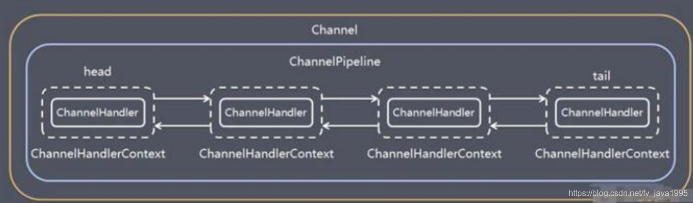
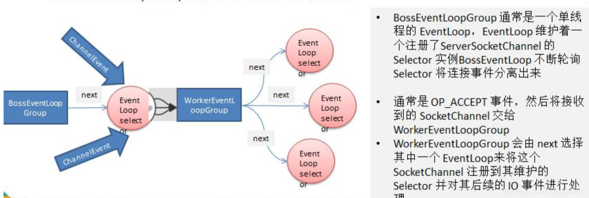

# 简介
Netty是一个异步的，基于事件驱动的网络应用框架，用以快速开发高性能，高可靠的网络IO程序

# 封装结构是 
TCP --> java原生的io/网络编程 --> NIO --> Netty

# 应用场景
1）作为高性能的RPC框架的基础通信组件
2）大型网络游戏
3）大数据领域

# IO模型的基本说明
简单理解就是用什么样的通道进行数据的发送和接受，很大程度上决定了程序通信的性能
java支持三种网络编程模型/IO模式：BIO, NIO, AIO

1）BIO:
同步并阻塞，服务器的实现模式为一个连接一个线程，即客户端有连接请求时服务器端就需要启动一个线程处理
如果这个线程不做任何事情，就会造成资源浪费
场景适用于连接数目小，并且一次发送大量数据的场景，对服务器资源要求比较高
2）NIO:
同步非阻塞，服务器端实现为一个线程处理多个连接，即客户端发送的线程都会注册到多路
复用器上，多路复用器轮询有IO请求就进行处理
场景适用于连接数目多且连接比较短的框架，比如聊天服务器，弹幕系统
3）AIO:
异步非阻塞，有效的请求才启动线程，它的特点是由操作系统完成后才通知服务端程序启动
线程去处理，一般适用于连接数较多且连接时间较长的应用
场景适用于连接数目比较多且连接比较长的架构，比如相册服务器

# 为什么netty不使用AIO
1，NIO就好比做好了餐自己去取，AIO相当于送餐上门。要吃饭的人百万、千万级别，送餐的也就几百人。
2，Netty不看重Windows上的使用，在Linux上，AIO的底层实现使用EPOLL没有很好的实现AIO，因此性能上没有明显的优势
3，Netty是reactor模型，而AIO是proactor模型，混合在一起使用会非常混乱
4，AIO还有个缺点是接受数据需要预先分配缓存，而不是NIO那种接受时才需要分配缓存，所以对连接数量大但流量小的情况内存浪费很多

# NIO基本模型
Selector，Channel，Buffer
1）每个channel都会对应一个Buffer
2）Selector对应一个线程，一个线程对应多个channel
3）程序切换到哪个channel是由事件决定的，Event是一个重要的概念
4）Selector会根据不同的事件，在各个通道上进行切换
5）数据的读取或写入是通过Buffer，这个和BIO不同，BIO中要么是输入流要么是输出流，不能双向
但是NIO的Buffer是可以读也可以写的，但是要通过flip方法进行切换
6）channel是双向的，可以返回底层操作系统的情况，比如Linux底层的通道就是双向的

# Buffer的几个重要属性
Capacity 容量，即可以容纳的最大量数据，在缓冲区创建时被设定不能改变
Limit 表示缓冲区的当前终点，不能对缓冲区超过极限的位置进行读写操作，且极限是可以修改的
Position 位置，下一个要被读或写的元素的索引，每次读写缓冲区数据时会改变值，为下次读写做准备
Mark 标记

# 通道（Channel）
NIO的通道类似于流，但是有区别

通道可以进行同时的读写，而流只能读或者只能写
通道可以实现异步读写数据
通道可以从缓冲读取数据，也可以写数据到缓冲区

常用的Channel
FileChannel：用于文件的读写
DatagramChannel：用于UDP的数据读写
ServerSocketChannel和SocketChannel：用于TCP数据读写

# NIO线程模型
## 1）传统阻塞的IO服务模型
### 特点：
采用阻塞IO获取输入的数据，每个连接都需要独立的线程完成数据的输入，
业务处理，数据返回
### 缺点：
并发很大时会创建大量的线程，占用系统资源
连接创建后，如果当前线程没有数据可读，会阻塞read操作，造成资源浪费

## 2）Reactor反应模式
### 1, 单reactor单线程
#### 实现：
Reactor通过Selector监控客户端的请求，收到请求后创建Handler对象处理连接后续的处理
#### 优点
模型简单，没有多线程，进行通信，竞争的问题
#### 缺点
性能不足，只有一个线程，在Handler处理某个连接业务时，整个线程无法处理其他的事件
导致性能瓶颈。
可靠性不足，线程意外终止，导致整个系统通信模块不可用
####使用场景
客户端数量有限，业务处理速度非常快

### 2, 单reactor多线程
#### 实现
Reactor通过Selector监控客户端的请求，如果是连接请求通过Acceptor创建Handler对象，处理完成连接后的事件。
如果不是连接请求，则调用连接对应的Handler来处理，这里的Handler只负责响应事件，不做具体的业务处理，会分发给后面的worker线程池处理具体的业务
#### 优点：
充分利用多核cpu的处理能力
####缺点
多线程数据共享访问比较复杂。
reactor处理所有的事件和响应，在单线程中运行，在高并发场景容易出现瓶颈

### 3, 主从reactor多线程
#### 实现
1，Reactor的主线程MainReactor会监听连接事件，收到连接事件后会通过Acceptor建立连接；
2，然后MainReactor将连接分配给SubReactor，SubReactor将连接加入到连接队列监听
3，SubReactor创建Handler进行事件的处理，后面就会将具体的处理分发给worker线程池处理

#### 优点
响应快，不必为单个同步时间阻塞，虽然Reactor本身是同步的
避免复杂的线程和同步问题，并避免了多线程切换的开销
扩展性好，可以方便通过增加Reactor实例数充分利用CPU资源
复用性好，Reactor模型本身和事件处理逻辑无关，具有很高的复用性

# Netty基本模型
1）Netty抽象出两组线程池，BossGroup专门负责客户端的连接，WorkerGroup专门负责网络的读写
2）BossGroup和WorkerGroup类型都是NioEventLoopGroup
3）NioEventLoopGroup，相当于是一个事件循环组，这个组中有多个事件循环，每个事件循环是NioEventLoop
4）NioEventLoop表示一个不断循环处理任务的线程，每个NioEventLoop都有一个selector用于监听绑定
在其上的socket网络通讯

5）BossGroup循环执行的步骤
1，轮询accept事件
2，处理accept事件，建立连接
3，处理任务队列的任务，即runAllTasks

6）WorkerGroup循环执行的步骤
1，轮询read，write事件
2，处理事件，在对应的NioSocketChannel上处理
3，处理任务队列的任务，即runAllTasks

方案再说明
NioEventLoop表示一个不断循环的处理任务的线程，每个NioEventLoop都有一个selector，用于监听绑定在其上的socket网络通道
NioEventLoop采用串行化设计，从消息读取->解码->编码->发送，始终由IO线程NioEventLoop负责

每个NioEventLoop中包含有一个selector，一个taskQueue
每个NioEventLoop的selector上可以注册监听多个NioChannel
每个NioChannel只会绑定在唯一的一个NioEventLoop上
每个NioChannel都绑定有自己的一个ChannelPipeline

Channel
1）Netty网络通信的组件，能够用于执行网路的IO操作
2）通过Channel可获得当前网络的连接状态
3）通过Channel可获得网络连接的参数配置
4）Channel提供异步的网路IO操作（如建立连接，读写，绑定端口），异步意味着任何IO调用将立即返回，并且不保证在调用结束时所有请求IO操作完成
5）调用立即返回一个ChannelFuture实例，通过注册监听器到ChannelFuture上，可以在IO操作成功，失败，取消时回掉通知对方
6）支持关联IO操作与对应的处理程序
7）不同协议，不同阻塞类型的连接都有不同的channel类型与之对应，
常用的channel类型：
NioSocketChannel 异步的客户端TCP Socket连接
NioServerSocketChannel 异步的服务端TCP Socket连接
NioDatagramChannel 异步的UDP连接
NioSctpChannel 异步的客户端Sctp连接
NioSctpServerChannel 异步的Sctp服务器端连接，这些通道覆盖了UDP和TCP网络IO以及文件IO

Selector
1）netty基于selector对象实现IO多路复用，通过selector一个线程可以监听多个连接的channel事件
2）当向一个selector注册了channel后，selector内部机制就可以自动不断的查询这些注册的channel是否有已就绪的IO事件
这样程序可以简单的使用一个线程管理多个channel

ChannelHandler
1）ChannelHandler是一个接口，处理IO事件或连接IO连接，并将其转发到其ChannelPipeline（业务处理）的下一个处理程序
2）ChannelHandler本身并没有提供很多的方法，因为这个接口的很多方法需要实现
ChannelInboundHandler 用于处理入站IO事件
ChannelOutboundHandler 用于处理出站IO事件
//适配器
ChannelInboundHandlerAdapter 用于处理入站IO事件
ChannelOutboundHandlerAdapter 用于处理入站IO事件
ChannelDuplexHandler处理入站和出站事件

ChannelPipeline
在netty中每个channel都有且仅有一个channelpipeline与之对应
1）一个channel包含了一个channelpipeline，而channelpipeline中又维护了一个由channelhandlercontext
组成的双向链表，并且那个channelhandlercontext中又关联着一个handler
2）入站事件和出站事件在一个双向链表中，入站事件会从链表head往后传递到最后一个入站的handler
出站事件会从链表tail往前传递到最前一个出站的handler，两种类型的handler互不干扰

ChannelHandlerContext
1）保存Channel相关的上下文信息，同时关联着一个ChannelHandler对象
2）即ChannelHandlerContext中具体包含着一个具体的事件处理器ChannelHandler
同时也绑定了对应的pipeline和channel信息，方便对ChannelHandler进行调用
ChannelFuture close() 关闭通道
ChannelOutboundInvoker flush() 刷新
ChannelFuture writeAndFlush(Object msg) 将数据写到ChannelPipeline
ChannelHandler 的下一个ChannelHandler开始处理

EventLoopGroup和其实现类NioEventLoopGroup
1）EventLoopGroup是一组EventLoop的抽象，Netty为了更好的利用多核CPU资源
一般会有多个EventLoop同时工作，每个EventLoop维护者一个Selector实例
2）EventLoopGroup提供next接口，可以从组里面按照规则获取其中一个
EventLoop来处理任务，在netty编程中，我们一般需要两个EventLoopGroup，比如
BossEventloopGroup和WorkerEventLoopGroup
3）通常一个服务端口即一个ServerSocketChannel对应一个Selector和一个EventLoop线程
1. BossEventLoop负责接受客户端的连接并将SocketChannel交给WorkerEventLoopGroup进行IO处理
BossEventLoopGroup通常是一个单线程的EventLoop，EventLoop维护者一个注册了ServerSocketChannel的
Selector实例BossEventLoop不断轮询Selector将连接事件分离出来
2. 通常是OP_ACCEPT事件，然后将接受到的SocketChannel交给WorkerEventLoopGroup
3. WorkerEventLoopGroup会由next选择其中一个EventLoopGroup将这个SocketChannel
注册到其维护的Selector并对其后续的IO事件进行处理

# 十大核心模块组件介绍
1，Bootstrap、ServerBootstrap
    简介
        Bootstrap意思是引导，一个Netty应用通常是由一个Bootstrap开始，主要作用是配置整个Netty程序，串联各个组件
        Netty中的Bootstrap类是客户端程序的启动引导类，ServerBootstrap是服务端启动引导类
    常用方法
        group(EventLoopGroup parentGroup, EventLoopGroup childGroup)    该方法用于服务器端，用来设置两个EventLoop
        group(EventLoopGroup group)     该方法用于客户端，用来设置一个 EventLoop
        channel(Class<? extends C> channelClass)    该方法用来设置一个服务器端的通道实现
        option(ChannelOption<T> option, T value)    用来给 ServerChannel 添加配置
        childOption(ChannelOption<T> childOption, T value)      用来给接收到的通道添加配置
        childHandler(ChannelHandler childHandler)   该方法用来设置业务处理类
        bind(int inetPort)  该方法用于服务器端，用来设置占用的端口号
        connect(String inetHost, int inetPort)	该方法用于客户端，用来连接服务器端
2，Future、ChannelFuture
    简介
        Netty中所有的IO操作都是异步的，不能立刻得知消息是否被处理。但是可以过一会儿等他执行完成或者直接注册一个监听，
        具体实现就是通过Future和ChannelFutures，他们可以注册一个监听，当操作执行成功或失败时监听会自动触发注册的监听事件
    常用方法
        Channel channel()   返回当前正在进行 IO 操作的通道
        ChannelFuture sync()    等待异步操作执行完毕
3，Channel
    Netty网络通信组件，能够用于执行网络I/O操作
    通过Channel可获得当前网络连接的通道状态
    通过Channel可获得网络连接的配置参数(例如接受缓冲区大小)
    Channel提供异步的网络I/OA操作（例如建立连接、读写、绑定端口），异步调用意味着任何I/O调用都将立即返回，并且不保证在调用结束时所有请求的I/O操作完成
    调用立即返回一个ChannelFuture实例，通过注册监听器到ChannelFuture上，可以I/O操作成功、失败或取消时回掉通知调用方
    支持关联I/O操作与对应的处理程序
    不同协议、不同的阻塞类型的连接都有不同的Channel类型与之对应，常用的Channel类型
        NioSocketChannel 异步的客户端TCP Socket连接
        NioServerSocketChannel  异步的服务端TCP Socket 连接
        NioDatagramChannel	异步的 UDP 连接
        NioSctpChannel  异步的客户端 Sctp 连接
        NioSctpServerChannel    异步的 Sctp 服务器端连接，这些通道涵盖了 UDP 和 TCP 网络 IO 以及文件 IO
4，Selector
    Netty 基于 Selector 对象实现 I/O 多路复用，通过 Selector 一个线程可以监听多个连接的 Channel 事件
    当向一个 Selector 中注册 Channel 后，Selector 内部的机制就可以自动不断地查询(Select) 这些注册的 Channel 是否有已就绪的 I/O 事件(例如可读，可写，网络连接完成等)，这样程序就可以很简单地使用一个线程高效地管理多个 Channel
5，ChannelHandler及其实现类
    ChannelHandler 是一个接口，处理 I/O 事件或拦截 I/O 操作，并将其转发到其 ChannelPipeline(业务处理链) 中的下一个处理程序
    ChannelHandler 本身并没有提供很多方法，因为这个接口有许多的方法需要实现，方便使用期间，可以继承它的子类
    我们经常需要自定义一个 Handler 类去继承ChannelInboundHandlerAdapter，然后通过重写相应方法实现业务逻辑：
        public class ChannelInboundHandlerAdapter extends ChannelHandlerAdapter implements ChannelInboundHandler {
            /**
             * 通道就绪事件
             */
            @Override
            public void channelActive(ChannelHandlerContext ctx) throws Exception {
                ctx.fireChannelActive();
            }
            /**
             * 通道读取数据事件
             */
            @Override
            public void channelRead(ChannelHandlerContext ctx, Object msg) throws Exception {
                ctx.fireChannelRead(msg);
            }
            /**
             * 通道读取数据完毕事件
             */
            @Override
            public void channelReadComplete(ChannelHandlerContext ctx) throws Exception {
                ctx.fireChannelReadComplete();
            }
            /**
             * 通道异常事件
             */
            @Override
            public void exceptionCaught(ChannelHandlerContext ctx, Throwable cause)
                    throws Exception {
                ctx.fireExceptionCaught(cause);
            }
        }
6，Pipeline和ChannelPipeline
    ChannelPipeline 是一个 Handler 的集合，它负责处理和拦截 inbound 或者 outbound 的事件和操作，相当于 一个贯穿 Netty 的链。
    (也可以这样理解:ChannelPipeline 是 保存 ChannelHandler 的 List，用于处理或拦截 Channel 的入站事件和出站操作)
    ChannelPipeline 实现了一种高级形式的拦截过滤器模式，使用户可以完全控制事件的处理方式，以及 Channel 中各个的 ChannelHandler 如何相互交互
    在 Netty 中每个 Channel 都有且仅有一个 ChannelPipeline 与之对应，它们的组成关系如下:
        一个Channel包含了一个ChannelPipeline，而ChannelPipeline中又维护了一个由ChannelHandlerContext组成的双向链表，并且每个ChannelHandlerContext中又关联着一个ChannelHandler
        入站时间和出站时间在一个双向链表中，入站事件会从链表head往后传递到最后一个入站的handler，出站事件会从链表tail往前传递到最前一个出站的handler，两种类型的handler互不干扰
    
    常用方法
        addFirst(ChannelHandler… handlers)  把一个业务处理类(handler)添加到链中的第一个位置
        addLast(ChannelHandler… handlers)   把一个业务处理类(handler)添加到链中的最后一个位置
7，ChannelHandlerContext
    保存 Channel 相关的所有上下文信息，同时关联一个 ChannelHandler 对象
    ChannelHandlerContext中包含一个具体的事件处理器 ChannelHandler，同时 ChannelHandlerContext 中也绑定了对应的 pipeline 和 Channel 的信息，方便对 ChannelHandler 进行调用
    常用方法
        close()     关闭通道
        flush()     刷新
        writeAndFlush(object msg)       将数据写到ChannelPipeline中当前ChannelHandler的下一个ChannelHandler开始处理
8，ChannelOption
    Netty 在创建 Channel 实例后,一般都需要设置 ChannelOption 参数
    ChannelOption 参数如下:
        ChannelOption.SO_BACKLOG：对应TCP/IP协议listen函数中的backlog参数，用来初始化服务器可连接队列。服务端处理客户端连接请求是顺序处理的，所以同一时间只能处理一个客户端连接。多个客户端来的时候，服务端将不能处理的客户端连接请求放在队列中等待处理，backlog参数指定了队列的大小
    ChannelOption.SO_KEEPALIVE：一直保持连接活动状态
9，EventLoopGroup
    EventLoopGroup 是一组 EventLoop 的抽象，Netty 为了更好的利用多核 CPU 资源，一般会有多个 EventLoop 同时工作，每个 EventLoop 维护着一个 Selector 实例
    EventLoopGroup 提供 next 接口，可以从组里面按照一定规则获取其中一个 EventLoop 来处理任务。在 Netty 服务器端编程中，我们一般都需要提供两个 EventLoopGroup，例如:BossEventLoopGroup 和 WorkerEventLoopGroup
    通常一个服务端口即一个ServerSocketChannel对应一个Selector和一个EventLoop线程。BossEventLoop 负责接收客户端的连接并将 SocketChannel 交给 WorkerEventLoopGroup 来进行 IO 处理，如下图所示
    
10，Unpooled 类
    Netty 提供一个专门用来操作缓冲区(即 Netty 的数据容器)的工具类
    常用方法如下
        //通过给定的数据和字符编码返回一个ByteBuf对象
        ByteBuf byteBuf = Unpooled.copiedBuffer("hello,world!", Charset.forName("utf-8"));
    ButeBuf的基本使用演示
        public class NettyByteBuf01 {
            public static void main(String[] args) {
                //创建一个ByteBuf
                //说明
                //1. 创建 对象，该对象包含一个数组arr , 是一个byte[10]
                //2. 在netty 的buffer中，不需要使用flip 进行反转
                //   底层维护了 readerindex 和 writerIndex
                //3. 通过 readerindex 和  writerIndex 和  capacity， 将buffer分成三个区域
                // 0---readerindex 已经读取的区域
                // readerindex---writerIndex ， 可读的区域
                // writerIndex -- capacity, 可写的区域
                ByteBuf buffer = Unpooled.buffer(10);
        ​
                for(int i = 0; i < 10; i++) {
                    buffer.writeByte(i);
                }
        ​
                System.out.println("capacity=" + buffer.capacity());//10
                //输出
        //        for(int i = 0; i<buffer.capacity(); i++) {
        //            System.out.println(buffer.getByte(i));
        //        }
                for(int i = 0; i < buffer.capacity(); i++) {
                    System.out.println(buffer.readByte());
                }
                System.out.println("执行完毕");
            }
        }
    案例2:
        public class NettyByteBuf02 {
            public static void main(String[] args) {
                //创建ByteBuf
                ByteBuf byteBuf = Unpooled.copiedBuffer("hello,world!", Charset.forName("utf-8"));
                //使用相关的方法
                if(byteBuf.hasArray()) { // true
                    byte[] content = byteBuf.array();
                    //将 content 转成字符串
                    System.out.println(new String(content, Charset.forName("utf-8")));
                    System.out.println("byteBuf=" + byteBuf);
                    System.out.println(byteBuf.arrayOffset()); // 0
                    System.out.println(byteBuf.readerIndex()); // 0
                    System.out.println(byteBuf.writerIndex()); // 12
                    System.out.println(byteBuf.capacity()); // 36
                    //System.out.println(byteBuf.readByte()); //
                    System.out.println(byteBuf.getByte(0)); // 104
                    int len = byteBuf.readableBytes(); //可读的字节数  12
                    System.out.println("len=" + len);
                    //使用for取出各个字节
                    for(int i = 0; i < len; i++) {
                        System.out.println((char) byteBuf.getByte(i));
                    }
                    //按照某个范围读取
                    System.out.println(byteBuf.getCharSequence(0, 4, Charset.forName("utf-8")));
                    System.out.println(byteBuf.getCharSequence(4, 6, Charset.forName("utf-8")));
                }
            }
        }
# netty用到的设计模式
Builder构造器模式：ServerBootstrap
责任链设计模式：pipeline的事件传播
工厂模式：创建 channel
适配器模式：HandlerAdapter

# 粘包/半包问题
描述
    客户端发送数据时，实际是把数据写入到tcp发送缓存里面的
    1，如果发送包大小比tcp发送缓存容量大，那么这个数据包会被分成多个包，通过socket多次发送到服务端
    服务端第一次从接受缓存里面获取的数据，实际是整个包的一部分，这时产生半包现象，半包不是说只收到了全包的一半，而是说收到了全包的一部分
    2，如果发送包的大小比tcp发送缓存容量小，并且tcp缓存可以存放多个包，那么客户端和服务端一次通信就可能传递了多个包，
    这时候服务端从接受缓存就可能一下读取了多个包，这时候就出现了粘包现象。
    服务端从接受缓存读取数据后一般都是进行解码操作，也就是会把byte流转换了pojo对象，如果出现了粘包或者半包现象，则进行转换时候就会出现异常。
    出现粘包和半包的原因是TCP层不知道上层业务的包的概念，它只是简单的传递流，所以需要上层应用层协议来识别读取的数据是不是一个完整的包
TCP粘包/半包发生的原因
    1. 客户端发送的数据大于TCP发送缓冲区剩余空间大小，将会发生拆包
    2. 客户端待发送数据大于MSS(最大报文长度)，TCP在传输前将进行拆包
    3. 客户端发送的数据小于TCP发送缓冲区的大小，TCP将多次写入缓冲区的数据一次发送出去，将会发生粘包
    4. 接收数据端的应用层没有及时读取接收缓冲区中的数据，将发生粘包
netty中怎么解决
    1，固定长度的拆包器FixedLengthFrameDecoder
        如果应用层协议很简单，每个数据包长度是固定的，比如100，那么只需要将这个拆包器加到pipekine中
        netty会把一个个长度为100的数据包传递到下一个个channelHandler
    2，行拆包器LineBasedFrameDecoder
        发送端发送数据包的时候，每个数据包之间以换行符作为分割，接受端通过LineBasedFrameDecoder将粘过的ByteBuf拆分成一个个完整的应用层数据包
    3，分隔符拆包器DelimiterbasedFrameDecoder
        DelimiterbasedFrameDecoder是行拆包器的通用版本，只不过我们可以自定义分隔符
    4，基于长度域拆包器LengthFieldBasedFrameDecoder
        是最通用的拆包器，只要你的自定义协议中包含长度域字段，均可以使用这个拆包器来实现应用层拆包。

# NioEventLoopGroup源码
基本思路：
    1，我们在new一个work/boss线程的时候一般采用的直接使用无参的构造方法，但是无参的构造方法他创建的线程池的大小就是我们CPU的核心的两倍。
    紧接着就需要new这么多线程放到线程池里面，这里的线程池采用的数据结构是一个数组存放的，每一个线程需要设置一个任务队列，显然任务队列是一个阻塞队列，这里采用的是LinkedBlockQueue。
    然后回想一下jdk中的线程池是不是还有一个比较重要的参数就是线程工厂，对的，这里也有这个东西，他是需要我们手动传入的，但是如果不传则会使用一个默认的线程工厂，
    里面有一个newThread方法，这个方法实现基本和jdk中的实现一摸一样，就是创建一个级别为5的非Daemon线程。对这就是我们在创建一个线程池时候完成的全部工作
    2，现在来具体说一下，我们每次创建的是NioEventLoopGroup，但是他又继承了n个类才实现了线程池，也就是线程池的祖先是 ScheduledExecutorService 是jdk中的线程池的一个接口，其中里面最重要的数据结构是一个children数组没用来装线程的。
    3，然后具体的线程的线程也是进行了封装的，也就是我们常看到的NioEventLoop。这个类里面有两个比较重要的结构：taskQueue和thread。很明显这个非常类似jdk中的线程池
NioEventLoopGroup线程池分析：
    首先要创建线程池，传入的线程数为0，
    

# ChannelInboundHandlerAdapter基类 和 SimpleChannelInboundHandler基类有什么区别？
1，SimpleChannelInboundHandler在接收到数据后会自动release掉数据占用的Bytebuffer资源：自动调用Bytebuffer.release()。
如果在channelRead方法返回前还没有写完数据，也就是当让他release时，就不能继承SimpleChannelInboundHandler基类。
而继承ChannelInboundHandlerAdapter则不会自动释放，需要手动调用ReferenceCountUtil.release()等方法进行释放
2，SimpleChannelInboundHandler还有一个好处，可以在泛型参数中，可以直接指定好传输的数据格式。所以继承该类，在处理数据时，不需要判断数据格式。
而继承ChannelInboundHandlerAdapter则需要进行数据格式的判断和转换
3，推荐在服务端去继承ChannelInboundHandlerAdapter，建议手动进行释放，防止数据未处理完就自动释放了。

其实这两个抽象类都是有讲究的，在客户端的业务Handler继承的是SimpleChannelInboundHandler，而在服务器端继承的是ChannelInboundHandlerAdapter。
最主要的区别就是SimpleChannelInboundHandler在接收到数据后会自动release掉数据占用的Bytebuffer资源（自动调用Bytebuffer.release()）。
为何服务端不能用呢，因为我们想让服务器把客户端请求的数据发送回去，而服务器端有可能在channelRead方法返回前还没有写完数据，因此不能让他release

