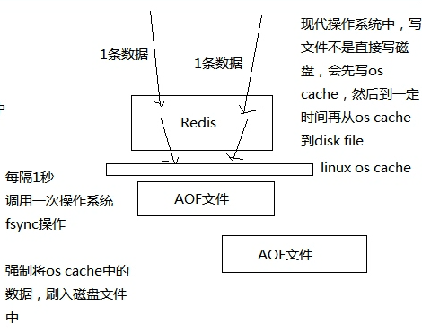
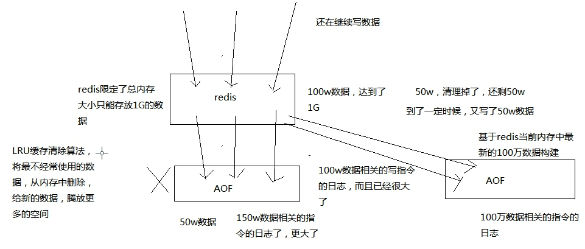
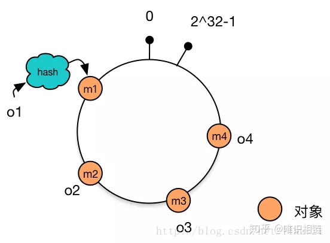
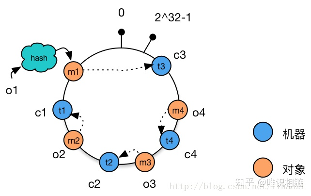
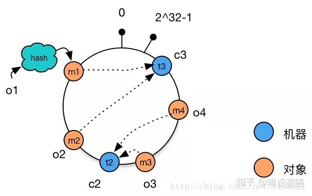

1，如何让 redis 集群支撑几十万 QPS 高并发 + 99.99% 高可用 + TB 级海量数据 + 企业级数据备份与恢复？
    redis 企业级集群架构
2，如何支撑高性能以及高并发到极致？同时给缓存架构最后的安全保护层？
  (nginx + lua) + redis + ehcache 的三级缓存架构
3，高并发场景下，如何解决数据库与缓存双写的时候数据不一致的情况？
  企业级的完美的数据库 + 缓存双写一致性解决方案
4，如何解决大 value 缓存的全量更新效率低下问题？
  缓存维度化拆分解决方案
5，如何将缓存命中率提升到极致
  双层 nginx 部署架构，以及 lua 脚本实现的一致性 hash 流量分发策略
6，如何解决高并发场景下，缓存重建时的分布式并发重建的冲突问题？
  基于 zookeeper 分布式锁的缓存并发重建解决方案
7，如何解决高并发场景下，缓存冷启动mysql瞬间被打死的问题
  基于storm实时统计热数据的分布式快速缓存预热解决方案
8，如何解决热点缓存导致单机器负载瞬间超高
  基于storm的实时热点发现，以及毫秒级的实时热点缓存负载均衡降级
9，如何解决分布式系统中服务高可用问题？避免多层服务依赖因为少量故障导致系统崩溃？
  基于hystrix的高可用缓存服务，资源隔离+限流+降级+熔断+超时控制
10，如何应用分布式系统中的高可用服务的高阶技术？
  基于 hystrix 的容错 + 多级降级 + 手动降级 + 生产环境参数优化经验 + 可视化运维与监控
11，如何解决恐怖的缓存雪崩问题？避免给公司带来巨大的经济损失？
  独家的事前 + 事中 + 事后三层次完美解决方案
12，如何解决高并发场景下的缓存穿透问题？避免给 MySQL 带来过大的压力？
  缓存穿透解决方案
13，如何解决高并发场景下的缓存失效问题？避免给 redis 集群带来过大的压力？
  缓存失效解决方案
#大型电商网站的异步多级缓存构建 + nginx 数据本地化动态渲染的架构

两个关键点：
    1，缓存数据生产服务
    2，nginx上的html模版 + 本地缓存数据
来捋一捋流程：
    1，用户访问nginx
        会先从nginx的本地缓存获取数据渲染后返回，这个速度很快，因为全是内存操作。
        本地缓存数据是有时间的，比如10分钟
    2，假如nginx本地缓存失效
        会从redis中获取数据回来并缓存上
    3，假如redis中的数据失效
        会从数据生产服务中获取数据并缓存上
    4，缓存数据生产服务
        本地也有一个缓存，比如用的是ehcache他们通过队列监听商品修改等事件，让自己的缓存数据及时更新
    5，其他服务
        商品、店铺等服务能获取到商品的修改事件等，及时往 mq 中发出商品的修改事件， 并提供商品原始数据的查询。这里可能是直接从 mysql 库中查询的
图解redis的RDB和AOF两种持久化机制的工作原理
RDB
    
    自动隔离保存
        此时我们的小伙伴意识到，我们不能每次都执行命令手动保存或者执行定时器执行命令，这样会导致可用性降低，那么Redis提供自动保存的配置
        save 100 10：100秒内对Redis进行10次以上的修改
        save 3600 1000：一小时内对Redis进行至少1000次的修改
        ###只要满足上面任何一个要求则执行bgsave命令
    那么Redis源代码中保存这个配置的是在redisServer中的一个saveparam的结构，代码如下:
        struct saveparam {
            teme_t seconds;    //秒
            int changes;       //修改数
        }
    RDB快照原理
        bgsave是开启一个子进程进行文件的操作，那么此时的Redis主进程还在响应客户端的命令，那么我们的Redis如何保证数据完整性和性能呢？
            Redis在持久化的时候会fork产生一个子进程，持久化过程完全交给子进程，而父进程则响应客户端的命令。
            子进程创建时不会立即保存文件因为这会与父进程产生资源抢占，它的指针指向父进程的内存空间与父进程共享内存，这样为了更加节约资源。
            此时父进程是会读写内存中的数据，子进程只是读取资源并不会写
            此时Redis使用操作系统的多进程COW(Copy On Write）机制进行数据段页面的分离，每页数据不会超过4K，我们把这个数据称之为冷数据
            父进程进行修改的时候我们只需要把共享的页数据复制出来对其进行修改，而不在原数据上进行修改，冷数据没有任何的变化
            子进程现在可以安心的对冷数据进行持久化，此时我们持久化的内容就像是被拍了照一样固定下来，这就是快照的整个过程。
            这里值得注意的是随着时间的推移，父进程修改的页也会越来越多，理论上这个复制出来的内存能达到之前数据内存，所以我们在设计缓存的时候尽可能的少改数据。
    AOF日志原理
        每当服务器常规任务函数被执行、或者事件处理器被执行时,aof.c/flushAppendOnlyFile函数都会被调用，这个函数执行以下两个工作：
            WRITE：根据条件，将aof_buf中的缓存写入到AOF文件。
            SAVE：根据条件，调用fsync或fdatasync函数，将AOF文件保存到磁盘中。
        Redis目前支持三种AOF保存模式：
            1. AOF_FSYNC_NO：不保存，操作系统来决定什么时候保存保存。
            2. AOF_FSYNC_EVERYSEC：每一秒钟保存一次。
            3. AOF_FSYNC_ALWAYS：总是保存，每执行一个命令保存一次。
        关于fsync
            AOF日志是以文件的形式存在的，当我们的AOF从缓冲区写入AOF文件中时服务器突然宕机，此时我们的文件还没有完全写入磁盘，这时我们该如何处理呢？
            fsync函数可以将指定文件的内容强制从内核缓存刷到磁盘。
            只要Redis进程实时调用fsync函数就可以保证AOF日志不失。
            但是fsync是一个磁盘IO操作，so它很慢。如果Redis执行一条指令就要fsync一次，那么可想而知Redis的性能就会拉下一大截 。
            所以在生产环境的服务器中，Redis通常是每隔1s左右执行一次fsync操作，这个1s的周期是可以配置的。
            这是在数据安全性和性能之间做的一个折中，在保持高性能的同时，尽可能使数据少丢失。
            Redis同样也提供了另外两种策略，一个是永不调用fsync让操作系统来决定何时同步碰盘，这样做很不安全，另一个是来一个指令就调用fsync一次——结果导致非常慢。这两种策略在生产环境中基本不会使用。
        AOF重写
            我们的AOF一直累加进行持久化，随着时间的推移备份文件会越来越大，甚至影响我们对Redis的恢复和操作，Redis也提供重写机制，下面我们来看看
            set name zhangsan
            >set name mango
            >set name lisi
            ...
            >set name mango
            ####优化后
            >set name mango
            我们可以看到经常会对一个key进行多次修改，那么我们可以把这个key的最后一次操作保存起来这样我们就轻易的给AOF"瘦身"。
            当然我们还有一种方式，就是遍历整个Redis，set每个key和它的值，也跟RDB全备一样我们需要一个子进程读取当前的Redis库。
            这里会出现一个问题，我们如果是遍历整个Redis需要考虑此时的客户端必定会有指令更改里面的值，此时我们怎么保证AOF重写后不丢下重写后的指令呢？
                
                操作步骤：
                    1，AOF创建一个子进程进行AOF重写，其指定内存跟主进程一致
                    2，客户端执行写命令，主线程处理指令，指令追加到AOF缓冲区，并且追加到AOF重写缓冲区
                    3，AOF重写完成后替换现有的AOF文件
                那么为什么会把这个指令同时追加到AOF缓冲区和AOF重写区呢？原因是如果我们在重写的时候突然服务器挂了，那么我们AOF文件中会保存这个指令。追加到AOF缓冲区是为了保证操作指令能及时同步到AOF重写区。AOF重写操作也就是之前提到过的bgrewriteaof。
AOF
    
    为了保证性能，会先写入os cache中，然后定期强制执行fsync操作将数据刷入磁盘
    它的原理：
        因为每台单机redis的数据量是受内存限制的，所以aof文件不会无限增长
        且当数据超过内存限制的时候，会自动使用LRU算法将一部分数据淘汰掉
        AOF存放的是每条写入命令，所以会不断地膨胀，当达到一定时候，会 做rewrite操作
        rewrite操作：基于当时redis内存中的数据，重新构造一个更小的aof文件，然后删除旧的aof文件
        
        如上图，总结一下： 
            aof 不断被追加，内存中数据有最大限制会自动淘汰，
            当 aof 中的数据大于内存中数据时，就会执行 rewrite 操作，生成新的 aof 文件
        AOF 机制对每条写入命令作为日志，以 append-only 的模式写入一个日志文件中，在 redis 重启的时候，可以通过回放 AOF 日志中的写入指令来重新构建整个数据集
RDB和AOF的优劣势对比
    RDB优点：
        1，适合做冷备份
            RDB会生成多个数据文件，每个数据文件代表代表了某个时刻中的redis数据，这种多个数据文件的方式，非常适合冷备份
            可以将这种完整的数据文件发送到一些远程的安全存储上去，如云上，以预定好的备份策略来定期备份 redis 中的数据
        2，性能影响小
            能让 redis 对外提供的读写服务不受影响，因为 redis 主进程只需要 fork 一个子进程，让子进程执行磁盘 IO 操作来进行 RDB 持久化即可
        3，数据恢复快
            相对于 AOF 持久化机制来说，直接基于 RDB 数据文件来重启和恢复 redis 进程，更加快速。
            因为 AOF，存放的指令日志，做数据恢复的时候，其实是要回放和执行所有的指令日志，来恢复出来内存中的所有数据的
            RDB 就是一份数据文件，恢复的时候，直接加载到内存中即可
    RDB缺点：
        1，故障时数据丢失的多
            一般来说，RDB 数据快照文件，都是每隔 5 分钟，或者更长时间生成一次，一旦 redis 进程宕机，那么会丢失最近 5 分钟的数据（因为在内存中还未来得及导出到磁盘）
    AOF优点：
        1，在故障时，数据丢得少
            一般 AOF 会每隔 1 秒，通过一个后台线程执行一次 fsync 操作，保证 os cache 中的数据写入磁盘中，最多丢失 1 秒钟的数据
        2，AOF 文件写入性能高
            AOF 日志文件以 append-only 模式写入，所以没有任何磁盘寻址的开销，写入性能非常高，而且文件不容易破损，即使文件尾部破损，也很容易修复(官方提供了一个修复工具)
        3，rewrite 操作对 redis 主线程影响较小
            AOF 日志文件即使过大的时候，出现后台重写操作，也不会影响客户端的读写。
            因为在 rewrite log 的时候，会对其中的数据进行压缩，创建出一份需要恢复数据的最小日志出来。
            再创建新日志文件的时候，老的日志文件还是照常写入。
            当新的 merge 后的日志文件 ready 的时候，再交换新老日志文件即可。
        4，AOF 文件内容比较容易阅读
            这个特性非常适合做灾难性的误删除的紧急恢复。比如某人不小心用 flushall 命令清空了所有数据，只要这个时候后台 rewrite 还没有发生，那么就可以立即拷贝 AOF 文件，将最后一条 flushall 命令给删了，然后再将该 AOF 文件放回去，就可以通过恢复机制，自动恢复所有数据
    AOF持久化机制缺点
        1，日志文件稍大
            对于同一份数据来说，AOF日志文件通常比RDB数据快照文件更大
        2，性能稍低
            AOF 开启后，支持的写 QPS 会比 RDB 支持的写 QPS 低，因为 AOF 一般会配置成每秒 fsync 一次日志文件，当然，每秒一次 fsync，性能也还是很高的
        3，数据恢复慢
            前面都说了，不适合做冷备，数据恢复基于指令稍慢
RDB和AOF如何选择
    1，不要仅仅使用 RDB，因为那样会导致你丢失很多数据
    2，也不要仅仅使用 AOF，因为那样有两个问题
        第一，你通过 AOF 做冷备，没有 RDB 做冷备，来的恢复速度更快;
        第二，RDB 每次简单粗暴生成数据快照，更加健壮，可以避免 AOF 这种复杂的备份和恢复机制的 bug
    3，综合使用 AOF 和 RDB 两种持久化机制
        用 AOF 来保证数据不丢失，作为数据恢复的第一选择;
        用 RDB 来做不同程度的冷备，在 AOF 文件都丢失或损坏不可用的时候，还可以使用 RDB 来进行快速的数据恢复
    结论就是：都用，AOF 作为第一恢复方式，RDB 后补
企业级别的持久化配置策略
    在企业中，RDB的生成策略，用默认的也差不多，如果有可能改动的地方，可能就是如下两个配置：
    save 60 10000：如果你希望尽可能确保说，RDB最多丢1分钟的数据，那么尽量就是每隔1分钟生成一个快照，低峰期，数据量很少，也没必要
    AOF一定要打开，fsync、everysec
        auto-aof-rewrite-percentage 100：就是当前AOF大小膨胀到超过上次100%，上次的两倍
        auto-aof-rewrite-min-size 64mb: 根据你的数据量来定，16mb，32mb~~~~
企业级的数据备份方案
    RDB 非常适合做冷备，每次生成之后，就不会再有修改了
    数据备份方案：写 crontab 定时调度脚本去做数据备份
    1，小时级：每小时都 copy 一份 rdb 的备份，到一个目录中去，仅仅保留最近 48 小时的备份
    2，日级：每天都保留一份当日的 rdb 的备份，到一个目录中去，仅仅保留最近 1 个月的备份
    3，每天晚上将当前服务器上所有的数据备份，发送一份到远程的云服务上去
数据恢复方案
    这里讲解5个场景下的数据恢复方案
    1，如果redis进程挂掉
        那么重启 redis 进程即可，直接基于 AOF 日志文件恢复数据
    2，如果是redis进程所在的机器挂掉
        那么重启机器后，尝试重启 redis 进程，尝试直接基于 AOF 日志文件进行数据恢复
        AOF没有破损，也是可以直接基于 AOF 恢复的
        AOF append-only，顺序写入，如果 AOF 文件破损，那么用 redis-check-aof fix
    3，如果 redis 当前最新的 AOF 和 RDB 文件出现了丢失/损坏
        那么可以尝试基于该机器上当前的某个最新的 RDB 数据副本进行数据恢复
        当前最新的 AOF 和 RDB 文件都出现了丢失/损坏到无法恢复，一般不是机器的故障，是人为
        模拟数据恢复-错误的做法：
            停止 redis之后，先删除 appendonly.aof，然后将我们的 dump.rdb 拷贝过去，然后再重启 redis，这个时候其实不会恢复 dump.rdb 的数据，因为我们开启了 aof，当 aof 不存在的时候，也不会主动去用 dump.rdb 去恢复数据
        正确的做法：
            停止 redis，关闭 aof，拷贝 rdb 备份，重启 redis，确认数据恢复， 直接在命令行热修改 redis 配置，打开 aof，这个 redis 就会将内存中的数据对应的日志，写入 aof 文件中
        热修改命令：redis config set appendonly yes
        切记不要停止 redis ，修改配置文件为 yes ，再启动 redis。因为这个时候 aof 文件没有生成的话，数据就又会没有的
    4，如果当前机器上的所有RDB文件全部损坏
        那么从远程的云服务器上拉去最新的RDB快照来恢复数据
    5，如果是发现有重大的数据错误，比如某个小时上线的程序一下子将数据全部污染了，数据全错了 那么可以选择某个更早的时间点，对数据进行恢复
        举个例子，12 点上线了代码，发现代码有 bug，导致代码生成的所有的缓存数据，写入 redis，全部错了，那么你应该找到一份 11 点的 rdb 的冷备，然后按照上面的步骤，去恢复到 11 点的数据，就可以了
redis如何通过读写分离来承载读请求QPS超过10万+？
    分布式+读写分离
    
    如上图，一主多从，主负责写，并且将数据同步复制到其他的slave节点，从节点负责读，还可以水平扩展slave节点支撑更多的qps
    单机的 redis 几乎不太可能 QPS 超过 10万+，除非一些特殊情况
    也就是 读多写少 的情况下才能用缓存。写多读少可以选择使用异步写
redis replication 以及 master 持久化对主从架构的安全意义
    redis 高并发的思路：redis replication -> 主从架构 -> 读写分离 -> 水平扩容支撑高并发
    
    redis replication 的核心机制
        redis 采用异步方式复制数据到 slave 节点
            不过 redis 2.8 开始，slave node 会周期性地确认自己每次复制的数据量
        一个 master node 是可以配置多个 slave node 的
        slave node 也可以连接其他的 slave node
        slave node 做复制的时候，是不会 block master node 的正常工作的
        slave node 在做复制的时候，也不会 block 对自己的查询操作
            它会用旧的数据集来提供服务; 但是复制完成的时候，需要删除旧数据集，加载新数据集，这个时候就会暂停对外服务了
        slave node 主要用来进行横向扩容，做读写分离，扩容的 slave node 可以提高读的吞吐量
    master 持久化对于主从架构的安全保障的意义
        如果采用了主从架构，那么建议必须开启 master node 的持久化！
        很简单的道理，master 提供写，它自己的数据是最完整的，所以需要它自己来做持久化。
        如果不使用 master 做持久化的冷备，而采用 slave 来做冷备的话，当 master 死机再重启，因为自己本地没有数据，会将空的数据同步到所有的 slave 上去。
        其次 master 的各种备份方案，要不要做，万一说本地的所有文件丢失了; 从备份中挑选一份 rdb 去恢复 master; 这样才能确保 master 启动的时候，是有数据的
        后面会讲解哨兵（sentinal）高可用机制，即使采用了该高可用机制，slave node 可以自动接管 master node，但是也可能 sentinal 还没有检测到 master failure，master node 就自动重启了，还是可能导致上面的所有 slave node 数据清空故障
    总结：
        master 持久化开启
        冷备方案一定要做（之前讲解的定时备份的方案）
redis 主从复制原理、断点续传、无磁盘化复制、过期 key 处理
    
    当启动一个 slave node 的时候，它会发送一个 PSYNC 命令给 master node，
        如果是重新连接：master node 仅仅会复制给 slave 部分缺少的数据;
        如果是首次连接：会触发一次 full resynchronization（全量同步）
    开始 full resynchronization 的时候，master 会启动一个后台线程，开始生成一份 RDB 快照文件，同时还会将从客户端收到的所有写命令缓存在内存中。
    RDB 文件生成完毕之后，master 会将这个 RDB 发送给 slave，slave 会先写入本地磁盘，然后再从本地磁盘加载到内存中。然后 master 会将内存中缓存的写命令发送给 slave，slave 也会同步这些数据。
    slave node 如果跟 master node 有网络故障，断开了连接，会自动重连。master如果发现有多个 slave node 都来重新连接，仅仅会启动一个 rdb save 操作，用一份数据服务所有 slave node。
    在正常情况下异步复制会很简单，来一条，异步复制一条
主从复制的断点续传
    从 redis 2.8 开始，就支持主从复制的断点续传，如果主从复制过程中，网络连接断掉了，那么可以接着上次复制的地方，继续复制下去，而不是从头开始复制一份
    master node 会在内存中创建一个 backlog，master 和 slave 都会保存一个 replication offset 和 master id，offset 就是保存在 backlog 中的。如果 master 和 slave 网络连接断掉了，slave 会让 master 从上次的 replica offset 开始继续复制，但是如果没有找到对应的 offset，那么就会执行一次 resynchronization
无磁盘化复制
    master 在内存中直接创建 rdb，然后通过网络发送给 slave，不会在自己本地落地磁盘了
    该功能是通过配置文件配置的，主要涉及到以下两个参数：
        repl-diskless-sync：无磁盘同步 默认为 no（关闭状态）
        repl-diskless-sync-delay：等待一定时长再开始复制，因为要等更多 slave 重新连接过来
    _过期_ key 处理
        slave 不会进行过期 key处理
        只会等待 master 过期 key。
        如果 master 过期了一个 key，或者通过 LRU 淘汰了一个 key，那么会模拟一条 del 命令发送给 slave。
数据同步相关的核心机制
    指的就是第一次 slave 连接 msater 的时候，执行的全量复制，该过程里面的一些细节的机制
    master 和 slave 都会维护一个 offset
        master 会在自身不断累加 offset，slave 也会在自身不断累加 offset
        slave 每秒都会上报自己的 offset 给 master，同时 master 也会保存每个 slave的 offset
        这个倒不是说特定就用在全量复制的，主要是 master 和 slave 都要知道各自的数据的 offset，才能知道互相之间的数据不一致的情况
    backlog
        master node 有一个 backlog，默认是 1MB 大小
        master node 给 slave node 复制数据时，也会将数据在 backlog 中同步写一份
        backlog 主要是用来做全量复制中断候的增量复制的
        疑问：那么这个 backlog 里面是存储 offset 的吗？
    master run id
        如果根据host+ip定位master node，是不靠谱的，如果master node重启或者数据出现了变化，
        那么slave node应该根据不同的run id区分，run id不同就做全量复制
        
        如上图，解释了为什么要通过run id来定位master node
        如果需要不更改 run id 重启 redis，可以使用 redis-cli debug reload 命令
    psync
        从节点使用 psync 从 master node 进行复制，psync runid offset
        master node 会根据自身的情况返回响应信息，可能是 FULLRESYNC runid offset 触发全量复制，可能是 CONTINUE 触发增量复制
        解释下：假如 runid 与自身不符，那么就可以全量更新数据
全量复制
    1，master 执行 bgsave，在本地生成一份 rdb 快照文件
    2，master node 将 rdb 快照文件发送给 salve node
        如果 rdb 复制时间超过 60 秒（可通过 repl-timeout 属性配置），那么 slave node 就会认为复制失败，可以适当调节大这个参数
        对于千兆网卡的机器，一般每秒传输 100MB，6G 文件，很可能超过 60s
    3，master node 在生成 rdb 时，会将所有新的写命令缓存在内存中，在 salve node 保存了 rdb 之后，再将新的写命令复制给 salve node，保证主从数据一致
    4，client-output-buffer-limit slave 256MB 64MB 60
        如果在复制期间，内存缓冲区持续消耗超过 64MB，或者一次性超过 256MB，那么停止复制，复制失败
        什么意思呢？比如在等待 slave 同步 rdb 文件的时候，master 接收写的命令在缓冲区超过了 64m 的数据，那么此次复制失败
    5，slave node 接收到 rdb 之后，清空自己的旧数据，然后重新加载 rdb 到自己的内存中，同时基于旧的数据版本对外提供服务
    6，如果 slave node 开启了 AOF，那么会立即执行 BGREWRITEAOF，重写 AOF
增量复制
    1，如果全量复制过程中，master-slave 网络连接断掉，那么 salve 重新连接 master 时，会触发增量复制
    2，master 直接从自己的 backlog 中获取部分丢失的数据，发送给 slave node，默认 backlog 就是 1MB
    3，msater 就是根据 slave 发送的 psync 中的 offset 来从 backlog 中获取数据的
heartbeat
    主从节点互相都会发送 heartbeat 信息
        master 默认每隔 10 秒发送一次 heartbeat
        salve node 每隔 1 秒发送一个 heartbeat
异步复制
    master 每次接收到写命令之后，先在内部写入数据，然后异步发送给 slave node
# redis 主从架构下如何才能做到 99.99% 的高可用性？
什么是 99.99% 高可用？
    不可用：系统挂掉，很难恢复起来，短时间内都不行，这就不可用
    高可用：全年 99.99/99.9/99 % 的时间都能正常提供服务就是高可用
redis怎样才能做到高可用
    
    通过主备切换，在很短时间内恢复可用状态。redis哨兵（sentinal node）功能提供了这种支持
哨兵架构基础
    主要功能：
        集群监控：负责监控 redis master 和 slave 进程是否正常工作
        消息通知：如果某个 redis 实例有故障，那么哨兵负责发送消息作为报警通知给管理员
        故障转移：如果 master node 挂掉了，会自动转移到 slave node 上
        配置中心：如果故障转移发生了，通知 client 客户端新的 master 地址
    哨兵本身也是分布式的，作为一个哨兵集群去运行，互相协同工作
        故障转移时，判断一个 master node 是宕机了，需要大部分的哨兵都同意才行，涉及到了分布式选举的问题
        即使部分哨兵节点挂掉了，哨兵集群还是能正常工作的，因为如果一个作为高可用机制重要组成部分的故障转移系统本身是单点的，那就很坑爹了
    核心知识
        哨兵至少需要 3 个实例，来保证自己的健壮性
        哨兵 + redis 主从的部署架构，是不会保证数据零丢失的，只能保证 redis 集群的高可用性
        对于哨兵 + redis 主从这种复杂的部署架构，尽量在测试环境和生产环境，都进行充足的测试和演练
    为什么 redis 哨兵集群只有 2 个节点无法正常工作？
        如果哨兵集群仅仅部署了个 2 个哨兵实例，且 Configuration: quorum = 1 （只有一个节点投票通过就算选举成功）
        master 宕机，s1 和 s2 中只要有 1 个哨兵认为 master 宕机就可以切换，同时 s1 和 s2 中会选举出一个哨兵来执行故障转移
        这个时候，需要 majority，也就是大多数哨兵都是运行的，2 个哨兵的 majority 就是 2（因为至少是 2 个节点以上，2 的 majority=2，3的 majority=2，5 的 majority=3，4 的 majority=2），2 个哨兵都运行着，就可以允许执行故障转移
        但是如果整个 M1 和 S1 运行的机器宕机了，那么哨兵只有 1 个了，此时就没有 majority 来允许执行故障转移，虽然另外一台机器还有一个 R1，但是故障转移不会执行
    经典的 3 节点哨兵集群
        Configuration: quorum = 2，majority
        如果 M1 所在机器宕机了，那么三个哨兵还剩下 2 个，S2 和 S3 可以一致认为 master 宕机，然后选举出一个来执行故障转移
        同时 3 个哨兵的 majority 是 2，所以还剩下的 2 个哨兵运行着，就可以允许执行故障转移
redis哨兵主备切换的数据丢失问题：异步复制、集群脑裂
    两种数据丢失的情况
        异步复制导致的数据丢失
            
            因为master -> slave 的复制是异步的，所以可能有部分数据还没复制到slave，master就宕机了，此时这部分数据就 丢失了
        脑裂导致的数据丢失
            
            何为脑裂？如上图由于一个集群中的master恰好网络故障，导致与sentinal联系不上了，sentinal把另一个slave提升为了master。此时就存在两个master了
            当我们发现的时候，停止掉其中的一个 master，手动切换成 slave，当它连接到提升后的 master 的时候，会开始同步数据，那么自己脑裂期间接收的写数据就被丢失了
    解决异步复制和脑裂导致的数据丢失
        主要通过两个配置参数来解决
            - min-slaves-to-write 1
            - min-slaves-max-lag 10
            如上两个配置：要求至少有 1 个 slave，数据复制和同步的延迟不能超过 10 秒，如果超过 1 个 slave，数据复制和同步的延迟都超过了 10 秒钟，那么这个时候，master 就不会再接收任何请求了
            此配置保证就算脑裂了，那么最多只能有 10 秒的数据丢失
        master拒绝写的时候客户端处理
            
            上图说明了脑裂时，master拒绝写数据的时候，client可能额外需要做的事情，client是说是使用方，而不是redis的东西
redis哨兵多个核心层原理的深入解析
    sdown和odown转换机制
        sdown 和 odown 是两种失败状态
        sdown 是主观宕机
            一个哨兵如果自己觉得一个 master 宕机了，那么就是主观宕机
        odown 是客观宕机 如果 quorum 数量的哨兵都觉得一个 master 宕机了，那么就是客观宕机
        sdown 达成的条件很简单，如果一个哨兵 ping 一个 master，超过了 is-master-down-after-milliseconds（在哨兵配置文件中配置的） 指定的毫秒数之后，就主观认为 master 宕机
        sdown 到 odown 转换的条件很简单，如果一个哨兵在指定时间内，收到了 quorum 指定数量的其他哨兵也认为那个 master 是 sdown 了，那么就认为是 odown 了，客观认为 master 宕机
    哨兵集群的自动发现机制
        哨兵互相之间的发现，是通过 redis 的 pub/sub 系统实现的，每个哨兵都会往 __sentinel__:hello 这个 channel 里发送一个消息，这时候所有其他哨兵都可以消费到这个消息，并感知到其他的哨兵的存在
        每隔两秒钟，每个哨兵都会往自己监控的某个 master+slaves 对应的 __sentinel__:hello channel 里发送一个消息，内容是自己的 host、ip和 runid 还有对这个 master 的监控配置
        每个哨兵也会去监听自己监控的每个 master+slaves 对应的 __sentinel__:hello channel，然后去感知到同样在监听这个 master+slaves 的其他哨兵的存在
        每个哨兵还会跟其他哨兵交换对 master 的监控配置，互相进行监控配置的同步
    slave配置的自动修正
        哨兵会负责自动纠正 slave 的一些配置，比如 slave 如果要成为潜在的 master 候选人，哨兵会确保 slave 在复制现有 master 的数据;
        如果 slave 连接到了一个错误的 master 上，比如故障转移之后，那么哨兵会确保它们连接到正确的 master 上
    slave->master 选举算法
        如果一个 master 被认为 odown 了，而且 majority 哨兵都允许了主备切换，那么某个哨兵就会执行主备切换操作，此时首先要选举一个 slave 来
        会考虑 slave 的一些信息
            - 跟 master 断开连接的时长
            - slave 优先级
            - 复制 offset
            - run id
        如果一个 slave 跟 master 断开连接已经超过了 down-after-milliseconds的 10 倍，外加 master 宕机的时长，那么 slave 就被认为不适合选举为 master，公式如下
            (down-after-milliseconds * 10) + milliseconds_since_master_is_in_SDOWN_state
        接下来会对 slave 进行排序
            1，按照 slave 优先级进行排序，slave priority（redis 配置文件中的属性配置，默认为 100） 越低，优先级就越高
            2，如果 slave priority 相同，那么看 replica offset，哪个 slave 复制了越多的数据，offset 越靠后，优先级就越高
            3，如果上面两个条件都相同，那么选择一个 run id 比较小的那个 slave
    quorum 和 majority
        quorum：确认odown的最少哨兵数量
        majority：授权进行主从切换的最少哨兵数量
        每次一个哨兵要做主备切换，首先需要 quorum 数量的哨兵认为 odown，然后选举出一个哨兵来做切换，这个哨兵还得得到 majority 哨兵的授权，才能正式执行切换
        如果 quorum < majority，比如 5 个哨兵，majority=3，quorum=2，那么就 3 个哨兵授权就可以执行切换
        但是如果 quorum >= majority，那么必须 quorum 数量的哨兵都授权；比如 5个哨兵，quorum=5，那么必须 5 个哨兵都同意授权，才能执行切换
    configuration epoch
        哨兵会对一套redis master+slave进行监控，有相应的监控配置
        执行切换的那个哨兵，会从要切换到的新的master(slave->mater)哪里得到一个configuration epoch。这就是一个version号，每次切换的version号必须是唯一的
        如果第一个选举出的哨兵切换失败了，那么其他哨兵会等待failover-timeout时间，然后接替继续执行切换，此时会重新获取一个新的configuration epoch，作为新的version号
    configuration传播
        哨兵完成切换后，会在自己本地更新生成最新的master配置，然后同步给其他哨兵，就是通过之前说的pub/sub消息机制
        这里之前说的version号就很重要了，因为各种消息都是通过一个channel去发布和监听的，所以一个哨兵完成一次新的切换之后，新的master配置是跟着新的version号的
redis如何保证读写分离+高可用的情况下，还能横向扩展支持1T+海量数据
    之前说的一主多从架构，master瓶颈，这种架构的瓶颈只解决了qps，没有解决海量数据的问题
    单机32g内存，假如我们希望存储1T的数据呢？
        redis cluster
        支撑N个redis master node，每个master node都可以挂载多个slave node
        简单说：redis cluster = 多master + 读写分离 + 高可用
        我们只要基于redis cluster去搭建redis集群即可，不需要手工搭建 replication 复制+主从架构+读写分离+哨兵集群+高可用
redis cluster 对比 replication+sentinal
    如果你的数据量很少，主要是承载高并发高性能的场景，比如你的缓存一般是几个g，单机足够了
    replication
        一个master，多个slave，要几个slave跟你要求的读吞吐量有关系，然后自己搭建一个sentinal集群，去保证redis主从架构的高可用性，就可以了
    redis cluster
        主要是针对海量数据+高并发+高可用的场景，海量数据，如果你的数据量很大，那么久建议使用redis clueter
数据分布算法：hash+ 一致性 hash + redis cluster 的 hash slot
    讲解分布式数据存储的核心算法，数据分布的算法
    hash 算法 -> 一致性 hash 算法（memcached） -> redis cluster 的 hash slot 算法
    用不同的算法，就决定了在多个 master 节点的时候，数据如何分布到这些节点上去，解决这个问题
    看到这里的时候，已经明白了，可能是通过 key 去路由到多个 master 上的
    redis cluster 介绍
        - 自动将数据进行分片，每个master方一部分数据
        - 提供内置的高可用支持，部分master不可用时，还是可以继续工作
        在redis cluster架构下，每个redis要开放两个端口号，比如一个是6379，另一个就是加10000的端口号，比如16379
        16379端口号是用来进行节点间通信的，通过cluster bus（集群总线）。cluster bus的通信是用来进行故障检测的、配置更新】故障转移授权
        cluster bus用了另一种二进制协议，主要用于节点间进行高效率数据转换，占用更少的网络带宽和处理时间
    最老土的hash算法和弊端(大量缓存重建)
        最大的弊端就是，增加或者减少节点的时候，基本上所有的数据都需要重建路由
    一致性hash算法（自动缓存迁移）+ 虚拟节点（自动负载均衡）
        它可以保证当机器增加或者减少时，节点之间的数据迁移只限于两个节点之间，不会造成全局的网络问题。
        1. 环形Hash空间
            按照常用的hash算法来将对应的key哈希到一个具有2^32次方个桶的空间中，即0~(2^32)-1的数字空间中。现在我们可以将这些数字头尾相连，想象成一个闭合的环形。如下图：
            
        2. 将数据通过hash算法映射到环上
            将object1、object2、object3、object4四个对象通过特定的Hash函数计算出对应的key值，然后散列到Hash环上。如下图：
            Hash(object1) = key1；
            Hash(object2) = key2；
            Hash(object3) = key3；
            Hash(object4) = key4；
            
        3. 将机器通过hash算法映射到环上
            假设现在有NODE1，NODE2，NODE3三台机器，通过Hash算法（机器IP或机器的唯一的名称作为输入）得到对应的KEY值，映射到环中，其示意图如下：
            Hash(NODE1) = KEY1;
            Hash(NODE2) = KEY2;
            Hash(NODE3) = KEY3;
            
        4. 将数据存储到机器上
            通过上图可以看出对象与机器处于同一哈希空间中，这样按顺时针转动object1存储到了NODE1中，object3存储到了NODE2中，object2、object4存储到了NODE3中。
            
        5. 机器的添加与删除
             1，向集群中添加一台新机器
                向集群中增加机器c4，c4经过hash函数后映射到机器c2和c3之间。这时根据顺时针存储的规则，数据m4从机器c2迁移到机器c4。数据的移动仅发生在c2和c4之间，其他机器上的数据并未受到影响。
                
             2. 从集群中删除一台机器
                从集群中删除机器c1，这时只有c1原有的数据需要迁移到机器c3，其他数据并未受到影响。
                
        存在的问题：
            当集群中的节点数量较少时，可能会出现节点在哈希空间中分布不平衡的问题。如下图所示，图中节点A、B、C分布较为集中，造成hash环的倾斜。数据1、2、3、4、6全部被存储到了节点A上，节点B上只存储了数据5，而节点C上什么数据都没有存储。A、B、C三台机器的负载极其不均衡。
            
            在极端情况下，假如A节点出现故障，存储在A上的数据要全部转移到B上，大量的数据导可能会导致节点B的崩溃，之后A和B上所有的数据向节点C迁移，导致节点C也崩溃，由此导致整个集群宕机。这种情况被称为雪崩效应。
        解决方法 ------ 虚拟节点
            解决哈希环偏斜问题的方法就是，让集群中的节点尽可能的多，从而让各个节点均匀的分布在哈希空间中。在现实情境下，机器的数量一般都是固定的，所以我们只能将现有的物理节通过虚拟的方法复制多个出来，这些由实际节点虚拟复制而来的节点被称为虚拟节点。加入虚拟节点后的情况如下图所示：
            
            从上图可得：加入虚拟节点后，节点A存储数据1、3；节点B存储5、4；节点C存储2、6。节点的负载很均衡
    redis cluster 的 hash slot 算法
        redis cluster 有固定的 16384 个 hash slot，对每个 key 计算 CRC16 值，然后对 16384 取模，可以获取 key 对应的 hash slot
        redis cluster 中每个 master 都会持有部分 slot，比如有 3 个 master，那么可能每个 master 持有 5000 多个 hash slot
        hash slot 让 node 的增加和移除很简单：
            - 增加一个 master，就将其他 master 的 hash slot 移动部分过去
            - 减少一个 master，就将它的 hash slot 移动到其他 master 上去
        移动 hash slot 的成本是非常低的
        客户端的 api，可以对指定的数据，让他们走同一个 hash slot，通过 hash tag 来实现
        如上图，思路与一致性 hash 是一样的。通过更过的 hash slot，将路由分布得更均匀。 当一台机器挂掉之后，会在极短的时间内，将挂掉的 hash slot 分配给其他两个物理节点
        可以看成是 -> hash slot -> 机器，hash slot 数量固定，不一一对应机器，动态分配的。
redis cluster 的核心原理分析：gossip 通信、jedis smart 定位、主备切换
    节点间的内部通信机制
    基础通信原理
        redis cluster节点间采用gossip协议进行通信
        gossip：互相之间不断通信，保持整个集群所有节点的数据是完成的
        
    而集中式是将集群元数据（节点信息、故障等等）集中存储在某个节点上
    经典的集中式中间件zookeeper
        
        他们基本上都用于维护集群的元数据
    集中式：
        优点：数据更新及时，时效性好
            元数据的更新和读取，时效性非常好，一旦元数据出现了变更，立即就更新到集中式的存储中，其他节点读取的时候立即就可以感知到;
        缺点：数据更新压力集中
            所有的元数据的跟新压力全部集中在一个地方，可能会导致元数据的存储有压力
    gossip：
        优点：数据更新压力分散
            元数据的更新比较分散，不是集中在一个地方，更新请求会陆陆续续，打到所有节点上去更新，有一定的延时，降低了压力;
        缺点：数据更新延迟
            元数据更新有延时，可能导致集群的一些操作会有一些滞后
        可见 集中式 与 gossip 的优缺点是相互的。
    10000 端口
        每个节点都有一个专门用于节点间通信的端口，就是自己提供服务的端口号 + 10000，比如 7001，那么用于节点间通信的就是 17001 端口
        每个节点每隔一段时间都会往另外几个节点发送 ping 消息，同时其他几点接收到 ping 之后返回 pong
    交换的信息
        交换的信息有：故障信息、节点的增加和移除、hash slot 信息，等等
    gossip 协议
        gossip 协议包含多种消息，包括 ping、pong、meet、fail，等等
        meet:
            某个节点发送 meet 给新加入的节点，让新节点加入集群中，然后新节点就会开始与其他节点进行通信
            redis-trib.rb add-node
            其实内部就是发送了一个 gossip meet 消息，给新加入的节点，通知那个节点去加入我们的集群
        ping:
            每个节点都会频繁给其他节点发送 ping，其中包含自己的状态还有自己维护的集群元数据，互相通过 ping 交换元数据
            每个节点每秒都会频繁发送 ping 给其他的集群，ping，频繁的互相之间交换数据，互相进行元数据的更新
        pong:
            返回 ping 和 meet，包含自己的状态和其他信息，也可以用于信息广播和更新
        fail:
            某个节点判断另一个节点 fail 之后，就发送 fail 给其他节点，通知其他节点，指定的节点宕机了   
    ping 消息深入
        ping 很频繁，而且要携带一些元数据，所以可能会加重网络负担
        每个节点每秒会执行 10 次 ping，每次会选择 5 个最久没有通信的其他节点
        当然如果发现某个节点通信延时达到了 cluster_node_timeout / 2，那么立即发送 ping，避免数据交换延时过长，落后的时间太长了
        比如说，两个节点之间都 10 分钟没有交换数据了，那么整个集群处于严重的元数据不一致的情况，就会有问题
        所以 cluster_node_timeout 可以调节，如果调节比较大，那么会降低发送的频率
        每次 ping，一个是带上自己节点的信息，还有就是带上 1/10 其他节点的信息，发送出去，进行数据交换
        至少包含 3 个其他节点的信息，最多包含总节点 -2 个其他节点的信息
    面向集群的 jedis 内部实现原理
        后面会使用 jedis，它是 redis 的 java client 客户端，支持 redis cluster
        这里会讲解 jedis cluster api 与 redis cluster 集群交互的一些基本原理
        请求重定向
            客户端可能会挑选任意一个 redis 实例去发送命令，每个 redis 实例接收到命令，都会计算 key 对应的 hash slot
            如果在本地就在本地处理，否则返回 moved 给客户端，让客户端进行重定向
            cluster keyslot mykey，可以查看一个 key 对应的 hash slot 是什么
        计算hash slot
            计算hash slot的算法，就是根据key计算CRC16值，然后对16384取模，拿到对应的hash slot
            用hash tag可以手动执行key对应的slot，同一个hash tag下的key，都会在一个hash slot中，比如：
                set mykey1:{100}
                set mykey2:{100}
            可以看到，这个 tag 相当于你手动指定这个 key 路由到哪一个 solt 上去，那么只要手动了，以后查询也需要手动指定才行，所以这里需要先计算出 hash slot 的值，相当于在 redis 服务端的工作挪动到客户端来做了，这样减少了大量的 moved 请求
        hash slot 查找
            节点间通过 gossip 协议进行数据交换，就知道每个 hash slot 在哪个节点上
        smart jedis
            基于重定向的客户端，很消耗网络 IO，因为大部分情况下，可能都会出现一次请求重定向，才能找到正确的节点
            所以大部分的客户端，比如 java redis 客户端（jedis），就是 smart 的
            本地维护一份 hashslot -> node 的映射表，缓存起来，大部分情况下，直接走本地缓存就可以找到 hashslot -> node，不需要通过节点进行 moved 重定向
    JedisCluster 的工作原理
        1，在 JedisCluster 初始化的时候，就会随机选择一个 node，初始化 hashslot -> node 映射表，同时为每个节点创建一个 JedisPool 连接池
        2，每次基于 JedisCluster 执行操作，首先 JedisCluster 都会在本地计算 key的 hashslot，然后在本地映射表找到对应的节点
        3，如果那个 node 正好还是持有那个 hashslot，那么就 ok; 如果说进行了 reshard 这样的操作，可能 hashslot 已经不在那个 node 上了，就会返回 moved
        4，如果 JedisCluter API 发现对应的节点返回 moved，那么利用该节点的元数据，更新本地的 hashslot -> node 映射表缓存
        重复上面几个步骤，直到找到对应的节点，如果重试超过 5 次，那么就报错 JedisClusterMaxRedirectionException
        jedis 老版本，可能会出现在集群某个节点故障还没完成自动切换恢复时，频繁更新 hash slot，频繁 ping 节点检查活跃，导致大量网络 IO 开销
        jedis 最新版本，对于这些过度的 hash slot 更新和 ping，都进行了优化，避免了类似问题
        hashslot 迁移和 ask 重定向
            如果 hash slot 正在迁移，那么会返回 ask 重定向给 jedis
            jedis 接收到 ask 重定向之后，会重新定位到目标节点去执行，但是因为 ask 发生在 hash slot 迁移过程中，所以 JedisCluster API 收到 ask 是不会更新 hashslot 本地缓存
            已经可以确定 hashslot 已经迁移完了，访问会返回 moved， 那么是会更新本地 hashslot->node 映射表缓存的
    高可用性与主备切换原理
        redis cluster 的高可用的原理，几乎跟哨兵是类似的
        1，判断节点宕机
            如果一个节点认为另外一个节点宕机，那么就是 pfail，主观宕机
            如果多个节点都认为另外一个节点宕机了，那么就是 fail，客观宕机，跟哨兵的原理几乎一样，sdown、odown
            在 cluster-node-timeout 内，某个节点一直没有返回 pong，那么就被认为 pfail
        2，从节点过滤
            对宕机的 master node，从其所有的 slave node 中，选择一个切换成 master node
            检查每个 slave node 与 master node 断开连接的时间，如果超过了 cluster-node-timeout * cluster-slave-validity-factor，那么就没有资格切换成 master
            这个也是跟哨兵是一样的，从节点超时过滤的步骤
        3，从节点选举
            哨兵：对所有从节点进行排序，slave priority，offset，run id
            每个从节点，都根据自己对 master 复制数据的 offset，来设置一个选举时间，offset 越大（复制数据越多）的从节点，选举时间越靠前，优先进行选举
            所有的 master node 开始 slave 选举投票，给要进行选举的 slave 进行投票，如果大部分 master node（N/2 + 1）都投票给了某个从节点，那么选举通过，那个从节点可以切换成 master
            从节点执行主备切换，从节点切换为主节点
        与哨兵比较
            整个流程跟哨兵相比，非常类似，所以说，redis cluster 功能强大，直接集成了 replication 和 sentinal 的功能
压力测试：
    redis-benchmark
redis 在实践中的一些常见问题以及优化思路（包含 linux 内核参数优化）
    fork 耗时导致高并发请求延时
        RDB 和 AOF 的时候会存在 RDB 快照生成、AOF rewrite，耗费磁盘 IO 的过程
        主进程 fork 子进程的时候，子进程是需要拷贝父进程的空间内存页表的，也是会耗费一定的时间的
        一般来说，如果父进程内存有 1 个 G 的数据，那么 fork 可能会耗费在 20ms 左右，如果是 10G~30G，那么就会耗费 20 * 10，甚至 20 * 30，也就是几百毫秒的时间
        info stats 中的 latest_fork_usec，可以看到最近一次 fork 的时长
        redis 单机 QPS 一般在几万，fork 可能一下子就会拖慢几万条操作的请求时长，从几毫秒变成 1 秒
        优化思路：fork 耗时跟 redis 主进程的内存有关系，一般控制 redis 的内存在 10GB 以内；否则 slave -> master 在全量复制等时候就可能会出现一些问题
    AOF 的阻塞问题
        redis 将数据写入 AOF 缓冲区，单独开一个线程做 fsync 操作，每秒一次
        但是 redis 主线程会检查两次 fsync 的时间，如果距离上次 fsync 时间超过了 2 秒，那么写请求就会阻塞
        everysec，最多丢失 2 秒的数据
        一旦 fsync 超过 2 秒的延时，整个 redis 就被拖慢
        优化思路：优化硬盘写入速度，建议采用 SSD，不要用普通的机械硬盘，SSD 大幅度提升磁盘读写的速度
    主从复制延迟问题
        主从复制可能会超时严重，这个时候需要良好的监控和报警机制
        在 info replication 中，可以看到 master 和 slave 复制的 offset，做一个差值就可以看到对应的延迟量，如果延迟过多，那么就进行报警（可以写一个 shell 脚本去监控）
    主从复制风暴问题
        如果一下子让多个 slave 从 master 去执行全量复制，一份大的 rdb 同时发送到多个 slave，会导致网络带宽被严重占用
        如果一个 master 真的要挂载多个 slave，那尽量用树状结构，不要用星型结构
        树，意思就是说，让一个节点下面的 slave 不要太多，可以通过 replication 的方式去配置
        如果是在 redis cluster 中应该不会存在这种问题
上亿流量的商品详情页系统的多级缓存架构
    采用三级缓存：nginx 本地缓存 + redis 分布式缓存 + tomcat 堆缓存的多级缓存架构
    使用这个架构主要是为了解决业务中的一些需求和问题：
        时效性要求高的数据：库存
            一般来说，显示的库存都是时效性要求会相对高一些，因为随着商品的不断的交易，库存会不断的变化
            当然，我们就希望当库存变化的时候，尽可能更快将库存显示到页面上去，而不是说等了很长时间，库存才反应到页面上去
        时效性要求不高的数据：商品的基本信息（名称、颜色、版本、规格参数，等等）
            比如你现在改变了商品的名称，稍微晚个几分钟反应到商品页面上，也还能接受
    商品价格/库存等 时效性要求高 的数据，而且种类较少，采取相关的服务系统每次发生了变更的时候，直接采取数据库和 redis 缓存双写的方案，这样缓存的时效性最高
    商品基本信息等 时效性不高 的数据，而且种类繁多，来自多种不同的系统，采取 MQ 异步通知的方式，写一个数据生产服务，监听 MQ 消息，然后异步拉取服务的数据，更新 tomcat jvm 缓存 + redis 缓存
    nginx+lua 脚本做页面动态生成的工作，每次请求过来，优先从 nginx 本地缓存中提取各种数据，结合页面模板，生成需要的页面，如果 nginx 本地缓存过期了，那么就从 nginx 到 redis 中去拉取数据，更新到 nginx 本地，如果 redis 中也被 LRU 算法清理掉了，那么就从 nginx走 http 接口到后端的服务中拉取数据，数据生产服务中，现在本地 tomcat 里的 jvm 堆缓存（ehcache）中找，如果也被 LRU 清理掉了，那么就重新发送请求到源头的服务中去拉取数据，然后再次更新 tomcat 堆内存缓存 + redis 缓存，并返回数据给 nginx，nginx 缓存到本地
多级缓存架构中每一层的意义
    nginx 本地缓存
        抗的是热数据的高并发访问，一般来说，商品的购买总是有热点的，比如每天购买 iphone、nike、海尔等知名品牌的东西的人，总是比较多的
        这些热数据，利用 nginx 本地缓存，由于经常被访问，所以可以被锁定在 nginx 的本地缓存内
        大量的热数据的访问，就是经常会访问的那些数据，就会被保留在 nginx 本地缓存内，那么对这些热数据的大量访问，就直接走 nginx 就可以了
    redis 分布式大规模缓存
        抗的是很高的离散访问，支撑海量的数据，高并发的访问，高可用的服务
        因为 nginx 本地内存有限，也就能 cache 住部分热数据，除了各种 iphone、nike 等热数据，其他相对不那么热的数据，可能流量会经常走到 redis 中
    tomcat jvm 堆内存缓存
        主要是抗 redis 大规模灾难的，如果 redis 出现了大规模的宕机，导致 nginx 大量流量直接涌入数据生产服务，那么最后的 tomcat 堆内存缓存至少可以再抗一下，不至于让数据库直接裸奔
Cache Aside Pattern 缓存+数据库读写模式的分析
    最经典的缓存+数据库读写的模式：cache aside pattern
    Cache Aside Pattern
        读的时候，先读缓存，缓存没有的话，那么就读数据库，然后取出数据后放入缓存，同时返回响应
        更新的时候，先删除缓存，然后再更新数据库
高并发场景下+数据库双写不一致问题分析与解决方案设计
    最初级的缓存不一致问题以及解决方案
        问题：先修改数据库，再删除缓存，如果删除缓存失败了，那么会导致数据库中是新数据，缓存中是旧数据，数据出现不一致
        解决思路：先删除缓存，再修改数据库，如果删除缓存成功了，修改数据库失败了，那么数据库中是旧数据，缓存中是空的，那么数据不会不一致，因为读的时候缓存没有，则读数据库中旧数据，然后更新到缓存中
    比较复杂的数据不一致问题分析
        1，数据发生了变更，先删除了缓存，然后要去修改数据库，此时还没修改
        2，一个请求过来，去读缓存，发现缓存空了，去查询数据库，查到了修改前的旧数据，放到了缓存中
    为什么上亿流量高并发场景下，缓存会出现这个问题？
        只有在对一个数据在并发的进行读写的时候，才可能会出现这种问题
        其实如果说你的并发量很低的话，特别是读并发很低，每天访问量就 1 万次，那么很少的情况下，会出现刚才描述的那种不一致的场景
        但是问题是，如果每天的是上亿的流量，每秒并发读是几万，每秒只要有数据更新的请求，就可能会出现上述的数据库 + 缓存不一致的情况
        高并发了以后，问题是很多的
    数据库与缓存更新与读取操作进行异步串行化
        异步串行化是什么意思呢？原因是双写不一致的情况下才会出现：
            1，先删除缓存，更新数据库
            2，读缓存，发现缓存为空，从数据库获取数据，写入缓存
        这里的双写，一个是写数据库，一个是写缓存。并发导致问题
        将这两个请求通过队列串行化，就能保证数据的竞争问题
        具体流程如下：
            1，更新数据的时候，根据数据的唯一标识，将操作路由之后，发送到一个 jvm 内部的队列中
            2，读取数据的时候，如果发现数据不在缓存中，那么将重新读取数据 + 更新缓存的操作，根据唯一标识路由之后，也发送同一个 jvm 内部的队列中
            3，一个队列对应一个工作线程，每个工作线程串行拿到对应的操作，然后一条一条的执行
            这样的话，一个数据变更的操作，先执行，删除缓存，然后再去更新数据库，但是还没完成更新
            此时如果一个读请求过来，读到了空的缓存，那么可以先将缓存更新的请求发送到队列中，此时会在队列中积压，然后同步等待缓存更新完成
            待那个队列对应的工作线程完成了上一个操作的数据库的修改之后，才会去执行下一个操作，也就是缓存更新的操作，此时会从数据库中读取最新的值，然后写入缓存中
            如果请求还在等待时间范围内，不断轮询发现可以取到值了，那么就直接返回; 如果请求等待的时间超过一定时长，那么这一次直接从数据库中读取当前的旧值
            可优化的点：
                一个队列中，其实多个更新缓存请求串在一起是没意义的
                    因此可以做过滤，如果发现队列中已经有一个更新缓存的请求了，那么就不用再放个更新请求操作进去了，直接等待前面的更新操作请求完成即可
                    比如 一个更新+写缓存操作后面更了一个读操作，那么后续的读操作就可以过滤掉，不往队列中写，只需要等待缓存能获取到数据即可
                缓存为空，有可能不是在更新操作
                    有可能是：在执行更新操作，需要阻塞一会儿
                    有可能是：数据库中压根就没有该数据，那么可以判定下队列中是否有更新操作，如果没有，则直接返回空的。
在库存服务中实现缓存与数据库双写一致性保障方案
    回顾一下之前的思路：
        1，数据更新：根据唯一标识路由到一个队列中，删除缓存+更新数据
        2，数据读取：如果不在缓存中，根据唯一标识路由到一个队列中，读取数据+写入缓存
        投入队列之后就等待结果完成，由于同一个标识路由到的是同一个队列中，就相当于加锁了
        下面就实现这个思路，分几步走：
            1，系统初启动时，初始化线程池和内存队列
            2，两种请求对象封装
            3，请求异步执行service封装
            4，两种请求controller封装
            5，读请求去重优化
            6，空数据请求过滤优化
        系统初启动时，初始化线程池与内存队列
            通过 ApplicationRunner 机制，在系统初始化时，对线程池进行初始化操作
            ```
            /**
             * 线程与队列初始化
             *
             * @author : zhuqiang
             * @date : 2019/4/3 22:44
             */
            @Component
            public class RequestQueue implements ApplicationRunner {
                private List<ArrayBlockingQueue<Request>> queues = new ArrayList<>();
                @Override
                public void run(ApplicationArguments args) throws Exception {
                    int workThread = 10;
                    ExecutorService executorService = Executors.newFixedThreadPool(workThread);
                    for (int i = 0; i < workThread; i++) {
                        ArrayBlockingQueue<Request> queue = new ArrayBlockingQueue<>(100);
                        executorService.submit(new RequestProcessorThread(queue));
                        queues.add(queue);
                    }
                }
              public ArrayBlockingQueue<Request> getQueue(int index) {
                return queues.get(index);
              }
            }
            /**
             * 处理请求的线程
             *
             * @author : zhuqiang
             * @date : 2019/4/3 22:38
             */
            public class RequestProcessorThread implements Callable<Boolean> {
                private ArrayBlockingQueue<Request> queue;
                public RequestProcessorThread(ArrayBlockingQueue<Request> queue) {
                    this.queue = queue;
                }
                @Override
                public Boolean call() throws Exception {
                    try {
                        while (true) {
                            Request take = queue.take();
                            take.process();
                        }
                    } catch (InterruptedException e) {
                        e.printStackTrace();
                    }
                    return false;
                }
            }
            ```
        两种请求对象封装
            ```
            /**
             * 数据更新请求
             *
             * @author : zhuqiang
             * @date : 2019/4/3 23:05
             */
            public class ProductInventoryDBUpdateRequest implements Request {
                private ProductInventory productInventory;
                private ProductInventoryService productInventoryService;
                public ProductInventoryDBUpdateRequest(ProductInventory productInventory, ProductInventoryService productInventoryService) {
                    this.productInventory = productInventory;
                    this.productInventoryService = productInventoryService;
                }
                @Override
                public void process() {
                    //1. 删除缓存
                    productInventoryService.removeProductInventoryCache(productInventory.getProductId());
                    //2. 更新库存
                    productInventoryService.updateProductInventory(productInventory);
                }
            }
            /**
             * 缓存刷新请求
             *
             * @author : zhuqiang
             * @date : 2019/4/6 14:13
             */
            public class ProductInventoryCacheRefreshRequest implements Request {
                private Integer productId;
                private ProductInventoryService productInventoryService;
                public ProductInventoryCacheRefreshRequest(Integer productId, ProductInventoryService productInventoryService) {
                    this.productId = productId;
                    this.productInventoryService = productInventoryService;
                }
                @Override
                public void process() {
                    // 1. 读取数据库库存
                    ProductInventory productInventory = productInventoryService.findProductInventory(productId);
                    // 2. 设置缓存
                    productInventoryService.setProductInventoryCache(productInventory);
                }
            }
            ```
        请求异步执行 service 封装
            ```
            @Service
            public class RequestAsyncProcessServiceImpl implements RequestAsyncProcessService {
                @Autowired
                private RequestQueue requestQueue;
                @Override
                public void process(Request request) {
                    try {
                        // 1. 根据商品 id 路由到具体的队列
                        ArrayBlockingQueue<Request> queue = getRoutingQueue(request.getProductId());
                        // 2. 放入队列
                        queue.put(request);
                    } catch (InterruptedException e) {
                        e.printStackTrace();
                    }
                }
                private ArrayBlockingQueue<Request> getRoutingQueue(Integer productId) {
                    // 先获取 productId 的 hash 值
                    String key = String.valueOf(productId);
                    int h;
                    int hash = (key == null) ? 0 : (h = key.hashCode()) ^ (h >>> 16);
                    // 对hash值取模，将hash值路由到指定的内存队列中，比如内存队列大小8
                    // 用内存队列的数量对hash值取模之后，结果一定是在0~7之间
                    // 所以任何一个商品id都会被固定路由到同样的一个内存队列中去的
                    int index = (requestQueue.queueSize() - 1) & hash;
                    return requestQueue.getQueue(index);
                }
            }
            ```
        两种请求 Controller 封装
            ```
            /**
             * 商品库存
             *
             * @author : zhuqiang
             * @date : 2019/4/6 15:23
             */
            @RestController
            public class ProductInventoryController {
                @Autowired
                private RequestAsyncProcessService requestAsyncProcessService;
                @Autowired
                private ProductInventoryService productInventoryService;
                /**
                 * 更新商品库存
                 */
                @RequestMapping("/updateProductInventory")
                public Response updateProductInventory(ProductInventory productInventory) {
                    try {
                        ProductInventoryDBUpdateRequest request = new ProductInventoryDBUpdateRequest(productInventory, productInventoryService);
                        requestAsyncProcessService.process(request);
                        return new Response(Response.SUCCESS);
                    } catch (Exception e) {
                        e.printStackTrace();
                        return new Response(Response.FAILURE);
                    }
                }
                @RequestMapping("/getProductInventory")
                public ProductInventory getProductInventory(Integer productId) {
                    try {
                        // 异步获取
                        ProductInventoryCacheRefreshRequest request = new ProductInventoryCacheRefreshRequest(productId, productInventoryService);
                        requestAsyncProcessService.process(request);
                        ProductInventory productInventory = null;
                        long startTime = System.currentTimeMillis();
                        long endTime = 0L;
                        long waitTime = 0L;
                        // 最多等待 200 毫秒
                        while (true) {
                            if (waitTime > 200) {
                                break;
                            }
                            // 尝试去redis中读取一次商品库存的缓存数据
                            productInventory = productInventoryService.getProductInventoryCache(productId);
                            // 如果读取到了结果，那么就返回
                            if (productInventory != null) {
                                return productInventory;
                            }
                            // 如果没有读取到结果，那么等待一段时间
                            else {
                                Thread.sleep(20);
                                endTime = System.currentTimeMillis();
                                waitTime = endTime - startTime;
                            }
                        }
                        // 直接尝试从数据库中读取数据
                        productInventory = productInventoryService.findProductInventory(productId);
                        if (productInventory != null) {
                            return productInventory;
                        }
                    } catch (Exception e) {
                        e.printStackTrace();
                    }
                    return new ProductInventory(productId, -1L);
                }
            }
            ```
        读请求去重优化
            核心思路是通过：map 来保存写标志
             ```
             @Service
             public class RequestAsyncProcessServiceImpl implements RequestAsyncProcessService {
                 @Autowired
                 private RequestQueue requestQueue;
             
                 @Override
                 public void process(Request request) {
                     try {
                         Map<Integer, Boolean> flagMap = requestQueue.getFlagMap();
             
                         // 如果是一个更新数据库请求
                         if (request instanceof ProductInventoryDBUpdateRequest) {
                             flagMap.put(request.getProductId(), true);
                         } else if (request instanceof ProductInventoryCacheRefreshRequest) {
                             Boolean flag = flagMap.get(request.getProductId());
                             // 系统启动后，就没有写请求，全是读，可能导致 flas = null
                             if (flag == null) {
                                 flagMap.put(request.getProductId(), false);
                             }
                             // 已经有过读或写的请求 并且前面已经有一个写请求了
                             if (flag != null && flag) {
                                 // 读取请求把，写请求标志冲掉
                                 flagMap.put(request.getProductId(), false);
                             }
                             // 如果是读请求，直接返回，等待写完成即可
                             else if (flag != null && !flag) {
                                 return;
                             }
                         }
             
                         // 1. 根据商品 id 路由到具体的队列
                         ArrayBlockingQueue<Request> queue = getRoutingQueue(request.getProductId());
                         // 2. 放入队列
                         queue.put(request);
                     } catch (InterruptedException e) {
                         e.printStackTrace();
                     }
                 }
             ```
    异步串行化的实现核心思路
        1，使用队列来避免数据竞争
            1，删除缓存+更新数据库 封装成一个写请求
            2，读取数据库+写缓存 封装成一个读请求
        2，根据商品id路由到同一个队列中（此方案暂未考虑多服务实例的场景）
        3，有写1+1（1写 1读）时，需要过滤掉大量的读请求
            这部分正常读请求如不过滤掉，会进入数据库，且库存并未更新
商品详情页结构分析、缓存全量更新问题以及缓存维度化解决方案
    我们讲解过，咱们的整个缓存的技术方案，分成两块
        1，实时性较高数据
            比如说库存，销量之类的这种数据，我们采取的实时的缓存+数据库双写的技术方案，双写一致性保障的方案
        2，实时性要求不高的数据
            比如说商品的基本信息，等等，我们采取的是三级缓存架构的技术方案，就是说由一个专门的数据生产的服务，去获取整个商品详情页需要的各种数据，经过处理后，将数据放入各级缓存中，每一级缓存都有自己的作用
    大型缓存全量更新问题
        上图是把一个详情页的信息都拼成一个 json 串放一个 value 中， 那么这样只要有其中一点信息更改，就需要全部取出来，更新后，再放回去。 这样做的缺点有：
            1，网络耗费的资源大
            2，每次对redis 都存取大数据，对 redis 的压力也比较大
            3，redis 的性能和吞吐量能够支撑到多大，基本跟数据本身的大小有很大的关系
            4，如果数据越大，那么可能导致 redis 的吞吐量就会急剧下降
    缓存维度化解决方案
        维度：比如商品基本信息维度、商品分类维度、商品店铺维度
        将每个维度的数据都存一份，比如说商品维度的数据存一份，商品分类的数据存一份，商品店铺的数据存一份，那么在不同的维度数据更新的时候，只要去更新对应的维度就可以了
LRU算法
    算法概述
        LRU：Least Recently Used 最近最少使用算法
        redis 默认情况下就是使用 LRU 策略的，因为内存是有限的，但是如果你不断地往 redis 里面写入数据， 那肯定是没法存放下所有的数据在内存的（这个默认貌似不太对，在配置文件中的默认配置不是 LRU）
        将最近一段时间内，最少使用的一些数据给干掉。比如说有一个 key，在最近 1 个小时内， 只被访问了一次; 还有一个 key 在最近 1 个小时内，被访问了 1 万次， 当内存满的时候，那么 1 小时内只被访问了 1 次的那条数据将会被清理掉
    缓存清理设置
        maxmemory：设置 redis 用来存放数据的最大的内存大小
            一旦超出这个内存大小之后，就会立即使用 LRU 算法清理掉部分数据
            如果用 LRU，那么就是将最近最少使用的数据从缓存中清除出去
            对于 64 bit 的机器，如果 maxmemory 设置为 0，那么就默认不限制内存的使用，直到耗尽机器中所有的内存为止; 但是对于 32 bit 的机器，有一个隐式的限制就是 3GB
        maxmemory-policy 可以设置内存达到最大限制后，采取什么策略来处理
            noeviction: 如果内存使用达到了 maxmemory，client 还要继续写入数据，那么就直接报错给客户端
            allkeys-lru: 就是我们常说的 LRU 算法，移除掉最近最少使用的那些 keys 对应的数据
            volatile-lru: 也是采取 LRU 算法，但是仅仅针对那些设置了指定存活时间（TTL）的 key 才会清理掉
            allkeys-random: 随机选择一些 key 来删除掉
            volatile-random: 随机选择一些设置了 TTL 的 key 来删除掉
            volatile-ttl: 移除掉部分 keys，选择那些 TTL 时间比较短的 keys
        这边拓展一下思路，对技术的研究，一旦将一些技术研究的比较透彻之后，就喜欢横向对比底层的一些原理， 玩儿大数据的人知道实时计算领域中 storm 比较流行，storm 有很多的流分组的一些策略， 按 shuffle 分组、global 全局分组、direct 直接分组、fields 按字段值 hash 后分组， 分组策略也很多，但是真正公司里 99% 的场景下，使用的也就是 shuffle 和 fields 两种策略
        redis 也一样，给了这么多种乱七八糟的缓存清理的算法，其实真正常用的可能也就那么一两种，allkeys-lru 是最常用的
nginx结构提升缓存命中率
    问题：
        比如要获取一个商品id=1的商品详情页的数据，这个商品详情页可能会访问很多次，多次请求落在不同的nginx服务器上
        那么每个nginx就会向redis发送请求获取一次数据，缓存命中率很低，而且会导致redis压力暴增
    如何提升缓存命中率
        基于“分发层 + 应用层”双层 nginx 架构
        分发层 nginx，负责流量分发的逻辑和策略，这个里面它可以根据你自己定义的一些规则， 比如根据 productId 去进行 hash，然后对后端的 nginx 数量取模，将某一个商品的访问的请求， 就固定路由到一个 nginx 后端服务器上去，保证说只会从 redis 中获取一次缓存数据， 后面全都是走 nginx 本地缓存了
        后端的 nginx 服务器，就称之为应用服务器; 最前端的 nginx 服务器，被称之为分发服务器
    疑问
        其实这就相当于有状态了，在缓冲架构里面他的确能解决缓存命中问题，但是在灵活性上， 增加服务，减少服务就有问题了。 这个疑问现在还不是特别的明确，后续再看吧        
分布式缓存重建并发冲突问题以及zookeeper分布式锁解决方案
    什么是分布式缓存重建并发冲突问题？
        很简单，多个缓存服务实例提供服务，发现缓存失效，那么就会去重建，这个时候回出现以下几种情况：
            多个缓存实例都去数据库获取一份数据，然后放入缓存中
            新数据被旧数据覆盖
                缓存 a 和 b 都拿了一份数据，a 拿到 12:00:01 的数据，b 拿到 12:00:05 的数据
                缓存 b 先写入 redis，缓存 a 后写入。
    解决方案：
        1，利用 hash 分发
            相同商品分发到同一个服务中，服务中再用队列去重建
            但是这就变成了有状态的缓存服务，压力全部集中到同一个服务上
        2，利用 kafka 队列
            源头信息服务，在发送消息到 kafka topic 的时候，都需要按照 product id 去分区
            和上面 hash 方案类似
        3，基于 zookeeper 分布式锁的解决方案
            分布式锁：多个机器在访问同一个共享资源，需要给这个资源加一把锁，让多个机器串行访问
            对于分布式锁，有很多种实现方式，比如 redis 也可以实现。
            这里讲解 zk 分布式锁，zk 做分布式协调比较流程，大数据应用里面 hadoop、storm 都是基于 zk 去做分布式协调
            zk 分布式锁的解决并发冲突的方案：
                1，变更缓存重建以及空缓存请求重建，更新 redis 之前，都需要先获取对应商品 id 的分布式锁
                2，拿到分布式锁之后，需要根据时间版本去比较一下，如果自己的版本新于 redis 中的版本，那么就更新，否则就不更新
                3，如果拿不到分布式锁，那么就等待，不断轮询等待，直到自己获取到分布式的锁
缓存预热解决方案
    1，nginx+lua将访问流量上报到kafka中
        要统计出当前最新的实时的热数据是那些，我们就得将商品详情页的请求对应的流量日志实时上报到kafka中
    2，storm从kafka中消费数据，实时统计访问次数
        访问次数基于 LRU 内存数据结构的存储方案；
        为什么要基于 LRU 内存方案？
            1，storm 中读写数据频繁
            2，数据量大
            所以不适合依赖 redis 或者 mysql：
                redis 可能出现故障，会导致 storm 的稳定性
                mysql：扛不住高并发读写
                hbase：hadoop 生态组合还是不错的，但是对于非专业大数据方向来说，维护太重了
        其实我们的需求就是：统计出最近一段时间访问最频繁的商品，进行访问计数， 同时维护出一个前 N 个访问最多的商品 list 即可
        也就是热数据：最近一段时间（如最近 1 小时、5 分钟），1 万个商品请求， 统计这段时间内每个商品的访问次数，排序后做出一个 top n 列表
        计算好每个 task 大致要存放的商品访问次数的数量，计算出大小， 然后构建一个 LRU MAP，它能够给你一个剩下访问次数最多的商品列表，访问高的才能存活
        LRU MAP 有开源的实现，apach commons collections 中有提供，设置好 map 的最大大小， 就会自动根据 LRU 算法去剔除多余的数据，保证内存使用限制， 即时有部分数据被干掉了，下次会从 0 开始统计，也没有关系，因为被 LRU 算法干掉了， 就表示它不是热数据，说明最近一段时间都很少访问了，热度下降了
    3，每个 Storm task 启动时，基于 zk 分布式锁，将自己的 ID 写入 zk 同一个节点中
        这个 id 写到一个固定节点中，形成一个 task id 列表， 后续可以通过这个 id 列表去拿到对于 task 存储在 zk node 上的 topn 列表
    4，每个 Storm task 负责完成自己这里的热数据统计
        比如每隔一段时间，就遍历下这个 map，维护并更新一个前 n 个商品的 list
    5，定时同步到 zk 中去
        写一个后台线程，每隔一段时间，比如 1 分钟，将这个 task 所有的商品排名算一次 将排名前 n 的热数据 list 同步到 zk 中去
    6，需要一个服务，根据 top n 列表在 mysql 中获取数据往 redis 中存
        这个服务有会部署多个实例，在启动时会拉取 storm task id 列表， 然后通过 zk 分布式锁，基于 id 去加锁，获取到这个 task id 节点中存储的 topn 列表， 然后读取 mysql 中的数据，存储在 redis 中
    
            
            

          
             


            


    
            


    