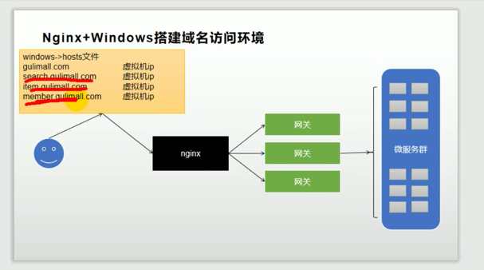
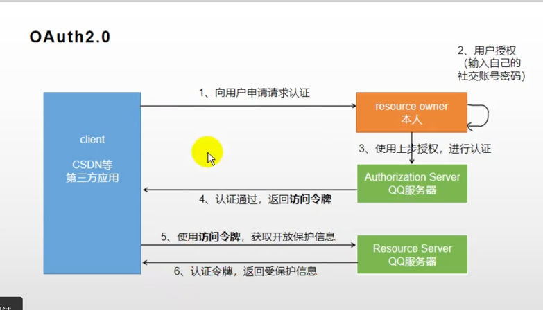
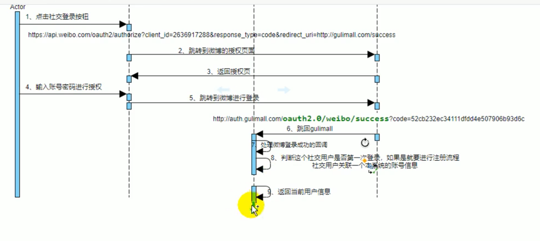
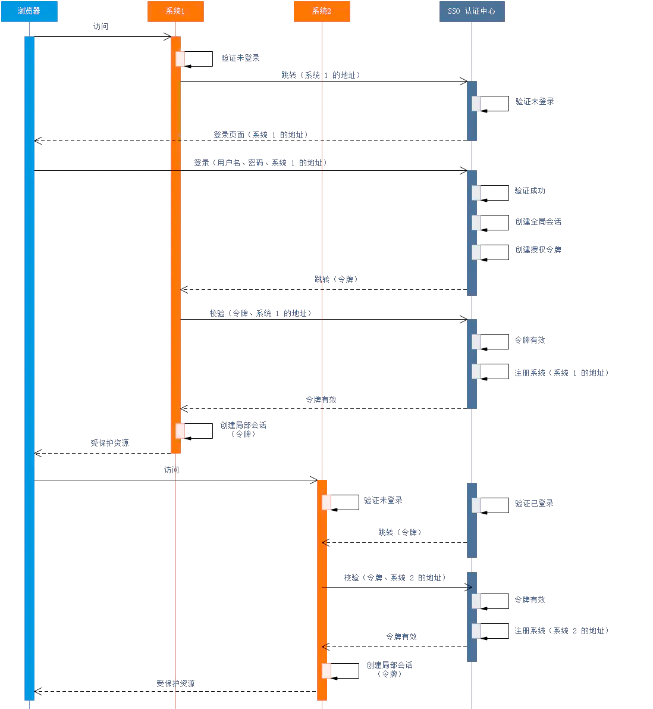

项目描述：
    smart药房是集医药零售、慢病服务、智慧诊疗服务于一体的智慧新零售体系
    承接厂商产品市场推广，为患者提供专业用药以及健康服务。
项目的架构：
    1，使用Spring Cloud技术框架，Nacos作为配置中心和注册中心，SpringCloud Gateway作为业务网关
    2，使用Feign进行微服务之间的相互调用
    3，采用Sentinel组建针对微服务架构下的服务雪崩问题做服务限流、异常熔断、服务降级
    4，采用JWT构建全站用户认证中心
    5，交易中心的下单链路基于分布式事务中间件Seata，保障业务的强一致性
    6，采用ShardingJDBC + MHA + Mysql构建可扩展，高可用数据库集群
    7，采用双层Nginx集群作为流量网关，分发层Nginx负责分发的逻辑和策略，应用层Nginx负责流量转发，提高缓存的命中率
    8，日志存储用的是ELK（ES、kibana、LogStash）
    9，基于ElasticSearch高性能的检索能力构建搜索系统
    10，基于Redis搭建高扩展性、可读写分离、高可用支持海量并发的缓存集群
    11，基于sleuth + zipkin实现服务链路追踪并交给promethrus进行聚合分析，再由grafana进行可视化展示，同时promethrus还会有告警信息发送邮件
    12，基于Kafka做数据采集，Flink做流式计算
    13，采用redis实现分布式锁，解决重复提交的问题
    14，采用oss作图片存储
    15，SpringSession作为分布式Session
    16，使用k8s + Kubesphere进行部署和持续集成
职责描述：
    1，采用Nginx + Redis集群 + JVM堆缓存 + 大数据热点侦测构建支撑亿级流量的多级缓存架构
    2，zookeeper搭建高可用（High Aliavble）HDFS集群
    3，使用nginx实现了负载均衡，提高了访问速度
    4，秒杀


● 参与核心模块需求评审、架构规划以及技术选型
● 系统重构、性能优化、攻克技术难题，构建高可用、高性能、高并发的系统架构
● 参与系统网关、集群、中间件、服务器、数据库、JVM全链路性能调优
● 针对Mysql、Redis、ElasticSearch等存储系统进行性能调优
● 参与实时数据同步中间件的架构设计和开发
● 参与系统灰度发布方案和改造


项目描述：
    RWEBOX是一个临床实验电子数据采集系统/数据管理系统，
    采用电子化病例报告代替纸质病例报告对临床实验数据进行收集和管理，
    真实、准确、及时、规范的数据采集以显著提高临床试验的质量，缩短研究周期，
    目前项目已经在中国、美国、俄罗斯、格鲁吉亚、日本、德国......等多个国家部署
项目的架构：
    1，该项目基于Spring + Spring MVC + Hibernate的框架，
    2，采用Redis做缓存，缓存主页面的数据
    3，使用mysql做存储层，用mycat进行分表
    4，使用Lucene构建字典搜索系统
    5，使用Spring Security + CAS做认证服务
    6，shiy
职责描述：
    1，netty同步数据
    2，jvm调优(jvm指令排查出GC问题，调整jvm配置，降低GC次数)
        举例1：频繁的触发Full GC
            日活用户500万 ---> 付费转化率为10% ---> 日均订单50万 ---> 大促期间每秒1000单 ---> 
            假定每个对象是1kb，还涉及到其他对象，比如优惠券、积分等等，放大20倍。同时还有其他操作，例如订单查询等等，我们再放大10倍，
            那么每秒就会产生300kb*20*10，也就是每秒会产生60兆的对象
            JVM参数: -Xms3G -Xmx3G -Xss1M -XX:MetaspaceSize=512M -XX:MaxMetaspaceSize=512M
            由于老年代和新生代的比例大概为3:1，那么新生代的大小为1G。
            由于Eden：S0：S1的比例为8：1：1，那么Eden的大小为800兆，survivor的大小大概为100M
            问题就来了：
                每秒产生60M的对象，Eden大小为800M，大概14秒就会将Eden区填满。
                当触发Minor GC的时候，会触发STW。所有线程会暂停，
                这时候最后一秒产生的对象在其他地方有可能还会有引用，不是垃圾对象
                这时候就会把这部分对象移到Survivor区
                JVM有个要求：那就是当移动大Survivor区的对象大于Survivor区的50%的时候，会直接移动到老年代
                所以就造成了频繁的触发Full GC
        举例2：
    3，sql优化
    4，并发编程导出数据
    5，对Spring源码进行了扩展


# 视图映射器

# 网关和nginx
nginx进行反向代理，如果我们输入域名rwebox.com，那么会被nginx代理到一个某一个微服务。 也就是我们的patient服务。
这里应该是不正确的，因为在谷粒商城里面的product服务是不需要认证登录的，而在我们的rwebox项目中所有的微服务模块必须认证登录后才能访问
所以这里的访问还是得先经过网关，然后经过网关再转发到对应的微服务

那么具体nginx是怎么转发到网关呢？

比如我们输入一个访问patients的页面，
或者输入一个管理users的页面。
网关里面是如何进行路由的呢？


- id: gulimall_cart_route
  uri: lb://gulimall-cart
  predicates:
  - Host=cart.gulimall.com
    
如上面的配置所示，
我们访问cart.gulimall.com的时候，就会将其转发给我们的gulimall_cart_route微服务
那么cart.gulimall.com是怎么转发给我们的网关呢？


如图所示

我们可能会有多个域名，那么就将域名和ip地址进行一一映射，
那么当我们进行域名的访问的时候就会访问到具体的ip。

重点来了，这里配置的其实是网关的ip地址和端口号
所以我们的，所有域名都会配置到网关的ip地址和端口号
再由网关进行路由转发。


# 认证是怎么做的和网关有关系么？


# 项目分为那几个微服务
rwebox-auth-server
    认证服务
rwebox-common
    公共模块
rwebox-gateway
    网关模块
rwebox-htmlformentry
    htmlformentry操作的模块
rwebox-admin
    后台管理模块
rwebox-core
    核心模块
rwebox-audit-trail
    数据审计模块
rwebox-data-report
    导出数据模块
rwebox-sync
    同步数据
rwebox-search
    搜索疾病模块
rwebox-superset
    数据可视化界面
rwebox-rest
    为app端提供服务


# RWE Box iData项目模块
idata-htmlform
idata-admin


# 我所做的主要业务
1，多级缓存架构设计
2，多线程导出数据，以及设计封装工厂类一键导出excel，pdf
3，netty同步数据
4，自定义注解权限校验
5，消息队列横表转纵表
6，爬取数据，搭建elasticsearch


面试官你好，我叫杨帅，17年毕业于毕业于洛阳理工学院。
之前任职于上海基绪康生物科技有限公司，担任软件开发工程师一职，
在此期间也是从无到有的开发了我们的Rwebox电子病例系统，对线上问题处理、性能调优，相关业务的研发设计流程也十分熟悉。
因此决定面试咱们（一个小心机哈哈～）公司的电商软件研发岗位，希望能获得此次机会，谢谢


5.11 --- 线程 + netty
5.12 --- spring + spring mvc+ mybatis
5.13 --- spring cloud alibaba
5.14 --- reids + mysql + ELK
5.15 --- kafka + rocketmq
5.17 ---  + flink
5.19 --- zookeeper
5.20 --- react


# 分布式环境下的主键生成策略


# 前段页面thymeleaf
我们的每个微服务下面都应该有两个文件夹来存放controller。
一个是web文件夹用来存放我们的web端的controller，也就是结合thymeleaf来进行网页展示
另一个文件夹是app，只返回json字符串来提供接口。

thymeleaf性能不太好，但是如果开启了缓存功能性能是非常好的
1，引入依赖
```xml
<dependency>
    <groupId>org.springframework.boot</groupId>
    <artifactId>spring-boot-starter-thymeleaf</artifactId>
    <version>2.4.5</version>
</dependency>
```
然后就可以在"resources/templates"下面编写html文件了。
thymeleaf默认的前缀就是"resources/templates"这个文件夹。


# OAuth2.0第三方认证


1，社交登陆成功后会返回一个返回一个accessToken存放在user里面。


# 共享session
主要有两个问题
1，多个微服务之间session共享问题
2，子域的session不能被父域的使用，比如auth.gulimall.com所存储的session不能被gulimall.com所使用

多个微服务之间session共享问题，可以用Spring Session来解决

Springsession支持多中数据源存储，这里我们使用redis
1，引入Springsession依赖
```
<dependency>
    <groupId>org.springframework.session</groupId>
    <artifactId>spring-session-data-redis</artifactId>
</dependency>
```
2，设置存储类型为redis
```yml
spring:
  session:
    store-type: redis
```
3，在启动类上加上注解@EnableRedisHttpSession
4，使用
```java
@RestController
public class TestController {

    /**
     * 设置session中的属性值
     */
    @RequestMapping("/set")
    public String set(HttpSession session) {
        session.setAttribute("name", "chy");
        return "已设置name";
    }

    /**
     * 获取session中的属性值
     */
    @GetMapping("/get")
    public String get(HttpSession session) {
        return "name：" + session.getAttribute("name");
    }
    
}
```
这样我们存储的session就放在了redis里面。

怎么解决子域的session父域不能用呢？
我们来使用如下配置，是的每一个微服务都使用相同的Domain
```java
@Configuration
public class GulimallSessionConfig {
    @Bean
    public CookieSerializer cookieSerializer() {
        DefaultCookieSerializer cookieSerializer = new DefaultCookieSerializer();
        cookieSerializer.setDimainName("gulimall.com");
        cookieSerializer.setCookieName("GULISESSION");
        return cookieSerializer;
    }
    
    @Bean
    public RedisSerializer<Object> springSessionDefaultRedisSerializer() {
        return new GenericJackson2JsonRedisSerializer();
    }
}
```
这样就解决了子域session父域不能用的问题。

SpringSession的原理
@EnableRedisHttpSession导入RedisHttpSessionConfiguration配置
两个关键组件
    1，RedisOperationSessionRepository
        主要是redis操作session的增删改查
    2，SessionRepositoryFilter
        在创建的时候就从容器中注入了RedisOperationSessionRepository
        SessionRepositoryFilter是一个滤器，会过滤每一个http请求
        在这里面他会使用装饰者模式重新包装HttpServletRuqest请求和HttpServletResponse请求
        包装之后会调用doFilter应用到后面的整个执行链，那么后续的controller中使用的session.setAttribute()或者session.getAttribute();
        其实调用的就是我们的WrapperHttpServletRuqest和WrapperHttpServletResponse
        在这里面会使用RedisOperationSessionRepository进行增删改操作


# 单点登陆

1，用户访问系统 1 的受保护资源，系统1发现用户未登录，跳转至 sso 认证中心，并将自己的地址作为参数
2，sso 认证中心发现用户未登录，将用户引导至登录页面
3，用户输入用户名密码提交登录申请
4，sso 认证中心校验用户信息，创建授权令牌
5，sso 认证中心带着令牌跳转会最初的请求地址（系统1）
6，系统1拿到令牌，去 sso 认证中心校验令牌是否有效
7，sso 认证中心校验令牌，返回有效，注册系统 1

1，用户访问系统 2 的受保护资源
2，系统2发现用户未登录，跳转至 sso 认证中心，并将自己的地址作为参数
3，sso 认证中心发现用户已登录，跳转回系统 2 的地址，并附上令牌
4，系统 2 拿到令牌，去 sso 认证中心校验令牌是否有效
5，sso 认证中心校验令牌，返回有效，注册系统 2
6，系统 2 使用该令牌创建与用户的局部会话，返回受保护资源
判断用户是否登录主要是可以通过判断session来判断


# 基于MyBatis插件开发SQL日志记录功能
## MyBatis插件介绍
MyBatis⼤家都⽐较熟悉，实际使⽤也⾮常⼴泛，其内部提供了插件扩展机制来拦截SQL的执⾏。
其执⾏原理如下：
    1，SQL执⾏依赖于sqlSession，是MyBatis⼯作的主要顶层API，表⽰和数据库交互的会话，完成必要数据库增删改查功能
    2，API，表⽰和数据库交互的会话，完成必要数据库增删改查功能，
    3，sqlSession⼜依赖Executor执⾏器，执⾏器负责SQL语句的⽣成和查询缓存的维护，
    4，既然是封装了JDBC，SQL构建也是必不可少的，MyBatis封装了StatementHandler，对于参数处理和结果集处理⽤到了ParameterHandler和ResultSetHandler这两个处理器
四大组件说明如下：
    Executor
        MyBatis执⾏器，是MyBatis调度的核⼼，负责SQL语句的⽣成和查询缓存的维护
    StatementHandler
        封装了JDBC Statement操作，负责对JDBCstatement的操作，如设置参数、将Statement结果集转换成List集合。
    ParameterHandler
        负责对⽤户传递的参数转换成JDBC，Statement所需要的参数
    ResultSetHandler
        负责将JDBC返回的ResultSet结果集对象转换成List类型的集合
当然MyBatis的核⼼组件不只有这些，还包括TypeHandler（java和mysql类型转换）等，但是我们的插件主要拦截的是这四⼤组件。
对MyBatis来说插件就是拦截器，⽤来增强核⼼对象的功能，增强功能本质上是借助于底层的动态代理实现的，换句话说，MyBatis中的四⼤对象都是代理对象。

MyBatis所允许拦截的⽅法如下：
    1. 执⾏器Executor (update、query、commit、rollback等⽅法)；
    2. SQL语法构建器StatementHandler (prepare、parameterize、batch、updates query等⽅ 法)；
    3. 参数处理器ParameterHandler (getParameterObject、setParameters⽅法)；
    4. 结果集处理器ResultSetHandler (handleResultSets、handleOutputParameters等⽅法)；
## Mybatis插件原理
在四大对象创建的时候
    1、每个创建出来的对象不是直接返回的，⽽是interceptorChain.pluginAll(parameterHandler);
    2、获取到所有的Interceptor (拦截器)(插件需要实现的接⼝)；调⽤ interceptor.plugin(target);返回target包装后的对象
    3、插件机制，我们可以使⽤插件为⽬标对象创建⼀个代理对象；AOP (⾯向切⾯)我们的插件可以为四⼤对象创建出代理对象，代理对象就可以拦截到四⼤对象的每⼀个⽅法
以ParameterHandler为例，我们看下源码分析⼀下：
```
public ParameterHandler newParameterHandler(MappedStatement mappedStatement, 
    Object object, BoundSql sql, InterceptorChain interceptorChain) {
    ParameterHandler parameterHandler = mappedStatement.getLang().createParameterHandler(mappedStatement,object,sql);
    parameterHandler = (ParameterHandler)
    interceptorChain.pluginAll(parameterHandler);
    return parameterHandler;
}
public Object pluginAll(Object target) {
    for (Interceptor interceptor : interceptors) {
        target = interceptor.plugin(target);
    }
    return target;
}
```
interceptorChain保存了所有的拦截器(interceptors，Interceptor接⼝的所有实现类)，是MyBatis初始化的时候创建的。
调⽤拦截器链中的拦截器依次的对⽬标进⾏拦截或增强。interceptor.plugin(target)中的target就可以理解为MyBatis中的四⼤对象。
返回的target是被层层代理后的对象。
## 基于SpringBoot⾃动装配原理
我们知道⼀个SpringBoot应⽤必须要标注@SpringBootApplication注解，⽽这个注解包含了@EnableAutoConfiguration从⽽启⽤⾃动装配
```java
@Target({ElementType.TYPE}) //注解的适⽤范围,Type表⽰注解可以描述在类、接⼝、注解或枚举中
@Retention(RetentionPolicy.RUNTIME) //表⽰注解的⽣命周期，Runtime运⾏时
@Documented //表⽰注解可以记录在javadoc中
@Inherited //表⽰可以被⼦类继承该注解
@SpringBootConfiguration // 标明该类为配置类
@EnableAutoConfiguration // 启动⾃动配置功能
@ComponentScan(excludeFilters = { @Filter(type = FilterType.CUSTOM, classes = TypeExcludeFilter.class),
@Filter(type = FilterType.CUSTOM, classes =
AutoConfigurationExcludeFilter.class) })
public @interface SpringBootApplication {
    // 根据class来排除特定的类，使其不能加⼊spring容器，传⼊参数value类型是class类型。
    @AliasFor(annotation = EnableAutoConfiguration.class)
    Class<?>[] exclude() default {};
    // 根据classname 来排除特定的类，使其不能加⼊spring容器，传⼊参数value类型是class的全类名字符串数组。
    @AliasFor(annotation = EnableAutoConfiguration.class)
    String[] excludeName() default {};
    // 指定扫描包，参数是包名的字符串数组。
    @AliasFor(annotation = ComponentScan.class, attribute = "basePackages")
    String[] scanBasePackages() default {};
    // 扫描特定的包，参数类似是Class类型数组。
    @AliasFor(annotation = ComponentScan.class, attribute =
    "basePackageClasses")
    Class<?>[] scanBasePackageClasses() default {};
}
```
@EnableAutoConfiguration这个注解⼜把AutoConfigurationImportSelector这个类引⼊到了Spring容器中。
```java
@Target({ElementType.TYPE})
@Retention(RetentionPolicy.RUNTIME)
@Documented
@Inherited
@AutoConfigurationPackage
@Import({AutoConfigurationImportSelector.class})
public @interface EnableAutoConfiguration {
    String ENABLED_OVERRIDE_PROPERTY = "spring.boot.enableautoconfiguration";
    Class<?>[] exclude() default {};
    String[] excludeName() default {};
}
```
AutoConfigurationImportSelector会遍历整个ClassLoader中所有jar包下的⽂件。 
spring.factories⾥⾯保存着springboot的默认提供的⾃动配置类。
```properties
# Initializers
org.springframework.context.ApplicationContextInitializer=\
org.springframework.boot.autoconfigure.SharedMetadataReaderFactoryContextInitializer,\
org.springframework.boot.autoconfigure.logging.ConditionEvaluationReportLoggingListener
# Application Listeners
org.springframework.context.ApplicationListener=\
org.springframework.boot.autoconfigure.BackgroundPreinitializer
# Auto Configuration Import Listeners
org.springframework.boot.autoconfigure.AutoConfigurationImportListener=\
org.springframework.boot.autoconfigure.condition.ConditionEvaluationReportAutoConfigurationImportListener
# Auto Configuration Import Filters
org.springframework.boot.autoconfigure.AutoConfigurationImportFilter=\
org.springframework.boot.autoconfigure.condition.OnBeanCondition,\
org.springframework.boot.autoconfigure.condition.OnClassCondition,\
org.springframework.boot.autoconfigure.condition.OnWebApplicationCondition
# Auto Configure
org.springframework.boot.autoconfigure.EnableAutoConfiguration=\
org.springframework.boot.autoconfigure.admin.SpringApplicationAdminJmxAutoConfiguration,\
org.springframework.boot.autoconfigure.aop.AopAutoConfiguration,\
org.springframework.boot.autoconfigure.amqp.RabbitAutoConfiguration,
```
SpringApplication.run()被调⽤的时候就会读取到主类上的注解，从⽽加载⾃动配置类。
**这属于SPI机制的实现，SPI全称为 Service Provider Interface，是⼀种服务发现机制。它通过在ClassPath路径下的META-INF⽂
件夹查找⽂件，⾃动加载⽂件⾥所定义的类。除了SpringBoot，在很多框架中都有使⽤，⽐如Tomcat、Dubbo（按需加载）等。**

## Loghelper⽇志拦截器实现
### 插件实现
我们要拦截SQL只需要在Executor执⾏器运⾏的时候进⾏拦截即可。其中可以拦截的包括update、query、commit、rollback等⽅法，对
于增删改的情况只需要拦截update()⽅法。拦截器需要实现Interceptor接⼝，具体实现如下
```
/**
 * SQL⽇志拦截器
 * @Author asong
 * @Date 2021/8/25
 */
@Intercepts({ @Signature(type = Executor.class,
        method = "update",
        args = { MappedStatement.class, Object.class }) })
public class SqloperationInterceptor implements Interceptor {
    @Override
    public Object intercept(Invocation invocation) throws Throwable {
        logger.debug(" ⽤户操作记录开始...");
        // 获取拦截参数
        MappedStatement mappedStatement = (MappedStatement) invocation.getArgs()[0];
        BoundSql boundSql = mappedStatement.getBoundSql(invocation.getArgs()[1]);
        Configuration configuration = mappedStatement.getConfiguration();
        ...
```
在这⾥使⽤@Intercepts注解指明要拦截的Executor组件，指明拦截的update()⽅法，在intercept()⽅法中可以获取
到MappedStatement 相关的参数，封装了增删改查等SQL内容。⾄于SQL的解析过程这⾥就不多说了，涉及到MyBatis对SQL的封装和字符串的处理。
### 可扩展服务
⽇志记录这种功能是通⽤的，我们除了单独抽取成独⽴模块之外，对于记录的⽇志信息和记录的操作也应该抽取出来⽅便后期的扩展。
⽇志信息包括⽤户的信息及SQL的信息。⽤户的信息包括⽤户ID（唯⼀）、⽤户IP地址，SQL的信息包括SQL语句、操作类型（增删改）、操作的表。
```sql
CREATE TABLE `sql_operation_log` (
  `log_id` bigint(20) NOT NULL AUTO_INCREMENT COMMENT '主键',
  `user_id` varchar(255) COLLATE utf8mb4_bin DEFAULT NULL COMMENT '⽤户唯⼀标识',
  `ip_addr` varchar(30) COLLATE utf8mb4_bin DEFAULT NULL COMMENT 'ip地址',
  `log_type` tinyint(1) DEFAULT NULL COMMENT '⽇志类型  0 Insert 1 Update 2 Delete',
  `sql_log` varchar(255) COLLATE utf8mb4_bin DEFAULT NULL COMMENT 'SQL',
  `table_name` varchar(255) COLLATE utf8mb4_bin DEFAULT NULL COMMENT '表名',
  `oper_time` datetime DEFAULT NULL COMMENT '操作时间',
  PRIMARY KEY (`log_id`)
) ENGINE=InnoDB AUTO_INCREMENT=9 DEFAULT CHARSET=utf8mb4 COLLATE=utf8mb4_bin;
```
以在拦截的时候⾸先获取⽤户的信息，然后封装Log，最后调⽤⽇志服务进⾏保存
```
...
SqlOperationLog sqlLog = new SqlOperationLog();
// 获取当前⽤户
OperUser operUser = operUserService.getOperUser();
sqlLog.setUserId(operUser.getUserId());
sqlLog.setIpAddr(operUser.getIpAddr());
...
if(isRecorded(tableName)) {
     logger.info("  插⼊SQL⽇志 ---> {}", sqlLog);
      // 调⽤⽇志服务
     logService.save(sqlLog);
}
```
对于⽤户服务（OperUserService）和⽇志服务（LogService）抽取为接⼝，框架提供默认实现，需要后期开发者可以⾃⾏实现。⽤户服
务即获取⽤户相关信息，⽇志服务即如何保存Log⽇志（默认写⼊MySQL，如果写MQ则需要开发者实现接⼝）。
### 自动装配
我们想使⽤SpringBoot去⾃动装配的话就需要在 META/INF/spring.factories 这个⽂件写⼊⾃动配置类。
```properties
org.springframework.boot.autoconfigure.EnableAutoConfiguration=\
com.csdn.loghelper.config.LoghelperAutoConfiguration
```
LoghelperAutoConfiguration⾃动配置的⽬的也很简单，注⼊所需要的Bean即可。从开发者⾓度讲，这个装配是可以通过注解或者yml
配置进⾏选择启⽤的，所以这⾥我们再引⼊⼀个注解：@EnableLoghelper。使⽤时只需要在启动类加上这个注解就可以了
那么框架我们应该如何设计呢？
先创建注解，这个注解的作⽤就是引⼊LoghelperMarker作为开启的标志
```java
/**
 * 标记该注解则启⽤
 * @Author asong
 * @Date 2021/9/14
 */
@Target({ElementType.TYPE})
@Retention(RetentionPolicy.RUNTIME)
// 引⼊标记类
@Import({LoghelperMarker.class})
@ComponentScan("com.csdn.loghelper")
public @interface EnableLoghelper {
}
```
之后是我们的⾃动装配类。只有在使⽤了@EnableLoghelper注解之后才会引⼊LoghelperMarker这个标记类，从⽽使拦截器⽣效。
```java
/**
 * ⾃动装配类
 * @Author asong
 * @Date 2021/9/14
 */
@Configuration
// 根据条件配置引⼊LoghelperMarker则⽣效
@ConditionalOnBean(LoghelperMarker.class)
public class LoghelperAutoConfiguration {
    @Autowired
    private DataSource dataSource;
    @Autowired
    private OperUserService operUserService;
    @Autowired
    private LogService logService;
    @Autowired
    private LoghelperConfig loghelperConfig;
    @Bean
    public DefaultOperUserServiceImpl operUserService() {
        return new DefaultOperUserServiceImpl();
    }
    @Bean
    public DefaultLogServiceImpl logService() {
        return new DefaultLogServiceImpl(dataSource);
    }
    @Bean
    public LoghelperConfig loghelperConfig() {
        return new LoghelperConfig();
    }
    @Bean
    public SqloperationInterceptor sqloperationInterceptor() {
        return new SqloperationInterceptor(operUserService, logService, loghelperConfig);
    }
}
```
⾄此，整个SQL⽇志记录的功能已经完成并且实现了可插拔。在使⽤的时候引⼊pom坐标和@EnableLoghelper注解即可开启。对于⽇志
的记录，上层开发者根据业务需要可以实现接⼝并注⼊